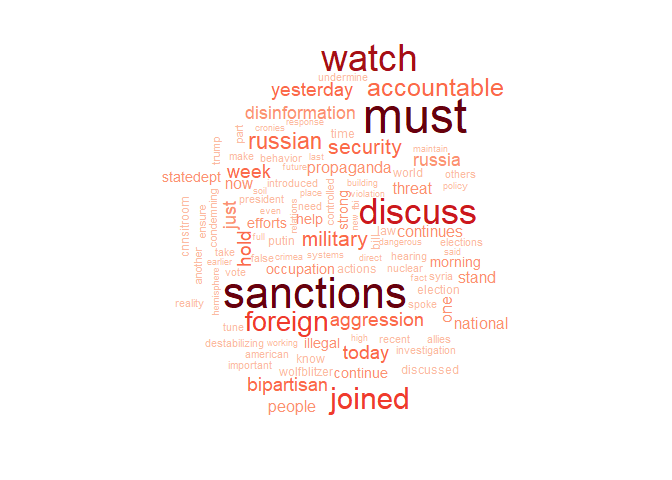
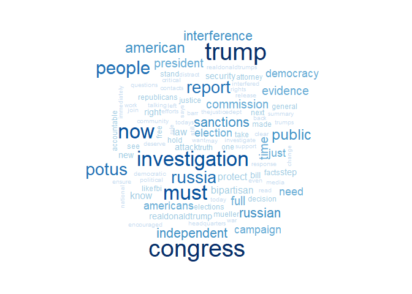
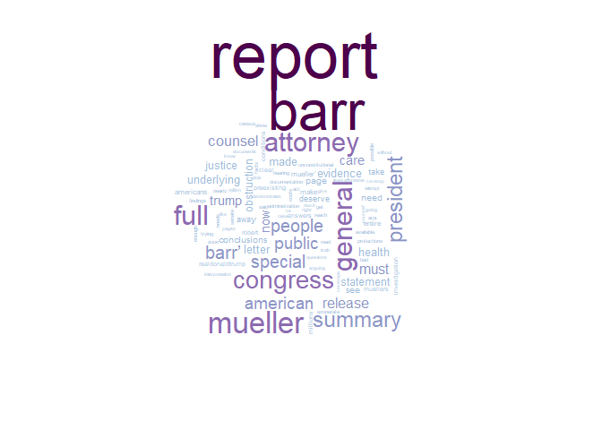
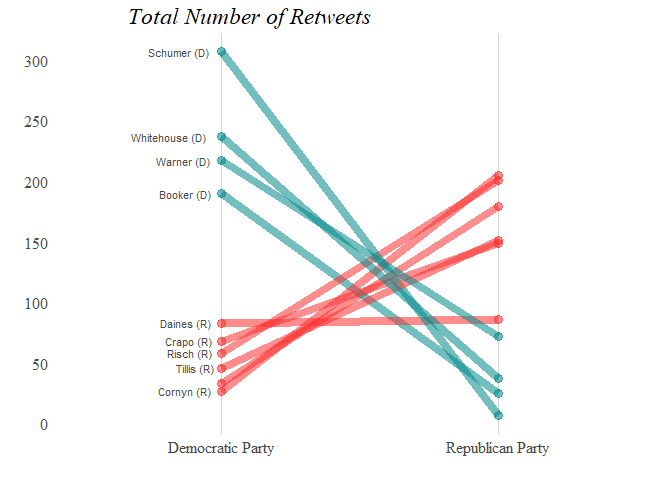
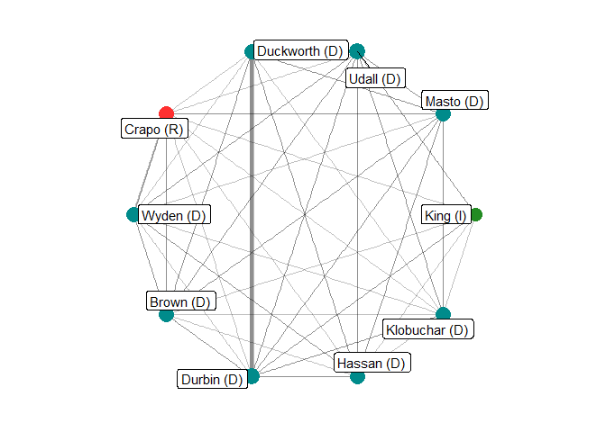

#### 1. Who follows whom?

##### a) Network of Followers

To better examine the large network of senators, I decided to only graph those senators who were the most followed, and those senators following the most people.


```r
## preparing netowork data
colnames(senate)[colnames(senate)=="Official Twitter"] <- "name"
colnames(senate)[colnames(senate)=="Party affiliation"] <- "party"
senate$name <- tolower(senate$name)
senate = senate %>% select(name, Senator, label, State, party)

follow$source <- tolower(follow$source)
follow$target <- tolower(follow$target)

## Identify the three senators who are followed by the most of their colleagues (i.e. the highest "in-degree") and the three senators who follow the most of their colleagues (i.e. the highest "out-degree").
```


```r
## graphing both networks
following_count <- follow %>% 
  filter(following==TRUE) %>%
  group_by(source) %>%
  mutate(flag=1) %>%
  mutate(followingnum = n()) %>%
  ungroup()

tidyf <- tbl_graph(nodes = senate, edges = following_count, directed = TRUE)
indeg <- igraph::degree(tidyf, mode = "in")
outdeg <- igraph::degree(tidyf, mode = "out")

senate$indeg <- indeg
senate$outdeg <- outdeg

in3 <- senate %>%
  arrange(desc(indeg)) %>%
  mutate(rank=row_number()) %>%
  filter(rank<4)

follower_count <- follow %>% 
  filter(following==TRUE) %>%
  mutate(flag=1) %>%
  group_by(source) %>% 
  mutate(followernum = sum(flag)) %>%
  ungroup()

#colnames(follower_count)[colnames(follower_count)=="target"] <- "source1"
#colnames(follower_count)[colnames(follower_count)=="source"] <- "target1"
follower_count <- left_join(follower_count, senate, by = c("source" = "name"))

out3 <- senate %>%
  arrange(desc(outdeg)) %>%
  mutate(rank=row_number()) %>%
  filter(rank<4)

following_count <- left_join(following_count, senate, by = c("source" = "name"))
```

By calculating the network's in and out degree, it appears that the three senators who have the highest in-degree (ie are followed by most of their colleauges) are senators John Kennedy, Maria Cantwell, and Sherrod Brown:


```r
in3
```

```
## # A tibble: 3 x 8
##   name        Senator      label     State   party       indeg outdeg  rank
##   <chr>       <chr>        <chr>     <chr>   <chr>       <dbl>  <dbl> <int>
## 1 senjohnken~ Kennedy, Jo~ Kennedy ~ Louisi~ Republican~    95     47     1
## 2 senatorcan~ Cantwell, M~ Cantwell~ Washin~ Democratic~    95     59     2
## 3 sensherrod~ Brown, Sher~ Brown (D) Ohio    Democratic~    94     63     3
```

Likewise, the three senators with the highest out-degree (ie are following most of their colleagues) are senators Richard Shelby, Susan Collings, and Lisa Murkowski:


```r
out3
```

```
## # A tibble: 3 x 8
##   name        Senator      label      State  party       indeg outdeg  rank
##   <chr>       <chr>        <chr>      <chr>  <chr>       <dbl>  <dbl> <int>
## 1 senshelby   Shelby, Ric~ Shelby (R) Alaba~ Republican~    63    119     1
## 2 senatorcol~ Collins, Su~ Collins (~ Maine  Republican~    88     85     2
## 3 lisamurkow~ Murkowski, ~ Murkowski~ Alaska Republican~    81     78     3
```


```r
## network graph for in degree(most followers)
follower3 <- select(follower_count, source, target)
follower3in <- follower3 %>%
  filter(target=="senjohnkennedy" | target=="senatorcantwell" | target=="sensherrodbrown")
senate_lab_in <- left_join(senate, in3, by = "name")
tidyfollowers <- tbl_graph(nodes = senate_lab_in, edges = follower3in, directed = TRUE)

## network graph for out degree(most following)
following3 <- select(following_count, source, target)
following3out <- following3 %>%
  filter(source=="senshelby" | source=="senatorcollins" | source=="lisamurkowski")
senate_lab_out <- left_join(senate, out3, by = "name")
tidyfollowing <- tbl_graph(nodes = senate_lab_out, edges = following3out, directed = TRUE)
```

Next I plotted the network for the top three senators with the highest in degree, or the senators with the most followers:


```r
ggraph(tidyfollowers, layout = 'linear') + 
  geom_node_point(aes(color=party.x, size=outdeg), show.legend = FALSE) +
  geom_edge_arc(arrow = arrow(length = unit(1, 'mm')), start_cap = circle(3, 'mm'),
                   end_cap = circle(3, 'mm'), alpha = 0.25) + 
  scale_color_manual(values=c("darkcyan", "forestgreen", "firebrick1")) +
  coord_fixed() +
  geom_node_label(aes(label=label.y), repel=TRUE) +
  theme_void()
```

<!-- -->

Due to the large nature of the dataset, the resulting graph is somewhat difficult to interpret. However, it does appear that are some gaps where nodes do not have any edges, indicating senators who do not follow Kennedy, Brown, or Cantwell. The points of the network are also sized according to highest out degree, indicating those senators that follow most of their colleagues.

Finally, I plotted the network for the three senators with the highest out degree, or senators who follow the most senators:


```r
ggraph(tidyfollowing, layout = 'linear') + 
  geom_node_point(aes(color=party.x, size=indeg), show.legend = FALSE) +
  geom_edge_arc(arrow = arrow(length = unit(1, 'mm')), start_cap = circle(3, 'mm'),
                   end_cap = circle(3, 'mm'), alpha = 0.25) + 
  scale_color_manual(values=c("darkcyan", "forestgreen", "firebrick1")) +
  coord_fixed() +
  geom_node_label(aes(label=label.y), repel=TRUE) +
  theme_void()
```

<!-- -->

Again, since the dataset is very large it is difficult to identify any trends about exactly who is following the top 3 most followed senators. However the graph does show that a cluster of Independents who are not followeed by Republican senators Shelby, Murkowski, and Collins. The points for these Independent senators are fairly small as well, indicating a smaller in degree (ie fewer senators overall who follow them).


##### b) Communities


```r
## Now let's see whether party identification is also recovered by an automated mechanism of cluster identification. Use the  cluster_walktrap command in the igraph package to find densely connected subgraphs.
wc <- cluster_walktrap(tidyf)
senate$community <- membership(wc)

##Based on the results, visualize how well this automated community detection mechanism recovers the party affiliation of senators. This visualization need not be a network graph. Comment briefly.
c_senate <- senate %>%
  group_by(party, community) %>%
  summarize(count = n()) %>%
  ungroup()
x <- data.frame("party" = c("Democratic Party", "Republican Party", "Republican Party", "Independent", "Independent"), "community" = c("1", "2", "3", "1", "3"), "count" = 0:0)

c_senate <- rbind(c_senate, x)
c_senate$community <- as.factor(c_senate$community)
```

Using the cluster walktrap commuand, I decided to visualize the distribution of members from each party within the communities that the algorithm found. Since the algorithm only found this communities, I decided to show this distribution in a bar graph.


```r
bar_2 <- ggplot(c_senate, aes(fill=party, y=count, x=reorder(community, count))) +
  geom_bar(aes(color=party), position="dodge", stat="identity") +
  scale_color_manual(values=c("darkcyan", "forestgreen", "firebrick1")) +
  scale_fill_manual(values = c("darkcyan", "forestgreen", "firebrick1")) +
  theme_tufte() +
  coord_flip() +
  labs(x="", y="", title = "Number of Community Members by Party") +
  theme(legend.position = "above", 
        axis.text.y = element_text(color="gray29", size=12), 
        axis.text.x = element_text(color="gray29", size=12), 
        plot.title = element_text(size=17, face="italic", hjust=.2, vjust = 1), 
        panel.grid.major.x = element_line(color = "lightgrey"), 
        axis.ticks = element_blank())

bar_2
```

<!-- -->

Plotting the number of community members by party (red for Republican, blue for Democratic, and green for Independent), shows that the algorithm did a fairly good job of finding communities as all Republicans are in community number 1, almost all Democrats are in community number 2, and all independents are in community number 3.


#### 2. What are they tweeting about?

##### a) Most Common Topics over Time

After removing all retweets, I aggregated all of the senators' tweets to the top 10 most popularly used hashtags.


```r
## Remove all tweets that are re-tweets (is_retweet) and identify which topics the senators tweet about. Rather than a full text analysis, just use the variable hashtags and identify the most common hashtags over time. Provide a visual summary.
nort <- senator_tweets %>%
  filter(is_retweet == "FALSE") %>%
  unnest(hashtags, .drop = NA, .id = NULL, .sep = NULL, .preserve = NULL) %>%
  filter(hashtags!="NA") %>%
  mutate(flag=1)

hash <- nort %>%
  group_by(hashtags) %>%
  mutate(count = sum(flag)) %>%
  ungroup() %>%
  group_by(hashtags, count) %>%
  summarize() %>%
  ungroup() %>%
  arrange(desc(count)) %>%
  mutate(rank=row_number()) %>%
  filter(rank<11)
```

Next I decided to visualize the most common topics through a ranked bar graph:


```r
## graphing most common hastags
bar_1 <- ggplot(hash, aes(y=count, x=reorder(hashtags, count))) +
  geom_bar(stat="identity") +
  theme_tufte() +
  coord_flip() +
  labs(x="", y="", title = "Percentage of Successful Projects by Category") +
  theme(legend.position = "above", 
        axis.text.y = element_text(color="gray29", size=12), 
        axis.text.x = element_text(color="gray29", size=12), 
        plot.title = element_text(size=17, face="italic", hjust=.2, vjust = 1), 
        panel.grid.major.x = element_line(color = "lightgrey"), 
        axis.ticks = element_blank())

bar_1
```

<!-- -->

The bargraph shows that "Obamacare" was the most frequently used hastag among all senators. Interestingly, the hastags "TaxReform" and "NetNeutrality" also appear to be very frequent, which may suggest that these have been popular issues among citizens.


##### b) Russia investigation - Dems vs. Reps


```r
## Try to identify a set of 5-10 hashtags that signal support for Robert Muellers work (e.g. #MuellerInvestigation, #MuellerReport, #MuellerIfYoureListening, #RobertMueller) while other expressed a critical sentiment towards the investigation (e.g. #WitchHunt, #fakenews, #NoCollusion)

## keeping only tweets that have the following hashtags
support <- nort %>%
  mutate(lowerhash = tolower(hashtags)) %>%
  filter(lowerhash == "muellerinvestigation" | lowerhash == "probe" | lowerhash == "investigation" | lowerhash == "muellerreport" | lowerhash == "muellerifyourelistening" | lowerhash == "robertmueller" | lowerhash == "muellerteam"  | lowerhash == "fbi" | lowerhash == "russia" | lowerhash == "collusion" | lowerhash == "mueller" | lowerhash == "witchhunt" | lowerhash == "nocollusion" | lowerhash == "fakenews" ) %>%
  group_by(status_id, text) %>%
  summarize() %>%
  ungroup() %>%
  mutate(doc_id=row_number())
```

To identify tweets related to the Robert Mueller, I first filtered through the database for popular hastags like "muellerinvestigation", "probe", "nocollusion", etc.


```r
## creating and cleaning the corpus
support2 <- select(support, "doc_id", "text")
support2$doc_id <- as.character(support$doc_id)

s_source <- DataframeSource(support2)
s_corpus <- VCorpus(s_source)

removeURL <- function(x) gsub('http[[:alnum:]]*', '', x)
removeHASH <- function(x) gsub('#[[:alnum:]]*', '', x)
removeother2 <- function(x) gsub('-', ' ', x)

clean_corpus <- function(corpus){
  corpus <- tm_map(corpus, content_transformer(tolower))
  corpus <- tm_map(corpus, content_transformer(removeHASH))
  corpus <- tm_map(corpus, content_transformer(replace_abbreviation))
  corpus <- tm_map(corpus, content_transformer(replace_symbol))
  corpus <- tm_map(corpus, removePunctuation)
  corpus <- tm_map(corpus, removeNumbers)
  corpus <- tm_map(corpus, content_transformer(removeURL))
  corpus <- tm_map(corpus, content_transformer(removeother2))
  corpus <- tm_map(corpus, removeWords, c("and", "s", "also", "too", "can", "number", "amp", stopwords("en")))
  corpus <- tm_map(corpus, stripWhitespace)
  return(corpus)
}

s_clean <- clean_corpus(s_corpus)

## stemming the corpus
s_stemmed <- tm_map(s_clean, stemDocument)

stemCompletion2 <- function(x, dictionary) {
 x <- unlist(strsplit(as.character(x), " "))
 x <- x[x != ""]
 x <- stemCompletion(x, dictionary=dictionary)
 x <- paste(x, sep="", collapse=" ")
 PlainTextDocument(stripWhitespace(x))
}

s_comp <- lapply(s_clean, stemCompletion2, 
                     dictionary=s_clean)
s_comp <- as.VCorpus(s_comp)

## tidying up
names(s_comp) <- c(1:length(s_comp))

s_dtm <- DocumentTermMatrix(s_comp)  
s_m <- as.matrix(s_dtm)
s_td <- tidy(s_dtm)
```

Next I cleaned a stemmed the corpus of Mueller-related tweets, and seperated them by political party.


```r
## joining the meta data with the word counts
support$doc_id <- as.character(support$doc_id)
words <- left_join(s_td, support, by = c("document" = "doc_id"))
words <- left_join(words, senator_tweets, by = "status_id")
words$name <- tolower(words$screen_name)
words <- left_join(words, senate, by = "name")

## show whether and how senators from different parties talk differently about the issue of the special counsel investigation.
repub <- words %>%
  filter(party=="Republican Party") %>%
  group_by(term) %>%
  summarize(total = sum(count)) %>%
  mutate(allwords = sum(total)) %>%
  mutate(percent = (total/allwords)*100) %>%
  arrange(desc(percent))

dem <- words %>%
  filter(party=="Democratic Party") %>%
  group_by(term) %>%
  summarize(total = sum(count)) %>%
  mutate(allwords = sum(total)) %>%
  mutate(percent = (total/allwords)*100) %>%
  arrange(desc(percent))
```

First I plotted a wordcloud showing the top 100 most frequent words used by Republican senators:


```r
set.seed(1)
red <- brewer.pal(9, "Reds")
red<- red[-(1:1)]

wordcloud(repub$term, repub$total, 
         max.words = 100, scale=c(3,.1), colors = red)
```

<!-- -->

The cloud shows that tweets containing hashtags related to Mueller and Russia frequently contained words like "santions", "watch", "discuss", and "accountable".

Next I plotted a seperate wordcloud for Democrats:


```r
set.seed(13)
blue <- brewer.pal(9, "Blues")
blue <- blue[-(1:1)]

wordcloud(dem$term, dem$total, 
         max.words = 100, scale=c(2.5,.1), colors = blue)
```

<!-- -->

This cloud shows that in contrast to Republicans, Democratic senators' tweeters primarily mentioned words like "congress", "trump", "potus", and "people".


##### c) Russia investigation - Barr report


```r
## subsetting data to only include tweets that mention "barr" on or after march 24 when the report was released
b <- grep("Barr", senator_tweets$text)
barr <- senator_tweets[b,]
barr <- barr %>% 
  filter(is_retweet=="FALSE") %>%
  filter(created_at>= '2019-03-24 00:00:00') %>%
  mutate(doc_id=row_number())
```

To visualize senator response to the Barr report, I first isolated all tweets containing the word Barr, and that also occured after the release of the report on March 24th, 2019.


```r
## creating the corpus 
barr2 <- select(barr, "doc_id", "text")
barr2$doc_id <- as.character(barr2$doc_id)

barr_source <- DataframeSource(barr2)
barr_corpus <- VCorpus(barr_source)

barr_clean <- clean_corpus(barr_corpus)

## stemming the corpus
barr_stemmed <- tm_map(barr_clean, stemDocument)

barr_comp <- lapply(barr_clean, stemCompletion2, 
                     dictionary=barr_clean)
barr_comp <- as.VCorpus(barr_comp)

## tidying up
names(barr_comp) <- c(1:length(barr_comp))

barr_dtm <- DocumentTermMatrix(barr_comp)  
barr_m <- as.matrix(barr_dtm)
barr_td <- tidy(barr_dtm)
```

Next I created a wordcloud of the top 100 most used words for these tweets.


```r
## Provide some visualization of how senators responded to the event in their Twitter communication.
barr$doc_id <- as.character(barr$doc_id)
barr_words <- left_join(barr_td, barr, by = c("document" = "doc_id"))

barr_most <- barr_words %>%
  group_by(term) %>%
  summarize(total = sum(count)) %>%
  mutate(allwords = sum(total)) %>%
  mutate(percent = (total/allwords)*100) %>%
  arrange(desc(percent))

set.seed(1)
purple<- brewer.pal(9, "BuPu")
purple<- purple[-(1:3)]

wordcloud(barr_most$term, barr_most$total, 
         max.words = 100, scale=c(4.5,.1), colors = purple)
```

<!-- -->

The cloud shows that aside from obvious words like "barr" and "report", words like "full", "mueller", "congress", and "attorney" appeared frequently in senator's tweets.


#### 3) Are you talking to me?

##### a) Identifying Re-Tweets

To visualize the number of retweets used by different senators, I aggregated the data by the number of retweets used by party for each senator.


```r
## Select the set of re-tweeted messages from other senators and identify the source of the originating message. Calculate by senator the amount of re-tweets they received and from which party these re-tweets came.
rt <- senator_tweets %>%
  filter(is_retweet=="TRUE") %>%
  select(status_id, screen_name, mentions_screen_name) %>%
  unnest(mentions_screen_name)

rt$screen_name <- tolower(rt$screen_name)
rt$mentions_screen_name <- tolower(rt$mentions_screen_name)

rt_count <- rt %>%
  mutate(flag=1) %>%
  group_by(screen_name, mentions_screen_name) %>%
  mutate(count = sum(flag)) %>%
  ungroup() %>%
  group_by(screen_name, mentions_screen_name, count) %>%
  summarize() %>%
  ungroup() %>%
  mutate(loop = ifelse(screen_name==mentions_screen_name,1,0)) %>% ## removing any self-tweets
  filter(loop==0)

## rt_party is basically an edgelist for rts
rt_party <- left_join(rt_count, senate, by = c("screen_name" = "name"))
colnames(rt_party)[colnames(rt_party)=="party"] <- "original_party"
rt_party = rt_party %>% select(screen_name, label, mentions_screen_name, original_party, count)
rt_party <- left_join(rt_party, senate, by = c("mentions_screen_name" = "name"))
rt_party <- na.omit(rt_party)
colnames(rt_party)[colnames(rt_party)=="party"] <- "mention_party"
rt_party = rt_party %>% select(screen_name, label.x, mentions_screen_name, original_party, mention_party, count)
```

[As a side note: I've never used Twitter so I'm not 100% sure what a retweet is, but I hope I did this correctly!]


```r
rt_partonly <- rt_party %>%
  group_by(screen_name, mention_party) %>%
  mutate(sum = sum(count)) %>%
  ungroup() %>%
  group_by(screen_name, label.x, original_party, mention_party, sum) %>%
  summarize() %>%
  ungroup() %>%
  group_by(screen_name) %>%
  mutate(total=sum(sum)) %>%
  ungroup() %>%
  filter(mention_party!="Independent")

## top 5 retweeters
top5retweeters <- rt_partonly %>%
  group_by(screen_name, total) %>%
  summarize() %>%
  ungroup() %>%
  arrange(desc(total)) %>%
  mutate(rank=row_number()) %>%
  filter(rank<11)

final_rt <- left_join(rt_partonly, top5retweeters, by = "screen_name")
final_rt <- na.omit(final_rt)
```

In order to better visualize the data, I decided to only include the 10 senators who used retweets the most. These turned out to be Schumer, Whitehouse, Warner, Booker, Daines, Crapo, Risch, Tillis, and Cornyn.


```r
slopegraph_rt <- ggplot(final_rt, aes(mention_party, sum, group=label.x)) +
  geom_line(aes(color=ifelse(final_rt$original_party=="Republican Party", "repub", ""), alpha=1), size = 3) +
  geom_point(aes(color=ifelse(final_rt$original_party=="Republican Party", "repub", ""), alpha=1), size = 3) +
  geom_text(data = final_rt %>% filter(mention_party=="Democratic Party"), 
            aes(label = paste0(label.x)),
            hjust = 1.2,
            color = "gray29",
            size = 3,
            check_overlap = TRUE) +
  scale_color_manual(values=c("darkcyan", "firebrick1")) +
  scale_x_discrete(limits=c("Democratic Party", "Republican Party")) +
  scale_y_continuous(breaks=seq(0, 350, 50)) +
  theme_tufte() +
  labs(x="", y="", title = "Total Number of Retweets") +
  theme(legend.position = "none", 
        axis.text.y = element_text(color="gray29", size=12), 
        axis.text.x = element_text(color="gray29", size=12), 
        plot.title = element_text(size=17, face="italic", hjust=.2, vjust = 1), 
        panel.grid.major.x = element_line(color = "lightgrey"), 
        axis.ticks = element_blank())

slopegraph_rt
```

<!-- -->

The slope graph shows (rather unsurprisingly) that the top 10 retweet senators tend to use retweets from members of their own party, and rarely use retweets taken from senators across the aisle. The exception to this rule may be Republican Steve Daines, who appears to use retweets from both Democratic and Republican senators evenly.


##### b) Identifying Mentions


```r
## Identify the tweets in which one senator mentions another senator directly (the variable is mentions_screen_name). For this example, please remove simple re-tweets (is_retweet == FALSE). Calculate who re-tweets whom among the senate members. Convert the information to an undirected graph object in which the number of mentions is the strength of the relationship between senators.

rt2 <- senator_tweets %>%
  filter(is_retweet=="FALSE") %>%
  select(status_id, screen_name, mentions_screen_name) %>%
  unnest(mentions_screen_name)

rt2$screen_name <- tolower(rt2$screen_name)
rt2$mentions_screen_name <- tolower(rt2$mentions_screen_name)

rt2_count <- rt2 %>%
  mutate(flag=1) %>%
  group_by(screen_name, mentions_screen_name) %>%
  mutate(count = sum(flag)) %>%
  ungroup() %>%
  group_by(screen_name, mentions_screen_name, count) %>%
  summarize() %>%
  ungroup() %>%
  mutate(loop = ifelse(screen_name==mentions_screen_name,1,0)) %>% ## removing any self-tweets
  filter(loop==0)

## mention_party is basically an edgelist for rts
mention_party <- left_join(rt2_count, senate, by = c("screen_name" = "name"))
colnames(mention_party)[colnames(mention_party)=="party"] <- "original_party"
mention_party = mention_party %>% select(screen_name, label, mentions_screen_name, original_party, count)
mention_party <- left_join(mention_party, senate, by = c("mentions_screen_name" = "name"))
mention_party <- na.omit(mention_party)
colnames(mention_party)[colnames(mention_party)=="party"] <- "mention_party"
mention_party = mention_party %>% select(screen_name, label.x, mentions_screen_name, original_party, mention_party, count)
```

To avoid creating an enormous graph with a large number of edges, I decided to limit my visualization to only include the top 10 senators who mentioned other senators the most. I also made sure to eliminate loops where senators referenced themselves.


```r
## Visualize the network graph using the party identification of the senators as a group variable (use blue for Democrats and red for Republicans) and some graph centrality measure to size the nodes. Comment on what you can see from the visualization.
mention_edge <- mention_party %>% select(screen_name, mentions_screen_name, count)
mentionmost <- mention_edge %>%
  group_by(screen_name) %>%
  summarize(total = sum(count)) %>%
  ungroup() %>%
  arrange(desc(total)) %>%
  mutate(rank=row_number()) %>%
  filter(rank<11)

## taking a sample of the network that only includes the top 10 senators who use mentions the most
mention_node <- left_join(mentionmost, senate, by = c("screen_name"="name"))
mention_edge <- left_join(mention_edge, mentionmost, by = "screen_name")
mention_edge <- left_join(mention_edge, mentionmost, by = c("mentions_screen_name"="screen_name"))
mention_edge <- na.omit(mention_edge)

tidymen <- tbl_graph(nodes = mention_node, edges = mention_edge, directed = FALSE)
```

In addition to wieghting the thickness of the edge lines to the number of mentions between the source and target senators, I also added a variable calculating the degree of in centrality for each senator node.


```r
V(tidymen)$indegree <- degree(tidymen, mode = "in")

ggraph(tidymen, layout = 'linear', circular = TRUE) +
  geom_edge_link(aes(width = count), alpha = 0.25) +
  scale_edge_width(range = c(0.2, 2)) +
  geom_node_point(aes(color=party, size=indegree)) +
  coord_fixed() +
  scale_size_area(trans="sqrt") +
  theme_graph() +
  geom_node_label(aes(label=label), repel=TRUE) +
  scale_color_manual(values=c("Republican Party" = "firebrick1", "Independent" = "forestgreen", "Democratic Party" = "darkcyan")) +
  theme(legend.position="none")
```

<!-- -->

The resulting graph shows that senators Duckworth and Durbin mention each other frequently. The in degree also does not have a wide range, as this is a small sample of the larger network and most of the senators pictured follow each other.

