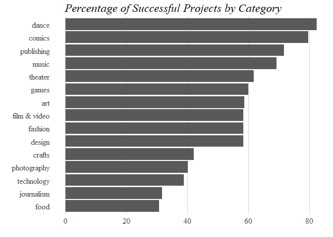
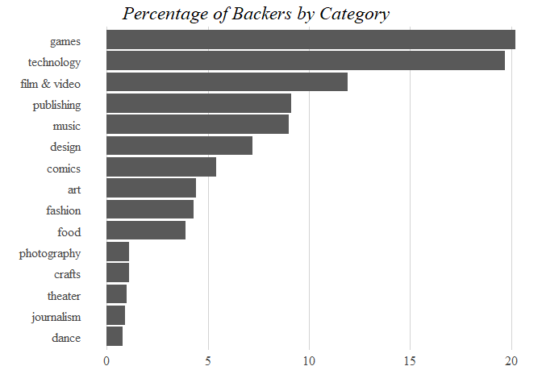

This project started as a homework assignment for my data visualization course. I didn't get as a high a grade as I wanted, so I decided to re-work my some of my visulization!


```r
kickstarter <- read.csv(file.choose())
```


```r
head(kickstarter)
```

<div data-pagedtable="false">
  <script data-pagedtable-source type="application/json">
{"columns":[{"label":[""],"name":["_rn_"],"type":[""],"align":["left"]},{"label":["backers_count"],"name":[1],"type":["int"],"align":["right"]},{"label":["blurb"],"name":[2],"type":["fctr"],"align":["left"]},{"label":["converted_pledged_amount"],"name":[3],"type":["int"],"align":["right"]},{"label":["country"],"name":[4],"type":["fctr"],"align":["left"]},{"label":["created_at"],"name":[5],"type":["fctr"],"align":["left"]},{"label":["currency"],"name":[6],"type":["fctr"],"align":["left"]},{"label":["deadline"],"name":[7],"type":["fctr"],"align":["left"]},{"label":["goal"],"name":[8],"type":["dbl"],"align":["right"]},{"label":["id"],"name":[9],"type":["int"],"align":["right"]},{"label":["is_starrable"],"name":[10],"type":["fctr"],"align":["left"]},{"label":["launched_at"],"name":[11],"type":["fctr"],"align":["left"]},{"label":["name"],"name":[12],"type":["fctr"],"align":["left"]},{"label":["pledged"],"name":[13],"type":["dbl"],"align":["right"]},{"label":["slug"],"name":[14],"type":["fctr"],"align":["left"]},{"label":["source_url"],"name":[15],"type":["fctr"],"align":["left"]},{"label":["spotlight"],"name":[16],"type":["fctr"],"align":["left"]},{"label":["staff_pick"],"name":[17],"type":["fctr"],"align":["left"]},{"label":["state"],"name":[18],"type":["fctr"],"align":["left"]},{"label":["state_changed_at"],"name":[19],"type":["fctr"],"align":["left"]},{"label":["location_town"],"name":[20],"type":["fctr"],"align":["left"]},{"label":["location_state"],"name":[21],"type":["fctr"],"align":["left"]},{"label":["top_category"],"name":[22],"type":["fctr"],"align":["left"]},{"label":["sub_category"],"name":[23],"type":["fctr"],"align":["left"]}],"data":[{"1":"21","2":"2006 was almost 7 years ago.... Can you believe how fast time has flown by? But after all this time... the new album is finally ready.","3":"802","4":"USA","5":"2013-12-21","6":"USD","7":"2014-02-08","8":"200","9":"287514992","10":"false","11":"2013-12-25","12":"New Final Round Album","13":"802","14":"new-final-round-album","15":"https://www.kickstarter.com/discover/categories/music/rock","16":"true","17":"false","18":"successful","19":"2014-02-08","20":"Chicago","21":"IL","22":"music","23":"rock","_rn_":"1"},{"1":"97","2":"An adorable fantasy enamel pin series of princess pals!","3":"2259","4":"USA","5":"2019-02-08","6":"USD","7":"2019-03-05","8":"400","9":"385129759","10":"false","11":"2019-02-13","12":"Princess Pals Enamel Pin Series","13":"2259","14":"princess-pals-enamel-pin-series","15":"https://www.kickstarter.com/discover/categories/art/mixed%20media","16":"true","17":"false","18":"successful","19":"2019-03-05","20":"Sacramento","21":"CA","22":"art","23":"mixed media","_rn_":"2"},{"1":"88","2":"Helping a community come together to set the story straight - for the first time ever, their story, their chosen images in a photo book","3":"29638","4":"USA","5":"2016-10-23","6":"USD","7":"2016-12-01","8":"27224","9":"681033598","10":"false","11":"2016-11-01","12":"Their Life Through Their Lens-the Amish and Mennonite People","13":"29638","14":"their-life-through-their-lens-the-amish-and-mennon","15":"https://www.kickstarter.com/discover/categories/photography","16":"true","17":"true","18":"successful","19":"2016-12-01","20":"Columbus","21":"OH","22":"photography","23":"photobooks","_rn_":"3"},{"1":"20","2":"Learn to build 10+ Applications in this complete Apple Watch Development Course! Includes all you need to know about Xcode and Swift!","3":"549","4":"USA","5":"2015-03-07","6":"USD","7":"2015-04-08","8":"1000","9":"904085819","10":"false","11":"2015-03-09","12":"Apple Watch Development Course","13":"549","14":"apple-watch-development-course","15":"https://www.kickstarter.com/discover/categories/technology/software","16":"false","17":"false","18":"failed","19":"2015-04-08","20":"Redmond","21":"WA","22":"technology","23":"software","_rn_":"4"},{"1":"15","2":"Tao Of Maceo is a professionally printed journal on living. It is every day philosophy that covers identity, relationships, and work.","3":"886","4":"USA","5":"2018-08-10","6":"USD","7":"2018-08-20","8":"850","9":"1136128624","10":"false","11":"2018-08-14","12":"Quickstarter: Tao Of Maceo","13":"886","14":"quickstarter-tao-of-maceo","15":"https://www.kickstarter.com/discover/categories/publishing/nonfiction","16":"true","17":"false","18":"successful","19":"2018-08-20","20":"Los Angeles","21":"CA","22":"publishing","23":"nonfiction","_rn_":"5"},{"1":"1","2":"Let's build and remix a new Personal Web Theme Park together in a fun Adventurama multiverse with \"people come first\" privacy model!","3":"30","4":"USA","5":"2014-04-13","6":"USD","7":"2014-11-22","8":"20000","9":"1502040661","10":"false","11":"2014-11-11","12":"#lolnub. Web Theme Park and Story Attraction.","13":"30","14":"lolnub-web-theme-park-and-story-attraction","15":"https://www.kickstarter.com/discover/categories/technology/software","16":"false","17":"false","18":"failed","19":"2014-11-22","20":"Fort Collins","21":"CO","22":"technology","23":"software","_rn_":"6"}],"options":{"columns":{"min":{},"max":[10]},"rows":{"min":[10],"max":[10]},"pages":{}}}
  </script>
</div>

The data I'm using is taken from Kickstarter.com, and is organized by project. The columns for the database show how many backers each project got, the project's fundraising goal, how much money was pledged, what category the project falls under (ex. music, art, technology, etc), and wether the project was successfully funded or not. Each project also has a location.

#### Identifying Successful Projects

##### Success by Category

Prompt: Use one or more of these measures to visually summarize which categories were most successful in attracting funding on kickstarter. Briefly summarize your findings.


```r
## Creating a new flag for whether the project was successful, and whether the project is over

kickstarter$sucessflag <- ifelse(kickstarter$state=="successful", 1, 0)
kickstarter$finishflag <- ifelse(kickstarter$state=="failed" | kickstarter$state=="successful", 1, 0)
```

I started my exploratory anaylsis by looking at the percentage of successful projects by category.


```r
## calculating average successrate and average number of backers

best <- kickstarter %>%
  filter(finishflag==1) %>%
  group_by(top_category) %>%
  mutate(total = sum(finishflag)) %>%
  ungroup() %>%
  group_by(top_category, state) %>%
  mutate(totalstate = sum(finishflag)) %>%
  mutate(percentcat = round((totalstate/total)*100, digits=1)) %>%
  ungroup()

## preparing data for ranked categories by percent successful

sucessful <- best %>%
  filter(state=="successful") %>%
  group_by(top_category, percentcat) %>%
  summarize()
```


```r
bar_1 <- ggplot(sucessful, aes(y=percentcat, x=reorder(top_category, percentcat))) +
  geom_bar(stat="identity") +
  theme_tufte() +
  coord_flip() +
  labs(x="", y="", title = "Percentage of Successful Projects by Category") +
  theme(legend.position = "above", 
        axis.text.y = element_text(color="gray29", size=12), 
        axis.text.x = element_text(color="gray29", size=12), 
        plot.title = element_text(size=17, face="italic", hjust=.2, vjust = 1), 
        panel.grid.major.x = element_line(color = "lightgrey"), 
        axis.ticks = element_blank())

bar_1
```

<!-- -->

The bar chart shows that the "dance" category has the highest percentage of successfully funded projects.

But maybe dance projects cheaper than other types of projects, so they are easier to sucessfully fund. Maybe a better measure of success would be the number of backers that category was able to attract.


```r
## looking at average number of backers per category

backers <- kickstarter %>%
  filter(finishflag==1) %>%
  mutate(totalbackers_all = sum(backers_count)) %>%
  group_by(top_category) %>%
  mutate(totalbackers = sum(backers_count)) %>%
  ungroup() %>%
  mutate(percentbacker = round((totalbackers/totalbackers_all)*100, digits=1)) %>%
  group_by(top_category, percentbacker, totalbackers) %>%
  summarize() %>%
  ungroup()
```


```r
## plotting another bar chart

bar_2 <- ggplot(backers, aes(y=percentbacker, x=reorder(top_category, percentbacker))) +
  geom_bar(stat="identity") +
  theme_tufte() +
  coord_flip() +
  labs(x="", y="", title = "Percentage of Backers by Category") +
  theme(legend.position = "above", 
        axis.text.y = element_text(color="gray29", size=12), 
        axis.text.x = element_text(color="gray29", size=12), 
        plot.title = element_text(size=17, face="italic", hjust=.2, vjust = 1), 
        panel.grid.major.x = element_line(color = "lightgrey"), 
        axis.ticks = element_blank())

bar_2
```

<!-- -->


