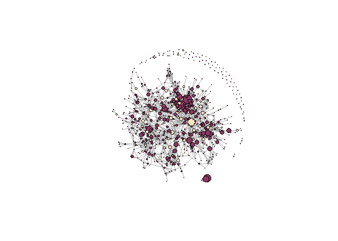
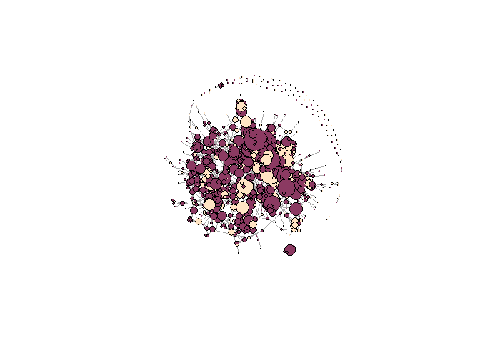

```r
setwd("C:/Users/pantalaimon/Desktop/SOCIAL NETWORK/Lab 2/Cleveland")

ATTR <- read.csv("attrib.csv", header = TRUE)
MATR <- read.csv("adjmatrix.csv", header=TRUE, check.names=FALSE, row.names=NULL)

ATTR$sex <- ifelse((ATTR$SEX=="Female"), 0, 1)

ATTR$race[ATTR$RACE=="White"] <- 0
ATTR$race[ATTR$RACE=="Black"] <- 1
ATTR$race[ATTR$RACE=="Hispanic"] <- 2
ATTR$race[ATTR$RACE=="Asian"] <- 3
ATTR$race[ATTR$RACE=="Other"] <- 4

##setting a new variable for "non-white"
ATTR$raceflag <- ifelse((ATTR$RACE=="White"), 1, 0)

## setting 0 age to NA
ATTR$ageave[ATTR$ageave==0] <- NA
```


#### 1. Describe the social network(s) to me, in terms of how it was collected, what it represents and so forth. Also give me basic topography of the network: the nature of the ties; direction of ties; overall density; and if attributes are with the network, the distribution of the categories and variables of those attributes.


For my lab, I am using use of excessive force data collected by the Cleveland Police department from 2015 to 2017. The original dataset is organized by individual officer and incident, and contains variables describing each officer's sex, race, the age of the officers (averaged over the three years), the number of excessive force incidents they have been involved in, and the number of use of force violations that have been counted against them (multiple uses of force can be counted against an officer for the same incident).

The network matrix shows undirected ties between 811 officers, with each tie indicating that the officer has been involved in an incident that the adjacent officer.


```r
MATRIX <- as.matrix(MATR, header=TRUE, row.names=NULL, check.names=FALSE)
diag(MATRIX) <- 0
CM<- graph.adjacency(MATRIX,mode="undirected",weighted=NULL)
simplify(CM)
```

```
## IGRAPH 8e074c4 UN-- 811 2051 -- 
## + attr: name (v/c)
## + edges from 8e074c4 (vertex names):
##  [1] 1 --2   1 --33  1 --89  1 --122 1 --193 1 --344 1 --348 1 --349
##  [9] 1 --350 1 --387 1 --578 1 --601 1 --629 1 --637 1 --700 1 --740
## [17] 1 --769 2 --33  2 --348 2 --349 2 --387 2 --700 3 --165 3 --177
## [25] 3 --262 4 --147 4 --259 4 --628 5 --12  5 --220 5 --274 5 --335
## [33] 5 --499 5 --646 5 --738 6 --54  6 --117 6 --189 6 --281 6 --305
## [41] 6 --385 6 --394 6 --625 6 --668 6 --711 7 --113 7 --145 7 --278
## [49] 7 --671 8 --26  8 --33  8 --130 8 --213 8 --267 8 --290 8 --356
## [57] 8 --420 8 --466 8 --775 10--153 10--271 10--365 10--478 10--568
## + ... omitted several edges
```


```r
graph.density(CM,loop=FALSE)
```

```
## [1] 0.006838075
```

The density of the matrix is fairly low at 0.006838075.


```r
summary(ATTR$RACE)
```

```
##    Asian    Black Hispanic    Other    White 
##        1      167       77        9      557
```

```r
summary(ATTR$SEX)
```

```
## Female   Male 
##     77    734
```

```r
summary(ATTR$ageave)
```

```
##    Min. 1st Qu.  Median    Mean 3rd Qu.    Max.    NA's 
##   23.00   32.50   42.42   40.88   48.00   65.00       1
```

```r
summary(ATTR$INCcount)
```

```
##    Min. 1st Qu.  Median    Mean 3rd Qu.    Max. 
##   1.000   1.000   2.000   2.531   3.000  15.000
```

```r
summary(ATTR$UOFcount)
```

```
##    Min. 1st Qu.  Median    Mean 3rd Qu.    Max. 
##   1.000   2.000   3.000   4.295   6.000  31.000
```

Summary statistics for each attribute variable show that a vast majority of Cleveland officers are Male and White. The average age for the officers is around 40, while the youngest officer is 23.

Additionally, the officers in the dataset have been involved in an average of 2.531 total incidents using excessive force, while the maximum number of incidents that an officer has been involved in tops out at 15. Finally, the average use of force counts among officers is 4.295, while the maximum number of use of force counts against a single officer is 31.

To get a sense of the network as a whole, I plotted a preliminary network graph below. Here I set the size of the vertices to the number of incidents the officer has been involved in and the color of the vertices to indicate whether the officer identified as white, or non-white (dark pink and yellow, respectively).


```r
## attarching attributes to the nodes
vertex_attr(CM, index=ATTR$ID) <- ATTR
```


```r
# Differentiate two status by color.
V(CM)[V(CM)$raceflag== 1]$color <- "hotpink4"
V(CM)[V(CM)$raceflag== 0]$color <- "bisque"

set.seed(12)
plot(CM, layout=layout_nicely(CM, dim=2), vertex.color=V(CM)$color, vertex.size=V(CM)$INCcount, vertex.label=NA)
```

<!-- -->


#### 2. Calculate degree centrality (in- and out-degree, too, if you have such data); closeness centrality; betweenness centrality; and eigenvector centrality. Correlate those measures of centrality. Highlight which nodes are most central and least central, along different dimensions.


```r
## selecting just numerical variables
ATTR = ATTR[,c(1,4:9)]

## calculate degree
ATTR <- merge(ATTR,
              data.frame(ID=V(CM)$ID,
              degree=degree(CM)),
              by='ID')

summary(ATTR$degree)
```

```
##    Min. 1st Qu.  Median    Mean 3rd Qu.    Max. 
##   0.000   2.000   4.000   5.539   8.000  27.000
```

I first calculated the degree of each officer in the dataset and added it to the attribute table as a new variable. The the summary statistics for degree show that the average degree among all officers in the dataset 5.539, and the max degree is 27.


```r
highdegree <- ATTR %>% filter(degree>=27)
highdegree
```

```
##    ID   ageave UOFcount INCcount sex race raceflag degree
## 1 758 34.66667       20        9   1    0        1     27
```

The officer with the highest degree is a white male who is about 34 years old. He has a relatively high number of excessive force counts against him (20), and has been involved in a total of 9 incidents.


```r
# calculate other centrality measures
ATTR <- merge(ATTR,  #  Merge lazega_attributes
                data.frame(  # With a new data.frame
                ID=V(CM)$ID,  # Where the ID is the ID of each vertex
                btwn=betweenness(CM, directed = FALSE),
                close = closeness(CM, mode = c("all"))),
                by='ID')
```

```r
summary(ATTR$btwn)
```

```
##    Min. 1st Qu.  Median    Mean 3rd Qu.    Max. 
##     0.0     0.0   130.6  1387.5  1499.7 23815.5
```

```r
summary(ATTR$close)
```

```
##      Min.   1st Qu.    Median      Mean   3rd Qu.      Max. 
## 1.522e-06 1.227e-05 1.235e-05 1.109e-05 1.242e-05 1.254e-05
```


```r
btwn <- ATTR %>% filter(btwn>=23815.5)
btwn
```

```
##    ID ageave UOFcount INCcount sex race raceflag degree     btwn
## 1 100     54        6        5   1    0        1     16 23815.51
##          close
## 1 1.253651e-05
```

The officer with the highest betweeness centrality is a 54 year old white male, with 6 use of force counts against him. He has been involved in 5 incidents. His high "betweeness" may not be as interesting when examining the transfer of enforcement habits, however.


```r
close <- ATTR %>%filter(close>=1.253651e-05)
close
```

```
##    ID ageave UOFcount INCcount sex race raceflag degree     btwn
## 1 100     54        6        5   1    0        1     16 23815.51
##          close
## 1 1.253651e-05
```

This same officer has the highest closeness centrality. This measure of centrality may be more interesting to investigate if we assume that enforcement habits are spread similar to diseases.


```r
# calculate eiganvector centrality
ATTR <- merge(ATTR,
                data.frame( 
                ID=V(CM)$ID,
                eigen <- evcent(CM)),
                by='ID')

# clean up the dataframe
ATTR2 = ATTR[,c(1:11)]
```

```r
summary(ATTR2$vector)
```

```
##      Min.   1st Qu.    Median      Mean   3rd Qu.      Max. 
## 0.0000000 0.0004734 0.0036950 0.0468506 0.0320376 1.0000000
```


```r
vector <- ATTR2 %>% filter(vector>=1)
vector
```

```
##    ID   ageave UOFcount INCcount sex race raceflag degree     btwn
## 1 344 27.64286       28       14   1    0        1     26 6559.443
##         close vector
## 1 1.25097e-05      1
```

Finally, the officer with the highest eigenvector centrality is a black male officer who is roughly 27 years old. He has a high use of force count at 28, and has been involved in 14 incidents.


```r
CORR = ATTR2[,c(8:11)]
cor(CORR)
```

```
##           degree      btwn     close    vector
## degree 1.0000000 0.6874184 0.3880766 0.6367299
## btwn   0.6874184 1.0000000 0.1971758 0.3520235
## close  0.3880766 0.1971758 1.0000000 0.1681844
## vector 0.6367299 0.3520235 0.1681844 1.0000000
```

Correlating the measures of centrality show that degree is most highly correlated with betweeness and vector centrality measures.


#### 3a. If you have a network with attribute data, then state some hypothesis about how an attribute may be related to some (or all of the) measures of centrality. Explains why you think these two variables should be related.

After running the measures of centrality above, I decided to explore whether officers' race might predict the degree centrality of the that officer. Here, I predicted that white officers within the force will be more centrally located in the network, since racial biases within the mostly-white Cleveland force may result in white police officers being involved in more incidents together.

Using a dummy variable to indicate a white officer (1 = White, 0 = Not White), I first ran a simple linear regression.


```r
## running the first regression
lm1 <- lm(degree ~ raceflag, ATTR2)
summary(lm1)
```

```
## 
## Call:
## lm(formula = degree ~ raceflag, data = ATTR2)
## 
## Residuals:
##     Min      1Q  Median      3Q     Max 
## -5.9013 -2.9013 -0.9013  2.0987 21.2559 
## 
## Coefficients:
##             Estimate Std. Error t value Pr(>|t|)    
## (Intercept)   4.7441     0.2833  16.744  < 2e-16 ***
## raceflag      1.1572     0.3419   3.385 0.000747 ***
## ---
## Signif. codes:  0 '***' 0.001 '**' 0.01 '*' 0.05 '.' 0.1 ' ' 1
## 
## Residual standard error: 4.516 on 809 degrees of freedom
## Multiple R-squared:  0.01396,	Adjusted R-squared:  0.01274 
## F-statistic: 11.46 on 1 and 809 DF,  p-value: 0.000747
```

The results show that white officers score 1.1572 higher than non-white officers in degree centrality. This might suggest that white officers do tend to have higher degrees of centrality than non-white officers.


#### 4. In either case, when you are done above, then considers alternate specifications of your variables and codings and decisions and models. What would you want to consider changing and why. If you can, report on what are the consequences of those changes?

Continuing to explore the relationship between degree centrality and race, I decided to include control the control variables age and sex. Here, I predicted that older officers and female officers would be less likely to be involved with many incidents than their younger, male counterparts, and therefore should have a negative coefficient in relation to degree.

Here sex is re-coded such that 1 = Male and 0 = Female.


```r
lm2 <- lm(degree ~ ageave + raceflag + sex, ATTR2)
summary(lm2)
```

```
## 
## Call:
## lm(formula = degree ~ ageave + raceflag + sex, data = ATTR2)
## 
## Residuals:
##    Min     1Q Median     3Q    Max 
## -7.258 -3.292 -1.057  2.303 21.163 
## 
## Coefficients:
##             Estimate Std. Error t value Pr(>|t|)    
## (Intercept)  8.19405    0.85924   9.536  < 2e-16 ***
## ageave      -0.08681    0.01631  -5.324 1.32e-07 ***
## raceflag     1.00355    0.34029   2.949  0.00328 ** 
## sex          0.23081    0.53973   0.428  0.66903    
## ---
## Signif. codes:  0 '***' 0.001 '**' 0.01 '*' 0.05 '.' 0.1 ' ' 1
## 
## Residual standard error: 4.444 on 806 degrees of freedom
##   (1 observation deleted due to missingness)
## Multiple R-squared:  0.04719,	Adjusted R-squared:  0.04364 
## F-statistic: 13.31 on 3 and 806 DF,  p-value: 1.747e-08
```

The summary above shows that, holding all else constant, white officers still score 1.1572 higher than non-white officers in degree centrality. Additionally, the negative coefficient for ageave suggests that and officers get older their degree centrality decreases, while the slightly positive coefficient for the variable sex suggests that male officers score slightly higher than female officers on degree centrality, holding all else constant.

Next, I decided to add the variable describing the number of use of excessive force force counts recorded against that officer. I did this to test if race and degree continued to have a strong correlation when the number of use of force counts, or overall "brutality" of force by officer was held constant. 


```r
lm3 <- lm(degree ~ ageave + raceflag + sex + UOFcount, ATTR2)
summary(lm3)
```

```
## 
## Call:
## lm(formula = degree ~ ageave + raceflag + sex + UOFcount, data = ATTR2)
## 
## Residuals:
##      Min       1Q   Median       3Q      Max 
## -15.1196  -2.2381  -0.5168   1.9909  13.5024 
## 
## Coefficients:
##             Estimate Std. Error t value Pr(>|t|)    
## (Intercept)  2.59633    0.68134   3.811 0.000149 ***
## ageave      -0.01242    0.01257  -0.988 0.323475    
## raceflag     0.28259    0.25660   1.101 0.271103    
## sex         -0.13137    0.40469  -0.325 0.745548    
## UOFcount     0.78641    0.03132  25.110  < 2e-16 ***
## ---
## Signif. codes:  0 '***' 0.001 '**' 0.01 '*' 0.05 '.' 0.1 ' ' 1
## 
## Residual standard error: 3.33 on 805 degrees of freedom
##   (1 observation deleted due to missingness)
## Multiple R-squared:  0.4657,	Adjusted R-squared:  0.463 
## F-statistic: 175.4 on 4 and 805 DF,  p-value: < 2.2e-16
```

The results show that while raceflag is still positive, it as significantly decreased in strength.

Finally, I also decided to regress race against the eigenvector centrality of each officer. Here, I hypothesized that white officers might also have a higher eigenvector centrality, since highly centralized and "incident-prone" officers may associate with and be involved in incidents with other highly central officers.


```r
lm4 <- lm(vector ~ ageave + raceflag + sex, ATTR2)
summary(lm4)
```

```
## 
## Call:
## lm(formula = vector ~ ageave + raceflag + sex, data = ATTR2)
## 
## Residuals:
##      Min       1Q   Median       3Q      Max 
## -0.08837 -0.04852 -0.02957 -0.00502  0.92111 
## 
## Coefficients:
##               Estimate Std. Error t value Pr(>|t|)    
## (Intercept)  0.1159756  0.0207794   5.581 3.26e-08 ***
## ageave      -0.0020430  0.0003943  -5.181 2.79e-07 ***
## raceflag     0.0142698  0.0082294   1.734   0.0833 .  
## sex          0.0051178  0.0130526   0.392   0.6951    
## ---
## Signif. codes:  0 '***' 0.001 '**' 0.01 '*' 0.05 '.' 0.1 ' ' 1
## 
## Residual standard error: 0.1075 on 806 degrees of freedom
##   (1 observation deleted due to missingness)
## Multiple R-squared:  0.03764,	Adjusted R-squared:  0.03406 
## F-statistic: 10.51 on 3 and 806 DF,  p-value: 8.737e-07
```

The results show that white officers do score slightly higher on eigenvector centrality than non-white officers, holding all else constant. It's work noting that aveage continues maintains a negative coefficient, suggesting that has officers get older they are less likely to be connected with other highly connected officers.


#### 5. Lastly, give your best conclusion as to what you learned from your analysis. Did it make sense, given your initial expectations? Why? Why not?

I believe my overall analysis was able to somewhat confirm my original predictions that officer race and centrality within the use of force matrix share a somewhat positive relationship. Since the original dataset is also collected over three years, it might also be possible to conduct a longitudinal analysis and confirm whether this pattern is still present. Overall I'm very excited to keep working with this data and new variables concerning the race, gender, and age of the complainant involved in individual incidents becomes available to me!

The final plot below shows the network again, this time with size equal to the degree centrality of the officer. Hot pink nodes denote white officers, while yellow nodes denote non-white officers.


```r
## attarching attributes to the nodes
vertex_attr(CM, index=ATTR2$ID) <- ATTR2
```


```r
# Differentiate two status by color.
V(CM)[V(CM)$raceflag== 1]$color <- "hotpink4"
V(CM)[V(CM)$raceflag== 0]$color <- "bisque"

set.seed(12)
plot(CM, layout=layout_nicely(CM, dim=2), vertex.color=V(CM)$color, vertex.size=V(CM)$degree, vertex.label=NA)
```

<!-- -->


