#### 1. Data exploration


```r
setwd("C:/Users/pantalaimon/Desktop/DATA VIZ/Assignment 2/data")
park_notmerged = read.csv("parkingNYC_Jan2019.csv")
codes = read.csv("parkingNYC_ParkingViolationCodes_Nov_2018.csv")
```

##### a) Violation Code and Fine Amounts


```
## [1] 284610
```

Calculating the top 10 most common types of violations as a percentage of the total number of violations gives the graph below: 


```r
## Created bar graph showing overview of top 10 most common types of violations

bar_1 <- ggplot(top10violation, aes(reorder(ï..Violation_Description, totalvio), viopercent)) +
  geom_bar(stat = "identity", width = 0.7, fill = "grey") +
  coord_flip() +
  theme_tufte() +
  geom_text(aes(label=viopercent), hjust=-0.1, color="gray29", size=3.5) +
  labs(x="", y="", title = "Percentage out of Total Violations") +
  theme(legend.position = "none", axis.ticks = element_blank(), axis.text.x = element_blank(), axis.text.y = element_text(color="gray29", size=10), plot.title = element_text(size=15, face="italic", hjust=-0.1))

bar_1
```

<!-- -->

Here I decided to average the two fines given in the data file. The bar chart above shows that violations against standing during the day is the top most common type of parking ticket.

Focusing on the total amount of revenue generated, I again I decided to average the two fines listed in the file.


```r
## Calculating average fine amount

top10fines <- park %>%
  mutate(avefine = (Manhattan..96th.St....below..Fine.Amount...+All.Other.Areas..Fine.Amount...)/2) %>%
  group_by(Violation_Code) %>%
  summarize(totalrev = sum(avefine)) %>%
  arrange(desc(totalrev)) %>%
  mutate(rank=row_number()) %>%
  filter(rank<11)

top10fines <- left_join(top10fines, codes, by = "Violation_Code")
```

The bar chart below shows that again, daytime standing brings in the most revenue. However, while double parking ranks 4th as the most common type of violation, the graph below reveals that it brings in the second most amount of revenue.


```r
bar_2 <- ggplot(top10fines, aes(reorder(ï..Violation_Description, totalrev), totalrev)) +
  geom_bar(stat = "identity", width = 0.7, fill = "grey") +
  coord_flip() +
  theme_tufte() +
  geom_text(aes(label=totalrev), hjust=-0.1, color="gray29", size=3.5) +
  labs(x="", y="", title = "Top Ten Revenue-Earning Violations") +
  theme(legend.position = "none", axis.ticks = element_blank(), axis.text.x = element_blank(), axis.text.y = element_text(color="gray29", size=10), plot.title = element_text(size=15, face="italic", hjust=-0.1))

bar_2
```

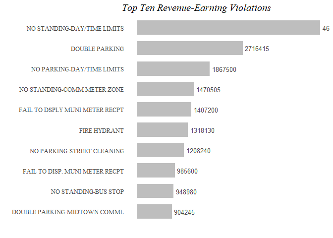<!-- -->

##### b) Average amount of fine by vehicle


```r
## Compare the average amount of fine by vehicle color, vehicle year, and vehicle plate type [Hint: it is sufficient to restrict your attention to commercial (COM) and passenger (PAS) vehicles]? Briefly describe your findings.

## Calculated average fine by color, year, and plate type

vehicletype <- park %>%
  mutate_if(is.numeric, funs(ifelse(is.na(.), 0, .))) %>%
  mutate(avefine = (Manhattan..96th.St....below..Fine.Amount...+All.Other.Areas..Fine.Amount...)/2) %>%
  group_by(Plate.Type, Vehicle.Color) %>%
  mutate(totalpcolor = sum(violationflag)) %>%
  mutate(totalfinepcolor = sum(avefine)) %>%
  ungroup() %>%
  group_by(Plate.Type, Vehicle.Year) %>%
  mutate(totalpyear = sum(violationflag)) %>%
  mutate(totalfinepyear = sum(avefine)) %>%
  ungroup() %>%
  group_by(Plate.Type) %>%
  mutate(totalplate = sum(violationflag)) %>%
  mutate(totalfineplate = sum(avefine)) %>%
  ungroup() %>%
  mutate(avefinepcolor = (totalfinepcolor/totalpcolor)) %>%
  mutate(avefinepyear = (totalfinepyear/totalpyear)) %>%
  mutate(avefineplate = (totalfineplate/totalplate))
```

To compare average fines across vehicle color, year, and plate type, I decided to group the data by passenger vehicles and commercial vehicles.


```r
## Grouped data by vehicle color and plate type, and vehicle year and plate type

vehiclecolor <- vehicletype %>%
  filter(Plate.Type =="PAS" | Plate.Type == "COM") %>%
  filter(Vehicle.Color=="BLACK" | Vehicle.Color=="BROWN" | Vehicle.Color=="GOLD" | Vehicle.Color=="GRAY" | Vehicle.Color=="GREEN" |  Vehicle.Color=="WHITE" | Vehicle.Color=="RED" |Vehicle.Color=="GREEN"| Vehicle.Color=="BLUE") %>%
  group_by(Plate.Type, Vehicle.Color, avefinepcolor) %>%
  summarize()


vehicleyear <- vehicletype %>%
  filter(Plate.Type =="PAS" | Plate.Type == "COM") %>%
  filter(Vehicle.Year<=2019) %>%
  filter(Vehicle.Year>0) %>%
  group_by(Plate.Type, Vehicle.Year, avefinepyear) %>%
  summarize()

platetype <- vehicletype %>%
  filter(Plate.Type =="PAS" | Plate.Type == "COM") %>%
  group_by(Plate.Type, avefineplate) %>%
  summarize()
```

Graphing the average fine incurred by plate type does not show much, as it appears both commercial and passenger plate types incur similar average amounts in fines overall.


```r
bar_3 <- ggplot(platetype, aes(Plate.Type, avefineplate)) +
  geom_bar(stat = "identity", width = 0.7, fill = ifelse(platetype$Plate.Type=="COM", "darkred", "turquoise4")) +
  theme_tufte() +
  labs(x="", y="", title = "Average Fine Incurred by Plate Type") +
  theme(legend.position = "none", axis.ticks = element_blank(), axis.text.x = element_text(color="gray29", size=10), plot.title = element_text(size=15, face="italic"), axis.text.y = element_text(color="gray29", size=10))

bar_3
```

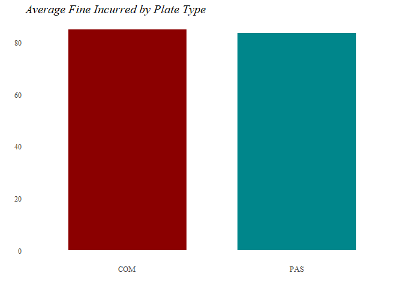<!-- -->

Creating a slope graph of the average fines per plate type by vehicle color, it appears that white, gray, blue, and black passenger vehicles attract higher fines on average than commercial vehicles that are the same color.


```r
slopegraph_1 <- ggplot(vehiclecolor, aes(Plate.Type, avefinepcolor, group=Vehicle.Color)) +
  geom_line(aes(color=ifelse(vehiclecolor$Vehicle.Color=="WHITE" |vehiclecolor$Vehicle.Color=="GRAY" | vehiclecolor$Vehicle.Color=="BLUE" | vehiclecolor$Vehicle.Color=="BLACK", "UP", ""), alpha=1), size = 1.5) +
  geom_point(aes(color = ifelse(vehiclecolor$Vehicle.Color=="WHITE" |vehiclecolor$Vehicle.Color=="GRAY" | vehiclecolor$Vehicle.Color=="BLUE" | vehiclecolor$Vehicle.Color=="BLACK", "UP", ""), alpha=1), size = 3) +
  geom_text(data = vehiclecolor %>% filter(Plate.Type=="PAS"), 
            aes(label = paste0(Vehicle.Color)), 
            hjust = -.35,
            color = "gray29",
            size = 3,
            check_overlap = TRUE) +
  scale_color_manual(values=c("darkgrey", "turquoise4")) +
  scale_x_discrete(limits=c("COM", "PAS")) +
  scale_y_continuous(breaks=seq(0, 100, 10)) +
  theme_tufte() +
  labs(x="", y="", title = "Average Fines per Plate Type by Vehicle Color") +
  theme(legend.position = "none", 
        axis.text.y = element_text(color="gray29", size=12), 
        axis.text.x = element_text(color="gray29", size=12), 
        plot.title = element_text(size=17, face="italic", hjust=.2, vjust = 1), 
        panel.grid.major.x = element_line(color = "lightgrey"), 
        axis.ticks = element_blank())

slopegraph_1
```

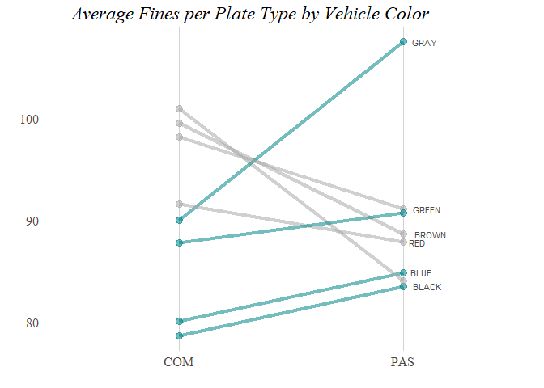<!-- -->

Next I graphed the average fine amount for passenger and commercial vehicles across vehicle years:


```r
line_1 <- ggplot(vehicleyear, aes(Vehicle.Year, avefinepyear)) +
  geom_line(aes(group=Plate.Type, color=ifelse(vehicleyear$Plate.Type=="COM", "COM", ""))) +
  scale_color_manual(values=c("turquoise4", "darkred")) +
  geom_text(data = vehicleyear %>% filter(Vehicle.Year==2019), 
            aes(label = paste0(Plate.Type)), 
            hjust = -.35,
            color = "gray29",
            size = 3,
            check_overlap = TRUE) +
  theme_tufte() +
  scale_x_continuous(breaks=seq(1970, 2020, 5)) +
  labs(x="", y="Average Fine Amount (dollars) per Year", title = "Average Fines per Year by Plate Type") +
  theme(legend.position = "none", axis.text.y = element_text(color="gray29", size=10), plot.title = element_text(size=15, face="italic", hjust=-0.1))

line_1
```

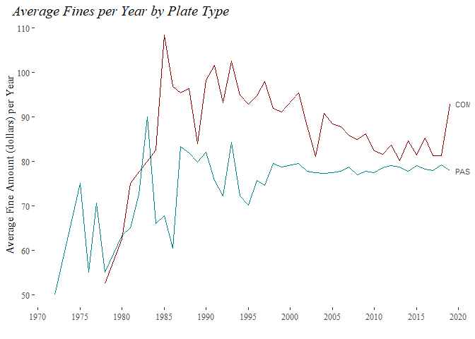<!-- -->

From the graph it appears that the average fines incurred per year has grown somewhat for commercial vehicles, while the average fines incurred per year for passenger vehicles has remained more or less the same in recent years.


#### 2. Map by Precincts


```r
## Read in the shape files for the police precincts and remove all precincts outside of Manhattan.

setwd("C:/Users/pantalaimon/Desktop/DATA VIZ/Assignment 2/data/police_precincts")
nyc <- readOGR("nypp1.shp")
```

```
## OGR data source with driver: ESRI Shapefile 
## Source: "C:\Users\pantalaimon\Desktop\DATA VIZ\Assignment 2\data\police_precincts\nypp1.shp", layer: "nypp1"
## with 77 features
## It has 3 fields
```

```r
nyc <- spTransform(nyc, CRS("+proj=longlat +datum=NAD83"))
man <- nyc$Precinct<=34
```

##### a) Number of tickets, total fines, and average fines

First, I mapped the total number of tickets issued in Manhattan by police precinct per square mile:


```r
## Calcuating total number of tickets per precinct

ticket <- park %>%
  mutate_if(is.numeric, funs(ifelse(is.na(.), 0, .))) %>%
  group_by(Precinct) %>%
  summarize(totalticket = sum(violationflag))

ticket <- sp::merge(nyc, ticket, by = "Precinct")
```


```r
## Map of ticket density per precinct

tm1 <- tm_shape(ticket[man,]) +
  tm_borders(alpha=.5) +
  tm_fill("totalticket", title = "Tickets per Square Mile", convert2density=TRUE, style="pretty") +
  tm_layout(
          legend.title.size = 1,
          legend.text.size = 0.5,
          legend.position = c(0.8,0),
          legend.bg.color = "white",
          legend.bg.alpha = 1,
          bg.color="white",
          frame=FALSE)

tm1
```

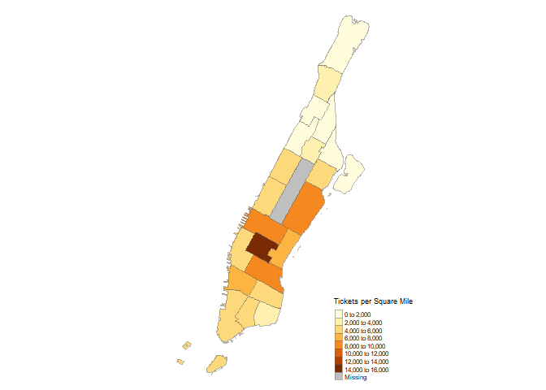<!-- -->

Here the map shows the area with the highest number of tickets issued is roughly in mid-town, with about 14,000 to 16,000 tickets issued per square mile.

Next, I mapped the total amount of fines per police precinct per square mile:


```r
## Calcuating total amount of fines per precinct

fines <- park %>%
  mutate_if(is.numeric, funs(ifelse(is.na(.), 0, .))) %>%
  group_by(Precinct) %>%
  summarize(totalfine = sum(avefine))

fines <- sp::merge(nyc, fines, by = "Precinct")
```


```r
## Map of ticket density per precinct

tm2 <- tm_shape(fines[man,]) +
  tm_borders(alpha=.5) +
  tm_fill("totalfine", title = "Fines per Square Mile (Dollars)", style="pretty") +
  tm_layout(
          legend.title.size = 1,
          legend.text.size = 0.5,
          legend.position = c(0.8,0),
          legend.bg.color = "white",
          legend.bg.alpha = 1,
          bg.color="white",
          frame=FALSE)

tm2
```

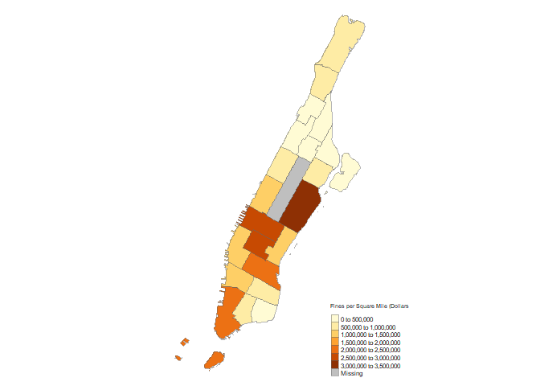<!-- -->

In this map it appears the the Upper East Side actually has the highest incurred fines per square mile.

Finally, I mapped the average fine reported per precinct:


```r
## Calcuating total amount of fines per precinct

avefines <- park %>%
  mutate_if(is.numeric, funs(ifelse(is.na(.), 0, .))) %>%
  group_by(Precinct) %>%
  mutate(totalfine = sum(avefine)) %>%
  mutate(totalviolation = sum(violationflag)) %>%
  ungroup() %>%
  mutate(avefineprecinct = totalfine/totalviolation) %>%
  group_by(Precinct, avefineprecinct) %>%
  summarize()

avefines <- sp::merge(nyc, avefines, by = "Precinct")
```


```r
## Map of ticket density per precinct

tm3 <- tm_shape(avefines[man,]) +
  tm_borders(alpha=.5) +
  tm_fill("avefineprecinct", title = "Average Fines Issued", style="pretty") +
  tm_layout(
          legend.title.size = 1,
          legend.text.size = 0.5,
          legend.position = c(0.8,0),
          legend.bg.color = "white",
          legend.bg.alpha = 1,
          bg.color="white",
          frame=FALSE)

tm3
```

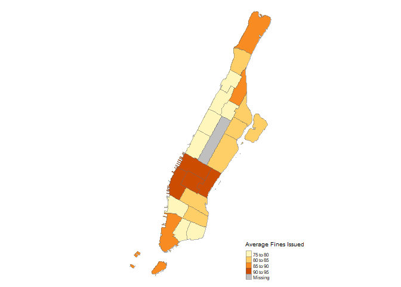<!-- -->

Again, it appears that the highest average fines are issued in midtown.

##### b) Types of violations

The first map below shows the percent of violations related to "standing" per precinct.


```r
## Group the almost 100 types of ticket violations into a smaller set of 4-6 subgroups (where other should be the remainder of violations not included in other groups you defined). Provide choropleth maps for each of these subgroups to show where different types of violations are more or less common.

standing <- park %>%
  mutate(standflag = ifelse(park$Violation_Code>9 & park$Violation_Code<32, 1, 0)) %>%
  group_by(Precinct) %>%
  mutate(totalstand = sum(standflag)) %>%
  mutate(totalticket = sum(violationflag)) %>%
  ungroup() %>%
  mutate(percstand = (totalstand/totalticket)*100) %>%
  group_by(Precinct, percstand) %>%
  summarize()

standing <- sp::merge(nyc, standing, by = "Precinct")
```

By studying the precincts, it would appear that the tip of Manhattan sees a high percentage of violations related to "standing", out of all violation types.


```r
## percent of violations related to "standing" per precinct

tm4 <- tm_shape(standing[man,]) +
  tm_borders(alpha=.5) +
  tm_fill("percstand", title = "Percent 'Standing' Violations", style="pretty") +
  tm_layout(
          legend.title.size = 1,
          legend.text.size = 0.5,
          legend.position = c(0.8,0),
          legend.bg.color = "white",
          legend.bg.alpha = 1,
          bg.color="white",
          frame=FALSE)

tm4
```

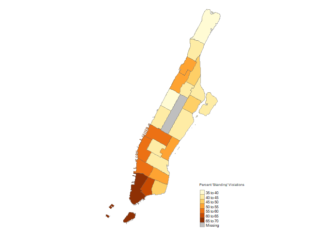<!-- -->

Next, I chose to look at violations related to meters.


```r
meter <- park %>%
  mutate(meterflag = ifelse(park$Violation_Code>31 & park$Violation_Code<39, 1, 0)) %>%
  group_by(Precinct) %>%
  mutate(totalmeter = sum(meterflag)) %>%
  mutate(totalticket = sum(violationflag)) %>%
  ungroup() %>%
  mutate(percmeter = (totalmeter/totalticket)*100) %>%
  group_by(Precinct, percmeter) %>%
  summarize()

meter <- sp::merge(nyc, meter, by = "Precinct")
```

From the map below, it would appear that the Upper East and West Sides of Manhattan sees a high percentage of violations related to meters, out of all violations.


```r
## percent of violations related to "Meter" per precinct

tm5 <- tm_shape(meter[man,]) +
  tm_borders(alpha=.5) +
  tm_fill("percmeter", title = "Percent 'Meter' Violations", style="pretty") +
  tm_layout(
          legend.title.size = 1,
          legend.text.size = 0.5,
          legend.position = c(0.8,0),
          legend.bg.color = "white",
          legend.bg.alpha = 1,
          bg.color="white",
          frame=FALSE)

tm5
```

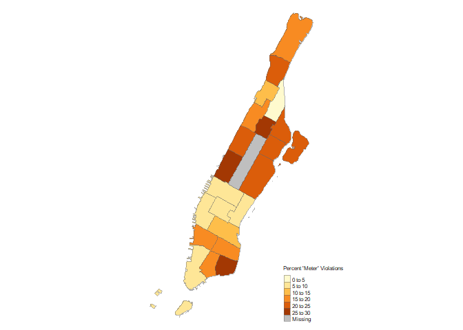<!-- -->

Next, I made a group including all violations related to "blocking" things. This could include double parking, blocking a bike lane, or blocking a crosswalk.


```r
blocking <- park %>%
  mutate(blockingflag = ifelse(park$Violation_Code==40 | park$Violation_Code==46 | (park$Violation_Code>44 & park$Violation_Code<54), 1, 0)) %>%
  group_by(Precinct) %>%
  mutate(totalblocking = sum(blockingflag)) %>%
  mutate(totalticket = sum(violationflag)) %>%
  ungroup() %>%
  mutate(percblocking = (totalblocking/totalticket)*100) %>%
  group_by(Precinct, percblocking) %>%
  summarize()

blocking <- sp::merge(nyc, blocking, by = "Precinct")
```

From the map below, it would appear that upper Manhattan and Harlem see a higher percentage of parking violations related to blocking things out of all violations relative to other precincts.


```r
## percent of violations related to "Blokcing" per precinct

tm6 <- tm_shape(blocking[man,]) +
  tm_borders(alpha=.5) +
  tm_fill("percblocking", title = "Percent 'Blocking' Violations", style="pretty") +
  tm_layout(
          legend.title.size = 1,
          legend.text.size = 0.5,
          legend.position = c(0.8,0),
          legend.bg.color = "white",
          legend.bg.alpha = 1,
          bg.color="white",
          frame=FALSE)

tm6
```

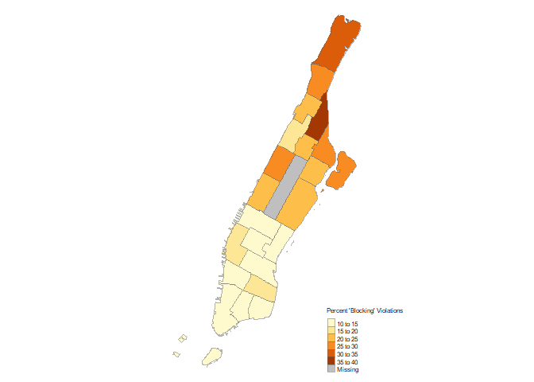<!-- -->

Finally, I created a fourth map including the percentage of all other violations not included above by precinct.


```r
other <- park %>%
  mutate(otherflag = ifelse(park$Violation_Code==40 | park$Violation_Code==46 | (park$Violation_Code>44 & park$Violation_Code<54) | (park$Violation_Code>31 & park$Violation_Code<39) | (park$Violation_Code>9 & park$Violation_Code<32), 0, 1)) %>%
  group_by(Precinct) %>%
  mutate(totalother = sum(otherflag)) %>%
  mutate(totalticket = sum(violationflag)) %>%
  ungroup() %>%
  mutate(percother = (totalother/totalticket)*100) %>%
  group_by(Precinct, percother) %>%
  summarize()

other <- sp::merge(nyc, other, by = "Precinct")
```

Though this miscellaneous might not tell us much, there seem to be a high percentage of "other" types of violations in midtown.


```r
## percent of violations related to "Other Violations" per precinct

tm7 <- tm_shape(other[man,]) +
  tm_borders(alpha=.5) +
  tm_fill("percother", title = "Percent 'Other' Violations", style="pretty") +
  tm_layout(
          legend.title.size = 1,
          legend.text.size = 0.5,
          legend.position = c(0.8,0),
          legend.bg.color = "white",
          legend.bg.alpha = 1,
          bg.color="white",
          frame=FALSE)

tm7
```

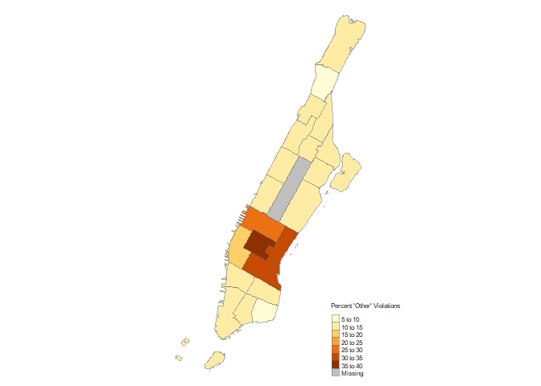<!-- -->


###### 3. Focusing on the Upper East Side

##### a) Ignoring fire hydrants

Focusing only on the Upper East Side (precinct 19), I then geocoded all hydrant-related offenses.


```r
## Restrict your data to parking violations related to fire hydrants (Violation Code = 40) 

hydrant <- park %>%
  mutate_if(is.numeric, funs(ifelse(is.na(.), 0, .))) %>%
  filter(Precinct == 19 & Violation_Code == 40) %>%
  mutate(Address = paste(House.Number, Street.Name, ', New York, NY'))
```


```r
## Geocoding addresses
parking_sub_coords <- geocode(hydrant$Address)
hydrantcoords <- bind_cols(hydrant, parking_sub_coords)
```

The data table below shows all variables from the original data set:


```r
## Include a data table of these addresses and the latitude and longitude of these addresses in the output.

## Here to save on processing time, I exported my geo-coded dataframe as a csv and reloaded it into R

setwd("C:/Users/pantalaimon/Desktop/DATA VIZ/Assignment 2/data")
upper <- read.csv("hydrant.csv")

datatable1 <- upper %>%
  datatable(
    rownames = FALSE,
    filter = list(position = "top"),
    options = list(language = list(sSearch = "Filter:")))

datatable1
```

<!--html_preserve--><div id="htmlwidget-15a35ab8cc0de8968969" style="width:100%;height:auto;" class="datatables html-widget"></div>
<script type="application/json" data-for="htmlwidget-15a35ab8cc0de8968969">{"x":{"filter":"top","filterHTML":"<tr>\n  <td data-type=\"number\" style=\"vertical-align: top;\">\n    <div class=\"form-group has-feedback\" style=\"margin-bottom: auto;\">\n      <input type=\"search\" placeholder=\"All\" class=\"form-control\" style=\"width: 100%;\"/>\n      <span class=\"glyphicon glyphicon-remove-circle form-control-feedback\"><\/span>\n    <\/div>\n    <div style=\"display: none; position: absolute; width: 200px;\">\n      <div data-min=\"-73.9980108\" data-max=\"-73.8996584\" data-scale=\"7\"><\/div>\n      <span style=\"float: left;\"><\/span>\n      <span style=\"float: right;\"><\/span>\n    <\/div>\n  <\/td>\n  <td data-type=\"number\" style=\"vertical-align: top;\">\n    <div class=\"form-group has-feedback\" style=\"margin-bottom: auto;\">\n      <input type=\"search\" placeholder=\"All\" class=\"form-control\" style=\"width: 100%;\"/>\n      <span class=\"glyphicon glyphicon-remove-circle form-control-feedback\"><\/span>\n    <\/div>\n    <div style=\"display: none; position: absolute; width: 200px;\">\n      <div data-min=\"40.6355239\" data-max=\"40.8480497\" data-scale=\"7\"><\/div>\n      <span style=\"float: left;\"><\/span>\n      <span style=\"float: right;\"><\/span>\n    <\/div>\n  <\/td>\n  <td data-type=\"number\" style=\"vertical-align: top;\">\n    <div class=\"form-group has-feedback\" style=\"margin-bottom: auto;\">\n      <input type=\"search\" placeholder=\"All\" class=\"form-control\" style=\"width: 100%;\"/>\n      <span class=\"glyphicon glyphicon-remove-circle form-control-feedback\"><\/span>\n    <\/div>\n    <div style=\"display: none; position: absolute; width: 200px;\">\n      <div data-min=\"1447081754\" data-max=\"8732501973\"><\/div>\n      <span style=\"float: left;\"><\/span>\n      <span style=\"float: right;\"><\/span>\n    <\/div>\n  <\/td>\n  <td data-type=\"factor\" style=\"vertical-align: top;\">\n    <div class=\"form-group has-feedback\" style=\"margin-bottom: auto;\">\n      <input type=\"search\" placeholder=\"All\" class=\"form-control\" style=\"width: 100%;\"/>\n      <span class=\"glyphicon glyphicon-remove-circle form-control-feedback\"><\/span>\n    <\/div>\n    <div style=\"width: 100%; display: none;\">\n      <select multiple=\"multiple\" style=\"width: 100%;\" data-options=\"[&quot;0027UFD&quot;,&quot;003E1F&quot;,&quot;0040PDD&quot;,&quot;0111TSD&quot;,&quot;0187VJD&quot;,&quot;10321MK&quot;,&quot;10487ML&quot;,&quot;11197MM&quot;,&quot;113YRF&quot;,&quot;11576MK&quot;,&quot;11665JR&quot;,&quot;12201MG&quot;,&quot;12411JY&quot;,&quot;12876MC&quot;,&quot;13204MJ&quot;,&quot;13211MJ&quot;,&quot;13261ML&quot;,&quot;133ZZV&quot;,&quot;13819JU&quot;,&quot;13905JW&quot;,&quot;142TZA&quot;,&quot;14487JY&quot;,&quot;14613MB&quot;,&quot;14880MJ&quot;,&quot;14920JW&quot;,&quot;15478JK&quot;,&quot;1562TX&quot;,&quot;15661ML&quot;,&quot;15692MH&quot;,&quot;16327ML&quot;,&quot;16481JZ&quot;,&quot;164XDN&quot;,&quot;17089JZ&quot;,&quot;17172JS&quot;,&quot;17381MM&quot;,&quot;173WC6&quot;,&quot;17537MG&quot;,&quot;17919MK&quot;,&quot;18023MB&quot;,&quot;18193MH&quot;,&quot;18511MG&quot;,&quot;18683MG&quot;,&quot;18824MA&quot;,&quot;18849PC&quot;,&quot;190ZYV&quot;,&quot;19650MJ&quot;,&quot;1B6FAR&quot;,&quot;1BWW54&quot;,&quot;1DK413&quot;,&quot;1FC818&quot;,&quot;1GIANTS&quot;,&quot;1H34B&quot;,&quot;20678CH&quot;,&quot;20779MB&quot;,&quot;20857MG&quot;,&quot;20950MG&quot;,&quot;21147PB&quot;,&quot;214PT8&quot;,&quot;21738MD&quot;,&quot;2194DA&quot;,&quot;2197028&quot;,&quot;2208PRA&quot;,&quot;2212931&quot;,&quot;22134MA&quot;,&quot;22281MG&quot;,&quot;22326MM&quot;,&quot;22462MB&quot;,&quot;22731MB&quot;,&quot;22817MK&quot;,&quot;22923ML&quot;,&quot;23005MM&quot;,&quot;23147MG&quot;,&quot;23309MB&quot;,&quot;23391751&quot;,&quot;23414JV&quot;,&quot;2380033&quot;,&quot;24205MJ&quot;,&quot;2432875&quot;,&quot;24334ML&quot;,&quot;24378MK&quot;,&quot;2488767&quot;,&quot;25095MH&quot;,&quot;25359MJ&quot;,&quot;25448MJ&quot;,&quot;25503ME&quot;,&quot;257423R&quot;,&quot;25841MK&quot;,&quot;25854MA&quot;,&quot;259976R&quot;,&quot;260667R&quot;,&quot;2625448&quot;,&quot;2630897&quot;,&quot;26449TT&quot;,&quot;26482JV&quot;,&quot;2683857&quot;,&quot;2685847&quot;,&quot;2685867&quot;,&quot;2686890&quot;,&quot;269976R&quot;,&quot;271112R&quot;,&quot;27158MD&quot;,&quot;27210MJ&quot;,&quot;27567MJ&quot;,&quot;27823ME&quot;,&quot;2783653&quot;,&quot;2795851&quot;,&quot;2807174&quot;,&quot;282523R&quot;,&quot;282HG9&quot;,&quot;285444R&quot;,&quot;28663MH&quot;,&quot;28704MM&quot;,&quot;28996MG&quot;,&quot;28CH53&quot;,&quot;29151ML&quot;,&quot;29201ML&quot;,&quot;29406MD&quot;,&quot;294ZXO&quot;,&quot;29504MD&quot;,&quot;29561MD&quot;,&quot;29765MA&quot;,&quot;297TYD&quot;,&quot;2CMECABA&quot;,&quot;2ST346&quot;,&quot;2UL080&quot;,&quot;2V48A&quot;,&quot;2VU896&quot;,&quot;300ZAV&quot;,&quot;30633MA&quot;,&quot;3065&quot;,&quot;30949JX&quot;,&quot;30983JU&quot;,&quot;31131MK&quot;,&quot;31213JP&quot;,&quot;31390MA&quot;,&quot;32441MH&quot;,&quot;32533MM&quot;,&quot;32592PC&quot;,&quot;32675ML&quot;,&quot;32720MM&quot;,&quot;33049MJ&quot;,&quot;33176MB&quot;,&quot;33337MJ&quot;,&quot;33454ML&quot;,&quot;33484ML&quot;,&quot;33665MK&quot;,&quot;34082ML&quot;,&quot;34347ML&quot;,&quot;34600ML&quot;,&quot;34605MJ&quot;,&quot;34653MD&quot;,&quot;35005ME&quot;,&quot;35010JX&quot;,&quot;35047ME&quot;,&quot;35078MK&quot;,&quot;35765MM&quot;,&quot;35780MM&quot;,&quot;36453MD&quot;,&quot;36534MM&quot;,&quot;37603JH&quot;,&quot;37758MH&quot;,&quot;37896MH&quot;,&quot;37908MD&quot;,&quot;38047PC&quot;,&quot;38162MH&quot;,&quot;38398ML&quot;,&quot;38796MJ&quot;,&quot;3886590&quot;,&quot;39560L2&quot;,&quot;39566ML&quot;,&quot;39567ML&quot;,&quot;39656ML&quot;,&quot;39668ML&quot;,&quot;3DD922&quot;,&quot;3V42J&quot;,&quot;3Y43C&quot;,&quot;3ZF548&quot;,&quot;40805ME&quot;,&quot;40819ME&quot;,&quot;40820ME&quot;,&quot;40999JS&quot;,&quot;41882MM&quot;,&quot;41907MM&quot;,&quot;41930ML&quot;,&quot;42241MM&quot;,&quot;4225225&quot;,&quot;42706MG&quot;,&quot;42795MG&quot;,&quot;4286338&quot;,&quot;4296304&quot;,&quot;43240MH&quot;,&quot;43891ML&quot;,&quot;44062MH&quot;,&quot;44319MD&quot;,&quot;44367MD&quot;,&quot;44588MK&quot;,&quot;44892MA&quot;,&quot;44943MK&quot;,&quot;45034MK&quot;,&quot;45464MJ&quot;,&quot;45829MJ&quot;,&quot;46787MK&quot;,&quot;476ZJ6&quot;,&quot;47908MK&quot;,&quot;47919MK&quot;,&quot;48144MG&quot;,&quot;48405MJ&quot;,&quot;48556MA&quot;,&quot;49077ME&quot;,&quot;49216KA&quot;,&quot;498WWC&quot;,&quot;49923MJ&quot;,&quot;4D44B&quot;,&quot;4GS165&quot;,&quot;4L62H&quot;,&quot;4Y23C&quot;,&quot;50160MC&quot;,&quot;5107WD&quot;,&quot;51117JU&quot;,&quot;51393ML&quot;,&quot;51462JX&quot;,&quot;51501MB&quot;,&quot;51530PC&quot;,&quot;51860JV&quot;,&quot;52075ML&quot;,&quot;52317MK&quot;,&quot;52403MJ&quot;,&quot;52674MJ&quot;,&quot;52751MG&quot;,&quot;52901MK&quot;,&quot;52J714&quot;,&quot;53216PC&quot;,&quot;53740MC&quot;,&quot;53996ME&quot;,&quot;53997MG&quot;,&quot;543016&quot;,&quot;54409MC&quot;,&quot;54548ML&quot;,&quot;55223MC&quot;,&quot;55325MJ&quot;,&quot;55360JJ&quot;,&quot;56124MG&quot;,&quot;56568MK&quot;,&quot;56854JR&quot;,&quot;57328MM&quot;,&quot;57378MM&quot;,&quot;57446MH&quot;,&quot;574WBX&quot;,&quot;57760MJ&quot;,&quot;58010ME&quot;,&quot;58239MB&quot;,&quot;58513MM&quot;,&quot;58600MC&quot;,&quot;58707MM&quot;,&quot;58942MM&quot;,&quot;59114JL&quot;,&quot;5ANPV7&quot;,&quot;5E73A&quot;,&quot;5G38C&quot;,&quot;5RYE80&quot;,&quot;5SK721&quot;,&quot;5XW986&quot;,&quot;60145MK&quot;,&quot;60398JJ&quot;,&quot;60707MD&quot;,&quot;61169JX&quot;,&quot;61350MC&quot;,&quot;61540KA&quot;,&quot;616553&quot;,&quot;61665MD&quot;,&quot;61712MJ&quot;,&quot;61945ME&quot;,&quot;61978MJ&quot;,&quot;62003MK&quot;,&quot;620LEC&quot;,&quot;62200PC&quot;,&quot;62243MK&quot;,&quot;62326MB&quot;,&quot;62415MB&quot;,&quot;62418MB&quot;,&quot;62464JA&quot;,&quot;62632MD&quot;,&quot;62634ME&quot;,&quot;62741MH&quot;,&quot;62814ME&quot;,&quot;63091ML&quot;,&quot;63162MD&quot;,&quot;63284MK&quot;,&quot;63506JM&quot;,&quot;63542JM&quot;,&quot;6404DLB&quot;,&quot;64219MC&quot;,&quot;64665MD&quot;,&quot;64814ME&quot;,&quot;64856ME&quot;,&quot;64999JV&quot;,&quot;65411MK&quot;,&quot;65476MB&quot;,&quot;65576MJ&quot;,&quot;65920MK&quot;,&quot;66006ML&quot;,&quot;66042ML&quot;,&quot;66119JR&quot;,&quot;664116&quot;,&quot;66539MJ&quot;,&quot;66615ME&quot;,&quot;67306MG&quot;,&quot;67709MB&quot;,&quot;67866ML&quot;,&quot;67960MC&quot;,&quot;67974JV&quot;,&quot;68096JZ&quot;,&quot;68145MH&quot;,&quot;68194MJ&quot;,&quot;68228MC&quot;,&quot;69653MB&quot;,&quot;6GC211&quot;,&quot;6H43A&quot;,&quot;6JT455&quot;,&quot;70261MM&quot;,&quot;70332MM&quot;,&quot;70387MK&quot;,&quot;70410MK&quot;,&quot;71013MK&quot;,&quot;71016MK&quot;,&quot;71101MJ&quot;,&quot;71352MJ&quot;,&quot;7143CS&quot;,&quot;71654MH&quot;,&quot;71AD7M&quot;,&quot;720SSN&quot;,&quot;72584ML&quot;,&quot;72642ML&quot;,&quot;72959MH&quot;,&quot;74823MC&quot;,&quot;74882MH&quot;,&quot;75058MH&quot;,&quot;75210MH&quot;,&quot;75336JU&quot;,&quot;75643MB&quot;,&quot;75779MB&quot;,&quot;75792MH&quot;,&quot;76768MK&quot;,&quot;76983&quot;,&quot;77143ME&quot;,&quot;77300MJ&quot;,&quot;7748VR&quot;,&quot;77630MH&quot;,&quot;778582&quot;,&quot;77872MG&quot;,&quot;78395MK&quot;,&quot;78827ML&quot;,&quot;78983MG&quot;,&quot;79025MH&quot;,&quot;79083ML&quot;,&quot;79510Y1&quot;,&quot;79614MD&quot;,&quot;79616MD&quot;,&quot;79694MG&quot;,&quot;79849MD&quot;,&quot;79929MD&quot;,&quot;7CAZ354&quot;,&quot;7CF2382&quot;,&quot;7D38B&quot;,&quot;7DY546&quot;,&quot;7GKF60&quot;,&quot;7MAS134&quot;,&quot;7NFW70&quot;,&quot;7ZIA990&quot;,&quot;80427JW&quot;,&quot;80523&quot;,&quot;80567MD&quot;,&quot;80801&quot;,&quot;80GT11&quot;,&quot;810312K&quot;,&quot;81483MH&quot;,&quot;81691JN&quot;,&quot;81917MA&quot;,&quot;81937MJ&quot;,&quot;82843ML&quot;,&quot;82859ML&quot;,&quot;82958MD&quot;,&quot;83118ML&quot;,&quot;83454MH&quot;,&quot;83506MH&quot;,&quot;83558MH&quot;,&quot;83913MK&quot;,&quot;83981MC&quot;,&quot;83AD7M&quot;,&quot;84056MK&quot;,&quot;845105&quot;,&quot;8468WA&quot;,&quot;85119MA&quot;,&quot;85185ML&quot;,&quot;85209MK&quot;,&quot;85255MK&quot;,&quot;8577TX&quot;,&quot;85951MG&quot;,&quot;85987MG&quot;,&quot;86210JY&quot;,&quot;86447ME&quot;,&quot;86469MJ&quot;,&quot;866745&quot;,&quot;87164ME&quot;,&quot;87268MK&quot;,&quot;87370MK&quot;,&quot;87546ME&quot;,&quot;87962MH&quot;,&quot;88102ML&quot;,&quot;88247MK&quot;,&quot;88727MH&quot;,&quot;88770MH&quot;,&quot;88806MH&quot;,&quot;89775JY&quot;,&quot;8989FR&quot;,&quot;898WYZ&quot;,&quot;8BW3630&quot;,&quot;8DTX362&quot;,&quot;8E81B&quot;,&quot;8Y76A&quot;,&quot;8ZZ974&quot;,&quot;90152MG&quot;,&quot;9043HC&quot;,&quot;90618MH&quot;,&quot;90619MH&quot;,&quot;90907&quot;,&quot;91080JX&quot;,&quot;91144MH&quot;,&quot;91225&quot;,&quot;915ZK4&quot;,&quot;915ZKA&quot;,&quot;91802MJ&quot;,&quot;91871MJ&quot;,&quot;92047MH&quot;,&quot;920AWA&quot;,&quot;92106MH&quot;,&quot;92425JY&quot;,&quot;92437JY&quot;,&quot;92711MG&quot;,&quot;92775MG&quot;,&quot;92831ME&quot;,&quot;93386MJ&quot;,&quot;943SF3&quot;,&quot;944PDF&quot;,&quot;94563&quot;,&quot;94758JW&quot;,&quot;95557MJ&quot;,&quot;95593MB&quot;,&quot;95700MC&quot;,&quot;95701MC&quot;,&quot;95704MC&quot;,&quot;95708MC&quot;,&quot;95942MB&quot;,&quot;96089MA&quot;,&quot;96147MA&quot;,&quot;96259MK&quot;,&quot;96313JE&quot;,&quot;9673DD&quot;,&quot;97329MC&quot;,&quot;97563JW&quot;,&quot;97838MK&quot;,&quot;98503MJ&quot;,&quot;9970VZ&quot;,&quot;99818MD&quot;,&quot;99900ML&quot;,&quot;9DE735&quot;,&quot;9J32B&quot;,&quot;9MMM10&quot;,&quot;9Y57H&quot;,&quot;A31JGL&quot;,&quot;A38BVV&quot;,&quot;A79KGR&quot;,&quot;ACF4026&quot;,&quot;AD25586&quot;,&quot;AD29217&quot;,&quot;AD45354&quot;,&quot;AD48694&quot;,&quot;ADF1007&quot;,&quot;AE05258&quot;,&quot;AE09455&quot;,&quot;AFJP26&quot;,&quot;AG27676&quot;,&quot;AG60888&quot;,&quot;AG90326&quot;,&quot;AGG7545&quot;,&quot;AGH6089&quot;,&quot;AGN6500&quot;,&quot;AGU4464&quot;,&quot;AH34779&quot;,&quot;AH53171&quot;,&quot;AH68344&quot;,&quot;AH90173&quot;,&quot;AH99603&quot;,&quot;AJ05869&quot;,&quot;AJ10030&quot;,&quot;AJ22787&quot;,&quot;AJ931J&quot;,&quot;AK16373&quot;,&quot;AK55540&quot;,&quot;AK64181&quot;,&quot;AK65693&quot;,&quot;AK66072&quot;,&quot;AK86404&quot;,&quot;AL01549&quot;,&quot;AL39475&quot;,&quot;AL87878&quot;,&quot;AL95073&quot;,&quot;ALU5761&quot;,&quot;AM13724&quot;,&quot;AM25638&quot;,&quot;AM36637&quot;,&quot;AM93835&quot;,&quot;AMD9997&quot;,&quot;AN48289&quot;,&quot;AP03269&quot;,&quot;AP34139&quot;,&quot;AP632T&quot;,&quot;AP717Y&quot;,&quot;AR58510&quot;,&quot;ARMD4X4&quot;,&quot;ARW040&quot;,&quot;AS00738&quot;,&quot;AS38322&quot;,&quot;AS55574&quot;,&quot;AS57190&quot;,&quot;AS61398&quot;,&quot;AT26043&quot;,&quot;AT4499&quot;,&quot;AT458E&quot;,&quot;AU247A&quot;,&quot;AUM2300&quot;,&quot;AUR3503&quot;,&quot;AYH362&quot;,&quot;AYV2225&quot;,&quot;AYV8491&quot;,&quot;AZF957&quot;,&quot;B10JPR&quot;,&quot;B21GCG&quot;,&quot;B36GTF&quot;,&quot;B66KGA&quot;,&quot;B85CLY&quot;,&quot;B86EXD&quot;,&quot;B99KDJ&quot;,&quot;BAC5386&quot;,&quot;BAS4440&quot;,&quot;BAW4872&quot;,&quot;BEB8945&quot;,&quot;BESU74&quot;,&quot;BGB9690&quot;,&quot;BHV3733&quot;,&quot;BKK3743&quot;,&quot;BLAV1&quot;,&quot;BLKH0RS&quot;,&quot;BMB4632&quot;,&quot;BNJ9793&quot;,&quot;BOCAJR10&quot;,&quot;BOO15&quot;,&quot;BWJ4658&quot;,&quot;BXF3683&quot;,&quot;BXRD17&quot;,&quot;BYRON11&quot;,&quot;C104296&quot;,&quot;C139254&quot;,&quot;C140724&quot;,&quot;C22GNA&quot;,&quot;C94JEH&quot;,&quot;CAY2784&quot;,&quot;CBRS268&quot;,&quot;CD288B&quot;,&quot;CFD7340&quot;,&quot;CFHR509&quot;,&quot;CG939&quot;,&quot;CHOPPA&quot;,&quot;CIJC56&quot;,&quot;CLC1179&quot;,&quot;CLH6270&quot;,&quot;CN0M2V&quot;,&quot;CP6X222&quot;,&quot;CRA4647&quot;,&quot;CRH5201&quot;,&quot;CRJ3581&quot;,&quot;CRN457&quot;,&quot;CRQY91&quot;,&quot;CSK3574&quot;,&quot;CTJS31&quot;,&quot;CUR4879&quot;,&quot;CVAV456&quot;,&quot;D13HEF&quot;,&quot;D18HNB&quot;,&quot;D30JND&quot;,&quot;D34GBR&quot;,&quot;D46JLU&quot;,&quot;D47EBP&quot;,&quot;D63KBN&quot;,&quot;D71HSS&quot;,&quot;D78FLW&quot;,&quot;D79KBS&quot;,&quot;D81JHZ&quot;,&quot;DAB5386&quot;,&quot;DALL&quot;,&quot;DAX8354&quot;,&quot;DAY1413&quot;,&quot;DCF7106&quot;,&quot;DGD7412&quot;,&quot;DGM9217&quot;,&quot;DHF4827&quot;,&quot;DHR7863&quot;,&quot;DKJ0108&quot;,&quot;DLZ6193&quot;,&quot;DMC24&quot;,&quot;DME8124&quot;,&quot;DRN8202&quot;,&quot;DSS8596&quot;,&quot;DSW4233&quot;,&quot;DTY5368&quot;,&quot;DUB5261&quot;,&quot;DUP6843&quot;,&quot;DUW3735&quot;,&quot;DWU5773&quot;,&quot;DWU8155&quot;,&quot;DXB1531&quot;,&quot;DXM6521&quot;,&quot;DXW9940&quot;,&quot;DYS3126&quot;,&quot;DYT9826&quot;,&quot;DZJ6577&quot;,&quot;DZK6257&quot;,&quot;DZVS79&quot;,&quot;DZW1086&quot;,&quot;DZZ3072&quot;,&quot;DZZ5955&quot;,&quot;E13GEX&quot;,&quot;E15APX&quot;,&quot;E19HXV&quot;,&quot;E31JAG&quot;,&quot;E38CVY&quot;,&quot;E45FBN&quot;,&quot;E54JJT&quot;,&quot;E725144&quot;,&quot;E86JAR&quot;,&quot;E86KMH&quot;,&quot;E89HUW&quot;,&quot;EAE7671&quot;,&quot;EAH6302&quot;,&quot;EBB5304&quot;,&quot;EBJ1181&quot;,&quot;EBJ7536&quot;,&quot;EBR4313&quot;,&quot;EC3201&quot;,&quot;ECL9300&quot;,&quot;EDA1449&quot;,&quot;EDL2110&quot;,&quot;EDL8110&quot;,&quot;EDN2605&quot;,&quot;EED6513&quot;,&quot;EEE4406&quot;,&quot;EEY3213&quot;,&quot;EFF8977&quot;,&quot;EFJ4837&quot;,&quot;EFJ8397&quot;,&quot;EFK7710&quot;,&quot;EFK8187&quot;,&quot;EFP8158&quot;,&quot;EGX6064&quot;,&quot;EHA9537&quot;,&quot;EHC6220&quot;,&quot;EHZ9648&quot;,&quot;EJK6577&quot;,&quot;EKK1172&quot;,&quot;ELJEFF0&quot;,&quot;ELN2056&quot;,&quot;EMA5888&quot;,&quot;EMB7712&quot;,&quot;ERL6508&quot;,&quot;ETU1655&quot;,&quot;EUM8767&quot;,&quot;EUT8919&quot;,&quot;EUV8777&quot;,&quot;EVC8865&quot;,&quot;EVP9150&quot;,&quot;EWP2728&quot;,&quot;EWT6103&quot;,&quot;EXD7359&quot;,&quot;EXE3431&quot;,&quot;F20JYJ&quot;,&quot;F33GLL&quot;,&quot;F69JHU&quot;,&quot;F95FCF&quot;,&quot;FAD9891&quot;,&quot;FAK5073&quot;,&quot;FAN3955&quot;,&quot;FAP7528&quot;,&quot;FAV9485&quot;,&quot;FAZ5927&quot;,&quot;FBB7194&quot;,&quot;FBB7324&quot;,&quot;FBW8009&quot;,&quot;FCN4778&quot;,&quot;FDJ9783&quot;,&quot;FEN1644&quot;,&quot;FEW4271&quot;,&quot;FEZ2680&quot;,&quot;FFB9452&quot;,&quot;FFM3473&quot;,&quot;FFP6510&quot;,&quot;FFS1164&quot;,&quot;FFT6462&quot;,&quot;FFW3613&quot;,&quot;FGE5511&quot;,&quot;FGP5376&quot;,&quot;FGS6877&quot;,&quot;FGV9762&quot;,&quot;FHG6713&quot;,&quot;FHJ7810&quot;,&quot;FHJ7999&quot;,&quot;FHL5355&quot;,&quot;FHV2742&quot;,&quot;FJG2983&quot;,&quot;FJT3989&quot;,&quot;FJX7843&quot;,&quot;FJZ2818&quot;,&quot;FK0866&quot;,&quot;FKE6019&quot;,&quot;FLL2983&quot;,&quot;FLL5804&quot;,&quot;FMT7795&quot;,&quot;FMV1299&quot;,&quot;FPK1403&quot;,&quot;FPP3592&quot;,&quot;FPP6793&quot;,&quot;FQY6275&quot;,&quot;FRM9501&quot;,&quot;FRN9712&quot;,&quot;FRP8063&quot;,&quot;FRS5729&quot;,&quot;FRZ3124&quot;,&quot;FSW7603&quot;,&quot;FTF8228&quot;,&quot;FTL3438&quot;,&quot;FTY1410&quot;,&quot;FWV1720&quot;,&quot;FWZ7910&quot;,&quot;FXB7906&quot;,&quot;FXX2282&quot;,&quot;FXY8880&quot;,&quot;FXZ7626&quot;,&quot;FYB3127&quot;,&quot;FYF4019&quot;,&quot;FYK7154&quot;,&quot;FYL2935&quot;,&quot;FYM6474&quot;,&quot;FYW2253&quot;,&quot;FZ0206&quot;,&quot;FZB9302&quot;,&quot;FZD4193&quot;,&quot;FZE3694&quot;,&quot;G21GEA&quot;,&quot;G25CFG&quot;,&quot;G61JXP&quot;,&quot;G71HYW&quot;,&quot;GAC3753&quot;,&quot;GAM5892&quot;,&quot;GAT9573&quot;,&quot;GAV8447&quot;,&quot;GAX3451&quot;,&quot;GBF3793&quot;,&quot;GBH1306&quot;,&quot;GBV9950&quot;,&quot;GBX8527&quot;,&quot;GCD6845&quot;,&quot;GCG8035&quot;,&quot;GCK6374&quot;,&quot;GCX1160&quot;,&quot;GDA1441&quot;,&quot;GDL6560&quot;,&quot;GDQA30&quot;,&quot;GDT1919&quot;,&quot;GDV9904&quot;,&quot;GDW2924&quot;,&quot;GEA7302&quot;,&quot;GEA8254&quot;,&quot;GEB7554&quot;,&quot;GEB8901&quot;,&quot;GEG1413&quot;,&quot;GEJ2309&quot;,&quot;GEK1056&quot;,&quot;GEL1723&quot;,&quot;GEM7930&quot;,&quot;GEP8350&quot;,&quot;GES3717&quot;,&quot;GEV6694&quot;,&quot;GEX7341&quot;,&quot;GFF1942&quot;,&quot;GFL4166&quot;,&quot;GFN1531&quot;,&quot;GFS7657&quot;,&quot;GFV7029&quot;,&quot;GFY4078&quot;,&quot;GFZ4222&quot;,&quot;GGC6930&quot;,&quot;GGD1898&quot;,&quot;GGH6767&quot;,&quot;GGN7706&quot;,&quot;GGN7710&quot;,&quot;GGP9059&quot;,&quot;GGR6335&quot;,&quot;GGS6452&quot;,&quot;GHG7977&quot;,&quot;GJC4556&quot;,&quot;GJJ4226&quot;,&quot;GJM9763&quot;,&quot;GJS4802&quot;,&quot;GJT1905&quot;,&quot;GJT5817&quot;,&quot;GJT8278&quot;,&quot;GJW8834&quot;,&quot;GJX5055&quot;,&quot;GJX5988&quot;,&quot;GKD8260&quot;,&quot;GKD9047&quot;,&quot;GKH9014&quot;,&quot;GKH9170&quot;,&quot;GKK8161&quot;,&quot;GKS7811&quot;,&quot;GLA7433&quot;,&quot;GLB8161&quot;,&quot;GLB9332&quot;,&quot;GLR8749&quot;,&quot;GLR9909&quot;,&quot;GLV3739&quot;,&quot;GLZ9396&quot;,&quot;GMD8709&quot;,&quot;GMH8041&quot;,&quot;GMK9754&quot;,&quot;GMX1828&quot;,&quot;GMZ8172&quot;,&quot;GNA9190&quot;,&quot;GNL3582&quot;,&quot;GNV6548&quot;,&quot;GNW6331&quot;,&quot;GOPRO4&quot;,&quot;GPC8232&quot;,&quot;GPF1116&quot;,&quot;GPJ4935&quot;,&quot;GPJ8427&quot;,&quot;GPJ8672&quot;,&quot;GPV6698&quot;,&quot;GPV9994&quot;,&quot;GPX2312&quot;,&quot;GPZ2862&quot;,&quot;GRD8515&quot;,&quot;GREYRIBN&quot;,&quot;GRH2827&quot;,&quot;GRH7800&quot;,&quot;GRH9673&quot;,&quot;GRN2148&quot;,&quot;GRT8831&quot;,&quot;GSC6513&quot;,&quot;GSG3360&quot;,&quot;GSN5862&quot;,&quot;GSN6826&quot;,&quot;GST4647&quot;,&quot;GSX7953&quot;,&quot;GTB8967&quot;,&quot;GTD1663&quot;,&quot;GTD4084&quot;,&quot;GTE6945&quot;,&quot;GTK6973&quot;,&quot;GTL1731&quot;,&quot;GTL6642&quot;,&quot;GTP6333&quot;,&quot;GTT5422&quot;,&quot;GTV9930&quot;,&quot;GTY1155&quot;,&quot;GTY2595&quot;,&quot;GUF2393&quot;,&quot;GUK3297&quot;,&quot;GUK5410&quot;,&quot;GUM2969&quot;,&quot;GUP3470&quot;,&quot;GUR5601&quot;,&quot;GUR9965&quot;,&quot;GUV2724&quot;,&quot;GUW9835&quot;,&quot;GUY1391&quot;,&quot;GUY9848&quot;,&quot;GVA8873&quot;,&quot;GVA9010&quot;,&quot;GVB8855&quot;,&quot;GVF2263&quot;,&quot;GVG3334&quot;,&quot;GVJ4716&quot;,&quot;GVS8728&quot;,&quot;GVV7208&quot;,&quot;GVV8012&quot;,&quot;GVZ2745&quot;,&quot;GWB5534&quot;,&quot;GWB5909&quot;,&quot;GWB6970&quot;,&quot;GWC1758&quot;,&quot;GWC6163&quot;,&quot;GWE1612&quot;,&quot;GWM2752&quot;,&quot;GWR6851&quot;,&quot;GWU7986&quot;,&quot;GXC1209&quot;,&quot;GXE8839&quot;,&quot;GXF1626&quot;,&quot;GXN4216&quot;,&quot;GXP6511&quot;,&quot;GXS3792&quot;,&quot;GXT2593&quot;,&quot;GXT3959&quot;,&quot;GXT4601&quot;,&quot;GXW2592&quot;,&quot;GYB3034&quot;,&quot;GYB6638&quot;,&quot;GYD6215&quot;,&quot;GYG2061&quot;,&quot;GYJ3677&quot;,&quot;GYU7773&quot;,&quot;GYX2696&quot;,&quot;GYX4679&quot;,&quot;GZF7976&quot;,&quot;GZF8371&quot;,&quot;GZH4934&quot;,&quot;GZH7846&quot;,&quot;GZJ4095&quot;,&quot;GZJ7120&quot;,&quot;GZK4551&quot;,&quot;GZN3202&quot;,&quot;GZX4883&quot;,&quot;GZZ2253&quot;,&quot;GZZ9680&quot;,&quot;H17JLP&quot;,&quot;H60JYJ&quot;,&quot;H71HXS&quot;,&quot;H72LBK&quot;,&quot;H91EEE&quot;,&quot;H99FJU&quot;,&quot;HAC2553&quot;,&quot;HAN6960&quot;,&quot;HAP7838&quot;,&quot;HAX7919&quot;,&quot;HAY6922&quot;,&quot;HAZ1059&quot;,&quot;HAZ5625&quot;,&quot;HBD8702&quot;,&quot;HBG4098&quot;,&quot;HBM4125&quot;,&quot;HBR9510&quot;,&quot;HBT5353&quot;,&quot;HBT7974&quot;,&quot;HBY6262&quot;,&quot;HCAY89&quot;,&quot;HCC2380&quot;,&quot;HCC2495&quot;,&quot;HCE1157&quot;,&quot;HCE1570&quot;,&quot;HCE5789&quot;,&quot;HCL1887&quot;,&quot;HCT2251&quot;,&quot;HCX4420&quot;,&quot;HCX5403&quot;,&quot;HCX7094&quot;,&quot;HCX7410&quot;,&quot;HCX8175&quot;,&quot;HCY3581&quot;,&quot;HCY4919&quot;,&quot;HDB7666&quot;,&quot;HDB8678&quot;,&quot;HDF4509&quot;,&quot;HDF7495&quot;,&quot;HDG7096&quot;,&quot;HDJ5443&quot;,&quot;HDS2899&quot;,&quot;HDT2408&quot;,&quot;HDU2745&quot;,&quot;HDU4857&quot;,&quot;HDU9104&quot;,&quot;HDV4979&quot;,&quot;HDW2831&quot;,&quot;HDW4898&quot;,&quot;HDX6302&quot;,&quot;HDX6319&quot;,&quot;HDY2587&quot;,&quot;HEA8094&quot;,&quot;HEG1406&quot;,&quot;HEG2276&quot;,&quot;HEK8089&quot;,&quot;HENLY21&quot;,&quot;HER2404&quot;,&quot;HET649&quot;,&quot;HFB9407&quot;,&quot;HFE5437&quot;,&quot;HFG914&quot;,&quot;HFH1754&quot;,&quot;HFL2380&quot;,&quot;HFS5104&quot;,&quot;HFS6916&quot;,&quot;HFS7597&quot;,&quot;HFT2467&quot;,&quot;HFV8988&quot;,&quot;HFV9189&quot;,&quot;HFV9404&quot;,&quot;HFY5847&quot;,&quot;HFY7667&quot;,&quot;HFY8332&quot;,&quot;HGA199&quot;,&quot;HGD7789&quot;,&quot;HGF1995&quot;,&quot;HGF252&quot;,&quot;HGHU96&quot;,&quot;HGL8505&quot;,&quot;HGR5721&quot;,&quot;HGR7387&quot;,&quot;HGT4078&quot;,&quot;HGT5680&quot;,&quot;HGT8517&quot;,&quot;HGZ5966&quot;,&quot;HHA7906&quot;,&quot;HHA9911&quot;,&quot;HHB9034&quot;,&quot;HHH7827&quot;,&quot;HHK5319&quot;,&quot;HHK8812&quot;,&quot;HHL7451&quot;,&quot;HHX2678&quot;,&quot;HHY5583&quot;,&quot;HJD3875&quot;,&quot;HJF9409&quot;,&quot;HJG6408&quot;,&quot;HJK8840&quot;,&quot;HJL5169&quot;,&quot;HJL7771&quot;,&quot;HJY4574&quot;,&quot;HJZ7563&quot;,&quot;HKB1485&quot;,&quot;HKB1604&quot;,&quot;HKB1834&quot;,&quot;HKB3346&quot;,&quot;HKB4439&quot;,&quot;HKD7202&quot;,&quot;HKE9772&quot;,&quot;HKG4554&quot;,&quot;HKH6675&quot;,&quot;HKM802&quot;,&quot;HKM9903&quot;,&quot;HKN1925&quot;,&quot;HKT4933&quot;,&quot;HKU5840&quot;,&quot;HKV2951&quot;,&quot;HKW1688&quot;,&quot;HKW9402&quot;,&quot;HKY7636&quot;,&quot;HLD8940&quot;,&quot;HLG4877&quot;,&quot;HLP8771&quot;,&quot;HLT9699&quot;,&quot;HLW7852&quot;,&quot;HLX7870&quot;,&quot;HLY2173&quot;,&quot;HLY3012&quot;,&quot;HLZ3762&quot;,&quot;HLZ6579&quot;,&quot;HMA8740&quot;,&quot;HMA8775&quot;,&quot;HMJ6509&quot;,&quot;HMK2426&quot;,&quot;HML5241&quot;,&quot;HMM3015&quot;,&quot;HMN3942&quot;,&quot;HMP5627&quot;,&quot;HMP8245&quot;,&quot;HMV5323&quot;,&quot;HMX9393&quot;,&quot;HMZ4263&quot;,&quot;HN3X4L&quot;,&quot;HNB1421&quot;,&quot;HNF4534&quot;,&quot;HNG2233&quot;,&quot;HNG6314&quot;,&quot;HNH8637&quot;,&quot;HNP6340&quot;,&quot;HNV9645&quot;,&quot;HNW2403&quot;,&quot;HNZ8099&quot;,&quot;HPC7786&quot;,&quot;HPC7911&quot;,&quot;HPD7510&quot;,&quot;HPE2426&quot;,&quot;HPJ7761&quot;,&quot;HPL7911&quot;,&quot;HPU2132&quot;,&quot;HPX7142&quot;,&quot;HRB8328&quot;,&quot;HRC3852&quot;,&quot;HRD6176&quot;,&quot;HRF8166&quot;,&quot;HRG5229&quot;,&quot;HRJ4776&quot;,&quot;HRJ7458&quot;,&quot;HRJ9773&quot;,&quot;HRK4383&quot;,&quot;HRK9717&quot;,&quot;HRR6477&quot;,&quot;HRS5086&quot;,&quot;HRT9187&quot;,&quot;HSD1283&quot;,&quot;HSD2519&quot;,&quot;HSD2572&quot;,&quot;HSD6997&quot;,&quot;HSD9939&quot;,&quot;HSD9949&quot;,&quot;HSI968&quot;,&quot;HSK6300&quot;,&quot;HSK6963&quot;,&quot;HSM4738&quot;,&quot;HSM5863&quot;,&quot;HSR6631&quot;,&quot;HSR6874&quot;,&quot;HST7743&quot;,&quot;HSU1168&quot;,&quot;HSW4416&quot;,&quot;HTB5419&quot;,&quot;HTC2111&quot;,&quot;HTD2483&quot;,&quot;HTD4635&quot;,&quot;HTH1023&quot;,&quot;HTH1526&quot;,&quot;HTH1723&quot;,&quot;HTH1882&quot;,&quot;HTH2225&quot;,&quot;HTK7220&quot;,&quot;HTL1538&quot;,&quot;HTM5275&quot;,&quot;HTP1707&quot;,&quot;HTP7133&quot;,&quot;HTU6431&quot;,&quot;HTU7373&quot;,&quot;HTV2925&quot;,&quot;HTY8933&quot;,&quot;HTZ4658&quot;,&quot;HUD8777&quot;,&quot;HUJ2302&quot;,&quot;HUL2087&quot;,&quot;HUL4484&quot;,&quot;HUR1063&quot;,&quot;HUR1697&quot;,&quot;HUR1745&quot;,&quot;HUR3665&quot;,&quot;HUT9313&quot;,&quot;HUV4451&quot;,&quot;HUW8145&quot;,&quot;HUX1775&quot;,&quot;HUX3158&quot;,&quot;HUZ5847&quot;,&quot;HUZ8391&quot;,&quot;HVB1950&quot;,&quot;HVB5914&quot;,&quot;HVB6043&quot;,&quot;HVC1849&quot;,&quot;HVC5950&quot;,&quot;HVF1000&quot;,&quot;HVF2694&quot;,&quot;HVF3701&quot;,&quot;HVK4703&quot;,&quot;HVK5417&quot;,&quot;HVK9255&quot;,&quot;HVM1609&quot;,&quot;HVN1568&quot;,&quot;HVN2187&quot;,&quot;HVN3192&quot;,&quot;HVN4312&quot;,&quot;HVU2135&quot;,&quot;HVU8631&quot;,&quot;HVV5973&quot;,&quot;HVW7985&quot;,&quot;HVW9123&quot;,&quot;HVX2737&quot;,&quot;HVY9378&quot;,&quot;HVZ7663&quot;,&quot;HW6008&quot;,&quot;HWB3250&quot;,&quot;HWB5764&quot;,&quot;HWF4583&quot;,&quot;HWG8157&quot;,&quot;HWH2091&quot;,&quot;HWK2314&quot;,&quot;HWM2755&quot;,&quot;HWM3971&quot;,&quot;HWM6190&quot;,&quot;HWS7792&quot;,&quot;HWT8394&quot;,&quot;HWT9688&quot;,&quot;HWV5024&quot;,&quot;HWV7270&quot;,&quot;HWV8044&quot;,&quot;HWV9446&quot;,&quot;HWW6021&quot;,&quot;HWW9018&quot;,&quot;HWX9851&quot;,&quot;HWY5335&quot;,&quot;HWZ8876&quot;,&quot;HXA5014&quot;,&quot;HXA7121&quot;,&quot;HXB5098&quot;,&quot;HXE9323&quot;,&quot;HXH2123&quot;,&quot;HXH3052&quot;,&quot;HXK1993&quot;,&quot;HXK5692&quot;,&quot;HXL6106&quot;,&quot;HXM1430&quot;,&quot;HXM8143&quot;,&quot;HXN3663&quot;,&quot;HXR8680&quot;,&quot;HXR8814&quot;,&quot;HXS3239&quot;,&quot;HXS4747&quot;,&quot;HXU3136&quot;,&quot;HXU6800&quot;,&quot;HXV5639&quot;,&quot;HXW4601&quot;,&quot;HXX2671&quot;,&quot;HXY3557&quot;,&quot;HXZ1289&quot;,&quot;HXZ8482&quot;,&quot;HYA4980&quot;,&quot;HYA6411&quot;,&quot;HYA6642&quot;,&quot;HYA7070&quot;,&quot;HYA7793&quot;,&quot;HYC2135&quot;,&quot;HYC6885&quot;,&quot;HYH4865&quot;,&quot;HYK5789&quot;,&quot;HYR3606&quot;,&quot;HYS1638&quot;,&quot;HYV5535&quot;,&quot;HYX2065&quot;,&quot;HYY6671&quot;,&quot;HZD7670&quot;,&quot;HZK4575&quot;,&quot;HZN3438&quot;,&quot;HZN3799&quot;,&quot;HZN5894&quot;,&quot;HZP1166&quot;,&quot;HZP4898&quot;,&quot;HZR6338&quot;,&quot;HZS5657&quot;,&quot;HZS7616&quot;,&quot;HZT8589&quot;,&quot;HZU1890&quot;,&quot;HZU2134&quot;,&quot;HZX7975&quot;,&quot;HZX9962&quot;,&quot;HZY3315&quot;,&quot;HZY4989&quot;,&quot;HZZ6501&quot;,&quot;HZZ9019&quot;,&quot;HZZ9407&quot;,&quot;IDFW57&quot;,&quot;IDKH67&quot;,&quot;IJWR79&quot;,&quot;IMCJ43&quot;,&quot;IVG298&quot;,&quot;J21JMR&quot;,&quot;J46KHP&quot;,&quot;J51KVR&quot;,&quot;J68GHK&quot;,&quot;JAA8399&quot;,&quot;JAB4560&quot;,&quot;JAB7655&quot;,&quot;JAB8352&quot;,&quot;JAD5113&quot;,&quot;JAD5618&quot;,&quot;JAG1133&quot;,&quot;JAG6390&quot;,&quot;JAJV34&quot;,&quot;JAK4678&quot;,&quot;JAL4113&quot;,&quot;JAM3903&quot;,&quot;JAM5775&quot;,&quot;JAM7093&quot;,&quot;JAM8995&quot;,&quot;JANH58&quot;,&quot;JAT3857&quot;,&quot;JAU3342&quot;,&quot;JAV3724&quot;,&quot;JAV6680&quot;,&quot;JAW2185&quot;,&quot;JBA7011&quot;,&quot;JBA8513&quot;,&quot;JBA8621&quot;,&quot;JBB3063&quot;,&quot;JBB3198&quot;,&quot;JBB6691&quot;,&quot;JBD7408&quot;,&quot;JBE7908&quot;,&quot;JBG8033&quot;,&quot;JBH2658&quot;,&quot;JBN2790&quot;,&quot;JBN4104&quot;,&quot;JBN6421&quot;,&quot;JBN8103&quot;,&quot;JBP4627&quot;,&quot;JBR1226&quot;,&quot;JBR5644&quot;,&quot;JBS9858&quot;,&quot;JBW4134&quot;,&quot;JBW4298&quot;,&quot;JBW4794&quot;,&quot;JBW6091&quot;,&quot;JBW6390&quot;,&quot;JBX5013&quot;,&quot;JBX5015&quot;,&quot;JBX5665&quot;,&quot;JBX6037&quot;,&quot;JBY1416&quot;,&quot;JBZ5745&quot;,&quot;JBZ9048&quot;,&quot;JC7117&quot;,&quot;JCB2700&quot;,&quot;JCB7812&quot;,&quot;JCF3170&quot;,&quot;JCF3328&quot;,&quot;JCF8502&quot;,&quot;JCJ3120&quot;,&quot;JCJ5590&quot;,&quot;JCK9188&quot;,&quot;JCN1766&quot;,&quot;JCP5554&quot;,&quot;JCP7710&quot;,&quot;JCP8835&quot;,&quot;JCS8542&quot;,&quot;JCU6006&quot;,&quot;JCU6615&quot;,&quot;JCU6966&quot;,&quot;JCY6917&quot;,&quot;JCZ6905&quot;,&quot;JDA1827&quot;,&quot;JDD1689&quot;,&quot;JDG1213&quot;,&quot;JDG1621&quot;,&quot;JDM2292&quot;,&quot;JDP6776&quot;,&quot;JDR1841&quot;,&quot;JDS4109&quot;,&quot;JDX3309&quot;,&quot;JDX8198&quot;,&quot;JDY3725&quot;,&quot;JDY6871&quot;,&quot;JDZ8693&quot;,&quot;JEB5240&quot;,&quot;JEB6621&quot;,&quot;JEB9903&quot;,&quot;JED2598&quot;,&quot;JEE6821&quot;,&quot;JEH3297&quot;,&quot;JEH3817&quot;,&quot;JEH4551&quot;,&quot;JEJ9393&quot;,&quot;JEP4863&quot;,&quot;JER2202&quot;,&quot;JER2828&quot;,&quot;JEVJ73&quot;,&quot;JEY6234&quot;,&quot;JEZ7570&quot;,&quot;JFC2177&quot;,&quot;JFD7279&quot;,&quot;JFH6030&quot;,&quot;JFW9757&quot;,&quot;JFX2457&quot;,&quot;JGFL52&quot;,&quot;JHN0941&quot;,&quot;JKNT48&quot;,&quot;JKTC22&quot;,&quot;JLDM98&quot;,&quot;JLR9061&quot;,&quot;JMA3350&quot;,&quot;JSUU38&quot;,&quot;JSV5842&quot;,&quot;JVH8524&quot;,&quot;JVX7484&quot;,&quot;JWZ9080&quot;,&quot;JYL6236&quot;,&quot;JZY0983&quot;,&quot;K035212&quot;,&quot;K16JTU&quot;,&quot;K18GFS&quot;,&quot;K25HKE&quot;,&quot;K32GPZ&quot;,&quot;K43KXG&quot;,&quot;K71JNM&quot;,&quot;K85ETN&quot;,&quot;K95KKR&quot;,&quot;K99KRP&quot;,&quot;KAWF50&quot;,&quot;KCJE70&quot;,&quot;KDZ9483&quot;,&quot;KFV3527&quot;,&quot;KGC4704&quot;,&quot;KGSE67&quot;,&quot;KHB7607&quot;,&quot;KHM9873&quot;,&quot;KJT5810&quot;,&quot;KKH5480&quot;,&quot;KKRUMBS&quot;,&quot;KKS1390&quot;,&quot;KKW5181&quot;,&quot;KLC0613&quot;,&quot;KLL7264&quot;,&quot;KLYN1&quot;,&quot;KMY8986&quot;,&quot;KNN8948&quot;,&quot;KNV2547&quot;,&quot;KNX2146&quot;,&quot;KPR1104&quot;,&quot;KRAZYBOY&quot;,&quot;KRB4262&quot;,&quot;KRS2496&quot;,&quot;KRT0057&quot;,&quot;KSB5534&quot;,&quot;KSS7981&quot;,&quot;KTP3189&quot;,&quot;KTZ2999&quot;,&quot;KVE0541&quot;,&quot;KVJ4761&quot;,&quot;KVS5624&quot;,&quot;KVX0107&quot;,&quot;KXC0274&quot;,&quot;KXD7820&quot;,&quot;KXE6190&quot;,&quot;KXV4929&quot;,&quot;L20GYU&quot;,&quot;L39DMM&quot;,&quot;L54JUN&quot;,&quot;L83KDU&quot;,&quot;L84KEW&quot;,&quot;LCM6399&quot;,&quot;LEEAMRA&quot;,&quot;LIFFEY14&quot;,&quot;LIFFEYJR&quot;,&quot;LOVSNG&quot;,&quot;LRM967&quot;,&quot;M27KPR&quot;,&quot;M36KJP&quot;,&quot;M51JPC&quot;,&quot;M59BWK&quot;,&quot;M71KBG&quot;,&quot;M76JUC&quot;,&quot;M7H150&quot;,&quot;M82KBS&quot;,&quot;MAVISHAR&quot;,&quot;MD0862&quot;,&quot;MK2927&quot;,&quot;N33KVN&quot;,&quot;N44HCC&quot;,&quot;N44HGU&quot;,&quot;N58KKE&quot;,&quot;N97BAA&quot;,&quot;NEP61U&quot;,&quot;NJX268&quot;,&quot;NYP6635&quot;,&quot;P22KCB&quot;,&quot;P33CAY&quot;,&quot;P47KVF&quot;,&quot;P50KVM&quot;,&quot;P52FCR&quot;,&quot;P64KAU&quot;,&quot;P73GMJ&quot;,&quot;P90HWP&quot;,&quot;P942747&quot;,&quot;P99KSR&quot;,&quot;PAR6699&quot;,&quot;PAR7288&quot;,&quot;PAT3405&quot;,&quot;PC22963&quot;,&quot;PC36252&quot;,&quot;PETSPA&quot;,&quot;PETSPA2&quot;,&quot;PTB591&quot;,&quot;PWD7358&quot;,&quot;PWH9344&quot;,&quot;Q243586&quot;,&quot;R10FLB&quot;,&quot;R37DXV&quot;,&quot;R62GJM&quot;,&quot;R62HHP&quot;,&quot;R66KMX&quot;,&quot;R68HPK&quot;,&quot;R70GVC&quot;,&quot;R744986&quot;,&quot;R90GCJ&quot;,&quot;R91GAS&quot;,&quot;RAKA43&quot;,&quot;RKB6533&quot;,&quot;RND9524&quot;,&quot;RNV4605&quot;,&quot;RP194&quot;,&quot;RR1H81&quot;,&quot;RW3703&quot;,&quot;S13JUZ&quot;,&quot;S26EWR&quot;,&quot;S41BZR&quot;,&quot;S47GLD&quot;,&quot;S47HDB&quot;,&quot;S83JMH&quot;,&quot;S86GZF&quot;,&quot;S97CYE&quot;,&quot;SHOPMIX2&quot;,&quot;SHP358&quot;,&quot;SR197R&quot;,&quot;STB66B&quot;,&quot;T001071&quot;,&quot;T019489&quot;,&quot;T16GWR&quot;,&quot;T19KHX&quot;,&quot;T36GSL&quot;,&quot;T431691C&quot;,&quot;T528637C&quot;,&quot;T53GFD&quot;,&quot;T5H779&quot;,&quot;T626582C&quot;,&quot;T632897C&quot;,&quot;T645487C&quot;,&quot;T652104C&quot;,&quot;T653705C&quot;,&quot;T656718C&quot;,&quot;T664645C&quot;,&quot;T680074C&quot;,&quot;T696741C&quot;,&quot;T705394C&quot;,&quot;T709584C&quot;,&quot;T714270C&quot;,&quot;T714931C&quot;,&quot;T723926C&quot;,&quot;T724936C&quot;,&quot;T726896C&quot;,&quot;T730200C&quot;,&quot;T730697C&quot;,&quot;T733242C&quot;,&quot;T740210C&quot;,&quot;T745763C&quot;,&quot;T747409C&quot;,&quot;T74JHB&quot;,&quot;T753647C&quot;,&quot;T758873C&quot;,&quot;T762248C&quot;,&quot;T767250C&quot;,&quot;T770482C&quot;,&quot;T773567C&quot;,&quot;T773593C&quot;,&quot;T775696C&quot;,&quot;T775722C&quot;,&quot;T778631C&quot;,&quot;T791937C&quot;,&quot;T793123C&quot;,&quot;T79KFY&quot;,&quot;T82EUB&quot;,&quot;U13GER&quot;,&quot;U29HZY&quot;,&quot;U39JNY&quot;,&quot;U61KKG&quot;,&quot;U74JSF&quot;,&quot;U99GUW&quot;,&quot;USG2&quot;,&quot;UUZ7764&quot;,&quot;UWC72N&quot;,&quot;UZV3390&quot;,&quot;UZX9437&quot;,&quot;V38DUB&quot;,&quot;V59JGJ&quot;,&quot;V80KSM&quot;,&quot;V89HKJ&quot;,&quot;VEH2428&quot;,&quot;VKW9134&quot;,&quot;VMB9344&quot;,&quot;VPA4226&quot;,&quot;VPX25E&quot;,&quot;VSH3048&quot;,&quot;VSKWAK&quot;,&quot;VXH2845&quot;,&quot;VXM8080&quot;,&quot;W0873&quot;,&quot;W17JKW&quot;,&quot;W22DVN&quot;,&quot;W57JAY&quot;,&quot;W75KHR&quot;,&quot;W89ATC&quot;,&quot;WBC14J&quot;,&quot;WGZ94B&quot;,&quot;WINGLESS&quot;,&quot;WKV52C&quot;,&quot;WNA2549&quot;,&quot;WSV39F&quot;,&quot;WVF99X&quot;,&quot;X11GAR&quot;,&quot;X2110S&quot;,&quot;X21JWW&quot;,&quot;X25CPH&quot;,&quot;X52FRD&quot;,&quot;X616DD&quot;,&quot;X64HDH&quot;,&quot;X69KFN&quot;,&quot;X70JWA&quot;,&quot;X758155&quot;,&quot;X75HUD&quot;,&quot;X90FVR&quot;,&quot;X964AC&quot;,&quot;XAFP39&quot;,&quot;XAU1986&quot;,&quot;XBAC39&quot;,&quot;XBGY75&quot;,&quot;XBHD78&quot;,&quot;XBJM62&quot;,&quot;XBYG32&quot;,&quot;XC7380&quot;,&quot;XCBA55&quot;,&quot;XCBH30&quot;,&quot;XCEX65&quot;,&quot;XCHZ36&quot;,&quot;XCNA60&quot;,&quot;XCNS80&quot;,&quot;XDBM47&quot;,&quot;XDJY72&quot;,&quot;XDLS92&quot;,&quot;XDRK29&quot;,&quot;XDSY80&quot;,&quot;XECK59&quot;,&quot;XEEF96&quot;,&quot;XEFE13&quot;,&quot;XELB57&quot;,&quot;XEPF39&quot;,&quot;XEPL59&quot;,&quot;XERL59&quot;,&quot;XERP12&quot;,&quot;XEVE12&quot;,&quot;XFCB15&quot;,&quot;XFEF70&quot;,&quot;XFEH38&quot;,&quot;XFES15&quot;,&quot;XFES88&quot;,&quot;XFHA33&quot;,&quot;XFMG52&quot;,&quot;XFNF93&quot;,&quot;XFTH75&quot;,&quot;XFYZ24&quot;,&quot;XGAP13&quot;,&quot;XGBS70&quot;,&quot;XGDS51&quot;,&quot;XGDW59&quot;,&quot;XGEC17&quot;,&quot;XGFR63&quot;,&quot;XGFT94&quot;,&quot;XGGB66&quot;,&quot;XGGK91&quot;,&quot;XGHV51&quot;,&quot;XGHX52&quot;,&quot;XGHX93&quot;,&quot;XGKA47&quot;,&quot;XGLV56&quot;,&quot;XGPM25&quot;,&quot;XGSK72&quot;,&quot;XGUG77&quot;,&quot;XGUJ31&quot;,&quot;XGUR81&quot;,&quot;XGXN88&quot;,&quot;XGXP36&quot;,&quot;XHCW17&quot;,&quot;XHDE27&quot;,&quot;XHHA37&quot;,&quot;XN502A&quot;,&quot;XV356R&quot;,&quot;XV971J&quot;,&quot;XW875S&quot;,&quot;XX250X&quot;,&quot;XX922N&quot;,&quot;XY631&quot;,&quot;XY874S&quot;,&quot;XY960F&quot;,&quot;XZ256E&quot;,&quot;Y101163C&quot;,&quot;Y14GKU&quot;,&quot;Y41KXN&quot;,&quot;Y54ESY&quot;,&quot;Y57DCR&quot;,&quot;Y64KMP&quot;,&quot;YAA11W&quot;,&quot;YARY024&quot;,&quot;Z15HRJ&quot;,&quot;Z18KNN&quot;,&quot;Z31AHT&quot;,&quot;Z37KGF&quot;,&quot;Z38ESZ&quot;,&quot;Z58HGB&quot;,&quot;Z58HSE&quot;,&quot;Z69KGF&quot;,&quot;Z82KAF&quot;,&quot;Z84HJB&quot;,&quot;Z89KJA&quot;,&quot;ZBN5012&quot;,&quot;ZDF5682&quot;,&quot;ZHH0946&quot;,&quot;ZJR8277&quot;,&quot;ZKS1681&quot;,&quot;ZLA2106&quot;,&quot;ZLZ6581&quot;,&quot;ZOP838&quot;,&quot;ZR108&quot;,&quot;ZVJ24Y&quot;]\"><\/select>\n    <\/div>\n  <\/td>\n  <td data-type=\"factor\" style=\"vertical-align: top;\">\n    <div class=\"form-group has-feedback\" style=\"margin-bottom: auto;\">\n      <input type=\"search\" placeholder=\"All\" class=\"form-control\" style=\"width: 100%;\"/>\n      <span class=\"glyphicon glyphicon-remove-circle form-control-feedback\"><\/span>\n    <\/div>\n    <div style=\"width: 100%; display: none;\">\n      <select multiple=\"multiple\" style=\"width: 100%;\" data-options=\"[&quot;AZ&quot;,&quot;CA&quot;,&quot;CO&quot;,&quot;CT&quot;,&quot;DC&quot;,&quot;DE&quot;,&quot;DP&quot;,&quot;FL&quot;,&quot;GA&quot;,&quot;ID&quot;,&quot;IL&quot;,&quot;IN&quot;,&quot;KY&quot;,&quot;MA&quot;,&quot;MD&quot;,&quot;ME&quot;,&quot;MI&quot;,&quot;MN&quot;,&quot;MO&quot;,&quot;NC&quot;,&quot;NH&quot;,&quot;NJ&quot;,&quot;NV&quot;,&quot;NY&quot;,&quot;OH&quot;,&quot;OK&quot;,&quot;ON&quot;,&quot;OR&quot;,&quot;PA&quot;,&quot;QB&quot;,&quot;RI&quot;,&quot;SC&quot;,&quot;TN&quot;,&quot;TX&quot;,&quot;UT&quot;,&quot;VA&quot;,&quot;VT&quot;,&quot;WA&quot;,&quot;WI&quot;,&quot;WV&quot;]\"><\/select>\n    <\/div>\n  <\/td>\n  <td data-type=\"factor\" style=\"vertical-align: top;\">\n    <div class=\"form-group has-feedback\" style=\"margin-bottom: auto;\">\n      <input type=\"search\" placeholder=\"All\" class=\"form-control\" style=\"width: 100%;\"/>\n      <span class=\"glyphicon glyphicon-remove-circle form-control-feedback\"><\/span>\n    <\/div>\n    <div style=\"width: 100%; display: none;\">\n      <select multiple=\"multiple\" style=\"width: 100%;\" data-options=\"[&quot;999&quot;,&quot;APP&quot;,&quot;CMB&quot;,&quot;COM&quot;,&quot;MED&quot;,&quot;OMS&quot;,&quot;OMT&quot;,&quot;ORG&quot;,&quot;PAS&quot;,&quot;SPO&quot;,&quot;SRF&quot;,&quot;SRN&quot;,&quot;TOW&quot;]\"><\/select>\n    <\/div>\n  <\/td>\n  <td data-type=\"factor\" style=\"vertical-align: top;\">\n    <div class=\"form-group has-feedback\" style=\"margin-bottom: auto;\">\n      <input type=\"search\" placeholder=\"All\" class=\"form-control\" style=\"width: 100%;\"/>\n      <span class=\"glyphicon glyphicon-remove-circle form-control-feedback\"><\/span>\n    <\/div>\n    <div style=\"width: 100%; display: none;\">\n      <select multiple=\"multiple\" style=\"width: 100%;\" data-options=\"[&quot;1/1/2019&quot;,&quot;1/10/2019&quot;,&quot;1/11/2019&quot;,&quot;1/12/2019&quot;,&quot;1/13/2019&quot;,&quot;1/14/2019&quot;,&quot;1/15/2019&quot;,&quot;1/16/2019&quot;,&quot;1/17/2019&quot;,&quot;1/18/2019&quot;,&quot;1/19/2019&quot;,&quot;1/2/2019&quot;,&quot;1/20/2019&quot;,&quot;1/21/2019&quot;,&quot;1/22/2019&quot;,&quot;1/23/2019&quot;,&quot;1/24/2019&quot;,&quot;1/25/2019&quot;,&quot;1/26/2019&quot;,&quot;1/27/2019&quot;,&quot;1/28/2019&quot;,&quot;1/3/2019&quot;,&quot;1/4/2019&quot;,&quot;1/5/2019&quot;,&quot;1/6/2019&quot;,&quot;1/7/2019&quot;,&quot;1/8/2019&quot;,&quot;1/9/2019&quot;]\"><\/select>\n    <\/div>\n  <\/td>\n  <td data-type=\"disabled\" style=\"vertical-align: top;\">\n    <div class=\"form-group has-feedback\" style=\"margin-bottom: auto;\">\n      <input type=\"search\" placeholder=\"All\" class=\"form-control\" style=\"width: 100%;\"/>\n      <span class=\"glyphicon glyphicon-remove-circle form-control-feedback\"><\/span>\n    <\/div>\n  <\/td>\n  <td data-type=\"factor\" style=\"vertical-align: top;\">\n    <div class=\"form-group has-feedback\" style=\"margin-bottom: auto;\">\n      <input type=\"search\" placeholder=\"All\" class=\"form-control\" style=\"width: 100%;\"/>\n      <span class=\"glyphicon glyphicon-remove-circle form-control-feedback\"><\/span>\n    <\/div>\n    <div style=\"width: 100%; display: none;\">\n      <select multiple=\"multiple\" style=\"width: 100%;\" data-options=\"[&quot;2DSD&quot;,&quot;4DSD&quot;,&quot;BOAT&quot;,&quot;BUS&quot;,&quot;CONV&quot;,&quot;DELV&quot;,&quot;DUMP&quot;,&quot;FLAT&quot;,&quot;PICK&quot;,&quot;REFG&quot;,&quot;SDN&quot;,&quot;SEDN&quot;,&quot;STAK&quot;,&quot;SUBN&quot;,&quot;TAXI&quot;,&quot;TOW&quot;,&quot;TR/C&quot;,&quot;TRAC&quot;,&quot;UTIL&quot;,&quot;VAN&quot;]\"><\/select>\n    <\/div>\n  <\/td>\n  <td data-type=\"factor\" style=\"vertical-align: top;\">\n    <div class=\"form-group has-feedback\" style=\"margin-bottom: auto;\">\n      <input type=\"search\" placeholder=\"All\" class=\"form-control\" style=\"width: 100%;\"/>\n      <span class=\"glyphicon glyphicon-remove-circle form-control-feedback\"><\/span>\n    <\/div>\n    <div style=\"width: 100%; display: none;\">\n      <select multiple=\"multiple\" style=\"width: 100%;\" data-options=\"[&quot;ACURA&quot;,&quot;ALFAR&quot;,&quot;AUDI&quot;,&quot;BMW&quot;,&quot;BUICK&quot;,&quot;CADIL&quot;,&quot;CHEVR&quot;,&quot;CHRYS&quot;,&quot;DODGE&quot;,&quot;FIAT&quot;,&quot;FORD&quot;,&quot;FRUEH&quot;,&quot;GMC&quot;,&quot;GREAT&quot;,&quot;HIN&quot;,&quot;HONDA&quot;,&quot;HUMME&quot;,&quot;HYUND&quot;,&quot;INFIN&quot;,&quot;INTER&quot;,&quot;ISUZU&quot;,&quot;JAGUA&quot;,&quot;JEEP&quot;,&quot;KENWO&quot;,&quot;KIA&quot;,&quot;LEXUS&quot;,&quot;LINCO&quot;,&quot;MACK&quot;,&quot;MASE&quot;,&quot;MAZDA&quot;,&quot;ME/BE&quot;,&quot;MERCU&quot;,&quot;MINI&quot;,&quot;MITSU&quot;,&quot;NISSA&quot;,&quot;NS/OT&quot;,&quot;OPELP&quot;,&quot;PETER&quot;,&quot;PONTI&quot;,&quot;PORSC&quot;,&quot;ROVER&quot;,&quot;SAAB&quot;,&quot;SCION&quot;,&quot;SMART&quot;,&quot;SUBAR&quot;,&quot;TESLA&quot;,&quot;TOYOT&quot;,&quot;UD&quot;,&quot;VOLKS&quot;,&quot;VOLVO&quot;,&quot;WORKH&quot;]\"><\/select>\n    <\/div>\n  <\/td>\n  <td data-type=\"factor\" style=\"vertical-align: top;\">\n    <div class=\"form-group has-feedback\" style=\"margin-bottom: auto;\">\n      <input type=\"search\" placeholder=\"All\" class=\"form-control\" style=\"width: 100%;\"/>\n      <span class=\"glyphicon glyphicon-remove-circle form-control-feedback\"><\/span>\n    <\/div>\n    <div style=\"width: 100%; display: none;\">\n      <select multiple=\"multiple\" style=\"width: 100%;\" data-options=\"[&quot;P&quot;,&quot;T&quot;]\"><\/select>\n    <\/div>\n  <\/td>\n  <td data-type=\"integer\" style=\"vertical-align: top;\">\n    <div class=\"form-group has-feedback\" style=\"margin-bottom: auto;\">\n      <input type=\"search\" placeholder=\"All\" class=\"form-control\" style=\"width: 100%;\"/>\n      <span class=\"glyphicon glyphicon-remove-circle form-control-feedback\"><\/span>\n    <\/div>\n    <div style=\"display: none; position: absolute; width: 200px;\">\n      <div data-min=\"0\" data-max=\"45590\"><\/div>\n      <span style=\"float: left;\"><\/span>\n      <span style=\"float: right;\"><\/span>\n    <\/div>\n  <\/td>\n  <td data-type=\"integer\" style=\"vertical-align: top;\">\n    <div class=\"form-group has-feedback\" style=\"margin-bottom: auto;\">\n      <input type=\"search\" placeholder=\"All\" class=\"form-control\" style=\"width: 100%;\"/>\n      <span class=\"glyphicon glyphicon-remove-circle form-control-feedback\"><\/span>\n    <\/div>\n    <div style=\"display: none; position: absolute; width: 200px;\">\n      <div data-min=\"0\" data-max=\"97670\"><\/div>\n      <span style=\"float: left;\"><\/span>\n      <span style=\"float: right;\"><\/span>\n    <\/div>\n  <\/td>\n  <td data-type=\"integer\" style=\"vertical-align: top;\">\n    <div class=\"form-group has-feedback\" style=\"margin-bottom: auto;\">\n      <input type=\"search\" placeholder=\"All\" class=\"form-control\" style=\"width: 100%;\"/>\n      <span class=\"glyphicon glyphicon-remove-circle form-control-feedback\"><\/span>\n    <\/div>\n    <div style=\"display: none; position: absolute; width: 200px;\">\n      <div data-min=\"0\" data-max=\"97510\"><\/div>\n      <span style=\"float: left;\"><\/span>\n      <span style=\"float: right;\"><\/span>\n    <\/div>\n  <\/td>\n  <td data-type=\"integer\" style=\"vertical-align: top;\">\n    <div class=\"form-group has-feedback\" style=\"margin-bottom: auto;\">\n      <input type=\"search\" placeholder=\"All\" class=\"form-control\" style=\"width: 100%;\"/>\n      <span class=\"glyphicon glyphicon-remove-circle form-control-feedback\"><\/span>\n    <\/div>\n    <div style=\"display: none; position: absolute; width: 200px;\">\n      <div data-min=\"0\" data-max=\"88881088\"><\/div>\n      <span style=\"float: left;\"><\/span>\n      <span style=\"float: right;\"><\/span>\n    <\/div>\n  <\/td>\n  <td data-type=\"disabled\" style=\"vertical-align: top;\">\n    <div class=\"form-group has-feedback\" style=\"margin-bottom: auto;\">\n      <input type=\"search\" placeholder=\"All\" class=\"form-control\" style=\"width: 100%;\"/>\n      <span class=\"glyphicon glyphicon-remove-circle form-control-feedback\"><\/span>\n    <\/div>\n  <\/td>\n  <td data-type=\"disabled\" style=\"vertical-align: top;\">\n    <div class=\"form-group has-feedback\" style=\"margin-bottom: auto;\">\n      <input type=\"search\" placeholder=\"All\" class=\"form-control\" style=\"width: 100%;\"/>\n      <span class=\"glyphicon glyphicon-remove-circle form-control-feedback\"><\/span>\n    <\/div>\n  <\/td>\n  <td data-type=\"disabled\" style=\"vertical-align: top;\">\n    <div class=\"form-group has-feedback\" style=\"margin-bottom: auto;\">\n      <input type=\"search\" placeholder=\"All\" class=\"form-control\" style=\"width: 100%;\"/>\n      <span class=\"glyphicon glyphicon-remove-circle form-control-feedback\"><\/span>\n    <\/div>\n  <\/td>\n  <td data-type=\"integer\" style=\"vertical-align: top;\">\n    <div class=\"form-group has-feedback\" style=\"margin-bottom: auto;\">\n      <input type=\"search\" placeholder=\"All\" class=\"form-control\" style=\"width: 100%;\"/>\n      <span class=\"glyphicon glyphicon-remove-circle form-control-feedback\"><\/span>\n    <\/div>\n    <div style=\"display: none; position: absolute; width: 200px;\">\n      <div data-min=\"331217\" data-max=\"898139\"><\/div>\n      <span style=\"float: left;\"><\/span>\n      <span style=\"float: right;\"><\/span>\n    <\/div>\n  <\/td>\n  <td data-type=\"factor\" style=\"vertical-align: top;\">\n    <div class=\"form-group has-feedback\" style=\"margin-bottom: auto;\">\n      <input type=\"search\" placeholder=\"All\" class=\"form-control\" style=\"width: 100%;\"/>\n      <span class=\"glyphicon glyphicon-remove-circle form-control-feedback\"><\/span>\n    <\/div>\n    <div style=\"width: 100%; display: none;\">\n      <select multiple=\"multiple\" style=\"width: 100%;\" data-options=\"[&quot;19&quot;,&quot;MTTF&quot;,&quot;T102&quot;,&quot;T103&quot;,&quot;T106&quot;,&quot;T108&quot;,&quot;T800&quot;]\"><\/select>\n    <\/div>\n  <\/td>\n  <td data-type=\"factor\" style=\"vertical-align: top;\">\n    <div class=\"form-group has-feedback\" style=\"margin-bottom: auto;\">\n      <input type=\"search\" placeholder=\"All\" class=\"form-control\" style=\"width: 100%;\"/>\n      <span class=\"glyphicon glyphicon-remove-circle form-control-feedback\"><\/span>\n    <\/div>\n    <div style=\"width: 100%; display: none;\">\n      <select multiple=\"multiple\" style=\"width: 100%;\" data-options=\"[&quot;0&quot;,&quot;A&quot;,&quot;A2&quot;,&quot;AA&quot;,&quot;B&quot;,&quot;B2&quot;,&quot;BB&quot;,&quot;C&quot;,&quot;CC&quot;,&quot;D&quot;,&quot;DD&quot;,&quot;E&quot;,&quot;EE&quot;,&quot;F&quot;,&quot;FF&quot;,&quot;G&quot;,&quot;GG&quot;,&quot;H&quot;,&quot;HH&quot;,&quot;I&quot;,&quot;J&quot;,&quot;K&quot;,&quot;L&quot;,&quot;M&quot;,&quot;N&quot;,&quot;O&quot;,&quot;P&quot;,&quot;Q&quot;,&quot;R&quot;,&quot;S&quot;,&quot;T&quot;,&quot;X&quot;,&quot;Y&quot;]\"><\/select>\n    <\/div>\n  <\/td>\n  <td data-type=\"factor\" style=\"vertical-align: top;\">\n    <div class=\"form-group has-feedback\" style=\"margin-bottom: auto;\">\n      <input type=\"search\" placeholder=\"All\" class=\"form-control\" style=\"width: 100%;\"/>\n      <span class=\"glyphicon glyphicon-remove-circle form-control-feedback\"><\/span>\n    <\/div>\n    <div style=\"width: 100%; display: none;\">\n      <select multiple=\"multiple\" style=\"width: 100%;\" data-options=\"[&quot;0002A&quot;,&quot;0005A&quot;,&quot;0008A&quot;,&quot;0034A&quot;,&quot;0036A&quot;,&quot;0046A&quot;,&quot;0057A&quot;,&quot;0100P&quot;,&quot;0102P&quot;,&quot;0103P&quot;,&quot;0104A&quot;,&quot;0104P&quot;,&quot;0105A&quot;,&quot;0105P&quot;,&quot;0106P&quot;,&quot;0107P&quot;,&quot;0108P&quot;,&quot;0109P&quot;,&quot;0110P&quot;,&quot;0111P&quot;,&quot;0112P&quot;,&quot;0113P&quot;,&quot;0114P&quot;,&quot;0115P&quot;,&quot;0116P&quot;,&quot;0117P&quot;,&quot;0118P&quot;,&quot;0119P&quot;,&quot;0120P&quot;,&quot;0121P&quot;,&quot;0122P&quot;,&quot;0123P&quot;,&quot;0125P&quot;,&quot;0126P&quot;,&quot;0127P&quot;,&quot;0128P&quot;,&quot;0129P&quot;,&quot;0130P&quot;,&quot;0131P&quot;,&quot;0132P&quot;,&quot;0133P&quot;,&quot;0134P&quot;,&quot;0135P&quot;,&quot;0136P&quot;,&quot;0137P&quot;,&quot;0138A&quot;,&quot;0138P&quot;,&quot;0139P&quot;,&quot;0140P&quot;,&quot;0141P&quot;,&quot;0142P&quot;,&quot;0143P&quot;,&quot;0144P&quot;,&quot;0145P&quot;,&quot;0146P&quot;,&quot;0147P&quot;,&quot;0148A&quot;,&quot;0148P&quot;,&quot;0149P&quot;,&quot;0150P&quot;,&quot;0151P&quot;,&quot;0152P&quot;,&quot;0153A&quot;,&quot;0153P&quot;,&quot;0154P&quot;,&quot;0155P&quot;,&quot;0156P&quot;,&quot;0157P&quot;,&quot;0158P&quot;,&quot;0200P&quot;,&quot;0201P&quot;,&quot;0202P&quot;,&quot;0203P&quot;,&quot;0204A&quot;,&quot;0205P&quot;,&quot;0206A&quot;,&quot;0206P&quot;,&quot;0207P&quot;,&quot;0208P&quot;,&quot;0209P&quot;,&quot;0210P&quot;,&quot;0211P&quot;,&quot;0212P&quot;,&quot;0213P&quot;,&quot;0214P&quot;,&quot;0215P&quot;,&quot;0216P&quot;,&quot;0218P&quot;,&quot;0219P&quot;,&quot;0220P&quot;,&quot;0221P&quot;,&quot;0222P&quot;,&quot;0223P&quot;,&quot;0224P&quot;,&quot;0225P&quot;,&quot;0226P&quot;,&quot;0227P&quot;,&quot;0228P&quot;,&quot;0229P&quot;,&quot;0230P&quot;,&quot;0231P&quot;,&quot;0232P&quot;,&quot;0233P&quot;,&quot;0234P&quot;,&quot;0235P&quot;,&quot;0236P&quot;,&quot;0237P&quot;,&quot;0238P&quot;,&quot;0239P&quot;,&quot;0240P&quot;,&quot;0241P&quot;,&quot;0242P&quot;,&quot;0243P&quot;,&quot;0244P&quot;,&quot;0245P&quot;,&quot;0246A&quot;,&quot;0246P&quot;,&quot;0247A&quot;,&quot;0247P&quot;,&quot;0248P&quot;,&quot;0249P&quot;,&quot;0250P&quot;,&quot;0251P&quot;,&quot;0252P&quot;,&quot;0253P&quot;,&quot;0254P&quot;,&quot;0255P&quot;,&quot;0256P&quot;,&quot;0257P&quot;,&quot;0258P&quot;,&quot;0259P&quot;,&quot;0300P&quot;,&quot;0301P&quot;,&quot;0302A&quot;,&quot;0302P&quot;,&quot;0303P&quot;,&quot;0304P&quot;,&quot;0305A&quot;,&quot;0305P&quot;,&quot;0306P&quot;,&quot;0307P&quot;,&quot;0308A&quot;,&quot;0308P&quot;,&quot;0309P&quot;,&quot;0311P&quot;,&quot;0312P&quot;,&quot;0313P&quot;,&quot;0315P&quot;,&quot;0316P&quot;,&quot;0317P&quot;,&quot;0319P&quot;,&quot;0320A&quot;,&quot;0320P&quot;,&quot;0321P&quot;,&quot;0322P&quot;,&quot;0323P&quot;,&quot;0324P&quot;,&quot;0325P&quot;,&quot;0326P&quot;,&quot;0327P&quot;,&quot;0329P&quot;,&quot;0330P&quot;,&quot;0331P&quot;,&quot;0332P&quot;,&quot;0333P&quot;,&quot;0334P&quot;,&quot;0335P&quot;,&quot;0336P&quot;,&quot;0337P&quot;,&quot;0339P&quot;,&quot;0340P&quot;,&quot;0341P&quot;,&quot;0343P&quot;,&quot;0346P&quot;,&quot;0347P&quot;,&quot;0348P&quot;,&quot;0349P&quot;,&quot;0350P&quot;,&quot;0351P&quot;,&quot;0352P&quot;,&quot;0353P&quot;,&quot;0354P&quot;,&quot;0355P&quot;,&quot;0356P&quot;,&quot;0357P&quot;,&quot;0402P&quot;,&quot;0403P&quot;,&quot;0405P&quot;,&quot;0407P&quot;,&quot;0408P&quot;,&quot;0409P&quot;,&quot;0413P&quot;,&quot;0415P&quot;,&quot;0416P&quot;,&quot;0417P&quot;,&quot;0421P&quot;,&quot;0422P&quot;,&quot;0424P&quot;,&quot;0425P&quot;,&quot;0427P&quot;,&quot;0429P&quot;,&quot;0430P&quot;,&quot;0431P&quot;,&quot;0432P&quot;,&quot;0434P&quot;,&quot;0435P&quot;,&quot;0436P&quot;,&quot;0437P&quot;,&quot;0438P&quot;,&quot;0442P&quot;,&quot;0443P&quot;,&quot;0444P&quot;,&quot;0445P&quot;,&quot;0447P&quot;,&quot;0449P&quot;,&quot;0450P&quot;,&quot;0451P&quot;,&quot;0452P&quot;,&quot;0453P&quot;,&quot;0454P&quot;,&quot;0455P&quot;,&quot;0457P&quot;,&quot;0458P&quot;,&quot;0459P&quot;,&quot;0501P&quot;,&quot;0503P&quot;,&quot;0504P&quot;,&quot;0505P&quot;,&quot;0507P&quot;,&quot;0510P&quot;,&quot;0511P&quot;,&quot;0515P&quot;,&quot;0517P&quot;,&quot;0518P&quot;,&quot;0519P&quot;,&quot;0520P&quot;,&quot;0521P&quot;,&quot;0522P&quot;,&quot;0523P&quot;,&quot;0525P&quot;,&quot;0526P&quot;,&quot;0530P&quot;,&quot;0531P&quot;,&quot;0532P&quot;,&quot;0533P&quot;,&quot;0534P&quot;,&quot;0536P&quot;,&quot;0537P&quot;,&quot;0538P&quot;,&quot;0542A&quot;,&quot;0542P&quot;,&quot;0543P&quot;,&quot;0544A&quot;,&quot;0544P&quot;,&quot;0545P&quot;,&quot;0546P&quot;,&quot;0547A&quot;,&quot;0547P&quot;,&quot;0551A&quot;,&quot;0551P&quot;,&quot;0552P&quot;,&quot;0553A&quot;,&quot;0555A&quot;,&quot;0555P&quot;,&quot;0556A&quot;,&quot;0556P&quot;,&quot;0557A&quot;,&quot;0557P&quot;,&quot;0558A&quot;,&quot;0558P&quot;,&quot;0559A&quot;,&quot;0559P&quot;,&quot;0600A&quot;,&quot;0601A&quot;,&quot;0602A&quot;,&quot;0602P&quot;,&quot;0605P&quot;,&quot;0606P&quot;,&quot;0607A&quot;,&quot;0608A&quot;,&quot;0608P&quot;,&quot;0609A&quot;,&quot;0609P&quot;,&quot;0610A&quot;,&quot;0610P&quot;,&quot;0612A&quot;,&quot;0613P&quot;,&quot;0614A&quot;,&quot;0616A&quot;,&quot;0616P&quot;,&quot;0618A&quot;,&quot;0620P&quot;,&quot;0621A&quot;,&quot;0623A&quot;,&quot;0625A&quot;,&quot;0625P&quot;,&quot;0626P&quot;,&quot;0629A&quot;,&quot;0629P&quot;,&quot;0631A&quot;,&quot;0631P&quot;,&quot;0632P&quot;,&quot;0633A&quot;,&quot;0634A&quot;,&quot;0635A&quot;,&quot;0635P&quot;,&quot;0636A&quot;,&quot;0636P&quot;,&quot;0637A&quot;,&quot;0639A&quot;,&quot;0639P&quot;,&quot;0640A&quot;,&quot;0641A&quot;,&quot;0641P&quot;,&quot;0642A&quot;,&quot;0643A&quot;,&quot;0644A&quot;,&quot;0645A&quot;,&quot;0646A&quot;,&quot;0647A&quot;,&quot;0648A&quot;,&quot;0650A&quot;,&quot;0650P&quot;,&quot;0651A&quot;,&quot;0652A&quot;,&quot;0653A&quot;,&quot;0654A&quot;,&quot;0654P&quot;,&quot;0655A&quot;,&quot;0655P&quot;,&quot;0656A&quot;,&quot;0658A&quot;,&quot;0659A&quot;,&quot;0701A&quot;,&quot;0702A&quot;,&quot;0703A&quot;,&quot;0704A&quot;,&quot;0705A&quot;,&quot;0706A&quot;,&quot;0706P&quot;,&quot;0707A&quot;,&quot;0707P&quot;,&quot;0708A&quot;,&quot;0710A&quot;,&quot;0711A&quot;,&quot;0712A&quot;,&quot;0713A&quot;,&quot;0714A&quot;,&quot;0715A&quot;,&quot;0717A&quot;,&quot;0718A&quot;,&quot;0719A&quot;,&quot;0720A&quot;,&quot;0721A&quot;,&quot;0722A&quot;,&quot;0723A&quot;,&quot;0724A&quot;,&quot;0725A&quot;,&quot;0726A&quot;,&quot;0727A&quot;,&quot;0729A&quot;,&quot;0730A&quot;,&quot;0731P&quot;,&quot;0732A&quot;,&quot;0733A&quot;,&quot;0734A&quot;,&quot;0735A&quot;,&quot;0735P&quot;,&quot;0736A&quot;,&quot;0736P&quot;,&quot;0737A&quot;,&quot;0738A&quot;,&quot;0738P&quot;,&quot;0740A&quot;,&quot;0740P&quot;,&quot;0741A&quot;,&quot;0741P&quot;,&quot;0742A&quot;,&quot;0742P&quot;,&quot;0743A&quot;,&quot;0744A&quot;,&quot;0745A&quot;,&quot;0746A&quot;,&quot;0747P&quot;,&quot;0748A&quot;,&quot;0749A&quot;,&quot;0749P&quot;,&quot;0750A&quot;,&quot;0751A&quot;,&quot;0753A&quot;,&quot;0753P&quot;,&quot;0756A&quot;,&quot;0757A&quot;,&quot;0759P&quot;,&quot;0800A&quot;,&quot;0801A&quot;,&quot;0801P&quot;,&quot;0802A&quot;,&quot;0802P&quot;,&quot;0803A&quot;,&quot;0803P&quot;,&quot;0804A&quot;,&quot;0805A&quot;,&quot;0805P&quot;,&quot;0806A&quot;,&quot;0807A&quot;,&quot;0807P&quot;,&quot;0808A&quot;,&quot;0809A&quot;,&quot;0809P&quot;,&quot;0810A&quot;,&quot;0810P&quot;,&quot;0811A&quot;,&quot;0812A&quot;,&quot;0813A&quot;,&quot;0814A&quot;,&quot;0815P&quot;,&quot;0816A&quot;,&quot;0816P&quot;,&quot;0817A&quot;,&quot;0817P&quot;,&quot;0818A&quot;,&quot;0818P&quot;,&quot;0819A&quot;,&quot;0819P&quot;,&quot;0820A&quot;,&quot;0820P&quot;,&quot;0821A&quot;,&quot;0822A&quot;,&quot;0822P&quot;,&quot;0823A&quot;,&quot;0824A&quot;,&quot;0824P&quot;,&quot;0825A&quot;,&quot;0826A&quot;,&quot;0827A&quot;,&quot;0827P&quot;,&quot;0828A&quot;,&quot;0828P&quot;,&quot;0829A&quot;,&quot;0830A&quot;,&quot;0830P&quot;,&quot;0831A&quot;,&quot;0832A&quot;,&quot;0833A&quot;,&quot;0833P&quot;,&quot;0834A&quot;,&quot;0835A&quot;,&quot;0835P&quot;,&quot;0836A&quot;,&quot;0837P&quot;,&quot;0838A&quot;,&quot;0839A&quot;,&quot;0840A&quot;,&quot;0840P&quot;,&quot;0841A&quot;,&quot;0842A&quot;,&quot;0842P&quot;,&quot;0843A&quot;,&quot;0844A&quot;,&quot;0844P&quot;,&quot;0845A&quot;,&quot;0845P&quot;,&quot;0846A&quot;,&quot;0846P&quot;,&quot;0847A&quot;,&quot;0848A&quot;,&quot;0849A&quot;,&quot;0849P&quot;,&quot;0850A&quot;,&quot;0851A&quot;,&quot;0852A&quot;,&quot;0853A&quot;,&quot;0853P&quot;,&quot;0854A&quot;,&quot;0855A&quot;,&quot;0856A&quot;,&quot;0856P&quot;,&quot;0857A&quot;,&quot;0858A&quot;,&quot;0859A&quot;,&quot;0900A&quot;,&quot;0900P&quot;,&quot;0901A&quot;,&quot;0901P&quot;,&quot;0902A&quot;,&quot;0903A&quot;,&quot;0904A&quot;,&quot;0905A&quot;,&quot;0906A&quot;,&quot;0907A&quot;,&quot;0908A&quot;,&quot;0909A&quot;,&quot;0910A&quot;,&quot;0910P&quot;,&quot;0911A&quot;,&quot;0912A&quot;,&quot;0912P&quot;,&quot;0913A&quot;,&quot;0913P&quot;,&quot;0914A&quot;,&quot;0915A&quot;,&quot;0915P&quot;,&quot;0916A&quot;,&quot;0917A&quot;,&quot;0918A&quot;,&quot;0919A&quot;,&quot;0920A&quot;,&quot;0921A&quot;,&quot;0922A&quot;,&quot;0923A&quot;,&quot;0924A&quot;,&quot;0925A&quot;,&quot;0925P&quot;,&quot;0926A&quot;,&quot;0927A&quot;,&quot;0928A&quot;,&quot;0929A&quot;,&quot;0930A&quot;,&quot;0931A&quot;,&quot;0932A&quot;,&quot;0933A&quot;,&quot;0934A&quot;,&quot;0935A&quot;,&quot;0936A&quot;,&quot;0937A&quot;,&quot;0938A&quot;,&quot;0939A&quot;,&quot;0939P&quot;,&quot;0940A&quot;,&quot;0940P&quot;,&quot;0941A&quot;,&quot;0942A&quot;,&quot;0943A&quot;,&quot;0944A&quot;,&quot;0945A&quot;,&quot;0945P&quot;,&quot;0946A&quot;,&quot;0947A&quot;,&quot;0948A&quot;,&quot;0949A&quot;,&quot;0950A&quot;,&quot;0951A&quot;,&quot;0951P&quot;,&quot;0952A&quot;,&quot;0953A&quot;,&quot;0954A&quot;,&quot;0955A&quot;,&quot;0956A&quot;,&quot;0957A&quot;,&quot;0958A&quot;,&quot;0959A&quot;,&quot;0959P&quot;,&quot;1000A&quot;,&quot;1001A&quot;,&quot;1001P&quot;,&quot;1002A&quot;,&quot;1003A&quot;,&quot;1004A&quot;,&quot;1004P&quot;,&quot;1005A&quot;,&quot;1006A&quot;,&quot;1007A&quot;,&quot;1008A&quot;,&quot;1009A&quot;,&quot;1009P&quot;,&quot;1010A&quot;,&quot;1011A&quot;,&quot;1012A&quot;,&quot;1013A&quot;,&quot;1014A&quot;,&quot;1015A&quot;,&quot;1016A&quot;,&quot;1017A&quot;,&quot;1018A&quot;,&quot;1019A&quot;,&quot;1020A&quot;,&quot;1021A&quot;,&quot;1022A&quot;,&quot;1023A&quot;,&quot;1025A&quot;,&quot;1026A&quot;,&quot;1028A&quot;,&quot;1029A&quot;,&quot;1030A&quot;,&quot;1030P&quot;,&quot;1031A&quot;,&quot;1032A&quot;,&quot;1033A&quot;,&quot;1034A&quot;,&quot;1035A&quot;,&quot;1036A&quot;,&quot;1037A&quot;,&quot;1038A&quot;,&quot;1039A&quot;,&quot;1040A&quot;,&quot;1041A&quot;,&quot;1042A&quot;,&quot;1043A&quot;,&quot;1044A&quot;,&quot;1045A&quot;,&quot;1046A&quot;,&quot;1047A&quot;,&quot;1048A&quot;,&quot;1049A&quot;,&quot;1050A&quot;,&quot;1051A&quot;,&quot;1052A&quot;,&quot;1053A&quot;,&quot;1054A&quot;,&quot;1055A&quot;,&quot;1056A&quot;,&quot;1057A&quot;,&quot;1058A&quot;,&quot;1059A&quot;,&quot;1100A&quot;,&quot;1101A&quot;,&quot;1102A&quot;,&quot;1102P&quot;,&quot;1103A&quot;,&quot;1105A&quot;,&quot;1106A&quot;,&quot;1107A&quot;,&quot;1108A&quot;,&quot;1109A&quot;,&quot;1109P&quot;,&quot;1110A&quot;,&quot;1111A&quot;,&quot;1112A&quot;,&quot;1113A&quot;,&quot;1114A&quot;,&quot;1115A&quot;,&quot;1116A&quot;,&quot;1117A&quot;,&quot;1118A&quot;,&quot;1119A&quot;,&quot;1120A&quot;,&quot;1120P&quot;,&quot;1121A&quot;,&quot;1122A&quot;,&quot;1122P&quot;,&quot;1123A&quot;,&quot;1124A&quot;,&quot;1125A&quot;,&quot;1126A&quot;,&quot;1127A&quot;,&quot;1128A&quot;,&quot;1129A&quot;,&quot;1130A&quot;,&quot;1131A&quot;,&quot;1132A&quot;,&quot;1133A&quot;,&quot;1134A&quot;,&quot;1135A&quot;,&quot;1136A&quot;,&quot;1137A&quot;,&quot;1138A&quot;,&quot;1139A&quot;,&quot;1140A&quot;,&quot;1141A&quot;,&quot;1142A&quot;,&quot;1143A&quot;,&quot;1144A&quot;,&quot;1145A&quot;,&quot;1145P&quot;,&quot;1146A&quot;,&quot;1147A&quot;,&quot;1148A&quot;,&quot;1150A&quot;,&quot;1151A&quot;,&quot;1152A&quot;,&quot;1154A&quot;,&quot;1155A&quot;,&quot;1156A&quot;,&quot;1157A&quot;,&quot;1159A&quot;,&quot;1200P&quot;,&quot;1201P&quot;,&quot;1202P&quot;,&quot;1203P&quot;,&quot;1204P&quot;,&quot;1205P&quot;,&quot;1206P&quot;,&quot;1207P&quot;,&quot;1208P&quot;,&quot;1209P&quot;,&quot;1210P&quot;,&quot;1211P&quot;,&quot;1212P&quot;,&quot;1213P&quot;,&quot;1214P&quot;,&quot;1215P&quot;,&quot;1216P&quot;,&quot;1217P&quot;,&quot;1218P&quot;,&quot;1219P&quot;,&quot;1220P&quot;,&quot;1221P&quot;,&quot;1222P&quot;,&quot;1223P&quot;,&quot;1224P&quot;,&quot;1225P&quot;,&quot;1226P&quot;,&quot;1227P&quot;,&quot;1228P&quot;,&quot;1229P&quot;,&quot;1230P&quot;,&quot;1231P&quot;,&quot;1232P&quot;,&quot;1233P&quot;,&quot;1234P&quot;,&quot;1235P&quot;,&quot;1236P&quot;,&quot;1238P&quot;,&quot;1239P&quot;,&quot;1240P&quot;,&quot;1241P&quot;,&quot;1242P&quot;,&quot;1243P&quot;,&quot;1244P&quot;,&quot;1245P&quot;,&quot;1246P&quot;,&quot;1247P&quot;,&quot;1248P&quot;,&quot;1249P&quot;,&quot;1250P&quot;,&quot;1251P&quot;,&quot;1252P&quot;,&quot;1253P&quot;,&quot;1254P&quot;,&quot;1255P&quot;,&quot;1256P&quot;,&quot;1257P&quot;,&quot;1258P&quot;,&quot;1259P&quot;]\"><\/select>\n    <\/div>\n  <\/td>\n  <td data-type=\"disabled\" style=\"vertical-align: top;\">\n    <div class=\"form-group has-feedback\" style=\"margin-bottom: auto;\">\n      <input type=\"search\" placeholder=\"All\" class=\"form-control\" style=\"width: 100%;\"/>\n      <span class=\"glyphicon glyphicon-remove-circle form-control-feedback\"><\/span>\n    <\/div>\n  <\/td>\n  <td data-type=\"disabled\" style=\"vertical-align: top;\">\n    <div class=\"form-group has-feedback\" style=\"margin-bottom: auto;\">\n      <input type=\"search\" placeholder=\"All\" class=\"form-control\" style=\"width: 100%;\"/>\n      <span class=\"glyphicon glyphicon-remove-circle form-control-feedback\"><\/span>\n    <\/div>\n  <\/td>\n  <td data-type=\"factor\" style=\"vertical-align: top;\">\n    <div class=\"form-group has-feedback\" style=\"margin-bottom: auto;\">\n      <input type=\"search\" placeholder=\"All\" class=\"form-control\" style=\"width: 100%;\"/>\n      <span class=\"glyphicon glyphicon-remove-circle form-control-feedback\"><\/span>\n    <\/div>\n    <div style=\"width: 100%; display: none;\">\n      <select multiple=\"multiple\" style=\"width: 100%;\" data-options=\"[&quot;F&quot;,&quot;I&quot;,&quot;O&quot;,&quot;R&quot;]\"><\/select>\n    <\/div>\n  <\/td>\n  <td data-type=\"factor\" style=\"vertical-align: top;\">\n    <div class=\"form-group has-feedback\" style=\"margin-bottom: auto;\">\n      <input type=\"search\" placeholder=\"All\" class=\"form-control\" style=\"width: 100%;\"/>\n      <span class=\"glyphicon glyphicon-remove-circle form-control-feedback\"><\/span>\n    <\/div>\n    <div style=\"width: 100%; display: none;\">\n      <select multiple=\"multiple\" style=\"width: 100%;\" data-options=\"[&quot;1&quot;,&quot;10&quot;,&quot;100&quot;,&quot;101&quot;,&quot;1016&quot;,&quot;1021&quot;,&quot;1023&quot;,&quot;103&quot;,&quot;104&quot;,&quot;1041&quot;,&quot;1052&quot;,&quot;1055&quot;,&quot;1056&quot;,&quot;1058&quot;,&quot;1059&quot;,&quot;1065&quot;,&quot;107&quot;,&quot;1070&quot;,&quot;1071&quot;,&quot;1076&quot;,&quot;108&quot;,&quot;109&quot;,&quot;11&quot;,&quot;110&quot;,&quot;1103&quot;,&quot;111&quot;,&quot;111A&quot;,&quot;112&quot;,&quot;1120&quot;,&quot;113&quot;,&quot;114&quot;,&quot;114-120&quot;,&quot;1160&quot;,&quot;118&quot;,&quot;1185&quot;,&quot;119&quot;,&quot;1193&quot;,&quot;12&quot;,&quot;120&quot;,&quot;1204&quot;,&quot;1207&quot;,&quot;121&quot;,&quot;1213&quot;,&quot;122&quot;,&quot;1221&quot;,&quot;123&quot;,&quot;1230&quot;,&quot;1232&quot;,&quot;1234&quot;,&quot;1235&quot;,&quot;1237&quot;,&quot;1240&quot;,&quot;1242&quot;,&quot;1245&quot;,&quot;125&quot;,&quot;127&quot;,&quot;1270&quot;,&quot;1271&quot;,&quot;1275&quot;,&quot;129&quot;,&quot;1291&quot;,&quot;1294&quot;,&quot;1297&quot;,&quot;1303&quot;,&quot;1308&quot;,&quot;1309&quot;,&quot;131&quot;,&quot;132&quot;,&quot;133&quot;,&quot;1338&quot;,&quot;1339&quot;,&quot;136&quot;,&quot;1360&quot;,&quot;137&quot;,&quot;1370&quot;,&quot;1372&quot;,&quot;1375&quot;,&quot;1379&quot;,&quot;138&quot;,&quot;1384&quot;,&quot;139&quot;,&quot;1394&quot;,&quot;14&quot;,&quot;140&quot;,&quot;141&quot;,&quot;1410&quot;,&quot;1414&quot;,&quot;1415&quot;,&quot;1418&quot;,&quot;1420&quot;,&quot;1421&quot;,&quot;1425&quot;,&quot;1429&quot;,&quot;1430&quot;,&quot;1434&quot;,&quot;1438&quot;,&quot;144&quot;,&quot;1441&quot;,&quot;1442&quot;,&quot;1444&quot;,&quot;1448&quot;,&quot;1449&quot;,&quot;145&quot;,&quot;1450&quot;,&quot;146&quot;,&quot;1461&quot;,&quot;1463&quot;,&quot;1465&quot;,&quot;1467&quot;,&quot;1468&quot;,&quot;1469&quot;,&quot;147&quot;,&quot;1470&quot;,&quot;1471&quot;,&quot;1474&quot;,&quot;1475&quot;,&quot;1476&quot;,&quot;1477&quot;,&quot;1479&quot;,&quot;148&quot;,&quot;1487&quot;,&quot;1489&quot;,&quot;1492&quot;,&quot;1493&quot;,&quot;1495&quot;,&quot;1497&quot;,&quot;1498&quot;,&quot;1499&quot;,&quot;15&quot;,&quot;150&quot;,&quot;1501&quot;,&quot;151&quot;,&quot;1510&quot;,&quot;1517&quot;,&quot;152&quot;,&quot;1520&quot;,&quot;1524&quot;,&quot;1535&quot;,&quot;154&quot;,&quot;1540&quot;,&quot;1549&quot;,&quot;155&quot;,&quot;1551&quot;,&quot;1556&quot;,&quot;1557&quot;,&quot;1559&quot;,&quot;1562&quot;,&quot;1569&quot;,&quot;157&quot;,&quot;1570&quot;,&quot;1574&quot;,&quot;1576&quot;,&quot;1586&quot;,&quot;1588&quot;,&quot;1589&quot;,&quot;159&quot;,&quot;1593&quot;,&quot;1594&quot;,&quot;1599&quot;,&quot;16&quot;,&quot;160&quot;,&quot;1601&quot;,&quot;1605&quot;,&quot;161&quot;,&quot;1614&quot;,&quot;1615&quot;,&quot;162&quot;,&quot;1627&quot;,&quot;163&quot;,&quot;1631&quot;,&quot;1632&quot;,&quot;164&quot;,&quot;1640&quot;,&quot;1648&quot;,&quot;165&quot;,&quot;1653&quot;,&quot;1654&quot;,&quot;1657&quot;,&quot;166&quot;,&quot;1660&quot;,&quot;167&quot;,&quot;168&quot;,&quot;1680&quot;,&quot;1683&quot;,&quot;169&quot;,&quot;1691&quot;,&quot;1693&quot;,&quot;170&quot;,&quot;1700&quot;,&quot;1708&quot;,&quot;171&quot;,&quot;1721&quot;,&quot;173&quot;,&quot;1733&quot;,&quot;174&quot;,&quot;1740&quot;,&quot;1741&quot;,&quot;1742B&quot;,&quot;175&quot;,&quot;1750&quot;,&quot;1751&quot;,&quot;1752&quot;,&quot;1753&quot;,&quot;176&quot;,&quot;1766&quot;,&quot;1768A&quot;,&quot;177&quot;,&quot;1771&quot;,&quot;178&quot;,&quot;1783&quot;,&quot;179&quot;,&quot;1797&quot;,&quot;18&quot;,&quot;180&quot;,&quot;1802&quot;,&quot;181&quot;,&quot;185&quot;,&quot;186&quot;,&quot;187&quot;,&quot;188&quot;,&quot;189&quot;,&quot;19&quot;,&quot;1960&quot;,&quot;199&quot;,&quot;2&quot;,&quot;20&quot;,&quot;200&quot;,&quot;201&quot;,&quot;205&quot;,&quot;207&quot;,&quot;208&quot;,&quot;209&quot;,&quot;21&quot;,&quot;210&quot;,&quot;211&quot;,&quot;213&quot;,&quot;214&quot;,&quot;215&quot;,&quot;217&quot;,&quot;218&quot;,&quot;219&quot;,&quot;220&quot;,&quot;221&quot;,&quot;222&quot;,&quot;223&quot;,&quot;2239&quot;,&quot;224&quot;,&quot;225&quot;,&quot;226&quot;,&quot;227&quot;,&quot;229&quot;,&quot;230&quot;,&quot;231&quot;,&quot;232&quot;,&quot;233&quot;,&quot;234&quot;,&quot;235&quot;,&quot;237&quot;,&quot;238&quot;,&quot;239&quot;,&quot;240&quot;,&quot;241&quot;,&quot;243&quot;,&quot;244&quot;,&quot;245&quot;,&quot;248&quot;,&quot;249&quot;,&quot;25&quot;,&quot;250&quot;,&quot;251&quot;,&quot;252&quot;,&quot;253&quot;,&quot;255&quot;,&quot;265&quot;,&quot;27&quot;,&quot;28&quot;,&quot;280&quot;,&quot;29&quot;,&quot;3&quot;,&quot;30&quot;,&quot;300&quot;,&quot;301&quot;,&quot;301A&quot;,&quot;302&quot;,&quot;303&quot;,&quot;304&quot;,&quot;305&quot;,&quot;306&quot;,&quot;307&quot;,&quot;308&quot;,&quot;309&quot;,&quot;31&quot;,&quot;310&quot;,&quot;311&quot;,&quot;314&quot;,&quot;315&quot;,&quot;317&quot;,&quot;318&quot;,&quot;319&quot;,&quot;320&quot;,&quot;321&quot;,&quot;322&quot;,&quot;323&quot;,&quot;325&quot;,&quot;327&quot;,&quot;328&quot;,&quot;329&quot;,&quot;330&quot;,&quot;331&quot;,&quot;332&quot;,&quot;333&quot;,&quot;334&quot;,&quot;334-338&quot;,&quot;335&quot;,&quot;338&quot;,&quot;339&quot;,&quot;340&quot;,&quot;341&quot;,&quot;341-343&quot;,&quot;342&quot;,&quot;343&quot;,&quot;344&quot;,&quot;345&quot;,&quot;348&quot;,&quot;35&quot;,&quot;350&quot;,&quot;353&quot;,&quot;355&quot;,&quot;356&quot;,&quot;359&quot;,&quot;36&quot;,&quot;370&quot;,&quot;389&quot;,&quot;399&quot;,&quot;4&quot;,&quot;40&quot;,&quot;400&quot;,&quot;401&quot;,&quot;402&quot;,&quot;404&quot;,&quot;407&quot;,&quot;409&quot;,&quot;412&quot;,&quot;413&quot;,&quot;414&quot;,&quot;415&quot;,&quot;416&quot;,&quot;417&quot;,&quot;418&quot;,&quot;419&quot;,&quot;420&quot;,&quot;421&quot;,&quot;423&quot;,&quot;424&quot;,&quot;425&quot;,&quot;426&quot;,&quot;427&quot;,&quot;429&quot;,&quot;430&quot;,&quot;431&quot;,&quot;433&quot;,&quot;434&quot;,&quot;435&quot;,&quot;437&quot;,&quot;438&quot;,&quot;439&quot;,&quot;44&quot;,&quot;444&quot;,&quot;445&quot;,&quot;447&quot;,&quot;45&quot;,&quot;450&quot;,&quot;453&quot;,&quot;454&quot;,&quot;46&quot;,&quot;468&quot;,&quot;475&quot;,&quot;48&quot;,&quot;49&quot;,&quot;499&quot;,&quot;5&quot;,&quot;50&quot;,&quot;500&quot;,&quot;500A&quot;,&quot;501&quot;,&quot;502&quot;,&quot;504&quot;,&quot;505&quot;,&quot;508&quot;,&quot;510&quot;,&quot;511&quot;,&quot;512&quot;,&quot;513&quot;,&quot;515&quot;,&quot;517&quot;,&quot;519&quot;,&quot;52&quot;,&quot;520&quot;,&quot;521&quot;,&quot;521A&quot;,&quot;523&quot;,&quot;524&quot;,&quot;525&quot;,&quot;526&quot;,&quot;527&quot;,&quot;528&quot;,&quot;529&quot;,&quot;53&quot;,&quot;530&quot;,&quot;536&quot;,&quot;548&quot;,&quot;55&quot;,&quot;57&quot;,&quot;58&quot;,&quot;59&quot;,&quot;60&quot;,&quot;61&quot;,&quot;62&quot;,&quot;625&quot;,&quot;635&quot;,&quot;64&quot;,&quot;650&quot;,&quot;660&quot;,&quot;67&quot;,&quot;680&quot;,&quot;688&quot;,&quot;7&quot;,&quot;70&quot;,&quot;700&quot;,&quot;710&quot;,&quot;715&quot;,&quot;72&quot;,&quot;725&quot;,&quot;726&quot;,&quot;740&quot;,&quot;743&quot;,&quot;744&quot;,&quot;750&quot;,&quot;765&quot;,&quot;782&quot;,&quot;785&quot;,&quot;8&quot;,&quot;81&quot;,&quot;850&quot;,&quot;863&quot;,&quot;875&quot;,&quot;88&quot;,&quot;885&quot;,&quot;888&quot;,&quot;898&quot;,&quot;9&quot;,&quot;931&quot;,&quot;950&quot;,&quot;957&quot;,&quot;980&quot;,&quot;988&quot;,&quot;993&quot;,&quot;E&quot;,&quot;N&quot;,&quot;S&quot;,&quot;W&quot;]\"><\/select>\n    <\/div>\n  <\/td>\n  <td data-type=\"factor\" style=\"vertical-align: top;\">\n    <div class=\"form-group has-feedback\" style=\"margin-bottom: auto;\">\n      <input type=\"search\" placeholder=\"All\" class=\"form-control\" style=\"width: 100%;\"/>\n      <span class=\"glyphicon glyphicon-remove-circle form-control-feedback\"><\/span>\n    <\/div>\n    <div style=\"width: 100%; display: none;\">\n      <select multiple=\"multiple\" style=\"width: 100%;\" data-options=\"[&quot;1st Ave&quot;,&quot;2nd Ave&quot;,&quot;3rd Ave&quot;,&quot;Broadway&quot;,&quot;E 104th St&quot;,&quot;E 116th St&quot;,&quot;E 118th St&quot;,&quot;E 29th St&quot;,&quot;E 59th St&quot;,&quot;E 60th St&quot;,&quot;E 61st St&quot;,&quot;E 62nd St&quot;,&quot;E 63rd St&quot;,&quot;E 64th St&quot;,&quot;E 65th St&quot;,&quot;E 66th St&quot;,&quot;E 67th St&quot;,&quot;E 68th St&quot;,&quot;E 69th St&quot;,&quot;E 70th St&quot;,&quot;E 71st St&quot;,&quot;E 72nd St&quot;,&quot;E 73rd St&quot;,&quot;E 74th St&quot;,&quot;E 75th St&quot;,&quot;E 76th St&quot;,&quot;E 77th St&quot;,&quot;E 78th St&quot;,&quot;E 79th St&quot;,&quot;E 80th St&quot;,&quot;E 81st St&quot;,&quot;E 82nd St&quot;,&quot;E 83rd St&quot;,&quot;E 84th St&quot;,&quot;E 85th St&quot;,&quot;E 86th St&quot;,&quot;E 87th St&quot;,&quot;E 88 ST&quot;,&quot;E 88th St&quot;,&quot;E 89th St&quot;,&quot;E 8TH ST&quot;,&quot;E 90th St&quot;,&quot;E 91st St&quot;,&quot;E 92nd St&quot;,&quot;E 93rd St&quot;,&quot;E 94th St&quot;,&quot;E 95th St&quot;,&quot;E 96th St&quot;,&quot;E 97th St&quot;,&quot;East End Ave&quot;,&quot;Gracie Sq&quot;,&quot;Lexington Ave&quot;,&quot;Madison Ave&quot;,&quot;Park Ave&quot;,&quot;W 110th St&quot;,&quot;W 116th St&quot;,&quot;W 180th St&quot;,&quot;W 70th St&quot;,&quot;W 90th St&quot;,&quot;W 93rd St&quot;,&quot;W 94th St&quot;,&quot;York Ave&quot;]\"><\/select>\n    <\/div>\n  <\/td>\n  <td data-type=\"factor\" style=\"vertical-align: top;\">\n    <div class=\"form-group has-feedback\" style=\"margin-bottom: auto;\">\n      <input type=\"search\" placeholder=\"All\" class=\"form-control\" style=\"width: 100%;\"/>\n      <span class=\"glyphicon glyphicon-remove-circle form-control-feedback\"><\/span>\n    <\/div>\n    <div style=\"width: 100%; display: none;\">\n      <select multiple=\"multiple\" style=\"width: 100%;\" data-options=\"[&quot;03ft W/of 3rd Ave&quot;,&quot;05ft N/of W 84th St&quot;,&quot;06ft E/of 2nd Ave&quot;,&quot;0ft W/of 1st Ave&quot;,&quot;0ft W/of Park Ave&quot;,&quot;0ft W/of York Ave&quot;,&quot;100ft E/of 3rd Ave&quot;,&quot;100ft S/of E 94th St&quot;,&quot;100ft W/of East End&quot;,&quot;100ft W/of Lexington&quot;,&quot;105ft E/of 3rd Ave&quot;,&quot;10ft E/of 1st Ave&quot;,&quot;10ft E/of 2nd Ave&quot;,&quot;10ft E/of 3rd Ave&quot;,&quot;10ft E/of 5th Ave&quot;,&quot;10ft E/of Lexington&quot;,&quot;10ft E/of Madison Av&quot;,&quot;10ft E/of Park Ave&quot;,&quot;10ft E/of York Ave&quot;,&quot;10ft N/of E 78th St&quot;,&quot;10ft N/of E 80th St&quot;,&quot;10ft N/of E 81st St&quot;,&quot;10ft N/of E 93rd St&quot;,&quot;10ft S/of 2nd Ave&quot;,&quot;10ft S/of E 74th St&quot;,&quot;10ft S/of E 84th St&quot;,&quot;10ft S/of E 89th St&quot;,&quot;10ft S/of E 90th St&quot;,&quot;10ft W/of 1st Ave&quot;,&quot;10ft W/of 2nd Ave&quot;,&quot;10ft W/of 3rd Ave&quot;,&quot;10ft W/of Broadway&quot;,&quot;10ft W/of East End A&quot;,&quot;10ft W/of Madison Av&quot;,&quot;10ft W/of Park Ave&quot;,&quot;10ft W/of York Ave&quot;,&quot;115ft W/of York Ave&quot;,&quot;11ft E/of Madison Av&quot;,&quot;11ft S/of E 88th St&quot;,&quot;11ft W/of 1st Ave&quot;,&quot;11ft W/of 2nd Ave&quot;,&quot;120ft W/of Madison A&quot;,&quot;125ft W/of F D R Dr&quot;,&quot;12ft E/of 2nd Ave&quot;,&quot;12ft E/of 3rd Ave&quot;,&quot;12ft E/of Lexington&quot;,&quot;12ft N/of E 73rd St&quot;,&quot;12ft N/of E 78th St&quot;,&quot;12ft S/of E 69th St&quot;,&quot;12ft S/of E 86th St&quot;,&quot;12ft W/of 1st Ave&quot;,&quot;12ft W/of Lexington&quot;,&quot;12ft W/of Madison Av&quot;,&quot;12ft W/of York Ave&quot;,&quot;135ft W/of Park Ave&quot;,&quot;13ft E/of York Ave&quot;,&quot;13ft S/of E 85th St&quot;,&quot;13ft W/of 2nd Ave&quot;,&quot;13ft W/of Park Ave&quot;,&quot;13ft W/of York Ave&quot;,&quot;14ft E/of 2nd Ave&quot;,&quot;14ft E/of 5th Ave&quot;,&quot;14ft N/of E 84th St&quot;,&quot;14ft S/of E 88th St&quot;,&quot;14ft W/of Lexington&quot;,&quot;14ft W/of Madison Av&quot;,&quot;14ft W/of York Ave&quot;,&quot;150ft E/of 3rd Ave&quot;,&quot;150ft N/of E 68th St&quot;,&quot;150ft W/of Lexington&quot;,&quot;15ft E/of 1st Ave&quot;,&quot;15ft E/of 2nd Ave&quot;,&quot;15ft E/of 3rd Ave&quot;,&quot;15ft E/of 5th Ave&quot;,&quot;15ft E/of Lexington&quot;,&quot;15ft E/of York Ave&quot;,&quot;15ft N/of E 78th St&quot;,&quot;15ft N/of E 81st St&quot;,&quot;15ft N/of E 84th St&quot;,&quot;15ft N/of E 94th St&quot;,&quot;15ft S/of E 67th St&quot;,&quot;15ft S/of E 88th St&quot;,&quot;15ft S/of E 90th St&quot;,&quot;15ft W/of 1st Ave&quot;,&quot;15ft W/of 2nd Ave&quot;,&quot;15ft W/of 3rd Ave&quot;,&quot;15ft W/of 5th Ave&quot;,&quot;15ft W/of Cherokee P&quot;,&quot;15ft W/of Lexington&quot;,&quot;15ft W/of Madison Av&quot;,&quot;15ft W/of Park Ave&quot;,&quot;15ft W/of York Ave&quot;,&quot;16ft E/of 2nd Ave&quot;,&quot;16ft E/of Lexington&quot;,&quot;16ft N/of E 70th St&quot;,&quot;16ft N/of E 73rd St&quot;,&quot;16ft S/of E 80th St&quot;,&quot;175ft E/of Madison A&quot;,&quot;17ft E/of 3rd Ave&quot;,&quot;17ft E/of 5th Ave&quot;,&quot;17ft E/of York Ave&quot;,&quot;17ft W/of Lexington&quot;,&quot;17ft W/of Madison Av&quot;,&quot;17ft W/of York Ave&quot;,&quot;18ft E/of 2nd Ave&quot;,&quot;18ft E/of 5th Ave&quot;,&quot;18ft S/of E 59th St&quot;,&quot;18ft S/of E 82nd St&quot;,&quot;18ft W/of Park Ave&quot;,&quot;18ft W/of York Ave&quot;,&quot;19ft E/of 1st Ave&quot;,&quot;19ft E/of 5th Ave&quot;,&quot;19ft W/of Park Ave&quot;,&quot;1ft E/of 1st Ave&quot;,&quot;1ft E/of 2nd Ave&quot;,&quot;1ft E/of 3rd Ave&quot;,&quot;1ft E/of Lexington A&quot;,&quot;1ft E/of Madison Ave&quot;,&quot;1ft S/of E 82nd St&quot;,&quot;1ft W/of 1st Ave&quot;,&quot;1ft W/of 2nd Ave&quot;,&quot;1ft W/of 5th Ave&quot;,&quot;1ft W/of Lexington A&quot;,&quot;1ft W/of Park Ave&quot;,&quot;1ft W/of York Ave&quot;,&quot;200ft E/of 2nd Ave&quot;,&quot;20ft E/of 1st Ave&quot;,&quot;20ft E/of 2nd Ave&quot;,&quot;20ft E/of 3rd Ave&quot;,&quot;20ft E/of 5th Ave&quot;,&quot;20ft E/of Park Ave&quot;,&quot;20ft E/of York Ave&quot;,&quot;20ft N/of E 91st St&quot;,&quot;20ft N/of E 94th St&quot;,&quot;20ft S/of E 66th St&quot;,&quot;20ft S/of E 68th St&quot;,&quot;20ft S/of E 77th St&quot;,&quot;20ft S/of E 82nd St&quot;,&quot;20ft W/of 1st Ave&quot;,&quot;20ft W/of 3rd Ave&quot;,&quot;20ft W/of Lexington&quot;,&quot;20ft W/of Madison Av&quot;,&quot;20ft W/of Park Ave&quot;,&quot;20ft W/of York Ave&quot;,&quot;22ft E/of 2nd Ave&quot;,&quot;22ft E/of Lexington&quot;,&quot;22ft E/of Park Ave&quot;,&quot;22ft E/of York Ave&quot;,&quot;22ft N/of E 85th St&quot;,&quot;22ft W/of 2nd Ave&quot;,&quot;23ft E/of 5th Ave&quot;,&quot;23ft W/of 2nd Ave&quot;,&quot;24ft E/of 1st Ave&quot;,&quot;250ft W/of Lexington&quot;,&quot;25ft E/of 1st Ave&quot;,&quot;25ft E/of 3rd Ave&quot;,&quot;25ft E/of 5th Ave&quot;,&quot;25ft E/of Lexington&quot;,&quot;25ft E/of Madison Av&quot;,&quot;25ft E/of Park Ave&quot;,&quot;25ft E/of York Ave&quot;,&quot;25ft N/of E 78th St&quot;,&quot;25ft N/of E 94th St&quot;,&quot;25ft S/of E 69th St&quot;,&quot;25ft S/of E 75th St&quot;,&quot;25ft W/of 1st Ave&quot;,&quot;25ft W/of 3rd Ave&quot;,&quot;25ft W/of East End A&quot;,&quot;25ft W/of Madison Av&quot;,&quot;25ft W/of York Ave&quot;,&quot;26ft N/of E 77th St&quot;,&quot;27ft E/of 1st Ave&quot;,&quot;27ft W/of Madison Av&quot;,&quot;27ft W/of Park Ave&quot;,&quot;29ft E/of 1st Ave&quot;,&quot;29ft W/of 3rd Ave&quot;,&quot;2ft E/of 1st Ave&quot;,&quot;2ft E/of 3rd Ave&quot;,&quot;2ft E/of 5th Ave&quot;,&quot;2ft E/of York Ave&quot;,&quot;2ft N/of E 95th St&quot;,&quot;2ft S/of E 82nd St&quot;,&quot;2ft S/of E 90th St&quot;,&quot;2ft W/of 2nd Ave&quot;,&quot;2ft W/of Madison Ave&quot;,&quot;2ft W/of Park Ave&quot;,&quot;30ft E/of 2nd Ave&quot;,&quot;30ft E/of Madison Av&quot;,&quot;30ft E/of Park Ave&quot;,&quot;30ft N/of E 59th St&quot;,&quot;30ft N/of E 67th St&quot;,&quot;30ft S/of E 66th St&quot;,&quot;30ft S/of E 80th St&quot;,&quot;30ft S/of E 82nd St&quot;,&quot;30ft S/of E 90th St&quot;,&quot;30ft W/of 1st Ave&quot;,&quot;30ft W/of 2nd Ave&quot;,&quot;30ft W/of 3rd Ave&quot;,&quot;30ft W/of Park Ave&quot;,&quot;30ft W/of York Ave&quot;,&quot;31ft W/of Park Ave&quot;,&quot;35ft E/of 3rd Ave&quot;,&quot;35ft E/of Park Ave&quot;,&quot;35ft N/of E 93rd St&quot;,&quot;3ft E/of 3rd Ave&quot;,&quot;3ft E/of York Ave&quot;,&quot;3ft N/of E 84th St&quot;,&quot;3ft S/of E 72nd St&quot;,&quot;3ft W/of 1st Ave&quot;,&quot;3ft W/of 2nd Ave&quot;,&quot;3ft W/of Lexington A&quot;,&quot;400ft E/of 1st Ave&quot;,&quot;40ft E/of 3rd Ave&quot;,&quot;40ft N/of E 84th St&quot;,&quot;40ft N/of E 85th St&quot;,&quot;40ft S/of E 72nd St&quot;,&quot;40ft S/of E 90th St&quot;,&quot;40ft W/of 1st Ave&quot;,&quot;40ft W/of 3rd Ave&quot;,&quot;40ft W/of E 85th St&quot;,&quot;42ft N/of E 97th St&quot;,&quot;45ft E/of Park Ave&quot;,&quot;45ft S/of E 78th St&quot;,&quot;45ft S/of E 95th St&quot;,&quot;45ft W/of Park Ave&quot;,&quot;4ft E/of 1st Ave&quot;,&quot;4ft E/of 2nd Ave&quot;,&quot;4ft E/of 3rd Ave&quot;,&quot;4ft N/of E 73rd St&quot;,&quot;4ft N/of E 78th St&quot;,&quot;4ft W/of 1st Ave&quot;,&quot;4ft W/of 3rd Ave&quot;,&quot;4ft W/of East End Av&quot;,&quot;4ft W/of Madison Ave&quot;,&quot;50ft W/of Park Ave&quot;,&quot;50ft W/of York Ave&quot;,&quot;55ft W/of East End A&quot;,&quot;5ft E/of 1st Ave&quot;,&quot;5ft E/of 2nd Ave&quot;,&quot;5ft E/of 3rd Ave&quot;,&quot;5ft E/of 5th Ave&quot;,&quot;5ft E/of East End Av&quot;,&quot;5ft E/of Park Ave&quot;,&quot;5ft E/of York Ave&quot;,&quot;5ft N/of E 72nd St&quot;,&quot;5ft N/of E 80th St&quot;,&quot;5ft N/of E 81st St&quot;,&quot;5ft N/of E 84th St&quot;,&quot;5ft S/of E 82nd St&quot;,&quot;5ft S/of E 87th St&quot;,&quot;5ft S/of E 88th St&quot;,&quot;5ft S/of E 89th St&quot;,&quot;5ft W/of 1st Ave&quot;,&quot;5ft W/of 2nd Ave&quot;,&quot;5ft W/of 3rd Ave&quot;,&quot;5ft W/of East End Av&quot;,&quot;5ft W/of Lexington A&quot;,&quot;5ft W/of York Ave&quot;,&quot;60ft N/of E 85th St&quot;,&quot;60ft S/of E 88th St&quot;,&quot;60ft W/of Park Ave&quot;,&quot;65ft N/of E 64th St&quot;,&quot;6ft E/of 5th Ave&quot;,&quot;6ft W/of 1st Ave&quot;,&quot;6ft W/of Park Ave&quot;,&quot;70ft S/of E 65th St&quot;,&quot;75ft N/of E 65th St&quot;,&quot;75ft W/of 3rd Ave&quot;,&quot;75ft W/of York Ave&quot;,&quot;7ft E/of 1st Ave&quot;,&quot;7ft E/of 2nd Ave&quot;,&quot;7ft E/of 3rd Ave&quot;,&quot;7ft N/of E 63rd St&quot;,&quot;7ft N/of E 84th St&quot;,&quot;7ft S/of E 84th St&quot;,&quot;7ft W/of 2nd Ave&quot;,&quot;7ft W/of Madison Ave&quot;,&quot;7ft W/of York Ave&quot;,&quot;80ft N/of E 78th St&quot;,&quot;80ft S/of E 88th St&quot;,&quot;80ft W/of F D R Dr&quot;,&quot;85ft N/of E 71st St&quot;,&quot;8ft N/of E 84th St&quot;,&quot;8ft S/of E 65th St&quot;,&quot;8ft S/of E 87th St&quot;,&quot;8ft W/of 1st Ave&quot;,&quot;8ft W/of 3rd Ave&quot;,&quot;8ft W/of Madison Ave&quot;,&quot;8ft W/of York Ave&quot;,&quot;90ft E/of Madison Av&quot;,&quot;90ft W/of F D R Dr&quot;,&quot;9ft E/of 2nd Ave&quot;,&quot;9ft E/of 3rd Ave&quot;,&quot;9ft W/of Lexington A&quot;,&quot;9ft W/of Madison Ave&quot;]\"><\/select>\n    <\/div>\n  <\/td>\n  <td data-type=\"disabled\" style=\"vertical-align: top;\">\n    <div class=\"form-group has-feedback\" style=\"margin-bottom: auto;\">\n      <input type=\"search\" placeholder=\"All\" class=\"form-control\" style=\"width: 100%;\"/>\n      <span class=\"glyphicon glyphicon-remove-circle form-control-feedback\"><\/span>\n    <\/div>\n  <\/td>\n  <td data-type=\"disabled\" style=\"vertical-align: top;\">\n    <div class=\"form-group has-feedback\" style=\"margin-bottom: auto;\">\n      <input type=\"search\" placeholder=\"All\" class=\"form-control\" style=\"width: 100%;\"/>\n      <span class=\"glyphicon glyphicon-remove-circle form-control-feedback\"><\/span>\n    <\/div>\n  <\/td>\n  <td data-type=\"factor\" style=\"vertical-align: top;\">\n    <div class=\"form-group has-feedback\" style=\"margin-bottom: auto;\">\n      <input type=\"search\" placeholder=\"All\" class=\"form-control\" style=\"width: 100%;\"/>\n      <span class=\"glyphicon glyphicon-remove-circle form-control-feedback\"><\/span>\n    <\/div>\n    <div style=\"width: 100%; display: none;\">\n      <select multiple=\"multiple\" style=\"width: 100%;\" data-options=\"[&quot;B&quot;,&quot;C&quot;,&quot;C1&quot;,&quot;C2&quot;,&quot;C3&quot;,&quot;C4&quot;,&quot;C8&quot;,&quot;D&quot;,&quot;D1&quot;,&quot;D4&quot;,&quot;E1&quot;,&quot;E2&quot;,&quot;E3&quot;,&quot;E5&quot;,&quot;E9&quot;,&quot;F1&quot;,&quot;F2&quot;,&quot;F4&quot;,&quot;F6&quot;,&quot;H0&quot;,&quot;H1&quot;,&quot;I3&quot;,&quot;I4&quot;,&quot;J2&quot;,&quot;J3&quot;,&quot;J4&quot;,&quot;J5&quot;,&quot;J6&quot;,&quot;J7&quot;,&quot;K1&quot;,&quot;K2&quot;,&quot;K6&quot;,&quot;K7&quot;,&quot;P1&quot;]\"><\/select>\n    <\/div>\n  <\/td>\n  <td data-type=\"disabled\" style=\"vertical-align: top;\">\n    <div class=\"form-group has-feedback\" style=\"margin-bottom: auto;\">\n      <input type=\"search\" placeholder=\"All\" class=\"form-control\" style=\"width: 100%;\"/>\n      <span class=\"glyphicon glyphicon-remove-circle form-control-feedback\"><\/span>\n    <\/div>\n  <\/td>\n  <td data-type=\"factor\" style=\"vertical-align: top;\">\n    <div class=\"form-group has-feedback\" style=\"margin-bottom: auto;\">\n      <input type=\"search\" placeholder=\"All\" class=\"form-control\" style=\"width: 100%;\"/>\n      <span class=\"glyphicon glyphicon-remove-circle form-control-feedback\"><\/span>\n    <\/div>\n    <div style=\"width: 100%; display: none;\">\n      <select multiple=\"multiple\" style=\"width: 100%;\" data-options=\"[&quot;BBBBBBB&quot;,&quot;YYYYY&quot;,&quot;YYYYYYY&quot;]\"><\/select>\n    <\/div>\n  <\/td>\n  <td data-type=\"factor\" style=\"vertical-align: top;\">\n    <div class=\"form-group has-feedback\" style=\"margin-bottom: auto;\">\n      <input type=\"search\" placeholder=\"All\" class=\"form-control\" style=\"width: 100%;\"/>\n      <span class=\"glyphicon glyphicon-remove-circle form-control-feedback\"><\/span>\n    <\/div>\n    <div style=\"width: 100%; display: none;\">\n      <select multiple=\"multiple\" style=\"width: 100%;\" data-options=\"[&quot;0700A&quot;,&quot;0900P&quot;,&quot;ALL&quot;]\"><\/select>\n    <\/div>\n  <\/td>\n  <td data-type=\"factor\" style=\"vertical-align: top;\">\n    <div class=\"form-group has-feedback\" style=\"margin-bottom: auto;\">\n      <input type=\"search\" placeholder=\"All\" class=\"form-control\" style=\"width: 100%;\"/>\n      <span class=\"glyphicon glyphicon-remove-circle form-control-feedback\"><\/span>\n    <\/div>\n    <div style=\"width: 100%; display: none;\">\n      <select multiple=\"multiple\" style=\"width: 100%;\" data-options=\"[&quot;0500A&quot;,&quot;1000A&quot;,&quot;ALL&quot;]\"><\/select>\n    <\/div>\n  <\/td>\n  <td data-type=\"factor\" style=\"vertical-align: top;\">\n    <div class=\"form-group has-feedback\" style=\"margin-bottom: auto;\">\n      <input type=\"search\" placeholder=\"All\" class=\"form-control\" style=\"width: 100%;\"/>\n      <span class=\"glyphicon glyphicon-remove-circle form-control-feedback\"><\/span>\n    <\/div>\n    <div style=\"width: 100%; display: none;\">\n      <select multiple=\"multiple\" style=\"width: 100%;\" data-options=\"[&quot;BK&quot;,&quot;BL&quot;,&quot;BLACK&quot;,&quot;BLUE&quot;,&quot;BR&quot;,&quot;BROWN&quot;,&quot;DK/&quot;,&quot;DKB&quot;,&quot;DKG&quot;,&quot;GL&quot;,&quot;GOLD&quot;,&quot;GR&quot;,&quot;GREEN&quot;,&quot;GREY&quot;,&quot;GY&quot;,&quot;GYG&quot;,&quot;LT/&quot;,&quot;LTB&quot;,&quot;LTG&quot;,&quot;MR&quot;,&quot;OR&quot;,&quot;ORANG&quot;,&quot;OTHER&quot;,&quot;PR&quot;,&quot;RD&quot;,&quot;RED&quot;,&quot;SILVE&quot;,&quot;TAN&quot;,&quot;TN&quot;,&quot;WH&quot;,&quot;WH/&quot;,&quot;WHG&quot;,&quot;WHITE&quot;,&quot;WHO&quot;,&quot;YELLO&quot;,&quot;YW&quot;]\"><\/select>\n    <\/div>\n  <\/td>\n  <td data-type=\"disabled\" style=\"vertical-align: top;\">\n    <div class=\"form-group has-feedback\" style=\"margin-bottom: auto;\">\n      <input type=\"search\" placeholder=\"All\" class=\"form-control\" style=\"width: 100%;\"/>\n      <span class=\"glyphicon glyphicon-remove-circle form-control-feedback\"><\/span>\n    <\/div>\n  <\/td>\n  <td data-type=\"integer\" style=\"vertical-align: top;\">\n    <div class=\"form-group has-feedback\" style=\"margin-bottom: auto;\">\n      <input type=\"search\" placeholder=\"All\" class=\"form-control\" style=\"width: 100%;\"/>\n      <span class=\"glyphicon glyphicon-remove-circle form-control-feedback\"><\/span>\n    <\/div>\n    <div style=\"display: none; position: absolute; width: 200px;\">\n      <div data-min=\"0\" data-max=\"2019\"><\/div>\n      <span style=\"float: left;\"><\/span>\n      <span style=\"float: right;\"><\/span>\n    <\/div>\n  <\/td>\n  <td data-type=\"factor\" style=\"vertical-align: top;\">\n    <div class=\"form-group has-feedback\" style=\"margin-bottom: auto;\">\n      <input type=\"search\" placeholder=\"All\" class=\"form-control\" style=\"width: 100%;\"/>\n      <span class=\"glyphicon glyphicon-remove-circle form-control-feedback\"><\/span>\n    <\/div>\n    <div style=\"width: 100%; display: none;\">\n      <select multiple=\"multiple\" style=\"width: 100%;\" data-options=\"[&quot;-&quot;]\"><\/select>\n    <\/div>\n  <\/td>\n  <td data-type=\"integer\" style=\"vertical-align: top;\">\n    <div class=\"form-group has-feedback\" style=\"margin-bottom: auto;\">\n      <input type=\"search\" placeholder=\"All\" class=\"form-control\" style=\"width: 100%;\"/>\n      <span class=\"glyphicon glyphicon-remove-circle form-control-feedback\"><\/span>\n    <\/div>\n    <div style=\"display: none; position: absolute; width: 200px;\">\n      <div data-min=\"0\" data-max=\"13\"><\/div>\n      <span style=\"float: left;\"><\/span>\n      <span style=\"float: right;\"><\/span>\n    <\/div>\n  <\/td>\n  <td data-type=\"factor\" style=\"vertical-align: top;\">\n    <div class=\"form-group has-feedback\" style=\"margin-bottom: auto;\">\n      <input type=\"search\" placeholder=\"All\" class=\"form-control\" style=\"width: 100%;\"/>\n      <span class=\"glyphicon glyphicon-remove-circle form-control-feedback\"><\/span>\n    <\/div>\n    <div style=\"width: 100%; display: none;\">\n      <select multiple=\"multiple\" style=\"width: 100%;\" data-options=\"[&quot;01A&quot;,&quot;1&quot;,&quot;10&quot;,&quot;11&quot;,&quot;12&quot;,&quot;14&quot;,&quot;15&quot;,&quot;16&quot;,&quot;17&quot;,&quot;18&quot;,&quot;19&quot;,&quot;2&quot;,&quot;20&quot;,&quot;22&quot;,&quot;23&quot;,&quot;24&quot;,&quot;25&quot;,&quot;26&quot;,&quot;27&quot;,&quot;28&quot;,&quot;29&quot;,&quot;3&quot;,&quot;30&quot;,&quot;31&quot;,&quot;32&quot;,&quot;33&quot;,&quot;34&quot;,&quot;35&quot;,&quot;36&quot;,&quot;37&quot;,&quot;39&quot;,&quot;4&quot;,&quot;41&quot;,&quot;42&quot;,&quot;43&quot;,&quot;44&quot;,&quot;45&quot;,&quot;46&quot;,&quot;49&quot;,&quot;5&quot;,&quot;50&quot;,&quot;51&quot;,&quot;52&quot;,&quot;53&quot;,&quot;54&quot;,&quot;55&quot;,&quot;56&quot;,&quot;57&quot;,&quot;58&quot;,&quot;59&quot;,&quot;6&quot;,&quot;60&quot;,&quot;61&quot;,&quot;65&quot;,&quot;7&quot;,&quot;70&quot;,&quot;8&quot;,&quot;9&quot;,&quot;99&quot;,&quot;A&quot;,&quot;A1&quot;,&quot;B&quot;,&quot;B1&quot;,&quot;C&quot;,&quot;CC1&quot;,&quot;CC2&quot;,&quot;D&quot;,&quot;E&quot;,&quot;F&quot;,&quot;G&quot;,&quot;H&quot;,&quot;I&quot;,&quot;K&quot;,&quot;R&quot;,&quot;S&quot;,&quot;T&quot;,&quot;W&quot;,&quot;X&quot;]\"><\/select>\n    <\/div>\n  <\/td>\n  <td data-type=\"disabled\" style=\"vertical-align: top;\">\n    <div class=\"form-group has-feedback\" style=\"margin-bottom: auto;\">\n      <input type=\"search\" placeholder=\"All\" class=\"form-control\" style=\"width: 100%;\"/>\n      <span class=\"glyphicon glyphicon-remove-circle form-control-feedback\"><\/span>\n    <\/div>\n  <\/td>\n  <td data-type=\"disabled\" style=\"vertical-align: top;\">\n    <div class=\"form-group has-feedback\" style=\"margin-bottom: auto;\">\n      <input type=\"search\" placeholder=\"All\" class=\"form-control\" style=\"width: 100%;\"/>\n      <span class=\"glyphicon glyphicon-remove-circle form-control-feedback\"><\/span>\n    <\/div>\n  <\/td>\n  <td data-type=\"disabled\" style=\"vertical-align: top;\">\n    <div class=\"form-group has-feedback\" style=\"margin-bottom: auto;\">\n      <input type=\"search\" placeholder=\"All\" class=\"form-control\" style=\"width: 100%;\"/>\n      <span class=\"glyphicon glyphicon-remove-circle form-control-feedback\"><\/span>\n    <\/div>\n  <\/td>\n  <td data-type=\"disabled\" style=\"vertical-align: top;\">\n    <div class=\"form-group has-feedback\" style=\"margin-bottom: auto;\">\n      <input type=\"search\" placeholder=\"All\" class=\"form-control\" style=\"width: 100%;\"/>\n      <span class=\"glyphicon glyphicon-remove-circle form-control-feedback\"><\/span>\n    <\/div>\n  <\/td>\n  <td data-type=\"factor\" style=\"vertical-align: top;\">\n    <div class=\"form-group has-feedback\" style=\"margin-bottom: auto;\">\n      <input type=\"search\" placeholder=\"All\" class=\"form-control\" style=\"width: 100%;\"/>\n      <span class=\"glyphicon glyphicon-remove-circle form-control-feedback\"><\/span>\n    <\/div>\n    <div style=\"width: 100%; display: none;\">\n      <select multiple=\"multiple\" style=\"width: 100%;\" data-options=\"[&quot;1/1/2019&quot;,&quot;1/10/2019&quot;,&quot;1/11/2019&quot;,&quot;1/12/2019&quot;,&quot;1/13/2019&quot;,&quot;1/14/2019&quot;,&quot;1/15/2019&quot;,&quot;1/16/2019&quot;,&quot;1/17/2019&quot;,&quot;1/18/2019&quot;,&quot;1/19/2019&quot;,&quot;1/2/2019&quot;,&quot;1/20/2019&quot;,&quot;1/21/2019&quot;,&quot;1/22/2019&quot;,&quot;1/23/2019&quot;,&quot;1/24/2019&quot;,&quot;1/25/2019&quot;,&quot;1/26/2019&quot;,&quot;1/27/2019&quot;,&quot;1/28/2019&quot;,&quot;1/3/2019&quot;,&quot;1/4/2019&quot;,&quot;1/5/2019&quot;,&quot;1/6/2019&quot;,&quot;1/7/2019&quot;,&quot;1/8/2019&quot;,&quot;1/9/2019&quot;]\"><\/select>\n    <\/div>\n  <\/td>\n  <td data-type=\"disabled\" style=\"vertical-align: top;\">\n    <div class=\"form-group has-feedback\" style=\"margin-bottom: auto;\">\n      <input type=\"search\" placeholder=\"All\" class=\"form-control\" style=\"width: 100%;\"/>\n      <span class=\"glyphicon glyphicon-remove-circle form-control-feedback\"><\/span>\n    <\/div>\n  <\/td>\n  <td data-type=\"disabled\" style=\"vertical-align: top;\">\n    <div class=\"form-group has-feedback\" style=\"margin-bottom: auto;\">\n      <input type=\"search\" placeholder=\"All\" class=\"form-control\" style=\"width: 100%;\"/>\n      <span class=\"glyphicon glyphicon-remove-circle form-control-feedback\"><\/span>\n    <\/div>\n  <\/td>\n  <td data-type=\"integer\" style=\"vertical-align: top;\">\n    <div class=\"form-group has-feedback\" style=\"margin-bottom: auto;\">\n      <input type=\"search\" placeholder=\"All\" class=\"form-control\" style=\"width: 100%;\"/>\n      <span class=\"glyphicon glyphicon-remove-circle form-control-feedback\"><\/span>\n    <\/div>\n    <div style=\"display: none; position: absolute; width: 200px;\">\n      <div data-min=\"1\" data-max=\"28\"><\/div>\n      <span style=\"float: left;\"><\/span>\n      <span style=\"float: right;\"><\/span>\n    <\/div>\n  <\/td>\n  <td data-type=\"disabled\" style=\"vertical-align: top;\">\n    <div class=\"form-group has-feedback\" style=\"margin-bottom: auto;\">\n      <input type=\"search\" placeholder=\"All\" class=\"form-control\" style=\"width: 100%;\"/>\n      <span class=\"glyphicon glyphicon-remove-circle form-control-feedback\"><\/span>\n    <\/div>\n  <\/td>\n  <td data-type=\"disabled\" style=\"vertical-align: top;\">\n    <div class=\"form-group has-feedback\" style=\"margin-bottom: auto;\">\n      <input type=\"search\" placeholder=\"All\" class=\"form-control\" style=\"width: 100%;\"/>\n      <span class=\"glyphicon glyphicon-remove-circle form-control-feedback\"><\/span>\n    <\/div>\n  <\/td>\n  <td data-type=\"disabled\" style=\"vertical-align: top;\">\n    <div class=\"form-group has-feedback\" style=\"margin-bottom: auto;\">\n      <input type=\"search\" placeholder=\"All\" class=\"form-control\" style=\"width: 100%;\"/>\n      <span class=\"glyphicon glyphicon-remove-circle form-control-feedback\"><\/span>\n    <\/div>\n  <\/td>\n  <td data-type=\"disabled\" style=\"vertical-align: top;\">\n    <div class=\"form-group has-feedback\" style=\"margin-bottom: auto;\">\n      <input type=\"search\" placeholder=\"All\" class=\"form-control\" style=\"width: 100%;\"/>\n      <span class=\"glyphicon glyphicon-remove-circle form-control-feedback\"><\/span>\n    <\/div>\n  <\/td>\n  <td data-type=\"disabled\" style=\"vertical-align: top;\">\n    <div class=\"form-group has-feedback\" style=\"margin-bottom: auto;\">\n      <input type=\"search\" placeholder=\"All\" class=\"form-control\" style=\"width: 100%;\"/>\n      <span class=\"glyphicon glyphicon-remove-circle form-control-feedback\"><\/span>\n    <\/div>\n  <\/td>\n  <td data-type=\"factor\" style=\"vertical-align: top;\">\n    <div class=\"form-group has-feedback\" style=\"margin-bottom: auto;\">\n      <input type=\"search\" placeholder=\"All\" class=\"form-control\" style=\"width: 100%;\"/>\n      <span class=\"glyphicon glyphicon-remove-circle form-control-feedback\"><\/span>\n    <\/div>\n    <div style=\"width: 100%; display: none;\">\n      <select multiple=\"multiple\" style=\"width: 100%;\" data-options=\"[&quot;1 E 69th St , New York, NY&quot;,&quot;1 E 74th St , New York, NY&quot;,&quot;1 Gracie Sq , New York, NY&quot;,&quot;10 E 78th St , New York, NY&quot;,&quot;10 E 87th St , New York, NY&quot;,&quot;10 E 93rd St , New York, NY&quot;,&quot;10 E 95th St , New York, NY&quot;,&quot;10 Park Ave , New York, NY&quot;,&quot;100 E 74th St , New York, NY&quot;,&quot;100 E 96th St , New York, NY&quot;,&quot;101 E 80th St , New York, NY&quot;,&quot;1016 Madison Ave , New York, NY&quot;,&quot;1021 E 85th St , New York, NY&quot;,&quot;1023 Lexington Ave , New York, NY&quot;,&quot;103 E 75th St , New York, NY&quot;,&quot;103 E 78th St , New York, NY&quot;,&quot;103 E 84th St , New York, NY&quot;,&quot;104 E 87th St , New York, NY&quot;,&quot;104 E 88th St , New York, NY&quot;,&quot;1041 3rd Ave , New York, NY&quot;,&quot;1052 Lexington Ave , New York, NY&quot;,&quot;1055 Park Ave , New York, NY&quot;,&quot;1056 3rd Ave , New York, NY&quot;,&quot;1058 3rd Ave , New York, NY&quot;,&quot;1059 Lexington Ave , New York, NY&quot;,&quot;1065 Lexington Ave , New York, NY&quot;,&quot;107 E 82nd St , New York, NY&quot;,&quot;1070 Madison Ave , New York, NY&quot;,&quot;1070 Park Ave , New York, NY&quot;,&quot;1071 Madison Ave , New York, NY&quot;,&quot;1076 3rd Ave , New York, NY&quot;,&quot;108 E 81st St , New York, NY&quot;,&quot;109 E 89th St , New York, NY&quot;,&quot;11 E 92nd St , New York, NY&quot;,&quot;11 E 93rd St , New York, NY&quot;,&quot;110 E 87th St , New York, NY&quot;,&quot;110 East End Ave , New York, NY&quot;,&quot;1103 3rd Ave , New York, NY&quot;,&quot;111 E 88th St , New York, NY&quot;,&quot;111A E 88th St , New York, NY&quot;,&quot;112 E 74th St , New York, NY&quot;,&quot;112 E 83rd St , New York, NY&quot;,&quot;1120 E 93rd St , New York, NY&quot;,&quot;113 E 81st St , New York, NY&quot;,&quot;113 E 90th St , New York, NY&quot;,&quot;114-120 E 85th St , New York, NY&quot;,&quot;114 E 85th St , New York, NY&quot;,&quot;1160 Lexington Ave , New York, NY&quot;,&quot;118 E 93rd St , New York, NY&quot;,&quot;1185 Park Ave , New York, NY&quot;,&quot;119 E 96th St , New York, NY&quot;,&quot;1193 Lexington Ave , New York, NY&quot;,&quot;12 E 73rd St , New York, NY&quot;,&quot;12 E 94th St , New York, NY&quot;,&quot;120 E 85th St , New York, NY&quot;,&quot;120 E 86th St , New York, NY&quot;,&quot;120 E 88th St , New York, NY&quot;,&quot;120 East End Ave , New York, NY&quot;,&quot;1204 Lexington Ave , New York, NY&quot;,&quot;1207 Lexington Ave , New York, NY&quot;,&quot;121 E 92nd St , New York, NY&quot;,&quot;121 E 93rd St , New York, NY&quot;,&quot;1213 Park Ave , New York, NY&quot;,&quot;122 E 76th St , New York, NY&quot;,&quot;122 E 92nd St , New York, NY&quot;,&quot;122 E 93rd St , New York, NY&quot;,&quot;1221 York Ave , New York, NY&quot;,&quot;123 E 89th St , New York, NY&quot;,&quot;1230 3rd Ave , New York, NY&quot;,&quot;1230 Park Ave , New York, NY&quot;,&quot;1232 2nd Ave , New York, NY&quot;,&quot;1234 Park Ave , New York, NY&quot;,&quot;1235 Park Ave , New York, NY&quot;,&quot;1237 2nd Ave , New York, NY&quot;,&quot;1240 Lexington Ave , New York, NY&quot;,&quot;1242 Lexington Ave , New York, NY&quot;,&quot;1245 E 96th St , New York, NY&quot;,&quot;125 E 85th St , New York, NY&quot;,&quot;125 E 87th St , New York, NY&quot;,&quot;127 E 94th St , New York, NY&quot;,&quot;1270 3rd Ave , New York, NY&quot;,&quot;1271 3rd Ave , New York, NY&quot;,&quot;1275 Lexington Ave , New York, NY&quot;,&quot;1275 York Ave , New York, NY&quot;,&quot;129 E 69th St , New York, NY&quot;,&quot;129 E 94th St , New York, NY&quot;,&quot;1291 Lexington Ave , New York, NY&quot;,&quot;1294 Lexington Ave , New York, NY&quot;,&quot;1297 Lexington Ave , New York, NY&quot;,&quot;1303 2nd Ave , New York, NY&quot;,&quot;1308 2nd Ave , New York, NY&quot;,&quot;1309 Lexington Ave , New York, NY&quot;,&quot;131 E 83rd St , New York, NY&quot;,&quot;131 W 110th St , New York, NY&quot;,&quot;132 E 85th St , New York, NY&quot;,&quot;133 E 73rd St , New York, NY&quot;,&quot;133 E 84th St , New York, NY&quot;,&quot;1338 3rd Ave , New York, NY&quot;,&quot;1338 Lexington Ave , New York, NY&quot;,&quot;1339 York Ave , New York, NY&quot;,&quot;136 E 61st St , New York, NY&quot;,&quot;1360 3rd Ave , New York, NY&quot;,&quot;137 E 95th St , New York, NY&quot;,&quot;1370 1st Ave , New York, NY&quot;,&quot;1372 1st Ave , New York, NY&quot;,&quot;1372 York Ave , New York, NY&quot;,&quot;1375 York Ave , New York, NY&quot;,&quot;1379 Lexington Ave , New York, NY&quot;,&quot;138 E 94th St , New York, NY&quot;,&quot;1384 E 74th St , New York, NY&quot;,&quot;139 E 94th St , New York, NY&quot;,&quot;139 E 95th St , New York, NY&quot;,&quot;1394 Lexington Ave , New York, NY&quot;,&quot;14 E 73rd St , New York, NY&quot;,&quot;14 E 75th St , New York, NY&quot;,&quot;14 E 82nd St , New York, NY&quot;,&quot;140 E 83rd St , New York, NY&quot;,&quot;140 E 92nd St , New York, NY&quot;,&quot;141 E 69th St , New York, NY&quot;,&quot;141 E 96th St , New York, NY&quot;,&quot;1410 3rd Ave , New York, NY&quot;,&quot;1414 3rd Ave , New York, NY&quot;,&quot;1415 3rd Ave , New York, NY&quot;,&quot;1418 3rd Ave , New York, NY&quot;,&quot;1420 3rd Ave , New York, NY&quot;,&quot;1421 3rd Ave , New York, NY&quot;,&quot;1421 Lexington Ave , New York, NY&quot;,&quot;1425 3rd Ave , New York, NY&quot;,&quot;1425 Lexington Ave , New York, NY&quot;,&quot;1429 2nd Ave , New York, NY&quot;,&quot;1430 2nd Ave , New York, NY&quot;,&quot;1434 3rd Ave , New York, NY&quot;,&quot;1438 3rd Ave , New York, NY&quot;,&quot;144 E 74th St , New York, NY&quot;,&quot;1441 3rd Ave , New York, NY&quot;,&quot;1442 1st Ave , New York, NY&quot;,&quot;1444 3rd Ave , New York, NY&quot;,&quot;1448 1st Ave , New York, NY&quot;,&quot;1449 Lexington Ave , New York, NY&quot;,&quot;145 E 76th St , New York, NY&quot;,&quot;145 E 81st St , New York, NY&quot;,&quot;1450 3rd Ave , New York, NY&quot;,&quot;146 East End Ave , New York, NY&quot;,&quot;1461 1st Ave , New York, NY&quot;,&quot;1463 3rd Ave , New York, NY&quot;,&quot;1465 3rd Ave , New York, NY&quot;,&quot;1467 York Ave , New York, NY&quot;,&quot;1468 Lexington Ave , New York, NY&quot;,&quot;1469 2nd Ave , New York, NY&quot;,&quot;1469 Lexington Ave , New York, NY&quot;,&quot;147 E 90th St , New York, NY&quot;,&quot;1470 Lexington Ave , New York, NY&quot;,&quot;1471 1st Ave , New York, NY&quot;,&quot;1474 3rd Ave , New York, NY&quot;,&quot;1475 3rd Ave , New York, NY&quot;,&quot;1476 Lexington Ave , New York, NY&quot;,&quot;1477 3rd Ave , New York, NY&quot;,&quot;1479 3rd Ave , New York, NY&quot;,&quot;148 E 97th St , New York, NY&quot;,&quot;1487 2nd Ave , New York, NY&quot;,&quot;1489 2nd Ave , New York, NY&quot;,&quot;1492 York Ave , New York, NY&quot;,&quot;1493 3rd Ave , New York, NY&quot;,&quot;1495 3rd Ave , New York, NY&quot;,&quot;1497 3rd Ave , New York, NY&quot;,&quot;1498 3rd Ave , New York, NY&quot;,&quot;1499 3rd Ave , New York, NY&quot;,&quot;15 E 79th St , New York, NY&quot;,&quot;150 E 77th St , New York, NY&quot;,&quot;150 E 85th St , New York, NY&quot;,&quot;1501 3rd Ave , New York, NY&quot;,&quot;1501 Lexington Ave , New York, NY&quot;,&quot;151 E 71st St , New York, NY&quot;,&quot;151 E 83rd St , New York, NY&quot;,&quot;1510 York Ave , New York, NY&quot;,&quot;1517 3rd Ave , New York, NY&quot;,&quot;1517 Lexington Ave , New York, NY&quot;,&quot;152 E 86th St , New York, NY&quot;,&quot;1520 3rd Ave , New York, NY&quot;,&quot;1524 2nd Ave , New York, NY&quot;,&quot;1535 3rd Ave , New York, NY&quot;,&quot;154 E 86th St , New York, NY&quot;,&quot;1540 1st Ave , New York, NY&quot;,&quot;1549 York Ave , New York, NY&quot;,&quot;155 E 75th St , New York, NY&quot;,&quot;155 E 80th St , New York, NY&quot;,&quot;155 E 93rd St , New York, NY&quot;,&quot;155 W 70th St , New York, NY&quot;,&quot;1551 2nd Ave , New York, NY&quot;,&quot;1556 3rd Ave , New York, NY&quot;,&quot;1557 2nd Ave , New York, NY&quot;,&quot;1559 2nd Ave , New York, NY&quot;,&quot;1562 3rd Ave , New York, NY&quot;,&quot;1569 2nd Ave , New York, NY&quot;,&quot;157 E 60th St , New York, NY&quot;,&quot;157 E 80th St , New York, NY&quot;,&quot;1570 1st Ave , New York, NY&quot;,&quot;1574 1st Ave , New York, NY&quot;,&quot;1574 3rd Ave , New York, NY&quot;,&quot;1576 3rd Ave , New York, NY&quot;,&quot;1586 1st Ave , New York, NY&quot;,&quot;1588 1st Ave , New York, NY&quot;,&quot;1589 3rd Ave , New York, NY&quot;,&quot;159 E 61st St , New York, NY&quot;,&quot;1593 York Ave , New York, NY&quot;,&quot;1594 3rd Ave , New York, NY&quot;,&quot;1599 York Ave , New York, NY&quot;,&quot;16 E 96th St , New York, NY&quot;,&quot;160 E 83rd St , New York, NY&quot;,&quot;1601 York Ave , New York, NY&quot;,&quot;1605 2nd Ave , New York, NY&quot;,&quot;161 E 78th St , New York, NY&quot;,&quot;161 E 82nd St , New York, NY&quot;,&quot;161 E 89th St , New York, NY&quot;,&quot;161 E 96th St , New York, NY&quot;,&quot;1614 3rd Ave , New York, NY&quot;,&quot;1615 1st Ave , New York, NY&quot;,&quot;162 E 68th St , New York, NY&quot;,&quot;162 E 91st St , New York, NY&quot;,&quot;1627 2nd Ave , New York, NY&quot;,&quot;163 E 74th St , New York, NY&quot;,&quot;163 E 82nd St , New York, NY&quot;,&quot;163 E 84th St , New York, NY&quot;,&quot;163 E 91st St , New York, NY&quot;,&quot;163 E 92nd St , New York, NY&quot;,&quot;1631 2nd Ave , New York, NY&quot;,&quot;1632 2nd Ave , New York, NY&quot;,&quot;164 E 72nd St , New York, NY&quot;,&quot;164 E 88th St , New York, NY&quot;,&quot;1640 1st Ave , New York, NY&quot;,&quot;1648 2nd Ave , New York, NY&quot;,&quot;165 E 83rd St , New York, NY&quot;,&quot;1653 3rd Ave , New York, NY&quot;,&quot;1654 3rd Ave , New York, NY&quot;,&quot;1657 3rd Ave , New York, NY&quot;,&quot;166 E 63rd St , New York, NY&quot;,&quot;166 E 71st St , New York, NY&quot;,&quot;166 E 82nd St , New York, NY&quot;,&quot;1660 1st Ave , New York, NY&quot;,&quot;167 E 64th St , New York, NY&quot;,&quot;167 E 77th St , New York, NY&quot;,&quot;167 E 90th St , New York, NY&quot;,&quot;167 E 94th St , New York, NY&quot;,&quot;168 E 81st St , New York, NY&quot;,&quot;168 E 95th St , New York, NY&quot;,&quot;1680 1st Ave , New York, NY&quot;,&quot;1683 1st Ave , New York, NY&quot;,&quot;1683 3rd Ave , New York, NY&quot;,&quot;169 E 64th St , New York, NY&quot;,&quot;169 E 90th St , New York, NY&quot;,&quot;1691 2nd Ave , New York, NY&quot;,&quot;1693 2nd Ave , New York, NY&quot;,&quot;170 E 73rd St , New York, NY&quot;,&quot;170 E 87th St , New York, NY&quot;,&quot;1700 East End Ave , New York, NY&quot;,&quot;1700 York Ave , New York, NY&quot;,&quot;1708 1st Ave , New York, NY&quot;,&quot;171 E 71st St , New York, NY&quot;,&quot;1721 1st Ave , New York, NY&quot;,&quot;173 E 75th St , New York, NY&quot;,&quot;173 E 91st St , New York, NY&quot;,&quot;1733 2nd Ave , New York, NY&quot;,&quot;174 E 85th St , New York, NY&quot;,&quot;1740 2nd Ave , New York, NY&quot;,&quot;1741 1st Ave , New York, NY&quot;,&quot;1742B 2nd Ave , New York, NY&quot;,&quot;175 E 91st St , New York, NY&quot;,&quot;175 E 96th St , New York, NY&quot;,&quot;1750 2nd Ave , New York, NY&quot;,&quot;1751 2nd Ave , New York, NY&quot;,&quot;1752 1st Ave , New York, NY&quot;,&quot;1753 2nd Ave , New York, NY&quot;,&quot;176 E 71st St , New York, NY&quot;,&quot;1766 2nd Ave , New York, NY&quot;,&quot;1768A 2nd Ave , New York, NY&quot;,&quot;177 E 71st St , New York, NY&quot;,&quot;1771 1st Ave , New York, NY&quot;,&quot;178 E 71st St , New York, NY&quot;,&quot;1783 1st Ave , New York, NY&quot;,&quot;179 E 70th St , New York, NY&quot;,&quot;179 E 71st St , New York, NY&quot;,&quot;179 E 78th St , New York, NY&quot;,&quot;179 E 93rd St , New York, NY&quot;,&quot;1797 1st Ave , New York, NY&quot;,&quot;18 E 85th St , New York, NY&quot;,&quot;180 E 79th St , New York, NY&quot;,&quot;1802 2nd Ave , New York, NY&quot;,&quot;181 E 90th St , New York, NY&quot;,&quot;185 E 80th St , New York, NY&quot;,&quot;186 E 86th St , New York, NY&quot;,&quot;187 E 80th St , New York, NY&quot;,&quot;188 E 78th St , New York, NY&quot;,&quot;188 E 86th St , New York, NY&quot;,&quot;189 E 93rd St , New York, NY&quot;,&quot;19 E 69th St , New York, NY&quot;,&quot;1960 3rd Ave , New York, NY&quot;,&quot;199 E 76th St , New York, NY&quot;,&quot;2 E 68th St , New York, NY&quot;,&quot;2 E 88 ST , New York, NY&quot;,&quot;2 E 88th St , New York, NY&quot;,&quot;20 E 92nd St , New York, NY&quot;,&quot;20 East End Ave , New York, NY&quot;,&quot;200 E 69th St , New York, NY&quot;,&quot;200 E 74th St , New York, NY&quot;,&quot;200 E 83rd St , New York, NY&quot;,&quot;200 E 84th St , New York, NY&quot;,&quot;201 E 69th St , New York, NY&quot;,&quot;201 E 71st St , New York, NY&quot;,&quot;201 E 74th St , New York, NY&quot;,&quot;201 E 75th St , New York, NY&quot;,&quot;201 E 83rd St , New York, NY&quot;,&quot;205 E 78th St , New York, NY&quot;,&quot;207 E 71st St , New York, NY&quot;,&quot;208 E 79th St , New York, NY&quot;,&quot;209 E 81st St , New York, NY&quot;,&quot;21 E 87th St , New York, NY&quot;,&quot;210 E 65th St , New York, NY&quot;,&quot;211 E 60th St , New York, NY&quot;,&quot;211 E 73rd St , New York, NY&quot;,&quot;211 E 88th St , New York, NY&quot;,&quot;213 E 88th St , New York, NY&quot;,&quot;213 E 89th St , New York, NY&quot;,&quot;214 E 90th St , New York, NY&quot;,&quot;215 E 80th St , New York, NY&quot;,&quot;215 E 95th St , New York, NY&quot;,&quot;215 E 96th St , New York, NY&quot;,&quot;217 E 82nd St , New York, NY&quot;,&quot;217 E 86th St , New York, NY&quot;,&quot;217 E 87th St , New York, NY&quot;,&quot;217 E 95th St , New York, NY&quot;,&quot;218 E 84th St , New York, NY&quot;,&quot;219 E 69th St , New York, NY&quot;,&quot;219 E 85th St , New York, NY&quot;,&quot;219 E 94th St , New York, NY&quot;,&quot;220 E 62nd St , New York, NY&quot;,&quot;220 E 86th St , New York, NY&quot;,&quot;221 E 62nd St , New York, NY&quot;,&quot;221 E 83rd St , New York, NY&quot;,&quot;221 E 85th St , New York, NY&quot;,&quot;221 E 86th St , New York, NY&quot;,&quot;222 E 104th St , New York, NY&quot;,&quot;222 E 81st St , New York, NY&quot;,&quot;222 E 86th St , New York, NY&quot;,&quot;222 E 87th St , New York, NY&quot;,&quot;223 E 74th St , New York, NY&quot;,&quot;223 E 78th St , New York, NY&quot;,&quot;223 E 96th St , New York, NY&quot;,&quot;2239 Broadway , New York, NY&quot;,&quot;224 E 81st St , New York, NY&quot;,&quot;224 E 96th St , New York, NY&quot;,&quot;225 E 72nd St , New York, NY&quot;,&quot;225 E 73rd St , New York, NY&quot;,&quot;225 E 84th St , New York, NY&quot;,&quot;226 E 70th St , New York, NY&quot;,&quot;226 E 74th St , New York, NY&quot;,&quot;226 E 96th St , New York, NY&quot;,&quot;227 E 84th St , New York, NY&quot;,&quot;227 E 87th St , New York, NY&quot;,&quot;229 E 80th St , New York, NY&quot;,&quot;229 E 88th St , New York, NY&quot;,&quot;230 E 80th St , New York, NY&quot;,&quot;230 E 92nd St , New York, NY&quot;,&quot;231 E 88th St , New York, NY&quot;,&quot;232 E 68th St , New York, NY&quot;,&quot;233 E 72nd St , New York, NY&quot;,&quot;233 E 77th St , New York, NY&quot;,&quot;233 E 80th St , New York, NY&quot;,&quot;233 E 82nd St , New York, NY&quot;,&quot;234 E 82nd St , New York, NY&quot;,&quot;235 E 72nd St , New York, NY&quot;,&quot;235 E 89th St , New York, NY&quot;,&quot;237 E 77th St , New York, NY&quot;,&quot;238 E 81st St , New York, NY&quot;,&quot;238 E 95th St , New York, NY&quot;,&quot;239 E 88th St , New York, NY&quot;,&quot;240 E 76th St , New York, NY&quot;,&quot;240 E 81st St , New York, NY&quot;,&quot;240 E 82nd St , New York, NY&quot;,&quot;240 E 91st St , New York, NY&quot;,&quot;241 E 73rd St , New York, NY&quot;,&quot;243 E 94th St , New York, NY&quot;,&quot;244 E 84th St , New York, NY&quot;,&quot;245 E 83rd St , New York, NY&quot;,&quot;245 E 94th St , New York, NY&quot;,&quot;248 E 83rd St , New York, NY&quot;,&quot;249 E 86th St , New York, NY&quot;,&quot;25 E 83rd St , New York, NY&quot;,&quot;25 E 86th St , New York, NY&quot;,&quot;250 E 73rd St , New York, NY&quot;,&quot;250 E 75th St , New York, NY&quot;,&quot;251 E 84th St , New York, NY&quot;,&quot;251 E 85th St , New York, NY&quot;,&quot;252 E 73rd St , New York, NY&quot;,&quot;252 E 77th St , New York, NY&quot;,&quot;253 E 82nd St , New York, NY&quot;,&quot;255 E 74th St , New York, NY&quot;,&quot;265 E 66th St , New York, NY&quot;,&quot;27 E 92nd St , New York, NY&quot;,&quot;27 E 95th St , New York, NY&quot;,&quot;28 E 70th St , New York, NY&quot;,&quot;280 E 79th St , New York, NY&quot;,&quot;29 E 64th St , New York, NY&quot;,&quot;29 E 69th St , New York, NY&quot;,&quot;3 E 75th St , New York, NY&quot;,&quot;30 E 71st St , New York, NY&quot;,&quot;30 E 83rd St , New York, NY&quot;,&quot;30 E 95th St , New York, NY&quot;,&quot;300 E 64th St , New York, NY&quot;,&quot;300 E 70th St , New York, NY&quot;,&quot;300 E 71st St , New York, NY&quot;,&quot;300 E 74th St , New York, NY&quot;,&quot;300 E 77th St , New York, NY&quot;,&quot;300 E 78th St , New York, NY&quot;,&quot;300 E 83rd St , New York, NY&quot;,&quot;300 E 84th St , New York, NY&quot;,&quot;300 E 88th St , New York, NY&quot;,&quot;300 E 92nd St , New York, NY&quot;,&quot;300 E 93rd St , New York, NY&quot;,&quot;301 E 29th St , New York, NY&quot;,&quot;301 E 69th St , New York, NY&quot;,&quot;301 E 73rd St , New York, NY&quot;,&quot;301 E 74th St , New York, NY&quot;,&quot;301 E 75th St , New York, NY&quot;,&quot;301 E 76th St , New York, NY&quot;,&quot;301 E 78th St , New York, NY&quot;,&quot;301 E 85th St , New York, NY&quot;,&quot;301 E 87th St , New York, NY&quot;,&quot;301 E 89th St , New York, NY&quot;,&quot;301 E 91st St , New York, NY&quot;,&quot;301 E 92nd St , New York, NY&quot;,&quot;301 E 95th St , New York, NY&quot;,&quot;301A E 89th St , New York, NY&quot;,&quot;302 E 94th St , New York, NY&quot;,&quot;303 E 85th St , New York, NY&quot;,&quot;303 E 89th St , New York, NY&quot;,&quot;303 E 93rd St , New York, NY&quot;,&quot;304 E 90th St , New York, NY&quot;,&quot;305 E 83rd St , New York, NY&quot;,&quot;305 E 86th St , New York, NY&quot;,&quot;305 E 95th St , New York, NY&quot;,&quot;306 E 83rd St , New York, NY&quot;,&quot;307 E 87th St , New York, NY&quot;,&quot;308 E 83rd St , New York, NY&quot;,&quot;309 E 81st St , New York, NY&quot;,&quot;309 E 83rd St , New York, NY&quot;,&quot;309 E 87th St , New York, NY&quot;,&quot;309 E 8TH ST , New York, NY&quot;,&quot;31 E 79th St , New York, NY&quot;,&quot;31 E 93rd St , New York, NY&quot;,&quot;310 E 65th St , New York, NY&quot;,&quot;310 E 67th St , New York, NY&quot;,&quot;310 E 83rd St , New York, NY&quot;,&quot;311 E 71st St , New York, NY&quot;,&quot;314 E 80th St , New York, NY&quot;,&quot;315 E 68th St , New York, NY&quot;,&quot;315 E 69th St , New York, NY&quot;,&quot;315 E 70th St , New York, NY&quot;,&quot;315 E 77th St , New York, NY&quot;,&quot;315 E 80th St , New York, NY&quot;,&quot;315 E 88th St , New York, NY&quot;,&quot;315 E 92nd St , New York, NY&quot;,&quot;317 E 67th St , New York, NY&quot;,&quot;318 E 77th St , New York, NY&quot;,&quot;318 E 78th St , New York, NY&quot;,&quot;319 E 91st St , New York, NY&quot;,&quot;320 E 77th St , New York, NY&quot;,&quot;320 E 95th St , New York, NY&quot;,&quot;321 E 66th St , New York, NY&quot;,&quot;321 E 75th St , New York, NY&quot;,&quot;321 E 89th St , New York, NY&quot;,&quot;322 E 94th St , New York, NY&quot;,&quot;323 E 83rd St , New York, NY&quot;,&quot;323 E 93rd St , New York, NY&quot;,&quot;325 E 64th St , New York, NY&quot;,&quot;325 E 82nd St , New York, NY&quot;,&quot;327 E 88th St , New York, NY&quot;,&quot;328 E 73rd St , New York, NY&quot;,&quot;328 E 84th St , New York, NY&quot;,&quot;329 3rd Ave , New York, NY&quot;,&quot;329 E 68th St , New York, NY&quot;,&quot;329 E 92nd St , New York, NY&quot;,&quot;330 E 70th St , New York, NY&quot;,&quot;330 E 73rd St , New York, NY&quot;,&quot;330 E 74th St , New York, NY&quot;,&quot;331 E 70th St , New York, NY&quot;,&quot;331 E 92nd St , New York, NY&quot;,&quot;332 E 90th St , New York, NY&quot;,&quot;333 E 65th St , New York, NY&quot;,&quot;333 E 66th St , New York, NY&quot;,&quot;333 E 68th St , New York, NY&quot;,&quot;333 E 69th St , New York, NY&quot;,&quot;333 E 78th St , New York, NY&quot;,&quot;333 E 80th St , New York, NY&quot;,&quot;333 E 85th St , New York, NY&quot;,&quot;333 E 86th St , New York, NY&quot;,&quot;333 E 88th St , New York, NY&quot;,&quot;333 E 91st St , New York, NY&quot;,&quot;334-338 E 65th St , New York, NY&quot;,&quot;334 E 65th St , New York, NY&quot;,&quot;334 E 69th St , New York, NY&quot;,&quot;334 E 90th St , New York, NY&quot;,&quot;335 E 90th St , New York, NY&quot;,&quot;338 E 61st St , New York, NY&quot;,&quot;338 E 92nd St , New York, NY&quot;,&quot;339 E 82nd St , New York, NY&quot;,&quot;339 E 95th St , New York, NY&quot;,&quot;339 E 96th St , New York, NY&quot;,&quot;340 E 72nd St , New York, NY&quot;,&quot;340 E 73rd St , New York, NY&quot;,&quot;340 E 93rd St , New York, NY&quot;,&quot;341-343 E 75th St , New York, NY&quot;,&quot;341 E 70th St , New York, NY&quot;,&quot;341 E 75th St , New York, NY&quot;,&quot;341 E 81st St , New York, NY&quot;,&quot;341 E 82nd St , New York, NY&quot;,&quot;341 E 87th St , New York, NY&quot;,&quot;342 E 71st St , New York, NY&quot;,&quot;343 E 70th St , New York, NY&quot;,&quot;343 E 75th St , New York, NY&quot;,&quot;344 E 87th St , New York, NY&quot;,&quot;345 E 68th St , New York, NY&quot;,&quot;345 E 80th St , New York, NY&quot;,&quot;348 E 78th St , New York, NY&quot;,&quot;35 E 85th St , New York, NY&quot;,&quot;350 E 76th St , New York, NY&quot;,&quot;350 E 78th St , New York, NY&quot;,&quot;350 E 79th St , New York, NY&quot;,&quot;353 E 83rd St , New York, NY&quot;,&quot;353 E 85th St , New York, NY&quot;,&quot;355 E 68th St , New York, NY&quot;,&quot;355 E 73rd St , New York, NY&quot;,&quot;355 E 77th St , New York, NY&quot;,&quot;355 E 87th St , New York, NY&quot;,&quot;356 E 74th St , New York, NY&quot;,&quot;359 E 68th St , New York, NY&quot;,&quot;36 E 73rd St , New York, NY&quot;,&quot;370 E 76th St , New York, NY&quot;,&quot;389 E 89th St , New York, NY&quot;,&quot;399 E 72nd St , New York, NY&quot;,&quot;399 E 78th St , New York, NY&quot;,&quot;4 E 70th St , New York, NY&quot;,&quot;40 E 78th St , New York, NY&quot;,&quot;40 E 83rd St , New York, NY&quot;,&quot;400 E 64th St , New York, NY&quot;,&quot;400 E 66th St , New York, NY&quot;,&quot;400 E 71st St , New York, NY&quot;,&quot;400 E 76th St , New York, NY&quot;,&quot;400 E 83rd St , New York, NY&quot;,&quot;400 E 84th St , New York, NY&quot;,&quot;400 E 85th St , New York, NY&quot;,&quot;400 E 88th St , New York, NY&quot;,&quot;400 E 89th St , New York, NY&quot;,&quot;400 E 90th St , New York, NY&quot;,&quot;401 E 64th St , New York, NY&quot;,&quot;401 E 65th St , New York, NY&quot;,&quot;401 E 68th St , New York, NY&quot;,&quot;401 E 73rd St , New York, NY&quot;,&quot;401 E 80th St , New York, NY&quot;,&quot;401 E 81st St , New York, NY&quot;,&quot;401 E 83rd St , New York, NY&quot;,&quot;401 E 88th St , New York, NY&quot;,&quot;401 E 90th St , New York, NY&quot;,&quot;401 E 91st St , New York, NY&quot;,&quot;402 E 69th St , New York, NY&quot;,&quot;402 E 72nd St , New York, NY&quot;,&quot;402 E 80th St , New York, NY&quot;,&quot;402 E 83rd St , New York, NY&quot;,&quot;404 E 65th St , New York, NY&quot;,&quot;407 E 81st St , New York, NY&quot;,&quot;407 E 82nd St , New York, NY&quot;,&quot;407 E 84th St , New York, NY&quot;,&quot;409 E 81st St , New York, NY&quot;,&quot;412 E 64th St , New York, NY&quot;,&quot;412 E 65th St , New York, NY&quot;,&quot;413 E 69th St , New York, NY&quot;,&quot;414 E 74th St , New York, NY&quot;,&quot;414 E 83rd St , New York, NY&quot;,&quot;414 E 88th St , New York, NY&quot;,&quot;415 E 64th St , New York, NY&quot;,&quot;415 E 78th St , New York, NY&quot;,&quot;415 E 90th St , New York, NY&quot;,&quot;415 E 91st St , New York, NY&quot;,&quot;416 E 89th St , New York, NY&quot;,&quot;417 E 60th St , New York, NY&quot;,&quot;417 E 68th St , New York, NY&quot;,&quot;417 E 70th St , New York, NY&quot;,&quot;417 E 72nd St , New York, NY&quot;,&quot;417 E 76th St , New York, NY&quot;,&quot;418 E 71st St , New York, NY&quot;,&quot;418 E 83rd St , New York, NY&quot;,&quot;419 E 64th St , New York, NY&quot;,&quot;419 E 73rd St , New York, NY&quot;,&quot;419 E 75th St , New York, NY&quot;,&quot;419 E 76th St , New York, NY&quot;,&quot;419 E 91st St , New York, NY&quot;,&quot;420 E 64th St , New York, NY&quot;,&quot;420 E 71st St , New York, NY&quot;,&quot;420 E 72nd St , New York, NY&quot;,&quot;420 E 73rd St , New York, NY&quot;,&quot;420 E 79th St , New York, NY&quot;,&quot;420 E 80th St , New York, NY&quot;,&quot;421 E 65th St , New York, NY&quot;,&quot;421 E 77th St , New York, NY&quot;,&quot;421 E 82nd St , New York, NY&quot;,&quot;421 E 84th St , New York, NY&quot;,&quot;423 E 82nd St , New York, NY&quot;,&quot;423 E 84th St , New York, NY&quot;,&quot;423 E 85th St , New York, NY&quot;,&quot;424 E 66th St , New York, NY&quot;,&quot;425 E 61st St , New York, NY&quot;,&quot;425 E 65th St , New York, NY&quot;,&quot;425 E 72nd St , New York, NY&quot;,&quot;425 E 74th St , New York, NY&quot;,&quot;425 E 79th St , New York, NY&quot;,&quot;425 E 81st St , New York, NY&quot;,&quot;425 E 86th St , New York, NY&quot;,&quot;426 E 89th St , New York, NY&quot;,&quot;427 E 83rd St , New York, NY&quot;,&quot;429 E 64th St , New York, NY&quot;,&quot;429 E 83rd St , New York, NY&quot;,&quot;429 E 85th St , New York, NY&quot;,&quot;430 E 63rd St , New York, NY&quot;,&quot;430 E 67th St , New York, NY&quot;,&quot;430 E 86th St , New York, NY&quot;,&quot;431 E 84th St , New York, NY&quot;,&quot;433 E 118th St , New York, NY&quot;,&quot;433 E 80th St , New York, NY&quot;,&quot;433 E 85th St , New York, NY&quot;,&quot;434 E 88th St , New York, NY&quot;,&quot;435 E 70th St , New York, NY&quot;,&quot;435 E 87th St , New York, NY&quot;,&quot;435 E 90th St , New York, NY&quot;,&quot;437 E 87th St , New York, NY&quot;,&quot;438 E 89th St , New York, NY&quot;,&quot;439 E 88th St , New York, NY&quot;,&quot;44 E 71st St , New York, NY&quot;,&quot;44 E 81st St , New York, NY&quot;,&quot;44 East End Ave , New York, NY&quot;,&quot;444 E 68th St , New York, NY&quot;,&quot;444 E 75th St , New York, NY&quot;,&quot;444 E 82nd St , New York, NY&quot;,&quot;445 E 77th St , New York, NY&quot;,&quot;447 E 65th St , New York, NY&quot;,&quot;45 E 70th St , New York, NY&quot;,&quot;45 E 72nd St , New York, NY&quot;,&quot;45 E 80th St , New York, NY&quot;,&quot;45 E 82nd St , New York, NY&quot;,&quot;45 E 85th St , New York, NY&quot;,&quot;45 E 89th St , New York, NY&quot;,&quot;450 E 83rd St , New York, NY&quot;,&quot;450 E 85th St , New York, NY&quot;,&quot;453 E 78th St , New York, NY&quot;,&quot;454 E 84th St , New York, NY&quot;,&quot;46 E 73rd St , New York, NY&quot;,&quot;468 E 81st St , New York, NY&quot;,&quot;475 E 72nd St , New York, NY&quot;,&quot;48 E 84th St , New York, NY&quot;,&quot;49 E 80th St , New York, NY&quot;,&quot;499 Park Ave , New York, NY&quot;,&quot;5 E 68th St , New York, NY&quot;,&quot;5 E 83rd St , New York, NY&quot;,&quot;50 E 73rd St , New York, NY&quot;,&quot;500 E 74th St , New York, NY&quot;,&quot;500 E 76th St , New York, NY&quot;,&quot;500 E 84th St , New York, NY&quot;,&quot;500 E 85th St , New York, NY&quot;,&quot;500 E 86th St , New York, NY&quot;,&quot;500 E 88th St , New York, NY&quot;,&quot;500 E 89th St , New York, NY&quot;,&quot;500A E 87th St , New York, NY&quot;,&quot;501 E 74th St , New York, NY&quot;,&quot;501 E 78th St , New York, NY&quot;,&quot;501 E 83rd St , New York, NY&quot;,&quot;501 E 86th St , New York, NY&quot;,&quot;502 E 73rd St , New York, NY&quot;,&quot;504 Park Ave , New York, NY&quot;,&quot;505 E 86th St , New York, NY&quot;,&quot;508 E 78th St , New York, NY&quot;,&quot;510 E 79th St , New York, NY&quot;,&quot;510 E 80th St , New York, NY&quot;,&quot;511 E 75th St , New York, NY&quot;,&quot;511 E 78th St , New York, NY&quot;,&quot;512 E 88th St , New York, NY&quot;,&quot;513 E 75th St , New York, NY&quot;,&quot;515 E 79th St , New York, NY&quot;,&quot;515 E 88th St , New York, NY&quot;,&quot;517 E 77th St , New York, NY&quot;,&quot;519 E 83rd St , New York, NY&quot;,&quot;519 E 84th St , New York, NY&quot;,&quot;519 E 85th St , New York, NY&quot;,&quot;52 E 69th St , New York, NY&quot;,&quot;520 E 72nd St , New York, NY&quot;,&quot;520 E 79th St , New York, NY&quot;,&quot;521 E 72nd St , New York, NY&quot;,&quot;521 E 83rd St , New York, NY&quot;,&quot;521A E 83rd St , New York, NY&quot;,&quot;521A E 85th St , New York, NY&quot;,&quot;523 Park Ave , New York, NY&quot;,&quot;524 E 79th St , New York, NY&quot;,&quot;524 E 83rd St , New York, NY&quot;,&quot;525 E 81st St , New York, NY&quot;,&quot;525 E 86th St , New York, NY&quot;,&quot;525 E 88th St , New York, NY&quot;,&quot;525 E 89th St , New York, NY&quot;,&quot;525 E 90th St , New York, NY&quot;,&quot;525 W 180th St , New York, NY&quot;,&quot;526 E 83rd St , New York, NY&quot;,&quot;527 E 78th St , New York, NY&quot;,&quot;527 E 84th St , New York, NY&quot;,&quot;528 E 87th St , New York, NY&quot;,&quot;528 E 88th St , New York, NY&quot;,&quot;529 E 85th St , New York, NY&quot;,&quot;529 E 87th St , New York, NY&quot;,&quot;53 E 76th St , New York, NY&quot;,&quot;530 E 88th St , New York, NY&quot;,&quot;536 E 79th St , New York, NY&quot;,&quot;536 E 85th St , New York, NY&quot;,&quot;548 E 82nd St , New York, NY&quot;,&quot;55 E 76th St , New York, NY&quot;,&quot;55 E 84th St , New York, NY&quot;,&quot;57 E 96th St , New York, NY&quot;,&quot;58 E 68th St , New York, NY&quot;,&quot;59 E 59th St , New York, NY&quot;,&quot;59 E 82nd St , New York, NY&quot;,&quot;60 E 83rd St , New York, NY&quot;,&quot;61 E 80th St , New York, NY&quot;,&quot;61 E 86th St , New York, NY&quot;,&quot;62 E 83rd St , New York, NY&quot;,&quot;625 Madison Ave , New York, NY&quot;,&quot;635 Park Ave , New York, NY&quot;,&quot;64 E 83rd St , New York, NY&quot;,&quot;650 Madison Ave , New York, NY&quot;,&quot;660 Park Ave , New York, NY&quot;,&quot;67 E 97th St , New York, NY&quot;,&quot;680 E 62nd St , New York, NY&quot;,&quot;688 Madison Ave , New York, NY&quot;,&quot;7 E 80th St , New York, NY&quot;,&quot;7 E 81st St , New York, NY&quot;,&quot;7 E 86th St , New York, NY&quot;,&quot;7 E 95th St , New York, NY&quot;,&quot;70 E 70th St , New York, NY&quot;,&quot;70 E 80th St , New York, NY&quot;,&quot;700 Park Ave , New York, NY&quot;,&quot;710 Park Ave , New York, NY&quot;,&quot;715 Madison Ave , New York, NY&quot;,&quot;72 E 93rd St , New York, NY&quot;,&quot;725 Madison Ave , New York, NY&quot;,&quot;726 Madison Ave , New York, NY&quot;,&quot;740 Park Ave , New York, NY&quot;,&quot;743 Madison Ave , New York, NY&quot;,&quot;744 Madison Ave , New York, NY&quot;,&quot;750 Park Ave , New York, NY&quot;,&quot;765 E 72nd St , New York, NY&quot;,&quot;782 Lexington Ave , New York, NY&quot;,&quot;785 Park Ave , New York, NY&quot;,&quot;8 E 96th St , New York, NY&quot;,&quot;81 E 77th St , New York, NY&quot;,&quot;850 Park Ave , New York, NY&quot;,&quot;863 E 77th St , New York, NY&quot;,&quot;875 E 78th St , New York, NY&quot;,&quot;88 East End Ave , New York, NY&quot;,&quot;885 Park Ave , New York, NY&quot;,&quot;888 Lexington Ave , New York, NY&quot;,&quot;898 Park Ave , New York, NY&quot;,&quot;9 E 59th St , New York, NY&quot;,&quot;9 E 72nd St , New York, NY&quot;,&quot;9 E 82nd St , New York, NY&quot;,&quot;9 E 89th St , New York, NY&quot;,&quot;9 E 92nd St , New York, NY&quot;,&quot;9 York Ave , New York, NY&quot;,&quot;931 Madison Ave , New York, NY&quot;,&quot;950 Park Ave , New York, NY&quot;,&quot;957 E 82nd St , New York, NY&quot;,&quot;980 Madison Ave , New York, NY&quot;,&quot;988 E 80th St , New York, NY&quot;,&quot;993 Park Ave , New York, NY&quot;,&quot;E 1st Ave , New York, NY&quot;,&quot;E 2nd Ave , New York, NY&quot;,&quot;E 3rd Ave , New York, NY&quot;,&quot;E E 83rd St , New York, NY&quot;,&quot;E Lexington Ave , New York, NY&quot;,&quot;E Madison Ave , New York, NY&quot;,&quot;E Park Ave , New York, NY&quot;,&quot;E York Ave , New York, NY&quot;,&quot;N 2nd Ave , New York, NY&quot;,&quot;N 3rd Ave , New York, NY&quot;,&quot;N E 116th St , New York, NY&quot;,&quot;N E 60th St , New York, NY&quot;,&quot;N E 61st St , New York, NY&quot;,&quot;N E 62nd St , New York, NY&quot;,&quot;N E 64th St , New York, NY&quot;,&quot;N E 67th St , New York, NY&quot;,&quot;N E 68th St , New York, NY&quot;,&quot;N E 69th St , New York, NY&quot;,&quot;N E 70th St , New York, NY&quot;,&quot;N E 71st St , New York, NY&quot;,&quot;N E 72nd St , New York, NY&quot;,&quot;N E 73rd St , New York, NY&quot;,&quot;N E 74th St , New York, NY&quot;,&quot;N E 75th St , New York, NY&quot;,&quot;N E 76th St , New York, NY&quot;,&quot;N E 77th St , New York, NY&quot;,&quot;N E 78th St , New York, NY&quot;,&quot;N E 79th St , New York, NY&quot;,&quot;N E 80th St , New York, NY&quot;,&quot;N E 81st St , New York, NY&quot;,&quot;N E 82nd St , New York, NY&quot;,&quot;N E 83rd St , New York, NY&quot;,&quot;N E 84th St , New York, NY&quot;,&quot;N E 85th St , New York, NY&quot;,&quot;N E 86th St , New York, NY&quot;,&quot;N E 87th St , New York, NY&quot;,&quot;N E 88th St , New York, NY&quot;,&quot;N E 89th St , New York, NY&quot;,&quot;N E 90th St , New York, NY&quot;,&quot;N E 91st St , New York, NY&quot;,&quot;N E 92nd St , New York, NY&quot;,&quot;N E 93rd St , New York, NY&quot;,&quot;N E 94th St , New York, NY&quot;,&quot;N E 95th St , New York, NY&quot;,&quot;N W 116th St , New York, NY&quot;,&quot;N W 90th St , New York, NY&quot;,&quot;N W 93rd St , New York, NY&quot;,&quot;N W 94th St , New York, NY&quot;,&quot;NA E 74th St , New York, NY&quot;,&quot;S E 64th St , New York, NY&quot;,&quot;S E 65th St , New York, NY&quot;,&quot;S E 68th St , New York, NY&quot;,&quot;S E 69th St , New York, NY&quot;,&quot;S E 70th St , New York, NY&quot;,&quot;S E 73rd St , New York, NY&quot;,&quot;S E 74th St , New York, NY&quot;,&quot;S E 78th St , New York, NY&quot;,&quot;S E 79th St , New York, NY&quot;,&quot;S E 80th St , New York, NY&quot;,&quot;S E 83rd St , New York, NY&quot;,&quot;S E 84th St , New York, NY&quot;,&quot;S E 85th St , New York, NY&quot;,&quot;S E 86th St , New York, NY&quot;,&quot;S E 88th St , New York, NY&quot;,&quot;S E 92nd St , New York, NY&quot;,&quot;S E 93rd St , New York, NY&quot;,&quot;S E 94th St , New York, NY&quot;,&quot;S E 96th St , New York, NY&quot;,&quot;S E 97th St , New York, NY&quot;,&quot;W 1st Ave , New York, NY&quot;,&quot;W 2nd Ave , New York, NY&quot;,&quot;W 3rd Ave , New York, NY&quot;,&quot;W Lexington Ave , New York, NY&quot;,&quot;W Madison Ave , New York, NY&quot;,&quot;W Park Ave , New York, NY&quot;,&quot;W York Ave , New York, NY&quot;]\"><\/select>\n    <\/div>\n  <\/td>\n<\/tr>","data":[[-73.9592414,-73.9488175,-73.9527208,-73.9606871,-73.9654403,-73.9595169,-73.9606871,-73.9811285,-73.9518254,-73.9529386,-73.9764445,-73.9529963,-73.9512294,-73.9555564,-73.9524712,-73.9448617,-73.956551,-73.9555581,-73.9590985,-73.9580934,-73.9588489,-73.9647038,-73.9797543,-73.9388801,-73.9552914,-73.9583618,-73.9615199,-73.9638425,-73.957962,-73.9581623,-73.9518254,-73.9587691,-73.9584378,-73.9643068,-73.96632,-73.9592414,-73.955194,-73.9602326,-73.9617869,-73.9607108,-73.9472103,-73.962014,-73.9519861,-73.9552923,-73.9519861,-73.9533178,-73.9548331,-73.9545642,-73.9538229,-73.9452127,-73.9609174,-73.9745459,-73.94969,-73.9852944,-73.9507404,-73.9506544,-73.9485191,-73.9507404,-73.9980108,-73.9507404,-73.970858,-73.9569377,-73.94955,-73.9512447,-73.9545642,-73.9490552,-73.9574063,-73.9516991,-73.9567159,-73.9490552,-73.9641525,-73.9569377,-73.9526749,-73.9476236,-73.9510332,-73.961917,-73.959367,-73.9615373,-73.9541074,-73.9518835,-73.9560271,-73.9614455,-73.9606871,-73.9606871,-73.9687243,-73.9477655,-73.9461311,-73.9533178,-73.9525371,-73.9322163,-73.9559582,-73.9764445,-73.9500115,-73.9523764,-73.94955,-73.947991,-73.9558198,-73.9483928,-73.9454653,-73.9500115,-73.9538827,-73.952793,-73.9483928,-73.9517106,-73.9566248,-73.9530424,-73.9564898,-73.9586215,-73.9565896,-73.9561648,-73.9585641,-73.9692134,-73.9687243,-73.9653109,-73.9528656,-73.958779,-73.946774,-73.9548752,-73.9548123,-73.9484043,-73.9561419,-73.961718,-73.9557109,-73.9582662,-73.9617134,-73.9048796,-73.951852,-73.9550076,-73.9536102,-73.9567618,-73.9574003,-73.9664935,-73.9499302,-73.9517565,-73.953203,-73.9505824,-73.9699703,-73.9559544,-73.9615615,-73.9612597,-73.9545642,-73.9461311,-73.9545642,-73.9471644,-73.9519402,-73.9541903,-73.9557515,-73.9388801,-73.9797998,-73.9549709,-73.955834,-73.9615615,-73.9602206,-73.9580016,-73.9536102,-73.970858,-73.9531341,-73.9510439,-73.9483009,-73.9483009,-73.9529963,-73.970858,-73.952629,-73.9524568,-73.9852944,-73.954438,-73.9602326,-73.9556712,-73.9589206,-73.959771,-73.9545117,-73.9518835,-73.9579991,-73.949177,-73.9980108,-73.9503372,-73.947266,-73.9571438,-73.9483993,-73.9531864,-73.9980108,-73.9507404,-73.9575194,-73.9485076,-73.9481287,-73.9520281,-73.9606075,-73.9857665,-73.9568717,-73.9690517,-73.9797543,-73.9574063,-73.9572014,-73.9569377,-73.9536452,-73.9479763,-73.9596022,-73.9483928,-73.956822,-73.961917,-73.9575194,-73.9688579,-73.9568717,-73.9548331,-73.952931,-73.95924,-73.9482206,-73.9549921,-73.9507462,-73.9472103,-73.9571988,-73.956551,-73.9797543,-73.9509093,-73.9525371,-73.9554071,-73.9507462,-73.9584149,-73.9518835,-73.9518835,-73.9646918,-73.9471066,-73.95178,-73.9529386,-73.9760009,-73.955691,-73.9549709,-73.9571508,-73.9691253,-73.9643068,-73.9552923,-73.9570028,-73.9489945,-73.9504082,-73.960933,-73.946774,-73.9454695,-73.9543943,-73.950287,-73.9507404,-73.9467044,-73.9569282,-73.9498203,-73.9518835,-73.9652424,-73.9602326,-73.9852944,-73.958989,-73.9454495,-73.9486665,-73.952629,-73.9582662,-73.9675611,-73.965211,-73.9651396,-73.9619472,-73.9568087,-73.9577275,-73.94969,-73.957533,-73.9676644,-73.9615199,-73.9541903,-73.9489945,-73.9574003,-73.9482635,-73.955499,-73.959003,-73.952931,-73.9552149,-73.9496441,-73.9631426,-73.955058,-73.9745459,-73.9480828,-73.9531341,-73.9503372,-73.959278,-73.951862,-73.9569377,-73.961624,-73.961689,-73.9643068,-73.9544394,-73.9571508,-73.9533148,-73.9493227,-73.9454997,-73.9496655,-73.9571438,-73.9528738,-73.9615489,-73.9543095,-73.953001,-73.9731722,-73.9515728,-73.9490012,-73.9507958,-73.945845,-73.96032,-73.9518835,-73.9501722,-73.9593348,-73.9503372,-73.9507958,-73.95178,-73.9651396,-73.9569914,-73.9606871,-73.9857665,-73.9606871,-73.9519458,-73.9587691,-73.9569914,-73.947266,-73.9471066,-73.948034,-73.9540434,-73.9553497,-73.9490552,-73.948034,-73.9555581,-73.95176,-73.9464296,-73.94969,-73.9545642,-73.9510439,-73.9531922,-73.956394,-73.9539686,-73.9507958,-73.9516991,-73.9529045,-73.9980108,-73.951862,-73.9582662,-73.9596022,-73.9606871,-73.948034,-73.9615832,-73.9527208,-73.9587471,-73.954615,-73.9606871,-73.9584378,-73.9582662,-73.9534624,-73.9606871,-73.9513021,-73.9603664,-73.9643068,-73.9496655,-73.9587471,-73.9512514,-73.9586508,-73.962352,-73.9541558,-73.9578868,-73.9603791,-73.9852944,-73.9764445,-73.9538262,-73.9612344,-73.9554123,-73.9544957,-73.9448617,-73.9571388,-73.9484043,-73.9513432,-73.9476236,-73.9584651,-73.9518835,-73.9554251,-73.9522543,-73.9536102,-73.9481746,-73.9491046,-73.9524568,-73.9469577,-73.9471644,-73.9507404,-73.9546495,-73.9569377,-73.9577331,-73.9578983,-73.9582375,-73.9563944,-73.9590556,-73.9538827,-73.9582662,-73.9559476,-73.9558198,-73.9612344,-73.9745459,-73.9525257,-73.9552579,-73.9509299,-73.9548865,-73.9541558,-73.9853266,-73.9535749,-73.9503554,-73.9485191,-73.9473481,-73.950265,-73.951862,-73.9590556,-73.9521239,-73.9507958,-73.9537655,-73.9512447,-73.9582662,-73.9507404,-73.9485191,-73.9455571,-73.9569377,-73.9512447,-73.9809561,-73.947266,-73.9555581,-73.9809561,-73.9561188,-73.947945,-73.9538758,-73.9572014,-73.9668672,-73.951862,-73.955834,-73.9852944,-73.9507404,-73.9586508,-73.9533752,-73.957795,-73.9612159,-73.910344,-73.9533198,-73.9490895,-73.9484043,-73.956394,-73.9547278,-73.9529963,-73.9658237,-73.9589206,-73.970858,-73.9589206,-73.9471644,-73.9486665,-73.9510439,-73.9541214,-73.9584378,-73.954438,-73.9609174,-73.9536452,-73.9583353,-73.959003,-73.94969,-73.9476236,-73.9544273,-73.9483299,-73.9461311,-73.949913,-73.9540958,-73.957241,-73.9500855,-73.9554927,-73.9513432,-73.9529045,-73.9596976,-73.9680824,-73.9712767,-73.9616832,-73.9536102,-73.9545117,-73.9513432,-73.9511825,-73.9563485,-73.9552579,-73.9554251,-73.9507958,-73.9485022,-73.9555581,-73.9518835,-73.9510439,-73.9731722,-73.9388801,-73.9567847,-73.9529386,-73.9471644,-73.9544957,-73.95802,-73.9603664,-73.9486683,-73.949842,-73.9512447,-73.9547858,-73.9556712,-73.9519861,-73.9631443,-73.945921,-73.9511825,-73.9797543,-73.9555581,-73.9636496,-73.9500574,-73.9652567,-73.9515728,-73.956027,-73.9556138,-73.9510439,-73.9980108,-73.9454695,-73.9473481,-73.9798509,-73.9643068,-73.9561188,-73.9531341,-73.9525371,-73.96032,-73.9609174,-73.9587133,-73.964701,-73.961196,-73.949899,-73.9484401,-73.9473021,-73.9513432,-73.9484401,-73.9473103,-73.9499082,-73.9509093,-73.9559582,-73.9551304,-73.9529386,-73.958989,-73.9583618,-73.958585,-73.9523764,-73.9601307,-73.9601307,-73.9587151,-73.9581096,-73.9511825,-73.9603894,-73.9603894,-73.951862,-73.957533,-73.968796,-73.9544957,-73.9563255,-73.9552923,-73.9811285,-73.9602206,-73.9584643,-73.9654707,-73.965801,-73.9521845,null,-73.9555581,-73.9580193,-73.9451897,-73.9602206,-73.9582662,-73.9574063,-73.9637873,-73.9529045,-73.9510439,-73.9857665,-73.95924,-73.9606871,-73.955058,-73.9599956,-73.9624098,-73.9853266,-73.9594312,-73.946774,-73.9561188,-73.9510677,-73.9563152,-73.9745459,-73.9745459,-73.9507958,-73.9643068,-73.9601827,-73.957401,-73.9627771,-73.9539292,-73.9479763,-73.9452127,-73.9564048,-73.9568142,-73.9529045,-73.9541512,-73.9545117,-73.952629,-73.9562801,-73.9549789,-73.9816276,-73.9478532,-73.9495213,-73.9507922,-73.9529045,-73.9536452,-73.9566248,-73.9506829,-73.949805,-73.9612597,-73.9571438,-73.9518697,-73.9465025,-73.9472103,-73.9522639,-73.9506544,-73.961402,-73.9515269,-73.9442202,-73.9652424,-73.9511136,-73.9678969,-73.9478421,-73.9510439,-73.9507056,-73.9505085,-73.9531341,-73.9509299,-73.9533752,-73.960988,-73.9545806,-73.9594312,-73.9598275,-73.9555581,-73.9516374,-73.949091,-73.9588503,-73.9533611,-73.953894,-73.9541903,-73.9543125,-73.9511877,-73.962352,-73.9505824,-73.9564403,-73.9518254,-73.958667,-73.9541074,-73.9852944,-73.9580193,-73.9627771,-73.965469,-73.9617236,-73.9462919,-73.9555581,-73.9477655,-73.958989,-73.9516532,-73.9536452,-73.9581623,-73.9535028,-73.9464985,-73.9454695,-73.9611011,-73.9612344,-73.959535,-73.9980108,-73.960988,-73.952284,-73.9760009,-73.9621727,-73.9510439,-73.970858,-73.9507958,-73.9549789,-73.9586445,-73.9547858,-73.9602206,-73.9520123,-73.9574063,-73.9690517,-73.9513432,-73.94969,-73.94969,-73.9561419,-73.9530193,-73.9523764,-73.9499082,-73.9512294,-73.9494145,-73.9552579,-73.9534555,-73.9485762,-73.9764445,-73.9544313,-73.9566248,-73.9581973,-73.9592455,-73.9536102,-73.9503554,-73.949742,-73.947061,-73.9545642,-73.9506124,-73.9557515,-73.9547413,-73.9524672,-73.9568158,-73.9511136,-73.9564027,-73.9533406,-73.9459474,-73.9523764,-73.9522616,-73.949855,-73.9536452,-73.9499082,-73.9524568,-73.9521239,-73.9539516,-73.9571508,-73.910344,-73.9852944,-73.9468405,-73.947945,-73.9559544,-73.9503554,-73.9567503,-73.9574003,-73.9547487,-73.9505556,-73.955157,-73.955157,-73.9564048,-73.9589206,-73.9547278,-73.9461016,-73.9494145,-73.9552923,-73.9547487,-73.9509093,-73.9552923,-73.9485076,-73.9526749,-73.9525371,-73.9494145,-73.9568077,-73.9522616,-73.9518994,-73.906998,-73.9493686,-73.9584643,-73.9518501,-73.9495523,-73.9472331,-73.9764445,-73.9545642,-73.952793,-73.9503945,-73.959663,-73.9606871,-73.9651904,-73.9892192,-73.9541214,-73.9543943,-73.9559544,-73.9503372,-73.9764445,-73.9615373,-73.955834,-73.9574063,-73.9511214,-73.9551626,-73.9569377,-73.9555581,-73.9536452,-73.9569377,-73.9615199,-73.9518254,-73.9470028,-73.9580193,-73.952036,-73.9574063,-73.9517565,-73.9797543,-73.9549479,-73.9473481,-73.946547,-73.9551546,-73.9524672,-73.9534555,-73.9540015,-73.9519861,-73.9538229,-73.9712767,-73.965671,-73.957921,-73.9612597,-73.9518501,-73.9852944,-73.9760009,-73.9536463,-73.9549709,-73.9552535,-73.9596202,-73.9602326,-73.959646,-73.962014,-73.9582662,-73.9510439,-73.9512514,-73.9477409,-73.9467052,-73.9509299,-73.9515885,-73.9797543,-73.9745459,-73.9454695,-73.9471066,-73.9502828,-73.9508266,-73.9518835,-73.951435,-73.9546737,-73.952032,-73.9524568,-73.9545806,-73.9510439,-73.9473481,-73.9523825,-73.9513432,-73.9518835,-73.9554164,-73.9544957,-73.9602326,-73.9534624,-73.949899,-73.950554,-73.9552923,-73.9624799,-73.947945,-73.9635837,-73.9651746,-73.9529045,-73.9537655,-73.9660362,-73.9515264,-73.9694889,-73.9595628,-73.9550544,-73.9552914,-73.9482206,-73.9480828,-73.9536452,-73.9704993,-73.96032,-73.9712767,-73.9602326,-73.9712767,-73.9660221,-73.9694889,-73.946223,-73.9597924,-73.9704153,-73.9542362,-73.9653041,-73.9566703,-73.9582662,-73.9582662,-73.962014,-73.9582662,-73.9797543,-73.9568158,-73.9797543,-73.9629838,-73.9507958,-73.9550633,-73.9852944,-73.9612344,-73.9518254,-73.9549709,-73.9555581,-73.9564838,-73.9559544,-73.9581676,-73.9584643,-73.951862,-73.9518501,-73.9541558,-73.9551626,-73.9609174,-73.9483124,-73.9568158,-73.9582662,-73.9582662,-73.9713382,-73.9704993,-73.9555384,-73.9552235,-73.9549428,-73.9525257,-73.9618092,-73.9797543,-73.9510439,-73.947266,-73.9469599,-73.9532033,-73.9538229,-73.9605497,-73.965904,-73.9642648,-73.9809561,-73.960198,-73.9541523,-73.9553383,-73.9578632,-73.9531341,-73.9503372,-73.9475317,-73.9454653,-73.9473481,-73.9534555,-73.9980108,-73.95178,-73.9504237,-73.9491365,-73.951949,-73.9745459,-73.96032,-73.9583466,-73.9568087,-73.9546737,-73.9503372,-73.9852944,-73.9602206,-73.947266,-73.9494145,-73.9494145,-73.9507958,-73.9853266,-73.9545642,-73.9503554,-73.9457638,-73.9588281,-73.95178,-73.96032,-73.96032,-73.9532719,-73.9603779,-73.9531111,-73.9594312,-73.9547413,-73.9563227,-73.9538229,-73.9546495,-73.9617869,-73.9584651,-73.9564395,-73.9553038,-73.9388801,-73.9980108,-73.9587064,-73.949579,-73.9441335,-73.955691,-73.956959,-73.9541074,-73.9531341,-73.9687304,-73.9599445,-73.95178,-73.952032,-73.9479336,-73.9473481,-73.9503372,-73.9545642,-73.9498203,-73.9518835,-73.9520281,-73.9531341,-73.9533178,-73.9617869,-73.950887,-73.9529045,-73.957921,-73.9578868,-73.9596962,-73.9617491,-73.9454695,-73.962297,-73.9643348,-73.9575194,-73.9538229,-73.9592455,-73.9631426,-73.956027,-73.9610849,-73.962297,-73.9760009,-73.9529045,-73.970858,-73.9545642,-73.9605163,-73.9602326,-73.9627771,-73.9643348,-73.9525831,-73.9852944,-73.9764445,-73.955212,-73.9529045,-73.952629,-73.9603791,-73.9581476,-73.958884,-73.9857665,-73.9571438,-73.9548791,-73.9543739,-73.9473103,-73.949855,-73.9543739,-73.9547046,-73.9543739,-73.9980108,-73.9586445,-73.9571438,-73.9558434,-73.9518501,-73.9553038,-73.9543739,-73.9544271,-73.9505824,-73.9545117,-73.9563823,-73.9569666,-73.9548791,-73.9543739,-73.9480369,-73.957795,-73.9554251,-73.9718457,-73.9545981,-73.953203,-73.970858,-73.9518835,-73.9510439,-73.9548331,-73.9546584,-73.9626117,-73.962014,-73.9548331,-73.9574931,-73.9572014,-73.9454825,-73.9473021,-73.9582662,-73.9601827,-73.9487946,-73.9610832,-73.9571438,-73.9567568,-73.9745459,-73.9545642,-73.9582662,-73.9583466,-73.9522639,-73.9574063,-73.970858,-73.9549428,-73.9541074,-73.9506829,-73.9545642,-73.9442779,-73.9556138,-73.9612352,-73.9529045,-73.9538988,-73.9528656,-73.956845,-73.9570028,-73.9564395,-73.9561188,-73.9563561,-73.9558663,-73.9857665,-73.9580934,-73.9623179,-73.9480038,-73.953998,-73.959278,-73.982112,-73.977541,-73.9538827,-73.9546495,-73.9552923,-73.9524672,-73.950363,-73.9511198,-73.9617195,-73.9529386,-73.9813083,-73.9517539,-73.947394,-73.9493417,-73.9602326,-73.9552085,-73.9573176,-73.9476889,-73.9589765,-73.9574063,-73.9646206,-73.9546495,-73.9619981,-73.9643911,-73.9980108,-73.9530882,-73.9527208,-73.961023,-73.9540015,-73.9592993,-73.9534555,-73.9530882,-73.9558434,-73.954615,-73.947945,-73.9764445,-73.9571438,-73.9603894,-73.9471066,-73.9503329,-73.9594366,-73.9532293,-73.9852944,-73.9549789,-73.9980108,-73.9624054,-73.9699703,-73.9643068,-73.9515843,-73.9491902,-73.9569282,-73.9578242,-73.9582004,-73.9547278,-73.9467044,-73.9564633,-73.9569684,-73.9485191,-73.9571182,-73.9643068,-73.9575194,-73.9559212,-73.948559,-73.949537,-73.947773,-73.9497819,-73.953249,-73.9554251,-73.95277,-73.9558434,null,-73.955157,-73.9534624,-73.9490552,-73.9595235,-73.9527508,-73.9606871,-73.952115,-73.9504707,-73.9582935,-73.9570426,-73.9499082,-73.9524729,-73.9576239,-73.9563227,-73.9552923,-73.9536452,-73.9494005,-73.9745459,-73.9618773,-73.9980108,-73.9633824,-73.9568087,-73.9607108,-73.9650937,-73.9597299,-73.9479336,-73.9532719,-73.9617195,-73.9582662,-73.9553497,-73.9591725,-73.9596547,-73.966286,-73.9643068,-73.9579991,-73.9583466,-73.961624,-73.9615615,-73.9852944,-73.9503372,-73.9745459,-73.9554976,-73.960407,-73.960407,-73.952629,-73.9544394,-73.9551546,-73.9548331,-73.9760009,-73.9529045,-73.9507404,-73.9545203,-73.9505556,-73.9506829,-73.9533148,-73.9509103,-73.9543809,-73.9554721,-73.9638365,-73.9615489,-73.960198,-73.9605251,-73.9513891,-73.9480565,-73.9809561,-73.949713,-73.9586508,-73.9507404,-73.9513891,-73.9531922,-73.96032,-73.949913,-73.9577668,-73.9525901,-73.956822,-73.9552464,-73.9503554,-73.9544957,-73.9598957,-73.9555581,-73.9572439,-73.9980108,-73.9545117,-73.9533752,-73.953103,-73.9560093,-73.9510439,-73.9580934,-73.9587471,-73.9480369,-73.9550544,-73.95924,-73.9584378,-73.9469577,-73.9505556,-73.9601827,-73.9478421,-73.9525901,-73.9479763,-73.9505824,-73.9691253,-73.9556697,-73.958884,-73.9587151,-73.9603894,-73.9591444,-73.9612344,-73.9388801,-73.957119,-73.9587151,-73.9587151,-73.9603894,-73.9603985,-73.9556697,-73.9569914,-73.949805,-73.9570028,-73.9590556,-73.9712767,-73.9594312,-73.9577261,-73.961689,-73.9643796,-73.9510439,-73.948034,-73.952115,-73.9504707,-73.948034,-73.9482489,-73.9503372,-73.9507404,-73.9534555,-73.9617869,-73.9602206,-73.9607108,-73.958884,-73.9567338,-73.9612344,-73.9617869,-73.951862,-73.951862,-73.9569377,-73.9507056,-73.9510439,-73.9507404,-73.9548331,-73.9503372,-73.9745459,-73.95178,-73.9544957,-73.9764445,-73.9534555,-73.9500574,-73.956394,-73.9745459,-73.9505824,-73.947083,-73.957795,null,-73.9731722,-73.9613648,-73.970858,-73.9552464,-73.9479336,-73.9533752,-73.9503372,-73.9627771,-73.9544957,-73.95178,-73.9511136,-73.9522501,-73.9760009,-73.9582662,-73.9544199,-73.9472103,-73.947945,-73.9545117,-73.9465025,-73.9745459,-73.9560507,-73.9454695,-73.9571988,-73.9559212,-73.951435,-73.9518835,-73.9454538,-73.9507958,-73.944739,-73.9530882,-73.9559212,-73.9512294,-73.9473481,-73.9507958,-73.9490552,-73.948598,-73.9471066,-73.9518835,-73.9507404,-73.9574063,-73.9532719,-73.9515728,-73.9477646,-73.9454825,-73.951862,-73.9469577,-73.9477154,-73.9507958,-73.9472103,-73.9451897,-73.951435,-73.952032,-73.9980108,-73.9612344,-73.958884,-73.9557515,-73.9718457,-73.947266,-73.9471066,-73.9471644,-73.9499501,-73.948034,-73.9454695,-73.9510677,-73.9518835,-73.9454825,-73.9549428,-73.949239,-73.9509299,-73.9536452,-73.953894,-73.9562801,-73.9552579,-73.948034,-73.9517539,-73.9569377,-73.9797543,-73.9518254,-73.9480828,-73.9482489,-73.9609174,-73.9609404,-73.9545642,-73.9536452,-73.959003,-73.9515728,-73.9483299,-73.9473481,-73.9454947,-73.9447535,-73.9448617,-73.9507958,-73.9472103,-73.9525831,-73.95636,-73.9980108,-73.9510439,-73.9486631,-73.947968,-73.9535589,-73.96032,-73.9575194,-73.9536102,-73.9568087,-73.9523879,-73.9529045,-73.9503554,-73.9612344,-73.9564403,-73.9471464,-73.9472907,-73.947945,-73.9472423,-73.9600909,-73.9546495,-73.959003,-73.9518835,-73.9603779,-73.8996584,-73.9519402,-73.9503554,-73.9548865,-73.9536452,-73.9569377,-73.9518835,-73.9490931,-73.9477154,-73.9503554,-73.9591354,-73.9696518,-73.9512743,-73.95178,-73.9507056,-73.9760009,-73.9536463,-73.9477646,-73.9481287,-73.9471644,-73.96032,-73.9569547,-73.9563944,-73.951435,-73.9606871,-73.9517539,-73.9533752,-73.9547046,-73.9451208,-73.9490552,-73.956147,-73.9606871,-73.9566248,-73.9555384,-73.9604141,-73.9503372,-73.9488283,-73.9488283,-73.9980108,-73.9507404,-73.956902,-73.9573985,-73.9519795,-73.9592455,-73.9581676,-73.9617134,-73.9476236,-73.9476236,-73.9542362,-73.9536452,-73.9499082,-73.9574063,-73.9559476,-73.9517523,-73.9522543,-73.9584643,-73.9606871,-73.9511136,-73.9540984,-73.956902,-73.9472103,-73.9555581,-73.9506124,-73.9585364,-73.9712767,-73.9388801,-73.9660004,-73.9473481,-73.9745459,-73.9499045,-73.9568087,-73.96114,-73.9506314,-73.9517106,-73.927107,-73.949913,-73.9503372,-73.9512447,-73.9473481,-73.9642556,-73.9469577,-73.9571508,-73.9510439,-73.9507958,-73.9578983,-73.9554251,-73.9568392,-73.9512294,-73.9547278,-73.9454947,-73.9555581,-73.9503372,-73.9499045,-73.949736,-73.9606871,-73.948034,-73.951862,-73.9480943,-73.9473563,-73.9574276,-73.9529963,-73.9545642,-73.9515885,-73.9556138,-73.9569377,-73.9571988,-73.9547858,-73.9553497,-73.9760009,-73.9531456,-73.9584378,-73.958694,-73.9581973,-73.956946,-73.9510719,-73.9512514,-73.9764445,-73.9512294,-73.9542362,-73.957962,-73.9501722,-73.9564048,-73.9574063,-73.9493456,-73.9540369,-73.9576306,-73.9550707,-73.9472103,-73.949899,-73.9525371,-73.9494145,-73.95277,-73.95277,-73.9501722,-73.9471066,-73.9452127,-73.955058,-73.9501722,-73.9548561,-73.95924,-73.9980108,-73.9549789,-73.9507958,-73.955499,-73.9568158,-73.9563485,-73.9544957,-73.9530373,-73.9507404,-73.9522157,-73.9583466,-73.9579098,-73.9472423,-73.9477646,-73.9541074,-73.9550076,-73.9532719,-73.96032,-73.9541074,-73.9543607,-73.9531922,-73.9521239,-73.9554818,-73.9517687,-73.9569483,-73.96032,-73.9568266,-73.9760009,-73.9598957,-73.9589206,-73.950981,-73.9797543,-73.9857665,-73.9592644,-73.9587133,-73.9660004,-73.9512054,-73.961754,-73.948549,-73.9528778,-73.9499791,-73.958989,-73.947968,-73.9510439,-73.9507462,-73.9656929,-73.9531922,-73.9494398,-73.9611783,-73.9493456,-73.949996,-73.9507958,-73.9490552,-73.9527512,-73.950363,-73.952284,-73.9466936,-73.951862,-73.9519402,-73.9506544,-73.9529045,-73.962352,-73.9606938,-73.9471066,-73.9469348,-73.9552923,-73.965208,-73.9651703,-73.9548865,-73.946896,-73.9523764,-73.9503372,-73.9745459,-73.9603664,-73.9731722,-73.9521239,-73.9644574,-73.9452127,-73.9500865,-73.9569377,-73.9522543,-73.946774,-73.9661591,-73.949913,-73.950597,-73.948238,-73.949996,-73.9472469,-73.9636496,-73.946583,-73.9517106,-73.9520435,-73.9483354,-73.956191,-73.9485022,-73.9553234,-73.946774,-73.9556138,-73.9553497,-73.9517687,-73.95277,-73.9852944,-73.9490127,-73.951862,-73.949177,-73.9480369,-73.9518994,-73.9509093,-73.9502434,-73.9548331,-73.9563485,-73.9509103,-73.9522616,-73.9506314,-73.9489945,-73.949899,-73.9558198,-73.9468003,-73.949899,-73.9652198,-73.9558434,-73.9568392,-73.9562801,-73.9456902,-73.9515728,-73.9480828,-73.9546495,-73.9443856,-73.9549886,-73.9447578,-73.9566248,-73.9521239,-73.9466291,-73.9454947,-73.9492308,-73.9529097,-73.9568158,-73.9534555,-73.9555965,-73.9573573,-73.9489553,-73.9539686,-73.9546495,-73.9552579,-73.9543739,-73.9545981,-73.9506544,-73.9482489,-73.9590556,-73.9602326,-73.9473741,-73.9764445,-73.9600909,-73.9501722,-73.9501722,-73.9565896,-73.9554251,-73.9554251,-73.9542362,-73.9578242,-73.9853266,-73.9530882,-73.9524625,-73.9524712,-73.9568266,-73.9539686,-73.9731722,-73.9507958,-73.9760009,-73.9648893,-73.9562107,-73.9484401,-73.9582662,-73.9582662,-73.9527208,-73.9642648,-73.96598,-73.9519374,-73.9605093,-73.9566585,-73.9602975,-73.9664884,-73.9552566,-73.9617869,-73.9483354,-73.9468405,-73.9627771,-73.9602206,-73.9610849,-73.9527208,-73.9604141,-73.961624,-73.9857665,-73.9606871,-73.9557515,-73.9603985,-73.949805,-73.947968,-73.9525371,-73.9591955,-73.9473481,-73.9510218,-73.9764445,-73.950287,-73.9531922,-73.9518697,-73.9549479,-73.9549479,-73.9579098,-73.9852944,-73.9550076,-73.9628048,-73.9597299,-73.958667,-73.955691,-73.9594312,-73.9584643,-73.9603932,-73.9625475,-73.9636496,-73.962352,-73.9598957,-73.9503372,-73.955783,-73.9582662,-73.960602,-73.958585,-73.9569666,-73.962297,-73.9546584,-73.9479336,-73.9574063,-73.9574063,-73.9582662,-73.9483124,-73.9524625,-73.9602326,-73.9594312,-73.9556697,-73.9672311,-73.9604048,-73.9591772,-73.9857665,-73.9533887,-73.9529386,-73.9330315,-73.9587151,-73.9704993,-73.9542132,-73.9456949,-73.9570426,-73.9561599,-73.9552085,-73.9538988,-73.9980108,-73.9510439,-73.9497819,-73.9516532,-73.9532719],[40.7825685,40.7771512,40.7708399,40.7680668,40.7702951,40.7625466,40.7680668,40.7742367,40.7716962,40.7864669,40.7857376,40.7805616,40.7736507,40.7867211,40.779282,40.7765692,40.768668,40.7726606,40.7693325,40.7663184,40.7662487,40.7645399,40.7812025,40.8050035,40.7724144,40.7622836,40.7640743,40.7653068,40.7631012,40.7799271,40.7716962,40.7633074,40.761988,40.7646896,40.768236,40.7825685,40.787341,40.7788867,40.7641257,40.7674236,40.7736436,40.767812,40.774786,40.7765679,40.774786,40.7779844,40.7760397,40.7740301,40.7772076,40.7770046,40.7793931,40.7883666,40.7780468,40.7236548,40.783266,40.7789941,40.7834153,40.783266,40.7293961,40.783266,40.79338,40.7707549,40.774654,40.7685611,40.7740301,40.7810163,40.7701262,40.7855167,40.7851022,40.7810163,40.7631779,40.7707549,40.7818274,40.7808386,40.7843999,40.778207,40.7783352,40.7783818,40.7746683,40.7845689,40.7861227,40.7665635,40.7680668,40.7680668,40.7670287,40.7714157,40.7748209,40.7779844,40.77417,40.8480497,40.7772991,40.7857376,40.7739264,40.7758638,40.774654,40.7722887,40.7747919,40.7757696,40.7733566,40.7739264,40.7712693,40.7716231,40.7757696,40.7755569,40.7732855,40.7833241,40.7707681,40.7704253,40.7767042,40.7762291,40.7767343,40.7662065,40.7670287,40.7665778,40.7675854,40.780204,40.781007,40.7704513,40.7700499,40.783264,40.7804112,40.7634372,40.767363,40.7729738,40.7699248,40.6424466,40.7660999,40.7800106,40.7798788,40.7763912,40.7735677,40.7670345,40.7694496,40.7759106,40.7782188,40.7800477,40.7633513,40.7785105,40.7677772,40.7693291,40.7740301,40.7748209,40.7740301,40.7819304,40.7823786,40.7758711,40.7754759,40.8050035,40.7845613,40.7779881,40.7736341,40.7677772,40.7686899,40.7776476,40.7798788,40.79338,40.7805427,40.7825826,40.7795561,40.7795561,40.7805616,40.79338,40.7811265,40.7849881,40.7236548,40.7681326,40.7788867,40.7855418,40.7735355,40.7703788,40.7744509,40.7845689,40.7743228,40.775323,40.7293961,40.7798082,40.7803429,40.775205,40.7696401,40.7762324,40.7293961,40.783266,40.7787556,40.7758052,40.7750087,40.7839633,40.7771984,40.7230145,40.7645971,40.7671391,40.7812025,40.7701262,40.7656645,40.7707549,40.7753036,40.7822019,40.7662371,40.7757696,40.8050482,40.778207,40.7787556,40.7698759,40.7645971,40.7760397,40.77014,40.763368,40.7747903,40.7790496,40.7745325,40.7736436,40.7752411,40.768668,40.7812025,40.7734986,40.77417,40.7745976,40.7745325,40.7774749,40.7845689,40.7845689,40.7707498,40.7835139,40.7778826,40.7864669,40.7863639,40.7687022,40.7779881,40.7777321,40.7664847,40.7646896,40.7706655,40.7670796,40.7739859,40.7710941,40.763499,40.781007,40.7827852,40.7787776,40.7858075,40.783266,40.7810313,40.7628027,40.7727636,40.7845689,40.7638514,40.7788867,40.7236548,40.762189,40.7835839,40.7814357,40.7811265,40.7729738,40.7633844,40.7634409,40.7652288,40.7692138,40.7737755,40.7704492,40.7780468,40.762236,40.7634473,40.7640743,40.7758711,40.7739859,40.7735677,40.7844274,40.7772338,40.7725691,40.77014,40.7725754,40.7798147,40.7684757,40.7659324,40.7883666,40.7750793,40.7805427,40.7798082,40.766825,40.7694491,40.7707549,40.76953,40.769556,40.7646896,40.7788126,40.7777321,40.7800243,40.7787275,40.7759558,40.7759951,40.775205,40.7785876,40.7689869,40.7665056,40.770169,40.7902516,40.7805906,40.7794532,40.7791877,40.775726,40.773008,40.7845689,40.7783276,40.7693741,40.7798082,40.7791877,40.7778826,40.7652288,40.7789698,40.7680668,40.7230145,40.7680668,40.7771725,40.7633074,40.7789698,40.7803429,40.7835139,40.7799059,40.771813,40.7715514,40.7810163,40.7799059,40.7726606,40.7851577,40.7791644,40.7780468,40.7740301,40.7825826,40.7825187,40.780597,40.7796551,40.7791877,40.7855167,40.7855628,40.7293961,40.7694491,40.7729738,40.7662371,40.7680668,40.7799059,40.772949,40.7819111,40.7624357,40.7754782,40.7680668,40.761988,40.7729738,40.7695619,40.7680668,40.7685982,40.7748399,40.7646896,40.7759951,40.7624357,40.770708,40.7636622,40.777554,40.7750657,40.7679287,40.7782628,40.7236548,40.7857376,40.7735506,40.7666644,40.7663492,40.7781416,40.7765692,40.7698738,40.783264,40.7796321,40.7808386,40.7707353,40.7845689,40.7805193,40.7862513,40.7798788,40.7766354,40.7836047,40.7849881,40.7777159,40.7819304,40.783266,40.774702,40.7707549,40.7768211,40.7756366,40.7695024,40.7687389,40.7672437,40.7712693,40.7729738,40.7724535,40.7747919,40.7666644,40.7883666,40.7822594,40.7745474,40.7753301,40.7676023,40.7750657,40.7735391,40.7738009,40.7814746,40.7834153,40.7782536,40.775309,40.7694491,40.7672437,40.7713722,40.7791877,40.7771898,40.7685611,40.7729738,40.783266,40.7762408,40.7745656,40.7707549,40.7685611,40.7792193,40.7803429,40.7726606,40.7792193,40.7713525,40.7835844,40.7688099,40.7656645,40.762687,40.7694491,40.7736341,40.7236548,40.783266,40.7636622,40.7821295,40.7785633,40.7787604,40.6355239,40.7723564,40.7706701,40.783264,40.780597,40.7803316,40.7805616,40.7726041,40.7735355,40.79338,40.7735355,40.7819304,40.7814357,40.7825826,40.7803552,40.761988,40.7681326,40.7793931,40.7753036,40.7736712,40.7725691,40.7780468,40.7808386,40.7678457,40.7791072,40.7748209,40.7704808,40.7722431,40.7700574,40.7698338,40.7665053,40.7796321,40.7767683,40.7763184,40.7705227,40.7641823,40.768723,40.7798788,40.7776141,40.7796321,40.7791657,40.7752137,40.7745474,40.7805193,40.7791877,40.77038,40.7726606,40.7845689,40.7825826,40.7902516,40.8050035,40.7847455,40.7864669,40.7819304,40.7781416,40.783299,40.7748399,40.7758834,40.777712,40.7685611,40.7699845,40.7855418,40.774786,40.7674385,40.777028,40.7739194,40.7812025,40.7726606,40.7757889,40.7764018,40.7706162,40.7805906,40.7640832,40.7705183,40.7825826,40.7293961,40.7827852,40.7811466,40.7255028,40.7646896,40.7713525,40.7805427,40.77417,40.773008,40.7793931,40.7666573,40.7721711,40.777008,40.7732005,40.774621,40.7736566,40.7796321,40.774621,40.7732383,40.7739214,40.7734986,40.7772991,40.7811795,40.7864669,40.762189,40.7622836,40.7817638,40.7665277,40.7639625,40.7639625,40.7629053,40.7627841,40.7739194,40.7636353,40.7636353,40.7694491,40.762236,40.7637649,40.7781416,40.7760398,40.7765679,40.7742367,40.7686899,40.767904,40.7618912,40.769202,40.7845786,null,40.7726606,40.7695325,40.7762106,40.7686899,40.7729738,40.7701262,40.7649672,40.7786199,40.7825826,40.7230145,40.763368,40.7680668,40.7659324,40.7730956,40.7752654,40.7735391,40.7692518,40.781007,40.7713525,40.7861115,40.7795786,40.7883666,40.7883666,40.7791877,40.7646896,40.7649371,40.770436,40.7759349,40.7783881,40.7822019,40.7770046,40.77206,40.7772189,40.7786199,40.7698914,40.7776913,40.7771534,40.7752956,40.7789021,40.7770453,40.7849212,40.7761686,40.7785894,40.7786199,40.7753036,40.7732855,40.7829679,40.783974,40.7693291,40.775205,40.7822792,40.776326,40.7736436,40.7836947,40.775561,40.7775885,40.7864082,40.7774193,40.7638514,40.7709198,40.7697376,40.7783213,40.7825826,40.7829264,40.7819192,40.7805427,40.7834691,40.7821295,40.7774356,40.7814235,40.7692518,40.7720834,40.7726606,40.7703214,40.770179,40.7716648,40.7679583,40.7754907,40.7758711,40.7673471,40.7719983,40.777554,40.7800477,40.7854487,40.7716962,40.770077,40.7746683,40.7236548,40.7695325,40.7768607,40.7695057,40.7609776,40.7744773,40.7726606,40.7714157,40.762189,40.7854909,40.7753036,40.7799271,40.7989437,40.7828964,40.7827852,40.7639101,40.7666644,40.778352,40.7293961,40.7774356,40.7680408,40.7863639,40.7743174,40.7825826,40.79338,40.7791877,40.7789021,40.7755788,40.7699845,40.7686899,40.7782748,40.7701262,40.7671391,40.7796321,40.7780468,40.7780468,40.7774024,40.7756467,40.7758638,40.7739214,40.7736507,40.7716811,40.7745474,40.7763066,40.7844236,40.7857376,40.7746227,40.7732855,40.7739837,40.7710037,40.7798788,40.7814746,40.7755165,40.7743649,40.7740301,40.7725907,40.7754759,40.774715,40.7763485,40.778102,40.7709198,40.7751304,40.7778179,40.7743318,40.7758638,40.7757896,40.774267,40.7753036,40.7739214,40.7749976,40.7713722,40.7718192,40.7777321,40.6355239,40.7236548,40.783488,40.7835844,40.7785105,40.7814746,40.7851746,40.7735677,40.772168,40.7707045,40.7719231,40.7719231,40.77206,40.7735355,40.7803316,40.7734021,40.7716811,40.7715143,40.772168,40.7734986,40.7765679,40.7758052,40.7755398,40.7754431,40.7716811,40.7788665,40.7757896,40.7726589,40.635913,40.7806627,40.767904,40.7771612,40.7747098,40.7720617,40.7857376,40.7740301,40.7716231,40.7748833,40.7666229,40.7680668,40.7639191,40.7236185,40.7803552,40.7787776,40.7785105,40.7798082,40.7857376,40.7783818,40.7736341,40.7701262,40.7791119,40.7685688,40.7707549,40.7726606,40.7753036,40.7707549,40.7640743,40.7716962,40.7781613,40.7695325,40.776855,40.7701262,40.7774536,40.7812025,40.7820157,40.7811466,40.7780537,40.7812544,40.7763485,40.7763066,40.7753074,40.774786,40.7772076,40.7641823,40.762801,40.775685,40.7693291,40.7771612,40.7236548,40.7863639,40.7760342,40.7779881,40.7808362,40.7814748,40.7788867,40.773334,40.767812,40.7729738,40.7825826,40.780892,40.779665,40.7750376,40.7753301,40.7692299,40.7812025,40.7883666,40.7827852,40.7835139,40.7862592,40.7847561,40.7845689,40.7796452,40.7772227,40.7799616,40.7849881,40.7814235,40.7825826,40.7811466,40.7787193,40.7796321,40.7845689,40.7732735,40.7781416,40.7788867,40.7695619,40.7732005,40.7741824,40.7765679,40.7671906,40.7835844,40.7746313,40.7698352,40.7767683,40.7771898,40.770229,40.7732103,40.7666696,40.7775996,40.7768266,40.7724144,40.7747903,40.7808268,40.7753036,40.7634424,40.773008,40.7641823,40.7788867,40.7641823,40.7737615,40.7666696,40.7816229,40.7646694,40.7653949,40.7765334,40.7620172,40.7783874,40.7729738,40.7729738,40.767812,40.7729738,40.7812025,40.778102,40.7812025,40.7718461,40.7791877,40.7769926,40.7236548,40.7666644,40.7716962,40.7779881,40.7726606,40.7805413,40.7785105,40.7694777,40.767904,40.7694491,40.7771612,40.7750657,40.7685688,40.7793931,40.777928,40.778102,40.7729738,40.7729738,40.763143,40.7634424,40.7792558,40.780512,40.777504,40.7774377,40.7713996,40.7812025,40.7825826,40.7803429,40.7756816,40.7766758,40.7772076,40.7724934,40.7726444,40.7719548,40.7792193,40.7706656,40.7685023,40.7750314,40.776099,40.7805427,40.7798082,40.774808,40.7733566,40.7724287,40.7763066,40.7293961,40.7778826,40.78634,40.7811505,40.7808209,40.7883666,40.773008,40.7733189,40.7737755,40.7772227,40.7798082,40.7236548,40.7686899,40.7803429,40.7800135,40.7800135,40.7791877,40.7735391,40.7740301,40.7814746,40.7798604,40.7764536,40.7778826,40.773008,40.773008,40.7812566,40.771572,40.7846858,40.7692518,40.774715,40.7788108,40.7772076,40.774702,40.7641257,40.7707353,40.7717743,40.776502,40.8050035,40.7293961,40.7727995,40.7707059,40.7927607,40.7687022,40.7726792,40.7746683,40.7805427,40.7666978,40.7802743,40.7778826,40.7799616,40.781471,40.7811466,40.7798082,40.7740301,40.7727636,40.7845689,40.7839633,40.7805427,40.7779844,40.7641257,40.773552,40.7767683,40.775685,40.7666941,40.7653683,40.7745059,40.7827852,40.7765094,40.7729105,40.7787556,40.7772076,40.7710037,40.7684757,40.7640832,40.7706081,40.7765094,40.7863639,40.7767683,40.79338,40.7740301,40.7764309,40.7788867,40.7759349,40.7729105,40.7755267,40.7236548,40.7857376,40.778192,40.7767683,40.7811265,40.7782628,40.7654815,40.765956,40.7230145,40.775205,40.7770106,40.7777103,40.7732383,40.774267,40.7777103,40.7776478,40.7777103,40.7293961,40.7755788,40.775205,40.7756819,40.7771612,40.776502,40.7777103,40.7786308,40.7800477,40.7776141,40.7759355,40.7751625,40.7770106,40.7777103,40.7739155,40.7785633,40.7805193,40.7640481,40.7804806,40.7792217,40.79338,40.7845689,40.7825826,40.7868014,40.7872519,40.7721583,40.767812,40.7868014,40.7668105,40.7656645,40.7775783,40.7736566,40.7729738,40.7676379,40.7709564,40.7731166,40.775205,40.7753199,40.7883666,40.7740301,40.7729738,40.7733189,40.7836947,40.7701262,40.79338,40.777504,40.7746683,40.7829679,40.7740301,40.7895105,40.7705183,40.7654463,40.7767683,40.7701974,40.7675854,40.7714382,40.7670796,40.7717743,40.7713525,40.7695087,40.7684902,40.7230145,40.7663184,40.7719732,40.7752897,40.776854,40.766825,40.739686,40.7416279,40.7712693,40.774702,40.7749477,40.7763485,40.7775577,40.7817945,40.7692179,40.7864669,40.7477195,40.783115,40.7812302,40.7851928,40.7788867,40.7684982,40.7708263,40.7743605,40.7812029,40.7701262,40.7716485,40.7847311,40.7641796,40.7628938,40.7293961,40.7781446,40.7770122,40.776992,40.7753074,40.762701,40.7763066,40.7781446,40.7756819,40.7754782,40.7835844,40.7857376,40.775205,40.7636353,40.7835139,40.7802599,40.7783821,40.7744919,40.7236548,40.7789021,40.7293961,40.7698019,40.7633513,40.7646896,40.7845554,40.7735417,40.7628027,40.7630816,40.7697351,40.7803316,40.7810313,40.782887,40.7814545,40.7834153,40.7667544,40.7646896,40.7787556,40.77646,40.7844233,40.7856724,40.7827907,40.7869698,40.783745,40.7805193,40.773503,40.7756819,null,40.7719231,40.7695619,40.7810163,40.7708195,40.7686692,40.7680668,40.779986,40.7745704,40.7655367,40.7637032,40.7739214,40.7734898,40.7762706,40.7788108,40.7765679,40.7753036,40.7807758,40.7883666,40.7695918,40.7293961,40.7649526,40.7737755,40.7674236,40.765203,40.770444,40.781471,40.7812566,40.7692179,40.7729738,40.7715514,40.7644076,40.7615244,40.7632718,40.7646896,40.7743228,40.7733189,40.76953,40.7677772,40.7236548,40.7798082,40.7883666,40.7678227,40.7666017,40.7666017,40.7811265,40.7788126,40.7812544,40.7868014,40.7863639,40.7786199,40.783266,40.7734439,40.7707045,40.7829679,40.7800243,40.7767926,40.7695376,40.7691226,40.7687653,40.7689869,40.7706656,40.7789234,40.7838044,40.7783703,40.7792193,40.7816567,40.7636622,40.783266,40.7838044,40.7825187,40.773008,40.7704808,40.7633532,40.7679706,40.8050482,40.787053,40.7814746,40.7781416,40.7781388,40.7726606,40.7680688,40.7293961,40.7776141,40.7821295,40.786462,40.781101,40.7825826,40.7663184,40.7624357,40.7791231,40.7768266,40.763368,40.761988,40.7777159,40.7707045,40.7649371,40.7783213,40.7679706,40.7822019,40.7800477,40.7664847,40.7661695,40.765956,40.7629053,40.7636353,40.7693583,40.7666644,40.8050035,40.7625819,40.7629053,40.7629053,40.7636353,40.7689269,40.7661695,40.7789698,40.783974,40.7670796,40.7672437,40.7641823,40.7692518,40.7670764,40.769556,40.772029,40.7825826,40.7799059,40.779986,40.7745704,40.7799059,40.7844185,40.7798082,40.783266,40.7763066,40.7641257,40.7686899,40.7674236,40.765956,40.7648883,40.7666644,40.7641257,40.7694491,40.7694491,40.7707549,40.7829264,40.7825826,40.783266,40.7868014,40.7798082,40.7883666,40.7778826,40.7781416,40.7857376,40.7763066,40.7764018,40.780597,40.7883666,40.7800477,40.780568,40.7785633,null,40.7902516,40.7712676,40.79338,40.787053,40.781471,40.7821295,40.7798082,40.7759349,40.7781416,40.7778826,40.7709198,40.7791922,40.7863639,40.7729738,40.7746693,40.7736436,40.7835844,40.7825515,40.776326,40.7883666,40.7724517,40.7827852,40.7752411,40.77646,40.7854309,40.7845689,40.7767207,40.7791877,40.775385,40.7781446,40.77646,40.7736507,40.7811466,40.7791877,40.7810163,40.7816674,40.7835139,40.7845689,40.783266,40.7701262,40.7812566,40.7805906,40.7786084,40.7775783,40.7694491,40.7777159,40.7776501,40.7791877,40.7770768,40.7762106,40.7796452,40.7799616,40.7293961,40.7666644,40.765956,40.7754759,40.7640481,40.7803429,40.7835139,40.7819304,40.7797754,40.7799059,40.7827852,40.7739995,40.7845689,40.7775783,40.777504,40.775351,40.7753301,40.7753036,40.7754907,40.7752956,40.7745474,40.7799059,40.783115,40.7707549,40.7812025,40.7716962,40.7808268,40.7844185,40.7793931,40.7755966,40.7740301,40.7753036,40.7725691,40.7805906,40.7791072,40.7782536,40.7787952,40.7769393,40.7765692,40.7791877,40.7770768,40.7755267,40.777038,40.7293961,40.7825826,40.7817848,40.7851883,40.7834478,40.773008,40.7787556,40.7798788,40.7737755,40.784959,40.7855628,40.7814746,40.7666644,40.7854487,40.7794051,40.7770786,40.7835844,40.7791831,40.7786583,40.7847311,40.7725691,40.7845689,40.771572,40.6415201,40.7823786,40.7814746,40.7676023,40.7753036,40.7707549,40.7845689,40.7786177,40.7776501,40.7814746,40.7659326,40.7626591,40.7849645,40.7778826,40.7829264,40.7863639,40.7760342,40.7786084,40.7823762,40.7819304,40.773008,40.7725279,40.7687389,40.7796452,40.7680668,40.783115,40.7821295,40.7776478,40.7781488,40.7810163,40.7656018,40.7680668,40.7732855,40.7792558,40.7723189,40.7798082,40.7858826,40.7858826,40.7293961,40.783266,40.7752927,40.7694864,40.7848245,40.7710037,40.7694777,40.7699248,40.7808386,40.7808386,40.7765334,40.7753036,40.7739214,40.7701262,40.7724535,40.7851014,40.7862513,40.767904,40.7680668,40.7709198,40.7709201,40.7752927,40.7736436,40.7726606,40.7725907,40.7657918,40.7641823,40.8050035,40.769723,40.7811466,40.7883666,40.7797274,40.7737755,40.7723036,40.7746897,40.7755569,40.6606671,40.7704808,40.7798082,40.7685611,40.7724287,40.7710157,40.7777159,40.7777321,40.7825826,40.7791877,40.7756366,40.7805193,40.7754503,40.7736507,40.7803316,40.7787952,40.7726606,40.7798082,40.7797274,40.771804,40.7680668,40.7799059,40.7694491,40.7779259,40.773322,40.7765823,40.7805616,40.7740301,40.7692299,40.7705183,40.7707549,40.7752411,40.7699845,40.7715514,40.7863639,40.7840833,40.7673126,40.774233,40.7739837,40.775771,40.7780303,40.770708,40.7857376,40.7736507,40.7765334,40.7631012,40.7783276,40.77206,40.7701262,40.7705719,40.7674622,40.7602328,40.76844,40.7736436,40.7732005,40.77417,40.7716811,40.773503,40.773503,40.7783276,40.7835139,40.7770046,40.7659324,40.7783276,40.7771424,40.763368,40.7293961,40.7789021,40.7791877,40.7772338,40.778102,40.7791484,40.7781416,40.7832274,40.783266,40.7816463,40.7733189,40.7807591,40.7791831,40.7786084,40.7746683,40.7800106,40.7812566,40.773008,40.7746683,40.7817057,40.7825187,40.7818647,40.7742851,40.7731683,40.7703985,40.773008,40.7780541,40.7863639,40.7781388,40.7735355,40.7723353,40.7812025,40.7230145,40.7790809,40.7796968,40.769723,40.783084,40.76751,40.781684,40.7844494,40.7743859,40.762189,40.7851883,40.7825826,40.7746096,40.7705818,40.7825187,40.7815638,40.7715645,40.7705719,40.7789773,40.7791877,40.7810163,40.7661227,40.7775577,40.7680408,40.7800249,40.7694491,40.7823786,40.7789941,40.7767683,40.777554,40.7691012,40.7835139,40.7822835,40.7706655,40.762994,40.7640866,40.7676023,40.779779,40.7665277,40.7798082,40.7883666,40.7748399,40.7902516,40.7713722,40.7737635,40.7770046,40.7700662,40.7707549,40.7862513,40.7759925,40.7684925,40.7704808,40.7784556,40.779485,40.7789773,40.7774934,40.7757889,40.775056,40.7755569,40.7748231,40.7819235,40.785811,40.77038,40.7672585,40.781007,40.7705183,40.7715514,40.7731683,40.773503,40.7236548,40.7751827,40.7694491,40.775323,40.7739155,40.7726589,40.7734986,40.7731917,40.7760397,40.7791484,40.7767926,40.7757896,40.7746897,40.7739859,40.7732005,40.7747919,40.7741945,40.7732005,40.7697663,40.7756819,40.7754503,40.7752956,40.7736925,40.7805906,40.7808268,40.7847311,40.7784316,40.786448,40.7764324,40.7732855,40.7713722,40.7760244,40.7787952,40.7778658,40.7670893,40.778102,40.7763066,40.7780219,40.7652215,40.777788,40.7796551,40.774702,40.7745474,40.7777874,40.7804806,40.7789941,40.7844185,40.7672437,40.7788867,40.7708815,40.7857376,40.7786583,40.7783276,40.7783276,40.7767042,40.7805193,40.7805193,40.7765334,40.7630816,40.7735391,40.7781446,40.786184,40.779282,40.7780541,40.7796551,40.7902516,40.7791877,40.7863639,40.7743448,40.784876,40.774621,40.7729738,40.7729738,40.7770122,40.7719548,40.772329,40.7839452,40.7750092,40.7767333,40.7791699,40.7698365,40.7766789,40.7641257,40.7819235,40.783488,40.7759349,40.7686899,40.7706081,40.7708399,40.7723189,40.76953,40.7230145,40.7680668,40.7754759,40.7689269,40.783974,40.7851883,40.7876704,40.7817134,40.7811466,40.7793935,40.7857376,40.7858075,40.7825187,40.7822792,40.7820157,40.7820157,40.7807591,40.7236548,40.7800106,40.7742251,40.770444,40.770077,40.7687022,40.7692518,40.767904,40.7725137,40.7741663,40.7757889,40.777554,40.7781388,40.7798082,40.7717689,40.7729738,40.776818,40.7817638,40.7751625,40.7765094,40.7872519,40.781471,40.7701262,40.7701262,40.7729738,40.777928,40.786184,40.7788867,40.7692518,40.7661695,40.7706654,40.7599895,40.760634,40.7230145,40.7870575,40.7864669,40.7968965,40.7629053,40.7634424,40.7707242,40.7797541,40.7637032,40.7666689,40.7684982,40.7701974,40.7293961,40.7825826,40.7869698,40.7854909,40.7841494],[1447081766,8516117327,8513346147,8513346652,8513347243,8513347619,8513347838,8513348326,8513349070,8513349744,8512232389,8512232390,8514100658,8514786799,8514834903,8516698749,8516699730,8517029641,8518884755,8518885620,8518886259,8518886363,8520788762,8520789456,8520790495,8520790550,8518888220,8518888268,8532362620,8567462356,8567462435,8567462459,8569306180,8569306258,8569962915,8569962927,8592775942,8592777793,8585683594,8589398559,8592778440,8607904401,8623894224,8623894273,8623895009,8623895083,8623895095,8623895162,8623895502,8624010925,8624011012,8624011073,8624011425,8624011541,8624011693,8624011796,8624012739,8624012752,8624012843,8624013616,8624014372,8626439982,8626441113,8626442403,8626882970,8626883833,8626883973,8624864574,8627395081,8627397594,8627398276,8624969165,8624969591,8625227429,8625228045,8625437126,8625437242,8625437266,8625437280,8625440459,8625440460,8622642112,8622643256,8625839897,8622780223,8624115668,8624116594,8624116843,8624117446,8624117458,8624117574,8624118499,8624118682,8624118785,8624118803,8624118967,8624118992,8624119054,8624119078,8624119110,8624119157,8624119169,8624119534,8624119698,8624119984,8647190531,8647192333,8645673174,8645675950,8645675973,8645676217,8649530310,8649530345,8649530631,8649530758,8649530850,8649531246,8649531349,8649531362,8649531593,8649532469,8649532627,8650178649,8653145813,8657192524,8657192937,8658876457,8660871601,8660964123,8660965190,8660965255,8661088100,8661088136,8662945685,8662947712,8663622764,8665918048,8665918668,8666946568,8666948577,8665197916,8665198349,8665198507,8669198885,8669198915,8669199075,8669199099,8669199130,8666985306,8668996666,8668999230,8668999266,8667043370,8667045895,8667791891,8667793024,8667794892,8667795276,8667795290,8667795306,8667796086,8667796657,8667796979,8667797261,8669671025,8669672376,8671845266,8671846829,8673348079,8674699923,8674590410,8674391692,8674393020,8674642597,8674642688,8674643024,8674643139,8674643267,8674643280,8674643371,8674643395,8674644156,8674395004,8674644831,8674644843,8674648113,8675285796,8675286168,8675288293,8675289390,8675289996,8675291024,8675291644,8675431636,8675432811,8675434595,8676022082,8676022379,8676022380,8676023270,8676024583,8676024868,8676025095,8676025137,8676025370,8676581897,8676581940,8676582178,8676583810,8676585404,8677329250,8677334038,8677334257,8680185255,8680185267,8681416789,8680189297,8679523252,8683380660,8683380920,8683382205,8683382230,8683382370,8683383192,8683383891,8679571659,8684564984,8680930880,8684671685,8684671697,8683565981,8683566742,8683566780,8685384497,8681732079,8681734714,8685388399,8679195110,8679195492,8679197180,8679197191,8679198407,8681734957,8683777169,8687033722,8679198481,8679198500,8679198511,8679198663,8679198810,8682969075,8687034090,8687034210,8687034271,8687035779,8687036206,8687037065,8687737245,8687737257,8687039189,8687039232,8687039311,8681998882,8681998973,8681999138,8681999254,8687741315,8687741327,8687741339,8687741443,8687156352,8680042560,8680042638,8680044260,8680044301,8680044430,8680044441,8680044994,8680045688,8680045755,8680045809,8680045810,8680046073,8684427117,8684427142,8684427300,8696587017,8696587042,8696587133,8696587169,8696587492,8692431357,8692431552,8695109884,8696591410,8696591458,8696591460,8696591495,8696591549,8693568541,8693569132,8696593698,8688781862,8693569790,8693571540,8693571552,8688785909,8691194900,8691195903,8691196014,8691196828,8693673944,8691198620,8691199581,8696323737,8696325280,8696325862,8688360560,8688360571,8689974891,8689974933,8689975410,8697294526,8697294824,8697294848,8697295208,8697296626,8697296651,8697296766,8697296780,8689975962,8697297795,8697299652,8697329231,8690928078,8690928674,8690928844,8690929356,8697329978,8697330038,8694525320,8690929800,8690929848,8690930747,8690932136,8690932653,8690933554,8690934236,8690934558,8690934716,8690934832,8690936040,8690936786,8690937328,8690937353,8688571727,8702373257,8702373683,8702374961,8704908302,8704908326,8704909641,8704072730,8704075043,8704076059,8698171862,8698978733,8706172283,8706173433,8697621290,8697621690,8701707139,8701707176,8701708740,8706175594,8702968071,8702969439,8702969490,8702970235,8702971975,8702972189,8705807633,8704718811,8704719049,8704719062,8704719219,8704719220,8704719244,8705564396,8705565169,8705565303,8705566964,8697869353,8701535055,8701535160,8704720945,8702370542,8702371856,8702372204,8702372447,8698065697,8710568785,8708276195,8708276547,8709111803,8709111864,8711415010,8708279925,8709271776,8709273165,8709273220,8709274339,8708663592,8709274650,8709274674,8709278102,8709278424,8711613993,8711614043,8711614985,8711615898,8711907642,8711909500,8711911116,8711911153,8711911189,8711911207,8713818405,8713820230,8711620249,8711620997,8713857629,8713857680,8713857710,8713857733,8713857770,8713857782,8713857800,8712556841,8712967580,8710301124,8713859328,8707072193,8707072375,8707074669,8713912549,8713917791,8710566569,8713160680,8714864320,8714865671,8719900429,8719901422,8719905865,8719905932,8719953835,8719955352,8717702276,8717702800,8717703530,8717704250,8717704686,8717704820,8717704868,8719957490,8719957531,8718705741,8718705777,8718705844,8718706400,8718706630,8718710803,8721356038,8721356166,8721356178,8721356180,8721357821,8721361290,8717257128,8717257130,8717257268,8717257566,8732500385,8732500439,8732500440,8732501389,8732501420,8732501493,8732501584,8732501882,8723953391,8728201942,8721602141,8721602372,8721603170,8721603534,8721604502,8721604630,8721604757,8721605610,8729951410,8729951434,8729951446,8721653768,8721655571,8721655935,8721656058,8721658110,8721658298,8726150270,8726150682,8726150761,1447081754,8726300771,8727300110,8727300316,8723700312,8723700452,8727300456,8727300638,8727302052,8727302118,8723700920,8723701389,8723701444,8723701523,8723701882,8723701948,8723701950,8723702497,8723702576,8723702588,8730551754,8730553325,8730553337,8725255009,8730553441,8730553489,8730553490,8730553507,8730553519,8730553635,8730554263,8730555061,8730555085,8730555097,8730555127,8730601198,8730601332,8730601370,8730602245,8730602282,8730602300,8498689272,8514836237,8513348934,8513349355,8513349495,8513349537,8514836869,8518882280,8518882450,8518882473,8518882989,8513349707,8513349781,8513499640,8513499742,8518884901,8518885656,8516117285,8516117509,8518886338,8518887240,8514100622,8514100701,8514100750,8516169728,8516169730,8516169741,8518888335,8518888657,8518888694,8518888797,8514101780,8514339140,8516698683,8516698737,8516699158,8519363404,8516699377,8516699845,8519416240,8519416974,8519416986,8519417449,8532364512,8511622640,8514341108,8514341613,8517029070,8517029290,8517029689,8519418454,8519419100,8512231129,8512231506,8512232201,8512232341,8512232377,8517031386,8517031866,8514679405,8514679466,8517032172,8517032834,8520088612,8517791010,8520089331,8520090230,8520090242,8514683020,8512898148,8512898355,8512898630,8514684930,8517793195,8520789330,8520789470,8520790320,8520790355,8520790379,8567462368,8567462460,8567462502,8567462514,8567462599,8567462605,8514685478,8514685491,8514785254,8517794291,8517794400,8520792248,8520792273,8513346500,8514785291,8518070387,8520792492,8567909090,8513347516,8513347528,8513347620,8513347711,8513347760,8513347826,8568504097,8589395534,8589395637,8589396083,8589396587,8592775103,8592775243,8592776077,8570359305,8592778451,8592778608,8585683120,8592778876,8607903792,8607904954,8607905685,8607906756,8607906793,8607906896,8588632524,8622776918,8624014463,8624014517,8624014529,8624115474,8624115486,8624115498,8624115590,8624115632,8624115681,8624115700,8624115735,8625225810,8625225834,8625225860,8625225883,8625837293,8625838522,8625838601,8622778253,8624116570,8624116582,8624116703,8624116740,8624116764,8624116788,8624116831,8624117082,8624117185,8624117240,8624117288,8624117290,8624117306,8624117318,8624117320,8624117343,8624117355,8624117409,8624117483,8624117513,8624117562,8624117586,8625225998,8625838650,8625838662,8625839204,8622778587,8622778903,8624117604,8624117616,8624117628,8624117665,8624117677,8624117689,8624117690,8624117781,8624118141,8624118610,8624118621,8624118633,8624118669,8624118700,8624118736,8624118773,8624118797,8624118979,8624119066,8624119091,8624119145,8624119236,8626020200,8626020326,8624119522,8624119571,8624119613,8624119911,8624119935,8624120020,8624120081,8626021392,8626022736,8626022761,8627399311,8622858820,8625365577,8625366089,8622861569,8625436195,8625437114,8625437874,8622947324,8623694170,8624863820,8624863910,8624864501,8626440650,8626440790,8623695859,8626440911,8626441460,8624968434,8624968598,8624968732,8624969086,8625788701,8626442798,8626442853,8626442889,8623894327,8623894492,8623894870,8623894893,8623894900,8623895113,8624969657,8624970167,8624970507,8624970570,8624970611,8624970635,8626882695,8626882713,8623895484,8624010986,8624011050,8624971378,8625791761,8626883626,8626883705,8626883821,8626883845,8626883869,8626883912,8626884096,8622641594,8622642021,8624012090,8624012181,8624012193,8624012697,8624012727,8624012740,8624012818,8624012831,8624012855,8626884930,8626885179,8626885271,8624013021,8624013720,8624013744,8624014402,8625018075,8625794294,8647648055,8649531027,8649531076,8649531088,8649531118,8649531120,8649531234,8649531994,8641541548,8645673745,8645673769,8647649620,8649532548,8649532718,8645675936,8645676369,8647192254,8647192280,8647192746,8647544043,8647993524,8647545977,8646638080,8647646216,8646640190,8646640656,8647647610,8649530126,8649530205,8649530692,8649530837,8649530904,8660969650,8653145692,8653146295,8661088306,8653147354,8653149715,8656085311,8656086236,8657192901,8657192950,8657193358,8662944371,8656088889,8657194582,8662945697,8656345618,8662947001,8662947890,8656349119,8656349983,8660963982,8660966132,8660966144,8660966338,8660966521,8664974251,8666891129,8665079350,8665079920,8665916647,8665917068,8666893254,8666893278,8665197783,8665197941,8669198733,8669198800,8669198836,8669198939,8669198990,8669199038,8669199040,8669199180,8669199221,8669199233,8669199245,8669199269,8669199282,8669199312,8669199336,8669199427,8669199646,8665199706,8665199743,8665199822,8666949399,8666984934,8666984960,8667791222,8667791258,8667791350,8667791362,8667791921,8667791933,8667791969,8667791994,8667792240,8666985628,8667043369,8667793747,8667793796,8667793802,8667794909,8670041613,8670386422,8670386926,8667795720,8667796220,8667797364,8667797662,8667797856,8667797947,8668996060,8668996289,8668997488,8668998110,8669671864,8668999187,8668999229,8668999254,8668999278,8668999291,8668999321,8668999333,8668999850,8668999886,8669672789,8669673034,8669673344,8663622788,8674392155,8674592650,8675284913,8674394267,8674642512,8674643036,8674643085,8674643097,8674643188,8674643346,8674643360,8674644703,8674644715,8674644776,8674644818,8674644820,8674644879,8674644909,8675286004,8675286120,8675286156,8674394620,8674394991,8674395478,8675288049,8675288190,8675288220,8675288244,8675288268,8675288300,8675288487,8674646979,8674647054,8674647303,8674647388,8674647510,8674647522,8675289844,8675289900,8675289911,8674648186,8674648228,8674648253,8674648277,8674648307,8674648320,8675290834,8675291607,8675291619,8675291700,8676581733,8676581769,8676581782,8676581990,8676582014,8676582099,8676582737,8676582919,8674697940,8674697999,8676583651,8676583705,8676583869,8676583882,8676583900,8676583924,8676584059,8674699297,8676585234,8676585258,8676585295,8676585301,8676585416,8676585453,8676585570,8676585994,8676586329,8676587917,8671846799,8671846805,8671846866,8671846891,8671846908,8676022100,8676023505,8676024042,8676024250,8676024546,8673348602,8673348614,8677329237,8677329316,8675430735,8676026210,8677330501,8677330513,8675431673,8676669739,8674588396,8677331610,8674389235,8674589080,8676672635,8674391242,8674590524,8674590652,8676673494,8679197993,8679571660,8680185577,8680185619,8681998924,8679572366,8679572524,8679573255,8680189200,8679573450,8679573565,8679573619,8679573772,8683563911,8683564198,8683564228,8683565142,8683565968,8683566456,8683566821,8683567321,8680932292,8680932309,8680933168,8680933338,8680933405,8680934070,8683380427,8683725406,8680389559,8680389560,8683381171,8680000000,8681415207,8681415281,8682965550,8683383301,8683383350,8679482201,8680042146,8680042705,8680042742,8680042808,8680042936,8680042948,8681015473,8681415750,8681416194,8681416248,8681416807,8681416960,8682966670,8680043886,8680044295,8680044404,8681732444,8682968885,8682968915,8682968964,8682969026,8682969051,8680045019,8680045767,8680046012,8679129690,8680046097,8683781940,8683782244,8683782323,8683782335,8681734623,8680047790,8679195443,8679195947,8679196010,8679196101,8679522429,8679522880,8679523239,8679523290,8679196629,8679196782,8679196861,8679197038,8679524440,8679524633,8687684447,8683877164,8683878405,8687737210,8687737233,8687737269,8687739722,8687153028,8685383780,8685383924,8687155281,8687155979,8687156297,8687156340,8684563670,8684564583,8684565836,8684566300,8684566312,8685389460,8685389550,8687034337,8687035238,8687035391,8687035512,8687035627,8687035780,8687035834,8688783536,8688568820,8687038860,8687039128,8687039130,8687039177,8687039190,8687039220,8687039300,8687039323,8687039335,8687039372,8687039384,8687039426,8688570681,8688571119,8684427245,8684427282,8684427294,8684427312,8684427324,8684427786,8684428389,8688571806,8688572010,8688787104,8688787918,8684732224,8684431509,8684431790,8684431807,8684431868,8684431870,8684431959,8684431960,8684431984,8684733083,8684733680,8687683194,8684735020,8690930693,8690930966,8694525343,8694525367,8693568528,8693569867,8690931478,8690932124,8690932379,8690932525,8693571497,8693571527,8693571564,8693571588,8690933499,8690934005,8693571606,8693571618,8693571620,8693939798,8690934819,8690934870,8690934947,8690935034,8693672071,8693672502,8690936191,8690936336,8690936609,8690936660,8690936804,8690937146,8690937225,8693674020,8693674523,8691195540,8691195915,8691196002,8691196099,8691196105,8691196816,8691197171,8691197961,8691198280,8691198310,8691198321,8691198357,8692428887,8691198448,8691198783,8692429478,8692429983,8692430470,8690778019,8692431060,8692431400,8692432052,8689972547,8689972705,8689973692,8689973722,8689974179,8689974430,8689974519,8689974921,8689975135,8689975949,8689976097,8689976292,8689976310,8689976334,8689976346,8689976565,8689976607,8689976759,8690928080,8690928121,8690928285,8694525100,8693568061,8693568085,8697299287,8697299329,8697299342,8697299354,8697299380,8697299410,8697299433,8697299500,8697299512,8697299536,8697299550,8697299822,8697621707,8696416703,8697329218,8697329980,8697623121,8697623133,8698168644,8698976761,8697330208,8698978617,8698979038,8698979075,8696418839,8698170717,8698170742,8698170754,8698171850,8698979944,8697333210,8698981318,8698983108,8698983212,8696327081,8696586244,8696586852,8696586920,8696586931,8696586980,8696586992,8696587054,8696587108,8696587157,8698065170,8696323105,8696323154,8696323701,8696323749,8696324316,8696324330,8696324341,8696588769,8696589397,8696589427,8696589439,8696589440,8696589452,8696589464,8696589476,8696589490,8696589520,8696589531,8696589592,8696589609,8696589634,8697867824,8698065612,8698065685,8695112809,8696325199,8696325291,8696325382,8696325813,8696325850,8696326015,8696326040,8696591422,8696591471,8696591550,8696591562,8696591586,8696591598,8696591616,8698067384,8698067920,8696326209,8696326260,8696327238,8696327240,8696327275,8696327380,8697294782,8697295130,8697295180,8697295210,8697295233,8698068364,8696593571,8696593583,8696593595,8696593601,8696593613,8696593637,8696593649,8696593728,8696593765,8696593807,8696593870,8697296481,8697296493,8697296523,8697296638,8697296810,8697296857,8697297138,8697297280,8697297813,8697297837,8697297874,8697871037,8697297916,8697298155,8697298994,8697299068,8697299100,8701707887,8701708144,8702369965,8702974320,8701318342,8701708727,8701708776,8702371649,8702372307,8702373233,8702373555,8701529638,8701530963,8701533691,8701534841,8701534890,8701535092,8701535183,8704071657,8702969464,8704073241,8704073320,8702969970,8702970053,8702970340,8704073680,8704074920,8702367040,8702367208,8704075067,8704076424,8702972761,8702972803,8702973480,8702973595,8704076989,8704077933,8707074189,8707074281,8707074797,8708276249,8708665126,8708665138,8709111529,8709112066,8709112467,8705566356,8707076708,8705567749,8705567804,8707076794,8708279810,8708279822,8708279846,8708279858,8708279883,8705569448,8705569527,8704909446,8704910503,8704718847,8704718940,8704719104,8704719141,8704720271,8709272768,8709272770,8709273517,8704721019,8705757332,8709274248,8709274250,8709274273,8709274285,8709274492,8704722942,8704723223,8704723582,8706724887,8706725764,8709275540,8709275710,8709275988,8709276270,8704724197,8705804772,8705804784,8706727256,8706727402,8707071541,8707071735,8707071905,8707072211,8707072326,8709276889,8709277109,8709277407,8709277420,8709277572,8709277614,8709277900,8709277912,8705805892,8705805909,8707073112,8708662848,8709109870,8709110940,8709278126,8709278862,8705565145,8705565170,8711617081,8713911879,8710568803,8711619326,8711620766,8713162433,8713162445,8711907575,8711907654,8711907680,8711908270,8711908282,8711411030,8711411235,8711909572,8711910033,8711911104,8711911128,8711911177,8711911220,8723700257,8723700269,8723700300,8723700336,8723700361,8723700373,8711413578,8711414315,8711911633,8711912856,8711416348,8713815337,8712964578,8712964712,8712964748,8713816019,8713816792,8712967543,8712967555,8712967567,8712967610,8712967646,8712967660,8710301446,8710301501,8713818296,8713818302,8713818399,8713818454,8713820072,8713821672,8713821891,8713821921,8713821933,8713821945,8713822032,8713857009,8710158080,8713857617,8713857678,8713857691,8713857721,8713857757,8713857794,8710000000,8711615989,8713160643,8714213047,8714213254,8713914340,8714862682,8713916040,8714215202,8714215482,8714864319,8718550599,8718550939,8718550940,8718551646,8714216735,8714866997,8718553280,8717702331,8717702380,8717702392,8717702902,8717703578,8717704339,8717704819,8717705186,8717706385,8717256549,8717257232,8718705730,8718705790,8718706654,8716555673,8716555685,8716555788,8718707907,8718707919,8717259915,8718710712,8717450780,8717451425,8717451486,8714210320,8717453800,8714211671,8714211865,8721602451,8721603091,8721603157,8721603285,8721603303,8721603420,8721603789,8721603820,8721603868,8721603893,8721603911,8719900302,8723700762,8723700828,8723700981,8721603996,8721604009,8721604319,8721604721,8721604800,8721604915,8721605269,8719902281,8719902300,8719902311,8723701328,8723701341,8723701894,8723701936,8723701985,8720000000,8723702011,8723702047,8723702060,8723702072,8723702114,8723702138,8723702140,8723702229,8723702321,8723702412,8723702473,8723958145,8721355162,8721356117,8721356210,8721605427,8721605439,8721605476,8721605506,8721605520,8721605830,8721606122,8721606158,8721606160,8721606250,8721606304,8721606328,8721606353,8721356520,8721357602,8721357675,8721652697,8721652776,8721357754,8721357808,8721357810,8721357845,8721357900,8721654220,8721654359,8721654487,8719905877,8719905889,8719905919,8719905920,8719953847,8719953859,8721359430,8721359600,8721359611,8721360522,8721655819,8721656095,8721656149,8719955881,8719957520,8721361320,8721361356,8721657725,8721657737,8721657865,8721657890,8719958640,8719958663,8721658171,8723951801,8720006196,8723953056,8723953081,8723953135,8723953408,8723954528,8723955030,8723955170,8723955570,8724000589,8727050373,8727050439,8729951458,8729951513,8729952657,8729952906,8730601642,8730602270,8730602373,8730602415,8729953170,8729953339,8730200090,8730200131,8730200611,8732500464,8732501500,8732501547,8732501602,8727300286,8732501778,8732501780,8732501810,8732501821,8732501869,8732501936,8732501973,8727300511,8727300535,8727300559,8727300572,8727300596,8727300602,8727302076,8727302088,8727302090,8727302120,8727302131,8725251818,8725253165,8725253694,8725254121,8725254571,8726150244,8725255058,8725255368,8726150980,8726151868,8726151870,8730550944,8725257122,8725257390,8730551821,8730552643,8730552667,8730553209,8730553234,8730553349,8730553477,8730553714,8730553726,8724408189,8730555073,8730555140,8730555176,8730555206,8730555267,8730555322,8730555334,8730555346,8729951318,8730555711,8730555747,8730555760,8730555784],["JBX5015","GPJ4935","GWB6970","HLX7870","GAV8447","HWY5335","JBP4627","GVB8855","HZN3438","GRH2827","HMJ6509","JAD5113","HYA6642","L20GYU","IDFW57","GEJ2309","GUV2724","KKS1390","HXS3239","GYG2061","GJJ4226","KVX0107","GFZ4222","HXR8814","GOPRO4","GEA8254","HBG4098","GSG3360","KRB4262","HSD9949","JHN0941","KGC4704","JAA8399","GGR6335","GWE1612","JBX5013","JBW6390","GXT2593","HKD7202","HUV4451","HRJ9773","HXH2123","K32GPZ","HRT9187","KXV4929","JAB4560","HNF4534","JBX6037","GLZ9396","JCP8835","JCJ3120","HFY5847","KKH5480","HZZ9019","JAM5775","GEG1413","KRAZYBOY","JCJ5590","IJWR79","HVU8631","GGS6452","L39DMM","HUR1063","JDZ8693","HWZ8876","KTZ2999","GMK9754","HWH2091","JBA8621","GKD8260","GGD1898","HZP4898","HSM5863","HJL5169","HVK9255","GRD8515","GEB8901","JBB6691","GSN5862","JEB6621","HWG8157","JBN8103","HYX2065","JAM3903","KPR1104","GREYRIBN","GBH1306","HCX8175","JAU3342","JCB2700","JAW2185","HLZ3762","HJL7771","HUL4484","JBZ9048","JBB3063","HRJ7458","HCT2251","GNL3582","HFS7597","K71JNM","GAC3753","JDY6871","GJT8278","GNV6548","HCX5403","HTU7373","KDZ9483","GLA7433","H71HXS","GNA9190","HHX2678","HCC2380","HSU1168","HZZ9407","GDV9904","LRM967","GVF2263","GTT5422","JER2202","GCD6845","H91EEE","JKTC22","HFT2467","GBF3793","GXE8839","M51JPC","JBR1226","HZU1890","GNW6331","HNG2233","HSM4738","HCX4420","JDX8198","HZU1890","HVW7985","JFC2177","LCM6399","JCK9188","JCF3328","HRK4383","HZZ6501","HXK1993","HZN3799","HRG5229","HTP1707","K18GFS","HXM1430","HXX2671","HYC6885","IDKH67","JAK4678","HUR1697","HPC7911","HTH1526","GVA8873","JBE7908","HZX9962","HXS4747","G21GEA","MAVISHAR","HZD7670","HVU2135","HGT8517","LIFFEY14","HDF4509","JAJV34","JFH6030","GJT5817","MD0862","JDX3309","JEB6621","GTK6973","HVN2187","HPE2426","HGT4078","JCB7812","GPJ8427","JBX6037","HTK7220","GKK8161","HVX2737","GYU7773","JBZ5745","M36KJP","HEG1406","HDW2831","H72LBK","M27KPR","JLDM98","JBX6037","HDG7096","GYB6638","HDX6319","HVV5973","HWW6021","JSV5842","GCK6374","HFV9404","K25HKE","KLL7264","HKW9402","GDL6560","KRT0057","JDG1621","HXH3052","JAB7655","HTM5275","LOVSNG","HLZ6579","GXT4601","L54JUN","HBY6262","JANH58","JBW4134","HVC1849","HENLY21","GXC1209","GSC6513","JDP6776","GTD4084","GVA9010","GTB8967","HLT9699","GYB3034","GPX2312","HXZ1289","GEV6694","KHB7607","JCP7710","JKNT48","HXZ8482","GLV3739","HER2404","HFS6916","GUR5601","JCY6917","HWV5024","HTH1723","GXW2592","KGSE67","HTP7133","LEEAMRA","HLD8940","HUJ2302","GMD8709","KXE6190","L83KDU","HZY4989","HRF8166","GWB5534","HLG4877","HMN3942","GHG7977","HZN5894","JEB5240","GJT1905","JEVJ73","HZX7975","H60JYJ","HBT7974","HCAY89","M71KBG","HDT2408","GGP9059","GEX7341","HFV8988","HXE9323","HWM6190","JER2828","G25CFG","GKH9170","HLY3012","KXC0274","JAM7093","K43KXG","KKW5181","MK2927","GVZ2745","HZP4898","HUR1745","HTY8933","HYY6671","HKW1688","HHK5319","JFD7279","JVH8524","GDQA30","GZJ7120","KAWF50","HPD7510","GYX4679","JBN2790","GJM9763","JAT3857","GYX2696","HZU2134","HWM2755","HFH1754","JBN6421","HRC3852","HEG2276","HZS5657","HGF252","GXN4216","HDJ5443","GEL1723","KNN8948","GXT3959","IVG298","HDV4979","JCU6006","JBB3198","GEM7930","GZF7976","GVA9010","G21GEA","JSUU38","M82KBS","GKD8260","GUF2393","JBN4104","HTU6431","GPF1116","HZX7975","HWW9018","GUW9835","JBS9858","GKS7811","HSD9939","HAZ1059","HDB8678","GKH9014","GTY1155","HXV5639","HRJ4776","GRN2148","HXZ8482","JMA3350","J51KVR","GTL1731","GLA7433","HFL2380","JC7117","JEY6234","GUM2969","HKB1485","HXZ8482","HXA7121","KNV2547","JEH3817","MK2927","M59BWK","JVX7484","GCG8035","G71HYW","KFV3527","JAV3724","GRH7800","HWV9446","GFF1942","GAM5892","HUT9313","HCX7410","JDY3725","GZJ4095","HTC2111","IMCJ43","GTD1663","HCY4919","JCP5554","HKY7636","HDS2899","GTP6333","GMZ8172","HDB7666","M76JUC","HSD6997","GST4647","HXM8143","HGD7789","HYA7070","HVW9123","HPU2132","GWU7986","HXN3663","HWS7792","HWB3250","JDG1213","HDX6302","J68GHK","HFS5104","HEA8094","KSS7981","KHM9873","JED2598","HWV7270","JCU6615","HKH6675","HVB5914","HN3X4L","KVE0541","HJY4574","JCF3170","KLYN1","HYC2135","HXZ8482","GMX1828","JWZ9080","K95KKR","JCF8502","KKRUMBS","HLP8771","JFW9757","GFY4078","GPV9994","KXD7820","GJX5988","HXB5098","HVY9378","HUD8777","GUY9848","J21JMR","HVF3701","HNG6314","HVM1609","JDA1827","JYL6236","HMP5627","HCE5789","GYD6215","GZZ9680","K85ETN","HJZ7563","KSB5534","GNW6331","GGC6930","HMA8775","GKS7811","GPZ2862","GBV9950","HKN1925","K16JTU","GEP8350","HKU5840","HBD8702","JBA7011","HGR7387","G61JXP","JEY6234","HKM802","HFG914","GEK1056","KLC0613","HUZ5847","HJD3875","KTP3189","HZP1166","JGFL52","GBH1306","L84KEW","HGT5680","HFE5437","HWT9688","HWM3971","HBT5353","JBA8513","JEE6821","KRS2496","K035212","GBX8527","GZN3202","HAX7919","JEH3297","KNX2146","HPL7911","JBX5665","GVS8728","JAV6680","GTL6642","HCY3581","JDR1841","GXP6511","JDD1689","GVV7208","GAX3451","HDU2745","GLB9332","GWB5909","GVV8012","KVJ4761","JCN1766","KKH5480","HET649","GPC8232","GLR9909","K32GPZ","HTD4635","HXU3136","HYR3606","GXF1626","HGHU96","GKD9047","HDU4857","HAP7838","HYH4865","HHY5583","HGF1995","GFS7657","HCX7094","HMX9393","LIFFEYJR","AS38322","HDU9104","GRH9673","HYA4980","JAU3342","JAL4113","KCJE70","GJJ4226","GFN1531","GJC4556","HVV5973","GUK5410","GEB7554","HVN3192","HSK6963","HHA7906","GVG3334","HFB9407","HCC2495","GGN7710","HKV2951","HZS7616","HGA199","HFY7667","HVF2694","HVB6043","GAT9573","GPJ8672","HMM3015","JBR5644","H17JLP","GES3717","HDW4898","H60JYJ","GZH4934","GEM7930","GZX4883","HXU6800","GGH6767","GZF8371","KMY8986","FBB7324","XZ256E","12876MC","W57JAY","HW6008","AK16373","XFYZ24","PWD7358","FMT7795","61665MD","XCHZ36","JZY0983","XCEX65","7DY546","25841MK","X616DD","65920MK","90907","XGGK91","62814ME","XCNS80","HML5241","HWT8394","14613MB","42241MM","15478JK","190ZYV","HPJ7761","51393ML","FAP7528","2685847","49216KA","2432875","XDSY80","XFES15","HMK2426","38796MJ","T36GSL","92437JY","9J32B","32533MM","91871MJ","PAR6699","EGX6064","XERP12","WINGLESS","92831ME","EXE3431","T696741C","97563JW","36534MM","46787MK","95708MC","XBGY75","E13GEX","13204MJ","AL95073","7D38B","EFJ4837","83913MK","7GKF60","Z38ESZ","2194DA","V80KSM","44892MA","90618MH","32441MH","JEP4863","63542JM","T723926C","FJT3989","65411MK","B66KGA","XGHV51","DZZ3072","DALL","XGXP36","BAC5386","13261ML","XAU1986","AM36637","18193MH","FK0866","S83JMH","S83JMH","9DE735","95557MJ","79025MH","S83JMH","1B6FAR","HRR6477","95700MC","88102ML","CRQY91","62243MK","CHOPPA","E89HUW","HKB1604","JCB2700","CSK3574","297TYD","HUW8145","AUR3503","UZV3390","85209MK","N33KVN","13819JU","32592PC","76983","AD45354","18683MG","T74JHB","DHF4827","XBAC39","XERL59","11576MK","XEFE13","PAR7288","XGBS70","HJK8840","23414JV","XGDS51","P64KAU","AR58510","HKE9772","JAM8995","EUT8919","P90HWP","17537MG","30633MA","47919MK","AYV8491","PETSPA2","FHL5355","AM13724","DZW1086","F69JHU","35005ME","HDY2587","XFES88","AL39475","AP632T","GPV6698","EKK1172","22817MK","16481JZ","80427JW","75792MH","FEW4271","62741MH","X2110S","HDF7495","22326MM","D46JLU","0187VJD","U61KKG","HTH1882","E45FBN","GTE6945","DZJ6577","2UL080","HSD1283","17919MK","2V48A","GTV9930","92106MH","AL87878","AGN6500","75210MH","87164ME","62634ME","GRT8831","GGN7706","HKB1834","003E1F","HUR3665","GXS3792","NEP61U","FHG6713","74882MH","AZF957","WGZ94B","920AWA","XGAP13","5ANPV7","S86GZF","92711MG","S97CYE","AZF957","D18HNB","T758873C","ELJEFF0","D71HSS","82859ML","78983MG","10321MK","68194MJ","61978MJ","62003MK","62003MK","HNB1421","HTL1538","FRN9712","33484ML","2194DA","JEJ9393","664116","NJX268","XGLV56","60398JJ","XFHA33","CBRS268","23147MG","XCNA60","72642ML","YARY024","27567MJ","RND9524","JBD7408","B21GCG","43891ML","GZK4551","62464JA","WBC14J","95704MC","S47HDB","ETU1655","72584ML","JCZ6905","GWC1758","CLC1179","D81JHZ","95701MC","XDRK29","81483MH","48144MG","83AD7M","53740MC","28663MH","RR1H81","63284MK","XDBM47","92775MG","XHHA37","XDRK29","86447ME","2CMECABA","AS57190","EHC6220","22462MB","4GS165","HTH2225","DXM6521","720SSN","83454MH","25503ME","81937MJ","77630MH","9673DD","AS38322","XHCW17","X758155","AE09455","GEA7302","GUY1391","HRK9717","29561MD","GLR8749","XDLS92","14880MJ","ZVJ24Y","EDL8110","EMA5888","HXW4601","7CAZ354","91871MJ","7MAS134","39560L2","ZR108","T762248C","4225225","BGB9690","55360JJ","AGN6500","48556MA","47908MK","33454ML","94758JW","51117JU","HTH1023","74823MC","XY874S","2807174","XN502A","56854JR","67306MG","20857MG","DAY1413","58600MC","32720MM","67709MB","AT458E","VSKWAK","U29HZY","28996MG","41882MM","XGGB66","Z31AHT","23309MB","GRH7800","79510Y1","FYB3127","BAW4872","10487ML","34082ML","39656ML","92425JY","HSK6300","T773593C","31131MK","23005MM","35780MM","XEEF96","9043HC","88770MH","PTB591","XGFR63","44943MK","45034MK","282HG9","18511MG","XW875S","2488767","FGS6877","N44HGU","40820ME","D34GBR","XX922N","83118ML","38162MH","NYP6635","35078MK","T680074C","GJS4802","CVAV456","XV356R","D30JND","FYF4019","476ZJ6","P33CAY","260667R","X64HDH","DUP6843","HGL8505","DAX8354","HFV9189","49923MJ","FLL2983","79614MD","HRD6176","13204MJ","43891ML","FYK7154","31213JP","XDRK29","42706MG","XFCB15","3Y43C","2685867","15692MH","92106MH","FTY1410","80523","142TZA","EWP2728","79510Y1","10487ML","DWU5773","HBM4125","FBB7194","PWH9344","XGEC17","XCBA55","AD29217","63162MD","EBJ1181","T16GWR","JLR9061","70261MM","GFL4166","GUR9965","5XW986","X964AC","39566ML","C140724","39668ML","VPX25E","70387MK","1DK413","BXRD17","Z69KGF","HKB3346","GSX7953","83506MH","14487JY","2VU896","62200PC","27567MJ","FJG2983","56568MK","71013MK","A79KGR","61350MC","P22KCB","AH90173","AFJP26","AG27676","CP6X222","90152MG","XGPM25","HHK8812","HTB5419","HJG6408","20678CH","AGG7545","58239MB","F33GLL","55325MJ","Z18KNN","FRS5729","25854MA","JEZ7570","23147MG","95942MB","FHV2742","HFY8332","40820ME","E86KMH","GMH8041","EEE4406","12201MG","XGDW59","AS61398","PETSPA","64856ME","XFEH38","CFD7340","6H43A","85951MG","XGLV56","ECL9300","HVN4312","XGLV56","JBH2658","EAE7671","6404DLB","EC3201","133ZZV","CLH6270","A38BVV","2208PRA","51530PC","AD25586","T53GFD","89775JY","U74JSF","29504MD","X2110S","97329MC","HCL1887","86469MJ","71016MK","66539MJ","38398ML","U13GER","CRA4647","T770482C","T724936C","22134MA","PAT3405","2630897","R90GCJ","69653MB","XEPF39","ZOP838","61712MJ","XCBH30","WNA2549","EWT6103","96313JE","EBJ7536","T528637C","AGU4464","4D44B","FCN4778","S13JUZ","FSW7603","HVC5950","W75KHR","35765MM","88727MH","R66KMX","HRB8328","XBGY75","67866ML","Z15HRJ","BLAV1","T645487C","E54JJT","99900ML","XGUG77","11197MM","87370MK","75336JU","AYV2225","FKE6019","61540KA","T79KFY","2212931","XECK59","92047MH","2380033","20779MB","58707MM","53216PC","AJ05869","71AD7M","70410MK","38162MH","FRP8063","AGU4464","6GC211","AT4499","FEN1644","ERL6508","F20JYJ","HGR5721","28704MM","97838MK","92437JY","DZZ5955","97838MK","66006ML","HHA9911","W22DVN","T775722C","RP194","X21JWW","24334ML","XEVE12","95942MB","4Y23C","44062MH","VSKWAK","0040PDD","33665MK","F95FCF","DSW4233","FXY8880","269976R","38047PC","64856ME","2783653","29201ML","XDRK29","13905JW","FGS6877","80801","BHV3733","FPK1403","EDL2110","79849MD","96147MA","C22GNA","91225","4296304","EDA1449","22923ML","75643MB","48405MJ","FQY6275","FZE3694","50160MC","63506JM","FYL2935","T82EUB","44319MD","25448MJ","AP717Y","82958MD","33049MJ","26449TT","ZHH0946","XV356R","17089JZ","68096JZ","D47EBP","34653MD","XFEF70","66119JR","AP03269","30983JU","40999JS","3DD922","DCF7106","Z84HJB","CFHR509","AK55540","AL39475","620LEC","VXM8080","VMB9344","UUZ7764","EAH6302","EED6513","17381MM","71101MJ","XGHX93","Y64KMP","81691JN","T709584C","W0873","FGE5511","26482JV","96089MA","AG60888","12411JY","68228MC","GFV7029","96089MA","HXA5014","67974JV","T767250C","HXY3557","HVK5417","T653705C","HLW7852","HKT4933","300ZAV","52403MJ","29151ML","57328MM","T656718C","30949JX","34347ML","PC22963","AK66072","EJK6577","GZH7846","AP34139","T793123C","FMV1299","HSW4416","T714931C","T36GSL","52751MG","W89ATC","EFP8158","2625448","HAZ5625","E31JAG","45464MJ","JAB8352","HXR8680","E86JAR","JCS8542","GDW2924","58010ME","2795851","XGXN88","2686890","JBG8033","HMA8740","HTD4635","XFNF93","T705394C","65576MJ","GJX5055","AL01549","HFV9404","SHP358","VEH2428","DYT9826","HKB4439","XELB57","16327ML","B36GTF","JAD5618","ADF1007","BOO15","N44HGU","E38CVY","AJ931J","FGP5376","39567ML","898WYZ","XBHD78","HYK5789","FWV1720","574WBX","HVN1568","JDM2292","HJF9409","GCX1160","P73GMJ","173WC6","9970VZ","AJ10030","DRN8202","S41BZR","498WWC","AMD9997","GTY2595","44367MD","EFF8977","PC36252","HMV5323","BMB4632","HNP6340","ZDF5682","88806MH","778582","HCE1157","XY960F","63091ML","ZBN5012","26482JV","FXZ7626","AYH362","T5H779","79083ML","GJW8834","51501MB","Q243586","T747409C","34600ML","XDRK29","AU247A","CG939","T001071","HWV8044","78395MK","T626582C","T019489","91144MH","88247MK","STB66B","T791937C","GDT1919","R91GAS","54409MC","EMB7712","845105","24205MJ","GWM2752","GWC6163","DYS3126","FZD4193","ARMD4X4","T652104C","AT26043","EDN2605","HAC2553","RW3703","AK65693","XBJM62","EVC8865","944PDF","HYV5535","FFT6462","ZLZ6581","BOCAJR10","AJ22787","5E73A","HPC7786","N44HCC","HKG4554","HVB1950","282523R","W75KHR","17172JS","14920JW","55223MC","113YRF","GKD9047","JEZ7570","FLL5804","18824MA","28CH53","E15APX","DXW9940","B99KDJ","ALU5761","259976R","Y14GKU","31390MA","53997MG","21147PB","78827ML","65476MB","X758155","VXH2845","HAY6922","77143ME","EBB5304","GYJ3677","SR197R","FBW8009","R62GJM","GLB8161","5RYE80","HTZ4658","HCE1570","XY631","HGZ5966","GSN6826","1GIANTS","3886590","WSV39F","1562TX","27823ME","XGXP36","AL87878","58942MM","2ST346","4286338","HSR6631","AH34779","C94JEH","A31JGL","FJX7843","BLKH0RS","AK86404","XGLV56","VSH3048","EHZ9648","92047MH","B85CLY","N97BAA","K99KRP","XGSK72","JEH4551","56124MG","32441MH","37896MH","D13HEF","CD288B","DMC24","29561MD","DZVS79","BKK3743","AS00738","AM93835","HZY3315","V38DUB","7CF2382","RNV4605","DGD7412","R68HPK","57446MH","HZK4575","DWU8155","X75HUD","FEZ2680","RKB6533","8ZZ974","T714270C","44588MK","XGFT94","62632MD","60145MK","52901MK","XGKA47","U39JNY","HKM9903","94563","FRM9501","3065","FZB9302","40820ME","19650MJ","8577TX","64999JV","JBY1416","FFW3613","915ZK4","T753647C","R70GVC","AH53171","P99KSR","N44HGU","VEH2428","R37DXV","GDA1441","52J714","XGBS70","FPP3592","62741MH","VPA4226","87962MH","13211MJ","91802MJ","2197028","XV971J","CRN457","6JT455","79929MD","EHA9537","FFT6462","7143CS","29765MA","71352MJ","61945ME","JAM3903","DGM9217","Z58HGB","72959MH","UWC72N","Y101163C","4L62H","77872MG","21738MD","43240MH","H99FJU","54548ML","AL39475","XGHX52","JDS4109","HXL6106","RP194","GWR6851","HNW2403","DZJ6577","35047ME","EUM8767","67960MC","33337MJ","XCHZ36","71654MH","CIJC56","616553","52674MJ","T431691C","99818MD","HSI968","8468WA","22731MB","HWF4583","E19HXV","66042ML","WVF99X","P47KVF","44588MK","EEY3213","B10JPR","AUM2300","9MMM10","23391751","11665JR","32675ML","68145MH","BAS4440","62418MB","2V48A","HYA6411","JCU6966","80567MD","543016","27210MJ","5107WD","UZX9437","82843ML","XHDE27","83558MH","810312K","P942747","FFP6510","HZT8589","XAFP39","HWB5764","X25CPH","98503MJ","XGUR81","41907MM","XDJY72","JBW6091","HWX9851","37603JH","USG2","V59JGJ","52075ML","FAZ5927","S26EWR","HHL7451","77300MJ","36453MD","XGLV56","BXF3683","X90FVR","N58KKE","D63KBN","KRB4262","DXB1531","HHB9034","93386MJ","Y54ESY","29406MD","EVP9150","FAK5073","W75KHR","GTE6945","HNH8637","HVF1000","P99KSR","80GT11","AS38322","AL87878","87546ME","DUW3735","ZKS1681","37758MH","XBYG32","64219MC","PAR7288","8BW3630","T730200C","33176MB","FGV9762","HNV9645","1BWW54","JAG6390","57378MM","T664645C","41930ML","FRM9501","SR197R","HMZ4263","HUL2087","943SF3","HTD2483","HRR6477","HST7743","GZZ2253","Z58HSE","CTJS31","AGH6089","57760MJ","P52FCR","FTL3438","FDJ9783","294ZXO","BWJ4658","V89HKJ","X11GAR","FYW2253","DKJ0108","37908MD","C104296","18849PC","Z82KAF","18023MB","FFM3473","RAKA43","HAN6960","27158MD","HSR6874","96259MK","Z89KJA","FAN3955","T726896C","42795MG","7ZIA990","P50KVM","ARW040","3ZF548","90619MH","T773567C","T740210C","ZJR8277","XEEF96","51462JX","HZR6338","AH99603","T19KHX","44943MK","AK64181","AH53171","FJZ2818","T775696C","2683857","915ZKA","CRH5201","81917MA","FYM6474","22281MG","60707MD","40819ME","85119MA","34605MJ","271112R","U99GUW","FHJ7810","3V42J","5G38C","79929MD","7748VR","AS38322","AG90326","GVJ4716","GLB8161","J46KHP","AN48289","FWZ7910","CUR4879","FHJ7999","HVZ7663","YAA11W","29406MD","13204MJ","DZK6257","25095MH","BNJ9793","BEB8945","HMP8245","8989FR","8E81B","HZN3438","W17JKW","HVK4703","C139254","85255MK","AS55574","BESU74","R10FLB","T730697C","FFB9452","DSS8596","HFS7597","HSD2519","8DTX362","HFS7597","XGUJ31","90152MG","SHOPMIX2","D78FLW","53996ME","20950MG","62415MB","FZB9302","91080JX","Y41KXN","FZ0206","KJT5810","JAG1133","GUP3470","58513MM","KVS5624","HPX7142","76768MK","79616MD","HSD2572","VKW9134","XEPL59","HSD9939","AM25638","257423R","7NFW70","HHH7827","27567MJ","Z37KGF","866745","X69KFN","HUX1775","DUB5261","R62HHP","CN0M2V","AS38322","XC7380","1FC818","X52FRD","87268MK","WKV52C","EXD7359","FAD9891","1H34B","0027UFD","66615ME","E725144","HEK8089","T733242C","84056MK","FPP6793","ZLA2106","T778631C","HXY3557","52317MK","HTV2925","5SK721","T632897C","15661ML","FXX2282","CAY2784","95593MB","62326MB","XX250X","64814ME","86210JY","85185ML","R744986","40805ME","AH68344","25359MJ","Y57DCR","FTF8228","IVG298","214PT8","HBR9510","24378MK","JEB9903","49077ME","61169JX","ACF4026","HLY2173","HWK2314","M7H150","DTY5368","HUZ8391","BYRON11","DME8124","D79KBS","DLZ6193","EDA1449","JFX2457","DAB5386","FRZ3124","HRS5086","XFMG52","285444R","T745763C","FAV9485","HUX3158","CRJ3581","HYS1638","HXK5692","83981MC","FXB7906","S47GLD","75058MH","45829MJ","85987MG","35010JX","9Y57H","EBR4313","XFTH75","XFTH75","DHR7863","64665MD","8Y76A","51860JV","ELN2056","EFK8187","EFJ8397","79694MG","0111TSD","164XDN","EFK7710","EUV8777","AD48694","JBW4298","75779MB","X70JWA","AE05258","FFS1164","JBW4794","GUK3297","HNZ8099","59114JL","70332MM","HYA7793","2194DA","B86EXD"],["NY","NY","NY","NY","NY","NY","NY","NY","NY","NY","NY","NY","NY","NJ","FL","NY","NY","PA","NY","NY","NY","PA","NY","NY","NY","NY","NY","NY","PA","NY","PA","PA","NY","NY","NY","NY","NY","NY","NY","NY","NY","NY","NJ","NY","PA","NY","NY","NY","NY","NY","NY","NY","PA","NY","NY","NY","NY","NY","FL","NY","NY","NJ","NY","NY","NY","PA","NY","NY","NY","NY","NY","NY","NY","NY","NY","NY","NY","NY","NY","NY","NY","NY","NY","NY","PA","NY","NY","NY","NY","NY","NY","NY","NY","NY","NY","NY","NY","NY","NY","NY","NJ","NY","NY","NY","NY","NY","NY","PA","NY","NJ","NY","NY","NY","NY","NY","NY","SC","NY","NY","NY","NY","NJ","FL","NY","NY","NY","NJ","NY","NY","NY","NY","NY","NY","NY","NY","NY","NY","TX","NY","NY","NY","NY","NY","NY","NY","NY","NJ","NY","NY","NY","FL","NY","NY","NY","NY","NY","NY","NY","NY","NJ","NY","NY","NY","NY","NY","NY","FL","NY","NY","CT","NY","NY","NY","NY","NY","NY","NY","NY","NY","NY","NY","NY","NY","NY","NJ","NY","NY","QB","NJ","FL","NY","NY","NY","NY","NY","NY","PA","NY","PA","NJ","PA","NY","NY","PA","NY","NY","NY","TX","NY","NY","NY","NJ","NY","FL","NY","NY","NY","NY","NY","NY","NY","NY","NY","NY","NY","NY","NY","NY","PA","NY","FL","NY","NY","NY","NY","NY","NY","NY","NY","NY","NJ","NY","NY","NY","NY","NY","PA","NJ","NY","NY","NY","NY","NY","NY","NY","NY","NY","FL","NY","NJ","NY","FL","NJ","NY","NY","NY","NY","NY","NY","NY","NJ","NY","NY","PA","NY","NJ","PA","WI","NY","NY","NY","NY","NY","NY","NY","NY","PA","FL","NY","FL","NY","NY","NY","NY","NY","NY","NY","NY","NY","NY","NY","NY","NY","VT","NY","NY","NY","PA","NY","SC","NY","NY","NY","NY","NY","NY","NJ","FL","NJ","NY","NY","NY","NY","NY","NY","NY","NY","NY","NY","NY","NY","NY","NY","NY","NY","NY","NY","NY","PA","NJ","NY","NY","NY","NC","NY","NY","NY","NY","NY","PA","NY","WI","NJ","PA","NY","NJ","PA","NY","NY","NY","NY","NY","NY","NY","PA","OH","NY","NJ","NY","NY","NY","NY","NY","NY","NY","NY","NJ","NY","NY","NY","NY","NY","NY","NY","NY","NY","NY","NY","NY","NY","NJ","NY","NY","PA","PA","NY","NY","NY","NY","NY","MO","PA","NY","NY","NY","NY","NY","NY","TX","NJ","NY","NY","NY","NY","OH","NY","PA","OH","NY","NY","NY","NY","NJ","NY","NY","NY","NY","PA","NY","NY","NY","NY","NJ","NY","PA","NY","NY","NY","NY","TX","NY","NY","NJ","NY","NY","NY","NY","NY","NJ","NY","VT","VT","NY","PA","NY","OH","PA","NY","FL","NY","NJ","NY","NY","NY","NY","NY","NY","NY","PA","TX","NY","NY","NY","NY","PA","NY","NY","NY","NY","NY","NY","NY","NY","NY","NY","NY","NY","NY","PA","NY","PA","NY","PA","VT","NY","NY","NJ","NY","NY","NY","NY","NJ","NY","NY","NY","NY","NY","NY","NY","NY","NY","NY","IL","NY","NY","NY","NY","NY","FL","NY","NY","NY","NY","NY","NY","NY","NY","NY","NY","NY","NY","NY","NY","NY","VT","NY","NY","NY","NY","NY","NY","NY","NJ","NY","NY","NJ","NY","NY","NY","NY","NY","NY","PA","NY","NJ","NY","NJ","NC","CT","NJ","OH","NY","NY","NJ","PA","NJ","MA","NY","UT","NY","NY","NJ","NY","NJ","NY","NY","NY","NY","NY","CT","NY","NY","NY","IN","NY","IN","NJ","NJ","NY","NY","NJ","NY","NY","NY","NY","MN","NY","NJ","NY","NY","NY","NY","NY","NY","NY","NY","NJ","NJ","NY","CT","NY","NY","NY","MA","NJ","TN","NJ","NY","NY","NY","NY","NY","NY","NY","NY","NJ","NJ","NY","NY","NJ","NY","NY","VA","CT","NY","DC","NJ","NJ","MA","NY","NY","NJ","NY","NY","NY","NY","FL","NY","NY","NJ","NY","NY","NY","CT","NY","NY","VA","NY","NJ","NY","NY","NY","TX","NY","NJ","NY","NJ","NJ","NY","NJ","MN","NJ","NY","NY","NJ","NJ","CT","NY","NY","NY","NJ","NY","NY","NY","NY","NY","NY","CT","NY","NJ","NY","NY","NJ","CT","NJ","NY","NY","NY","NY","NY","NY","NC","NY","NJ","NY","NY","NJ","DP","NJ","NY","NJ","NY","NY","OK","NY","NY","NY","NY","NY","CT","NY","NY","NY","NY","PA","NY","NY","ID","NY","NY","NJ","NY","NY","MN","NJ","NY","NJ","CT","NJ","NY","NJ","MN","NJ","NY","CA","NJ","NY","NY","NY","NY","NY","NY","NY","NY","NY","NY","NY","TN","NY","RI","SC","NJ","NY","NJ","ON","NY","NJ","NY","OR","NY","GA","NY","NJ","NY","NY","NY","NJ","NY","NJ","NY","NY","NY","NY","NY","NJ","NY","NJ","NY","NY","MO","NY","NY","PA","NY","NJ","NY","NJ","NJ","NY","NY","CT","NY","NY","MA","NY","NY","WI","NY","NY","NY","NY","CT","IL","NJ","IL","CT","NY","NY","NY","NY","NY","NJ","NY","NJ","NY","NY","NY","CA","NY","CA","CA","RI","NY","NH","NY","NY","NY","NY","NY","NY","NY","NY","NY","NY","NJ","IN","NJ","NY","NY","NY","NY","NY","NY","NY","NJ","NY","NJ","NY","NY","NJ","FL","NY","NY","CA","NY","NY","NY","NY","NY","NY","NY","NY","NY","NY","NY","NJ","NJ","NY","SC","NJ","NY","NY","MA","NY","NJ","IN","NY","NJ","NY","NJ","NJ","NY","NY","NY","NY","NY","NY","ON","NJ","NJ","NY","MA","NJ","NJ","NJ","NY","NY","NY","NY","NY","NY","NY","NY","NY","NY","NY","NY","NJ","NY","NJ","NY","IN","NY","NY","NY","NY","CT","NY","CA","NY","NY","NY","NY","GA","NJ","NJ","AZ","NY","NY","NJ","PA","NY","NY","NY","MA","NY","NY","CT","NY","NJ","NY","MA","FL","NJ","NY","NY","NY","NY","OK","NY","NY","NY","NY","NY","NJ","NY","NJ","AZ","FL","AZ","TX","NY","NJ","NY","NY","NY","MD","NY","NY","NJ","NY","NJ","NY","NY","NY","NY","NY","NY","NY","NY","NJ","NY","NY","NY","NJ","CT","NY","NY","NJ","NY","NY","NY","NJ","NC","NY","NJ","NY","NY","NJ","DC","CT","NY","NJ","MN","NY","CT","NJ","NY","NJ","NY","NJ","NY","NY","NY","NY","NY","NY","NJ","NY","NY","NY","NY","MN","IN","NJ","NY","NJ","CO","NY","NJ","VA","NY","NY","NY","NY","NY","NY","NY","NJ","NY","NY","NJ","NY","NY","NJ","NY","NJ","NY","FL","NH","NY","NJ","NY","NJ","NY","NY","NY","NY","NC","NY","NJ","IN","NJ","NY","IN","NY","NY","NY","AZ","MO","NY","NY","NY","NY","MA","TN","NY","NY","NJ","NY","NY","NY","NY","NY","NY","NY","NY","NJ","NY","NY","NJ","NY","NJ","NY","NY","NY","NY","DP","NY","NJ","NY","NY","NJ","NY","NY","IN","NY","NJ","NY","NY","NY","NY","NY","NY","NY","NY","NJ","NY","NH","NY","NY","NY","NY","OH","NY","NY","NY","NY","NJ","NY","NY","NJ","NY","NY","NY","PA","NJ","NY","NY","NJ","NY","NJ","NY","CT","NY","NY","MA","NY","FL","ON","CT","CT","CT","VA","VA","VA","NY","NY","NY","NY","NJ","NJ","NY","NY","RI","NY","NY","NY","PA","NY","NY","NY","NY","NY","NY","NY","NY","NY","NY","NY","NY","CT","NY","NY","NY","NY","NY","NY","DE","CT","NY","NY","CT","NY","NY","NY","NY","NJ","NY","NJ","NY","IN","NY","NJ","NY","NY","NY","NJ","NY","NY","NY","IN","NJ","IN","NY","NY","NY","NJ","NY","NY","NY","CT","PA","NY","VA","NY","NY","NJ","NY","NJ","NY","NY","NY","NJ","NJ","NY","NY","NY","CT","NJ","NY","NY","CT","NY","NY","NY","NY","NJ","MA","FL","CT","NY","NJ","CT","NY","NY","NY","NY","DE","NY","NY","NY","PA","NY","RI","NY","NJ","NY","PA","NY","NY","MN","NY","NY","NY","NY","IL","NY","NY","NJ","NJ","RI","NJ","NY","NY","NY","NJ","NY","NY","NJ","NY","NY","NJ","NY","NY","NH","NY","NY","NY","NY","NY","NV","NY","IL","NY","NY","MA","CT","NJ","NY","NY","NY","NY","PA","NY","CT","NY","NY","NJ","NY","NY","NJ","NJ","NY","NY","NY","CT","NY","NY","NY","NY","CT","NJ","NY","NJ","NY","NJ","NJ","NY","NY","NY","NY","NY","IL","VA","NY","NY","NY","NY","NJ","NY","NJ","NY","MA","NY","NY","RI","NY","NY","NY","NH","NJ","MA","NY","NJ","CT","NY","MA","MD","NY","AZ","NJ","NJ","NY","PA","IL","NJ","VA","NY","NY","NJ","NJ","NJ","NJ","NY","NY","NY","NY","NJ","NY","NY","NY","FL","NY","CT","CT","NY","NJ","MD","NC","NY","NJ","NY","NY","NY","NJ","NY","GA","MA","NY","NY","NJ","NY","NY","NY","NJ","NJ","NY","NY","NY","DE","NY","NY","NY","VA","NY","NY","NY","MA","NY","NJ","CT","NJ","NJ","VA","NJ","PA","WV","NJ","NY","NY","VA","NY","NY","NY","IN","NJ","VT","MA","NY","NY","NY","CT","NY","NY","NY","NY","NY","NJ","NY","NJ","NY","NY","NY","NY","NY","NJ","NY","CT","NJ","NY","NY","NY","NY","NY","NY","NY","NY","NY","NY","NJ","NY","FL","NY","NY","NY","NY","NY","ME","NY","NY","NJ","NY","NJ","NJ","NY","NY","NJ","NY","MA","GA","NY","NY","NY","NY","NY","NY","NY","NY","NY","WV","NY","ME","VA","NY","NJ","NY","TX","IL","NY","NY","NJ","NY","NJ","NY","NJ","NY","NJ","NY","NY","NY","NY","NJ","NY","NY","NJ","NY","NY","NY","NJ","NY","NJ","NJ","NJ","PA","MI","NY","NY","NJ","NY","NY","NC","NJ","NY","NY","NY","NJ","MA","IL","CT","NY","NY","PA","NY","NJ","NY","MN","MD","NY","NY","NY","NY","MA","NY","NY","NY","NY","NY","NJ","NY","NY","MA","NY","NY","NY","NY","NJ","FL","NY","NY","NJ","NY","NY","CT","NY","NJ","NJ","NY","DP","NY","CT","NY","NJ","NY","NY","MA","NY","NY","NY","NY","NJ","NY","NY","NY","CA","NJ","MN","MA","NY","NY","NY","PA","NJ","NY","NY","CT","NJ","NY","CT","CT","NY","NY","IN","MA","NY","NY","NY","NY","NY","NY","NY","NY","NJ","NJ","NY","NY","NY","NY","ME","IL","CT","NY","NY","NJ","CT","NY","NY","NY","NY","NJ","NY","NY","NY","NY","NY","NY","NY","KY","NY","NY","NJ","NY","CT","NY","CT","FL","NJ","NY","NY","MI","NY","NY","CA","NY","NJ","NY","NY","NJ","NY","NY","NY","NY","NY","QB","WA","PA","NY","NY","NY","PA","NY","NY","NY","NY","VA","NJ","NY","CT","NJ","MA","NY","NY","NJ","RI","NJ","NY","NY","NJ","MO","IL","NJ","MA","NJ","NY","NJ","NY","NY","NY","DP","NY","IL","NY","NY","NY","NY","PA","NY","NY","NY","NY","MA","NY","NY","NY","NY","NY","NY","NJ","NY","NY","NY","NJ","NY","CT","NY","NJ","NY","SC","MA","NY","NY","NY","NY","NY","NY","NY","NY","NY","NY","NY","NY","NY","NJ","NY","NY","NY","NY","NY","NY","NJ","NJ","NY","NY","NY","NY","NY","NY","NY","NY","NJ","NY","NY","NY","NY","NY","NY","NJ","NJ","NY","NY","NY","NY","NY","NY","NY","NY","DP","CT","NY","NY","AZ","NY","NY","NJ","AZ","NY","NY","NY","NY","NY","NY","NY","TN","NJ"],["PAS","PAS","PAS","PAS","PAS","PAS","PAS","PAS","PAS","PAS","PAS","PAS","PAS","PAS","PAS","PAS","PAS","PAS","PAS","PAS","PAS","PAS","PAS","PAS","COM","PAS","PAS","PAS","PAS","PAS","PAS","PAS","PAS","PAS","PAS","PAS","PAS","PAS","PAS","PAS","PAS","PAS","PAS","PAS","PAS","PAS","PAS","PAS","PAS","PAS","PAS","PAS","PAS","PAS","PAS","PAS","SRF","PAS","PAS","PAS","PAS","PAS","PAS","PAS","PAS","PAS","PAS","PAS","PAS","PAS","PAS","PAS","PAS","PAS","PAS","PAS","PAS","PAS","PAS","PAS","PAS","PAS","PAS","PAS","PAS","SRF","PAS","PAS","PAS","PAS","PAS","PAS","PAS","PAS","PAS","PAS","PAS","PAS","PAS","PAS","PAS","PAS","PAS","PAS","PAS","PAS","PAS","PAS","PAS","PAS","PAS","OMS","PAS","PAS","PAS","PAS","PAS","PAS","PAS","PAS","PAS","PAS","PAS","PAS","PAS","PAS","PAS","PAS","PAS","PAS","PAS","PAS","PAS","PAS","PAS","PAS","PAS","PAS","PAS","PAS","PAS","PAS","PAS","PAS","PAS","PAS","PAS","PAS","PAS","PAS","PAS","PAS","PAS","PAS","PAS","PAS","PAS","PAS","PAS","PAS","OMT","PAS","PAS","PAS","COM","PAS","PAS","PAS","PAS","CMB","PAS","PAS","PAS","PAS","PAS","PAS","PAS","PAS","PAS","PAS","PAS","PAS","PAS","PAS","PAS","PAS","PAS","PAS","PAS","PAS","PAS","PAS","PAS","PAS","PAS","PAS","PAS","PAS","PAS","PAS","PAS","PAS","PAS","PAS","PAS","PAS","PAS","PAS","OMT","PAS","OMS","PAS","PAS","PAS","PAS","PAS","SRF","PAS","PAS","PAS","PAS","PAS","PAS","PAS","PAS","PAS","PAS","PAS","PAS","PAS","PAS","PAS","PAS","PAS","PAS","PAS","PAS","OMS","PAS","PAS","PAS","PAS","OMT","PAS","PAS","PAS","PAS","PAS","PAS","PAS","PAS","PAS","PAS","PAS","PAS","PAS","PAS","PAS","OMS","PAS","PAS","PAS","PAS","PAS","PAS","PAS","PAS","PAS","PAS","PAS","PAS","PAS","PAS","PAS","PAS","PAS","PAS","PAS","PAS","PAS","PAS","PAS","PAS","PAS","PAS","PAS","PAS","PAS","PAS","PAS","OMS","PAS","PAS","PAS","PAS","PAS","PAS","PAS","PAS","PAS","PAS","PAS","PAS","PAS","PAS","PAS","PAS","PAS","PAS","PAS","PAS","PAS","PAS","PAS","PAS","PAS","PAS","PAS","PAS","PAS","PAS","PAS","OMS","PAS","OMS","PAS","PAS","PAS","PAS","PAS","PAS","PAS","PAS","PAS","PAS","OMS","PAS","PAS","PAS","PAS","PAS","PAS","PAS","PAS","PAS","PAS","PAS","PAS","PAS","PAS","PAS","PAS","PAS","PAS","PAS","PAS","PAS","PAS","PAS","PAS","PAS","PAS","PAS","PAS","PAS","PAS","PAS","PAS","PAS","PAS","PAS","PAS","PAS","PAS","PAS","PAS","PAS","PAS","PAS","PAS","PAS","PAS","PAS","PAS","PAS","PAS","PAS","PAS","PAS","PAS","PAS","PAS","PAS","PAS","PAS","PAS","PAS","PAS","PAS","PAS","PAS","PAS","PAS","PAS","SPO","PAS","PAS","PAS","PAS","PAS","PAS","SRF","PAS","PAS","PAS","PAS","PAS","PAS","PAS","PAS","PAS","PAS","PAS","PAS","OMS","PAS","PAS","PAS","PAS","PAS","PAS","PAS","PAS","PAS","PAS","PAS","PAS","PAS","PAS","PAS","PAS","PAS","PAS","PAS","PAS","PAS","PAS","PAS","PAS","PAS","PAS","PAS","PAS","PAS","PAS","PAS","PAS","PAS","PAS","PAS","PAS","PAS","PAS","PAS","PAS","PAS","PAS","PAS","PAS","PAS","PAS","PAS","PAS","OMS","PAS","PAS","PAS","PAS","PAS","PAS","PAS","PAS","PAS","PAS","PAS","PAS","PAS","PAS","PAS","PAS","PAS","PAS","PAS","PAS","PAS","PAS","PAS","PAS","PAS","PAS","PAS","PAS","PAS","PAS","PAS","PAS","PAS","PAS","PAS","PAS","PAS","COM","PAS","PAS","PAS","PAS","PAS","PAS","PAS","PAS","PAS","PAS","PAS","PAS","PAS","PAS","PAS","PAS","PAS","PAS","PAS","PAS","PAS","PAS","PAS","PAS","PAS","PAS","PAS","PAS","PAS","PAS","PAS","PAS","PAS","PAS","PAS","PAS","PAS","PAS","PAS","PAS","PAS","PAS","PAS","COM","PAS","PAS","PAS","PAS","PAS","OMS","COM","PAS","PAS","PAS","PAS","COM","PAS","COM","MED","PAS","COM","PAS","OMS","PAS","COM","COM","COM","PAS","PAS","COM","PAS","PAS","COM","PAS","PAS","PAS","PAS","COM","PAS","COM","OMT","COM","COM","PAS","PAS","PAS","SRF","COM","PAS","OMT","COM","COM","COM","COM","PAS","PAS","COM","PAS","OMT","PAS","COM","PAS","PAS","PAS","PAS","COM","COM","COM","PAS","COM","OMT","PAS","COM","PAS","PAS","PAS","SRF","PAS","PAS","COM","PAS","PAS","COM","PAS","PAS","PAS","PAS","COM","COM","PAS","ORG","PAS","COM","COM","PAS","COM","SRF","PAS","PAS","PAS","PAS","PAS","PAS","PAS","PAS","COM","PAS","COM","APP","MED","PAS","COM","PAS","PAS","PAS","PAS","COM","PAS","PAS","PAS","PAS","COM","PAS","PAS","PAS","PAS","PAS","PAS","PAS","COM","COM","COM","PAS","COM","PAS","PAS","PAS","PAS","COM","PAS","PAS","PAS","PAS","PAS","PAS","COM","COM","COM","COM","PAS","COM","PAS","PAS","COM","PAS","PAS","PAS","PAS","PAS","PAS","PAS","PAS","PAS","COM","OMT","PAS","COM","PAS","PAS","COM","COM","COM","PAS","PAS","PAS","PAS","PAS","PAS","PAS","PAS","COM","PAS","PAS","ORG","PAS","PAS","PAS","COM","PAS","PAS","PAS","OMT","PAS","PAS","COM","COM","COM","COM","COM","COM","COM","PAS","PAS","PAS","COM","PAS","PAS","PAS","PAS","PAS","COM","PAS","PAS","COM","PAS","COM","PAS","COM","PAS","PAS","PAS","COM","PAS","COM","PAS","COM","PAS","PAS","COM","PAS","PAS","PAS","PAS","COM","PAS","COM","COM","PAS","COM","COM","PAS","COM","PAS","COM","PAS","PAS","COM","SRF","PAS","PAS","COM","PAS","PAS","PAS","PAS","COM","COM","COM","COM","CMB","PAS","PAS","PAS","CMB","PAS","PAS","PAS","COM","PAS","PAS","COM","PAS","PAS","PAS","OMS","PAS","COM","PAS","PAS","PAS","OMT","PAS","PAS","COM","PAS","COM","COM","COM","COM","COM","PAS","COM","PAS","PAS","PAS","COM","COM","COM","PAS","COM","COM","COM","PAS","SRF","PAS","COM","COM","PAS","PAS","COM","PAS","PAS","PAS","PAS","COM","COM","COM","COM","PAS","OMT","COM","COM","COM","PAS","PAS","COM","PAS","PAS","COM","COM","PAS","COM","PAS","PAS","PAS","PAS","COM","PAS","PAS","COM","COM","SRN","COM","OMT","PAS","PAS","PAS","PAS","PAS","PAS","PAS","PAS","PAS","PAS","PAS","PAS","PAS","COM","PAS","COM","PAS","COM","COM","PAS","COM","PAS","COM","PAS","OMT","PAS","COM","COM","PAS","MED","PAS","PAS","PAS","COM","PAS","PAS","PAS","PAS","PAS","PAS","PAS","COM","PAS","PAS","PAS","COM","PAS","PAS","PAS","PAS","COM","COM","COM","PAS","COM","999","PAS","PAS","PAS","PAS","COM","COM","PAS","APP","COM","PAS","COM","COM","PAS","COM","PAS","PAS","PAS","PAS","PAS","COM","PAS","PAS","PAS","PAS","PAS","PAS","COM","PAS","COM","PAS","PAS","COM","PAS","COM","COM","PAS","PAS","COM","PAS","PAS","PAS","COM","PAS","PAS","COM","COM","PAS","PAS","OMT","COM","PAS","PAS","PAS","PAS","PAS","PAS","PAS","PAS","PAS","PAS","PAS","PAS","APP","PAS","PAS","COM","PAS","COM","PAS","COM","PAS","COM","COM","COM","COM","PAS","PAS","OMT","OMT","COM","PAS","PAS","PAS","COM","PAS","PAS","COM","PAS","PAS","PAS","COM","PAS","OMT","PAS","OMT","PAS","PAS","PAS","PAS","PAS","COM","COM","PAS","PAS","PAS","COM","PAS","PAS","OMT","PAS","COM","PAS","COM","COM","COM","PAS","PAS","COM","PAS","PAS","PAS","COM","PAS","COM","COM","APP","PAS","PAS","COM","COM","PAS","PAS","PAS","PAS","PAS","PAS","PAS","PAS","COM","COM","COM","PAS","COM","COM","PAS","PAS","OMT","PAS","PAS","COM","PAS","COM","OMT","COM","SRF","PAS","COM","PAS","PAS","PAS","PAS","APP","COM","PAS","COM","PAS","COM","PAS","MED","PAS","PAS","PAS","COM","COM","PAS","MED","PAS","PAS","COM","COM","COM","PAS","PAS","COM","COM","PAS","PAS","COM","COM","PAS","COM","COM","TOW","PAS","PAS","COM","COM","PAS","COM","PAS","COM","PAS","COM","COM","999","PAS","PAS","PAS","PAS","PAS","999","PAS","PAS","PAS","PAS","PAS","COM","COM","PAS","PAS","COM","OMT","PAS","PAS","COM","COM","PAS","COM","COM","PAS","COM","PAS","COM","OMT","PAS","PAS","OMT","PAS","PAS","PAS","COM","COM","COM","OMT","COM","COM","PAS","PAS","PAS","PAS","PAS","OMT","PAS","PAS","OMT","PAS","COM","PAS","PAS","PAS","PAS","PAS","COM","PAS","PAS","PAS","PAS","PAS","COM","PAS","PAS","PAS","PAS","PAS","PAS","PAS","OMT","COM","PAS","PAS","PAS","SRF","PAS","PAS","PAS","PAS","COM","PAS","PAS","PAS","SRF","PAS","PAS","PAS","PAS","COM","PAS","PAS","PAS","PAS","PAS","PAS","PAS","PAS","PAS","PAS","PAS","PAS","PAS","PAS","PAS","PAS","PAS","PAS","COM","PAS","PAS","PAS","PAS","PAS","PAS","COM","PAS","PAS","PAS","COM","PAS","COM","PAS","PAS","PAS","COM","PAS","COM","PAS","OMT","COM","PAS","PAS","PAS","PAS","PAS","COM","OMT","PAS","COM","COM","PAS","OMT","PAS","PAS","COM","PAS","PAS","COM","PAS","PAS","PAS","PAS","PAS","OMT","PAS","PAS","PAS","PAS","PAS","PAS","PAS","ORG","PAS","PAS","PAS","SRF","PAS","OMT","PAS","PAS","PAS","PAS","PAS","PAS","COM","COM","COM","PAS","PAS","PAS","PAS","COM","CMB","PAS","PAS","PAS","PAS","PAS","PAS","COM","COM","APP","COM","COM","PAS","PAS","PAS","COM","PAS","PAS","PAS","PAS","PAS","PAS","PAS","PAS","PAS","PAS","PAS","PAS","SRF","PAS","PAS","PAS","COM","PAS","PAS","COM","PAS","PAS","PAS","PAS","PAS","PAS","PAS","PAS","PAS","PAS","PAS","PAS","COM","PAS","PAS","PAS","PAS","PAS","COM","COM","COM","PAS","PAS","SRF","COM","PAS","PAS","PAS","PAS","PAS","PAS","PAS","PAS","PAS","PAS","COM","PAS","PAS","PAS","PAS","PAS","PAS","OMT","COM","PAS","COM","COM","COM","PAS","PAS","PAS","MED","PAS","PAS","PAS","COM","COM","PAS","COM","OMS","PAS","PAS","OMT","PAS","PAS","PAS","PAS","PAS","PAS","PAS","PAS","PAS","PAS","COM","PAS","COM","COM","COM","PAS","PAS","PAS","PAS","COM","PAS","PAS","CMB","COM","COM","COM","PAS","PAS","PAS","COM","PAS","OMT","OMT","COM","COM","COM","PAS","COM","PAS","PAS","PAS","PAS","PAS","PAS","PAS","PAS","COM","PAS","COM","COM","PAS","COM","PAS","PAS","COM","OMT","COM","COM","PAS","COM","PAS","PAS","COM","PAS","PAS","COM","PAS","PAS","PAS","PAS","PAS","COM","COM","COM","PAS","COM","OMT","PAS","PAS","COM","PAS","COM","PAS","PAS","COM","PAS","COM","PAS","PAS","PAS","PAS","PAS","PAS","PAS","COM","PAS","COM","PAS","PAS","PAS","COM","ORG","PAS","COM","PAS","PAS","PAS","COM","COM","PAS","PAS","PAS","PAS","PAS","PAS","PAS","PAS","COM","PAS","COM","PAS","PAS","PAS","PAS","PAS","PAS","PAS","PAS","PAS","PAS","COM","PAS","PAS","COM","PAS","COM","PAS","PAS","OMT","COM","PAS","PAS","PAS","PAS","COM","OMT","COM","PAS","PAS","PAS","PAS","PAS","PAS","PAS","PAS","PAS","PAS","PAS","PAS","COM","PAS","PAS","PAS","PAS","PAS","PAS","PAS","PAS","PAS","COM","CMB","APP","PAS","COM","PAS","PAS","PAS","COM","PAS","COM","PAS","PAS","OMT","COM","PAS","PAS","PAS","PAS","COM","OMT","OMT","PAS","PAS","COM","PAS","999","PAS","COM","PAS","PAS","PAS","OMT","PAS","PAS","PAS","COM","PAS","COM","COM","COM","COM","COM","PAS","PAS","PAS","OMT","OMT","COM","PAS","PAS","PAS","PAS","PAS","PAS","PAS","PAS","PAS","PAS","PAS","PAS","COM","COM","PAS","COM","PAS","PAS","OMS","PAS","OMT","PAS","PAS","PAS","CMB","COM","PAS","PAS","PAS","OMT","PAS","PAS","PAS","PAS","PAS","PAS","PAS","COM","SRF","PAS","COM","COM","COM","PAS","COM","PAS","PAS","PAS","PAS","PAS","COM","PAS","PAS","COM","COM","PAS","PAS","PAS","PAS","PAS","PAS","PAS","PAS","COM","PAS","PAS","PAS","PAS","PAS","PAS","PAS","PAS","PAS","PAS","PAS","COM","PAS","PAS","PAS","OMT","PAS","COM","PAS","PAS","OMT","COM","PAS","PAS","OMT","PAS","COM","PAS","PAS","OMT","COM","PAS","PAS","COM","COM","PAS","COM","COM","COM","PAS","COM","999","COM","PAS","PAS","PAS","PAS","PAS","COM","PAS","COM","COM","PAS","PAS","PAS","PAS","PAS","PAS","SRF","PAS","PAS","PAS","PAS","PAS","PAS","PAS","PAS","PAS","PAS","OMT","PAS","PAS","PAS","PAS","PAS","COM","PAS","PAS","COM","COM","COM","COM","OMT","PAS","PAS","PAS","PAS","COM","OMT","COM","PAS","PAS","PAS","COM","PAS","PAS","PAS","PAS","PAS","PAS","COM","PAS","PAS","PAS","PAS","PAS","PAS","COM","COM","PAS","PAS","PAS"],["1/15/2019","1/10/2019","1/1/2019","1/2/2019","1/4/2019","1/6/2019","1/6/2019","1/7/2019","1/9/2019","1/10/2019","1/15/2019","1/15/2019","1/11/2019","1/28/2019","1/3/2019","1/9/2019","1/15/2019","1/12/2019","1/12/2019","1/15/2019","1/17/2019","1/17/2019","1/10/2019","1/13/2019","1/16/2019","1/16/2019","1/27/2019","1/27/2019","1/2/2019","1/8/2019","1/16/2019","1/17/2019","1/16/2019","1/18/2019","1/14/2019","1/14/2019","1/9/2019","1/17/2019","1/9/2019","1/19/2019","1/22/2019","1/9/2019","1/15/2019","1/15/2019","1/21/2019","1/23/2019","1/23/2019","1/23/2019","1/25/2019","1/1/2019","1/1/2019","1/1/2019","1/5/2019","1/5/2019","1/6/2019","1/6/2019","1/13/2019","1/13/2019","1/13/2019","1/19/2019","1/27/2019","1/3/2019","1/14/2019","1/23/2019","1/9/2019","1/12/2019","1/14/2019","1/23/2019","1/3/2019","1/14/2019","1/17/2019","1/19/2019","1/22/2019","1/19/2019","1/22/2019","1/6/2019","1/6/2019","1/6/2019","1/6/2019","1/19/2019","1/19/2019","1/9/2019","1/17/2019","1/22/2019","1/26/2019","1/2/2019","1/9/2019","1/9/2019","1/12/2019","1/12/2019","1/13/2019","1/18/2019","1/18/2019","1/19/2019","1/19/2019","1/19/2019","1/19/2019","1/20/2019","1/20/2019","1/20/2019","1/20/2019","1/20/2019","1/23/2019","1/23/2019","1/25/2019","1/10/2019","1/22/2019","1/3/2019","1/23/2019","1/23/2019","1/25/2019","1/7/2019","1/7/2019","1/9/2019","1/9/2019","1/9/2019","1/16/2019","1/16/2019","1/16/2019","1/18/2019","1/26/2019","1/28/2019","1/16/2019","1/4/2019","1/3/2019","1/10/2019","1/17/2019","1/2/2019","1/1/2019","1/8/2019","1/8/2019","1/17/2019","1/17/2019","1/5/2019","1/15/2019","1/9/2019","1/15/2019","1/21/2019","1/9/2019","1/17/2019","1/2/2019","1/4/2019","1/4/2019","1/6/2019","1/6/2019","1/6/2019","1/6/2019","1/13/2019","1/17/2019","1/3/2019","1/13/2019","1/13/2019","1/5/2019","1/15/2019","1/6/2019","1/10/2019","1/16/2019","1/17/2019","1/17/2019","1/17/2019","1/20/2019","1/23/2019","1/24/2019","1/26/2019","1/2/2019","1/10/2019","1/6/2019","1/13/2019","1/24/2019","1/8/2019","1/18/2019","1/11/2019","1/17/2019","1/3/2019","1/3/2019","1/5/2019","1/5/2019","1/6/2019","1/6/2019","1/6/2019","1/6/2019","1/10/2019","1/27/2019","1/13/2019","1/13/2019","1/27/2019","1/5/2019","1/6/2019","1/13/2019","1/16/2019","1/17/2019","1/24/2019","1/27/2019","1/8/2019","1/15/2019","1/24/2019","1/3/2019","1/5/2019","1/5/2019","1/9/2019","1/17/2019","1/18/2019","1/18/2019","1/19/2019","1/23/2019","1/7/2019","1/7/2019","1/7/2019","1/11/2019","1/15/2019","1/2/2019","1/24/2019","1/25/2019","1/2/2019","1/2/2019","1/18/2019","1/23/2019","1/15/2019","1/8/2019","1/9/2019","1/15/2019","1/15/2019","1/18/2019","1/22/2019","1/25/2019","1/4/2019","1/11/2019","1/4/2019","1/6/2019","1/6/2019","1/18/2019","1/24/2019","1/24/2019","1/6/2019","1/9/2019","1/23/2019","1/22/2019","1/6/2019","1/7/2019","1/15/2019","1/15/2019","1/20/2019","1/24/2019","1/4/2019","1/3/2019","1/20/2019","1/20/2019","1/20/2019","1/21/2019","1/21/2019","1/27/2019","1/6/2019","1/6/2019","1/6/2019","1/12/2019","1/14/2019","1/16/2019","1/2/2019","1/2/2019","1/27/2019","1/27/2019","1/27/2019","1/14/2019","1/14/2019","1/15/2019","1/15/2019","1/24/2019","1/24/2019","1/24/2019","1/24/2019","1/26/2019","1/6/2019","1/6/2019","1/13/2019","1/13/2019","1/13/2019","1/13/2019","1/15/2019","1/20/2019","1/20/2019","1/20/2019","1/20/2019","1/22/2019","1/6/2019","1/6/2019","1/6/2019","1/6/2019","1/6/2019","1/6/2019","1/6/2019","1/7/2019","1/16/2019","1/16/2019","1/8/2019","1/20/2019","1/20/2019","1/20/2019","1/20/2019","1/20/2019","1/16/2019","1/18/2019","1/27/2019","1/2/2019","1/20/2019","1/27/2019","1/27/2019","1/19/2019","1/3/2019","1/6/2019","1/6/2019","1/8/2019","1/12/2019","1/14/2019","1/17/2019","1/8/2019","1/16/2019","1/18/2019","1/9/2019","1/9/2019","1/15/2019","1/15/2019","1/17/2019","1/1/2019","1/1/2019","1/1/2019","1/2/2019","1/6/2019","1/6/2019","1/6/2019","1/6/2019","1/23/2019","1/9/2019","1/14/2019","1/3/2019","1/1/2019","1/3/2019","1/3/2019","1/4/2019","1/6/2019","1/7/2019","1/27/2019","1/6/2019","1/6/2019","1/9/2019","1/12/2019","1/15/2019","1/17/2019","1/18/2019","1/19/2019","1/19/2019","1/20/2019","1/24/2019","1/26/2019","1/27/2019","1/27/2019","1/27/2019","1/22/2019","1/23/2019","1/27/2019","1/5/2019","1/5/2019","1/10/2019","1/8/2019","1/16/2019","1/21/2019","1/28/2019","1/9/2019","1/11/2019","1/15/2019","1/3/2019","1/5/2019","1/10/2019","1/10/2019","1/18/2019","1/26/2019","1/2/2019","1/6/2019","1/6/2019","1/9/2019","1/16/2019","1/16/2019","1/18/2019","1/5/2019","1/6/2019","1/6/2019","1/6/2019","1/6/2019","1/6/2019","1/2/2019","1/5/2019","1/5/2019","1/14/2019","1/16/2019","1/27/2019","1/27/2019","1/12/2019","1/14/2019","1/17/2019","1/18/2019","1/21/2019","1/5/2019","1/22/2019","1/14/2019","1/14/2019","1/16/2019","1/16/2019","1/22/2019","1/25/2019","1/4/2019","1/8/2019","1/8/2019","1/12/2019","1/16/2019","1/14/2019","1/14/2019","1/25/2019","1/26/2019","1/2/2019","1/2/2019","1/5/2019","1/9/2019","1/6/2019","1/13/2019","1/20/2019","1/20/2019","1/20/2019","1/20/2019","1/13/2019","1/19/2019","1/23/2019","1/26/2019","1/6/2019","1/6/2019","1/6/2019","1/6/2019","1/6/2019","1/6/2019","1/6/2019","1/9/2019","1/26/2019","1/5/2019","1/17/2019","1/6/2019","1/6/2019","1/19/2019","1/7/2019","1/26/2019","1/15/2019","1/5/2019","1/12/2019","1/19/2019","1/6/2019","1/10/2019","1/27/2019","1/27/2019","1/7/2019","1/11/2019","1/2/2019","1/4/2019","1/8/2019","1/14/2019","1/15/2019","1/17/2019","1/17/2019","1/19/2019","1/19/2019","1/1/2019","1/1/2019","1/1/2019","1/4/2019","1/5/2019","1/26/2019","1/6/2019","1/6/2019","1/6/2019","1/6/2019","1/13/2019","1/27/2019","1/5/2019","1/5/2019","1/5/2019","1/7/2019","1/23/2019","1/23/2019","1/23/2019","1/26/2019","1/26/2019","1/26/2019","1/26/2019","1/27/2019","1/8/2019","1/15/2019","1/4/2019","1/7/2019","1/9/2019","1/10/2019","1/16/2019","1/16/2019","1/16/2019","1/23/2019","1/20/2019","1/20/2019","1/20/2019","1/9/2019","1/16/2019","1/18/2019","1/18/2019","1/26/2019","1/26/2019","1/17/2019","1/18/2019","1/18/2019","1/11/2019","1/26/2019","1/17/2019","1/19/2019","1/13/2019","1/13/2019","1/20/2019","1/20/2019","1/27/2019","1/27/2019","1/16/2019","1/18/2019","1/18/2019","1/18/2019","1/25/2019","1/25/2019","1/25/2019","1/27/2019","1/27/2019","1/27/2019","1/16/2019","1/18/2019","1/18/2019","1/18/2019","1/20/2019","1/20/2019","1/20/2019","1/20/2019","1/20/2019","1/20/2019","1/22/2019","1/27/2019","1/27/2019","1/27/2019","1/27/2019","1/23/2019","1/23/2019","1/23/2019","1/27/2019","1/27/2019","1/27/2019","1/13/2019","1/14/2019","1/9/2019","1/9/2019","1/10/2019","1/10/2019","1/28/2019","1/3/2019","1/3/2019","1/3/2019","1/5/2019","1/10/2019","1/11/2019","1/15/2019","1/15/2019","1/12/2019","1/15/2019","1/10/2019","1/18/2019","1/17/2019","1/22/2019","1/11/2019","1/11/2019","1/14/2019","1/24/2019","1/24/2019","1/24/2019","1/27/2019","1/28/2019","1/28/2019","1/28/2019","1/22/2019","1/2/2019","1/9/2019","1/9/2019","1/11/2019","1/8/2019","1/11/2019","1/15/2019","1/2/2019","1/9/2019","1/9/2019","1/11/2019","1/11/2019","1/8/2019","1/17/2019","1/22/2019","1/9/2019","1/9/2019","1/12/2019","1/18/2019","1/23/2019","1/3/2019","1/9/2019","1/15/2019","1/15/2019","1/15/2019","1/18/2019","1/22/2019","1/2/2019","1/2/2019","1/23/2019","1/25/2019","1/17/2019","1/10/2019","1/22/2019","1/26/2019","1/26/2019","1/15/2019","1/18/2019","1/21/2019","1/23/2019","1/23/2019","1/21/2019","1/13/2019","1/13/2019","1/16/2019","1/16/2019","1/16/2019","1/8/2019","1/17/2019","1/22/2019","1/22/2019","1/28/2019","1/28/2019","1/26/2019","1/26/2019","1/7/2019","1/26/2019","1/26/2019","1/26/2019","1/26/2019","1/2/2019","1/7/2019","1/18/2019","1/26/2019","1/2/2019","1/6/2019","1/6/2019","1/6/2019","1/6/2019","1/6/2019","1/6/2019","1/17/2019","1/4/2019","1/4/2019","1/8/2019","1/10/2019","1/5/2019","1/7/2019","1/10/2019","1/8/2019","1/22/2019","1/22/2019","1/7/2019","1/22/2019","1/7/2019","1/14/2019","1/16/2019","1/28/2019","1/28/2019","1/28/2019","1/17/2019","1/2/2019","1/27/2019","1/27/2019","1/27/2019","1/2/2019","1/2/2019","1/2/2019","1/2/2019","1/2/2019","1/2/2019","1/2/2019","1/2/2019","1/12/2019","1/12/2019","1/12/2019","1/12/2019","1/8/2019","1/15/2019","1/15/2019","1/12/2019","1/9/2019","1/9/2019","1/9/2019","1/9/2019","1/9/2019","1/9/2019","1/9/2019","1/11/2019","1/11/2019","1/11/2019","1/12/2019","1/12/2019","1/12/2019","1/12/2019","1/12/2019","1/12/2019","1/12/2019","1/12/2019","1/12/2019","1/12/2019","1/13/2019","1/13/2019","1/12/2019","1/15/2019","1/15/2019","1/18/2019","1/15/2019","1/16/2019","1/13/2019","1/13/2019","1/13/2019","1/13/2019","1/13/2019","1/13/2019","1/13/2019","1/13/2019","1/16/2019","1/18/2019","1/18/2019","1/18/2019","1/18/2019","1/18/2019","1/19/2019","1/19/2019","1/19/2019","1/19/2019","1/20/2019","1/20/2019","1/20/2019","1/20/2019","1/4/2019","1/4/2019","1/23/2019","1/23/2019","1/23/2019","1/25/2019","1/25/2019","1/25/2019","1/25/2019","1/12/2019","1/18/2019","1/18/2019","1/20/2019","1/8/2019","1/12/2019","1/18/2019","1/22/2019","1/2/2019","1/6/2019","1/9/2019","1/28/2019","1/9/2019","1/17/2019","1/17/2019","1/23/2019","1/10/2019","1/10/2019","1/17/2019","1/11/2019","1/16/2019","1/16/2019","1/18/2019","1/18/2019","1/19/2019","1/4/2019","1/25/2019","1/28/2019","1/28/2019","1/15/2019","1/17/2019","1/21/2019","1/21/2019","1/21/2019","1/23/2019","1/22/2019","1/23/2019","1/25/2019","1/25/2019","1/25/2019","1/25/2019","1/9/2019","1/9/2019","1/25/2019","1/1/2019","1/1/2019","1/28/2019","1/16/2019","1/12/2019","1/12/2019","1/12/2019","1/12/2019","1/14/2019","1/14/2019","1/14/2019","1/7/2019","1/9/2019","1/10/2019","1/10/2019","1/10/2019","1/13/2019","1/13/2019","1/13/2019","1/13/2019","1/13/2019","1/13/2019","1/18/2019","1/18/2019","1/19/2019","1/15/2019","1/19/2019","1/19/2019","1/27/2019","1/24/2019","1/28/2019","1/17/2019","1/14/2019","1/14/2019","1/14/2019","1/14/2019","1/14/2019","1/16/2019","1/23/2019","1/8/2019","1/7/2019","1/7/2019","1/26/2019","1/28/2019","1/28/2019","1/23/2019","1/25/2019","1/22/2019","1/22/2019","1/24/2019","1/10/2019","1/18/2019","1/24/2019","1/2/2019","1/8/2019","1/16/2019","1/22/2019","1/15/2019","1/7/2019","1/7/2019","1/9/2019","1/9/2019","1/14/2019","1/28/2019","1/4/2019","1/7/2019","1/18/2019","1/11/2019","1/22/2019","1/7/2019","1/11/2019","1/10/2019","1/10/2019","1/16/2019","1/2/2019","1/26/2019","1/28/2019","1/5/2019","1/2/2019","1/12/2019","1/16/2019","1/18/2019","1/23/2019","1/1/2019","1/11/2019","1/11/2019","1/12/2019","1/12/2019","1/18/2019","1/9/2019","1/8/2019","1/10/2019","1/3/2019","1/7/2019","1/23/2019","1/23/2019","1/2/2019","1/2/2019","1/3/2019","1/3/2019","1/3/2019","1/6/2019","1/6/2019","1/6/2019","1/6/2019","1/13/2019","1/13/2019","1/13/2019","1/13/2019","1/13/2019","1/13/2019","1/13/2019","1/13/2019","1/14/2019","1/14/2019","1/11/2019","1/11/2019","1/11/2019","1/22/2019","1/15/2019","1/15/2019","1/3/2019","1/3/2019","1/3/2019","1/3/2019","1/6/2019","1/6/2019","1/6/2019","1/6/2019","1/7/2019","1/21/2019","1/5/2019","1/13/2019","1/13/2019","1/13/2019","1/16/2019","1/11/2019","1/14/2019","1/16/2019","1/19/2019","1/21/2019","1/26/2019","1/27/2019","1/28/2019","1/28/2019","1/2/2019","1/3/2019","1/7/2019","1/8/2019","1/8/2019","1/13/2019","1/13/2019","1/13/2019","1/13/2019","1/13/2019","1/13/2019","1/13/2019","1/14/2019","1/14/2019","1/18/2019","1/22/2019","1/24/2019","1/9/2019","1/14/2019","1/28/2019","1/2/2019","1/22/2019","1/3/2019","1/5/2019","1/5/2019","1/5/2019","1/5/2019","1/6/2019","1/6/2019","1/13/2019","1/13/2019","1/13/2019","1/13/2019","1/13/2019","1/13/2019","1/13/2019","1/5/2019","1/6/2019","1/6/2019","1/23/2019","1/27/2019","1/28/2019","1/12/2019","1/12/2019","1/12/2019","1/13/2019","1/13/2019","1/13/2019","1/13/2019","1/22/2019","1/22/2019","1/23/2019","1/24/2019","1/24/2019","1/24/2019","1/17/2019","1/17/2019","1/17/2019","1/27/2019","1/27/2019","1/27/2019","1/27/2019","1/27/2019","1/27/2019","1/23/2019","1/27/2019","1/27/2019","1/27/2019","1/7/2019","1/7/2019","1/7/2019","1/7/2019","1/7/2019","1/7/2019","1/9/2019","1/9/2019","1/2/2019","1/2/2019","1/11/2019","1/11/2019","1/11/2019","1/11/2019","1/11/2019","1/11/2019","1/11/2019","1/5/2019","1/15/2019","1/15/2019","1/15/2019","1/15/2019","1/15/2019","1/15/2019","1/15/2019","1/17/2019","1/17/2019","1/23/2019","1/13/2019","1/13/2019","1/13/2019","1/13/2019","1/13/2019","1/4/2019","1/11/2019","1/13/2019","1/15/2019","1/16/2019","1/28/2019","1/28/2019","1/2/2019","1/2/2019","1/3/2019","1/26/2019","1/9/2019","1/9/2019","1/8/2019","1/8/2019","1/9/2019","1/12/2019","1/3/2019","1/11/2019","1/22/2019","1/9/2019","1/18/2019","1/18/2019","1/25/2019","1/18/2019","1/4/2019","1/2/2019","1/2/2019","1/14/2019","1/9/2019","1/9/2019","1/14/2019","1/23/2019","1/15/2019","1/16/2019","1/16/2019","1/16/2019","1/3/2019","1/5/2019","1/5/2019","1/13/2019","1/17/2019","1/22/2019","1/24/2019","1/26/2019","1/12/2019","1/12/2019","1/18/2019","1/19/2019","1/19/2019","1/23/2019","1/8/2019","1/17/2019","1/24/2019","1/24/2019","1/11/2019","1/15/2019","1/8/2019","1/8/2019","1/4/2019","1/22/2019","1/22/2019","1/9/2019","1/3/2019","1/6/2019","1/6/2019","1/6/2019","1/7/2019","1/7/2019","1/23/2019","1/10/2019","1/16/2019","1/16/2019","1/22/2019","1/22/2019","1/10/2019","1/10/2019","1/13/2019","1/13/2019","1/11/2019","1/27/2019","1/27/2019","1/27/2019","1/27/2019","1/27/2019","1/17/2019","1/20/2019","1/22/2019","1/26/2019","1/22/2019","1/25/2019","1/26/2019","1/26/2019","1/26/2019","1/23/2019","1/28/2019","1/7/2019","1/10/2019","1/10/2019","1/10/2019","1/9/2019","1/11/2019","1/15/2019","1/15/2019","1/12/2019","1/12/2019","1/14/2019","1/14/2019","1/25/2019","1/25/2019","1/28/2019","1/9/2019","1/16/2019","1/2/2019","1/2/2019","1/2/2019","1/17/2019","1/3/2019","1/3/2019","1/3/2019","1/19/2019","1/24/2019","1/26/2019","1/26/2019","1/3/2019","1/9/2019","1/21/2019","1/25/2019","1/25/2019","1/26/2019","1/26/2019","1/7/2019","1/10/2019","1/10/2019","1/12/2019","1/12/2019","1/12/2019","1/14/2019","1/10/2019","1/10/2019","1/26/2019","1/27/2019","1/27/2019","1/27/2019","1/27/2019","1/27/2019","1/27/2019","1/28/2019","1/28/2019","1/28/2019","1/28/2019","1/28/2019","1/22/2019","1/24/2019","1/6/2019","1/6/2019","1/6/2019","1/6/2019","1/6/2019","1/8/2019","1/11/2019","1/27/2019","1/28/2019","1/24/2019","1/26/2019","1/4/2019","1/25/2019","1/27/2019","1/27/2019","1/27/2019","1/27/2019","1/27/2019","1/27/2019","1/27/2019","1/12/2019","1/16/2019","1/21/2019","1/23/2019","1/9/2019","1/10/2019","1/27/2019","1/27/2019","1/16/2019","1/20/2019","1/11/2019","1/12/2019","1/13/2019","1/13/2019","1/27/2019","1/27/2019","1/27/2019","1/27/2019","1/17/2019","1/18/2019","1/27/2019","1/27/2019","1/27/2019","1/25/2019","1/20/2019","1/20/2019","1/20/2019","1/20/2019","1/3/2019","1/5/2019","1/25/2019","1/25/2019","1/26/2019","1/26/2019","1/26/2019","1/27/2019","1/27/2019","1/12/2019","1/17/2019","1/5/2019","1/6/2019","1/6/2019","1/6/2019","1/6/2019","1/8/2019","1/9/2019","1/12/2019","1/13/2019","1/13/2019","1/13/2019","1/13/2019","1/4/2019","1/13/2019","1/15/2019","1/5/2019","1/8/2019","1/11/2019","1/17/2019","1/14/2019","1/16/2019","1/21/2019","1/3/2019","1/3/2019","1/9/2019","1/9/2019","1/11/2019","1/12/2019","1/12/2019","1/15/2019","1/15/2019","1/23/2019","1/23/2019","1/25/2019","1/25/2019","1/25/2019","1/25/2019","1/25/2019","1/26/2019","1/26/2019","1/1/2019","1/1/2019","1/2/2019","1/27/2019","1/14/2019","1/14/2019","1/13/2019","1/13/2019","1/13/2019","1/13/2019","1/13/2019","1/13/2019","1/13/2019","1/13/2019","1/13/2019","1/13/2019","1/13/2019","1/14/2019","1/5/2019","1/7/2019","1/3/2019","1/6/2019","1/26/2019","1/26/2019","1/18/2019","1/2/2019","1/7/2019","1/9/2019","1/10/2019","1/10/2019","1/17/2019","1/25/2019","1/25/2019","1/25/2019","1/28/2019","1/14/2019","1/17/2019","1/19/2019","1/28/2019","1/28/2019","1/26/2019","1/3/2019","1/5/2019","1/6/2019","1/6/2019","1/6/2019","1/6/2019","1/6/2019","1/6/2019","1/6/2019","1/3/2019","1/2/2019","1/2/2019","1/8/2019","1/8/2019","1/12/2019","1/12/2019","1/12/2019","1/10/2019","1/13/2019","1/13/2019","1/13/2019","1/13/2019","1/13/2019","1/13/2019","1/13/2019","1/13/2019","1/13/2019","1/13/2019","1/13/2019","1/13/2019","1/13/2019","1/9/2019","1/5/2019","1/5/2019","1/28/2019","1/16/2019","1/16/2019","1/16/2019","1/18/2019","1/18/2019","1/19/2019","1/19/2019","1/20/2019","1/20/2019","1/20/2019","1/20/2019","1/20/2019","1/20/2019","1/20/2019","1/16/2019","1/21/2019","1/19/2019","1/22/2019","1/26/2019","1/26/2019","1/26/2019","1/28/2019","1/1/2019","1/2/2019","1/2/2019","1/2/2019","1/2/2019","1/22/2019","1/27/2019","1/27/2019","1/27/2019","1/27/2019","1/27/2019","1/27/2019","1/27/2019","1/27/2019","1/27/2019","1/27/2019","1/28/2019","1/6/2019","1/6/2019","1/6/2019","1/6/2019","1/6/2019","1/6/2019","1/7/2019","1/7/2019","1/9/2019","1/9/2019","1/9/2019","1/28/2019","1/9/2019","1/9/2019","1/12/2019","1/12/2019","1/12/2019","1/15/2019","1/15/2019","1/13/2019","1/25/2019","1/21/2019","1/18/2019","1/18/2019","1/17/2019","1/18/2019","1/22/2019","1/23/2019","1/8/2019","1/12/2019","1/23/2019","1/26/2019","1/26/2019","1/27/2019","1/27/2019","1/4/2019","1/6/2019","1/9/2019","1/9/2019","1/8/2019","1/8/2019","1/9/2019","1/11/2019","1/16/2019","1/2/2019","1/2/2019","1/16/2019","1/22/2019","1/18/2019","1/18/2019","1/23/2019","1/23/2019","1/25/2019","1/28/2019","1/13/2019","1/13/2019","1/19/2019","1/14/2019","1/25/2019","1/25/2019","1/14/2019","1/17/2019","1/22/2019","1/10/2019","1/28/2019","1/16/2019","1/16/2019","1/28/2019","1/25/2019","1/25/2019","1/25/2019","1/25/2019","1/25/2019","1/24/2019","1/24/2019","1/10/2019","1/15/2019","1/5/2019","1/5/2019","1/6/2019","1/6/2019","1/10/2019","1/7/2019","1/7/2019","1/10/2019","1/12/2019","1/20/2019","1/12/2019","1/12/2019","1/12/2019","1/12/2019","1/14/2019","1/19/2019","1/21/2019","1/23/2019","1/17/2019","1/21/2019","1/16/2019","1/17/2019","1/17/2019","1/18/2019","1/25/2019","1/4/2019","1/4/2019","1/26/2019","1/26/2019","1/3/2019","1/4/2019","1/4/2019","1/6/2019","1/6/2019","1/22/2019","1/22/2019","1/23/2019","1/23/2019","1/23/2019","1/23/2019","1/25/2019","1/25/2019","1/10/2019","1/10/2019","1/8/2019","1/15/2019","1/2/2019","1/10/2019","1/25/2019","1/28/2019","1/5/2019","1/5/2019","1/12/2019","1/4/2019","1/22/2019","1/19/2019","1/26/2019","1/24/2019","1/24/2019","1/6/2019","1/6/2019","1/6/2019","1/8/2019","1/8/2019","1/3/2019","1/3/2019","1/13/2019","1/15/2019","1/20/2019","1/20/2019","1/20/2019","1/20/2019","1/13/2019","1/13/2019","1/13/2019","1/13/2019","1/13/2019","1/13/2019","1/11/2019","1/17/2019","1/22/2019","1/26/2019","1/28/2019","1/3/2019","1/7/2019","1/7/2019","1/7/2019","1/6/2019","1/8/2019","1/26/2019","1/26/2019","1/26/2019","1/26/2019","1/26/2019","1/26/2019","1/9/2019","1/9/2019","1/13/2019","1/13/2019","1/13/2019","1/13/2019","1/19/2019","1/26/2019","1/27/2019","1/27/2019","1/27/2019","1/27/2019","1/28/2019","1/3/2019","1/8/2019","1/6/2019","1/6/2019","1/6/2019","1/6/2019","1/6/2019","1/6/2019","1/5/2019","1/9/2019","1/5/2019","1/12/2019","1/12/2019","1/14/2019","1/5/2019","1/19/2019","1/21/2019","1/22/2019","1/12/2019","1/10/2019","1/12/2019","1/12/2019","1/16/2019","1/26/2019","1/26/2019","1/24/2019","1/2/2019","1/2/2019","1/2/2019","1/4/2019","1/8/2019","1/14/2019","1/17/2019","1/22/2019","1/28/2019","1/3/2019","1/5/2019","1/1/2019","1/1/2019","1/5/2019","1/1/2019","1/1/2019","1/1/2019","1/14/2019","1/14/2019","1/19/2019","1/26/2019","1/3/2019","1/5/2019","1/5/2019","1/3/2019","1/23/2019","1/7/2019","1/8/2019","1/7/2019","1/9/2019","1/9/2019","1/10/2019","1/10/2019","1/10/2019","1/11/2019","1/11/2019","1/11/2019","1/12/2019","1/12/2019","1/6/2019","1/16/2019","1/16/2019","1/16/2019","1/12/2019","1/12/2019","1/14/2019","1/16/2019","1/16/2019","1/17/2019","1/23/2019","1/13/2019","1/13/2019","1/13/2019","1/18/2019","1/18/2019","1/25/2019","1/25/2019","1/25/2019","1/25/2019","1/25/2019","1/25/2019","1/26/2019","1/26/2019","1/26/2019","1/26/2019","1/26/2019","1/26/2019","1/26/2019","1/27/2019","1/27/2019","1/26/2019","1/2/2019","1/6/2019","1/6/2019","1/23/2019","1/23/2019","1/23/2019","1/23/2019","1/23/2019","1/25/2019","1/26/2019","1/26/2019","1/26/2019","1/26/2019","1/26/2019","1/26/2019","1/26/2019","1/8/2019","1/12/2019","1/12/2019","1/4/2019","1/4/2019","1/12/2019","1/13/2019","1/13/2019","1/13/2019","1/13/2019","1/11/2019","1/11/2019","1/11/2019","1/27/2019","1/27/2019","1/27/2019","1/27/2019","1/7/2019","1/7/2019","1/19/2019","1/20/2019","1/20/2019","1/24/2019","1/18/2019","1/18/2019","1/19/2019","1/12/2019","1/19/2019","1/27/2019","1/27/2019","1/25/2019","1/25/2019","1/25/2019","1/25/2019","1/25/2019","1/25/2019","1/26/2019","1/2/2019","1/12/2019","1/6/2019","1/6/2019","1/7/2019","1/8/2019","1/11/2019","1/14/2019","1/14/2019","1/16/2019","1/18/2019","1/25/2019","1/25/2019","1/20/2019","1/20/2019","1/24/2019","1/25/2019","1/23/2019","1/27/2019","1/27/2019","1/27/2019","1/28/2019","1/28/2019","1/26/2019","1/26/2019","1/28/2019","1/23/2019","1/26/2019","1/26/2019","1/26/2019","1/19/2019","1/27/2019","1/27/2019","1/27/2019","1/27/2019","1/27/2019","1/27/2019","1/27/2019","1/20/2019","1/20/2019","1/20/2019","1/20/2019","1/20/2019","1/20/2019","1/27/2019","1/27/2019","1/27/2019","1/27/2019","1/27/2019","1/7/2019","1/11/2019","1/14/2019","1/15/2019","1/16/2019","1/17/2019","1/18/2019","1/19/2019","1/20/2019","1/24/2019","1/24/2019","1/14/2019","1/28/2019","1/28/2019","1/16/2019","1/17/2019","1/17/2019","1/18/2019","1/18/2019","1/18/2019","1/20/2019","1/21/2019","1/21/2019","1/27/2019","1/27/2019","1/27/2019","1/27/2019","1/27/2019","1/27/2019","1/27/2019","1/27/2019","1/27/2019","1/20/2019","1/28/2019","1/28/2019","1/28/2019","1/28/2019"],[40,40,40,40,40,40,40,40,40,40,40,40,40,40,40,40,40,40,40,40,40,40,40,40,40,40,40,40,40,40,40,40,40,40,40,40,40,40,40,40,40,40,40,40,40,40,40,40,40,40,40,40,40,40,40,40,40,40,40,40,40,40,40,40,40,40,40,40,40,40,40,40,40,40,40,40,40,40,40,40,40,40,40,40,40,40,40,40,40,40,40,40,40,40,40,40,40,40,40,40,40,40,40,40,40,40,40,40,40,40,40,40,40,40,40,40,40,40,40,40,40,40,40,40,40,40,40,40,40,40,40,40,40,40,40,40,40,40,40,40,40,40,40,40,40,40,40,40,40,40,40,40,40,40,40,40,40,40,40,40,40,40,40,40,40,40,40,40,40,40,40,40,40,40,40,40,40,40,40,40,40,40,40,40,40,40,40,40,40,40,40,40,40,40,40,40,40,40,40,40,40,40,40,40,40,40,40,40,40,40,40,40,40,40,40,40,40,40,40,40,40,40,40,40,40,40,40,40,40,40,40,40,40,40,40,40,40,40,40,40,40,40,40,40,40,40,40,40,40,40,40,40,40,40,40,40,40,40,40,40,40,40,40,40,40,40,40,40,40,40,40,40,40,40,40,40,40,40,40,40,40,40,40,40,40,40,40,40,40,40,40,40,40,40,40,40,40,40,40,40,40,40,40,40,40,40,40,40,40,40,40,40,40,40,40,40,40,40,40,40,40,40,40,40,40,40,40,40,40,40,40,40,40,40,40,40,40,40,40,40,40,40,40,40,40,40,40,40,40,40,40,40,40,40,40,40,40,40,40,40,40,40,40,40,40,40,40,40,40,40,40,40,40,40,40,40,40,40,40,40,40,40,40,40,40,40,40,40,40,40,40,40,40,40,40,40,40,40,40,40,40,40,40,40,40,40,40,40,40,40,40,40,40,40,40,40,40,40,40,40,40,40,40,40,40,40,40,40,40,40,40,40,40,40,40,40,40,40,40,40,40,40,40,40,40,40,40,40,40,40,40,40,40,40,40,40,40,40,40,40,40,40,40,40,40,40,40,40,40,40,40,40,40,40,40,40,40,40,40,40,40,40,40,40,40,40,40,40,40,40,40,40,40,40,40,40,40,40,40,40,40,40,40,40,40,40,40,40,40,40,40,40,40,40,40,40,40,40,40,40,40,40,40,40,40,40,40,40,40,40,40,40,40,40,40,40,40,40,40,40,40,40,40,40,40,40,40,40,40,40,40,40,40,40,40,40,40,40,40,40,40,40,40,40,40,40,40,40,40,40,40,40,40,40,40,40,40,40,40,40,40,40,40,40,40,40,40,40,40,40,40,40,40,40,40,40,40,40,40,40,40,40,40,40,40,40,40,40,40,40,40,40,40,40,40,40,40,40,40,40,40,40,40,40,40,40,40,40,40,40,40,40,40,40,40,40,40,40,40,40,40,40,40,40,40,40,40,40,40,40,40,40,40,40,40,40,40,40,40,40,40,40,40,40,40,40,40,40,40,40,40,40,40,40,40,40,40,40,40,40,40,40,40,40,40,40,40,40,40,40,40,40,40,40,40,40,40,40,40,40,40,40,40,40,40,40,40,40,40,40,40,40,40,40,40,40,40,40,40,40,40,40,40,40,40,40,40,40,40,40,40,40,40,40,40,40,40,40,40,40,40,40,40,40,40,40,40,40,40,40,40,40,40,40,40,40,40,40,40,40,40,40,40,40,40,40,40,40,40,40,40,40,40,40,40,40,40,40,40,40,40,40,40,40,40,40,40,40,40,40,40,40,40,40,40,40,40,40,40,40,40,40,40,40,40,40,40,40,40,40,40,40,40,40,40,40,40,40,40,40,40,40,40,40,40,40,40,40,40,40,40,40,40,40,40,40,40,40,40,40,40,40,40,40,40,40,40,40,40,40,40,40,40,40,40,40,40,40,40,40,40,40,40,40,40,40,40,40,40,40,40,40,40,40,40,40,40,40,40,40,40,40,40,40,40,40,40,40,40,40,40,40,40,40,40,40,40,40,40,40,40,40,40,40,40,40,40,40,40,40,40,40,40,40,40,40,40,40,40,40,40,40,40,40,40,40,40,40,40,40,40,40,40,40,40,40,40,40,40,40,40,40,40,40,40,40,40,40,40,40,40,40,40,40,40,40,40,40,40,40,40,40,40,40,40,40,40,40,40,40,40,40,40,40,40,40,40,40,40,40,40,40,40,40,40,40,40,40,40,40,40,40,40,40,40,40,40,40,40,40,40,40,40,40,40,40,40,40,40,40,40,40,40,40,40,40,40,40,40,40,40,40,40,40,40,40,40,40,40,40,40,40,40,40,40,40,40,40,40,40,40,40,40,40,40,40,40,40,40,40,40,40,40,40,40,40,40,40,40,40,40,40,40,40,40,40,40,40,40,40,40,40,40,40,40,40,40,40,40,40,40,40,40,40,40,40,40,40,40,40,40,40,40,40,40,40,40,40,40,40,40,40,40,40,40,40,40,40,40,40,40,40,40,40,40,40,40,40,40,40,40,40,40,40,40,40,40,40,40,40,40,40,40,40,40,40,40,40,40,40,40,40,40,40,40,40,40,40,40,40,40,40,40,40,40,40,40,40,40,40,40,40,40,40,40,40,40,40,40,40,40,40,40,40,40,40,40,40,40,40,40,40,40,40,40,40,40,40,40,40,40,40,40,40,40,40,40,40,40,40,40,40,40,40,40,40,40,40,40,40,40,40,40,40,40,40,40,40,40,40,40,40,40,40,40,40,40,40,40,40,40,40,40,40,40,40,40,40,40,40,40,40,40,40,40,40,40,40,40,40,40,40,40,40,40,40,40,40,40,40,40,40,40,40,40,40,40,40,40,40,40,40,40,40,40,40,40,40,40,40,40,40,40,40,40,40,40,40,40,40,40,40,40,40,40,40,40,40,40,40,40,40,40,40,40,40,40,40,40,40,40,40,40,40,40,40,40,40,40,40,40,40,40,40,40,40,40,40,40,40,40,40,40,40,40,40,40,40,40,40,40,40,40,40,40,40,40,40,40,40,40,40,40,40,40,40,40,40,40,40,40,40,40,40,40,40,40,40,40,40,40,40,40,40,40,40,40,40,40,40,40,40,40,40,40,40,40,40,40,40,40,40,40,40,40,40,40,40,40,40,40,40,40,40,40,40,40,40,40,40,40,40,40,40,40,40,40,40,40,40,40,40,40,40,40,40,40,40,40,40,40,40,40,40,40,40,40,40,40,40,40,40,40,40,40,40,40,40,40,40,40,40,40,40,40,40,40,40,40,40,40,40,40,40,40,40,40,40,40,40,40,40,40,40,40,40,40,40,40,40,40,40,40,40,40,40,40,40,40,40,40,40,40,40,40,40,40,40,40,40,40,40,40,40,40,40,40,40,40,40,40,40,40,40,40,40,40,40,40,40,40,40,40,40,40,40,40,40,40,40,40,40,40,40,40,40,40,40,40,40,40,40,40,40,40,40,40,40,40,40,40,40,40,40,40,40,40,40,40,40,40,40,40,40,40,40,40,40,40,40,40,40,40,40,40,40,40,40,40,40,40,40,40,40,40,40,40,40,40,40,40,40,40,40,40,40,40,40,40,40,40,40,40,40,40,40,40,40,40,40,40,40,40,40,40,40,40,40,40,40,40,40,40,40,40,40,40,40,40,40,40,40,40,40,40,40,40,40,40,40,40,40,40,40,40,40,40,40,40,40,40,40,40,40,40,40,40,40,40,40,40,40,40,40,40,40,40,40,40,40,40,40,40,40,40,40,40,40,40,40,40,40,40,40,40,40,40,40,40,40,40,40,40,40,40,40,40,40,40,40,40,40,40,40,40,40,40,40,40,40,40,40,40,40,40,40,40,40,40,40,40,40,40,40,40,40,40,40,40,40,40,40,40,40,40,40,40,40,40,40,40,40,40,40,40,40,40,40,40,40,40,40,40,40,40,40,40,40,40,40,40,40,40,40,40,40,40,40,40,40,40,40,40,40,40,40,40,40,40,40,40,40,40,40,40,40,40,40,40,40,40,40,40,40,40,40,40,40,40,40,40,40,40,40,40,40,40,40,40,40,40,40,40,40,40,40,40,40,40,40,40,40,40,40,40,40,40,40,40,40,40,40,40,40],["SUBN","SUBN","SUBN","4DSD","2DSD","SUBN","4DSD","PICK","PICK","SUBN","SUBN","SUBN","SUBN","SUBN","VAN","SUBN","SUBN","SUBN","4DSD","SUBN","4DSD","SUBN","PICK","4DSD","VAN","SUBN","4DSD","SUBN","4DSD","SUBN","4DSD","4DSD","4DSD","SUBN","SUBN","SUBN","4DSD","SUBN","4DSD","SUBN","SUBN","4DSD","4DSD","4DSD","4DSD","4DSD","SUBN","SUBN","SUBN","4DSD","SUBN","SUBN","SUBN","SUBN","SUBN","SUBN","SUBN","SUBN","4DSD","SUBN","SUBN","VAN","4DSD","SUBN","SUBN","4DSD","4DSD","SUBN","4DSD","SUBN","SUBN","4DSD","4DSD","4DSD","SUBN","SUBN","SUBN","SUBN","4DSD","SUBN","SUBN","4DSD","SUBN","4DSD","4DSD","SUBN","SUBN","SUBN","4DSD","4DSD","SUBN","SUBN","SUBN","2DSD","4DSD","SUBN","SUBN","4DSD","SUBN","SUBN","SUBN","4DSD","4DSD","SUBN","SUBN","SUBN","4DSD","SUBN","SUBN","SUBN","2DSD","4DSD","2DSD","SUBN","SUBN","4DSD","SUBN","SUBN","SUBN","4DSD","SUBN","VAN","SUBN","SUBN","4DSD","4DSD","PICK","SUBN","SUBN","SUBN","SUBN","CONV","PICK","SUBN","SUBN","SUBN","SUBN","4DSD","SUBN","SUBN","SUBN","4DSD","SUBN","4DSD","4DSD","SUBN","SUBN","SUBN","4DSD","CONV","SUBN","SUBN","SUBN","SUBN","4DSD","SUBN","SUBN","SUBN","SUBN","SUBN","SUBN","4DSD","SUBN","4DSD","DELV","SUBN","4DSD","SUBN","SUBN","4DSD","SUBN","SUBN","SUBN","SUBN","4DSD","4DSD","SUBN","4DSD","SUBN","SUBN","4DSD","4DSD","SUBN","SUBN","4DSD","SUBN","SUBN","4DSD","SUBN","4DSD","SUBN","4DSD","SUBN","2DSD","2DSD","SUBN","SUBN","SUBN","4DSD","SUBN","2DSD","SUBN","4DSD","4DSD","4DSD","4DSD","SUBN","PICK","SUBN","SUBN","SUBN","4DSD","4DSD","SUBN","2DSD","SUBN","2DSD","SUBN","4DSD","4DSD","SUBN","4DSD","SUBN","SUBN","SUBN","2DSD","PICK","SUBN","4DSD","4DSD","SUBN","4DSD","SUBN","4DSD","PICK","SUBN","SUBN","SUBN","4DSD","4DSD","DELV","SUBN","4DSD","4DSD","SUBN","SUBN","SUBN","SUBN","SUBN","SUBN","4DSD","4DSD","SUBN","SUBN","4DSD","SUBN","SUBN","4DSD","4DSD","SUBN","SUBN","4DSD","SUBN","SUBN","SUBN","4DSD","SUBN","SUBN","4DSD","2DSD","4DSD","SUBN","SUBN","SUBN","4DSD","SUBN","4DSD","VAN","SUBN","4DSD","4DSD","SUBN","SUBN","SUBN","SUBN","4DSD","SUBN","SUBN","SUBN","4DSD","4DSD","SUBN","SUBN","4DSD","4DSD","4DSD","4DSD","SUBN","SUBN","SUBN","4DSD","SUBN","CONV","4DSD","CONV","SUBN","4DSD","4DSD","4DSD","4DSD","4DSD","SUBN","4DSD","SUBN","SUBN","4DSD","4DSD","VAN","2DSD","SUBN","PICK","4DSD","SUBN","SUBN","4DSD","SUBN","4DSD","4DSD","SUBN","SUBN","SUBN","SUBN","SUBN","SUBN","SUBN","4DSD","SUBN","4DSD","SUBN","SUBN","4DSD","SUBN","SUBN","SUBN","SUBN","4DSD","4DSD","4DSD","SUBN","4DSD","SUBN","VAN","4DSD","4DSD","SUBN","4DSD","SUBN","4DSD","SUBN","SUBN","SUBN","PICK","4DSD","SUBN","4DSD","SUBN","SUBN","SUBN","SUBN","SUBN","SUBN","SUBN","2DSD","SUBN","SUBN","SUBN","SUBN","SUBN","SUBN","PICK","2DSD","SUBN","PICK","4DSD","SUBN","SUBN","SUBN","4DSD","SUBN","SUBN","SUBN","SUBN","SUBN","SUBN","4DSD","4DSD","PICK","4DSD","4DSD","SUBN","4DSD","SUBN","SUBN","SUBN","4DSD","4DSD","4DSD","SUBN","4DSD","BOAT","SUBN","SUBN","SUBN","PICK","VAN","SUBN","SUBN","2DSD","4DSD","4DSD","4DSD","SUBN","2DSD","SUBN","4DSD","SUBN","4DSD","4DSD","SUBN","SUBN","4DSD","SUBN","SUBN","SUBN","4DSD","SUBN","4DSD","SUBN","SUBN","4DSD","4DSD","SUBN","4DSD","SUBN","4DSD","SUBN","SUBN","SUBN","4DSD","SUBN","4DSD","4DSD","4DSD","4DSD","4DSD","SUBN","SUBN","SUBN","SUBN","SUBN","4DSD","SUBN","SUBN","4DSD","SUBN","VAN","4DSD","4DSD","SUBN","DELV","4DSD","SUBN","4DSD","4DSD","4DSD","4DSD","SUBN","SUBN","4DSD","SUBN","4DSD","4DSD","SUBN","SUBN","SUBN","SUBN","SUBN","SUBN","SUBN","SUBN","SUBN","SUBN","SUBN","SUBN","SUBN","SUBN","4DSD","SUBN","SUBN","4DSD","SUBN","VAN","SUBN","SUBN","4DSD","PICK","SUBN","4DSD","SUBN","4DSD","4DSD","VAN","SDN","SUBN","SUBN","4DSD","4DSD","SUBN","4DSD","4DSD","SUBN","4DSD","2DSD","SUBN","4DSD","4DSD","4DSD","SUBN","SUBN","4DSD","SUBN","2DSD","4DSD","SUBN","SUBN","SUBN","4DSD","2DSD","4DSD","2DSD","2DSD","4DSD","4DSD","SUBN","SUBN","SUBN","4DSD","SUBN","SUBN","SUBN","SUBN","SUBN","SUBN","SUBN","VAN","DELV","SUBN","SUBN","SUBN","VAN","DELV","SUBN","DELV","DELV","4DSD","DELV","SUBN","VAN","PICK","PICK","CONV","DELV","FLAT","VAN","SUBN","SUBN","VAN","VAN","VAN","SUBN","SUBN","VAN","4DSD","DELV","VAN","DELV","VAN","DELV","SUBN","VAN","4DSD","DELV","TAXI","DELV","VAN","DELV","SUBN","VAN","4DSD","VAN","SUBN","SUBN","VAN","VAN","VAN","VAN","DELV","SUBN","VAN","4DSD","TAXI","SUBN","VAN","4DSD","4DSD","SUBN","SUBN","VAN","VAN","REFG","4DSD","VAN","4DSD","SUBN","VAN","SUBN","TR/C","4DSD","SUBN","DELV","SUBN","VAN","4DSD","BOAT","VAN","4DSD","4DSD","4DSD","SUBN","VAN","DUMP","SUBN","SUBN","SUBN","VAN","SUBN","4DSD","VAN","SUBN","4DSD","SUBN","4DSD","SUBN","SUBN","SUBN","SUBN","4DSD","VAN","PICK","VAN","DELV","SUBN","PICK","DELV","4DSD","SUBN","VAN","VAN","REFG","DELV","REFG","DELV","SUBN","VAN","VAN","SUBN","4DSD","4DSD","4DSD","SUBN","SUBN","DELV","VAN","VAN","4DSD","VAN","SUBN","4DSD","SUBN","SUBN","DELV","CONV","VAN","SUBN","DELV","4DSD","SUBN","VAN","PICK","SUBN","VAN","4DSD","VAN","VAN","4DSD","SUBN","4DSD","SUBN","4DSD","4DSD","SUBN","2DSD","SUBN","DELV","4DSD","DELV","TAXI","4DSD","VAN","SUBN","4DSD","VAN","DELV","VAN","SUBN","SUBN","SUBN","SUBN","SUBN","4DSD","SUBN","SUBN","PICK","SUBN","4DSD","SUBN","DELV","4DSD","4DSD","UTIL","2DSD","SUBN","SUBN","SUBN","2DSD","SUBN","VAN","VAN","VAN","VAN","UTIL","UTIL","UTIL","2DSD","SUBN","SUBN","VAN","4DSD","SUBN","4DSD","4DSD","VAN","DELV","VAN","SUBN","PICK","DELV","REFG","DELV","VAN","PICK","4DSD","4DSD","DELV","4DSD","VAN","TRAC","VAN","4DSD","SUBN","VAN","SUBN","2DSD","SUBN","4DSD","VAN","VAN","DELV","VAN","DELV","VAN","VAN","4DSD","REFG","VAN","REFG","PICK","VAN","VAN","4DSD","4DSD","SUBN","VAN","SUBN","SUBN","SUBN","SUBN","VAN","DELV","VAN","VAN","VAN","4DSD","VAN","4DSD","DUMP","4DSD","SUBN","SUBN","VAN","4DSD","DELV","VAN","4DSD","SUBN","4DSD","SUBN","4DSD","VAN","SUBN","PICK","SUBN","4DSD","4DSD","SUBN","VAN","4DSD","VAN","VAN","VAN","VAN","VAN","VAN","VAN","VAN","VAN","VAN","VAN","VAN","VAN","SUBN","DELV","DELV","DELV","DELV","SUBN","SUBN","STAK","DUMP","DELV","2DSD","VAN","SUBN","DELV","SUBN","SUBN","VAN","DELV","DELV","DELV","SUBN","SUBN","VAN","DELV","VAN","DELV","SUBN","VAN","SUBN","DELV","VAN","VAN","SUBN","VAN","VAN","DELV","SUBN","4DSD","VAN","PICK","DELV","VAN","VAN","SUBN","VAN","SUBN","4DSD","SUBN","DELV","SUBN","4DSD","VAN","4DSD","SUBN","4DSD","2DSD","SUBN","SUBN","SUBN","REFG","4DSD","VAN","PICK","VAN","DELV","SUBN","DELV","VAN","SUBN","PICK","TAXI","TRAC","VAN","VAN","SUBN","SUBN","4DSD","SUBN","DELV","VAN","4DSD","SUBN","SUBN","PICK","SUBN","DELV","VAN","VAN","4DSD","SUBN","4DSD","UTIL","4DSD","4DSD","4DSD","SUBN","DELV","SUBN","VAN","SUBN","VAN","4DSD","2DSD","SUBN","SUBN","SUBN","REFG","DELV","DELV","TRAC","VAN","SUBN","VAN","DELV","SUBN","VAN","4DSD","VAN","4DSD","DELV","SUBN","DELV","DELV","SUBN","SUBN","SUBN","4DSD","4DSD","VAN","SUBN","VAN","SUBN","SUBN","DELV","4DSD","PICK","VAN","4DSD","4DSD","VAN","SUBN","SUBN","SUBN","VAN","SUBN","SUBN","VAN","VAN","DELV","CONV","4DSD","REFG","DELV","SUBN","4DSD","DELV","SUBN","SUBN","SUBN","4DSD","SUBN","SUBN","4DSD","REFG","BUS","4DSD","4DSD","VAN","SUBN","VAN","VAN","VAN","2DSD","VAN","REFG","VAN","VAN","SUBN","4DSD","SUBN","4DSD","REFG","TRAC","DELV","SUBN","DELV","VAN","DELV","VAN","DELV","SUBN","SUBN","REFG","4DSD","SUBN","SUBN","TAXI","4DSD","4DSD","SUBN","SUBN","SUBN","VAN","VAN","2DSD","4DSD","DELV","VAN","VAN","SEDN","SUBN","SUBN","VAN","DELV","PICK","VAN","VAN","SUBN","SUBN","VAN","4DSD","DELV","REFG","VAN","TRAC","DELV","VAN","REFG","VAN","DELV","VAN","VAN","4DSD","SUBN","4DSD","SUBN","SUBN","SUBN","SUBN","4DSD","DELV","UTIL","DELV","SUBN","UTIL","VAN","4DSD","4DSD","SUBN","4DSD","4DSD","VAN","DELV","VAN","TAXI","DELV","SUBN","VAN","VAN","2DSD","SUBN","4DSD","4DSD","TRAC","VAN","REFG","REFG","VAN","FLAT","SUBN","SUBN","SUBN","4DSD","SUBN","VAN","DELV","SUBN","4DSD","SUBN","SUBN","REFG","REFG","VAN","SUBN","4DSD","VAN","VAN","4DSD","SUBN","DELV","REFG","DELV","DELV","DELV","TOW","DELV","DELV","VAN","DELV","4DSD","REFG","DELV","DELV","SUBN","DELV","DELV","4DSD","SUBN","SUBN","4DSD","4DSD","SUBN","SUBN","4DSD","SUBN","4DSD","PICK","SUBN","SUBN","VAN","DELV","SUBN","DELV","4DSD","SUBN","SUBN","FLAT","VAN","DELV","VAN","VAN","SUBN","VAN","SUBN","UTIL","4DSD","4DSD","SUBN","4DSD","2DSD","SUBN","4DSD","VAN","VAN","VAN","SUBN","VAN","VAN","SUBN","4DSD","SUBN","SUBN","SUBN","SUBN","4DSD","SUBN","4DSD","4DSD","VAN","SUBN","SUBN","TRAC","SUBN","4DSD","VAN","4DSD","SUBN","4DSD","CONV","SUBN","VAN","REFG","DELV","DELV","SUBN","SUBN","SUBN","VAN","SUBN","VAN","SUBN","4DSD","4DSD","SUBN","SUBN","4DSD","SUBN","DELV","PICK","SUBN","SUBN","CONV","SUBN","4DSD","SUBN","SUBN","SUBN","DELV","SUBN","VAN","4DSD","4DSD","2DSD","SUBN","SUBN","SUBN","4DSD","4DSD","SUBN","SUBN","SUBN","SUBN","2DSD","2DSD","4DSD","SUBN","SUBN","SUBN","SUBN","SUBN","SUBN","SUBN","VAN","PICK","4DSD","4DSD","DELV","VAN","DELV","FLAT","SUBN","VAN","SUBN","VAN","SUBN","VAN","SUBN","4DSD","VAN","VAN","DELV","SUBN","SUBN","4DSD","VAN","SUBN","SUBN","VAN","VAN","SUBN","SUBN","SUBN","SUBN","VAN","SUBN","4DSD","VAN","2DSD","SUBN","2DSD","2DSD","SUBN","SUBN","4DSD","SUBN","4DSD","4DSD","SUBN","SUBN","SUBN","SUBN","SUBN","SUBN","VAN","SUBN","4DSD","TAXI","SUBN","SUBN","SUBN","PICK","4DSD","SUBN","VAN","VAN","REFG","4DSD","SUBN","4DSD","2DSD","REFG","PICK","SUBN","SUBN","SUBN","4DSD","4DSD","4DSD","VAN","PICK","UTIL","UTIL","VAN","4DSD","2DSD","4DSD","DELV","2DSD","2DSD","4DSD","SUBN","2DSD","SUBN","SUBN","SUBN","SUBN","4DSD","4DSD","4DSD","SUBN","4DSD","SUBN","4DSD","DELV","DELV","SUBN","VAN","2DSD","2DSD","4DSD","VAN","4DSD","SUBN","SUBN","4DSD","4DSD","VAN","4DSD","4DSD","VAN","4DSD","4DSD","SUBN","DELV","SUBN","VAN","REFG","VAN","4DSD","SUBN","4DSD","VAN","4DSD","SUBN","4DSD","SUBN","4DSD","SUBN","4DSD","SUBN","SUBN","4DSD","UTIL","SUBN","SUBN","SUBN","SUBN","SUBN","4DSD","SUBN","VAN","VAN","VAN","VAN","VAN","VAN","PICK","PICK","SUBN","2DSD","4DSD","4DSD","VAN","VAN","SUBN","VAN","SUBN","SUBN","SUBN","4DSD","4DSD","4DSD","SUBN","4DSD","SUBN","4DSD","SUBN","SUBN","DELV","SUBN","VAN","SUBN","VAN","VAN","VAN","DELV","VAN","SUBN","4DSD","VAN","2DSD","SUBN","4DSD","VAN","VAN","VAN","4DSD","SUBN","SUBN","REFG","SUBN","TAXI","TAXI","VAN","DELV","VAN","SUBN","VAN","SUBN","DELV","SUBN","SUBN","4DSD","4DSD","SUBN","SUBN","VAN","SUBN","VAN","UTIL","DELV","PICK","SUBN","SUBN","VAN","4DSD","VAN","VAN","4DSD","VAN","4DSD","SUBN","REFG","SUBN","SUBN","VAN","4DSD","SUBN","4DSD","SUBN","SUBN","VAN","VAN","DELV","SUBN","VAN","TAXI","4DSD","SUBN","DELV","2DSD","VAN","4DSD","4DSD","VAN","VAN","VAN","SUBN","TR/C","4DSD","VAN","DELV","SUBN","4DSD","VAN","DELV","VAN","DELV","SUBN","4DSD","VAN","2DSD","4DSD","VAN","SUBN","SUBN","4DSD","PICK","VAN","DELV","SUBN","4DSD","4DSD","4DSD","4DSD","4DSD","SUBN","DELV","SUBN","VAN","SUBN","4DSD","SUBN","2DSD","4DSD","2DSD","SUBN","4DSD","4DSD","SUBN","VAN","SUBN","PICK","VAN","DELV","VAN","DELV","4DSD","SUBN","VAN","2DSD","SUBN","SUBN","2DSD","VAN","4DSD","DELV","2DSD","4DSD","SUBN","4DSD","SUBN","4DSD","SUBN","SUBN","4DSD","SUBN","SUBN","SUBN","DELV","2DSD","SUBN","4DSD","2DSD","SUBN","SUBN","4DSD","SUBN","SUBN","VAN","SUBN","REFG","4DSD","DELV","SUBN","SUBN","SUBN","REFG","4DSD","VAN","SUBN","SUBN","4DSD","VAN","4DSD","SUBN","SUBN","SUBN","VAN","4DSD","4DSD","SUBN","DELV","PICK","SUBN","4DSD","4DSD","VAN","4DSD","4DSD","SUBN","SUBN","TRAC","SUBN","SUBN","VAN","SUBN","VAN","VAN","VAN","VAN","DELV","4DSD","4DSD","SUBN","TAXI","TAXI","VAN","4DSD","4DSD","SUBN","4DSD","SUBN","SUBN","2DSD","SUBN","4DSD","PICK","4DSD","4DSD","VAN","VAN","4DSD","VAN","4DSD","4DSD","4DSD","SUBN","TAXI","PICK","4DSD","SUBN","VAN","UTIL","4DSD","SUBN","CONV","4DSD","SUBN","SUBN","SUBN","4DSD","SUBN","SUBN","VAN","DELV","SUBN","SUBN","VAN","UTIL","VAN","4DSD","VAN","SUBN","SUBN","SUBN","4DSD","2DSD","DELV","SUBN","SUBN","DELV","VAN","SUBN","SUBN","SUBN","SUBN","SUBN","SUBN","SUBN","4DSD","VAN","4DSD","SUBN","SUBN","SUBN","SUBN","SUBN","SUBN","SUBN","DELV","SUBN","4DSD","VAN","4DSD","PICK","2DSD","TAXI","SUBN","VAN","4DSD","SUBN","SUBN","SUBN","SUBN","PICK","4DSD","4DSD","PICK","SUBN","4DSD","SUBN","DELV","SUBN","4DSD","VAN","VAN","VAN","VAN","VAN","4DSD","VAN","VAN","SUBN","VAN","4DSD","2DSD","4DSD","SUBN","SUBN","VAN","4DSD","VAN","VAN","SUBN","SUBN","4DSD","SUBN","SUBN","SUBN","4DSD","SUBN","SUBN","SUBN","SUBN","4DSD","SUBN","SUBN","SUBN","VAN","4DSD","4DSD","4DSD","4DSD","4DSD","SUBN","SUBN","REFG","4DSD","SUBN","UTIL","DUMP","VAN","DELV","TAXI","4DSD","DELV","DELV","4DSD","VAN","TAXI","VAN","4DSD","4DSD","4DSD","UTIL","4DSD","SUBN","SUBN","SUBN","DELV","4DSD","REFG","SUBN","VAN","SUBN","SUBN","SUBN","SUBN","REFG","VAN","2DSD","4DSD","SUBN"],["AUDI","JEEP","BMW","JEEP","SMART","FORD","AUDI","DODGE","DODGE","ME/BE","ROVER","JEEP","TOYOT","KIA","FORD","CHEVR","CHEVR","CHEVR","NISSA","HONDA","CHEVR","TOYOT","FORD","TOYOT","CHEVR","JEEP","INFIN","CHRYS","FORD","GMC","NISSA","TOYOT","ACURA","TOYOT","TOYOT","AUDI","TESLA","MAZDA","BMW","NISSA","LEXUS","TOYOT","VOLKS","CHEVR","TOYOT","HONDA","CHEVR","ACURA","BUICK","INFIN","BMW","CADIL","KIA","HONDA","AUDI","HONDA","ACURA","HYUND","LEXUS","TOYOT","JEEP","DODGE","ME/BE","KIA","LEXUS","NISSA","NISSA","ME/BE","HONDA","NISSA","CADIL","ME/BE","FORD","HONDA","HYUND","ROVER","ACURA","TOYOT","NISSA","ME/BE","VOLKS","NISSA","FORD","DODGE","HONDA","JEEP","SUBAR","FORD","CHEVR","VOLKS","FORD","BMW","FORD","TOYOT","AUDI","HONDA","ME/BE","PONTI","KIA","ROVER","ROVER","FORD","LEXUS","HONDA","CADIL","JEEP","HYUND","HONDA","GMC","CHRYS","TOYOT","HONDA","PORSC","DODGE","JEEP","BUICK","SUBAR","CHEVR","CHEVR","TOYOT","JEEP","FORD","DODGE","ME/BE","LEXUS","HONDA","GMC","HYUND","HYUND","ROVER","HYUND","MINI","GMC","ROVER","HYUND","ME/BE","CHRYS","MERCU","ROVER","GMC","ME/BE","BMW","MAZDA","INFIN","ME/BE","JEEP","ROVER","VOLKS","AUDI","ME/BE","VOLKS","CHEVR","MINI","ME/BE","MITSU","NISSA","NISSA","DODGE","DODGE","SUBAR","INFIN","BMW","HONDA","HONDA","MITSU","DODGE","TOYOT","TESLA","JEEP","BMW","TESLA","ME/BE","LEXUS","FORD","TOYOT","HONDA","KIA","NISSA","ACURA","DODGE","TOYOT","SUBAR","ACURA","JEEP","TOYOT","LEXUS","SUBAR","TOYOT","ME/BE","NISSA","ACURA","SAAB","CHEVR","SMART","HONDA","FORD","MAZDA","GMC","NISSA","VOLVO","FORD","ME/BE","BMW","BMW","DODGE","LEXUS","FORD","TOYOT","CHEVR","JEEP","ME/BE","BUICK","HONDA","MAZDA","HONDA","JEEP","ME/BE","MERCU","NISSA","CHRYS","ROVER","HYUND","GMC","NISSA","ROVER","MINI","DODGE","NISSA","CHEVR","VOLVO","INFIN","TOYOT","CHEVR","ACURA","GMC","FORD","DODGE","KIA","HONDA","ME/BE","FRUEH","TOYOT","LINCO","FORD","FORD","JEEP","LEXUS","CHEVR","NISSA","LEXUS","MAZDA","ACURA","PORSC","MAZDA","HONDA","FORD","CADIL","HYUND","FORD","FORD","TOYOT","VOLKS","MAZDA","CADIL","ACURA","TOYOT","TOYOT","DODGE","NISSA","HONDA","HONDA","FORD","KIA","BMW","TOYOT","ROVER","NISSA","NISSA","HONDA","ME/BE","BMW","JEEP","ROVER","SUBAR","ROVER","LEXUS","MAZDA","ACURA","TOYOT","VOLKS","NISSA","ME/BE","HONDA","TOYOT","HONDA","HONDA","MAZDA","BMW","SUBAR","NISSA","HONDA","HONDA","AUDI","JAGUA","BMW","FORD","TOYOT","SUBAR","HONDA","BMW","ME/BE","JEEP","INFIN","BMW","LEXUS","HYUND","SUBAR","ME/BE","FORD","NISSA","DODGE","VOLKS","TOYOT","HONDA","FORD","PORSC","SUBAR","TOYOT","ROVER","GMC","ROVER","HONDA","NISSA","CHEVR","TOYOT","HYUND","INFIN","TOYOT","VOLVO","MITSU","TOYOT","GMC","HONDA","HONDA","TOYOT","VOLKS","HONDA","TOYOT","GMC","NS/OT","ME/BE","NISSA","SCION","BMW","FORD","HONDA","HONDA","NISSA","CADIL","LEXUS","HONDA","CHEVR","HONDA","NISSA","ME/BE","JEEP","FIAT","LEXUS","ME/BE","AUDI","VOLKS","SUBAR","FIAT","ACURA","MITSU","DODGE","ROVER","SUBAR","CHEVR","FORD","LEXUS","BMW","TOYOT","TOYOT","KIA","TOYOT","NISSA","BMW","VOLKS","ROVER","HONDA","SUBAR","NISSA","DODGE","NISSA","NISSA","HONDA","NISSA","ME/BE","TOYOT","TOYOT","BUICK","FORD","FORD","MAZDA","HONDA","TOYOT","JEEP","MAZDA","HONDA","LEXUS","HONDA","JEEP","DODGE","CHEVR","ACURA","FORD","ME/BE","SUBAR","CHEVR","HONDA","NISSA","NS/OT","LEXUS","TOYOT","HONDA","HYUND","VOLKS","LEXUS","CHEVR","TOYOT","ACURA","SUBAR","SUBAR","KIA","ROVER","CHEVR","NISSA","ROVER","HONDA","LEXUS","MAZDA","NISSA","ME/BE","HONDA","CHEVR","FORD","CHEVR","HONDA","TOYOT","SUBAR","MAZDA","LEXUS","VOLKS","FORD","DODGE","HONDA","GMC","ROVER","SUBAR","BMW","TOYOT","CHEVR","NISSA","SUBAR","NISSA","TOYOT","TOYOT","NISSA","HIN","TOYOT","JEEP","AUDI","TOYOT","TOYOT","HYUND","NISSA","GMC","NISSA","JEEP","ACURA","HONDA","BMW","NISSA","VOLKS","TOYOT","TOYOT","JEEP","HONDA","TOYOT","AUDI","FORD","KIA","BMW","CHEVR","TOYOT","VOLKS","ROVER","FORD","HONDA","JEEP","NISSA","ROVER","NISSA","NISSA","GMC","NISSA","HONDA","HONDA","HYUND","NISSA","ME/BE","TOYOT","HYUND","TOYOT","BMW","CHEVR","ACURA","KIA","CHEVR","LEXUS","TOYOT","HONDA","LEXUS","FORD","TOYOT","NISSA","FORD","SUBAR","HONDA","LEXUS","MINI","HONDA","ACURA","SUBAR","FORD","HYUND","SMART","HONDA","ME/BE","INFIN","HYUND","VOLKS","NISSA","CHRYS","FORD","MAZDA","BMW","ME/BE","ROVER","FORD","HONDA","SUBAR","FORD","NISSA","ISUZU","LEXUS","TOYOT","VOLKS","FORD","INTER","FORD","UD","FRUEH","BMW","GMC","JEEP","FORD","TOYOT","DODGE","ME/BE","ISUZU","GMC","FORD","HONDA","NISSA","CHEVR","FORD","FORD","HONDA","DODGE","INTER","NISSA","NS/OT","FORD","HIN","CHEVR","ISUZU","NISSA","FORD","KIA","INTER","NISSA","INTER","CHEVR","FRUEH","SUBAR","FORD","SUBAR","FORD","CADIL","TOYOT","FORD","ISUZU","ISUZU","FRUEH","FRUEH","BMW","FORD","VOLKS","TOYOT","GMC","FRUEH","TOYOT","TOYOT","VOLKS","NISSA","INTER","FORD","ISUZU","BMW","GMC","TOYOT","FORD","FORD","ROVER","FRUEH","INFIN","MITSU","HIN","TOYOT","DODGE","LEXUS","HONDA","NISSA","NISSA","HYUND","HYUND","NISSA","FORD","INTER","HIN","CHEVR","VOLVO","FRUEH","DODGE","ME/BE","FORD","ROVER","HONDA","ACURA","VOLKS","HONDA","VOLVO","FORD","HONDA","TOYOT","FORD","FORD","MITSU","INTER","ME/BE","CHEVR","INTER","ME/BE","ROVER","FORD","FORD","HIN","FORD","FRUEH","HIN","JEEP","FORD","GMC","ALFAR","TOYOT","MAZDA","TOYOT","TESLA","LEXUS","FORD","FORD","ISUZU","HONDA","FORD","NISSA","HONDA","HYUND","AUDI","PETER","BMW","DODGE","JEEP","INTER","TOYOT","MAZDA","HIN","DODGE","FORD","NISSA","HONDA","CHEVR","FORD","HONDA","VOLKS","TOYOT","HYUND","VOLVO","KIA","SUBAR","TOYOT","HONDA","FORD","BMW","ISUZU","TOYOT","HONDA","NISSA","HYUND","ME/BE","ME/BE","ISUZU","DODGE","TOYOT","AUDI","FORD","ROVER","ME/BE","AUDI","NISSA","SUBAR","DODGE","FORD","SUBAR","VOLKS","GMC","BMW","ACURA","ISUZU","TOYOT","FORD","HONDA","CHEVR","BMW","FORD","ISUZU","FORD","FORD","FORD","ISUZU","FORD","FORD","SMART","ME/BE","ROVER","ME/BE","VOLKS","FORD","VOLKS","ME/BE","ISUZU","MITSU","DODGE","NISSA","CHEVR","ISUZU","HIN","FRUEH","NISSA","FORD","HONDA","FORD","ISUZU","HYUND","ME/BE","TOYOT","FRUEH","HONDA","LEXUS","HIN","ME/BE","ME/BE","HONDA","HONDA","FRUEH","GMC","HIN","ME/BE","FRUEH","DODGE","FRUEH","ACURA","HIN","ISUZU","HIN","CHEVR","GMC","FORD","HYUND","LEXUS","BMW","FORD","TOYOT","FORD","HYUND","FORD","FRUEH","ISUZU","FORD","FORD","CHEVR","TOYOT","FORD","CHEVR","MITSU","AUDI","TOYOT","ME/BE","FORD","HONDA","FRUEH","FRUEH","ACURA","JEEP","MAZDA","ROVER","HONDA","CHRYS","ROVER","CHEVR","ME/BE","CHRYS","TOYOT","TOYOT","FORD","ME/BE","FORD","ISUZU","ME/BE","FORD","FRUEH","CHEVR","ME/BE","CHEVR","FRUEH","ME/BE","FORD","FORD","FORD","CHEVR","ISUZU","HIN","INTER","FRUEH","SUBAR","DODGE","GMC","GMC","HIN","FIAT","CHEVR","CADIL","ISUZU","SUBAR","KIA","FORD","ISUZU","INTER","MITSU","NISSA","TOYOT","FORD","CHEVR","DODGE","FORD","TOYOT","FORD","VOLVO","HIN","FORD","FORD","ACURA","FORD","TOYOT","FRUEH","ME/BE","OPELP","FORD","FORD","ISUZU","CHEVR","FORD","FORD","GMC","TOYOT","TOYOT","KIA","HIN","CHEVR","NISSA","FORD","TOYOT","ROVER","ME/BE","VOLKS","SUBAR","CHEVR","HONDA","HIN","HYUND","FORD","DODGE","FORD","ISUZU","HONDA","MITSU","GMC","FORD","FORD","NISSA","FRUEH","CHEVR","NISSA","CHEVR","ROVER","ME/BE","ACURA","ISUZU","FORD","ME/BE","JEEP","SUBAR","CHEVR","CHEVR","HIN","FORD","ISUZU","HONDA","NISSA","HYUND","FRUEH","CHRYS","HONDA","AUDI","CHEVR","KENWO","TOYOT","INTER","TOYOT","HIN","BMW","CHEVR","HONDA","TOYOT","ROVER","MITSU","FRUEH","FORD","INTER","NISSA","PORSC","FORD","HIN","BMW","FORD","KIA","FORD","HYUND","GMC","HONDA","CHEVR","HIN","TOYOT","JEEP","ME/BE","HYUND","TOYOT","FORD","JEEP","FORD","BMW","BMW","ISUZU","ME/BE","CHEVR","CHEVR","SUBAR","HONDA","FORD","AUDI","HONDA","BMW","FRUEH","DODGE","DODGE","ME/BE","INTER","HIN","LEXUS","TOYOT","MITSU","ISUZU","AUDI","HYUND","ISUZU","TOYOT","KIA","JEEP","HONDA","HONDA","ROVER","VOLVO","FRUEH",null,"SUBAR","LEXUS","CHEVR","LEXUS","FORD","FORD","FORD","MINI","FORD","HIN","FORD","ISUZU","FORD","HONDA","HONDA","TOYOT","INTER","FRUEH","GMC","KIA","MITSU","FORD","INTER","FORD","HIN","TOYOT","GMC","ISUZU","HONDA","TOYOT","TOYOT","TOYOT","VOLKS","HONDA","ROVER","VOLKS","ME/BE","CHEVR","FORD","SMART","AUDI","FRUEH","FORD","CHEVR","MINI","CADIL","NISSA","FORD","ISUZU","FORD","FORD","FORD","ACURA","INFIN","FORD","HONDA","INTER","ISUZU",null,"FRUEH","MITSU","ME/BE","FRUEH","FORD","FRUEH","HIN","FORD","FORD","TOYOT","INFIN","MAZDA","HONDA","HONDA","HONDA","BMW","HIN","FORD","INTER","CHEVR","FORD","ISUZU","ME/BE","PORSC","FORD","HONDA","HONDA","DODGE","UD","CHEVR","FORD","HIN","SUBAR","FRUEH","DODGE","NS/OT","ME/BE","CHEVR","DODGE","MACK","INTER","FRUEH","KENWO","GMC","GMC","ME/BE","BMW","FORD","MAZDA","HONDA","FORD","ISUZU","LEXUS","ME/BE","SUBAR","ROVER","HIN","HIN","ME/BE","LEXUS","VOLKS","FORD","INTER","NISSA","HONDA","HIN","HIN","HIN","GMC","ISUZU","HIN","HIN","HIN","GMC","HIN","CHEVR","ISUZU","FRUEH","INTER","DODGE","MITSU","UD","MAZDA","GMC","CHEVR","HONDA","HONDA","JEEP","HONDA","FORD","BMW","TOYOT","CHEVR","TOYOT","HYUND","CHEVR","FRUEH","KIA","INTER","TOYOT","JEEP","KIA","CHEVR","FRUEH","HIN","CHEVR","CHEVR","JEEP","FRUEH","CHEVR","ISUZU","HONDA","VOLKS","LEXUS","TOYOT","BMW","KIA","AUDI","FORD","FRUEH","CHEVR","LINCO","WORKH","INTER","HONDA","BMW","TESLA","TOYOT","NISSA","ME/BE","LEXUS","JEEP","AUDI","KIA","CHEVR","FRUEH","LEXUS","INTER","HONDA","KIA","KENWO","HONDA","HONDA","BMW","BMW","HONDA","FORD","FRUEH","HIN","FRUEH","ME/BE","ME/BE","ROVER","ME/BE","HONDA","NISSA","GMC","ME/BE","NISSA","ME/BE","JEEP","PONTI","LEXUS","HIN","CHEVR","CHEVR","ROVER","BMW","VOLVO","NS/OT","HYUND","TOYOT","HONDA","KENWO","HONDA","CHEVR","DODGE","VOLKS","GREAT","ROVER","JEEP","CADIL","BMW","TOYOT","VOLKS","HYUND","INFIN","GMC","BMW","MINI","BMW","HONDA","NISSA","TOYOT","VOLVO","CHEVR","DODGE","MITSU","CHEVR","DODGE","ACURA","HYUND","HIN","INTER","HIN","CHEVR","NISSA","FORD","JEEP","CHEVR","JEEP","ME/BE","CHEVR","FORD","FORD","GMC","FORD","VOLVO","HONDA","HONDA","FORD","CHEVR","PORSC","CHEVR","ISUZU","TOYOT","CHEVR","BMW","NS/OT","FRUEH","ROVER","AUDI","ME/BE","SMART","JEEP","TOYOT","HONDA","JEEP","ACURA","CADIL","NISSA","HYUND","MINI","PORSC","KIA","ISUZU","NISSA","NISSA","LEXUS","CHEVR","HONDA","AUDI","TOYOT","BMW","BUICK","TOYOT","CHEVR","TOYOT","ME/BE","ME/BE","FORD","GMC","AUDI","ROVER","ME/BE","NISSA","HIN","CHEVR","FORD","HONDA","ROVER","HONDA","DODGE","ME/BE","FORD","FORD","INTER","INTER","FORD","CHEVR","DODGE","TOYOT","ISUZU","TOYOT","SMART","INFIN","MINI","FIAT","JEEP","SUBAR","BMW","DODGE","SUBAR","HYUND","NISSA","LEXUS","TOYOT","GMC","AUDI","ISUZU","HIN","HYUND","DODGE","HONDA","DODGE","VOLKS","GMC","HONDA","BUICK","JEEP","NS/OT","FORD","ISUZU","NISSA","ME/BE",null,"HONDA","AUDI","SUBAR","INTER","LEXUS","NISSA","ISUZU","FORD","HONDA","LEXUS","ME/BE","FORD","HYUND","FORD","MINI","DODGE","DODGE","DODGE","BMW","HONDA","TOYOT","AUDI","INTER","HONDA","JAGUA","LEXUS","AUDI","FORD","CHEVR","ACURA","CHEVR","FORD","NISSA","FORD","NISSA","FORD","FORD","DODGE","ACURA","HONDA","VOLVO","HYUND","FORD","CHEVR","JEEP","FORD","BUICK","ME/BE","BMW","DODGE","TOYOT","SUBAR","VOLKS","HYUND","JEEP","CADIL","SUBAR","HONDA","HIN","BUICK","CHEVR","SUBAR","NISSA","FORD","CHEVR","HIN","FORD","TOYOT","NISSA","FORD","AUDI","LEXUS","TOYOT","FORD","FORD","ME/BE","DODGE","VOLVO","BMW","ISUZU","TOYOT","TOYOT","TOYOT","FORD","MITSU","FORD","ME/BE","NISSA","JEEP","ISUZU","GMC","TOYOT","HONDA","HYUND","GMC","HONDA","FORD","FORD","FRUEH","INTER","FRUEH","DODGE","TOYOT","TOYOT","FORD","TOYOT","FORD","GMC","TOYOT","FORD","ME/BE","NISSA","GMC","ME/BE","BMW","CHEVR","BUICK","JEEP","TOYOT","ROVER","LINCO","CHEVR","FORD","HIN","HYUND","FORD","TOYOT","NISSA","HYUND","MITSU","MITSU","DODGE","KIA","ME/BE","ISUZU","DODGE","FORD","GMC","FRUEH","HONDA","FORD","INTER","HYUND","SUBAR","FORD","ISUZU","FORD","HIN","SUBAR","TOYOT","CHEVR","HYUND","NISSA","FORD","ROVER","NISSA","BMW","FORD","FORD","ISUZU","HONDA","LEXUS","HONDA","HONDA","FORD","KIA","ME/BE","FORD","LINCO","FORD","LINCO","TOYOT","ME/BE","TOYOT","MASE","SMART","VOLKS","HONDA","FORD","HYUND","CHEVR","HONDA","FORD","CHEVR","ISUZU","INTER","FRUEH","CHEVR","ACURA","FRUEH","VOLKS","HONDA","TOYOT","MINI","NISSA","TOYOT","HIN","HONDA","INFIN","ME/BE","HONDA","TOYOT","HONDA","VOLVO","ACURA","HYUND","KIA","FORD","FORD","FORD","MINI","SUBAR","FORD","AUDI","TOYOT","CADIL","TOYOT","INFIN","TOYOT","FORD","CHEVR","FRUEH","HYUND",null,"ME/BE","TOYOT","JEEP","ISUZU","BMW","ME/BE","GMC","ROVER","HONDA","ISUZU","TOYOT","HONDA","TOYOT","LEXUS","FORD","TOYOT","LINCO","DODGE","FORD","CHEVR","HONDA","HONDA","HONDA","FORD","TOYOT","NS/OT","HONDA","ME/BE","FRUEH","BMW","SUBAR","CHEVR","JEEP","HIN","DODGE","FORD","CHEVR","HIN","KIA","BMW","HONDA","FORD","TOYOT","FORD","HONDA","TOYOT","NISSA","FORD","JEEP","VOLVO","HONDA","TOYOT","ROVER","HONDA","HONDA","NISSA","FORD","FORD","ME/BE","FORD","ME/BE","JAGUA","NISSA","SUBAR","FORD","DODGE","TESLA","JEEP","FORD","ISUZU","SUBAR","GMC","BMW","TOYOT","SUBAR","LEXUS","ROVER","KIA","NISSA","ROVER","CHEVR","CHEVR","FORD","TOYOT","FORD","FORD","FORD","HYUND","FORD","VOLVO","NISSA","MERCU","VOLKS","LEXUS","GMC","FORD","TOYOT","KENWO","FORD","CHEVR","TOYOT","FORD","GMC","LEXUS","TOYOT","JEEP","BMW","NISSA","HONDA","BUICK","ME/BE","LEXUS","ROVER","TOYOT","FORD","FORD","MITSU","HONDA","VOLVO","FORD","PONTI","DODGE","NS/OT","TOYOT","CHRYS","HIN","HONDA","VOLVO","CHEVR","DODGE","BMW","CHEVR","HYUND","VOLKS","FORD","ACURA","ME/BE","CADIL","ISUZU","ME/BE","TOYOT","FORD","ME/BE","FORD","ISUZU","FORD","TOYOT","FORD","FORD","VOLVO","FORD","NISSA","BMW","BMW","TOYOT","BMW","FORD","VOLKS","FORD","FORD","BMW","JEEP","NISSA","LEXUS","ME/BE","SUBAR","TOYOT","ME/BE","HONDA","TESLA","ROVER","DODGE","CHEVR","CHRYS","VOLVO","ISUZU","TOYOT","TOYOT","TOYOT","AUDI","INFIN","SUBAR","ME/BE","GMC","HONDA","TOYOT","FORD","ISUZU","FORD","FORD","TOYOT","SUBAR","ISUZU","ISUZU","NISSA","FORD","FORD","FORD","DODGE","HONDA","LEXUS","FORD","TOYOT","VOLVO","HONDA","TOYOT","FORD","FORD","HIN","JEEP","FORD","LEXUS","BMW","ME/BE","HUMME","HIN","FORD","MINI","VOLKS","HONDA"],["P","T","T","T","T","T","T","T","T","T","T","T","T","T","T","T","T","T","T","T","T","T","T","T","T","T","T","T","T","T","T","T","T","T","T","T","T","T","T","T","T","T","T","T","T","T","T","T","T","T","T","T","T","T","T","T","T","T","T","T","T","T","T","T","T","T","T","T","T","T","T","T","T","T","T","T","T","T","T","T","T","T","T","T","T","T","T","T","T","T","T","T","T","T","T","T","T","T","T","T","T","T","T","T","T","T","T","T","T","T","T","T","T","T","T","T","T","T","T","T","T","T","T","T","T","T","T","T","T","T","T","T","T","T","T","T","T","T","T","T","T","T","T","T","T","T","T","T","T","T","T","T","T","T","T","T","T","T","T","T","T","T","T","T","T","T","T","T","T","T","T","T","T","T","T","T","T","T","T","T","T","T","T","T","T","T","T","T","T","T","T","T","T","T","T","T","T","T","T","T","T","T","T","T","T","T","T","T","T","T","T","T","T","T","T","T","T","T","T","T","T","T","T","T","T","T","T","T","T","T","T","T","T","T","T","T","T","T","T","T","T","T","T","T","T","T","T","T","T","T","T","T","T","T","T","T","T","T","T","T","T","T","T","T","T","T","T","T","T","T","T","T","T","T","T","T","T","T","T","T","T","T","T","T","T","T","T","T","T","T","T","T","T","T","T","T","T","T","T","T","T","T","T","T","T","T","T","T","T","T","T","T","T","T","T","T","T","T","T","T","T","T","T","T","T","T","T","T","T","T","T","T","T","T","T","T","T","T","T","T","T","T","T","T","T","T","T","T","T","T","T","T","T","T","T","T","T","T","T","T","T","T","T","T","T","T","T","T","T","T","T","T","T","T","T","T","T","T","T","T","T","T","T","T","T","T","T","T","T","T","T","T","T","T","T","T","T","T","T","T","T","T","T","T","T","T","T","T","T","T","T","T","T","T","T","T","T","T","T","T","T","T","T","T","T","T","T","T","T","T","T","T","T","T","T","T","T","T","T","T","T","T","T","T","T","T","T","T","T","T","T","T","T","T","T","T","T","T","T","T","T","T","T","T","T","T","T","T","T","T","T","T","T","T","T","T","T","T","T","T","T","T","T","T","T","T","T","T","T","T","T","T","T","T","T","T","T","T","T","T","T","T","T","T","T","T","T","T","T","T","T","T","P","T","T","T","T","T","T","T","T","T","T","T","T","T","T","T","T","T","T","T","T","T","T","T","T","T","T","T","T","T","T","T","T","T","T","T","T","T","T","T","T","T","T","T","T","T","T","T","T","T","T","T","T","T","T","T","T","T","T","T","T","T","T","T","T","T","T","T","T","T","T","T","T","T","T","T","T","T","T","T","T","T","T","T","T","T","T","T","T","T","T","T","T","T","T","T","T","T","T","T","T","T","T","T","T","T","T","T","T","T","T","T","T","T","T","T","T","T","T","T","T","T","T","T","T","T","T","T","T","T","T","T","T","T","T","T","T","T","T","T","T","T","T","T","T","T","T","T","T","T","T","T","T","T","T","T","T","T","T","T","T","T","T","T","T","T","T","T","T","T","T","T","T","T","T","T","T","T","T","T","T","T","T","T","T","T","T","T","T","T","T","T","T","T","T","T","T","T","T","T","T","T","T","T","T","T","T","T","T","T","T","T","T","T","T","T","T","T","T","T","T","T","T","T","T","T","T","T","T","T","T","T","T","T","T","T","T","T","T","T","T","T","T","T","T","T","T","T","T","T","T","T","T","T","T","T","T","T","T","T","T","T","T","T","T","T","T","T","T","T","T","T","T","T","T","T","T","T","T","T","T","T","T","T","T","T","T","T","T","T","T","T","T","T","T","T","T","T","T","T","T","T","T","T","T","T","T","T","T","T","T","T","T","T","T","T","T","T","T","T","T","T","T","T","T","T","T","T","T","T","T","T","T","T","T","T","T","T","T","T","T","T","T","T","T","T","T","T","T","T","T","T","T","T","T","T","T","T","T","T","T","T","T","T","T","T","T","T","T","T","T","T","T","T","T","T","T","T","T","T","T","T","T","T","T","T","T","T","T","T","T","T","T","T","T","T","T","T","T","T","T","T","T","T","T","T","T","T","T","T","T","T","T","T","T","T","T","T","T","T","T","T","T","T","T","T","T","T","T","T","T","T","T","T","T","T","T","T","T","T","T","T","T","T","T","T","T","T","T","T","T","T","T","T","T","T","T","T","T","T","T","T","T","T","T","T","T","T","T","T","T","T","T","T","T","T","T","T","T","T","T","T","T","T","T","T","T","T","T","T","T","T","T","T","T","T","T","T","T","T","T","T","T","T","T","T","T","T","T","T","T","T","T","T","T","T","T","T","T","T","T","T","T","T","T","T","T","T","T","T","T","T","T","T","T","T","T","T","T","T","T","T","T","T","T","T","T","T","T","T","T","T","T","T","T","T","T","T","T","T","T","T","T","T","T","T","T","T","T","T","T","T","T","T","T","T","T","T","T","T","T","T","T","T","T","T","T","T","T","T","T","T","T","T","T","T","T","T","T","T","T","T","T","T","T","T","T","T","T","T","T","T","T","T","T","T","T","T","T","T","T","T","T","T","T","T","T","T","T","T","T","T","T","T","T","T","T","T","T","T","T","T","T","T","T","T","T","T","T","T","T","T","T","T","T","T","T","T","T","T","T","T","T","T","T","T","T","T","T","T","T","T","T","T","T","T","T","T","T","T","T","T","T","T","T","T","T","T","T","T","T","T","T","T","T","T","T","T","T","T","T","T","T","T","T","T","T","T","T","T","T","T","T","T","T","T","T","T","T","T","T","T","T","T","T","T","T","T","T","T","T","T","T","T","T","T","T","T","T","T","T","T","T","T","T","T","T","T","T","T","T","T","T","T","T","T","T","T","T","T","T","T","T","T","T","T","T","T","T","T","T","T","T","T","T","T","T","T","T","T","T","T","T","T","T","T","T","T","T","T","T","T","T","T","T","T","T","T","T","T","T","T","T","T","T","T","T","T","T","T","T","T","T","T","T","T","T","T","T","T","T","T","T","T","T","T","T","T","T","T","T","T","T","T","T","T","T","T","T","T","T","T","T","T","T","T","T","T","T","T","T","T","T","T","T","T","T","T","T","T","T","T","T","T","T","T","T","T","T","T","T","T","T","T","T","T","T","T","T","T","T","T","T","T","T","T","T","T","T","T","T","T","T","T","T","T","T","T","T","T","T","T","T","T","T","T","T","T","T","T","T","T","T","T","T","T","T","T","T","T","T","T","T","T","T","T","T","T","T","T","T","T","T","T","T","T","T","T","T","T","T","T","T","T","T","T","T","T","T","T","T","T","T","T","T","T","T","T","T","T","T","T","T","T","T","T","T","T","T","T","T","T","T","T","T","T","T","T","T","T","T","T","T","T","T","T","T","T","T","T","T","T","T","T","T","T","T","T","T","T","T","T","T","T","T","T","T","T","T","T","T","T","T","T","T","T","T","T","T","T","T","T","T","T","T","T","T","T","T","T","T","T","T","T","T","T","T","T","T","T","T","T","T","T","T","T","T","T","T","T","T","T","T","T","T","T","T","T","T","T","T","T","T","T","T","T","T","T","T","T","T","T","T","T","T","T","T","T","T","T","T","T","T","T","T","T","T","T","T","T","T","T","T","T","T","T","T","T","T","T","T","T","T","T","T","T","T","T","T","T","T","T","T","T","T","T","T","T","T","T","T","T","T","T","T","T","T","T","T","T","T","T","T","T","T","T","T","T","T","T","T","T","T","T","T","T","T","T","T","T","T","T","T","T","T","T","T","T","T","T","T","T","T","T","T","T","T","T","T","T","T","T","T","T","T","T","T","T","T","T","T","T","T","T","T","T","T","T","T","T","T","T","T","T","T","T","T","T","T","T","T","T","T","T","T","T","T","T","T","T","T","T","T","T","T","T","T","T","T","T","T","T","T","T","T","T","T","T","T","T","T","T","T","T","T","T","T","T","T","T","T","T","T","T","T","T","T","T","T","T","T","T","T","T","T","T","T","T","T","T","T","T","T","T","T","T","T","T","T","T","T","T","T","T","T","T","T","T","T","T","T","T","T","T","T","T","T","T","T","T","T","T","T","T","T","T","T","T","T","T","T","T","T","T","T","T","T","T","T","T","T","T","T","T","T","T","T","T","T","T","T","T"],[18750,10010,18530,18390,18390,18270,18390,18330,18570,27790,18650,10210,18610,18870,18730,18750,18450,18550,18430,18370,18370,10210,18510,27790,18550,18270,10110,18290,18290,18690,18570,18290,18270,18270,27790,18750,18890,25390,10110,18370,18650,18370,18630,10210,18630,18690,18630,18590,18670,18750,18650,18730,18730,10210,18830,18750,18850,18830,10210,18830,18870,18490,18650,18490,18590,18810,18470,18870,18820,18810,18230,18490,18790,18820,18850,18610,18650,18630,18610,18850,18850,18350,18390,18390,25390,19790,18690,18690,18610,37350,18650,18650,18630,18650,18650,18610,18590,18690,21490,18630,18530,18550,18690,18650,18550,18820,18490,18470,18630,10210,18610,25390,25390,24890,45590,18690,18830,18510,18490,18850,18730,18270,18430,18530,18430,18830,18430,24890,10210,18630,18550,27790,18530,18670,18710,18770,27790,18690,18370,10210,18590,18690,18590,18830,18810,18630,18610,27790,13610,10210,18570,18370,18410,18650,10210,18870,10210,18820,18790,18790,10210,18870,10210,18850,10210,18450,25390,18830,18530,18450,10110,18850,18570,18670,10210,18770,18810,18590,18550,10110,10210,18830,18670,18690,45590,24890,18610,10110,18350,25390,18510,18470,18370,18490,18630,18830,18350,18690,36090,18610,18670,18350,18350,18630,18510,10010,45590,18710,10010,18650,18590,18450,18510,18610,18610,18590,10010,18630,18850,18850,27790,18870,18710,27790,18670,18450,10210,18650,25390,18270,18510,18410,18650,45590,18270,18830,18870,18710,18890,18830,10010,45590,18610,18850,10210,25390,10210,18270,18890,18820,10210,18530,24890,18230,18270,18410,18570,18470,18730,18270,18210,10110,18630,18650,18550,18890,10210,18510,18510,18550,18770,18370,18390,18730,45590,10210,18770,18370,45590,18490,18410,18410,18270,18710,18650,10210,18750,18730,18690,18590,18710,18410,45590,18510,35570,18770,18770,18750,18710,24890,18850,18730,18430,18770,18750,18710,18270,18690,18390,10110,18390,18690,18290,18690,18810,18870,18790,18550,18530,18810,18790,18550,24890,18790,18730,0,18820,24890,27790,18730,18750,18870,27790,10210,45590,18530,18350,18390,18790,18490,18790,18270,18630,18390,18270,18530,18490,18390,18490,18550,18270,18690,18270,45590,18310,18590,10110,18410,18630,10210,18650,18590,0,18410,18690,18750,18470,18850,18750,18820,18470,18850,18730,18890,10210,18710,18850,18850,18750,18830,18830,18610,18490,24890,18590,18450,18450,18390,18530,18530,10110,18590,18350,18730,18810,18590,18650,18430,10110,18270,18590,18810,18850,18770,18670,45590,18390,18550,18750,18670,18490,18530,18830,18710,19790,18490,18490,18450,18810,18550,18450,18510,18870,18470,18370,18190,45590,18570,10210,18830,18310,18790,27790,18630,18630,18570,18570,18850,27790,24890,10210,18450,18530,18870,18530,18830,18820,18820,18750,18270,18450,18650,18630,18550,18510,18730,18820,18450,18770,18690,18550,18550,18470,18530,18410,18750,18670,18590,18370,25390,18390,10210,10210,18750,10110,10210,18590,18730,18750,18570,18550,18850,18820,18790,27790,18820,27790,18830,18690,18770,18550,18690,18730,18490,18490,18830,18630,18350,18750,10010,18510,18550,18550,18690,18410,18770,45590,18490,18820,10210,18870,18820,17150,0,18510,10210,18610,24890,18650,18370,18450,18590,18630,18670,18650,18750,18670,18650,18630,18610,18650,18750,27790,18270,18270,18730,18430,18290,18290,18290,18290,10010,18290,18290,45590,18270,27790,18690,10210,10210,18330,18410,18410,18190,18370,18850,27790,18550,18450,18730,18410,18530,18470,10210,18710,18820,10110,10010,18390,18390,18510,18550,18270,18430,18830,18510,18890,18710,18730,18730,18750,18270,18330,10110,25390,10210,18830,18750,18530,18650,18710,10010,10210,10110,10210,18710,35170,18890,10010,18730,18710,18630,18550,10210,10210,10210,18590,18810,18730,18650,24890,10010,25390,18890,18770,10210,18550,18350,18750,18820,10210,18820,10210,18830,18790,25390,24890,18430,18490,18550,18530,18550,18490,45590,18630,18630,18430,18570,18590,18770,18830,18570,18450,18610,10210,18450,18570,27790,18210,18690,18550,19790,18270,18870,18630,18690,14210,18870,18870,18290,18350,18650,10210,25390,18470,18670,27790,18820,18870,18750,18710,24890,18490,18410,18710,18470,25390,18750,18730,18730,18650,18650,18650,18630,18610,18590,18590,18650,18870,18650,10110,18550,18550,18470,10210,18810,18670,18670,18590,18590,18610,18610,18670,24890,18550,10210,18690,19790,18650,18650,18650,18630,18630,18630,18550,18550,18650,18630,10210,18870,18870,18690,18810,18820,18550,18550,18550,18530,18530,18530,18530,24890,19790,18590,18530,18550,18610,10210,18690,18650,18650,18590,18690,18650,18590,18690,10110,18410,18690,18650,19790,18650,18590,18550,18650,10110,18390,10210,10010,18750,18710,18690,18770,18650,18630,18570,18470,10110,10010,18490,18550,18630,18490,10110,18570,18770,18450,10110,18470,10110,18510,18770,18820,18770,18750,18670,18650,18630,18630,18670,25390,18210,18590,10210,18690,10210,18670,18650,10210,18750,18710,25390,18530,18370,18530,18820,18790,10010,18690,18650,18510,18510,18730,18870,18870,18910,18870,18850,18750,18670,18750,18850,24890,18820,18820,18730,18750,18850,18570,18690,25390,18490,18630,18630,10210,10210,18870,25390,18390,18670,18670,18390,18590,25390,27790,18650,18550,45590,18810,18630,18170,24890,25390,25390,25390,18470,25390,10010,18310,25390,18650,18190,18670,18530,18530,18370,18530,18510,24890,18510,27790,18750,10210,10210,18350,18570,10210,18550,18730,18690,18450,18410,45590,18690,10110,10010,18650,10010,24890,0,18530,25390,18170,24890,24890,18670,18690,18450,18510,18820,18810,18710,18670,18670,24890,18450,18450,18450,10210,18470,18610,24890,10210,18770,18690,21490,18630,18650,10210,18710,24890,10110,10210,18730,24890,10210,18570,18670,18770,10210,18410,18810,18790,18790,18750,0,18590,18810,18810,18610,18710,24890,24890,18770,18470,27790,18430,18610,18690,18670,18610,10110,18470,10110,10210,27790,10210,10210,18570,10210,18450,18530,18610,10210,18270,18690,18710,18750,18820,18820,18770,18590,18610,18850,24890,10210,18690,10110,18610,18670,18590,18390,18330,18530,18870,18570,25390,18670,18670,18470,18370,45590,18450,18570,18670,18670,18870,18590,18590,25390,25390,25390,18650,10210,18650,18690,18670,10210,18630,18350,18350,10110,18590,10210,10210,18650,18650,10210,10210,10210,10210,24890,18590,10210,18690,10210,10210,10210,18770,10210,10210,10210,10210,10210,18650,27790,18730,18170,24890,10210,18870,18850,18820,18870,18890,18470,18370,18870,18390,18370,18770,18650,18530,18390,18570,18510,18590,10210,18730,18590,18530,10210,24890,18470,18870,18670,18610,10210,18590,19050,18490,18310,18670,18510,45590,18510,18410,10110,18510,18470,18450,10110,18370,18470,18690,18670,18370,10210,17570,18530,18610,18610,18670,18710,18810,18410,27790,27790,18820,18820,0,25390,10010,18490,18670,18710,18470,18430,18830,10110,18230,10210,18710,10110,18590,18630,18270,18650,18710,10210,18630,18870,18650,18590,18290,18870,10110,18650,18610,10210,18710,10210,18410,27790,18270,24890,45590,45590,18290,18450,24890,10010,18770,27790,18850,18390,18270,18670,10210,18870,18890,18850,24890,18820,18730,18590,10210,27790,18530,18490,18810,18470,18490,18390,18750,18650,18350,18330,18630,18590,18610,18690,10210,18630,10110,18730,18410,10210,18290,18570,18370,18270,10210,18820,18770,18410,18530,18530,18310,18250,18210,18270,18570,10210,18410,18370,10210,18770,18730,18430,10110,10110,10210,18710,18750,18870,18670,18710,18830,10110,18550,10210,10210,18690,10010,18470,18370,18410,10210,18650,18830,10010,18450,10110,18310,18830,18830,24890,24890,18550,18310,18470,19270,18870,18810,18690,18630,18550,18430,10210,10210,18790,27790,18750,18820,18370,18270,10010,18650,10010,18270,18750,18550,18330,18750,18470,18830,18770,25390,18390,18350,18290,18290,18430,18350,27790,18290,18290,18290,18290,18410,18390,18690,10210,18410,18390,25390,18430,18390,18410,18450,18820,18790,18750,18650,18790,18890,18770,18830,18650,10110,18410,18370,18350,18350,18350,10110,45590,45590,18490,10210,18820,18830,18870,18770,18730,18710,18690,18650,18650,18690,27790,18730,18770,10010,27790,27790,18790,24890,18870,18870,18820,18790,18770,25390,18690,18710,18550,18730,18670,18530,10110,18650,18870,18790,18730,18730,10110,18870,18590,10210,24890,18850,18750,18750,19790,18710,10210,18610,18820,18750,18810,18820,18870,18850,18830,18470,18770,18770,18770,18770,45590,18750,18750,18750,18730,18730,18750,18750,10210,18350,18350,18610,18170,18810,18870,18830,18770,18790,18870,10010,35650,18770,18670,18670,18650,18630,18630,10210,18590,18790,18820,18490,18510,18570,18810,18890,18650,27790,18590,18630,18510,18770,18770,18770,18790,18750,18750,18750,18730,18650,18650,10210,18820,10110,18890,18820,24890,18670,10210,18570,18850,27790,18810,18350,18830,18790,18730,18870,18790,18650,18830,18510,18850,18470,18890,18810,18810,18430,18630,18490,18850,18750,18750,18810,18350,27790,24890,18710,10210,18670,18650,18770,10110,18830,24890,18530,18450,18750,18390,18820,18790,10210,45590,18810,18370,18390,18550,24890,18490,18770,18910,18910,10210,35630,10210,18450,18850,18470,18450,18430,18820,18820,18650,18630,18630,18470,10110,24890,18890,18410,18390,18550,10010,10210,18650,18550,18590,18350,25390,27790,18370,18820,18730,18770,18570,24890,18650,18650,18810,18550,18770,18490,18630,27790,18750,18650,18820,18750,18590,18730,10210,18610,24890,18790,18550,18770,18770,45590,18390,18790,45590,18750,18650,24890,10210,18590,18510,18490,18490,18590,18490,18530,18670,18830,18390,18550,18550,18610,18710,45590,18650,18610,18650,18290,18730,18530,18470,18570,18430,18230,18450,18650,18630,18610,18590,18590,18590,18730,18870,18750,18390,18730,10210,10010,0,18710,18750,10210,24890,18690,18690,24890,0,18790,10210,18710,18790,18770,18610,24890,18770,24890,18610,18770,24890,10210,18590,10010,10110,24890,24890,18670,18630,18530,18590,18510,10110,18670,18670,18370,10210,18370,10110,18830,18650,18270,18890,18820,10010,18410,24890,10110,18470,18570,18750,18750,18810,18430,18710,18470,18810,45590,18810,18750,18670,18590,18410,18870,18850,18510,10210,18250,18430,10010,18430,18770,18730,18550,18790,18550,18490,18750,18550,18490,18890,18710,18350,18550,18730,18790,18750,18750,18550,18690,18650,18630,18830,18830,18570,18430,18830,18490,18530,10010,18590,10210,18670,45590,18670,18650,18590,18610,18610,18630,18690,18690,18650,18650,18650,18630,18590,18670,18630,27790,10210,10210,10210,19790,18770,18810,18830,18790,18870,18750,18550,18550,18710,18790,18730,18450,24890,18650,18670,18350,10010,18730,18610,18590,10210,24890,18750,18890,18390,25390,18590,18650,18650,18730,18730,18630,18730,18730,18650,18290,18270,18710,27790,18730,24890,18730,18790,18750,18670,18490,18820,18670,18530,18530,10110,18450,18430,18830,27790,18630,18650,18370,18650,10110,18830,18870,25390,18410,18450,18530,18490,18410,10110,18390,18610,18410,10210,18890,18910,18730,18820,18750,18650,18890,24890,18810,18770,18770,18710,10210,24890,18510,10210,18450,18450,18430,18410,24890,18510,18550,18590,18630,18770,18530,18530,18590,18730,10210,18570,18890,18820,18470,18470,18530,10010,27790,25390,18430,18390,18390,18190,18210,10110,18890,27790,19310,18290,18170,10010,18810,18330,18410,10010,18510,10210,18820,24890,18870,18830],[10410,18710,10010,0,25390,10010,0,0,10010,18870,0,18750,10010,10410,10210,45590,10110,0,10210,10110,10110,18250,0,0,10110,10010,18270,0,10010,25390,10010,10010,10010,0,25390,10410,10410,0,0,10210,45590,0,10110,18630,10110,10210,10210,0,10210,45590,10410,0,10110,0,0,10110,10210,0,0,0,0,0,10010,45590,0,10110,0,27790,10410,10110,10210,0,24890,10110,24890,10410,25390,10410,0,0,10410,10210,0,0,18270,18590,45590,10210,10110,11710,24890,0,10010,10110,10010,45590,10210,10010,18670,10010,10110,10010,10010,10110,10210,27790,10110,10210,24890,18610,27790,18250,18270,18290,18450,25390,10110,10110,10110,10210,27790,10110,10010,0,24890,40404,40404,18710,18730,24890,10210,18290,40404,10110,10210,10210,18170,24890,10210,18410,0,45590,0,10110,24890,10210,10210,0,35350,18670,0,10210,0,27790,18730,0,18750,0,10110,10110,18750,0,18770,27790,0,10010,0,10410,24890,10210,18590,0,24890,10010,0,0,10110,24890,40404,18650,0,0,27790,10010,18670,18830,25390,0,10010,18270,0,0,10010,0,0,10110,10110,10010,0,10410,27790,10410,10010,10210,10010,0,18670,24890,18630,45590,24890,10110,0,10010,10110,10210,18630,27790,0,0,18410,10110,0,18870,0,10110,18670,27790,18250,0,10110,10110,10010,18550,10110,10110,10110,24890,24890,0,18820,18290,10010,0,18230,0,0,10010,10110,10110,18770,0,18190,0,24890,24890,10210,10210,10110,10010,27790,18270,10210,10010,10210,10210,18650,24890,10010,10110,10110,24890,10010,0,18670,18750,0,10110,0,0,24890,24890,0,24890,27790,18730,10110,45590,10010,24890,10210,24890,18410,10010,0,10210,10110,0,45590,0,0,10110,10210,0,0,0,24890,27790,0,0,0,10110,10010,27790,10110,10110,10110,10110,10110,10110,10110,0,18850,10010,10110,0,0,18790,18710,24890,0,27790,18850,0,0,0,10110,0,10110,27790,24890,10010,10210,0,10010,0,10010,0,45590,27790,0,10010,10010,18530,10010,10410,18610,10110,25390,0,0,10110,0,10010,0,45590,10110,10210,10210,10110,10210,0,27790,27790,18730,10010,10210,27790,10010,10110,0,10210,0,18610,24890,10210,10110,10110,10110,0,18530,10210,0,0,24890,10210,10110,10010,18610,0,10110,0,10210,10010,10010,0,10110,10010,0,10210,45590,0,0,10010,45590,0,45590,0,10110,0,0,10110,10210,10010,10010,24890,0,0,0,0,10010,24890,18650,10410,40404,10110,45590,10210,18710,18730,18750,10410,24890,0,24890,10110,10110,0,24890,10010,10010,10410,0,24890,24890,10110,10110,10010,10110,45590,45590,10110,10110,45590,10010,10210,10210,27790,10410,18170,24890,18730,18670,10210,18730,18590,10210,27790,0,45590,0,0,0,0,0,10410,18870,10110,0,10410,27790,10010,10110,45590,10110,10410,10110,24890,45590,18610,0,0,10410,10110,25390,10210,18330,10110,0,0,10110,10110,12210,0,10110,18750,10110,0,10410,10110,25390,25390,10010,10010,45590,10210,10010,45590,10010,10010,24890,27790,18870,10010,10010,10410,45590,10110,10110,10010,10010,18610,10110,10110,0,10010,18190,0,18610,18630,0,0,10110,0,25390,27790,0,0,0,45590,0,0,0,18270,10210,0,0,0,0,10010,24890,25390,0,0,10110,10110,27790,27790,0,0,0,0,10110,18470,18550,18690,10110,45590,10210,24890,10210,18490,18670,18670,18590,24890,15710,10210,18690,10110,10210,0,10210,18820,18850,18410,24890,24890,45590,45590,18820,18650,18590,27790,45590,18230,10010,10410,10010,0,18820,10210,18750,24890,24890,18590,18750,0,24890,0,10010,14980,10210,18450,10210,10210,10010,10010,10410,10210,10410,10010,10210,0,0,0,10410,18370,97670,45590,0,18590,10010,27790,0,25390,24690,10110,10110,10110,0,25390,0,18590,45590,0,18510,0,0,0,24890,18570,10110,0,10210,0,18270,10210,10110,10110,24890,10110,10110,10010,10010,45590,10210,10210,10210,0,18590,10210,24890,10210,18730,0,10010,45590,0,10010,10210,10210,10110,18650,10010,18590,10210,18670,10110,10110,10010,0,10010,10110,10010,10110,27790,40404,0,10110,10210,24890,0,10410,10210,10110,45590,10110,10110,10210,24890,18730,18650,45590,10110,10110,10010,18630,10010,10110,10110,45590,27790,10110,10010,40404,18790,10110,10110,10010,18610,0,0,10010,10010,18350,0,18230,0,24890,24890,24890,0,0,10410,0,40404,18730,18450,0,0,0,0,18270,10010,10010,0,18670,0,18690,0,27790,10110,10010,27790,10110,10210,10210,10110,10210,18170,0,24890,18410,10110,0,0,10210,18670,27790,10410,0,24890,0,0,0,10210,18790,45590,10110,45590,0,0,10110,10110,24890,24890,0,10210,10210,10210,27790,18750,0,10110,10210,10210,0,10210,0,0,10010,10010,10010,18630,0,10210,18510,25390,10210,10210,25390,10010,18250,25390,10210,10110,18670,10110,0,25390,0,18170,0,18170,10410,18250,18830,10110,18210,10210,10210,27790,0,0,0,0,0,18650,0,18450,0,18650,0,0,10010,18670,0,27790,24890,10210,10110,0,10110,18610,18450,10410,18730,18650,0,0,18150,25390,18690,18730,0,10210,27790,0,0,10110,45590,10210,10210,18490,10410,25390,0,18450,10010,10210,18590,18750,0,45590,18670,45590,10210,0,0,18890,18810,18770,0,0,18530,10210,10210,0,0,0,10110,10110,10110,0,0,0,0,10010,27790,0,0,0,24890,24890,18830,0,10210,27790,10210,10210,0,10210,18510,18630,0,0,18510,45590,19110,10110,10210,0,18750,25390,10410,0,10210,10110,10110,0,0,10010,0,18830,18750,10210,0,10010,10210,24890,10110,10110,25390,10110,10410,18450,27790,10210,10210,24890,18330,24890,10410,0,10210,0,0,25390,0,18550,18450,10110,0,0,24890,10210,18770,25390,10110,10110,0,24890,18650,18670,45590,10010,18670,18670,18670,0,18570,24890,18610,10110,18630,18670,18690,10210,18670,18610,18590,18650,18670,45590,18650,27790,10410,18730,18710,0,0,0,10410,10410,27790,0,10410,10110,10010,45590,45590,0,10210,45590,27790,24890,18590,0,0,0,18530,18820,0,0,0,0,18820,0,10210,10110,10210,10210,10010,18450,10210,10110,18510,10110,10110,10110,0,10110,27790,10010,10210,10110,17470,10110,10110,10210,10210,10110,10110,10210,24890,18870,17670,24890,10110,0,0,18450,10210,45590,10410,0,25390,25390,18270,10210,0,10210,18670,25390,10210,10010,10210,10210,18610,10210,10210,0,24890,10110,10110,18770,25390,10110,0,24890,0,24890,18170,0,18850,18630,18290,10010,10210,18730,18820,18770,18730,10210,10110,0,27790,18630,10210,24890,10110,18910,27790,27790,10110,18610,0,10110,10010,10110,10210,18470,0,10210,10010,10110,10010,10010,10110,24890,27790,18630,0,18790,0,24890,0,10210,10210,10210,24890,18450,10110,24890,24890,0,10110,10110,10010,24890,0,24890,18530,24890,10210,0,0,0,10010,18350,18350,18770,24890,27790,10410,0,10210,0,18570,45590,18820,18730,10110,18470,10110,27790,24890,18450,10410,24890,18750,0,18810,10010,0,24890,18790,0,45590,10010,45590,0,10410,0,0,25390,0,10110,0,18670,24890,18870,27790,0,10110,10010,18770,10210,0,10010,10010,45590,10110,10010,45590,10110,10210,18250,10010,10110,10010,10110,10210,0,0,10010,10010,10010,10110,10210,10010,27790,18850,10110,10110,18170,0,10110,24890,25390,0,10110,10210,10010,10110,10210,0,0,10210,0,0,10210,10110,10010,0,0,0,0,0,18820,0,0,10410,0,0,0,0,0,10210,10110,18710,0,10210,18810,18650,0,0,18450,0,10410,10110,24890,0,18550,0,0,10010,10210,0,0,18590,45590,10210,27790,45590,0,18530,10110,24890,18630,18870,0,45590,0,18710,10210,18630,10010,10110,0,10110,10110,10110,0,0,0,24890,10210,10010,45590,0,10010,10010,0,10010,45590,10210,10210,0,0,10110,10210,10410,10110,10110,10110,10110,10110,10110,18610,0,45590,0,10010,10110,0,10210,18590,10210,10110,24890,0,0,10010,10110,10210,10410,18550,0,0,24890,10210,10110,10010,10010,45590,45590,0,10010,10110,24890,0,0,18820,10210,27790,0,27790,18730,10210,27790,18850,0,0,10410,10010,10010,10210,10010,25390,25390,24890,0,24890,40404,24890,0,10010,0,0,0,10110,10010,0,10110,18150,18850,0,18820,0,10210,10010,18830,10110,0,10210,10110,10210,0,24890,24890,18670,18770,10110,10010,0,10210,18690,24890,0,0,0,0,0,18590,10110,27790,10210,10210,24890,10110,10110,10210,0,10010,0,18530,18850,27790,10110,0,10010,18510,18590,45590,0,10010,10110,18170,0,25390,10110,0,10110,10210,18470,10010,10110,24890,45590,0,45590,45590,18410,10010,27790,0,0,24890,27790,18590,10010,18730,10010,0,0,10110,18570,0,10110,0,10010,45590,18610,18750,0,45590,10110,0,24890,10110,10110,0,27790,10110,24890,24890,24890,10110,18530,0,10010,10210,10010,10110,10210,0,45590,10010,40404,10010,45590,10010,10110,45590,10110,10110,10110,10110,45590,10010,10110,18650,0,0,24890,0,18650,18650,27790,0,18810,0,24890,18530,25390,10010,10010,0,18710,24890,0,0,27790,18790,18790,10210,18590,18470,0,18650,0,25390,24890,10010,0,0,25390,25390,25390,18820,10210,18820,27790,10010,10010,10210,0,18630,25390,18790,18810,24890,45590,10110,0,10110,45590,10110,45590,10010,0,24890,10110,10210,10410,10210,10110,10110,10110,18210,24890,10010,18790,45590,0,0,27790,0,10010,10410,45590,45590,0,27790,45590,25390,45590,10110,10110,10110,10010,10410,45590,10110,10110,10110,10410,45590,10010,10110,10110,10110,18590,10110,0,10010,40404,10010,45590,10010,10010,10010,10210,27790,10110,10110,10010,10010,10010,10210,45590,10010,18370,18610,18590,18590,40404,10210,10110,25390,45590,10410,45590,10210,10010,45590,10010,10110,45590,18650,10210,24890,10010,18730,24890,10210,10210,18670,18730,10110,10210,10110,0,40404,0,25390,10110,10110,24890,27790,27790,10210,10010,0,10210,18870,10210,18650,24890,0,0,0,10410,10410,10010,0,0,18670,25390,10410,24890,18550,24890,10410,25390,10210,0,10110,10110,18550,0,24890,10010,24890,24890,0,0,10210,10210,18850,10210,25390,10410,10110,10210,0,24890,18790,24890,27790,27790,25390,0,18710,25390,18450,10210,10110,0,10110,18490,25390,10410,10410,25390,0,10110,0,25390,10410,18590,10410,10410,10110,0,0,0,18730,18870,0,0,10010,10410,10010,10010,0,25390,18870,10010,10010,25390,18510,10010,10010,10010,18450,10010,0,0,18910,27790,27790],[25390,18730,45590,0,27790,45590,0,0,45590,18890,0,18770,45590,25390,10110,19790,10010,0,10110,10010,10010,18270,0,0,10010,45590,18290,0,45590,27790,45590,45590,45590,0,27790,25390,25390,0,0,10110,19790,0,10010,18650,10010,10110,10110,0,10110,19790,25390,0,10010,0,0,10010,10110,0,0,0,0,0,45590,16400,0,10010,0,24890,25390,10010,10110,0,10210,10010,10210,25390,27790,25390,0,0,25390,10110,0,0,18290,18610,19790,10110,10010,12010,10210,0,45590,10010,45590,19790,10110,45590,16400,45590,10010,45590,45590,10010,10110,24890,10010,10110,10210,18630,24890,18270,18290,18310,18470,27790,10010,10010,10010,10110,24890,10010,45590,0,10210,40404,40404,18730,18750,10210,10110,18310,40404,10010,10110,10110,18190,10210,10110,18430,0,19790,0,10010,10210,10110,10110,0,35370,18690,0,10110,0,24890,18750,0,18770,0,10010,10010,18770,0,18790,24890,0,45590,0,25390,10210,10110,18610,0,10210,45590,0,0,10010,10210,40404,18670,0,0,24890,45590,18690,18850,27790,0,45590,18290,0,0,45590,0,0,10010,10010,45590,0,25390,24890,25390,45590,10110,45590,0,18690,10210,18650,19790,10210,10010,0,45590,10010,10110,18650,24890,0,0,18430,10010,0,18890,0,10010,18690,24890,18270,0,10010,10010,45590,18570,10010,10010,10010,10210,10210,0,18830,18310,45590,0,18250,0,0,45590,10010,10010,18790,0,18210,0,10210,10210,10110,10110,10010,45590,24890,18290,10110,45590,10110,10110,18670,10210,45590,10010,10010,10210,45590,0,18690,18770,0,10010,0,0,10210,10210,0,10210,24890,18750,10010,19790,45590,10210,10110,10210,18430,45590,0,10110,10010,0,22640,0,0,10010,10110,0,0,0,10210,24890,0,0,0,10010,45590,24890,10010,10010,10010,10010,10010,10010,10010,0,18870,45590,10010,0,0,18810,18730,10210,0,24890,18870,0,0,0,10010,0,10010,24890,10210,45590,10110,0,45590,0,45590,0,16400,24890,0,45590,45590,18550,45590,25390,18630,10010,27790,0,0,10010,0,45590,0,19790,10010,10110,10110,10010,10110,0,24890,24890,18750,45590,10110,24890,45590,10010,0,10110,0,18630,10210,10110,10010,10010,10010,0,18550,10110,0,0,10210,10110,10010,45590,18630,0,10010,0,10110,45590,45590,0,10010,45590,0,10110,16400,0,0,45590,19790,0,16400,0,10010,0,0,10010,10110,45590,45590,10210,0,0,0,0,45590,10210,18670,25390,40404,10010,19790,10110,18730,18750,18770,25390,10210,0,10210,10010,10010,0,10210,45590,45590,25390,0,10210,10210,10010,10010,45590,10010,19790,14980,10010,10010,14980,45590,10110,10110,24890,25390,18190,10210,18750,18690,10110,18750,18610,10110,24890,0,19790,0,0,0,0,0,25390,18890,10010,0,25390,24890,45590,10010,16400,10010,25390,10010,10210,19790,18630,0,0,25390,10010,27790,10110,18350,10010,0,0,10010,10010,12310,0,10010,18770,10010,0,25390,10010,27790,27790,45590,45590,19790,10110,45590,19790,45590,45590,10210,24890,18890,45590,45590,25390,16400,10010,10010,45590,45590,18630,10010,10010,0,45590,18210,0,18630,18650,0,0,10010,0,27790,24890,0,0,0,19790,0,0,0,18290,10110,0,0,0,0,45590,10210,27790,0,0,10010,10010,24890,24890,0,0,0,0,10010,18490,18570,18710,10010,19790,10110,10210,10110,18510,18690,18690,18610,10210,13610,10110,18710,10010,10110,0,10110,18830,18870,18430,10210,10210,19790,19790,18830,18670,18610,24890,19790,18250,45590,25390,45590,0,18830,10110,18770,10210,10210,18610,18770,0,10210,0,45590,97510,10110,18470,10110,10110,45590,45590,25390,10110,25390,45590,10110,0,0,0,25390,18390,10010,19790,0,18610,45590,24890,0,27790,10610,10010,10010,10010,0,27790,0,18610,16400,0,18530,0,0,0,10210,18590,10010,0,10110,0,18290,10110,10010,10010,10210,10010,10010,45590,45590,19790,10110,10110,10110,0,18610,10110,10210,10110,18750,0,45590,19790,0,45590,10110,10110,10010,18670,45590,18610,10110,18690,10010,10010,45590,0,45590,10010,45590,10010,24890,40404,0,10010,10110,10210,0,25390,10110,10010,14980,10010,10010,10110,10210,18750,18670,19790,10010,10010,45590,18650,45590,10010,10010,19790,24890,10010,45590,40404,18810,10010,10010,45590,18630,0,0,45590,45590,18370,0,18250,0,10210,10210,10210,0,0,25390,0,40404,18750,18470,0,0,0,0,18290,45590,45590,0,18690,0,18710,0,24890,10010,45590,24890,10010,10110,10110,10010,10110,18190,0,10210,18430,10010,0,0,10110,18690,24890,25390,0,10210,0,0,0,10110,18810,19790,10010,16400,0,0,10010,10010,10210,10210,0,10110,10110,10110,24890,18770,0,10010,10110,10110,0,10110,0,0,45590,45590,45590,18650,0,10110,18530,27790,10110,10110,27790,45590,18270,27790,10110,10010,18690,10010,0,27790,0,18190,0,18190,25390,18270,18850,10010,18230,10110,10110,24890,0,0,0,0,0,18670,0,18470,0,18670,0,0,45590,18690,0,24890,10210,10110,10010,0,10010,18630,18470,25390,18750,18670,0,0,18170,27790,18710,18750,0,10110,24890,0,0,10010,22640,10110,10110,18510,25390,27790,0,18470,45590,10110,18610,18770,0,19790,16400,19790,10110,0,0,18910,18820,18790,0,0,18550,10110,10110,0,0,0,10010,10010,10010,0,0,0,0,45590,24890,0,0,0,10210,10210,18850,0,10110,24890,10110,10110,0,10110,18530,18650,0,0,18530,19790,19130,10010,10110,0,18770,27790,25390,0,10110,10010,10010,0,0,45590,0,18850,18770,10110,0,45590,10110,10210,10010,10010,27790,10010,25390,18470,24890,10110,10110,10210,18350,10210,25390,0,10110,0,0,27790,0,18570,18470,10010,0,0,10210,10110,18790,27790,10010,10010,0,10210,18670,18690,19790,45590,18690,18690,18690,0,18590,10210,18630,10010,18650,18690,18710,10110,18690,18630,18610,18670,18690,19790,18670,24890,25390,18750,18730,0,0,0,25390,25390,24890,0,25390,10010,45590,19790,19790,0,10110,19790,24890,10210,18610,0,0,0,18550,18830,0,0,0,0,18830,0,10110,10010,13113,10110,45590,18470,10110,10010,18530,10010,10010,10010,0,10010,24890,45590,10110,10010,17490,10010,10010,10110,10110,10010,10010,10110,10210,18890,17690,10210,10010,0,0,18470,10110,19790,25390,0,27790,27790,18290,10110,0,10110,18690,27790,10110,45590,10110,10110,18630,10110,10110,0,10210,10010,10010,18790,27790,10010,0,10210,0,10210,18190,0,18870,18650,18310,45590,10110,18750,18830,18790,18750,10110,10010,0,24890,18650,10110,10210,10010,18930,24890,24890,10010,18630,0,10010,45590,10010,10110,18490,0,10110,45590,10010,45590,45590,10010,10210,24890,18650,0,18810,0,10210,0,10110,10110,10110,10210,18470,10010,10210,10210,0,10010,10010,45590,10210,0,10210,18550,10210,10110,0,0,0,45590,18370,18370,18790,10210,24890,25390,0,10110,0,18590,14980,18830,18750,10010,18490,10010,24890,10210,18470,25390,10210,18770,0,18820,45590,0,10210,18810,0,14980,45590,16400,0,25390,0,0,27790,0,10010,0,18690,10210,18890,24890,0,10010,45590,18790,10110,0,45590,45590,14980,10010,45590,16400,10010,10110,18270,45590,10010,45590,10010,10110,0,0,45590,45590,45590,10010,10110,45590,24890,18870,10010,10010,18190,0,10010,10210,27790,0,10010,10110,45590,10010,10110,0,0,10110,0,0,10110,10010,45590,0,0,0,0,0,18830,0,0,25390,0,0,0,0,0,10110,10010,18730,0,10110,18820,18670,0,0,18470,0,25390,10010,10210,0,18570,0,0,45590,10110,0,0,18610,19790,10110,24890,19790,0,18550,10010,10210,18650,18890,0,19790,0,18730,10110,18650,45590,10010,0,10010,10010,10010,0,0,0,10210,10110,45590,19790,0,45590,45590,0,45590,19790,10110,10110,0,0,10010,10110,25390,10010,10010,10010,10010,10010,10010,18630,0,19790,0,45590,10010,0,10110,18610,10110,10010,10210,0,0,45590,10010,10110,25390,18570,0,0,10210,10110,10010,45590,45590,19790,19790,0,45590,10010,10210,0,0,18830,10110,24890,0,24890,18750,10110,24890,18870,0,0,25390,45590,45590,10110,45590,27790,27790,10210,0,10210,40404,10210,0,45590,0,0,0,10010,45590,0,10010,18170,18870,0,18830,0,10110,45590,18850,10010,0,10110,10010,10110,0,10210,10210,18690,18790,10010,45590,0,10110,18710,10210,0,0,0,0,0,18610,10010,24890,10110,10110,10210,10010,10010,10110,0,45590,0,18550,18870,24890,10010,0,45590,18530,18610,19790,0,45590,10010,18190,0,27790,10010,0,10010,10110,18490,45590,10010,10210,14980,0,16400,19790,18430,45590,24890,0,0,10210,24890,18610,45590,18750,45590,0,0,10010,18590,0,10010,0,45590,19790,18630,18770,0,16400,10010,0,10210,10010,10010,0,24890,10010,10210,10210,10210,10010,18550,0,45590,10110,45590,10010,10110,0,19790,45590,40404,45590,19790,45590,10010,19790,10010,10010,10010,10010,19790,45590,10010,18670,0,0,10210,0,18670,18670,24890,0,18820,0,10210,18550,27790,45590,45590,0,18730,10210,0,0,24890,18810,18810,10110,18610,18490,0,18670,0,27790,10210,45590,0,0,27790,27790,27790,18830,10110,18830,24890,45590,45590,10110,0,18650,27790,18810,18820,10210,19790,10010,0,10010,16400,10010,16400,45590,0,10210,10010,10110,25390,10110,10010,10010,10010,18230,10210,45590,18810,16400,0,0,24890,0,45590,25390,19790,14980,0,24890,22640,27790,14980,10010,10010,10010,45590,25390,19790,10010,10010,10010,25390,19790,45590,10010,10010,10010,18610,10010,0,45590,40404,45590,19790,45590,45590,45590,10110,24890,10010,10010,45590,45590,45590,10110,19790,45590,18390,18630,18610,18610,40404,10110,10010,27790,19790,25390,19790,10110,45590,22640,45590,10010,10645,18670,10110,10210,45590,18750,10210,10110,10110,18690,18750,10010,10110,10010,0,40404,0,27790,10010,10010,10210,24890,24890,10110,45590,0,10110,18890,10110,18670,10210,0,0,0,25390,25390,45590,0,0,18690,27790,25390,10210,18570,10210,25390,27790,10110,0,10010,10010,18570,0,10210,45590,10210,10210,0,0,10110,10110,18870,10110,27790,25390,10010,10110,0,10210,18810,10210,24890,24890,27790,0,18730,27790,18470,10110,10010,0,10010,18510,27790,25390,25390,27790,0,10010,0,27790,25390,18610,25390,25390,10010,0,0,0,18750,18890,0,0,45590,25390,45590,45590,0,27790,18890,29090,45590,27790,18530,45590,45590,45590,18470,45590,0,0,18930,24890,24890],[20200813,20200404,20190228,20210102,20200715,20200405,20200820,20201105,20200619,20200519,20190331,20200606,20200809,88880088,20190688,20190411,20200111,88880088,20200402,20190518,20190803,88880088,20190528,20200508,20201130,20190207,20190430,20200724,20190088,20190511,20190088,20190088,20200529,20190731,20190217,20200813,20201107,20190526,20200824,20191019,20190731,20200416,88880088,20190531,88880088,20200528,20190314,20200730,20191208,20201003,20201009,20190127,20190088,20201220,20200711,20190114,20200518,20200830,20190088,20191228,20190707,88880088,20190823,20201103,20200515,88880088,20200108,20191105,20201120,20190902,20190609,20200810,20190831,20200724,20191020,20200617,20190113,20201021,20200919,20200423,20191030,20201112,20200331,20200513,88880088,20200617,20200715,20200124,20200618,20200730,20200703,20201231,20200722,20191009,20200905,20200926,20190615,20200107,20200430,20200418,88880088,20200717,20190131,20190822,20200323,20200210,20190824,20190188,20191124,88880088,20200120,20190930,20200303,20190515,20200726,20190106,20190088,20190131,20201111,20201217,20200921,88880088,20190688,20200415,20200831,20190305,88880088,20200727,20200822,20200330,20190409,20190711,20191225,20201106,20200822,20200131,20210110,20190088,20200826,20200820,20190630,20200207,20200226,20200626,20190428,20190627,88880088,20200228,20200211,20200902,20190388,20200930,20190904,20190426,20190720,20190205,20200715,20200722,20200610,88880088,20190731,20200708,20191204,20200701,20201031,20200105,20190688,20190129,20190827,20190088,20201031,20200423,20190101,20191112,20190413,20200511,20180917,20200415,20200730,20191119,20191205,20191113,20190927,20200815,88880088,20200322,20200222,88880088,88880088,20190688,20200730,20191129,20190424,20200111,20191130,20200129,20190088,88880088,88880088,88880088,88880088,20200914,20190131,88880088,20201210,20200225,20200718,20190888,20190331,20190125,20190930,88880088,20191108,20190688,20190528,20191005,20200305,20201008,20200811,20201008,20200831,20190210,20201027,20190308,20190509,20200427,20200227,20190404,88880088,20201003,20190088,20200212,20191031,20191229,20200731,20210113,20201001,20190930,20200424,20190819,88880088,20190806,20191231,20190316,20200130,20191201,20191288,88880088,20200324,20190526,20190215,20201114,20190115,20190619,20190611,20200926,20190818,20181288,20190930,88880088,20191009,20190288,88880088,20191208,20190429,20190508,20200319,20200328,20200314,20210113,88880088,20191201,20201007,88880088,20200518,88880088,88880088,88880088,20190428,20200810,20190906,20191101,20200430,20201109,20200621,20201227,88880088,20191188,20190705,20191288,20190930,20190726,20200826,20190729,20201009,20190520,20200531,20200104,20200324,20201029,20190311,20200514,20200430,88880088,20190426,20191230,20190225,20190088,20190403,20190188,20200310,20201106,20190227,20190304,20190715,20190210,88880088,20190688,88880088,20190902,20190121,20200912,20190930,20200420,20190930,20200227,20200131,20200819,20191031,20190508,20190824,20200523,20191130,20201129,20200221,20190930,20200903,20200212,20190088,88880088,20200820,20191124,20200401,20190688,20201202,20181204,20200823,20200212,20200222,20190088,20201227,20180288,88880088,20190088,20190619,88880088,88880088,20200630,20200602,20200201,20190328,20200827,20190821,20191203,20190088,20190388,20190628,88880088,20200817,20200425,20200919,20201117,20200410,20200924,20200130,20191203,88880088,20190529,20201015,20200131,20200922,20201125,20191213,20190430,20190216,20200220,20191212,20190730,20201105,20200103,88880088,20200609,20200504,88880088,88880088,20201226,20191217,20201008,20190129,20191029,20190588,88880088,20200918,20190615,20190123,20200311,20200212,20200512,20190788,88880088,20201129,20190715,20201028,20190214,20190088,20200527,20190088,20190388,20200409,20190913,20190804,20190112,88880088,20191027,20190930,20191026,20201025,20170888,20210119,20191231,20190611,20190702,88880088,20200729,88880088,20200330,20190409,20190828,20191031,20170288,20190128,20200916,88880088,20190117,20201010,20201222,20200808,20200714,88880088,20201202,20191188,20200488,20190226,20190088,20191231,20190988,20190088,20200415,20190088,20200715,88880088,20200522,20200430,20200120,20200201,20190930,20200827,20190430,88880088,88880088,20190526,20190704,20190826,20190930,20190088,20190328,20200916,20201130,20200615,20200901,20200121,20201011,20201109,20200814,20190531,20200803,20191225,20191103,20190488,20201225,20190088,20200310,20190088,20190088,20200506,20200209,88880088,20190831,20200331,20200508,20190312,88880088,20191027,20191208,20190727,20200412,20200727,20200427,20190424,20191225,20190427,20190630,0,20200108,20200530,20200429,20200618,20200725,20190688,20190803,20200427,20190711,20191130,20201229,20190107,20191203,20190706,20200525,20201114,20200221,20191101,20190623,20200907,20200515,20191088,20200401,20191017,20191023,20200624,20200429,20201219,20200725,88880088,20190306,20191215,88880088,20190722,20190304,20190901,20200226,20190815,20190721,20190088,20190212,20190088,20200228,88880088,20191188,88880088,20190088,20260088,20190930,20200831,88880088,20170288,20160188,88880788,20190630,20190488,20190630,20200625,88880088,20200331,88880088,20190930,20191207,88880088,20201231,20200131,20190088,20190509,20190831,20200415,88880088,88880088,20190088,88880088,88880088,20190410,20201130,88880088,20190331,20190228,20190831,88880088,20190288,20200427,20190288,20190506,20201031,20200302,20191130,20191130,20201031,20201231,20191231,88880088,88880088,20191231,88880088,20190430,20200125,88880088,20201088,88880088,88880088,88880088,20190331,20200731,20200430,20190630,88880088,20191130,20190630,20190731,88880088,20190088,20190521,20200823,88880088,20190905,20190831,20190088,20190088,20191231,20190088,88880088,88880088,20200588,20190331,20190608,88880088,20190709,20190427,20191231,20200731,20200788,20191023,20181231,88880088,20200829,20200730,20191010,88880088,20190925,20201001,20190088,20190228,88880088,20200630,20191031,20190622,88880088,20190630,88880088,20190731,88880088,88880088,20190430,88880088,20190288,88880088,20200629,20191130,88880088,88880088,88880088,20200921,20201014,20190928,88880088,20200831,88880088,20181231,20200314,20190731,20200121,88880088,20190823,88880088,20190531,20191227,88880088,88880088,88880088,20200806,20200708,20190531,20190228,20200408,20200930,88880088,20191031,88880088,20191202,20201031,88880088,88880088,88880088,20190810,88880088,20200829,20190507,88880088,20190602,20200630,20190430,20200831,20200131,88880088,20190711,20200531,20190228,20200228,88880088,20190624,20200906,88880088,20191004,20190420,88880088,20190303,20200331,88880088,88880088,20191120,88880088,88880088,88880088,20191031,88880088,88880088,88880088,20191031,88880088,88880088,20181231,20190531,20201031,20201130,20190831,20200125,20200125,20201216,20200125,20190914,20200823,88880088,20210115,20190688,20190688,20190088,20190731,20191188,20190088,20190228,20190088,20190630,20180088,20201231,88881088,20200617,88880088,20200531,20190621,20191129,88880088,20191231,88880088,20190820,20190531,20201025,20190227,20190831,88880088,20191231,88880088,20191231,20190430,20190088,20200930,88880088,20170788,20191231,88880088,20191231,88880088,88880088,20201231,20190903,20190088,20200528,20190930,20190588,20190815,20190312,20190188,88880088,20190331,20200930,88880088,20190088,20190088,20190088,20190088,20190088,20190228,20201105,20190525,20190331,20201028,88880088,88880088,88880088,20190904,20200905,20190930,20190088,88880088,20190088,20190088,20190088,20190228,20190088,20191213,20201031,20190711,20201130,20190630,20191231,20191031,88880088,20190705,20201209,20190188,20190188,88880088,20200331,20201231,20190731,20201031,20200630,20190930,20190331,88880088,20190526,88880088,20190331,20191031,20190088,20190088,20190131,20200602,88880088,20200405,20200227,20200531,20200228,20191130,20200228,20190625,20190430,20200430,20200930,20201031,20190088,88880088,20200430,20190688,88880088,20190630,20190630,20190988,20200930,20210188,88880088,20201123,88880088,20200131,88880088,20190088,88880088,20200731,20200731,20200228,20190731,20190729,20200788,20190088,88880088,20190311,20200788,88880088,88880088,88880088,20201030,20200412,20201014,20200325,20200831,20190510,20190731,20190418,20191231,20200531,20200314,20191031,88880088,20190228,20190088,20190228,20190088,20190630,20200131,20200331,20200404,20190088,20191102,20190088,20200531,20190430,20191020,20200606,20190888,20190088,20190088,20190088,20200131,20190628,88880088,20170188,20201231,20190326,20190317,20190688,20200715,20191031,88880088,20191130,88880088,20190930,20200388,20190588,88880088,20200830,20200812,20191231,88880088,20190188,20190228,20201231,20190310,20191031,20191031,88880088,20201130,88880088,20190088,20190688,20190088,20190088,20190731,20190088,20200520,20190723,20201004,20190088,20190524,20190930,88880088,20200630,88880088,20191006,20201031,20210101,20190228,88880088,20190126,20200327,20200131,88880088,20200320,20201017,88880088,20190088,20190088,20190219,20190531,20190088,20210102,20190228,20201231,20190088,20190688,20191226,20190088,20200701,20190626,88880088,88880088,88880088,20200629,88880088,20190288,20190228,20190088,88880088,20190630,88880088,20190331,20190088,20201231,20191204,20201019,20191031,20191231,20200131,88880088,20191017,20190331,20190331,20191130,20190288,20190088,88880088,20201130,20190088,20190788,20200228,20190088,20190288,20191222,20191231,20190729,20190531,20190214,20190228,20200926,88880088,20191124,20190924,88880088,20201031,20200331,88880088,20190308,88880088,20201031,20190288,20191088,20190131,88880088,20200430,20190088,20200731,20190731,20200831,20200119,20191088,20200331,88880088,88880088,88880088,20200131,88880088,20190630,20201231,20190331,88880088,88880088,20190930,20200731,20190904,88880088,20190088,20190088,20200914,20190316,88880088,20200331,20200831,20200228,20190331,20190624,20200228,20190331,20190207,88880088,20190731,20190729,88880088,20200131,88880088,88880088,20190630,20191031,20190526,20190088,20190331,88880088,20200712,20200701,88880088,20190531,20190531,88880088,20191130,88880088,20190331,20201123,20200823,20200521,20190710,20200114,20190731,20190630,88880088,20200918,20191288,20191014,20200131,20191231,20201130,20190088,20200620,20201031,88880088,20200411,88880088,20190331,20190630,88880088,20191126,20190930,20191031,20171088,88880088,20190531,20190228,88880088,20190531,88880088,20191231,88880088,20190531,20190630,88880088,20200413,20191088,20191288,20190088,20190088,20190088,20190988,20190088,20190088,20190903,20191030,20201014,20190331,20190088,88880088,20191130,20190930,20191188,20201123,20190331,88880088,88880088,88880088,20200719,20190414,88880088,20200326,20190731,20190131,20200314,20190921,20190630,20181027,20201228,88880088,20200930,88880088,20201031,20191130,88880088,20191231,20190888,88880088,20200522,20190917,88880088,20190930,20190805,20190530,20191231,88880088,20190228,88880088,20200706,88880088,20190924,88880088,20190531,20200630,20200514,88880088,20201025,20210104,20190930,88880088,88880088,20190088,20200718,20190214,20190831,88880088,20190430,20201130,20200416,20190088,20190088,20190912,20191288,20190227,20200919,20190088,20200228,88880088,20200530,20190411,20200521,88880088,88880088,20190803,20201210,20191031,88880088,20190088,20200312,20200217,20190088,20191022,20201015,20200831,20190104,88880088,20190688,20190488,20190088,20200612,88880088,20190088,20190517,20200925,20190221,20200527,20180388,20201207,20200705,20190114,20171088,20190630,20201088,20191025,20190088,20190331,20170788,20190331,20200409,20190288,20190530,88880088,20200325,20191130,20190388,20190930,20201130,88880088,88880088,20200788,88880088,20200102,20200531,20190331,88880088,20191130,20191031,88880088,20191031,20201209,88880088,20201130,20190129,20190388,20200430,20190405,20190129,20190430,20200506,20180688,20190831,20181288,20191003,20190727,20200388,88880088,20190088,20200116,20201105,20200415,20210103,88880088,20200821,88880088,20190228,20190428,88880088,20201124,20190930,88880088,88880088,20200930,20190131,20181130,88880088,20191027,20210101,20190421,20191231,88880088,88880088,20190514,88880088,20190521,88880088,88880088,20190331,20190131,20190630,20190228,20200331,20150788,20191288,20190907,20200430,20190608,20190525,88880088,20200805,88880088,20200323,20201088,20200115,20190217,20191088,20200712,20200724,20200106,20191288,88880088,20190288,20200228,88880088,88880088,20201031,20190688,20190588,20191025,88880088,88880088,88880088,20190325,88880088,88880088,88880088,20190988,20200531,20200131,88880088,88880088,88880088,88880088,20210101,20201231,20200430,20190831,88880088,20200625,20190424,20190331,20190688,20200306,88880088,88880088,20200619,88880088,88880088,20190888,20190430,88880088,20191231,20200410,20190123,88880088,20200928,20190288,20200488,20190930,88880088,88880088,20191031,20200111,20190531,88880088,88880088,20190905,20200627,20190719,20190088,20200429,20200131,20201108,20190688,20200831,20190930,20201125,20200488,20190831,88880088,88880088,88880088,88880088,20191288,88880088,20170588,20190088,20190088,20190805,20191031,20191188,20200430,20191231,88880088,20190088,20190088,20191188,20200588,20190731,20200420,20210103,88880088,20201231,88880088,20200930,20200513,20190522,88880088,20200228,88880088,20190228,20190228,20190630,20190113,20200128,88880088,20200930,88880088,20190788,20201122,20200118,20190729,20190325,20210217,20190507,20200531,88880088,20181231,20190831,20190088,20200630,20190688,20190129,20201130,20190930,20190922,20190531,20190488,20191031,20191026,88880088,20200331,88880088,88880088,88880088,20200103,88880088,20190823,20191088,20190288,20210131,20201130,20191231,20190221,20200430,20190430,20200304,20201213,20190531,20190188,20190228,20200688,20190188,20191231,20190088,20191031,20190188,20190088,20200930,20200705,20190088,20200131,88880088,20201231,88880088,20201130,20190088,20201025,20200125,20191031,20190704,88880088,20190331,20191125,88880088,20200731,20201231,20190603,88880088,20201024,88880088,88880088,88880088,20190088,20190488,20200731,20190831,88880088,20190228,20191130,20181188,88880088,20200829,20190803,20191001,88880088,20200188,20190088,20190088,20190430,20200908,20190088,20191031,88880088,20190930,20190288,20190088,20190228,88880088,20190427,20190226,20200488,20200626,20201130,20191130,20190228,20190719,88880088,20190307,20190830,20200388,20190727,20190427,20191001,20190625,88880088,20190688,20190114,20190831,88880088,20191129,20200816,88880088,20200414,88880088,88880088,20200621,20190788,20191130,88880088,20190228,88880088,20201031,20201123,20190088,20190728,20191231,20190604,20191231,88880088,20200520,20200131,20190430,20190088,88880088,20190088,20190088,20200831,20190430,20190531,20190088,20190088,20200228,20200418,88880088,88880088,20190630,20190088,20190088,20190330,20190731,88880088,20200488,20191221,20200430,20200427,20190731,20190831,20200131,20191130,20200331,88880088,88880088,20210111,20191031,20190228,20190731,20190088,20190088,20190088,20190205,20200323,88880088,88880088,20200618,20200418,20190417,20191030,88880088,20190228,20191231,20190522,20190723,20200424,20200109,20190930,20190588,20190531,20200619,88880088,20190926,88880088,20190831,88880088,20200988,88880088,20190131,20200812,20190888,20200418,20190521,20190588,20200418,20190088,20190731,20201031,88880088,20200930,20190831,20200430,20200420,20200531,20190088,20190088,20190088,20200428,20201209,20201231,20190088,20190607,20191031,20190731,20190504,20190388,88880088,20190508,20190088,88880088,20190088,20200804,20181231,88880088,88880088,88880088,20191010,20200831,88880088,20190288,20181288,20190088,20190888,88880088,20190630,88880088,20200128,20200805,20190228,20190088,20190630,20190088,20200608,20190331,20190307,20190812,20190988,20190630,20200314,20190808,20191015,20200188,20191130,20191130,20191105,20200925,20200228,20191130,20190088,20200430,20190731,20200725,88880088,20200131,88880088,20200430,88880088,20191020,20200188,20190888,20190914,20190630,20201115,20200331,20191130,20190503,20201120,20200130,20200514,20200815,20191221,20200709,20200221,88880088,20200316,20191014,20190228,20200608,20191101,20190430,88880088,88880088,20190930,20200426,20190917,20191225,20200326,20200414,20201231,20200214,88880088,20200331,20200531,20190930,20191231,20190228,20190624,20190088,20190088,20190814,20200731,20190228,20191231,20200831,20200106,20200302,20190430,20191188,88880088,20191230,20191006,20190088,20200916,20191231,88880088,88880088,20201129,20200923,20201023,20190424,20191231,20210131,20200426,88880088,88880088],[19,19,19,19,19,19,19,19,19,19,19,19,19,19,19,19,19,19,19,19,19,19,19,19,19,19,19,19,19,19,19,19,19,19,19,19,19,19,19,19,19,19,19,19,19,19,19,19,19,19,19,19,19,19,19,19,19,19,19,19,19,19,19,19,19,19,19,19,19,19,19,19,19,19,19,19,19,19,19,19,19,19,19,19,19,19,19,19,19,19,19,19,19,19,19,19,19,19,19,19,19,19,19,19,19,19,19,19,19,19,19,19,19,19,19,19,19,19,19,19,19,19,19,19,19,19,19,19,19,19,19,19,19,19,19,19,19,19,19,19,19,19,19,19,19,19,19,19,19,19,19,19,19,19,19,19,19,19,19,19,19,19,19,19,19,19,19,19,19,19,19,19,19,19,19,19,19,19,19,19,19,19,19,19,19,19,19,19,19,19,19,19,19,19,19,19,19,19,19,19,19,19,19,19,19,19,19,19,19,19,19,19,19,19,19,19,19,19,19,19,19,19,19,19,19,19,19,19,19,19,19,19,19,19,19,19,19,19,19,19,19,19,19,19,19,19,19,19,19,19,19,19,19,19,19,19,19,19,19,19,19,19,19,19,19,19,19,19,19,19,19,19,19,19,19,19,19,19,19,19,19,19,19,19,19,19,19,19,19,19,19,19,19,19,19,19,19,19,19,19,19,19,19,19,19,19,19,19,19,19,19,19,19,19,19,19,19,19,19,19,19,19,19,19,19,19,19,19,19,19,19,19,19,19,19,19,19,19,19,19,19,19,19,19,19,19,19,19,19,19,19,19,19,19,19,19,19,19,19,19,19,19,19,19,19,19,19,19,19,19,19,19,19,19,19,19,19,19,19,19,19,19,19,19,19,19,19,19,19,19,19,19,19,19,19,19,19,19,19,19,19,19,19,19,19,19,19,19,19,19,19,19,19,19,19,19,19,19,19,19,19,19,19,19,19,19,19,19,19,19,19,19,19,19,19,19,19,19,19,19,19,19,19,19,19,19,19,19,19,19,19,19,19,19,19,19,19,19,19,19,19,19,19,19,19,19,19,19,19,19,19,19,19,19,19,19,19,19,19,19,19,19,19,19,19,19,19,19,19,19,19,19,19,19,19,19,19,19,19,19,19,19,19,19,19,19,19,19,19,19,19,19,19,19,19,19,19,19,19,19,19,19,19,19,19,19,19,19,19,19,19,19,19,19,19,19,19,19,19,19,19,19,19,19,19,19,19,19,19,19,19,19,19,19,19,19,19,19,19,19,19,19,19,19,19,19,19,19,19,19,19,19,19,19,19,19,19,19,19,19,19,19,19,19,19,19,19,19,19,19,19,19,19,19,19,19,19,19,19,19,19,19,19,19,19,19,19,19,19,19,19,19,19,19,19,19,19,19,19,19,19,19,19,19,19,19,19,19,19,19,19,19,19,19,19,19,19,19,19,19,19,19,19,19,19,19,19,19,19,19,19,19,19,19,19,19,19,19,19,19,19,19,19,19,19,19,19,19,19,19,19,19,19,19,19,19,19,19,19,19,19,19,19,19,19,19,19,19,19,19,19,19,19,19,19,19,19,19,19,19,19,19,19,19,19,19,19,19,19,19,19,19,19,19,19,19,19,19,19,19,19,19,19,19,19,19,19,19,19,19,19,19,19,19,19,19,19,19,19,19,19,19,19,19,19,19,19,19,19,19,19,19,19,19,19,19,19,19,19,19,19,19,19,19,19,19,19,19,19,19,19,19,19,19,19,19,19,19,19,19,19,19,19,19,19,19,19,19,19,19,19,19,19,19,19,19,19,19,19,19,19,19,19,19,19,19,19,19,19,19,19,19,19,19,19,19,19,19,19,19,19,19,19,19,19,19,19,19,19,19,19,19,19,19,19,19,19,19,19,19,19,19,19,19,19,19,19,19,19,19,19,19,19,19,19,19,19,19,19,19,19,19,19,19,19,19,19,19,19,19,19,19,19,19,19,19,19,19,19,19,19,19,19,19,19,19,19,19,19,19,19,19,19,19,19,19,19,19,19,19,19,19,19,19,19,19,19,19,19,19,19,19,19,19,19,19,19,19,19,19,19,19,19,19,19,19,19,19,19,19,19,19,19,19,19,19,19,19,19,19,19,19,19,19,19,19,19,19,19,19,19,19,19,19,19,19,19,19,19,19,19,19,19,19,19,19,19,19,19,19,19,19,19,19,19,19,19,19,19,19,19,19,19,19,19,19,19,19,19,19,19,19,19,19,19,19,19,19,19,19,19,19,19,19,19,19,19,19,19,19,19,19,19,19,19,19,19,19,19,19,19,19,19,19,19,19,19,19,19,19,19,19,19,19,19,19,19,19,19,19,19,19,19,19,19,19,19,19,19,19,19,19,19,19,19,19,19,19,19,19,19,19,19,19,19,19,19,19,19,19,19,19,19,19,19,19,19,19,19,19,19,19,19,19,19,19,19,19,19,19,19,19,19,19,19,19,19,19,19,19,19,19,19,19,19,19,19,19,19,19,19,19,19,19,19,19,19,19,19,19,19,19,19,19,19,19,19,19,19,19,19,19,19,19,19,19,19,19,19,19,19,19,19,19,19,19,19,19,19,19,19,19,19,19,19,19,19,19,19,19,19,19,19,19,19,19,19,19,19,19,19,19,19,19,19,19,19,19,19,19,19,19,19,19,19,19,19,19,19,19,19,19,19,19,19,19,19,19,19,19,19,19,19,19,19,19,19,19,19,19,19,19,19,19,19,19,19,19,19,19,19,19,19,19,19,19,19,19,19,19,19,19,19,19,19,19,19,19,19,19,19,19,19,19,19,19,19,19,19,19,19,19,19,19,19,19,19,19,19,19,19,19,19,19,19,19,19,19,19,19,19,19,19,19,19,19,19,19,19,19,19,19,19,19,19,19,19,19,19,19,19,19,19,19,19,19,19,19,19,19,19,19,19,19,19,19,19,19,19,19,19,19,19,19,19,19,19,19,19,19,19,19,19,19,19,19,19,19,19,19,19,19,19,19,19,19,19,19,19,19,19,19,19,19,19,19,19,19,19,19,19,19,19,19,19,19,19,19,19,19,19,19,19,19,19,19,19,19,19,19,19,19,19,19,19,19,19,19,19,19,19,19,19,19,19,19,19,19,19,19,19,19,19,19,19,19,19,19,19,19,19,19,19,19,19,19,19,19,19,19,19,19,19,19,19,19,19,19,19,19,19,19,19,19,19,19,19,19,19,19,19,19,19,19,19,19,19,19,19,19,19,19,19,19,19,19,19,19,19,19,19,19,19,19,19,19,19,19,19,19,19,19,19,19,19,19,19,19,19,19,19,19,19,19,19,19,19,19,19,19,19,19,19,19,19,19,19,19,19,19,19,19,19,19,19,19,19,19,19,19,19,19,19,19,19,19,19,19,19,19,19,19,19,19,19,19,19,19,19,19,19,19,19,19,19,19,19,19,19,19,19,19,19,19,19,19,19,19,19,19,19,19,19,19,19,19,19,19,19,19,19,19,19,19,19,19,19,19,19,19,19,19,19,19,19,19,19,19,19,19,19,19,19,19,19,19,19,19,19,19,19,19,19,19,19,19,19,19,19,19,19,19,19,19,19,19,19,19,19,19,19,19,19,19,19,19,19,19,19,19,19,19,19,19,19,19,19,19,19,19,19,19,19,19,19,19,19,19,19,19,19,19,19,19,19,19,19,19,19,19,19,19,19,19,19,19,19,19,19,19,19,19,19,19,19,19,19,19,19,19,19,19,19,19,19,19,19,19,19,19,19,19,19,19,19,19,19,19,19,19,19,19,19,19,19,19,19,19,19,19,19,19,19,19,19,19,19,19,19,19,19,19,19,19,19,19,19,19,19,19,19,19,19,19,19,19,19,19,19,19,19,19,19,19,19,19,19,19,19,19,19,19,19,19,19,19,19,19,19,19,19,19,19,19,19,19,19,19,19,19,19,19,19,19,19,19,19,19,19,19,19,19,19,19,19,19,19,19,19,19,19,19,19,19,19,19,19,19,19,19,19,19,19,19,19,19,19,19,19,19,19,19,19,19,19,19,19,19,19,19,19,19,19,19,19,19,19,19,19,19,19,19,19,19,19,19,19,19,19,19,19,19,19,19,19,19,19,19,19,19,19,19,19,19],[19,19,19,19,19,19,19,19,19,19,19,19,19,19,19,19,19,19,19,19,19,19,19,19,19,19,19,19,19,19,19,19,19,19,19,19,19,19,19,19,19,19,19,19,19,19,19,19,19,19,19,19,19,19,19,19,19,19,19,19,19,19,19,19,19,19,19,19,19,19,19,19,19,19,19,19,19,19,19,19,19,19,19,19,19,19,19,19,19,19,19,19,19,19,19,19,19,19,19,19,19,19,19,19,19,19,19,19,19,19,19,19,19,19,19,19,19,19,19,19,19,19,19,19,19,19,19,19,19,19,19,19,19,19,19,19,19,19,19,19,19,19,19,19,19,19,19,19,19,19,19,19,19,19,19,19,19,19,19,19,19,19,19,19,19,19,19,19,19,19,19,19,19,19,19,19,19,19,19,19,19,19,19,19,19,19,19,19,19,19,19,19,19,19,19,19,19,19,19,19,19,19,19,19,19,19,19,19,19,19,19,19,19,19,19,19,19,19,19,19,19,19,19,19,19,19,19,19,19,19,19,19,19,19,19,19,19,19,19,19,19,19,19,19,19,19,19,19,19,19,19,19,19,19,19,19,19,19,19,19,19,19,19,19,19,19,19,19,19,19,19,19,19,19,19,19,19,19,19,19,19,19,19,19,19,19,19,19,19,19,19,19,19,19,19,19,19,19,19,19,19,19,19,19,19,19,19,19,19,19,19,19,19,19,19,19,19,19,19,19,19,19,19,19,19,19,19,19,19,19,19,19,19,19,19,19,19,19,19,19,19,19,19,19,19,19,19,19,19,19,19,19,19,19,19,19,19,19,19,19,19,19,19,19,19,19,19,19,19,19,19,19,19,19,19,19,19,19,19,19,19,19,19,19,19,19,19,19,19,19,19,19,19,19,19,19,19,19,19,19,19,19,19,19,19,19,19,19,19,19,19,19,19,19,19,19,19,19,19,19,19,19,19,19,19,19,19,19,19,19,19,19,19,19,19,19,19,19,19,19,19,19,19,19,19,19,19,19,19,19,19,19,19,19,19,19,19,19,19,19,19,19,19,19,19,19,19,19,19,19,19,19,19,19,19,19,19,19,19,19,19,19,19,19,19,19,19,19,19,19,19,19,19,19,19,19,19,19,19,19,19,19,19,19,19,19,19,19,19,19,19,19,19,19,19,19,19,19,19,19,19,19,19,19,19,19,19,19,19,19,19,19,19,19,19,19,19,19,19,19,19,19,19,19,19,19,19,19,19,19,19,19,19,19,19,19,19,19,19,19,19,19,19,19,19,19,19,19,19,19,19,19,19,19,19,19,19,19,19,19,19,19,19,19,19,19,19,19,19,19,19,19,19,19,19,19,19,19,19,19,19,19,19,19,19,19,19,19,19,19,19,19,19,19,19,19,19,19,19,19,19,19,19,19,19,19,19,19,19,19,19,19,19,19,19,19,19,19,19,19,19,19,19,19,19,19,19,19,19,19,19,19,19,19,19,19,19,19,19,19,19,19,19,19,19,19,19,19,19,19,19,19,19,19,19,19,19,19,19,19,19,19,19,19,19,19,19,19,19,19,19,19,19,19,19,19,19,19,19,19,19,19,19,19,19,19,19,19,19,19,19,19,19,19,19,19,19,19,19,19,19,19,19,19,19,19,19,19,19,19,19,19,19,19,19,19,19,19,19,19,19,19,19,19,19,19,19,19,19,19,19,19,19,19,19,19,19,19,19,19,19,19,19,19,19,19,19,19,19,19,19,19,19,19,19,19,19,19,19,19,19,19,19,19,19,19,19,19,19,19,19,19,19,19,19,19,19,19,19,19,19,19,19,19,19,19,19,19,19,19,19,19,19,19,19,19,19,19,19,19,19,19,19,19,19,19,19,19,19,19,19,19,19,19,19,19,19,19,19,19,19,19,19,19,19,19,19,19,19,19,19,19,19,19,19,19,19,19,19,19,19,19,19,19,19,19,19,19,19,19,19,19,19,19,19,19,19,19,19,19,19,19,19,19,19,19,19,19,19,19,19,19,19,19,19,19,19,19,19,19,19,19,19,19,19,19,19,19,19,19,19,19,19,19,19,19,19,19,19,19,19,19,19,19,19,19,19,19,19,19,19,19,19,19,19,19,19,19,19,19,19,19,19,19,19,19,19,19,19,19,19,19,19,19,19,19,19,19,19,19,19,19,19,19,19,19,19,19,19,19,19,19,19,19,19,19,19,19,19,19,19,19,19,19,19,19,19,19,19,19,19,19,19,19,19,19,19,19,19,19,19,19,19,19,19,19,19,19,19,19,19,19,19,19,19,19,19,19,19,19,19,19,19,19,19,19,19,19,19,19,19,19,19,19,19,19,19,19,19,19,19,19,19,19,19,19,19,19,19,19,19,19,19,19,19,19,19,19,19,19,19,19,19,19,19,19,19,19,19,19,19,19,19,19,19,19,19,19,19,19,19,19,19,19,19,19,19,19,19,19,19,19,19,19,19,19,19,19,19,19,19,19,19,19,19,19,19,19,19,19,19,19,19,19,19,19,19,19,19,19,19,19,19,19,19,19,19,19,19,19,19,19,19,19,19,19,19,19,19,19,19,19,19,19,19,19,19,19,19,19,19,19,19,19,19,19,19,19,19,19,19,19,19,19,19,19,19,19,19,19,19,19,19,19,19,19,19,19,19,19,19,19,19,19,19,19,19,19,19,19,19,19,19,19,19,19,19,19,19,19,19,19,19,19,19,19,19,19,19,19,19,19,19,19,19,19,19,19,19,19,19,19,19,19,19,19,19,19,19,19,19,19,19,19,19,19,19,19,19,19,19,19,19,19,19,19,19,19,19,19,19,19,19,19,19,19,19,19,19,19,19,19,19,19,19,19,19,19,19,19,19,19,19,19,19,19,19,19,19,19,19,19,19,19,19,19,19,19,19,19,19,19,19,19,19,19,19,19,19,19,19,19,19,19,19,19,19,19,19,19,19,19,19,19,19,19,19,19,19,19,19,19,19,19,19,19,19,19,19,19,19,19,19,19,19,19,19,19,19,19,19,19,19,19,19,19,19,19,19,19,19,19,19,19,19,19,19,19,19,19,19,19,19,19,19,19,19,19,19,19,19,19,19,19,19,19,19,19,19,19,19,19,19,19,19,19,19,19,19,19,19,19,19,19,19,19,19,19,19,19,19,19,19,19,19,19,19,19,19,19,19,19,19,19,19,19,19,19,19,19,19,19,19,19,19,19,19,19,19,19,19,19,19,19,19,19,19,19,19,19,19,19,19,19,19,19,19,19,19,19,19,19,19,19,19,19,19,19,19,19,19,19,19,19,19,19,19,19,19,19,19,19,19,19,19,19,19,19,19,19,19,19,19,19,19,19,19,19,19,19,19,19,19,19,19,19,19,19,19,19,19,19,19,19,19,19,19,19,19,19,19,19,19,19,19,19,19,19,19,19,19,19,19,19,19,19,19,19,19,19,19,19,19,19,19,19,19,19,19,19,19,19,19,19,19,19,19,19,19,19,19,19,19,19,19,19,19,19,19,19,19,19,19,19,19,19,19,19,19,19,19,19,19,19,19,19,19,19,19,19,19,19,19,19,19,19,19,19,19,19,19,19,19,19,19,19,19,19,19,19,19,19,19,19,19,19,19,19,19,19,19,19,19,19,19,19,19,19,19,19,19,19,19,19,19,19,19,19,19,19,19,19,19,19,19,19,19,19,19,19,19,19,19,19,19,19,19,19,19,19,19,19,19,19,19,19,19,19,19,19,19,19,19,19,19,19,19,19,19,19,19,19,19,19,19,19,19,19,19,19,19,19,19,19,19,19,19,19,19,19,19,19,19,19,19,19,19,19,19,19,19,19,19,19,19,19,19,19,19,19,19,19,19,19,19,19,19,19,19,19,19,19,19,19,19,19,19,19,19,19,19,19,19,19,19,19,19,19,19,19,19,19,19,19,19,19,19,19,19,19,19,19,19,19,19,19,19,19,19,19,19,19,19,19,19,19,19,19,19,19,19,19,19,19,19,19,19,19,19,19,19,19,19,19,19,19,19,19,19,19,19,19,19,19,19,19,19,19,19,19,19,19,19,19,19,19,19,19,19,19,19,19,19,19,19,19,19,19,19,19,19,19,19,19,19,19,19,19,19,19,19,19,19,19],[19,19,19,19,19,19,19,19,19,19,19,19,19,19,19,19,19,19,19,19,19,19,19,19,19,19,19,19,19,19,19,19,19,19,19,19,19,19,19,19,19,19,19,19,19,19,19,19,19,19,19,19,19,19,19,19,19,19,19,19,19,19,19,19,19,19,19,19,19,19,19,19,19,19,19,19,19,19,19,19,19,19,19,19,19,19,19,19,19,19,19,19,19,19,19,19,19,19,19,19,19,19,19,19,19,19,19,19,19,19,19,19,19,19,19,19,19,19,19,19,19,19,19,19,19,19,19,19,19,19,19,19,19,19,19,19,19,19,19,19,19,19,19,19,19,19,19,19,19,19,19,19,19,19,19,19,19,19,19,19,19,19,19,19,19,19,19,19,19,19,19,19,19,19,19,19,19,19,19,19,19,19,19,19,19,19,19,19,19,19,19,19,19,19,19,19,19,19,19,19,19,19,19,19,19,19,19,19,19,19,19,19,19,19,19,19,19,19,19,19,19,19,19,19,19,19,19,19,19,19,19,19,19,19,19,19,19,19,19,19,19,19,19,19,19,19,19,19,19,19,19,19,19,19,19,19,19,19,19,19,19,19,19,19,19,19,19,19,19,19,19,19,19,19,19,19,19,19,19,19,19,19,19,19,19,19,19,19,19,19,19,19,19,19,19,19,19,19,19,19,19,19,19,19,19,19,19,19,19,19,19,19,19,19,19,19,19,19,19,19,19,19,19,19,19,19,19,19,19,19,19,19,19,19,19,19,19,19,19,19,19,19,19,19,19,19,19,19,19,19,19,19,19,19,19,19,19,19,19,19,19,19,19,19,19,19,19,19,19,19,19,19,19,19,19,19,19,19,19,19,19,19,19,19,19,19,19,19,19,19,19,19,19,19,19,19,19,19,19,19,19,19,19,19,19,19,19,19,19,19,19,19,19,19,19,19,19,19,19,19,19,19,19,19,19,19,19,19,19,19,19,19,19,19,19,19,19,19,19,19,19,19,19,19,19,19,19,19,19,19,19,19,19,19,19,19,19,19,19,19,19,19,19,19,19,19,19,19,19,19,19,19,19,19,19,19,19,19,19,19,19,19,19,19,19,19,19,19,19,19,19,19,19,19,19,19,19,19,19,19,19,19,19,19,19,19,19,19,19,19,19,19,19,19,19,19,19,19,19,19,19,19,19,19,19,19,19,19,19,19,19,19,19,19,19,19,19,19,19,19,19,19,19,19,19,19,19,19,19,19,19,19,19,19,19,19,19,19,19,19,19,19,19,19,19,19,19,19,19,19,19,19,19,19,19,19,19,19,19,19,19,19,19,19,19,19,19,19,19,19,19,19,19,19,19,19,19,19,19,19,19,19,19,19,19,19,19,19,19,19,19,19,19,19,19,19,19,19,19,19,19,19,19,19,19,19,19,19,19,19,19,19,19,19,19,19,19,19,19,19,19,19,19,19,19,19,19,19,19,19,19,19,19,19,19,19,19,19,19,19,19,19,19,19,19,19,19,19,19,19,19,19,19,19,19,19,19,19,19,19,19,19,19,19,19,19,19,19,19,19,19,19,19,19,19,19,19,19,19,19,19,19,19,19,19,19,19,19,19,19,19,19,19,19,19,19,19,19,19,19,19,19,19,19,19,19,19,19,19,19,19,19,19,19,19,19,19,19,19,19,19,19,19,19,19,19,19,19,19,19,19,19,19,19,19,19,19,19,19,19,19,19,19,19,19,19,19,19,19,19,19,19,19,19,19,19,19,19,19,19,19,19,19,19,19,19,19,19,19,19,19,19,19,19,19,19,19,19,19,19,19,19,19,19,19,19,19,19,19,19,19,19,19,19,19,19,19,19,19,19,19,19,19,19,19,19,19,19,19,19,19,19,19,19,19,19,19,19,19,19,19,19,19,19,19,19,19,19,19,19,19,19,19,19,19,19,19,19,19,19,19,19,19,19,19,19,19,19,19,19,19,19,19,19,19,19,19,19,19,19,19,19,19,19,19,19,19,19,19,19,19,19,19,19,19,19,19,19,19,19,19,19,19,19,19,19,19,19,19,19,19,19,19,19,19,19,19,19,19,19,19,19,19,19,19,19,19,19,19,19,19,19,19,19,19,19,19,19,19,19,19,19,19,19,19,19,19,19,19,19,19,19,19,19,19,19,19,19,19,19,19,19,19,19,19,19,19,19,19,19,19,19,19,19,19,19,19,19,19,19,19,19,19,19,19,19,19,19,19,19,19,19,19,19,19,19,19,19,19,19,19,19,19,19,19,19,19,19,19,19,19,19,19,19,19,19,19,19,19,19,19,19,19,19,19,19,19,19,19,19,19,19,19,19,19,19,19,19,19,19,19,19,19,19,19,19,19,19,19,19,19,19,19,19,19,19,19,19,19,19,19,19,19,19,19,19,19,19,19,19,19,19,19,19,19,19,19,19,19,19,19,19,19,19,19,19,19,19,19,19,19,19,19,19,19,19,19,19,19,19,19,19,19,19,19,19,19,19,19,19,19,19,19,19,19,19,19,19,19,19,19,19,19,19,19,19,19,19,19,19,19,19,19,19,19,19,19,19,19,19,19,19,19,19,19,19,19,19,19,19,19,19,19,19,19,19,19,19,19,19,19,19,19,19,19,19,19,19,19,19,19,19,19,19,19,19,19,19,19,19,19,19,19,19,19,19,19,19,19,19,19,19,19,19,19,19,19,19,19,19,19,19,19,19,19,19,19,19,19,19,19,19,19,19,19,19,19,19,19,19,19,19,19,19,19,19,19,19,19,19,19,19,19,19,19,19,19,19,19,19,19,19,19,19,19,19,19,19,19,19,19,19,19,19,19,19,19,19,19,19,19,19,19,19,19,19,19,19,19,19,19,19,19,19,19,19,19,19,19,19,19,19,19,19,19,19,19,19,19,19,19,19,19,19,19,19,19,19,19,19,19,19,19,19,19,19,19,19,19,19,19,19,19,19,19,19,19,19,19,19,19,19,19,19,19,19,19,19,19,19,19,19,19,19,19,19,19,19,19,19,19,19,19,19,19,19,19,19,19,19,19,19,19,19,19,19,19,19,19,19,19,19,19,19,19,19,19,19,19,19,19,19,19,19,19,19,19,19,19,19,19,19,19,19,19,19,19,19,19,19,19,19,19,19,19,19,19,19,19,19,19,19,19,19,19,19,19,19,19,19,19,19,19,19,19,19,19,19,19,19,19,19,19,19,19,19,19,19,19,19,19,19,19,19,19,19,19,19,19,19,19,19,19,19,19,19,19,19,19,19,19,19,19,19,19,19,19,19,19,19,19,19,19,19,19,19,19,19,19,19,19,19,19,19,19,19,19,19,19,19,19,19,19,19,19,19,19,19,19,19,19,19,19,19,19,19,19,19,19,19,19,19,19,19,19,19,19,19,19,19,19,19,19,19,19,19,19,19,19,19,19,19,19,19,19,19,19,19,19,19,19,19,19,19,19,19,19,19,19,19,19,19,19,19,19,19,19,19,19,19,19,19,19,19,19,19,19,19,19,19,19,19,19,19,19,19,19,19,19,19,19,19,19,19,19,19,19,19,19,19,19,19,19,19,19,19,19,19,19,19,19,19,19,19,19,19,19,19,19,19,19,19,19,19,19,19,19,19,19,19,19,19,19,19,19,19,19,19,19,19,19,19,19,19,19,19,19,19,19,19,19,19,19,19,19,19,19,19,19,19,19,19,19,19,19,19,19,19,19,19,19,19,19,19,19,19,19,19,19,19,19,19,19,19,19,19,19,19,19,19,19,19,19,19,19,19,19,19,19,19,19,19,19,19,19,19,19,19,19,19,19,19,19,19,19,19,19,19,19,19,19,19,19,19,19,19,19,19,19,19,19,19,19,19,19,19,19,19,19,19,19,19,19,19,19,19,19,19,19,19,19,19,19,19,19,19,19,19,19,19,19,19,19,19,19,19,19,19,19,19,19,19,19,19,19,19,19,19,19,19,19,19,19,19,19,19,19,19,19,19,19,19,19,19,19,19,19,19,19,19,19,19,19,19,19,19,19,19,19,19,19,19,19,19,19,19,19,19,19,19,19,19,19,19,19,19,19,19,19,19,19,19,19,19,19,19,19,19,19,19,19,19,19,19,19,19,19,19,19,19,19,19,19,19],[898139,356245,358194,358194,358194,358194,358194,358194,358194,358194,355455,355455,368881,356191,331356,362517,362517,368607,363047,363047,363047,363047,368548,368548,368548,368548,363047,363047,367861,338588,338588,338588,342512,342512,331702,331702,368532,368532,367893,363976,368532,368555,346086,346086,346086,346086,346086,346086,346086,363952,363952,363952,363952,363952,363952,363952,363952,363952,363952,363952,363952,356961,356961,356961,368529,368529,368529,362517,363966,363966,363966,368477,368477,368530,368530,358184,358184,358184,358184,358184,358184,363940,363940,368540,355183,361302,361302,361302,361302,361302,361302,361302,361302,361302,361302,361302,361302,361302,361302,361302,361302,361302,361302,361302,361302,355660,355660,332086,332086,332086,332086,351262,351262,351262,351262,351262,351262,351262,351262,351262,351262,351262,346357,365903,363514,363514,365817,340043,368558,368558,368558,365943,365943,365861,365861,345131,345555,345555,367941,367941,356262,356262,356262,363553,363553,363553,363553,363553,367917,367331,367331,367331,367923,367923,362252,362252,362252,362252,362252,362252,362252,362252,362252,362252,351212,351212,365379,365379,347593,354125,366498,361091,361091,367379,367379,367379,367379,367379,367379,367379,367379,367379,361091,367379,367379,367379,356314,356314,356314,356314,356314,356314,356314,366572,366572,366572,361327,361327,361327,361327,361327,361327,361327,361327,361327,350439,350439,350439,350439,350439,361037,361037,361037,367973,367973,367887,367973,361826,365825,365825,365825,365825,365825,365825,365825,363062,358914,357737,353068,353068,361278,361278,361278,365332,356214,356214,365332,354164,354164,354164,354164,354164,356214,362570,365938,354164,354164,354164,354164,354164,363553,365938,365938,365938,365938,365938,365938,362630,362630,365938,365938,365938,357724,357724,357724,357724,362630,362630,362630,362630,366484,362283,362283,362283,362283,362283,362283,362283,362283,362283,362283,362283,362283,357097,357097,357097,367911,367911,367911,367911,367911,352009,352009,361890,367911,367911,367911,367911,367911,354070,354070,367911,364004,354070,354070,354070,364004,364919,364919,364919,364919,365309,364919,364919,361104,361104,361104,331217,331217,358573,358573,358573,355417,355417,355417,355417,355417,355417,355417,355417,358573,355417,355417,361022,361282,361282,361282,361282,361022,361022,362195,361282,361282,361282,361282,361282,361282,361282,361282,361282,361282,361282,361282,361282,361282,367968,354098,354098,354098,365881,365881,365881,357701,357701,357701,363580,361896,362256,362256,356550,356550,367885,367885,367885,362256,365801,365801,365801,365801,365801,365801,361360,365905,365905,365905,365905,365905,365905,365335,365335,365335,365335,351919,343920,343920,365905,354098,354098,354098,354098,354043,355672,357736,357736,362218,362218,353192,357736,363498,363498,363498,363498,365888,363498,363498,363498,363498,361906,361906,361906,361906,364885,364885,364885,364885,364885,364885,356258,356258,361906,361906,362192,362192,362192,362192,362192,362192,362192,364888,355162,356267,362192,358126,358126,358126,363927,363927,355672,365935,355156,355156,367975,367975,367975,367975,341195,341195,355639,355639,355639,355639,355639,355639,355639,341195,341195,367427,367427,367427,367427,367427,367427,358246,358246,358246,358246,358246,358246,365352,365352,365352,365352,355417,355417,355417,355417,355417,355417,355417,355417,363970,354125,356243,356243,356243,356243,356243,356243,356243,356243,367331,367331,367331,363978,363978,363978,363978,363978,363978,363553,363553,363553,898139,365903,357724,357724,356262,356262,357724,357724,357724,357724,356262,356262,356262,356262,356262,356262,356262,356262,356262,356262,358194,358194,358194,353069,358194,358194,358194,358194,358194,358194,358194,358194,358194,358194,358194,364919,364919,364919,364919,364919,364919,362551,331356,358194,358194,358194,358194,331356,363047,363047,363047,363047,358194,358194,359608,359608,363047,363047,356245,356245,363047,363047,368881,368881,368881,343930,343930,343930,363047,363047,363047,363047,368881,348566,362517,362517,362517,364009,362517,362517,353015,353015,353015,353015,367861,354164,348566,348566,368607,368607,368607,353015,353015,355455,355455,355455,355455,355455,368607,368607,357090,357090,368607,368607,368543,368465,368543,368543,368543,357090,361887,361887,361887,357090,368465,368548,368548,368548,368548,368548,338588,338588,338588,338588,338588,338588,357090,357090,356191,368465,368465,368548,368548,358194,356191,368518,368548,333010,358194,358194,358194,358194,358194,358194,348649,363976,363976,363976,363976,368532,368532,368532,331468,368532,368532,367893,368532,368555,368555,368555,368555,368555,368555,356260,355183,363952,363952,363952,361302,361302,361302,361302,361302,361302,361302,361302,368530,368530,368530,368530,368540,368540,368540,355183,361302,361302,361302,361302,361302,361302,361302,361302,361302,361302,361302,361302,361302,361302,361302,361302,361302,361302,361302,361302,361302,361302,368530,368540,368540,368540,355183,355183,361302,361302,361302,361302,361302,361302,361302,361302,361302,361302,361302,361302,361302,361302,361302,361302,361302,361302,361302,361302,361302,361302,368553,368553,361302,361302,361302,361302,361302,361302,361302,368553,368553,368553,363966,365844,363486,363486,365844,358184,358184,358184,361352,355229,362517,362517,362517,356961,356961,355229,356961,356961,368477,368477,368477,368477,362564,356961,356961,356961,346086,346086,346086,346086,346086,346086,368477,368477,368477,368477,368477,368477,368529,368529,346086,363952,363952,368477,362564,368529,368529,368529,368529,368529,368529,368529,363940,363940,363952,363952,363952,363952,363952,363952,363952,363952,363952,368529,368529,368529,363952,363952,363952,363952,368500,362564,365841,351262,351262,351262,351262,351262,351262,351262,357722,332086,332086,365841,351262,351262,332086,332086,355660,355660,355660,365874,357346,365874,353431,365841,353431,353431,365841,351262,351262,351262,351262,351262,368558,365903,365903,365943,365903,365903,365923,365923,363514,363514,363514,365861,365923,363514,365861,365826,365861,365861,365826,365826,368558,368558,368558,368558,368558,369598,367952,365909,365909,345555,345555,367952,367952,356262,356262,363553,363553,363553,363553,363553,363553,363553,363553,363553,363553,363553,363553,363553,363553,363553,363553,363553,356262,356262,356262,367941,367917,367917,362252,362252,362252,362252,362252,362252,362252,362252,362252,367917,367923,362252,362252,362252,362252,365850,366557,366557,362252,362252,362252,362252,362252,362252,367331,367331,367331,367331,351212,367331,367331,367331,367331,367331,367331,367331,367331,367331,351212,351212,351212,345131,361091,366498,356314,361091,367379,367379,367379,367379,367379,367379,367379,367379,367379,367379,367379,367379,367379,367379,356314,356314,356314,361091,361091,361091,356314,356314,356314,356314,356314,356314,356314,367379,367379,367379,367379,367379,367379,356314,356314,356314,367379,367379,367379,367379,367379,367379,356314,356314,356314,356314,350439,350439,350439,350439,350439,350439,350439,350439,354125,354125,350439,350439,350439,350439,350439,350439,350439,354125,350439,350439,350439,350439,350439,350439,350439,350439,350439,350439,365379,365379,365379,365379,365379,361327,361327,361327,361327,361327,347593,347593,361037,361037,366572,361327,361037,361037,366572,367972,366498,361037,361091,366498,367972,361091,366498,366498,367972,354164,363062,367973,367973,357724,363062,363062,363062,367973,363062,363062,363062,363062,361278,361278,361278,361278,361278,361278,361278,361278,357737,357737,357737,357737,357737,357737,365825,363949,361347,361347,365825,365825,367887,367887,363490,365825,365825,359632,362283,362283,362283,362283,362283,362283,365915,367887,367887,367887,367887,367887,363490,362283,362283,362283,356214,363553,363553,363553,363553,363553,362283,362283,362283,346001,362283,362570,362570,362570,362570,356214,362283,354164,354164,354164,354164,361826,361826,361826,361826,354164,354164,354164,354164,361826,361826,362620,367977,367977,362630,362630,362630,362630,366484,365332,365332,366484,366484,366484,366484,358914,358914,358914,358914,358914,365332,365332,365938,365938,365938,365938,365938,365938,365938,364004,367968,365938,365938,365938,365938,365938,365938,365938,365938,365938,365938,365938,365938,367968,367968,357097,357097,357097,357097,357097,357097,357097,367968,367968,364004,364004,362264,357097,357097,357097,357097,357097,357097,357097,357097,362264,362264,362620,362264,361282,361282,362195,362195,354070,354070,361282,361282,361282,361282,354070,354070,354070,354070,361282,361282,354070,354070,354070,362545,361282,361282,361282,361282,365309,365309,361282,361282,361282,361282,361282,361282,361282,365309,365309,364919,364919,364919,364919,364919,364919,364919,364919,364919,364919,364919,364919,352009,364919,364919,352009,352009,352009,359628,352009,352009,352009,358573,358573,358573,358573,358573,358573,358573,358573,358573,358573,358573,358573,358573,358573,358573,358573,358573,358573,361282,361282,361282,362195,354070,354070,355417,355417,355417,355417,355417,355417,355417,355417,355417,355417,355417,355417,356550,364937,361022,361022,356550,356550,363580,361896,361022,361896,361896,361896,364937,363580,363580,363580,363580,361896,361022,361896,361896,361896,361104,367911,367911,367911,367911,367911,367911,367911,367911,367911,354043,361104,361104,361104,361104,361104,361104,361104,367911,367911,367911,367911,367911,367911,367911,367911,367911,367911,367911,367911,367911,367911,351919,354043,354043,361890,361104,361104,361104,361104,361104,361104,361104,367911,367911,367911,367911,367911,367911,367911,354043,354043,361104,361104,361104,361104,361104,361104,355417,355417,355417,355417,355417,354043,367911,367911,367911,367911,367911,367911,367911,367911,367911,367911,367911,355417,355417,355417,355417,355417,355417,355417,355417,355417,355417,355417,351919,355417,355417,355417,355417,355417,367885,367885,354098,365801,365820,367885,367885,354098,354098,354098,354098,343920,343920,343920,343920,343920,343920,343920,357701,365801,357701,357701,365801,365801,365801,357701,357701,354098,354098,357701,357701,365801,365801,365801,365801,357701,357701,358126,358126,358126,357736,365888,365888,362218,362218,362218,365335,358126,365335,365335,358126,357736,357736,357736,357736,357736,365335,365335,365881,365881,365905,365905,365905,365905,365905,363498,363498,363498,365905,346346,363498,363498,363498,363498,363498,365905,365905,365905,365362,365362,363498,363498,363498,363498,365905,361360,361360,365362,365362,358126,358126,358126,358126,358126,363498,363498,363498,363498,363498,363498,363498,363498,361360,361360,358126,365888,362218,362218,363498,363498,365335,365335,361906,363927,355672,361906,361906,365935,365935,364885,364885,364885,364885,364885,353192,353192,364885,364885,364885,364885,364885,364885,356262,356262,356262,356262,356262,356262,353192,353192,364885,364885,353192,356258,355162,355162,355162,356258,356258,355162,355162,355162,355162,355162,355162,356267,356267,356258,356258,356258,356258,356258,356258,356258,356258,356258,356258,356258,362192,358929,362192,362192,362192,362192,362192,362192,361906,361906,365935,363143,363143,363927,355156,363927,363143,363143,355156,367932,367932,367932,367932,363143,355156,367932,355639,355639,355639,355639,355639,355639,355639,355639,355639,365352,365352,367427,367427,367427,365343,365343,365343,367427,367427,365352,367427,367383,367383,367383,363143,367383,363143,363143,356243,356243,356243,356243,356243,356243,356243,356243,356243,356243,356243,367975,356262,356262,356262,356243,356243,356243,356243,356243,356243,356243,367975,367975,367975,356262,356262,356262,356262,356262,356262,356262,356262,356262,356262,356262,356262,356262,356262,356262,356262,356262,363970,358246,358246,358246,356243,356243,356243,356243,356243,356243,356243,356243,356243,356243,356243,356243,356243,358246,358246,358246,363978,363978,358246,358246,358246,358246,358246,363978,363978,363978,367975,367975,367975,367975,341195,341195,358246,358246,358246,358246,363978,363978,363978,341195,341195,358246,358246,363978,363978,363978,363978,341195,341195,363978,363970,355134,363970,363970,363970,363970,363970,363970,363970,363970,359608,363966,363966,367331,367331,367331,367331,364919,364919,364919,364919,367331,367331,354164,354164,354164,355417,355417,355417,355417,357724,355417,355417,355417,355417,355417,355417,355417,357724,357724,357724,357724,357724,357724,357724,357724,357724,357724,357724,353069,353069,353069,353069,353069,363553,353069,353069,363553,363553,363553,358194,353069,353069,358194,358194,358194,358194,358194,358194,358194,358194,358194,356491,358194,358194,358194,358194,358194,358194,358194,358194,367331,358194,358194,358194,358194],["19","T103","T103","T103","T103","T103","T103","T103","T103","T103","T103","T103","T103","T103","T103","T103","T103","T103","T103","T103","T103","T103","T103","T103","T103","T103","T103","T103","T103","T108","T108","T108","T108","T108","T108","T108","T103","T103","T103","T103","T103","T103","T103","T103","T103","T103","T103","T103","T103","T103","T103","T103","T103","T103","T103","T103","T103","T103","T103","T103","T103","T103","T103","T103","T103","T103","T103","T103","T103","T103","T103","T103","T103","T103","T103","T103","T103","T103","T103","T103","T103","T103","T103","T103","T103","T103","T103","T103","T103","T103","T103","T103","T103","T103","T103","T103","T103","T103","T103","T103","T103","T103","T103","T103","T103","T103","T103","T103","T103","T103","T103","T103","T103","T103","T103","T103","T103","T103","T103","T103","T103","T103","T103","T103","T103","T103","T102","T800","T103","T103","T103","T102","T102","T103","T103","T800","T103","T103","T103","T103","T103","T103","T103","T103","T103","T103","T103","T103","T103","T103","T103","T103","T103","T103","T103","T103","T103","T103","T103","T103","T103","T103","T103","T103","T103","T103","T103","T103","T103","T103","T103","T103","T103","T103","T103","T103","T103","T103","T103","T103","T103","T103","T103","T103","T103","T103","T103","T103","T103","T103","T103","T103","T103","T103","T103","T103","T800","T800","T800","T800","T800","T800","T800","T800","T800","T103","T103","T103","T103","T103","T103","T103","T103","T103","T103","T103","T103","T103","T103","T103","T103","T103","T103","T103","T103","T103","T103","T103","MTTF","MTTF","T800","T800","T800","T103","T103","T103","T103","T103","T103","T103","T103","T103","T103","T103","T103","T103","T103","T103","T103","T103","T103","T103","T103","T103","T103","T103","T103","T103","T103","T103","T103","T103","T103","T103","T103","T103","T103","T103","T103","T103","T103","T103","T103","T103","T103","T103","T103","T103","T103","T103","T103","T103","T103","T103","T103","T103","T103","T103","T103","T103","T103","T103","T103","T103","T103","T103","T103","T103","T103","T103","T103","T103","T103","T103","T103","T103","T103","T103","T103","T103","T103","T103","T103","T103","T103","T103","T103","T800","T800","T103","T103","T103","T103","T103","T103","T103","T103","T103","T103","T103","T103","T103","T103","T103","T103","T103","T103","T103","T103","T103","T103","T103","T103","T103","T103","T103","T103","T103","T103","T103","T103","T103","T103","T103","T103","T103","T103","T103","T103","T103","T103","T103","T103","T103","T103","T103","T103","T103","T103","T800","T800","T103","T103","T103","T103","T103","T103","T103","T103","T103","T103","T800","T103","T103","T103","T103","T103","T103","T103","T103","T103","T103","T103","T103","T103","T103","T103","T103","T103","T103","T103","T103","T103","T103","T103","T103","T103","T103","T103","T103","T103","T103","T103","T103","T103","T103","T103","T103","T103","T103","T103","T103","T103","T103","T103","T103","T103","T103","T103","T103","T103","T103","T103","T103","T103","T103","T103","T103","T103","T103","T103","T103","T103","T103","T103","T103","T103","T103","T103","T103","T103","T103","T103","T103","T103","T103","T103","T103","T103","T103","T103","T103","T103","T103","T103","T103","T103","T103","T103","T103","T103","T103","T103","T103","T103","T103","T103","T103","T103","T103","T103","T103","T103","T103","T103","T103","T103","T103","T103","T103","T103","T103","T103","T103","T103","T103","T103","T103","T103","T103","T103","T103","T103","T103","T103","T103","T103","T103","T103","T103","T103","T103","19","T103","T103","T103","T103","T103","T103","T103","T103","T103","T103","T103","T103","T103","T103","T103","T103","T103","T103","T103","T103","T103","T103","T103","T103","T103","T103","T103","T103","T103","T103","T103","T103","T103","T103","T103","T103","T103","T103","T103","T103","MTTF","T103","T103","T103","T103","T103","T103","T103","T103","T103","T103","T103","T103","T103","T103","T103","T103","T103","T103","T103","T103","T103","T103","T103","T103","T103","T103","T103","T103","T103","T103","T103","T103","T103","T103","T103","T103","T103","T103","T103","T103","T103","T103","T103","T103","T103","T103","T103","T103","T103","T103","T103","T103","T103","T103","T103","T103","T103","T103","T103","T103","T103","T103","T103","T103","T103","T103","T103","T103","T103","T103","T103","T103","T103","T103","T103","T103","T103","T103","T108","T108","T108","T108","T108","T108","T103","T103","T103","T103","T103","T103","T103","T103","T103","T103","T103","T108","T103","T103","T103","T103","T103","T103","T108","T103","T103","T103","T103","T103","T103","T103","T108","T103","T103","T103","T103","T103","T103","T103","T103","T103","T103","T103","T103","T103","T103","T103","T103","T103","T103","T103","T103","T103","T103","T103","T103","T103","T103","T103","T103","T103","T103","T103","T103","T103","T103","T103","T103","T103","T103","T103","T103","T103","T103","T103","T103","T103","T103","T103","T103","T103","T103","T103","T103","T103","T103","T103","T103","T103","T103","T103","T103","T103","T103","T103","T103","T103","T103","T103","T103","T103","T103","T103","T103","T103","T103","T103","T103","T103","T103","T103","T103","T103","T103","T103","T103","T103","T103","T103","T103","T103","T103","T103","T103","T103","T103","T103","T103","T103","T103","T103","T103","T103","T103","T103","T103","T103","T103","T103","T103","T103","T103","T103","T103","T103","T103","T103","T103","T103","T103","T103","T103","T103","T103","T103","T103","T103","T103","T103","T103","T103","T103","T103","T103","T103","T103","T103","T103","T103","T103","T103","T103","T103","T103","T103","T103","T103","T103","T103","T103","T103","T103","T103","T103","T103","T103","T103","T103","T103","T103","T103","T103","T103","T103","T103","T103","T103","T103","T103","T103","T103","T103","T103","T103","T103","T103","T103","T103","T103","T103","T103","T103","T103","T103","T103","T103","T103","T106","T103","T103","T103","T103","T103","T103","T103","T103","T103","T103","T103","T103","T103","T103","T102","T103","T103","T103","T103","T103","T103","T103","T103","T103","T103","T103","T103","T103","T103","T103","T103","T103","T103","T103","T103","T103","T103","T103","T103","T103","T103","T103","T103","T103","T103","T103","T103","T103","T103","T103","T103","T103","T103","T103","T103","T103","T103","T103","T103","T103","T103","T103","T103","T103","T103","T103","T103","T103","T103","T103","T103","T103","T103","T103","T103","T103","T103","T103","T103","T103","T103","T103","T103","T103","T103","T103","T103","T103","T103","T103","T103","T103","T103","T103","T103","T103","T103","T103","T103","T103","T103","T103","T103","T103","T103","T103","T103","T103","T103","T103","T800","T103","T103","T103","T103","T103","T103","T103","T103","T103","T103","T103","T103","T103","T103","T103","T103","T103","T103","T103","T103","T103","T103","T103","T103","T103","T103","T103","T103","T103","T103","T103","T103","T103","T103","T103","T103","T103","T103","T103","T103","T103","T103","T103","T103","T103","T103","T103","T103","T103","T103","T103","T103","T103","T103","T103","T103","T103","T103","T103","T103","T103","T103","T103","T103","T103","T103","T103","T103","T103","T103","T103","T103","T103","T103","T103","T103","T103","T103","T103","T103","T103","T103","T103","T800","T800","T800","T800","T800","T103","T103","T103","T103","T103","T800","T103","T103","T103","T103","T103","T103","T103","T103","T103","T103","T103","T103","T103","T103","T103","T103","T103","T103","T103","T103","T103","T103","T103","T103","T103","T103","T800","T800","T800","T800","T800","T800","T800","T800","T103","T103","T103","T103","T103","T103","T103","T103","T800","T800","T103","T103","T103","T103","T800","T103","T103","T103","T103","T103","T103","T103","T103","T103","T103","T103","T103","T103","T103","T103","T800","T103","T103","T103","T103","T103","T103","T103","T103","T103","T103","T103","T103","T106","T103","T103","T103","T103","T103","T103","T103","T103","T103","T103","T103","T103","T103","T103","T103","T103","T103","T103","T103","T103","T103","T103","T103","T103","T103","T103","T103","T103","T103","T103","T103","T103","T103","T103","T103","T103","T103","T103","T103","T103","T103","T103","T103","T103","T103","T103","T103","T103","T103","T103","T103","T103","T103","T103","T103","T103","T103","T103","T103","T103","T103","T103","T103","T103","T103","T103","T103","T103","T103","T103","T103","T103","T103","T103","T103","T103","T103","T103","T103","T103","T103","T103","T103","T103","T103","T103","T103","T103","T103","T103","T103","T103","T103","T103","T103","T103","T103","T103","T103","T103","T103","T103","T103","T103","T103","T103","T103","T103","T103","T103","T103","T103","T103","T103","T103","T103","T103","T103","T103","T103","T103","T103","T103","T103","T103","T103","T103","T103","T103","T103","T103","T103","T103","T103","T103","T103","T103","T103","T103","T103","T103","T103","T106","T103","T103","T103","T103","T103","T103","T103","T103","T103","T103","T103","T103","T103","T103","T103","T103","T103","T103","T103","T103","T103","T103","T103","T103","T103","T103","T103","T103","T103","T103","T103","T103","T103","T103","T103","T103","T103","T103","T103","T800","T103","T103","T103","T800","T800","T103","T103","T103","T103","T103","T103","T103","T103","T103","T103","T103","T103","T103","T103","T103","T103","T103","T103","T103","T103","T103","T103","T103","T103","T103","T103","T103","T103","T103","T103","T103","T103","T103","T103","T103","T103","T103","T103","T103","T103","T103","T103","T103","T103","T103","T103","T103","T103","T103","T103","T103","T103","T103","T103","T103","T103","T103","T103","T103","T103","T103","T103","T103","T103","T103","T103","T103","T103","T103","T103","T103","T103","T103","T103","T103","T103","T103","T103","T103","T103","T103","T103","T103","T103","T103","T103","T103","T103","T103","T103","T103","T103","T103","T103","T103","T103","T103","T103","T103","T103","T103","T103","T103","T103","T103","T103","T103","T103","T103","T103","T103","T103","T103","T103","T103","T103","T103","T103","T103","T103","T103","T103","T103","T103","T103","T103","T103","T103","T103","T103","T103","T103","T103","T103","T103","T103","T103","T103","T103","T103","T103","T103","T103","T103","T103","T103","T103","T103","T103","T103","T103","T103","T103","T103","T103","T103","T103","T103","T103","T103","T103","T103","T103","T103","T103","T103","T103","T103","T103","T103","T103","T103","T103","T103","T103","T103","T103","MTTF","T103","T103","T103","T103","T103","T103","T103","T103","T103","T103","T103","T103","T103","T103","T103","T800","T800","T103","T103","T103","T103","T103","T103","T103","T103","T103","T103","T103","T103","T103","T103","T103","T800","T800","T103","T103","T103","T103","T103","T103","T103","T103","T103","T103","T103","T103","T103","T103","T103","T103","T103","T103","T103","T103","T103","T103","T103","T103","T103","T103","T103","T103","T103","T103","T103","T103","T103","T103","T103","T103","T103","T103","T103","T103","T103","T103","T103","T103","T103","T103","T103","T103","T103","T103","T103","T103","T103","T103","T103","T103","T103","T103","T103","T103","T103","T103","T103","T103","T103","T103","T103","T103","T103","T103","T103","T103","T103","T103","T103","T103","T103","T103","T103","T103","T103","T103","T103","T103","T103","T103","T103","T103","T103","T103","T103","T103","T103","T103","T103","T103","T103","T103","T103","T103","T103","T103","T103","T103","T103","T103","T103","T103","T103","T103","T103","T103","T103","T103","T103","T103","T103","T103","T103","T103","T103","T103","T103","T103","T103","T103","T103","T103","T103","T103","T103","T103","T103","T103","T103","T103","T103","T103","T103","T103","T103","T103","T103","T103","T103","T103","T103","T103","T103","T103","T103","T103","T103","T103","T103","T103","T103","T103","T103","T103","T103","T103","T103","T103","T103","T103","T103","T103","T103","T103","T103","T103","T103","T103","T103","T103","T103","T103","T103","T103","T103","T103","T103","T103","T103","T103","T103","T103","T103","T103","T103","T103","T103","T103","T103","T103","T103","T103","T103","T103","T103","T103","T103","T103","T103","T103","T103","T103","T103","T103","T103","T103","T103","T103","T103","T103","T103","T103","T103","T103","T103","T103","T103","T103","T103","T103","T103","T103","T103","T103","T103","T103","T103","T103","T103","T103","T103","T103","T103","T103","T103","T103","T103","T103","T103","T103","T103","T103","T103","T103","T103","T103","T103","T103","T103","T103","T103","T103","T103","T103","T103","T103","T103","T103","T103","T103","T103","T103","T103","T103","T103","T103","T103","T103","T103","T103","T103","T103","T103","T103","T103","T103","T103","T103","T103","T103","T103","T103","T103","T103","T103","T103","T103","T103","T103","T103","T103","T103","T103","T103"],["0","X","M","M","M","M","M","M","M","M","EE","EE","N","X","DD","G","G","FF","EE","EE","EE","EE","GG","GG","GG","GG","EE","EE","D","B","B","B","H","H","K","K","S","S","K","CC","S","K","HH","HH","HH","HH","HH","HH","HH","K","K","K","K","K","K","K","K","K","K","K","K","P","P","N","FF","FF","FF","G","Q","O","O","J","J","R","R","P","P","P","P","P","P","E","E","J","D","I","I","I","I","I","I","I","I","I","I","I","I","I","I","I","I","I","I","I","I","N","N","O","O","O","O","K","K","K","K","K","K","K","K","K","K","K","A","C","EE","EE","L","A2","R","J","J","M","M","R","R","B2","HH","HH","GG","GG","I","I","I","H","H","H","H","H","P","H","H","H","G","G","GG","GG","GG","GG","GG","GG","GG","GG","GG","GG","E","E","H","H","BB","Q","FF","HH","HH","S","S","S","S","S","S","S","S","S","HH","S","S","S","H","H","H","H","H","H","H","EE","EE","EE","B2","B2","B2","B2","B2","B2","B2","B2","B2","G","G","G","G","G","R","R","R","A","A","CC","A","G","J","J","J","J","J","J","J","O","G","I","G","G","A2","A2","A2","GG","DD","DD","GG","H","H","H","H","H","DD","C","H","H","H","H","H","H","H","H","H","H","H","H","H","Y","Y","H","H","H","G","G","G","G","A","A","A","A","GG","Q","Q","Q","Q","Q","Q","Q","Q","Q","Q","Q","Q","J","J","J","S","S","S","S","S","E","E","CC","S","S","S","S","S","CC","CC","S","Q","CC","CC","CC","Q","R","R","R","R","EE","R","R","D","D","D","B2","B2","G","G","G","K","K","K","K","K","K","K","K","G","K","K","H","L","L","L","L","H","H","M","L","L","L","L","L","L","L","L","L","L","L","L","L","L","CC","M","M","M","EE","EE","EE","P","P","P","B","J","AA","AA","B2","B2","N","N","N","AA","FF","FF","FF","FF","FF","FF","A2","Q","Q","Q","Q","Q","Q","D","D","D","D","K","BB","BB","Q","M","M","M","M","HH","Q","B","B","D","D","Y","B","M","M","M","M","FF","M","M","M","M","K","K","K","K","J","J","J","J","J","J","E","E","K","K","S","S","S","S","S","S","S","I","H","C","S","E","E","E","CC","CC","Q","S","A","A","S","S","S","S","BB","BB","B","B","B","B","B","B","B","BB","BB","C","C","C","C","C","C","N","N","N","N","N","N","N","N","N","N","K","K","K","K","K","K","K","K","P","Q","M","M","M","M","M","M","M","M","H","H","H","C","C","C","C","C","C","H","H","H","0","C","G","G","I","I","G","G","G","G","I","I","I","I","I","I","I","I","I","I","M","M","M","P","M","M","M","M","M","M","M","M","M","M","M","R","R","R","R","R","R","A","DD","M","M","M","M","DD","N","N","N","N","M","M","HH","HH","EE","EE","X","X","EE","EE","N","N","N","X","X","X","EE","EE","EE","EE","N","EE","G","G","G","I","G","G","I","I","I","I","D","H","EE","EE","FF","FF","FF","I","I","EE","EE","EE","EE","EE","FF","FF","I","I","FF","FF","GG","E","GG","GG","GG","I","I","I","I","I","E","GG","GG","GG","GG","GG","B","B","B","B","B","B","I","I","X","E","E","GG","GG","M","X","D","GG","P","M","M","M","M","M","M","X","CC","CC","CC","CC","S","S","S","H","S","S","K","S","K","K","K","K","K","K","X","D","K","K","K","I","I","I","I","I","I","I","I","R","R","R","R","J","J","J","D","I","I","I","I","I","I","I","I","I","I","I","I","I","I","I","I","I","I","I","I","I","I","R","J","J","J","D","D","I","I","I","I","I","I","I","I","I","I","I","I","I","I","I","I","I","I","I","I","I","I","FF","FF","I","I","I","I","I","I","I","FF","FF","FF","O","J","S","S","J","P","P","P","DD","O","G","G","G","P","P","O","P","P","J","J","J","J","S","P","P","P","HH","HH","HH","HH","HH","HH","J","J","J","J","J","J","FF","FF","HH","K","K","J","S","FF","FF","FF","FF","FF","FF","FF","E","E","K","K","K","K","K","K","K","K","K","FF","FF","FF","K","K","K","K","E","S","EE","K","K","K","K","K","K","K","E","O","O","EE","K","K","O","O","N","N","N","EE","J","EE","CC","EE","CC","CC","EE","K","K","K","K","K","J","C","C","M","C","C","HH","HH","EE","EE","EE","R","HH","EE","R","FF","R","R","FF","FF","R","J","J","J","J","T","I","D","D","HH","HH","I","I","I","I","H","H","H","H","H","H","H","H","H","H","H","H","H","H","H","H","H","I","I","I","GG","P","P","GG","GG","GG","GG","GG","GG","GG","GG","GG","P","G","GG","GG","GG","GG","CC","K","K","GG","GG","GG","GG","GG","GG","H","H","H","H","E","H","H","H","H","H","H","H","H","H","E","E","E","B2","HH","FF","H","HH","S","S","S","S","S","S","S","S","S","S","S","S","S","S","H","H","H","HH","HH","HH","H","H","H","H","H","H","H","S","S","S","S","S","S","H","H","H","S","S","S","S","S","S","H","H","H","H","G","G","G","G","G","G","G","G","Q","Q","G","G","G","G","G","G","G","Q","G","G","G","G","G","G","G","G","G","G","H","H","H","H","H","B2","B2","B2","B2","B2","BB","BB","R","R","EE","B2","R","R","EE","J","FF","R","Y","FF","J","HH","FF","FF","J","H","O","A","A","G","O","O","O","A","O","O","O","O","A2","A2","A2","A2","A2","A2","A2","A2","I","I","I","I","I","I","J","EE","B2","B2","J","J","CC","CC","A2","J","J","K","Q","Q","Q","Q","Q","Q","HH","CC","CC","CC","CC","CC","A2","Q","Q","Q","DD","H","H","H","H","H","Q","Q","Q","J","Q","C","C","C","C","DD","Q","H","H","H","H","G","G","G","G","H","H","H","H","G","G","D","R","R","Y","Y","Y","A","GG","GG","GG","GG","GG","GG","GG","G","G","Y","G","G","GG","GG","H","H","H","H","H","H","H","Q","CC","H","H","H","H","H","H","H","H","H","H","H","H","CC","CC","J","J","J","J","J","J","J","CC","CC","Q","Q","FF","J","J","J","J","J","J","J","J","FF","FF","D","FF","L","L","M","M","CC","CC","L","L","L","L","CC","CC","CC","CC","L","L","CC","CC","CC","L","L","L","L","L","EE","EE","L","L","L","L","L","L","L","EE","EE","R","R","R","R","R","R","R","R","R","R","R","R","E","R","R","E","E","E","L","E","E","E","G","G","G","G","G","G","G","G","G","G","G","G","G","G","G","G","G","G","L","L","L","M","CC","CC","K","K","K","K","K","K","K","K","K","K","K","K","B2","O","H","H","B2","B2","B","J","H","J","J","J","O","B","B","B","B","J","H","J","J","J","D","S","S","S","S","S","S","S","S","S","HH","D","D","D","D","D","D","D","S","S","S","S","S","S","S","S","S","S","S","S","S","S","K","HH","HH","CC","D","D","D","D","D","D","D","S","S","S","S","S","S","S","HH","HH","D","D","D","D","D","D","K","K","K","K","K","HH","S","S","S","S","S","S","S","S","S","S","S","K","K","K","K","K","K","K","K","K","K","K","K","K","K","K","K","K","N","N","M","FF","H","N","N","M","M","M","M","BB","BB","BB","BB","BB","BB","BB","P","FF","P","P","FF","FF","FF","P","P","M","M","P","P","FF","FF","FF","FF","P","P","E","E","E","B","FF","FF","D","D","D","D","E","D","D","E","B","B","B","B","B","D","D","EE","EE","Q","Q","Q","Q","Q","M","M","M","Q","F","M","M","M","M","M","Q","Q","Q","GG","GG","M","M","M","M","Q","A2","A2","GG","GG","E","E","E","E","E","M","M","M","M","M","M","M","M","A2","A2","E","FF","D","D","M","M","D","D","K","CC","Q","K","K","S","S","J","J","J","J","J","A","A","J","J","J","J","J","J","I","I","I","I","I","I","A","Y","J","J","Y","E","H","H","H","E","E","H","H","H","H","H","H","C","C","E","E","E","E","E","E","E","E","E","E","E","S","J","S","S","S","S","S","S","K","K","S","Q","Q","CC","A","CC","Q","Q","A","R","R","R","R","Q","A","R","B","B","B","B","B","B","B","B","B","N","N","C","C","C","C","C","C","C","C","N","C","G","G","G","Q","G","Q","Q","M","M","M","M","M","M","B","B","B","M","M","S","I","I","I","M","M","M","M","M","M","M","S","S","S","I","I","I","I","I","I","I","I","I","I","I","I","I","I","I","I","I","P","N","N","N","M","M","M","M","M","M","M","M","M","M","M","M","M","N","N","N","C","C","N","N","N","N","N","C","C","C","S","S","S","S","BB","BB","N","N","N","N","C","C","C","BB","BB","N","N","C","C","C","C","BB","BB","C","P","Y","P","P","P","P","P","P","P","P","HH","O","O","H","H","H","H","R","R","R","R","H","H","H","H","H","K","K","K","K","G","K","K","K","K","K","K","K","G","G","G","G","G","G","G","G","G","G","G","P","P","P","P","P","H","P","P","H","H","H","M","P","P","M","M","M","M","M","M","M","M","M","AA","M","M","M","M","M","M","M","M","H","M","M","M","M"],["0320A","1028A","1117A","0405P","0153P","0729A","1216P","0846P","0155P","0520P","0115P","0121P","0209P","0750A","0928A","1058A","0935A","0148P","0900A","1114A","1112A","0130P","0102P","1206P","0332P","0438P","0801A","0808A","0957A","0959A","1157A","0821A","0417P","0451P","0706P","0913P","0526P","0215P","0146P","0652A","0917A","1225P","0904A","1009A","1048A","0840A","0903A","0956A","1050A","1129A","0207P","0442P","1013A","1111A","1241P","0450P","1241P","0108P","0304P","0148P","1209P","0316P","0222P","0354P","0523P","0537P","0222P","1000A","0213P","0445P","1000A","0219P","0203P","0559P","0544P","1223P","0408P","0415P","0434P","0859A","0904A","1112A","1030A","1127A","1040A","1105A","1032A","0316P","0814A","0911A","0702A","1040A","1208P","0720A","0725A","0820A","0923A","0653A","0703A","0729A","0855A","0946A","1028A","1217P","1118A","0129P","0517P","0853A","1134A","0123P","0920A","0136P","0144P","1057A","1254P","0301P","1055A","1234P","1251P","0325P","0522P","0120P","1117A","0542P","1152A","1243P","0402P","0835P","0616P","0629P","0707P","0355P","0425P","0153P","0910P","0819P","1058A","0825A","0921A","0202P","1201P","1015A","1154A","0915A","0935A","1205P","1215P","0948A","0409P","0635P","1018A","1148A","0231P","0321P","1210P","1221P","0853P","0807P","0822P","0824P","0313P","0803P","0459P","1252P","0853A","1122A","1037A","1003A","0625A","0934A","0149P","0923A","0756A","0157P","0443P","0109P","0138P","1248P","1258P","0235P","0245P","0557P","0805A","0105P","0108P","1135A","0144P","1245P","1133A","1208P","0219P","1219P","1056A","1132A","1057A","0335P","1102P","0308A","0740P","0302A","0046A","0002A","1030P","0206A","0036A","0932A","0940A","0121P","0936A","0950A","0324P","0546P","1101A","0607A","0610A","1150A","0806A","0922A","0108P","0315P","1113A","0116P","1039A","0955A","0959A","0915A","1205P","1017A","1154A","1157A","0057A","0104A","0305A","0953A","0817A","0855A","0357P","1123A","0145P","1055A","1057A","0904A","0916A","0303P","1257P","1044A","1058A","1106A","0826A","0859A","0222P","0911A","1141A","0155P","0149P","0543P","0639P","0623A","0629A","1035A","1146A","0203P","0340P","0511P","1007A","0127P","0625A","0707A","0711A","0859A","0355P","1207P","1245P","0702A","0727A","1001A","1004A","0437P","0725A","0803A","0816A","0817A","0226P","1223P","1236P","0307P","0722A","0742A","0818A","1005A","0324P","0802A","0920A","1102A","0639A","0702A","0708A","0734A","0805A","1103A","0850A","0732A","0938A","0851A","0929A","0946A","0950A","0841A","0643A","0724A","0827P","1103A","0227P","0844A","1136A","0846A","1039A","0833P","0842P","0801A","0824A","0858A","1055A","0415P","0435P","0136P","0254P","0309P","0348P","0355P","0943A","1050A","1049A","0138P","1111A","0122P","0347P","0815P","0156P","1041A","1155A","0104P","0146P","0807P","0258P","0118P","0212P","0625P","0239P","0510P","0100P","0620P","0307P","0234P","0254P","0735A","0845P","0849P","0200P","0958A","1015A","0104P","0147P","0417P","0106P","0612A","0650P","0616A","0840A","0735P","0138A","0212P","0237P","0152P","0717A","1220P","0147P","0421P","0920A","0845A","1204P","0901P","0932A","1157A","1213P","0330P","0335P","0429P","0845A","0717A","0931A","0810A","1051A","0831A","1004A","0915A","0939P","0912P","0749P","0609A","0923A","0215P","0551A","1116A","0847A","0952A","0542A","0714A","0132P","0232P","0315P","0947A","0546P","0230P","0239P","0251P","0740A","1152A","1224P","0645A","1050A","0341P","0746A","0136P","0216P","0322P","0432P","0911A","1113A","1026A","0903A","1204P","0103P","0118P","0127P","0317P","0327P","0354P","1144A","0222P","0431P","0247P","0702A","1152A","0753A","0425P","0646A","0339P","0606P","1101A","0819A","0333P","1033A","0133P","0249P","0612A","0602A","0157P","0556A","0621A","0250P","0543P","0219P","0231P","0926A","0953A","1211P","0117P","0303P","0125P","0108P","0153P","1210P","0146P","0149P","0229P","1230P","1206P","0732A","0801A","1018A","1246P","1145A","1234P","1238P","0141P","0229P","0341P","0458P","0317P","0136P","0155P","0329P","0237P","0320P","0252P","0850A","0154P","0306P","0925P","1116A","1126A","1129A","0158P","0438P","0753P","0940P","0148P","0613P","1038A","1042A","1243P","0246A","0215P","0444P","1120A","0803A","1222P","0120P","0551P","0137P","0258P","1205P","1119A","1145A","0320P","1046A","1112A","1131A","0812A","0919A","1010A","0937A","1001P","1004P","0157P","0725A","0745A","0746A","0748A","0749A","1117A","0154P","0656A","0704A","0706A","0729A","0847A","0953A","1013A","0757A","0818A","0829A","1216P","1145A","0916A","0530P","0141P","0154P","0907A","0918A","1217P","1224P","1109A","0346P","0917A","0822A","0906A","1156A","1212P","0954A","1026A","1141A","0220P","0126P","0347P","0107P","1020A","1058A","1102A","1122A","0504P","0526P","0636P","0343P","1044A","0926A","1051A","0843A","1018A","1212P","1151A","1205P","1142A","1244P","1100A","0921A","0100P","1209P","1205P","1100A","0503P","0254P","0111P","0209P","1155A","1126A","1023A","1258P","0108P","0442P","0920A","1107A","1147A","0932A","0245P","0349P","1145A","0308P","0454P","0459P","0321P","1225P","0936A","0141P","1154A","1152A","0840A","1249P","0933A","1053A","0109P","1202P","1201P","1124A","1159A","0847A","0903A","1204P","1230P","0750A","0935A","1031A","0130P","0248P","0152P","0842A","0959A","0641P","0846P","0642A","0647A","0730A","0856A","1051A","1203P","0701A","0831A","0921A","0828A","0918A","0228P","0110P","0146P","0810P","0925A","1200P","0145P","0543P","1039A","0955A","0301P","1106A","1130A","1244P","0941A","1020A","0110P","0255P","0256P","0956A","1003A","1004A","1046A","1053A","1110A","1124A","0201P","1257P","0123P","0137P","0148P","1010A","1046A","1144A","0725A","1023A","1028A","1118A","1127A","1140A","1144A","0312P","1018A","1107A","1136A","0655A","0708A","0732A","0734A","0738A","0751A","0753A","0803A","0924A","0935A","0659A","0708A","0335P","0115P","0151P","0955A","0918A","1013A","0733A","0740A","0748A","0806A","0808A","0810A","0814A","1224P","1100A","1107A","1123A","1135A","1148A","0142P","0652A","0719A","0721A","0826A","0659A","0720A","0834A","1057A","0146P","0312P","1022A","1103A","1118A","1031A","1033A","1130A","0218P","0230P","0207P","0242P","1257P","1203P","0454P","0543P","1226P","0238P","1218P","0940A","0741A","1033A","1032A","1206P","0849A","0209P","0445P","0938A","0220P","0135P","0629P","1201P","0319P","1215P","0147P","0453P","1256P","0121P","1058A","0855A","0816A","0823A","0829A","0934A","0449P","0556P","1048A","1228P","0148P","0300P","0930A","0938A","1035A","1258P","0218P","0507P","0227P","0226P","0305P","0531P","0544P","0102P","0139P","0335P","0954A","0948A","1032A","1138A","1143A","1218P","1235P","0100P","0147P","0227P","0449P","0127P","0510P","0538P","0626P","0438P","0457P","1226P","0832A","0107P","1126A","0138P","0210P","0213P","0235P","0243P","1030A","1229P","1122A","0830A","0835A","1131A","1148A","0212P","1116A","0129P","0223P","0302P","0924A","1043A","0407P","0207P","0944A","1050A","0847A","0918A","1127A","1041A","1227P","1142A","0213P","1154A","0608P","0226P","0609P","0312P","0231P","0216P","0806A","0832A","1225P","0100P","0119P","0302P","0955A","1029A","0350P","0309P","0134P","0142P","0110P","0305P","1126A","1124A","1138A","0940A","0139P","0331P","0202P","0839A","0950A","1004A","0914A","1235P","1243P","1035A","0205P","1139A","1225P","0239P","0954A","1048A","1116A","1122A","1043A","1122A","1126A","1129A","1146A","1205P","1238P","0154P","1020A","0317P","1040A","1058A","1141A","0123P","1023A","1045A","0802P","0818P","0849P","0853P","1238P","1247P","0100P","0121P","0147P","0134P","0229P","1209P","1230P","1232P","0856P","1125A","1037A","1006A","0120P","0308P","0139P","0518P","0153P","0547P","0547P","1128A","0111P","0532P","0838A","0953A","1011A","1049A","1201P","1215P","1240P","0203P","0631P","0654P","0959A","0144P","1222P","0844P","0306P","0452P","0135P","0309P","0134P","0113P","0128P","0130P","0158P","0214P","0224P","1139A","1143A","1201P","1251P","1256P","0123P","0208P","0447P","1212P","1238P","1000A","0725A","0321P","0313P","0520P","0626P","0958A","1019A","1141A","0248P","0156P","0432P","0256P","0106P","0214P","0219P","1127A","0107P","0118P","1216P","1228P","1240P","0139P","0233P","0455P","0154P","1008A","1013A","1214P","0828A","0847A","0908A","1000A","1006A","1121A","0839A","1154A","0948A","1020A","0843A","0908A","0950A","1056A","1102A","1111A","1200P","0357P","0814A","0823A","0844A","0905A","0953A","1016A","0119P","0839A","0144P","0109P","0939A","0956A","1026A","1046A","1048A","0034A","0008A","0005A","1122P","1120P","0551A","0559A","0305P","0609P","1048A","0204A","0954A","0958A","1240P","0452P","0457P","0352P","1208P","0323P","1231P","1047A","0257P","0459P","1026A","1133A","0923A","0859A","1002A","0413P","0848A","1135A","1107A","0614A","1025A","0822A","0835A","1134A","1109P","0148A","0305A","0105A","1145P","0940P","0900P","0153A","1012A","1020A","1050A","0854A","0919A","1119A","0942A","1102A","0731P","0736P","0942A","1003A","1047A","1220P","0801P","1034A","1058A","1058A","0151P","0156P","0214P","0507P","1204P","1212P","1028A","1134A","1032A","1211P","0811A","1015A","0822P","0910A","0723A","0842A","0416P","0929A","1012A","1144A","1211P","0154P","1256P","0810A","0152P","0241P","0237P","1227P","0111P","0205P","0213P","0821A","0821A","1139A","1034A","1100A","0202P","1107A","1137A","0912A","0934A","0945A","0103P","1016A","1159A","0917A","1145A","1121A","0149P","0113P","0547A","0607A","0636A","0610A","0202P","1243P","0610P","0119P","0438P","0221P","0331P","0921A","1011A","0822A","0951A","0953A","0111P","0403P","1012A","1004A","1127A","0856A","1031A","0150P","1014A","0126P","1223P","0848A","0901A","0903A","1026A","1107A","1140A","0158P","1009A","1012A","1026A","1033A","1047A","0808A","1134A","0141P","0249P","0251P","0335P","0451P","1143A","0957A","1102A","1023A","0356P","0148P","0243P","0144P","1206P","1225P","1254P","1257P","0227P","0233P","0240P","0119P","0109P","1202P","0133P","0741P","0145P","1208P","1214P","1053A","1116A","0150P","0250P","1246P","0501P","0834A","0908A","0954A","1014A","0141P","0223P","1045A","1101A","1218P","1108A","1200P","0131P","0245P","0452P","1006A","1114A","0203P","0337P","1253P","0132P","0319P","1152A","1256P","0138P","0336P","0158P","0646A","0720A","0757A","0800A","0816P","0339P","0121P","0727A","0734A","0736A","0744A","0823A","0919A","0839A","1123A","1113A","0811A","0108P","1010A","0819A","0807A","0827A","1103A","0909A","0926A","0840A","0911A","1013A","0820A","0123P","0859A","1233P","0800A","0809A","0818A","0825A","1113A","0844A","1021A","1115A","1219P","0916A","0643A","1145A","1155A","1259P","0114P","0123P","0126P","0144P","0155P","0209P","0353P","0357P","0416P","0432P","1251P","0247A","0851A","1208P","0211P","0915P","0945P","0544A","0655P","0146P","0545P","0533P","0558P","1250P","0547A","0635A","0705A","0608A","0452P","0256P","0903A","0520P","0632P","0847A","0430P","0233P","0631A","0634A","0711A","0714A","0745A","0806A","0948A","0346P","0918A","1135A","1106A","1241P","0845A","0852A","0855A","0147P","0641A","0648A","0655A","0659A","0702A","0710A","0713A","0723A","0740A","0745A","0946A","0949A","1144A","1103A","0753A","0912A","1212P","0803A","0847A","1036A","0918A","1037A","0848A","0910A","0645A","0719A","0831A","0836A","0856A","0912A","1145A","0413P","1005A","1137A","0806A","1023A","1029A","1041A","0850A","0257P","1235P","0130P","0137P","0149P","0602P","0643A","0650A","0652A","0658A","0705A","0707A","0712A","0742A","0921A","1206P","0111P","1253P","1259P","0122P","0302P","0415P","0436P","1242P","0303P","1100A","1107A","1152A","1057A","1228P","0354P","1156A","1243P","0112P","0215P","0626P","0807A","0435P","0835A","0140P","0214P","0536P","0828P","0840P","0805P","0644A","1156A","0802A","1232P","0120P","0932A","1109A","0347P","0213P","0104P","0241P","0135P","0203P","1206P","0153P","0325P","0809P","0951P","0518P","0312P","0150P","0212P","0943A","1233P","0934A","0129P","0833A","1040A","1022A","0616A","0515P","0518P","1130A","0934A","1244P","1059A","1157A","0818A","0840A","0335P","0553A","0555A","0637A","0645A","0650A","0853A","1200P","0940A","1002A","0947A","1203P","1238P","1259P","0944A","0238P","0308P","0239P","1049A","1235P","0804A","0813A","0834A","0857A","0136P","0901A","0144P","0241P","0135P","0108P","0331P","0122P","0253P","0225P","0830A","0742P","0810P","1259P","0306P","0333P","0902A","0937A","0756A","1021A","0107P","0237P","0216P","0227P","0339P","0505P","0123P","0127P","0738P","0805P","0333P","1047A","0943A","0953A","0304P","0209P","0644A","0725A","0705A","0409P","0403P","0748A","0639A","0139P","0150P","0116P","0354P","0427P","0308P","0326P","0557A","0727A","0931A","1135A","0105P","0148P","0304P","0455P","0737A","0749A","0802A","0820A","0829A","0830A","0633A","0601A","1123A","0424P","0558A","0320P","1001A","1212P","1220P","0705A","0954A","0208P","0212P","0213P","0238P","0253P","0322P","0147P","0229P","0705A","0708A","0906A","1022A","0743A","0914A","0813A","0946A","0949A","0957A","0913A","0244P","1134A","1202P","1258P","0106P","0122P","0247P","0334P","0719A","1130A","0157P","0855A","1147A","0811A","1220P","0654A","0125P","1013A","1059A","0525P","0118P","0140P","0157P","0214P","0643A","0105P","0234P","0311P","0317P","0810A","0715A","0538P","0208P","0625P","0741A","0542P","0950A","1206P","0125P","0118P","1043A","1052A","1250P","0142P","0148P","0742A","0103P","0844A","0915A","0940A","0859A","0951A","0232P","0145P","0329P","0216P","0315P","1016A","1037A","0127P","0320P","0335P","0534P","0652A","0655A","1227P","1039A","1122A","1216P","0722A","0726A","0158P","0249P","0343P","0214P","0238P","0236P","0243P","0251P","1041A","1059A","1048A","1109A","1139A","1157A","1159A","0136P","0640A","0651A","0726A","0732A","0734A","0817A","0922A","0718A","0757A","1039A","0925A","1239P","0237P","0552P","0747P","0759P","0815P","0830P","0106P","0705A","0720A","0722A","0825A","0901A","0927A","0942A","0134P","0234P","0353P","0321P","0605P","0555P","1224P","1229P","1252P","0136P","0132P","0353P","0807P","0143P","0154P","0219P","0225P","0616A","0618A","0324P","0100P","0102P","0152P","0252P","0959P","0100P","0927A","0945A","1230P","1254P","1009A","1018A","1229P","1250P","0600A","0639A","0259P","1010A","1049A","0900A","0912A","1224P","0139P","0826A","1255P","0239P","0905A","1211P","0920A","0944A","1150A","0132P","0130P","0206P","0321P","0817A","0925A","1054A","1043A","1229P","0907A","1008A","1025A","1257P","0352P","0422P","0521P","1049A","0220P","0224P","0245P","0246P","0307P","0409P","0534P","0341P","0437P","0443P","0453P","0505P","0519P","0211P","0220P","0240P","0301P","0325P","1232P","0349P","1250P","1005A","0259P","1028A","0232P","1046A","0218P","0136P","0137P","0249P","1238P","0542P","0959A","0820P","0837P","0817P","0840P","1009P","0741A","0621A","0625A","1014A","0659A","0740A","0757A","0811A","1019A","1201P","1204P","1207P","0912A","0229P","0329P","0337P","0351P"],[null,null,null,null,null,null,null,null,null,null,null,null,null,null,null,null,null,null,null,null,null,null,null,null,null,null,null,null,null,null,null,null,null,null,null,null,null,null,null,null,null,null,null,null,null,null,null,null,null,null,null,null,null,null,null,null,null,null,null,null,null,null,null,null,null,null,null,null,null,null,null,null,null,null,null,null,null,null,null,null,null,null,null,null,null,null,null,null,null,null,null,null,null,null,null,null,null,null,null,null,null,null,null,null,null,null,null,null,null,null,null,null,null,null,null,null,null,null,null,null,null,null,null,null,null,null,null,null,null,null,null,null,null,null,null,null,null,null,null,null,null,null,null,null,null,null,null,null,null,null,null,null,null,null,null,null,null,null,null,null,null,null,null,null,null,null,null,null,null,null,null,null,null,null,null,null,null,null,null,null,null,null,null,null,null,null,null,null,null,null,null,null,null,null,null,null,null,null,null,null,null,null,null,null,null,null,null,null,null,null,null,null,null,null,null,null,null,null,null,null,null,null,null,null,null,null,null,null,null,null,null,null,null,null,null,null,null,null,null,null,null,null,null,null,null,null,null,null,null,null,null,null,null,null,null,null,null,null,null,null,null,null,null,null,null,null,null,null,null,null,null,null,null,null,null,null,null,null,null,null,null,null,null,null,null,null,null,null,null,null,null,null,null,null,null,null,null,null,null,null,null,null,null,null,null,null,null,null,null,null,null,null,null,null,null,null,null,null,null,null,null,null,null,null,null,null,null,null,null,null,null,null,null,null,null,null,null,null,null,null,null,null,null,null,null,null,null,null,null,null,null,null,null,null,null,null,null,null,null,null,null,null,null,null,null,null,null,null,null,null,null,null,null,null,null,null,null,null,null,null,null,null,null,null,null,null,null,null,null,null,null,null,null,null,null,null,null,null,null,null,null,null,null,null,null,null,null,null,null,null,null,null,null,null,null,null,null,null,null,null,null,null,null,null,null,null,null,null,null,null,null,null,null,null,null,null,null,null,null,null,null,null,null,null,null,null,null,null,null,null,null,null,null,null,null,null,null,null,null,null,null,null,null,null,null,null,null,null,null,null,null,null,null,null,null,null,null,null,null,null,null,null,null,null,null,null,null,null,null,null,null,null,null,null,null,null,null,null,null,null,null,null,null,null,null,null,null,null,null,null,null,null,null,null,null,null,null,null,null,null,null,null,null,null,null,null,null,null,null,null,null,null,null,null,null,null,null,null,null,null,null,null,null,null,null,null,null,null,null,null,null,null,null,null,null,null,null,null,null,null,null,null,null,null,null,null,null,null,null,null,null,null,null,null,null,null,null,null,null,null,null,null,null,null,null,null,null,null,null,null,null,null,null,null,null,null,null,null,null,null,null,null,null,null,null,null,null,null,null,null,null,null,null,null,null,null,null,null,null,null,null,null,null,null,null,null,null,null,null,null,null,null,null,null,null,null,null,null,null,null,null,null,null,null,null,null,null,null,null,null,null,null,null,null,null,null,null,null,null,null,null,null,null,null,null,null,null,null,null,null,null,null,null,null,null,null,null,null,null,null,null,null,null,null,null,null,null,null,null,null,null,null,null,null,null,null,null,null,null,null,null,null,null,null,null,null,null,null,null,null,null,null,null,null,null,null,null,null,null,null,null,null,null,null,null,null,null,null,null,null,null,null,null,null,null,null,null,null,null,null,null,null,null,null,null,null,null,null,null,null,null,null,null,null,null,null,null,null,null,null,null,null,null,null,null,null,null,null,null,null,null,null,null,null,null,null,null,null,null,null,null,null,null,null,null,null,null,null,null,null,null,null,null,null,null,null,null,null,null,null,null,null,null,null,null,null,null,null,null,null,null,null,null,null,null,null,null,null,null,null,null,null,null,null,null,null,null,null,null,null,null,null,null,null,null,null,null,null,null,null,null,null,null,null,null,null,null,null,null,null,null,null,null,null,null,null,null,null,null,null,null,null,null,null,null,null,null,null,null,null,null,null,null,null,null,null,null,null,null,null,null,null,null,null,null,null,null,null,null,null,null,null,null,null,null,null,null,null,null,null,null,null,null,null,null,null,null,null,null,null,null,null,null,null,null,null,null,null,null,null,null,null,null,null,null,null,null,null,null,null,null,null,null,null,null,null,null,null,null,null,null,null,null,null,null,null,null,null,null,null,null,null,null,null,null,null,null,null,null,null,null,null,null,null,null,null,null,null,null,null,null,null,null,null,null,null,null,null,null,null,null,null,null,null,null,null,null,null,null,null,null,null,null,null,null,null,null,null,null,null,null,null,null,null,null,null,null,null,null,null,null,null,null,null,null,null,null,null,null,null,null,null,null,null,null,null,null,null,null,null,null,null,null,null,null,null,null,null,null,null,null,null,null,null,null,null,null,null,null,null,null,null,null,null,null,null,null,null,null,null,null,null,null,null,null,null,null,null,null,null,null,null,null,null,null,null,null,null,null,null,null,null,null,null,null,null,null,null,null,null,null,null,null,null,null,null,null,null,null,null,null,null,null,null,null,null,null,null,null,null,null,null,null,null,null,null,null,null,null,null,null,null,null,null,null,null,null,null,null,null,null,null,null,null,null,null,null,null,null,null,null,null,null,null,null,null,null,null,null,null,null,null,null,null,null,null,null,null,null,null,null,null,null,null,null,null,null,null,null,null,null,null,null,null,null,null,null,null,null,null,null,null,null,null,null,null,null,null,null,null,null,null,null,null,null,null,null,null,null,null,null,null,null,null,null,null,null,null,null,null,null,null,null,null,null,null,null,null,null,null,null,null,null,null,null,null,null,null,null,null,null,null,null,null,null,null,null,null,null,null,null,null,null,null,null,null,null,null,null,null,null,null,null,null,null,null,null,null,null,null,null,null,null,null,null,null,null,null,null,null,null,null,null,null,null,null,null,null,null,null,null,null,null,null,null,null,null,null,null,null,null,null,null,null,null,null,null,null,null,null,null,null,null,null,null,null,null,null,null,null,null,null,null,null,null,null,null,null,null,null,null,null,null,null,null,null,null,null,null,null,null,null,null,null,null,null,null,null,null,null,null,null,null,null,null,null,null,null,null,null,null,null,null,null,null,null,null,null,null,null,null,null,null,null,null,null,null,null,null,null,null,null,null,null,null,null,null,null,null,null,null,null,null,null,null,null,null,null,null,null,null,null,null,null,null,null,null,null,null,null,null,null,null,null,null,null,null,null,null,null,null,null,null,null,null,null,null,null,null,null,null,null,null,null,null,null,null,null,null,null,null,null,null,null,null,null,null,null,null,null,null,null,null,null,null,null,null,null,null,null,null,null,null,null,null,null,null,null,null,null,null,null,null,null,null,null,null,null,null,null,null,null,null,null,null,null,null,null,null,null,null,null,null,null,null,null,null,null,null,null,null,null,null,null,null,null,null,null,null,null,null,null,null,null,null,null,null,null,null,null,null,null,null,null,null,null,null,null,null,null,null,null,null,null,null,null,null,null,null,null,null,null,null,null,null,null,null,null,null,null,null,null,null,null,null,null,null,null,null,null,null,null,null,null,null,null,null,null,null,null,null,null,null,null,null,null,null,null,null,null,null,null,null,null,null,null,null,null,null,null,null,null,null,null,null,null,null,null,null,null,null,null,null,null,null,null,null,null,null,null,null,null,null,null,null,null,null,null,null,null,null,null,null,null,null,null,null,null,null,null,null,null,null,null,null,null,null,null,null,null,null,null,null,null,null,null,null,null,null,null,null,null,null,null,null,null,null,null,null,null,null,null,null,null,null,null,null,null,null,null,null,null,null,null,null,null,null,null,null,null,null,null,null,null,null,null,null,null,null,null,null,null,null,null,null,null,null,null,null,null,null,null,null,null,null,null,null,null,null,null,null,null,null,null,null,null,null,null,null,null,null,null,null,null,null,null,null,null,null,null,null,null,null,null,null,null,null,null,null,null,null,null,null,null,null,null,null,null,null,null,null,null,null,null,null,null,null,null,null,null,null,null,null,null,null,null,null,null,null,null,null,null,null,null,null,null,null,null,null,null,null,null,null,null,null,null,null,null,null,null,null,null,null,null,null,null,null,null,null,null,null,null,null,null,null,null,null,null,null,null,null,null,null,null,null,null,null,null,null,null,null,null,null,null,null,null,null,null,null,null,null,null,null,null,null,null,null,null,null,null,null,null,null,null],["NY","NY","NY","NY","NY","NY","NY","NY","NY","NY","NY","NY","NY","NY","NY","NY","NY","NY","NY","NY","NY","NY","NY","NY","NY","NY","NY","NY","NY","NY","NY","NY","NY","NY","NY","NY","NY","NY","NY","NY","NY","NY","NY","NY","NY","NY","NY","NY","NY","NY","NY","NY","NY","NY","NY","NY","NY","NY","NY","NY","NY","NY","NY","NY","NY","NY","NY","NY","NY","NY","NY","NY","NY","NY","NY","NY","NY","NY","NY","NY","NY","NY","NY","NY","NY","NY","NY","NY","NY","NY","NY","NY","NY","NY","NY","NY","NY","NY","NY","NY","NY","NY","NY","NY","NY","NY","NY","NY","NY","NY","NY","NY","NY","NY","NY","NY","NY","NY","NY","NY","NY","NY","NY","NY","NY","NY","NY","NY","NY","NY","NY","NY","NY","NY","NY","NY","NY","NY","NY","NY","NY","NY","NY","NY","NY","NY","NY","NY","NY","NY","NY","NY","NY","NY","NY","NY","NY","NY","NY","NY","NY","NY","NY","NY","NY","NY","NY","NY","NY","NY","NY","NY","NY","NY","NY","NY","NY","NY","NY","NY","NY","NY","NY","NY","NY","NY","NY","NY","NY","NY","NY","NY","NY","NY","NY","NY","NY","NY","NY","NY","NY","NY","NY","NY","NY","NY","NY","NY","NY","NY","NY","NY","NY","NY","NY","NY","NY","NY","NY","NY","NY","NY","NY","NY","NY","NY","NY","NY","NY","NY","NY","NY","NY","NY","NY","NY","NY","NY","NY","NY","NY","NY","NY","NY","NY","NY","NY","NY","NY","NY","NY","NY","NY","NY","NY","NY","NY","NY","NY","NY","NY","NY","NY","NY","NY","NY","NY","NY","NY","NY","NY","NY","NY","NY","NY","NY","NY","NY","NY","NY","NY","NY","NY","NY","NY","NY","NY","NY","NY","NY","NY","NY","NY","NY","NY","NY","NY","NY","NY","NY","NY","NY","NY","NY","NY","NY","NY","NY","NY","NY","NY","NY","NY","NY","NY","NY","NY","NY","NY","NY","NY","NY","NY","NY","NY","NY","NY","NY","NY","NY","NY","NY","NY","NY","NY","NY","NY","NY","NY","NY","NY","NY","NY","NY","NY","NY","NY","NY","NY","NY","NY","NY","NY","NY","NY","NY","NY","NY","NY","NY","NY","NY","NY","NY","NY","NY","NY","NY","NY","NY","NY","NY","NY","NY","NY","NY","NY","NY","NY","NY","NY","NY","NY","NY","NY","NY","NY","NY","NY","NY","NY","NY","NY","NY","NY","NY","NY","NY","NY","NY","NY","NY","NY","NY","NY","NY","NY","NY","NY","NY","NY","NY","NY","NY","NY","NY","NY","NY","NY","NY","NY","NY","NY","NY","NY","NY","NY","NY","NY","NY","NY","NY","NY","NY","NY","NY","NY","NY","NY","NY","NY","NY","NY","NY","NY","NY","NY","NY","NY","NY","NY","NY","NY","NY","NY","NY","NY","NY","NY","NY","NY","NY","NY","NY","NY","NY","NY","NY","NY","NY","NY","NY","NY","NY","NY","NY","NY","NY","NY","NY","NY","NY","NY","NY","NY","NY","NY","NY","NY","NY","NY","NY","NY","NY","NY","NY","NY","NY","NY","NY","NY","NY","NY","NY","NY","NY","NY","NY","NY","NY","NY","NY","NY","NY","NY","NY","NY","NY","NY","NY","NY","NY","NY","NY","NY","NY","NY","NY","NY","NY","NY","NY","NY","NY","NY","NY","NY","NY","NY","NY","NY","NY","NY","NY","NY","NY","NY","NY","NY","NY","NY","NY","NY","NY","NY","NY","NY","NY","NY","NY","NY","NY","NY","NY","NY","NY","NY","NY","NY","NY","NY","NY","NY","NY","NY","NY","NY","NY","NY","NY","NY","NY","NY","NY","NY","NY","NY","NY","NY","NY","NY","NY","NY","NY","NY","NY","NY","NY","NY","NY","NY","NY","NY","NY","NY","NY","NY","NY","NY","NY","NY","NY","NY","NY","NY","NY","NY","NY","NY","NY","NY","NY","NY","NY","NY","NY","NY","NY","NY","NY","NY","NY","NY","NY","NY","NY","NY","NY","NY","NY","NY","NY","NY","NY","NY","NY","NY","NY","NY","NY","NY","NY","NY","NY","NY","NY","NY","NY","NY","NY","NY","NY","NY","NY","NY","NY","NY","NY","NY","NY","NY","NY","NY","NY","NY","NY","NY","NY","NY","NY","NY","NY","NY","NY","NY","NY","NY","NY","NY","NY","NY","NY","NY","NY","NY","NY","NY","NY","NY","NY","NY","NY","NY","NY","NY","NY","NY","NY","NY","NY","NY","NY","NY","NY","NY","NY","NY","NY","NY","NY","NY","NY","NY","NY","NY","NY","NY","NY","NY","NY","NY","NY","NY","NY","NY","NY","NY","NY","NY","NY","NY","NY","NY","NY","NY","NY","NY","NY","NY","NY","NY","NY","NY","NY","NY","NY","NY","NY","NY","NY","NY","NY","NY","NY","NY","NY","NY","NY","NY","NY","NY","NY","NY","NY","NY","NY","NY","NY","NY","NY","NY","NY","NY","NY","NY","NY","NY","NY","NY","NY","NY","NY","NY","NY","NY","NY","NY","NY","NY","NY","NY","NY","NY","NY","NY","NY","NY","NY","NY","NY","NY","NY","NY","NY","NY","NY","NY","NY","NY","NY","NY","NY","NY","NY","NY","NY","NY","NY","NY","NY","NY","NY","NY","NY","NY","NY","NY","NY","NY","NY","NY","NY","NY","NY","NY","NY","NY","NY","NY","NY","NY","NY","NY","NY","NY","NY","NY","NY","NY","NY","NY","NY","NY","NY","NY","NY","NY","NY","NY","NY","NY","NY","NY","NY","NY","NY","NY","NY","NY","NY","NY","NY","NY","NY","NY","NY","NY","NY","NY","NY","NY","NY","NY","NY","NY","NY","NY","NY","NY","NY","NY","NY","NY","NY","NY","NY","NY","NY","NY","NY","NY","NY","NY","NY","NY","NY","NY","NY","NY","NY","NY","NY","NY","NY","NY","NY","NY","NY","NY","NY","NY","NY","NY","NY","NY","NY","NY","NY","NY","NY","NY","NY","NY","NY","NY","NY","NY","NY","NY","NY","NY","NY","NY","NY","NY","NY","NY","NY","NY","NY","NY","NY","NY","NY","NY","NY","NY","NY","NY","NY","NY","NY","NY","NY","NY","NY","NY","NY","NY","NY","NY","NY","NY","NY","NY","NY","NY","NY","NY","NY","NY","NY","NY","NY","NY","NY","NY","NY","NY","NY","NY","NY","NY","NY","NY","NY","NY","NY","NY","NY","NY","NY","NY","NY","NY","NY","NY","NY","NY","NY","NY","NY","NY","NY","NY","NY","NY","NY","NY","NY","NY","NY","NY","NY","NY","NY","NY","NY","NY","NY","NY","NY","NY","NY","NY","NY","NY","NY","NY","NY","NY","NY","NY","NY","NY","NY","NY","NY","NY","NY","NY","NY","NY","NY","NY","NY","NY","NY","NY","NY","NY","NY","NY","NY","NY","NY","NY","NY","NY","NY","NY","NY","NY","NY","NY","NY","NY","NY","NY","NY","NY","NY","NY","NY","NY","NY","NY","NY","NY","NY","NY","NY","NY","NY","NY","NY","NY","NY","NY","NY","NY","NY","NY","NY","NY","NY","NY","NY","NY","NY","NY","NY","NY","NY","NY","NY","NY","NY","NY","NY","NY","NY","NY","NY","NY","NY","NY","NY","NY","NY","NY","NY","NY","NY","NY","NY","NY","NY","NY","NY","NY","NY","NY","NY","NY","NY","NY","NY","NY","NY","NY","NY","NY","NY","NY","NY","NY","NY","NY","NY","NY","NY","NY","NY","NY","NY","NY","NY","NY","NY","NY","NY","NY","NY","NY","NY","NY","NY","NY","NY","NY","NY","NY","NY","NY","NY","NY","NY","NY","NY","NY","NY","NY","NY","NY","NY","NY","NY","NY","NY","NY","NY","NY","NY","NY","NY","NY","NY","NY","NY","NY","NY","NY","NY","NY","NY","NY","NY","NY","NY","NY","NY","NY","NY","NY","NY","NY","NY","NY","NY","NY","NY","NY","NY","NY","NY","NY","NY","NY","NY","NY","NY","NY","NY","NY","NY","NY","NY","NY","NY","NY","NY","NY","NY","NY","NY","NY","NY","NY","NY","NY","NY","NY","NY","NY","NY","NY","NY","NY","NY","NY","NY","NY","NY","NY","NY","NY","NY","NY","NY","NY","NY","NY","NY","NY","NY","NY","NY","NY","NY","NY","NY","NY","NY","NY","NY","NY","NY","NY","NY","NY","NY","NY","NY","NY","NY","NY","NY","NY","NY","NY","NY","NY","NY","NY","NY","NY","NY","NY","NY","NY","NY","NY","NY","NY","NY","NY","NY","NY","NY","NY","NY","NY","NY","NY","NY","NY","NY","NY","NY","NY","NY","NY","NY","NY","NY","NY","NY","NY","NY","NY","NY","NY","NY","NY","NY","NY","NY","NY","NY","NY","NY","NY","NY","NY","NY","NY","NY","NY","NY","NY","NY","NY","NY","NY","NY","NY","NY","NY","NY","NY","NY","NY","NY","NY","NY","NY","NY","NY","NY","NY","NY","NY","NY","NY","NY","NY","NY","NY","NY","NY","NY","NY","NY","NY","NY","NY","NY","NY","NY","NY","NY","NY","NY","NY","NY","NY","NY","NY","NY","NY","NY","NY","NY","NY","NY","NY","NY","NY","NY","NY","NY","NY","NY","NY","NY","NY","NY","NY","NY","NY","NY","NY","NY","NY","NY","NY","NY","NY","NY","NY","NY","NY","NY","NY","NY","NY","NY","NY","NY","NY","NY","NY","NY","NY","NY","NY","NY","NY","NY","NY","NY","NY","NY","NY","NY","NY","NY","NY","NY","NY","NY","NY","NY","NY","NY","NY","NY","NY","NY","NY","NY","NY","NY","NY","NY","NY","NY","NY","NY","NY","NY","NY","NY","NY","NY","NY","NY","NY","NY","NY","NY","NY","NY","NY","NY","NY","NY","NY","NY","NY","NY","NY","NY","NY","NY","NY","NY","NY","NY","NY","NY","NY","NY","NY","NY","NY","NY","NY","NY","NY","NY","NY","NY","NY","NY","NY","NY","NY","NY","NY","NY","NY","NY","NY","NY","NY","NY","NY","NY","NY","NY","NY","NY","NY","NY","NY","NY","NY","NY","NY","NY","NY","NY","NY","NY","NY","NY","NY","NY","NY","NY","NY","NY","NY","NY","NY","NY","NY","NY","NY","NY","NY","NY","NY","NY","NY","NY","NY","NY","NY","NY","NY","NY","NY","NY","NY","NY","NY","NY","NY","NY","NY","NY","NY","NY","NY","NY","NY","NY","NY","NY","NY","NY","NY","NY","NY","NY","NY","NY","NY","NY","NY","NY","NY","NY","NY","NY","NY","NY","NY","NY","NY","NY","NY","NY","NY","NY","NY","NY","NY","NY","NY","NY","NY","NY","NY","NY","NY","NY","NY","NY","NY","NY","NY","NY","NY","NY","NY","NY","NY","NY","NY","NY","NY","NY","NY","NY","NY","NY","NY","NY","NY","NY","NY","NY","NY","NY","NY","NY","NY","NY","NY","NY","NY","NY","NY","NY","NY","NY","NY","NY","NY","NY","NY","NY","NY","NY","NY","NY","NY","NY","NY","NY","NY","NY","NY","NY","NY","NY","NY","NY","NY","NY","NY","NY","NY","NY","NY","NY","NY","NY","NY","NY","NY","NY","NY","NY","NY","NY","NY","NY","NY","NY","NY","NY","NY","NY","NY","NY","NY","NY","NY","NY","NY","NY","NY","NY","NY","NY","NY","NY","NY","NY","NY","NY","NY","NY","NY","NY","NY","NY","NY","NY","NY","NY","NY","NY","NY","NY","NY","NY","NY","NY","NY","NY","NY","NY","NY","NY","NY","NY","NY","NY","NY","NY","NY","NY","NY","NY","NY","NY","NY","NY","NY","NY","NY","NY","NY","NY","NY","NY","NY","NY","NY","NY","NY","NY","NY","NY","NY","NY","NY","NY"],["O","F","F","I","F","O","I","I","F","F","I","F","F","F","F","F","O","I","F","F","O","F","I","I","F","F","O","I","F","F","F","F","O","I","F","O","O","I","I","F","F","I","F","F","F","F","F","I","F","F","F","I","F","I","I","O","F","I","I","I","I","I","F","F","I","F","I","F","F","F","F","I","F","O","F","F","O","O","I","I","O","O","I","I","O","F","F","F","F","F","F","I","F","F","F","F","F","F","F","F","F","F","F","F","F","O","F","O","F","O","F","O","O","F","O","O","O","O","F","F","O","F","F","I","F","F","F","F","O","O","F","F","F","O","F","F","F","O","F","F","I","F","I","F","F","F","O","I","F","O","I","F","I","O","O","I","F","I","O","O","F","I","O","O","I","F","I","F","F","F","F","I","F","F","I","I","F","F","O","F","I","I","F","F","F","F","O","I","O","F","I","I","O","I","I","F","F","F","I","F","F","O","O","F","F","I","F","F","F","F","F","O","I","F","F","F","F","F","I","I","F","F","I","F","I","F","O","F","O","I","O","O","F","F","F","O","F","F","O","I","F","O","O","I","F","I","I","F","F","O","O","I","F","I","F","O","F","F","F","O","O","O","F","F","F","O","F","F","F","O","F","O","O","I","F","F","I","F","I","I","F","F","I","F","F","O","F","O","O","F","F","O","F","F","I","F","F","I","F","I","I","F","F","I","I","I","F","O","I","I","I","F","F","O","F","F","F","F","O","F","F","I","F","F","F","I","I","F","F","O","I","F","F","I","I","I","F","I","F","F","F","O","O","I","O","I","F","I","F","F","I","F","O","F","O","F","F","F","F","I","I","O","I","O","I","F","F","F","F","O","F","I","F","F","O","F","F","O","F","F","I","F","I","F","F","O","O","O","F","I","F","F","I","I","O","F","O","F","F","I","F","I","F","O","O","I","O","F","I","F","F","I","I","O","R","I","F","I","F","I","I","F","F","F","O","F","I","I","I","I","O","F","F","F","O","F","F","F","F","F","F","F","F","I","F","F","O","I","O","O","F","F","I","O","F","F","O","O","F","F","F","F","O","F","O","F","F","F","F","F","F","O","O","F","F","F","F","F","I","F","I","I","I","I","I","O","F","F","I","F","F","F","O","F","F","F","F","O","O","F","I","I","F","F","O","F","F","F","I","I","F","F","F","I","F","F","F","I","F","F","O","F","O","O","F","F","O","F","F","F","F","F","F","F","F","F","F","F","F","O","O","F","O","O","I","O","O","I","O","F","I","I","O","I","O","O","I","I","I","F","I","I","I","F","F","I","I","I","I","O","F","O","I","I","O","F","F","F","I","I","I","I","O","F","F","O","F","F","O","O","F","F","F","F","F","F","F","F","F","F","F","I","F","F","F","F","F","F","O","F","F","O","F","O","F","F","F","F","F","I","F","O","F","F","F","O","O","I","F","I","F","F","F","F","F","F","F","F","F","F","F","O","F","I","I","I","F","F","F","O","I","F","F","F","I","F","F","F","F","O","I","O","I","O","O","I","O","I","I","I","F","F","F","I","F","I","F","F","F","F","F","F","F","F","F","O","F","F","F","I","F","F","F","F","O","I","F","F","I","F","O","F","O","O","F","F","F","F","F","F","F","I","F","F","F","F","F","O","I","F","O","O","I","F","F","F","F","F","F","O","F","F","F","O","O","F","F","F","F","F","F","O","F","F","O","F","F","O","F","O","F","I","I","F","F","F","I","F","I","O","F","O","I","I","O","I","F","F","F","I","I","I","I","F","F","O","I","F","I","F","I","F","F","O","F","O","F","O","F","F","F","I","F","F","F","I","I","O","O","O","O","I","F","I","I","I","O","F","F","O","O","I","I","F","F","O","O","I","F","O","F","O","O","I","F","O","F","I","F","I","I","F","F","F","F","I","O","F","O","F","F","O","F","F","F","F","F","F","F","I","F","I","F","I","F","F","F","F","F","F","F","F","F","I","I","I","I","I","O","I","F","I","F","I","I","O","O","I","O","O","O","O","I","F","F","F","F","F","O","I","I","O","F","F","O","I","F","O","I","I","F","F","O","F","F","F","F","I","F","O","F","O","F","I","O","F","O","F","I","I","F","O","F","I","I","F","F","O","I","I","I","F","O","O","I","I","I","I","F","O","I","I","I","F","F","F","I","F","F","F","F","I","F","F","F","I","I","O","F","F","F","F","I","F","F","F","I","F","F","F","I","I","O","I","F","F","F","I","F","F","F","O","F","F","F","F","O","F","F","F","O","O","F","F","I","F","I","I","F","I","F","O","F","I","I","O","F","O","F","F","F","I","F","F","F","F","F","F","O","F","I","F","F","F","F","F","F","F","F","O","F","O","F","F","F","F","F","F","F","F","I","I","I","F","F","O","I","F","F","O","O","F","I","O","O","O","F","F","I","I","I","F","F","I","I","I","I","F","I","O","F","F","F","O","F","O","O","F","F","O","O","I","F","O","O","O","F","F","F","F","F","F","O","F","F","O","F","F","F","F","I","I","F","O","F","F","I","F","F","F","O","I","F","F","F","O","O","F","F","F","O","F","I","F","O","F","F","O","O","I","F","I","F","F","I","O","F","O","F","F","F","F","F","O","F","F","I","F","F","O","F","O","F","F","F","F","F","I","F","F","F","O","O","I","F","F","F","O","F","O","F","F","F","I","O","I","F","I","O","F","F","F","O","F","F","O","I","O","F","O","F","I","F","F","F","F","I","I","I","F","F","F","O","F","F","F","I","F","I","O","F","F","O","F","F","O","F","O","F","F","F","F","I","F","O","I","F","F","I","F","O","F","I","F","I","I","F","I","F","I","F","F","F","F","I","F","O","F","F","I","O","F","F","O","F","F","F","F","O","O","F","O","O","F","I","I","F","O","O","O","F","O","O","F","O","O","F","I","F","F","F","I","F","F","F","F","F","I","I","F","I","I","F","F","F","I","I","I","I","I","F","I","I","F","I","I","I","I","I","F","F","F","I","F","O","F","I","I","F","I","F","F","F","I","O","I","I","F","F","I","I","F","F","O","F","O","I","F","F","F","F","O","I","O","I","F","F","F","F","F","I","F","F","F","I","I","I","F","F","O","O","I","F","O","I","F","F","F","F","I","I","F","O","F","F","F","F","F","F","F","F","I","O","I","F","O","I","F","F","F","F","F","I","I","F","F","F","F","F","I","I","F","F","F","O","F","O","F","I","F","F","O","I","I","O","F","O","I","F","O","F","O","F","I","I","F","F","F","O","O","O","F","F","I","F","F","F","I","F","I","I","I","F","O","I","F","F","O","I","F","I","O","O","O","F","I","F","O","F","I","F","F","O","F","F","O","I","F","F","F","I","I","I","I","I","O","F","F","F","O","F","O","O","F","I","F","I","F","F","O","O","I","F","O","O","F","I","F","F","F","I","F","F","I","F","F","F","F","F","F","F","I","F","O","F","F","F","I","I","F","F","F","F","F","F","I","I","F","F","I","F","I","O","F","O","F","I","O","F","I","F","F","O","I","O","F","F","F","O","F","F","I","F","F","F","F","O","I","F","F","O","F","F","O","F","O","F","F","F","F","F","O","F","F","I","I","F","I","F","O","O","I","O","I","F","F","F","O","O","I","F","F","I","I","F","F","O","O","F","O","I","O","I","F","F","O","I","I","O","F","F","O","O","O","F","O","F","F","I","F","F","F","F","F","F","F","I","F","O","F","O","F","I","F","O","F","F","F","F","O","O","O","O","F","F","F","I","I","F","I","F","O","F","O","I","F","F","O","F","F","O","F","O","F","F","F","F","O","O","F","O","O","F","O","F","F","I","F","O","F","F","O","F","F","F","O","F","F","F","F","O","F","F","O","F","F","F","F","O","F","F","F","O","O","F","F","F","O","F","F","O","O","F","F","F","F","O","F","F","F","F","O","O","O","I","O","I","O","F","F","F","F","F","F","F","I","F","F","F","O","O","I","I","I","F","F","O","I","I","F","F","F","F","F","F","F","F","O","I","O","F","F","I","F","F","F","F","I","I","O","F","F","O","F","O","F","F","I","O","F","F","F","F","F","I","F","F","O","F","F","I","O","F","F","F","F","F","I","O","I","F","F","O","F","F","F","I","I","I","F","F","I","I","O","O","F","F","I","O","F","F","O","F","O","F","O","O","F","O","I","I","F","F","O"],["2","1660","421","N","45","400","N","N","420","1234","E","1576","401","10","217","530","328","N","235","333","334","1076","N","E","300","419","1232","S","421","45","420","401","420","N","660","2","8","E","W","219","521","N","341","1465","341","219","217","N","225","515","5","N","341","E","N","300","243","N","W","N","N","N","427","513","N","301","S","137","11","301","221","N","169","338","167","7","64","14","N","S","12","232","S","N","743","20","529","219","341","525","165","S","421","305","427","525","215","433","1","421","355","399","433","323","223","140","301","226","163","1444","113","715","743","888","1372","35","340","370","341","245","110","300","402","N","164","1120","765","1291","1556","166","205","635","863","328","220","235","504","150","201","1230","N","529","N","323","175","233","209","E","2239","1498","S","201","N","112","1556","N","1574","N","332","332","1576","N","1594","127","E","419","E","31","167","211","1551","N","180","423","W","N","333","187","875","1605","W","N","103","429","1599","1425","44","E","444","744","N","N","402","N","N","303","315","433","N","7","103","2","444","217","419","W","1593","152","1586","521","185","328","N","409","341","229","1586","107","N","N","740","301","S","1234","N","355","1498","131","725","N","350","342","450","1492","325","340","339","188","161","N","1783","1221","468","N","1056","W","E","412","339","300","1594","N","782","N","167","166","208","255","341","429","136","1232","233","450","205","224","1474","199","419","301","303","141","435","N","1601","1574","N","301","W","N","179","177","N","186","131","1562","327","528","400","187","221","178","1339","417","N","213","321","N","525","E","N","309","225","N","N","S","167","114","N","E","N","301","401","114","333","301","335","348","318","301","335","S","1470","415","341","S","N","1379","1055","170","N","137","1213","W","E","N","315","N","335","103","167","415","234","N","420","N","419","N","511","103","N","400","415","1467","400","7","1569","311","45","E","S","314","N","420","S","530","300","245","231","338","223","N","125","100","1556","425","219","127","439","323","N","240","N","1204","157","250","330","300","355","N","1489","215","N","N","162","233","353","417","1569","S","315","N","243","416","400","W","300","415","N","227","513","N","N","430","120","N","513","N","333","N","N","301","238","425","402","157","E","S","E","N","400","147","993","9","957","350","520","245","1055","1297","1576","14","167","N","167","323","300","N","164","420","419","5","N","188","199","341","338","420","389","529","511","333","301","517","418","231","251","101","1","650","179","1556","1495","231","1691","1421","233","125","N","536","N","N","N","N","E","20","1234","323","N","9","103","423","344","513","343","31","341","162","500","1570","N","S","10","353","44","213","1275","321","N","W","339","331","309","N","301","1574","341","E","5","315","36","45","444","454","519","231","454","526","423","409","165","111","1234","412","419","21","521","333","333","404","412","1570","334","334","E","429","523","S","1438","1465","N","N","300","N","52","138","W","S","S","529","N","N","N","1103","217","N","E","W","N","435","145","40","S","N","340","301","141","120","N","N","N","N","310","1429","1016","1517","303","515","252","140","217","1448","1497","1631","1425","154","155","223","1640","301","217","N","223","1657","1683","1230","187","173","500A","521","1421","1615","1070","119","525","1056","453","5","401","N","1653","230","1574","189","147","1071","1338","N","173","N","445","527","201","1375","253","233","425","425","7","235","10","420","225","N","E","S","15","700","338","536","N","20","412","139","N","45","131","320","339","310","S","60","W","1071","501","N","850","N","N","N","154","1160","341-343","N","249","N","744","231","341","341","151","300","305","423","401","510","233","245","215","S","1557","223","179","201","1556","N","407","519","N","433","209","238","300","1242","453","1415","221","110","305","309","418","N","423","325","415","350","131","957","E","305","238","150","N","9","205","318","501","315","315","252","167","1297","88","510","320","318","409","1465","429","306","310","510","120","309","402","1021","1740","300","303","429","44","N","N","399","401","1308","N","1058","E","164","188","150","N","N","14","N","1384","1693","1372","N","N","N","N","1232","420","426","S","1632","N","1648","N","109","331","438","111A","300","245","240","341","225","650","N","155","1230","303","E","N","248","1498","120","7","E","150","N","N","N","214","1741","519","353","500","N","N","339","301","148","168","N","229","200","213","127","1338","N","331","222","231","N","280","N","W","419","444","407","1465","N","238","980","70","251","227","28","401","726","950","201","300","1593","319","N","59","E","650","E","650","1","726","1797","321","688","221","211","133","N","N","S","N","N","1242","N","785","S","1475","E","N","420","1498","N","104","150","252","300","W","303","1569","1372","5","1680","1242","N","N","625","59","1275","1294","S","251","133","N","N","333","500","244","225","1059","12","50","N","1270","414","222","1193","1574","N","500","1","548","245","W","S","1501","1750","1589","N","W","1360","208","200","N","E","N","333","304","304","N","S","N","N","415","108","S","E","E","161","163","1185","N","238","132","225","240","N","223","1469","1463","E","W","1338","510","1960","355","233","N","1574","29","18","S","213","315","331","N","N","468","N","1425","1574","219","W","407","251","155","330","317","81","339","31","931","103","225","201","141","1275","170","31","N","251","N","N","70","W","1016","931","308","E","N","174","251","1594","45","359","333","E","187","1477","1499","526","418","1499","1493","1499","W","1160","187","1441","303","1463","1499","1520","235","1495","1434","1410","1477","1499","501","993","125","9","1309","1535","N","N","N","27","16","100","N","27","341","402","500","519","N","226","515","122","187","1418","N","N","N","1360","1421","N","N","S","N","1657","N","222","321","265","251","400","1372","240","342","1469","301","330","340","E","333","112","450","218","301","329","301","355","240","224","300","333","240","176","1234","10","163","329","S","E","1370","250","500","25","N","45","72","1237","220","W","222","1627","49","240","401","245","222","1441","234","238","S","187","334","301","1733","62","309","E","154","W","151","504","N","1449","1549","1221","425","241","1297","1783","45","1070","243","343","N","103","1450","217","175","302","1517","121","125","333","1441","W","315","419","301","200","444","S","211","402","355","430","423","345","145","132","1465","N","1742B","N","171","W","210","208","219","169","1271","315","161","176","N","318","333","430","159","N","180","1360","179","201","E","N","N","399","1303","1303","1594","186","111A","27","N","217","N","1524","501","1657","1562","333","1442","356","129","178","1270","30","179","1708","N","1751","400","N","179","1379","E","511","424","500","N","7","N","N","59","N","340","W","1495","147","1230","104","N","333","415","1721","201","W","420","439","501","310","401","500","303","235","725","417","333","404","334","233","N","E","447","404","404","334-338","207","417","114-120","1683","342","300","650","N","331","177","46","S","335","211","402","335","226","N","S","245","W","N","219","333","417","N","W","E","E","N","1653","N","N","27","N","N","S","N","N","245","353","1055","N","235","1771","993","W","N","1023","N","7","315","147","N","1016","N","N","453","227","N","N","1559","521","238","113","500A","N","1487","339","185","1450","1476","N","512","N","146","222","1450","401","331","N","301","301","301","N","N","N","161","213","400","500","W","439","414","N","437","529","229","213","W","N","333","209","9","333","301","323","301","335","339","1574","N","500","S","421","353","N","253","1425","233","335","163","N","N","420","319","226","5","898","S","N","199","213","389","416","435","525","530","N","437","308","160","W","N","1768A","215","122","E","103","1556","208","129","1213","N","N","10","401","435","238","400","40","72","199","N","163","1245","175","N","417","N","N","N","333","414","N","329","499","1469","S","1653","N","248","400","1802","323","E","237","330","229","S","163","147","1493","1700","301","413","N","223","1275","155","N","S","S","W","N","1414","301","139","201","252","164","338","338","221","N","423","N","1489","1468","100","300","N","453","1471","1414","521","N","433","345","650","E","29","331","N","301A","208","1052","400","323","163","511","N","513","548","750","439","131","N","N","157","125","1420","401","1297","435","N","N","301A","1510","N","335","W","400","524","1207","1576","N","500","321","N","185","343","318","N","122","315","161","179","168","305","1467","S","401","221","421","309","252","N","524","475","680","401","521A","444","341","510","333","333","309","301","515","435","309","1479","W","W","154","N","1474","1242","125","S","1394","N","181","1360","61","400","400","N","1291","161","E","N","123","1379","1614","230","1540","1430","E","1240","N","59","167","420","N","E","48","55","29","1654","200","1766","121","414","412","215","N","1588","30","1379","1753","144","524","315","N","301","520","333","501","401","W","175","300","251","7","201","301","322","350","1041","166","417","1752","521","N","N","103","N","415","14","515","508","N","100","501","58","511","307","334","315","434","10","521A","323","339","300","11","536","420","340","321","318","1540","333","E","431","9","423","501","402","409","425","217","125","333","309","400","450","444","215","527","444","710","1441","1420","1425","1700","213","319","72","525","30","528","223","415","505","435","355","502","1242","245","163","401","1683","170","240","233","1501","1309","300","226","300","E","988","N","40","309","309","163","125","125","221","425","S","222","1235","217","1240","170","N","N","N","3","27","454","N","N","1627","50","9","155","885","161","25","19","200","W","300","305","1016","N","170","421","155","179","E","N","209","207","1683","215","67","10","331","239","N","161","1379","173","109","109","61","E","1291","53","1271","225","355","N","300","1065","55","10","7","59","N","300","N","61","21","1410","31","16","315",null,"N","N","1680","1235","E","N","417","4","417","425","E","57","1234","433","404","59","1461","419","430","400","1370","400","W","N","1517","139","118"],["E 88 ST","1st Ave","E 77th St","E 70th St","E 70th St","E 64th St","E 70th St","E 67th St","E 79th St","Park Ave","E 83rd St","3rd Ave","E 81st St","E 95th St","E 87th St","E 88th St","E 73rd St","E 78th St","E 72nd St","E 69th St","E 69th St","3rd Ave","E 76th St","Park Ave","E 78th St","E 64th St","2nd Ave","E 65th St","E 65th St","E 85th St","E 79th St","E 65th St","E 64th St","E 64th St","Park Ave","E 88th St","E 96th St","Madison Ave","2nd Ave","E 69th St","E 83rd St","E 69th St","E 82nd St","3rd Ave","E 82nd St","E 85th St","E 82nd St","E 80th St","E 84th St","E 88th St","E 83rd St","E 87th St","E 87th St","3rd Ave","E 93rd St","E 88th St","E 94th St","E 93rd St","3rd Ave","E 93rd St","E 95th St","E 75th St","E 83rd St","E 75th St","E 80th St","E 91st St","E 74th St","E 95th St","E 92nd St","E 91st St","E 62nd St","E 75th St","E 90th St","E 92nd St","E 94th St","E 81st St","E 83rd St","E 82nd St","E 81st St","E 94th St","E 94th St","E 68th St","E 70th St","E 70th St","Madison Ave","East End Ave","E 85th St","E 85th St","E 81st St","W 180th St","E 83rd St","E 83rd St","E 82nd St","E 83rd St","E 83rd St","E 81st St","E 80th St","E 85th St","Gracie Sq","E 82nd St","E 77th St","E 78th St","E 85th St","E 83rd St","E 78th St","E 92nd St","E 75th St","E 74th St","E 82nd St","3rd Ave","E 81st St","Madison Ave","Madison Ave","Lexington Ave","York Ave","E 85th St","E 93rd St","E 76th St","E 75th St","E 94th St","E 87th St","E 64th St","E 72nd St","E 77th St","E 72nd St","E 93rd St","E 72nd St","Lexington Ave","3rd Ave","E 82nd St","E 78th St","Park Ave","E 77th St","E 84th St","E 86th St","E 89th St","Park Ave","E 85th St","E 69th St","3rd Ave","E 80th St","E 85th St","E 80th St","E 93rd St","E 91st St","E 82nd St","E 81st St","Park Ave","Broadway","3rd Ave","E 79th St","E 69th St","E 71st St","E 83rd St","3rd Ave","E 95th St","3rd Ave","E 92nd St","E 90th St","E 90th St","3rd Ave","E 95th St","3rd Ave","E 94th St","3rd Ave","E 73rd St","Madison Ave","E 93rd St","E 77th St","E 73rd St","2nd Ave","E 94th St","E 79th St","E 84th St","3rd Ave","E 89th St","E 91st St","E 80th St","E 78th St","2nd Ave","3rd Ave","E 93rd St","E 84th St","E 85th St","York Ave","Lexington Ave","E 81st St","2nd Ave","E 68th St","Madison Ave","E 76th St","E 74th St","E 69th St","E 75th St","E 82nd St","E 93rd St","E 68th St","E 85th St","W 116th St","E 81st St","E 84th St","E 68th St","E 68th St","E 82nd St","E 76th St","1st Ave","York Ave","E 86th St","1st Ave","E 83rd St","E 80th St","E 73rd St","E 76th St","E 81st St","E 81st St","E 80th St","1st Ave","E 82nd St","E 94th St","E 94th St","Park Ave","E 95th St","E 86th St","Park Ave","E 84th St","E 73rd St","3rd Ave","E 83rd St","Madison Ave","E 64th St","E 76th St","E 71st St","E 83rd St","York Ave","E 64th St","E 93rd St","E 95th St","E 86th St","E 96th St","E 93rd St","1st Ave","York Ave","E 81st St","E 94th St","3rd Ave","Madison Ave","3rd Ave","E 64th St","E 96th St","E 92nd St","3rd Ave","E 77th St","Lexington Ave","E 62nd St","E 64th St","E 71st St","E 79th St","E 74th St","E 87th St","E 64th St","E 61st St","2nd Ave","E 82nd St","E 83rd St","E 78th St","E 96th St","3rd Ave","E 76th St","E 76th St","E 78th St","E 89th St","E 69th St","E 70th St","E 87th St","York Ave","3rd Ave","E 89th St","E 69th St","York Ave","E 75th St","E 71st St","E 71st St","E 64th St","E 86th St","E 83rd St","3rd Ave","E 88th St","E 87th St","E 85th St","E 80th St","E 86th St","E 71st St","York Ave","E 76th St","W 90th St","E 89th St","E 89th St","E 88th St","E 86th St","Lexington Ave","E 94th St","E 87th St","E 72nd St","E 89th St","E 88th St","E 86th St","E 64th St","E 85th St","E 70th St","2nd Ave","E 70th St","E 85th St","E 65th St","E 85th St","E 91st St","E 95th St","E 90th St","E 78th St","E 77th St","E 91st St","E 90th St","E 78th St","Lexington Ave","E 90th St","E 87th St","E 80th St","E 92nd St","Lexington Ave","Park Ave","E 87th St","E 88th St","E 95th St","Park Ave","3rd Ave","York Ave","E 77th St","E 68th St","E 70th St","E 90th St","E 75th St","E 90th St","E 64th St","E 82nd St","E 70th St","E 64th St","E 77th St","E 75th St","E 70th St","E 75th St","E 78th St","E 64th St","E 85th St","E 64th St","York Ave","E 66th St","E 80th St","2nd Ave","E 71st St","E 82nd St","3rd Ave","E 83rd St","E 80th St","E 68th St","E 71st St","E 85th St","E 88th St","E 74th St","E 94th St","E 88th St","E 92nd St","E 74th St","E 94th St","E 87th St","E 96th St","3rd Ave","E 86th St","E 94th St","E 94th St","E 88th St","E 93rd St","E 93rd St","E 81st St","E 75th St","Lexington Ave","E 80th St","E 73rd St","E 73rd St","E 70th St","E 77th St","E 77th St","2nd Ave","E 80th St","E 68th St","E 87th St","E 91st St","E 80th St","E 83rd St","E 72nd St","2nd Ave","E 64th St","E 80th St","E 91st St","E 94th St","E 89th St","E 84th St","York Ave","E 70th St","E 78th St","E 88th St","E 84th St","E 75th St","E 77th St","E 93rd St","E 86th St","East End Ave","E 75th St","E 75th St","E 73rd St","E 91st St","E 78th St","E 73rd St","E 76th St","E 95th St","E 74th St","E 69th St","E 60th St","York Ave","E 79th St","3rd Ave","E 93rd St","E 66th St","E 90th St","Park Ave","E 82nd St","E 82nd St","E 79th St","E 79th St","E 94th St","Park Ave","Lexington Ave","3rd Ave","E 73rd St","E 77th St","E 95th St","E 77th St","E 93rd St","E 92nd St","E 92nd St","E 88th St","E 64th St","E 73rd St","E 83rd St","E 82nd St","E 78th St","E 76th St","E 87th St","E 92nd St","E 73rd St","E 89th St","E 85th St","E 78th St","E 78th St","E 74th St","E 77th St","E 71st St","E 88th St","E 84th St","E 80th St","E 69th St","Madison Ave","E 70th St","3rd Ave","3rd Ave","E 88th St","2nd Ave","3rd Ave","E 80th St","E 87th St","E 88th St","E 79th St","E 78th St","E 94th St","E 92nd St","E 90th St","Park Ave","E 92nd St","Park Ave","E 93rd St","E 85th St","E 89th St","E 78th St","E 85th St","E 87th St","E 75th St","E 75th St","E 93rd St","E 82nd St","E 68th St","E 88th St","1st Ave","E 76th St","E 78th St","E 78th St","E 85th St","E 71st St","E 89th St","York Ave","E 75th St","E 92nd St","3rd Ave","E 95th St","E 92nd St","E 8TH ST","E 64th St","E 76th St","3rd Ave","E 81st St","Lexington Ave","E 83rd St","E 69th St","E 73rd St","E 80th St","E 82nd St","E 84th St","E 83rd St","E 88th St","E 84th St","E 83rd St","E 82nd St","E 81st St","E 83rd St","E 88th St","Park Ave","E 64th St","E 64th St","E 87th St","E 72nd St","E 65th St","E 65th St","E 65th St","E 65th St","1st Ave","E 65th St","E 65th St","York Ave","E 64th St","Park Ave","E 85th St","3rd Ave","3rd Ave","E 67th St","E 71st St","E 71st St","E 60th St","E 69th St","E 94th St","Park Ave","E 78th St","E 73rd St","E 87th St","E 71st St","E 77th St","E 74th St","3rd Ave","E 86th St","E 92nd St","2nd Ave","1st Ave","E 70th St","E 70th St","E 76th St","E 78th St","E 64th St","E 72nd St","E 93rd St","E 76th St","E 96th St","E 86th St","E 87th St","E 87th St","E 88th St","E 64th St","E 67th St","2nd Ave","Madison Ave","3rd Ave","E 93rd St","E 88th St","E 77th St","E 83rd St","E 86th St","1st Ave","3rd Ave","2nd Ave","3rd Ave","E 86th St","W 70th St","E 96th St","1st Ave","E 87th St","E 86th St","E 82nd St","E 78th St","3rd Ave","3rd Ave","3rd Ave","E 80th St","E 91st St","E 87th St","E 83rd St","Lexington Ave","1st Ave","Madison Ave","E 96th St","E 89th St","3rd Ave","E 78th St","E 68th St","E 88th St","E 92nd St","3rd Ave","E 92nd St","3rd Ave","E 93rd St","E 90th St","Madison Ave","Lexington Ave","E 72nd St","E 75th St","E 78th St","E 77th St","E 78th St","E 75th St","York Ave","E 82nd St","E 82nd St","E 72nd St","E 79th St","E 80th St","E 89th St","E 93rd St","E 79th St","E 73rd St","E 81st St","3rd Ave","E 73rd St","E 79th St","Park Ave","E 61st St","E 85th St","E 78th St","East End Ave","E 64th St","E 95th St","E 82nd St","E 85th St","W 110th St","E 95th St","E 95th St","E 65th St","E 68th St","E 83rd St","3rd Ave","Madison Ave","E 74th St","E 84th St","Park Ave","E 92nd St","E 95th St","E 88th St","E 86th St","Lexington Ave","E 75th St","E 71st St","E 86th St","E 74th St","Madison Ave","E 88th St","E 87th St","E 87th St","E 83rd St","E 83rd St","E 83rd St","E 82nd St","E 81st St","E 80th St","E 80th St","E 83rd St","E 95th St","E 83rd St","2nd Ave","E 78th St","E 78th St","E 74th St","3rd Ave","E 91st St","E 84th St","E 84th St","E 80th St","E 80th St","E 81st St","E 81st St","E 84th St","Lexington Ave","E 78th St","3rd Ave","E 85th St","East End Ave","E 83rd St","E 83rd St","E 83rd St","E 82nd St","E 82nd St","E 82nd St","E 78th St","E 78th St","E 83rd St","E 82nd St","3rd Ave","E 95th St","E 95th St","E 85th St","E 91st St","E 92nd St","E 78th St","E 78th St","E 78th St","E 77th St","E 77th St","E 77th St","E 77th St","Lexington Ave","East End Ave","E 80th St","E 77th St","E 78th St","E 81st St","3rd Ave","E 85th St","E 83rd St","E 83rd St","E 80th St","E 85th St","E 83rd St","E 80th St","E 85th St","2nd Ave","E 71st St","E 85th St","E 83rd St","East End Ave","E 83rd St","E 80th St","E 78th St","E 83rd St","2nd Ave","E 70th St","3rd Ave","1st Ave","E 88th St","E 86th St","E 85th St","E 89th St","E 83rd St","E 82nd St","E 79th St","E 74th St","2nd Ave","1st Ave","E 75th St","E 78th St","E 82nd St","E 75th St","2nd Ave","E 79th St","E 89th St","E 73rd St","2nd Ave","E 74th St","2nd Ave","E 76th St","E 89th St","E 92nd St","E 89th St","E 88th St","E 84th St","E 83rd St","E 82nd St","E 82nd St","E 84th St","Madison Ave","E 61st St","E 80th St","3rd Ave","E 85th St","3rd Ave","E 84th St","E 83rd St","3rd Ave","E 88th St","E 86th St","Madison Ave","E 77th St","E 69th St","E 77th St","E 92nd St","E 90th St","1st Ave","E 85th St","E 83rd St","E 76th St","E 76th St","E 87th St","E 95th St","E 95th St","E 97th St","E 95th St","E 94th St","E 88th St","E 84th St","E 88th St","E 94th St","Lexington Ave","E 92nd St","E 92nd St","E 87th St","E 88th St","E 94th St","E 79th St","E 85th St","Madison Ave","E 75th St","E 82nd St","E 82nd St","3rd Ave","3rd Ave","E 95th St","Madison Ave","E 70th St","E 84th St","E 84th St","E 70th St","E 80th St","Madison Ave","Park Ave","E 83rd St","E 78th St","York Ave","E 91st St","E 82nd St","E 59th St","Lexington Ave","Madison Ave","Madison Ave","Madison Ave","E 74th St","Madison Ave","1st Ave","E 66th St","Madison Ave","E 83rd St","E 60th St","E 84th St","E 77th St","E 77th St","E 69th St","E 77th St","E 76th St","Lexington Ave","E 76th St","Park Ave","E 88th St","3rd Ave","3rd Ave","E 68th St","E 79th St","3rd Ave","E 78th St","E 87th St","E 85th St","E 73rd St","E 71st St","York Ave","E 85th St","2nd Ave","1st Ave","E 83rd St","1st Ave","Lexington Ave","E 77th St","E 77th St","Madison Ave","E 59th St","Lexington Ave","Lexington Ave","E 84th St","E 85th St","E 73rd St","E 76th St","E 92nd St","E 91st St","E 86th St","E 84th St","E 84th St","Lexington Ave","E 73rd St","E 73rd St","E 73rd St","3rd Ave","E 74th St","E 81st St","Lexington Ave","3rd Ave","E 89th St","E 85th St","Gracie Sq","E 82nd St","E 83rd St","3rd Ave","E 86th St","Lexington Ave","2nd Ave","3rd Ave","E 87th St","Lexington Ave","3rd Ave","E 79th St","E 84th St","E 89th St","3rd Ave","E 71st St","E 91st St","E 90th St","E 90th St","E 88th St","E 64th St","E 80th St","E 91st St","E 91st St","E 81st St","E 86th St","Lexington Ave","Lexington Ave","E 89th St","E 74th St","Park Ave","E 72nd St","E 81st St","E 85th St","E 84th St","E 81st St","2nd Ave","E 74th St","2nd Ave","3rd Ave","Park Ave","3rd Ave","3rd Ave","E 79th St","3rd Ave","E 73rd St","E 77th St","E 81st St","3rd Ave","E 64th St","E 85th St","E 86th St","E 88th St","E 92nd St","E 92nd St","E 89th St","E 80th St","E 81st St","E 94th St","Lexington Ave","3rd Ave","E 85th St","2nd Ave","E 81st St","E 84th St","E 80th St","E 70th St","E 67th St","E 77th St","E 95th St","E 79th St","Madison Ave","E 84th St","E 84th St","E 74th St","E 69th St","York Ave","E 73rd St","E 79th St","E 84th St","E 84th St","E 95th St","E 80th St","E 80th St","Madison Ave","Madison Ave","Madison Ave","E 83rd St","3rd Ave","E 83rd St","E 85th St","E 84th St","3rd Ave","E 82nd St","E 68th St","E 68th St","2nd Ave","E 80th St","3rd Ave","3rd Ave","E 83rd St","E 83rd St","3rd Ave","3rd Ave","3rd Ave","3rd Ave","Lexington Ave","E 80th St","3rd Ave","E 85th St","3rd Ave","3rd Ave","3rd Ave","E 89th St","3rd Ave","3rd Ave","3rd Ave","3rd Ave","3rd Ave","E 83rd St","Park Ave","E 87th St","E 59th St","Lexington Ave","3rd Ave","E 95th St","E 94th St","E 92nd St","E 95th St","E 96th St","E 74th St","E 69th St","E 95th St","E 70th St","E 69th St","E 89th St","E 83rd St","E 77th St","E 70th St","E 79th St","E 76th St","E 80th St","3rd Ave","E 87th St","E 80th St","E 77th St","3rd Ave","Lexington Ave","E 74th St","E 95th St","E 84th St","E 81st St","3rd Ave","E 80th St","E 104th St","E 75th St","E 66th St","E 84th St","E 76th St","York Ave","E 76th St","E 71st St","2nd Ave","E 76th St","E 74th St","E 73rd St","2nd Ave","E 69th St","E 74th St","E 85th St","E 84th St","E 69th St","3rd Ave","E 29th St","E 77th St","E 81st St","E 81st St","E 84th St","E 86th St","E 91st St","E 71st St","Park Ave","Park Ave","E 92nd St","E 92nd St","E 96th St","Madison Ave","1st Ave","E 75th St","E 84th St","E 86th St","E 74th St","E 72nd St","E 93rd St","2nd Ave","E 62nd St","3rd Ave","E 86th St","2nd Ave","E 80th St","E 82nd St","E 64th St","E 83rd St","E 86th St","3rd Ave","E 82nd St","E 95th St","E 83rd St","E 80th St","E 65th St","E 95th St","2nd Ave","E 83rd St","E 81st St","3rd Ave","E 86th St","3rd Ave","E 71st St","Park Ave","E 64th St","Lexington Ave","York Ave","York Ave","E 65th St","E 73rd St","Lexington Ave","1st Ave","E 89th St","Park Ave","E 94th St","E 70th St","E 64th St","E 84th St","3rd Ave","E 95th St","E 96th St","E 94th St","Lexington Ave","E 92nd St","E 87th St","E 80th St","3rd Ave","Park Ave","E 77th St","E 75th St","E 91st St","E 74th St","E 75th St","E 70th St","E 88th St","E 83rd St","E 68th St","E 67th St","E 82nd St","E 80th St","E 81st St","E 85th St","3rd Ave","E 82nd St","2nd Ave","E 87th St","E 71st St","3rd Ave","E 65th St","E 79th St","E 69th St","E 64th St","3rd Ave","E 92nd St","E 89th St","E 71st St","E 77th St","E 77th St","E 66th St","E 63rd St","E 61st St","E 64th St","E 79th St","3rd Ave","E 71st St","E 69th St","3rd Ave","E 89th St","E 87th St","E 72nd St","2nd Ave","2nd Ave","3rd Ave","E 86th St","E 88th St","E 95th St","E 84th St","E 86th St","E 93rd St","2nd Ave","E 78th St","3rd Ave","3rd Ave","E 85th St","1st Ave","E 74th St","E 69th St","E 71st St","3rd Ave","E 83rd St","E 93rd St","1st Ave","E 73rd St","2nd Ave","E 66th St","E 93rd St","E 93rd St","Lexington Ave","Lexington Ave","E 78th St","E 66th St","E 74th St","E 116th St","E 95th St","E 91st St","E 85th St","E 82nd St","E 78th St","E 72nd St","3rd Ave","3rd Ave","E 90th St","Park Ave","E 88th St","E 92nd St","E 69th St","E 64th St","1st Ave","E 83rd St","1st Ave","E 64th St","E 88th St","E 78th St","E 67th St","E 88th St","E 74th St","E 93rd St","E 89th St","Madison Ave","E 70th St","E 68th St","E 65th St","E 65th St","E 72nd St","E 68th St","Park Ave","E 65th St","E 65th St","E 65th St","E 65th St","E 71st St","E 70th St","E 85th St","3rd Ave","E 71st St","E 70th St","Madison Ave","E 72nd St","E 70th St","E 71st St","E 73rd St","E 92nd St","E 90th St","E 88th St","E 83rd St","E 90th St","E 96th St","E 89th St","E 93rd St","E 83rd St","2nd Ave","E 71st St","E 69th St","E 68th St","E 68th St","E 68th St","2nd Ave","York Ave","York Ave","E 75th St","3rd Ave","E 92nd St","E 93rd St","E 95th St","E 89th St","E 87th St","E 86th St","E 85th St","E 83rd St","E 83rd St","E 85th St","Park Ave","E 87th St","E 89th St","1st Ave","Park Ave","Park Ave","E 90th St","Lexington Ave","E 95th St","E 95th St","E 92nd St","E 90th St","E 89th St","Madison Ave","E 85th St","E 86th St","E 78th St","E 87th St","E 84th St","E 77th St","2nd Ave","E 83rd St","E 95th St","E 90th St","E 87th St","E 87th St","2nd Ave","E 95th St","E 80th St","3rd Ave","Lexington Ave","E 94th St","E 88th St","E 88th St","East End Ave","E 86th St","3rd Ave","E 81st St","E 92nd St","E 88th St","E 91st St","E 92nd St","E 95th St","E 94th St","E 93rd St","E 74th St","E 89th St","E 89th St","E 89th St","E 89th St","York Ave","E 88th St","E 88th St","E 88th St","E 87th St","E 87th St","E 88th St","E 88th St","3rd Ave","E 68th St","E 68th St","E 81st St","E 59th St","E 91st St","E 95th St","E 93rd St","E 89th St","E 90th St","E 95th St","1st Ave","W 94th St","E 89th St","E 84th St","E 84th St","E 83rd St","E 82nd St","E 82nd St","3rd Ave","E 80th St","E 90th St","E 92nd St","E 75th St","E 76th St","E 79th St","E 91st St","E 96th St","E 83rd St","Park Ave","E 80th St","E 82nd St","E 76th St","E 89th St","E 89th St","E 89th St","E 90th St","E 88th St","E 88th St","E 88th St","E 87th St","E 83rd St","E 83rd St","3rd Ave","E 92nd St","2nd Ave","E 96th St","E 92nd St","Lexington Ave","E 84th St","3rd Ave","E 79th St","E 94th St","Park Ave","E 91st St","E 68th St","E 93rd St","E 90th St","E 87th St","E 95th St","E 90th St","E 83rd St","E 93rd St","E 76th St","E 94th St","E 74th St","E 96th St","E 91st St","E 91st St","E 72nd St","E 82nd St","E 75th St","E 94th St","E 88th St","E 88th St","E 91st St","E 68th St","Park Ave","Lexington Ave","E 86th St","3rd Ave","E 84th St","E 83rd St","E 89th St","2nd Ave","E 93rd St","Lexington Ave","E 77th St","E 73rd St","E 88th St","E 70th St","E 92nd St","E 90th St","3rd Ave","York Ave","E 91st St","E 69th St","E 70th St","E 78th St","Lexington Ave","E 75th St","E 89th St","E 97th St","E 97th St","3rd Ave","W 93rd St","3rd Ave","E 73rd St","E 94th St","E 74th St","E 73rd St","E 72nd St","E 92nd St","E 92nd St","E 83rd St","E 82nd St","E 82nd St","E 74th St","2nd Ave","Lexington Ave","E 96th St","E 71st St","E 70th St","E 78th St","1st Ave","3rd Ave","E 83rd St","E 78th St","E 80th St","E 68th St","Madison Ave","Park Ave","E 69th St","E 92nd St","E 87th St","E 89th St","E 79th St","Lexington Ave","E 83rd St","E 83rd St","E 91st St","E 78th St","E 89th St","E 75th St","E 82nd St","Park Ave","E 88th St","E 83rd St","E 92nd St","E 88th St","E 80th St","E 87th St","3rd Ave","E 81st St","Lexington Ave","E 90th St","E 78th St","E 89th St","E 89th St","York Ave","E 70th St","E 90th St","York Ave","E 88th St","E 83rd St","Lexington Ave","3rd Ave","E 80th St","E 76th St","E 75th St","E 75th St","E 80th St","E 75th St","E 77th St","E 84th St","E 93rd St","E 70th St","E 78th St","E 78th St","E 81st St","E 86th St","York Ave","E 83rd St","E 81st St","E 83rd St","E 65th St","E 87th St","E 77th St","E 74th St","E 79th St","E 72nd St","E 62nd St","E 73rd St","E 83rd St","E 82nd St","E 81st St","E 80th St","E 80th St","E 80th St","E 87th St","E 95th St","E 88th St","E 70th St","E 87th St","3rd Ave","1st Ave","3rd Ave","E 86th St","E 88th St","3rd Ave","Lexington Ave","E 85th St","E 85th St","Lexington Ave","E 93rd St","E 90th St","3rd Ave","E 86th St","E 90th St","E 89th St","E 81st St","Lexington Ave","E 89th St","Lexington Ave","E 81st St","E 89th St","Lexington Ave","3rd Ave","E 80th St","1st Ave","2nd Ave","Lexington Ave","Lexington Ave","E 84th St","E 82nd St","E 77th St","E 80th St","E 76th St","2nd Ave","E 84th St","E 84th St","E 69th St","3rd Ave","E 69th St","2nd Ave","E 93rd St","E 83rd St","E 64th St","E 96th St","E 92nd St","1st Ave","E 71st St","Lexington Ave","2nd Ave","E 74th St","E 79th St","E 88th St","E 88th St","E 91st St","E 72nd St","E 86th St","E 74th St","E 91st St","York Ave","E 91st St","E 88th St","E 84th St","E 80th St","E 71st St","E 95th St","E 94th St","E 76th St","3rd Ave","E 63rd St","E 72nd St","1st Ave","E 72nd St","E 89th St","E 87th St","E 78th St","E 90th St","E 78th St","E 75th St","E 88th St","E 78th St","E 75th St","E 96th St","E 86th St","E 68th St","E 78th St","E 87th St","E 90th St","E 88th St","E 88th St","E 78th St","E 85th St","E 83rd St","E 82nd St","E 93rd St","E 93rd St","E 79th St","E 72nd St","E 93rd St","E 75th St","E 77th St","1st Ave","E 80th St","3rd Ave","E 84th St","York Ave","E 84th St","E 83rd St","E 80th St","E 81st St","E 81st St","E 82nd St","E 85th St","E 85th St","E 83rd St","E 83rd St","E 83rd St","E 82nd St","E 80th St","E 84th St","E 82nd St","Park Ave","3rd Ave","3rd Ave","3rd Ave","East End Ave","E 89th St","E 91st St","E 93rd St","E 90th St","E 95th St","E 88th St","E 78th St","E 78th St","E 86th St","E 90th St","E 87th St","E 73rd St","Lexington Ave","E 83rd St","E 84th St","E 68th St","1st Ave","E 87th St","E 81st St","E 80th St","3rd Ave","Lexington Ave","E 88th St","E 96th St","E 70th St","Madison Ave","E 80th St","E 83rd St","E 83rd St","E 87th St","E 87th St","E 82nd St","E 87th St","E 87th St","E 83rd St","E 65th St","E 64th St","E 86th St","Park Ave","E 87th St","Lexington Ave","E 87th St","E 90th St","E 88th St","E 84th St","E 75th St","E 92nd St","E 84th St","E 77th St","E 77th St","2nd Ave","E 73rd St","E 72nd St","E 93rd St","Park Ave","E 82nd St","E 83rd St","E 69th St","E 83rd St","2nd Ave","E 93rd St","E 95th St","Madison Ave","E 71st St","E 73rd St","E 77th St","E 75th St","E 71st St","2nd Ave","E 70th St","E 81st St","E 71st St","3rd Ave","E 96th St","E 97th St","E 87th St","E 92nd St","E 88th St","E 83rd St","E 96th St","Lexington Ave","E 91st St","E 89th St","E 89th St","E 86th St","3rd Ave","Lexington Ave","E 76th St","3rd Ave","E 73rd St","E 73rd St","E 72nd St","E 71st St","Lexington Ave","E 76th St","E 78th St","E 80th St","E 82nd St","E 89th St","E 77th St","E 77th St","E 80th St","E 87th St","3rd Ave","E 79th St","E 96th St","E 92nd St","E 74th St","E 74th St","E 77th St","1st Ave","Park Ave","Madison Ave","E 72nd St","E 70th St","E 70th St","E 60th St","E 61st St","2nd Ave","E 96th St","Park Ave","E 118th St","E 65th St","E 59th St","1st Ave","E 91st St","E 67th St","E 71st St","1st Ave","E 76th St","3rd Ave","E 92nd St","Lexington Ave","E 95th St","E 93rd St"],[null,null,null,"20ft E/of 2nd Ave",null,null,"20ft E/of Park Ave","75ft W/of York Ave",null,null,"10ft S/of 2nd Ave",null,null,null,null,null,null,"20ft W/of York Ave",null,null,null,null,"10ft E/of York Ave","12ft N/of E 73rd St",null,null,null,"10ft E/of 3rd Ave",null,null,null,null,null,"15ft E/of 2nd Ave",null,null,null,"15ft N/of E 78th St","100ft S/of E 94th St",null,null,"15ft W/of 2nd Ave",null,null,null,null,null,"10ft E/of 5th Ave",null,null,null,"30ft W/of 3rd Ave",null,"80ft S/of E 88th St","15ft W/of 3rd Ave",null,null,"20ft W/of 1st Ave","60ft N/of E 85th St","20ft W/of 1st Ave","30ft W/of 3rd Ave","80ft W/of F D R Dr",null,null,"29ft E/of 1st Ave",null,"20ft E/of York Ave",null,null,null,null,"10ft E/of 3rd Ave",null,null,null,null,null,null,"15ft E/of 5th Ave","135ft W/of Park Ave",null,null,"10ft E/of 1st Ave","17ft E/of 3rd Ave",null,null,null,null,null,null,null,"10ft W/of York Ave",null,null,null,null,null,null,null,null,null,null,null,null,null,null,null,null,null,null,null,null,null,null,null,null,null,null,null,null,null,null,null,"5ft E/of 2nd Ave",null,null,null,null,null,null,null,null,null,null,null,null,null,null,null,null,"5ft E/of 1st Ave",null,"10ft E/of 1st Ave",null,null,null,null,"25ft N/of E 78th St",null,null,"7ft W/of 2nd Ave",null,"10ft E/of 2nd Ave",null,null,"17ft W/of Madison Av",null,"11ft W/of 1st Ave",null,null,null,"15ft W/of 3rd Ave",null,null,"10ft N/of E 80th St",null,"25ft N/of E 94th St",null,null,null,null,"2ft W/of Park Ave",null,null,"10ft S/of E 84th St","4ft W/of 3rd Ave",null,null,null,null,"7ft N/of E 84th St","5ft W/of 3rd Ave",null,null,null,null,null,"30ft S/of E 66th St",null,null,"30ft W/of Park Ave","15ft W/of Madison Av",null,"20ft W/of York Ave","20ft W/of York Ave",null,null,null,"15ft W/of 5th Ave",null,null,null,null,null,null,"40ft N/of E 84th St",null,null,null,null,null,null,"40ft W/of 3rd Ave",null,null,null,null,null,"15ft W/of 3rd Ave","20ft W/of 3rd Ave",null,null,"20ft W/of Madison Av",null,"150ft W/of Lexington",null,null,null,null,"25ft W/of Madison Av",null,null,null,null,null,null,null,null,null,"15ft W/of 1st Ave",null,null,null,"7ft W/of Madison Ave",null,"18ft S/of E 59th St","30ft N/of E 59th St",null,null,null,null,"12ft W/of 1st Ave",null,"5ft W/of Lexington A",null,null,null,null,null,null,null,null,null,null,null,null,null,null,null,null,null,null,null,"23ft W/of 2nd Ave",null,null,"8ft W/of 3rd Ave",null,"16ft N/of E 73rd St","7ft E/of 3rd Ave",null,null,"35ft E/of 3rd Ave",null,null,null,null,null,null,null,null,null,null,null,"12ft W/of Lexington",null,null,"13ft W/of 2nd Ave",null,"5ft S/of E 88th St","14ft W/of Madison Av",null,null,"14ft W/of Madison Av","175ft E/of Madison A","14ft E/of 5th Ave",null,null,"25ft E/of 1st Ave","20ft S/of E 68th St","24ft E/of 1st Ave",null,null,null,null,null,null,null,null,null,null,"18ft E/of 5th Ave",null,null,null,"0ft W/of Park Ave","16ft E/of Lexington",null,null,null,"4ft E/of 2nd Ave",null,null,"45ft S/of E 78th St","70ft S/of E 65th St","5ft W/of 1st Ave",null,"16ft E/of 2nd Ave",null,null,null,null,null,"1ft E/of Lexington A",null,"1ft W/of 1st Ave",null,"5ft E/of 2nd Ave",null,null,"7ft E/of 2nd Ave",null,null,null,null,null,null,null,null,"30ft S/of E 82nd St","40ft W/of 1st Ave",null,"0ft W/of 1st Ave",null,"20ft W/of Lexington",null,null,null,null,null,null,"25ft E/of Lexington",null,null,null,null,null,null,null,null,"15ft W/of 1st Ave",null,"3ft W/of 2nd Ave",null,null,null,null,null,null,"12ft E/of 2nd Ave",null,null,"17ft E/of 3rd Ave","45ft E/of Park Ave",null,null,null,null,null,"15ft W/of York Ave",null,"10ft W/of Park Ave",null,null,null,"25ft S/of E 75th St",null,null,"55ft W/of East End A",null,null,"15ft W/of Cherokee P","10ft W/of 3rd Ave",null,null,"125ft W/of F D R Dr",null,"20ft E/of 2nd Ave",null,"30ft W/of York Ave","15ft W/of 1st Ave",null,null,null,null,null,"75ft N/of E 65th St","20ft E/of Park Ave","20ft S/of E 82nd St","25ft W/of 1st Ave",null,null,null,null,null,null,null,null,null,null,null,null,null,"20ft W/of 3rd Ave",null,null,null,"50ft W/of Park Ave",null,null,null,null,"30ft E/of Park Ave",null,null,null,null,null,null,null,null,null,null,null,null,null,null,null,null,null,null,null,null,null,null,null,null,null,"17ft E/of York Ave",null,"10ft E/of York Ave","10ft E/of Lexington","10ft W/of Madison Av","17ft W/of Lexington","2ft S/of E 90th St",null,null,null,"31ft W/of Park Ave",null,null,null,null,null,null,null,null,null,null,null,"23ft E/of 5th Ave","2ft W/of Madison Ave",null,null,null,null,null,null,"2ft E/of 3rd Ave","80ft N/of E 78th St",null,null,null,"400ft E/of 1st Ave",null,null,null,"5ft S/of E 88th St",null,null,null,null,null,null,null,null,null,null,null,null,null,null,null,null,null,null,null,null,null,null,null,null,null,null,"65ft N/of E 64th St",null,null,"20ft W/of Lexington",null,null,"25ft E/of 5th Ave","29ft W/of 3rd Ave",null,"9ft W/of Lexington A",null,null,"8ft S/of E 87th St","25ft E/of 5th Ave","15ft E/of 5th Ave",null,"10ft E/of 1st Ave","10ft E/of 2nd Ave","10ft W/of 2nd Ave",null,null,"30ft W/of 2nd Ave","16ft N/of E 70th St","150ft N/of E 68th St","10ft E/of 2nd Ave",null,null,null,"10ft E/of 2nd Ave","20ft E/of 2nd Ave",null,null,null,null,"100ft W/of Lexington","60ft W/of Park Ave","15ft E/of 2nd Ave","10ft E/of 2nd Ave",null,null,null,null,null,null,null,null,null,null,null,null,null,null,null,null,null,null,null,"15ft E/of 3rd Ave",null,null,null,null,null,null,null,null,null,null,null,null,null,null,null,null,null,"20ft E/of 3rd Ave",null,null,null,null,null,null,null,"22ft E/of York Ave",null,"8ft W/of York Ave",null,null,null,null,null,null,null,null,null,null,null,null,null,"20ft W/of Park Ave","1ft S/of E 82nd St","15ft E/of 5th Ave",null,null,null,null,"25ft E/of York Ave",null,null,null,"20ft E/of Park Ave",null,null,null,null,null,"5ft E/of 2nd Ave",null,"40ft N/of E 85th St",null,null,"15ft E/of 1st Ave",null,"25ft W/of 3rd Ave","10ft W/of 3rd Ave","8ft W/of Madison Ave",null,null,null,"4ft W/of 1st Ave",null,"2ft E/of 5th Ave",null,null,null,null,null,null,null,null,null,null,null,null,null,"10ft E/of 2nd Ave",null,null,null,null,null,"25ft W/of 3rd Ave",null,null,"5ft W/of East End Av",null,null,null,null,null,null,null,null,null,null,null,null,"50ft W/of York Ave",null,null,null,null,null,null,"60ft S/of E 88th St",null,null,null,"2ft W/of Park Ave",null,null,null,null,null,null,null,null,null,null,null,null,null,null,null,null,null,null,null,null,null,null,null,null,null,null,null,null,"5ft E/of East End Av","5ft E/of East End Av",null,null,null,"25ft E/of 3rd Ave",null,"2ft N/of E 95th St",null,null,null,"5ft E/of 2nd Ave","15ft W/of Madison Av",null,"10ft W/of Madison Av",null,null,null,"6ft W/of 1st Ave","3ft E/of 3rd Ave","20ft W/of York Ave","12ft W/of York Ave",null,null,null,"20ft W/of Lexington",null,"13ft W/of Park Ave",null,"15ft E/of 5th Ave",null,null,null,null,null,null,null,null,null,null,"30ft E/of Madison Av",null,null,null,"5ft S/of E 82nd St","15ft E/of 2nd Ave",null,null,null,null,"4ft N/of E 78th St",null,"20ft E/of 1st Ave","20ft W/of 1st Ave","20ft W/of 1st Ave",null,null,null,null,null,"10ft E/of 1st Ave","200ft E/of 2nd Ave",null,null,null,null,"20ft W/of 1st Ave",null,null,null,null,null,"30ft E/of 2nd Ave",null,null,null,"30ft W/of 1st Ave",null,"12ft W/of Madison Av","10ft S/of E 74th St",null,null,null,null,"40ft W/of E 85th St",null,null,null,null,null,null,null,null,null,null,null,null,null,"5ft E/of 3rd Ave",null,"5ft S/of E 89th St",null,"10ft N/of E 78th St",null,null,null,null,null,null,null,null,null,"1ft E/of 2nd Ave","10ft E/of 2nd Ave","5ft E/of Park Ave","1ft E/of 1st Ave","1ft W/of 2nd Ave",null,"2ft W/of 2nd Ave",null,"25ft E/of Madison Av",null,"45ft S/of E 95th St","20ft E/of 3rd Ave",null,null,"7ft W/of York Ave",null,null,null,null,"10ft N/of E 81st St",null,null,null,null,null,null,"06ft E/of 2nd Ave","10ft E/of Lexington",null,null,null,null,"3ft E/of York Ave",null,null,"5ft W/of Lexington A","20ft W/of 3rd Ave",null,null,null,null,null,null,null,"5ft E/of Park Ave",null,null,null,null,null,"4ft W/of 3rd Ave",null,null,null,null,"3ft N/of E 84th St","75ft W/of 3rd Ave",null,null,null,"17ft E/of 3rd Ave","16ft S/of E 80th St",null,null,null,"10ft W/of 2nd Ave","2ft S/of E 82nd St","4ft E/of 2nd Ave",null,null,null,"20ft E/of 3rd Ave","0ft W/of York Ave","5ft E/of 5th Ave","15ft W/of 3rd Ave",null,null,"27ft W/of Madison Av","12ft S/of E 86th St","15ft S/of E 88th St",null,null,null,"3ft W/of 1st Ave",null,null,null,null,"19ft E/of 1st Ave",null,null,null,"26ft N/of E 77th St","22ft N/of E 85th St",null,null,null,null,null,"19ft E/of 5th Ave",null,null,null,"5ft E/of York Ave",null,null,null,"10ft W/of 2nd Ave","1ft W/of York Ave",null,"14ft W/of Lexington",null,null,null,"13ft S/of E 85th St",null,null,null,null,null,null,null,null,null,null,null,null,null,null,null,null,"10ft E/of 2nd Ave",null,"11ft E/of Madison Av","90ft E/of Madison Av",null,"25ft S/of E 69th St",null,null,null,"18ft S/of E 82nd St","15ft W/of Lexington",null,null,null,null,null,null,"20ft S/of E 66th St",null,null,null,null,null,null,null,null,"15ft N/of E 84th St",null,null,null,null,null,null,null,null,null,null,null,null,null,null,null,null,null,null,null,"25ft E/of Park Ave","25ft W/of Madison Av","20ft E/of Park Ave",null,null,null,"15ft E/of 1st Ave",null,null,null,null,null,"20ft E/of 3rd Ave",null,null,null,null,null,"15ft W/of 1st Ave","22ft E/of Park Ave","25ft E/of Madison Av",null,null,"4ft E/of 1st Ave","12ft E/of 3rd Ave","8ft W/of Madison Ave","6ft W/of 1st Ave",null,"17ft E/of 5th Ave",null,null,null,null,null,null,null,null,null,null,null,null,"10ft S/of E 74th St",null,null,null,null,null,null,null,null,null,null,null,null,null,null,null,null,null,null,"250ft W/of Lexington","20ft N/of E 94th St",null,null,null,null,"20ft E/of 5th Ave",null,null,null,null,"8ft N/of E 84th St",null,null,null,null,null,null,null,null,null,null,"5ft W/of York Ave",null,null,null,null,null,null,"30ft S/of E 80th St",null,"3ft S/of E 72nd St",null,null,"10ft E/of 2nd Ave",null,null,null,null,null,null,null,null,null,null,null,"10ft W/of 3rd Ave",null,null,null,null,null,null,null,null,null,null,"42ft N/of E 97th St",null,null,null,null,null,"6ft E/of 5th Ave",null,null,null,null,null,null,null,null,null,"5ft W/of 3rd Ave",null,"10ft W/of 3rd Ave",null,"4ft N/of E 73rd St",null,null,null,null,null,null,null,null,"9ft E/of 2nd Ave",null,null,null,null,"22ft W/of 2nd Ave",null,null,null,null,"12ft S/of E 69th St","3ft W/of Lexington A","15ft W/of Lexington",null,null,null,null,null,null,null,"5ft W/of Lexington A",null,"15ft E/of Lexington",null,null,null,null,null,null,null,null,null,null,null,null,null,"10ft E/of 2nd Ave",null,null,"8ft W/of 1st Ave",null,null,"5ft S/of E 87th St",null,null,null,"1ft W/of 5th Ave",null,"6ft W/of Park Ave","45ft W/of Park Ave",null,"1ft W/of York Ave",null,"14ft N/of E 84th St",null,null,null,null,"14ft E/of 2nd Ave",null,null,null,null,"5ft N/of E 72nd St",null,null,null,null,null,null,null,null,null,null,null,null,null,null,"18ft E/of 2nd Ave","85ft N/of E 71st St",null,null,null,null,null,null,null,null,null,null,null,"2ft E/of York Ave",null,null,null,"1ft E/of Madison Ave",null,null,null,null,null,"115ft W/of York Ave","35ft E/of 3rd Ave",null,"20ft N/of E 91st St","15ft W/of 3rd Ave",null,null,null,"4ft W/of 1st Ave","35ft N/of E 93rd St","30ft S/of E 90th St","30ft N/of E 67th St","10ft E/of Park Ave",null,"10ft W/of 1st Ave","10ft E/of 5th Ave",null,"10ft W/of Madison Av","9ft W/of Madison Ave","19ft W/of Park Ave","27ft W/of Park Ave","22ft E/of Lexington",null,null,null,"35ft E/of Park Ave",null,null,null,"10ft S/of E 89th St","12ft W/of Madison Av",null,"15ft W/of 3rd Ave",null,null,null,"4ft W/of 3rd Ave",null,"13ft W/of York Ave","15ft E/of York Ave",null,null,"10ft E/of 2nd Ave","10ft W/of York Ave",null,null,null,null,null,"11ft W/of 1st Ave",null,null,null,null,null,"12ft E/of Lexington",null,"20ft E/of York Ave",null,null,null,null,null,"15ft W/of 2nd Ave",null,null,null,"20ft W/of 1st Ave","20ft W/of 1st Ave","1ft E/of Lexington A",null,null,null,null,"40ft S/of E 90th St",null,null,"15ft W/of 2nd Ave",null,null,null,null,"5ft N/of E 84th St","9ft E/of 3rd Ave",null,null,null,null,null,null,null,null,null,null,"15ft E/of Lexington",null,"13ft E/of York Ave",null,null,"25ft W/of York Ave",null,null,null,null,null,"25ft W/of York Ave","10ft E/of York Ave",null,null,null,null,null,"15ft W/of Park Ave","1ft W/of Park Ave",null,null,null,null,null,null,null,"14ft W/of York Ave",null,null,null,"5ft N/of E 84th St","12ft E/of 3rd Ave",null,null,null,"11ft S/of E 88th St",null,null,null,null,null,"25ft E/of Park Ave","22ft E/of 2nd Ave",null,null,null,null,null,null,null,null,"17ft E/of 3rd Ave",null,null,null,"10ft W/of Park Ave",null,"4ft E/of 3rd Ave","17ft W/of York Ave","15ft E/of Lexington",null,null,"6ft W/of Park Ave",null,null,null,"11ft W/of 2nd Ave",null,"10ft E/of 2nd Ave",null,null,null,null,"7ft S/of E 84th St",null,null,null,"5ft E/of 1st Ave",null,null,null,null,null,null,"1ft E/of 3rd Ave",null,null,null,"15ft W/of 3rd Ave","105ft E/of 3rd Ave","100ft E/of 3rd Ave","5ft N/of E 81st St","10ft W/of Broadway",null,null,null,null,null,null,null,null,null,"20ft E/of 3rd Ave",null,"15ft W/of 3rd Ave",null,null,null,null,"15ft E/of 2nd Ave",null,null,null,null,"15ft E/of York Ave",null,null,null,"20ft S/of E 77th St",null,null,"25ft W/of East End A",null,null,null,null,null,null,null,"4ft W/of East End Av",null,null,null,null,null,"150ft E/of 3rd Ave","5ft W/of 2nd Ave",null,null,null,null,null,null,"10ft W/of York Ave","15ft E/of York Ave",null,null,"120ft W/of Madison A",null,"15ft S/of E 90th St",null,null,null,null,"10ft W/of East End A",null,null,"90ft W/of F D R Dr",null,null,null,"10ft E/of 1st Ave",null,null,null,null,null,null,null,"25ft W/of 1st Ave",null,null,null,null,null,"10ft E/of Madison Av",null,null,null,null,null,null,null,null,null,null,null,null,null,null,null,null,"10ft N/of E 93rd St","05ft N/of W 84th St",null,"15ft W/of 2nd Ave",null,null,null,"15ft W/of Lexington",null,"03ft W/of 3rd Ave",null,null,null,null,null,"18ft W/of Park Ave",null,null,"14ft S/of E 88th St","20ft W/of Park Ave",null,null,null,null,null,null,"10ft S/of E 90th St",null,"15ft W/of Park Ave",null,null,null,"18ft W/of York Ave","8ft S/of E 65th St",null,null,null,null,null,null,null,null,null,null,"10ft W/of 1st Ave",null,null,null,null,null,null,null,"100ft W/of East End",null,null,null,null,null,"15ft N/of E 81st St",null,null,null,null,null,null,null,null,null,null,null,null,null,"5ft E/of York Ave","2ft E/of 1st Ave",null,"15ft W/of Madison Av",null,null,null,null,"10ft W/of York Ave",null,null,null,null,null,null,null,null,null,null,null,null,null,null,null,null,null,null,null,null,null,"5ft N/of E 80th St",null,null,null,null,null,null,null,null,null,null,null,null,null,null,null,null,null,null,null,null,null,null,null,null,null,null,null,null,null,null,null,null,null,null,null,null,null,null,null,null,null,null,null,null,null,null,null,"12ft N/of E 78th St",null,"12ft W/of Madison Av",null,null,null,null,null,null,null,null,"7ft E/of 1st Ave",null,null,null,null,null,"9ft W/of Madison Ave","4ft W/of Madison Ave","25ft E/of 5th Ave",null,null,null,"9ft E/of 2nd Ave","20ft W/of 1st Ave",null,null,null,null,null,null,null,null,null,"7ft N/of E 63rd St",null,null,null,"5ft W/of 2nd Ave",null,null,null,null,"20ft S/of E 68th St","27ft E/of 1st Ave",null,null,null,null,null,null,null,null,"1ft W/of Lexington A",null,null,null,null,null,null,"10ft N/of E 80th St",null,null,null,null,null,"30ft W/of York Ave",null,null,null,null,null,null,"10ft E/of Madison Av",null,"8ft W/of 1st Ave",null,null,null,null,null,null,"40ft S/of E 72nd St","40ft E/of 3rd Ave","15ft E/of 5th Ave",null,null,"15ft N/of E 94th St","30ft W/of York Ave",null,null,null,null,"15ft S/of E 67th St",null,null,null,null,null,null,null,null,null,null,null,"5ft N/of E 72nd St","15ft W/of 1st Ave",null,null,null],[0,0,0,0,0,0,0,0,0,0,0,0,0,0,0,0,0,0,0,0,0,0,0,0,0,0,0,0,0,0,0,0,0,0,0,0,0,0,0,0,0,0,0,0,0,0,0,0,0,0,0,0,0,0,0,0,0,0,0,0,0,0,0,0,0,0,0,0,0,0,0,0,0,0,0,0,0,0,0,0,0,0,0,0,0,0,0,0,0,0,0,0,0,0,0,0,0,0,0,0,0,0,0,0,0,0,0,0,0,0,0,0,0,0,0,0,0,0,0,0,0,0,0,0,0,0,0,0,0,0,0,0,0,0,0,0,0,0,0,0,0,0,0,0,0,0,0,0,0,0,0,0,0,0,0,0,0,0,0,0,0,0,0,0,0,0,0,0,0,0,0,0,0,0,0,0,0,0,0,0,0,0,0,0,0,0,0,0,0,0,0,0,0,0,0,0,0,0,0,0,0,0,0,0,0,0,0,0,0,0,0,0,0,0,0,0,0,0,0,0,0,0,0,0,0,0,0,0,0,0,0,0,0,0,0,0,0,0,0,0,0,0,0,0,0,0,0,0,0,0,0,0,0,0,0,0,0,0,0,0,0,0,0,0,0,0,0,0,0,0,0,0,0,0,0,0,0,0,0,0,0,0,0,0,0,0,0,0,0,0,0,0,0,0,0,0,0,0,0,0,0,0,0,0,0,0,0,0,0,0,0,0,0,0,0,0,0,0,0,0,0,0,0,0,0,0,0,0,0,0,0,0,0,0,0,0,0,0,0,0,0,0,0,0,0,0,0,0,0,0,0,0,0,0,0,0,0,0,0,0,0,0,0,0,0,0,0,0,0,0,0,0,0,0,0,0,0,0,0,0,0,0,0,0,0,0,0,0,0,0,0,0,0,0,0,0,0,0,0,0,0,0,0,0,0,0,0,0,0,0,0,0,0,0,0,0,0,0,0,0,0,0,0,0,0,0,0,0,0,0,0,0,0,0,0,0,0,0,0,0,0,0,0,0,0,0,0,0,0,0,0,0,0,0,0,0,0,0,0,0,0,0,0,0,0,0,0,0,0,0,0,0,0,0,0,0,0,0,0,0,0,0,0,0,0,0,0,0,0,0,0,0,0,0,0,0,0,0,0,0,0,0,0,0,0,0,0,0,0,0,0,0,0,0,0,0,0,0,0,0,0,0,0,0,0,0,0,0,0,0,0,0,0,0,0,0,0,0,0,0,0,0,0,0,0,0,0,0,0,0,0,0,0,0,0,0,0,0,0,0,0,0,0,0,0,0,0,0,0,0,0,0,0,0,0,0,0,0,0,0,0,0,0,0,0,0,0,0,0,0,0,0,0,0,0,0,0,0,0,0,0,0,0,0,0,0,0,0,0,0,0,0,0,0,0,0,0,0,0,0,0,0,0,0,0,0,0,0,0,0,0,0,0,0,0,0,0,0,0,0,0,0,0,0,0,0,0,0,0,0,0,0,0,0,0,0,0,0,0,0,0,0,0,0,0,0,0,0,0,0,0,0,0,0,0,0,0,0,0,0,0,0,0,0,0,0,0,0,0,0,0,0,0,0,0,0,0,0,0,0,0,0,0,0,0,0,0,0,0,0,0,0,0,0,0,0,0,0,0,0,0,0,0,0,0,0,0,0,0,0,0,0,0,0,0,0,0,0,0,0,0,0,0,0,0,0,0,0,0,0,0,0,0,0,0,0,0,0,0,0,0,0,0,0,0,0,0,0,0,0,0,0,0,0,0,0,0,0,0,0,0,0,0,0,0,0,0,0,0,0,0,0,0,0,0,0,0,0,0,0,0,0,0,0,0,0,0,0,0,0,0,0,0,0,0,0,0,0,0,0,0,0,0,0,0,0,0,0,0,0,0,0,0,0,0,0,0,0,0,0,0,0,0,0,0,0,0,0,0,0,0,0,0,0,0,0,0,0,0,0,0,0,0,0,0,0,0,0,0,0,0,0,0,0,0,0,0,0,0,0,0,0,0,0,0,0,0,0,0,0,0,0,0,0,0,0,0,0,0,0,0,0,0,0,0,0,0,0,0,0,0,0,0,0,0,0,0,0,0,0,0,0,0,0,0,0,0,0,0,0,0,0,0,0,0,0,0,0,0,0,0,0,0,0,0,0,0,0,0,0,0,0,0,0,0,0,0,0,0,0,0,0,0,0,0,0,0,0,0,0,0,0,0,0,0,0,0,0,0,0,0,0,0,0,0,0,0,0,0,0,0,0,0,0,0,0,0,0,0,0,0,0,0,0,0,0,0,0,0,0,0,0,0,0,0,0,0,0,0,0,0,0,0,0,0,0,0,0,0,0,0,0,0,0,0,0,0,0,0,0,0,0,0,0,0,0,0,0,0,0,0,0,0,0,0,0,0,0,0,0,0,0,0,0,0,0,0,0,0,0,0,0,0,0,0,0,0,0,0,0,0,0,0,0,0,0,0,0,0,0,0,0,0,0,0,0,0,0,0,0,0,0,0,0,0,0,0,0,0,0,0,0,0,0,0,0,0,0,0,0,0,0,0,0,0,0,0,0,0,0,0,0,0,0,0,0,0,0,0,0,0,0,0,0,0,0,0,0,0,0,0,0,0,0,0,0,0,0,0,0,0,0,0,0,0,0,0,0,0,0,0,0,0,0,0,0,0,0,0,0,0,0,0,0,0,0,0,0,0,0,0,0,0,0,0,0,0,0,0,0,0,0,0,0,0,0,0,0,0,0,0,0,0,0,0,0,0,0,0,0,0,0,0,0,0,0,0,0,0,0,0,0,0,0,0,0,0,0,0,0,0,0,0,0,0,0,0,0,0,0,0,0,0,0,0,0,0,0,0,0,0,0,0,0,0,0,0,0,0,0,0,0,0,0,0,0,0,0,0,0,0,0,0,0,0,0,0,0,0,0,0,0,0,0,0,0,0,0,0,0,0,0,0,0,0,0,0,0,0,0,0,0,0,0,0,0,0,0,0,0,0,0,0,0,0,0,0,0,0,0,0,0,0,0,0,0,0,0,0,0,0,0,0,0,0,0,0,0,0,0,0,0,0,0,0,0,0,0,0,0,0,0,0,0,0,0,0,0,0,0,0,0,0,0,0,0,0,0,0,0,0,0,0,0,0,0,0,0,0,0,0,0,0,0,0,0,0,0,0,0,0,0,0,0,0,0,0,0,0,0,0,0,0,0,0,0,0,0,0,0,0,0,0,0,0,0,0,0,0,0,0,0,0,0,0,0,0,0,0,0,0,0,0,0,0,0,0,0,0,0,0,0,0,0,0,0,0,0,0,0,0,0,0,0,0,0,0,0,0,0,0,0,0,0,0,0,0,0,0,0,0,0,0,0,0,0,0,0,0,0,0,0,0,0,0,0,0,0,0,0,0,0,0,0,0,0,0,0,0,0,0,0,0,0,0,0,0,0,0,0,0,0,0,0,0,0,0,0,0,0,0,0,0,0,0,0,0,0,0,0,0,0,0,0,0,0,0,0,0,0,0,0,0,0,0,0,0,0,0,0,0,0,0,0,0,0,0,0,0,0,0,0,0,0,0,0,0,0,0,0,0,0,0,0,0,0,0,0,0,0,0,0,0,0,0,0,0,0,0,0,0,0,0,0,0,0,0,0,0,0,0,0,0,0,0,0,0,0,0,0,0,0,0,0,0,0,0,0,0,0,0,0,0,0,0,0,0,0,0,0,0,0,0,0,0,0,0,0,0,0,0,0,0,0,0,0,0,0,0,0,0,0,0,0,0,0,0,0,0,0,0,0,0,0,0,0,0,0,0,0,0,0,0,0,0,0,0,0,0,0,0,0,0,0,0,0,0,0,0,0,0,0,0,0,0,0,0,0,0,0,0,0,0,0,0,0,0,0,0,0,0,0,0,0,0,0,0,0,0,0,0,0,0,0,0,0,0,0,0,0,0,0,0,0,0,0,0,0,0,0,0,0,0,0,0,0,0,0,0,0,0,0,0,0,0,0,0,0,0,0,0,0,0,0,0,0,0,0,0,0,0,0,0,0,0,0,0,0,0,0,0,0,0,0,0,0,0,0,0,0,0,0,0,0,0,0,0,0,0,0,0,0,0,0,0,0,0,0,0,0,0,0,0,0,0,0,0,0,0,0,0,0,0,0],[408,408,408,408,408,408,408,408,408,408,408,408,408,408,408,408,408,408,408,408,408,408,408,408,408,408,408,408,408,408,408,408,408,408,408,408,408,408,408,408,408,408,408,408,408,408,408,408,408,408,408,408,408,408,408,408,408,408,408,408,408,408,408,408,408,408,408,408,408,408,408,408,408,408,408,408,408,408,408,408,408,408,408,408,408,408,408,408,408,408,408,408,408,408,408,408,408,408,408,408,408,408,408,408,408,408,408,408,408,408,408,408,408,408,408,408,408,408,408,408,408,408,408,408,408,408,408,408,408,408,408,408,408,408,408,408,408,408,408,408,408,408,408,408,408,408,408,408,408,408,408,408,408,408,408,408,408,408,408,408,408,408,408,408,408,408,408,408,408,408,408,408,408,408,408,408,408,408,408,408,408,408,408,408,408,408,408,408,408,408,408,408,408,408,408,408,408,408,408,408,408,408,408,408,408,408,408,408,408,408,408,408,408,408,408,408,408,408,408,408,408,408,408,408,408,408,408,408,408,408,408,408,408,408,408,408,408,408,408,408,408,408,408,408,408,408,408,408,408,408,408,408,408,408,408,408,408,408,408,408,408,408,408,408,408,408,408,408,408,408,408,408,408,408,408,408,408,408,408,408,408,408,408,408,408,408,408,408,408,408,408,408,408,408,408,408,408,408,408,408,408,408,408,408,408,408,408,408,408,408,408,408,408,408,408,408,408,408,408,408,408,408,408,408,408,408,408,408,408,408,408,408,408,408,408,408,408,408,408,408,408,408,408,408,408,408,408,408,408,408,408,408,408,408,408,408,408,408,408,408,408,408,408,408,408,408,408,408,408,408,408,408,408,408,408,408,408,408,408,408,408,408,408,408,408,408,408,408,408,408,408,408,408,408,408,408,408,408,408,408,408,408,408,408,408,408,408,408,408,408,408,408,408,408,408,408,408,408,408,408,408,408,408,408,408,408,408,408,408,408,408,408,408,408,408,408,408,408,408,408,408,408,408,408,408,408,408,408,408,408,408,408,408,408,408,408,408,408,408,408,408,408,408,408,408,408,408,408,408,408,408,408,408,408,408,408,408,408,408,408,408,408,408,408,408,408,408,408,408,408,408,408,408,408,408,408,408,408,408,408,408,408,408,408,408,408,408,408,408,408,408,408,408,408,408,408,408,408,408,408,408,408,408,408,408,408,408,408,408,408,408,408,408,408,408,408,408,408,408,408,408,408,408,408,408,408,408,408,408,408,408,408,408,408,408,408,408,408,408,408,408,408,408,408,408,408,408,408,408,408,408,408,408,408,408,408,408,408,408,408,408,408,408,408,408,408,408,408,408,408,408,408,408,408,408,408,408,408,408,408,408,408,408,408,408,408,408,408,408,408,408,408,408,408,408,408,408,408,408,408,408,408,408,408,408,408,408,408,408,408,408,408,408,408,408,408,408,408,408,408,408,408,408,408,408,408,408,408,408,408,408,408,408,408,408,408,408,408,408,408,408,408,408,408,408,408,408,408,408,408,408,408,408,408,408,408,408,408,408,408,408,408,408,408,408,408,408,408,408,408,408,408,408,408,408,408,408,408,408,408,408,408,408,408,408,408,408,408,408,408,408,408,408,408,408,408,408,408,408,408,408,408,408,408,408,408,408,408,408,408,408,408,408,408,408,408,408,408,408,408,408,408,408,408,408,408,408,408,408,408,408,408,408,408,408,408,408,408,408,408,408,408,408,408,408,408,408,408,408,408,408,408,408,408,408,408,408,408,408,408,408,408,408,408,408,408,408,408,408,408,408,408,408,408,408,408,408,408,408,408,408,408,408,408,408,408,408,408,408,408,408,408,408,408,408,408,408,408,408,408,408,408,408,408,408,408,408,408,408,408,408,408,408,408,408,408,408,408,408,408,408,408,408,408,408,408,408,408,408,408,408,408,408,408,408,408,408,408,408,408,408,408,408,408,408,408,408,408,408,408,408,408,408,408,408,408,408,408,408,408,408,408,408,408,408,408,408,408,408,408,408,408,408,408,408,408,408,408,408,408,408,408,408,408,408,408,408,408,408,408,408,408,408,408,408,408,408,408,408,408,408,408,408,408,408,408,408,408,408,408,408,408,408,408,408,408,408,408,408,408,408,408,408,408,408,408,408,408,408,408,408,408,408,408,408,408,408,408,408,408,408,408,408,408,408,408,408,408,408,408,408,408,408,408,408,408,408,408,408,408,408,408,408,408,408,408,408,408,408,408,408,408,408,408,408,408,408,408,408,408,408,408,408,408,408,408,408,408,408,408,408,408,408,408,408,408,408,408,408,408,408,408,408,408,408,408,408,408,408,408,408,408,408,408,408,408,408,408,408,408,408,408,408,408,408,408,408,408,408,408,408,408,408,408,408,408,408,408,408,408,408,408,408,408,408,408,408,408,408,408,408,408,408,408,408,408,408,408,408,408,408,408,408,408,408,408,408,408,408,408,408,408,408,408,408,408,408,408,408,408,408,408,408,408,408,408,408,408,408,408,408,408,408,408,408,408,408,408,408,408,408,408,408,408,408,408,408,408,408,408,408,408,408,408,408,408,408,408,408,408,408,408,408,408,408,408,408,408,408,408,408,408,408,408,408,408,408,408,408,408,408,408,408,408,408,408,408,408,408,408,408,408,408,408,408,408,408,408,408,408,408,408,408,408,408,408,408,408,408,408,408,408,408,408,408,408,408,408,408,408,408,408,408,408,408,408,408,408,408,408,408,408,408,408,408,408,408,408,408,408,408,408,408,408,408,408,408,408,408,408,408,408,408,408,408,408,408,408,408,408,408,408,408,408,408,408,408,408,408,408,408,408,408,408,408,408,408,408,408,408,408,408,408,408,408,408,408,408,408,408,408,408,408,408,408,408,408,408,408,408,408,408,408,408,408,408,408,408,408,408,408,408,408,408,408,408,408,408,408,408,408,408,408,408,408,408,408,408,408,408,408,408,408,408,408,408,408,408,408,408,408,408,408,408,408,408,408,408,408,408,408,408,408,408,408,408,408,408,408,408,408,408,408,408,408,408,408,408,408,408,408,408,408,408,408,408,408,408,408,408,408,408,408,408,408,408,408,408,408,408,408,408,408,408,408,408,408,408,408,408,408,408,408,408,408,408,408,408,408,408,408,408,408,408,408,408,408,408,408,408,408,408,408,408,408,408,408,408,408,408,408,408,408,408,408,408,408,408,408,408,408,408,408,408,408,408,408,408,408,408,408,408,408,408,408,408,408,408,408,408,408,408,408,408,408,408,408,408,408,408,408,408,408,408,408,408,408,408,408,408,408,408,408,408,408,408,408,408,408,408,408,408,408,408,408,408,408,408,408,408,408,408,408,408,408,408,408,408,408,408,408,408,408,408,408,408,408,408,408,408,408,408,408,408,408,408,408,408,408,408,408,408,408,408,408,408,408,408,408,408,408,408,408,408,408,408,408,408,408,408,408,408,408,408,408,408,408,408,408,408,408,408,408,408,408,408,408,408,408,408,408,408,408,408,408,408,408,408,408,408,408,408,408,408,408,408,408,408,408,408,408,408,408,408,408,408,408,408,408,408,408,408,408,408,408,408,408,408,408,408,408,408,408,408,408,408,408,408,408,408,408,408,408,408,408,408,408,408,408,408,408,408,408,408,408,408,408,408,408,408,408,408,408,408,408,408,408,408,408,408,408,408,408,408,408,408,408,408,408,408,408,408,408,408,408,408,408,408,408,408,408,408,408,408,408,408,408,408,408,408,408,408,408,408,408,408,408,408,408,408,408,408,408,408,408,408,408,408,408,408,408,408,408,408,408,408,408,408,408,408,408,408,408,408,408,408,408,408,408,408,408,408,408,408,408,408,408,408,408,408,408,408,408,408,408,408,408,408,408,408,408,408,408,408,408,408,408,408,408,408,408,408,408,408,408,408,408,408,408,408,408,408,408,408,408,408,408,408,408,408,408,408,408,408,408,408,408,408,408,408,408,408,408,408,408,408,408,408,408,408,408,408,408,408,408,408,408,408,408,408,408,408,408,408,408,408,408,408,408,408,408,408,408,408,408,408,408,408,408,408,408,408,408,408,408,408,408,408,408,408,408,408,408,408,408,408,408,408,408,408,408,408,408,408,408,408,408,408,408,408,408,408,408,408],["E2","D1","J6","F6","D","C","E2","C3","C","C","E2","E2","I3","D1","D1","E2","D1","I3","F1","D1","D1","I4","C3","J6","B","B","J6","K7","C","C","F1","D","C","C","D1","E2","I4","I4","I4","J6","D1","F1","D1","D1","C","F6","E2","D","C","J6","J6","J6","I4","C","C","D","E2","E2","E2","I4","F1","F1","F1","F1","F1","E2","F1","I4","C","I3","I3","I4","C","I4","F1","E2","D","J6","C","J6","E2","C","D1","D1","I4","J3","E2","E2","C","E2","E2","F1","J3","E2","E2","J3","D","C","E2","E3","E2","E2","E2","F1","J6","C1","I3","D1","C","K2","D1","I3","I3","H1","E5","J3","E2","C","K2","I4","I3","H1","F1","I3","H1","F1","I3","I4","D","I4","F1","J2","C4","I4","I4","D1","D","F4","C","C2","J3","J6","J7","J3","J6","J6","C4","C3","K7","I3","E2","E2","E2","F1","J3","I3","D","D","K2","E2","F1","F1","F1","E5","D1","F1","J6","D","K7","I4","F1","D1","C8","F1","J6","I4","F1","F1","J6","E2","D","I4","E2","E2","E2","I3","I4","E2","D","I3","F1","I4","D","D","I3","I3","I4","K6","E2","K6","D","J3","I3","K6","K6","D","D1","C","D1","D","I3","I3","F1","F1","E2","I4","F4","D1","F1","F1","D1","D1","F1","F1","F1","D1","F1","I4","C3","E2","K6","C","K6","C3","C","F4","D","C3","C","F1","E2","C3","D1","C3","H1","C","F1","E2","C","C","K2","J6","F1","J3","I3","I4","I4","E2","E2","E2","E2","E2","I4","C","I3","I3","C","E2","E2","D1","E2","I3","C","J3","E2","F1","E2","C","C","K7","K7","E2","I3","F1","J6","E2","J6","D","K7","E2","I4","I4","D","I3","H1","K7","E2","J6","J3","J6","D1","J2","C","F1","D","E2","D","I3","C","E2","E2","I4","I4","C","C3","F1","E2","E2","E2","C3","E2","D1","J6","J3","J6","J6","C","F1","J6","D","F1","C3","D","I4","D","F1","C4","K7","J3","C","F1","C","B","I4","E2","C","C3","I4","D","I3","C","B","C","D","C","C","D","C","F1","I3","J3","F1","H1","F1","J7","E2","F4","K2","D1","D","C","F1","J3","J7","I3","F1","J6","J3","I4","J6","F1","D","I4","C3","J3","C1","E2","B","J6","J6","I4","C","F1","C4","K2","I4","K6","K6","E5","C4","E2","D","E9","D1","I4","J3","B","F4","F1","J6","E9","C","I3","F1","F1","D","D","C","J3","I4","C3","J4","J4","E2","B","E2","J6","E2","F1","F6","I3","E2","E2","D","E2","J3","E2","E2","F1","I3","I3","I3","J6","J6","J6","I4","F1","I3","I4","E2","K2","D","F1","F1","E2","D","D","I3","B","F1","K2","D","E2","D","D","E2","E2","J6","J6","D","I4","I3","D","C","E2","E2","E2","D","B","E2","F1","F1","J3","D","E2","J3","I3","J6","I3","C3","J6","I3","C4","C","C8","D","J3","D","C","F1","J3","F1","E2","F1","I4","F1","H1","I3","J2","C","I3","K7","F2","J6","F1","F1","E2","C4","J3","F1","J3","F1","K1","I4","F1","F1","J2","E2","E2","J2","J3","E2","D","D","E2","F1","B","E2","E2","E2","E2","C","C","K7","E2","E2","C","C","K2","C4","C","E2","J3","C1","D1","C","F1","D","D","I3","K7","I3","C3","I3","B","D1","B","C","F1","H1","D1","I4","D1","F1","C","J6","C","C1","E2","E2","F1","D","C","B","F1","C","J6","J7","I4","D1","I4","C3","E5","F1","E2","J6","D1","D","D1","K2","I3","I3","I4","F1","F1","F1","F1","K7","F1","E5","I3","D1","I4","J3","F1","I3","I4","D1","B","K7","E2","I4","I3","I4","F1","F1","J2","D","C","C","C","J6","E2","E2","C","E2","K2","E2","D","B","D1","F1","I4","J6","C3","D","D1","F1","J3","C","B","E2","E2","F1","C4","C3","D","D","D1","D","C","J6","K2","I4","I3","E2","F1","I4","K7","I3","F1","F1","I4","F1","F1","I4","H1","F1","F1","E2","E9","E2","E2","J3","I4","C","D","F1","D","I3","I4","I4","H1","K7","F1","J2","B","E2","K1","F1","D","J3","J3","C3","F1","P1","J6","E2","E2","E2","E2","J3","E2","J6","F1","D","F1","E2","F1","D","E2","F1","D1","I3","J6","E2","E2","D","E2","E2","E2","J2","C","F1","E2","E2","F1","F1","F1","B","E2","E2","E2","F1","J3","J2","J3","I4","C","J3","C","D","F1","K7","I4","I4","I3","F1","E5","D1","I3","C4","D1","I4","J6","D","B","C3","F6","B","I4","F1","C","D","C","F1","D4","F1","F1","F1","I4","F1","F1","F1","F4","D1","D","D","E2","D","H0","C","F1","F1","F1","D","F1","F4","D1","J6","J6","I4","F1","C4","I4","I3","E2","F1","I4","F1","D","D","F1","F1","E2","F1","E2","E2","C2","C","E2","F1","F1","I3","I3","F1","J6","E5","C3","F1","D1","F1","E9","E2","F1","E2","K6","F1","J2","F4","J6","I4","F4","F1","D","D1","I3","I4","I4","I4","H1","J6","C","F1","H1","D1","D","I4","F1","H1","B","F6","J2","F1","I3","D","K1","F4","K7","F1","F1","D","F1","F1","I4","D1","E2","I3","F1","C","H0","E9","J6","D","E2","I4","F1","D","I4","F1","I4","C","D","I4","I3","C4","J6","I3","J6","D","J3","J6","J3","E2","J6","J3","E2","E2","J6","J3","C3","J3","I4","F1","D1","F1","K1","I4","I4","F1","K7","K2","D","E2","C","E2","F1","D","I4","I3","C4","D","E5","E2","E2","D1","D","F1","I4","F1","I4","F1","I4","D","J6","J6","J4","I3","J3","K7","C3","B","E2","E5","C4","E2","C3","I4","D1","D","C3","J6","D","F1","I3","D","F1","E2","I3","E2","I3","F1","F1","J6","E2","F1","F1","E2","C3","C","I3","J6","J6","D","J3","I3","I3","I3","K2","C8","J6","E2","J3","F1","K1","F1","F1","I3","E2","D","I4","E2","F6","K1","K7","F1","F1","D","C","J6","E2","D","F1","D1","K7","D1","D1","K2","F1","D","F1","I3","H1","D1","D1","K7","F1","D","C","I3","K7","I4","D1","E2","E2","D1","D","C","I4","D","J6","E2","J3","C","E2","J6","J6","I3","C","I4","D","E2","F1","F1","F1","C","I4","E2","C","F1","I4","F1","C","F4","F1","F1","I3","I4","D","J3","E2","F4","K7","F4","J6","F1","C","D","H1","B","K7","J6","I3","D","K6","K6","J6","I4","I3","K6","J3","E2","I4","I3","F1","F1","I4","J6","C","E2","J3","I4","I4","I4","D","F1","D","F1","D","J6","J3","D","D","E2","I3","F1","H1","I3","I3","C3","F1","D1","K7","E3","F4","D","D","J6","C4","J3","D","E2","I3","K7","D","I4","F1","D","E2","C3","D","D1","F1","F1","F1","J6","J3","D1","K2","F1","C3","J3","K1","E2","K2","D","F1","F1","D","J6","E2","F1","C3","D","I4","I4","E9","C","B","F1","H1","C","D1","E2","F1","I4","F1","F1","H0","D","J3","E2","I3","I3","D1","C","I3","E2","J6","E2","C","J2","C","E2","F1","E2","C","C","D1","K7","J6","E2","E2","E2","F1","J6","J7","D1","F1","I3","C","F1","C3","E2","F6","E2","J3","E2","C1","I4","C3","F1","H0","F1","F1","D","C","I3","B","F1","D","F1","C4","C4","J6","E2","C8","C","F4","J3","E2","E2","D","D","D","C","C","F1","B","F1","K2","D","C","D","D","J6","I3","F4","J3","E2","D","C","E2","I3","J6","I4","J3","J3","E2","J5","J3","C","F4","F1","D1","B","H1","C3","D","I4","J6","I3","I4","F1","D1","I4","F1","J7","D","D","F1","C3","E5","F4","E2","D1","D","F1","E2","J6","D","D","D1","J3","C","J6","C3","E2","J6","D","J6","J6","E2","J3","E5","F1","E2","J6","F1","E2","K6","E2","E2","J6","I4","I4","I4","I3","D","I4","K7","E2","K7","I3","F1","F1","E9","I3","J3","F1","I4","I4","E2","J3","E2","E2","F1","J6","I4","J6","I4","F1","E2","C3","F1","E2","I4","I3","K7","E2","E2","E2","E2","E2","D","B","E2","F1","E2","D","I4","D1","B","C","C","E2","C3","D1","D1","I4","I4","E2","E2","E2","E2","J2","E2","J3","C","F4","I4","I4","I4","E2","F1","C3","J6","J6","J6","E2","J6","C3","K7","E2","E2","E2","E2","J6","E2","D","D","J5","J6","E5","E2","F1","E2","D","J2","J3","D","I3","D","J6","F1","C3","I4","J3","F1","C3","F1","F1","C","F1","F1","E5","F1","C","C","D","E5","D","E2","C4","D","C","C4","C4","C","J3","C3","F1","J6","K1","F1","I4","F1","F6","C1","C","F1","C4","F1","C","B","D","C3","F1","F1","I4","J3","F1","E2","C","K2","F1","F1","D","K7","J6","F1","E1","E2","D","E2","D","D1","F1","I4","F6","I4","B","J3","B","D1","F1","E2","K2","I4","C3","C4","E2","F1","E2","F1","F1","C","C","I4","K1","K7","F1","C","C","C3","E5","E2","J2","I4","J6","I3","F1","F1","F1","D","J2","J6","F1","F1","D","F1","E2","D","E2","F1","F1","F1","D","C","C","D","E2","J3","J4","F1","D1","F1","I3","E2","B","E2","F1","F4","E2","C","K2","C8","I3","E3","E2","D","C3","J3","E2","J6","J2","J3","E2","J2","P1","I4","I4","K7","F1","F1","I4","I4","J3","F1","I4","E2","E2","I3","I4","F1","C3","I3","J6","E2","J3","J2","D1","I4","J6","F1","E2","E2","D1","I4","C","I4","E5","E2","E2","C2","E2","H1","I4","I4","J3","I4","F1","C","F1","F1","I4","C","I4","F1","E2","I3","F1","C3","I3","F1","C3","E2","D","K2","D","C","F1","C","I4","E2","D","D","F1","C","E2","J6","F1","E2","D","F1","C","J3","K7","H1","I3","I3","I4","K7","F4","D","D1","C","D","C","C4","C","D","D","J6","K1","F1","J3","C","E2","C","F1","K1","F1","C","F1","F1","E2","K1","I3","E2","B","J6","C3","E2","I4","B","E2","J2","J2","E2","I4","I4","C","J3","J6","C3","D","D","D","E2","D","D","C1","F1","F1","C3","E2","B","F6","F1","D","D","I4","I4","D","I4","D","J6","E2","F1","D","D","F1","I4","E2","E2","F1","E2","E2","E2","D","C","E2","D","J6","I4","D","J3","C","F1","C","D","E2","D","D","D","B","B","J6","I4","C1","J6","I4","E2","D","F1","I4","D1","C3","D1","D1","E2","F1","F1","K7","I3","J5","J3","F1","I4","K7","F1","F1","F1","F1","E2","I3","I4","C3","F1","E2","E5","E2","E5","C4","D","F1","C8","J3","C8","J3","E2","C3","E2","E2","E2","E2","I3","J2","F4","D1","F1","F1","I4","F1","J6","C","E2","D","I3","J3","I4","C3","D","J2","K7","E2","F1","K2","E2","F1","E2","C","K7","F1","C","C3","E2","E2","F1","K7","B","C3","D"],[null,null,null,null,null,null,null,null,null,null,null,null,null,null,null,null,null,null,null,null,null,null,null,null,null,null,null,null,null,null,null,null,null,null,null,null,null,null,null,null,null,null,null,null,null,null,null,null,null,null,null,null,null,null,null,null,null,null,null,null,null,null,null,null,null,null,null,null,null,null,null,null,null,null,null,null,null,null,null,null,null,null,null,null,null,null,null,null,null,null,null,null,null,null,null,null,null,null,null,null,null,null,null,null,null,null,null,null,null,null,null,null,null,null,null,null,null,null,null,null,null,null,null,null,null,null,null,null,null,null,null,null,null,null,null,null,null,null,null,null,null,null,null,null,null,null,null,null,null,null,null,null,null,null,null,null,null,null,null,null,null,null,null,null,null,null,null,null,null,null,null,null,null,null,null,null,null,null,null,null,null,null,null,null,null,null,null,null,null,null,null,null,null,null,null,null,null,null,null,null,null,null,null,null,null,null,null,null,null,null,null,null,null,null,null,null,null,null,null,null,null,null,null,null,null,null,null,null,null,null,null,null,null,null,null,null,null,null,null,null,null,null,null,null,null,null,null,null,null,null,null,null,null,null,null,null,null,null,null,null,null,null,null,null,null,null,null,null,null,null,null,null,null,null,null,null,null,null,null,null,null,null,null,null,null,null,null,null,null,null,null,null,null,null,null,null,null,null,null,null,null,null,null,null,null,null,null,null,null,null,null,null,null,null,null,null,null,null,null,null,null,null,null,null,null,null,null,null,null,null,null,null,null,null,null,null,null,null,null,null,null,null,null,null,null,null,null,null,null,null,null,null,null,null,null,null,null,null,null,null,null,null,null,null,null,null,null,null,null,null,null,null,null,null,null,null,null,null,null,null,null,null,null,null,null,null,null,null,null,null,null,null,null,null,null,null,null,null,null,null,null,null,null,null,null,null,null,null,null,null,null,null,null,null,null,null,null,null,null,null,null,null,null,null,null,null,null,null,null,null,null,null,null,null,null,null,null,null,null,null,null,null,null,null,null,null,null,null,null,null,null,null,null,null,null,null,null,null,null,null,null,null,null,null,null,null,null,null,null,null,null,null,null,null,null,null,null,null,null,null,null,null,null,null,null,null,null,null,null,null,null,null,null,null,null,null,null,null,null,null,null,null,null,null,null,null,null,null,null,null,null,null,null,null,null,null,null,null,null,null,null,null,null,null,null,null,null,null,null,null,null,null,null,null,null,null,null,null,null,null,null,null,null,null,null,null,null,null,null,null,null,null,null,null,null,null,null,null,null,null,null,null,null,null,null,null,null,null,null,null,null,null,null,null,null,null,null,null,null,null,null,null,null,null,null,null,null,null,null,null,null,null,null,null,null,null,null,null,null,null,null,null,null,null,null,null,null,null,null,null,null,null,null,null,null,null,null,null,null,null,null,null,null,null,null,null,null,null,null,null,null,null,null,null,null,null,null,null,null,null,null,null,null,null,null,null,null,null,null,null,null,null,null,null,null,null,null,null,null,null,null,null,null,null,null,null,null,null,null,null,null,null,null,null,null,null,null,null,null,null,null,null,null,null,null,null,null,null,null,null,null,null,null,null,null,null,null,null,null,null,null,null,null,null,null,null,null,null,null,null,null,null,null,null,null,null,null,null,null,null,null,null,null,null,null,null,null,null,null,null,null,null,null,null,null,null,null,null,null,null,null,null,null,null,null,null,null,null,null,null,null,null,null,null,null,null,null,null,null,null,null,null,null,null,null,null,null,null,null,null,null,null,null,null,null,null,null,null,null,null,null,null,null,null,null,null,null,null,null,null,null,null,null,null,null,null,null,null,null,null,null,null,null,null,null,null,null,null,null,null,null,null,null,null,null,null,null,null,null,null,null,null,null,null,null,null,null,null,null,null,null,null,null,null,null,null,null,null,null,null,null,null,null,null,null,null,null,null,null,null,null,null,null,null,null,null,null,null,null,null,null,null,null,null,null,null,null,null,null,null,null,null,null,null,null,null,null,null,null,null,null,null,null,null,null,null,null,null,null,null,null,null,null,null,null,null,null,null,null,null,null,null,null,null,null,null,null,null,null,null,null,null,null,null,null,null,null,null,null,null,null,null,null,null,null,null,null,null,null,null,null,null,null,null,null,null,null,null,null,null,null,null,null,null,null,null,null,null,null,null,null,null,null,null,null,null,null,null,null,null,null,null,null,null,null,null,null,null,null,null,null,null,null,null,null,null,null,null,null,null,null,null,null,null,null,null,null,null,null,null,null,null,null,null,null,null,null,null,null,null,null,null,null,null,null,null,null,null,null,null,null,null,null,null,null,null,null,null,null,null,null,null,null,null,null,null,null,null,null,null,null,null,null,null,null,null,null,null,null,null,null,null,null,null,null,null,null,null,null,null,null,null,null,null,null,null,null,null,null,null,null,null,null,null,null,null,null,null,null,null,null,null,null,null,null,null,null,null,null,null,null,null,null,null,null,null,null,null,null,null,null,null,null,null,null,null,null,null,null,null,null,null,null,null,null,null,null,null,null,null,null,null,null,null,null,null,null,null,null,null,null,null,null,null,null,null,null,null,null,null,null,null,null,null,null,null,null,null,null,null,null,null,null,null,null,null,null,null,null,null,null,null,null,null,null,null,null,null,null,null,null,null,null,null,null,null,null,null,null,null,null,null,null,null,null,null,null,null,null,null,null,null,null,null,null,null,null,null,null,null,null,null,null,null,null,null,null,null,null,null,null,null,null,null,null,null,null,null,null,null,null,null,null,null,null,null,null,null,null,null,null,null,null,null,null,null,null,null,null,null,null,null,null,null,null,null,null,null,null,null,null,null,null,null,null,null,null,null,null,null,null,null,null,null,null,null,null,null,null,null,null,null,null,null,null,null,null,null,null,null,null,null,null,null,null,null,null,null,null,null,null,null,null,null,null,null,null,null,null,null,null,null,null,null,null,null,null,null,null,null,null,null,null,null,null,null,null,null,null,null,null,null,null,null,null,null,null,null,null,null,null,null,null,null,null,null,null,null,null,null,null,null,null,null,null,null,null,null,null,null,null,null,null,null,null,null,null,null,null,null,null,null,null,null,null,null,null,null,null,null,null,null,null,null,null,null,null,null,null,null,null,null,null,null,null,null,null,null,null,null,null,null,null,null,null,null,null,null,null,null,null,null,null,null,null,null,null,null,null,null,null,null,null,null,null,null,null,null,null,null,null,null,null,null,null,null,null,null,null,null,null,null,null,null,null,null,null,null,null,null,null,null,null,null,null,null,null,null,null,null,null,null,null,null,null,null,null,null,null,null,null,null,null,null,null,null,null,null,null,null,null,null,null,null,null,null,null,null,null,null,null,null,null,null,null,null,null,null,null,null,null,null,null,null,null,null,null,null,null,null,null,null,null,null,null,null,null,null,null,null,null,null,null,null,null,null,null,null,null,null,null,null,null,null,null,null,null,null,null,null,null,null,null,null,null,null,null,null,null,null,null,null,null,null,null,null,null,null,null,null,null,null,null,null,null,null,null,null,null,null,null,null,null,null,null,null,null,null,null,null,null,null,null,null,null,null,null,null,null,null,null,null,null,null,null,null,null,null,null,null,null,null,null,null,null,null,null,null,null,null,null,null,null,null,null,null,null,null,null,null,null,null,null,null,null,null,null,null,null,null,null,null,null,null,null,null,null,null,null,null,null,null,null,null,null,null,null,null,null,null,null,null,null,null,null,null,null,null,null,null,null,null,null,null,null,null,null,null,null,null,null,null,null,null,null,null,null,null,null,null,null,null,null,null,null,null,null,null,null,null,null,null,null,null,null,null,null,null,null,null,null,null,null,null,null,null,null,null,null,null,null,null,null,null,null,null,null,null,null,null,null,null,null,null,null,null,null,null,null,null,null,null,null,null,null,null,null,null,null,null,null,null,null,null,null,null,null,null,null,null,null,null,null,null,null,null,null,null,null,null,null,null,null,null,null,null,null,null,null,null,null,null,null,null,null,null,null,null,null,null,null,null,null,null,null,null,null,null,null,null,null,null,null,null,null,null,null,null,null,null,null,null,null,null,null,null,null,null,null,null,null,null,null,null,null,null,null,null,null,null,null,null,null,null,null,null,null,null,null,null,null,null,null,null,null,null,null,null,null,null,null,null,null,null,null,null,null,null,null,null,null,null,null,null],["BBBBBBB","YYYYYYY","YYYYYYY","YYYYYYY","YYYYYYY","YYYYYYY","YYYYYYY","YYYYYYY","YYYYYYY","YYYYYYY","YYYYYYY","YYYYYYY","YYYYYYY","YYYYYYY","YYYYYYY","YYYYYYY","YYYYYYY","YYYYYYY","YYYYYYY","YYYYYYY","YYYYYYY","YYYYYYY","YYYYYYY","YYYYYYY","YYYYYYY","YYYYYYY","YYYYYYY","YYYYYYY","YYYYYYY","YYYYY","YYYYYYY","YYYYYYY","YYYYYYY","YYYYYYY","YYYYYYY","YYYYYYY","YYYYYYY","YYYYYYY","YYYYYYY","YYYYYYY","YYYYYYY","YYYYYYY","YYYYYYY","YYYYYYY","YYYYYYY","YYYYYYY","YYYYYYY","YYYYYYY","YYYYYYY","YYYYYYY","YYYYYYY","YYYYYYY","YYYYYYY","YYYYYYY","YYYYYYY","YYYYYYY","YYYYYYY","YYYYYYY","YYYYYYY","YYYYYYY","YYYYYYY","YYYYYYY","YYYYYYY","YYYYYYY","YYYYYYY","YYYYYYY","YYYYYYY","YYYYYYY","YYYYYYY","YYYYYYY","YYYYYYY","YYYYYYY","YYYYYYY","YYYYYYY","YYYYYYY","YYYYYYY","YYYYYYY","YYYYYYY","YYYYYYY","YYYYYYY","YYYYYYY","YYYYYYY","YYYYYYY","YYYYYYY","YYYYYYY","YYYYYYY","YYYYYYY","YYYYYYY","YYYYYYY","YYYYYYY","YYYYYYY","YYYYYYY","YYYYYYY","YYYYYYY","YYYYYYY","YYYYYYY","YYYYYYY","YYYYYYY","YYYYYYY","YYYYYYY","YYYYYYY","YYYYYYY","YYYYYYY","YYYYYYY","YYYYYYY","YYYYYYY","YYYYYYY","YYYYYYY","YYYYYYY","YYYYYYY","YYYYYYY","YYYYYYY","YYYYYYY","YYYYYYY","YYYYYYY","YYYYYYY","YYYYYYY","YYYYYYY","YYYYYYY","YYYYYYY","YYYYYYY","YYYYYYY","YYYYYYY","YYYYYYY","YYYYYYY","YYYYYYY","YYYYYYY","YYYYYYY","YYYYYYY","YYYYYYY","YYYYYYY","YYYYYYY","YYYYYYY","YYYYYYY","YYYYYYY","YYYYYYY","YYYYYYY","YYYYYYY","YYYYYYY","YYYYYYY","YYYYYYY","YYYYYYY","YYYYYYY","YYYYYYY","YYYYYYY","YYYYYYY","YYYYYYY","YYYYYYY","YYYYYYY","YYYYYYY","YYYYYYY","YYYYYYY","YYYYYYY","YYYYYYY","YYYYYYY","YYYYYYY","YYYYYYY","YYYYYYY","YYYYYYY","YYYYYYY","YYYYYYY","YYYYYYY","YYYYYYY","YYYYYYY","YYYYYYY","YYYYYYY","YYYYYYY","YYYYYYY","YYYYYYY","YYYYYYY","YYYYYYY","YYYYYYY","YYYYYYY","YYYYYYY","YYYYYYY","YYYYYYY","YYYYYYY","YYYYYYY","YYYYYYY","YYYYYYY","YYYYYYY","YYYYYYY","YYYYYYY","YYYYYYY","YYYYYYY","YYYYYYY","YYYYYYY","YYYYYYY","YYYYYYY","YYYYYYY","YYYYYYY","YYYYYYY","YYYYYYY","YYYYYYY","YYYYYYY","YYYYYYY","YYYYYYY","YYYYYYY","YYYYYYY","YYYYYYY","YYYYYYY","YYYYYYY","YYYYYYY","YYYYYYY","YYYYYYY","YYYYYYY","YYYYYYY","YYYYYYY","YYYYYYY","YYYYYYY","YYYYYYY","YYYYYYY","YYYYYYY","YYYYYYY","YYYYYYY","YYYYYYY","YYYYYYY","YYYYYYY","YYYYYYY","YYYYYYY","YYYYYYY","YYYYYYY","YYYYYYY","YYYYYYY","YYYYYYY","YYYYYYY","YYYYYYY","YYYYYYY","YYYYYYY","YYYYYYY","YYYYYYY","YYYYYYY","YYYYYYY","YYYYYYY","YYYYYYY","YYYYYYY","YYYYYYY","YYYYYYY","YYYYYYY","YYYYYYY","YYYYYYY","YYYYYYY","YYYYYYY","YYYYYYY","YYYYYYY","YYYYYYY","YYYYYYY","YYYYYYY","YYYYYYY","YYYYYYY","YYYYYYY","YYYYYYY","YYYYYYY","YYYYYYY","YYYYYYY","YYYYYYY","YYYYYYY","YYYYYYY","YYYYYYY","YYYYYYY","YYYYYYY","YYYYYYY","YYYYYYY","YYYYYYY","YYYYYYY","YYYYYYY","YYYYYYY","YYYYYYY","YYYYYYY","YYYYYYY","YYYYYYY","YYYYYYY","YYYYYYY","YYYYYYY","YYYYYYY","YYYYYYY","YYYYYYY","YYYYYYY","YYYYYYY","YYYYYYY","YYYYYYY","YYYYYYY","YYYYYYY","YYYYYYY","YYYYYYY","YYYYYYY","YYYYYYY","YYYYYYY","YYYYYYY","YYYYYYY","YYYYYYY","YYYYYYY","YYYYYYY","YYYYYYY","YYYYYYY","YYYYYYY","YYYYYYY","YYYYYYY","YYYYYYY","YYYYYYY","YYYYYYY","YYYYYYY","YYYYYYY","YYYYYYY","YYYYYYY","YYYYYYY","YYYYYYY","YYYYYYY","YYYYYYY","YYYYYYY","YYYYYYY","YYYYYYY","YYYYYYY","YYYYYYY","YYYYYYY","YYYYYYY","YYYYYYY","YYYYYYY","YYYYYYY","YYYYYYY","YYYYYYY","YYYYYYY","YYYYYYY","YYYYYYY","YYYYYYY","YYYYYYY","YYYYYYY","YYYYYYY","YYYYYYY","YYYYYYY","YYYYYYY","YYYYYYY","YYYYYYY","YYYYYYY","YYYYYYY","YYYYYYY","YYYYYYY","YYYYYYY","YYYYYYY","YYYYYYY","YYYYYYY","YYYYYYY","YYYYYYY","YYYYYYY","YYYYYYY","YYYYYYY","YYYYYYY","YYYYYYY","YYYYYYY","YYYYYYY","YYYYYYY","YYYYYYY","YYYYYYY","YYYYYYY","YYYYYYY","YYYYYYY","YYYYYYY","YYYYYYY","YYYYYYY","YYYYYYY","YYYYYYY","YYYYYYY","YYYYYYY","YYYYYYY","YYYYYYY","YYYYYYY","YYYYYYY","YYYYYYY","YYYYYYY","YYYYYYY","YYYYYYY","YYYYYYY","YYYYYYY","YYYYYYY","YYYYYYY","YYYYYYY","YYYYYYY","YYYYYYY","YYYYYYY","YYYYYYY","YYYYYYY","YYYYYYY","YYYYYYY","YYYYYYY","YYYYYYY","YYYYYYY","YYYYYYY","YYYYYYY","YYYYYYY","YYYYYYY","YYYYYYY","YYYYYYY","YYYYYYY","YYYYYYY","YYYYYYY","YYYYYYY","YYYYYYY","YYYYYYY","YYYYYYY","YYYYYYY","YYYYYYY","YYYYYYY","YYYYYYY","YYYYYYY","YYYYYYY","YYYYYYY","YYYYYYY","YYYYYYY","YYYYYYY","YYYYYYY","YYYYYYY","YYYYYYY","YYYYYYY","YYYYYYY","YYYYYYY","YYYYYYY","YYYYYYY","YYYYYYY","YYYYYYY","YYYYYYY","YYYYYYY","YYYYYYY","YYYYYYY","YYYYYYY","YYYYYYY","YYYYYYY","YYYYYYY","YYYYYYY","YYYYYYY","YYYYYYY","YYYYYYY","YYYYYYY","YYYYYYY","YYYYYYY","YYYYYYY","YYYYYYY","YYYYYYY","YYYYYYY","YYYYYYY","YYYYYYY","YYYYYYY","YYYYYYY","YYYYYYY","YYYYYYY","YYYYYYY","YYYYYYY","YYYYYYY","YYYYYYY","YYYYYYY","YYYYYYY","YYYYYYY","YYYYYYY","YYYYYYY","YYYYYYY","YYYYYYY","YYYYYYY","YYYYYYY","YYYYYYY","YYYYYYY","YYYYYYY","YYYYYYY","YYYYYYY","YYYYYYY","YYYYYYY","YYYYYYY","YYYYYYY","YYYYYYY","YYYYYYY","YYYYYYY","YYYYYYY","YYYYYYY","YYYYYYY","YYYYYYY","YYYYYYY","YYYYYYY","YYYYYYY","YYYYYYY","YYYYYYY","YYYYYYY","YYYYYYY","YYYYYYY","YYYYYYY","YYYYYYY","YYYYYYY","YYYYYYY","YYYYYYY","YYYYYYY","YYYYYYY","YYYYYYY","YYYYYYY","YYYYYYY","YYYYYYY","YYYYYYY","YYYYYYY","YYYYYYY","YYYYYYY","YYYYYYY","YYYYYYY","YYYYYYY","YYYYYYY","YYYYYYY","YYYYYYY","YYYYYYY","YYYYYYY","YYYYYYY","YYYYYYY","YYYYYYY","YYYYYYY","YYYYYYY","YYYYYYY","YYYYYYY","YYYYYYY","BBBBBBB","YYYYYYY","YYYYYYY","YYYYYYY","YYYYYYY","YYYYYYY","YYYYYYY","YYYYYYY","YYYYYYY","YYYYYYY","YYYYYYY","YYYYYYY","YYYYYYY","YYYYYYY","YYYYYYY","YYYYYYY","YYYYYYY","YYYYYYY","YYYYYYY","YYYYYYY","YYYYYYY","YYYYYYY","YYYYYYY","YYYYYYY","YYYYYYY","YYYYYYY","YYYYYYY","YYYYYYY","YYYYYYY","YYYYYYY","YYYYYYY","YYYYYYY","YYYYYYY","YYYYYYY","YYYYYYY","YYYYYYY","YYYYYYY","YYYYYYY","YYYYYYY","YYYYYYY","YYYYYYY","YYYYYYY","YYYYYYY","YYYYYYY","YYYYYYY","YYYYYYY","YYYYYYY","YYYYYYY","YYYYYYY","YYYYYYY","YYYYYYY","YYYYYYY","YYYYYYY","YYYYYYY","YYYYYYY","YYYYYYY","YYYYYYY","YYYYYYY","YYYYYYY","YYYYYYY","YYYYYYY","YYYYYYY","YYYYYYY","YYYYYYY","YYYYYYY","YYYYYYY","YYYYYYY","YYYYYYY","YYYYYYY","YYYYYYY","YYYYYYY","YYYYYYY","YYYYYYY","YYYYYYY","YYYYYYY","YYYYYYY","YYYYYYY","YYYYYYY","YYYYYYY","YYYYYYY","YYYYYYY","YYYYYYY","YYYYYYY","YYYYYYY","YYYYYYY","YYYYYYY","YYYYYYY","YYYYYYY","YYYYYYY","YYYYYYY","YYYYYYY","YYYYYYY","YYYYYYY","YYYYYYY","YYYYYYY","YYYYYYY","YYYYYYY","YYYYYYY","YYYYYYY","YYYYYYY","YYYYYYY","YYYYYYY","YYYYYYY","YYYYYYY","YYYYYYY","YYYYYYY","YYYYYYY","YYYYYYY","YYYYYYY","YYYYYYY","YYYYYYY","YYYYYYY","YYYYYYY","YYYYYYY","YYYYYYY","YYYYYYY","YYYYYYY","YYYYYYY","YYYYYYY","YYYYYYY","YYYYY","YYYYYYY","YYYYYYY","YYYYYYY","YYYYYYY","YYYYYYY","YYYYYYY","YYYYYYY","YYYYYYY","YYYYYYY","YYYYYYY","YYYYYYY","YYYYYYY","YYYYYYY","YYYYYYY","YYYYYYY","YYYYYYY","YYYYYYY","YYYYYYY","YYYYYYY","YYYYYYY","YYYYYYY","YYYYYYY","YYYYYYY","YYYYYYY","YYYYYYY","YYYYYYY","YYYYYYY","YYYYYYY","YYYYYYY","YYYYYYY","YYYYYYY","YYYYYYY","YYYYYYY","YYYYYYY","YYYYYYY","YYYYYYY","YYYYYYY","YYYYYYY","YYYYYYY","YYYYYYY","YYYYYYY","YYYYYYY","YYYYYYY","YYYYYYY","YYYYYYY","YYYYYYY","YYYYYYY","YYYYYYY","YYYYYYY","YYYYYYY","YYYYYYY","YYYYYYY","YYYYYYY","YYYYYYY","YYYYYYY","YYYYYYY","YYYYYYY","YYYYYYY","YYYYYYY","YYYYYYY","YYYYYYY","YYYYYYY","YYYYYYY","YYYYYYY","YYYYYYY","YYYYYYY","YYYYYYY","YYYYYYY","YYYYYYY","YYYYYYY","YYYYYYY","YYYYYYY","YYYYYYY","YYYYYYY","YYYYYYY","YYYYYYY","YYYYYYY","YYYYYYY","YYYYYYY","YYYYYYY","YYYYYYY","YYYYYYY","YYYYYYY","YYYYYYY","YYYYYYY","YYYYYYY","YYYYYYY","YYYYYYY","YYYYYYY","YYYYYYY","YYYYYYY","YYYYYYY","YYYYYYY","YYYYYYY","YYYYYYY","YYYYYYY","YYYYYYY","YYYYYYY","YYYYYYY","YYYYYYY","YYYYYYY","YYYYYYY","YYYYYYY","YYYYYYY","YYYYYYY","YYYYYYY","YYYYYYY","YYYYYYY","YYYYYYY","YYYYYYY","YYYYYYY","YYYYYYY","YYYYYYY","YYYYYYY","YYYYYYY","YYYYYYY","YYYYYYY","YYYYYYY","YYYYYYY","YYYYYYY","YYYYYYY","YYYYYYY","YYYYYYY","YYYYYYY","YYYYYYY","YYYYYYY","YYYYYYY","YYYYYYY","YYYYYYY","YYYYYYY","YYYYYYY","YYYYYYY","YYYYYYY","YYYYYYY","YYYYYYY","YYYYYYY","YYYYYYY","YYYYYYY","YYYYYYY","YYYYYYY","YYYYYYY","YYYYYYY","YYYYYYY","YYYYYYY","YYYYYYY","YYYYYYY","YYYYYYY","YYYYYYY","YYYYYYY","YYYYYYY","YYYYYYY","YYYYYYY","YYYYYYY","YYYYYYY","YYYYYYY","YYYYYYY","YYYYYYY","YYYYYYY","YYYYYYY","YYYYYYY","YYYYYYY","YYYYYYY","YYYYYYY","YYYYYYY","YYYYYYY","YYYYYYY","YYYYYYY","YYYYYYY","YYYYYYY","YYYYYYY","YYYYYYY","YYYYYYY","YYYYYYY","YYYYYYY","YYYYYYY","YYYYYYY","YYYYYYY","YYYYYYY","YYYYYYY","YYYYYYY","YYYYYYY","YYYYYYY","YYYYYYY","YYYYYYY","YYYYYYY","YYYYYYY","YYYYYYY","YYYYYYY","YYYYYYY","YYYYYYY","YYYYYYY","YYYYYYY","YYYYYYY","YYYYYYY","YYYYYYY","YYYYYYY","YYYYYYY","YYYYYYY","YYYYYYY","YYYYYYY","YYYYYYY","YYYYYYY","YYYYYYY","YYYYYYY","YYYYYYY","YYYYYYY","YYYYYYY","YYYYYYY","YYYYYYY","YYYYYYY","YYYYYYY","YYYYYYY","YYYYYYY","YYYYYYY","YYYYYYY","YYYYYYY","YYYYYYY","YYYYYYY","YYYYYYY","YYYYYYY","YYYYYYY","YYYYYYY","YYYYYYY","YYYYYYY","YYYYYYY","YYYYYYY","YYYYYYY","YYYYYYY","YYYYYYY","YYYYYYY","YYYYYYY","YYYYYYY","YYYYYYY","YYYYYYY","YYYYYYY","YYYYYYY","YYYYYYY","YYYYYYY","YYYYYYY","YYYYYYY","YYYYYYY","YYYYYYY","YYYYYYY","YYYYYYY","YYYYYYY","YYYYYYY","YYYYYYY","YYYYYYY","YYYYYYY","YYYYYYY","YYYYYYY","YYYYYYY","YYYYYYY","YYYYYYY","YYYYYYY","YYYYYYY","YYYYYYY","YYYYYYY","YYYYYYY","YYYYYYY","YYYYYYY","YYYYYYY","YYYYYYY","YYYYYYY","YYYYYYY","YYYYYYY","YYYYYYY","YYYYYYY","YYYYYYY","YYYYYYY","YYYYYYY","YYYYYYY","YYYYYYY","YYYYYYY","YYYYYYY","YYYYYYY","YYYYYYY","YYYYYYY","YYYYYYY","YYYYYYY","YYYYYYY","YYYYYYY","YYYYYYY","YYYYYYY","YYYYYYY","YYYYYYY","YYYYYYY","YYYYYYY","YYYYYYY","YYYYYYY","YYYYYYY","YYYYYYY","YYYYYYY","YYYYYYY","YYYYYYY","YYYYYYY","YYYYYYY","YYYYYYY","YYYYYYY","YYYYYYY","YYYYYYY","YYYYYYY","YYYYYYY","YYYYYYY","YYYYYYY","YYYYYYY","YYYYYYY","YYYYYYY","YYYYYYY","YYYYYYY","YYYYYYY","YYYYYYY","YYYYYYY","YYYYYYY","YYYYYYY","YYYYYYY","YYYYYYY","YYYYYYY","YYYYYYY","YYYYYYY","YYYYYYY","YYYYYYY","YYYYYYY","YYYYYYY","YYYYYYY","YYYYYYY","YYYYYYY","YYYYYYY","YYYYYYY","YYYYYYY","YYYYYYY","YYYYYYY","YYYYYYY","YYYYYYY","YYYYYYY","YYYYYYY","YYYYYYY","YYYYYYY","YYYYYYY","YYYYYYY","YYYYYYY","YYYYYYY","YYYYYYY","YYYYYYY","YYYYYYY","YYYYYYY","YYYYYYY","YYYYYYY","YYYYYYY","YYYYYYY","YYYYYYY","YYYYYYY","YYYYYYY","YYYYYYY","YYYYYYY","YYYYYYY","YYYYYYY","YYYYYYY","YYYYYYY","YYYYYYY","YYYYYYY","YYYYYYY","YYYYYYY","YYYYYYY","YYYYYYY","YYYYYYY","YYYYYYY","YYYYYYY","YYYYYYY","YYYYYYY","YYYYYYY","YYYYYYY","YYYYYYY","YYYYYYY","YYYYYYY","YYYYYYY","YYYYYYY","YYYYYYY","YYYYYYY","YYYYYYY","YYYYYYY","YYYYYYY","YYYYYYY","YYYYYYY","YYYYYYY","YYYYYYY","YYYYYYY","YYYYYYY","YYYYYYY","YYYYYYY","YYYYYYY","YYYYYYY","YYYYYYY","YYYYYYY","YYYYYYY","YYYYYYY","YYYYYYY","YYYYYYY","YYYYYYY","YYYYYYY","YYYYYYY","YYYYYYY","YYYYYYY","YYYYYYY","YYYYYYY","YYYYYYY","YYYYYYY","YYYYYYY","YYYYYYY","YYYYYYY","YYYYYYY","YYYYYYY","YYYYYYY","YYYYYYY","YYYYYYY","YYYYYYY","YYYYYYY","YYYYYYY","YYYYYYY","YYYYYYY","YYYYYYY","YYYYYYY","YYYYYYY","YYYYYYY","YYYYYYY","YYYYYYY","YYYYYYY","YYYYYYY","YYYYYYY","YYYYYYY","YYYYYYY","YYYYYYY","YYYYYYY","YYYYYYY","YYYYYYY","YYYYYYY","YYYYYYY","YYYYYYY","YYYYYYY","YYYYYYY","YYYYYYY","YYYYYYY","YYYYYYY","YYYYYYY","YYYYYYY","YYYYYYY","YYYYYYY","YYYYYYY","YYYYYYY","YYYYYYY","YYYYYYY","YYYYYYY","YYYYYYY","YYYYYYY","YYYYYYY","YYYYYYY","YYYYYYY","YYYYYYY","YYYYYYY","YYYYYYY","YYYYYYY","YYYYYYY","YYYYYYY","YYYYYYY","YYYYYYY","YYYYYYY","YYYYYYY","YYYYYYY","YYYYYYY","YYYYYYY","YYYYYYY","YYYYYYY","YYYYYYY","YYYYYYY","YYYYYYY","YYYYYYY","YYYYYYY","YYYYYYY","YYYYYYY","YYYYYYY","YYYYYYY","YYYYYYY","YYYYYYY","YYYYYYY","YYYYYYY","YYYYYYY","YYYYYYY","YYYYYYY","YYYYYYY","YYYYYYY","YYYYYYY","YYYYYYY","YYYYYYY","YYYYYYY","YYYYYYY","YYYYYYY","YYYYYYY","YYYYYYY","YYYYYYY","YYYYYYY","YYYYYYY","YYYYYYY","YYYYYYY","YYYYYYY","YYYYYYY","YYYYYYY","YYYYYYY","YYYYYYY","YYYYYYY","YYYYYYY","YYYYYYY","YYYYYYY","YYYYYYY","YYYYYYY","YYYYYYY","YYYYYYY","YYYYYYY","YYYYYYY","YYYYYYY","YYYYYYY","YYYYYYY","YYYYYYY","YYYYYYY","YYYYYYY","YYYYYYY","YYYYYYY","YYYYYYY","YYYYYYY","YYYYYYY","YYYYYYY","YYYYYYY","YYYYYYY","YYYYYYY","YYYYYYY","YYYYYYY","YYYYYYY","YYYYYYY","YYYYYYY","YYYYYYY","YYYYYYY","YYYYYYY","YYYYYYY","YYYYYYY","YYYYYYY","YYYYYYY","YYYYYYY","YYYYYYY","YYYYYYY","YYYYYYY","YYYYYYY","YYYYYYY","YYYYYYY","YYYYYYY","YYYYYYY","YYYYYYY","YYYYYYY","YYYYYYY","YYYYYYY","YYYYYYY","YYYYYYY","YYYYYYY","YYYYYYY","YYYYYYY","YYYYYYY","YYYYYYY","YYYYYYY","YYYYYYY","YYYYYYY","YYYYYYY","YYYYYYY","YYYYYYY","YYYYYYY","YYYYYYY","YYYYYYY","YYYYYYY","YYYYYYY","YYYYYYY","YYYYYYY","YYYYYYY","YYYYYYY","YYYYYYY","YYYYYYY","YYYYYYY","YYYYYYY","YYYYYYY","YYYYYYY","YYYYYYY","YYYYYYY","YYYYYYY","YYYYYYY","YYYYYYY","YYYYYYY","YYYYYYY","YYYYYYY","YYYYYYY","YYYYYYY","YYYYYYY","YYYYYYY","YYYYYYY","YYYYYYY","YYYYYYY","YYYYYYY","YYYYYYY","YYYYYYY","YYYYYYY","YYYYYYY","YYYYYYY","YYYYYYY","YYYYYYY","YYYYYYY","YYYYYYY","YYYYYYY","YYYYYYY","YYYYYYY","YYYYYYY","YYYYYYY","YYYYYYY","YYYYYYY","YYYYYYY","YYYYYYY","YYYYYYY","YYYYYYY","YYYYYYY","YYYYYYY","YYYYYYY","YYYYYYY","YYYYYYY","YYYYYYY","YYYYYYY","YYYYYYY","YYYYYYY","YYYYYYY","YYYYYYY","YYYYYYY","YYYYYYY","YYYYYYY","YYYYYYY","YYYYYYY","YYYYYYY","YYYYYYY","YYYYYYY","YYYYYYY","YYYYYYY","YYYYYYY","YYYYYYY","YYYYYYY","YYYYYYY","YYYYYYY","YYYYYYY","YYYYYYY","YYYYYYY","YYYYYYY","YYYYYYY","YYYYYYY","YYYYYYY","YYYYYYY","YYYYYYY","YYYYYYY","YYYYYYY","YYYYYYY","YYYYYYY","YYYYYYY","YYYYYYY","YYYYYYY","YYYYYYY","YYYYYYY","YYYYYYY","YYYYYYY","YYYYYYY","YYYYYYY","YYYYYYY","YYYYYYY","YYYYYYY","YYYYYYY","YYYYYYY","YYYYYYY","YYYYYYY","YYYYYYY","YYYYYYY","YYYYYYY","YYYYYYY","YYYYYYY","YYYYYYY","YYYYYYY","YYYYYYY","YYYYYYY","YYYYYYY","YYYYYYY","YYYYYYY","YYYYYYY","YYYYYYY","YYYYYYY","YYYYYYY","YYYYYYY","YYYYYYY","YYYYYYY","YYYYYYY","YYYYYYY","YYYYYYY","YYYYYYY","YYYYYYY","YYYYYYY","YYYYYYY","YYYYYYY","YYYYYYY","YYYYYYY","YYYYYYY","YYYYYYY","YYYYYYY","YYYYYYY","YYYYYYY","YYYYYYY","YYYYYYY","YYYYYYY","YYYYYYY","YYYYYYY","YYYYYYY","YYYYYYY","YYYYYYY","YYYYYYY","YYYYYYY","YYYYYYY","YYYYYYY","YYYYYYY","YYYYYYY","YYYYYYY","YYYYYYY","YYYYYYY","YYYYYYY","YYYYYYY","YYYYYYY","YYYYYYY","YYYYYYY","YYYYYYY","YYYYYYY","YYYYYYY","YYYYYYY","YYYYYYY","YYYYYYY","YYYYYYY","YYYYYYY","YYYYYYY","YYYYYYY","YYYYYYY","YYYYYYY","YYYYYYY","YYYYYYY","YYYYYYY","YYYYYYY","YYYYYYY","YYYYYYY","YYYYYYY","YYYYYYY","YYYYYYY","YYYYYYY","YYYYYYY","YYYYYYY","YYYYYYY","YYYYYYY","YYYYYYY","YYYYYYY","YYYYYYY","YYYYYYY","YYYYYYY","YYYYYYY","YYYYYYY","YYYYYYY","YYYYYYY","YYYYYYY","YYYYYYY","YYYYYYY","YYYYYYY","YYYYYYY","YYYYYYY","YYYYYYY","YYYYYYY","YYYYYYY","YYYYYYY","YYYYYYY","YYYYYYY","YYYYYYY","YYYYYYY","YYYYYYY","YYYYYYY","YYYYYYY","YYYYYYY","YYYYYYY","YYYYYYY","YYYYYYY","YYYYYYY","YYYYYYY","YYYYYYY","YYYYYYY","YYYYYYY","YYYYYYY","YYYYYYY","YYYYYYY","YYYYYYY","YYYYYYY","YYYYYYY","YYYYYYY","YYYYYYY","YYYYYYY","YYYYYYY","YYYYYYY","YYYYYYY","YYYYYYY","YYYYYYY","YYYYYYY","YYYYYYY","YYYYYYY","YYYYYYY","YYYYYYY","YYYYYYY","YYYYYYY","YYYYYYY","YYYYYYY","YYYYYYY","YYYYYYY","YYYYYYY","YYYYYYY","YYYYYYY","YYYYYYY","YYYYYYY","YYYYYYY","YYYYYYY","YYYYYYY","YYYYYYY","YYYYYYY","YYYYYYY","YYYYYYY","YYYYYYY","YYYYYYY","YYYYYYY","YYYYYYY","YYYYYYY","YYYYYYY","YYYYYYY","YYYYYYY","YYYYYYY","YYYYYYY","YYYYYYY","YYYYYYY","YYYYYYY","YYYYYYY","YYYYYYY","YYYYYYY","YYYYYYY","YYYYYYY","YYYYYYY","YYYYYYY","YYYYYYY","YYYYYYY","YYYYYYY","YYYYYYY","YYYYYYY","YYYYYYY","YYYYYYY","YYYYYYY","YYYYYYY","YYYYYYY","YYYYYYY","YYYYYYY","YYYYYYY","YYYYYYY","YYYYYYY","YYYYYYY","YYYYYYY","YYYYYYY","YYYYYYY","YYYYYYY","YYYYYYY","YYYYYYY","YYYYYYY","YYYYYYY","YYYYYYY","YYYYYYY","YYYYYYY","YYYYYYY","YYYYYYY","YYYYYYY","YYYYYYY","YYYYYYY","YYYYYYY","YYYYYYY","YYYYYYY","YYYYYYY","YYYYYYY","YYYYYYY","YYYYYYY","YYYYYYY","YYYYYYY","YYYYYYY","YYYYYYY","YYYYYYY","YYYYYYY","YYYYYYY","YYYYYYY","YYYYYYY","YYYYYYY","YYYYYYY","YYYYYYY","YYYYYYY","YYYYYYY","YYYYYYY","YYYYYYY","YYYYYYY","YYYYYYY","YYYYYYY","YYYYYYY","YYYYYYY","YYYYYYY","YYYYYYY","YYYYYYY","YYYYYYY","YYYYYYY","YYYYYYY","YYYYYYY","YYYYYYY","YYYYYYY","YYYYYYY","YYYYYYY","YYYYYYY","YYYYYYY","YYYYYYY","YYYYYYY","YYYYYYY","YYYYYYY","YYYYYYY","YYYYYYY","YYYYYYY","YYYYYYY","YYYYYYY","YYYYYYY","YYYYYYY","YYYYYYY","YYYYYYY","YYYYYYY","YYYYYYY","YYYYYYY","YYYYYYY","YYYYYYY","YYYYYYY","YYYYYYY","YYYYYYY","YYYYYYY","YYYYYYY","YYYYYYY","YYYYYYY","YYYYYYY","YYYYYYY","YYYYYYY","YYYYYYY","YYYYYYY","YYYYYYY","YYYYYYY","YYYYYYY","YYYYYYY","YYYYYYY","YYYYYYY","YYYYYYY","YYYYYYY","YYYYYYY","YYYYYYY","YYYYYYY","YYYYYYY","YYYYYYY","YYYYYYY","YYYYYYY","YYYYYYY","YYYYYYY","YYYYYYY","YYYYYYY","YYYYYYY","YYYYYYY","YYYYYYY","YYYYYYY","YYYYYYY","YYYYYYY","YYYYYYY","YYYYYYY","YYYYYYY","YYYYYYY","YYYYYYY","YYYYYYY","YYYYYYY","YYYYYYY","YYYYYYY","YYYYYYY","YYYYYYY","YYYYYYY","YYYYYYY","YYYYYYY","YYYYYYY","YYYYYYY","YYYYYYY","YYYYYYY","YYYYYYY","YYYYYYY","YYYYYYY","YYYYYYY","YYYYYYY","YYYYYYY","YYYYYYY","YYYYYYY","YYYYYYY","YYYYYYY","YYYYYYY","YYYYYYY","YYYYYYY","YYYYYYY","YYYYYYY","YYYYYYY","YYYYYYY","YYYYYYY","YYYYYYY","YYYYYYY","YYYYYYY","YYYYYYY","YYYYYYY","YYYYYYY","YYYYYYY","YYYYYYY","YYYYYYY","YYYYYYY","YYYYYYY","YYYYYYY","YYYYYYY","YYYYYYY","YYYYYYY","YYYYYYY","YYYYYYY","YYYYYYY","YYYYYYY","YYYYYYY","YYYYYYY","YYYYYYY","YYYYYYY","YYYYYYY","YYYYYYY","YYYYYYY","YYYYYYY","YYYYYYY","YYYYYYY","YYYYYYY","YYYYYYY","YYYYYYY","YYYYYYY","YYYYYYY","YYYYYYY","YYYYYYY","YYYYYYY","YYYYYYY","YYYYYYY","YYYYYYY","YYYYYYY","YYYYYYY","YYYYYYY","YYYYYYY","YYYYYYY","YYYYYYY","YYYYYYY","YYYYYYY","YYYYYYY","YYYYYYY","YYYYYYY","YYYYYYY","YYYYYYY","YYYYYYY","YYYYYYY","YYYYYYY","YYYYYYY","YYYYYYY","YYYYYYY","YYYYYYY","YYYYYYY","YYYYYYY","YYYYYYY","YYYYYYY","YYYYYYY","YYYYYYY","YYYYYYY","YYYYYYY","YYYYYYY","YYYYYYY","YYYYYYY","YYYYYYY","YYYYYYY","YYYYYYY","YYYYYYY","YYYYYYY","YYYYYYY","YYYYYYY","YYYYYYY","YYYYYYY","YYYYYYY","YYYYYYY","YYYYYYY","YYYYYYY","YYYYYYY","YYYYYYY","YYYYYYY","YYYYYYY","YYYYYYY","YYYYYYY","YYYYYYY","YYYYYYY","YYYYYYY","YYYYYYY","YYYYYYY","YYYYYYY","YYYYYYY","YYYYYYY","YYYYYYY","YYYYYYY","YYYYYYY","YYYYYYY","YYYYYYY","YYYYYYY","YYYYYYY","YYYYYYY","YYYYYYY","YYYYYYY","YYYYYYY","YYYYYYY","YYYYYYY","YYYYYYY","YYYYYYY","YYYYYYY","YYYYYYY","YYYYYYY","YYYYYYY","YYYYYYY","YYYYYYY","YYYYYYY","YYYYYYY","YYYYYYY","YYYYYYY","YYYYYYY","YYYYYYY","YYYYYYY","YYYYYYY","YYYYYYY","YYYYYYY","YYYYYYY","YYYYYYY","YYYYYYY","YYYYYYY","YYYYYYY","YYYYYYY","YYYYYYY","YYYYYYY","YYYYYYY","YYYYYYY","YYYYYYY","YYYYYYY","YYYYYYY","YYYYYYY","YYYYYYY","YYYYYYY","YYYYYYY","YYYYYYY","YYYYYYY","YYYYYYY","YYYYYYY","YYYYYYY","YYYYYYY","YYYYYYY","YYYYYYY","YYYYYYY","YYYYYYY","YYYYYYY","YYYYYYY","YYYYYYY","YYYYYYY","YYYYYYY","YYYYYYY","YYYYYYY","YYYYYYY","YYYYYYY","YYYYYYY","YYYYYYY","YYYYYYY","YYYYYYY","YYYYYYY","YYYYYYY","YYYYYYY","YYYYYYY","YYYYYYY","YYYYYYY","YYYYYYY","YYYYYYY","YYYYYYY","YYYYYYY","YYYYYYY","YYYYYYY","YYYYYYY","YYYYYYY","YYYYYYY","YYYYYYY","YYYYYYY"],["ALL",null,null,null,null,null,null,null,null,null,null,null,null,null,null,null,null,null,null,null,null,null,null,null,null,null,null,null,null,"0700A",null,null,null,null,null,null,null,null,null,null,null,null,null,null,null,null,null,null,null,null,null,null,null,null,null,null,null,null,null,null,null,null,null,null,null,null,null,null,null,null,null,null,null,null,null,null,null,null,null,null,null,null,null,null,null,null,null,null,null,null,null,null,null,null,null,null,null,null,null,null,null,null,null,null,null,null,null,null,null,null,null,null,null,null,null,null,null,null,null,null,null,null,null,null,null,null,null,null,null,null,null,null,null,null,null,null,null,null,null,null,null,null,null,null,null,null,null,null,null,null,null,null,null,null,null,null,null,null,null,null,null,null,null,null,null,null,null,null,null,null,null,null,null,null,null,null,null,null,null,null,null,null,null,null,null,null,null,null,null,null,null,null,null,null,null,null,null,null,null,null,null,null,null,null,null,null,null,null,null,null,null,null,null,null,null,null,null,null,null,null,null,null,null,null,null,null,null,null,null,null,null,null,"0900P",null,null,null,null,null,null,null,null,null,null,null,null,null,null,null,null,null,null,null,null,null,null,null,null,null,null,null,null,null,null,null,null,null,null,null,null,null,null,null,null,null,null,null,null,null,null,null,null,null,null,null,null,null,null,null,null,null,null,null,null,null,null,null,null,null,null,null,null,null,null,null,null,null,null,null,null,null,null,null,null,null,null,null,null,null,null,null,null,null,null,null,null,null,null,null,null,null,null,null,null,null,null,null,null,null,null,null,null,null,null,null,null,null,null,null,null,null,null,null,null,null,null,null,null,null,null,null,null,null,null,null,null,null,null,null,null,null,null,null,null,null,null,null,null,null,null,null,null,null,null,null,null,null,null,null,null,null,null,null,null,null,null,null,null,null,null,null,null,null,null,null,null,null,null,null,null,null,null,null,null,null,null,null,null,null,null,null,null,null,null,null,null,null,null,null,null,null,null,null,null,null,null,null,null,null,null,null,null,null,null,null,null,null,null,null,null,null,null,null,null,null,null,null,null,null,null,null,null,null,null,null,null,null,null,null,null,null,null,null,null,null,null,null,null,null,null,null,null,null,null,null,null,null,null,null,null,null,null,null,null,null,null,null,null,null,null,null,null,null,null,null,null,null,null,null,null,null,null,null,"ALL",null,null,null,null,null,null,null,null,null,null,null,null,null,null,null,null,null,null,null,null,null,null,null,null,null,null,null,null,null,null,null,null,null,null,null,null,null,null,null,null,null,null,null,null,null,null,null,null,null,null,null,null,null,null,null,null,null,null,null,null,null,null,null,null,null,null,null,null,null,null,null,null,null,null,null,null,null,null,null,null,null,null,null,null,null,null,null,null,null,null,null,null,null,null,null,null,null,null,null,null,null,null,null,null,null,null,null,null,null,null,null,null,null,null,null,null,null,null,null,"0700A",null,null,null,null,null,null,null,null,null,null,null,null,null,null,null,null,null,null,null,null,null,null,null,null,null,null,null,null,null,null,null,null,null,null,null,null,null,null,null,null,null,null,null,null,null,null,null,null,null,null,null,null,null,null,null,null,null,null,null,null,null,null,null,null,null,null,null,null,null,null,null,null,null,null,null,null,null,null,null,null,null,null,null,null,null,null,null,null,null,null,null,null,null,null,null,null,null,null,null,null,null,null,null,null,null,null,null,null,null,null,null,null,null,null,null,null,null,null,null,null,null,null,null,null,null,null,null,null,null,null,null,null,null,null,null,null,null,null,null,null,null,null,null,null,null,null,null,null,null,null,null,null,null,null,null,null,null,null,null,null,null,null,null,null,null,null,null,null,null,null,null,null,null,null,null,null,null,null,null,null,null,null,null,null,null,null,null,null,null,null,null,null,null,null,null,null,null,null,null,null,null,null,null,null,null,null,null,null,null,null,null,null,null,null,null,null,null,null,null,null,null,null,null,null,null,null,null,null,null,null,null,null,null,null,null,null,null,null,null,null,null,null,null,null,null,null,null,null,null,null,null,null,null,null,null,null,null,null,null,null,null,null,null,null,null,null,null,null,null,null,null,null,null,null,null,null,null,null,null,null,null,null,null,null,null,null,null,null,null,null,null,null,null,null,null,null,null,null,null,null,null,null,null,null,null,null,null,null,null,null,null,null,null,null,null,null,null,null,null,null,null,null,null,null,null,null,null,null,null,null,null,null,null,null,null,null,null,null,null,null,null,null,null,null,null,null,null,null,null,null,null,null,null,null,null,null,null,null,null,null,null,null,null,null,null,null,null,null,null,null,null,null,null,null,null,null,null,null,null,null,null,null,null,null,null,null,null,null,null,null,null,null,null,null,null,null,null,null,null,null,null,null,null,null,null,null,null,null,null,null,null,null,null,null,null,null,null,null,null,null,null,null,null,null,null,null,null,null,null,null,null,null,null,null,null,null,null,null,null,null,null,null,null,null,null,null,null,null,null,null,null,null,null,null,null,null,null,null,null,null,null,null,null,null,null,null,null,null,null,null,null,null,null,null,null,null,null,null,null,null,null,null,null,null,null,null,null,null,null,null,null,null,null,null,null,null,null,null,null,null,null,null,null,null,null,null,null,null,null,null,null,null,null,null,null,null,null,null,null,null,null,null,null,null,null,null,null,null,null,null,null,null,null,null,null,null,null,null,null,null,null,null,null,null,null,null,null,null,null,null,null,null,null,null,null,null,null,null,null,null,null,null,null,null,null,null,null,null,null,null,null,null,null,null,null,null,null,null,null,null,null,null,null,null,null,null,null,null,null,null,null,null,null,null,null,null,null,null,null,null,null,null,null,null,null,null,null,null,null,null,null,null,null,null,null,null,null,null,null,null,null,null,null,null,null,null,null,null,null,null,null,null,null,null,null,null,null,null,null,null,null,null,null,null,null,null,null,null,null,null,null,null,null,null,null,null,null,null,null,null,null,null,null,null,null,null,null,null,null,null,null,null,null,null,null,null,null,null,null,null,null,null,null,null,null,null,null,null,null,null,null,null,null,null,null,null,null,null,null,null,null,null,null,null,null,null,null,null,null,null,null,null,null,null,null,null,null,null,null,null,null,null,null,null,null,null,null,null,null,null,null,null,null,null,null,null,null,null,null,null,null,null,null,null,null,null,null,null,null,null,null,null,null,null,null,null,null,null,null,null,null,null,null,null,null,null,null,null,null,null,null,null,null,null,null,null,null,null,null,null,null,null,null,null,null,null,null,null,null,null,null,null,null,null,null,null,null,null,null,null,null,null,null,null,null,null,null,null,null,null,null,null,null,null,null,null,null,null,null,null,null,null,null,null,null,null,null,null,null,null,null,null,null,null,null,null,null,null,null,null,null,null,null,null,null,null,null,null,null,null,null,null,null,null,null,null,null,null,null,null,null,null,null,null,null,null,null,null,null,null,null,null,null,null,null,null,null,null,null,null,null,null,null,null,null,null,null,null,null,null,null,null,null,null,null,null,null,null,null,null,null,null,null,null,null,null,null,null,null,null,null,null,null,null,null,null,null,null,null,null,null,null,null,null,null,null,null,null,null,null,null,null,null,null,null,null,null,null,null,null,null,null,null,null,null,null,null,null,null,null,null,null,null,null,null,null,null,null,null,null,null,null,null,null,null,null,null,null,null,null,null,null,null,null,null,null,null,null,null,null,null,null,null,null,null,null,null,null,null,null,null,null,null,null,null,null,null,null,null,null,null,null,null,null,null,null,null,null,null,null,null,null,null,null,null,null,null,null,null,null,null,null,null,null,null,null,null,null,null,null,null,null,null,null,null,null,null,null,null,null,null,null,null,null,null,null,null,null,null,null,null,null,null,null,null,null,null,null,null,null,null,null,null,null,null,null,null,null,null,null,null,null,null,null,null,null,null,null,null,null,null,null,null,null,null,null,null,null,null,null,null,null,null,null,null,null,null,null,null,null,null,null,null,null,null,null,null,null,null,null,null,null,null,null,null,null,null,null,null,null,null,null,null,null,null,null,null,null,null,null,null,null,null,null,null,null,null,null,null,null,null,null,null,null,null,null,null,null,null,null,null,null,null,null,null,null,null,null,null,null,null,null,null,null,null,null,null,null,null,null,null,null,null,null,null,null,null,null,null,null,null,null,null,null,null,null,null,null,null,null,null,null,null,null,null,null,null,null,null,null,null],["ALL",null,null,null,null,null,null,null,null,null,null,null,null,null,null,null,null,null,null,null,null,null,null,null,null,null,null,null,null,"1000A",null,null,null,null,null,null,null,null,null,null,null,null,null,null,null,null,null,null,null,null,null,null,null,null,null,null,null,null,null,null,null,null,null,null,null,null,null,null,null,null,null,null,null,null,null,null,null,null,null,null,null,null,null,null,null,null,null,null,null,null,null,null,null,null,null,null,null,null,null,null,null,null,null,null,null,null,null,null,null,null,null,null,null,null,null,null,null,null,null,null,null,null,null,null,null,null,null,null,null,null,null,null,null,null,null,null,null,null,null,null,null,null,null,null,null,null,null,null,null,null,null,null,null,null,null,null,null,null,null,null,null,null,null,null,null,null,null,null,null,null,null,null,null,null,null,null,null,null,null,null,null,null,null,null,null,null,null,null,null,null,null,null,null,null,null,null,null,null,null,null,null,null,null,null,null,null,null,null,null,null,null,null,null,null,null,null,null,null,null,null,null,null,null,null,null,null,null,null,null,null,null,null,"0500A",null,null,null,null,null,null,null,null,null,null,null,null,null,null,null,null,null,null,null,null,null,null,null,null,null,null,null,null,null,null,null,null,null,null,null,null,null,null,null,null,null,null,null,null,null,null,null,null,null,null,null,null,null,null,null,null,null,null,null,null,null,null,null,null,null,null,null,null,null,null,null,null,null,null,null,null,null,null,null,null,null,null,null,null,null,null,null,null,null,null,null,null,null,null,null,null,null,null,null,null,null,null,null,null,null,null,null,null,null,null,null,null,null,null,null,null,null,null,null,null,null,null,null,null,null,null,null,null,null,null,null,null,null,null,null,null,null,null,null,null,null,null,null,null,null,null,null,null,null,null,null,null,null,null,null,null,null,null,null,null,null,null,null,null,null,null,null,null,null,null,null,null,null,null,null,null,null,null,null,null,null,null,null,null,null,null,null,null,null,null,null,null,null,null,null,null,null,null,null,null,null,null,null,null,null,null,null,null,null,null,null,null,null,null,null,null,null,null,null,null,null,null,null,null,null,null,null,null,null,null,null,null,null,null,null,null,null,null,null,null,null,null,null,null,null,null,null,null,null,null,null,null,null,null,null,null,null,null,null,null,null,null,null,null,null,null,null,null,null,null,null,null,null,null,null,null,null,null,null,"ALL",null,null,null,null,null,null,null,null,null,null,null,null,null,null,null,null,null,null,null,null,null,null,null,null,null,null,null,null,null,null,null,null,null,null,null,null,null,null,null,null,null,null,null,null,null,null,null,null,null,null,null,null,null,null,null,null,null,null,null,null,null,null,null,null,null,null,null,null,null,null,null,null,null,null,null,null,null,null,null,null,null,null,null,null,null,null,null,null,null,null,null,null,null,null,null,null,null,null,null,null,null,null,null,null,null,null,null,null,null,null,null,null,null,null,null,null,null,null,null,"1000A",null,null,null,null,null,null,null,null,null,null,null,null,null,null,null,null,null,null,null,null,null,null,null,null,null,null,null,null,null,null,null,null,null,null,null,null,null,null,null,null,null,null,null,null,null,null,null,null,null,null,null,null,null,null,null,null,null,null,null,null,null,null,null,null,null,null,null,null,null,null,null,null,null,null,null,null,null,null,null,null,null,null,null,null,null,null,null,null,null,null,null,null,null,null,null,null,null,null,null,null,null,null,null,null,null,null,null,null,null,null,null,null,null,null,null,null,null,null,null,null,null,null,null,null,null,null,null,null,null,null,null,null,null,null,null,null,null,null,null,null,null,null,null,null,null,null,null,null,null,null,null,null,null,null,null,null,null,null,null,null,null,null,null,null,null,null,null,null,null,null,null,null,null,null,null,null,null,null,null,null,null,null,null,null,null,null,null,null,null,null,null,null,null,null,null,null,null,null,null,null,null,null,null,null,null,null,null,null,null,null,null,null,null,null,null,null,null,null,null,null,null,null,null,null,null,null,null,null,null,null,null,null,null,null,null,null,null,null,null,null,null,null,null,null,null,null,null,null,null,null,null,null,null,null,null,null,null,null,null,null,null,null,null,null,null,null,null,null,null,null,null,null,null,null,null,null,null,null,null,null,null,null,null,null,null,null,null,null,null,null,null,null,null,null,null,null,null,null,null,null,null,null,null,null,null,null,null,null,null,null,null,null,null,null,null,null,null,null,null,null,null,null,null,null,null,null,null,null,null,null,null,null,null,null,null,null,null,null,null,null,null,null,null,null,null,null,null,null,null,null,null,null,null,null,null,null,null,null,null,null,null,null,null,null,null,null,null,null,null,null,null,null,null,null,null,null,null,null,null,null,null,null,null,null,null,null,null,null,null,null,null,null,null,null,null,null,null,null,null,null,null,null,null,null,null,null,null,null,null,null,null,null,null,null,null,null,null,null,null,null,null,null,null,null,null,null,null,null,null,null,null,null,null,null,null,null,null,null,null,null,null,null,null,null,null,null,null,null,null,null,null,null,null,null,null,null,null,null,null,null,null,null,null,null,null,null,null,null,null,null,null,null,null,null,null,null,null,null,null,null,null,null,null,null,null,null,null,null,null,null,null,null,null,null,null,null,null,null,null,null,null,null,null,null,null,null,null,null,null,null,null,null,null,null,null,null,null,null,null,null,null,null,null,null,null,null,null,null,null,null,null,null,null,null,null,null,null,null,null,null,null,null,null,null,null,null,null,null,null,null,null,null,null,null,null,null,null,null,null,null,null,null,null,null,null,null,null,null,null,null,null,null,null,null,null,null,null,null,null,null,null,null,null,null,null,null,null,null,null,null,null,null,null,null,null,null,null,null,null,null,null,null,null,null,null,null,null,null,null,null,null,null,null,null,null,null,null,null,null,null,null,null,null,null,null,null,null,null,null,null,null,null,null,null,null,null,null,null,null,null,null,null,null,null,null,null,null,null,null,null,null,null,null,null,null,null,null,null,null,null,null,null,null,null,null,null,null,null,null,null,null,null,null,null,null,null,null,null,null,null,null,null,null,null,null,null,null,null,null,null,null,null,null,null,null,null,null,null,null,null,null,null,null,null,null,null,null,null,null,null,null,null,null,null,null,null,null,null,null,null,null,null,null,null,null,null,null,null,null,null,null,null,null,null,null,null,null,null,null,null,null,null,null,null,null,null,null,null,null,null,null,null,null,null,null,null,null,null,null,null,null,null,null,null,null,null,null,null,null,null,null,null,null,null,null,null,null,null,null,null,null,null,null,null,null,null,null,null,null,null,null,null,null,null,null,null,null,null,null,null,null,null,null,null,null,null,null,null,null,null,null,null,null,null,null,null,null,null,null,null,null,null,null,null,null,null,null,null,null,null,null,null,null,null,null,null,null,null,null,null,null,null,null,null,null,null,null,null,null,null,null,null,null,null,null,null,null,null,null,null,null,null,null,null,null,null,null,null,null,null,null,null,null,null,null,null,null,null,null,null,null,null,null,null,null,null,null,null,null,null,null,null,null,null,null,null,null,null,null,null,null,null,null,null,null,null,null,null,null,null,null,null,null,null,null,null,null,null,null,null,null,null,null,null,null,null,null,null,null,null,null,null,null,null,null,null,null,null,null,null,null,null,null,null,null,null,null,null,null,null,null,null,null,null,null,null,null,null,null,null,null,null,null,null,null,null,null,null,null,null,null,null,null,null,null,null,null,null,null,null,null,null,null,null,null,null,null,null,null,null,null,null,null,null,null,null,null,null,null,null,null,null,null,null,null,null,null,null,null,null,null,null,null,null,null,null,null,null,null,null,null,null,null,null,null,null,null,null,null,null,null,null,null,null,null,null,null,null,null,null,null,null,null,null,null,null,null,null,null,null,null,null,null,null,null,null,null,null,null,null,null,null,null,null,null,null,null,null,null,null,null,null,null,null,null,null,null,null,null,null,null,null,null,null,null,null,null,null,null,null,null,null,null,null,null,null,null,null,null,null,null,null,null,null,null,null,null,null,null,null,null,null,null,null,null,null,null,null,null,null,null,null,null,null,null,null,null,null,null,null,null,null,null,null,null,null,null,null,null,null,null,null,null,null,null,null,null,null,null,null,null,null,null,null,null,null,null,null,null,null,null,null,null,null,null,null,null,null,null,null,null,null,null,null,null,null,null,null,null,null,null,null,null,null,null,null,null,null,null,null,null,null,null,null,null,null,null,null,null,null,null],[null,"GR","GY","BK","GY","BK","BK","BK","BK","BK","GY","RD","GREY","RED","WHITE","BK","BK","GREY","BK","WH","GY","WHITE","BL","RD","WH","BK","WH","BK","GREY","BK","BLACK","GREY","WH","GY","BK","WH","BK","BK","BL","GY","GY","BK","BLACK","WH","BROWN","BK","GY","GY","RD","WH","GY","GREY","SILVE","BL","BK","GY","BK","BK","WHITE","GY","GY","WHITE","GY","GY","GY","BLACK","WHITE","WH","GR","GY","BK","WH","MR","BK","GY","BK","BK","GY","WH","WH","BK","GY","WH","GY","BLUE","GY","GY","TN","BK","WH","GY","BK","BL","WH","WH","WH","GY","GY","WH","GY","WHITE","WH","WHITE","WH","BK","BK","RD","BLUE","PR","BLACK","WH","GY","GY","GY","GY","GY","RED","GR","BL","BK","WH","WHITE","WHITE","BK","WH","GY","BLACK","GY","RD","BK","GY","BK","BK","BL","RD","WH","BL","BLACK","WH","RD","WH","WH","BK","BK","BK","WH","ORANG","BK","BL","WH","SILVE","BR","BK","WH","WH","BK","BK","MR","GR","OTHER","BK","GY","GY","RD","WH","BK","WHITE","BLACK","GY","GREY","WH","WH","BK","BL","GY","WH","OTHER","RD","GY","BL","BL","GY","WH","WH","BLACK","GY","BL","SILVE","GREY","WHITE","GY","GY","BL","BK","RD","GY","GREY","GREY","GREY","BLACK","BLACK","GY","GREY","BLACK","RD","LTG","WH","SILVE","BLACK","BL","BK","GREEN","RD","SILVE","GY","BK","BK","BL","BL","WH","BK","GY","GR","BK","BK","RD","BK","GY","BLUE","GY","BLACK","BL","BK","GY","WH","WH","GY","GY","GY","WH","WHITE","GY","BK","GY","GY","RD","BLACK","RED","RD","WH","BL","GY","BK","BK","BK","BL","BK","BLACK","RD","WHITE","BK","BLACK","SILVE","BK","WH","GY","GY","BK","GY","BL","WHITE","GY","RD","OTHER","GL","WHITE","BLACK","WHITE","GY","WH","WH","BK","BK","GY","BK","WH","GREY","BLACK","BL","BLUE","WH","WH","BK","BK","GY","SILVE","WH","WH","GR","WH","GY","GY","BK","OTHER","BK","GY","GY","WHITE","BK","GREY","BK","GY","BL","GY","BK","GY","GREY","WHITE","RED","GY","WH","GY","GY","LT/","RD","GY","BK","BK","BK","GY","BK","BR","WH","BK","GY","WH","RD","BL","BLUE","WHITE","BL","PR","BK","SILVE","WH","WH","MR","BL","BL","BLACK","BK","WHITE","BLACK","WHITE","BK","GREY","WHITE","DKG","BK","BK","GY","GY","RD","BK","BLACK","BLACK","BK","BLACK","BL","GY","BK","GREY","WH","GY","GY","WH","BLACK","BK","WH","GY","BK","BK","WH","BK","GY","BK","GY","GY","BK","BK","WHITE","OR","GY","SILVE","WHITE","BK","GY","GY","BK","TN","WHITE","GREY","WH","BL","GY","BR","BL","GY","WHITE","WHITE","BL","GY","BK","WHITE","WHITE","GY","BLACK","RED","GY","BL","BK","GY","WHITE","BK","GY","BK","BK","GREY","GY","WH","GR","BL","BLUE","WH","SILVE","BK","BL","GY","BK","GREY","BK","BR","WHITE","GY","GY","GL","BK","BK","BLACK","WH","WHITE","WHITE","BK","WHITE","GY","GREY","WHITE","GY","BLACK","GY","WHITE","BK","WH","GY","GY","WH","GY","BK","WHITE","WHITE","OTHER","BK","GY","BK","BLACK","GY","GY","MR","WH","GY","GY","RD","BLACK","GY","GY","GY","RD","GY","GREY","BL","BLACK","WH","SILVE","BLACK","WH","BR","BLACK","WH","BK","GY","GREY","BLACK","BK","WH","BK","WH","GY","GREY","GY","BK","GY","WH","WH","GY","GY","BL","BK","WH","WHITE","GY","GY","BR","RD","WH","RD","BL","RD","GY","BK","GY","GY","BL","BLACK","GY","RED","WH","WH","BK","BR","BK","BK","BL","GREY","RD","BK","WHITE","BL","GY","BK","GY","BK","WH","GREY","BLACK","WHITE","WH","GREY","BLUE","GREEN","WHITE","WHITE","WH","WH","WHITE","SILVE","WHITE","BLUE","GY","BLUE","WH","BK","WHITE","RD","WHITE","GY","BK","WHITE","WH","WH","BLACK","BL","YW","BK","WHITE","WHITE","YELLO","WHITE","WHITE","GY","WH","WHITE","WH","YW","YW","WHITE","WHITE","GY","WHITE","GY","WH","BK","BK","BK","WH","WH","WH","RED","GREY","WH","BLACK","YW","GY","BROWN","GREY","WHITE","BLACK","SILVE","WH","BK","WH","GY","BROWN","GY","WH","YW","GREY","WHITE","BK","BK","GREEN","BK","WH","GREY","GREY","WH","BLACK","WHITE","WHITE","BLUE","WH","GY","WHITE","BK","BL","WH","WH","WHITE","GL","BK","OTHER","BK","WH","WH","BLUE","WH","SILVE","RED","WH","BLACK","WH","WH","BK","BLACK","WH","BLACK","BK","WHITE","WHITE",null,"WHITE","WHITE","WHITE","GY","WH","WHITE","WHITE","GREY","WH","GY","WH","BLACK","WH","WHITE","WH","GY","WH","BK","SILVE","BK","BLACK","WH","BK","WHITE","BLACK","WHITE","TN","GY","WH","BK","WH","WH","GREY","GY","WHITE","GY","BK","BLACK","BLACK","WHITE","BK","BLACK","BK","GY","WHITE","BK","RD","YW","RD","WH","GREY","GY","WH","WH","WH","BROWN","GY","WH","BLACK","GY","GY","BROWN","BL","BK","SILVE","WHITE","WH","WHITE","BLUE","BLACK","WH","SILVE","SILVE","GREY","BK","YELLO","GREY","WH","BL","BL","WH","WH","WH","WH","BK","BK","GY","WH","BLACK","WH","GREY","BLACK","WHITE","WH","WHITE","BLACK","WH","WHITE","WH","WHITE","WH","GREY","GY","GREY","WH","WH","WH","OTHER","WH","OTHER","BK","WH","BK","BROWN","GY","BLACK","WH","WHITE","WH","WH","WHITE","WH","BROWN","WHITE","OR","WHITE","WH","WHITE","WHITE","WH","BL","BLACK","BL","WH","GREY","GY","TN","BLACK","BROWN","WH","WH","WHITE","WHITE","WHITE","WHITE","RED","WHITE","GY","WH","BL","WH","GR","WHITE","WHITE","WHITE","WH","GY","BK","GREY","WHITE","WHITE","WHITE","GREY","BK","GREEN","GL","WH","GY","WH","WH","WH","GY","BROWN","WH","WH","WHITE","WHITE","WHITE","WH","WH","WH","BK","WH","WH","WH","WHITE","GY","BLACK","WH","BLUE","WHITE","GREEN","GY","BK","WHITE","GY","DK/","YW","WH","RD","WH","WH","BK","WH","WH","BK","WHITE","WHITE","WH","BLACK","WHITE","WH","WH","BLUE","RD","GREY","BLACK","BL","GREY","WH","RED","WHITE","WHITE","WH","WH","WH","BK","OTHER","WHITE","BLUE","BLUE","BL","WHITE","GREY","GREY","WHITE","GY","TN","GREY","GY","WH","GY","WH","WH","WH","WH","GY","WH","WHITE","BK","WHITE","YW","WHITE","BL","WH","BK","BK","GREY","BK","WHITE","YW","BK","BK","RD","BLACK","WHITE","WHITE","WHITE","WH","GY","SILVE","BLUE","YW","GY","GY","BLACK","BK","RD","BLACK","RD","GREY","WH","BLACK","GREEN","BLACK","GY","GR","WHO","WHITE","WHITE","YW","WH","BK","WH","WH","BLACK","WH","RED","WHITE","SILVE","WHITE","SILVE","WH","WHITE","BK","DKB","GY","OTHER","BL","WH","BLACK","BL","GREY","GY","WH","RD","WH","WHITE","BR","GY","WH","WHITE","BK","GY","BROWN","WHITE","BLACK","OTHER","WHITE","WHITE","WH","YW","WH","WHITE","GREY","WH","WHITE","GY","WH","GREEN","GREY","SILVE","GL","BLACK","WHITE","GYG","GREY","GREY","WH","BLACK","WH","WHITE","WH","WH","WH","WH","WH","WH","WHITE","GR","BK","BK","WH","WHITE","YELLO","GREEN","WH","WHITE","WHITE","WH","WHITE","SILVE","DK/","WHITE","GY","BK","GREY","YW","BLACK","BLUE","WH","GY","BLACK","WH","WH","SILVE","BK","RED","WH","WHITE","BLACK","BK","BLACK","WH","WHITE","WH","WH","WH","GY","BLUE","WH","BLUE","WHITE","WHITE","WH","WHITE","WH","WH","BL","WHITE","WHITE","WH","WH","GY","GREY","WHITE","GREY","GY","WH","WHITE","BK","WHITE","WH","WH","GY","WH","BK","BLUE","BLACK","BK","GY","GOLD","WH","SILVE","WHITE","YW","WH","GY","WHITE","GY","RED","BK","GL","WHITE","BL","WH","WHITE","WH","WHITE","WH","BL","BK","WH","BL","BK","WH","WH/","BLACK","GY","SILVE","GY","WH","OR","WH","WHITE","GY","DK/","BROWN","BR","WHITE","WHG","WH","WHITE","WH","RED","WH","WHITE","BLUE","WH","WH","GREY","OR","WHITE","WH","GREY","BL","WH","BLUE","BK","SILVE","SILVE","WHITE","BLACK","GREY","GREY","WHITE","BLACK","BL","BK","GY","WH","WHITE","SILVE","WH","BK","BLACK","GY","WH","BROWN","ORANG","WHITE","GY","RD","BROWN","GR","WH","WH","GY","WH","GY","GY","LTB","BLACK","WH","BROWN","DKB","BK","BROWN","ORANG","GREEN","WHITE","BL","WH","WHITE","BK","GY","GY","BL","WHITE","RD","WHITE","WH","WHITE","GY","RED","WH","GY","BL","GREY","WH","GY","WH","BLUE","GREEN","WHITE","GY","BK","WH","WHITE","BK","WH","BK","BLACK","GREY","BK","GREY","WH","BL","WHITE","WH","SILVE","GY","GY","BL","SILVE","WHITE","GY","BL","RD","SILVE","WHITE","BL","GY","OTHER","GY","BK","WH","WH","BLUE","WHITE","BROWN","GREY","BK","BLACK","GREEN","BL","BK","WHITE","GY","GREY","BK","GY","GY","WHITE","GY","BLACK","WH","WHITE","WH","WHITE","WH","BK","WHITE","BK","WHITE","GY","GY","BLACK","WH","WH","WHITE","WHITE","BLUE","BLACK","GY","WH","BK","GREY","BK","YW","SILVE","BK","BL","BLACK","WH","WH","GREY","WH","GY","BK","WH","BK","BLACK","BK","BLACK","BK","BL","OTHER","BLUE","WHITE","BK","BK","WH","BK","WHITE","GY","GREY","YW","BLACK","GREY","GY","BK","GREY","BLACK","WH","RD","WH","BLACK","BK","RD","BK","WH","GREY","GREY","BK","WHITE","GY","WHITE","WHITE","BL","WH","WH","WH","GY","RED","GREY","BK","WH","BK","BK","SILVE","BL","BLACK","GY","ORANG","BK","RED","BLUE","GY","BL","WH","OTHER","TAN","BLACK","WH","GREEN","GREY","WH","GREY","OTHER","BK","WHITE","BLACK","BLACK","GY","BLACK","SILVE","WHITE","RED","TN","WH","BLACK","BLACK","WHITE","OTHER","BK","WH","WH","WH","BLACK","GY","BK","WH","WHITE","GR","WHITE","SILVE","RD","WHITE","GREY","BLACK","WH","BLACK","WH","PR","BK","SILVE","GY","BLACK","WHITE","BK","WHITE","WHITE","BL","GY","BL","SILVE","WHITE","BK","BK","GY","SILVE","OTHER","WH","MR","GREEN","WH","WH","BK","GREY","BK","BLUE","BLACK","BLUE","GREY","GREY","BLACK","GREY","WHITE","WHITE","GY","GY","ORANG","WH","WH","WHITE","WHITE","WHITE","BLUE","BLACK","WH","GY","BK","SILVE","WH","WHITE","GY","GY","GY","WHITE","WH","SILVE","YW","YW","GY","WH","GY","WHITE","WH","BLACK","WHITE","GY","WH","GY","GY","BK","GY","WH","WHITE","WH","RED","WHITE","WH","GREY","BL","BL","BK","WH","YELLO","BLACK","WHITE","BK","WHITE","WH","GREY","BLACK","WHITE","TN","GREY","GY","BLACK","BLACK","WH","WH","WH","BLACK","WH","YW","GY","GR","WH","BLUE","WH","OTHER","BLACK","WH","WHITE","WH","WHITE","WHITE","WH","WH","YELLO","GY","OTHER","WH","WHITE","WH","WHITE","GR","BK","GY","RD","BLACK","WH","BK","BLACK","WH","WH","WH","WHITE","WH","WHITE","SILVE","SILVE","GREY","GREY","BK","GY","GREY","WH","BK","BLACK","BLACK","BK","GY","OR","BLUE","WHITE","WHITE","GREY","WH","GY","SILVE","GR","GREEN","WH","WHITE","GREY","BK","RED","BK","GY","OTHER","RD","WH","BK","WH","GY","OTHER","BK","GR","WHITE","BK","BL","BK","BL","BLACK","WHITE","GREY","WHITE","RED","BK","GY","BLACK","BK","GREY","BLUE","WH","WHITE","WH","SILVE","WH","WHITE","WH","WHITE","SILVE","WH","WH","BK","WH","BLACK","GY","WH","WH","GREY","ORANG","GREY","WHITE","WH","BK","BK","GREY","WHITE","WH","WH","WHITE","OTHER","WH","GREY","BLACK","WH","GY","YELLO","SILVE","GY","WH","GY","WH","BK","WH","WHITE","WH","BLACK","SILVE","BR","YW","YW","WH","GREY","WHITE","SILVE","GY","GY","OTHER","BLACK","GY","GR","BK","BK","WHITE","WH","WH","BK","WH","BL","WH","BL","OTHER","YW","BK","BLACK","GY","WHITE","WH","BLUE","SILVE","BLUE","BK","GR","SILVE","GY","LTG","SILVE","GY","OTHER","WH","BK","BLACK","WH","WH","WH","BROWN","WH","BLUE","BLACK","GREY","WH","BL","WH","BLUE","BL","RD","WH","WH","BLACK","WHITE","GY","BLACK","OTHER","OTHER","BK","WH","BLUE","WHITE","WHITE","WH","BK","BLACK","GREY","GREY","WHITE","BLUE","WHITE","WH","WHITE","WH","BROWN","YW","BLUE","OR","RED","BL","BK","BL","BK","SILVE","BL","GY","WH","WH","BLACK","BK","WH","GY","BK","WH","WH","OTHER","WH","WH","GY","BLUE","WH","WHITE","WH","GREY","BK","GREY","SILVE","BK","BK","BK","WH","WH","GY","RD","BK","GY","WH","RD","TN","BK","RED","WH","GY","WHITE","GY","GY","TAN","WHITE","SILVE","GY","BK","WH","BL","RD","BK","WH","WH","RED","WH","WH","YW","WH","YW","BLUE","WHITE","WHITE","BK","WH","YW","WH","GY","GY","BK","WH","BLACK","GOLD","WH","BK","WHITE","GY","WH","BLACK","WHITE","GY","WH","GY","WH","WH","WH","GY","BLACK","BLUE"],[0,0,0,0,0,0,0,0,0,0,0,0,0,0,0,0,0,0,0,0,0,0,0,0,0,0,0,0,0,0,0,0,0,0,0,0,0,0,0,0,0,0,0,0,0,0,0,0,0,0,0,0,0,0,0,0,0,0,0,0,0,0,0,0,0,0,0,0,0,0,0,0,0,0,0,0,0,0,0,0,0,0,0,0,0,0,0,0,0,0,0,0,0,0,0,0,0,0,0,0,0,0,0,0,0,0,0,0,0,0,0,0,0,0,0,0,0,0,0,0,0,0,0,0,0,0,0,0,0,0,0,0,0,0,0,0,0,0,0,0,0,0,0,0,0,0,0,0,0,0,0,0,0,0,0,0,0,0,0,0,0,0,0,0,0,0,0,0,0,0,0,0,0,0,0,0,0,0,0,0,0,0,0,0,0,0,0,0,0,0,0,0,0,0,0,0,0,0,0,0,0,0,0,0,0,0,0,0,0,0,0,0,0,0,0,0,0,0,0,0,0,0,0,0,0,0,0,0,0,0,0,0,0,0,0,0,0,0,0,0,0,0,0,0,0,0,0,0,0,0,0,0,0,0,0,0,0,0,0,0,0,0,0,0,0,0,0,0,0,0,0,0,0,0,0,0,0,0,0,0,0,0,0,0,0,0,0,0,0,0,0,0,0,0,0,0,0,0,0,0,0,0,0,0,0,0,0,0,0,0,0,0,0,0,0,0,0,0,0,0,0,0,0,0,0,0,0,0,0,0,0,0,0,0,0,0,0,0,0,0,0,0,0,0,0,0,0,0,0,0,0,0,0,0,0,0,0,0,0,0,0,0,0,0,0,0,0,0,0,0,0,0,0,0,0,0,0,0,0,0,0,0,0,0,0,0,0,0,0,0,0,0,0,0,0,0,0,0,0,0,0,0,0,0,0,0,0,0,0,0,0,0,0,0,0,0,0,0,0,0,0,0,0,0,0,0,0,0,0,0,0,0,0,0,0,0,0,0,0,0,0,0,0,0,0,0,0,0,0,0,0,0,0,0,0,0,0,0,0,0,0,0,0,0,0,0,0,0,0,0,0,0,0,0,0,0,0,0,0,0,0,0,0,0,0,0,0,0,0,0,0,0,0,0,0,0,0,0,0,0,0,0,0,0,0,0,0,0,0,0,0,0,0,0,0,0,0,0,0,0,0,0,0,0,0,0,0,0,0,0,0,0,0,0,0,0,0,0,0,0,0,0,0,0,0,0,0,0,0,0,0,0,0,0,0,0,0,0,0,0,0,0,0,0,0,0,0,0,0,0,0,0,0,0,0,0,0,0,0,0,0,0,0,0,0,0,0,0,0,0,0,0,0,0,0,0,0,0,0,0,0,0,0,0,0,0,0,0,0,0,0,0,0,0,0,0,0,0,0,0,0,0,0,0,0,0,0,0,0,0,0,0,0,0,0,0,0,0,0,0,0,0,0,0,0,0,0,0,0,0,0,0,0,0,0,0,0,0,0,0,0,0,0,0,0,0,0,0,0,0,0,0,0,0,0,0,0,0,0,0,0,0,0,0,0,0,0,0,0,0,0,0,0,0,0,0,0,0,0,0,0,0,0,0,0,0,0,0,0,0,0,0,0,0,0,0,0,0,0,0,0,0,0,0,0,0,0,0,0,0,0,0,0,0,0,0,0,0,0,0,0,0,0,0,0,0,0,0,0,0,0,0,0,0,0,0,0,0,0,0,0,0,0,0,0,0,0,0,0,0,0,0,0,0,0,0,0,0,0,0,0,0,0,0,0,0,0,0,0,0,0,0,0,0,0,0,0,0,0,0,0,0,0,0,0,0,0,0,0,0,0,0,0,0,0,0,0,0,0,0,0,0,0,0,0,0,0,0,0,0,0,0,0,0,0,0,0,0,0,0,0,0,0,0,0,0,0,0,0,0,0,0,0,0,0,0,0,0,0,0,0,0,0,0,0,0,0,0,0,0,0,0,0,0,0,0,0,0,0,0,0,0,0,0,0,0,0,0,0,0,0,0,0,0,0,0,0,0,0,0,0,0,0,0,0,0,0,0,0,0,0,0,0,0,0,0,0,0,0,0,0,0,0,0,0,0,0,0,0,0,0,0,0,0,0,0,0,0,0,0,0,0,0,0,0,0,0,0,0,0,0,0,0,0,0,0,0,0,0,0,0,0,0,0,0,0,0,0,0,0,0,0,0,0,0,0,0,0,0,0,0,0,0,0,0,0,0,0,0,0,0,0,0,0,0,0,0,0,0,0,0,0,0,0,0,0,0,0,0,0,0,0,0,0,0,0,0,0,0,0,0,0,0,0,0,0,0,0,0,0,0,0,0,0,0,0,0,0,0,0,0,0,0,0,0,0,0,0,0,0,0,0,0,0,0,0,0,0,0,0,0,0,0,0,0,0,0,0,0,0,0,0,0,0,0,0,0,0,0,0,0,0,0,0,0,0,0,0,0,0,0,0,0,0,0,0,0,0,0,0,0,0,0,0,0,0,0,0,0,0,0,0,0,0,0,0,0,0,0,0,0,0,0,0,0,0,0,0,0,0,0,0,0,0,0,0,0,0,0,0,0,0,0,0,0,0,0,0,0,0,0,0,0,0,0,0,0,0,0,0,0,0,0,0,0,0,0,0,0,0,0,0,0,0,0,0,0,0,0,0,0,0,0,0,0,0,0,0,0,0,0,0,0,0,0,0,0,0,0,0,0,0,0,0,0,0,0,0,0,0,0,0,0,0,0,0,0,0,0,0,0,0,0,0,0,0,0,0,0,0,0,0,0,0,0,0,0,0,0,0,0,0,0,0,0,0,0,0,0,0,0,0,0,0,0,0,0,0,0,0,0,0,0,0,0,0,0,0,0,0,0,0,0,0,0,0,0,0,0,0,0,0,0,0,0,0,0,0,0,0,0,0,0,0,0,0,0,0,0,0,0,0,0,0,0,0,0,0,0,0,0,0,0,0,0,0,0,0,0,0,0,0,0,0,0,0,0,0,0,0,0,0,0,0,0,0,0,0,0,0,0,0,0,0,0,0,0,0,0,0,0,0,0,0,0,0,0,0,0,0,0,0,0,0,0,0,0,0,0,0,0,0,0,0,0,0,0,0,0,0,0,0,0,0,0,0,0,0,0,0,0,0,0,0,0,0,0,0,0,0,0,0,0,0,0,0,0,0,0,0,0,0,0,0,0,0,0,0,0,0,0,0,0,0,0,0,0,0,0,0,0,0,0,0,0,0,0,0,0,0,0,0,0,0,0,0,0,0,0,0,0,0,0,0,0,0,0,0,0,0,0,0,0,0,0,0,0,0,0,0,0,0,0,0,0,0,0,0,0,0,0,0,0,0,0,0,0,0,0,0,0,0,0,0,0,0,0,0,0,0,0,0,0,0,0,0,0,0,0,0,0,0,0,0,0,0,0,0,0,0,0,0,0,0,0,0,0,0,0,0,0,0,0,0,0,0,0,0,0,0,0,0,0,0,0,0,0,0,0,0,0,0,0,0,0,0,0,0,0,0,0,0,0,0,0,0,0,0,0,0,0,0,0,0,0,0,0,0,0,0,0,0,0,0,0,0,0,0,0,0,0,0,0,0,0,0,0,0,0,0,0,0,0,0,0,0,0,0,0,0,0,0,0,0,0,0,0,0,0,0,0,0,0,0,0,0,0,0,0,0,0,0,0,0,0,0,0,0,0,0,0,0,0,0,0,0,0,0,0,0,0,0,0,0,0,0,0,0,0,0,0,0,0,0,0,0,0,0,0,0,0,0,0,0,0,0,0,0,0,0,0,0,0,0,0,0,0,0,0,0,0,0,0,0,0,0,0,0,0,0,0,0,0,0,0,0,0,0,0,0,0,0,0,0,0,0,0,0,0,0,0,0,0,0,0,0,0,0,0,0,0,0,0,0,0,0,0,0,0,0,0,0,0,0,0,0,0,0,0,0,0,0,0,0,0,0,0,0,0,0,0,0,0,0,0,0,0,0,0,0,0,0,0,0,0,0,0,0,0,0,0,0,0,0,0,0,0,0,0,0,0,0,0,0,0,0,0,0,0,0,0,0,0,0,0,0,0,0,0,0,0,0,0,0,0,0,0,0,0,0,0,0,0,0,0,0,0,0,0,0,0,0,0,0],[0,2014,2018,2017,2015,2016,2011,2012,2002,2011,2010,2017,2015,0,0,2013,2005,0,2008,2015,2014,0,2015,2010,2015,2018,2019,2017,0,2017,0,0,2017,2018,2018,2018,2013,2016,2003,2007,2017,2009,0,2017,0,2018,2012,2010,2006,2018,2016,2019,0,2007,2018,2013,2017,2018,0,2018,2002,0,2005,2019,0,0,2009,2016,1996,2016,2016,2015,2003,2017,2017,2014,2011,2011,2014,2015,2010,1998,2016,2018,0,2010,2010,2006,2018,2015,2018,2017,2017,2002,2018,2007,2017,0,2017,2017,0,2017,2018,2013,2018,2018,2012,0,2016,0,0,2016,2015,2017,2012,2016,0,2007,2007,2007,2017,0,0,2016,2015,2012,0,2018,2005,2016,2017,2005,2016,2019,2005,2017,2005,0,2019,2006,2016,2011,2002,2008,2017,2017,0,2018,2018,1994,0,2008,2012,2015,2010,2011,2015,2012,2005,0,2016,2014,2018,2013,2003,2017,0,2018,2017,0,2018,2015,2018,2006,2017,2016,2015,2016,2010,2004,2013,2018,2017,2009,0,2018,2016,0,0,0,2010,2003,2018,2016,2017,2009,0,0,0,0,0,2016,2013,0,2015,2002,2012,0,2015,2014,2018,0,2014,0,2016,2017,2004,2004,2011,2016,2019,2012,2003,2010,2012,2015,2018,2008,0,2018,0,2017,2017,2006,2016,2007,2018,2018,2014,2011,0,2014,2019,2015,2002,2014,0,0,2018,2017,2015,2002,2017,2016,2017,2003,2016,0,2018,0,2017,0,0,2016,2019,2005,2013,2016,2015,2001,0,2017,2017,0,2009,0,0,0,2015,2015,2018,2012,2018,2013,2016,2013,0,0,2012,0,2017,2018,2001,2006,2013,2015,2015,2018,2009,2009,2016,2016,2018,0,2012,2005,2002,0,2015,0,2014,2011,2011,2016,2017,2012,0,0,0,2016,2011,2010,2018,2008,2018,2018,2016,2015,2016,2017,2009,2012,2013,2017,2017,2018,2010,2017,0,0,2014,2016,2016,0,2015,2017,2006,2017,2005,0,2019,0,0,0,2017,0,0,2013,2014,2018,2013,2018,2016,2018,0,0,2017,0,2008,2008,2018,2017,2015,2014,2001,2015,0,2017,1997,2017,2017,2011,2018,2016,2015,2018,2018,2015,2018,2018,0,2015,2013,0,0,2006,2006,2007,2009,2005,0,0,2016,1999,2013,2007,2017,2017,0,0,2009,2007,2017,2019,0,2017,0,0,2012,2014,2017,2015,0,2011,2017,2007,2016,0,2017,2009,2003,2018,0,2016,0,2016,2008,2004,2016,0,2014,2016,0,2017,2017,2001,2007,2009,0,2015,0,0,2018,0,2018,0,0,2018,0,2010,0,2014,2005,2017,2018,2015,2015,2012,0,0,2016,2015,2016,2019,0,2017,2018,2018,2018,2017,2007,2018,2018,2013,2018,2015,2019,2011,0,2017,0,2013,0,0,2010,1998,0,2014,2018,2007,2015,0,2017,2017,2012,2015,2006,2012,2016,2016,2005,2010,2018,2018,2014,2001,2018,2010,0,2014,2018,2006,2017,2017,2002,2009,2010,2015,2018,2016,2015,2016,2017,2016,0,2012,2011,2014,2012,2019,2017,2018,0,2016,2016,0,2014,2016,2016,2018,2018,2014,0,2018,0,2012,0,0,0,0,0,2011,2007,0,0,0,0,2005,0,2009,2018,0,2006,0,2017,2017,2011,2015,2016,0,2001,2007,2013,0,2009,0,0,0,2002,2017,0,2010,2014,2012,2017,0,2008,0,2017,2014,2018,2015,2008,2019,2018,2013,0,0,2015,0,2015,2017,2018,0,0,0,0,2007,2016,2013,2018,1990,2016,2011,2016,0,0,2007,2015,0,2013,2015,0,0,2015,0,0,0,0,2006,1991,0,2015,2017,2013,2018,0,1999,2014,0,2018,2015,2017,0,2015,2007,0,2010,0,0,2014,2017,0,2002,0,2015,0,0,2016,0,0,0,2013,2006,0,0,0,2016,2017,2017,0,2007,2010,2013,2009,2017,2008,0,2017,0,2003,2016,0,0,0,1998,2018,2006,2016,2012,2017,0,2004,0,2010,2011,0,0,0,2014,0,2014,2007,0,2017,2015,2014,2014,2015,0,2001,2015,2014,2014,0,2017,2018,0,2018,2013,0,2016,2016,0,0,2012,0,0,0,2007,0,0,0,2011,0,0,2019,2015,2018,2008,2007,2002,2002,2016,2011,2011,2018,0,2018,0,0,0,1998,0,0,2009,0,2013,0,2016,0,2009,0,2019,2018,2017,0,2013,0,2017,2019,2019,2017,2006,0,2013,0,2017,2014,0,2017,2016,0,2015,0,2013,0,0,2015,2010,0,2017,2011,0,2008,2007,0,2016,2014,2016,2016,0,0,0,0,0,2018,2017,2017,2013,2014,0,2016,0,2014,2007,2018,0,2017,0,0,0,2014,0,2002,0,2001,2011,2018,2017,2007,2005,2007,2012,0,0,0,2009,2013,2013,2013,2013,2019,2017,0,2015,0,2007,0,0,0,2013,2014,0,2010,2012,2018,2017,1992,2010,2017,2018,2012,2018,2018,0,0,2016,0,0,2017,2017,0,2005,0,0,2002,0,2013,0,0,2018,2016,2017,2018,2015,2008,0,0,0,2010,0,0,0,0,2007,2016,2017,2016,2016,2009,2013,2008,2015,2019,2012,2001,0,2008,0,2015,0,2015,2015,2019,2016,0,2010,0,2018,2016,2014,2010,0,0,0,0,2013,2006,0,0,2005,2015,2010,0,2010,2013,0,1992,0,2018,0,0,0,2008,2014,2010,2007,0,2016,2016,2017,2015,2018,0,2013,0,0,0,0,0,2017,0,2016,2017,2017,0,2012,2011,0,2013,0,2002,2011,2014,2009,2011,2009,2013,2013,0,2017,2018,2015,0,0,2015,2014,0,2012,2015,2012,0,0,2011,0,2008,2017,0,0,0,0,0,0,2016,0,0,2009,0,2013,0,2010,2018,2014,2018,2016,2008,0,2008,2017,2017,2017,0,0,0,2012,0,0,2011,0,0,2017,2013,2007,2018,2018,2016,2015,0,2011,2016,0,2005,2016,0,2010,0,2011,0,0,2016,0,2018,0,2018,2017,2006,2018,0,2009,0,0,0,2016,0,2010,2014,2017,0,0,2018,2016,2015,0,0,0,2010,2003,0,2007,2014,2003,2010,2015,2003,2013,2019,0,2018,2008,0,2012,0,2011,2012,2016,2015,0,2017,0,2017,2003,0,2006,2014,0,2014,0,2006,2002,2016,2013,2005,2016,2013,2013,0,2007,0,2015,2018,2015,2016,0,2013,2012,2001,2015,0,2013,2017,0,2008,2017,2013,0,0,2008,2010,0,2013,0,2004,0,2005,2004,0,2018,0,0,0,0,0,0,0,0,2007,2007,2005,2009,0,0,2004,2017,0,2017,2006,2011,0,2007,2005,2011,2011,1999,2007,2014,2012,2017,2018,2017,2005,0,2016,2019,2012,2014,2007,2019,0,0,2017,2015,0,2018,2016,2014,2011,0,2015,0,2017,0,2004,0,2017,2018,2008,0,2019,2013,2015,0,0,0,2018,0,2014,0,2012,2016,2005,0,0,2014,0,2004,2003,0,2005,0,2018,2001,2017,0,0,2009,2008,2013,0,0,2014,2012,0,2006,2011,2016,2007,0,0,0,0,2006,0,0,2001,2017,2019,2008,0,2017,2012,2016,0,2017,0,2015,0,2019,0,2006,2012,0,2018,2018,2006,2013,0,2010,2018,0,0,0,0,2017,2016,2013,0,2014,2013,0,2015,2017,0,2012,2018,0,2016,2013,2015,2001,2015,0,2016,0,2004,2013,0,0,0,2005,2017,2018,2016,0,2006,0,2018,2017,0,2014,2017,0,0,2016,2006,2018,0,2017,2014,2011,2013,0,0,2015,0,2017,0,0,2011,2011,1997,2001,2012,0,0,2010,2014,2007,2015,0,2010,0,2009,0,2013,2013,0,2017,2017,2016,0,0,0,2014,0,0,2013,0,0,2010,0,0,0,2017,0,0,0,0,2008,2016,0,0,0,0,2019,2015,2013,2014,0,2015,2018,2013,0,2003,0,0,2003,0,0,0,2001,0,2016,2018,2018,0,2017,0,0,2017,2017,0,2013,2014,2017,0,0,2001,2018,2008,0,2017,2013,2002,0,2006,2019,2017,0,2017,0,0,0,0,0,0,0,0,0,2017,2004,0,2016,2015,2017,0,0,0,0,2013,2009,2016,0,2016,2017,2015,2018,2016,0,2015,0,2018,2017,2015,2005,2006,0,2012,0,0,2019,2017,2008,2016,2017,2007,2005,2010,2013,2008,0,2016,0,2012,2017,2015,2014,2007,0,2011,2017,0,2009,0,0,2017,2001,0,2018,0,0,1997,2008,2013,2019,2012,2014,2005,2007,2013,0,2017,0,0,2019,0,2013,0,0,2016,2008,0,2005,0,2017,0,2002,0,2001,2015,2005,2013,0,2006,2008,0,2016,2006,2007,0,2015,0,0,0,0,0,2015,2017,0,2013,2018,0,0,2014,2015,2016,0,0,0,0,2015,2013,0,2015,0,2013,0,0,2017,2010,2005,2016,0,2013,2014,2015,2018,2008,0,2012,2001,0,2017,2017,2006,2015,0,0,2019,2016,0,2018,2005,0,2016,0,0,2018,0,2013,0,2013,0,2012,2017,0,2015,2013,2014,2016,0,2016,2017,2015,0,0,0,0,2016,2016,2009,0,0,2008,2015,0,0,2017,0,0,2016,2012,0,0,2012,2018,2012,2015,2013,2013,2012,2009,0,0,2013,2013,2014,2013,0,0,0,2014,2009,0,0,2012,2001,2017,2017,0,2013,2015,2016,2007,2017,2005,2017,0,2012,2002,0,2017,0,2007,0,0,0,2017,2014,0,2017,2017,0,2017,0,2017,2015,0,2015,2016,2012,2017,2012,0,0,0,2018,2017,2003,0,1991,2016,2013,2015,0,0,2017,0,0,0,2017,2016,0,0,0,2008,2018,0,0,0,0,0,0,2017,0,2017,2009,2015,0,2003,0,2016,2017,2005,2017,0,2011,2012,2016,2015,0,2015,2018,2003,2011,2007,2012,0,2014,2008,2007,0,2013,0,2016,0,2002,0,0,2016,2017,2013,1999,2014,2018,2018,2016,2016,2015,2018,2006,2009,0,2017,2015,2018,2013,2017,2017,0,0,2018,2010,2012,2016,2018,2018,2018,2012,0,2015,2016,2015,2003,2013,2012,0,0,2017,2012,2011,2005,2011,2008,2016,2015,0,0,2017,2016,0,2012,2013,0,0,2017,2011,2015,2006,2013,2011,2006,0,0],["-",null,null,null,null,null,null,null,null,null,null,null,null,null,null,null,null,null,null,null,null,null,null,null,null,null,null,null,null,null,null,null,null,null,null,null,null,null,null,null,null,null,null,null,null,null,null,null,null,null,null,null,null,null,null,null,null,null,null,null,null,null,null,null,null,null,null,null,null,null,null,null,null,null,null,null,null,null,null,null,null,null,null,null,null,null,null,null,null,null,null,null,null,null,null,null,null,null,null,null,null,null,null,null,null,null,null,null,null,null,null,null,null,null,null,null,null,null,null,null,null,null,null,null,null,null,null,null,null,null,null,null,null,null,null,null,null,null,null,null,null,null,null,null,null,null,null,null,null,null,null,null,null,null,null,null,null,null,null,null,null,null,null,null,null,null,null,null,null,null,null,null,null,null,null,null,null,null,null,null,null,null,null,null,null,null,null,null,null,null,null,null,null,null,null,null,null,null,null,null,null,null,null,null,null,null,null,null,null,null,null,null,null,null,null,null,null,null,null,null,null,null,null,null,null,null,null,null,null,null,null,null,null,null,null,null,null,null,null,null,null,null,null,null,null,null,null,null,null,null,null,null,null,null,null,null,null,null,null,null,null,null,null,null,null,null,null,null,null,null,null,null,null,null,null,null,null,null,null,null,null,null,null,null,null,null,null,null,null,null,null,null,null,null,null,null,null,null,null,null,null,null,null,null,null,null,null,null,null,null,null,null,null,null,null,null,null,null,null,null,null,null,null,null,null,null,null,null,null,null,null,null,null,null,null,null,null,null,null,null,null,null,null,null,null,null,null,null,null,null,null,null,null,null,null,null,null,null,null,null,null,null,null,null,null,null,null,null,null,null,null,null,null,null,null,null,null,null,null,null,null,null,null,null,null,null,null,null,null,null,null,null,null,null,null,null,null,null,null,null,null,null,null,null,null,null,null,null,null,null,null,null,null,null,null,null,null,null,null,null,null,null,null,null,null,null,null,null,null,null,null,null,null,null,null,null,null,null,null,null,null,null,null,null,null,null,null,null,null,null,null,null,null,null,null,null,null,null,null,null,null,null,null,null,null,null,null,null,null,null,null,null,null,null,null,null,null,null,null,null,null,null,null,null,null,null,null,null,null,null,null,null,null,null,null,null,null,null,null,null,null,null,null,null,null,null,null,null,null,null,null,null,"-",null,null,null,null,null,null,null,null,null,null,null,null,null,null,null,null,null,null,null,null,null,null,null,null,null,null,null,null,null,null,null,null,null,null,null,null,null,null,null,null,null,null,null,null,null,null,null,null,null,null,null,null,null,null,null,null,null,null,null,null,null,null,null,null,null,null,null,null,null,null,null,null,null,null,null,null,null,null,null,null,null,null,null,null,null,null,null,null,null,null,null,null,null,null,null,null,null,null,null,null,null,null,null,null,null,null,null,null,null,null,null,null,null,null,null,null,null,null,null,null,null,null,null,null,null,null,null,null,null,null,null,null,null,null,null,null,null,null,null,null,null,null,null,null,null,null,null,null,null,null,null,null,null,null,null,null,null,null,null,null,null,null,null,null,null,null,null,null,null,null,null,null,null,null,null,null,null,null,null,null,null,null,null,null,null,null,null,null,null,null,null,null,null,null,null,null,null,null,null,null,null,null,null,null,null,null,null,null,null,null,null,null,null,null,null,null,null,null,null,null,null,null,null,null,null,null,null,null,null,null,null,null,null,null,null,null,null,null,null,null,null,null,null,null,null,null,null,null,null,null,null,null,null,null,null,null,null,null,null,null,null,null,null,null,null,null,null,null,null,null,null,null,null,null,null,null,null,null,null,null,null,null,null,null,null,null,null,null,null,null,null,null,null,null,null,null,null,null,null,null,null,null,null,null,null,null,null,null,null,null,null,null,null,null,null,null,null,null,null,null,null,null,null,null,null,null,null,null,null,null,null,null,null,null,null,null,null,null,null,null,null,null,null,null,null,null,null,null,null,null,null,null,null,null,null,null,null,null,null,null,null,null,null,null,null,null,null,null,null,null,null,null,null,null,null,null,null,null,null,null,null,null,null,null,null,null,null,null,null,null,null,null,null,null,null,null,null,null,null,null,null,null,null,null,null,null,null,null,null,null,null,null,null,null,null,null,null,null,null,null,null,null,null,null,null,null,null,null,null,null,null,null,null,null,null,null,null,null,null,null,null,null,null,null,null,null,null,null,null,null,null,null,null,null,null,null,null,null,null,null,null,null,null,null,null,null,null,null,null,null,null,null,null,null,null,null,null,null,null,null,null,null,null,null,null,null,null,null,null,null,null,null,null,null,null,null,null,null,null,null,null,null,null,null,null,null,null,null,null,null,null,null,null,null,null,null,null,null,null,null,null,null,null,null,null,null,null,null,null,null,null,null,null,null,null,null,null,null,null,null,null,null,null,null,null,null,null,null,null,null,null,null,null,null,null,null,null,null,null,null,null,null,null,null,null,null,null,null,null,null,null,null,null,null,null,null,null,null,null,null,null,null,null,null,null,null,null,null,null,null,null,null,null,null,null,null,null,null,null,null,null,null,null,null,null,null,null,null,null,null,null,null,null,null,null,null,null,null,null,null,null,null,null,null,null,null,null,null,null,null,null,null,null,null,null,null,null,null,null,null,null,null,null,null,null,null,null,null,null,null,null,null,null,null,null,null,null,null,null,null,null,null,null,null,null,null,null,null,null,null,null,null,null,null,null,null,null,null,null,null,null,null,null,null,null,null,null,null,null,null,null,null,null,null,null,null,null,null,null,null,null,null,null,null,null,null,null,null,null,null,null,null,null,null,null,null,null,null,null,null,null,null,null,null,null,null,null,null,null,null,null,null,null,null,null,null,null,null,null,null,null,null,null,null,null,null,null,null,null,null,null,null,null,null,null,null,null,null,null,null,null,null,null,null,null,null,null,null,null,null,null,null,null,null,null,null,null,null,null,null,null,null,null,null,null,null,null,null,null,null,null,null,null,null,null,null,null,null,null,null,null,null,null,null,null,null,null,null,null,null,null,null,null,null,null,null,null,null,null,null,null,null,null,null,null,null,null,null,null,null,null,null,null,null,null,null,null,null,null,null,null,null,null,null,null,null,null,null,null,null,null,null,null,null,null,null,null,null,null,null,null,null,null,null,null,null,null,null,null,null,null,null,null,null,null,null,null,null,null,null,null,null,null,null,null,null,null,null,null,null,null,null,null,null,null,null,null,null,null,null,null,null,null,null,null,null,null,null,null,null,null,null,null,null,null,null,null,null,null,null,null,null,null,null,null,null,null,null,null,null,null,null,null,null,null,null,null,null,null,null,null,null,null,null,null,null,null,null,null,null,null,null,null,null,null,null,null,null,null,null,null,null,null,null,null,null,null,null,null,null,null,null,null,null,null,null,null,null,null,null,null,null,null,null,null,null,null,null,null,null,null,null,null,null,null,null,null,null,null,null,null,null,null,null,null,null,null,null,null,null,null,null,null,null,null,null,null,null,null,null,null,null,null,null,null,null,null,null,null,null,null,null,null,null,null,null,null,null,null,null,null,null,null,null,null,null,null,null,null,null,null,null,null,null,null,null,null,null,null,null,null,null,null,null,null,null,null,null,null,null,null,null,null,null,null,null,null,null,null,null,null,null,null,null,null,null,null,null,null,null,null,null,null,null,null,null,null,null,null,null,null,null,null,null,null,null,null,null,null,null,null,null,null,null,null,null,null,null,null,null,null,null,null,null,null,null,null,null,null,null,null,null,null,null,null,null,null,null,null,null,null,null,null,null,null,null,null,null,null,null,null,null,null,null,null,null,null,null,null,null,null,null,null,null,null,null,null,null,null,null,null,null,null,null,null,null,null,null,null,null,null,null,null,null,null,null,null,null,null,null,null,null,null,null,null,null,null,null,null,null,null,null,null,null,null,null,null,null,null,null,null,null,null,null,null,null,null,null,null,null,null,null,null,null,null,null,null,null,null,null,null,null,null,null,null,null,null,null,null,null,null,null,null,null,null,null,null,null,null,null,null,null,null,null,null,null,null,null,null,null,null,null,null,null,null,null,null,null,null,null,null,null,null,null,null,null,null,null,null,null,null,null,null,null,null,null,null,null,null,null,null,null,null,null,null,null,null,null,null,null,null,null,null,null,null,null,null,null,null,null,null,null,null,null,null,null,null,null,null,null,null],[5,2,0,9,9,9,7,9,0,8,5,5,6,10,0,0,8,3,5,9,0,6,0,9,0,8,5,0,5,1,6,6,6,6,6,1,7,6,2,0,6,8,0,6,0,0,2,6,2,5,1,1,2,7,7,8,8,7,2,6,7,8,8,7,6,5,2,0,3,6,0,9,5,7,8,5,5,8,0,4,7,0,3,0,8,8,8,0,4,10,7,4,7,6,9,7,10,7,0,7,8,3,7,4,0,0,0,8,0,4,8,5,8,0,8,0,7,6,8,7,6,7,0,0,3,4,8,3,1,1,2,5,3,2,1,0,0,0,0,0,0,6,10,8,7,4,7,8,1,4,6,10,6,0,8,6,4,2,6,8,7,0,3,7,0,0,6,5,6,9,1,0,0,10,10,0,6,5,8,10,7,5,8,12,12,10,7,8,9,7,7,5,3,8,8,5,3,6,0,6,4,0,0,3,5,0,0,9,0,7,7,0,8,5,5,0,1,9,6,6,0,3,5,8,6,9,0,9,0,2,5,5,1,6,0,0,6,8,9,9,7,10,0,3,6,10,8,10,7,8,7,6,8,6,7,9,0,6,1,9,8,2,8,5,8,7,0,6,2,8,7,0,10,5,7,6,5,0,9,8,9,10,7,9,2,4,11,12,2,9,7,4,7,4,7,10,10,10,11,4,7,12,7,10,9,10,8,4,9,9,7,4,8,0,0,2,8,5,6,7,9,8,0,1,1,4,8,0,0,10,3,0,5,5,7,4,2,9,4,6,7,0,4,0,7,0,0,0,5,8,6,0,0,8,5,5,0,8,7,4,7,4,5,0,8,8,1,7,8,0,9,13,7,13,6,2,3,7,5,6,8,0,0,8,6,6,7,7,8,8,9,7,0,5,6,6,0,3,0,7,6,3,5,0,0,0,7,9,5,9,7,0,5,8,2,8,8,5,4,5,0,9,4,9,8,9,8,7,0,7,0,10,12,6,9,8,8,11,3,0,2,7,3,9,9,0,2,4,4,6,8,7,0,6,10,0,9,7,0,8,0,0,0,6,9,8,8,8,4,4,8,8,8,9,0,0,7,0,8,8,9,6,8,8,0,3,0,1,3,6,7,8,5,5,8,7,0,0,0,0,9,0,10,8,0,9,0,7,5,6,5,0,5,7,8,0,4,1,6,0,8,8,9,8,9,10,10,5,7,8,10,0,9,8,10,0,9,8,9,8,8,9,8,9,8,8,0,0,4,2,3,9,10,0,0,0,4,3,8,0,1,1,0,4,8,0,8,0,6,7,0,0,0,3,6,0,8,6,12,0,7,2,9,0,11,0,8,0,0,2,0,0,0,0,0,0,1,0,0,0,3,8,0,0,0,0,0,5,0,6,0,7,0,6,0,0,6,0,8,2,1,0,5,0,0,7,0,10,9,0,9,0,4,6,5,2,6,6,3,0,0,6,0,10,0,9,0,3,0,3,9,5,10,10,9,9,4,0,0,0,0,5,7,6,2,8,0,0,0,7,0,0,7,0,0,0,0,3,6,0,6,0,0,0,6,0,7,4,4,5,5,0,9,9,0,1,9,0,0,0,6,4,0,10,6,5,6,10,9,10,3,7,0,0,8,0,0,0,0,4,9,0,0,2,9,8,7,6,9,8,8,8,0,4,9,6,0,7,3,0,9,4,4,6,7,11,4,0,0,0,3,0,0,10,0,3,5,0,3,6,7,0,0,7,6,0,0,2,0,0,0,0,0,6,9,0,7,5,7,3,0,6,6,4,0,1,0,0,0,0,3,9,10,6,3,4,7,1,0,6,1,9,4,6,7,6,3,1,1,7,0,0,7,1,8,2,7,2,7,7,8,1,2,6,7,1,6,4,4,2,0,5,8,7,7,8,7,7,0,8,8,0,8,8,8,0,0,0,0,0,2,0,0,0,0,2,3,0,5,7,8,0,1,0,7,8,5,0,0,0,6,3,2,7,0,0,4,0,7,0,0,7,5,2,5,1,2,0,0,4,3,0,0,6,8,3,10,7,0,4,5,0,8,7,8,9,5,0,4,0,7,7,0,0,0,10,0,0,2,2,0,0,6,6,2,7,8,2,0,5,1,8,1,0,2,0,2,2,0,7,7,0,6,8,7,9,0,9,0,9,0,9,10,10,10,7,0,5,0,0,0,0,0,0,9,0,0,0,4,0,0,0,0,11,0,9,12,12,9,5,8,2,9,0,7,0,6,6,7,0,8,9,0,0,8,5,0,0,0,7,0,9,0,5,12,0,0,6,7,8,9,6,9,0,9,7,0,0,9,5,6,9,9,0,0,0,0,8,0,9,6,0,9,0,7,8,4,0,8,0,7,1,1,8,1,3,3,5,0,0,5,6,5,0,8,0,0,4,0,3,5,0,0,1,1,5,1,4,1,0,5,1,1,6,0,0,1,5,9,0,0,0,5,5,6,6,5,0,0,1,0,0,0,7,0,7,6,0,6,6,6,9,0,2,0,0,1,0,0,9,9,7,5,0,4,0,0,0,0,0,0,7,8,11,0,0,9,3,7,7,0,0,8,5,10,2,8,7,9,0,5,0,0,8,0,0,0,0,0,7,0,0,8,0,0,0,4,10,6,6,4,7,5,3,10,1,3,6,4,3,0,0,5,0,6,0,0,3,0,0,0,0,2,0,0,7,7,9,3,7,9,9,0,7,6,0,9,0,0,9,0,9,4,4,2,9,0,0,0,7,7,0,10,9,0,5,2,8,2,7,0,0,0,0,9,0,0,8,5,0,0,0,0,3,6,10,9,0,3,10,10,10,0,0,9,0,0,0,6,0,0,0,0,7,0,0,8,4,5,10,9,8,7,5,0,8,0,0,9,10,0,5,0,8,5,5,0,0,0,0,8,1,6,8,8,0,6,8,7,0,2,8,7,8,5,0,0,3,0,7,0,10,2,10,5,8,0,9,3,0,5,0,1,3,5,5,9,6,5,6,9,0,8,0,5,8,0,7,5,2,3,0,8,4,0,0,4,0,8,3,1,10,9,11,11,10,7,9,2,0,0,0,0,8,4,7,1,11,12,11,10,9,8,9,11,11,9,11,1,1,12,6,5,0,0,6,0,7,4,7,5,11,11,12,11,11,1,8,7,0,9,7,8,0,8,0,0,0,2,0,0,8,11,1,6,13,8,12,9,10,9,7,3,0,8,11,0,8,5,4,0,6,7,6,7,4,0,8,3,8,13,3,1,5,0,7,13,3,6,2,7,7,5,5,4,2,1,2,5,8,6,7,8,2,1,0,8,0,2,0,8,9,6,8,2,1,6,0,2,0,8,0,5,0,0,1,8,3,8,0,6,0,6,0,0,0,0,0,5,0,0,6,6,3,0,9,7,0,6,4,4,0,0,8,8,0,0,6,5,7,6,0,6,0,6,0,0,0,0,0,5,0,6,9,0,0,8,8,0,6,0,0,0,0,3,5,0,0,8,4,7,0,6,4,7,0,3,0,2,4,9,9,9,8,4,3,5,9,5,9,4,3,1,8,0,10,5,10,3,7,5,9,0,4,0,0,0,4,0,0,9,9,5,7,0,0,0,8,8,7,1,5,4,10,9,8,4,0,6,0,11,10,8,10,10,5,8,3,7,0,10,0,7,5,8,9,5,5,5,6,0,8,0,0,0,0,5,0,0,0,0,7,0,5,8,7,5,1,7,7,6,7,8,8,7,6,10,0,9,8,8,0,1,3,3,0,8,3,0,4,7,5,8,7,8,0,9,0,8,2,8,0,0,0,0,10,0,8,0,0,0,10,4,0,5,8,8,5,10,8,10,10,7,10,4,7,8,2,8,0,0,0,8,3,8,7,9,2,0,0,5,0,8,0,0,0,0,0,0,7,8,0,9,6,4,10,2,12,0,9,0,8,0,0,8,2,7,0,0,10,0,7,2,0,9,9,9,7,6,3,5,8,3,7,7,3,8,4,4,8,9,10,0,9,0,5,10,10,7,9,0,3,0,0,4,7,8,0,8,0,10,3,9,5,6,4,9,6,7,0,9,6,8,7,9,5,8,0,6,6,3,0,0,0,0,0,0,0,8,3,0,8,9,9,9,8,8,8,8,8,0,8,0,9,8,5,8,2,8,0,7,8,0,9],[null,"C","C","C","C","B","B","C","B","C","34","34","53","1","19","6","60","7","24","28","54","54","10","7","10","10","2","2","3","01A","01A","01A","1","1","1","1","65","2","53","6","1","57","8","8","5","26","26","26","59","7","7","7","43","43","30","30","2","2","2","2","4","6","7","1","9","8","8","5","18","1","3","28","54","1","45","9","9","9","9","32","32","27","26","59","6","25","26","26","7","7","17","52","52","7","7","7","7","8","8","8","8","8","30","30","53","7","10","8","8","8","10","C","C","C","C","C","C","C","C","C","C","C","B","2","49","49","99","D","5","A","A","99","99","2","1","B","E","6","1","5","37","50","50","5","5","5","5","3","34","A","7","7","23","10","7","16","A1","A1","A1","A1","7","A1","3","15","5","27","8","2","C","C","3","12","9","9","9","18","18","4","4","4","4","9","9","4","4","A","3","4","1","33","33","34","5","34","35","59","H","A","A","B","G","H","A","A","B","57","57","57","10","59","18","30","54","C","C","60","R","9","51","12","52","52","37","53","29","2","8","56","11","11","H","C","C","6","CC1","CC1","20","15","55","55","55","4","CC1","18","29","4","4","4","57","57","8","1","1","1","32","56","56","A1","A1","1","1","1","C","C","7","7","R","R","R","R","12","6","6","5","5","5","5","2","5","5","5","5","5","6","6","6","19","19","19","19","24","9","9","7","1","1","1","1","1","26","58","1","24","3","3","3","31","C","3","3","C","26","7","C","6","6","3","B","B","6","6","11","5","5","5","53","1","1","1","1","9","55","34","35","1","C","C","1","3","58","A","1","1","1","D","C","A","B","1","1","4","A","B","12","12","5","D","D","11","27","27","55","2","C","7","D","A","B","I","C","B","5","5","8","A","41","2","2","42","4","46","B","50","4","4","4","4","4","8","6","6","5","56","B","B","30","D","S","D","D","5","11","C","C","51","51","CC1","A","S","S","S","A","53","C","C","S","B","58","58","3","49","3","4","9","9","9","9","2","1","52","3","2","2","2","2","2","2","2","37","7","19","16","8","8","9","CC1","2","7","10","C","C","3","C","10","10","B","E","S","C","R","B","A","B","B","X","X","6","6","6","11","22","4","5","5","5","5","5","5","4","4","4","12","49","49","49","3","3","3","3","1","11","9","CC1","CC1","CC1","CC1","CC1","CC1","CC1","CC1","2","2","2","54","20","10","10","8","8","36","23","23",null,"2","C","23","6","6","1","1","CC1","CC1","29","53","53","53","54","54","54","8","8","8","S","CC1","CC1","55","F","F","F","F","F","F","T","C","C","C","C","8","8","8","4","4","4","16","19","CC1","B","C","C","19","1","51","51","24","C","C","1","1","24","28","C","C","54","28","53","53","8","CC1","CC1","CC1","2","1","1","1","12","34","6","6","9","5","9","60","33","35","35","49","22","C","59","34","C","8","7","50","28","54","34","34","34","34","17","C","30","30","C","2","9","5","42","18","18","23","55","58","33","34","34","7","7","A","A","10","01A","01A","01A","01A","01A","01A","46","46","1","32","32","14","14","C","1","11","14","2","B","B","B","B","B","B","1","6","6","27","12","16","18","17","6","1","51","35","51","37","28","58","29","29","29","C","CC1","4","4","4","25","25","25","25","25","25","25","25","10","10","10","10","57","57","57","5","26","26","26","26","26","26","26","52","52","52","7","7","7","7","7","7","7","7","7","7","17","17","10","57","57","33","CC1","CC1","17","17","17","17","17","17","17","17","23","52","52","52","52","52","7","7","7","7","8","8","8","8","1","1","30","30","30","53","53","53","53","1","5","5","3","56","20","28","58","3","9","CC1","CC1","1","9","9","5","C","C","1","12","12","54","35","35","28","C","C","12","12","8","70","5","5","5","26","55","54","37","37","37","37","A","A","59","7","7","54","7","8","8","8","8","8","8","8","4","27","36","36","36","2","2","2","2","2","2","11","11","10","52","2","2","4","9","18","52","C","C","C","C","C","C","C","4","5","5","30","C","C","8","10","10","10","1","59","27","51","1","35","3","12","36","C","C","C","C","C","A","2","7","99","5","9","4","3","49","49","33","16","31","41","2","10","17","1","2","50","5","37","37","27","27","1","34","5","7","4","E","36","36","37","37","28","28","28","5","5","5","5","3","3","3","3","3","3","3","3","53","53","50","50","50","55","1","1","A1","A1","A1","A1","7","7","7","7","16","4","23","7","7","7","A1","1","33","52","8","17","15","7","8","8","A","31","49","A","11","7","7","7","7","7","7","7","50","50","9","11","5","B","27","14","56","24","9","18","18","18","18","4","4","4","4","4","4","4","4","4","3","4","4","12","9","22","2","2","2","1","1","1","1","19","19","18","12","12","12","33","33","33","A","A","A","A","A","A","55","5","5","5","57","57","57","57","57","57","5","5","C","C","10","10","10","10","10","10","10","5","59","59","59","59","59","59","59","7","7","27","2","2","2","2","2","H","D","A","F","G","B","B","18","18","52","E","1","1","34","A","53","11","3","1","51","12","3","3","30","27","2","C","C","C","2","2","2","R","2","2","2","2","H","A","A","K","H","B","D","E","25","25","49","25","25","37","51","51","A","A","36","52","3","3","B","53","53","50","54","6","6","6","4","4","27","8","27","27","8","8","E","C","5","5","CC1","8","8","8","8","8","C","5","5","41","5","7","6","6","6","CC1","C","55","29","29","29","3","11","9","9","23","23","57","57","9","9","6","5","9","A1","A1","A1","B","2","19","19","6","9","12","12","10","9","26","4","4","11","11","54","30","30","32","32","32","56","51","58","23","1","1","1","1","1","1","58","58","58","58","58","10","12","6","6","6","6","6","50","33","5","9","20","36","10","35","CC1","CC1","CC1","CC1","CC1","CC1","CC1","3","54","3","7","1","A","A","A","26","3","B","D","8","8","3","3","3","3","A","B","3","3","3","C","4","4","4","4","50","26","R","R","B","B","B","12","12","26","51","9","3","3","3","3","C","2","16","3","3","3","3","1","3","C","28","5","CC1","26","59","9","29","27","27","10","10","5","32","32","6","6","9","9","3","3","3","3","3","23","23","1","1","1","A","7","7","1","1","1","1","1","1","1","1","1","1","1","34","B","12","35","3","D","D","X","A","58","A","A","A","27","B","B","B","D","A","28","41","A","A","27","17","14","19","19","19","19","19","19","19","CC1","9","9","6","6","27","27","27","2","1","1","1","1","1","1","1","1","1","1","1","1","1","54","5","5","61","6","6","6","3","3","53","53","1","1","1","1","1","1","1","CC1","10","53","29","27","27","27","4","5","53","53","53","53","CC1","1","1","1","1","1","1","1","1","1","1","12","1","1","1","1","1","1","33","33","55","55","55","34","55","55","25","25","25","12","12","A","17","59","8","8","S","D","D","D","B","B","B1","A","A","B","B","C","2","7","7","6","6","42","19","C","D","D","C","8","12","12","4","49","C","10","9","9","9","C","1","1","26","25","27","10","10","4","4","10","A","A","A","A","A","10","10","55","33","50","50","4","4","C","S","S","S","30","3","A","A","A","A","C","29","14","28","3","15","A","C","C","C","C","B","B","12","12","39","60","60","8","8","A","A","S","S","S","S","S","S","E","E","9","22","12","3","S","C","6","6","3","4","11","3","3","8","8","3","3","3","59","59","D","D","4","49","9","9","9","9","6","6","6","6","6","6","B1","CC1","50","4","CC1","A","50","50","50","2","12","7","7","7","7","7","7","19","19","2","2","2","2","1","7","6","6","6","6","59","3","53","2","2","2","2","2","2","3","49","10","34","34","6","C","2","8","C","C","25","18","18","17","44","C","16","S","S","S","C","R","B","B","R","C","44","4","6","6","22","C","C","C","12","12","16","4","1","7","7","C","59","2","16","CC1","CC1","CC1","CC2","CC2","CC1","CC1","CC1","CC1","CC1","CC1","3","29","29","29","CC1","CC1","CC1","CC1","CC1","CC1","CC1","8","8","8","53","53","54","54","54","54","54","54","1","1","1","1","1","1","1","8","8","28","C","5","5","CC1","CC1","CC1","CC1","CC1","CC1","CC1","CC1","CC1","CC1","CC1","CC1","CC1","17","9","9","C","C","9","5","5","5","5","8","8","8","10","10","10","10","B","B","1","5","5","41","10","10","6","E","X","5","5","14","14","14","14","E","E","8","C","W","5","5","7","11","10","16","16","C","1","6","6","2","2","35","34","8","4","4","4","52","52","26","26","59","49","3","3","3","23","1","1","1","1","1","1","1","1","1","1","1","1","1","CC1","CC1","CC1","CC1","CC1","18","53","1","55","15","36","55","26","7","37","37","C","4","4","S","CC1","CC1","CC1","CC1","CC1","F","C","C","1","C","C","C","C","C","C","C","C","2","C","C","C","C"],[null,null,null,null,null,null,null,null,null,null,null,null,null,null,null,null,null,null,null,null,null,null,null,null,null,null,null,null,null,null,null,null,null,null,null,null,null,null,null,null,null,null,null,null,null,null,null,null,null,null,null,null,null,null,null,null,null,null,null,null,null,null,null,null,null,null,null,null,null,null,null,null,null,null,null,null,null,null,null,null,null,null,null,null,null,null,null,null,null,null,null,null,null,null,null,null,null,null,null,null,null,null,null,null,null,null,null,null,null,null,null,null,null,null,null,null,null,null,null,null,null,null,null,null,null,null,null,null,null,null,null,null,null,null,null,null,null,null,null,null,null,null,null,null,null,null,null,null,null,null,null,null,null,null,null,null,null,null,null,null,null,null,null,null,null,null,null,null,null,null,null,null,null,null,null,null,null,null,null,null,null,null,null,null,null,null,null,null,null,null,null,null,null,null,null,null,null,null,null,null,null,null,null,null,null,null,null,null,null,null,null,null,null,null,null,null,null,null,null,null,null,null,null,null,null,null,null,null,null,null,null,null,null,null,null,null,null,null,null,null,null,null,null,null,null,null,null,null,null,null,null,null,null,null,null,null,null,null,null,null,null,null,null,null,null,null,null,null,null,null,null,null,null,null,null,null,null,null,null,null,null,null,null,null,null,null,null,null,null,null,null,null,null,null,null,null,null,null,null,null,null,null,null,null,null,null,null,null,null,null,null,null,null,null,null,null,null,null,null,null,null,null,null,null,null,null,null,null,null,null,null,null,null,null,null,null,null,null,null,null,null,null,null,null,null,null,null,null,null,null,null,null,null,null,null,null,null,null,null,null,null,null,null,null,null,null,null,null,null,null,null,null,null,null,null,null,null,null,null,null,null,null,null,null,null,null,null,null,null,null,null,null,null,null,null,null,null,null,null,null,null,null,null,null,null,null,null,null,null,null,null,null,null,null,null,null,null,null,null,null,null,null,null,null,null,null,null,null,null,null,null,null,null,null,null,null,null,null,null,null,null,null,null,null,null,null,null,null,null,null,null,null,null,null,null,null,null,null,null,null,null,null,null,null,null,null,null,null,null,null,null,null,null,null,null,null,null,null,null,null,null,null,null,null,null,null,null,null,null,null,null,null,null,null,null,null,null,null,null,null,null,null,null,null,null,null,null,null,null,null,null,null,null,null,null,null,null,null,null,null,null,null,null,null,null,null,null,null,null,null,null,null,null,null,null,null,null,null,null,null,null,null,null,null,null,null,null,null,null,null,null,null,null,null,null,null,null,null,null,null,null,null,null,null,null,null,null,null,null,null,null,null,null,null,null,null,null,null,null,null,null,null,null,null,null,null,null,null,null,null,null,null,null,null,null,null,null,null,null,null,null,null,null,null,null,null,null,null,null,null,null,null,null,null,null,null,null,null,null,null,null,null,null,null,null,null,null,null,null,null,null,null,null,null,null,null,null,null,null,null,null,null,null,null,null,null,null,null,null,null,null,null,null,null,null,null,null,null,null,null,null,null,null,null,null,null,null,null,null,null,null,null,null,null,null,null,null,null,null,null,null,null,null,null,null,null,null,null,null,null,null,null,null,null,null,null,null,null,null,null,null,null,null,null,null,null,null,null,null,null,null,null,null,null,null,null,null,null,null,null,null,null,null,null,null,null,null,null,null,null,null,null,null,null,null,null,null,null,null,null,null,null,null,null,null,null,null,null,null,null,null,null,null,null,null,null,null,null,null,null,null,null,null,null,null,null,null,null,null,null,null,null,null,null,null,null,null,null,null,null,null,null,null,null,null,null,null,null,null,null,null,null,null,null,null,null,null,null,null,null,null,null,null,null,null,null,null,null,null,null,null,null,null,null,null,null,null,null,null,null,null,null,null,null,null,null,null,null,null,null,null,null,null,null,null,null,null,null,null,null,null,null,null,null,null,null,null,null,null,null,null,null,null,null,null,null,null,null,null,null,null,null,null,null,null,null,null,null,null,null,null,null,null,null,null,null,null,null,null,null,null,null,null,null,null,null,null,null,null,null,null,null,null,null,null,null,null,null,null,null,null,null,null,null,null,null,null,null,null,null,null,null,null,null,null,null,null,null,null,null,null,null,null,null,null,null,null,null,null,null,null,null,null,null,null,null,null,null,null,null,null,null,null,null,null,null,null,null,null,null,null,null,null,null,null,null,null,null,null,null,null,null,null,null,null,null,null,null,null,null,null,null,null,null,null,null,null,null,null,null,null,null,null,null,null,null,null,null,null,null,null,null,null,null,null,null,null,null,null,null,null,null,null,null,null,null,null,null,null,null,null,null,null,null,null,null,null,null,null,null,null,null,null,null,null,null,null,null,null,null,null,null,null,null,null,null,null,null,null,null,null,null,null,null,null,null,null,null,null,null,null,null,null,null,null,null,null,null,null,null,null,null,null,null,null,null,null,null,null,null,null,null,null,null,null,null,null,null,null,null,null,null,null,null,null,null,null,null,null,null,null,null,null,null,null,null,null,null,null,null,null,null,null,null,null,null,null,null,null,null,null,null,null,null,null,null,null,null,null,null,null,null,null,null,null,null,null,null,null,null,null,null,null,null,null,null,null,null,null,null,null,null,null,null,null,null,null,null,null,null,null,null,null,null,null,null,null,null,null,null,null,null,null,null,null,null,null,null,null,null,null,null,null,null,null,null,null,null,null,null,null,null,null,null,null,null,null,null,null,null,null,null,null,null,null,null,null,null,null,null,null,null,null,null,null,null,null,null,null,null,null,null,null,null,null,null,null,null,null,null,null,null,null,null,null,null,null,null,null,null,null,null,null,null,null,null,null,null,null,null,null,null,null,null,null,null,null,null,null,null,null,null,null,null,null,null,null,null,null,null,null,null,null,null,null,null,null,null,null,null,null,null,null,null,null,null,null,null,null,null,null,null,null,null,null,null,null,null,null,null,null,null,null,null,null,null,null,null,null,null,null,null,null,null,null,null,null,null,null,null,null,null,null,null,null,null,null,null,null,null,null,null,null,null,null,null,null,null,null,null,null,null,null,null,null,null,null,null,null,null,null,null,null,null,null,null,null,null,null,null,null,null,null,null,null,null,null,null,null,null,null,null,null,null,null,null,null,null,null,null,null,null,null,null,null,null,null,null,null,null,null,null,null,null,null,null,null,null,null,null,null,null,null,null,null,null,null,null,null,null,null,null,null,null,null,null,null,null,null,null,null,null,null,null,null,null,null,null,null,null,null,null,null,null,null,null,null,null,null,null,null,null,null,null,null,null,null,null,null,null,null,null,null,null,null,null,null,null,null,null,null,null,null,null,null,null,null,null,null,null,null,null,null,null,null,null,null,null,null,null,null,null,null,null,null,null,null,null,null,null,null,null,null,null,null,null,null,null,null,null,null,null,null,null,null,null,null,null,null,null,null,null,null,null,null,null,null,null,null,null,null,null,null,null,null,null,null,null,null,null,null,null,null,null,null,null,null,null,null,null,null,null,null,null,null,null,null,null,null,null,null,null,null,null,null,null,null,null,null,null,null,null,null,null,null,null,null,null,null,null,null,null,null,null,null,null,null,null,null,null,null,null,null,null,null,null,null,null,null,null,null,null,null,null,null,null,null,null,null,null,null,null,null,null,null,null,null,null,null,null,null,null,null,null,null,null,null,null,null,null,null,null,null,null,null,null,null,null,null,null,null,null,null,null,null,null,null,null,null,null,null,null,null,null,null,null,null,null,null,null,null,null,null,null,null,null,null,null,null,null,null,null,null,null,null,null,null,null,null,null,null,null,null,null,null,null,null,null,null,null,null,null,null,null,null,null,null,null,null,null,null,null,null,null,null,null,null,null,null,null,null,null,null,null,null,null,null,null,null,null,null,null,null,null,null,null,null,null,null,null,null,null,null,null,null,null,null,null,null,null,null,null,null,null,null,null,null,null,null,null,null,null,null,null,null,null,null,null,null,null,null,null,null,null,null,null,null,null,null,null,null,null,null,null,null,null,null,null,null,null,null,null,null,null,null,null,null,null,null,null,null,null,null,null,null,null,null,null,null,null,null,null,null,null,null,null,null,null,null,null,null,null,null,null,null,null,null,null,null,null,null,null,null,null,null,null,null,null,null,null,null,null,null,null,null,null,null,null,null,null,null,null,null,null,null,null,null,null,null,null,null,null,null,null],[null,null,null,null,null,null,null,null,null,null,null,null,null,null,null,null,null,null,null,null,null,null,null,null,null,null,null,null,null,null,null,null,null,null,null,null,null,null,null,null,null,null,null,null,null,null,null,null,null,null,null,null,null,null,null,null,null,null,null,null,null,null,null,null,null,null,null,null,null,null,null,null,null,null,null,null,null,null,null,null,null,null,null,null,null,null,null,null,null,null,null,null,null,null,null,null,null,null,null,null,null,null,null,null,null,null,null,null,null,null,null,null,null,null,null,null,null,null,null,null,null,null,null,null,null,null,null,null,null,null,null,null,null,null,null,null,null,null,null,null,null,null,null,null,null,null,null,null,null,null,null,null,null,null,null,null,null,null,null,null,null,null,null,null,null,null,null,null,null,null,null,null,null,null,null,null,null,null,null,null,null,null,null,null,null,null,null,null,null,null,null,null,null,null,null,null,null,null,null,null,null,null,null,null,null,null,null,null,null,null,null,null,null,null,null,null,null,null,null,null,null,null,null,null,null,null,null,null,null,null,null,null,null,null,null,null,null,null,null,null,null,null,null,null,null,null,null,null,null,null,null,null,null,null,null,null,null,null,null,null,null,null,null,null,null,null,null,null,null,null,null,null,null,null,null,null,null,null,null,null,null,null,null,null,null,null,null,null,null,null,null,null,null,null,null,null,null,null,null,null,null,null,null,null,null,null,null,null,null,null,null,null,null,null,null,null,null,null,null,null,null,null,null,null,null,null,null,null,null,null,null,null,null,null,null,null,null,null,null,null,null,null,null,null,null,null,null,null,null,null,null,null,null,null,null,null,null,null,null,null,null,null,null,null,null,null,null,null,null,null,null,null,null,null,null,null,null,null,null,null,null,null,null,null,null,null,null,null,null,null,null,null,null,null,null,null,null,null,null,null,null,null,null,null,null,null,null,null,null,null,null,null,null,null,null,null,null,null,null,null,null,null,null,null,null,null,null,null,null,null,null,null,null,null,null,null,null,null,null,null,null,null,null,null,null,null,null,null,null,null,null,null,null,null,null,null,null,null,null,null,null,null,null,null,null,null,null,null,null,null,null,null,null,null,null,null,null,null,null,null,null,null,null,null,null,null,null,null,null,null,null,null,null,null,null,null,null,null,null,null,null,null,null,null,null,null,null,null,null,null,null,null,null,null,null,null,null,null,null,null,null,null,null,null,null,null,null,null,null,null,null,null,null,null,null,null,null,null,null,null,null,null,null,null,null,null,null,null,null,null,null,null,null,null,null,null,null,null,null,null,null,null,null,null,null,null,null,null,null,null,null,null,null,null,null,null,null,null,null,null,null,null,null,null,null,null,null,null,null,null,null,null,null,null,null,null,null,null,null,null,null,null,null,null,null,null,null,null,null,null,null,null,null,null,null,null,null,null,null,null,null,null,null,null,null,null,null,null,null,null,null,null,null,null,null,null,null,null,null,null,null,null,null,null,null,null,null,null,null,null,null,null,null,null,null,null,null,null,null,null,null,null,null,null,null,null,null,null,null,null,null,null,null,null,null,null,null,null,null,null,null,null,null,null,null,null,null,null,null,null,null,null,null,null,null,null,null,null,null,null,null,null,null,null,null,null,null,null,null,null,null,null,null,null,null,null,null,null,null,null,null,null,null,null,null,null,null,null,null,null,null,null,null,null,null,null,null,null,null,null,null,null,null,null,null,null,null,null,null,null,null,null,null,null,null,null,null,null,null,null,null,null,null,null,null,null,null,null,null,null,null,null,null,null,null,null,null,null,null,null,null,null,null,null,null,null,null,null,null,null,null,null,null,null,null,null,null,null,null,null,null,null,null,null,null,null,null,null,null,null,null,null,null,null,null,null,null,null,null,null,null,null,null,null,null,null,null,null,null,null,null,null,null,null,null,null,null,null,null,null,null,null,null,null,null,null,null,null,null,null,null,null,null,null,null,null,null,null,null,null,null,null,null,null,null,null,null,null,null,null,null,null,null,null,null,null,null,null,null,null,null,null,null,null,null,null,null,null,null,null,null,null,null,null,null,null,null,null,null,null,null,null,null,null,null,null,null,null,null,null,null,null,null,null,null,null,null,null,null,null,null,null,null,null,null,null,null,null,null,null,null,null,null,null,null,null,null,null,null,null,null,null,null,null,null,null,null,null,null,null,null,null,null,null,null,null,null,null,null,null,null,null,null,null,null,null,null,null,null,null,null,null,null,null,null,null,null,null,null,null,null,null,null,null,null,null,null,null,null,null,null,null,null,null,null,null,null,null,null,null,null,null,null,null,null,null,null,null,null,null,null,null,null,null,null,null,null,null,null,null,null,null,null,null,null,null,null,null,null,null,null,null,null,null,null,null,null,null,null,null,null,null,null,null,null,null,null,null,null,null,null,null,null,null,null,null,null,null,null,null,null,null,null,null,null,null,null,null,null,null,null,null,null,null,null,null,null,null,null,null,null,null,null,null,null,null,null,null,null,null,null,null,null,null,null,null,null,null,null,null,null,null,null,null,null,null,null,null,null,null,null,null,null,null,null,null,null,null,null,null,null,null,null,null,null,null,null,null,null,null,null,null,null,null,null,null,null,null,null,null,null,null,null,null,null,null,null,null,null,null,null,null,null,null,null,null,null,null,null,null,null,null,null,null,null,null,null,null,null,null,null,null,null,null,null,null,null,null,null,null,null,null,null,null,null,null,null,null,null,null,null,null,null,null,null,null,null,null,null,null,null,null,null,null,null,null,null,null,null,null,null,null,null,null,null,null,null,null,null,null,null,null,null,null,null,null,null,null,null,null,null,null,null,null,null,null,null,null,null,null,null,null,null,null,null,null,null,null,null,null,null,null,null,null,null,null,null,null,null,null,null,null,null,null,null,null,null,null,null,null,null,null,null,null,null,null,null,null,null,null,null,null,null,null,null,null,null,null,null,null,null,null,null,null,null,null,null,null,null,null,null,null,null,null,null,null,null,null,null,null,null,null,null,null,null,null,null,null,null,null,null,null,null,null,null,null,null,null,null,null,null,null,null,null,null,null,null,null,null,null,null,null,null,null,null,null,null,null,null,null,null,null,null,null,null,null,null,null,null,null,null,null,null,null,null,null,null,null,null,null,null,null,null,null,null,null,null,null,null,null,null,null,null,null,null,null,null,null,null,null,null,null,null,null,null,null,null,null,null,null,null,null,null,null,null,null,null,null,null,null,null,null,null,null,null,null,null,null,null,null,null,null,null,null,null,null,null,null,null,null,null,null,null,null,null,null,null,null,null,null,null,null,null,null,null,null,null,null,null,null,null,null,null,null,null,null,null,null,null,null,null,null,null,null,null,null,null,null,null,null,null,null,null,null,null,null,null,null,null,null,null,null,null,null,null,null,null,null,null,null,null,null,null,null,null,null,null,null,null,null,null,null,null,null,null,null,null,null,null,null,null,null,null,null,null,null,null,null,null,null,null,null,null,null,null,null,null,null,null,null,null,null,null,null,null,null,null,null,null,null,null,null,null,null,null,null,null,null,null,null,null,null,null,null,null,null,null,null,null,null,null,null,null,null,null,null,null,null,null,null,null,null,null,null,null,null,null,null,null,null,null,null,null,null,null,null,null,null,null,null,null,null,null,null,null,null,null,null,null,null,null,null,null,null,null,null,null,null,null,null,null,null,null,null,null,null,null,null,null,null,null,null,null,null,null,null,null,null,null,null,null,null,null,null,null,null,null,null,null,null,null,null,null,null,null,null,null,null,null,null,null,null,null,null,null,null,null,null,null,null,null,null,null,null,null,null,null,null,null,null,null,null,null,null,null,null,null,null,null,null,null,null,null,null,null,null,null,null,null,null,null,null,null,null,null,null,null,null,null,null,null,null,null,null,null,null,null,null,null,null,null,null,null,null,null,null,null,null,null,null,null,null,null,null,null,null,null,null,null,null,null,null,null,null,null,null,null,null,null,null,null,null,null,null,null,null,null,null,null,null,null,null,null,null,null,null,null,null,null,null,null,null,null,null,null,null,null,null,null,null,null,null,null,null,null,null,null,null,null,null,null,null,null,null,null,null,null,null,null,null,null,null,null,null,null,null,null,null,null,null,null,null,null,null,null,null,null,null,null,null,null,null,null,null,null,null,null,null,null,null,null,null,null,null,null,null,null,null,null,null,null,null,null,null],[null,null,null,null,null,null,null,null,null,null,null,null,null,null,null,null,null,null,null,null,null,null,null,null,null,null,null,null,null,null,null,null,null,null,null,null,null,null,null,null,null,null,null,null,null,null,null,null,null,null,null,null,null,null,null,null,null,null,null,null,null,null,null,null,null,null,null,null,null,null,null,null,null,null,null,null,null,null,null,null,null,null,null,null,null,null,null,null,null,null,null,null,null,null,null,null,null,null,null,null,null,null,null,null,null,null,null,null,null,null,null,null,null,null,null,null,null,null,null,null,null,null,null,null,null,null,null,null,null,null,null,null,null,null,null,null,null,null,null,null,null,null,null,null,null,null,null,null,null,null,null,null,null,null,null,null,null,null,null,null,null,null,null,null,null,null,null,null,null,null,null,null,null,null,null,null,null,null,null,null,null,null,null,null,null,null,null,null,null,null,null,null,null,null,null,null,null,null,null,null,null,null,null,null,null,null,null,null,null,null,null,null,null,null,null,null,null,null,null,null,null,null,null,null,null,null,null,null,null,null,null,null,null,null,null,null,null,null,null,null,null,null,null,null,null,null,null,null,null,null,null,null,null,null,null,null,null,null,null,null,null,null,null,null,null,null,null,null,null,null,null,null,null,null,null,null,null,null,null,null,null,null,null,null,null,null,null,null,null,null,null,null,null,null,null,null,null,null,null,null,null,null,null,null,null,null,null,null,null,null,null,null,null,null,null,null,null,null,null,null,null,null,null,null,null,null,null,null,null,null,null,null,null,null,null,null,null,null,null,null,null,null,null,null,null,null,null,null,null,null,null,null,null,null,null,null,null,null,null,null,null,null,null,null,null,null,null,null,null,null,null,null,null,null,null,null,null,null,null,null,null,null,null,null,null,null,null,null,null,null,null,null,null,null,null,null,null,null,null,null,null,null,null,null,null,null,null,null,null,null,null,null,null,null,null,null,null,null,null,null,null,null,null,null,null,null,null,null,null,null,null,null,null,null,null,null,null,null,null,null,null,null,null,null,null,null,null,null,null,null,null,null,null,null,null,null,null,null,null,null,null,null,null,null,null,null,null,null,null,null,null,null,null,null,null,null,null,null,null,null,null,null,null,null,null,null,null,null,null,null,null,null,null,null,null,null,null,null,null,null,null,null,null,null,null,null,null,null,null,null,null,null,null,null,null,null,null,null,null,null,null,null,null,null,null,null,null,null,null,null,null,null,null,null,null,null,null,null,null,null,null,null,null,null,null,null,null,null,null,null,null,null,null,null,null,null,null,null,null,null,null,null,null,null,null,null,null,null,null,null,null,null,null,null,null,null,null,null,null,null,null,null,null,null,null,null,null,null,null,null,null,null,null,null,null,null,null,null,null,null,null,null,null,null,null,null,null,null,null,null,null,null,null,null,null,null,null,null,null,null,null,null,null,null,null,null,null,null,null,null,null,null,null,null,null,null,null,null,null,null,null,null,null,null,null,null,null,null,null,null,null,null,null,null,null,null,null,null,null,null,null,null,null,null,null,null,null,null,null,null,null,null,null,null,null,null,null,null,null,null,null,null,null,null,null,null,null,null,null,null,null,null,null,null,null,null,null,null,null,null,null,null,null,null,null,null,null,null,null,null,null,null,null,null,null,null,null,null,null,null,null,null,null,null,null,null,null,null,null,null,null,null,null,null,null,null,null,null,null,null,null,null,null,null,null,null,null,null,null,null,null,null,null,null,null,null,null,null,null,null,null,null,null,null,null,null,null,null,null,null,null,null,null,null,null,null,null,null,null,null,null,null,null,null,null,null,null,null,null,null,null,null,null,null,null,null,null,null,null,null,null,null,null,null,null,null,null,null,null,null,null,null,null,null,null,null,null,null,null,null,null,null,null,null,null,null,null,null,null,null,null,null,null,null,null,null,null,null,null,null,null,null,null,null,null,null,null,null,null,null,null,null,null,null,null,null,null,null,null,null,null,null,null,null,null,null,null,null,null,null,null,null,null,null,null,null,null,null,null,null,null,null,null,null,null,null,null,null,null,null,null,null,null,null,null,null,null,null,null,null,null,null,null,null,null,null,null,null,null,null,null,null,null,null,null,null,null,null,null,null,null,null,null,null,null,null,null,null,null,null,null,null,null,null,null,null,null,null,null,null,null,null,null,null,null,null,null,null,null,null,null,null,null,null,null,null,null,null,null,null,null,null,null,null,null,null,null,null,null,null,null,null,null,null,null,null,null,null,null,null,null,null,null,null,null,null,null,null,null,null,null,null,null,null,null,null,null,null,null,null,null,null,null,null,null,null,null,null,null,null,null,null,null,null,null,null,null,null,null,null,null,null,null,null,null,null,null,null,null,null,null,null,null,null,null,null,null,null,null,null,null,null,null,null,null,null,null,null,null,null,null,null,null,null,null,null,null,null,null,null,null,null,null,null,null,null,null,null,null,null,null,null,null,null,null,null,null,null,null,null,null,null,null,null,null,null,null,null,null,null,null,null,null,null,null,null,null,null,null,null,null,null,null,null,null,null,null,null,null,null,null,null,null,null,null,null,null,null,null,null,null,null,null,null,null,null,null,null,null,null,null,null,null,null,null,null,null,null,null,null,null,null,null,null,null,null,null,null,null,null,null,null,null,null,null,null,null,null,null,null,null,null,null,null,null,null,null,null,null,null,null,null,null,null,null,null,null,null,null,null,null,null,null,null,null,null,null,null,null,null,null,null,null,null,null,null,null,null,null,null,null,null,null,null,null,null,null,null,null,null,null,null,null,null,null,null,null,null,null,null,null,null,null,null,null,null,null,null,null,null,null,null,null,null,null,null,null,null,null,null,null,null,null,null,null,null,null,null,null,null,null,null,null,null,null,null,null,null,null,null,null,null,null,null,null,null,null,null,null,null,null,null,null,null,null,null,null,null,null,null,null,null,null,null,null,null,null,null,null,null,null,null,null,null,null,null,null,null,null,null,null,null,null,null,null,null,null,null,null,null,null,null,null,null,null,null,null,null,null,null,null,null,null,null,null,null,null,null,null,null,null,null,null,null,null,null,null,null,null,null,null,null,null,null,null,null,null,null,null,null,null,null,null,null,null,null,null,null,null,null,null,null,null,null,null,null,null,null,null,null,null,null,null,null,null,null,null,null,null,null,null,null,null,null,null,null,null,null,null,null,null,null,null,null,null,null,null,null,null,null,null,null,null,null,null,null,null,null,null,null,null,null,null,null,null,null,null,null,null,null,null,null,null,null,null,null,null,null,null,null,null,null,null,null,null,null,null,null,null,null,null,null,null,null,null,null,null,null,null,null,null,null,null,null,null,null,null,null,null,null,null,null,null,null,null,null,null,null,null,null,null,null,null,null,null,null,null,null,null,null,null,null,null,null,null,null,null,null,null,null,null,null,null,null,null,null,null,null,null,null,null,null,null,null,null,null,null,null,null,null,null,null,null,null,null,null,null,null,null,null,null,null,null,null,null,null,null,null,null,null,null,null,null,null,null,null,null,null,null,null,null,null,null,null,null,null,null,null,null,null,null,null,null,null,null,null,null,null,null,null,null,null,null,null,null,null,null,null,null,null,null,null,null,null,null,null,null,null,null,null,null,null,null,null,null,null,null,null,null,null,null,null,null,null,null,null,null,null,null,null,null,null,null,null,null,null,null,null,null,null,null,null,null,null,null,null,null,null,null,null,null,null,null,null,null,null,null,null,null,null,null,null,null,null,null,null,null,null,null,null,null,null,null,null,null,null,null,null,null,null,null,null,null,null,null,null,null,null,null,null,null,null,null,null,null,null,null,null,null,null,null,null,null,null,null,null,null,null,null,null,null,null,null,null,null,null,null,null,null,null,null,null,null,null,null,null,null,null,null,null,null,null,null,null,null,null,null,null,null,null,null,null,null,null,null,null,null,null,null,null,null,null,null,null,null,null,null,null,null,null,null,null,null,null,null,null,null,null,null,null,null,null,null,null,null,null,null,null,null,null,null,null,null,null,null,null,null,null,null,null,null,null,null,null,null,null,null,null,null,null,null,null,null,null,null,null,null,null,null,null,null,null,null,null,null,null,null,null,null,null,null,null,null,null,null,null,null,null,null,null,null,null,null,null,null,null,null,null,null,null,null,null,null,null,null,null,null,null,null,null,null,null,null,null,null,null,null,null,null,null,null,null,null,null],[null,null,null,null,null,null,null,null,null,null,null,null,null,null,null,null,null,null,null,null,null,null,null,null,null,null,null,null,null,null,null,null,null,null,null,null,null,null,null,null,null,null,null,null,null,null,null,null,null,null,null,null,null,null,null,null,null,null,null,null,null,null,null,null,null,null,null,null,null,null,null,null,null,null,null,null,null,null,null,null,null,null,null,null,null,null,null,null,null,null,null,null,null,null,null,null,null,null,null,null,null,null,null,null,null,null,null,null,null,null,null,null,null,null,null,null,null,null,null,null,null,null,null,null,null,null,null,null,null,null,null,null,null,null,null,null,null,null,null,null,null,null,null,null,null,null,null,null,null,null,null,null,null,null,null,null,null,null,null,null,null,null,null,null,null,null,null,null,null,null,null,null,null,null,null,null,null,null,null,null,null,null,null,null,null,null,null,null,null,null,null,null,null,null,null,null,null,null,null,null,null,null,null,null,null,null,null,null,null,null,null,null,null,null,null,null,null,null,null,null,null,null,null,null,null,null,null,null,null,null,null,null,null,null,null,null,null,null,null,null,null,null,null,null,null,null,null,null,null,null,null,null,null,null,null,null,null,null,null,null,null,null,null,null,null,null,null,null,null,null,null,null,null,null,null,null,null,null,null,null,null,null,null,null,null,null,null,null,null,null,null,null,null,null,null,null,null,null,null,null,null,null,null,null,null,null,null,null,null,null,null,null,null,null,null,null,null,null,null,null,null,null,null,null,null,null,null,null,null,null,null,null,null,null,null,null,null,null,null,null,null,null,null,null,null,null,null,null,null,null,null,null,null,null,null,null,null,null,null,null,null,null,null,null,null,null,null,null,null,null,null,null,null,null,null,null,null,null,null,null,null,null,null,null,null,null,null,null,null,null,null,null,null,null,null,null,null,null,null,null,null,null,null,null,null,null,null,null,null,null,null,null,null,null,null,null,null,null,null,null,null,null,null,null,null,null,null,null,null,null,null,null,null,null,null,null,null,null,null,null,null,null,null,null,null,null,null,null,null,null,null,null,null,null,null,null,null,null,null,null,null,null,null,null,null,null,null,null,null,null,null,null,null,null,null,null,null,null,null,null,null,null,null,null,null,null,null,null,null,null,null,null,null,null,null,null,null,null,null,null,null,null,null,null,null,null,null,null,null,null,null,null,null,null,null,null,null,null,null,null,null,null,null,null,null,null,null,null,null,null,null,null,null,null,null,null,null,null,null,null,null,null,null,null,null,null,null,null,null,null,null,null,null,null,null,null,null,null,null,null,null,null,null,null,null,null,null,null,null,null,null,null,null,null,null,null,null,null,null,null,null,null,null,null,null,null,null,null,null,null,null,null,null,null,null,null,null,null,null,null,null,null,null,null,null,null,null,null,null,null,null,null,null,null,null,null,null,null,null,null,null,null,null,null,null,null,null,null,null,null,null,null,null,null,null,null,null,null,null,null,null,null,null,null,null,null,null,null,null,null,null,null,null,null,null,null,null,null,null,null,null,null,null,null,null,null,null,null,null,null,null,null,null,null,null,null,null,null,null,null,null,null,null,null,null,null,null,null,null,null,null,null,null,null,null,null,null,null,null,null,null,null,null,null,null,null,null,null,null,null,null,null,null,null,null,null,null,null,null,null,null,null,null,null,null,null,null,null,null,null,null,null,null,null,null,null,null,null,null,null,null,null,null,null,null,null,null,null,null,null,null,null,null,null,null,null,null,null,null,null,null,null,null,null,null,null,null,null,null,null,null,null,null,null,null,null,null,null,null,null,null,null,null,null,null,null,null,null,null,null,null,null,null,null,null,null,null,null,null,null,null,null,null,null,null,null,null,null,null,null,null,null,null,null,null,null,null,null,null,null,null,null,null,null,null,null,null,null,null,null,null,null,null,null,null,null,null,null,null,null,null,null,null,null,null,null,null,null,null,null,null,null,null,null,null,null,null,null,null,null,null,null,null,null,null,null,null,null,null,null,null,null,null,null,null,null,null,null,null,null,null,null,null,null,null,null,null,null,null,null,null,null,null,null,null,null,null,null,null,null,null,null,null,null,null,null,null,null,null,null,null,null,null,null,null,null,null,null,null,null,null,null,null,null,null,null,null,null,null,null,null,null,null,null,null,null,null,null,null,null,null,null,null,null,null,null,null,null,null,null,null,null,null,null,null,null,null,null,null,null,null,null,null,null,null,null,null,null,null,null,null,null,null,null,null,null,null,null,null,null,null,null,null,null,null,null,null,null,null,null,null,null,null,null,null,null,null,null,null,null,null,null,null,null,null,null,null,null,null,null,null,null,null,null,null,null,null,null,null,null,null,null,null,null,null,null,null,null,null,null,null,null,null,null,null,null,null,null,null,null,null,null,null,null,null,null,null,null,null,null,null,null,null,null,null,null,null,null,null,null,null,null,null,null,null,null,null,null,null,null,null,null,null,null,null,null,null,null,null,null,null,null,null,null,null,null,null,null,null,null,null,null,null,null,null,null,null,null,null,null,null,null,null,null,null,null,null,null,null,null,null,null,null,null,null,null,null,null,null,null,null,null,null,null,null,null,null,null,null,null,null,null,null,null,null,null,null,null,null,null,null,null,null,null,null,null,null,null,null,null,null,null,null,null,null,null,null,null,null,null,null,null,null,null,null,null,null,null,null,null,null,null,null,null,null,null,null,null,null,null,null,null,null,null,null,null,null,null,null,null,null,null,null,null,null,null,null,null,null,null,null,null,null,null,null,null,null,null,null,null,null,null,null,null,null,null,null,null,null,null,null,null,null,null,null,null,null,null,null,null,null,null,null,null,null,null,null,null,null,null,null,null,null,null,null,null,null,null,null,null,null,null,null,null,null,null,null,null,null,null,null,null,null,null,null,null,null,null,null,null,null,null,null,null,null,null,null,null,null,null,null,null,null,null,null,null,null,null,null,null,null,null,null,null,null,null,null,null,null,null,null,null,null,null,null,null,null,null,null,null,null,null,null,null,null,null,null,null,null,null,null,null,null,null,null,null,null,null,null,null,null,null,null,null,null,null,null,null,null,null,null,null,null,null,null,null,null,null,null,null,null,null,null,null,null,null,null,null,null,null,null,null,null,null,null,null,null,null,null,null,null,null,null,null,null,null,null,null,null,null,null,null,null,null,null,null,null,null,null,null,null,null,null,null,null,null,null,null,null,null,null,null,null,null,null,null,null,null,null,null,null,null,null,null,null,null,null,null,null,null,null,null,null,null,null,null,null,null,null,null,null,null,null,null,null,null,null,null,null,null,null,null,null,null,null,null,null,null,null,null,null,null,null,null,null,null,null,null,null,null,null,null,null,null,null,null,null,null,null,null,null,null,null,null,null,null,null,null,null,null,null,null,null,null,null,null,null,null,null,null,null,null,null,null,null,null,null,null,null,null,null,null,null,null,null,null,null,null,null,null,null,null,null,null,null,null,null,null,null,null,null,null,null,null,null,null,null,null,null,null,null,null,null,null,null,null,null,null,null,null,null,null,null,null,null,null,null,null,null,null,null,null,null,null,null,null,null,null,null,null,null,null,null,null,null,null,null,null,null,null,null,null,null,null,null,null,null,null,null,null,null,null,null,null,null,null,null,null,null,null,null,null,null,null,null,null,null,null,null,null,null,null,null,null,null,null,null,null,null,null,null,null,null,null,null,null,null,null,null,null,null,null,null,null,null,null,null,null,null,null,null,null,null,null,null,null,null,null,null,null,null,null,null,null,null,null,null,null,null,null,null,null,null,null,null,null,null,null,null,null,null,null,null,null,null,null,null,null,null,null,null,null,null,null,null,null,null,null,null,null,null,null,null,null,null,null,null,null,null,null,null,null,null,null,null,null,null,null,null,null,null,null,null,null,null,null,null,null,null,null,null,null,null,null,null,null,null,null,null,null,null,null,null,null,null,null,null,null,null,null,null,null,null,null,null,null,null,null,null,null,null,null,null,null,null,null,null,null,null,null,null,null,null,null,null,null,null,null,null,null,null,null,null,null,null,null,null,null,null,null,null,null,null,null,null,null,null,null,null,null,null,null,null,null,null,null,null,null,null,null,null,null,null,null,null,null,null,null,null,null,null,null,null,null,null,null,null,null,null,null,null,null,null,null,null,null,null,null,null,null,null,null,null,null,null,null,null,null,null,null,null,null,null,null],["1/15/2019","1/10/2019","1/1/2019","1/2/2019","1/4/2019","1/6/2019","1/6/2019","1/7/2019","1/9/2019","1/10/2019","1/15/2019","1/15/2019","1/11/2019","1/28/2019","1/3/2019","1/9/2019","1/15/2019","1/12/2019","1/12/2019","1/15/2019","1/17/2019","1/17/2019","1/10/2019","1/13/2019","1/16/2019","1/16/2019","1/27/2019","1/27/2019","1/2/2019","1/8/2019","1/16/2019","1/17/2019","1/16/2019","1/18/2019","1/14/2019","1/14/2019","1/9/2019","1/17/2019","1/9/2019","1/19/2019","1/22/2019","1/9/2019","1/15/2019","1/15/2019","1/21/2019","1/23/2019","1/23/2019","1/23/2019","1/25/2019","1/1/2019","1/1/2019","1/1/2019","1/5/2019","1/5/2019","1/6/2019","1/6/2019","1/13/2019","1/13/2019","1/13/2019","1/19/2019","1/27/2019","1/3/2019","1/14/2019","1/23/2019","1/9/2019","1/12/2019","1/14/2019","1/23/2019","1/3/2019","1/14/2019","1/17/2019","1/19/2019","1/22/2019","1/19/2019","1/22/2019","1/6/2019","1/6/2019","1/6/2019","1/6/2019","1/19/2019","1/19/2019","1/9/2019","1/17/2019","1/22/2019","1/26/2019","1/2/2019","1/9/2019","1/9/2019","1/12/2019","1/12/2019","1/13/2019","1/18/2019","1/18/2019","1/19/2019","1/19/2019","1/19/2019","1/19/2019","1/20/2019","1/20/2019","1/20/2019","1/20/2019","1/20/2019","1/23/2019","1/23/2019","1/25/2019","1/10/2019","1/22/2019","1/3/2019","1/23/2019","1/23/2019","1/25/2019","1/7/2019","1/7/2019","1/9/2019","1/9/2019","1/9/2019","1/16/2019","1/16/2019","1/16/2019","1/18/2019","1/26/2019","1/28/2019","1/16/2019","1/4/2019","1/3/2019","1/10/2019","1/17/2019","1/2/2019","1/1/2019","1/8/2019","1/8/2019","1/17/2019","1/17/2019","1/5/2019","1/15/2019","1/9/2019","1/15/2019","1/21/2019","1/9/2019","1/17/2019","1/2/2019","1/4/2019","1/4/2019","1/6/2019","1/6/2019","1/6/2019","1/6/2019","1/13/2019","1/17/2019","1/3/2019","1/13/2019","1/13/2019","1/5/2019","1/15/2019","1/6/2019","1/10/2019","1/16/2019","1/17/2019","1/17/2019","1/17/2019","1/20/2019","1/23/2019","1/24/2019","1/26/2019","1/2/2019","1/10/2019","1/6/2019","1/13/2019","1/24/2019","1/8/2019","1/18/2019","1/11/2019","1/17/2019","1/3/2019","1/3/2019","1/5/2019","1/5/2019","1/6/2019","1/6/2019","1/6/2019","1/6/2019","1/10/2019","1/27/2019","1/13/2019","1/13/2019","1/27/2019","1/5/2019","1/6/2019","1/13/2019","1/16/2019","1/17/2019","1/24/2019","1/27/2019","1/8/2019","1/15/2019","1/24/2019","1/3/2019","1/5/2019","1/5/2019","1/9/2019","1/17/2019","1/18/2019","1/18/2019","1/19/2019","1/23/2019","1/7/2019","1/7/2019","1/7/2019","1/11/2019","1/15/2019","1/2/2019","1/24/2019","1/25/2019","1/2/2019","1/2/2019","1/18/2019","1/23/2019","1/15/2019","1/8/2019","1/9/2019","1/15/2019","1/15/2019","1/18/2019","1/22/2019","1/25/2019","1/4/2019","1/11/2019","1/4/2019","1/6/2019","1/6/2019","1/18/2019","1/24/2019","1/24/2019","1/6/2019","1/9/2019","1/23/2019","1/22/2019","1/6/2019","1/7/2019","1/15/2019","1/15/2019","1/20/2019","1/24/2019","1/4/2019","1/3/2019","1/20/2019","1/20/2019","1/20/2019","1/21/2019","1/21/2019","1/27/2019","1/6/2019","1/6/2019","1/6/2019","1/12/2019","1/14/2019","1/16/2019","1/2/2019","1/2/2019","1/27/2019","1/27/2019","1/27/2019","1/14/2019","1/14/2019","1/15/2019","1/15/2019","1/24/2019","1/24/2019","1/24/2019","1/24/2019","1/26/2019","1/6/2019","1/6/2019","1/13/2019","1/13/2019","1/13/2019","1/13/2019","1/15/2019","1/20/2019","1/20/2019","1/20/2019","1/20/2019","1/22/2019","1/6/2019","1/6/2019","1/6/2019","1/6/2019","1/6/2019","1/6/2019","1/6/2019","1/7/2019","1/16/2019","1/16/2019","1/8/2019","1/20/2019","1/20/2019","1/20/2019","1/20/2019","1/20/2019","1/16/2019","1/18/2019","1/27/2019","1/2/2019","1/20/2019","1/27/2019","1/27/2019","1/19/2019","1/3/2019","1/6/2019","1/6/2019","1/8/2019","1/12/2019","1/14/2019","1/17/2019","1/8/2019","1/16/2019","1/18/2019","1/9/2019","1/9/2019","1/15/2019","1/15/2019","1/17/2019","1/1/2019","1/1/2019","1/1/2019","1/2/2019","1/6/2019","1/6/2019","1/6/2019","1/6/2019","1/23/2019","1/9/2019","1/14/2019","1/3/2019","1/1/2019","1/3/2019","1/3/2019","1/4/2019","1/6/2019","1/7/2019","1/27/2019","1/6/2019","1/6/2019","1/9/2019","1/12/2019","1/15/2019","1/17/2019","1/18/2019","1/19/2019","1/19/2019","1/20/2019","1/24/2019","1/26/2019","1/27/2019","1/27/2019","1/27/2019","1/22/2019","1/23/2019","1/27/2019","1/5/2019","1/5/2019","1/10/2019","1/8/2019","1/16/2019","1/21/2019","1/28/2019","1/9/2019","1/11/2019","1/15/2019","1/3/2019","1/5/2019","1/10/2019","1/10/2019","1/18/2019","1/26/2019","1/2/2019","1/6/2019","1/6/2019","1/9/2019","1/16/2019","1/16/2019","1/18/2019","1/5/2019","1/6/2019","1/6/2019","1/6/2019","1/6/2019","1/6/2019","1/2/2019","1/5/2019","1/5/2019","1/14/2019","1/16/2019","1/27/2019","1/27/2019","1/12/2019","1/14/2019","1/17/2019","1/18/2019","1/21/2019","1/5/2019","1/22/2019","1/14/2019","1/14/2019","1/16/2019","1/16/2019","1/22/2019","1/25/2019","1/4/2019","1/8/2019","1/8/2019","1/12/2019","1/16/2019","1/14/2019","1/14/2019","1/25/2019","1/26/2019","1/2/2019","1/2/2019","1/5/2019","1/9/2019","1/6/2019","1/13/2019","1/20/2019","1/20/2019","1/20/2019","1/20/2019","1/13/2019","1/19/2019","1/23/2019","1/26/2019","1/6/2019","1/6/2019","1/6/2019","1/6/2019","1/6/2019","1/6/2019","1/6/2019","1/9/2019","1/26/2019","1/5/2019","1/17/2019","1/6/2019","1/6/2019","1/19/2019","1/7/2019","1/26/2019","1/15/2019","1/5/2019","1/12/2019","1/19/2019","1/6/2019","1/10/2019","1/27/2019","1/27/2019","1/7/2019","1/11/2019","1/2/2019","1/4/2019","1/8/2019","1/14/2019","1/15/2019","1/17/2019","1/17/2019","1/19/2019","1/19/2019","1/1/2019","1/1/2019","1/1/2019","1/4/2019","1/5/2019","1/26/2019","1/6/2019","1/6/2019","1/6/2019","1/6/2019","1/13/2019","1/27/2019","1/5/2019","1/5/2019","1/5/2019","1/7/2019","1/23/2019","1/23/2019","1/23/2019","1/26/2019","1/26/2019","1/26/2019","1/26/2019","1/27/2019","1/8/2019","1/15/2019","1/4/2019","1/7/2019","1/9/2019","1/10/2019","1/16/2019","1/16/2019","1/16/2019","1/23/2019","1/20/2019","1/20/2019","1/20/2019","1/9/2019","1/16/2019","1/18/2019","1/18/2019","1/26/2019","1/26/2019","1/17/2019","1/18/2019","1/18/2019","1/11/2019","1/26/2019","1/17/2019","1/19/2019","1/13/2019","1/13/2019","1/20/2019","1/20/2019","1/27/2019","1/27/2019","1/16/2019","1/18/2019","1/18/2019","1/18/2019","1/25/2019","1/25/2019","1/25/2019","1/27/2019","1/27/2019","1/27/2019","1/16/2019","1/18/2019","1/18/2019","1/18/2019","1/20/2019","1/20/2019","1/20/2019","1/20/2019","1/20/2019","1/20/2019","1/22/2019","1/27/2019","1/27/2019","1/27/2019","1/27/2019","1/23/2019","1/23/2019","1/23/2019","1/27/2019","1/27/2019","1/27/2019","1/13/2019","1/14/2019","1/9/2019","1/9/2019","1/10/2019","1/10/2019","1/28/2019","1/3/2019","1/3/2019","1/3/2019","1/5/2019","1/10/2019","1/11/2019","1/15/2019","1/15/2019","1/12/2019","1/15/2019","1/10/2019","1/18/2019","1/17/2019","1/22/2019","1/11/2019","1/11/2019","1/14/2019","1/24/2019","1/24/2019","1/24/2019","1/27/2019","1/28/2019","1/28/2019","1/28/2019","1/22/2019","1/2/2019","1/9/2019","1/9/2019","1/11/2019","1/8/2019","1/11/2019","1/15/2019","1/2/2019","1/9/2019","1/9/2019","1/11/2019","1/11/2019","1/8/2019","1/17/2019","1/22/2019","1/9/2019","1/9/2019","1/12/2019","1/18/2019","1/23/2019","1/3/2019","1/9/2019","1/15/2019","1/15/2019","1/15/2019","1/18/2019","1/22/2019","1/2/2019","1/2/2019","1/23/2019","1/25/2019","1/17/2019","1/10/2019","1/22/2019","1/26/2019","1/26/2019","1/15/2019","1/18/2019","1/21/2019","1/23/2019","1/23/2019","1/21/2019","1/13/2019","1/13/2019","1/16/2019","1/16/2019","1/16/2019","1/8/2019","1/17/2019","1/22/2019","1/22/2019","1/28/2019","1/28/2019","1/26/2019","1/26/2019","1/7/2019","1/26/2019","1/26/2019","1/26/2019","1/26/2019","1/2/2019","1/7/2019","1/18/2019","1/26/2019","1/2/2019","1/6/2019","1/6/2019","1/6/2019","1/6/2019","1/6/2019","1/6/2019","1/17/2019","1/4/2019","1/4/2019","1/8/2019","1/10/2019","1/5/2019","1/7/2019","1/10/2019","1/8/2019","1/22/2019","1/22/2019","1/7/2019","1/22/2019","1/7/2019","1/14/2019","1/16/2019","1/28/2019","1/28/2019","1/28/2019","1/17/2019","1/2/2019","1/27/2019","1/27/2019","1/27/2019","1/2/2019","1/2/2019","1/2/2019","1/2/2019","1/2/2019","1/2/2019","1/2/2019","1/2/2019","1/12/2019","1/12/2019","1/12/2019","1/12/2019","1/8/2019","1/15/2019","1/15/2019","1/12/2019","1/9/2019","1/9/2019","1/9/2019","1/9/2019","1/9/2019","1/9/2019","1/9/2019","1/11/2019","1/11/2019","1/11/2019","1/12/2019","1/12/2019","1/12/2019","1/12/2019","1/12/2019","1/12/2019","1/12/2019","1/12/2019","1/12/2019","1/12/2019","1/13/2019","1/13/2019","1/12/2019","1/15/2019","1/15/2019","1/18/2019","1/15/2019","1/16/2019","1/13/2019","1/13/2019","1/13/2019","1/13/2019","1/13/2019","1/13/2019","1/13/2019","1/13/2019","1/16/2019","1/18/2019","1/18/2019","1/18/2019","1/18/2019","1/18/2019","1/19/2019","1/19/2019","1/19/2019","1/19/2019","1/20/2019","1/20/2019","1/20/2019","1/20/2019","1/4/2019","1/4/2019","1/23/2019","1/23/2019","1/23/2019","1/25/2019","1/25/2019","1/25/2019","1/25/2019","1/12/2019","1/18/2019","1/18/2019","1/20/2019","1/8/2019","1/12/2019","1/18/2019","1/22/2019","1/2/2019","1/6/2019","1/9/2019","1/28/2019","1/9/2019","1/17/2019","1/17/2019","1/23/2019","1/10/2019","1/10/2019","1/17/2019","1/11/2019","1/16/2019","1/16/2019","1/18/2019","1/18/2019","1/19/2019","1/4/2019","1/25/2019","1/28/2019","1/28/2019","1/15/2019","1/17/2019","1/21/2019","1/21/2019","1/21/2019","1/23/2019","1/22/2019","1/23/2019","1/25/2019","1/25/2019","1/25/2019","1/25/2019","1/9/2019","1/9/2019","1/25/2019","1/1/2019","1/1/2019","1/28/2019","1/16/2019","1/12/2019","1/12/2019","1/12/2019","1/12/2019","1/14/2019","1/14/2019","1/14/2019","1/7/2019","1/9/2019","1/10/2019","1/10/2019","1/10/2019","1/13/2019","1/13/2019","1/13/2019","1/13/2019","1/13/2019","1/13/2019","1/18/2019","1/18/2019","1/19/2019","1/15/2019","1/19/2019","1/19/2019","1/27/2019","1/24/2019","1/28/2019","1/17/2019","1/14/2019","1/14/2019","1/14/2019","1/14/2019","1/14/2019","1/16/2019","1/23/2019","1/8/2019","1/7/2019","1/7/2019","1/26/2019","1/28/2019","1/28/2019","1/23/2019","1/25/2019","1/22/2019","1/22/2019","1/24/2019","1/10/2019","1/18/2019","1/24/2019","1/2/2019","1/8/2019","1/16/2019","1/22/2019","1/15/2019","1/7/2019","1/7/2019","1/9/2019","1/9/2019","1/14/2019","1/28/2019","1/4/2019","1/7/2019","1/18/2019","1/11/2019","1/22/2019","1/7/2019","1/11/2019","1/10/2019","1/10/2019","1/16/2019","1/2/2019","1/26/2019","1/28/2019","1/5/2019","1/2/2019","1/12/2019","1/16/2019","1/18/2019","1/23/2019","1/1/2019","1/11/2019","1/11/2019","1/12/2019","1/12/2019","1/18/2019","1/9/2019","1/8/2019","1/10/2019","1/3/2019","1/7/2019","1/23/2019","1/23/2019","1/2/2019","1/2/2019","1/3/2019","1/3/2019","1/3/2019","1/6/2019","1/6/2019","1/6/2019","1/6/2019","1/13/2019","1/13/2019","1/13/2019","1/13/2019","1/13/2019","1/13/2019","1/13/2019","1/13/2019","1/14/2019","1/14/2019","1/11/2019","1/11/2019","1/11/2019","1/22/2019","1/15/2019","1/15/2019","1/3/2019","1/3/2019","1/3/2019","1/3/2019","1/6/2019","1/6/2019","1/6/2019","1/6/2019","1/7/2019","1/21/2019","1/5/2019","1/13/2019","1/13/2019","1/13/2019","1/16/2019","1/11/2019","1/14/2019","1/16/2019","1/19/2019","1/21/2019","1/26/2019","1/27/2019","1/28/2019","1/28/2019","1/2/2019","1/3/2019","1/7/2019","1/8/2019","1/8/2019","1/13/2019","1/13/2019","1/13/2019","1/13/2019","1/13/2019","1/13/2019","1/13/2019","1/14/2019","1/14/2019","1/18/2019","1/22/2019","1/24/2019","1/9/2019","1/14/2019","1/28/2019","1/2/2019","1/22/2019","1/3/2019","1/5/2019","1/5/2019","1/5/2019","1/5/2019","1/6/2019","1/6/2019","1/13/2019","1/13/2019","1/13/2019","1/13/2019","1/13/2019","1/13/2019","1/13/2019","1/5/2019","1/6/2019","1/6/2019","1/23/2019","1/27/2019","1/28/2019","1/12/2019","1/12/2019","1/12/2019","1/13/2019","1/13/2019","1/13/2019","1/13/2019","1/22/2019","1/22/2019","1/23/2019","1/24/2019","1/24/2019","1/24/2019","1/17/2019","1/17/2019","1/17/2019","1/27/2019","1/27/2019","1/27/2019","1/27/2019","1/27/2019","1/27/2019","1/23/2019","1/27/2019","1/27/2019","1/27/2019","1/7/2019","1/7/2019","1/7/2019","1/7/2019","1/7/2019","1/7/2019","1/9/2019","1/9/2019","1/2/2019","1/2/2019","1/11/2019","1/11/2019","1/11/2019","1/11/2019","1/11/2019","1/11/2019","1/11/2019","1/5/2019","1/15/2019","1/15/2019","1/15/2019","1/15/2019","1/15/2019","1/15/2019","1/15/2019","1/17/2019","1/17/2019","1/23/2019","1/13/2019","1/13/2019","1/13/2019","1/13/2019","1/13/2019","1/4/2019","1/11/2019","1/13/2019","1/15/2019","1/16/2019","1/28/2019","1/28/2019","1/2/2019","1/2/2019","1/3/2019","1/26/2019","1/9/2019","1/9/2019","1/8/2019","1/8/2019","1/9/2019","1/12/2019","1/3/2019","1/11/2019","1/22/2019","1/9/2019","1/18/2019","1/18/2019","1/25/2019","1/18/2019","1/4/2019","1/2/2019","1/2/2019","1/14/2019","1/9/2019","1/9/2019","1/14/2019","1/23/2019","1/15/2019","1/16/2019","1/16/2019","1/16/2019","1/3/2019","1/5/2019","1/5/2019","1/13/2019","1/17/2019","1/22/2019","1/24/2019","1/26/2019","1/12/2019","1/12/2019","1/18/2019","1/19/2019","1/19/2019","1/23/2019","1/8/2019","1/17/2019","1/24/2019","1/24/2019","1/11/2019","1/15/2019","1/8/2019","1/8/2019","1/4/2019","1/22/2019","1/22/2019","1/9/2019","1/3/2019","1/6/2019","1/6/2019","1/6/2019","1/7/2019","1/7/2019","1/23/2019","1/10/2019","1/16/2019","1/16/2019","1/22/2019","1/22/2019","1/10/2019","1/10/2019","1/13/2019","1/13/2019","1/11/2019","1/27/2019","1/27/2019","1/27/2019","1/27/2019","1/27/2019","1/17/2019","1/20/2019","1/22/2019","1/26/2019","1/22/2019","1/25/2019","1/26/2019","1/26/2019","1/26/2019","1/23/2019","1/28/2019","1/7/2019","1/10/2019","1/10/2019","1/10/2019","1/9/2019","1/11/2019","1/15/2019","1/15/2019","1/12/2019","1/12/2019","1/14/2019","1/14/2019","1/25/2019","1/25/2019","1/28/2019","1/9/2019","1/16/2019","1/2/2019","1/2/2019","1/2/2019","1/17/2019","1/3/2019","1/3/2019","1/3/2019","1/19/2019","1/24/2019","1/26/2019","1/26/2019","1/3/2019","1/9/2019","1/21/2019","1/25/2019","1/25/2019","1/26/2019","1/26/2019","1/7/2019","1/10/2019","1/10/2019","1/12/2019","1/12/2019","1/12/2019","1/14/2019","1/10/2019","1/10/2019","1/26/2019","1/27/2019","1/27/2019","1/27/2019","1/27/2019","1/27/2019","1/27/2019","1/28/2019","1/28/2019","1/28/2019","1/28/2019","1/28/2019","1/22/2019","1/24/2019","1/6/2019","1/6/2019","1/6/2019","1/6/2019","1/6/2019","1/8/2019","1/11/2019","1/27/2019","1/28/2019","1/24/2019","1/26/2019","1/4/2019","1/25/2019","1/27/2019","1/27/2019","1/27/2019","1/27/2019","1/27/2019","1/27/2019","1/27/2019","1/12/2019","1/16/2019","1/21/2019","1/23/2019","1/9/2019","1/10/2019","1/27/2019","1/27/2019","1/16/2019","1/20/2019","1/11/2019","1/12/2019","1/13/2019","1/13/2019","1/27/2019","1/27/2019","1/27/2019","1/27/2019","1/17/2019","1/18/2019","1/27/2019","1/27/2019","1/27/2019","1/25/2019","1/20/2019","1/20/2019","1/20/2019","1/20/2019","1/3/2019","1/5/2019","1/25/2019","1/25/2019","1/26/2019","1/26/2019","1/26/2019","1/27/2019","1/27/2019","1/12/2019","1/17/2019","1/5/2019","1/6/2019","1/6/2019","1/6/2019","1/6/2019","1/8/2019","1/9/2019","1/12/2019","1/13/2019","1/13/2019","1/13/2019","1/13/2019","1/4/2019","1/13/2019","1/15/2019","1/5/2019","1/8/2019","1/11/2019","1/17/2019","1/14/2019","1/16/2019","1/21/2019","1/3/2019","1/3/2019","1/9/2019","1/9/2019","1/11/2019","1/12/2019","1/12/2019","1/15/2019","1/15/2019","1/23/2019","1/23/2019","1/25/2019","1/25/2019","1/25/2019","1/25/2019","1/25/2019","1/26/2019","1/26/2019","1/1/2019","1/1/2019","1/2/2019","1/27/2019","1/14/2019","1/14/2019","1/13/2019","1/13/2019","1/13/2019","1/13/2019","1/13/2019","1/13/2019","1/13/2019","1/13/2019","1/13/2019","1/13/2019","1/13/2019","1/14/2019","1/5/2019","1/7/2019","1/3/2019","1/6/2019","1/26/2019","1/26/2019","1/18/2019","1/2/2019","1/7/2019","1/9/2019","1/10/2019","1/10/2019","1/17/2019","1/25/2019","1/25/2019","1/25/2019","1/28/2019","1/14/2019","1/17/2019","1/19/2019","1/28/2019","1/28/2019","1/26/2019","1/3/2019","1/5/2019","1/6/2019","1/6/2019","1/6/2019","1/6/2019","1/6/2019","1/6/2019","1/6/2019","1/3/2019","1/2/2019","1/2/2019","1/8/2019","1/8/2019","1/12/2019","1/12/2019","1/12/2019","1/10/2019","1/13/2019","1/13/2019","1/13/2019","1/13/2019","1/13/2019","1/13/2019","1/13/2019","1/13/2019","1/13/2019","1/13/2019","1/13/2019","1/13/2019","1/13/2019","1/9/2019","1/5/2019","1/5/2019","1/28/2019","1/16/2019","1/16/2019","1/16/2019","1/18/2019","1/18/2019","1/19/2019","1/19/2019","1/20/2019","1/20/2019","1/20/2019","1/20/2019","1/20/2019","1/20/2019","1/20/2019","1/16/2019","1/21/2019","1/19/2019","1/22/2019","1/26/2019","1/26/2019","1/26/2019","1/28/2019","1/1/2019","1/2/2019","1/2/2019","1/2/2019","1/2/2019","1/22/2019","1/27/2019","1/27/2019","1/27/2019","1/27/2019","1/27/2019","1/27/2019","1/27/2019","1/27/2019","1/27/2019","1/27/2019","1/28/2019","1/6/2019","1/6/2019","1/6/2019","1/6/2019","1/6/2019","1/6/2019","1/7/2019","1/7/2019","1/9/2019","1/9/2019","1/9/2019","1/28/2019","1/9/2019","1/9/2019","1/12/2019","1/12/2019","1/12/2019","1/15/2019","1/15/2019","1/13/2019","1/25/2019","1/21/2019","1/18/2019","1/18/2019","1/17/2019","1/18/2019","1/22/2019","1/23/2019","1/8/2019","1/12/2019","1/23/2019","1/26/2019","1/26/2019","1/27/2019","1/27/2019","1/4/2019","1/6/2019","1/9/2019","1/9/2019","1/8/2019","1/8/2019","1/9/2019","1/11/2019","1/16/2019","1/2/2019","1/2/2019","1/16/2019","1/22/2019","1/18/2019","1/18/2019","1/23/2019","1/23/2019","1/25/2019","1/28/2019","1/13/2019","1/13/2019","1/19/2019","1/14/2019","1/25/2019","1/25/2019","1/14/2019","1/17/2019","1/22/2019","1/10/2019","1/28/2019","1/16/2019","1/16/2019","1/28/2019","1/25/2019","1/25/2019","1/25/2019","1/25/2019","1/25/2019","1/24/2019","1/24/2019","1/10/2019","1/15/2019","1/5/2019","1/5/2019","1/6/2019","1/6/2019","1/10/2019","1/7/2019","1/7/2019","1/10/2019","1/12/2019","1/20/2019","1/12/2019","1/12/2019","1/12/2019","1/12/2019","1/14/2019","1/19/2019","1/21/2019","1/23/2019","1/17/2019","1/21/2019","1/16/2019","1/17/2019","1/17/2019","1/18/2019","1/25/2019","1/4/2019","1/4/2019","1/26/2019","1/26/2019","1/3/2019","1/4/2019","1/4/2019","1/6/2019","1/6/2019","1/22/2019","1/22/2019","1/23/2019","1/23/2019","1/23/2019","1/23/2019","1/25/2019","1/25/2019","1/10/2019","1/10/2019","1/8/2019","1/15/2019","1/2/2019","1/10/2019","1/25/2019","1/28/2019","1/5/2019","1/5/2019","1/12/2019","1/4/2019","1/22/2019","1/19/2019","1/26/2019","1/24/2019","1/24/2019","1/6/2019","1/6/2019","1/6/2019","1/8/2019","1/8/2019","1/3/2019","1/3/2019","1/13/2019","1/15/2019","1/20/2019","1/20/2019","1/20/2019","1/20/2019","1/13/2019","1/13/2019","1/13/2019","1/13/2019","1/13/2019","1/13/2019","1/11/2019","1/17/2019","1/22/2019","1/26/2019","1/28/2019","1/3/2019","1/7/2019","1/7/2019","1/7/2019","1/6/2019","1/8/2019","1/26/2019","1/26/2019","1/26/2019","1/26/2019","1/26/2019","1/26/2019","1/9/2019","1/9/2019","1/13/2019","1/13/2019","1/13/2019","1/13/2019","1/19/2019","1/26/2019","1/27/2019","1/27/2019","1/27/2019","1/27/2019","1/28/2019","1/3/2019","1/8/2019","1/6/2019","1/6/2019","1/6/2019","1/6/2019","1/6/2019","1/6/2019","1/5/2019","1/9/2019","1/5/2019","1/12/2019","1/12/2019","1/14/2019","1/5/2019","1/19/2019","1/21/2019","1/22/2019","1/12/2019","1/10/2019","1/12/2019","1/12/2019","1/16/2019","1/26/2019","1/26/2019","1/24/2019","1/2/2019","1/2/2019","1/2/2019","1/4/2019","1/8/2019","1/14/2019","1/17/2019","1/22/2019","1/28/2019","1/3/2019","1/5/2019","1/1/2019","1/1/2019","1/5/2019","1/1/2019","1/1/2019","1/1/2019","1/14/2019","1/14/2019","1/19/2019","1/26/2019","1/3/2019","1/5/2019","1/5/2019","1/3/2019","1/23/2019","1/7/2019","1/8/2019","1/7/2019","1/9/2019","1/9/2019","1/10/2019","1/10/2019","1/10/2019","1/11/2019","1/11/2019","1/11/2019","1/12/2019","1/12/2019","1/6/2019","1/16/2019","1/16/2019","1/16/2019","1/12/2019","1/12/2019","1/14/2019","1/16/2019","1/16/2019","1/17/2019","1/23/2019","1/13/2019","1/13/2019","1/13/2019","1/18/2019","1/18/2019","1/25/2019","1/25/2019","1/25/2019","1/25/2019","1/25/2019","1/25/2019","1/26/2019","1/26/2019","1/26/2019","1/26/2019","1/26/2019","1/26/2019","1/26/2019","1/27/2019","1/27/2019","1/26/2019","1/2/2019","1/6/2019","1/6/2019","1/23/2019","1/23/2019","1/23/2019","1/23/2019","1/23/2019","1/25/2019","1/26/2019","1/26/2019","1/26/2019","1/26/2019","1/26/2019","1/26/2019","1/26/2019","1/8/2019","1/12/2019","1/12/2019","1/4/2019","1/4/2019","1/12/2019","1/13/2019","1/13/2019","1/13/2019","1/13/2019","1/11/2019","1/11/2019","1/11/2019","1/27/2019","1/27/2019","1/27/2019","1/27/2019","1/7/2019","1/7/2019","1/19/2019","1/20/2019","1/20/2019","1/24/2019","1/18/2019","1/18/2019","1/19/2019","1/12/2019","1/19/2019","1/27/2019","1/27/2019","1/25/2019","1/25/2019","1/25/2019","1/25/2019","1/25/2019","1/25/2019","1/26/2019","1/2/2019","1/12/2019","1/6/2019","1/6/2019","1/7/2019","1/8/2019","1/11/2019","1/14/2019","1/14/2019","1/16/2019","1/18/2019","1/25/2019","1/25/2019","1/20/2019","1/20/2019","1/24/2019","1/25/2019","1/23/2019","1/27/2019","1/27/2019","1/27/2019","1/28/2019","1/28/2019","1/26/2019","1/26/2019","1/28/2019","1/23/2019","1/26/2019","1/26/2019","1/26/2019","1/19/2019","1/27/2019","1/27/2019","1/27/2019","1/27/2019","1/27/2019","1/27/2019","1/27/2019","1/20/2019","1/20/2019","1/20/2019","1/20/2019","1/20/2019","1/20/2019","1/27/2019","1/27/2019","1/27/2019","1/27/2019","1/27/2019","1/7/2019","1/11/2019","1/14/2019","1/15/2019","1/16/2019","1/17/2019","1/18/2019","1/19/2019","1/20/2019","1/24/2019","1/24/2019","1/14/2019","1/28/2019","1/28/2019","1/16/2019","1/17/2019","1/17/2019","1/18/2019","1/18/2019","1/18/2019","1/20/2019","1/21/2019","1/21/2019","1/27/2019","1/27/2019","1/27/2019","1/27/2019","1/27/2019","1/27/2019","1/27/2019","1/27/2019","1/27/2019","1/20/2019","1/28/2019","1/28/2019","1/28/2019","1/28/2019"],[2019,2019,2019,2019,2019,2019,2019,2019,2019,2019,2019,2019,2019,2019,2019,2019,2019,2019,2019,2019,2019,2019,2019,2019,2019,2019,2019,2019,2019,2019,2019,2019,2019,2019,2019,2019,2019,2019,2019,2019,2019,2019,2019,2019,2019,2019,2019,2019,2019,2019,2019,2019,2019,2019,2019,2019,2019,2019,2019,2019,2019,2019,2019,2019,2019,2019,2019,2019,2019,2019,2019,2019,2019,2019,2019,2019,2019,2019,2019,2019,2019,2019,2019,2019,2019,2019,2019,2019,2019,2019,2019,2019,2019,2019,2019,2019,2019,2019,2019,2019,2019,2019,2019,2019,2019,2019,2019,2019,2019,2019,2019,2019,2019,2019,2019,2019,2019,2019,2019,2019,2019,2019,2019,2019,2019,2019,2019,2019,2019,2019,2019,2019,2019,2019,2019,2019,2019,2019,2019,2019,2019,2019,2019,2019,2019,2019,2019,2019,2019,2019,2019,2019,2019,2019,2019,2019,2019,2019,2019,2019,2019,2019,2019,2019,2019,2019,2019,2019,2019,2019,2019,2019,2019,2019,2019,2019,2019,2019,2019,2019,2019,2019,2019,2019,2019,2019,2019,2019,2019,2019,2019,2019,2019,2019,2019,2019,2019,2019,2019,2019,2019,2019,2019,2019,2019,2019,2019,2019,2019,2019,2019,2019,2019,2019,2019,2019,2019,2019,2019,2019,2019,2019,2019,2019,2019,2019,2019,2019,2019,2019,2019,2019,2019,2019,2019,2019,2019,2019,2019,2019,2019,2019,2019,2019,2019,2019,2019,2019,2019,2019,2019,2019,2019,2019,2019,2019,2019,2019,2019,2019,2019,2019,2019,2019,2019,2019,2019,2019,2019,2019,2019,2019,2019,2019,2019,2019,2019,2019,2019,2019,2019,2019,2019,2019,2019,2019,2019,2019,2019,2019,2019,2019,2019,2019,2019,2019,2019,2019,2019,2019,2019,2019,2019,2019,2019,2019,2019,2019,2019,2019,2019,2019,2019,2019,2019,2019,2019,2019,2019,2019,2019,2019,2019,2019,2019,2019,2019,2019,2019,2019,2019,2019,2019,2019,2019,2019,2019,2019,2019,2019,2019,2019,2019,2019,2019,2019,2019,2019,2019,2019,2019,2019,2019,2019,2019,2019,2019,2019,2019,2019,2019,2019,2019,2019,2019,2019,2019,2019,2019,2019,2019,2019,2019,2019,2019,2019,2019,2019,2019,2019,2019,2019,2019,2019,2019,2019,2019,2019,2019,2019,2019,2019,2019,2019,2019,2019,2019,2019,2019,2019,2019,2019,2019,2019,2019,2019,2019,2019,2019,2019,2019,2019,2019,2019,2019,2019,2019,2019,2019,2019,2019,2019,2019,2019,2019,2019,2019,2019,2019,2019,2019,2019,2019,2019,2019,2019,2019,2019,2019,2019,2019,2019,2019,2019,2019,2019,2019,2019,2019,2019,2019,2019,2019,2019,2019,2019,2019,2019,2019,2019,2019,2019,2019,2019,2019,2019,2019,2019,2019,2019,2019,2019,2019,2019,2019,2019,2019,2019,2019,2019,2019,2019,2019,2019,2019,2019,2019,2019,2019,2019,2019,2019,2019,2019,2019,2019,2019,2019,2019,2019,2019,2019,2019,2019,2019,2019,2019,2019,2019,2019,2019,2019,2019,2019,2019,2019,2019,2019,2019,2019,2019,2019,2019,2019,2019,2019,2019,2019,2019,2019,2019,2019,2019,2019,2019,2019,2019,2019,2019,2019,2019,2019,2019,2019,2019,2019,2019,2019,2019,2019,2019,2019,2019,2019,2019,2019,2019,2019,2019,2019,2019,2019,2019,2019,2019,2019,2019,2019,2019,2019,2019,2019,2019,2019,2019,2019,2019,2019,2019,2019,2019,2019,2019,2019,2019,2019,2019,2019,2019,2019,2019,2019,2019,2019,2019,2019,2019,2019,2019,2019,2019,2019,2019,2019,2019,2019,2019,2019,2019,2019,2019,2019,2019,2019,2019,2019,2019,2019,2019,2019,2019,2019,2019,2019,2019,2019,2019,2019,2019,2019,2019,2019,2019,2019,2019,2019,2019,2019,2019,2019,2019,2019,2019,2019,2019,2019,2019,2019,2019,2019,2019,2019,2019,2019,2019,2019,2019,2019,2019,2019,2019,2019,2019,2019,2019,2019,2019,2019,2019,2019,2019,2019,2019,2019,2019,2019,2019,2019,2019,2019,2019,2019,2019,2019,2019,2019,2019,2019,2019,2019,2019,2019,2019,2019,2019,2019,2019,2019,2019,2019,2019,2019,2019,2019,2019,2019,2019,2019,2019,2019,2019,2019,2019,2019,2019,2019,2019,2019,2019,2019,2019,2019,2019,2019,2019,2019,2019,2019,2019,2019,2019,2019,2019,2019,2019,2019,2019,2019,2019,2019,2019,2019,2019,2019,2019,2019,2019,2019,2019,2019,2019,2019,2019,2019,2019,2019,2019,2019,2019,2019,2019,2019,2019,2019,2019,2019,2019,2019,2019,2019,2019,2019,2019,2019,2019,2019,2019,2019,2019,2019,2019,2019,2019,2019,2019,2019,2019,2019,2019,2019,2019,2019,2019,2019,2019,2019,2019,2019,2019,2019,2019,2019,2019,2019,2019,2019,2019,2019,2019,2019,2019,2019,2019,2019,2019,2019,2019,2019,2019,2019,2019,2019,2019,2019,2019,2019,2019,2019,2019,2019,2019,2019,2019,2019,2019,2019,2019,2019,2019,2019,2019,2019,2019,2019,2019,2019,2019,2019,2019,2019,2019,2019,2019,2019,2019,2019,2019,2019,2019,2019,2019,2019,2019,2019,2019,2019,2019,2019,2019,2019,2019,2019,2019,2019,2019,2019,2019,2019,2019,2019,2019,2019,2019,2019,2019,2019,2019,2019,2019,2019,2019,2019,2019,2019,2019,2019,2019,2019,2019,2019,2019,2019,2019,2019,2019,2019,2019,2019,2019,2019,2019,2019,2019,2019,2019,2019,2019,2019,2019,2019,2019,2019,2019,2019,2019,2019,2019,2019,2019,2019,2019,2019,2019,2019,2019,2019,2019,2019,2019,2019,2019,2019,2019,2019,2019,2019,2019,2019,2019,2019,2019,2019,2019,2019,2019,2019,2019,2019,2019,2019,2019,2019,2019,2019,2019,2019,2019,2019,2019,2019,2019,2019,2019,2019,2019,2019,2019,2019,2019,2019,2019,2019,2019,2019,2019,2019,2019,2019,2019,2019,2019,2019,2019,2019,2019,2019,2019,2019,2019,2019,2019,2019,2019,2019,2019,2019,2019,2019,2019,2019,2019,2019,2019,2019,2019,2019,2019,2019,2019,2019,2019,2019,2019,2019,2019,2019,2019,2019,2019,2019,2019,2019,2019,2019,2019,2019,2019,2019,2019,2019,2019,2019,2019,2019,2019,2019,2019,2019,2019,2019,2019,2019,2019,2019,2019,2019,2019,2019,2019,2019,2019,2019,2019,2019,2019,2019,2019,2019,2019,2019,2019,2019,2019,2019,2019,2019,2019,2019,2019,2019,2019,2019,2019,2019,2019,2019,2019,2019,2019,2019,2019,2019,2019,2019,2019,2019,2019,2019,2019,2019,2019,2019,2019,2019,2019,2019,2019,2019,2019,2019,2019,2019,2019,2019,2019,2019,2019,2019,2019,2019,2019,2019,2019,2019,2019,2019,2019,2019,2019,2019,2019,2019,2019,2019,2019,2019,2019,2019,2019,2019,2019,2019,2019,2019,2019,2019,2019,2019,2019,2019,2019,2019,2019,2019,2019,2019,2019,2019,2019,2019,2019,2019,2019,2019,2019,2019,2019,2019,2019,2019,2019,2019,2019,2019,2019,2019,2019,2019,2019,2019,2019,2019,2019,2019,2019,2019,2019,2019,2019,2019,2019,2019,2019,2019,2019,2019,2019,2019,2019,2019,2019,2019,2019,2019,2019,2019,2019,2019,2019,2019,2019,2019,2019,2019,2019,2019,2019,2019,2019,2019,2019,2019,2019,2019,2019,2019,2019,2019,2019,2019,2019,2019,2019,2019,2019,2019,2019,2019,2019,2019,2019,2019,2019,2019,2019,2019,2019,2019,2019,2019,2019,2019,2019,2019,2019,2019,2019,2019,2019,2019,2019,2019,2019,2019,2019,2019,2019,2019,2019,2019,2019,2019,2019,2019,2019,2019,2019,2019,2019,2019,2019,2019,2019,2019,2019,2019,2019,2019,2019,2019,2019,2019,2019,2019,2019,2019,2019,2019,2019,2019,2019,2019,2019,2019,2019,2019,2019,2019,2019,2019,2019,2019,2019,2019,2019,2019,2019,2019,2019,2019,2019,2019,2019,2019,2019,2019,2019,2019,2019,2019,2019,2019,2019,2019,2019,2019,2019,2019,2019,2019,2019,2019,2019,2019,2019,2019,2019,2019,2019,2019,2019,2019,2019,2019,2019,2019,2019,2019,2019,2019,2019,2019,2019,2019,2019,2019,2019,2019,2019,2019,2019,2019,2019,2019,2019,2019,2019,2019,2019,2019,2019,2019,2019,2019,2019,2019,2019,2019,2019,2019,2019,2019,2019,2019,2019,2019,2019,2019,2019,2019,2019,2019,2019,2019,2019,2019,2019,2019,2019,2019,2019,2019,2019,2019,2019,2019,2019,2019,2019,2019,2019,2019,2019,2019,2019,2019,2019,2019,2019,2019,2019,2019,2019,2019,2019,2019,2019,2019,2019,2019,2019,2019,2019,2019,2019,2019,2019,2019,2019,2019,2019,2019,2019,2019,2019,2019,2019,2019,2019,2019,2019,2019,2019,2019,2019,2019,2019,2019,2019,2019,2019,2019,2019,2019,2019,2019,2019,2019,2019,2019,2019,2019,2019,2019,2019,2019,2019,2019,2019,2019,2019,2019,2019,2019,2019,2019,2019,2019,2019,2019,2019,2019,2019,2019,2019,2019,2019,2019,2019,2019,2019,2019,2019,2019,2019,2019,2019,2019,2019,2019,2019,2019,2019,2019,2019,2019,2019,2019,2019,2019,2019,2019,2019,2019,2019,2019,2019,2019,2019,2019,2019,2019,2019,2019,2019,2019,2019,2019,2019,2019,2019,2019,2019,2019,2019,2019,2019,2019,2019,2019,2019,2019,2019,2019,2019,2019,2019,2019,2019,2019,2019,2019,2019,2019,2019,2019,2019,2019,2019,2019,2019,2019,2019,2019,2019,2019,2019,2019,2019,2019,2019,2019,2019,2019,2019,2019,2019,2019,2019,2019,2019,2019,2019,2019,2019,2019,2019,2019,2019,2019,2019,2019,2019,2019,2019,2019,2019,2019,2019,2019,2019,2019,2019,2019,2019,2019,2019,2019,2019,2019,2019,2019,2019,2019,2019,2019,2019,2019,2019,2019,2019,2019,2019,2019,2019,2019,2019,2019,2019,2019,2019,2019,2019,2019,2019,2019,2019,2019,2019,2019,2019,2019,2019,2019,2019,2019,2019,2019,2019,2019,2019,2019,2019,2019,2019,2019,2019,2019,2019,2019,2019,2019,2019,2019,2019,2019,2019,2019,2019,2019,2019,2019,2019,2019,2019,2019,2019,2019,2019,2019,2019,2019,2019,2019,2019,2019,2019,2019,2019,2019,2019,2019,2019,2019,2019,2019,2019,2019,2019,2019,2019,2019,2019,2019,2019,2019,2019,2019,2019,2019,2019,2019,2019,2019,2019,2019,2019,2019,2019,2019,2019,2019,2019,2019,2019,2019,2019,2019,2019,2019,2019,2019,2019,2019,2019,2019,2019,2019,2019,2019,2019,2019,2019,2019,2019,2019,2019,2019,2019,2019,2019,2019,2019,2019,2019,2019,2019,2019,2019,2019,2019,2019,2019,2019,2019,2019,2019,2019,2019,2019,2019,2019,2019,2019,2019,2019,2019,2019,2019,2019,2019,2019,2019,2019,2019,2019,2019,2019,2019,2019,2019,2019,2019,2019,2019,2019,2019,2019,2019,2019,2019,2019,2019,2019,2019,2019,2019,2019,2019,2019,2019,2019,2019,2019],[1,1,1,1,1,1,1,1,1,1,1,1,1,1,1,1,1,1,1,1,1,1,1,1,1,1,1,1,1,1,1,1,1,1,1,1,1,1,1,1,1,1,1,1,1,1,1,1,1,1,1,1,1,1,1,1,1,1,1,1,1,1,1,1,1,1,1,1,1,1,1,1,1,1,1,1,1,1,1,1,1,1,1,1,1,1,1,1,1,1,1,1,1,1,1,1,1,1,1,1,1,1,1,1,1,1,1,1,1,1,1,1,1,1,1,1,1,1,1,1,1,1,1,1,1,1,1,1,1,1,1,1,1,1,1,1,1,1,1,1,1,1,1,1,1,1,1,1,1,1,1,1,1,1,1,1,1,1,1,1,1,1,1,1,1,1,1,1,1,1,1,1,1,1,1,1,1,1,1,1,1,1,1,1,1,1,1,1,1,1,1,1,1,1,1,1,1,1,1,1,1,1,1,1,1,1,1,1,1,1,1,1,1,1,1,1,1,1,1,1,1,1,1,1,1,1,1,1,1,1,1,1,1,1,1,1,1,1,1,1,1,1,1,1,1,1,1,1,1,1,1,1,1,1,1,1,1,1,1,1,1,1,1,1,1,1,1,1,1,1,1,1,1,1,1,1,1,1,1,1,1,1,1,1,1,1,1,1,1,1,1,1,1,1,1,1,1,1,1,1,1,1,1,1,1,1,1,1,1,1,1,1,1,1,1,1,1,1,1,1,1,1,1,1,1,1,1,1,1,1,1,1,1,1,1,1,1,1,1,1,1,1,1,1,1,1,1,1,1,1,1,1,1,1,1,1,1,1,1,1,1,1,1,1,1,1,1,1,1,1,1,1,1,1,1,1,1,1,1,1,1,1,1,1,1,1,1,1,1,1,1,1,1,1,1,1,1,1,1,1,1,1,1,1,1,1,1,1,1,1,1,1,1,1,1,1,1,1,1,1,1,1,1,1,1,1,1,1,1,1,1,1,1,1,1,1,1,1,1,1,1,1,1,1,1,1,1,1,1,1,1,1,1,1,1,1,1,1,1,1,1,1,1,1,1,1,1,1,1,1,1,1,1,1,1,1,1,1,1,1,1,1,1,1,1,1,1,1,1,1,1,1,1,1,1,1,1,1,1,1,1,1,1,1,1,1,1,1,1,1,1,1,1,1,1,1,1,1,1,1,1,1,1,1,1,1,1,1,1,1,1,1,1,1,1,1,1,1,1,1,1,1,1,1,1,1,1,1,1,1,1,1,1,1,1,1,1,1,1,1,1,1,1,1,1,1,1,1,1,1,1,1,1,1,1,1,1,1,1,1,1,1,1,1,1,1,1,1,1,1,1,1,1,1,1,1,1,1,1,1,1,1,1,1,1,1,1,1,1,1,1,1,1,1,1,1,1,1,1,1,1,1,1,1,1,1,1,1,1,1,1,1,1,1,1,1,1,1,1,1,1,1,1,1,1,1,1,1,1,1,1,1,1,1,1,1,1,1,1,1,1,1,1,1,1,1,1,1,1,1,1,1,1,1,1,1,1,1,1,1,1,1,1,1,1,1,1,1,1,1,1,1,1,1,1,1,1,1,1,1,1,1,1,1,1,1,1,1,1,1,1,1,1,1,1,1,1,1,1,1,1,1,1,1,1,1,1,1,1,1,1,1,1,1,1,1,1,1,1,1,1,1,1,1,1,1,1,1,1,1,1,1,1,1,1,1,1,1,1,1,1,1,1,1,1,1,1,1,1,1,1,1,1,1,1,1,1,1,1,1,1,1,1,1,1,1,1,1,1,1,1,1,1,1,1,1,1,1,1,1,1,1,1,1,1,1,1,1,1,1,1,1,1,1,1,1,1,1,1,1,1,1,1,1,1,1,1,1,1,1,1,1,1,1,1,1,1,1,1,1,1,1,1,1,1,1,1,1,1,1,1,1,1,1,1,1,1,1,1,1,1,1,1,1,1,1,1,1,1,1,1,1,1,1,1,1,1,1,1,1,1,1,1,1,1,1,1,1,1,1,1,1,1,1,1,1,1,1,1,1,1,1,1,1,1,1,1,1,1,1,1,1,1,1,1,1,1,1,1,1,1,1,1,1,1,1,1,1,1,1,1,1,1,1,1,1,1,1,1,1,1,1,1,1,1,1,1,1,1,1,1,1,1,1,1,1,1,1,1,1,1,1,1,1,1,1,1,1,1,1,1,1,1,1,1,1,1,1,1,1,1,1,1,1,1,1,1,1,1,1,1,1,1,1,1,1,1,1,1,1,1,1,1,1,1,1,1,1,1,1,1,1,1,1,1,1,1,1,1,1,1,1,1,1,1,1,1,1,1,1,1,1,1,1,1,1,1,1,1,1,1,1,1,1,1,1,1,1,1,1,1,1,1,1,1,1,1,1,1,1,1,1,1,1,1,1,1,1,1,1,1,1,1,1,1,1,1,1,1,1,1,1,1,1,1,1,1,1,1,1,1,1,1,1,1,1,1,1,1,1,1,1,1,1,1,1,1,1,1,1,1,1,1,1,1,1,1,1,1,1,1,1,1,1,1,1,1,1,1,1,1,1,1,1,1,1,1,1,1,1,1,1,1,1,1,1,1,1,1,1,1,1,1,1,1,1,1,1,1,1,1,1,1,1,1,1,1,1,1,1,1,1,1,1,1,1,1,1,1,1,1,1,1,1,1,1,1,1,1,1,1,1,1,1,1,1,1,1,1,1,1,1,1,1,1,1,1,1,1,1,1,1,1,1,1,1,1,1,1,1,1,1,1,1,1,1,1,1,1,1,1,1,1,1,1,1,1,1,1,1,1,1,1,1,1,1,1,1,1,1,1,1,1,1,1,1,1,1,1,1,1,1,1,1,1,1,1,1,1,1,1,1,1,1,1,1,1,1,1,1,1,1,1,1,1,1,1,1,1,1,1,1,1,1,1,1,1,1,1,1,1,1,1,1,1,1,1,1,1,1,1,1,1,1,1,1,1,1,1,1,1,1,1,1,1,1,1,1,1,1,1,1,1,1,1,1,1,1,1,1,1,1,1,1,1,1,1,1,1,1,1,1,1,1,1,1,1,1,1,1,1,1,1,1,1,1,1,1,1,1,1,1,1,1,1,1,1,1,1,1,1,1,1,1,1,1,1,1,1,1,1,1,1,1,1,1,1,1,1,1,1,1,1,1,1,1,1,1,1,1,1,1,1,1,1,1,1,1,1,1,1,1,1,1,1,1,1,1,1,1,1,1,1,1,1,1,1,1,1,1,1,1,1,1,1,1,1,1,1,1,1,1,1,1,1,1,1,1,1,1,1,1,1,1,1,1,1,1,1,1,1,1,1,1,1,1,1,1,1,1,1,1,1,1,1,1,1,1,1,1,1,1,1,1,1,1,1,1,1,1,1,1,1,1,1,1,1,1,1,1,1,1,1,1,1,1,1,1,1,1,1,1,1,1,1,1,1,1,1,1,1,1,1,1,1,1,1,1,1,1,1,1,1,1,1,1,1,1,1,1,1,1,1,1,1,1,1,1,1,1,1,1,1,1,1,1,1,1,1,1,1,1,1,1,1,1,1,1,1,1,1,1,1,1,1,1,1,1,1,1,1,1,1,1,1,1,1,1,1,1,1,1,1,1,1,1,1,1,1,1,1,1,1,1,1,1,1,1,1,1,1,1,1,1,1,1,1,1,1,1,1,1,1,1,1,1,1,1,1,1,1,1,1,1,1,1,1,1,1,1,1,1,1,1,1,1,1,1,1,1,1,1,1,1,1,1,1,1,1,1,1,1,1,1,1,1,1,1,1,1,1,1,1,1,1,1,1,1,1,1,1,1,1,1,1,1,1,1,1,1,1,1,1,1,1,1,1,1,1,1,1,1,1,1,1,1,1,1,1,1,1,1,1,1,1,1,1,1,1,1,1,1,1,1,1,1,1,1,1,1,1,1,1,1,1,1,1,1,1,1,1,1,1,1,1,1,1,1,1,1,1,1,1,1,1,1,1,1,1,1,1,1,1,1,1,1,1,1,1,1,1,1,1,1,1,1,1,1,1,1,1,1,1,1,1,1,1,1,1,1,1,1,1,1,1,1,1,1,1,1,1,1,1,1,1,1,1,1,1,1,1,1,1,1,1,1,1,1,1,1,1,1,1,1],[15,10,1,2,4,6,6,7,9,10,15,15,11,28,3,9,15,12,12,15,17,17,10,13,16,16,27,27,2,8,16,17,16,18,14,14,9,17,9,19,22,9,15,15,21,23,23,23,25,1,1,1,5,5,6,6,13,13,13,19,27,3,14,23,9,12,14,23,3,14,17,19,22,19,22,6,6,6,6,19,19,9,17,22,26,2,9,9,12,12,13,18,18,19,19,19,19,20,20,20,20,20,23,23,25,10,22,3,23,23,25,7,7,9,9,9,16,16,16,18,26,28,16,4,3,10,17,2,1,8,8,17,17,5,15,9,15,21,9,17,2,4,4,6,6,6,6,13,17,3,13,13,5,15,6,10,16,17,17,17,20,23,24,26,2,10,6,13,24,8,18,11,17,3,3,5,5,6,6,6,6,10,27,13,13,27,5,6,13,16,17,24,27,8,15,24,3,5,5,9,17,18,18,19,23,7,7,7,11,15,2,24,25,2,2,18,23,15,8,9,15,15,18,22,25,4,11,4,6,6,18,24,24,6,9,23,22,6,7,15,15,20,24,4,3,20,20,20,21,21,27,6,6,6,12,14,16,2,2,27,27,27,14,14,15,15,24,24,24,24,26,6,6,13,13,13,13,15,20,20,20,20,22,6,6,6,6,6,6,6,7,16,16,8,20,20,20,20,20,16,18,27,2,20,27,27,19,3,6,6,8,12,14,17,8,16,18,9,9,15,15,17,1,1,1,2,6,6,6,6,23,9,14,3,1,3,3,4,6,7,27,6,6,9,12,15,17,18,19,19,20,24,26,27,27,27,22,23,27,5,5,10,8,16,21,28,9,11,15,3,5,10,10,18,26,2,6,6,9,16,16,18,5,6,6,6,6,6,2,5,5,14,16,27,27,12,14,17,18,21,5,22,14,14,16,16,22,25,4,8,8,12,16,14,14,25,26,2,2,5,9,6,13,20,20,20,20,13,19,23,26,6,6,6,6,6,6,6,9,26,5,17,6,6,19,7,26,15,5,12,19,6,10,27,27,7,11,2,4,8,14,15,17,17,19,19,1,1,1,4,5,26,6,6,6,6,13,27,5,5,5,7,23,23,23,26,26,26,26,27,8,15,4,7,9,10,16,16,16,23,20,20,20,9,16,18,18,26,26,17,18,18,11,26,17,19,13,13,20,20,27,27,16,18,18,18,25,25,25,27,27,27,16,18,18,18,20,20,20,20,20,20,22,27,27,27,27,23,23,23,27,27,27,13,14,9,9,10,10,28,3,3,3,5,10,11,15,15,12,15,10,18,17,22,11,11,14,24,24,24,27,28,28,28,22,2,9,9,11,8,11,15,2,9,9,11,11,8,17,22,9,9,12,18,23,3,9,15,15,15,18,22,2,2,23,25,17,10,22,26,26,15,18,21,23,23,21,13,13,16,16,16,8,17,22,22,28,28,26,26,7,26,26,26,26,2,7,18,26,2,6,6,6,6,6,6,17,4,4,8,10,5,7,10,8,22,22,7,22,7,14,16,28,28,28,17,2,27,27,27,2,2,2,2,2,2,2,2,12,12,12,12,8,15,15,12,9,9,9,9,9,9,9,11,11,11,12,12,12,12,12,12,12,12,12,12,13,13,12,15,15,18,15,16,13,13,13,13,13,13,13,13,16,18,18,18,18,18,19,19,19,19,20,20,20,20,4,4,23,23,23,25,25,25,25,12,18,18,20,8,12,18,22,2,6,9,28,9,17,17,23,10,10,17,11,16,16,18,18,19,4,25,28,28,15,17,21,21,21,23,22,23,25,25,25,25,9,9,25,1,1,28,16,12,12,12,12,14,14,14,7,9,10,10,10,13,13,13,13,13,13,18,18,19,15,19,19,27,24,28,17,14,14,14,14,14,16,23,8,7,7,26,28,28,23,25,22,22,24,10,18,24,2,8,16,22,15,7,7,9,9,14,28,4,7,18,11,22,7,11,10,10,16,2,26,28,5,2,12,16,18,23,1,11,11,12,12,18,9,8,10,3,7,23,23,2,2,3,3,3,6,6,6,6,13,13,13,13,13,13,13,13,14,14,11,11,11,22,15,15,3,3,3,3,6,6,6,6,7,21,5,13,13,13,16,11,14,16,19,21,26,27,28,28,2,3,7,8,8,13,13,13,13,13,13,13,14,14,18,22,24,9,14,28,2,22,3,5,5,5,5,6,6,13,13,13,13,13,13,13,5,6,6,23,27,28,12,12,12,13,13,13,13,22,22,23,24,24,24,17,17,17,27,27,27,27,27,27,23,27,27,27,7,7,7,7,7,7,9,9,2,2,11,11,11,11,11,11,11,5,15,15,15,15,15,15,15,17,17,23,13,13,13,13,13,4,11,13,15,16,28,28,2,2,3,26,9,9,8,8,9,12,3,11,22,9,18,18,25,18,4,2,2,14,9,9,14,23,15,16,16,16,3,5,5,13,17,22,24,26,12,12,18,19,19,23,8,17,24,24,11,15,8,8,4,22,22,9,3,6,6,6,7,7,23,10,16,16,22,22,10,10,13,13,11,27,27,27,27,27,17,20,22,26,22,25,26,26,26,23,28,7,10,10,10,9,11,15,15,12,12,14,14,25,25,28,9,16,2,2,2,17,3,3,3,19,24,26,26,3,9,21,25,25,26,26,7,10,10,12,12,12,14,10,10,26,27,27,27,27,27,27,28,28,28,28,28,22,24,6,6,6,6,6,8,11,27,28,24,26,4,25,27,27,27,27,27,27,27,12,16,21,23,9,10,27,27,16,20,11,12,13,13,27,27,27,27,17,18,27,27,27,25,20,20,20,20,3,5,25,25,26,26,26,27,27,12,17,5,6,6,6,6,8,9,12,13,13,13,13,4,13,15,5,8,11,17,14,16,21,3,3,9,9,11,12,12,15,15,23,23,25,25,25,25,25,26,26,1,1,2,27,14,14,13,13,13,13,13,13,13,13,13,13,13,14,5,7,3,6,26,26,18,2,7,9,10,10,17,25,25,25,28,14,17,19,28,28,26,3,5,6,6,6,6,6,6,6,3,2,2,8,8,12,12,12,10,13,13,13,13,13,13,13,13,13,13,13,13,13,9,5,5,28,16,16,16,18,18,19,19,20,20,20,20,20,20,20,16,21,19,22,26,26,26,28,1,2,2,2,2,22,27,27,27,27,27,27,27,27,27,27,28,6,6,6,6,6,6,7,7,9,9,9,28,9,9,12,12,12,15,15,13,25,21,18,18,17,18,22,23,8,12,23,26,26,27,27,4,6,9,9,8,8,9,11,16,2,2,16,22,18,18,23,23,25,28,13,13,19,14,25,25,14,17,22,10,28,16,16,28,25,25,25,25,25,24,24,10,15,5,5,6,6,10,7,7,10,12,20,12,12,12,12,14,19,21,23,17,21,16,17,17,18,25,4,4,26,26,3,4,4,6,6,22,22,23,23,23,23,25,25,10,10,8,15,2,10,25,28,5,5,12,4,22,19,26,24,24,6,6,6,8,8,3,3,13,15,20,20,20,20,13,13,13,13,13,13,11,17,22,26,28,3,7,7,7,6,8,26,26,26,26,26,26,9,9,13,13,13,13,19,26,27,27,27,27,28,3,8,6,6,6,6,6,6,5,9,5,12,12,14,5,19,21,22,12,10,12,12,16,26,26,24,2,2,2,4,8,14,17,22,28,3,5,1,1,5,1,1,1,14,14,19,26,3,5,5,3,23,7,8,7,9,9,10,10,10,11,11,11,12,12,6,16,16,16,12,12,14,16,16,17,23,13,13,13,18,18,25,25,25,25,25,25,26,26,26,26,26,26,26,27,27,26,2,6,6,23,23,23,23,23,25,26,26,26,26,26,26,26,8,12,12,4,4,12,13,13,13,13,11,11,11,27,27,27,27,7,7,19,20,20,24,18,18,19,12,19,27,27,25,25,25,25,25,25,26,2,12,6,6,7,8,11,14,14,16,18,25,25,20,20,24,25,23,27,27,27,28,28,26,26,28,23,26,26,26,19,27,27,27,27,27,27,27,20,20,20,20,20,20,27,27,27,27,27,7,11,14,15,16,17,18,19,20,24,24,14,28,28,16,17,17,18,18,18,20,21,21,27,27,27,27,27,27,27,27,27,20,28,28,28,28],["FIRE HYDRANT","FIRE HYDRANT","FIRE HYDRANT","FIRE HYDRANT","FIRE HYDRANT","FIRE HYDRANT","FIRE HYDRANT","FIRE HYDRANT","FIRE HYDRANT","FIRE HYDRANT","FIRE HYDRANT","FIRE HYDRANT","FIRE HYDRANT","FIRE HYDRANT","FIRE HYDRANT","FIRE HYDRANT","FIRE HYDRANT","FIRE HYDRANT","FIRE HYDRANT","FIRE HYDRANT","FIRE HYDRANT","FIRE HYDRANT","FIRE HYDRANT","FIRE HYDRANT","FIRE HYDRANT","FIRE HYDRANT","FIRE HYDRANT","FIRE HYDRANT","FIRE HYDRANT","FIRE HYDRANT","FIRE HYDRANT","FIRE HYDRANT","FIRE HYDRANT","FIRE HYDRANT","FIRE HYDRANT","FIRE HYDRANT","FIRE HYDRANT","FIRE HYDRANT","FIRE HYDRANT","FIRE HYDRANT","FIRE HYDRANT","FIRE HYDRANT","FIRE HYDRANT","FIRE HYDRANT","FIRE HYDRANT","FIRE HYDRANT","FIRE HYDRANT","FIRE HYDRANT","FIRE HYDRANT","FIRE HYDRANT","FIRE HYDRANT","FIRE HYDRANT","FIRE HYDRANT","FIRE HYDRANT","FIRE HYDRANT","FIRE HYDRANT","FIRE HYDRANT","FIRE HYDRANT","FIRE HYDRANT","FIRE HYDRANT","FIRE HYDRANT","FIRE HYDRANT","FIRE HYDRANT","FIRE HYDRANT","FIRE HYDRANT","FIRE HYDRANT","FIRE HYDRANT","FIRE HYDRANT","FIRE HYDRANT","FIRE HYDRANT","FIRE HYDRANT","FIRE HYDRANT","FIRE HYDRANT","FIRE HYDRANT","FIRE HYDRANT","FIRE HYDRANT","FIRE HYDRANT","FIRE HYDRANT","FIRE HYDRANT","FIRE HYDRANT","FIRE HYDRANT","FIRE HYDRANT","FIRE HYDRANT","FIRE HYDRANT","FIRE HYDRANT","FIRE HYDRANT","FIRE HYDRANT","FIRE HYDRANT","FIRE HYDRANT","FIRE HYDRANT","FIRE HYDRANT","FIRE HYDRANT","FIRE HYDRANT","FIRE HYDRANT","FIRE HYDRANT","FIRE HYDRANT","FIRE HYDRANT","FIRE HYDRANT","FIRE HYDRANT","FIRE HYDRANT","FIRE HYDRANT","FIRE HYDRANT","FIRE HYDRANT","FIRE HYDRANT","FIRE HYDRANT","FIRE HYDRANT","FIRE HYDRANT","FIRE HYDRANT","FIRE HYDRANT","FIRE HYDRANT","FIRE HYDRANT","FIRE HYDRANT","FIRE HYDRANT","FIRE HYDRANT","FIRE HYDRANT","FIRE HYDRANT","FIRE HYDRANT","FIRE HYDRANT","FIRE HYDRANT","FIRE HYDRANT","FIRE HYDRANT","FIRE HYDRANT","FIRE HYDRANT","FIRE HYDRANT","FIRE HYDRANT","FIRE HYDRANT","FIRE HYDRANT","FIRE HYDRANT","FIRE HYDRANT","FIRE HYDRANT","FIRE HYDRANT","FIRE HYDRANT","FIRE HYDRANT","FIRE HYDRANT","FIRE HYDRANT","FIRE HYDRANT","FIRE HYDRANT","FIRE HYDRANT","FIRE HYDRANT","FIRE HYDRANT","FIRE HYDRANT","FIRE HYDRANT","FIRE HYDRANT","FIRE HYDRANT","FIRE HYDRANT","FIRE HYDRANT","FIRE HYDRANT","FIRE HYDRANT","FIRE HYDRANT","FIRE HYDRANT","FIRE HYDRANT","FIRE HYDRANT","FIRE HYDRANT","FIRE HYDRANT","FIRE HYDRANT","FIRE HYDRANT","FIRE HYDRANT","FIRE HYDRANT","FIRE HYDRANT","FIRE HYDRANT","FIRE HYDRANT","FIRE HYDRANT","FIRE HYDRANT","FIRE HYDRANT","FIRE HYDRANT","FIRE HYDRANT","FIRE HYDRANT","FIRE HYDRANT","FIRE HYDRANT","FIRE HYDRANT","FIRE HYDRANT","FIRE HYDRANT","FIRE HYDRANT","FIRE HYDRANT","FIRE HYDRANT","FIRE HYDRANT","FIRE HYDRANT","FIRE HYDRANT","FIRE HYDRANT","FIRE HYDRANT","FIRE HYDRANT","FIRE HYDRANT","FIRE HYDRANT","FIRE HYDRANT","FIRE HYDRANT","FIRE HYDRANT","FIRE HYDRANT","FIRE HYDRANT","FIRE HYDRANT","FIRE HYDRANT","FIRE HYDRANT","FIRE HYDRANT","FIRE HYDRANT","FIRE HYDRANT","FIRE HYDRANT","FIRE HYDRANT","FIRE HYDRANT","FIRE HYDRANT","FIRE HYDRANT","FIRE HYDRANT","FIRE HYDRANT","FIRE HYDRANT","FIRE HYDRANT","FIRE HYDRANT","FIRE HYDRANT","FIRE HYDRANT","FIRE HYDRANT","FIRE HYDRANT","FIRE HYDRANT","FIRE HYDRANT","FIRE HYDRANT","FIRE HYDRANT","FIRE HYDRANT","FIRE HYDRANT","FIRE HYDRANT","FIRE HYDRANT","FIRE HYDRANT","FIRE HYDRANT","FIRE HYDRANT","FIRE HYDRANT","FIRE HYDRANT","FIRE HYDRANT","FIRE HYDRANT","FIRE HYDRANT","FIRE HYDRANT","FIRE HYDRANT","FIRE HYDRANT","FIRE HYDRANT","FIRE HYDRANT","FIRE HYDRANT","FIRE HYDRANT","FIRE HYDRANT","FIRE HYDRANT","FIRE HYDRANT","FIRE HYDRANT","FIRE HYDRANT","FIRE HYDRANT","FIRE HYDRANT","FIRE HYDRANT","FIRE HYDRANT","FIRE HYDRANT","FIRE HYDRANT","FIRE HYDRANT","FIRE HYDRANT","FIRE HYDRANT","FIRE HYDRANT","FIRE HYDRANT","FIRE HYDRANT","FIRE HYDRANT","FIRE HYDRANT","FIRE HYDRANT","FIRE HYDRANT","FIRE HYDRANT","FIRE HYDRANT","FIRE HYDRANT","FIRE HYDRANT","FIRE HYDRANT","FIRE HYDRANT","FIRE HYDRANT","FIRE HYDRANT","FIRE HYDRANT","FIRE HYDRANT","FIRE HYDRANT","FIRE HYDRANT","FIRE HYDRANT","FIRE HYDRANT","FIRE HYDRANT","FIRE HYDRANT","FIRE HYDRANT","FIRE HYDRANT","FIRE HYDRANT","FIRE HYDRANT","FIRE HYDRANT","FIRE HYDRANT","FIRE HYDRANT","FIRE HYDRANT","FIRE HYDRANT","FIRE HYDRANT","FIRE HYDRANT","FIRE HYDRANT","FIRE HYDRANT","FIRE HYDRANT","FIRE HYDRANT","FIRE HYDRANT","FIRE HYDRANT","FIRE HYDRANT","FIRE HYDRANT","FIRE HYDRANT","FIRE HYDRANT","FIRE HYDRANT","FIRE HYDRANT","FIRE HYDRANT","FIRE HYDRANT","FIRE HYDRANT","FIRE HYDRANT","FIRE HYDRANT","FIRE HYDRANT","FIRE HYDRANT","FIRE HYDRANT","FIRE HYDRANT","FIRE HYDRANT","FIRE HYDRANT","FIRE HYDRANT","FIRE HYDRANT","FIRE HYDRANT","FIRE HYDRANT","FIRE HYDRANT","FIRE HYDRANT","FIRE HYDRANT","FIRE HYDRANT","FIRE HYDRANT","FIRE HYDRANT","FIRE HYDRANT","FIRE HYDRANT","FIRE HYDRANT","FIRE HYDRANT","FIRE HYDRANT","FIRE HYDRANT","FIRE HYDRANT","FIRE HYDRANT","FIRE HYDRANT","FIRE HYDRANT","FIRE HYDRANT","FIRE HYDRANT","FIRE HYDRANT","FIRE HYDRANT","FIRE HYDRANT","FIRE HYDRANT","FIRE HYDRANT","FIRE HYDRANT","FIRE HYDRANT","FIRE HYDRANT","FIRE HYDRANT","FIRE HYDRANT","FIRE HYDRANT","FIRE HYDRANT","FIRE HYDRANT","FIRE HYDRANT","FIRE HYDRANT","FIRE HYDRANT","FIRE HYDRANT","FIRE HYDRANT","FIRE HYDRANT","FIRE HYDRANT","FIRE HYDRANT","FIRE HYDRANT","FIRE HYDRANT","FIRE HYDRANT","FIRE HYDRANT","FIRE HYDRANT","FIRE HYDRANT","FIRE HYDRANT","FIRE HYDRANT","FIRE HYDRANT","FIRE HYDRANT","FIRE HYDRANT","FIRE HYDRANT","FIRE HYDRANT","FIRE HYDRANT","FIRE HYDRANT","FIRE HYDRANT","FIRE HYDRANT","FIRE HYDRANT","FIRE HYDRANT","FIRE HYDRANT","FIRE HYDRANT","FIRE HYDRANT","FIRE HYDRANT","FIRE HYDRANT","FIRE HYDRANT","FIRE HYDRANT","FIRE HYDRANT","FIRE HYDRANT","FIRE HYDRANT","FIRE HYDRANT","FIRE HYDRANT","FIRE HYDRANT","FIRE HYDRANT","FIRE HYDRANT","FIRE HYDRANT","FIRE HYDRANT","FIRE HYDRANT","FIRE HYDRANT","FIRE HYDRANT","FIRE HYDRANT","FIRE HYDRANT","FIRE HYDRANT","FIRE HYDRANT","FIRE HYDRANT","FIRE HYDRANT","FIRE HYDRANT","FIRE HYDRANT","FIRE HYDRANT","FIRE HYDRANT","FIRE HYDRANT","FIRE HYDRANT","FIRE HYDRANT","FIRE HYDRANT","FIRE HYDRANT","FIRE HYDRANT","FIRE HYDRANT","FIRE HYDRANT","FIRE HYDRANT","FIRE HYDRANT","FIRE HYDRANT","FIRE HYDRANT","FIRE HYDRANT","FIRE HYDRANT","FIRE HYDRANT","FIRE HYDRANT","FIRE HYDRANT","FIRE HYDRANT","FIRE HYDRANT","FIRE HYDRANT","FIRE HYDRANT","FIRE HYDRANT","FIRE HYDRANT","FIRE HYDRANT","FIRE HYDRANT","FIRE HYDRANT","FIRE HYDRANT","FIRE HYDRANT","FIRE HYDRANT","FIRE HYDRANT","FIRE HYDRANT","FIRE HYDRANT","FIRE HYDRANT","FIRE HYDRANT","FIRE HYDRANT","FIRE HYDRANT","FIRE HYDRANT","FIRE HYDRANT","FIRE HYDRANT","FIRE HYDRANT","FIRE HYDRANT","FIRE HYDRANT","FIRE HYDRANT","FIRE HYDRANT","FIRE HYDRANT","FIRE HYDRANT","FIRE HYDRANT","FIRE HYDRANT","FIRE HYDRANT","FIRE HYDRANT","FIRE HYDRANT","FIRE HYDRANT","FIRE HYDRANT","FIRE HYDRANT","FIRE HYDRANT","FIRE HYDRANT","FIRE HYDRANT","FIRE HYDRANT","FIRE HYDRANT","FIRE HYDRANT","FIRE HYDRANT","FIRE HYDRANT","FIRE HYDRANT","FIRE HYDRANT","FIRE HYDRANT","FIRE HYDRANT","FIRE HYDRANT","FIRE HYDRANT","FIRE HYDRANT","FIRE HYDRANT","FIRE HYDRANT","FIRE HYDRANT","FIRE HYDRANT","FIRE HYDRANT","FIRE HYDRANT","FIRE HYDRANT","FIRE HYDRANT","FIRE HYDRANT","FIRE HYDRANT","FIRE HYDRANT","FIRE HYDRANT","FIRE HYDRANT","FIRE HYDRANT","FIRE HYDRANT","FIRE HYDRANT","FIRE HYDRANT","FIRE HYDRANT","FIRE HYDRANT","FIRE HYDRANT","FIRE HYDRANT","FIRE HYDRANT","FIRE HYDRANT","FIRE HYDRANT","FIRE HYDRANT","FIRE HYDRANT","FIRE HYDRANT","FIRE HYDRANT","FIRE HYDRANT","FIRE HYDRANT","FIRE HYDRANT","FIRE HYDRANT","FIRE HYDRANT","FIRE HYDRANT","FIRE HYDRANT","FIRE HYDRANT","FIRE HYDRANT","FIRE HYDRANT","FIRE HYDRANT","FIRE HYDRANT","FIRE HYDRANT","FIRE HYDRANT","FIRE HYDRANT","FIRE HYDRANT","FIRE HYDRANT","FIRE HYDRANT","FIRE HYDRANT","FIRE HYDRANT","FIRE HYDRANT","FIRE HYDRANT","FIRE HYDRANT","FIRE HYDRANT","FIRE HYDRANT","FIRE HYDRANT","FIRE HYDRANT","FIRE HYDRANT","FIRE HYDRANT","FIRE HYDRANT","FIRE HYDRANT","FIRE HYDRANT","FIRE HYDRANT","FIRE HYDRANT","FIRE HYDRANT","FIRE HYDRANT","FIRE HYDRANT","FIRE HYDRANT","FIRE HYDRANT","FIRE HYDRANT","FIRE HYDRANT","FIRE HYDRANT","FIRE HYDRANT","FIRE HYDRANT","FIRE HYDRANT","FIRE HYDRANT","FIRE HYDRANT","FIRE HYDRANT","FIRE HYDRANT","FIRE HYDRANT","FIRE HYDRANT","FIRE HYDRANT","FIRE HYDRANT","FIRE HYDRANT","FIRE HYDRANT","FIRE HYDRANT","FIRE HYDRANT","FIRE HYDRANT","FIRE HYDRANT","FIRE HYDRANT","FIRE HYDRANT","FIRE HYDRANT","FIRE HYDRANT","FIRE HYDRANT","FIRE HYDRANT","FIRE HYDRANT","FIRE HYDRANT","FIRE HYDRANT","FIRE HYDRANT","FIRE HYDRANT","FIRE HYDRANT","FIRE HYDRANT","FIRE HYDRANT","FIRE HYDRANT","FIRE HYDRANT","FIRE HYDRANT","FIRE HYDRANT","FIRE HYDRANT","FIRE HYDRANT","FIRE HYDRANT","FIRE HYDRANT","FIRE HYDRANT","FIRE HYDRANT","FIRE HYDRANT","FIRE HYDRANT","FIRE HYDRANT","FIRE HYDRANT","FIRE HYDRANT","FIRE HYDRANT","FIRE HYDRANT","FIRE HYDRANT","FIRE HYDRANT","FIRE HYDRANT","FIRE HYDRANT","FIRE HYDRANT","FIRE HYDRANT","FIRE HYDRANT","FIRE HYDRANT","FIRE HYDRANT","FIRE HYDRANT","FIRE HYDRANT","FIRE HYDRANT","FIRE HYDRANT","FIRE HYDRANT","FIRE HYDRANT","FIRE HYDRANT","FIRE HYDRANT","FIRE HYDRANT","FIRE HYDRANT","FIRE HYDRANT","FIRE HYDRANT","FIRE HYDRANT","FIRE HYDRANT","FIRE HYDRANT","FIRE HYDRANT","FIRE HYDRANT","FIRE HYDRANT","FIRE HYDRANT","FIRE HYDRANT","FIRE HYDRANT","FIRE HYDRANT","FIRE HYDRANT","FIRE HYDRANT","FIRE HYDRANT","FIRE HYDRANT","FIRE HYDRANT","FIRE HYDRANT","FIRE HYDRANT","FIRE HYDRANT","FIRE HYDRANT","FIRE HYDRANT","FIRE HYDRANT","FIRE HYDRANT","FIRE HYDRANT","FIRE HYDRANT","FIRE HYDRANT","FIRE HYDRANT","FIRE HYDRANT","FIRE HYDRANT","FIRE HYDRANT","FIRE HYDRANT","FIRE HYDRANT","FIRE HYDRANT","FIRE HYDRANT","FIRE HYDRANT","FIRE HYDRANT","FIRE HYDRANT","FIRE HYDRANT","FIRE HYDRANT","FIRE HYDRANT","FIRE HYDRANT","FIRE HYDRANT","FIRE HYDRANT","FIRE HYDRANT","FIRE HYDRANT","FIRE HYDRANT","FIRE HYDRANT","FIRE HYDRANT","FIRE HYDRANT","FIRE HYDRANT","FIRE HYDRANT","FIRE HYDRANT","FIRE HYDRANT","FIRE HYDRANT","FIRE HYDRANT","FIRE HYDRANT","FIRE HYDRANT","FIRE HYDRANT","FIRE HYDRANT","FIRE HYDRANT","FIRE HYDRANT","FIRE HYDRANT","FIRE HYDRANT","FIRE HYDRANT","FIRE HYDRANT","FIRE HYDRANT","FIRE HYDRANT","FIRE HYDRANT","FIRE HYDRANT","FIRE HYDRANT","FIRE HYDRANT","FIRE HYDRANT","FIRE HYDRANT","FIRE HYDRANT","FIRE HYDRANT","FIRE HYDRANT","FIRE HYDRANT","FIRE HYDRANT","FIRE HYDRANT","FIRE HYDRANT","FIRE HYDRANT","FIRE HYDRANT","FIRE HYDRANT","FIRE HYDRANT","FIRE HYDRANT","FIRE HYDRANT","FIRE HYDRANT","FIRE HYDRANT","FIRE HYDRANT","FIRE HYDRANT","FIRE HYDRANT","FIRE HYDRANT","FIRE HYDRANT","FIRE HYDRANT","FIRE HYDRANT","FIRE HYDRANT","FIRE HYDRANT","FIRE HYDRANT","FIRE HYDRANT","FIRE HYDRANT","FIRE HYDRANT","FIRE HYDRANT","FIRE HYDRANT","FIRE HYDRANT","FIRE HYDRANT","FIRE HYDRANT","FIRE HYDRANT","FIRE HYDRANT","FIRE HYDRANT","FIRE HYDRANT","FIRE HYDRANT","FIRE HYDRANT","FIRE HYDRANT","FIRE HYDRANT","FIRE HYDRANT","FIRE HYDRANT","FIRE HYDRANT","FIRE HYDRANT","FIRE HYDRANT","FIRE HYDRANT","FIRE HYDRANT","FIRE HYDRANT","FIRE HYDRANT","FIRE HYDRANT","FIRE HYDRANT","FIRE HYDRANT","FIRE HYDRANT","FIRE HYDRANT","FIRE HYDRANT","FIRE HYDRANT","FIRE HYDRANT","FIRE HYDRANT","FIRE HYDRANT","FIRE HYDRANT","FIRE HYDRANT","FIRE HYDRANT","FIRE HYDRANT","FIRE HYDRANT","FIRE HYDRANT","FIRE HYDRANT","FIRE HYDRANT","FIRE HYDRANT","FIRE HYDRANT","FIRE HYDRANT","FIRE HYDRANT","FIRE HYDRANT","FIRE HYDRANT","FIRE HYDRANT","FIRE HYDRANT","FIRE HYDRANT","FIRE HYDRANT","FIRE HYDRANT","FIRE HYDRANT","FIRE HYDRANT","FIRE HYDRANT","FIRE HYDRANT","FIRE HYDRANT","FIRE HYDRANT","FIRE HYDRANT","FIRE HYDRANT","FIRE HYDRANT","FIRE HYDRANT","FIRE HYDRANT","FIRE HYDRANT","FIRE HYDRANT","FIRE HYDRANT","FIRE HYDRANT","FIRE HYDRANT","FIRE HYDRANT","FIRE HYDRANT","FIRE HYDRANT","FIRE HYDRANT","FIRE HYDRANT","FIRE HYDRANT","FIRE HYDRANT","FIRE HYDRANT","FIRE HYDRANT","FIRE HYDRANT","FIRE HYDRANT","FIRE HYDRANT","FIRE HYDRANT","FIRE HYDRANT","FIRE HYDRANT","FIRE HYDRANT","FIRE HYDRANT","FIRE HYDRANT","FIRE HYDRANT","FIRE HYDRANT","FIRE HYDRANT","FIRE HYDRANT","FIRE HYDRANT","FIRE HYDRANT","FIRE HYDRANT","FIRE HYDRANT","FIRE HYDRANT","FIRE HYDRANT","FIRE HYDRANT","FIRE HYDRANT","FIRE HYDRANT","FIRE HYDRANT","FIRE HYDRANT","FIRE HYDRANT","FIRE HYDRANT","FIRE HYDRANT","FIRE HYDRANT","FIRE HYDRANT","FIRE HYDRANT","FIRE HYDRANT","FIRE HYDRANT","FIRE HYDRANT","FIRE HYDRANT","FIRE HYDRANT","FIRE HYDRANT","FIRE HYDRANT","FIRE HYDRANT","FIRE HYDRANT","FIRE HYDRANT","FIRE HYDRANT","FIRE HYDRANT","FIRE HYDRANT","FIRE HYDRANT","FIRE HYDRANT","FIRE HYDRANT","FIRE HYDRANT","FIRE HYDRANT","FIRE HYDRANT","FIRE HYDRANT","FIRE HYDRANT","FIRE HYDRANT","FIRE HYDRANT","FIRE HYDRANT","FIRE HYDRANT","FIRE HYDRANT","FIRE HYDRANT","FIRE HYDRANT","FIRE HYDRANT","FIRE HYDRANT","FIRE HYDRANT","FIRE HYDRANT","FIRE HYDRANT","FIRE HYDRANT","FIRE HYDRANT","FIRE HYDRANT","FIRE HYDRANT","FIRE HYDRANT","FIRE HYDRANT","FIRE HYDRANT","FIRE HYDRANT","FIRE HYDRANT","FIRE HYDRANT","FIRE HYDRANT","FIRE HYDRANT","FIRE HYDRANT","FIRE HYDRANT","FIRE HYDRANT","FIRE HYDRANT","FIRE HYDRANT","FIRE HYDRANT","FIRE HYDRANT","FIRE HYDRANT","FIRE HYDRANT","FIRE HYDRANT","FIRE HYDRANT","FIRE HYDRANT","FIRE HYDRANT","FIRE HYDRANT","FIRE HYDRANT","FIRE HYDRANT","FIRE HYDRANT","FIRE HYDRANT","FIRE HYDRANT","FIRE HYDRANT","FIRE HYDRANT","FIRE HYDRANT","FIRE HYDRANT","FIRE HYDRANT","FIRE HYDRANT","FIRE HYDRANT","FIRE HYDRANT","FIRE HYDRANT","FIRE HYDRANT","FIRE HYDRANT","FIRE HYDRANT","FIRE HYDRANT","FIRE HYDRANT","FIRE HYDRANT","FIRE HYDRANT","FIRE HYDRANT","FIRE HYDRANT","FIRE HYDRANT","FIRE HYDRANT","FIRE HYDRANT","FIRE HYDRANT","FIRE HYDRANT","FIRE HYDRANT","FIRE HYDRANT","FIRE HYDRANT","FIRE HYDRANT","FIRE HYDRANT","FIRE HYDRANT","FIRE HYDRANT","FIRE HYDRANT","FIRE HYDRANT","FIRE HYDRANT","FIRE HYDRANT","FIRE HYDRANT","FIRE HYDRANT","FIRE HYDRANT","FIRE HYDRANT","FIRE HYDRANT","FIRE HYDRANT","FIRE HYDRANT","FIRE HYDRANT","FIRE HYDRANT","FIRE HYDRANT","FIRE HYDRANT","FIRE HYDRANT","FIRE HYDRANT","FIRE HYDRANT","FIRE HYDRANT","FIRE HYDRANT","FIRE HYDRANT","FIRE HYDRANT","FIRE HYDRANT","FIRE HYDRANT","FIRE HYDRANT","FIRE HYDRANT","FIRE HYDRANT","FIRE HYDRANT","FIRE HYDRANT","FIRE HYDRANT","FIRE HYDRANT","FIRE HYDRANT","FIRE HYDRANT","FIRE HYDRANT","FIRE HYDRANT","FIRE HYDRANT","FIRE HYDRANT","FIRE HYDRANT","FIRE HYDRANT","FIRE HYDRANT","FIRE HYDRANT","FIRE HYDRANT","FIRE HYDRANT","FIRE HYDRANT","FIRE HYDRANT","FIRE HYDRANT","FIRE HYDRANT","FIRE HYDRANT","FIRE HYDRANT","FIRE HYDRANT","FIRE HYDRANT","FIRE HYDRANT","FIRE HYDRANT","FIRE HYDRANT","FIRE HYDRANT","FIRE HYDRANT","FIRE HYDRANT","FIRE HYDRANT","FIRE HYDRANT","FIRE HYDRANT","FIRE HYDRANT","FIRE HYDRANT","FIRE HYDRANT","FIRE HYDRANT","FIRE HYDRANT","FIRE HYDRANT","FIRE HYDRANT","FIRE HYDRANT","FIRE HYDRANT","FIRE HYDRANT","FIRE HYDRANT","FIRE HYDRANT","FIRE HYDRANT","FIRE HYDRANT","FIRE HYDRANT","FIRE HYDRANT","FIRE HYDRANT","FIRE HYDRANT","FIRE HYDRANT","FIRE HYDRANT","FIRE HYDRANT","FIRE HYDRANT","FIRE HYDRANT","FIRE HYDRANT","FIRE HYDRANT","FIRE HYDRANT","FIRE HYDRANT","FIRE HYDRANT","FIRE HYDRANT","FIRE HYDRANT","FIRE HYDRANT","FIRE HYDRANT","FIRE HYDRANT","FIRE HYDRANT","FIRE HYDRANT","FIRE HYDRANT","FIRE HYDRANT","FIRE HYDRANT","FIRE HYDRANT","FIRE HYDRANT","FIRE HYDRANT","FIRE HYDRANT","FIRE HYDRANT","FIRE HYDRANT","FIRE HYDRANT","FIRE HYDRANT","FIRE HYDRANT","FIRE HYDRANT","FIRE HYDRANT","FIRE HYDRANT","FIRE HYDRANT","FIRE HYDRANT","FIRE HYDRANT","FIRE HYDRANT","FIRE HYDRANT","FIRE HYDRANT","FIRE HYDRANT","FIRE HYDRANT","FIRE HYDRANT","FIRE HYDRANT","FIRE HYDRANT","FIRE HYDRANT","FIRE HYDRANT","FIRE HYDRANT","FIRE HYDRANT","FIRE HYDRANT","FIRE HYDRANT","FIRE HYDRANT","FIRE HYDRANT","FIRE HYDRANT","FIRE HYDRANT","FIRE HYDRANT","FIRE HYDRANT","FIRE HYDRANT","FIRE HYDRANT","FIRE HYDRANT","FIRE HYDRANT","FIRE HYDRANT","FIRE HYDRANT","FIRE HYDRANT","FIRE HYDRANT","FIRE HYDRANT","FIRE HYDRANT","FIRE HYDRANT","FIRE HYDRANT","FIRE HYDRANT","FIRE HYDRANT","FIRE HYDRANT","FIRE HYDRANT","FIRE HYDRANT","FIRE HYDRANT","FIRE HYDRANT","FIRE HYDRANT","FIRE HYDRANT","FIRE HYDRANT","FIRE HYDRANT","FIRE HYDRANT","FIRE HYDRANT","FIRE HYDRANT","FIRE HYDRANT","FIRE HYDRANT","FIRE HYDRANT","FIRE HYDRANT","FIRE HYDRANT","FIRE HYDRANT","FIRE HYDRANT","FIRE HYDRANT","FIRE HYDRANT","FIRE HYDRANT","FIRE HYDRANT","FIRE HYDRANT","FIRE HYDRANT","FIRE HYDRANT","FIRE HYDRANT","FIRE HYDRANT","FIRE HYDRANT","FIRE HYDRANT","FIRE HYDRANT","FIRE HYDRANT","FIRE HYDRANT","FIRE HYDRANT","FIRE HYDRANT","FIRE HYDRANT","FIRE HYDRANT","FIRE HYDRANT","FIRE HYDRANT","FIRE HYDRANT","FIRE HYDRANT","FIRE HYDRANT","FIRE HYDRANT","FIRE HYDRANT","FIRE HYDRANT","FIRE HYDRANT","FIRE HYDRANT","FIRE HYDRANT","FIRE HYDRANT","FIRE HYDRANT","FIRE HYDRANT","FIRE HYDRANT","FIRE HYDRANT","FIRE HYDRANT","FIRE HYDRANT","FIRE HYDRANT","FIRE HYDRANT","FIRE HYDRANT","FIRE HYDRANT","FIRE HYDRANT","FIRE HYDRANT","FIRE HYDRANT","FIRE HYDRANT","FIRE HYDRANT","FIRE HYDRANT","FIRE HYDRANT","FIRE HYDRANT","FIRE HYDRANT","FIRE HYDRANT","FIRE HYDRANT","FIRE HYDRANT","FIRE HYDRANT","FIRE HYDRANT","FIRE HYDRANT","FIRE HYDRANT","FIRE HYDRANT","FIRE HYDRANT","FIRE HYDRANT","FIRE HYDRANT","FIRE HYDRANT","FIRE HYDRANT","FIRE HYDRANT","FIRE HYDRANT","FIRE HYDRANT","FIRE HYDRANT","FIRE HYDRANT","FIRE HYDRANT","FIRE HYDRANT","FIRE HYDRANT","FIRE HYDRANT","FIRE HYDRANT","FIRE HYDRANT","FIRE HYDRANT","FIRE HYDRANT","FIRE HYDRANT","FIRE HYDRANT","FIRE HYDRANT","FIRE HYDRANT","FIRE HYDRANT","FIRE HYDRANT","FIRE HYDRANT","FIRE HYDRANT","FIRE HYDRANT","FIRE HYDRANT","FIRE HYDRANT","FIRE HYDRANT","FIRE HYDRANT","FIRE HYDRANT","FIRE HYDRANT","FIRE HYDRANT","FIRE HYDRANT","FIRE HYDRANT","FIRE HYDRANT","FIRE HYDRANT","FIRE HYDRANT","FIRE HYDRANT","FIRE HYDRANT","FIRE HYDRANT","FIRE HYDRANT","FIRE HYDRANT","FIRE HYDRANT","FIRE HYDRANT","FIRE HYDRANT","FIRE HYDRANT","FIRE HYDRANT","FIRE HYDRANT","FIRE HYDRANT","FIRE HYDRANT","FIRE HYDRANT","FIRE HYDRANT","FIRE HYDRANT","FIRE HYDRANT","FIRE HYDRANT","FIRE HYDRANT","FIRE HYDRANT","FIRE HYDRANT","FIRE HYDRANT","FIRE HYDRANT","FIRE HYDRANT","FIRE HYDRANT","FIRE HYDRANT","FIRE HYDRANT","FIRE HYDRANT","FIRE HYDRANT","FIRE HYDRANT","FIRE HYDRANT","FIRE HYDRANT","FIRE HYDRANT","FIRE HYDRANT","FIRE HYDRANT","FIRE HYDRANT","FIRE HYDRANT","FIRE HYDRANT","FIRE HYDRANT","FIRE HYDRANT","FIRE HYDRANT","FIRE HYDRANT","FIRE HYDRANT","FIRE HYDRANT","FIRE HYDRANT","FIRE HYDRANT","FIRE HYDRANT","FIRE HYDRANT","FIRE HYDRANT","FIRE HYDRANT","FIRE HYDRANT","FIRE HYDRANT","FIRE HYDRANT","FIRE HYDRANT","FIRE HYDRANT","FIRE HYDRANT","FIRE HYDRANT","FIRE HYDRANT","FIRE HYDRANT","FIRE HYDRANT","FIRE HYDRANT","FIRE HYDRANT","FIRE HYDRANT","FIRE HYDRANT","FIRE HYDRANT","FIRE HYDRANT","FIRE HYDRANT","FIRE HYDRANT","FIRE HYDRANT","FIRE HYDRANT","FIRE HYDRANT","FIRE HYDRANT","FIRE HYDRANT","FIRE HYDRANT","FIRE HYDRANT","FIRE HYDRANT","FIRE HYDRANT","FIRE HYDRANT","FIRE HYDRANT","FIRE HYDRANT","FIRE HYDRANT","FIRE HYDRANT","FIRE HYDRANT","FIRE HYDRANT","FIRE HYDRANT","FIRE HYDRANT","FIRE HYDRANT","FIRE HYDRANT","FIRE HYDRANT","FIRE HYDRANT","FIRE HYDRANT","FIRE HYDRANT","FIRE HYDRANT","FIRE HYDRANT","FIRE HYDRANT","FIRE HYDRANT","FIRE HYDRANT","FIRE HYDRANT","FIRE HYDRANT","FIRE HYDRANT","FIRE HYDRANT","FIRE HYDRANT","FIRE HYDRANT","FIRE HYDRANT","FIRE HYDRANT","FIRE HYDRANT","FIRE HYDRANT","FIRE HYDRANT","FIRE HYDRANT","FIRE HYDRANT","FIRE HYDRANT","FIRE HYDRANT","FIRE HYDRANT","FIRE HYDRANT","FIRE HYDRANT","FIRE HYDRANT","FIRE HYDRANT","FIRE HYDRANT","FIRE HYDRANT","FIRE HYDRANT","FIRE HYDRANT","FIRE HYDRANT","FIRE HYDRANT","FIRE HYDRANT","FIRE HYDRANT","FIRE HYDRANT","FIRE HYDRANT","FIRE HYDRANT","FIRE HYDRANT","FIRE HYDRANT","FIRE HYDRANT","FIRE HYDRANT","FIRE HYDRANT","FIRE HYDRANT","FIRE HYDRANT","FIRE HYDRANT","FIRE HYDRANT","FIRE HYDRANT","FIRE HYDRANT","FIRE HYDRANT","FIRE HYDRANT","FIRE HYDRANT","FIRE HYDRANT","FIRE HYDRANT","FIRE HYDRANT","FIRE HYDRANT","FIRE HYDRANT","FIRE HYDRANT","FIRE HYDRANT","FIRE HYDRANT","FIRE HYDRANT","FIRE HYDRANT","FIRE HYDRANT","FIRE HYDRANT","FIRE HYDRANT","FIRE HYDRANT","FIRE HYDRANT","FIRE HYDRANT","FIRE HYDRANT","FIRE HYDRANT","FIRE HYDRANT","FIRE HYDRANT","FIRE HYDRANT","FIRE HYDRANT","FIRE HYDRANT","FIRE HYDRANT","FIRE HYDRANT","FIRE HYDRANT","FIRE HYDRANT","FIRE HYDRANT","FIRE HYDRANT","FIRE HYDRANT","FIRE HYDRANT","FIRE HYDRANT","FIRE HYDRANT","FIRE HYDRANT","FIRE HYDRANT","FIRE HYDRANT","FIRE HYDRANT","FIRE HYDRANT","FIRE HYDRANT","FIRE HYDRANT","FIRE HYDRANT","FIRE HYDRANT","FIRE HYDRANT","FIRE HYDRANT","FIRE HYDRANT","FIRE HYDRANT","FIRE HYDRANT","FIRE HYDRANT","FIRE HYDRANT","FIRE HYDRANT","FIRE HYDRANT","FIRE HYDRANT","FIRE HYDRANT","FIRE HYDRANT","FIRE HYDRANT","FIRE HYDRANT","FIRE HYDRANT","FIRE HYDRANT","FIRE HYDRANT","FIRE HYDRANT","FIRE HYDRANT","FIRE HYDRANT","FIRE HYDRANT","FIRE HYDRANT","FIRE HYDRANT","FIRE HYDRANT","FIRE HYDRANT","FIRE HYDRANT","FIRE HYDRANT","FIRE HYDRANT","FIRE HYDRANT","FIRE HYDRANT","FIRE HYDRANT","FIRE HYDRANT","FIRE HYDRANT","FIRE HYDRANT","FIRE HYDRANT","FIRE HYDRANT","FIRE HYDRANT","FIRE HYDRANT","FIRE HYDRANT","FIRE HYDRANT","FIRE HYDRANT","FIRE HYDRANT","FIRE HYDRANT","FIRE HYDRANT","FIRE HYDRANT","FIRE HYDRANT","FIRE HYDRANT","FIRE HYDRANT","FIRE HYDRANT","FIRE HYDRANT","FIRE HYDRANT","FIRE HYDRANT","FIRE HYDRANT","FIRE HYDRANT","FIRE HYDRANT","FIRE HYDRANT","FIRE HYDRANT","FIRE HYDRANT","FIRE HYDRANT","FIRE HYDRANT","FIRE HYDRANT","FIRE HYDRANT","FIRE HYDRANT","FIRE HYDRANT","FIRE HYDRANT","FIRE HYDRANT","FIRE HYDRANT","FIRE HYDRANT","FIRE HYDRANT","FIRE HYDRANT","FIRE HYDRANT","FIRE HYDRANT","FIRE HYDRANT","FIRE HYDRANT","FIRE HYDRANT","FIRE HYDRANT","FIRE HYDRANT","FIRE HYDRANT","FIRE HYDRANT","FIRE HYDRANT","FIRE HYDRANT","FIRE HYDRANT","FIRE HYDRANT","FIRE HYDRANT","FIRE HYDRANT","FIRE HYDRANT","FIRE HYDRANT","FIRE HYDRANT","FIRE HYDRANT","FIRE HYDRANT","FIRE HYDRANT","FIRE HYDRANT","FIRE HYDRANT","FIRE HYDRANT","FIRE HYDRANT","FIRE HYDRANT","FIRE HYDRANT","FIRE HYDRANT","FIRE HYDRANT","FIRE HYDRANT","FIRE HYDRANT","FIRE HYDRANT","FIRE HYDRANT","FIRE HYDRANT","FIRE HYDRANT","FIRE HYDRANT","FIRE HYDRANT","FIRE HYDRANT","FIRE HYDRANT","FIRE HYDRANT","FIRE HYDRANT","FIRE HYDRANT","FIRE HYDRANT","FIRE HYDRANT","FIRE HYDRANT","FIRE HYDRANT","FIRE HYDRANT","FIRE HYDRANT","FIRE HYDRANT","FIRE HYDRANT","FIRE HYDRANT","FIRE HYDRANT","FIRE HYDRANT","FIRE HYDRANT","FIRE HYDRANT","FIRE HYDRANT","FIRE HYDRANT","FIRE HYDRANT","FIRE HYDRANT","FIRE HYDRANT","FIRE HYDRANT","FIRE HYDRANT","FIRE HYDRANT","FIRE HYDRANT","FIRE HYDRANT","FIRE HYDRANT","FIRE HYDRANT","FIRE HYDRANT","FIRE HYDRANT","FIRE HYDRANT","FIRE HYDRANT","FIRE HYDRANT","FIRE HYDRANT","FIRE HYDRANT","FIRE HYDRANT","FIRE HYDRANT","FIRE HYDRANT","FIRE HYDRANT","FIRE HYDRANT","FIRE HYDRANT","FIRE HYDRANT","FIRE HYDRANT","FIRE HYDRANT","FIRE HYDRANT","FIRE HYDRANT","FIRE HYDRANT","FIRE HYDRANT","FIRE HYDRANT","FIRE HYDRANT","FIRE HYDRANT","FIRE HYDRANT","FIRE HYDRANT","FIRE HYDRANT","FIRE HYDRANT","FIRE HYDRANT","FIRE HYDRANT","FIRE HYDRANT","FIRE HYDRANT","FIRE HYDRANT","FIRE HYDRANT","FIRE HYDRANT","FIRE HYDRANT","FIRE HYDRANT","FIRE HYDRANT","FIRE HYDRANT","FIRE HYDRANT","FIRE HYDRANT","FIRE HYDRANT","FIRE HYDRANT","FIRE HYDRANT","FIRE HYDRANT","FIRE HYDRANT","FIRE HYDRANT","FIRE HYDRANT","FIRE HYDRANT","FIRE HYDRANT","FIRE HYDRANT","FIRE HYDRANT","FIRE HYDRANT","FIRE HYDRANT","FIRE HYDRANT","FIRE HYDRANT","FIRE HYDRANT","FIRE HYDRANT","FIRE HYDRANT","FIRE HYDRANT","FIRE HYDRANT","FIRE HYDRANT","FIRE HYDRANT","FIRE HYDRANT","FIRE HYDRANT","FIRE HYDRANT","FIRE HYDRANT","FIRE HYDRANT","FIRE HYDRANT","FIRE HYDRANT","FIRE HYDRANT","FIRE HYDRANT","FIRE HYDRANT","FIRE HYDRANT","FIRE HYDRANT","FIRE HYDRANT","FIRE HYDRANT","FIRE HYDRANT","FIRE HYDRANT","FIRE HYDRANT","FIRE HYDRANT","FIRE HYDRANT","FIRE HYDRANT","FIRE HYDRANT","FIRE HYDRANT","FIRE HYDRANT","FIRE HYDRANT","FIRE HYDRANT","FIRE HYDRANT","FIRE HYDRANT","FIRE HYDRANT","FIRE HYDRANT","FIRE HYDRANT","FIRE HYDRANT","FIRE HYDRANT","FIRE HYDRANT","FIRE HYDRANT","FIRE HYDRANT","FIRE HYDRANT","FIRE HYDRANT","FIRE HYDRANT","FIRE HYDRANT","FIRE HYDRANT","FIRE HYDRANT","FIRE HYDRANT","FIRE HYDRANT","FIRE HYDRANT","FIRE HYDRANT","FIRE HYDRANT","FIRE HYDRANT","FIRE HYDRANT","FIRE HYDRANT","FIRE HYDRANT","FIRE HYDRANT","FIRE HYDRANT","FIRE HYDRANT","FIRE HYDRANT","FIRE HYDRANT","FIRE HYDRANT","FIRE HYDRANT","FIRE HYDRANT","FIRE HYDRANT","FIRE HYDRANT","FIRE HYDRANT","FIRE HYDRANT","FIRE HYDRANT","FIRE HYDRANT","FIRE HYDRANT","FIRE HYDRANT","FIRE HYDRANT","FIRE HYDRANT","FIRE HYDRANT","FIRE HYDRANT","FIRE HYDRANT","FIRE HYDRANT","FIRE HYDRANT","FIRE HYDRANT","FIRE HYDRANT","FIRE HYDRANT","FIRE HYDRANT","FIRE HYDRANT","FIRE HYDRANT","FIRE HYDRANT","FIRE HYDRANT","FIRE HYDRANT","FIRE HYDRANT","FIRE HYDRANT","FIRE HYDRANT","FIRE HYDRANT","FIRE HYDRANT","FIRE HYDRANT","FIRE HYDRANT","FIRE HYDRANT","FIRE HYDRANT","FIRE HYDRANT","FIRE HYDRANT","FIRE HYDRANT","FIRE HYDRANT","FIRE HYDRANT","FIRE HYDRANT","FIRE HYDRANT","FIRE HYDRANT","FIRE HYDRANT","FIRE HYDRANT","FIRE HYDRANT","FIRE HYDRANT","FIRE HYDRANT","FIRE HYDRANT","FIRE HYDRANT","FIRE HYDRANT","FIRE HYDRANT","FIRE HYDRANT","FIRE HYDRANT","FIRE HYDRANT","FIRE HYDRANT","FIRE HYDRANT","FIRE HYDRANT","FIRE HYDRANT","FIRE HYDRANT","FIRE HYDRANT","FIRE HYDRANT","FIRE HYDRANT","FIRE HYDRANT","FIRE HYDRANT","FIRE HYDRANT","FIRE HYDRANT","FIRE HYDRANT","FIRE HYDRANT","FIRE HYDRANT","FIRE HYDRANT","FIRE HYDRANT","FIRE HYDRANT","FIRE HYDRANT","FIRE HYDRANT","FIRE HYDRANT","FIRE HYDRANT","FIRE HYDRANT","FIRE HYDRANT","FIRE HYDRANT","FIRE HYDRANT","FIRE HYDRANT","FIRE HYDRANT","FIRE HYDRANT","FIRE HYDRANT","FIRE HYDRANT","FIRE HYDRANT","FIRE HYDRANT","FIRE HYDRANT","FIRE HYDRANT","FIRE HYDRANT","FIRE HYDRANT","FIRE HYDRANT","FIRE HYDRANT","FIRE HYDRANT","FIRE HYDRANT","FIRE HYDRANT","FIRE HYDRANT","FIRE HYDRANT","FIRE HYDRANT","FIRE HYDRANT","FIRE HYDRANT","FIRE HYDRANT","FIRE HYDRANT","FIRE HYDRANT","FIRE HYDRANT","FIRE HYDRANT","FIRE HYDRANT","FIRE HYDRANT","FIRE HYDRANT","FIRE HYDRANT","FIRE HYDRANT","FIRE HYDRANT","FIRE HYDRANT","FIRE HYDRANT","FIRE HYDRANT","FIRE HYDRANT","FIRE HYDRANT","FIRE HYDRANT","FIRE HYDRANT","FIRE HYDRANT","FIRE HYDRANT","FIRE HYDRANT","FIRE HYDRANT","FIRE HYDRANT","FIRE HYDRANT","FIRE HYDRANT","FIRE HYDRANT","FIRE HYDRANT","FIRE HYDRANT","FIRE HYDRANT","FIRE HYDRANT","FIRE HYDRANT","FIRE HYDRANT","FIRE HYDRANT","FIRE HYDRANT","FIRE HYDRANT","FIRE HYDRANT","FIRE HYDRANT","FIRE HYDRANT","FIRE HYDRANT","FIRE HYDRANT","FIRE HYDRANT","FIRE HYDRANT","FIRE HYDRANT","FIRE HYDRANT","FIRE HYDRANT","FIRE HYDRANT","FIRE HYDRANT","FIRE HYDRANT","FIRE HYDRANT","FIRE HYDRANT","FIRE HYDRANT","FIRE HYDRANT","FIRE HYDRANT","FIRE HYDRANT","FIRE HYDRANT","FIRE HYDRANT","FIRE HYDRANT","FIRE HYDRANT","FIRE HYDRANT","FIRE HYDRANT","FIRE HYDRANT","FIRE HYDRANT","FIRE HYDRANT","FIRE HYDRANT","FIRE HYDRANT","FIRE HYDRANT","FIRE HYDRANT","FIRE HYDRANT","FIRE HYDRANT","FIRE HYDRANT","FIRE HYDRANT","FIRE HYDRANT","FIRE HYDRANT","FIRE HYDRANT","FIRE HYDRANT","FIRE HYDRANT","FIRE HYDRANT","FIRE HYDRANT","FIRE HYDRANT","FIRE HYDRANT","FIRE HYDRANT","FIRE HYDRANT","FIRE HYDRANT","FIRE HYDRANT","FIRE HYDRANT","FIRE HYDRANT","FIRE HYDRANT","FIRE HYDRANT","FIRE HYDRANT","FIRE HYDRANT","FIRE HYDRANT","FIRE HYDRANT","FIRE HYDRANT","FIRE HYDRANT","FIRE HYDRANT","FIRE HYDRANT","FIRE HYDRANT","FIRE HYDRANT","FIRE HYDRANT","FIRE HYDRANT","FIRE HYDRANT","FIRE HYDRANT","FIRE HYDRANT","FIRE HYDRANT","FIRE HYDRANT","FIRE HYDRANT","FIRE HYDRANT","FIRE HYDRANT","FIRE HYDRANT","FIRE HYDRANT","FIRE HYDRANT","FIRE HYDRANT","FIRE HYDRANT","FIRE HYDRANT","FIRE HYDRANT","FIRE HYDRANT","FIRE HYDRANT","FIRE HYDRANT","FIRE HYDRANT","FIRE HYDRANT","FIRE HYDRANT","FIRE HYDRANT","FIRE HYDRANT","FIRE HYDRANT","FIRE HYDRANT","FIRE HYDRANT","FIRE HYDRANT","FIRE HYDRANT","FIRE HYDRANT"],[115,115,115,115,115,115,115,115,115,115,115,115,115,115,115,115,115,115,115,115,115,115,115,115,115,115,115,115,115,115,115,115,115,115,115,115,115,115,115,115,115,115,115,115,115,115,115,115,115,115,115,115,115,115,115,115,115,115,115,115,115,115,115,115,115,115,115,115,115,115,115,115,115,115,115,115,115,115,115,115,115,115,115,115,115,115,115,115,115,115,115,115,115,115,115,115,115,115,115,115,115,115,115,115,115,115,115,115,115,115,115,115,115,115,115,115,115,115,115,115,115,115,115,115,115,115,115,115,115,115,115,115,115,115,115,115,115,115,115,115,115,115,115,115,115,115,115,115,115,115,115,115,115,115,115,115,115,115,115,115,115,115,115,115,115,115,115,115,115,115,115,115,115,115,115,115,115,115,115,115,115,115,115,115,115,115,115,115,115,115,115,115,115,115,115,115,115,115,115,115,115,115,115,115,115,115,115,115,115,115,115,115,115,115,115,115,115,115,115,115,115,115,115,115,115,115,115,115,115,115,115,115,115,115,115,115,115,115,115,115,115,115,115,115,115,115,115,115,115,115,115,115,115,115,115,115,115,115,115,115,115,115,115,115,115,115,115,115,115,115,115,115,115,115,115,115,115,115,115,115,115,115,115,115,115,115,115,115,115,115,115,115,115,115,115,115,115,115,115,115,115,115,115,115,115,115,115,115,115,115,115,115,115,115,115,115,115,115,115,115,115,115,115,115,115,115,115,115,115,115,115,115,115,115,115,115,115,115,115,115,115,115,115,115,115,115,115,115,115,115,115,115,115,115,115,115,115,115,115,115,115,115,115,115,115,115,115,115,115,115,115,115,115,115,115,115,115,115,115,115,115,115,115,115,115,115,115,115,115,115,115,115,115,115,115,115,115,115,115,115,115,115,115,115,115,115,115,115,115,115,115,115,115,115,115,115,115,115,115,115,115,115,115,115,115,115,115,115,115,115,115,115,115,115,115,115,115,115,115,115,115,115,115,115,115,115,115,115,115,115,115,115,115,115,115,115,115,115,115,115,115,115,115,115,115,115,115,115,115,115,115,115,115,115,115,115,115,115,115,115,115,115,115,115,115,115,115,115,115,115,115,115,115,115,115,115,115,115,115,115,115,115,115,115,115,115,115,115,115,115,115,115,115,115,115,115,115,115,115,115,115,115,115,115,115,115,115,115,115,115,115,115,115,115,115,115,115,115,115,115,115,115,115,115,115,115,115,115,115,115,115,115,115,115,115,115,115,115,115,115,115,115,115,115,115,115,115,115,115,115,115,115,115,115,115,115,115,115,115,115,115,115,115,115,115,115,115,115,115,115,115,115,115,115,115,115,115,115,115,115,115,115,115,115,115,115,115,115,115,115,115,115,115,115,115,115,115,115,115,115,115,115,115,115,115,115,115,115,115,115,115,115,115,115,115,115,115,115,115,115,115,115,115,115,115,115,115,115,115,115,115,115,115,115,115,115,115,115,115,115,115,115,115,115,115,115,115,115,115,115,115,115,115,115,115,115,115,115,115,115,115,115,115,115,115,115,115,115,115,115,115,115,115,115,115,115,115,115,115,115,115,115,115,115,115,115,115,115,115,115,115,115,115,115,115,115,115,115,115,115,115,115,115,115,115,115,115,115,115,115,115,115,115,115,115,115,115,115,115,115,115,115,115,115,115,115,115,115,115,115,115,115,115,115,115,115,115,115,115,115,115,115,115,115,115,115,115,115,115,115,115,115,115,115,115,115,115,115,115,115,115,115,115,115,115,115,115,115,115,115,115,115,115,115,115,115,115,115,115,115,115,115,115,115,115,115,115,115,115,115,115,115,115,115,115,115,115,115,115,115,115,115,115,115,115,115,115,115,115,115,115,115,115,115,115,115,115,115,115,115,115,115,115,115,115,115,115,115,115,115,115,115,115,115,115,115,115,115,115,115,115,115,115,115,115,115,115,115,115,115,115,115,115,115,115,115,115,115,115,115,115,115,115,115,115,115,115,115,115,115,115,115,115,115,115,115,115,115,115,115,115,115,115,115,115,115,115,115,115,115,115,115,115,115,115,115,115,115,115,115,115,115,115,115,115,115,115,115,115,115,115,115,115,115,115,115,115,115,115,115,115,115,115,115,115,115,115,115,115,115,115,115,115,115,115,115,115,115,115,115,115,115,115,115,115,115,115,115,115,115,115,115,115,115,115,115,115,115,115,115,115,115,115,115,115,115,115,115,115,115,115,115,115,115,115,115,115,115,115,115,115,115,115,115,115,115,115,115,115,115,115,115,115,115,115,115,115,115,115,115,115,115,115,115,115,115,115,115,115,115,115,115,115,115,115,115,115,115,115,115,115,115,115,115,115,115,115,115,115,115,115,115,115,115,115,115,115,115,115,115,115,115,115,115,115,115,115,115,115,115,115,115,115,115,115,115,115,115,115,115,115,115,115,115,115,115,115,115,115,115,115,115,115,115,115,115,115,115,115,115,115,115,115,115,115,115,115,115,115,115,115,115,115,115,115,115,115,115,115,115,115,115,115,115,115,115,115,115,115,115,115,115,115,115,115,115,115,115,115,115,115,115,115,115,115,115,115,115,115,115,115,115,115,115,115,115,115,115,115,115,115,115,115,115,115,115,115,115,115,115,115,115,115,115,115,115,115,115,115,115,115,115,115,115,115,115,115,115,115,115,115,115,115,115,115,115,115,115,115,115,115,115,115,115,115,115,115,115,115,115,115,115,115,115,115,115,115,115,115,115,115,115,115,115,115,115,115,115,115,115,115,115,115,115,115,115,115,115,115,115,115,115,115,115,115,115,115,115,115,115,115,115,115,115,115,115,115,115,115,115,115,115,115,115,115,115,115,115,115,115,115,115,115,115,115,115,115,115,115,115,115,115,115,115,115,115,115,115,115,115,115,115,115,115,115,115,115,115,115,115,115,115,115,115,115,115,115,115,115,115,115,115,115,115,115,115,115,115,115,115,115,115,115,115,115,115,115,115,115,115,115,115,115,115,115,115,115,115,115,115,115,115,115,115,115,115,115,115,115,115,115,115,115,115,115,115,115,115,115,115,115,115,115,115,115,115,115,115,115,115,115,115,115,115,115,115,115,115,115,115,115,115,115,115,115,115,115,115,115,115,115,115,115,115,115,115,115,115,115,115,115,115,115,115,115,115,115,115,115,115,115,115,115,115,115,115,115,115,115,115,115,115,115,115,115,115,115,115,115,115,115,115,115,115,115,115,115,115,115,115,115,115,115,115,115,115,115,115,115,115,115,115,115,115,115,115,115,115,115,115,115,115,115,115,115,115,115,115,115,115,115,115,115,115,115,115,115,115,115,115,115,115,115,115,115,115,115,115,115,115,115,115,115,115,115,115,115,115,115,115,115,115,115,115,115,115,115,115,115,115,115,115,115,115,115,115,115,115,115,115,115,115,115,115,115,115,115,115,115,115,115,115,115,115,115,115,115,115,115,115,115,115,115,115,115,115,115,115,115,115,115,115,115,115,115,115,115,115,115,115,115,115,115,115,115,115,115,115,115,115,115,115,115,115,115,115,115,115,115,115,115,115,115,115,115,115,115,115,115,115,115,115,115,115,115,115,115,115,115,115,115,115,115,115,115,115,115,115,115,115,115,115,115,115,115,115,115,115,115,115,115,115,115,115,115,115,115,115,115,115,115,115,115,115,115,115,115,115,115,115,115,115,115,115,115,115,115,115,115,115,115,115,115,115,115,115,115,115,115,115,115,115,115,115,115,115,115,115,115,115,115,115,115,115,115,115,115,115,115,115,115,115,115,115,115,115,115,115,115,115,115,115,115,115,115,115,115,115,115,115,115,115,115,115,115,115,115,115,115,115,115,115,115,115,115,115,115,115,115,115,115,115,115,115,115,115,115,115,115,115,115,115,115,115,115,115,115,115,115,115,115,115,115,115,115,115,115,115,115,115,115,115,115,115,115,115,115,115,115,115,115,115,115,115,115,115,115,115,115,115,115,115,115,115,115,115,115,115,115,115,115,115,115,115,115,115,115,115,115,115,115,115,115,115,115,115,115,115,115,115,115,115,115,115,115,115,115,115,115,115,115,115,115,115,115,115,115,115,115,115,115,115,115,115,115,115,115,115,115,115,115,115,115,115],[115,115,115,115,115,115,115,115,115,115,115,115,115,115,115,115,115,115,115,115,115,115,115,115,115,115,115,115,115,115,115,115,115,115,115,115,115,115,115,115,115,115,115,115,115,115,115,115,115,115,115,115,115,115,115,115,115,115,115,115,115,115,115,115,115,115,115,115,115,115,115,115,115,115,115,115,115,115,115,115,115,115,115,115,115,115,115,115,115,115,115,115,115,115,115,115,115,115,115,115,115,115,115,115,115,115,115,115,115,115,115,115,115,115,115,115,115,115,115,115,115,115,115,115,115,115,115,115,115,115,115,115,115,115,115,115,115,115,115,115,115,115,115,115,115,115,115,115,115,115,115,115,115,115,115,115,115,115,115,115,115,115,115,115,115,115,115,115,115,115,115,115,115,115,115,115,115,115,115,115,115,115,115,115,115,115,115,115,115,115,115,115,115,115,115,115,115,115,115,115,115,115,115,115,115,115,115,115,115,115,115,115,115,115,115,115,115,115,115,115,115,115,115,115,115,115,115,115,115,115,115,115,115,115,115,115,115,115,115,115,115,115,115,115,115,115,115,115,115,115,115,115,115,115,115,115,115,115,115,115,115,115,115,115,115,115,115,115,115,115,115,115,115,115,115,115,115,115,115,115,115,115,115,115,115,115,115,115,115,115,115,115,115,115,115,115,115,115,115,115,115,115,115,115,115,115,115,115,115,115,115,115,115,115,115,115,115,115,115,115,115,115,115,115,115,115,115,115,115,115,115,115,115,115,115,115,115,115,115,115,115,115,115,115,115,115,115,115,115,115,115,115,115,115,115,115,115,115,115,115,115,115,115,115,115,115,115,115,115,115,115,115,115,115,115,115,115,115,115,115,115,115,115,115,115,115,115,115,115,115,115,115,115,115,115,115,115,115,115,115,115,115,115,115,115,115,115,115,115,115,115,115,115,115,115,115,115,115,115,115,115,115,115,115,115,115,115,115,115,115,115,115,115,115,115,115,115,115,115,115,115,115,115,115,115,115,115,115,115,115,115,115,115,115,115,115,115,115,115,115,115,115,115,115,115,115,115,115,115,115,115,115,115,115,115,115,115,115,115,115,115,115,115,115,115,115,115,115,115,115,115,115,115,115,115,115,115,115,115,115,115,115,115,115,115,115,115,115,115,115,115,115,115,115,115,115,115,115,115,115,115,115,115,115,115,115,115,115,115,115,115,115,115,115,115,115,115,115,115,115,115,115,115,115,115,115,115,115,115,115,115,115,115,115,115,115,115,115,115,115,115,115,115,115,115,115,115,115,115,115,115,115,115,115,115,115,115,115,115,115,115,115,115,115,115,115,115,115,115,115,115,115,115,115,115,115,115,115,115,115,115,115,115,115,115,115,115,115,115,115,115,115,115,115,115,115,115,115,115,115,115,115,115,115,115,115,115,115,115,115,115,115,115,115,115,115,115,115,115,115,115,115,115,115,115,115,115,115,115,115,115,115,115,115,115,115,115,115,115,115,115,115,115,115,115,115,115,115,115,115,115,115,115,115,115,115,115,115,115,115,115,115,115,115,115,115,115,115,115,115,115,115,115,115,115,115,115,115,115,115,115,115,115,115,115,115,115,115,115,115,115,115,115,115,115,115,115,115,115,115,115,115,115,115,115,115,115,115,115,115,115,115,115,115,115,115,115,115,115,115,115,115,115,115,115,115,115,115,115,115,115,115,115,115,115,115,115,115,115,115,115,115,115,115,115,115,115,115,115,115,115,115,115,115,115,115,115,115,115,115,115,115,115,115,115,115,115,115,115,115,115,115,115,115,115,115,115,115,115,115,115,115,115,115,115,115,115,115,115,115,115,115,115,115,115,115,115,115,115,115,115,115,115,115,115,115,115,115,115,115,115,115,115,115,115,115,115,115,115,115,115,115,115,115,115,115,115,115,115,115,115,115,115,115,115,115,115,115,115,115,115,115,115,115,115,115,115,115,115,115,115,115,115,115,115,115,115,115,115,115,115,115,115,115,115,115,115,115,115,115,115,115,115,115,115,115,115,115,115,115,115,115,115,115,115,115,115,115,115,115,115,115,115,115,115,115,115,115,115,115,115,115,115,115,115,115,115,115,115,115,115,115,115,115,115,115,115,115,115,115,115,115,115,115,115,115,115,115,115,115,115,115,115,115,115,115,115,115,115,115,115,115,115,115,115,115,115,115,115,115,115,115,115,115,115,115,115,115,115,115,115,115,115,115,115,115,115,115,115,115,115,115,115,115,115,115,115,115,115,115,115,115,115,115,115,115,115,115,115,115,115,115,115,115,115,115,115,115,115,115,115,115,115,115,115,115,115,115,115,115,115,115,115,115,115,115,115,115,115,115,115,115,115,115,115,115,115,115,115,115,115,115,115,115,115,115,115,115,115,115,115,115,115,115,115,115,115,115,115,115,115,115,115,115,115,115,115,115,115,115,115,115,115,115,115,115,115,115,115,115,115,115,115,115,115,115,115,115,115,115,115,115,115,115,115,115,115,115,115,115,115,115,115,115,115,115,115,115,115,115,115,115,115,115,115,115,115,115,115,115,115,115,115,115,115,115,115,115,115,115,115,115,115,115,115,115,115,115,115,115,115,115,115,115,115,115,115,115,115,115,115,115,115,115,115,115,115,115,115,115,115,115,115,115,115,115,115,115,115,115,115,115,115,115,115,115,115,115,115,115,115,115,115,115,115,115,115,115,115,115,115,115,115,115,115,115,115,115,115,115,115,115,115,115,115,115,115,115,115,115,115,115,115,115,115,115,115,115,115,115,115,115,115,115,115,115,115,115,115,115,115,115,115,115,115,115,115,115,115,115,115,115,115,115,115,115,115,115,115,115,115,115,115,115,115,115,115,115,115,115,115,115,115,115,115,115,115,115,115,115,115,115,115,115,115,115,115,115,115,115,115,115,115,115,115,115,115,115,115,115,115,115,115,115,115,115,115,115,115,115,115,115,115,115,115,115,115,115,115,115,115,115,115,115,115,115,115,115,115,115,115,115,115,115,115,115,115,115,115,115,115,115,115,115,115,115,115,115,115,115,115,115,115,115,115,115,115,115,115,115,115,115,115,115,115,115,115,115,115,115,115,115,115,115,115,115,115,115,115,115,115,115,115,115,115,115,115,115,115,115,115,115,115,115,115,115,115,115,115,115,115,115,115,115,115,115,115,115,115,115,115,115,115,115,115,115,115,115,115,115,115,115,115,115,115,115,115,115,115,115,115,115,115,115,115,115,115,115,115,115,115,115,115,115,115,115,115,115,115,115,115,115,115,115,115,115,115,115,115,115,115,115,115,115,115,115,115,115,115,115,115,115,115,115,115,115,115,115,115,115,115,115,115,115,115,115,115,115,115,115,115,115,115,115,115,115,115,115,115,115,115,115,115,115,115,115,115,115,115,115,115,115,115,115,115,115,115,115,115,115,115,115,115,115,115,115,115,115,115,115,115,115,115,115,115,115,115,115,115,115,115,115,115,115,115,115,115,115,115,115,115,115,115,115,115,115,115,115,115,115,115,115,115,115,115,115,115,115,115,115,115,115,115,115,115,115,115,115,115,115,115,115,115,115,115,115,115,115,115,115,115,115,115,115,115,115,115,115,115,115,115,115,115,115,115,115,115,115,115,115,115,115,115,115,115,115,115,115,115,115,115,115,115,115,115,115,115,115,115,115,115,115,115,115,115,115,115,115,115,115,115,115,115,115,115,115,115,115,115,115,115,115,115,115,115,115,115,115,115,115,115,115,115,115,115,115,115,115,115,115,115,115,115,115,115,115,115,115,115,115,115,115,115,115,115,115,115,115,115,115,115,115,115,115,115,115,115,115,115,115,115,115,115,115,115,115,115,115,115,115,115,115,115,115,115,115,115,115,115,115,115,115,115,115,115,115,115,115,115,115,115,115,115,115,115,115,115,115,115,115,115,115,115,115,115,115,115,115,115,115,115,115,115,115,115,115,115,115,115,115,115,115,115,115,115,115,115,115,115,115,115,115,115,115,115,115,115,115,115,115,115,115,115,115,115,115,115,115,115,115,115,115,115,115,115,115,115,115,115,115,115,115,115,115,115,115,115,115,115,115,115,115,115,115,115,115,115,115,115,115,115,115,115,115,115,115,115,115,115,115,115,115,115,115],[115,115,115,115,115,115,115,115,115,115,115,115,115,115,115,115,115,115,115,115,115,115,115,115,115,115,115,115,115,115,115,115,115,115,115,115,115,115,115,115,115,115,115,115,115,115,115,115,115,115,115,115,115,115,115,115,115,115,115,115,115,115,115,115,115,115,115,115,115,115,115,115,115,115,115,115,115,115,115,115,115,115,115,115,115,115,115,115,115,115,115,115,115,115,115,115,115,115,115,115,115,115,115,115,115,115,115,115,115,115,115,115,115,115,115,115,115,115,115,115,115,115,115,115,115,115,115,115,115,115,115,115,115,115,115,115,115,115,115,115,115,115,115,115,115,115,115,115,115,115,115,115,115,115,115,115,115,115,115,115,115,115,115,115,115,115,115,115,115,115,115,115,115,115,115,115,115,115,115,115,115,115,115,115,115,115,115,115,115,115,115,115,115,115,115,115,115,115,115,115,115,115,115,115,115,115,115,115,115,115,115,115,115,115,115,115,115,115,115,115,115,115,115,115,115,115,115,115,115,115,115,115,115,115,115,115,115,115,115,115,115,115,115,115,115,115,115,115,115,115,115,115,115,115,115,115,115,115,115,115,115,115,115,115,115,115,115,115,115,115,115,115,115,115,115,115,115,115,115,115,115,115,115,115,115,115,115,115,115,115,115,115,115,115,115,115,115,115,115,115,115,115,115,115,115,115,115,115,115,115,115,115,115,115,115,115,115,115,115,115,115,115,115,115,115,115,115,115,115,115,115,115,115,115,115,115,115,115,115,115,115,115,115,115,115,115,115,115,115,115,115,115,115,115,115,115,115,115,115,115,115,115,115,115,115,115,115,115,115,115,115,115,115,115,115,115,115,115,115,115,115,115,115,115,115,115,115,115,115,115,115,115,115,115,115,115,115,115,115,115,115,115,115,115,115,115,115,115,115,115,115,115,115,115,115,115,115,115,115,115,115,115,115,115,115,115,115,115,115,115,115,115,115,115,115,115,115,115,115,115,115,115,115,115,115,115,115,115,115,115,115,115,115,115,115,115,115,115,115,115,115,115,115,115,115,115,115,115,115,115,115,115,115,115,115,115,115,115,115,115,115,115,115,115,115,115,115,115,115,115,115,115,115,115,115,115,115,115,115,115,115,115,115,115,115,115,115,115,115,115,115,115,115,115,115,115,115,115,115,115,115,115,115,115,115,115,115,115,115,115,115,115,115,115,115,115,115,115,115,115,115,115,115,115,115,115,115,115,115,115,115,115,115,115,115,115,115,115,115,115,115,115,115,115,115,115,115,115,115,115,115,115,115,115,115,115,115,115,115,115,115,115,115,115,115,115,115,115,115,115,115,115,115,115,115,115,115,115,115,115,115,115,115,115,115,115,115,115,115,115,115,115,115,115,115,115,115,115,115,115,115,115,115,115,115,115,115,115,115,115,115,115,115,115,115,115,115,115,115,115,115,115,115,115,115,115,115,115,115,115,115,115,115,115,115,115,115,115,115,115,115,115,115,115,115,115,115,115,115,115,115,115,115,115,115,115,115,115,115,115,115,115,115,115,115,115,115,115,115,115,115,115,115,115,115,115,115,115,115,115,115,115,115,115,115,115,115,115,115,115,115,115,115,115,115,115,115,115,115,115,115,115,115,115,115,115,115,115,115,115,115,115,115,115,115,115,115,115,115,115,115,115,115,115,115,115,115,115,115,115,115,115,115,115,115,115,115,115,115,115,115,115,115,115,115,115,115,115,115,115,115,115,115,115,115,115,115,115,115,115,115,115,115,115,115,115,115,115,115,115,115,115,115,115,115,115,115,115,115,115,115,115,115,115,115,115,115,115,115,115,115,115,115,115,115,115,115,115,115,115,115,115,115,115,115,115,115,115,115,115,115,115,115,115,115,115,115,115,115,115,115,115,115,115,115,115,115,115,115,115,115,115,115,115,115,115,115,115,115,115,115,115,115,115,115,115,115,115,115,115,115,115,115,115,115,115,115,115,115,115,115,115,115,115,115,115,115,115,115,115,115,115,115,115,115,115,115,115,115,115,115,115,115,115,115,115,115,115,115,115,115,115,115,115,115,115,115,115,115,115,115,115,115,115,115,115,115,115,115,115,115,115,115,115,115,115,115,115,115,115,115,115,115,115,115,115,115,115,115,115,115,115,115,115,115,115,115,115,115,115,115,115,115,115,115,115,115,115,115,115,115,115,115,115,115,115,115,115,115,115,115,115,115,115,115,115,115,115,115,115,115,115,115,115,115,115,115,115,115,115,115,115,115,115,115,115,115,115,115,115,115,115,115,115,115,115,115,115,115,115,115,115,115,115,115,115,115,115,115,115,115,115,115,115,115,115,115,115,115,115,115,115,115,115,115,115,115,115,115,115,115,115,115,115,115,115,115,115,115,115,115,115,115,115,115,115,115,115,115,115,115,115,115,115,115,115,115,115,115,115,115,115,115,115,115,115,115,115,115,115,115,115,115,115,115,115,115,115,115,115,115,115,115,115,115,115,115,115,115,115,115,115,115,115,115,115,115,115,115,115,115,115,115,115,115,115,115,115,115,115,115,115,115,115,115,115,115,115,115,115,115,115,115,115,115,115,115,115,115,115,115,115,115,115,115,115,115,115,115,115,115,115,115,115,115,115,115,115,115,115,115,115,115,115,115,115,115,115,115,115,115,115,115,115,115,115,115,115,115,115,115,115,115,115,115,115,115,115,115,115,115,115,115,115,115,115,115,115,115,115,115,115,115,115,115,115,115,115,115,115,115,115,115,115,115,115,115,115,115,115,115,115,115,115,115,115,115,115,115,115,115,115,115,115,115,115,115,115,115,115,115,115,115,115,115,115,115,115,115,115,115,115,115,115,115,115,115,115,115,115,115,115,115,115,115,115,115,115,115,115,115,115,115,115,115,115,115,115,115,115,115,115,115,115,115,115,115,115,115,115,115,115,115,115,115,115,115,115,115,115,115,115,115,115,115,115,115,115,115,115,115,115,115,115,115,115,115,115,115,115,115,115,115,115,115,115,115,115,115,115,115,115,115,115,115,115,115,115,115,115,115,115,115,115,115,115,115,115,115,115,115,115,115,115,115,115,115,115,115,115,115,115,115,115,115,115,115,115,115,115,115,115,115,115,115,115,115,115,115,115,115,115,115,115,115,115,115,115,115,115,115,115,115,115,115,115,115,115,115,115,115,115,115,115,115,115,115,115,115,115,115,115,115,115,115,115,115,115,115,115,115,115,115,115,115,115,115,115,115,115,115,115,115,115,115,115,115,115,115,115,115,115,115,115,115,115,115,115,115,115,115,115,115,115,115,115,115,115,115,115,115,115,115,115,115,115,115,115,115,115,115,115,115,115,115,115,115,115,115,115,115,115,115,115,115,115,115,115,115,115,115,115,115,115,115,115,115,115,115,115,115,115,115,115,115,115,115,115,115,115,115,115,115,115,115,115,115,115,115,115,115,115,115,115,115,115,115,115,115,115,115,115,115,115,115,115,115,115,115,115,115,115,115,115,115,115,115,115,115,115,115,115,115,115,115,115,115,115,115,115,115,115,115,115,115,115,115,115,115,115,115,115,115,115,115,115,115,115,115,115,115,115,115,115,115,115,115,115,115,115,115,115,115,115,115,115,115,115,115,115,115,115,115,115,115,115,115,115,115,115,115,115,115,115,115,115,115,115,115,115,115,115,115,115,115,115,115,115,115,115,115,115,115,115,115,115,115,115,115,115,115,115,115,115,115,115,115,115,115,115,115,115,115,115,115,115,115,115,115,115,115,115,115,115,115,115,115,115,115,115,115,115,115,115,115,115,115,115,115,115,115,115,115,115,115,115,115,115,115,115,115,115,115,115,115,115,115,115,115,115,115,115,115,115,115,115,115,115,115,115,115,115,115,115,115,115,115,115,115,115,115,115,115,115,115,115,115,115,115,115,115,115,115,115,115,115,115,115,115,115,115,115,115,115,115,115,115,115,115,115,115,115,115,115,115,115,115,115,115,115,115,115,115,115,115,115,115,115,115,115,115,115,115,115,115,115,115,115,115,115,115,115,115,115,115,115,115,115,115,115,115,115,115,115,115,115,115,115,115,115,115,115,115,115,115,115,115,115,115,115,115,115,115,115,115,115,115,115,115,115,115,115,115,115],[1,1,1,1,1,1,1,1,1,1,1,1,1,1,1,1,1,1,1,1,1,1,1,1,1,1,1,1,1,1,1,1,1,1,1,1,1,1,1,1,1,1,1,1,1,1,1,1,1,1,1,1,1,1,1,1,1,1,1,1,1,1,1,1,1,1,1,1,1,1,1,1,1,1,1,1,1,1,1,1,1,1,1,1,1,1,1,1,1,1,1,1,1,1,1,1,1,1,1,1,1,1,1,1,1,1,1,1,1,1,1,1,1,1,1,1,1,1,1,1,1,1,1,1,1,1,1,1,1,1,1,1,1,1,1,1,1,1,1,1,1,1,1,1,1,1,1,1,1,1,1,1,1,1,1,1,1,1,1,1,1,1,1,1,1,1,1,1,1,1,1,1,1,1,1,1,1,1,1,1,1,1,1,1,1,1,1,1,1,1,1,1,1,1,1,1,1,1,1,1,1,1,1,1,1,1,1,1,1,1,1,1,1,1,1,1,1,1,1,1,1,1,1,1,1,1,1,1,1,1,1,1,1,1,1,1,1,1,1,1,1,1,1,1,1,1,1,1,1,1,1,1,1,1,1,1,1,1,1,1,1,1,1,1,1,1,1,1,1,1,1,1,1,1,1,1,1,1,1,1,1,1,1,1,1,1,1,1,1,1,1,1,1,1,1,1,1,1,1,1,1,1,1,1,1,1,1,1,1,1,1,1,1,1,1,1,1,1,1,1,1,1,1,1,1,1,1,1,1,1,1,1,1,1,1,1,1,1,1,1,1,1,1,1,1,1,1,1,1,1,1,1,1,1,1,1,1,1,1,1,1,1,1,1,1,1,1,1,1,1,1,1,1,1,1,1,1,1,1,1,1,1,1,1,1,1,1,1,1,1,1,1,1,1,1,1,1,1,1,1,1,1,1,1,1,1,1,1,1,1,1,1,1,1,1,1,1,1,1,1,1,1,1,1,1,1,1,1,1,1,1,1,1,1,1,1,1,1,1,1,1,1,1,1,1,1,1,1,1,1,1,1,1,1,1,1,1,1,1,1,1,1,1,1,1,1,1,1,1,1,1,1,1,1,1,1,1,1,1,1,1,1,1,1,1,1,1,1,1,1,1,1,1,1,1,1,1,1,1,1,1,1,1,1,1,1,1,1,1,1,1,1,1,1,1,1,1,1,1,1,1,1,1,1,1,1,1,1,1,1,1,1,1,1,1,1,1,1,1,1,1,1,1,1,1,1,1,1,1,1,1,1,1,1,1,1,1,1,1,1,1,1,1,1,1,1,1,1,1,1,1,1,1,1,1,1,1,1,1,1,1,1,1,1,1,1,1,1,1,1,1,1,1,1,1,1,1,1,1,1,1,1,1,1,1,1,1,1,1,1,1,1,1,1,1,1,1,1,1,1,1,1,1,1,1,1,1,1,1,1,1,1,1,1,1,1,1,1,1,1,1,1,1,1,1,1,1,1,1,1,1,1,1,1,1,1,1,1,1,1,1,1,1,1,1,1,1,1,1,1,1,1,1,1,1,1,1,1,1,1,1,1,1,1,1,1,1,1,1,1,1,1,1,1,1,1,1,1,1,1,1,1,1,1,1,1,1,1,1,1,1,1,1,1,1,1,1,1,1,1,1,1,1,1,1,1,1,1,1,1,1,1,1,1,1,1,1,1,1,1,1,1,1,1,1,1,1,1,1,1,1,1,1,1,1,1,1,1,1,1,1,1,1,1,1,1,1,1,1,1,1,1,1,1,1,1,1,1,1,1,1,1,1,1,1,1,1,1,1,1,1,1,1,1,1,1,1,1,1,1,1,1,1,1,1,1,1,1,1,1,1,1,1,1,1,1,1,1,1,1,1,1,1,1,1,1,1,1,1,1,1,1,1,1,1,1,1,1,1,1,1,1,1,1,1,1,1,1,1,1,1,1,1,1,1,1,1,1,1,1,1,1,1,1,1,1,1,1,1,1,1,1,1,1,1,1,1,1,1,1,1,1,1,1,1,1,1,1,1,1,1,1,1,1,1,1,1,1,1,1,1,1,1,1,1,1,1,1,1,1,1,1,1,1,1,1,1,1,1,1,1,1,1,1,1,1,1,1,1,1,1,1,1,1,1,1,1,1,1,1,1,1,1,1,1,1,1,1,1,1,1,1,1,1,1,1,1,1,1,1,1,1,1,1,1,1,1,1,1,1,1,1,1,1,1,1,1,1,1,1,1,1,1,1,1,1,1,1,1,1,1,1,1,1,1,1,1,1,1,1,1,1,1,1,1,1,1,1,1,1,1,1,1,1,1,1,1,1,1,1,1,1,1,1,1,1,1,1,1,1,1,1,1,1,1,1,1,1,1,1,1,1,1,1,1,1,1,1,1,1,1,1,1,1,1,1,1,1,1,1,1,1,1,1,1,1,1,1,1,1,1,1,1,1,1,1,1,1,1,1,1,1,1,1,1,1,1,1,1,1,1,1,1,1,1,1,1,1,1,1,1,1,1,1,1,1,1,1,1,1,1,1,1,1,1,1,1,1,1,1,1,1,1,1,1,1,1,1,1,1,1,1,1,1,1,1,1,1,1,1,1,1,1,1,1,1,1,1,1,1,1,1,1,1,1,1,1,1,1,1,1,1,1,1,1,1,1,1,1,1,1,1,1,1,1,1,1,1,1,1,1,1,1,1,1,1,1,1,1,1,1,1,1,1,1,1,1,1,1,1,1,1,1,1,1,1,1,1,1,1,1,1,1,1,1,1,1,1,1,1,1,1,1,1,1,1,1,1,1,1,1,1,1,1,1,1,1,1,1,1,1,1,1,1,1,1,1,1,1,1,1,1,1,1,1,1,1,1,1,1,1,1,1,1,1,1,1,1,1,1,1,1,1,1,1,1,1,1,1,1,1,1,1,1,1,1,1,1,1,1,1,1,1,1,1,1,1,1,1,1,1,1,1,1,1,1,1,1,1,1,1,1,1,1,1,1,1,1,1,1,1,1,1,1,1,1,1,1,1,1,1,1,1,1,1,1,1,1,1,1,1,1,1,1,1,1,1,1,1,1,1,1,1,1,1,1,1,1,1,1,1,1,1,1,1,1,1,1,1,1,1,1,1,1,1,1,1,1,1,1,1,1,1,1,1,1,1,1,1,1,1,1,1,1,1,1,1,1,1,1,1,1,1,1,1,1,1,1,1,1,1,1,1,1,1,1,1,1,1,1,1,1,1,1,1,1,1,1,1,1,1,1,1,1,1,1,1,1,1,1,1,1,1,1,1,1,1,1,1,1,1,1,1,1,1,1,1,1,1,1,1,1,1,1,1,1,1,1,1,1,1,1,1,1,1,1,1,1,1,1,1,1,1,1,1,1,1,1,1,1,1,1,1,1,1,1,1,1,1,1,1,1,1,1,1,1,1,1,1,1,1,1,1,1,1,1,1,1,1,1,1,1,1,1,1,1,1,1,1,1,1,1,1,1,1,1,1,1,1,1,1,1,1,1,1,1,1,1,1,1,1,1,1,1,1,1,1,1,1,1,1,1,1,1,1,1,1,1,1,1,1,1,1,1,1,1,1,1,1,1,1,1,1,1,1,1,1,1,1,1,1,1,1,1,1,1,1,1,1,1,1,1,1,1,1,1,1,1,1,1,1,1,1,1,1,1,1,1,1,1,1,1,1,1,1,1,1,1,1,1,1,1,1,1,1,1,1,1,1,1,1,1,1,1,1,1,1,1,1,1,1,1,1,1,1,1,1,1,1,1,1,1,1,1,1,1,1,1,1,1,1,1,1,1,1,1,1,1,1,1,1,1,1,1,1,1,1,1,1,1,1,1,1,1,1,1,1,1,1,1,1,1,1,1,1,1,1,1,1,1,1,1,1,1,1,1,1,1,1,1,1,1,1,1,1,1,1,1,1,1,1,1,1,1,1,1,1,1,1,1,1,1,1,1,1,1,1,1,1,1,1,1,1,1,1,1,1,1,1,1,1,1,1,1,1,1,1,1,1,1,1,1,1,1,1,1,1,1,1,1,1,1,1,1,1,1,1,1,1,1,1,1,1,1,1,1,1,1,1,1,1,1,1,1,1,1,1,1,1,1,1,1,1,1,1,1,1,1,1,1,1,1,1,1,1,1,1,1,1,1,1,1,1,1],["2 E 88 ST , New York, NY","1660 1st Ave , New York, NY","421 E 77th St , New York, NY","N E 70th St , New York, NY","45 E 70th St , New York, NY","400 E 64th St , New York, NY","N E 70th St , New York, NY","N E 67th St , New York, NY","420 E 79th St , New York, NY","1234 Park Ave , New York, NY","E E 83rd St , New York, NY","1576 3rd Ave , New York, NY","401 E 81st St , New York, NY","10 E 95th St , New York, NY","217 E 87th St , New York, NY","530 E 88th St , New York, NY","328 E 73rd St , New York, NY","N E 78th St , New York, NY","235 E 72nd St , New York, NY","333 E 69th St , New York, NY","334 E 69th St , New York, NY","1076 3rd Ave , New York, NY","N E 76th St , New York, NY","E Park Ave , New York, NY","300 E 78th St , New York, NY","419 E 64th St , New York, NY","1232 2nd Ave , New York, NY","S E 65th St , New York, NY","421 E 65th St , New York, NY","45 E 85th St , New York, NY","420 E 79th St , New York, NY","401 E 65th St , New York, NY","420 E 64th St , New York, NY","N E 64th St , New York, NY","660 Park Ave , New York, NY","2 E 88th St , New York, NY","8 E 96th St , New York, NY","E Madison Ave , New York, NY","W 2nd Ave , New York, NY","219 E 69th St , New York, NY","521 E 83rd St , New York, NY","N E 69th St , New York, NY","341 E 82nd St , New York, NY","1465 3rd Ave , New York, NY","341 E 82nd St , New York, NY","219 E 85th St , New York, NY","217 E 82nd St , New York, NY","N E 80th St , New York, NY","225 E 84th St , New York, NY","515 E 88th St , New York, NY","5 E 83rd St , New York, NY","N E 87th St , New York, NY","341 E 87th St , New York, NY","E 3rd Ave , New York, NY","N E 93rd St , New York, NY","300 E 88th St , New York, NY","243 E 94th St , New York, NY","N E 93rd St , New York, NY","W 3rd Ave , New York, NY","N E 93rd St , New York, NY","N E 95th St , New York, NY","N E 75th St , New York, NY","427 E 83rd St , New York, NY","513 E 75th St , New York, NY","N E 80th St , New York, NY","301 E 91st St , New York, NY","S E 74th St , New York, NY","137 E 95th St , New York, NY","11 E 92nd St , New York, NY","301 E 91st St , New York, NY","221 E 62nd St , New York, NY","N E 75th St , New York, NY","169 E 90th St , New York, NY","338 E 92nd St , New York, NY","167 E 94th St , New York, NY","7 E 81st St , New York, NY","64 E 83rd St , New York, NY","14 E 82nd St , New York, NY","N E 81st St , New York, NY","S E 94th St , New York, NY","12 E 94th St , New York, NY","232 E 68th St , New York, NY","S E 70th St , New York, NY","N E 70th St , New York, NY","743 Madison Ave , New York, NY","20 East End Ave , New York, NY","529 E 85th St , New York, NY","219 E 85th St , New York, NY","341 E 81st St , New York, NY","525 W 180th St , New York, NY","165 E 83rd St , New York, NY","S E 83rd St , New York, NY","421 E 82nd St , New York, NY","305 E 83rd St , New York, NY","427 E 83rd St , New York, NY","525 E 81st St , New York, NY","215 E 80th St , New York, NY","433 E 85th St , New York, NY","1 Gracie Sq , New York, NY","421 E 82nd St , New York, NY","355 E 77th St , New York, NY","399 E 78th St , New York, NY","433 E 85th St , New York, NY","323 E 83rd St , New York, NY","223 E 78th St , New York, NY","140 E 92nd St , New York, NY","301 E 75th St , New York, NY","226 E 74th St , New York, NY","163 E 82nd St , New York, NY","1444 3rd Ave , New York, NY","113 E 81st St , New York, NY","715 Madison Ave , New York, NY","743 Madison Ave , New York, NY","888 Lexington Ave , New York, NY","1372 York Ave , New York, NY","35 E 85th St , New York, NY","340 E 93rd St , New York, NY","370 E 76th St , New York, NY","341 E 75th St , New York, NY","245 E 94th St , New York, NY","110 E 87th St , New York, NY","300 E 64th St , New York, NY","402 E 72nd St , New York, NY","N E 77th St , New York, NY","164 E 72nd St , New York, NY","1120 E 93rd St , New York, NY","765 E 72nd St , New York, NY","1291 Lexington Ave , New York, NY","1556 3rd Ave , New York, NY","166 E 82nd St , New York, NY","205 E 78th St , New York, NY","635 Park Ave , New York, NY","863 E 77th St , New York, NY","328 E 84th St , New York, NY","220 E 86th St , New York, NY","235 E 89th St , New York, NY","504 Park Ave , New York, NY","150 E 85th St , New York, NY","201 E 69th St , New York, NY","1230 3rd Ave , New York, NY","N E 80th St , New York, NY","529 E 85th St , New York, NY","N E 80th St , New York, NY","323 E 93rd St , New York, NY","175 E 91st St , New York, NY","233 E 82nd St , New York, NY","209 E 81st St , New York, NY","E Park Ave , New York, NY","2239 Broadway , New York, NY","1498 3rd Ave , New York, NY","S E 79th St , New York, NY","201 E 69th St , New York, NY","N E 71st St , New York, NY","112 E 83rd St , New York, NY","1556 3rd Ave , New York, NY","N E 95th St , New York, NY","1574 3rd Ave , New York, NY","N E 92nd St , New York, NY","332 E 90th St , New York, NY","332 E 90th St , New York, NY","1576 3rd Ave , New York, NY","N E 95th St , New York, NY","1594 3rd Ave , New York, NY","127 E 94th St , New York, NY","E 3rd Ave , New York, NY","419 E 73rd St , New York, NY","E Madison Ave , New York, NY","31 E 93rd St , New York, NY","167 E 77th St , New York, NY","211 E 73rd St , New York, NY","1551 2nd Ave , New York, NY","N E 94th St , New York, NY","180 E 79th St , New York, NY","423 E 84th St , New York, NY","W 3rd Ave , New York, NY","N E 89th St , New York, NY","333 E 91st St , New York, NY","187 E 80th St , New York, NY","875 E 78th St , New York, NY","1605 2nd Ave , New York, NY","W 3rd Ave , New York, NY","N E 93rd St , New York, NY","103 E 84th St , New York, NY","429 E 85th St , New York, NY","1599 York Ave , New York, NY","1425 Lexington Ave , New York, NY","44 E 81st St , New York, NY","E 2nd Ave , New York, NY","444 E 68th St , New York, NY","744 Madison Ave , New York, NY","N E 76th St , New York, NY","N E 74th St , New York, NY","402 E 69th St , New York, NY","N E 75th St , New York, NY","N E 82nd St , New York, NY","303 E 93rd St , New York, NY","315 E 68th St , New York, NY","433 E 85th St , New York, NY","N W 116th St , New York, NY","7 E 81st St , New York, NY","103 E 84th St , New York, NY","2 E 68th St , New York, NY","444 E 68th St , New York, NY","217 E 82nd St , New York, NY","419 E 76th St , New York, NY","W 1st Ave , New York, NY","1593 York Ave , New York, NY","152 E 86th St , New York, NY","1586 1st Ave , New York, NY","521 E 83rd St , New York, NY","185 E 80th St , New York, NY","328 E 73rd St , New York, NY","N E 76th St , New York, NY","409 E 81st St , New York, NY","341 E 81st St , New York, NY","229 E 80th St , New York, NY","1586 1st Ave , New York, NY","107 E 82nd St , New York, NY","N E 94th St , New York, NY","N E 94th St , New York, NY","740 Park Ave , New York, NY","301 E 95th St , New York, NY","S E 86th St , New York, NY","1234 Park Ave , New York, NY","N E 84th St , New York, NY","355 E 73rd St , New York, NY","1498 3rd Ave , New York, NY","131 E 83rd St , New York, NY","725 Madison Ave , New York, NY","N E 64th St , New York, NY","350 E 76th St , New York, NY","342 E 71st St , New York, NY","450 E 83rd St , New York, NY","1492 York Ave , New York, NY","325 E 64th St , New York, NY","340 E 93rd St , New York, NY","339 E 95th St , New York, NY","188 E 86th St , New York, NY","161 E 96th St , New York, NY","N E 93rd St , New York, NY","1783 1st Ave , New York, NY","1221 York Ave , New York, NY","468 E 81st St , New York, NY","N E 94th St , New York, NY","1056 3rd Ave , New York, NY","W Madison Ave , New York, NY","E 3rd Ave , New York, NY","412 E 64th St , New York, NY","339 E 96th St , New York, NY","300 E 92nd St , New York, NY","1594 3rd Ave , New York, NY","N E 77th St , New York, NY","782 Lexington Ave , New York, NY","N E 62nd St , New York, NY","167 E 64th St , New York, NY","166 E 71st St , New York, NY","208 E 79th St , New York, NY","255 E 74th St , New York, NY","341 E 87th St , New York, NY","429 E 64th St , New York, NY","136 E 61st St , New York, NY","1232 2nd Ave , New York, NY","233 E 82nd St , New York, NY","450 E 83rd St , New York, NY","205 E 78th St , New York, NY","224 E 96th St , New York, NY","1474 3rd Ave , New York, NY","199 E 76th St , New York, NY","419 E 76th St , New York, NY","301 E 78th St , New York, NY","303 E 89th St , New York, NY","141 E 69th St , New York, NY","435 E 70th St , New York, NY","N E 87th St , New York, NY","1601 York Ave , New York, NY","1574 3rd Ave , New York, NY","N E 89th St , New York, NY","301 E 69th St , New York, NY","W York Ave , New York, NY","N E 75th St , New York, NY","179 E 71st St , New York, NY","177 E 71st St , New York, NY","N E 64th St , New York, NY","186 E 86th St , New York, NY","131 E 83rd St , New York, NY","1562 3rd Ave , New York, NY","327 E 88th St , New York, NY","528 E 87th St , New York, NY","400 E 85th St , New York, NY","187 E 80th St , New York, NY","221 E 86th St , New York, NY","178 E 71st St , New York, NY","1339 York Ave , New York, NY","417 E 76th St , New York, NY","N W 90th St , New York, NY","213 E 89th St , New York, NY","321 E 89th St , New York, NY","N E 88th St , New York, NY","525 E 86th St , New York, NY","E Lexington Ave , New York, NY","N E 94th St , New York, NY","309 E 87th St , New York, NY","225 E 72nd St , New York, NY","N E 89th St , New York, NY","N E 88th St , New York, NY","S E 86th St , New York, NY","167 E 64th St , New York, NY","114 E 85th St , New York, NY","N E 70th St , New York, NY","E 2nd Ave , New York, NY","N E 70th St , New York, NY","301 E 85th St , New York, NY","401 E 65th St , New York, NY","114 E 85th St , New York, NY","333 E 91st St , New York, NY","301 E 95th St , New York, NY","335 E 90th St , New York, NY","348 E 78th St , New York, NY","318 E 77th St , New York, NY","301 E 91st St , New York, NY","335 E 90th St , New York, NY","S E 78th St , New York, NY","1470 Lexington Ave , New York, NY","415 E 90th St , New York, NY","341 E 87th St , New York, NY","S E 80th St , New York, NY","N E 92nd St , New York, NY","1379 Lexington Ave , New York, NY","1055 Park Ave , New York, NY","170 E 87th St , New York, NY","N E 88th St , New York, NY","137 E 95th St , New York, NY","1213 Park Ave , New York, NY","W 3rd Ave , New York, NY","E York Ave , New York, NY","N E 77th St , New York, NY","315 E 68th St , New York, NY","N E 70th St , New York, NY","335 E 90th St , New York, NY","103 E 75th St , New York, NY","167 E 90th St , New York, NY","415 E 64th St , New York, NY","234 E 82nd St , New York, NY","N E 70th St , New York, NY","420 E 64th St , New York, NY","N E 77th St , New York, NY","419 E 75th St , New York, NY","N E 70th St , New York, NY","511 E 75th St , New York, NY","103 E 78th St , New York, NY","N E 64th St , New York, NY","400 E 85th St , New York, NY","415 E 64th St , New York, NY","1467 York Ave , New York, NY","400 E 66th St , New York, NY","7 E 80th St , New York, NY","1569 2nd Ave , New York, NY","311 E 71st St , New York, NY","45 E 82nd St , New York, NY","E 3rd Ave , New York, NY","S E 83rd St , New York, NY","314 E 80th St , New York, NY","N E 68th St , New York, NY","420 E 71st St , New York, NY","S E 85th St , New York, NY","530 E 88th St , New York, NY","300 E 74th St , New York, NY","245 E 94th St , New York, NY","231 E 88th St , New York, NY","338 E 92nd St , New York, NY","223 E 74th St , New York, NY","N E 94th St , New York, NY","125 E 87th St , New York, NY","100 E 96th St , New York, NY","1556 3rd Ave , New York, NY","425 E 86th St , New York, NY","219 E 94th St , New York, NY","127 E 94th St , New York, NY","439 E 88th St , New York, NY","323 E 93rd St , New York, NY","N E 93rd St , New York, NY","240 E 81st St , New York, NY","N E 75th St , New York, NY","1204 Lexington Ave , New York, NY","157 E 80th St , New York, NY","250 E 73rd St , New York, NY","330 E 73rd St , New York, NY","300 E 70th St , New York, NY","355 E 77th St , New York, NY","N E 77th St , New York, NY","1489 2nd Ave , New York, NY","215 E 80th St , New York, NY","N E 68th St , New York, NY","N E 87th St , New York, NY","162 E 91st St , New York, NY","233 E 80th St , New York, NY","353 E 83rd St , New York, NY","417 E 72nd St , New York, NY","1569 2nd Ave , New York, NY","S E 64th St , New York, NY","315 E 80th St , New York, NY","N E 91st St , New York, NY","243 E 94th St , New York, NY","416 E 89th St , New York, NY","400 E 84th St , New York, NY","W York Ave , New York, NY","300 E 70th St , New York, NY","415 E 78th St , New York, NY","N E 88th St , New York, NY","227 E 84th St , New York, NY","513 E 75th St , New York, NY","N E 77th St , New York, NY","N E 93rd St , New York, NY","430 E 86th St , New York, NY","120 East End Ave , New York, NY","N E 75th St , New York, NY","513 E 75th St , New York, NY","N E 73rd St , New York, NY","333 E 91st St , New York, NY","N E 78th St , New York, NY","N E 73rd St , New York, NY","301 E 76th St , New York, NY","238 E 95th St , New York, NY","425 E 74th St , New York, NY","402 E 69th St , New York, NY","157 E 60th St , New York, NY","E York Ave , New York, NY","S E 79th St , New York, NY","E 3rd Ave , New York, NY","N E 93rd St , New York, NY","400 E 66th St , New York, NY","147 E 90th St , New York, NY","993 Park Ave , New York, NY","9 E 82nd St , New York, NY","957 E 82nd St , New York, NY","350 E 79th St , New York, NY","520 E 79th St , New York, NY","245 E 94th St , New York, NY","1055 Park Ave , New York, NY","1297 Lexington Ave , New York, NY","1576 3rd Ave , New York, NY","14 E 73rd St , New York, NY","167 E 77th St , New York, NY","N E 95th St , New York, NY","167 E 77th St , New York, NY","323 E 93rd St , New York, NY","300 E 92nd St , New York, NY","N E 92nd St , New York, NY","164 E 88th St , New York, NY","420 E 64th St , New York, NY","419 E 73rd St , New York, NY","5 E 83rd St , New York, NY","N E 82nd St , New York, NY","188 E 78th St , New York, NY","199 E 76th St , New York, NY","341 E 87th St , New York, NY","338 E 92nd St , New York, NY","420 E 73rd St , New York, NY","389 E 89th St , New York, NY","529 E 85th St , New York, NY","511 E 78th St , New York, NY","333 E 78th St , New York, NY","301 E 74th St , New York, NY","517 E 77th St , New York, NY","418 E 71st St , New York, NY","231 E 88th St , New York, NY","251 E 84th St , New York, NY","101 E 80th St , New York, NY","1 E 69th St , New York, NY","650 Madison Ave , New York, NY","179 E 70th St , New York, NY","1556 3rd Ave , New York, NY","1495 3rd Ave , New York, NY","231 E 88th St , New York, NY","1691 2nd Ave , New York, NY","1421 3rd Ave , New York, NY","233 E 80th St , New York, NY","125 E 87th St , New York, NY","N E 88th St , New York, NY","536 E 79th St , New York, NY","N E 78th St , New York, NY","N E 94th St , New York, NY","N E 92nd St , New York, NY","N E 90th St , New York, NY","E Park Ave , New York, NY","20 E 92nd St , New York, NY","1234 Park Ave , New York, NY","323 E 93rd St , New York, NY","N E 85th St , New York, NY","9 E 89th St , New York, NY","103 E 78th St , New York, NY","423 E 85th St , New York, NY","344 E 87th St , New York, NY","513 E 75th St , New York, NY","343 E 75th St , New York, NY","31 E 93rd St , New York, NY","341 E 82nd St , New York, NY","162 E 68th St , New York, NY","500 E 88th St , New York, NY","1570 1st Ave , New York, NY","N E 76th St , New York, NY","S E 78th St , New York, NY","10 E 78th St , New York, NY","353 E 85th St , New York, NY","44 E 71st St , New York, NY","213 E 89th St , New York, NY","1275 York Ave , New York, NY","321 E 75th St , New York, NY","N E 92nd St , New York, NY","W 3rd Ave , New York, NY","339 E 95th St , New York, NY","331 E 92nd St , New York, NY","309 E 8TH ST , New York, NY","N E 64th St , New York, NY","301 E 76th St , New York, NY","1574 3rd Ave , New York, NY","341 E 81st St , New York, NY","E Lexington Ave , New York, NY","5 E 83rd St , New York, NY","315 E 69th St , New York, NY","36 E 73rd St , New York, NY","45 E 80th St , New York, NY","444 E 82nd St , New York, NY","454 E 84th St , New York, NY","519 E 83rd St , New York, NY","231 E 88th St , New York, NY","454 E 84th St , New York, NY","526 E 83rd St , New York, NY","423 E 82nd St , New York, NY","409 E 81st St , New York, NY","165 E 83rd St , New York, NY","111 E 88th St , New York, NY","1234 Park Ave , New York, NY","412 E 64th St , New York, NY","419 E 64th St , New York, NY","21 E 87th St , New York, NY","521 E 72nd St , New York, NY","333 E 65th St , New York, NY","333 E 65th St , New York, NY","404 E 65th St , New York, NY","412 E 65th St , New York, NY","1570 1st Ave , New York, NY","334 E 65th St , New York, NY","334 E 65th St , New York, NY","E York Ave , New York, NY","429 E 64th St , New York, NY","523 Park Ave , New York, NY","S E 85th St , New York, NY","1438 3rd Ave , New York, NY","1465 3rd Ave , New York, NY","N E 67th St , New York, NY","N E 71st St , New York, NY","300 E 71st St , New York, NY","N E 60th St , New York, NY","52 E 69th St , New York, NY","138 E 94th St , New York, NY","W Park Ave , New York, NY","S E 78th St , New York, NY","S E 73rd St , New York, NY","529 E 87th St , New York, NY","N E 71st St , New York, NY","N E 77th St , New York, NY","N E 74th St , New York, NY","1103 3rd Ave , New York, NY","217 E 86th St , New York, NY","N E 92nd St , New York, NY","E 2nd Ave , New York, NY","W 1st Ave , New York, NY","N E 70th St , New York, NY","435 E 70th St , New York, NY","145 E 76th St , New York, NY","40 E 78th St , New York, NY","S E 64th St , New York, NY","N E 72nd St , New York, NY","340 E 93rd St , New York, NY","301 E 76th St , New York, NY","141 E 96th St , New York, NY","120 E 86th St , New York, NY","N E 87th St , New York, NY","N E 87th St , New York, NY","N E 88th St , New York, NY","N E 64th St , New York, NY","310 E 67th St , New York, NY","1429 2nd Ave , New York, NY","1016 Madison Ave , New York, NY","1517 3rd Ave , New York, NY","303 E 93rd St , New York, NY","515 E 88th St , New York, NY","252 E 77th St , New York, NY","140 E 83rd St , New York, NY","217 E 86th St , New York, NY","1448 1st Ave , New York, NY","1497 3rd Ave , New York, NY","1631 2nd Ave , New York, NY","1425 3rd Ave , New York, NY","154 E 86th St , New York, NY","155 W 70th St , New York, NY","223 E 96th St , New York, NY","1640 1st Ave , New York, NY","301 E 87th St , New York, NY","217 E 86th St , New York, NY","N E 82nd St , New York, NY","223 E 78th St , New York, NY","1657 3rd Ave , New York, NY","1683 3rd Ave , New York, NY","1230 3rd Ave , New York, NY","187 E 80th St , New York, NY","173 E 91st St , New York, NY","500A E 87th St , New York, NY","521 E 83rd St , New York, NY","1421 Lexington Ave , New York, NY","1615 1st Ave , New York, NY","1070 Madison Ave , New York, NY","119 E 96th St , New York, NY","525 E 89th St , New York, NY","1056 3rd Ave , New York, NY","453 E 78th St , New York, NY","5 E 68th St , New York, NY","401 E 88th St , New York, NY","N E 92nd St , New York, NY","1653 3rd Ave , New York, NY","230 E 92nd St , New York, NY","1574 3rd Ave , New York, NY","189 E 93rd St , New York, NY","147 E 90th St , New York, NY","1071 Madison Ave , New York, NY","1338 Lexington Ave , New York, NY","N E 72nd St , New York, NY","173 E 75th St , New York, NY","N E 78th St , New York, NY","445 E 77th St , New York, NY","527 E 78th St , New York, NY","201 E 75th St , New York, NY","1375 York Ave , New York, NY","253 E 82nd St , New York, NY","233 E 82nd St , New York, NY","425 E 72nd St , New York, NY","425 E 79th St , New York, NY","7 E 80th St , New York, NY","235 E 89th St , New York, NY","10 E 93rd St , New York, NY","420 E 79th St , New York, NY","225 E 73rd St , New York, NY","N E 81st St , New York, NY","E 3rd Ave , New York, NY","S E 73rd St , New York, NY","15 E 79th St , New York, NY","700 Park Ave , New York, NY","338 E 61st St , New York, NY","536 E 85th St , New York, NY","N E 78th St , New York, NY","20 East End Ave , New York, NY","412 E 64th St , New York, NY","139 E 95th St , New York, NY","N E 82nd St , New York, NY","45 E 85th St , New York, NY","131 W 110th St , New York, NY","320 E 95th St , New York, NY","339 E 95th St , New York, NY","310 E 65th St , New York, NY","S E 68th St , New York, NY","60 E 83rd St , New York, NY","W 3rd Ave , New York, NY","1071 Madison Ave , New York, NY","501 E 74th St , New York, NY","N E 84th St , New York, NY","850 Park Ave , New York, NY","N E 92nd St , New York, NY","N E 95th St , New York, NY","N E 88th St , New York, NY","154 E 86th St , New York, NY","1160 Lexington Ave , New York, NY","341-343 E 75th St , New York, NY","N E 71st St , New York, NY","249 E 86th St , New York, NY","N E 74th St , New York, NY","744 Madison Ave , New York, NY","231 E 88th St , New York, NY","341 E 87th St , New York, NY","341 E 87th St , New York, NY","151 E 83rd St , New York, NY","300 E 83rd St , New York, NY","305 E 83rd St , New York, NY","423 E 82nd St , New York, NY","401 E 81st St , New York, NY","510 E 80th St , New York, NY","233 E 80th St , New York, NY","245 E 83rd St , New York, NY","215 E 95th St , New York, NY","S E 83rd St , New York, NY","1557 2nd Ave , New York, NY","223 E 78th St , New York, NY","179 E 78th St , New York, NY","201 E 74th St , New York, NY","1556 3rd Ave , New York, NY","N E 91st St , New York, NY","407 E 84th St , New York, NY","519 E 84th St , New York, NY","N E 80th St , New York, NY","433 E 80th St , New York, NY","209 E 81st St , New York, NY","238 E 81st St , New York, NY","300 E 84th St , New York, NY","1242 Lexington Ave , New York, NY","453 E 78th St , New York, NY","1415 3rd Ave , New York, NY","221 E 85th St , New York, NY","110 East End Ave , New York, NY","305 E 83rd St , New York, NY","309 E 83rd St , New York, NY","418 E 83rd St , New York, NY","N E 82nd St , New York, NY","423 E 82nd St , New York, NY","325 E 82nd St , New York, NY","415 E 78th St , New York, NY","350 E 78th St , New York, NY","131 E 83rd St , New York, NY","957 E 82nd St , New York, NY","E 3rd Ave , New York, NY","305 E 95th St , New York, NY","238 E 95th St , New York, NY","150 E 85th St , New York, NY","N E 91st St , New York, NY","9 E 92nd St , New York, NY","205 E 78th St , New York, NY","318 E 78th St , New York, NY","501 E 78th St , New York, NY","315 E 77th St , New York, NY","315 E 77th St , New York, NY","252 E 77th St , New York, NY","167 E 77th St , New York, NY","1297 Lexington Ave , New York, NY","88 East End Ave , New York, NY","510 E 80th St , New York, NY","320 E 77th St , New York, NY","318 E 78th St , New York, NY","409 E 81st St , New York, NY","1465 3rd Ave , New York, NY","429 E 85th St , New York, NY","306 E 83rd St , New York, NY","310 E 83rd St , New York, NY","510 E 80th St , New York, NY","120 E 85th St , New York, NY","309 E 83rd St , New York, NY","402 E 80th St , New York, NY","1021 E 85th St , New York, NY","1740 2nd Ave , New York, NY","300 E 71st St , New York, NY","303 E 85th St , New York, NY","429 E 83rd St , New York, NY","44 East End Ave , New York, NY","N E 83rd St , New York, NY","N E 80th St , New York, NY","399 E 78th St , New York, NY","401 E 83rd St , New York, NY","1308 2nd Ave , New York, NY","N E 70th St , New York, NY","1058 3rd Ave , New York, NY","E 1st Ave , New York, NY","164 E 88th St , New York, NY","188 E 86th St , New York, NY","150 E 85th St , New York, NY","N E 89th St , New York, NY","N E 83rd St , New York, NY","14 E 82nd St , New York, NY","N E 79th St , New York, NY","1384 E 74th St , New York, NY","1693 2nd Ave , New York, NY","1372 1st Ave , New York, NY","N E 75th St , New York, NY","N E 78th St , New York, NY","N E 82nd St , New York, NY","N E 75th St , New York, NY","1232 2nd Ave , New York, NY","420 E 79th St , New York, NY","426 E 89th St , New York, NY","S E 73rd St , New York, NY","1632 2nd Ave , New York, NY","N E 74th St , New York, NY","1648 2nd Ave , New York, NY","N E 76th St , New York, NY","109 E 89th St , New York, NY","331 E 92nd St , New York, NY","438 E 89th St , New York, NY","111A E 88th St , New York, NY","300 E 84th St , New York, NY","245 E 83rd St , New York, NY","240 E 82nd St , New York, NY","341 E 82nd St , New York, NY","225 E 84th St , New York, NY","650 Madison Ave , New York, NY","N E 61st St , New York, NY","155 E 80th St , New York, NY","1230 3rd Ave , New York, NY","303 E 85th St , New York, NY","E 3rd Ave , New York, NY","N E 84th St , New York, NY","248 E 83rd St , New York, NY","1498 3rd Ave , New York, NY","120 E 88th St , New York, NY","7 E 86th St , New York, NY","E Madison Ave , New York, NY","150 E 77th St , New York, NY","N E 69th St , New York, NY","N E 77th St , New York, NY","N E 92nd St , New York, NY","214 E 90th St , New York, NY","1741 1st Ave , New York, NY","519 E 85th St , New York, NY","353 E 83rd St , New York, NY","500 E 76th St , New York, NY","N E 76th St , New York, NY","N E 87th St , New York, NY","339 E 95th St , New York, NY","301 E 95th St , New York, NY","148 E 97th St , New York, NY","168 E 95th St , New York, NY","N E 94th St , New York, NY","229 E 88th St , New York, NY","200 E 84th St , New York, NY","213 E 88th St , New York, NY","127 E 94th St , New York, NY","1338 Lexington Ave , New York, NY","N E 92nd St , New York, NY","331 E 92nd St , New York, NY","222 E 87th St , New York, NY","231 E 88th St , New York, NY","N E 94th St , New York, NY","280 E 79th St , New York, NY","N E 85th St , New York, NY","W Madison Ave , New York, NY","419 E 75th St , New York, NY","444 E 82nd St , New York, NY","407 E 82nd St , New York, NY","1465 3rd Ave , New York, NY","N 3rd Ave , New York, NY","238 E 95th St , New York, NY","980 Madison Ave , New York, NY","70 E 70th St , New York, NY","251 E 84th St , New York, NY","227 E 84th St , New York, NY","28 E 70th St , New York, NY","401 E 80th St , New York, NY","726 Madison Ave , New York, NY","950 Park Ave , New York, NY","201 E 83rd St , New York, NY","300 E 78th St , New York, NY","1593 York Ave , New York, NY","319 E 91st St , New York, NY","N E 82nd St , New York, NY","59 E 59th St , New York, NY","E Lexington Ave , New York, NY","650 Madison Ave , New York, NY","E Madison Ave , New York, NY","650 Madison Ave , New York, NY","1 E 74th St , New York, NY","726 Madison Ave , New York, NY","1797 1st Ave , New York, NY","321 E 66th St , New York, NY","688 Madison Ave , New York, NY","221 E 83rd St , New York, NY","211 E 60th St , New York, NY","133 E 84th St , New York, NY","N E 77th St , New York, NY","N E 77th St , New York, NY","S E 69th St , New York, NY","N E 77th St , New York, NY","N E 76th St , New York, NY","1242 Lexington Ave , New York, NY","N E 76th St , New York, NY","785 Park Ave , New York, NY","S E 88th St , New York, NY","1475 3rd Ave , New York, NY","E 3rd Ave , New York, NY","N E 68th St , New York, NY","420 E 79th St , New York, NY","1498 3rd Ave , New York, NY","N E 78th St , New York, NY","104 E 87th St , New York, NY","150 E 85th St , New York, NY","252 E 73rd St , New York, NY","300 E 71st St , New York, NY","W York Ave , New York, NY","303 E 85th St , New York, NY","1569 2nd Ave , New York, NY","1372 1st Ave , New York, NY","5 E 83rd St , New York, NY","1680 1st Ave , New York, NY","1242 Lexington Ave , New York, NY","N E 77th St , New York, NY","N E 77th St , New York, NY","625 Madison Ave , New York, NY","59 E 59th St , New York, NY","1275 Lexington Ave , New York, NY","1294 Lexington Ave , New York, NY","S E 84th St , New York, NY","251 E 85th St , New York, NY","133 E 73rd St , New York, NY","N E 76th St , New York, NY","N E 92nd St , New York, NY","333 E 91st St , New York, NY","500 E 86th St , New York, NY","244 E 84th St , New York, NY","225 E 84th St , New York, NY","1059 Lexington Ave , New York, NY","12 E 73rd St , New York, NY","50 E 73rd St , New York, NY","N E 73rd St , New York, NY","1270 3rd Ave , New York, NY","414 E 74th St , New York, NY","222 E 81st St , New York, NY","1193 Lexington Ave , New York, NY","1574 3rd Ave , New York, NY","N E 89th St , New York, NY","500 E 85th St , New York, NY","1 Gracie Sq , New York, NY","548 E 82nd St , New York, NY","245 E 83rd St , New York, NY","W 3rd Ave , New York, NY","S E 86th St , New York, NY","1501 Lexington Ave , New York, NY","1750 2nd Ave , New York, NY","1589 3rd Ave , New York, NY","N E 87th St , New York, NY","W Lexington Ave , New York, NY","1360 3rd Ave , New York, NY","208 E 79th St , New York, NY","200 E 84th St , New York, NY","N E 89th St , New York, NY","E 3rd Ave , New York, NY","N E 71st St , New York, NY","333 E 91st St , New York, NY","304 E 90th St , New York, NY","304 E 90th St , New York, NY","N E 88th St , New York, NY","S E 64th St , New York, NY","N E 80th St , New York, NY","N E 91st St , New York, NY","415 E 91st St , New York, NY","108 E 81st St , New York, NY","S E 86th St , New York, NY","E Lexington Ave , New York, NY","E Lexington Ave , New York, NY","161 E 89th St , New York, NY","163 E 74th St , New York, NY","1185 Park Ave , New York, NY","N E 72nd St , New York, NY","238 E 81st St , New York, NY","132 E 85th St , New York, NY","225 E 84th St , New York, NY","240 E 81st St , New York, NY","N 2nd Ave , New York, NY","223 E 74th St , New York, NY","1469 2nd Ave , New York, NY","1463 3rd Ave , New York, NY","E Park Ave , New York, NY","W 3rd Ave , New York, NY","1338 3rd Ave , New York, NY","510 E 79th St , New York, NY","1960 3rd Ave , New York, NY","355 E 73rd St , New York, NY","233 E 77th St , New York, NY","N E 81st St , New York, NY","1574 3rd Ave , New York, NY","29 E 64th St , New York, NY","18 E 85th St , New York, NY","S E 86th St , New York, NY","213 E 88th St , New York, NY","315 E 92nd St , New York, NY","331 E 92nd St , New York, NY","N E 89th St , New York, NY","N E 80th St , New York, NY","468 E 81st St , New York, NY","N E 94th St , New York, NY","1425 Lexington Ave , New York, NY","1574 3rd Ave , New York, NY","219 E 85th St , New York, NY","W 2nd Ave , New York, NY","407 E 81st St , New York, NY","251 E 84th St , New York, NY","155 E 80th St , New York, NY","330 E 70th St , New York, NY","317 E 67th St , New York, NY","81 E 77th St , New York, NY","339 E 95th St , New York, NY","31 E 79th St , New York, NY","931 Madison Ave , New York, NY","103 E 84th St , New York, NY","225 E 84th St , New York, NY","201 E 74th St , New York, NY","141 E 69th St , New York, NY","1275 York Ave , New York, NY","170 E 73rd St , New York, NY","31 E 79th St , New York, NY","N E 84th St , New York, NY","251 E 84th St , New York, NY","N E 95th St , New York, NY","N E 80th St , New York, NY","70 E 80th St , New York, NY","W Madison Ave , New York, NY","1016 Madison Ave , New York, NY","931 Madison Ave , New York, NY","308 E 83rd St , New York, NY","E 3rd Ave , New York, NY","N E 83rd St , New York, NY","174 E 85th St , New York, NY","251 E 84th St , New York, NY","1594 3rd Ave , New York, NY","45 E 82nd St , New York, NY","359 E 68th St , New York, NY","333 E 68th St , New York, NY","E 2nd Ave , New York, NY","187 E 80th St , New York, NY","1477 3rd Ave , New York, NY","1499 3rd Ave , New York, NY","526 E 83rd St , New York, NY","418 E 83rd St , New York, NY","1499 3rd Ave , New York, NY","1493 3rd Ave , New York, NY","1499 3rd Ave , New York, NY","W 3rd Ave , New York, NY","1160 Lexington Ave , New York, NY","187 E 80th St , New York, NY","1441 3rd Ave , New York, NY","303 E 85th St , New York, NY","1463 3rd Ave , New York, NY","1499 3rd Ave , New York, NY","1520 3rd Ave , New York, NY","235 E 89th St , New York, NY","1495 3rd Ave , New York, NY","1434 3rd Ave , New York, NY","1410 3rd Ave , New York, NY","1477 3rd Ave , New York, NY","1499 3rd Ave , New York, NY","501 E 83rd St , New York, NY","993 Park Ave , New York, NY","125 E 87th St , New York, NY","9 E 59th St , New York, NY","1309 Lexington Ave , New York, NY","1535 3rd Ave , New York, NY","N E 95th St , New York, NY","N E 94th St , New York, NY","N E 92nd St , New York, NY","27 E 95th St , New York, NY","16 E 96th St , New York, NY","100 E 74th St , New York, NY","N E 69th St , New York, NY","27 E 95th St , New York, NY","341 E 70th St , New York, NY","402 E 69th St , New York, NY","500 E 89th St , New York, NY","519 E 83rd St , New York, NY","N E 77th St , New York, NY","226 E 70th St , New York, NY","515 E 79th St , New York, NY","122 E 76th St , New York, NY","187 E 80th St , New York, NY","1418 3rd Ave , New York, NY","N E 87th St , New York, NY","N E 80th St , New York, NY","N E 77th St , New York, NY","1360 3rd Ave , New York, NY","1421 Lexington Ave , New York, NY","N E 74th St , New York, NY","N E 95th St , New York, NY","S E 84th St , New York, NY","N E 81st St , New York, NY","1657 3rd Ave , New York, NY","N E 80th St , New York, NY","222 E 104th St , New York, NY","321 E 75th St , New York, NY","265 E 66th St , New York, NY","251 E 84th St , New York, NY","400 E 76th St , New York, NY","1372 York Ave , New York, NY","240 E 76th St , New York, NY","342 E 71st St , New York, NY","1469 2nd Ave , New York, NY","301 E 76th St , New York, NY","330 E 74th St , New York, NY","340 E 73rd St , New York, NY","E 2nd Ave , New York, NY","333 E 69th St , New York, NY","112 E 74th St , New York, NY","450 E 85th St , New York, NY","218 E 84th St , New York, NY","301 E 69th St , New York, NY","329 3rd Ave , New York, NY","301 E 29th St , New York, NY","355 E 77th St , New York, NY","240 E 81st St , New York, NY","224 E 81st St , New York, NY","300 E 84th St , New York, NY","333 E 86th St , New York, NY","240 E 91st St , New York, NY","176 E 71st St , New York, NY","1234 Park Ave , New York, NY","10 Park Ave , New York, NY","163 E 92nd St , New York, NY","329 E 92nd St , New York, NY","S E 96th St , New York, NY","E Madison Ave , New York, NY","1370 1st Ave , New York, NY","250 E 75th St , New York, NY","500 E 84th St , New York, NY","25 E 86th St , New York, NY","N E 74th St , New York, NY","45 E 72nd St , New York, NY","72 E 93rd St , New York, NY","1237 2nd Ave , New York, NY","220 E 62nd St , New York, NY","W 3rd Ave , New York, NY","222 E 86th St , New York, NY","1627 2nd Ave , New York, NY","49 E 80th St , New York, NY","240 E 82nd St , New York, NY","401 E 64th St , New York, NY","245 E 83rd St , New York, NY","222 E 86th St , New York, NY","1441 3rd Ave , New York, NY","234 E 82nd St , New York, NY","238 E 95th St , New York, NY","S E 83rd St , New York, NY","187 E 80th St , New York, NY","334 E 65th St , New York, NY","301 E 95th St , New York, NY","1733 2nd Ave , New York, NY","62 E 83rd St , New York, NY","309 E 81st St , New York, NY","E 3rd Ave , New York, NY","154 E 86th St , New York, NY","W 3rd Ave , New York, NY","151 E 71st St , New York, NY","504 Park Ave , New York, NY","N E 64th St , New York, NY","1449 Lexington Ave , New York, NY","1549 York Ave , New York, NY","1221 York Ave , New York, NY","425 E 65th St , New York, NY","241 E 73rd St , New York, NY","1297 Lexington Ave , New York, NY","1783 1st Ave , New York, NY","45 E 89th St , New York, NY","1070 Park Ave , New York, NY","243 E 94th St , New York, NY","343 E 70th St , New York, NY","N E 64th St , New York, NY","103 E 84th St , New York, NY","1450 3rd Ave , New York, NY","217 E 95th St , New York, NY","175 E 96th St , New York, NY","302 E 94th St , New York, NY","1517 Lexington Ave , New York, NY","121 E 92nd St , New York, NY","125 E 87th St , New York, NY","333 E 80th St , New York, NY","1441 3rd Ave , New York, NY","W Park Ave , New York, NY","315 E 77th St , New York, NY","419 E 75th St , New York, NY","301 E 91st St , New York, NY","200 E 74th St , New York, NY","444 E 75th St , New York, NY","S E 70th St , New York, NY","211 E 88th St , New York, NY","402 E 83rd St , New York, NY","355 E 68th St , New York, NY","430 E 67th St , New York, NY","423 E 82nd St , New York, NY","345 E 80th St , New York, NY","145 E 81st St , New York, NY","132 E 85th St , New York, NY","1465 3rd Ave , New York, NY","N E 82nd St , New York, NY","1742B 2nd Ave , New York, NY","N E 87th St , New York, NY","171 E 71st St , New York, NY","W 3rd Ave , New York, NY","210 E 65th St , New York, NY","208 E 79th St , New York, NY","219 E 69th St , New York, NY","169 E 64th St , New York, NY","1271 3rd Ave , New York, NY","315 E 92nd St , New York, NY","161 E 89th St , New York, NY","176 E 71st St , New York, NY","N E 77th St , New York, NY","318 E 77th St , New York, NY","333 E 66th St , New York, NY","430 E 63rd St , New York, NY","159 E 61st St , New York, NY","N E 64th St , New York, NY","180 E 79th St , New York, NY","1360 3rd Ave , New York, NY","179 E 71st St , New York, NY","201 E 69th St , New York, NY","E 3rd Ave , New York, NY","N E 89th St , New York, NY","N E 87th St , New York, NY","399 E 72nd St , New York, NY","1303 2nd Ave , New York, NY","1303 2nd Ave , New York, NY","1594 3rd Ave , New York, NY","186 E 86th St , New York, NY","111A E 88th St , New York, NY","27 E 95th St , New York, NY","N E 84th St , New York, NY","217 E 86th St , New York, NY","N E 93rd St , New York, NY","1524 2nd Ave , New York, NY","501 E 78th St , New York, NY","1657 3rd Ave , New York, NY","1562 3rd Ave , New York, NY","333 E 85th St , New York, NY","1442 1st Ave , New York, NY","356 E 74th St , New York, NY","129 E 69th St , New York, NY","178 E 71st St , New York, NY","1270 3rd Ave , New York, NY","30 E 83rd St , New York, NY","179 E 93rd St , New York, NY","1708 1st Ave , New York, NY","N E 73rd St , New York, NY","1751 2nd Ave , New York, NY","400 E 66th St , New York, NY","N E 93rd St , New York, NY","179 E 93rd St , New York, NY","1379 Lexington Ave , New York, NY","E Lexington Ave , New York, NY","511 E 78th St , New York, NY","424 E 66th St , New York, NY","500 E 74th St , New York, NY","N E 116th St , New York, NY","7 E 95th St , New York, NY","N E 91st St , New York, NY","N E 85th St , New York, NY","59 E 82nd St , New York, NY","N E 78th St , New York, NY","340 E 72nd St , New York, NY","W 3rd Ave , New York, NY","1495 3rd Ave , New York, NY","147 E 90th St , New York, NY","1230 Park Ave , New York, NY","104 E 88th St , New York, NY","N E 92nd St , New York, NY","333 E 69th St , New York, NY","415 E 64th St , New York, NY","1721 1st Ave , New York, NY","201 E 83rd St , New York, NY","W 1st Ave , New York, NY","420 E 64th St , New York, NY","439 E 88th St , New York, NY","501 E 78th St , New York, NY","310 E 67th St , New York, NY","401 E 88th St , New York, NY","500 E 74th St , New York, NY","303 E 93rd St , New York, NY","235 E 89th St , New York, NY","725 Madison Ave , New York, NY","417 E 70th St , New York, NY","333 E 68th St , New York, NY","404 E 65th St , New York, NY","334 E 65th St , New York, NY","233 E 72nd St , New York, NY","N E 68th St , New York, NY","E Park Ave , New York, NY","447 E 65th St , New York, NY","404 E 65th St , New York, NY","404 E 65th St , New York, NY","334-338 E 65th St , New York, NY","207 E 71st St , New York, NY","417 E 70th St , New York, NY","114-120 E 85th St , New York, NY","1683 3rd Ave , New York, NY","342 E 71st St , New York, NY","300 E 70th St , New York, NY","650 Madison Ave , New York, NY","N E 72nd St , New York, NY","331 E 70th St , New York, NY","177 E 71st St , New York, NY","46 E 73rd St , New York, NY","S E 92nd St , New York, NY","335 E 90th St , New York, NY","211 E 88th St , New York, NY","402 E 83rd St , New York, NY","335 E 90th St , New York, NY","226 E 96th St , New York, NY","N E 89th St , New York, NY","S E 93rd St , New York, NY","245 E 83rd St , New York, NY","W 2nd Ave , New York, NY","N E 71st St , New York, NY","219 E 69th St , New York, NY","333 E 68th St , New York, NY","417 E 68th St , New York, NY","N E 68th St , New York, NY","W 2nd Ave , New York, NY","E York Ave , New York, NY","E York Ave , New York, NY","N E 75th St , New York, NY","1653 3rd Ave , New York, NY","N E 92nd St , New York, NY","N E 93rd St , New York, NY","27 E 95th St , New York, NY","N E 89th St , New York, NY","N E 87th St , New York, NY","S E 86th St , New York, NY","N E 85th St , New York, NY","N E 83rd St , New York, NY","245 E 83rd St , New York, NY","353 E 85th St , New York, NY","1055 Park Ave , New York, NY","N E 87th St , New York, NY","235 E 89th St , New York, NY","1771 1st Ave , New York, NY","993 Park Ave , New York, NY","W Park Ave , New York, NY","N E 90th St , New York, NY","1023 Lexington Ave , New York, NY","N E 95th St , New York, NY","7 E 95th St , New York, NY","315 E 92nd St , New York, NY","147 E 90th St , New York, NY","N E 89th St , New York, NY","1016 Madison Ave , New York, NY","N E 85th St , New York, NY","N E 86th St , New York, NY","453 E 78th St , New York, NY","227 E 87th St , New York, NY","N E 84th St , New York, NY","N E 77th St , New York, NY","1559 2nd Ave , New York, NY","521 E 83rd St , New York, NY","238 E 95th St , New York, NY","113 E 90th St , New York, NY","500A E 87th St , New York, NY","N E 87th St , New York, NY","1487 2nd Ave , New York, NY","339 E 95th St , New York, NY","185 E 80th St , New York, NY","1450 3rd Ave , New York, NY","1476 Lexington Ave , New York, NY","N E 94th St , New York, NY","512 E 88th St , New York, NY","N E 88th St , New York, NY","146 East End Ave , New York, NY","222 E 86th St , New York, NY","1450 3rd Ave , New York, NY","401 E 81st St , New York, NY","331 E 92nd St , New York, NY","N E 88th St , New York, NY","301 E 91st St , New York, NY","301 E 92nd St , New York, NY","301 E 95th St , New York, NY","N E 94th St , New York, NY","N E 93rd St , New York, NY","N E 74th St , New York, NY","161 E 89th St , New York, NY","213 E 89th St , New York, NY","400 E 89th St , New York, NY","500 E 89th St , New York, NY","W York Ave , New York, NY","439 E 88th St , New York, NY","414 E 88th St , New York, NY","N E 88th St , New York, NY","437 E 87th St , New York, NY","529 E 87th St , New York, NY","229 E 88th St , New York, NY","213 E 88th St , New York, NY","W 3rd Ave , New York, NY","N E 68th St , New York, NY","333 E 68th St , New York, NY","209 E 81st St , New York, NY","9 E 59th St , New York, NY","333 E 91st St , New York, NY","301 E 95th St , New York, NY","323 E 93rd St , New York, NY","301 E 89th St , New York, NY","335 E 90th St , New York, NY","339 E 95th St , New York, NY","1574 1st Ave , New York, NY","N W 94th St , New York, NY","500 E 89th St , New York, NY","S E 84th St , New York, NY","421 E 84th St , New York, NY","353 E 83rd St , New York, NY","N E 82nd St , New York, NY","253 E 82nd St , New York, NY","1425 3rd Ave , New York, NY","233 E 80th St , New York, NY","335 E 90th St , New York, NY","163 E 92nd St , New York, NY","N E 75th St , New York, NY","N E 76th St , New York, NY","420 E 79th St , New York, NY","319 E 91st St , New York, NY","226 E 96th St , New York, NY","5 E 83rd St , New York, NY","898 Park Ave , New York, NY","S E 80th St , New York, NY","N E 82nd St , New York, NY","199 E 76th St , New York, NY","213 E 89th St , New York, NY","389 E 89th St , New York, NY","416 E 89th St , New York, NY","435 E 90th St , New York, NY","525 E 88th St , New York, NY","530 E 88th St , New York, NY","N E 88th St , New York, NY","437 E 87th St , New York, NY","308 E 83rd St , New York, NY","160 E 83rd St , New York, NY","W 3rd Ave , New York, NY","N E 92nd St , New York, NY","1768A 2nd Ave , New York, NY","215 E 96th St , New York, NY","122 E 92nd St , New York, NY","E Lexington Ave , New York, NY","103 E 84th St , New York, NY","1556 3rd Ave , New York, NY","208 E 79th St , New York, NY","129 E 94th St , New York, NY","1213 Park Ave , New York, NY","N E 91st St , New York, NY","N E 68th St , New York, NY","10 E 93rd St , New York, NY","401 E 90th St , New York, NY","435 E 87th St , New York, NY","238 E 95th St , New York, NY","400 E 90th St , New York, NY","40 E 83rd St , New York, NY","72 E 93rd St , New York, NY","199 E 76th St , New York, NY","N E 94th St , New York, NY","163 E 74th St , New York, NY","1245 E 96th St , New York, NY","175 E 91st St , New York, NY","N E 91st St , New York, NY","417 E 72nd St , New York, NY","N E 82nd St , New York, NY","N E 75th St , New York, NY","N E 94th St , New York, NY","333 E 88th St , New York, NY","414 E 88th St , New York, NY","N E 91st St , New York, NY","329 E 68th St , New York, NY","499 Park Ave , New York, NY","1469 Lexington Ave , New York, NY","S E 86th St , New York, NY","1653 3rd Ave , New York, NY","N E 84th St , New York, NY","248 E 83rd St , New York, NY","400 E 89th St , New York, NY","1802 2nd Ave , New York, NY","323 E 93rd St , New York, NY","E Lexington Ave , New York, NY","237 E 77th St , New York, NY","330 E 73rd St , New York, NY","229 E 88th St , New York, NY","S E 70th St , New York, NY","163 E 92nd St , New York, NY","147 E 90th St , New York, NY","1493 3rd Ave , New York, NY","1700 York Ave , New York, NY","301 E 91st St , New York, NY","413 E 69th St , New York, NY","N E 70th St , New York, NY","223 E 78th St , New York, NY","1275 Lexington Ave , New York, NY","155 E 75th St , New York, NY","N E 89th St , New York, NY","S E 97th St , New York, NY","S E 97th St , New York, NY","W 3rd Ave , New York, NY","N W 93rd St , New York, NY","1414 3rd Ave , New York, NY","301 E 73rd St , New York, NY","139 E 94th St , New York, NY","201 E 74th St , New York, NY","252 E 73rd St , New York, NY","164 E 72nd St , New York, NY","338 E 92nd St , New York, NY","338 E 92nd St , New York, NY","221 E 83rd St , New York, NY","N E 82nd St , New York, NY","423 E 82nd St , New York, NY","N E 74th St , New York, NY","1489 2nd Ave , New York, NY","1468 Lexington Ave , New York, NY","100 E 96th St , New York, NY","300 E 71st St , New York, NY","N E 70th St , New York, NY","453 E 78th St , New York, NY","1471 1st Ave , New York, NY","1414 3rd Ave , New York, NY","521 E 83rd St , New York, NY","N E 78th St , New York, NY","433 E 80th St , New York, NY","345 E 68th St , New York, NY","650 Madison Ave , New York, NY","E Park Ave , New York, NY","29 E 69th St , New York, NY","331 E 92nd St , New York, NY","N E 87th St , New York, NY","301A E 89th St , New York, NY","208 E 79th St , New York, NY","1052 Lexington Ave , New York, NY","400 E 83rd St , New York, NY","323 E 83rd St , New York, NY","163 E 91st St , New York, NY","511 E 78th St , New York, NY","N E 89th St , New York, NY","513 E 75th St , New York, NY","548 E 82nd St , New York, NY","750 Park Ave , New York, NY","439 E 88th St , New York, NY","131 E 83rd St , New York, NY","N E 92nd St , New York, NY","N E 88th St , New York, NY","157 E 80th St , New York, NY","125 E 87th St , New York, NY","1420 3rd Ave , New York, NY","401 E 81st St , New York, NY","1297 Lexington Ave , New York, NY","435 E 90th St , New York, NY","N E 78th St , New York, NY","N E 89th St , New York, NY","301A E 89th St , New York, NY","1510 York Ave , New York, NY","N E 70th St , New York, NY","335 E 90th St , New York, NY","W York Ave , New York, NY","400 E 88th St , New York, NY","524 E 83rd St , New York, NY","1207 Lexington Ave , New York, NY","1576 3rd Ave , New York, NY","N E 80th St , New York, NY","500 E 76th St , New York, NY","321 E 75th St , New York, NY","N E 75th St , New York, NY","185 E 80th St , New York, NY","343 E 75th St , New York, NY","318 E 77th St , New York, NY","N E 84th St , New York, NY","122 E 93rd St , New York, NY","315 E 70th St , New York, NY","161 E 78th St , New York, NY","179 E 78th St , New York, NY","168 E 81st St , New York, NY","305 E 86th St , New York, NY","1467 York Ave , New York, NY","S E 83rd St , New York, NY","401 E 81st St , New York, NY","221 E 83rd St , New York, NY","421 E 65th St , New York, NY","309 E 87th St , New York, NY","252 E 77th St , New York, NY","N E 74th St , New York, NY","524 E 79th St , New York, NY","475 E 72nd St , New York, NY","680 E 62nd St , New York, NY","401 E 73rd St , New York, NY","521A E 83rd St , New York, NY","444 E 82nd St , New York, NY","341 E 81st St , New York, NY","510 E 80th St , New York, NY","333 E 80th St , New York, NY","333 E 80th St , New York, NY","309 E 87th St , New York, NY","301 E 95th St , New York, NY","515 E 88th St , New York, NY","435 E 70th St , New York, NY","309 E 87th St , New York, NY","1479 3rd Ave , New York, NY","W 1st Ave , New York, NY","W 3rd Ave , New York, NY","154 E 86th St , New York, NY","N E 88th St , New York, NY","1474 3rd Ave , New York, NY","1242 Lexington Ave , New York, NY","125 E 85th St , New York, NY","S E 85th St , New York, NY","1394 Lexington Ave , New York, NY","N E 93rd St , New York, NY","181 E 90th St , New York, NY","1360 3rd Ave , New York, NY","61 E 86th St , New York, NY","400 E 90th St , New York, NY","400 E 89th St , New York, NY","N E 81st St , New York, NY","1291 Lexington Ave , New York, NY","161 E 89th St , New York, NY","E Lexington Ave , New York, NY","N E 81st St , New York, NY","123 E 89th St , New York, NY","1379 Lexington Ave , New York, NY","1614 3rd Ave , New York, NY","230 E 80th St , New York, NY","1540 1st Ave , New York, NY","1430 2nd Ave , New York, NY","E Lexington Ave , New York, NY","1240 Lexington Ave , New York, NY","N E 84th St , New York, NY","59 E 82nd St , New York, NY","167 E 77th St , New York, NY","420 E 80th St , New York, NY","N E 76th St , New York, NY","E 2nd Ave , New York, NY","48 E 84th St , New York, NY","55 E 84th St , New York, NY","29 E 69th St , New York, NY","1654 3rd Ave , New York, NY","200 E 69th St , New York, NY","1766 2nd Ave , New York, NY","121 E 93rd St , New York, NY","414 E 83rd St , New York, NY","412 E 64th St , New York, NY","215 E 96th St , New York, NY","N E 92nd St , New York, NY","1588 1st Ave , New York, NY","30 E 71st St , New York, NY","1379 Lexington Ave , New York, NY","1753 2nd Ave , New York, NY","144 E 74th St , New York, NY","524 E 79th St , New York, NY","315 E 88th St , New York, NY","N E 88th St , New York, NY","301 E 91st St , New York, NY","520 E 72nd St , New York, NY","333 E 86th St , New York, NY","501 E 74th St , New York, NY","401 E 91st St , New York, NY","W York Ave , New York, NY","175 E 91st St , New York, NY","300 E 88th St , New York, NY","251 E 84th St , New York, NY","7 E 80th St , New York, NY","201 E 71st St , New York, NY","301 E 95th St , New York, NY","322 E 94th St , New York, NY","350 E 76th St , New York, NY","1041 3rd Ave , New York, NY","166 E 63rd St , New York, NY","417 E 72nd St , New York, NY","1752 1st Ave , New York, NY","521 E 72nd St , New York, NY","N E 89th St , New York, NY","N E 87th St , New York, NY","103 E 78th St , New York, NY","N E 90th St , New York, NY","415 E 78th St , New York, NY","14 E 75th St , New York, NY","515 E 88th St , New York, NY","508 E 78th St , New York, NY","N E 75th St , New York, NY","100 E 96th St , New York, NY","501 E 86th St , New York, NY","58 E 68th St , New York, NY","511 E 78th St , New York, NY","307 E 87th St , New York, NY","334 E 90th St , New York, NY","315 E 88th St , New York, NY","434 E 88th St , New York, NY","10 E 78th St , New York, NY","521A E 85th St , New York, NY","323 E 83rd St , New York, NY","339 E 82nd St , New York, NY","300 E 93rd St , New York, NY","11 E 93rd St , New York, NY","536 E 79th St , New York, NY","420 E 72nd St , New York, NY","340 E 93rd St , New York, NY","321 E 75th St , New York, NY","318 E 77th St , New York, NY","1540 1st Ave , New York, NY","333 E 80th St , New York, NY","E 3rd Ave , New York, NY","431 E 84th St , New York, NY","9 York Ave , New York, NY","423 E 84th St , New York, NY","501 E 83rd St , New York, NY","402 E 80th St , New York, NY","409 E 81st St , New York, NY","425 E 81st St , New York, NY","217 E 82nd St , New York, NY","125 E 85th St , New York, NY","333 E 85th St , New York, NY","309 E 83rd St , New York, NY","400 E 83rd St , New York, NY","450 E 83rd St , New York, NY","444 E 82nd St , New York, NY","215 E 80th St , New York, NY","527 E 84th St , New York, NY","444 E 82nd St , New York, NY","710 Park Ave , New York, NY","1441 3rd Ave , New York, NY","1420 3rd Ave , New York, NY","1425 3rd Ave , New York, NY","1700 East End Ave , New York, NY","213 E 89th St , New York, NY","319 E 91st St , New York, NY","72 E 93rd St , New York, NY","525 E 90th St , New York, NY","30 E 95th St , New York, NY","528 E 88th St , New York, NY","223 E 78th St , New York, NY","415 E 78th St , New York, NY","505 E 86th St , New York, NY","435 E 90th St , New York, NY","355 E 87th St , New York, NY","502 E 73rd St , New York, NY","1242 Lexington Ave , New York, NY","245 E 83rd St , New York, NY","163 E 84th St , New York, NY","401 E 68th St , New York, NY","1683 1st Ave , New York, NY","170 E 87th St , New York, NY","240 E 81st St , New York, NY","233 E 80th St , New York, NY","1501 3rd Ave , New York, NY","1309 Lexington Ave , New York, NY","300 E 88th St , New York, NY","226 E 96th St , New York, NY","300 E 70th St , New York, NY","E Madison Ave , New York, NY","988 E 80th St , New York, NY","N E 83rd St , New York, NY","40 E 83rd St , New York, NY","309 E 87th St , New York, NY","309 E 87th St , New York, NY","163 E 82nd St , New York, NY","125 E 87th St , New York, NY","125 E 87th St , New York, NY","221 E 83rd St , New York, NY","425 E 65th St , New York, NY","S E 64th St , New York, NY","222 E 86th St , New York, NY","1235 Park Ave , New York, NY","217 E 87th St , New York, NY","1240 Lexington Ave , New York, NY","170 E 87th St , New York, NY","N E 90th St , New York, NY","N E 88th St , New York, NY","N E 84th St , New York, NY","3 E 75th St , New York, NY","27 E 92nd St , New York, NY","454 E 84th St , New York, NY","N E 77th St , New York, NY","N E 77th St , New York, NY","1627 2nd Ave , New York, NY","50 E 73rd St , New York, NY","9 E 72nd St , New York, NY","155 E 93rd St , New York, NY","885 Park Ave , New York, NY","161 E 82nd St , New York, NY","25 E 83rd St , New York, NY","19 E 69th St , New York, NY","200 E 83rd St , New York, NY","W 2nd Ave , New York, NY","300 E 93rd St , New York, NY","305 E 95th St , New York, NY","1016 Madison Ave , New York, NY","N E 71st St , New York, NY","170 E 73rd St , New York, NY","421 E 77th St , New York, NY","155 E 75th St , New York, NY","179 E 71st St , New York, NY","E 2nd Ave , New York, NY","N E 70th St , New York, NY","209 E 81st St , New York, NY","207 E 71st St , New York, NY","1683 3rd Ave , New York, NY","215 E 96th St , New York, NY","67 E 97th St , New York, NY","10 E 87th St , New York, NY","331 E 92nd St , New York, NY","239 E 88th St , New York, NY","N E 83rd St , New York, NY","161 E 96th St , New York, NY","1379 Lexington Ave , New York, NY","173 E 91st St , New York, NY","109 E 89th St , New York, NY","109 E 89th St , New York, NY","61 E 86th St , New York, NY","E 3rd Ave , New York, NY","1291 Lexington Ave , New York, NY","53 E 76th St , New York, NY","1271 3rd Ave , New York, NY","225 E 73rd St , New York, NY","355 E 73rd St , New York, NY","N E 72nd St , New York, NY","300 E 71st St , New York, NY","1065 Lexington Ave , New York, NY","55 E 76th St , New York, NY","10 E 78th St , New York, NY","7 E 80th St , New York, NY","59 E 82nd St , New York, NY","N E 89th St , New York, NY","300 E 77th St , New York, NY","N E 77th St , New York, NY","61 E 80th St , New York, NY","21 E 87th St , New York, NY","1410 3rd Ave , New York, NY","31 E 79th St , New York, NY","16 E 96th St , New York, NY","315 E 92nd St , New York, NY","NA E 74th St , New York, NY","N E 74th St , New York, NY","N E 77th St , New York, NY","1680 1st Ave , New York, NY","1235 Park Ave , New York, NY","E Madison Ave , New York, NY","N E 72nd St , New York, NY","417 E 70th St , New York, NY","4 E 70th St , New York, NY","417 E 60th St , New York, NY","425 E 61st St , New York, NY","E 2nd Ave , New York, NY","57 E 96th St , New York, NY","1234 Park Ave , New York, NY","433 E 118th St , New York, NY","404 E 65th St , New York, NY","59 E 59th St , New York, NY","1461 1st Ave , New York, NY","419 E 91st St , New York, NY","430 E 67th St , New York, NY","400 E 71st St , New York, NY","1370 1st Ave , New York, NY","400 E 76th St , New York, NY","W 3rd Ave , New York, NY","N E 92nd St , New York, NY","1517 Lexington Ave , New York, NY","139 E 95th St , New York, NY","118 E 93rd St , New York, NY"]],"container":"<table class=\"display\">\n  <thead>\n    <tr>\n      <th>lon<\/th>\n      <th>lat<\/th>\n      <th>Summons.Number<\/th>\n      <th>Plate.ID<\/th>\n      <th>Registration.State<\/th>\n      <th>Plate.Type<\/th>\n      <th>Issue.Date<\/th>\n      <th>Violation_Code<\/th>\n      <th>Vehicle.Body.Type<\/th>\n      <th>Vehicle.Make<\/th>\n      <th>Issuing.Agency<\/th>\n      <th>Street.Code1<\/th>\n      <th>Street.Code2<\/th>\n      <th>Street.Code3<\/th>\n      <th>Vehicle.Expiration.Date<\/th>\n      <th>Violation.Location<\/th>\n      <th>Precinct<\/th>\n      <th>Issuer.Precinct<\/th>\n      <th>Issuer.Code<\/th>\n      <th>Issuer.Command<\/th>\n      <th>Issuer.Squad<\/th>\n      <th>Violation.Time<\/th>\n      <th>Time.First.Observed<\/th>\n      <th>Violation.County<\/th>\n      <th>Violation.In.Front.Of.Or.Opposite<\/th>\n      <th>House.Number<\/th>\n      <th>Street.Name<\/th>\n      <th>Intersecting.Street<\/th>\n      <th>Date.First.Observed<\/th>\n      <th>Law.Section<\/th>\n      <th>Sub.Division<\/th>\n      <th>Violation.Legal.Code<\/th>\n      <th>Days.Parking.In.Effect<\/th>\n      <th>From.Hours.In.Effect<\/th>\n      <th>To.Hours.In.Effect<\/th>\n      <th>Vehicle.Color<\/th>\n      <th>Unregistered.Vehicle.<\/th>\n      <th>Vehicle.Year<\/th>\n      <th>Meter.Number<\/th>\n      <th>Feet.From.Curb<\/th>\n      <th>Violation.Post.Code<\/th>\n      <th>Violation.Description<\/th>\n      <th>No.Standing.or.Stopping.Violation<\/th>\n      <th>Hydrant.Violation<\/th>\n      <th>Double.Parking.Violation<\/th>\n      <th>issue_date<\/th>\n      <th>year<\/th>\n      <th>month<\/th>\n      <th>day<\/th>\n      <th>ï..Violation_Description<\/th>\n      <th>Manhattan..96th.St....below..Fine.Amount...<\/th>\n      <th>All.Other.Areas..Fine.Amount...<\/th>\n      <th>avefine<\/th>\n      <th>violationflag<\/th>\n      <th>Address<\/th>\n    <\/tr>\n  <\/thead>\n<\/table>","options":{"language":{"sSearch":"Filter:"},"columnDefs":[{"className":"dt-right","targets":[0,1,2,7,11,12,13,14,15,16,17,18,28,29,36,37,39,46,47,48,50,51,52,53]}],"order":[],"autoWidth":false,"orderClasses":false,"orderCellsTop":true}},"evals":[],"jsHooks":[]}</script><!--/html_preserve-->


##### b) Interactive Map

Using the data generated above, the map below shows the locations of all hydrant-related violations on the upper east side.


```r
## Provide an interactive map of the violations you geocoded using leaflet. Provide at least three pieces of information on the parking ticket in a popup.

content <- paste("Plate Type:",upper$Plate.Type,"<br/>",
                 "Vehicle Make:",upper$Vehicle.Make,"<br/>",
                 "Vehicle Year:",upper$Vehicle.Year,"<br/>")

m <- leaflet(upper) %>%
  addProviderTiles("Stamen.TonerLite", options = providerTileOptions(opacity = 0.6)) %>%
  setView(-73.961164, 40.775332, zoom = 14)

leaf1 <- m %>%
  addCircles(col = "orange", popup = content)

leaf1
```

<!--html_preserve--><div id="htmlwidget-e53349f3384c85c338aa" style="width:672px;height:480px;" class="leaflet html-widget"></div>
<script type="application/json" data-for="htmlwidget-e53349f3384c85c338aa">{"x":{"options":{"crs":{"crsClass":"L.CRS.EPSG3857","code":null,"proj4def":null,"projectedBounds":null,"options":{}}},"calls":[{"method":"addProviderTiles","args":["Stamen.TonerLite",null,null,{"errorTileUrl":"","noWrap":false,"opacity":0.6,"detectRetina":false}]},{"method":"addCircles","args":[[40.7825685,40.7771512,40.7708399,40.7680668,40.7702951,40.7625466,40.7680668,40.7742367,40.7716962,40.7864669,40.7857376,40.7805616,40.7736507,40.7867211,40.779282,40.7765692,40.768668,40.7726606,40.7693325,40.7663184,40.7662487,40.7645399,40.7812025,40.8050035,40.7724144,40.7622836,40.7640743,40.7653068,40.7631012,40.7799271,40.7716962,40.7633074,40.761988,40.7646896,40.768236,40.7825685,40.787341,40.7788867,40.7641257,40.7674236,40.7736436,40.767812,40.774786,40.7765679,40.774786,40.7779844,40.7760397,40.7740301,40.7772076,40.7770046,40.7793931,40.7883666,40.7780468,40.7236548,40.783266,40.7789941,40.7834153,40.783266,40.7293961,40.783266,40.79338,40.7707549,40.774654,40.7685611,40.7740301,40.7810163,40.7701262,40.7855167,40.7851022,40.7810163,40.7631779,40.7707549,40.7818274,40.7808386,40.7843999,40.778207,40.7783352,40.7783818,40.7746683,40.7845689,40.7861227,40.7665635,40.7680668,40.7680668,40.7670287,40.7714157,40.7748209,40.7779844,40.77417,40.8480497,40.7772991,40.7857376,40.7739264,40.7758638,40.774654,40.7722887,40.7747919,40.7757696,40.7733566,40.7739264,40.7712693,40.7716231,40.7757696,40.7755569,40.7732855,40.7833241,40.7707681,40.7704253,40.7767042,40.7762291,40.7767343,40.7662065,40.7670287,40.7665778,40.7675854,40.780204,40.781007,40.7704513,40.7700499,40.783264,40.7804112,40.7634372,40.767363,40.7729738,40.7699248,40.6424466,40.7660999,40.7800106,40.7798788,40.7763912,40.7735677,40.7670345,40.7694496,40.7759106,40.7782188,40.7800477,40.7633513,40.7785105,40.7677772,40.7693291,40.7740301,40.7748209,40.7740301,40.7819304,40.7823786,40.7758711,40.7754759,40.8050035,40.7845613,40.7779881,40.7736341,40.7677772,40.7686899,40.7776476,40.7798788,40.79338,40.7805427,40.7825826,40.7795561,40.7795561,40.7805616,40.79338,40.7811265,40.7849881,40.7236548,40.7681326,40.7788867,40.7855418,40.7735355,40.7703788,40.7744509,40.7845689,40.7743228,40.775323,40.7293961,40.7798082,40.7803429,40.775205,40.7696401,40.7762324,40.7293961,40.783266,40.7787556,40.7758052,40.7750087,40.7839633,40.7771984,40.7230145,40.7645971,40.7671391,40.7812025,40.7701262,40.7656645,40.7707549,40.7753036,40.7822019,40.7662371,40.7757696,40.8050482,40.778207,40.7787556,40.7698759,40.7645971,40.7760397,40.77014,40.763368,40.7747903,40.7790496,40.7745325,40.7736436,40.7752411,40.768668,40.7812025,40.7734986,40.77417,40.7745976,40.7745325,40.7774749,40.7845689,40.7845689,40.7707498,40.7835139,40.7778826,40.7864669,40.7863639,40.7687022,40.7779881,40.7777321,40.7664847,40.7646896,40.7706655,40.7670796,40.7739859,40.7710941,40.763499,40.781007,40.7827852,40.7787776,40.7858075,40.783266,40.7810313,40.7628027,40.7727636,40.7845689,40.7638514,40.7788867,40.7236548,40.762189,40.7835839,40.7814357,40.7811265,40.7729738,40.7633844,40.7634409,40.7652288,40.7692138,40.7737755,40.7704492,40.7780468,40.762236,40.7634473,40.7640743,40.7758711,40.7739859,40.7735677,40.7844274,40.7772338,40.7725691,40.77014,40.7725754,40.7798147,40.7684757,40.7659324,40.7883666,40.7750793,40.7805427,40.7798082,40.766825,40.7694491,40.7707549,40.76953,40.769556,40.7646896,40.7788126,40.7777321,40.7800243,40.7787275,40.7759558,40.7759951,40.775205,40.7785876,40.7689869,40.7665056,40.770169,40.7902516,40.7805906,40.7794532,40.7791877,40.775726,40.773008,40.7845689,40.7783276,40.7693741,40.7798082,40.7791877,40.7778826,40.7652288,40.7789698,40.7680668,40.7230145,40.7680668,40.7771725,40.7633074,40.7789698,40.7803429,40.7835139,40.7799059,40.771813,40.7715514,40.7810163,40.7799059,40.7726606,40.7851577,40.7791644,40.7780468,40.7740301,40.7825826,40.7825187,40.780597,40.7796551,40.7791877,40.7855167,40.7855628,40.7293961,40.7694491,40.7729738,40.7662371,40.7680668,40.7799059,40.772949,40.7819111,40.7624357,40.7754782,40.7680668,40.761988,40.7729738,40.7695619,40.7680668,40.7685982,40.7748399,40.7646896,40.7759951,40.7624357,40.770708,40.7636622,40.777554,40.7750657,40.7679287,40.7782628,40.7236548,40.7857376,40.7735506,40.7666644,40.7663492,40.7781416,40.7765692,40.7698738,40.783264,40.7796321,40.7808386,40.7707353,40.7845689,40.7805193,40.7862513,40.7798788,40.7766354,40.7836047,40.7849881,40.7777159,40.7819304,40.783266,40.774702,40.7707549,40.7768211,40.7756366,40.7695024,40.7687389,40.7672437,40.7712693,40.7729738,40.7724535,40.7747919,40.7666644,40.7883666,40.7822594,40.7745474,40.7753301,40.7676023,40.7750657,40.7735391,40.7738009,40.7814746,40.7834153,40.7782536,40.775309,40.7694491,40.7672437,40.7713722,40.7791877,40.7771898,40.7685611,40.7729738,40.783266,40.7762408,40.7745656,40.7707549,40.7685611,40.7792193,40.7803429,40.7726606,40.7792193,40.7713525,40.7835844,40.7688099,40.7656645,40.762687,40.7694491,40.7736341,40.7236548,40.783266,40.7636622,40.7821295,40.7785633,40.7787604,40.6355239,40.7723564,40.7706701,40.783264,40.780597,40.7803316,40.7805616,40.7726041,40.7735355,40.79338,40.7735355,40.7819304,40.7814357,40.7825826,40.7803552,40.761988,40.7681326,40.7793931,40.7753036,40.7736712,40.7725691,40.7780468,40.7808386,40.7678457,40.7791072,40.7748209,40.7704808,40.7722431,40.7700574,40.7698338,40.7665053,40.7796321,40.7767683,40.7763184,40.7705227,40.7641823,40.768723,40.7798788,40.7776141,40.7796321,40.7791657,40.7752137,40.7745474,40.7805193,40.7791877,40.77038,40.7726606,40.7845689,40.7825826,40.7902516,40.8050035,40.7847455,40.7864669,40.7819304,40.7781416,40.783299,40.7748399,40.7758834,40.777712,40.7685611,40.7699845,40.7855418,40.774786,40.7674385,40.777028,40.7739194,40.7812025,40.7726606,40.7757889,40.7764018,40.7706162,40.7805906,40.7640832,40.7705183,40.7825826,40.7293961,40.7827852,40.7811466,40.7255028,40.7646896,40.7713525,40.7805427,40.77417,40.773008,40.7793931,40.7666573,40.7721711,40.777008,40.7732005,40.774621,40.7736566,40.7796321,40.774621,40.7732383,40.7739214,40.7734986,40.7772991,40.7811795,40.7864669,40.762189,40.7622836,40.7817638,40.7665277,40.7639625,40.7639625,40.7629053,40.7627841,40.7739194,40.7636353,40.7636353,40.7694491,40.762236,40.7637649,40.7781416,40.7760398,40.7765679,40.7742367,40.7686899,40.767904,40.7618912,40.769202,40.7845786,null,40.7726606,40.7695325,40.7762106,40.7686899,40.7729738,40.7701262,40.7649672,40.7786199,40.7825826,40.7230145,40.763368,40.7680668,40.7659324,40.7730956,40.7752654,40.7735391,40.7692518,40.781007,40.7713525,40.7861115,40.7795786,40.7883666,40.7883666,40.7791877,40.7646896,40.7649371,40.770436,40.7759349,40.7783881,40.7822019,40.7770046,40.77206,40.7772189,40.7786199,40.7698914,40.7776913,40.7771534,40.7752956,40.7789021,40.7770453,40.7849212,40.7761686,40.7785894,40.7786199,40.7753036,40.7732855,40.7829679,40.783974,40.7693291,40.775205,40.7822792,40.776326,40.7736436,40.7836947,40.775561,40.7775885,40.7864082,40.7774193,40.7638514,40.7709198,40.7697376,40.7783213,40.7825826,40.7829264,40.7819192,40.7805427,40.7834691,40.7821295,40.7774356,40.7814235,40.7692518,40.7720834,40.7726606,40.7703214,40.770179,40.7716648,40.7679583,40.7754907,40.7758711,40.7673471,40.7719983,40.777554,40.7800477,40.7854487,40.7716962,40.770077,40.7746683,40.7236548,40.7695325,40.7768607,40.7695057,40.7609776,40.7744773,40.7726606,40.7714157,40.762189,40.7854909,40.7753036,40.7799271,40.7989437,40.7828964,40.7827852,40.7639101,40.7666644,40.778352,40.7293961,40.7774356,40.7680408,40.7863639,40.7743174,40.7825826,40.79338,40.7791877,40.7789021,40.7755788,40.7699845,40.7686899,40.7782748,40.7701262,40.7671391,40.7796321,40.7780468,40.7780468,40.7774024,40.7756467,40.7758638,40.7739214,40.7736507,40.7716811,40.7745474,40.7763066,40.7844236,40.7857376,40.7746227,40.7732855,40.7739837,40.7710037,40.7798788,40.7814746,40.7755165,40.7743649,40.7740301,40.7725907,40.7754759,40.774715,40.7763485,40.778102,40.7709198,40.7751304,40.7778179,40.7743318,40.7758638,40.7757896,40.774267,40.7753036,40.7739214,40.7749976,40.7713722,40.7718192,40.7777321,40.6355239,40.7236548,40.783488,40.7835844,40.7785105,40.7814746,40.7851746,40.7735677,40.772168,40.7707045,40.7719231,40.7719231,40.77206,40.7735355,40.7803316,40.7734021,40.7716811,40.7715143,40.772168,40.7734986,40.7765679,40.7758052,40.7755398,40.7754431,40.7716811,40.7788665,40.7757896,40.7726589,40.635913,40.7806627,40.767904,40.7771612,40.7747098,40.7720617,40.7857376,40.7740301,40.7716231,40.7748833,40.7666229,40.7680668,40.7639191,40.7236185,40.7803552,40.7787776,40.7785105,40.7798082,40.7857376,40.7783818,40.7736341,40.7701262,40.7791119,40.7685688,40.7707549,40.7726606,40.7753036,40.7707549,40.7640743,40.7716962,40.7781613,40.7695325,40.776855,40.7701262,40.7774536,40.7812025,40.7820157,40.7811466,40.7780537,40.7812544,40.7763485,40.7763066,40.7753074,40.774786,40.7772076,40.7641823,40.762801,40.775685,40.7693291,40.7771612,40.7236548,40.7863639,40.7760342,40.7779881,40.7808362,40.7814748,40.7788867,40.773334,40.767812,40.7729738,40.7825826,40.780892,40.779665,40.7750376,40.7753301,40.7692299,40.7812025,40.7883666,40.7827852,40.7835139,40.7862592,40.7847561,40.7845689,40.7796452,40.7772227,40.7799616,40.7849881,40.7814235,40.7825826,40.7811466,40.7787193,40.7796321,40.7845689,40.7732735,40.7781416,40.7788867,40.7695619,40.7732005,40.7741824,40.7765679,40.7671906,40.7835844,40.7746313,40.7698352,40.7767683,40.7771898,40.770229,40.7732103,40.7666696,40.7775996,40.7768266,40.7724144,40.7747903,40.7808268,40.7753036,40.7634424,40.773008,40.7641823,40.7788867,40.7641823,40.7737615,40.7666696,40.7816229,40.7646694,40.7653949,40.7765334,40.7620172,40.7783874,40.7729738,40.7729738,40.767812,40.7729738,40.7812025,40.778102,40.7812025,40.7718461,40.7791877,40.7769926,40.7236548,40.7666644,40.7716962,40.7779881,40.7726606,40.7805413,40.7785105,40.7694777,40.767904,40.7694491,40.7771612,40.7750657,40.7685688,40.7793931,40.777928,40.778102,40.7729738,40.7729738,40.763143,40.7634424,40.7792558,40.780512,40.777504,40.7774377,40.7713996,40.7812025,40.7825826,40.7803429,40.7756816,40.7766758,40.7772076,40.7724934,40.7726444,40.7719548,40.7792193,40.7706656,40.7685023,40.7750314,40.776099,40.7805427,40.7798082,40.774808,40.7733566,40.7724287,40.7763066,40.7293961,40.7778826,40.78634,40.7811505,40.7808209,40.7883666,40.773008,40.7733189,40.7737755,40.7772227,40.7798082,40.7236548,40.7686899,40.7803429,40.7800135,40.7800135,40.7791877,40.7735391,40.7740301,40.7814746,40.7798604,40.7764536,40.7778826,40.773008,40.773008,40.7812566,40.771572,40.7846858,40.7692518,40.774715,40.7788108,40.7772076,40.774702,40.7641257,40.7707353,40.7717743,40.776502,40.8050035,40.7293961,40.7727995,40.7707059,40.7927607,40.7687022,40.7726792,40.7746683,40.7805427,40.7666978,40.7802743,40.7778826,40.7799616,40.781471,40.7811466,40.7798082,40.7740301,40.7727636,40.7845689,40.7839633,40.7805427,40.7779844,40.7641257,40.773552,40.7767683,40.775685,40.7666941,40.7653683,40.7745059,40.7827852,40.7765094,40.7729105,40.7787556,40.7772076,40.7710037,40.7684757,40.7640832,40.7706081,40.7765094,40.7863639,40.7767683,40.79338,40.7740301,40.7764309,40.7788867,40.7759349,40.7729105,40.7755267,40.7236548,40.7857376,40.778192,40.7767683,40.7811265,40.7782628,40.7654815,40.765956,40.7230145,40.775205,40.7770106,40.7777103,40.7732383,40.774267,40.7777103,40.7776478,40.7777103,40.7293961,40.7755788,40.775205,40.7756819,40.7771612,40.776502,40.7777103,40.7786308,40.7800477,40.7776141,40.7759355,40.7751625,40.7770106,40.7777103,40.7739155,40.7785633,40.7805193,40.7640481,40.7804806,40.7792217,40.79338,40.7845689,40.7825826,40.7868014,40.7872519,40.7721583,40.767812,40.7868014,40.7668105,40.7656645,40.7775783,40.7736566,40.7729738,40.7676379,40.7709564,40.7731166,40.775205,40.7753199,40.7883666,40.7740301,40.7729738,40.7733189,40.7836947,40.7701262,40.79338,40.777504,40.7746683,40.7829679,40.7740301,40.7895105,40.7705183,40.7654463,40.7767683,40.7701974,40.7675854,40.7714382,40.7670796,40.7717743,40.7713525,40.7695087,40.7684902,40.7230145,40.7663184,40.7719732,40.7752897,40.776854,40.766825,40.739686,40.7416279,40.7712693,40.774702,40.7749477,40.7763485,40.7775577,40.7817945,40.7692179,40.7864669,40.7477195,40.783115,40.7812302,40.7851928,40.7788867,40.7684982,40.7708263,40.7743605,40.7812029,40.7701262,40.7716485,40.7847311,40.7641796,40.7628938,40.7293961,40.7781446,40.7770122,40.776992,40.7753074,40.762701,40.7763066,40.7781446,40.7756819,40.7754782,40.7835844,40.7857376,40.775205,40.7636353,40.7835139,40.7802599,40.7783821,40.7744919,40.7236548,40.7789021,40.7293961,40.7698019,40.7633513,40.7646896,40.7845554,40.7735417,40.7628027,40.7630816,40.7697351,40.7803316,40.7810313,40.782887,40.7814545,40.7834153,40.7667544,40.7646896,40.7787556,40.77646,40.7844233,40.7856724,40.7827907,40.7869698,40.783745,40.7805193,40.773503,40.7756819,null,40.7719231,40.7695619,40.7810163,40.7708195,40.7686692,40.7680668,40.779986,40.7745704,40.7655367,40.7637032,40.7739214,40.7734898,40.7762706,40.7788108,40.7765679,40.7753036,40.7807758,40.7883666,40.7695918,40.7293961,40.7649526,40.7737755,40.7674236,40.765203,40.770444,40.781471,40.7812566,40.7692179,40.7729738,40.7715514,40.7644076,40.7615244,40.7632718,40.7646896,40.7743228,40.7733189,40.76953,40.7677772,40.7236548,40.7798082,40.7883666,40.7678227,40.7666017,40.7666017,40.7811265,40.7788126,40.7812544,40.7868014,40.7863639,40.7786199,40.783266,40.7734439,40.7707045,40.7829679,40.7800243,40.7767926,40.7695376,40.7691226,40.7687653,40.7689869,40.7706656,40.7789234,40.7838044,40.7783703,40.7792193,40.7816567,40.7636622,40.783266,40.7838044,40.7825187,40.773008,40.7704808,40.7633532,40.7679706,40.8050482,40.787053,40.7814746,40.7781416,40.7781388,40.7726606,40.7680688,40.7293961,40.7776141,40.7821295,40.786462,40.781101,40.7825826,40.7663184,40.7624357,40.7791231,40.7768266,40.763368,40.761988,40.7777159,40.7707045,40.7649371,40.7783213,40.7679706,40.7822019,40.7800477,40.7664847,40.7661695,40.765956,40.7629053,40.7636353,40.7693583,40.7666644,40.8050035,40.7625819,40.7629053,40.7629053,40.7636353,40.7689269,40.7661695,40.7789698,40.783974,40.7670796,40.7672437,40.7641823,40.7692518,40.7670764,40.769556,40.772029,40.7825826,40.7799059,40.779986,40.7745704,40.7799059,40.7844185,40.7798082,40.783266,40.7763066,40.7641257,40.7686899,40.7674236,40.765956,40.7648883,40.7666644,40.7641257,40.7694491,40.7694491,40.7707549,40.7829264,40.7825826,40.783266,40.7868014,40.7798082,40.7883666,40.7778826,40.7781416,40.7857376,40.7763066,40.7764018,40.780597,40.7883666,40.7800477,40.780568,40.7785633,null,40.7902516,40.7712676,40.79338,40.787053,40.781471,40.7821295,40.7798082,40.7759349,40.7781416,40.7778826,40.7709198,40.7791922,40.7863639,40.7729738,40.7746693,40.7736436,40.7835844,40.7825515,40.776326,40.7883666,40.7724517,40.7827852,40.7752411,40.77646,40.7854309,40.7845689,40.7767207,40.7791877,40.775385,40.7781446,40.77646,40.7736507,40.7811466,40.7791877,40.7810163,40.7816674,40.7835139,40.7845689,40.783266,40.7701262,40.7812566,40.7805906,40.7786084,40.7775783,40.7694491,40.7777159,40.7776501,40.7791877,40.7770768,40.7762106,40.7796452,40.7799616,40.7293961,40.7666644,40.765956,40.7754759,40.7640481,40.7803429,40.7835139,40.7819304,40.7797754,40.7799059,40.7827852,40.7739995,40.7845689,40.7775783,40.777504,40.775351,40.7753301,40.7753036,40.7754907,40.7752956,40.7745474,40.7799059,40.783115,40.7707549,40.7812025,40.7716962,40.7808268,40.7844185,40.7793931,40.7755966,40.7740301,40.7753036,40.7725691,40.7805906,40.7791072,40.7782536,40.7787952,40.7769393,40.7765692,40.7791877,40.7770768,40.7755267,40.777038,40.7293961,40.7825826,40.7817848,40.7851883,40.7834478,40.773008,40.7787556,40.7798788,40.7737755,40.784959,40.7855628,40.7814746,40.7666644,40.7854487,40.7794051,40.7770786,40.7835844,40.7791831,40.7786583,40.7847311,40.7725691,40.7845689,40.771572,40.6415201,40.7823786,40.7814746,40.7676023,40.7753036,40.7707549,40.7845689,40.7786177,40.7776501,40.7814746,40.7659326,40.7626591,40.7849645,40.7778826,40.7829264,40.7863639,40.7760342,40.7786084,40.7823762,40.7819304,40.773008,40.7725279,40.7687389,40.7796452,40.7680668,40.783115,40.7821295,40.7776478,40.7781488,40.7810163,40.7656018,40.7680668,40.7732855,40.7792558,40.7723189,40.7798082,40.7858826,40.7858826,40.7293961,40.783266,40.7752927,40.7694864,40.7848245,40.7710037,40.7694777,40.7699248,40.7808386,40.7808386,40.7765334,40.7753036,40.7739214,40.7701262,40.7724535,40.7851014,40.7862513,40.767904,40.7680668,40.7709198,40.7709201,40.7752927,40.7736436,40.7726606,40.7725907,40.7657918,40.7641823,40.8050035,40.769723,40.7811466,40.7883666,40.7797274,40.7737755,40.7723036,40.7746897,40.7755569,40.6606671,40.7704808,40.7798082,40.7685611,40.7724287,40.7710157,40.7777159,40.7777321,40.7825826,40.7791877,40.7756366,40.7805193,40.7754503,40.7736507,40.7803316,40.7787952,40.7726606,40.7798082,40.7797274,40.771804,40.7680668,40.7799059,40.7694491,40.7779259,40.773322,40.7765823,40.7805616,40.7740301,40.7692299,40.7705183,40.7707549,40.7752411,40.7699845,40.7715514,40.7863639,40.7840833,40.7673126,40.774233,40.7739837,40.775771,40.7780303,40.770708,40.7857376,40.7736507,40.7765334,40.7631012,40.7783276,40.77206,40.7701262,40.7705719,40.7674622,40.7602328,40.76844,40.7736436,40.7732005,40.77417,40.7716811,40.773503,40.773503,40.7783276,40.7835139,40.7770046,40.7659324,40.7783276,40.7771424,40.763368,40.7293961,40.7789021,40.7791877,40.7772338,40.778102,40.7791484,40.7781416,40.7832274,40.783266,40.7816463,40.7733189,40.7807591,40.7791831,40.7786084,40.7746683,40.7800106,40.7812566,40.773008,40.7746683,40.7817057,40.7825187,40.7818647,40.7742851,40.7731683,40.7703985,40.773008,40.7780541,40.7863639,40.7781388,40.7735355,40.7723353,40.7812025,40.7230145,40.7790809,40.7796968,40.769723,40.783084,40.76751,40.781684,40.7844494,40.7743859,40.762189,40.7851883,40.7825826,40.7746096,40.7705818,40.7825187,40.7815638,40.7715645,40.7705719,40.7789773,40.7791877,40.7810163,40.7661227,40.7775577,40.7680408,40.7800249,40.7694491,40.7823786,40.7789941,40.7767683,40.777554,40.7691012,40.7835139,40.7822835,40.7706655,40.762994,40.7640866,40.7676023,40.779779,40.7665277,40.7798082,40.7883666,40.7748399,40.7902516,40.7713722,40.7737635,40.7770046,40.7700662,40.7707549,40.7862513,40.7759925,40.7684925,40.7704808,40.7784556,40.779485,40.7789773,40.7774934,40.7757889,40.775056,40.7755569,40.7748231,40.7819235,40.785811,40.77038,40.7672585,40.781007,40.7705183,40.7715514,40.7731683,40.773503,40.7236548,40.7751827,40.7694491,40.775323,40.7739155,40.7726589,40.7734986,40.7731917,40.7760397,40.7791484,40.7767926,40.7757896,40.7746897,40.7739859,40.7732005,40.7747919,40.7741945,40.7732005,40.7697663,40.7756819,40.7754503,40.7752956,40.7736925,40.7805906,40.7808268,40.7847311,40.7784316,40.786448,40.7764324,40.7732855,40.7713722,40.7760244,40.7787952,40.7778658,40.7670893,40.778102,40.7763066,40.7780219,40.7652215,40.777788,40.7796551,40.774702,40.7745474,40.7777874,40.7804806,40.7789941,40.7844185,40.7672437,40.7788867,40.7708815,40.7857376,40.7786583,40.7783276,40.7783276,40.7767042,40.7805193,40.7805193,40.7765334,40.7630816,40.7735391,40.7781446,40.786184,40.779282,40.7780541,40.7796551,40.7902516,40.7791877,40.7863639,40.7743448,40.784876,40.774621,40.7729738,40.7729738,40.7770122,40.7719548,40.772329,40.7839452,40.7750092,40.7767333,40.7791699,40.7698365,40.7766789,40.7641257,40.7819235,40.783488,40.7759349,40.7686899,40.7706081,40.7708399,40.7723189,40.76953,40.7230145,40.7680668,40.7754759,40.7689269,40.783974,40.7851883,40.7876704,40.7817134,40.7811466,40.7793935,40.7857376,40.7858075,40.7825187,40.7822792,40.7820157,40.7820157,40.7807591,40.7236548,40.7800106,40.7742251,40.770444,40.770077,40.7687022,40.7692518,40.767904,40.7725137,40.7741663,40.7757889,40.777554,40.7781388,40.7798082,40.7717689,40.7729738,40.776818,40.7817638,40.7751625,40.7765094,40.7872519,40.781471,40.7701262,40.7701262,40.7729738,40.777928,40.786184,40.7788867,40.7692518,40.7661695,40.7706654,40.7599895,40.760634,40.7230145,40.7870575,40.7864669,40.7968965,40.7629053,40.7634424,40.7707242,40.7797541,40.7637032,40.7666689,40.7684982,40.7701974,40.7293961,40.7825826,40.7869698,40.7854909,40.7841494],[-73.9592414,-73.9488175,-73.9527208,-73.9606871,-73.9654403,-73.9595169,-73.9606871,-73.9811285,-73.9518254,-73.9529386,-73.9764445,-73.9529963,-73.9512294,-73.9555564,-73.9524712,-73.9448617,-73.956551,-73.9555581,-73.9590985,-73.9580934,-73.9588489,-73.9647038,-73.9797543,-73.9388801,-73.9552914,-73.9583618,-73.9615199,-73.9638425,-73.957962,-73.9581623,-73.9518254,-73.9587691,-73.9584378,-73.9643068,-73.96632,-73.9592414,-73.955194,-73.9602326,-73.9617869,-73.9607108,-73.9472103,-73.962014,-73.9519861,-73.9552923,-73.9519861,-73.9533178,-73.9548331,-73.9545642,-73.9538229,-73.9452127,-73.9609174,-73.9745459,-73.94969,-73.9852944,-73.9507404,-73.9506544,-73.9485191,-73.9507404,-73.9980108,-73.9507404,-73.970858,-73.9569377,-73.94955,-73.9512447,-73.9545642,-73.9490552,-73.9574063,-73.9516991,-73.9567159,-73.9490552,-73.9641525,-73.9569377,-73.9526749,-73.9476236,-73.9510332,-73.961917,-73.959367,-73.9615373,-73.9541074,-73.9518835,-73.9560271,-73.9614455,-73.9606871,-73.9606871,-73.9687243,-73.9477655,-73.9461311,-73.9533178,-73.9525371,-73.9322163,-73.9559582,-73.9764445,-73.9500115,-73.9523764,-73.94955,-73.947991,-73.9558198,-73.9483928,-73.9454653,-73.9500115,-73.9538827,-73.952793,-73.9483928,-73.9517106,-73.9566248,-73.9530424,-73.9564898,-73.9586215,-73.9565896,-73.9561648,-73.9585641,-73.9692134,-73.9687243,-73.9653109,-73.9528656,-73.958779,-73.946774,-73.9548752,-73.9548123,-73.9484043,-73.9561419,-73.961718,-73.9557109,-73.9582662,-73.9617134,-73.9048796,-73.951852,-73.9550076,-73.9536102,-73.9567618,-73.9574003,-73.9664935,-73.9499302,-73.9517565,-73.953203,-73.9505824,-73.9699703,-73.9559544,-73.9615615,-73.9612597,-73.9545642,-73.9461311,-73.9545642,-73.9471644,-73.9519402,-73.9541903,-73.9557515,-73.9388801,-73.9797998,-73.9549709,-73.955834,-73.9615615,-73.9602206,-73.9580016,-73.9536102,-73.970858,-73.9531341,-73.9510439,-73.9483009,-73.9483009,-73.9529963,-73.970858,-73.952629,-73.9524568,-73.9852944,-73.954438,-73.9602326,-73.9556712,-73.9589206,-73.959771,-73.9545117,-73.9518835,-73.9579991,-73.949177,-73.9980108,-73.9503372,-73.947266,-73.9571438,-73.9483993,-73.9531864,-73.9980108,-73.9507404,-73.9575194,-73.9485076,-73.9481287,-73.9520281,-73.9606075,-73.9857665,-73.9568717,-73.9690517,-73.9797543,-73.9574063,-73.9572014,-73.9569377,-73.9536452,-73.9479763,-73.9596022,-73.9483928,-73.956822,-73.961917,-73.9575194,-73.9688579,-73.9568717,-73.9548331,-73.952931,-73.95924,-73.9482206,-73.9549921,-73.9507462,-73.9472103,-73.9571988,-73.956551,-73.9797543,-73.9509093,-73.9525371,-73.9554071,-73.9507462,-73.9584149,-73.9518835,-73.9518835,-73.9646918,-73.9471066,-73.95178,-73.9529386,-73.9760009,-73.955691,-73.9549709,-73.9571508,-73.9691253,-73.9643068,-73.9552923,-73.9570028,-73.9489945,-73.9504082,-73.960933,-73.946774,-73.9454695,-73.9543943,-73.950287,-73.9507404,-73.9467044,-73.9569282,-73.9498203,-73.9518835,-73.9652424,-73.9602326,-73.9852944,-73.958989,-73.9454495,-73.9486665,-73.952629,-73.9582662,-73.9675611,-73.965211,-73.9651396,-73.9619472,-73.9568087,-73.9577275,-73.94969,-73.957533,-73.9676644,-73.9615199,-73.9541903,-73.9489945,-73.9574003,-73.9482635,-73.955499,-73.959003,-73.952931,-73.9552149,-73.9496441,-73.9631426,-73.955058,-73.9745459,-73.9480828,-73.9531341,-73.9503372,-73.959278,-73.951862,-73.9569377,-73.961624,-73.961689,-73.9643068,-73.9544394,-73.9571508,-73.9533148,-73.9493227,-73.9454997,-73.9496655,-73.9571438,-73.9528738,-73.9615489,-73.9543095,-73.953001,-73.9731722,-73.9515728,-73.9490012,-73.9507958,-73.945845,-73.96032,-73.9518835,-73.9501722,-73.9593348,-73.9503372,-73.9507958,-73.95178,-73.9651396,-73.9569914,-73.9606871,-73.9857665,-73.9606871,-73.9519458,-73.9587691,-73.9569914,-73.947266,-73.9471066,-73.948034,-73.9540434,-73.9553497,-73.9490552,-73.948034,-73.9555581,-73.95176,-73.9464296,-73.94969,-73.9545642,-73.9510439,-73.9531922,-73.956394,-73.9539686,-73.9507958,-73.9516991,-73.9529045,-73.9980108,-73.951862,-73.9582662,-73.9596022,-73.9606871,-73.948034,-73.9615832,-73.9527208,-73.9587471,-73.954615,-73.9606871,-73.9584378,-73.9582662,-73.9534624,-73.9606871,-73.9513021,-73.9603664,-73.9643068,-73.9496655,-73.9587471,-73.9512514,-73.9586508,-73.962352,-73.9541558,-73.9578868,-73.9603791,-73.9852944,-73.9764445,-73.9538262,-73.9612344,-73.9554123,-73.9544957,-73.9448617,-73.9571388,-73.9484043,-73.9513432,-73.9476236,-73.9584651,-73.9518835,-73.9554251,-73.9522543,-73.9536102,-73.9481746,-73.9491046,-73.9524568,-73.9469577,-73.9471644,-73.9507404,-73.9546495,-73.9569377,-73.9577331,-73.9578983,-73.9582375,-73.9563944,-73.9590556,-73.9538827,-73.9582662,-73.9559476,-73.9558198,-73.9612344,-73.9745459,-73.9525257,-73.9552579,-73.9509299,-73.9548865,-73.9541558,-73.9853266,-73.9535749,-73.9503554,-73.9485191,-73.9473481,-73.950265,-73.951862,-73.9590556,-73.9521239,-73.9507958,-73.9537655,-73.9512447,-73.9582662,-73.9507404,-73.9485191,-73.9455571,-73.9569377,-73.9512447,-73.9809561,-73.947266,-73.9555581,-73.9809561,-73.9561188,-73.947945,-73.9538758,-73.9572014,-73.9668672,-73.951862,-73.955834,-73.9852944,-73.9507404,-73.9586508,-73.9533752,-73.957795,-73.9612159,-73.910344,-73.9533198,-73.9490895,-73.9484043,-73.956394,-73.9547278,-73.9529963,-73.9658237,-73.9589206,-73.970858,-73.9589206,-73.9471644,-73.9486665,-73.9510439,-73.9541214,-73.9584378,-73.954438,-73.9609174,-73.9536452,-73.9583353,-73.959003,-73.94969,-73.9476236,-73.9544273,-73.9483299,-73.9461311,-73.949913,-73.9540958,-73.957241,-73.9500855,-73.9554927,-73.9513432,-73.9529045,-73.9596976,-73.9680824,-73.9712767,-73.9616832,-73.9536102,-73.9545117,-73.9513432,-73.9511825,-73.9563485,-73.9552579,-73.9554251,-73.9507958,-73.9485022,-73.9555581,-73.9518835,-73.9510439,-73.9731722,-73.9388801,-73.9567847,-73.9529386,-73.9471644,-73.9544957,-73.95802,-73.9603664,-73.9486683,-73.949842,-73.9512447,-73.9547858,-73.9556712,-73.9519861,-73.9631443,-73.945921,-73.9511825,-73.9797543,-73.9555581,-73.9636496,-73.9500574,-73.9652567,-73.9515728,-73.956027,-73.9556138,-73.9510439,-73.9980108,-73.9454695,-73.9473481,-73.9798509,-73.9643068,-73.9561188,-73.9531341,-73.9525371,-73.96032,-73.9609174,-73.9587133,-73.964701,-73.961196,-73.949899,-73.9484401,-73.9473021,-73.9513432,-73.9484401,-73.9473103,-73.9499082,-73.9509093,-73.9559582,-73.9551304,-73.9529386,-73.958989,-73.9583618,-73.958585,-73.9523764,-73.9601307,-73.9601307,-73.9587151,-73.9581096,-73.9511825,-73.9603894,-73.9603894,-73.951862,-73.957533,-73.968796,-73.9544957,-73.9563255,-73.9552923,-73.9811285,-73.9602206,-73.9584643,-73.9654707,-73.965801,-73.9521845,null,-73.9555581,-73.9580193,-73.9451897,-73.9602206,-73.9582662,-73.9574063,-73.9637873,-73.9529045,-73.9510439,-73.9857665,-73.95924,-73.9606871,-73.955058,-73.9599956,-73.9624098,-73.9853266,-73.9594312,-73.946774,-73.9561188,-73.9510677,-73.9563152,-73.9745459,-73.9745459,-73.9507958,-73.9643068,-73.9601827,-73.957401,-73.9627771,-73.9539292,-73.9479763,-73.9452127,-73.9564048,-73.9568142,-73.9529045,-73.9541512,-73.9545117,-73.952629,-73.9562801,-73.9549789,-73.9816276,-73.9478532,-73.9495213,-73.9507922,-73.9529045,-73.9536452,-73.9566248,-73.9506829,-73.949805,-73.9612597,-73.9571438,-73.9518697,-73.9465025,-73.9472103,-73.9522639,-73.9506544,-73.961402,-73.9515269,-73.9442202,-73.9652424,-73.9511136,-73.9678969,-73.9478421,-73.9510439,-73.9507056,-73.9505085,-73.9531341,-73.9509299,-73.9533752,-73.960988,-73.9545806,-73.9594312,-73.9598275,-73.9555581,-73.9516374,-73.949091,-73.9588503,-73.9533611,-73.953894,-73.9541903,-73.9543125,-73.9511877,-73.962352,-73.9505824,-73.9564403,-73.9518254,-73.958667,-73.9541074,-73.9852944,-73.9580193,-73.9627771,-73.965469,-73.9617236,-73.9462919,-73.9555581,-73.9477655,-73.958989,-73.9516532,-73.9536452,-73.9581623,-73.9535028,-73.9464985,-73.9454695,-73.9611011,-73.9612344,-73.959535,-73.9980108,-73.960988,-73.952284,-73.9760009,-73.9621727,-73.9510439,-73.970858,-73.9507958,-73.9549789,-73.9586445,-73.9547858,-73.9602206,-73.9520123,-73.9574063,-73.9690517,-73.9513432,-73.94969,-73.94969,-73.9561419,-73.9530193,-73.9523764,-73.9499082,-73.9512294,-73.9494145,-73.9552579,-73.9534555,-73.9485762,-73.9764445,-73.9544313,-73.9566248,-73.9581973,-73.9592455,-73.9536102,-73.9503554,-73.949742,-73.947061,-73.9545642,-73.9506124,-73.9557515,-73.9547413,-73.9524672,-73.9568158,-73.9511136,-73.9564027,-73.9533406,-73.9459474,-73.9523764,-73.9522616,-73.949855,-73.9536452,-73.9499082,-73.9524568,-73.9521239,-73.9539516,-73.9571508,-73.910344,-73.9852944,-73.9468405,-73.947945,-73.9559544,-73.9503554,-73.9567503,-73.9574003,-73.9547487,-73.9505556,-73.955157,-73.955157,-73.9564048,-73.9589206,-73.9547278,-73.9461016,-73.9494145,-73.9552923,-73.9547487,-73.9509093,-73.9552923,-73.9485076,-73.9526749,-73.9525371,-73.9494145,-73.9568077,-73.9522616,-73.9518994,-73.906998,-73.9493686,-73.9584643,-73.9518501,-73.9495523,-73.9472331,-73.9764445,-73.9545642,-73.952793,-73.9503945,-73.959663,-73.9606871,-73.9651904,-73.9892192,-73.9541214,-73.9543943,-73.9559544,-73.9503372,-73.9764445,-73.9615373,-73.955834,-73.9574063,-73.9511214,-73.9551626,-73.9569377,-73.9555581,-73.9536452,-73.9569377,-73.9615199,-73.9518254,-73.9470028,-73.9580193,-73.952036,-73.9574063,-73.9517565,-73.9797543,-73.9549479,-73.9473481,-73.946547,-73.9551546,-73.9524672,-73.9534555,-73.9540015,-73.9519861,-73.9538229,-73.9712767,-73.965671,-73.957921,-73.9612597,-73.9518501,-73.9852944,-73.9760009,-73.9536463,-73.9549709,-73.9552535,-73.9596202,-73.9602326,-73.959646,-73.962014,-73.9582662,-73.9510439,-73.9512514,-73.9477409,-73.9467052,-73.9509299,-73.9515885,-73.9797543,-73.9745459,-73.9454695,-73.9471066,-73.9502828,-73.9508266,-73.9518835,-73.951435,-73.9546737,-73.952032,-73.9524568,-73.9545806,-73.9510439,-73.9473481,-73.9523825,-73.9513432,-73.9518835,-73.9554164,-73.9544957,-73.9602326,-73.9534624,-73.949899,-73.950554,-73.9552923,-73.9624799,-73.947945,-73.9635837,-73.9651746,-73.9529045,-73.9537655,-73.9660362,-73.9515264,-73.9694889,-73.9595628,-73.9550544,-73.9552914,-73.9482206,-73.9480828,-73.9536452,-73.9704993,-73.96032,-73.9712767,-73.9602326,-73.9712767,-73.9660221,-73.9694889,-73.946223,-73.9597924,-73.9704153,-73.9542362,-73.9653041,-73.9566703,-73.9582662,-73.9582662,-73.962014,-73.9582662,-73.9797543,-73.9568158,-73.9797543,-73.9629838,-73.9507958,-73.9550633,-73.9852944,-73.9612344,-73.9518254,-73.9549709,-73.9555581,-73.9564838,-73.9559544,-73.9581676,-73.9584643,-73.951862,-73.9518501,-73.9541558,-73.9551626,-73.9609174,-73.9483124,-73.9568158,-73.9582662,-73.9582662,-73.9713382,-73.9704993,-73.9555384,-73.9552235,-73.9549428,-73.9525257,-73.9618092,-73.9797543,-73.9510439,-73.947266,-73.9469599,-73.9532033,-73.9538229,-73.9605497,-73.965904,-73.9642648,-73.9809561,-73.960198,-73.9541523,-73.9553383,-73.9578632,-73.9531341,-73.9503372,-73.9475317,-73.9454653,-73.9473481,-73.9534555,-73.9980108,-73.95178,-73.9504237,-73.9491365,-73.951949,-73.9745459,-73.96032,-73.9583466,-73.9568087,-73.9546737,-73.9503372,-73.9852944,-73.9602206,-73.947266,-73.9494145,-73.9494145,-73.9507958,-73.9853266,-73.9545642,-73.9503554,-73.9457638,-73.9588281,-73.95178,-73.96032,-73.96032,-73.9532719,-73.9603779,-73.9531111,-73.9594312,-73.9547413,-73.9563227,-73.9538229,-73.9546495,-73.9617869,-73.9584651,-73.9564395,-73.9553038,-73.9388801,-73.9980108,-73.9587064,-73.949579,-73.9441335,-73.955691,-73.956959,-73.9541074,-73.9531341,-73.9687304,-73.9599445,-73.95178,-73.952032,-73.9479336,-73.9473481,-73.9503372,-73.9545642,-73.9498203,-73.9518835,-73.9520281,-73.9531341,-73.9533178,-73.9617869,-73.950887,-73.9529045,-73.957921,-73.9578868,-73.9596962,-73.9617491,-73.9454695,-73.962297,-73.9643348,-73.9575194,-73.9538229,-73.9592455,-73.9631426,-73.956027,-73.9610849,-73.962297,-73.9760009,-73.9529045,-73.970858,-73.9545642,-73.9605163,-73.9602326,-73.9627771,-73.9643348,-73.9525831,-73.9852944,-73.9764445,-73.955212,-73.9529045,-73.952629,-73.9603791,-73.9581476,-73.958884,-73.9857665,-73.9571438,-73.9548791,-73.9543739,-73.9473103,-73.949855,-73.9543739,-73.9547046,-73.9543739,-73.9980108,-73.9586445,-73.9571438,-73.9558434,-73.9518501,-73.9553038,-73.9543739,-73.9544271,-73.9505824,-73.9545117,-73.9563823,-73.9569666,-73.9548791,-73.9543739,-73.9480369,-73.957795,-73.9554251,-73.9718457,-73.9545981,-73.953203,-73.970858,-73.9518835,-73.9510439,-73.9548331,-73.9546584,-73.9626117,-73.962014,-73.9548331,-73.9574931,-73.9572014,-73.9454825,-73.9473021,-73.9582662,-73.9601827,-73.9487946,-73.9610832,-73.9571438,-73.9567568,-73.9745459,-73.9545642,-73.9582662,-73.9583466,-73.9522639,-73.9574063,-73.970858,-73.9549428,-73.9541074,-73.9506829,-73.9545642,-73.9442779,-73.9556138,-73.9612352,-73.9529045,-73.9538988,-73.9528656,-73.956845,-73.9570028,-73.9564395,-73.9561188,-73.9563561,-73.9558663,-73.9857665,-73.9580934,-73.9623179,-73.9480038,-73.953998,-73.959278,-73.982112,-73.977541,-73.9538827,-73.9546495,-73.9552923,-73.9524672,-73.950363,-73.9511198,-73.9617195,-73.9529386,-73.9813083,-73.9517539,-73.947394,-73.9493417,-73.9602326,-73.9552085,-73.9573176,-73.9476889,-73.9589765,-73.9574063,-73.9646206,-73.9546495,-73.9619981,-73.9643911,-73.9980108,-73.9530882,-73.9527208,-73.961023,-73.9540015,-73.9592993,-73.9534555,-73.9530882,-73.9558434,-73.954615,-73.947945,-73.9764445,-73.9571438,-73.9603894,-73.9471066,-73.9503329,-73.9594366,-73.9532293,-73.9852944,-73.9549789,-73.9980108,-73.9624054,-73.9699703,-73.9643068,-73.9515843,-73.9491902,-73.9569282,-73.9578242,-73.9582004,-73.9547278,-73.9467044,-73.9564633,-73.9569684,-73.9485191,-73.9571182,-73.9643068,-73.9575194,-73.9559212,-73.948559,-73.949537,-73.947773,-73.9497819,-73.953249,-73.9554251,-73.95277,-73.9558434,null,-73.955157,-73.9534624,-73.9490552,-73.9595235,-73.9527508,-73.9606871,-73.952115,-73.9504707,-73.9582935,-73.9570426,-73.9499082,-73.9524729,-73.9576239,-73.9563227,-73.9552923,-73.9536452,-73.9494005,-73.9745459,-73.9618773,-73.9980108,-73.9633824,-73.9568087,-73.9607108,-73.9650937,-73.9597299,-73.9479336,-73.9532719,-73.9617195,-73.9582662,-73.9553497,-73.9591725,-73.9596547,-73.966286,-73.9643068,-73.9579991,-73.9583466,-73.961624,-73.9615615,-73.9852944,-73.9503372,-73.9745459,-73.9554976,-73.960407,-73.960407,-73.952629,-73.9544394,-73.9551546,-73.9548331,-73.9760009,-73.9529045,-73.9507404,-73.9545203,-73.9505556,-73.9506829,-73.9533148,-73.9509103,-73.9543809,-73.9554721,-73.9638365,-73.9615489,-73.960198,-73.9605251,-73.9513891,-73.9480565,-73.9809561,-73.949713,-73.9586508,-73.9507404,-73.9513891,-73.9531922,-73.96032,-73.949913,-73.9577668,-73.9525901,-73.956822,-73.9552464,-73.9503554,-73.9544957,-73.9598957,-73.9555581,-73.9572439,-73.9980108,-73.9545117,-73.9533752,-73.953103,-73.9560093,-73.9510439,-73.9580934,-73.9587471,-73.9480369,-73.9550544,-73.95924,-73.9584378,-73.9469577,-73.9505556,-73.9601827,-73.9478421,-73.9525901,-73.9479763,-73.9505824,-73.9691253,-73.9556697,-73.958884,-73.9587151,-73.9603894,-73.9591444,-73.9612344,-73.9388801,-73.957119,-73.9587151,-73.9587151,-73.9603894,-73.9603985,-73.9556697,-73.9569914,-73.949805,-73.9570028,-73.9590556,-73.9712767,-73.9594312,-73.9577261,-73.961689,-73.9643796,-73.9510439,-73.948034,-73.952115,-73.9504707,-73.948034,-73.9482489,-73.9503372,-73.9507404,-73.9534555,-73.9617869,-73.9602206,-73.9607108,-73.958884,-73.9567338,-73.9612344,-73.9617869,-73.951862,-73.951862,-73.9569377,-73.9507056,-73.9510439,-73.9507404,-73.9548331,-73.9503372,-73.9745459,-73.95178,-73.9544957,-73.9764445,-73.9534555,-73.9500574,-73.956394,-73.9745459,-73.9505824,-73.947083,-73.957795,null,-73.9731722,-73.9613648,-73.970858,-73.9552464,-73.9479336,-73.9533752,-73.9503372,-73.9627771,-73.9544957,-73.95178,-73.9511136,-73.9522501,-73.9760009,-73.9582662,-73.9544199,-73.9472103,-73.947945,-73.9545117,-73.9465025,-73.9745459,-73.9560507,-73.9454695,-73.9571988,-73.9559212,-73.951435,-73.9518835,-73.9454538,-73.9507958,-73.944739,-73.9530882,-73.9559212,-73.9512294,-73.9473481,-73.9507958,-73.9490552,-73.948598,-73.9471066,-73.9518835,-73.9507404,-73.9574063,-73.9532719,-73.9515728,-73.9477646,-73.9454825,-73.951862,-73.9469577,-73.9477154,-73.9507958,-73.9472103,-73.9451897,-73.951435,-73.952032,-73.9980108,-73.9612344,-73.958884,-73.9557515,-73.9718457,-73.947266,-73.9471066,-73.9471644,-73.9499501,-73.948034,-73.9454695,-73.9510677,-73.9518835,-73.9454825,-73.9549428,-73.949239,-73.9509299,-73.9536452,-73.953894,-73.9562801,-73.9552579,-73.948034,-73.9517539,-73.9569377,-73.9797543,-73.9518254,-73.9480828,-73.9482489,-73.9609174,-73.9609404,-73.9545642,-73.9536452,-73.959003,-73.9515728,-73.9483299,-73.9473481,-73.9454947,-73.9447535,-73.9448617,-73.9507958,-73.9472103,-73.9525831,-73.95636,-73.9980108,-73.9510439,-73.9486631,-73.947968,-73.9535589,-73.96032,-73.9575194,-73.9536102,-73.9568087,-73.9523879,-73.9529045,-73.9503554,-73.9612344,-73.9564403,-73.9471464,-73.9472907,-73.947945,-73.9472423,-73.9600909,-73.9546495,-73.959003,-73.9518835,-73.9603779,-73.8996584,-73.9519402,-73.9503554,-73.9548865,-73.9536452,-73.9569377,-73.9518835,-73.9490931,-73.9477154,-73.9503554,-73.9591354,-73.9696518,-73.9512743,-73.95178,-73.9507056,-73.9760009,-73.9536463,-73.9477646,-73.9481287,-73.9471644,-73.96032,-73.9569547,-73.9563944,-73.951435,-73.9606871,-73.9517539,-73.9533752,-73.9547046,-73.9451208,-73.9490552,-73.956147,-73.9606871,-73.9566248,-73.9555384,-73.9604141,-73.9503372,-73.9488283,-73.9488283,-73.9980108,-73.9507404,-73.956902,-73.9573985,-73.9519795,-73.9592455,-73.9581676,-73.9617134,-73.9476236,-73.9476236,-73.9542362,-73.9536452,-73.9499082,-73.9574063,-73.9559476,-73.9517523,-73.9522543,-73.9584643,-73.9606871,-73.9511136,-73.9540984,-73.956902,-73.9472103,-73.9555581,-73.9506124,-73.9585364,-73.9712767,-73.9388801,-73.9660004,-73.9473481,-73.9745459,-73.9499045,-73.9568087,-73.96114,-73.9506314,-73.9517106,-73.927107,-73.949913,-73.9503372,-73.9512447,-73.9473481,-73.9642556,-73.9469577,-73.9571508,-73.9510439,-73.9507958,-73.9578983,-73.9554251,-73.9568392,-73.9512294,-73.9547278,-73.9454947,-73.9555581,-73.9503372,-73.9499045,-73.949736,-73.9606871,-73.948034,-73.951862,-73.9480943,-73.9473563,-73.9574276,-73.9529963,-73.9545642,-73.9515885,-73.9556138,-73.9569377,-73.9571988,-73.9547858,-73.9553497,-73.9760009,-73.9531456,-73.9584378,-73.958694,-73.9581973,-73.956946,-73.9510719,-73.9512514,-73.9764445,-73.9512294,-73.9542362,-73.957962,-73.9501722,-73.9564048,-73.9574063,-73.9493456,-73.9540369,-73.9576306,-73.9550707,-73.9472103,-73.949899,-73.9525371,-73.9494145,-73.95277,-73.95277,-73.9501722,-73.9471066,-73.9452127,-73.955058,-73.9501722,-73.9548561,-73.95924,-73.9980108,-73.9549789,-73.9507958,-73.955499,-73.9568158,-73.9563485,-73.9544957,-73.9530373,-73.9507404,-73.9522157,-73.9583466,-73.9579098,-73.9472423,-73.9477646,-73.9541074,-73.9550076,-73.9532719,-73.96032,-73.9541074,-73.9543607,-73.9531922,-73.9521239,-73.9554818,-73.9517687,-73.9569483,-73.96032,-73.9568266,-73.9760009,-73.9598957,-73.9589206,-73.950981,-73.9797543,-73.9857665,-73.9592644,-73.9587133,-73.9660004,-73.9512054,-73.961754,-73.948549,-73.9528778,-73.9499791,-73.958989,-73.947968,-73.9510439,-73.9507462,-73.9656929,-73.9531922,-73.9494398,-73.9611783,-73.9493456,-73.949996,-73.9507958,-73.9490552,-73.9527512,-73.950363,-73.952284,-73.9466936,-73.951862,-73.9519402,-73.9506544,-73.9529045,-73.962352,-73.9606938,-73.9471066,-73.9469348,-73.9552923,-73.965208,-73.9651703,-73.9548865,-73.946896,-73.9523764,-73.9503372,-73.9745459,-73.9603664,-73.9731722,-73.9521239,-73.9644574,-73.9452127,-73.9500865,-73.9569377,-73.9522543,-73.946774,-73.9661591,-73.949913,-73.950597,-73.948238,-73.949996,-73.9472469,-73.9636496,-73.946583,-73.9517106,-73.9520435,-73.9483354,-73.956191,-73.9485022,-73.9553234,-73.946774,-73.9556138,-73.9553497,-73.9517687,-73.95277,-73.9852944,-73.9490127,-73.951862,-73.949177,-73.9480369,-73.9518994,-73.9509093,-73.9502434,-73.9548331,-73.9563485,-73.9509103,-73.9522616,-73.9506314,-73.9489945,-73.949899,-73.9558198,-73.9468003,-73.949899,-73.9652198,-73.9558434,-73.9568392,-73.9562801,-73.9456902,-73.9515728,-73.9480828,-73.9546495,-73.9443856,-73.9549886,-73.9447578,-73.9566248,-73.9521239,-73.9466291,-73.9454947,-73.9492308,-73.9529097,-73.9568158,-73.9534555,-73.9555965,-73.9573573,-73.9489553,-73.9539686,-73.9546495,-73.9552579,-73.9543739,-73.9545981,-73.9506544,-73.9482489,-73.9590556,-73.9602326,-73.9473741,-73.9764445,-73.9600909,-73.9501722,-73.9501722,-73.9565896,-73.9554251,-73.9554251,-73.9542362,-73.9578242,-73.9853266,-73.9530882,-73.9524625,-73.9524712,-73.9568266,-73.9539686,-73.9731722,-73.9507958,-73.9760009,-73.9648893,-73.9562107,-73.9484401,-73.9582662,-73.9582662,-73.9527208,-73.9642648,-73.96598,-73.9519374,-73.9605093,-73.9566585,-73.9602975,-73.9664884,-73.9552566,-73.9617869,-73.9483354,-73.9468405,-73.9627771,-73.9602206,-73.9610849,-73.9527208,-73.9604141,-73.961624,-73.9857665,-73.9606871,-73.9557515,-73.9603985,-73.949805,-73.947968,-73.9525371,-73.9591955,-73.9473481,-73.9510218,-73.9764445,-73.950287,-73.9531922,-73.9518697,-73.9549479,-73.9549479,-73.9579098,-73.9852944,-73.9550076,-73.9628048,-73.9597299,-73.958667,-73.955691,-73.9594312,-73.9584643,-73.9603932,-73.9625475,-73.9636496,-73.962352,-73.9598957,-73.9503372,-73.955783,-73.9582662,-73.960602,-73.958585,-73.9569666,-73.962297,-73.9546584,-73.9479336,-73.9574063,-73.9574063,-73.9582662,-73.9483124,-73.9524625,-73.9602326,-73.9594312,-73.9556697,-73.9672311,-73.9604048,-73.9591772,-73.9857665,-73.9533887,-73.9529386,-73.9330315,-73.9587151,-73.9704993,-73.9542132,-73.9456949,-73.9570426,-73.9561599,-73.9552085,-73.9538988,-73.9980108,-73.9510439,-73.9497819,-73.9516532,-73.9532719],10,null,null,{"interactive":true,"className":"","stroke":true,"color":"orange","weight":5,"opacity":0.5,"fill":true,"fillColor":"orange","fillOpacity":0.2},["Plate Type: PAS <br/> Vehicle Make: AUDI <br/> Vehicle Year: 0 <br/>","Plate Type: PAS <br/> Vehicle Make: JEEP <br/> Vehicle Year: 2014 <br/>","Plate Type: PAS <br/> Vehicle Make: BMW <br/> Vehicle Year: 2018 <br/>","Plate Type: PAS <br/> Vehicle Make: JEEP <br/> Vehicle Year: 2017 <br/>","Plate Type: PAS <br/> Vehicle Make: SMART <br/> Vehicle Year: 2015 <br/>","Plate Type: PAS <br/> Vehicle Make: FORD <br/> Vehicle Year: 2016 <br/>","Plate Type: PAS <br/> Vehicle Make: AUDI <br/> Vehicle Year: 2011 <br/>","Plate Type: PAS <br/> Vehicle Make: DODGE <br/> Vehicle Year: 2012 <br/>","Plate Type: PAS <br/> Vehicle Make: DODGE <br/> Vehicle Year: 2002 <br/>","Plate Type: PAS <br/> Vehicle Make: ME/BE <br/> Vehicle Year: 2011 <br/>","Plate Type: PAS <br/> Vehicle Make: ROVER <br/> Vehicle Year: 2010 <br/>","Plate Type: PAS <br/> Vehicle Make: JEEP <br/> Vehicle Year: 2017 <br/>","Plate Type: PAS <br/> Vehicle Make: TOYOT <br/> Vehicle Year: 2015 <br/>","Plate Type: PAS <br/> Vehicle Make: KIA <br/> Vehicle Year: 0 <br/>","Plate Type: PAS <br/> Vehicle Make: FORD <br/> Vehicle Year: 0 <br/>","Plate Type: PAS <br/> Vehicle Make: CHEVR <br/> Vehicle Year: 2013 <br/>","Plate Type: PAS <br/> Vehicle Make: CHEVR <br/> Vehicle Year: 2005 <br/>","Plate Type: PAS <br/> Vehicle Make: CHEVR <br/> Vehicle Year: 0 <br/>","Plate Type: PAS <br/> Vehicle Make: NISSA <br/> Vehicle Year: 2008 <br/>","Plate Type: PAS <br/> Vehicle Make: HONDA <br/> Vehicle Year: 2015 <br/>","Plate Type: PAS <br/> Vehicle Make: CHEVR <br/> Vehicle Year: 2014 <br/>","Plate Type: PAS <br/> Vehicle Make: TOYOT <br/> Vehicle Year: 0 <br/>","Plate Type: PAS <br/> Vehicle Make: FORD <br/> Vehicle Year: 2015 <br/>","Plate Type: PAS <br/> Vehicle Make: TOYOT <br/> Vehicle Year: 2010 <br/>","Plate Type: COM <br/> Vehicle Make: CHEVR <br/> Vehicle Year: 2015 <br/>","Plate Type: PAS <br/> Vehicle Make: JEEP <br/> Vehicle Year: 2018 <br/>","Plate Type: PAS <br/> Vehicle Make: INFIN <br/> Vehicle Year: 2019 <br/>","Plate Type: PAS <br/> Vehicle Make: CHRYS <br/> Vehicle Year: 2017 <br/>","Plate Type: PAS <br/> Vehicle Make: FORD <br/> Vehicle Year: 0 <br/>","Plate Type: PAS <br/> Vehicle Make: GMC <br/> Vehicle Year: 2017 <br/>","Plate Type: PAS <br/> Vehicle Make: NISSA <br/> Vehicle Year: 0 <br/>","Plate Type: PAS <br/> Vehicle Make: TOYOT <br/> Vehicle Year: 0 <br/>","Plate Type: PAS <br/> Vehicle Make: ACURA <br/> Vehicle Year: 2017 <br/>","Plate Type: PAS <br/> Vehicle Make: TOYOT <br/> Vehicle Year: 2018 <br/>","Plate Type: PAS <br/> Vehicle Make: TOYOT <br/> Vehicle Year: 2018 <br/>","Plate Type: PAS <br/> Vehicle Make: AUDI <br/> Vehicle Year: 2018 <br/>","Plate Type: PAS <br/> Vehicle Make: TESLA <br/> Vehicle Year: 2013 <br/>","Plate Type: PAS <br/> Vehicle Make: MAZDA <br/> Vehicle Year: 2016 <br/>","Plate Type: PAS <br/> Vehicle Make: BMW <br/> Vehicle Year: 2003 <br/>","Plate Type: PAS <br/> Vehicle Make: NISSA <br/> Vehicle Year: 2007 <br/>","Plate Type: PAS <br/> Vehicle Make: LEXUS <br/> Vehicle Year: 2017 <br/>","Plate Type: PAS <br/> Vehicle Make: TOYOT <br/> Vehicle Year: 2009 <br/>","Plate Type: PAS <br/> Vehicle Make: VOLKS <br/> Vehicle Year: 0 <br/>","Plate Type: PAS <br/> Vehicle Make: CHEVR <br/> Vehicle Year: 2017 <br/>","Plate Type: PAS <br/> Vehicle Make: TOYOT <br/> Vehicle Year: 0 <br/>","Plate Type: PAS <br/> Vehicle Make: HONDA <br/> Vehicle Year: 2018 <br/>","Plate Type: PAS <br/> Vehicle Make: CHEVR <br/> Vehicle Year: 2012 <br/>","Plate Type: PAS <br/> Vehicle Make: ACURA <br/> Vehicle Year: 2010 <br/>","Plate Type: PAS <br/> Vehicle Make: BUICK <br/> Vehicle Year: 2006 <br/>","Plate Type: PAS <br/> Vehicle Make: INFIN <br/> Vehicle Year: 2018 <br/>","Plate Type: PAS <br/> Vehicle Make: BMW <br/> Vehicle Year: 2016 <br/>","Plate Type: PAS <br/> Vehicle Make: CADIL <br/> Vehicle Year: 2019 <br/>","Plate Type: PAS <br/> Vehicle Make: KIA <br/> Vehicle Year: 0 <br/>","Plate Type: PAS <br/> Vehicle Make: HONDA <br/> Vehicle Year: 2007 <br/>","Plate Type: PAS <br/> Vehicle Make: AUDI <br/> Vehicle Year: 2018 <br/>","Plate Type: PAS <br/> Vehicle Make: HONDA <br/> Vehicle Year: 2013 <br/>","Plate Type: SRF <br/> Vehicle Make: ACURA <br/> Vehicle Year: 2017 <br/>","Plate Type: PAS <br/> Vehicle Make: HYUND <br/> Vehicle Year: 2018 <br/>","Plate Type: PAS <br/> Vehicle Make: LEXUS <br/> Vehicle Year: 0 <br/>","Plate Type: PAS <br/> Vehicle Make: TOYOT <br/> Vehicle Year: 2018 <br/>","Plate Type: PAS <br/> Vehicle Make: JEEP <br/> Vehicle Year: 2002 <br/>","Plate Type: PAS <br/> Vehicle Make: DODGE <br/> Vehicle Year: 0 <br/>","Plate Type: PAS <br/> Vehicle Make: ME/BE <br/> Vehicle Year: 2005 <br/>","Plate Type: PAS <br/> Vehicle Make: KIA <br/> Vehicle Year: 2019 <br/>","Plate Type: PAS <br/> Vehicle Make: LEXUS <br/> Vehicle Year: 0 <br/>","Plate Type: PAS <br/> Vehicle Make: NISSA <br/> Vehicle Year: 0 <br/>","Plate Type: PAS <br/> Vehicle Make: NISSA <br/> Vehicle Year: 2009 <br/>","Plate Type: PAS <br/> Vehicle Make: ME/BE <br/> Vehicle Year: 2016 <br/>","Plate Type: PAS <br/> Vehicle Make: HONDA <br/> Vehicle Year: 1996 <br/>","Plate Type: PAS <br/> Vehicle Make: NISSA <br/> Vehicle Year: 2016 <br/>","Plate Type: PAS <br/> Vehicle Make: CADIL <br/> Vehicle Year: 2016 <br/>","Plate Type: PAS <br/> Vehicle Make: ME/BE <br/> Vehicle Year: 2015 <br/>","Plate Type: PAS <br/> Vehicle Make: FORD <br/> Vehicle Year: 2003 <br/>","Plate Type: PAS <br/> Vehicle Make: HONDA <br/> Vehicle Year: 2017 <br/>","Plate Type: PAS <br/> Vehicle Make: HYUND <br/> Vehicle Year: 2017 <br/>","Plate Type: PAS <br/> Vehicle Make: ROVER <br/> Vehicle Year: 2014 <br/>","Plate Type: PAS <br/> Vehicle Make: ACURA <br/> Vehicle Year: 2011 <br/>","Plate Type: PAS <br/> Vehicle Make: TOYOT <br/> Vehicle Year: 2011 <br/>","Plate Type: PAS <br/> Vehicle Make: NISSA <br/> Vehicle Year: 2014 <br/>","Plate Type: PAS <br/> Vehicle Make: ME/BE <br/> Vehicle Year: 2015 <br/>","Plate Type: PAS <br/> Vehicle Make: VOLKS <br/> Vehicle Year: 2010 <br/>","Plate Type: PAS <br/> Vehicle Make: NISSA <br/> Vehicle Year: 1998 <br/>","Plate Type: PAS <br/> Vehicle Make: FORD <br/> Vehicle Year: 2016 <br/>","Plate Type: PAS <br/> Vehicle Make: DODGE <br/> Vehicle Year: 2018 <br/>","Plate Type: PAS <br/> Vehicle Make: HONDA <br/> Vehicle Year: 0 <br/>","Plate Type: SRF <br/> Vehicle Make: JEEP <br/> Vehicle Year: 2010 <br/>","Plate Type: PAS <br/> Vehicle Make: SUBAR <br/> Vehicle Year: 2010 <br/>","Plate Type: PAS <br/> Vehicle Make: FORD <br/> Vehicle Year: 2006 <br/>","Plate Type: PAS <br/> Vehicle Make: CHEVR <br/> Vehicle Year: 2018 <br/>","Plate Type: PAS <br/> Vehicle Make: VOLKS <br/> Vehicle Year: 2015 <br/>","Plate Type: PAS <br/> Vehicle Make: FORD <br/> Vehicle Year: 2018 <br/>","Plate Type: PAS <br/> Vehicle Make: BMW <br/> Vehicle Year: 2017 <br/>","Plate Type: PAS <br/> Vehicle Make: FORD <br/> Vehicle Year: 2017 <br/>","Plate Type: PAS <br/> Vehicle Make: TOYOT <br/> Vehicle Year: 2002 <br/>","Plate Type: PAS <br/> Vehicle Make: AUDI <br/> Vehicle Year: 2018 <br/>","Plate Type: PAS <br/> Vehicle Make: HONDA <br/> Vehicle Year: 2007 <br/>","Plate Type: PAS <br/> Vehicle Make: ME/BE <br/> Vehicle Year: 2017 <br/>","Plate Type: PAS <br/> Vehicle Make: PONTI <br/> Vehicle Year: 0 <br/>","Plate Type: PAS <br/> Vehicle Make: KIA <br/> Vehicle Year: 2017 <br/>","Plate Type: PAS <br/> Vehicle Make: ROVER <br/> Vehicle Year: 2017 <br/>","Plate Type: PAS <br/> Vehicle Make: ROVER <br/> Vehicle Year: 0 <br/>","Plate Type: PAS <br/> Vehicle Make: FORD <br/> Vehicle Year: 2017 <br/>","Plate Type: PAS <br/> Vehicle Make: LEXUS <br/> Vehicle Year: 2018 <br/>","Plate Type: PAS <br/> Vehicle Make: HONDA <br/> Vehicle Year: 2013 <br/>","Plate Type: PAS <br/> Vehicle Make: CADIL <br/> Vehicle Year: 2018 <br/>","Plate Type: PAS <br/> Vehicle Make: JEEP <br/> Vehicle Year: 2018 <br/>","Plate Type: PAS <br/> Vehicle Make: HYUND <br/> Vehicle Year: 2012 <br/>","Plate Type: PAS <br/> Vehicle Make: HONDA <br/> Vehicle Year: 0 <br/>","Plate Type: PAS <br/> Vehicle Make: GMC <br/> Vehicle Year: 2016 <br/>","Plate Type: PAS <br/> Vehicle Make: CHRYS <br/> Vehicle Year: 0 <br/>","Plate Type: PAS <br/> Vehicle Make: TOYOT <br/> Vehicle Year: 0 <br/>","Plate Type: OMS <br/> Vehicle Make: HONDA <br/> Vehicle Year: 2016 <br/>","Plate Type: PAS <br/> Vehicle Make: PORSC <br/> Vehicle Year: 2015 <br/>","Plate Type: PAS <br/> Vehicle Make: DODGE <br/> Vehicle Year: 2017 <br/>","Plate Type: PAS <br/> Vehicle Make: JEEP <br/> Vehicle Year: 2012 <br/>","Plate Type: PAS <br/> Vehicle Make: BUICK <br/> Vehicle Year: 2016 <br/>","Plate Type: PAS <br/> Vehicle Make: SUBAR <br/> Vehicle Year: 0 <br/>","Plate Type: PAS <br/> Vehicle Make: CHEVR <br/> Vehicle Year: 2007 <br/>","Plate Type: PAS <br/> Vehicle Make: CHEVR <br/> Vehicle Year: 2007 <br/>","Plate Type: PAS <br/> Vehicle Make: TOYOT <br/> Vehicle Year: 2007 <br/>","Plate Type: PAS <br/> Vehicle Make: JEEP <br/> Vehicle Year: 2017 <br/>","Plate Type: PAS <br/> Vehicle Make: FORD <br/> Vehicle Year: 0 <br/>","Plate Type: PAS <br/> Vehicle Make: DODGE <br/> Vehicle Year: 0 <br/>","Plate Type: PAS <br/> Vehicle Make: ME/BE <br/> Vehicle Year: 2016 <br/>","Plate Type: PAS <br/> Vehicle Make: LEXUS <br/> Vehicle Year: 2015 <br/>","Plate Type: PAS <br/> Vehicle Make: HONDA <br/> Vehicle Year: 2012 <br/>","Plate Type: PAS <br/> Vehicle Make: GMC <br/> Vehicle Year: 0 <br/>","Plate Type: PAS <br/> Vehicle Make: HYUND <br/> Vehicle Year: 2018 <br/>","Plate Type: PAS <br/> Vehicle Make: HYUND <br/> Vehicle Year: 2005 <br/>","Plate Type: PAS <br/> Vehicle Make: ROVER <br/> Vehicle Year: 2016 <br/>","Plate Type: PAS <br/> Vehicle Make: HYUND <br/> Vehicle Year: 2017 <br/>","Plate Type: PAS <br/> Vehicle Make: MINI <br/> Vehicle Year: 2005 <br/>","Plate Type: PAS <br/> Vehicle Make: GMC <br/> Vehicle Year: 2016 <br/>","Plate Type: PAS <br/> Vehicle Make: ROVER <br/> Vehicle Year: 2019 <br/>","Plate Type: PAS <br/> Vehicle Make: HYUND <br/> Vehicle Year: 2005 <br/>","Plate Type: PAS <br/> Vehicle Make: ME/BE <br/> Vehicle Year: 2017 <br/>","Plate Type: PAS <br/> Vehicle Make: CHRYS <br/> Vehicle Year: 2005 <br/>","Plate Type: PAS <br/> Vehicle Make: MERCU <br/> Vehicle Year: 0 <br/>","Plate Type: PAS <br/> Vehicle Make: ROVER <br/> Vehicle Year: 2019 <br/>","Plate Type: PAS <br/> Vehicle Make: GMC <br/> Vehicle Year: 2006 <br/>","Plate Type: PAS <br/> Vehicle Make: ME/BE <br/> Vehicle Year: 2016 <br/>","Plate Type: PAS <br/> Vehicle Make: BMW <br/> Vehicle Year: 2011 <br/>","Plate Type: PAS <br/> Vehicle Make: MAZDA <br/> Vehicle Year: 2002 <br/>","Plate Type: PAS <br/> Vehicle Make: INFIN <br/> Vehicle Year: 2008 <br/>","Plate Type: PAS <br/> Vehicle Make: ME/BE <br/> Vehicle Year: 2017 <br/>","Plate Type: PAS <br/> Vehicle Make: JEEP <br/> Vehicle Year: 2017 <br/>","Plate Type: PAS <br/> Vehicle Make: ROVER <br/> Vehicle Year: 0 <br/>","Plate Type: PAS <br/> Vehicle Make: VOLKS <br/> Vehicle Year: 2018 <br/>","Plate Type: PAS <br/> Vehicle Make: AUDI <br/> Vehicle Year: 2018 <br/>","Plate Type: PAS <br/> Vehicle Make: ME/BE <br/> Vehicle Year: 1994 <br/>","Plate Type: PAS <br/> Vehicle Make: VOLKS <br/> Vehicle Year: 0 <br/>","Plate Type: PAS <br/> Vehicle Make: CHEVR <br/> Vehicle Year: 2008 <br/>","Plate Type: PAS <br/> Vehicle Make: MINI <br/> Vehicle Year: 2012 <br/>","Plate Type: PAS <br/> Vehicle Make: ME/BE <br/> Vehicle Year: 2015 <br/>","Plate Type: PAS <br/> Vehicle Make: MITSU <br/> Vehicle Year: 2010 <br/>","Plate Type: PAS <br/> Vehicle Make: NISSA <br/> Vehicle Year: 2011 <br/>","Plate Type: PAS <br/> Vehicle Make: NISSA <br/> Vehicle Year: 2015 <br/>","Plate Type: PAS <br/> Vehicle Make: DODGE <br/> Vehicle Year: 2012 <br/>","Plate Type: PAS <br/> Vehicle Make: DODGE <br/> Vehicle Year: 2005 <br/>","Plate Type: PAS <br/> Vehicle Make: SUBAR <br/> Vehicle Year: 0 <br/>","Plate Type: OMT <br/> Vehicle Make: INFIN <br/> Vehicle Year: 2016 <br/>","Plate Type: PAS <br/> Vehicle Make: BMW <br/> Vehicle Year: 2014 <br/>","Plate Type: PAS <br/> Vehicle Make: HONDA <br/> Vehicle Year: 2018 <br/>","Plate Type: PAS <br/> Vehicle Make: HONDA <br/> Vehicle Year: 2013 <br/>","Plate Type: COM <br/> Vehicle Make: MITSU <br/> Vehicle Year: 2003 <br/>","Plate Type: PAS <br/> Vehicle Make: DODGE <br/> Vehicle Year: 2017 <br/>","Plate Type: PAS <br/> Vehicle Make: TOYOT <br/> Vehicle Year: 0 <br/>","Plate Type: PAS <br/> Vehicle Make: TESLA <br/> Vehicle Year: 2018 <br/>","Plate Type: PAS <br/> Vehicle Make: JEEP <br/> Vehicle Year: 2017 <br/>","Plate Type: CMB <br/> Vehicle Make: BMW <br/> Vehicle Year: 0 <br/>","Plate Type: PAS <br/> Vehicle Make: TESLA <br/> Vehicle Year: 2018 <br/>","Plate Type: PAS <br/> Vehicle Make: ME/BE <br/> Vehicle Year: 2015 <br/>","Plate Type: PAS <br/> Vehicle Make: LEXUS <br/> Vehicle Year: 2018 <br/>","Plate Type: PAS <br/> Vehicle Make: FORD <br/> Vehicle Year: 2006 <br/>","Plate Type: PAS <br/> Vehicle Make: TOYOT <br/> Vehicle Year: 2017 <br/>","Plate Type: PAS <br/> Vehicle Make: HONDA <br/> Vehicle Year: 2016 <br/>","Plate Type: PAS <br/> Vehicle Make: KIA <br/> Vehicle Year: 2015 <br/>","Plate Type: PAS <br/> Vehicle Make: NISSA <br/> Vehicle Year: 2016 <br/>","Plate Type: PAS <br/> Vehicle Make: ACURA <br/> Vehicle Year: 2010 <br/>","Plate Type: PAS <br/> Vehicle Make: DODGE <br/> Vehicle Year: 2004 <br/>","Plate Type: PAS <br/> Vehicle Make: TOYOT <br/> Vehicle Year: 2013 <br/>","Plate Type: PAS <br/> Vehicle Make: SUBAR <br/> Vehicle Year: 2018 <br/>","Plate Type: PAS <br/> Vehicle Make: ACURA <br/> Vehicle Year: 2017 <br/>","Plate Type: PAS <br/> Vehicle Make: JEEP <br/> Vehicle Year: 2009 <br/>","Plate Type: PAS <br/> Vehicle Make: TOYOT <br/> Vehicle Year: 0 <br/>","Plate Type: PAS <br/> Vehicle Make: LEXUS <br/> Vehicle Year: 2018 <br/>","Plate Type: PAS <br/> Vehicle Make: SUBAR <br/> Vehicle Year: 2016 <br/>","Plate Type: PAS <br/> Vehicle Make: TOYOT <br/> Vehicle Year: 0 <br/>","Plate Type: PAS <br/> Vehicle Make: ME/BE <br/> Vehicle Year: 0 <br/>","Plate Type: PAS <br/> Vehicle Make: NISSA <br/> Vehicle Year: 0 <br/>","Plate Type: PAS <br/> Vehicle Make: ACURA <br/> Vehicle Year: 2010 <br/>","Plate Type: PAS <br/> Vehicle Make: SAAB <br/> Vehicle Year: 2003 <br/>","Plate Type: PAS <br/> Vehicle Make: CHEVR <br/> Vehicle Year: 2018 <br/>","Plate Type: PAS <br/> Vehicle Make: SMART <br/> Vehicle Year: 2016 <br/>","Plate Type: PAS <br/> Vehicle Make: HONDA <br/> Vehicle Year: 2017 <br/>","Plate Type: PAS <br/> Vehicle Make: FORD <br/> Vehicle Year: 2009 <br/>","Plate Type: PAS <br/> Vehicle Make: MAZDA <br/> Vehicle Year: 0 <br/>","Plate Type: PAS <br/> Vehicle Make: GMC <br/> Vehicle Year: 0 <br/>","Plate Type: PAS <br/> Vehicle Make: NISSA <br/> Vehicle Year: 0 <br/>","Plate Type: PAS <br/> Vehicle Make: VOLVO <br/> Vehicle Year: 0 <br/>","Plate Type: PAS <br/> Vehicle Make: FORD <br/> Vehicle Year: 0 <br/>","Plate Type: PAS <br/> Vehicle Make: ME/BE <br/> Vehicle Year: 2016 <br/>","Plate Type: PAS <br/> Vehicle Make: BMW <br/> Vehicle Year: 2013 <br/>","Plate Type: PAS <br/> Vehicle Make: BMW <br/> Vehicle Year: 0 <br/>","Plate Type: PAS <br/> Vehicle Make: DODGE <br/> Vehicle Year: 2015 <br/>","Plate Type: PAS <br/> Vehicle Make: LEXUS <br/> Vehicle Year: 2002 <br/>","Plate Type: PAS <br/> Vehicle Make: FORD <br/> Vehicle Year: 2012 <br/>","Plate Type: PAS <br/> Vehicle Make: TOYOT <br/> Vehicle Year: 0 <br/>","Plate Type: OMT <br/> Vehicle Make: CHEVR <br/> Vehicle Year: 2015 <br/>","Plate Type: PAS <br/> Vehicle Make: JEEP <br/> Vehicle Year: 2014 <br/>","Plate Type: OMS <br/> Vehicle Make: ME/BE <br/> Vehicle Year: 2018 <br/>","Plate Type: PAS <br/> Vehicle Make: BUICK <br/> Vehicle Year: 0 <br/>","Plate Type: PAS <br/> Vehicle Make: HONDA <br/> Vehicle Year: 2014 <br/>","Plate Type: PAS <br/> Vehicle Make: MAZDA <br/> Vehicle Year: 0 <br/>","Plate Type: PAS <br/> Vehicle Make: HONDA <br/> Vehicle Year: 2016 <br/>","Plate Type: PAS <br/> Vehicle Make: JEEP <br/> Vehicle Year: 2017 <br/>","Plate Type: SRF <br/> Vehicle Make: ME/BE <br/> Vehicle Year: 2004 <br/>","Plate Type: PAS <br/> Vehicle Make: MERCU <br/> Vehicle Year: 2004 <br/>","Plate Type: PAS <br/> Vehicle Make: NISSA <br/> Vehicle Year: 2011 <br/>","Plate Type: PAS <br/> Vehicle Make: CHRYS <br/> Vehicle Year: 2016 <br/>","Plate Type: PAS <br/> Vehicle Make: ROVER <br/> Vehicle Year: 2019 <br/>","Plate Type: PAS <br/> Vehicle Make: HYUND <br/> Vehicle Year: 2012 <br/>","Plate Type: PAS <br/> Vehicle Make: GMC <br/> Vehicle Year: 2003 <br/>","Plate Type: PAS <br/> Vehicle Make: NISSA <br/> Vehicle Year: 2010 <br/>","Plate Type: PAS <br/> Vehicle Make: ROVER <br/> Vehicle Year: 2012 <br/>","Plate Type: PAS <br/> Vehicle Make: MINI <br/> Vehicle Year: 2015 <br/>","Plate Type: PAS <br/> Vehicle Make: DODGE <br/> Vehicle Year: 2018 <br/>","Plate Type: PAS <br/> Vehicle Make: NISSA <br/> Vehicle Year: 2008 <br/>","Plate Type: PAS <br/> Vehicle Make: CHEVR <br/> Vehicle Year: 0 <br/>","Plate Type: PAS <br/> Vehicle Make: VOLVO <br/> Vehicle Year: 2018 <br/>","Plate Type: PAS <br/> Vehicle Make: INFIN <br/> Vehicle Year: 0 <br/>","Plate Type: PAS <br/> Vehicle Make: TOYOT <br/> Vehicle Year: 2017 <br/>","Plate Type: PAS <br/> Vehicle Make: CHEVR <br/> Vehicle Year: 2017 <br/>","Plate Type: PAS <br/> Vehicle Make: ACURA <br/> Vehicle Year: 2006 <br/>","Plate Type: PAS <br/> Vehicle Make: GMC <br/> Vehicle Year: 2016 <br/>","Plate Type: PAS <br/> Vehicle Make: FORD <br/> Vehicle Year: 2007 <br/>","Plate Type: PAS <br/> Vehicle Make: DODGE <br/> Vehicle Year: 2018 <br/>","Plate Type: OMS <br/> Vehicle Make: KIA <br/> Vehicle Year: 2018 <br/>","Plate Type: PAS <br/> Vehicle Make: HONDA <br/> Vehicle Year: 2014 <br/>","Plate Type: PAS <br/> Vehicle Make: ME/BE <br/> Vehicle Year: 2011 <br/>","Plate Type: PAS <br/> Vehicle Make: FRUEH <br/> Vehicle Year: 0 <br/>","Plate Type: PAS <br/> Vehicle Make: TOYOT <br/> Vehicle Year: 2014 <br/>","Plate Type: OMT <br/> Vehicle Make: LINCO <br/> Vehicle Year: 2019 <br/>","Plate Type: PAS <br/> Vehicle Make: FORD <br/> Vehicle Year: 2015 <br/>","Plate Type: PAS <br/> Vehicle Make: FORD <br/> Vehicle Year: 2002 <br/>","Plate Type: PAS <br/> Vehicle Make: JEEP <br/> Vehicle Year: 2014 <br/>","Plate Type: PAS <br/> Vehicle Make: LEXUS <br/> Vehicle Year: 0 <br/>","Plate Type: PAS <br/> Vehicle Make: CHEVR <br/> Vehicle Year: 0 <br/>","Plate Type: PAS <br/> Vehicle Make: NISSA <br/> Vehicle Year: 2018 <br/>","Plate Type: PAS <br/> Vehicle Make: LEXUS <br/> Vehicle Year: 2017 <br/>","Plate Type: PAS <br/> Vehicle Make: MAZDA <br/> Vehicle Year: 2015 <br/>","Plate Type: PAS <br/> Vehicle Make: ACURA <br/> Vehicle Year: 2002 <br/>","Plate Type: PAS <br/> Vehicle Make: PORSC <br/> Vehicle Year: 2017 <br/>","Plate Type: PAS <br/> Vehicle Make: MAZDA <br/> Vehicle Year: 2016 <br/>","Plate Type: PAS <br/> Vehicle Make: HONDA <br/> Vehicle Year: 2017 <br/>","Plate Type: PAS <br/> Vehicle Make: FORD <br/> Vehicle Year: 2003 <br/>","Plate Type: PAS <br/> Vehicle Make: CADIL <br/> Vehicle Year: 2016 <br/>","Plate Type: PAS <br/> Vehicle Make: HYUND <br/> Vehicle Year: 0 <br/>","Plate Type: OMS <br/> Vehicle Make: FORD <br/> Vehicle Year: 2018 <br/>","Plate Type: PAS <br/> Vehicle Make: FORD <br/> Vehicle Year: 0 <br/>","Plate Type: PAS <br/> Vehicle Make: TOYOT <br/> Vehicle Year: 2017 <br/>","Plate Type: PAS <br/> Vehicle Make: VOLKS <br/> Vehicle Year: 0 <br/>","Plate Type: PAS <br/> Vehicle Make: MAZDA <br/> Vehicle Year: 0 <br/>","Plate Type: PAS <br/> Vehicle Make: CADIL <br/> Vehicle Year: 2016 <br/>","Plate Type: PAS <br/> Vehicle Make: ACURA <br/> Vehicle Year: 2019 <br/>","Plate Type: PAS <br/> Vehicle Make: TOYOT <br/> Vehicle Year: 2005 <br/>","Plate Type: PAS <br/> Vehicle Make: TOYOT <br/> Vehicle Year: 2013 <br/>","Plate Type: PAS <br/> Vehicle Make: DODGE <br/> Vehicle Year: 2016 <br/>","Plate Type: PAS <br/> Vehicle Make: NISSA <br/> Vehicle Year: 2015 <br/>","Plate Type: PAS <br/> Vehicle Make: HONDA <br/> Vehicle Year: 2001 <br/>","Plate Type: PAS <br/> Vehicle Make: HONDA <br/> Vehicle Year: 0 <br/>","Plate Type: PAS <br/> Vehicle Make: FORD <br/> Vehicle Year: 2017 <br/>","Plate Type: PAS <br/> Vehicle Make: KIA <br/> Vehicle Year: 2017 <br/>","Plate Type: PAS <br/> Vehicle Make: BMW <br/> Vehicle Year: 0 <br/>","Plate Type: PAS <br/> Vehicle Make: TOYOT <br/> Vehicle Year: 2009 <br/>","Plate Type: PAS <br/> Vehicle Make: ROVER <br/> Vehicle Year: 0 <br/>","Plate Type: PAS <br/> Vehicle Make: NISSA <br/> Vehicle Year: 0 <br/>","Plate Type: PAS <br/> Vehicle Make: NISSA <br/> Vehicle Year: 0 <br/>","Plate Type: PAS <br/> Vehicle Make: HONDA <br/> Vehicle Year: 2015 <br/>","Plate Type: PAS <br/> Vehicle Make: ME/BE <br/> Vehicle Year: 2015 <br/>","Plate Type: PAS <br/> Vehicle Make: BMW <br/> Vehicle Year: 2018 <br/>","Plate Type: PAS <br/> Vehicle Make: JEEP <br/> Vehicle Year: 2012 <br/>","Plate Type: PAS <br/> Vehicle Make: ROVER <br/> Vehicle Year: 2018 <br/>","Plate Type: PAS <br/> Vehicle Make: SUBAR <br/> Vehicle Year: 2013 <br/>","Plate Type: PAS <br/> Vehicle Make: ROVER <br/> Vehicle Year: 2016 <br/>","Plate Type: PAS <br/> Vehicle Make: LEXUS <br/> Vehicle Year: 2013 <br/>","Plate Type: PAS <br/> Vehicle Make: MAZDA <br/> Vehicle Year: 0 <br/>","Plate Type: PAS <br/> Vehicle Make: ACURA <br/> Vehicle Year: 0 <br/>","Plate Type: PAS <br/> Vehicle Make: TOYOT <br/> Vehicle Year: 2012 <br/>","Plate Type: PAS <br/> Vehicle Make: VOLKS <br/> Vehicle Year: 0 <br/>","Plate Type: OMS <br/> Vehicle Make: NISSA <br/> Vehicle Year: 2017 <br/>","Plate Type: PAS <br/> Vehicle Make: ME/BE <br/> Vehicle Year: 2018 <br/>","Plate Type: PAS <br/> Vehicle Make: HONDA <br/> Vehicle Year: 2001 <br/>","Plate Type: PAS <br/> Vehicle Make: TOYOT <br/> Vehicle Year: 2006 <br/>","Plate Type: PAS <br/> Vehicle Make: HONDA <br/> Vehicle Year: 2013 <br/>","Plate Type: PAS <br/> Vehicle Make: HONDA <br/> Vehicle Year: 2015 <br/>","Plate Type: PAS <br/> Vehicle Make: MAZDA <br/> Vehicle Year: 2015 <br/>","Plate Type: PAS <br/> Vehicle Make: BMW <br/> Vehicle Year: 2018 <br/>","Plate Type: PAS <br/> Vehicle Make: SUBAR <br/> Vehicle Year: 2009 <br/>","Plate Type: PAS <br/> Vehicle Make: NISSA <br/> Vehicle Year: 2009 <br/>","Plate Type: PAS <br/> Vehicle Make: HONDA <br/> Vehicle Year: 2016 <br/>","Plate Type: PAS <br/> Vehicle Make: HONDA <br/> Vehicle Year: 2016 <br/>","Plate Type: PAS <br/> Vehicle Make: AUDI <br/> Vehicle Year: 2018 <br/>","Plate Type: PAS <br/> Vehicle Make: JAGUA <br/> Vehicle Year: 0 <br/>","Plate Type: PAS <br/> Vehicle Make: BMW <br/> Vehicle Year: 2012 <br/>","Plate Type: PAS <br/> Vehicle Make: FORD <br/> Vehicle Year: 2005 <br/>","Plate Type: PAS <br/> Vehicle Make: TOYOT <br/> Vehicle Year: 2002 <br/>","Plate Type: PAS <br/> Vehicle Make: SUBAR <br/> Vehicle Year: 0 <br/>","Plate Type: PAS <br/> Vehicle Make: HONDA <br/> Vehicle Year: 2015 <br/>","Plate Type: PAS <br/> Vehicle Make: BMW <br/> Vehicle Year: 0 <br/>","Plate Type: PAS <br/> Vehicle Make: ME/BE <br/> Vehicle Year: 2014 <br/>","Plate Type: PAS <br/> Vehicle Make: JEEP <br/> Vehicle Year: 2011 <br/>","Plate Type: PAS <br/> Vehicle Make: INFIN <br/> Vehicle Year: 2011 <br/>","Plate Type: PAS <br/> Vehicle Make: BMW <br/> Vehicle Year: 2016 <br/>","Plate Type: PAS <br/> Vehicle Make: LEXUS <br/> Vehicle Year: 2017 <br/>","Plate Type: PAS <br/> Vehicle Make: HYUND <br/> Vehicle Year: 2012 <br/>","Plate Type: PAS <br/> Vehicle Make: SUBAR <br/> Vehicle Year: 0 <br/>","Plate Type: PAS <br/> Vehicle Make: ME/BE <br/> Vehicle Year: 0 <br/>","Plate Type: PAS <br/> Vehicle Make: FORD <br/> Vehicle Year: 0 <br/>","Plate Type: PAS <br/> Vehicle Make: NISSA <br/> Vehicle Year: 2016 <br/>","Plate Type: PAS <br/> Vehicle Make: DODGE <br/> Vehicle Year: 2011 <br/>","Plate Type: PAS <br/> Vehicle Make: VOLKS <br/> Vehicle Year: 2010 <br/>","Plate Type: OMS <br/> Vehicle Make: TOYOT <br/> Vehicle Year: 2018 <br/>","Plate Type: PAS <br/> Vehicle Make: HONDA <br/> Vehicle Year: 2008 <br/>","Plate Type: OMS <br/> Vehicle Make: FORD <br/> Vehicle Year: 2018 <br/>","Plate Type: PAS <br/> Vehicle Make: PORSC <br/> Vehicle Year: 2018 <br/>","Plate Type: PAS <br/> Vehicle Make: SUBAR <br/> Vehicle Year: 2016 <br/>","Plate Type: PAS <br/> Vehicle Make: TOYOT <br/> Vehicle Year: 2015 <br/>","Plate Type: PAS <br/> Vehicle Make: ROVER <br/> Vehicle Year: 2016 <br/>","Plate Type: PAS <br/> Vehicle Make: GMC <br/> Vehicle Year: 2017 <br/>","Plate Type: PAS <br/> Vehicle Make: ROVER <br/> Vehicle Year: 2009 <br/>","Plate Type: PAS <br/> Vehicle Make: HONDA <br/> Vehicle Year: 2012 <br/>","Plate Type: PAS <br/> Vehicle Make: NISSA <br/> Vehicle Year: 2013 <br/>","Plate Type: PAS <br/> Vehicle Make: CHEVR <br/> Vehicle Year: 2017 <br/>","Plate Type: PAS <br/> Vehicle Make: TOYOT <br/> Vehicle Year: 2017 <br/>","Plate Type: OMS <br/> Vehicle Make: HYUND <br/> Vehicle Year: 2018 <br/>","Plate Type: PAS <br/> Vehicle Make: INFIN <br/> Vehicle Year: 2010 <br/>","Plate Type: PAS <br/> Vehicle Make: TOYOT <br/> Vehicle Year: 2017 <br/>","Plate Type: PAS <br/> Vehicle Make: VOLVO <br/> Vehicle Year: 0 <br/>","Plate Type: PAS <br/> Vehicle Make: MITSU <br/> Vehicle Year: 0 <br/>","Plate Type: PAS <br/> Vehicle Make: TOYOT <br/> Vehicle Year: 2014 <br/>","Plate Type: PAS <br/> Vehicle Make: GMC <br/> Vehicle Year: 2016 <br/>","Plate Type: PAS <br/> Vehicle Make: HONDA <br/> Vehicle Year: 2016 <br/>","Plate Type: PAS <br/> Vehicle Make: HONDA <br/> Vehicle Year: 0 <br/>","Plate Type: PAS <br/> Vehicle Make: TOYOT <br/> Vehicle Year: 2015 <br/>","Plate Type: PAS <br/> Vehicle Make: VOLKS <br/> Vehicle Year: 2017 <br/>","Plate Type: PAS <br/> Vehicle Make: HONDA <br/> Vehicle Year: 2006 <br/>","Plate Type: PAS <br/> Vehicle Make: TOYOT <br/> Vehicle Year: 2017 <br/>","Plate Type: PAS <br/> Vehicle Make: GMC <br/> Vehicle Year: 2005 <br/>","Plate Type: PAS <br/> Vehicle Make: NS/OT <br/> Vehicle Year: 0 <br/>","Plate Type: PAS <br/> Vehicle Make: ME/BE <br/> Vehicle Year: 2019 <br/>","Plate Type: PAS <br/> Vehicle Make: NISSA <br/> Vehicle Year: 0 <br/>","Plate Type: PAS <br/> Vehicle Make: SCION <br/> Vehicle Year: 0 <br/>","Plate Type: PAS <br/> Vehicle Make: BMW <br/> Vehicle Year: 0 <br/>","Plate Type: PAS <br/> Vehicle Make: FORD <br/> Vehicle Year: 2017 <br/>","Plate Type: PAS <br/> Vehicle Make: HONDA <br/> Vehicle Year: 0 <br/>","Plate Type: PAS <br/> Vehicle Make: HONDA <br/> Vehicle Year: 0 <br/>","Plate Type: PAS <br/> Vehicle Make: NISSA <br/> Vehicle Year: 2013 <br/>","Plate Type: PAS <br/> Vehicle Make: CADIL <br/> Vehicle Year: 2014 <br/>","Plate Type: PAS <br/> Vehicle Make: LEXUS <br/> Vehicle Year: 2018 <br/>","Plate Type: PAS <br/> Vehicle Make: HONDA <br/> Vehicle Year: 2013 <br/>","Plate Type: PAS <br/> Vehicle Make: CHEVR <br/> Vehicle Year: 2018 <br/>","Plate Type: PAS <br/> Vehicle Make: HONDA <br/> Vehicle Year: 2016 <br/>","Plate Type: PAS <br/> Vehicle Make: NISSA <br/> Vehicle Year: 2018 <br/>","Plate Type: PAS <br/> Vehicle Make: ME/BE <br/> Vehicle Year: 0 <br/>","Plate Type: PAS <br/> Vehicle Make: JEEP <br/> Vehicle Year: 0 <br/>","Plate Type: PAS <br/> Vehicle Make: FIAT <br/> Vehicle Year: 2017 <br/>","Plate Type: PAS <br/> Vehicle Make: LEXUS <br/> Vehicle Year: 0 <br/>","Plate Type: PAS <br/> Vehicle Make: ME/BE <br/> Vehicle Year: 2008 <br/>","Plate Type: PAS <br/> Vehicle Make: AUDI <br/> Vehicle Year: 2008 <br/>","Plate Type: PAS <br/> Vehicle Make: VOLKS <br/> Vehicle Year: 2018 <br/>","Plate Type: PAS <br/> Vehicle Make: SUBAR <br/> Vehicle Year: 2017 <br/>","Plate Type: PAS <br/> Vehicle Make: FIAT <br/> Vehicle Year: 2015 <br/>","Plate Type: PAS <br/> Vehicle Make: ACURA <br/> Vehicle Year: 2014 <br/>","Plate Type: PAS <br/> Vehicle Make: MITSU <br/> Vehicle Year: 2001 <br/>","Plate Type: PAS <br/> Vehicle Make: DODGE <br/> Vehicle Year: 2015 <br/>","Plate Type: PAS <br/> Vehicle Make: ROVER <br/> Vehicle Year: 0 <br/>","Plate Type: PAS <br/> Vehicle Make: SUBAR <br/> Vehicle Year: 2017 <br/>","Plate Type: PAS <br/> Vehicle Make: CHEVR <br/> Vehicle Year: 1997 <br/>","Plate Type: PAS <br/> Vehicle Make: FORD <br/> Vehicle Year: 2017 <br/>","Plate Type: PAS <br/> Vehicle Make: LEXUS <br/> Vehicle Year: 2017 <br/>","Plate Type: PAS <br/> Vehicle Make: BMW <br/> Vehicle Year: 2011 <br/>","Plate Type: PAS <br/> Vehicle Make: TOYOT <br/> Vehicle Year: 2018 <br/>","Plate Type: PAS <br/> Vehicle Make: TOYOT <br/> Vehicle Year: 2016 <br/>","Plate Type: PAS <br/> Vehicle Make: KIA <br/> Vehicle Year: 2015 <br/>","Plate Type: PAS <br/> Vehicle Make: TOYOT <br/> Vehicle Year: 2018 <br/>","Plate Type: PAS <br/> Vehicle Make: NISSA <br/> Vehicle Year: 2018 <br/>","Plate Type: PAS <br/> Vehicle Make: BMW <br/> Vehicle Year: 2015 <br/>","Plate Type: PAS <br/> Vehicle Make: VOLKS <br/> Vehicle Year: 2018 <br/>","Plate Type: PAS <br/> Vehicle Make: ROVER <br/> Vehicle Year: 2018 <br/>","Plate Type: PAS <br/> Vehicle Make: HONDA <br/> Vehicle Year: 0 <br/>","Plate Type: PAS <br/> Vehicle Make: SUBAR <br/> Vehicle Year: 2015 <br/>","Plate Type: PAS <br/> Vehicle Make: NISSA <br/> Vehicle Year: 2013 <br/>","Plate Type: PAS <br/> Vehicle Make: DODGE <br/> Vehicle Year: 0 <br/>","Plate Type: PAS <br/> Vehicle Make: NISSA <br/> Vehicle Year: 0 <br/>","Plate Type: PAS <br/> Vehicle Make: NISSA <br/> Vehicle Year: 2006 <br/>","Plate Type: PAS <br/> Vehicle Make: HONDA <br/> Vehicle Year: 2006 <br/>","Plate Type: PAS <br/> Vehicle Make: NISSA <br/> Vehicle Year: 2007 <br/>","Plate Type: PAS <br/> Vehicle Make: ME/BE <br/> Vehicle Year: 2009 <br/>","Plate Type: PAS <br/> Vehicle Make: TOYOT <br/> Vehicle Year: 2005 <br/>","Plate Type: PAS <br/> Vehicle Make: TOYOT <br/> Vehicle Year: 0 <br/>","Plate Type: PAS <br/> Vehicle Make: BUICK <br/> Vehicle Year: 0 <br/>","Plate Type: PAS <br/> Vehicle Make: FORD <br/> Vehicle Year: 2016 <br/>","Plate Type: PAS <br/> Vehicle Make: FORD <br/> Vehicle Year: 1999 <br/>","Plate Type: SPO <br/> Vehicle Make: MAZDA <br/> Vehicle Year: 2013 <br/>","Plate Type: PAS <br/> Vehicle Make: HONDA <br/> Vehicle Year: 2007 <br/>","Plate Type: PAS <br/> Vehicle Make: TOYOT <br/> Vehicle Year: 2017 <br/>","Plate Type: PAS <br/> Vehicle Make: JEEP <br/> Vehicle Year: 2017 <br/>","Plate Type: PAS <br/> Vehicle Make: MAZDA <br/> Vehicle Year: 0 <br/>","Plate Type: PAS <br/> Vehicle Make: HONDA <br/> Vehicle Year: 0 <br/>","Plate Type: PAS <br/> Vehicle Make: LEXUS <br/> Vehicle Year: 2009 <br/>","Plate Type: SRF <br/> Vehicle Make: HONDA <br/> Vehicle Year: 2007 <br/>","Plate Type: PAS <br/> Vehicle Make: JEEP <br/> Vehicle Year: 2017 <br/>","Plate Type: PAS <br/> Vehicle Make: DODGE <br/> Vehicle Year: 2019 <br/>","Plate Type: PAS <br/> Vehicle Make: CHEVR <br/> Vehicle Year: 0 <br/>","Plate Type: PAS <br/> Vehicle Make: ACURA <br/> Vehicle Year: 2017 <br/>","Plate Type: PAS <br/> Vehicle Make: FORD <br/> Vehicle Year: 0 <br/>","Plate Type: PAS <br/> Vehicle Make: ME/BE <br/> Vehicle Year: 0 <br/>","Plate Type: PAS <br/> Vehicle Make: SUBAR <br/> Vehicle Year: 2012 <br/>","Plate Type: PAS <br/> Vehicle Make: CHEVR <br/> Vehicle Year: 2014 <br/>","Plate Type: PAS <br/> Vehicle Make: HONDA <br/> Vehicle Year: 2017 <br/>","Plate Type: PAS <br/> Vehicle Make: NISSA <br/> Vehicle Year: 2015 <br/>","Plate Type: PAS <br/> Vehicle Make: NS/OT <br/> Vehicle Year: 0 <br/>","Plate Type: PAS <br/> Vehicle Make: LEXUS <br/> Vehicle Year: 2011 <br/>","Plate Type: OMS <br/> Vehicle Make: TOYOT <br/> Vehicle Year: 2017 <br/>","Plate Type: PAS <br/> Vehicle Make: HONDA <br/> Vehicle Year: 2007 <br/>","Plate Type: PAS <br/> Vehicle Make: HYUND <br/> Vehicle Year: 2016 <br/>","Plate Type: PAS <br/> Vehicle Make: VOLKS <br/> Vehicle Year: 0 <br/>","Plate Type: PAS <br/> Vehicle Make: LEXUS <br/> Vehicle Year: 2017 <br/>","Plate Type: PAS <br/> Vehicle Make: CHEVR <br/> Vehicle Year: 2009 <br/>","Plate Type: PAS <br/> Vehicle Make: TOYOT <br/> Vehicle Year: 2003 <br/>","Plate Type: PAS <br/> Vehicle Make: ACURA <br/> Vehicle Year: 2018 <br/>","Plate Type: PAS <br/> Vehicle Make: SUBAR <br/> Vehicle Year: 0 <br/>","Plate Type: PAS <br/> Vehicle Make: SUBAR <br/> Vehicle Year: 2016 <br/>","Plate Type: PAS <br/> Vehicle Make: KIA <br/> Vehicle Year: 0 <br/>","Plate Type: PAS <br/> Vehicle Make: ROVER <br/> Vehicle Year: 2016 <br/>","Plate Type: PAS <br/> Vehicle Make: CHEVR <br/> Vehicle Year: 2008 <br/>","Plate Type: PAS <br/> Vehicle Make: NISSA <br/> Vehicle Year: 2004 <br/>","Plate Type: PAS <br/> Vehicle Make: ROVER <br/> Vehicle Year: 2016 <br/>","Plate Type: PAS <br/> Vehicle Make: HONDA <br/> Vehicle Year: 0 <br/>","Plate Type: PAS <br/> Vehicle Make: LEXUS <br/> Vehicle Year: 2014 <br/>","Plate Type: PAS <br/> Vehicle Make: MAZDA <br/> Vehicle Year: 2016 <br/>","Plate Type: PAS <br/> Vehicle Make: NISSA <br/> Vehicle Year: 0 <br/>","Plate Type: PAS <br/> Vehicle Make: ME/BE <br/> Vehicle Year: 2017 <br/>","Plate Type: PAS <br/> Vehicle Make: HONDA <br/> Vehicle Year: 2017 <br/>","Plate Type: PAS <br/> Vehicle Make: CHEVR <br/> Vehicle Year: 2001 <br/>","Plate Type: PAS <br/> Vehicle Make: FORD <br/> Vehicle Year: 2007 <br/>","Plate Type: PAS <br/> Vehicle Make: CHEVR <br/> Vehicle Year: 2009 <br/>","Plate Type: PAS <br/> Vehicle Make: HONDA <br/> Vehicle Year: 0 <br/>","Plate Type: PAS <br/> Vehicle Make: TOYOT <br/> Vehicle Year: 2015 <br/>","Plate Type: PAS <br/> Vehicle Make: SUBAR <br/> Vehicle Year: 0 <br/>","Plate Type: PAS <br/> Vehicle Make: MAZDA <br/> Vehicle Year: 0 <br/>","Plate Type: PAS <br/> Vehicle Make: LEXUS <br/> Vehicle Year: 2018 <br/>","Plate Type: PAS <br/> Vehicle Make: VOLKS <br/> Vehicle Year: 0 <br/>","Plate Type: PAS <br/> Vehicle Make: FORD <br/> Vehicle Year: 2018 <br/>","Plate Type: PAS <br/> Vehicle Make: DODGE <br/> Vehicle Year: 0 <br/>","Plate Type: PAS <br/> Vehicle Make: HONDA <br/> Vehicle Year: 0 <br/>","Plate Type: PAS <br/> Vehicle Make: GMC <br/> Vehicle Year: 2018 <br/>","Plate Type: PAS <br/> Vehicle Make: ROVER <br/> Vehicle Year: 0 <br/>","Plate Type: PAS <br/> Vehicle Make: SUBAR <br/> Vehicle Year: 2010 <br/>","Plate Type: PAS <br/> Vehicle Make: BMW <br/> Vehicle Year: 0 <br/>","Plate Type: PAS <br/> Vehicle Make: TOYOT <br/> Vehicle Year: 2014 <br/>","Plate Type: PAS <br/> Vehicle Make: CHEVR <br/> Vehicle Year: 2005 <br/>","Plate Type: PAS <br/> Vehicle Make: NISSA <br/> Vehicle Year: 2017 <br/>","Plate Type: PAS <br/> Vehicle Make: SUBAR <br/> Vehicle Year: 2018 <br/>","Plate Type: PAS <br/> Vehicle Make: NISSA <br/> Vehicle Year: 2015 <br/>","Plate Type: PAS <br/> Vehicle Make: TOYOT <br/> Vehicle Year: 2015 <br/>","Plate Type: PAS <br/> Vehicle Make: TOYOT <br/> Vehicle Year: 2012 <br/>","Plate Type: PAS <br/> Vehicle Make: NISSA <br/> Vehicle Year: 0 <br/>","Plate Type: PAS <br/> Vehicle Make: HIN <br/> Vehicle Year: 0 <br/>","Plate Type: PAS <br/> Vehicle Make: TOYOT <br/> Vehicle Year: 2016 <br/>","Plate Type: PAS <br/> Vehicle Make: JEEP <br/> Vehicle Year: 2015 <br/>","Plate Type: PAS <br/> Vehicle Make: AUDI <br/> Vehicle Year: 2016 <br/>","Plate Type: OMS <br/> Vehicle Make: TOYOT <br/> Vehicle Year: 2019 <br/>","Plate Type: PAS <br/> Vehicle Make: TOYOT <br/> Vehicle Year: 0 <br/>","Plate Type: PAS <br/> Vehicle Make: HYUND <br/> Vehicle Year: 2017 <br/>","Plate Type: PAS <br/> Vehicle Make: NISSA <br/> Vehicle Year: 2018 <br/>","Plate Type: PAS <br/> Vehicle Make: GMC <br/> Vehicle Year: 2018 <br/>","Plate Type: PAS <br/> Vehicle Make: NISSA <br/> Vehicle Year: 2018 <br/>","Plate Type: PAS <br/> Vehicle Make: JEEP <br/> Vehicle Year: 2017 <br/>","Plate Type: PAS <br/> Vehicle Make: ACURA <br/> Vehicle Year: 2007 <br/>","Plate Type: PAS <br/> Vehicle Make: HONDA <br/> Vehicle Year: 2018 <br/>","Plate Type: PAS <br/> Vehicle Make: BMW <br/> Vehicle Year: 2018 <br/>","Plate Type: PAS <br/> Vehicle Make: NISSA <br/> Vehicle Year: 2013 <br/>","Plate Type: PAS <br/> Vehicle Make: VOLKS <br/> Vehicle Year: 2018 <br/>","Plate Type: PAS <br/> Vehicle Make: TOYOT <br/> Vehicle Year: 2015 <br/>","Plate Type: PAS <br/> Vehicle Make: TOYOT <br/> Vehicle Year: 2019 <br/>","Plate Type: PAS <br/> Vehicle Make: JEEP <br/> Vehicle Year: 2011 <br/>","Plate Type: PAS <br/> Vehicle Make: HONDA <br/> Vehicle Year: 0 <br/>","Plate Type: PAS <br/> Vehicle Make: TOYOT <br/> Vehicle Year: 2017 <br/>","Plate Type: PAS <br/> Vehicle Make: AUDI <br/> Vehicle Year: 0 <br/>","Plate Type: PAS <br/> Vehicle Make: FORD <br/> Vehicle Year: 2013 <br/>","Plate Type: PAS <br/> Vehicle Make: KIA <br/> Vehicle Year: 0 <br/>","Plate Type: PAS <br/> Vehicle Make: BMW <br/> Vehicle Year: 0 <br/>","Plate Type: PAS <br/> Vehicle Make: CHEVR <br/> Vehicle Year: 2010 <br/>","Plate Type: PAS <br/> Vehicle Make: TOYOT <br/> Vehicle Year: 1998 <br/>","Plate Type: PAS <br/> Vehicle Make: VOLKS <br/> Vehicle Year: 0 <br/>","Plate Type: PAS <br/> Vehicle Make: ROVER <br/> Vehicle Year: 2014 <br/>","Plate Type: PAS <br/> Vehicle Make: FORD <br/> Vehicle Year: 2018 <br/>","Plate Type: PAS <br/> Vehicle Make: HONDA <br/> Vehicle Year: 2007 <br/>","Plate Type: PAS <br/> Vehicle Make: JEEP <br/> Vehicle Year: 2015 <br/>","Plate Type: PAS <br/> Vehicle Make: NISSA <br/> Vehicle Year: 0 <br/>","Plate Type: PAS <br/> Vehicle Make: ROVER <br/> Vehicle Year: 2017 <br/>","Plate Type: PAS <br/> Vehicle Make: NISSA <br/> Vehicle Year: 2017 <br/>","Plate Type: PAS <br/> Vehicle Make: NISSA <br/> Vehicle Year: 2012 <br/>","Plate Type: PAS <br/> Vehicle Make: GMC <br/> Vehicle Year: 2015 <br/>","Plate Type: PAS <br/> Vehicle Make: NISSA <br/> Vehicle Year: 2006 <br/>","Plate Type: PAS <br/> Vehicle Make: HONDA <br/> Vehicle Year: 2012 <br/>","Plate Type: PAS <br/> Vehicle Make: HONDA <br/> Vehicle Year: 2016 <br/>","Plate Type: PAS <br/> Vehicle Make: HYUND <br/> Vehicle Year: 2016 <br/>","Plate Type: PAS <br/> Vehicle Make: NISSA <br/> Vehicle Year: 2005 <br/>","Plate Type: COM <br/> Vehicle Make: ME/BE <br/> Vehicle Year: 2010 <br/>","Plate Type: PAS <br/> Vehicle Make: TOYOT <br/> Vehicle Year: 2018 <br/>","Plate Type: PAS <br/> Vehicle Make: HYUND <br/> Vehicle Year: 2018 <br/>","Plate Type: PAS <br/> Vehicle Make: TOYOT <br/> Vehicle Year: 2014 <br/>","Plate Type: PAS <br/> Vehicle Make: BMW <br/> Vehicle Year: 2001 <br/>","Plate Type: PAS <br/> Vehicle Make: CHEVR <br/> Vehicle Year: 2018 <br/>","Plate Type: PAS <br/> Vehicle Make: ACURA <br/> Vehicle Year: 2010 <br/>","Plate Type: PAS <br/> Vehicle Make: KIA <br/> Vehicle Year: 0 <br/>","Plate Type: PAS <br/> Vehicle Make: CHEVR <br/> Vehicle Year: 2014 <br/>","Plate Type: PAS <br/> Vehicle Make: LEXUS <br/> Vehicle Year: 2018 <br/>","Plate Type: PAS <br/> Vehicle Make: TOYOT <br/> Vehicle Year: 2006 <br/>","Plate Type: PAS <br/> Vehicle Make: HONDA <br/> Vehicle Year: 2017 <br/>","Plate Type: PAS <br/> Vehicle Make: LEXUS <br/> Vehicle Year: 2017 <br/>","Plate Type: PAS <br/> Vehicle Make: FORD <br/> Vehicle Year: 2002 <br/>","Plate Type: PAS <br/> Vehicle Make: TOYOT <br/> Vehicle Year: 2009 <br/>","Plate Type: PAS <br/> Vehicle Make: NISSA <br/> Vehicle Year: 2010 <br/>","Plate Type: PAS <br/> Vehicle Make: FORD <br/> Vehicle Year: 2015 <br/>","Plate Type: PAS <br/> Vehicle Make: SUBAR <br/> Vehicle Year: 2018 <br/>","Plate Type: PAS <br/> Vehicle Make: HONDA <br/> Vehicle Year: 2016 <br/>","Plate Type: PAS <br/> Vehicle Make: LEXUS <br/> Vehicle Year: 2015 <br/>","Plate Type: PAS <br/> Vehicle Make: MINI <br/> Vehicle Year: 2016 <br/>","Plate Type: PAS <br/> Vehicle Make: HONDA <br/> Vehicle Year: 2017 <br/>","Plate Type: PAS <br/> Vehicle Make: ACURA <br/> Vehicle Year: 2016 <br/>","Plate Type: PAS <br/> Vehicle Make: SUBAR <br/> Vehicle Year: 0 <br/>","Plate Type: PAS <br/> Vehicle Make: FORD <br/> Vehicle Year: 2012 <br/>","Plate Type: PAS <br/> Vehicle Make: HYUND <br/> Vehicle Year: 2011 <br/>","Plate Type: PAS <br/> Vehicle Make: SMART <br/> Vehicle Year: 2014 <br/>","Plate Type: PAS <br/> Vehicle Make: HONDA <br/> Vehicle Year: 2012 <br/>","Plate Type: PAS <br/> Vehicle Make: ME/BE <br/> Vehicle Year: 2019 <br/>","Plate Type: PAS <br/> Vehicle Make: INFIN <br/> Vehicle Year: 2017 <br/>","Plate Type: PAS <br/> Vehicle Make: HYUND <br/> Vehicle Year: 2018 <br/>","Plate Type: PAS <br/> Vehicle Make: VOLKS <br/> Vehicle Year: 0 <br/>","Plate Type: PAS <br/> Vehicle Make: NISSA <br/> Vehicle Year: 2016 <br/>","Plate Type: PAS <br/> Vehicle Make: CHRYS <br/> Vehicle Year: 2016 <br/>","Plate Type: PAS <br/> Vehicle Make: FORD <br/> Vehicle Year: 0 <br/>","Plate Type: PAS <br/> Vehicle Make: MAZDA <br/> Vehicle Year: 2014 <br/>","Plate Type: PAS <br/> Vehicle Make: BMW <br/> Vehicle Year: 2016 <br/>","Plate Type: PAS <br/> Vehicle Make: ME/BE <br/> Vehicle Year: 2016 <br/>","Plate Type: PAS <br/> Vehicle Make: ROVER <br/> Vehicle Year: 2018 <br/>","Plate Type: PAS <br/> Vehicle Make: FORD <br/> Vehicle Year: 2018 <br/>","Plate Type: PAS <br/> Vehicle Make: HONDA <br/> Vehicle Year: 2014 <br/>","Plate Type: PAS <br/> Vehicle Make: SUBAR <br/> Vehicle Year: 0 <br/>","Plate Type: PAS <br/> Vehicle Make: FORD <br/> Vehicle Year: 2018 <br/>","Plate Type: PAS <br/> Vehicle Make: NISSA <br/> Vehicle Year: 0 <br/>","Plate Type: COM <br/> Vehicle Make: ISUZU <br/> Vehicle Year: 2012 <br/>","Plate Type: PAS <br/> Vehicle Make: LEXUS <br/> Vehicle Year: 0 <br/>","Plate Type: PAS <br/> Vehicle Make: TOYOT <br/> Vehicle Year: 0 <br/>","Plate Type: PAS <br/> Vehicle Make: VOLKS <br/> Vehicle Year: 0 <br/>","Plate Type: PAS <br/> Vehicle Make: FORD <br/> Vehicle Year: 0 <br/>","Plate Type: PAS <br/> Vehicle Make: INTER <br/> Vehicle Year: 0 <br/>","Plate Type: OMS <br/> Vehicle Make: FORD <br/> Vehicle Year: 2011 <br/>","Plate Type: COM <br/> Vehicle Make: UD <br/> Vehicle Year: 2007 <br/>","Plate Type: PAS <br/> Vehicle Make: FRUEH <br/> Vehicle Year: 0 <br/>","Plate Type: PAS <br/> Vehicle Make: BMW <br/> Vehicle Year: 0 <br/>","Plate Type: PAS <br/> Vehicle Make: GMC <br/> Vehicle Year: 0 <br/>","Plate Type: PAS <br/> Vehicle Make: JEEP <br/> Vehicle Year: 0 <br/>","Plate Type: COM <br/> Vehicle Make: FORD <br/> Vehicle Year: 2005 <br/>","Plate Type: PAS <br/> Vehicle Make: TOYOT <br/> Vehicle Year: 0 <br/>","Plate Type: COM <br/> Vehicle Make: DODGE <br/> Vehicle Year: 2009 <br/>","Plate Type: MED <br/> Vehicle Make: ME/BE <br/> Vehicle Year: 2018 <br/>","Plate Type: PAS <br/> Vehicle Make: ISUZU <br/> Vehicle Year: 0 <br/>","Plate Type: COM <br/> Vehicle Make: GMC <br/> Vehicle Year: 2006 <br/>","Plate Type: PAS <br/> Vehicle Make: FORD <br/> Vehicle Year: 0 <br/>","Plate Type: OMS <br/> Vehicle Make: HONDA <br/> Vehicle Year: 2017 <br/>","Plate Type: PAS <br/> Vehicle Make: NISSA <br/> Vehicle Year: 2017 <br/>","Plate Type: COM <br/> Vehicle Make: CHEVR <br/> Vehicle Year: 2011 <br/>","Plate Type: COM <br/> Vehicle Make: FORD <br/> Vehicle Year: 2015 <br/>","Plate Type: COM <br/> Vehicle Make: FORD <br/> Vehicle Year: 2016 <br/>","Plate Type: PAS <br/> Vehicle Make: HONDA <br/> Vehicle Year: 0 <br/>","Plate Type: PAS <br/> Vehicle Make: DODGE <br/> Vehicle Year: 2001 <br/>","Plate Type: COM <br/> Vehicle Make: INTER <br/> Vehicle Year: 2007 <br/>","Plate Type: PAS <br/> Vehicle Make: NISSA <br/> Vehicle Year: 2013 <br/>","Plate Type: PAS <br/> Vehicle Make: NS/OT <br/> Vehicle Year: 0 <br/>","Plate Type: COM <br/> Vehicle Make: FORD <br/> Vehicle Year: 2009 <br/>","Plate Type: PAS <br/> Vehicle Make: HIN <br/> Vehicle Year: 0 <br/>","Plate Type: PAS <br/> Vehicle Make: CHEVR <br/> Vehicle Year: 0 <br/>","Plate Type: PAS <br/> Vehicle Make: ISUZU <br/> Vehicle Year: 0 <br/>","Plate Type: PAS <br/> Vehicle Make: NISSA <br/> Vehicle Year: 2002 <br/>","Plate Type: COM <br/> Vehicle Make: FORD <br/> Vehicle Year: 2017 <br/>","Plate Type: PAS <br/> Vehicle Make: KIA <br/> Vehicle Year: 0 <br/>","Plate Type: COM <br/> Vehicle Make: INTER <br/> Vehicle Year: 2010 <br/>","Plate Type: OMT <br/> Vehicle Make: NISSA <br/> Vehicle Year: 2014 <br/>","Plate Type: COM <br/> Vehicle Make: INTER <br/> Vehicle Year: 2012 <br/>","Plate Type: COM <br/> Vehicle Make: CHEVR <br/> Vehicle Year: 2017 <br/>","Plate Type: PAS <br/> Vehicle Make: FRUEH <br/> Vehicle Year: 0 <br/>","Plate Type: PAS <br/> Vehicle Make: SUBAR <br/> Vehicle Year: 2008 <br/>","Plate Type: PAS <br/> Vehicle Make: FORD <br/> Vehicle Year: 0 <br/>","Plate Type: SRF <br/> Vehicle Make: SUBAR <br/> Vehicle Year: 2017 <br/>","Plate Type: COM <br/> Vehicle Make: FORD <br/> Vehicle Year: 2014 <br/>","Plate Type: PAS <br/> Vehicle Make: CADIL <br/> Vehicle Year: 2018 <br/>","Plate Type: OMT <br/> Vehicle Make: TOYOT <br/> Vehicle Year: 2015 <br/>","Plate Type: COM <br/> Vehicle Make: FORD <br/> Vehicle Year: 2008 <br/>","Plate Type: COM <br/> Vehicle Make: ISUZU <br/> Vehicle Year: 2019 <br/>","Plate Type: COM <br/> Vehicle Make: ISUZU <br/> Vehicle Year: 2018 <br/>","Plate Type: COM <br/> Vehicle Make: FRUEH <br/> Vehicle Year: 2013 <br/>","Plate Type: PAS <br/> Vehicle Make: FRUEH <br/> Vehicle Year: 0 <br/>","Plate Type: PAS <br/> Vehicle Make: BMW <br/> Vehicle Year: 0 <br/>","Plate Type: COM <br/> Vehicle Make: FORD <br/> Vehicle Year: 2015 <br/>","Plate Type: PAS <br/> Vehicle Make: VOLKS <br/> Vehicle Year: 0 <br/>","Plate Type: OMT <br/> Vehicle Make: TOYOT <br/> Vehicle Year: 2015 <br/>","Plate Type: PAS <br/> Vehicle Make: GMC <br/> Vehicle Year: 2017 <br/>","Plate Type: COM <br/> Vehicle Make: FRUEH <br/> Vehicle Year: 2018 <br/>","Plate Type: PAS <br/> Vehicle Make: TOYOT <br/> Vehicle Year: 0 <br/>","Plate Type: PAS <br/> Vehicle Make: TOYOT <br/> Vehicle Year: 0 <br/>","Plate Type: PAS <br/> Vehicle Make: VOLKS <br/> Vehicle Year: 0 <br/>","Plate Type: PAS <br/> Vehicle Make: NISSA <br/> Vehicle Year: 0 <br/>","Plate Type: COM <br/> Vehicle Make: INTER <br/> Vehicle Year: 2007 <br/>","Plate Type: COM <br/> Vehicle Make: FORD <br/> Vehicle Year: 2016 <br/>","Plate Type: COM <br/> Vehicle Make: ISUZU <br/> Vehicle Year: 2013 <br/>","Plate Type: PAS <br/> Vehicle Make: BMW <br/> Vehicle Year: 2018 <br/>","Plate Type: COM <br/> Vehicle Make: GMC <br/> Vehicle Year: 1990 <br/>","Plate Type: OMT <br/> Vehicle Make: TOYOT <br/> Vehicle Year: 2016 <br/>","Plate Type: PAS <br/> Vehicle Make: FORD <br/> Vehicle Year: 2011 <br/>","Plate Type: COM <br/> Vehicle Make: FORD <br/> Vehicle Year: 2016 <br/>","Plate Type: PAS <br/> Vehicle Make: ROVER <br/> Vehicle Year: 0 <br/>","Plate Type: PAS <br/> Vehicle Make: FRUEH <br/> Vehicle Year: 0 <br/>","Plate Type: PAS <br/> Vehicle Make: INFIN <br/> Vehicle Year: 2007 <br/>","Plate Type: SRF <br/> Vehicle Make: MITSU <br/> Vehicle Year: 2015 <br/>","Plate Type: PAS <br/> Vehicle Make: HIN <br/> Vehicle Year: 0 <br/>","Plate Type: PAS <br/> Vehicle Make: TOYOT <br/> Vehicle Year: 2013 <br/>","Plate Type: COM <br/> Vehicle Make: DODGE <br/> Vehicle Year: 2015 <br/>","Plate Type: PAS <br/> Vehicle Make: LEXUS <br/> Vehicle Year: 0 <br/>","Plate Type: PAS <br/> Vehicle Make: HONDA <br/> Vehicle Year: 0 <br/>","Plate Type: COM <br/> Vehicle Make: NISSA <br/> Vehicle Year: 2015 <br/>","Plate Type: PAS <br/> Vehicle Make: NISSA <br/> Vehicle Year: 0 <br/>","Plate Type: PAS <br/> Vehicle Make: HYUND <br/> Vehicle Year: 0 <br/>","Plate Type: PAS <br/> Vehicle Make: HYUND <br/> Vehicle Year: 0 <br/>","Plate Type: PAS <br/> Vehicle Make: NISSA <br/> Vehicle Year: 0 <br/>","Plate Type: COM <br/> Vehicle Make: FORD <br/> Vehicle Year: 2006 <br/>","Plate Type: COM <br/> Vehicle Make: INTER <br/> Vehicle Year: 1991 <br/>","Plate Type: PAS <br/> Vehicle Make: HIN <br/> Vehicle Year: 0 <br/>","Plate Type: ORG <br/> Vehicle Make: CHEVR <br/> Vehicle Year: 2015 <br/>","Plate Type: PAS <br/> Vehicle Make: VOLVO <br/> Vehicle Year: 2017 <br/>","Plate Type: COM <br/> Vehicle Make: FRUEH <br/> Vehicle Year: 2013 <br/>","Plate Type: COM <br/> Vehicle Make: DODGE <br/> Vehicle Year: 2018 <br/>","Plate Type: PAS <br/> Vehicle Make: ME/BE <br/> Vehicle Year: 0 <br/>","Plate Type: COM <br/> Vehicle Make: FORD <br/> Vehicle Year: 1999 <br/>","Plate Type: SRF <br/> Vehicle Make: ROVER <br/> Vehicle Year: 2014 <br/>","Plate Type: PAS <br/> Vehicle Make: HONDA <br/> Vehicle Year: 0 <br/>","Plate Type: PAS <br/> Vehicle Make: ACURA <br/> Vehicle Year: 2018 <br/>","Plate Type: PAS <br/> Vehicle Make: VOLKS <br/> Vehicle Year: 2015 <br/>","Plate Type: PAS <br/> Vehicle Make: HONDA <br/> Vehicle Year: 2017 <br/>","Plate Type: PAS <br/> Vehicle Make: VOLVO <br/> Vehicle Year: 0 <br/>","Plate Type: PAS <br/> Vehicle Make: FORD <br/> Vehicle Year: 2015 <br/>","Plate Type: PAS <br/> Vehicle Make: HONDA <br/> Vehicle Year: 2007 <br/>","Plate Type: PAS <br/> Vehicle Make: TOYOT <br/> Vehicle Year: 0 <br/>","Plate Type: COM <br/> Vehicle Make: FORD <br/> Vehicle Year: 2010 <br/>","Plate Type: PAS <br/> Vehicle Make: FORD <br/> Vehicle Year: 0 <br/>","Plate Type: COM <br/> Vehicle Make: MITSU <br/> Vehicle Year: 0 <br/>","Plate Type: APP <br/> Vehicle Make: INTER <br/> Vehicle Year: 2014 <br/>","Plate Type: MED <br/> Vehicle Make: ME/BE <br/> Vehicle Year: 2017 <br/>","Plate Type: PAS <br/> Vehicle Make: CHEVR <br/> Vehicle Year: 0 <br/>","Plate Type: COM <br/> Vehicle Make: INTER <br/> Vehicle Year: 2002 <br/>","Plate Type: PAS <br/> Vehicle Make: ME/BE <br/> Vehicle Year: 0 <br/>","Plate Type: PAS <br/> Vehicle Make: ROVER <br/> Vehicle Year: 2015 <br/>","Plate Type: PAS <br/> Vehicle Make: FORD <br/> Vehicle Year: 0 <br/>","Plate Type: PAS <br/> Vehicle Make: FORD <br/> Vehicle Year: 0 <br/>","Plate Type: COM <br/> Vehicle Make: HIN <br/> Vehicle Year: 2016 <br/>","Plate Type: PAS <br/> Vehicle Make: FORD <br/> Vehicle Year: 0 <br/>","Plate Type: PAS <br/> Vehicle Make: FRUEH <br/> Vehicle Year: 0 <br/>","Plate Type: PAS <br/> Vehicle Make: HIN <br/> Vehicle Year: 0 <br/>","Plate Type: PAS <br/> Vehicle Make: JEEP <br/> Vehicle Year: 2013 <br/>","Plate Type: COM <br/> Vehicle Make: FORD <br/> Vehicle Year: 2006 <br/>","Plate Type: PAS <br/> Vehicle Make: GMC <br/> Vehicle Year: 0 <br/>","Plate Type: PAS <br/> Vehicle Make: ALFAR <br/> Vehicle Year: 0 <br/>","Plate Type: PAS <br/> Vehicle Make: TOYOT <br/> Vehicle Year: 0 <br/>","Plate Type: PAS <br/> Vehicle Make: MAZDA <br/> Vehicle Year: 2016 <br/>","Plate Type: PAS <br/> Vehicle Make: TOYOT <br/> Vehicle Year: 2017 <br/>","Plate Type: PAS <br/> Vehicle Make: TESLA <br/> Vehicle Year: 2017 <br/>","Plate Type: PAS <br/> Vehicle Make: LEXUS <br/> Vehicle Year: 0 <br/>","Plate Type: COM <br/> Vehicle Make: FORD <br/> Vehicle Year: 2007 <br/>","Plate Type: COM <br/> Vehicle Make: FORD <br/> Vehicle Year: 2010 <br/>","Plate Type: COM <br/> Vehicle Make: ISUZU <br/> Vehicle Year: 2013 <br/>","Plate Type: PAS <br/> Vehicle Make: HONDA <br/> Vehicle Year: 2009 <br/>","Plate Type: COM <br/> Vehicle Make: FORD <br/> Vehicle Year: 2017 <br/>","Plate Type: PAS <br/> Vehicle Make: NISSA <br/> Vehicle Year: 2008 <br/>","Plate Type: PAS <br/> Vehicle Make: HONDA <br/> Vehicle Year: 0 <br/>","Plate Type: PAS <br/> Vehicle Make: HYUND <br/> Vehicle Year: 2017 <br/>","Plate Type: PAS <br/> Vehicle Make: AUDI <br/> Vehicle Year: 0 <br/>","Plate Type: COM <br/> Vehicle Make: PETER <br/> Vehicle Year: 2003 <br/>","Plate Type: PAS <br/> Vehicle Make: BMW <br/> Vehicle Year: 2016 <br/>","Plate Type: PAS <br/> Vehicle Make: DODGE <br/> Vehicle Year: 0 <br/>","Plate Type: PAS <br/> Vehicle Make: JEEP <br/> Vehicle Year: 0 <br/>","Plate Type: PAS <br/> Vehicle Make: INTER <br/> Vehicle Year: 0 <br/>","Plate Type: PAS <br/> Vehicle Make: TOYOT <br/> Vehicle Year: 1998 <br/>","Plate Type: PAS <br/> Vehicle Make: MAZDA <br/> Vehicle Year: 2018 <br/>","Plate Type: COM <br/> Vehicle Make: HIN <br/> Vehicle Year: 2006 <br/>","Plate Type: COM <br/> Vehicle Make: DODGE <br/> Vehicle Year: 2016 <br/>","Plate Type: COM <br/> Vehicle Make: FORD <br/> Vehicle Year: 2012 <br/>","Plate Type: COM <br/> Vehicle Make: NISSA <br/> Vehicle Year: 2017 <br/>","Plate Type: PAS <br/> Vehicle Make: HONDA <br/> Vehicle Year: 0 <br/>","Plate Type: COM <br/> Vehicle Make: CHEVR <br/> Vehicle Year: 2004 <br/>","Plate Type: PAS <br/> Vehicle Make: FORD <br/> Vehicle Year: 0 <br/>","Plate Type: PAS <br/> Vehicle Make: HONDA <br/> Vehicle Year: 2010 <br/>","Plate Type: COM <br/> Vehicle Make: VOLKS <br/> Vehicle Year: 2011 <br/>","Plate Type: PAS <br/> Vehicle Make: TOYOT <br/> Vehicle Year: 0 <br/>","Plate Type: PAS <br/> Vehicle Make: HYUND <br/> Vehicle Year: 0 <br/>","Plate Type: PAS <br/> Vehicle Make: VOLVO <br/> Vehicle Year: 0 <br/>","Plate Type: PAS <br/> Vehicle Make: KIA <br/> Vehicle Year: 2014 <br/>","Plate Type: PAS <br/> Vehicle Make: SUBAR <br/> Vehicle Year: 0 <br/>","Plate Type: PAS <br/> Vehicle Make: TOYOT <br/> Vehicle Year: 2014 <br/>","Plate Type: PAS <br/> Vehicle Make: HONDA <br/> Vehicle Year: 2007 <br/>","Plate Type: PAS <br/> Vehicle Make: FORD <br/> Vehicle Year: 0 <br/>","Plate Type: PAS <br/> Vehicle Make: BMW <br/> Vehicle Year: 2017 <br/>","Plate Type: COM <br/> Vehicle Make: ISUZU <br/> Vehicle Year: 2015 <br/>","Plate Type: OMT <br/> Vehicle Make: TOYOT <br/> Vehicle Year: 2014 <br/>","Plate Type: PAS <br/> Vehicle Make: HONDA <br/> Vehicle Year: 2014 <br/>","Plate Type: COM <br/> Vehicle Make: NISSA <br/> Vehicle Year: 2015 <br/>","Plate Type: PAS <br/> Vehicle Make: HYUND <br/> Vehicle Year: 0 <br/>","Plate Type: PAS <br/> Vehicle Make: ME/BE <br/> Vehicle Year: 2001 <br/>","Plate Type: COM <br/> Vehicle Make: ME/BE <br/> Vehicle Year: 2015 <br/>","Plate Type: COM <br/> Vehicle Make: ISUZU <br/> Vehicle Year: 2014 <br/>","Plate Type: COM <br/> Vehicle Make: DODGE <br/> Vehicle Year: 2014 <br/>","Plate Type: PAS <br/> Vehicle Make: TOYOT <br/> Vehicle Year: 0 <br/>","Plate Type: PAS <br/> Vehicle Make: AUDI <br/> Vehicle Year: 2017 <br/>","Plate Type: PAS <br/> Vehicle Make: FORD <br/> Vehicle Year: 2018 <br/>","Plate Type: PAS <br/> Vehicle Make: ROVER <br/> Vehicle Year: 0 <br/>","Plate Type: PAS <br/> Vehicle Make: ME/BE <br/> Vehicle Year: 2018 <br/>","Plate Type: PAS <br/> Vehicle Make: AUDI <br/> Vehicle Year: 2013 <br/>","Plate Type: PAS <br/> Vehicle Make: NISSA <br/> Vehicle Year: 0 <br/>","Plate Type: PAS <br/> Vehicle Make: SUBAR <br/> Vehicle Year: 2016 <br/>","Plate Type: COM <br/> Vehicle Make: DODGE <br/> Vehicle Year: 2016 <br/>","Plate Type: PAS <br/> Vehicle Make: FORD <br/> Vehicle Year: 0 <br/>","Plate Type: PAS <br/> Vehicle Make: SUBAR <br/> Vehicle Year: 0 <br/>","Plate Type: ORG <br/> Vehicle Make: VOLKS <br/> Vehicle Year: 2012 <br/>","Plate Type: PAS <br/> Vehicle Make: GMC <br/> Vehicle Year: 0 <br/>","Plate Type: PAS <br/> Vehicle Make: BMW <br/> Vehicle Year: 0 <br/>","Plate Type: PAS <br/> Vehicle Make: ACURA <br/> Vehicle Year: 0 <br/>","Plate Type: COM <br/> Vehicle Make: ISUZU <br/> Vehicle Year: 2007 <br/>","Plate Type: PAS <br/> Vehicle Make: TOYOT <br/> Vehicle Year: 0 <br/>","Plate Type: PAS <br/> Vehicle Make: FORD <br/> Vehicle Year: 0 <br/>","Plate Type: PAS <br/> Vehicle Make: HONDA <br/> Vehicle Year: 0 <br/>","Plate Type: OMT <br/> Vehicle Make: CHEVR <br/> Vehicle Year: 2011 <br/>","Plate Type: PAS <br/> Vehicle Make: BMW <br/> Vehicle Year: 0 <br/>","Plate Type: PAS <br/> Vehicle Make: FORD <br/> Vehicle Year: 0 <br/>","Plate Type: COM <br/> Vehicle Make: ISUZU <br/> Vehicle Year: 2019 <br/>","Plate Type: COM <br/> Vehicle Make: FORD <br/> Vehicle Year: 2015 <br/>","Plate Type: COM <br/> Vehicle Make: FORD <br/> Vehicle Year: 2018 <br/>","Plate Type: COM <br/> Vehicle Make: FORD <br/> Vehicle Year: 2008 <br/>","Plate Type: COM <br/> Vehicle Make: ISUZU <br/> Vehicle Year: 2007 <br/>","Plate Type: COM <br/> Vehicle Make: FORD <br/> Vehicle Year: 2002 <br/>","Plate Type: COM <br/> Vehicle Make: FORD <br/> Vehicle Year: 2002 <br/>","Plate Type: PAS <br/> Vehicle Make: SMART <br/> Vehicle Year: 2016 <br/>","Plate Type: PAS <br/> Vehicle Make: ME/BE <br/> Vehicle Year: 2011 <br/>","Plate Type: PAS <br/> Vehicle Make: ROVER <br/> Vehicle Year: 2011 <br/>","Plate Type: COM <br/> Vehicle Make: ME/BE <br/> Vehicle Year: 2018 <br/>","Plate Type: PAS <br/> Vehicle Make: VOLKS <br/> Vehicle Year: 0 <br/>","Plate Type: PAS <br/> Vehicle Make: FORD <br/> Vehicle Year: 2018 <br/>","Plate Type: PAS <br/> Vehicle Make: VOLKS <br/> Vehicle Year: 0 <br/>","Plate Type: PAS <br/> Vehicle Make: ME/BE <br/> Vehicle Year: 0 <br/>","Plate Type: PAS <br/> Vehicle Make: ISUZU <br/> Vehicle Year: 0 <br/>","Plate Type: COM <br/> Vehicle Make: MITSU <br/> Vehicle Year: 1998 <br/>","Plate Type: PAS <br/> Vehicle Make: DODGE <br/> Vehicle Year: 0 <br/>","Plate Type: PAS <br/> Vehicle Make: NISSA <br/> Vehicle Year: 0 <br/>","Plate Type: COM <br/> Vehicle Make: CHEVR <br/> Vehicle Year: 2009 <br/>","Plate Type: PAS <br/> Vehicle Make: ISUZU <br/> Vehicle Year: 0 <br/>","Plate Type: COM <br/> Vehicle Make: HIN <br/> Vehicle Year: 2013 <br/>","Plate Type: PAS <br/> Vehicle Make: FRUEH <br/> Vehicle Year: 0 <br/>","Plate Type: COM <br/> Vehicle Make: NISSA <br/> Vehicle Year: 2016 <br/>","Plate Type: PAS <br/> Vehicle Make: FORD <br/> Vehicle Year: 0 <br/>","Plate Type: PAS <br/> Vehicle Make: HONDA <br/> Vehicle Year: 2009 <br/>","Plate Type: PAS <br/> Vehicle Make: FORD <br/> Vehicle Year: 0 <br/>","Plate Type: COM <br/> Vehicle Make: ISUZU <br/> Vehicle Year: 2019 <br/>","Plate Type: PAS <br/> Vehicle Make: HYUND <br/> Vehicle Year: 2018 <br/>","Plate Type: COM <br/> Vehicle Make: ME/BE <br/> Vehicle Year: 2017 <br/>","Plate Type: PAS <br/> Vehicle Make: TOYOT <br/> Vehicle Year: 0 <br/>","Plate Type: COM <br/> Vehicle Make: FRUEH <br/> Vehicle Year: 2013 <br/>","Plate Type: PAS <br/> Vehicle Make: HONDA <br/> Vehicle Year: 0 <br/>","Plate Type: PAS <br/> Vehicle Make: LEXUS <br/> Vehicle Year: 2017 <br/>","Plate Type: COM <br/> Vehicle Make: HIN <br/> Vehicle Year: 2019 <br/>","Plate Type: PAS <br/> Vehicle Make: ME/BE <br/> Vehicle Year: 2019 <br/>","Plate Type: PAS <br/> Vehicle Make: ME/BE <br/> Vehicle Year: 2017 <br/>","Plate Type: PAS <br/> Vehicle Make: HONDA <br/> Vehicle Year: 2006 <br/>","Plate Type: PAS <br/> Vehicle Make: HONDA <br/> Vehicle Year: 0 <br/>","Plate Type: COM <br/> Vehicle Make: FRUEH <br/> Vehicle Year: 2013 <br/>","Plate Type: PAS <br/> Vehicle Make: GMC <br/> Vehicle Year: 0 <br/>","Plate Type: COM <br/> Vehicle Make: HIN <br/> Vehicle Year: 2017 <br/>","Plate Type: COM <br/> Vehicle Make: ME/BE <br/> Vehicle Year: 2014 <br/>","Plate Type: PAS <br/> Vehicle Make: FRUEH <br/> Vehicle Year: 0 <br/>","Plate Type: COM <br/> Vehicle Make: DODGE <br/> Vehicle Year: 2017 <br/>","Plate Type: COM <br/> Vehicle Make: FRUEH <br/> Vehicle Year: 2016 <br/>","Plate Type: PAS <br/> Vehicle Make: ACURA <br/> Vehicle Year: 0 <br/>","Plate Type: COM <br/> Vehicle Make: HIN <br/> Vehicle Year: 2015 <br/>","Plate Type: PAS <br/> Vehicle Make: ISUZU <br/> Vehicle Year: 0 <br/>","Plate Type: COM <br/> Vehicle Make: HIN <br/> Vehicle Year: 2013 <br/>","Plate Type: PAS <br/> Vehicle Make: CHEVR <br/> Vehicle Year: 0 <br/>","Plate Type: PAS <br/> Vehicle Make: GMC <br/> Vehicle Year: 0 <br/>","Plate Type: COM <br/> Vehicle Make: FORD <br/> Vehicle Year: 2015 <br/>","Plate Type: SRF <br/> Vehicle Make: HYUND <br/> Vehicle Year: 2010 <br/>","Plate Type: PAS <br/> Vehicle Make: LEXUS <br/> Vehicle Year: 0 <br/>","Plate Type: PAS <br/> Vehicle Make: BMW <br/> Vehicle Year: 2017 <br/>","Plate Type: COM <br/> Vehicle Make: FORD <br/> Vehicle Year: 2011 <br/>","Plate Type: PAS <br/> Vehicle Make: TOYOT <br/> Vehicle Year: 0 <br/>","Plate Type: PAS <br/> Vehicle Make: FORD <br/> Vehicle Year: 2008 <br/>","Plate Type: PAS <br/> Vehicle Make: HYUND <br/> Vehicle Year: 2007 <br/>","Plate Type: PAS <br/> Vehicle Make: FORD <br/> Vehicle Year: 0 <br/>","Plate Type: COM <br/> Vehicle Make: FRUEH <br/> Vehicle Year: 2016 <br/>","Plate Type: COM <br/> Vehicle Make: ISUZU <br/> Vehicle Year: 2014 <br/>","Plate Type: COM <br/> Vehicle Make: FORD <br/> Vehicle Year: 2016 <br/>","Plate Type: COM <br/> Vehicle Make: FORD <br/> Vehicle Year: 2016 <br/>","Plate Type: CMB <br/> Vehicle Make: CHEVR <br/> Vehicle Year: 0 <br/>","Plate Type: PAS <br/> Vehicle Make: TOYOT <br/> Vehicle Year: 0 <br/>","Plate Type: PAS <br/> Vehicle Make: FORD <br/> Vehicle Year: 0 <br/>","Plate Type: PAS <br/> Vehicle Make: CHEVR <br/> Vehicle Year: 0 <br/>","Plate Type: CMB <br/> Vehicle Make: MITSU <br/> Vehicle Year: 0 <br/>","Plate Type: PAS <br/> Vehicle Make: AUDI <br/> Vehicle Year: 2018 <br/>","Plate Type: PAS <br/> Vehicle Make: TOYOT <br/> Vehicle Year: 2017 <br/>","Plate Type: PAS <br/> Vehicle Make: ME/BE <br/> Vehicle Year: 2017 <br/>","Plate Type: COM <br/> Vehicle Make: FORD <br/> Vehicle Year: 2013 <br/>","Plate Type: PAS <br/> Vehicle Make: HONDA <br/> Vehicle Year: 2014 <br/>","Plate Type: PAS <br/> Vehicle Make: FRUEH <br/> Vehicle Year: 0 <br/>","Plate Type: COM <br/> Vehicle Make: FRUEH <br/> Vehicle Year: 2016 <br/>","Plate Type: PAS <br/> Vehicle Make: ACURA <br/> Vehicle Year: 0 <br/>","Plate Type: PAS <br/> Vehicle Make: JEEP <br/> Vehicle Year: 2014 <br/>","Plate Type: PAS <br/> Vehicle Make: MAZDA <br/> Vehicle Year: 2007 <br/>","Plate Type: OMS <br/> Vehicle Make: ROVER <br/> Vehicle Year: 2018 <br/>","Plate Type: PAS <br/> Vehicle Make: HONDA <br/> Vehicle Year: 0 <br/>","Plate Type: COM <br/> Vehicle Make: CHRYS <br/> Vehicle Year: 2017 <br/>","Plate Type: PAS <br/> Vehicle Make: ROVER <br/> Vehicle Year: 0 <br/>","Plate Type: PAS <br/> Vehicle Make: CHEVR <br/> Vehicle Year: 0 <br/>","Plate Type: PAS <br/> Vehicle Make: ME/BE <br/> Vehicle Year: 0 <br/>","Plate Type: OMT <br/> Vehicle Make: CHRYS <br/> Vehicle Year: 2014 <br/>","Plate Type: PAS <br/> Vehicle Make: TOYOT <br/> Vehicle Year: 0 <br/>","Plate Type: PAS <br/> Vehicle Make: TOYOT <br/> Vehicle Year: 2002 <br/>","Plate Type: COM <br/> Vehicle Make: FORD <br/> Vehicle Year: 0 <br/>","Plate Type: PAS <br/> Vehicle Make: ME/BE <br/> Vehicle Year: 2001 <br/>","Plate Type: COM <br/> Vehicle Make: FORD <br/> Vehicle Year: 2011 <br/>","Plate Type: COM <br/> Vehicle Make: ISUZU <br/> Vehicle Year: 2018 <br/>","Plate Type: COM <br/> Vehicle Make: ME/BE <br/> Vehicle Year: 2017 <br/>","Plate Type: COM <br/> Vehicle Make: FORD <br/> Vehicle Year: 2007 <br/>","Plate Type: COM <br/> Vehicle Make: FRUEH <br/> Vehicle Year: 2005 <br/>","Plate Type: PAS <br/> Vehicle Make: CHEVR <br/> Vehicle Year: 2007 <br/>","Plate Type: COM <br/> Vehicle Make: ME/BE <br/> Vehicle Year: 2012 <br/>","Plate Type: PAS <br/> Vehicle Make: CHEVR <br/> Vehicle Year: 0 <br/>","Plate Type: PAS <br/> Vehicle Make: FRUEH <br/> Vehicle Year: 0 <br/>","Plate Type: PAS <br/> Vehicle Make: ME/BE <br/> Vehicle Year: 0 <br/>","Plate Type: COM <br/> Vehicle Make: FORD <br/> Vehicle Year: 2009 <br/>","Plate Type: COM <br/> Vehicle Make: FORD <br/> Vehicle Year: 2013 <br/>","Plate Type: COM <br/> Vehicle Make: FORD <br/> Vehicle Year: 2013 <br/>","Plate Type: PAS <br/> Vehicle Make: CHEVR <br/> Vehicle Year: 2013 <br/>","Plate Type: COM <br/> Vehicle Make: ISUZU <br/> Vehicle Year: 2013 <br/>","Plate Type: COM <br/> Vehicle Make: HIN <br/> Vehicle Year: 2019 <br/>","Plate Type: COM <br/> Vehicle Make: INTER <br/> Vehicle Year: 2017 <br/>","Plate Type: PAS <br/> Vehicle Make: FRUEH <br/> Vehicle Year: 0 <br/>","Plate Type: SRF <br/> Vehicle Make: SUBAR <br/> Vehicle Year: 2015 <br/>","Plate Type: PAS <br/> Vehicle Make: DODGE <br/> Vehicle Year: 0 <br/>","Plate Type: COM <br/> Vehicle Make: GMC <br/> Vehicle Year: 2007 <br/>","Plate Type: COM <br/> Vehicle Make: GMC <br/> Vehicle Year: 0 <br/>","Plate Type: PAS <br/> Vehicle Make: HIN <br/> Vehicle Year: 0 <br/>","Plate Type: PAS <br/> Vehicle Make: FIAT <br/> Vehicle Year: 0 <br/>","Plate Type: COM <br/> Vehicle Make: CHEVR <br/> Vehicle Year: 2013 <br/>","Plate Type: PAS <br/> Vehicle Make: CADIL <br/> Vehicle Year: 2014 <br/>","Plate Type: PAS <br/> Vehicle Make: ISUZU <br/> Vehicle Year: 0 <br/>","Plate Type: PAS <br/> Vehicle Make: SUBAR <br/> Vehicle Year: 2010 <br/>","Plate Type: PAS <br/> Vehicle Make: KIA <br/> Vehicle Year: 2012 <br/>","Plate Type: COM <br/> Vehicle Make: FORD <br/> Vehicle Year: 2018 <br/>","Plate Type: COM <br/> Vehicle Make: ISUZU <br/> Vehicle Year: 2017 <br/>","Plate Type: COM <br/> Vehicle Make: INTER <br/> Vehicle Year: 1992 <br/>","Plate Type: COM <br/> Vehicle Make: MITSU <br/> Vehicle Year: 2010 <br/>","Plate Type: PAS <br/> Vehicle Make: NISSA <br/> Vehicle Year: 2017 <br/>","Plate Type: OMT <br/> Vehicle Make: TOYOT <br/> Vehicle Year: 2018 <br/>","Plate Type: COM <br/> Vehicle Make: FORD <br/> Vehicle Year: 2012 <br/>","Plate Type: COM <br/> Vehicle Make: CHEVR <br/> Vehicle Year: 2018 <br/>","Plate Type: COM <br/> Vehicle Make: DODGE <br/> Vehicle Year: 2018 <br/>","Plate Type: PAS <br/> Vehicle Make: FORD <br/> Vehicle Year: 0 <br/>","Plate Type: PAS <br/> Vehicle Make: TOYOT <br/> Vehicle Year: 0 <br/>","Plate Type: COM <br/> Vehicle Make: FORD <br/> Vehicle Year: 2016 <br/>","Plate Type: PAS <br/> Vehicle Make: VOLVO <br/> Vehicle Year: 0 <br/>","Plate Type: PAS <br/> Vehicle Make: HIN <br/> Vehicle Year: 0 <br/>","Plate Type: COM <br/> Vehicle Make: FORD <br/> Vehicle Year: 2017 <br/>","Plate Type: COM <br/> Vehicle Make: FORD <br/> Vehicle Year: 2017 <br/>","Plate Type: PAS <br/> Vehicle Make: ACURA <br/> Vehicle Year: 0 <br/>","Plate Type: COM <br/> Vehicle Make: FORD <br/> Vehicle Year: 2005 <br/>","Plate Type: PAS <br/> Vehicle Make: TOYOT <br/> Vehicle Year: 0 <br/>","Plate Type: PAS <br/> Vehicle Make: FRUEH <br/> Vehicle Year: 0 <br/>","Plate Type: PAS <br/> Vehicle Make: ME/BE <br/> Vehicle Year: 2002 <br/>","Plate Type: PAS <br/> Vehicle Make: OPELP <br/> Vehicle Year: 0 <br/>","Plate Type: COM <br/> Vehicle Make: FORD <br/> Vehicle Year: 2013 <br/>","Plate Type: PAS <br/> Vehicle Make: FORD <br/> Vehicle Year: 0 <br/>","Plate Type: PAS <br/> Vehicle Make: ISUZU <br/> Vehicle Year: 0 <br/>","Plate Type: COM <br/> Vehicle Make: CHEVR <br/> Vehicle Year: 2018 <br/>","Plate Type: COM <br/> Vehicle Make: FORD <br/> Vehicle Year: 2016 <br/>","Plate Type: SRN <br/> Vehicle Make: FORD <br/> Vehicle Year: 2017 <br/>","Plate Type: COM <br/> Vehicle Make: GMC <br/> Vehicle Year: 2018 <br/>","Plate Type: OMT <br/> Vehicle Make: TOYOT <br/> Vehicle Year: 2015 <br/>","Plate Type: PAS <br/> Vehicle Make: TOYOT <br/> Vehicle Year: 2008 <br/>","Plate Type: PAS <br/> Vehicle Make: KIA <br/> Vehicle Year: 0 <br/>","Plate Type: PAS <br/> Vehicle Make: HIN <br/> Vehicle Year: 0 <br/>","Plate Type: PAS <br/> Vehicle Make: CHEVR <br/> Vehicle Year: 0 <br/>","Plate Type: PAS <br/> Vehicle Make: NISSA <br/> Vehicle Year: 2010 <br/>","Plate Type: PAS <br/> Vehicle Make: FORD <br/> Vehicle Year: 0 <br/>","Plate Type: PAS <br/> Vehicle Make: TOYOT <br/> Vehicle Year: 0 <br/>","Plate Type: PAS <br/> Vehicle Make: ROVER <br/> Vehicle Year: 0 <br/>","Plate Type: PAS <br/> Vehicle Make: ME/BE <br/> Vehicle Year: 0 <br/>","Plate Type: PAS <br/> Vehicle Make: VOLKS <br/> Vehicle Year: 2007 <br/>","Plate Type: PAS <br/> Vehicle Make: SUBAR <br/> Vehicle Year: 2016 <br/>","Plate Type: PAS <br/> Vehicle Make: CHEVR <br/> Vehicle Year: 2017 <br/>","Plate Type: PAS <br/> Vehicle Make: HONDA <br/> Vehicle Year: 2016 <br/>","Plate Type: COM <br/> Vehicle Make: HIN <br/> Vehicle Year: 2016 <br/>","Plate Type: PAS <br/> Vehicle Make: HYUND <br/> Vehicle Year: 2009 <br/>","Plate Type: COM <br/> Vehicle Make: FORD <br/> Vehicle Year: 2013 <br/>","Plate Type: PAS <br/> Vehicle Make: DODGE <br/> Vehicle Year: 2008 <br/>","Plate Type: COM <br/> Vehicle Make: FORD <br/> Vehicle Year: 2015 <br/>","Plate Type: COM <br/> Vehicle Make: ISUZU <br/> Vehicle Year: 2019 <br/>","Plate Type: PAS <br/> Vehicle Make: HONDA <br/> Vehicle Year: 2012 <br/>","Plate Type: COM <br/> Vehicle Make: MITSU <br/> Vehicle Year: 2001 <br/>","Plate Type: PAS <br/> Vehicle Make: GMC <br/> Vehicle Year: 0 <br/>","Plate Type: COM <br/> Vehicle Make: FORD <br/> Vehicle Year: 2008 <br/>","Plate Type: PAS <br/> Vehicle Make: FORD <br/> Vehicle Year: 0 <br/>","Plate Type: OMT <br/> Vehicle Make: NISSA <br/> Vehicle Year: 2015 <br/>","Plate Type: PAS <br/> Vehicle Make: FRUEH <br/> Vehicle Year: 0 <br/>","Plate Type: COM <br/> Vehicle Make: CHEVR <br/> Vehicle Year: 2015 <br/>","Plate Type: COM <br/> Vehicle Make: NISSA <br/> Vehicle Year: 2015 <br/>","Plate Type: PAS <br/> Vehicle Make: CHEVR <br/> Vehicle Year: 2019 <br/>","Plate Type: MED <br/> Vehicle Make: ROVER <br/> Vehicle Year: 2016 <br/>","Plate Type: PAS <br/> Vehicle Make: ME/BE <br/> Vehicle Year: 0 <br/>","Plate Type: PAS <br/> Vehicle Make: ACURA <br/> Vehicle Year: 2010 <br/>","Plate Type: PAS <br/> Vehicle Make: ISUZU <br/> Vehicle Year: 0 <br/>","Plate Type: COM <br/> Vehicle Make: FORD <br/> Vehicle Year: 2018 <br/>","Plate Type: PAS <br/> Vehicle Make: ME/BE <br/> Vehicle Year: 2016 <br/>","Plate Type: PAS <br/> Vehicle Make: JEEP <br/> Vehicle Year: 2014 <br/>","Plate Type: PAS <br/> Vehicle Make: SUBAR <br/> Vehicle Year: 2010 <br/>","Plate Type: PAS <br/> Vehicle Make: CHEVR <br/> Vehicle Year: 0 <br/>","Plate Type: PAS <br/> Vehicle Make: CHEVR <br/> Vehicle Year: 0 <br/>","Plate Type: PAS <br/> Vehicle Make: HIN <br/> Vehicle Year: 0 <br/>","Plate Type: PAS <br/> Vehicle Make: FORD <br/> Vehicle Year: 0 <br/>","Plate Type: COM <br/> Vehicle Make: ISUZU <br/> Vehicle Year: 2013 <br/>","Plate Type: PAS <br/> Vehicle Make: HONDA <br/> Vehicle Year: 2006 <br/>","Plate Type: PAS <br/> Vehicle Make: NISSA <br/> Vehicle Year: 0 <br/>","Plate Type: PAS <br/> Vehicle Make: HYUND <br/> Vehicle Year: 0 <br/>","Plate Type: COM <br/> Vehicle Make: FRUEH <br/> Vehicle Year: 2005 <br/>","Plate Type: PAS <br/> Vehicle Make: CHRYS <br/> Vehicle Year: 2015 <br/>","Plate Type: PAS <br/> Vehicle Make: HONDA <br/> Vehicle Year: 2010 <br/>","Plate Type: PAS <br/> Vehicle Make: AUDI <br/> Vehicle Year: 0 <br/>","Plate Type: PAS <br/> Vehicle Make: CHEVR <br/> Vehicle Year: 2010 <br/>","Plate Type: COM <br/> Vehicle Make: KENWO <br/> Vehicle Year: 2013 <br/>","Plate Type: COM <br/> Vehicle Make: TOYOT <br/> Vehicle Year: 0 <br/>","Plate Type: COM <br/> Vehicle Make: INTER <br/> Vehicle Year: 1992 <br/>","Plate Type: PAS <br/> Vehicle Make: TOYOT <br/> Vehicle Year: 0 <br/>","Plate Type: COM <br/> Vehicle Make: HIN <br/> Vehicle Year: 2018 <br/>","Plate Type: 999 <br/> Vehicle Make: BMW <br/> Vehicle Year: 0 <br/>","Plate Type: PAS <br/> Vehicle Make: CHEVR <br/> Vehicle Year: 0 <br/>","Plate Type: PAS <br/> Vehicle Make: HONDA <br/> Vehicle Year: 0 <br/>","Plate Type: PAS <br/> Vehicle Make: TOYOT <br/> Vehicle Year: 2008 <br/>","Plate Type: PAS <br/> Vehicle Make: ROVER <br/> Vehicle Year: 2014 <br/>","Plate Type: COM <br/> Vehicle Make: MITSU <br/> Vehicle Year: 2010 <br/>","Plate Type: COM <br/> Vehicle Make: FRUEH <br/> Vehicle Year: 2007 <br/>","Plate Type: PAS <br/> Vehicle Make: FORD <br/> Vehicle Year: 0 <br/>","Plate Type: APP <br/> Vehicle Make: INTER <br/> Vehicle Year: 2016 <br/>","Plate Type: COM <br/> Vehicle Make: NISSA <br/> Vehicle Year: 2016 <br/>","Plate Type: PAS <br/> Vehicle Make: PORSC <br/> Vehicle Year: 2017 <br/>","Plate Type: COM <br/> Vehicle Make: FORD <br/> Vehicle Year: 2015 <br/>","Plate Type: COM <br/> Vehicle Make: HIN <br/> Vehicle Year: 2018 <br/>","Plate Type: PAS <br/> Vehicle Make: BMW <br/> Vehicle Year: 0 <br/>","Plate Type: COM <br/> Vehicle Make: FORD <br/> Vehicle Year: 2013 <br/>","Plate Type: PAS <br/> Vehicle Make: KIA <br/> Vehicle Year: 0 <br/>","Plate Type: PAS <br/> Vehicle Make: FORD <br/> Vehicle Year: 0 <br/>","Plate Type: PAS <br/> Vehicle Make: HYUND <br/> Vehicle Year: 0 <br/>","Plate Type: PAS <br/> Vehicle Make: GMC <br/> Vehicle Year: 0 <br/>","Plate Type: PAS <br/> Vehicle Make: HONDA <br/> Vehicle Year: 0 <br/>","Plate Type: COM <br/> Vehicle Make: CHEVR <br/> Vehicle Year: 2017 <br/>","Plate Type: PAS <br/> Vehicle Make: HIN <br/> Vehicle Year: 0 <br/>","Plate Type: PAS <br/> Vehicle Make: TOYOT <br/> Vehicle Year: 2016 <br/>","Plate Type: PAS <br/> Vehicle Make: JEEP <br/> Vehicle Year: 2017 <br/>","Plate Type: PAS <br/> Vehicle Make: ME/BE <br/> Vehicle Year: 2017 <br/>","Plate Type: PAS <br/> Vehicle Make: HYUND <br/> Vehicle Year: 0 <br/>","Plate Type: PAS <br/> Vehicle Make: TOYOT <br/> Vehicle Year: 2012 <br/>","Plate Type: COM <br/> Vehicle Make: FORD <br/> Vehicle Year: 2011 <br/>","Plate Type: PAS <br/> Vehicle Make: JEEP <br/> Vehicle Year: 0 <br/>","Plate Type: COM <br/> Vehicle Make: FORD <br/> Vehicle Year: 2013 <br/>","Plate Type: PAS <br/> Vehicle Make: BMW <br/> Vehicle Year: 0 <br/>","Plate Type: PAS <br/> Vehicle Make: BMW <br/> Vehicle Year: 2002 <br/>","Plate Type: COM <br/> Vehicle Make: ISUZU <br/> Vehicle Year: 2011 <br/>","Plate Type: PAS <br/> Vehicle Make: ME/BE <br/> Vehicle Year: 2014 <br/>","Plate Type: COM <br/> Vehicle Make: CHEVR <br/> Vehicle Year: 2009 <br/>","Plate Type: COM <br/> Vehicle Make: CHEVR <br/> Vehicle Year: 2011 <br/>","Plate Type: PAS <br/> Vehicle Make: SUBAR <br/> Vehicle Year: 2009 <br/>","Plate Type: PAS <br/> Vehicle Make: HONDA <br/> Vehicle Year: 2013 <br/>","Plate Type: COM <br/> Vehicle Make: FORD <br/> Vehicle Year: 2013 <br/>","Plate Type: PAS <br/> Vehicle Make: AUDI <br/> Vehicle Year: 0 <br/>","Plate Type: PAS <br/> Vehicle Make: HONDA <br/> Vehicle Year: 2017 <br/>","Plate Type: PAS <br/> Vehicle Make: BMW <br/> Vehicle Year: 2018 <br/>","Plate Type: COM <br/> Vehicle Make: FRUEH <br/> Vehicle Year: 2015 <br/>","Plate Type: PAS <br/> Vehicle Make: DODGE <br/> Vehicle Year: 0 <br/>","Plate Type: PAS <br/> Vehicle Make: DODGE <br/> Vehicle Year: 0 <br/>","Plate Type: COM <br/> Vehicle Make: ME/BE <br/> Vehicle Year: 2015 <br/>","Plate Type: COM <br/> Vehicle Make: INTER <br/> Vehicle Year: 2014 <br/>","Plate Type: PAS <br/> Vehicle Make: HIN <br/> Vehicle Year: 0 <br/>","Plate Type: PAS <br/> Vehicle Make: LEXUS <br/> Vehicle Year: 2012 <br/>","Plate Type: OMT <br/> Vehicle Make: TOYOT <br/> Vehicle Year: 2015 <br/>","Plate Type: COM <br/> Vehicle Make: MITSU <br/> Vehicle Year: 2012 <br/>","Plate Type: PAS <br/> Vehicle Make: ISUZU <br/> Vehicle Year: 0 <br/>","Plate Type: PAS <br/> Vehicle Make: AUDI <br/> Vehicle Year: 0 <br/>","Plate Type: PAS <br/> Vehicle Make: HYUND <br/> Vehicle Year: 2011 <br/>","Plate Type: PAS <br/> Vehicle Make: ISUZU <br/> Vehicle Year: 0 <br/>","Plate Type: PAS <br/> Vehicle Make: TOYOT <br/> Vehicle Year: 2008 <br/>","Plate Type: PAS <br/> Vehicle Make: KIA <br/> Vehicle Year: 2017 <br/>","Plate Type: PAS <br/> Vehicle Make: JEEP <br/> Vehicle Year: 0 <br/>","Plate Type: PAS <br/> Vehicle Make: HONDA <br/> Vehicle Year: 0 <br/>","Plate Type: PAS <br/> Vehicle Make: HONDA <br/> Vehicle Year: 0 <br/>","Plate Type: PAS <br/> Vehicle Make: ROVER <br/> Vehicle Year: 0 <br/>","Plate Type: PAS <br/> Vehicle Make: VOLVO <br/> Vehicle Year: 0 <br/>","Plate Type: PAS <br/> Vehicle Make: FRUEH <br/> Vehicle Year: 0 <br/>","Plate Type: APP <br/> Vehicle Make: NA <br/> Vehicle Year: 2016 <br/>","Plate Type: PAS <br/> Vehicle Make: SUBAR <br/> Vehicle Year: 0 <br/>","Plate Type: PAS <br/> Vehicle Make: LEXUS <br/> Vehicle Year: 0 <br/>","Plate Type: COM <br/> Vehicle Make: CHEVR <br/> Vehicle Year: 2009 <br/>","Plate Type: PAS <br/> Vehicle Make: LEXUS <br/> Vehicle Year: 0 <br/>","Plate Type: COM <br/> Vehicle Make: FORD <br/> Vehicle Year: 2013 <br/>","Plate Type: PAS <br/> Vehicle Make: FORD <br/> Vehicle Year: 0 <br/>","Plate Type: COM <br/> Vehicle Make: FORD <br/> Vehicle Year: 2010 <br/>","Plate Type: PAS <br/> Vehicle Make: MINI <br/> Vehicle Year: 2018 <br/>","Plate Type: COM <br/> Vehicle Make: FORD <br/> Vehicle Year: 2014 <br/>","Plate Type: COM <br/> Vehicle Make: HIN <br/> Vehicle Year: 2018 <br/>","Plate Type: COM <br/> Vehicle Make: FORD <br/> Vehicle Year: 2016 <br/>","Plate Type: COM <br/> Vehicle Make: ISUZU <br/> Vehicle Year: 2008 <br/>","Plate Type: PAS <br/> Vehicle Make: FORD <br/> Vehicle Year: 0 <br/>","Plate Type: PAS <br/> Vehicle Make: HONDA <br/> Vehicle Year: 2008 <br/>","Plate Type: OMT <br/> Vehicle Make: HONDA <br/> Vehicle Year: 2017 <br/>","Plate Type: OMT <br/> Vehicle Make: TOYOT <br/> Vehicle Year: 2017 <br/>","Plate Type: COM <br/> Vehicle Make: INTER <br/> Vehicle Year: 2017 <br/>","Plate Type: PAS <br/> Vehicle Make: FRUEH <br/> Vehicle Year: 0 <br/>","Plate Type: PAS <br/> Vehicle Make: GMC <br/> Vehicle Year: 0 <br/>","Plate Type: PAS <br/> Vehicle Make: KIA <br/> Vehicle Year: 0 <br/>","Plate Type: COM <br/> Vehicle Make: MITSU <br/> Vehicle Year: 2012 <br/>","Plate Type: PAS <br/> Vehicle Make: FORD <br/> Vehicle Year: 0 <br/>","Plate Type: PAS <br/> Vehicle Make: INTER <br/> Vehicle Year: 0 <br/>","Plate Type: COM <br/> Vehicle Make: FORD <br/> Vehicle Year: 2011 <br/>","Plate Type: PAS <br/> Vehicle Make: HIN <br/> Vehicle Year: 0 <br/>","Plate Type: PAS <br/> Vehicle Make: TOYOT <br/> Vehicle Year: 0 <br/>","Plate Type: PAS <br/> Vehicle Make: GMC <br/> Vehicle Year: 2017 <br/>","Plate Type: COM <br/> Vehicle Make: ISUZU <br/> Vehicle Year: 2013 <br/>","Plate Type: PAS <br/> Vehicle Make: HONDA <br/> Vehicle Year: 2007 <br/>","Plate Type: OMT <br/> Vehicle Make: TOYOT <br/> Vehicle Year: 2018 <br/>","Plate Type: PAS <br/> Vehicle Make: TOYOT <br/> Vehicle Year: 2018 <br/>","Plate Type: OMT <br/> Vehicle Make: TOYOT <br/> Vehicle Year: 2016 <br/>","Plate Type: PAS <br/> Vehicle Make: VOLKS <br/> Vehicle Year: 2015 <br/>","Plate Type: PAS <br/> Vehicle Make: HONDA <br/> Vehicle Year: 0 <br/>","Plate Type: PAS <br/> Vehicle Make: ROVER <br/> Vehicle Year: 2011 <br/>","Plate Type: PAS <br/> Vehicle Make: VOLKS <br/> Vehicle Year: 2016 <br/>","Plate Type: PAS <br/> Vehicle Make: ME/BE <br/> Vehicle Year: 0 <br/>","Plate Type: COM <br/> Vehicle Make: CHEVR <br/> Vehicle Year: 2005 <br/>","Plate Type: COM <br/> Vehicle Make: FORD <br/> Vehicle Year: 2016 <br/>","Plate Type: PAS <br/> Vehicle Make: SMART <br/> Vehicle Year: 0 <br/>","Plate Type: PAS <br/> Vehicle Make: AUDI <br/> Vehicle Year: 2010 <br/>","Plate Type: PAS <br/> Vehicle Make: FRUEH <br/> Vehicle Year: 0 <br/>","Plate Type: COM <br/> Vehicle Make: FORD <br/> Vehicle Year: 2011 <br/>","Plate Type: PAS <br/> Vehicle Make: CHEVR <br/> Vehicle Year: 0 <br/>","Plate Type: PAS <br/> Vehicle Make: MINI <br/> Vehicle Year: 0 <br/>","Plate Type: OMT <br/> Vehicle Make: CADIL <br/> Vehicle Year: 2016 <br/>","Plate Type: PAS <br/> Vehicle Make: NISSA <br/> Vehicle Year: 0 <br/>","Plate Type: COM <br/> Vehicle Make: FORD <br/> Vehicle Year: 2018 <br/>","Plate Type: PAS <br/> Vehicle Make: ISUZU <br/> Vehicle Year: 0 <br/>","Plate Type: COM <br/> Vehicle Make: FORD <br/> Vehicle Year: 2018 <br/>","Plate Type: COM <br/> Vehicle Make: FORD <br/> Vehicle Year: 2017 <br/>","Plate Type: COM <br/> Vehicle Make: FORD <br/> Vehicle Year: 2006 <br/>","Plate Type: PAS <br/> Vehicle Make: ACURA <br/> Vehicle Year: 2018 <br/>","Plate Type: PAS <br/> Vehicle Make: INFIN <br/> Vehicle Year: 0 <br/>","Plate Type: COM <br/> Vehicle Make: FORD <br/> Vehicle Year: 2009 <br/>","Plate Type: PAS <br/> Vehicle Make: HONDA <br/> Vehicle Year: 0 <br/>","Plate Type: PAS <br/> Vehicle Make: INTER <br/> Vehicle Year: 0 <br/>","Plate Type: PAS <br/> Vehicle Make: ISUZU <br/> Vehicle Year: 0 <br/>","Plate Type: COM <br/> Vehicle Make: NA <br/> Vehicle Year: 2016 <br/>","Plate Type: PAS <br/> Vehicle Make: FRUEH <br/> Vehicle Year: 0 <br/>","Plate Type: COM <br/> Vehicle Make: MITSU <br/> Vehicle Year: 2010 <br/>","Plate Type: COM <br/> Vehicle Make: ME/BE <br/> Vehicle Year: 2014 <br/>","Plate Type: APP <br/> Vehicle Make: FRUEH <br/> Vehicle Year: 2017 <br/>","Plate Type: PAS <br/> Vehicle Make: FORD <br/> Vehicle Year: 0 <br/>","Plate Type: PAS <br/> Vehicle Make: FRUEH <br/> Vehicle Year: 0 <br/>","Plate Type: COM <br/> Vehicle Make: HIN <br/> Vehicle Year: 2018 <br/>","Plate Type: COM <br/> Vehicle Make: FORD <br/> Vehicle Year: 2016 <br/>","Plate Type: PAS <br/> Vehicle Make: FORD <br/> Vehicle Year: 2015 <br/>","Plate Type: PAS <br/> Vehicle Make: TOYOT <br/> Vehicle Year: 0 <br/>","Plate Type: PAS <br/> Vehicle Make: INFIN <br/> Vehicle Year: 0 <br/>","Plate Type: PAS <br/> Vehicle Make: MAZDA <br/> Vehicle Year: 0 <br/>","Plate Type: PAS <br/> Vehicle Make: HONDA <br/> Vehicle Year: 2010 <br/>","Plate Type: PAS <br/> Vehicle Make: HONDA <br/> Vehicle Year: 2003 <br/>","Plate Type: PAS <br/> Vehicle Make: HONDA <br/> Vehicle Year: 0 <br/>","Plate Type: PAS <br/> Vehicle Make: BMW <br/> Vehicle Year: 2007 <br/>","Plate Type: COM <br/> Vehicle Make: HIN <br/> Vehicle Year: 2014 <br/>","Plate Type: COM <br/> Vehicle Make: FORD <br/> Vehicle Year: 2003 <br/>","Plate Type: COM <br/> Vehicle Make: INTER <br/> Vehicle Year: 2010 <br/>","Plate Type: PAS <br/> Vehicle Make: CHEVR <br/> Vehicle Year: 2015 <br/>","Plate Type: COM <br/> Vehicle Make: FORD <br/> Vehicle Year: 2003 <br/>","Plate Type: COM <br/> Vehicle Make: ISUZU <br/> Vehicle Year: 2013 <br/>","Plate Type: PAS <br/> Vehicle Make: ME/BE <br/> Vehicle Year: 2019 <br/>","Plate Type: PAS <br/> Vehicle Make: PORSC <br/> Vehicle Year: 0 <br/>","Plate Type: OMT <br/> Vehicle Make: FORD <br/> Vehicle Year: 2018 <br/>","Plate Type: PAS <br/> Vehicle Make: HONDA <br/> Vehicle Year: 2008 <br/>","Plate Type: PAS <br/> Vehicle Make: HONDA <br/> Vehicle Year: 0 <br/>","Plate Type: COM <br/> Vehicle Make: DODGE <br/> Vehicle Year: 2012 <br/>","Plate Type: PAS <br/> Vehicle Make: UD <br/> Vehicle Year: 0 <br/>","Plate Type: COM <br/> Vehicle Make: CHEVR <br/> Vehicle Year: 2011 <br/>","Plate Type: OMT <br/> Vehicle Make: FORD <br/> Vehicle Year: 2012 <br/>","Plate Type: COM <br/> Vehicle Make: HIN <br/> Vehicle Year: 2016 <br/>","Plate Type: SRF <br/> Vehicle Make: SUBAR <br/> Vehicle Year: 2015 <br/>","Plate Type: PAS <br/> Vehicle Make: FRUEH <br/> Vehicle Year: 0 <br/>","Plate Type: COM <br/> Vehicle Make: DODGE <br/> Vehicle Year: 2017 <br/>","Plate Type: PAS <br/> Vehicle Make: NS/OT <br/> Vehicle Year: 0 <br/>","Plate Type: PAS <br/> Vehicle Make: ME/BE <br/> Vehicle Year: 2017 <br/>","Plate Type: PAS <br/> Vehicle Make: CHEVR <br/> Vehicle Year: 2003 <br/>","Plate Type: PAS <br/> Vehicle Make: DODGE <br/> Vehicle Year: 0 <br/>","Plate Type: APP <br/> Vehicle Make: MACK <br/> Vehicle Year: 2006 <br/>","Plate Type: COM <br/> Vehicle Make: INTER <br/> Vehicle Year: 2014 <br/>","Plate Type: PAS <br/> Vehicle Make: FRUEH <br/> Vehicle Year: 0 <br/>","Plate Type: COM <br/> Vehicle Make: KENWO <br/> Vehicle Year: 2014 <br/>","Plate Type: PAS <br/> Vehicle Make: GMC <br/> Vehicle Year: 0 <br/>","Plate Type: COM <br/> Vehicle Make: GMC <br/> Vehicle Year: 2006 <br/>","Plate Type: PAS <br/> Vehicle Make: ME/BE <br/> Vehicle Year: 2002 <br/>","Plate Type: MED <br/> Vehicle Make: BMW <br/> Vehicle Year: 2016 <br/>","Plate Type: PAS <br/> Vehicle Make: FORD <br/> Vehicle Year: 2013 <br/>","Plate Type: PAS <br/> Vehicle Make: MAZDA <br/> Vehicle Year: 2005 <br/>","Plate Type: PAS <br/> Vehicle Make: HONDA <br/> Vehicle Year: 2016 <br/>","Plate Type: COM <br/> Vehicle Make: FORD <br/> Vehicle Year: 2013 <br/>","Plate Type: COM <br/> Vehicle Make: ISUZU <br/> Vehicle Year: 2013 <br/>","Plate Type: PAS <br/> Vehicle Make: LEXUS <br/> Vehicle Year: 0 <br/>","Plate Type: MED <br/> Vehicle Make: ME/BE <br/> Vehicle Year: 2007 <br/>","Plate Type: PAS <br/> Vehicle Make: SUBAR <br/> Vehicle Year: 0 <br/>","Plate Type: PAS <br/> Vehicle Make: ROVER <br/> Vehicle Year: 2015 <br/>","Plate Type: COM <br/> Vehicle Make: HIN <br/> Vehicle Year: 2018 <br/>","Plate Type: COM <br/> Vehicle Make: HIN <br/> Vehicle Year: 2015 <br/>","Plate Type: COM <br/> Vehicle Make: ME/BE <br/> Vehicle Year: 2016 <br/>","Plate Type: PAS <br/> Vehicle Make: LEXUS <br/> Vehicle Year: 0 <br/>","Plate Type: PAS <br/> Vehicle Make: VOLKS <br/> Vehicle Year: 2013 <br/>","Plate Type: COM <br/> Vehicle Make: FORD <br/> Vehicle Year: 2012 <br/>","Plate Type: COM <br/> Vehicle Make: INTER <br/> Vehicle Year: 2001 <br/>","Plate Type: PAS <br/> Vehicle Make: NISSA <br/> Vehicle Year: 2015 <br/>","Plate Type: PAS <br/> Vehicle Make: HONDA <br/> Vehicle Year: 0 <br/>","Plate Type: COM <br/> Vehicle Make: HIN <br/> Vehicle Year: 2013 <br/>","Plate Type: COM <br/> Vehicle Make: HIN <br/> Vehicle Year: 2017 <br/>","Plate Type: PAS <br/> Vehicle Make: HIN <br/> Vehicle Year: 0 <br/>","Plate Type: COM <br/> Vehicle Make: GMC <br/> Vehicle Year: 2008 <br/>","Plate Type: COM <br/> Vehicle Make: ISUZU <br/> Vehicle Year: 2017 <br/>","Plate Type: TOW <br/> Vehicle Make: HIN <br/> Vehicle Year: 2013 <br/>","Plate Type: PAS <br/> Vehicle Make: HIN <br/> Vehicle Year: 0 <br/>","Plate Type: PAS <br/> Vehicle Make: HIN <br/> Vehicle Year: 0 <br/>","Plate Type: COM <br/> Vehicle Make: GMC <br/> Vehicle Year: 2008 <br/>","Plate Type: COM <br/> Vehicle Make: HIN <br/> Vehicle Year: 2010 <br/>","Plate Type: PAS <br/> Vehicle Make: CHEVR <br/> Vehicle Year: 0 <br/>","Plate Type: COM <br/> Vehicle Make: ISUZU <br/> Vehicle Year: 2013 <br/>","Plate Type: PAS <br/> Vehicle Make: FRUEH <br/> Vehicle Year: 0 <br/>","Plate Type: COM <br/> Vehicle Make: INTER <br/> Vehicle Year: 2004 <br/>","Plate Type: PAS <br/> Vehicle Make: DODGE <br/> Vehicle Year: 0 <br/>","Plate Type: COM <br/> Vehicle Make: MITSU <br/> Vehicle Year: 2005 <br/>","Plate Type: COM <br/> Vehicle Make: UD <br/> Vehicle Year: 2004 <br/>","Plate Type: 999 <br/> Vehicle Make: MAZDA <br/> Vehicle Year: 0 <br/>","Plate Type: PAS <br/> Vehicle Make: GMC <br/> Vehicle Year: 2018 <br/>","Plate Type: PAS <br/> Vehicle Make: CHEVR <br/> Vehicle Year: 0 <br/>","Plate Type: PAS <br/> Vehicle Make: HONDA <br/> Vehicle Year: 0 <br/>","Plate Type: PAS <br/> Vehicle Make: HONDA <br/> Vehicle Year: 0 <br/>","Plate Type: PAS <br/> Vehicle Make: JEEP <br/> Vehicle Year: 0 <br/>","Plate Type: 999 <br/> Vehicle Make: HONDA <br/> Vehicle Year: 0 <br/>","Plate Type: PAS <br/> Vehicle Make: FORD <br/> Vehicle Year: 0 <br/>","Plate Type: PAS <br/> Vehicle Make: BMW <br/> Vehicle Year: 0 <br/>","Plate Type: PAS <br/> Vehicle Make: TOYOT <br/> Vehicle Year: 0 <br/>","Plate Type: PAS <br/> Vehicle Make: CHEVR <br/> Vehicle Year: 2007 <br/>","Plate Type: PAS <br/> Vehicle Make: TOYOT <br/> Vehicle Year: 2007 <br/>","Plate Type: COM <br/> Vehicle Make: HYUND <br/> Vehicle Year: 2005 <br/>","Plate Type: COM <br/> Vehicle Make: CHEVR <br/> Vehicle Year: 2009 <br/>","Plate Type: PAS <br/> Vehicle Make: FRUEH <br/> Vehicle Year: 0 <br/>","Plate Type: PAS <br/> Vehicle Make: KIA <br/> Vehicle Year: 0 <br/>","Plate Type: COM <br/> Vehicle Make: INTER <br/> Vehicle Year: 2004 <br/>","Plate Type: OMT <br/> Vehicle Make: TOYOT <br/> Vehicle Year: 2017 <br/>","Plate Type: PAS <br/> Vehicle Make: JEEP <br/> Vehicle Year: 0 <br/>","Plate Type: PAS <br/> Vehicle Make: KIA <br/> Vehicle Year: 2017 <br/>","Plate Type: COM <br/> Vehicle Make: CHEVR <br/> Vehicle Year: 2006 <br/>","Plate Type: COM <br/> Vehicle Make: FRUEH <br/> Vehicle Year: 2011 <br/>","Plate Type: PAS <br/> Vehicle Make: HIN <br/> Vehicle Year: 0 <br/>","Plate Type: COM <br/> Vehicle Make: CHEVR <br/> Vehicle Year: 2007 <br/>","Plate Type: COM <br/> Vehicle Make: CHEVR <br/> Vehicle Year: 2005 <br/>","Plate Type: PAS <br/> Vehicle Make: JEEP <br/> Vehicle Year: 2011 <br/>","Plate Type: COM <br/> Vehicle Make: FRUEH <br/> Vehicle Year: 2011 <br/>","Plate Type: PAS <br/> Vehicle Make: CHEVR <br/> Vehicle Year: 1999 <br/>","Plate Type: COM <br/> Vehicle Make: ISUZU <br/> Vehicle Year: 2007 <br/>","Plate Type: OMT <br/> Vehicle Make: HONDA <br/> Vehicle Year: 2014 <br/>","Plate Type: PAS <br/> Vehicle Make: VOLKS <br/> Vehicle Year: 2012 <br/>","Plate Type: PAS <br/> Vehicle Make: LEXUS <br/> Vehicle Year: 2017 <br/>","Plate Type: OMT <br/> Vehicle Make: TOYOT <br/> Vehicle Year: 2018 <br/>","Plate Type: PAS <br/> Vehicle Make: BMW <br/> Vehicle Year: 2017 <br/>","Plate Type: PAS <br/> Vehicle Make: KIA <br/> Vehicle Year: 2005 <br/>","Plate Type: PAS <br/> Vehicle Make: AUDI <br/> Vehicle Year: 0 <br/>","Plate Type: COM <br/> Vehicle Make: FORD <br/> Vehicle Year: 2016 <br/>","Plate Type: COM <br/> Vehicle Make: FRUEH <br/> Vehicle Year: 2019 <br/>","Plate Type: COM <br/> Vehicle Make: CHEVR <br/> Vehicle Year: 2012 <br/>","Plate Type: OMT <br/> Vehicle Make: LINCO <br/> Vehicle Year: 2014 <br/>","Plate Type: COM <br/> Vehicle Make: WORKH <br/> Vehicle Year: 2007 <br/>","Plate Type: COM <br/> Vehicle Make: INTER <br/> Vehicle Year: 2019 <br/>","Plate Type: PAS <br/> Vehicle Make: HONDA <br/> Vehicle Year: 0 <br/>","Plate Type: PAS <br/> Vehicle Make: BMW <br/> Vehicle Year: 0 <br/>","Plate Type: PAS <br/> Vehicle Make: TESLA <br/> Vehicle Year: 2017 <br/>","Plate Type: PAS <br/> Vehicle Make: TOYOT <br/> Vehicle Year: 2015 <br/>","Plate Type: PAS <br/> Vehicle Make: NISSA <br/> Vehicle Year: 0 <br/>","Plate Type: OMT <br/> Vehicle Make: ME/BE <br/> Vehicle Year: 2018 <br/>","Plate Type: PAS <br/> Vehicle Make: LEXUS <br/> Vehicle Year: 2016 <br/>","Plate Type: PAS <br/> Vehicle Make: JEEP <br/> Vehicle Year: 2014 <br/>","Plate Type: OMT <br/> Vehicle Make: AUDI <br/> Vehicle Year: 2011 <br/>","Plate Type: PAS <br/> Vehicle Make: KIA <br/> Vehicle Year: 0 <br/>","Plate Type: COM <br/> Vehicle Make: CHEVR <br/> Vehicle Year: 2015 <br/>","Plate Type: PAS <br/> Vehicle Make: FRUEH <br/> Vehicle Year: 0 <br/>","Plate Type: PAS <br/> Vehicle Make: LEXUS <br/> Vehicle Year: 2017 <br/>","Plate Type: PAS <br/> Vehicle Make: INTER <br/> Vehicle Year: 0 <br/>","Plate Type: PAS <br/> Vehicle Make: HONDA <br/> Vehicle Year: 2004 <br/>","Plate Type: PAS <br/> Vehicle Make: KIA <br/> Vehicle Year: 0 <br/>","Plate Type: COM <br/> Vehicle Make: KENWO <br/> Vehicle Year: 2017 <br/>","Plate Type: PAS <br/> Vehicle Make: HONDA <br/> Vehicle Year: 2018 <br/>","Plate Type: PAS <br/> Vehicle Make: HONDA <br/> Vehicle Year: 2008 <br/>","Plate Type: PAS <br/> Vehicle Make: BMW <br/> Vehicle Year: 0 <br/>","Plate Type: PAS <br/> Vehicle Make: BMW <br/> Vehicle Year: 2019 <br/>","Plate Type: PAS <br/> Vehicle Make: HONDA <br/> Vehicle Year: 2013 <br/>","Plate Type: COM <br/> Vehicle Make: FORD <br/> Vehicle Year: 2015 <br/>","Plate Type: PAS <br/> Vehicle Make: FRUEH <br/> Vehicle Year: 0 <br/>","Plate Type: PAS <br/> Vehicle Make: HIN <br/> Vehicle Year: 0 <br/>","Plate Type: PAS <br/> Vehicle Make: FRUEH <br/> Vehicle Year: 0 <br/>","Plate Type: PAS <br/> Vehicle Make: ME/BE <br/> Vehicle Year: 2018 <br/>","Plate Type: PAS <br/> Vehicle Make: ME/BE <br/> Vehicle Year: 0 <br/>","Plate Type: PAS <br/> Vehicle Make: ROVER <br/> Vehicle Year: 2014 <br/>","Plate Type: PAS <br/> Vehicle Make: ME/BE <br/> Vehicle Year: 0 <br/>","Plate Type: OMT <br/> Vehicle Make: HONDA <br/> Vehicle Year: 2012 <br/>","Plate Type: COM <br/> Vehicle Make: NISSA <br/> Vehicle Year: 2016 <br/>","Plate Type: PAS <br/> Vehicle Make: GMC <br/> Vehicle Year: 2005 <br/>","Plate Type: PAS <br/> Vehicle Make: ME/BE <br/> Vehicle Year: 0 <br/>","Plate Type: PAS <br/> Vehicle Make: NISSA <br/> Vehicle Year: 0 <br/>","Plate Type: SRF <br/> Vehicle Make: ME/BE <br/> Vehicle Year: 2014 <br/>","Plate Type: PAS <br/> Vehicle Make: JEEP <br/> Vehicle Year: 0 <br/>","Plate Type: PAS <br/> Vehicle Make: PONTI <br/> Vehicle Year: 2004 <br/>","Plate Type: PAS <br/> Vehicle Make: LEXUS <br/> Vehicle Year: 2003 <br/>","Plate Type: PAS <br/> Vehicle Make: HIN <br/> Vehicle Year: 0 <br/>","Plate Type: COM <br/> Vehicle Make: CHEVR <br/> Vehicle Year: 2005 <br/>","Plate Type: PAS <br/> Vehicle Make: CHEVR <br/> Vehicle Year: 0 <br/>","Plate Type: PAS <br/> Vehicle Make: ROVER <br/> Vehicle Year: 2018 <br/>","Plate Type: PAS <br/> Vehicle Make: BMW <br/> Vehicle Year: 2001 <br/>","Plate Type: SRF <br/> Vehicle Make: VOLVO <br/> Vehicle Year: 2017 <br/>","Plate Type: PAS <br/> Vehicle Make: NS/OT <br/> Vehicle Year: 0 <br/>","Plate Type: PAS <br/> Vehicle Make: HYUND <br/> Vehicle Year: 0 <br/>","Plate Type: PAS <br/> Vehicle Make: TOYOT <br/> Vehicle Year: 2009 <br/>","Plate Type: PAS <br/> Vehicle Make: HONDA <br/> Vehicle Year: 2008 <br/>","Plate Type: COM <br/> Vehicle Make: KENWO <br/> Vehicle Year: 2013 <br/>","Plate Type: PAS <br/> Vehicle Make: HONDA <br/> Vehicle Year: 0 <br/>","Plate Type: PAS <br/> Vehicle Make: CHEVR <br/> Vehicle Year: 0 <br/>","Plate Type: PAS <br/> Vehicle Make: DODGE <br/> Vehicle Year: 2014 <br/>","Plate Type: PAS <br/> Vehicle Make: VOLKS <br/> Vehicle Year: 2012 <br/>","Plate Type: PAS <br/> Vehicle Make: GREAT <br/> Vehicle Year: 0 <br/>","Plate Type: PAS <br/> Vehicle Make: ROVER <br/> Vehicle Year: 2006 <br/>","Plate Type: PAS <br/> Vehicle Make: JEEP <br/> Vehicle Year: 2011 <br/>","Plate Type: PAS <br/> Vehicle Make: CADIL <br/> Vehicle Year: 2016 <br/>","Plate Type: PAS <br/> Vehicle Make: BMW <br/> Vehicle Year: 2007 <br/>","Plate Type: PAS <br/> Vehicle Make: TOYOT <br/> Vehicle Year: 0 <br/>","Plate Type: PAS <br/> Vehicle Make: VOLKS <br/> Vehicle Year: 0 <br/>","Plate Type: PAS <br/> Vehicle Make: HYUND <br/> Vehicle Year: 0 <br/>","Plate Type: PAS <br/> Vehicle Make: INFIN <br/> Vehicle Year: 0 <br/>","Plate Type: PAS <br/> Vehicle Make: GMC <br/> Vehicle Year: 2006 <br/>","Plate Type: PAS <br/> Vehicle Make: BMW <br/> Vehicle Year: 0 <br/>","Plate Type: PAS <br/> Vehicle Make: MINI <br/> Vehicle Year: 0 <br/>","Plate Type: PAS <br/> Vehicle Make: BMW <br/> Vehicle Year: 2001 <br/>","Plate Type: PAS <br/> Vehicle Make: HONDA <br/> Vehicle Year: 2017 <br/>","Plate Type: COM <br/> Vehicle Make: NISSA <br/> Vehicle Year: 2019 <br/>","Plate Type: PAS <br/> Vehicle Make: TOYOT <br/> Vehicle Year: 2008 <br/>","Plate Type: PAS <br/> Vehicle Make: VOLVO <br/> Vehicle Year: 0 <br/>","Plate Type: PAS <br/> Vehicle Make: CHEVR <br/> Vehicle Year: 2017 <br/>","Plate Type: PAS <br/> Vehicle Make: DODGE <br/> Vehicle Year: 2012 <br/>","Plate Type: PAS <br/> Vehicle Make: MITSU <br/> Vehicle Year: 2016 <br/>","Plate Type: PAS <br/> Vehicle Make: CHEVR <br/> Vehicle Year: 0 <br/>","Plate Type: COM <br/> Vehicle Make: DODGE <br/> Vehicle Year: 2017 <br/>","Plate Type: PAS <br/> Vehicle Make: ACURA <br/> Vehicle Year: 0 <br/>","Plate Type: PAS <br/> Vehicle Make: HYUND <br/> Vehicle Year: 2015 <br/>","Plate Type: PAS <br/> Vehicle Make: HIN <br/> Vehicle Year: 0 <br/>","Plate Type: COM <br/> Vehicle Make: INTER <br/> Vehicle Year: 2019 <br/>","Plate Type: PAS <br/> Vehicle Make: HIN <br/> Vehicle Year: 0 <br/>","Plate Type: COM <br/> Vehicle Make: CHEVR <br/> Vehicle Year: 2006 <br/>","Plate Type: PAS <br/> Vehicle Make: NISSA <br/> Vehicle Year: 2012 <br/>","Plate Type: PAS <br/> Vehicle Make: FORD <br/> Vehicle Year: 0 <br/>","Plate Type: PAS <br/> Vehicle Make: JEEP <br/> Vehicle Year: 2018 <br/>","Plate Type: COM <br/> Vehicle Make: CHEVR <br/> Vehicle Year: 2018 <br/>","Plate Type: PAS <br/> Vehicle Make: JEEP <br/> Vehicle Year: 2006 <br/>","Plate Type: COM <br/> Vehicle Make: ME/BE <br/> Vehicle Year: 2013 <br/>","Plate Type: PAS <br/> Vehicle Make: CHEVR <br/> Vehicle Year: 0 <br/>","Plate Type: OMT <br/> Vehicle Make: FORD <br/> Vehicle Year: 2010 <br/>","Plate Type: COM <br/> Vehicle Make: FORD <br/> Vehicle Year: 2018 <br/>","Plate Type: PAS <br/> Vehicle Make: GMC <br/> Vehicle Year: 0 <br/>","Plate Type: PAS <br/> Vehicle Make: FORD <br/> Vehicle Year: 0 <br/>","Plate Type: PAS <br/> Vehicle Make: VOLVO <br/> Vehicle Year: 0 <br/>","Plate Type: PAS <br/> Vehicle Make: HONDA <br/> Vehicle Year: 0 <br/>","Plate Type: PAS <br/> Vehicle Make: HONDA <br/> Vehicle Year: 2017 <br/>","Plate Type: COM <br/> Vehicle Make: FORD <br/> Vehicle Year: 2016 <br/>","Plate Type: OMT <br/> Vehicle Make: CHEVR <br/> Vehicle Year: 2013 <br/>","Plate Type: PAS <br/> Vehicle Make: PORSC <br/> Vehicle Year: 0 <br/>","Plate Type: COM <br/> Vehicle Make: CHEVR <br/> Vehicle Year: 2014 <br/>","Plate Type: COM <br/> Vehicle Make: ISUZU <br/> Vehicle Year: 2013 <br/>","Plate Type: PAS <br/> Vehicle Make: TOYOT <br/> Vehicle Year: 0 <br/>","Plate Type: OMT <br/> Vehicle Make: CHEVR <br/> Vehicle Year: 2015 <br/>","Plate Type: PAS <br/> Vehicle Make: BMW <br/> Vehicle Year: 2017 <br/>","Plate Type: PAS <br/> Vehicle Make: NS/OT <br/> Vehicle Year: 0 <br/>","Plate Type: COM <br/> Vehicle Make: FRUEH <br/> Vehicle Year: 2012 <br/>","Plate Type: PAS <br/> Vehicle Make: ROVER <br/> Vehicle Year: 2018 <br/>","Plate Type: PAS <br/> Vehicle Make: AUDI <br/> Vehicle Year: 0 <br/>","Plate Type: COM <br/> Vehicle Make: ME/BE <br/> Vehicle Year: 2016 <br/>","Plate Type: PAS <br/> Vehicle Make: SMART <br/> Vehicle Year: 2013 <br/>","Plate Type: PAS <br/> Vehicle Make: JEEP <br/> Vehicle Year: 2015 <br/>","Plate Type: PAS <br/> Vehicle Make: TOYOT <br/> Vehicle Year: 2001 <br/>","Plate Type: PAS <br/> Vehicle Make: HONDA <br/> Vehicle Year: 2015 <br/>","Plate Type: PAS <br/> Vehicle Make: JEEP <br/> Vehicle Year: 0 <br/>","Plate Type: OMT <br/> Vehicle Make: ACURA <br/> Vehicle Year: 2016 <br/>","Plate Type: PAS <br/> Vehicle Make: CADIL <br/> Vehicle Year: 0 <br/>","Plate Type: PAS <br/> Vehicle Make: NISSA <br/> Vehicle Year: 2004 <br/>","Plate Type: PAS <br/> Vehicle Make: HYUND <br/> Vehicle Year: 2013 <br/>","Plate Type: PAS <br/> Vehicle Make: MINI <br/> Vehicle Year: 0 <br/>","Plate Type: PAS <br/> Vehicle Make: PORSC <br/> Vehicle Year: 0 <br/>","Plate Type: PAS <br/> Vehicle Make: KIA <br/> Vehicle Year: 0 <br/>","Plate Type: PAS <br/> Vehicle Make: ISUZU <br/> Vehicle Year: 2005 <br/>","Plate Type: ORG <br/> Vehicle Make: NISSA <br/> Vehicle Year: 2017 <br/>","Plate Type: PAS <br/> Vehicle Make: NISSA <br/> Vehicle Year: 2018 <br/>","Plate Type: PAS <br/> Vehicle Make: LEXUS <br/> Vehicle Year: 2016 <br/>","Plate Type: PAS <br/> Vehicle Make: CHEVR <br/> Vehicle Year: 0 <br/>","Plate Type: SRF <br/> Vehicle Make: HONDA <br/> Vehicle Year: 2006 <br/>","Plate Type: PAS <br/> Vehicle Make: AUDI <br/> Vehicle Year: 0 <br/>","Plate Type: OMT <br/> Vehicle Make: TOYOT <br/> Vehicle Year: 2018 <br/>","Plate Type: PAS <br/> Vehicle Make: BMW <br/> Vehicle Year: 2017 <br/>","Plate Type: PAS <br/> Vehicle Make: BUICK <br/> Vehicle Year: 0 <br/>","Plate Type: PAS <br/> Vehicle Make: TOYOT <br/> Vehicle Year: 2014 <br/>","Plate Type: PAS <br/> Vehicle Make: CHEVR <br/> Vehicle Year: 2017 <br/>","Plate Type: PAS <br/> Vehicle Make: TOYOT <br/> Vehicle Year: 0 <br/>","Plate Type: PAS <br/> Vehicle Make: ME/BE <br/> Vehicle Year: 0 <br/>","Plate Type: COM <br/> Vehicle Make: ME/BE <br/> Vehicle Year: 2016 <br/>","Plate Type: COM <br/> Vehicle Make: FORD <br/> Vehicle Year: 2006 <br/>","Plate Type: COM <br/> Vehicle Make: GMC <br/> Vehicle Year: 2018 <br/>","Plate Type: PAS <br/> Vehicle Make: AUDI <br/> Vehicle Year: 0 <br/>","Plate Type: PAS <br/> Vehicle Make: ROVER <br/> Vehicle Year: 2017 <br/>","Plate Type: PAS <br/> Vehicle Make: ME/BE <br/> Vehicle Year: 2014 <br/>","Plate Type: PAS <br/> Vehicle Make: NISSA <br/> Vehicle Year: 2011 <br/>","Plate Type: COM <br/> Vehicle Make: HIN <br/> Vehicle Year: 2013 <br/>","Plate Type: CMB <br/> Vehicle Make: CHEVR <br/> Vehicle Year: 0 <br/>","Plate Type: PAS <br/> Vehicle Make: FORD <br/> Vehicle Year: 0 <br/>","Plate Type: PAS <br/> Vehicle Make: HONDA <br/> Vehicle Year: 2015 <br/>","Plate Type: PAS <br/> Vehicle Make: ROVER <br/> Vehicle Year: 0 <br/>","Plate Type: PAS <br/> Vehicle Make: HONDA <br/> Vehicle Year: 2017 <br/>","Plate Type: PAS <br/> Vehicle Make: DODGE <br/> Vehicle Year: 0 <br/>","Plate Type: PAS <br/> Vehicle Make: ME/BE <br/> Vehicle Year: 0 <br/>","Plate Type: COM <br/> Vehicle Make: FORD <br/> Vehicle Year: 2011 <br/>","Plate Type: COM <br/> Vehicle Make: FORD <br/> Vehicle Year: 2011 <br/>","Plate Type: APP <br/> Vehicle Make: INTER <br/> Vehicle Year: 1997 <br/>","Plate Type: COM <br/> Vehicle Make: INTER <br/> Vehicle Year: 2001 <br/>","Plate Type: COM <br/> Vehicle Make: FORD <br/> Vehicle Year: 2012 <br/>","Plate Type: PAS <br/> Vehicle Make: CHEVR <br/> Vehicle Year: 0 <br/>","Plate Type: PAS <br/> Vehicle Make: DODGE <br/> Vehicle Year: 0 <br/>","Plate Type: PAS <br/> Vehicle Make: TOYOT <br/> Vehicle Year: 2010 <br/>","Plate Type: COM <br/> Vehicle Make: ISUZU <br/> Vehicle Year: 2014 <br/>","Plate Type: PAS <br/> Vehicle Make: TOYOT <br/> Vehicle Year: 2007 <br/>","Plate Type: PAS <br/> Vehicle Make: SMART <br/> Vehicle Year: 2015 <br/>","Plate Type: PAS <br/> Vehicle Make: INFIN <br/> Vehicle Year: 0 <br/>","Plate Type: PAS <br/> Vehicle Make: MINI <br/> Vehicle Year: 2010 <br/>","Plate Type: PAS <br/> Vehicle Make: FIAT <br/> Vehicle Year: 0 <br/>","Plate Type: PAS <br/> Vehicle Make: JEEP <br/> Vehicle Year: 2009 <br/>","Plate Type: PAS <br/> Vehicle Make: SUBAR <br/> Vehicle Year: 0 <br/>","Plate Type: PAS <br/> Vehicle Make: BMW <br/> Vehicle Year: 2013 <br/>","Plate Type: PAS <br/> Vehicle Make: DODGE <br/> Vehicle Year: 2013 <br/>","Plate Type: PAS <br/> Vehicle Make: SUBAR <br/> Vehicle Year: 0 <br/>","Plate Type: PAS <br/> Vehicle Make: HYUND <br/> Vehicle Year: 2017 <br/>","Plate Type: PAS <br/> Vehicle Make: NISSA <br/> Vehicle Year: 2017 <br/>","Plate Type: SRF <br/> Vehicle Make: LEXUS <br/> Vehicle Year: 2016 <br/>","Plate Type: PAS <br/> Vehicle Make: TOYOT <br/> Vehicle Year: 0 <br/>","Plate Type: PAS <br/> Vehicle Make: GMC <br/> Vehicle Year: 0 <br/>","Plate Type: PAS <br/> Vehicle Make: AUDI <br/> Vehicle Year: 0 <br/>","Plate Type: COM <br/> Vehicle Make: ISUZU <br/> Vehicle Year: 2014 <br/>","Plate Type: PAS <br/> Vehicle Make: HIN <br/> Vehicle Year: 0 <br/>","Plate Type: PAS <br/> Vehicle Make: HYUND <br/> Vehicle Year: 0 <br/>","Plate Type: COM <br/> Vehicle Make: DODGE <br/> Vehicle Year: 2013 <br/>","Plate Type: PAS <br/> Vehicle Make: HONDA <br/> Vehicle Year: 0 <br/>","Plate Type: PAS <br/> Vehicle Make: DODGE <br/> Vehicle Year: 0 <br/>","Plate Type: PAS <br/> Vehicle Make: VOLKS <br/> Vehicle Year: 2010 <br/>","Plate Type: PAS <br/> Vehicle Make: GMC <br/> Vehicle Year: 0 <br/>","Plate Type: PAS <br/> Vehicle Make: HONDA <br/> Vehicle Year: 0 <br/>","Plate Type: PAS <br/> Vehicle Make: BUICK <br/> Vehicle Year: 0 <br/>","Plate Type: PAS <br/> Vehicle Make: JEEP <br/> Vehicle Year: 2017 <br/>","Plate Type: PAS <br/> Vehicle Make: NS/OT <br/> Vehicle Year: 0 <br/>","Plate Type: PAS <br/> Vehicle Make: FORD <br/> Vehicle Year: 0 <br/>","Plate Type: PAS <br/> Vehicle Make: ISUZU <br/> Vehicle Year: 0 <br/>","Plate Type: PAS <br/> Vehicle Make: NISSA <br/> Vehicle Year: 0 <br/>","Plate Type: PAS <br/> Vehicle Make: ME/BE <br/> Vehicle Year: 2008 <br/>","Plate Type: COM <br/> Vehicle Make: NA <br/> Vehicle Year: 2016 <br/>","Plate Type: PAS <br/> Vehicle Make: HONDA <br/> Vehicle Year: 0 <br/>","Plate Type: PAS <br/> Vehicle Make: AUDI <br/> Vehicle Year: 0 <br/>","Plate Type: PAS <br/> Vehicle Make: SUBAR <br/> Vehicle Year: 0 <br/>","Plate Type: PAS <br/> Vehicle Make: INTER <br/> Vehicle Year: 0 <br/>","Plate Type: PAS <br/> Vehicle Make: LEXUS <br/> Vehicle Year: 2019 <br/>","Plate Type: COM <br/> Vehicle Make: NISSA <br/> Vehicle Year: 2015 <br/>","Plate Type: COM <br/> Vehicle Make: ISUZU <br/> Vehicle Year: 2013 <br/>","Plate Type: COM <br/> Vehicle Make: FORD <br/> Vehicle Year: 2014 <br/>","Plate Type: PAS <br/> Vehicle Make: HONDA <br/> Vehicle Year: 0 <br/>","Plate Type: PAS <br/> Vehicle Make: LEXUS <br/> Vehicle Year: 2015 <br/>","Plate Type: SRF <br/> Vehicle Make: ME/BE <br/> Vehicle Year: 2018 <br/>","Plate Type: COM <br/> Vehicle Make: FORD <br/> Vehicle Year: 2013 <br/>","Plate Type: PAS <br/> Vehicle Make: HYUND <br/> Vehicle Year: 0 <br/>","Plate Type: PAS <br/> Vehicle Make: FORD <br/> Vehicle Year: 2003 <br/>","Plate Type: PAS <br/> Vehicle Make: MINI <br/> Vehicle Year: 0 <br/>","Plate Type: PAS <br/> Vehicle Make: DODGE <br/> Vehicle Year: 0 <br/>","Plate Type: PAS <br/> Vehicle Make: DODGE <br/> Vehicle Year: 2003 <br/>","Plate Type: PAS <br/> Vehicle Make: DODGE <br/> Vehicle Year: 0 <br/>","Plate Type: PAS <br/> Vehicle Make: BMW <br/> Vehicle Year: 0 <br/>","Plate Type: PAS <br/> Vehicle Make: HONDA <br/> Vehicle Year: 0 <br/>","Plate Type: PAS <br/> Vehicle Make: TOYOT <br/> Vehicle Year: 2001 <br/>","Plate Type: PAS <br/> Vehicle Make: AUDI <br/> Vehicle Year: 0 <br/>","Plate Type: COM <br/> Vehicle Make: INTER <br/> Vehicle Year: 2016 <br/>","Plate Type: PAS <br/> Vehicle Make: HONDA <br/> Vehicle Year: 2018 <br/>","Plate Type: PAS <br/> Vehicle Make: JAGUA <br/> Vehicle Year: 2018 <br/>","Plate Type: PAS <br/> Vehicle Make: LEXUS <br/> Vehicle Year: 0 <br/>","Plate Type: PAS <br/> Vehicle Make: AUDI <br/> Vehicle Year: 2017 <br/>","Plate Type: PAS <br/> Vehicle Make: FORD <br/> Vehicle Year: 0 <br/>","Plate Type: PAS <br/> Vehicle Make: CHEVR <br/> Vehicle Year: 0 <br/>","Plate Type: OMT <br/> Vehicle Make: ACURA <br/> Vehicle Year: 2017 <br/>","Plate Type: COM <br/> Vehicle Make: CHEVR <br/> Vehicle Year: 2017 <br/>","Plate Type: PAS <br/> Vehicle Make: FORD <br/> Vehicle Year: 0 <br/>","Plate Type: COM <br/> Vehicle Make: NISSA <br/> Vehicle Year: 2013 <br/>","Plate Type: COM <br/> Vehicle Make: FORD <br/> Vehicle Year: 2014 <br/>","Plate Type: COM <br/> Vehicle Make: NISSA <br/> Vehicle Year: 2017 <br/>","Plate Type: PAS <br/> Vehicle Make: FORD <br/> Vehicle Year: 0 <br/>","Plate Type: PAS <br/> Vehicle Make: FORD <br/> Vehicle Year: 0 <br/>","Plate Type: PAS <br/> Vehicle Make: DODGE <br/> Vehicle Year: 2001 <br/>","Plate Type: MED <br/> Vehicle Make: ACURA <br/> Vehicle Year: 2018 <br/>","Plate Type: PAS <br/> Vehicle Make: HONDA <br/> Vehicle Year: 2008 <br/>","Plate Type: PAS <br/> Vehicle Make: VOLVO <br/> Vehicle Year: 0 <br/>","Plate Type: PAS <br/> Vehicle Make: HYUND <br/> Vehicle Year: 2017 <br/>","Plate Type: COM <br/> Vehicle Make: FORD <br/> Vehicle Year: 2013 <br/>","Plate Type: COM <br/> Vehicle Make: CHEVR <br/> Vehicle Year: 2002 <br/>","Plate Type: PAS <br/> Vehicle Make: JEEP <br/> Vehicle Year: 0 <br/>","Plate Type: COM <br/> Vehicle Make: FORD <br/> Vehicle Year: 2006 <br/>","Plate Type: OMS <br/> Vehicle Make: BUICK <br/> Vehicle Year: 2019 <br/>","Plate Type: PAS <br/> Vehicle Make: ME/BE <br/> Vehicle Year: 2017 <br/>","Plate Type: PAS <br/> Vehicle Make: BMW <br/> Vehicle Year: 0 <br/>","Plate Type: OMT <br/> Vehicle Make: DODGE <br/> Vehicle Year: 2017 <br/>","Plate Type: PAS <br/> Vehicle Make: TOYOT <br/> Vehicle Year: 0 <br/>","Plate Type: PAS <br/> Vehicle Make: SUBAR <br/> Vehicle Year: 0 <br/>","Plate Type: PAS <br/> Vehicle Make: VOLKS <br/> Vehicle Year: 0 <br/>","Plate Type: PAS <br/> Vehicle Make: HYUND <br/> Vehicle Year: 0 <br/>","Plate Type: PAS <br/> Vehicle Make: JEEP <br/> Vehicle Year: 0 <br/>","Plate Type: PAS <br/> Vehicle Make: CADIL <br/> Vehicle Year: 0 <br/>","Plate Type: PAS <br/> Vehicle Make: SUBAR <br/> Vehicle Year: 0 <br/>","Plate Type: PAS <br/> Vehicle Make: HONDA <br/> Vehicle Year: 0 <br/>","Plate Type: PAS <br/> Vehicle Make: HIN <br/> Vehicle Year: 0 <br/>","Plate Type: PAS <br/> Vehicle Make: BUICK <br/> Vehicle Year: 2017 <br/>","Plate Type: COM <br/> Vehicle Make: CHEVR <br/> Vehicle Year: 2004 <br/>","Plate Type: PAS <br/> Vehicle Make: SUBAR <br/> Vehicle Year: 0 <br/>","Plate Type: COM <br/> Vehicle Make: NISSA <br/> Vehicle Year: 2016 <br/>","Plate Type: COM <br/> Vehicle Make: FORD <br/> Vehicle Year: 2015 <br/>","Plate Type: COM <br/> Vehicle Make: CHEVR <br/> Vehicle Year: 2017 <br/>","Plate Type: PAS <br/> Vehicle Make: HIN <br/> Vehicle Year: 0 <br/>","Plate Type: PAS <br/> Vehicle Make: FORD <br/> Vehicle Year: 0 <br/>","Plate Type: PAS <br/> Vehicle Make: TOYOT <br/> Vehicle Year: 0 <br/>","Plate Type: PAS <br/> Vehicle Make: NISSA <br/> Vehicle Year: 0 <br/>","Plate Type: COM <br/> Vehicle Make: FORD <br/> Vehicle Year: 2013 <br/>","Plate Type: PAS <br/> Vehicle Make: AUDI <br/> Vehicle Year: 2009 <br/>","Plate Type: PAS <br/> Vehicle Make: LEXUS <br/> Vehicle Year: 2016 <br/>","Plate Type: CMB <br/> Vehicle Make: TOYOT <br/> Vehicle Year: 0 <br/>","Plate Type: COM <br/> Vehicle Make: FORD <br/> Vehicle Year: 2016 <br/>","Plate Type: COM <br/> Vehicle Make: FORD <br/> Vehicle Year: 2017 <br/>","Plate Type: COM <br/> Vehicle Make: ME/BE <br/> Vehicle Year: 2015 <br/>","Plate Type: PAS <br/> Vehicle Make: DODGE <br/> Vehicle Year: 2018 <br/>","Plate Type: PAS <br/> Vehicle Make: VOLVO <br/> Vehicle Year: 2016 <br/>","Plate Type: PAS <br/> Vehicle Make: BMW <br/> Vehicle Year: 0 <br/>","Plate Type: COM <br/> Vehicle Make: ISUZU <br/> Vehicle Year: 2015 <br/>","Plate Type: PAS <br/> Vehicle Make: TOYOT <br/> Vehicle Year: 0 <br/>","Plate Type: OMT <br/> Vehicle Make: TOYOT <br/> Vehicle Year: 2018 <br/>","Plate Type: OMT <br/> Vehicle Make: TOYOT <br/> Vehicle Year: 2017 <br/>","Plate Type: COM <br/> Vehicle Make: FORD <br/> Vehicle Year: 2015 <br/>","Plate Type: COM <br/> Vehicle Make: MITSU <br/> Vehicle Year: 2005 <br/>","Plate Type: COM <br/> Vehicle Make: FORD <br/> Vehicle Year: 2006 <br/>","Plate Type: PAS <br/> Vehicle Make: ME/BE <br/> Vehicle Year: 0 <br/>","Plate Type: COM <br/> Vehicle Make: NISSA <br/> Vehicle Year: 2012 <br/>","Plate Type: PAS <br/> Vehicle Make: JEEP <br/> Vehicle Year: 0 <br/>","Plate Type: PAS <br/> Vehicle Make: ISUZU <br/> Vehicle Year: 0 <br/>","Plate Type: PAS <br/> Vehicle Make: GMC <br/> Vehicle Year: 2019 <br/>","Plate Type: PAS <br/> Vehicle Make: TOYOT <br/> Vehicle Year: 2017 <br/>","Plate Type: PAS <br/> Vehicle Make: HONDA <br/> Vehicle Year: 2008 <br/>","Plate Type: PAS <br/> Vehicle Make: HYUND <br/> Vehicle Year: 2016 <br/>","Plate Type: PAS <br/> Vehicle Make: GMC <br/> Vehicle Year: 2017 <br/>","Plate Type: PAS <br/> Vehicle Make: HONDA <br/> Vehicle Year: 2007 <br/>","Plate Type: COM <br/> Vehicle Make: FORD <br/> Vehicle Year: 2005 <br/>","Plate Type: PAS <br/> Vehicle Make: FORD <br/> Vehicle Year: 2010 <br/>","Plate Type: COM <br/> Vehicle Make: FRUEH <br/> Vehicle Year: 2013 <br/>","Plate Type: COM <br/> Vehicle Make: INTER <br/> Vehicle Year: 2008 <br/>","Plate Type: PAS <br/> Vehicle Make: FRUEH <br/> Vehicle Year: 0 <br/>","Plate Type: COM <br/> Vehicle Make: DODGE <br/> Vehicle Year: 2016 <br/>","Plate Type: PAS <br/> Vehicle Make: TOYOT <br/> Vehicle Year: 0 <br/>","Plate Type: PAS <br/> Vehicle Make: TOYOT <br/> Vehicle Year: 2012 <br/>","Plate Type: COM <br/> Vehicle Make: FORD <br/> Vehicle Year: 2017 <br/>","Plate Type: OMT <br/> Vehicle Make: TOYOT <br/> Vehicle Year: 2015 <br/>","Plate Type: COM <br/> Vehicle Make: FORD <br/> Vehicle Year: 2014 <br/>","Plate Type: COM <br/> Vehicle Make: GMC <br/> Vehicle Year: 2007 <br/>","Plate Type: PAS <br/> Vehicle Make: TOYOT <br/> Vehicle Year: 0 <br/>","Plate Type: COM <br/> Vehicle Make: FORD <br/> Vehicle Year: 2011 <br/>","Plate Type: PAS <br/> Vehicle Make: ME/BE <br/> Vehicle Year: 2017 <br/>","Plate Type: PAS <br/> Vehicle Make: NISSA <br/> Vehicle Year: 0 <br/>","Plate Type: COM <br/> Vehicle Make: GMC <br/> Vehicle Year: 2009 <br/>","Plate Type: PAS <br/> Vehicle Make: ME/BE <br/> Vehicle Year: 0 <br/>","Plate Type: PAS <br/> Vehicle Make: BMW <br/> Vehicle Year: 0 <br/>","Plate Type: COM <br/> Vehicle Make: CHEVR <br/> Vehicle Year: 2017 <br/>","Plate Type: PAS <br/> Vehicle Make: BUICK <br/> Vehicle Year: 2001 <br/>","Plate Type: PAS <br/> Vehicle Make: JEEP <br/> Vehicle Year: 0 <br/>","Plate Type: PAS <br/> Vehicle Make: TOYOT <br/> Vehicle Year: 2018 <br/>","Plate Type: PAS <br/> Vehicle Make: ROVER <br/> Vehicle Year: 0 <br/>","Plate Type: PAS <br/> Vehicle Make: LINCO <br/> Vehicle Year: 0 <br/>","Plate Type: COM <br/> Vehicle Make: CHEVR <br/> Vehicle Year: 1997 <br/>","Plate Type: COM <br/> Vehicle Make: FORD <br/> Vehicle Year: 2008 <br/>","Plate Type: COM <br/> Vehicle Make: HIN <br/> Vehicle Year: 2013 <br/>","Plate Type: PAS <br/> Vehicle Make: HYUND <br/> Vehicle Year: 2019 <br/>","Plate Type: COM <br/> Vehicle Make: FORD <br/> Vehicle Year: 2012 <br/>","Plate Type: OMT <br/> Vehicle Make: TOYOT <br/> Vehicle Year: 2014 <br/>","Plate Type: PAS <br/> Vehicle Make: NISSA <br/> Vehicle Year: 2005 <br/>","Plate Type: PAS <br/> Vehicle Make: HYUND <br/> Vehicle Year: 2007 <br/>","Plate Type: COM <br/> Vehicle Make: MITSU <br/> Vehicle Year: 2013 <br/>","Plate Type: PAS <br/> Vehicle Make: MITSU <br/> Vehicle Year: 0 <br/>","Plate Type: COM <br/> Vehicle Make: DODGE <br/> Vehicle Year: 2017 <br/>","Plate Type: PAS <br/> Vehicle Make: KIA <br/> Vehicle Year: 0 <br/>","Plate Type: PAS <br/> Vehicle Make: ME/BE <br/> Vehicle Year: 0 <br/>","Plate Type: COM <br/> Vehicle Make: ISUZU <br/> Vehicle Year: 2019 <br/>","Plate Type: PAS <br/> Vehicle Make: DODGE <br/> Vehicle Year: 0 <br/>","Plate Type: COM <br/> Vehicle Make: FORD <br/> Vehicle Year: 2013 <br/>","Plate Type: PAS <br/> Vehicle Make: GMC <br/> Vehicle Year: 0 <br/>","Plate Type: PAS <br/> Vehicle Make: FRUEH <br/> Vehicle Year: 0 <br/>","Plate Type: PAS <br/> Vehicle Make: HONDA <br/> Vehicle Year: 2016 <br/>","Plate Type: PAS <br/> Vehicle Make: FORD <br/> Vehicle Year: 2008 <br/>","Plate Type: PAS <br/> Vehicle Make: INTER <br/> Vehicle Year: 0 <br/>","Plate Type: PAS <br/> Vehicle Make: HYUND <br/> Vehicle Year: 2005 <br/>","Plate Type: PAS <br/> Vehicle Make: SUBAR <br/> Vehicle Year: 0 <br/>","Plate Type: COM <br/> Vehicle Make: FORD <br/> Vehicle Year: 2017 <br/>","Plate Type: PAS <br/> Vehicle Make: ISUZU <br/> Vehicle Year: 0 <br/>","Plate Type: COM <br/> Vehicle Make: FORD <br/> Vehicle Year: 2002 <br/>","Plate Type: PAS <br/> Vehicle Make: HIN <br/> Vehicle Year: 0 <br/>","Plate Type: PAS <br/> Vehicle Make: SUBAR <br/> Vehicle Year: 2001 <br/>","Plate Type: PAS <br/> Vehicle Make: TOYOT <br/> Vehicle Year: 2015 <br/>","Plate Type: COM <br/> Vehicle Make: CHEVR <br/> Vehicle Year: 2005 <br/>","Plate Type: ORG <br/> Vehicle Make: HYUND <br/> Vehicle Year: 2013 <br/>","Plate Type: PAS <br/> Vehicle Make: NISSA <br/> Vehicle Year: 0 <br/>","Plate Type: COM <br/> Vehicle Make: FORD <br/> Vehicle Year: 2006 <br/>","Plate Type: PAS <br/> Vehicle Make: ROVER <br/> Vehicle Year: 2008 <br/>","Plate Type: PAS <br/> Vehicle Make: NISSA <br/> Vehicle Year: 0 <br/>","Plate Type: PAS <br/> Vehicle Make: BMW <br/> Vehicle Year: 2016 <br/>","Plate Type: COM <br/> Vehicle Make: FORD <br/> Vehicle Year: 2006 <br/>","Plate Type: COM <br/> Vehicle Make: FORD <br/> Vehicle Year: 2007 <br/>","Plate Type: PAS <br/> Vehicle Make: ISUZU <br/> Vehicle Year: 0 <br/>","Plate Type: PAS <br/> Vehicle Make: HONDA <br/> Vehicle Year: 2015 <br/>","Plate Type: PAS <br/> Vehicle Make: LEXUS <br/> Vehicle Year: 0 <br/>","Plate Type: PAS <br/> Vehicle Make: HONDA <br/> Vehicle Year: 0 <br/>","Plate Type: PAS <br/> Vehicle Make: HONDA <br/> Vehicle Year: 0 <br/>","Plate Type: PAS <br/> Vehicle Make: FORD <br/> Vehicle Year: 0 <br/>","Plate Type: PAS <br/> Vehicle Make: KIA <br/> Vehicle Year: 0 <br/>","Plate Type: PAS <br/> Vehicle Make: ME/BE <br/> Vehicle Year: 2015 <br/>","Plate Type: COM <br/> Vehicle Make: FORD <br/> Vehicle Year: 2017 <br/>","Plate Type: PAS <br/> Vehicle Make: LINCO <br/> Vehicle Year: 0 <br/>","Plate Type: COM <br/> Vehicle Make: FORD <br/> Vehicle Year: 2013 <br/>","Plate Type: PAS <br/> Vehicle Make: LINCO <br/> Vehicle Year: 2018 <br/>","Plate Type: PAS <br/> Vehicle Make: TOYOT <br/> Vehicle Year: 0 <br/>","Plate Type: PAS <br/> Vehicle Make: ME/BE <br/> Vehicle Year: 0 <br/>","Plate Type: PAS <br/> Vehicle Make: TOYOT <br/> Vehicle Year: 2014 <br/>","Plate Type: PAS <br/> Vehicle Make: MASE <br/> Vehicle Year: 2015 <br/>","Plate Type: PAS <br/> Vehicle Make: SMART <br/> Vehicle Year: 2016 <br/>","Plate Type: PAS <br/> Vehicle Make: VOLKS <br/> Vehicle Year: 0 <br/>","Plate Type: PAS <br/> Vehicle Make: HONDA <br/> Vehicle Year: 0 <br/>","Plate Type: PAS <br/> Vehicle Make: FORD <br/> Vehicle Year: 0 <br/>","Plate Type: PAS <br/> Vehicle Make: HYUND <br/> Vehicle Year: 0 <br/>","Plate Type: COM <br/> Vehicle Make: CHEVR <br/> Vehicle Year: 2015 <br/>","Plate Type: PAS <br/> Vehicle Make: HONDA <br/> Vehicle Year: 2013 <br/>","Plate Type: PAS <br/> Vehicle Make: FORD <br/> Vehicle Year: 0 <br/>","Plate Type: COM <br/> Vehicle Make: CHEVR <br/> Vehicle Year: 2015 <br/>","Plate Type: PAS <br/> Vehicle Make: ISUZU <br/> Vehicle Year: 0 <br/>","Plate Type: COM <br/> Vehicle Make: INTER <br/> Vehicle Year: 2013 <br/>","Plate Type: PAS <br/> Vehicle Make: FRUEH <br/> Vehicle Year: 0 <br/>","Plate Type: PAS <br/> Vehicle Make: CHEVR <br/> Vehicle Year: 0 <br/>","Plate Type: OMT <br/> Vehicle Make: ACURA <br/> Vehicle Year: 2017 <br/>","Plate Type: COM <br/> Vehicle Make: FRUEH <br/> Vehicle Year: 2010 <br/>","Plate Type: PAS <br/> Vehicle Make: VOLKS <br/> Vehicle Year: 2005 <br/>","Plate Type: PAS <br/> Vehicle Make: HONDA <br/> Vehicle Year: 2016 <br/>","Plate Type: PAS <br/> Vehicle Make: TOYOT <br/> Vehicle Year: 0 <br/>","Plate Type: PAS <br/> Vehicle Make: MINI <br/> Vehicle Year: 2013 <br/>","Plate Type: COM <br/> Vehicle Make: NISSA <br/> Vehicle Year: 2014 <br/>","Plate Type: OMT <br/> Vehicle Make: TOYOT <br/> Vehicle Year: 2015 <br/>","Plate Type: COM <br/> Vehicle Make: HIN <br/> Vehicle Year: 2018 <br/>","Plate Type: PAS <br/> Vehicle Make: HONDA <br/> Vehicle Year: 2008 <br/>","Plate Type: PAS <br/> Vehicle Make: INFIN <br/> Vehicle Year: 0 <br/>","Plate Type: PAS <br/> Vehicle Make: ME/BE <br/> Vehicle Year: 2012 <br/>","Plate Type: PAS <br/> Vehicle Make: HONDA <br/> Vehicle Year: 2001 <br/>","Plate Type: PAS <br/> Vehicle Make: TOYOT <br/> Vehicle Year: 0 <br/>","Plate Type: PAS <br/> Vehicle Make: HONDA <br/> Vehicle Year: 2017 <br/>","Plate Type: PAS <br/> Vehicle Make: VOLVO <br/> Vehicle Year: 2017 <br/>","Plate Type: PAS <br/> Vehicle Make: ACURA <br/> Vehicle Year: 2006 <br/>","Plate Type: PAS <br/> Vehicle Make: HYUND <br/> Vehicle Year: 2015 <br/>","Plate Type: PAS <br/> Vehicle Make: KIA <br/> Vehicle Year: 0 <br/>","Plate Type: PAS <br/> Vehicle Make: FORD <br/> Vehicle Year: 0 <br/>","Plate Type: PAS <br/> Vehicle Make: FORD <br/> Vehicle Year: 2019 <br/>","Plate Type: COM <br/> Vehicle Make: FORD <br/> Vehicle Year: 2016 <br/>","Plate Type: PAS <br/> Vehicle Make: MINI <br/> Vehicle Year: 0 <br/>","Plate Type: PAS <br/> Vehicle Make: SUBAR <br/> Vehicle Year: 2018 <br/>","Plate Type: PAS <br/> Vehicle Make: FORD <br/> Vehicle Year: 2005 <br/>","Plate Type: PAS <br/> Vehicle Make: AUDI <br/> Vehicle Year: 0 <br/>","Plate Type: PAS <br/> Vehicle Make: TOYOT <br/> Vehicle Year: 2016 <br/>","Plate Type: PAS <br/> Vehicle Make: CADIL <br/> Vehicle Year: 0 <br/>","Plate Type: PAS <br/> Vehicle Make: TOYOT <br/> Vehicle Year: 0 <br/>","Plate Type: PAS <br/> Vehicle Make: INFIN <br/> Vehicle Year: 2018 <br/>","Plate Type: PAS <br/> Vehicle Make: TOYOT <br/> Vehicle Year: 0 <br/>","Plate Type: COM <br/> Vehicle Make: FORD <br/> Vehicle Year: 2013 <br/>","Plate Type: CMB <br/> Vehicle Make: CHEVR <br/> Vehicle Year: 0 <br/>","Plate Type: APP <br/> Vehicle Make: FRUEH <br/> Vehicle Year: 2013 <br/>","Plate Type: PAS <br/> Vehicle Make: HYUND <br/> Vehicle Year: 0 <br/>","Plate Type: COM <br/> Vehicle Make: NA <br/> Vehicle Year: 2012 <br/>","Plate Type: PAS <br/> Vehicle Make: ME/BE <br/> Vehicle Year: 2017 <br/>","Plate Type: PAS <br/> Vehicle Make: TOYOT <br/> Vehicle Year: 0 <br/>","Plate Type: PAS <br/> Vehicle Make: JEEP <br/> Vehicle Year: 2015 <br/>","Plate Type: COM <br/> Vehicle Make: ISUZU <br/> Vehicle Year: 2013 <br/>","Plate Type: PAS <br/> Vehicle Make: BMW <br/> Vehicle Year: 2014 <br/>","Plate Type: COM <br/> Vehicle Make: ME/BE <br/> Vehicle Year: 2016 <br/>","Plate Type: PAS <br/> Vehicle Make: GMC <br/> Vehicle Year: 0 <br/>","Plate Type: PAS <br/> Vehicle Make: ROVER <br/> Vehicle Year: 2016 <br/>","Plate Type: OMT <br/> Vehicle Make: HONDA <br/> Vehicle Year: 2017 <br/>","Plate Type: COM <br/> Vehicle Make: ISUZU <br/> Vehicle Year: 2015 <br/>","Plate Type: PAS <br/> Vehicle Make: TOYOT <br/> Vehicle Year: 0 <br/>","Plate Type: PAS <br/> Vehicle Make: HONDA <br/> Vehicle Year: 0 <br/>","Plate Type: PAS <br/> Vehicle Make: TOYOT <br/> Vehicle Year: 0 <br/>","Plate Type: PAS <br/> Vehicle Make: LEXUS <br/> Vehicle Year: 0 <br/>","Plate Type: COM <br/> Vehicle Make: FORD <br/> Vehicle Year: 2016 <br/>","Plate Type: OMT <br/> Vehicle Make: TOYOT <br/> Vehicle Year: 2016 <br/>","Plate Type: OMT <br/> Vehicle Make: LINCO <br/> Vehicle Year: 2009 <br/>","Plate Type: PAS <br/> Vehicle Make: DODGE <br/> Vehicle Year: 0 <br/>","Plate Type: PAS <br/> Vehicle Make: FORD <br/> Vehicle Year: 0 <br/>","Plate Type: COM <br/> Vehicle Make: CHEVR <br/> Vehicle Year: 2008 <br/>","Plate Type: PAS <br/> Vehicle Make: HONDA <br/> Vehicle Year: 2015 <br/>","Plate Type: 999 <br/> Vehicle Make: HONDA <br/> Vehicle Year: 0 <br/>","Plate Type: PAS <br/> Vehicle Make: HONDA <br/> Vehicle Year: 0 <br/>","Plate Type: COM <br/> Vehicle Make: FORD <br/> Vehicle Year: 2017 <br/>","Plate Type: PAS <br/> Vehicle Make: TOYOT <br/> Vehicle Year: 0 <br/>","Plate Type: PAS <br/> Vehicle Make: NS/OT <br/> Vehicle Year: 0 <br/>","Plate Type: PAS <br/> Vehicle Make: HONDA <br/> Vehicle Year: 2016 <br/>","Plate Type: OMT <br/> Vehicle Make: ME/BE <br/> Vehicle Year: 2012 <br/>","Plate Type: PAS <br/> Vehicle Make: FRUEH <br/> Vehicle Year: 0 <br/>","Plate Type: PAS <br/> Vehicle Make: BMW <br/> Vehicle Year: 0 <br/>","Plate Type: PAS <br/> Vehicle Make: SUBAR <br/> Vehicle Year: 2012 <br/>","Plate Type: COM <br/> Vehicle Make: CHEVR <br/> Vehicle Year: 2018 <br/>","Plate Type: PAS <br/> Vehicle Make: JEEP <br/> Vehicle Year: 2012 <br/>","Plate Type: COM <br/> Vehicle Make: HIN <br/> Vehicle Year: 2015 <br/>","Plate Type: COM <br/> Vehicle Make: DODGE <br/> Vehicle Year: 2013 <br/>","Plate Type: COM <br/> Vehicle Make: FORD <br/> Vehicle Year: 2013 <br/>","Plate Type: COM <br/> Vehicle Make: CHEVR <br/> Vehicle Year: 2012 <br/>","Plate Type: COM <br/> Vehicle Make: HIN <br/> Vehicle Year: 2009 <br/>","Plate Type: PAS <br/> Vehicle Make: KIA <br/> Vehicle Year: 0 <br/>","Plate Type: PAS <br/> Vehicle Make: BMW <br/> Vehicle Year: 0 <br/>","Plate Type: PAS <br/> Vehicle Make: HONDA <br/> Vehicle Year: 2013 <br/>","Plate Type: OMT <br/> Vehicle Make: FORD <br/> Vehicle Year: 2013 <br/>","Plate Type: OMT <br/> Vehicle Make: TOYOT <br/> Vehicle Year: 2014 <br/>","Plate Type: COM <br/> Vehicle Make: FORD <br/> Vehicle Year: 2013 <br/>","Plate Type: PAS <br/> Vehicle Make: HONDA <br/> Vehicle Year: 0 <br/>","Plate Type: PAS <br/> Vehicle Make: TOYOT <br/> Vehicle Year: 0 <br/>","Plate Type: PAS <br/> Vehicle Make: NISSA <br/> Vehicle Year: 0 <br/>","Plate Type: PAS <br/> Vehicle Make: FORD <br/> Vehicle Year: 2014 <br/>","Plate Type: PAS <br/> Vehicle Make: JEEP <br/> Vehicle Year: 2009 <br/>","Plate Type: PAS <br/> Vehicle Make: VOLVO <br/> Vehicle Year: 0 <br/>","Plate Type: PAS <br/> Vehicle Make: HONDA <br/> Vehicle Year: 0 <br/>","Plate Type: PAS <br/> Vehicle Make: TOYOT <br/> Vehicle Year: 2012 <br/>","Plate Type: PAS <br/> Vehicle Make: ROVER <br/> Vehicle Year: 2001 <br/>","Plate Type: PAS <br/> Vehicle Make: HONDA <br/> Vehicle Year: 2017 <br/>","Plate Type: PAS <br/> Vehicle Make: HONDA <br/> Vehicle Year: 2017 <br/>","Plate Type: PAS <br/> Vehicle Make: NISSA <br/> Vehicle Year: 0 <br/>","Plate Type: COM <br/> Vehicle Make: FORD <br/> Vehicle Year: 2013 <br/>","Plate Type: COM <br/> Vehicle Make: FORD <br/> Vehicle Year: 2015 <br/>","Plate Type: PAS <br/> Vehicle Make: ME/BE <br/> Vehicle Year: 2016 <br/>","Plate Type: COM <br/> Vehicle Make: FORD <br/> Vehicle Year: 2007 <br/>","Plate Type: PAS <br/> Vehicle Make: ME/BE <br/> Vehicle Year: 2017 <br/>","Plate Type: PAS <br/> Vehicle Make: JAGUA <br/> Vehicle Year: 2005 <br/>","Plate Type: OMS <br/> Vehicle Make: NISSA <br/> Vehicle Year: 2017 <br/>","Plate Type: PAS <br/> Vehicle Make: SUBAR <br/> Vehicle Year: 0 <br/>","Plate Type: OMT <br/> Vehicle Make: FORD <br/> Vehicle Year: 2012 <br/>","Plate Type: PAS <br/> Vehicle Make: DODGE <br/> Vehicle Year: 2002 <br/>","Plate Type: PAS <br/> Vehicle Make: TESLA <br/> Vehicle Year: 0 <br/>","Plate Type: PAS <br/> Vehicle Make: JEEP <br/> Vehicle Year: 2017 <br/>","Plate Type: CMB <br/> Vehicle Make: FORD <br/> Vehicle Year: 0 <br/>","Plate Type: COM <br/> Vehicle Make: ISUZU <br/> Vehicle Year: 2007 <br/>","Plate Type: PAS <br/> Vehicle Make: SUBAR <br/> Vehicle Year: 0 <br/>","Plate Type: PAS <br/> Vehicle Make: GMC <br/> Vehicle Year: 0 <br/>","Plate Type: PAS <br/> Vehicle Make: BMW <br/> Vehicle Year: 0 <br/>","Plate Type: OMT <br/> Vehicle Make: TOYOT <br/> Vehicle Year: 2017 <br/>","Plate Type: PAS <br/> Vehicle Make: SUBAR <br/> Vehicle Year: 2014 <br/>","Plate Type: PAS <br/> Vehicle Make: LEXUS <br/> Vehicle Year: 0 <br/>","Plate Type: PAS <br/> Vehicle Make: ROVER <br/> Vehicle Year: 2017 <br/>","Plate Type: PAS <br/> Vehicle Make: KIA <br/> Vehicle Year: 2017 <br/>","Plate Type: PAS <br/> Vehicle Make: NISSA <br/> Vehicle Year: 0 <br/>","Plate Type: PAS <br/> Vehicle Make: ROVER <br/> Vehicle Year: 2017 <br/>","Plate Type: PAS <br/> Vehicle Make: CHEVR <br/> Vehicle Year: 0 <br/>","Plate Type: COM <br/> Vehicle Make: CHEVR <br/> Vehicle Year: 2017 <br/>","Plate Type: SRF <br/> Vehicle Make: FORD <br/> Vehicle Year: 2015 <br/>","Plate Type: PAS <br/> Vehicle Make: TOYOT <br/> Vehicle Year: 0 <br/>","Plate Type: COM <br/> Vehicle Make: FORD <br/> Vehicle Year: 2015 <br/>","Plate Type: COM <br/> Vehicle Make: FORD <br/> Vehicle Year: 2016 <br/>","Plate Type: COM <br/> Vehicle Make: FORD <br/> Vehicle Year: 2012 <br/>","Plate Type: PAS <br/> Vehicle Make: HYUND <br/> Vehicle Year: 2017 <br/>","Plate Type: COM <br/> Vehicle Make: FORD <br/> Vehicle Year: 2012 <br/>","Plate Type: PAS <br/> Vehicle Make: VOLVO <br/> Vehicle Year: 0 <br/>","Plate Type: PAS <br/> Vehicle Make: NISSA <br/> Vehicle Year: 0 <br/>","Plate Type: PAS <br/> Vehicle Make: MERCU <br/> Vehicle Year: 0 <br/>","Plate Type: PAS <br/> Vehicle Make: VOLKS <br/> Vehicle Year: 2018 <br/>","Plate Type: PAS <br/> Vehicle Make: LEXUS <br/> Vehicle Year: 2017 <br/>","Plate Type: COM <br/> Vehicle Make: GMC <br/> Vehicle Year: 2003 <br/>","Plate Type: PAS <br/> Vehicle Make: FORD <br/> Vehicle Year: 0 <br/>","Plate Type: PAS <br/> Vehicle Make: TOYOT <br/> Vehicle Year: 1991 <br/>","Plate Type: COM <br/> Vehicle Make: KENWO <br/> Vehicle Year: 2016 <br/>","Plate Type: COM <br/> Vehicle Make: FORD <br/> Vehicle Year: 2013 <br/>","Plate Type: PAS <br/> Vehicle Make: CHEVR <br/> Vehicle Year: 2015 <br/>","Plate Type: PAS <br/> Vehicle Make: TOYOT <br/> Vehicle Year: 0 <br/>","Plate Type: PAS <br/> Vehicle Make: FORD <br/> Vehicle Year: 0 <br/>","Plate Type: PAS <br/> Vehicle Make: GMC <br/> Vehicle Year: 2017 <br/>","Plate Type: PAS <br/> Vehicle Make: LEXUS <br/> Vehicle Year: 0 <br/>","Plate Type: PAS <br/> Vehicle Make: TOYOT <br/> Vehicle Year: 0 <br/>","Plate Type: PAS <br/> Vehicle Make: JEEP <br/> Vehicle Year: 0 <br/>","Plate Type: PAS <br/> Vehicle Make: BMW <br/> Vehicle Year: 2017 <br/>","Plate Type: COM <br/> Vehicle Make: NISSA <br/> Vehicle Year: 2016 <br/>","Plate Type: PAS <br/> Vehicle Make: HONDA <br/> Vehicle Year: 0 <br/>","Plate Type: PAS <br/> Vehicle Make: BUICK <br/> Vehicle Year: 0 <br/>","Plate Type: PAS <br/> Vehicle Make: ME/BE <br/> Vehicle Year: 0 <br/>","Plate Type: PAS <br/> Vehicle Make: LEXUS <br/> Vehicle Year: 2008 <br/>","Plate Type: PAS <br/> Vehicle Make: ROVER <br/> Vehicle Year: 2018 <br/>","Plate Type: PAS <br/> Vehicle Make: TOYOT <br/> Vehicle Year: 0 <br/>","Plate Type: PAS <br/> Vehicle Make: FORD <br/> Vehicle Year: 0 <br/>","Plate Type: PAS <br/> Vehicle Make: FORD <br/> Vehicle Year: 0 <br/>","Plate Type: PAS <br/> Vehicle Make: MITSU <br/> Vehicle Year: 0 <br/>","Plate Type: PAS <br/> Vehicle Make: HONDA <br/> Vehicle Year: 0 <br/>","Plate Type: PAS <br/> Vehicle Make: VOLVO <br/> Vehicle Year: 0 <br/>","Plate Type: COM <br/> Vehicle Make: FORD <br/> Vehicle Year: 2017 <br/>","Plate Type: PAS <br/> Vehicle Make: PONTI <br/> Vehicle Year: 0 <br/>","Plate Type: PAS <br/> Vehicle Make: DODGE <br/> Vehicle Year: 2017 <br/>","Plate Type: PAS <br/> Vehicle Make: NS/OT <br/> Vehicle Year: 2009 <br/>","Plate Type: OMT <br/> Vehicle Make: TOYOT <br/> Vehicle Year: 2015 <br/>","Plate Type: PAS <br/> Vehicle Make: CHRYS <br/> Vehicle Year: 0 <br/>","Plate Type: COM <br/> Vehicle Make: HIN <br/> Vehicle Year: 2003 <br/>","Plate Type: PAS <br/> Vehicle Make: HONDA <br/> Vehicle Year: 0 <br/>","Plate Type: PAS <br/> Vehicle Make: VOLVO <br/> Vehicle Year: 2016 <br/>","Plate Type: OMT <br/> Vehicle Make: CHEVR <br/> Vehicle Year: 2017 <br/>","Plate Type: COM <br/> Vehicle Make: DODGE <br/> Vehicle Year: 2005 <br/>","Plate Type: PAS <br/> Vehicle Make: BMW <br/> Vehicle Year: 2017 <br/>","Plate Type: PAS <br/> Vehicle Make: CHEVR <br/> Vehicle Year: 0 <br/>","Plate Type: OMT <br/> Vehicle Make: HYUND <br/> Vehicle Year: 2011 <br/>","Plate Type: PAS <br/> Vehicle Make: VOLKS <br/> Vehicle Year: 2012 <br/>","Plate Type: COM <br/> Vehicle Make: FORD <br/> Vehicle Year: 2016 <br/>","Plate Type: PAS <br/> Vehicle Make: ACURA <br/> Vehicle Year: 2015 <br/>","Plate Type: PAS <br/> Vehicle Make: ME/BE <br/> Vehicle Year: 0 <br/>","Plate Type: OMT <br/> Vehicle Make: CADIL <br/> Vehicle Year: 2015 <br/>","Plate Type: COM <br/> Vehicle Make: ISUZU <br/> Vehicle Year: 2018 <br/>","Plate Type: PAS <br/> Vehicle Make: ME/BE <br/> Vehicle Year: 2003 <br/>","Plate Type: PAS <br/> Vehicle Make: TOYOT <br/> Vehicle Year: 2011 <br/>","Plate Type: COM <br/> Vehicle Make: FORD <br/> Vehicle Year: 2007 <br/>","Plate Type: COM <br/> Vehicle Make: ME/BE <br/> Vehicle Year: 2012 <br/>","Plate Type: PAS <br/> Vehicle Make: FORD <br/> Vehicle Year: 0 <br/>","Plate Type: COM <br/> Vehicle Make: ISUZU <br/> Vehicle Year: 2014 <br/>","Plate Type: COM <br/> Vehicle Make: FORD <br/> Vehicle Year: 2008 <br/>","Plate Type: COM <br/> Vehicle Make: TOYOT <br/> Vehicle Year: 2007 <br/>","Plate Type: PAS <br/> Vehicle Make: FORD <br/> Vehicle Year: 0 <br/>","Plate Type: COM <br/> Vehicle Make: FORD <br/> Vehicle Year: 2013 <br/>","Plate Type: 999 <br/> Vehicle Make: VOLVO <br/> Vehicle Year: 0 <br/>","Plate Type: COM <br/> Vehicle Make: FORD <br/> Vehicle Year: 2016 <br/>","Plate Type: PAS <br/> Vehicle Make: NISSA <br/> Vehicle Year: 0 <br/>","Plate Type: PAS <br/> Vehicle Make: BMW <br/> Vehicle Year: 2002 <br/>","Plate Type: PAS <br/> Vehicle Make: BMW <br/> Vehicle Year: 0 <br/>","Plate Type: PAS <br/> Vehicle Make: TOYOT <br/> Vehicle Year: 0 <br/>","Plate Type: PAS <br/> Vehicle Make: BMW <br/> Vehicle Year: 2016 <br/>","Plate Type: COM <br/> Vehicle Make: FORD <br/> Vehicle Year: 2017 <br/>","Plate Type: PAS <br/> Vehicle Make: VOLKS <br/> Vehicle Year: 2013 <br/>","Plate Type: COM <br/> Vehicle Make: FORD <br/> Vehicle Year: 1999 <br/>","Plate Type: COM <br/> Vehicle Make: FORD <br/> Vehicle Year: 2014 <br/>","Plate Type: PAS <br/> Vehicle Make: BMW <br/> Vehicle Year: 2018 <br/>","Plate Type: PAS <br/> Vehicle Make: JEEP <br/> Vehicle Year: 2018 <br/>","Plate Type: PAS <br/> Vehicle Make: NISSA <br/> Vehicle Year: 2016 <br/>","Plate Type: PAS <br/> Vehicle Make: LEXUS <br/> Vehicle Year: 2016 <br/>","Plate Type: PAS <br/> Vehicle Make: ME/BE <br/> Vehicle Year: 2015 <br/>","Plate Type: PAS <br/> Vehicle Make: SUBAR <br/> Vehicle Year: 2018 <br/>","Plate Type: SRF <br/> Vehicle Make: TOYOT <br/> Vehicle Year: 2006 <br/>","Plate Type: PAS <br/> Vehicle Make: ME/BE <br/> Vehicle Year: 2009 <br/>","Plate Type: PAS <br/> Vehicle Make: HONDA <br/> Vehicle Year: 0 <br/>","Plate Type: PAS <br/> Vehicle Make: TESLA <br/> Vehicle Year: 2017 <br/>","Plate Type: PAS <br/> Vehicle Make: ROVER <br/> Vehicle Year: 2015 <br/>","Plate Type: PAS <br/> Vehicle Make: DODGE <br/> Vehicle Year: 2018 <br/>","Plate Type: PAS <br/> Vehicle Make: CHEVR <br/> Vehicle Year: 2013 <br/>","Plate Type: PAS <br/> Vehicle Make: CHRYS <br/> Vehicle Year: 2017 <br/>","Plate Type: PAS <br/> Vehicle Make: VOLVO <br/> Vehicle Year: 2017 <br/>","Plate Type: PAS <br/> Vehicle Make: ISUZU <br/> Vehicle Year: 0 <br/>","Plate Type: PAS <br/> Vehicle Make: TOYOT <br/> Vehicle Year: 0 <br/>","Plate Type: OMT <br/> Vehicle Make: TOYOT <br/> Vehicle Year: 2018 <br/>","Plate Type: PAS <br/> Vehicle Make: TOYOT <br/> Vehicle Year: 2010 <br/>","Plate Type: PAS <br/> Vehicle Make: AUDI <br/> Vehicle Year: 2012 <br/>","Plate Type: PAS <br/> Vehicle Make: INFIN <br/> Vehicle Year: 2016 <br/>","Plate Type: PAS <br/> Vehicle Make: SUBAR <br/> Vehicle Year: 2018 <br/>","Plate Type: PAS <br/> Vehicle Make: ME/BE <br/> Vehicle Year: 2018 <br/>","Plate Type: COM <br/> Vehicle Make: GMC <br/> Vehicle Year: 2018 <br/>","Plate Type: PAS <br/> Vehicle Make: HONDA <br/> Vehicle Year: 2012 <br/>","Plate Type: PAS <br/> Vehicle Make: TOYOT <br/> Vehicle Year: 0 <br/>","Plate Type: COM <br/> Vehicle Make: FORD <br/> Vehicle Year: 2015 <br/>","Plate Type: COM <br/> Vehicle Make: ISUZU <br/> Vehicle Year: 2016 <br/>","Plate Type: COM <br/> Vehicle Make: FORD <br/> Vehicle Year: 2015 <br/>","Plate Type: COM <br/> Vehicle Make: FORD <br/> Vehicle Year: 2003 <br/>","Plate Type: OMT <br/> Vehicle Make: TOYOT <br/> Vehicle Year: 2013 <br/>","Plate Type: PAS <br/> Vehicle Make: SUBAR <br/> Vehicle Year: 2012 <br/>","Plate Type: PAS <br/> Vehicle Make: ISUZU <br/> Vehicle Year: 0 <br/>","Plate Type: PAS <br/> Vehicle Make: ISUZU <br/> Vehicle Year: 0 <br/>","Plate Type: PAS <br/> Vehicle Make: NISSA <br/> Vehicle Year: 2017 <br/>","Plate Type: COM <br/> Vehicle Make: FORD <br/> Vehicle Year: 2012 <br/>","Plate Type: OMT <br/> Vehicle Make: FORD <br/> Vehicle Year: 2011 <br/>","Plate Type: COM <br/> Vehicle Make: FORD <br/> Vehicle Year: 2005 <br/>","Plate Type: PAS <br/> Vehicle Make: DODGE <br/> Vehicle Year: 2011 <br/>","Plate Type: PAS <br/> Vehicle Make: HONDA <br/> Vehicle Year: 2008 <br/>","Plate Type: PAS <br/> Vehicle Make: LEXUS <br/> Vehicle Year: 2016 <br/>","Plate Type: COM <br/> Vehicle Make: FORD <br/> Vehicle Year: 2015 <br/>","Plate Type: PAS <br/> Vehicle Make: TOYOT <br/> Vehicle Year: 0 <br/>","Plate Type: PAS <br/> Vehicle Make: VOLVO <br/> Vehicle Year: 0 <br/>","Plate Type: PAS <br/> Vehicle Make: HONDA <br/> Vehicle Year: 2017 <br/>","Plate Type: PAS <br/> Vehicle Make: TOYOT <br/> Vehicle Year: 2016 <br/>","Plate Type: PAS <br/> Vehicle Make: FORD <br/> Vehicle Year: 0 <br/>","Plate Type: PAS <br/> Vehicle Make: FORD <br/> Vehicle Year: 2012 <br/>","Plate Type: COM <br/> Vehicle Make: HIN <br/> Vehicle Year: 2013 <br/>","Plate Type: PAS <br/> Vehicle Make: JEEP <br/> Vehicle Year: 0 <br/>","Plate Type: PAS <br/> Vehicle Make: FORD <br/> Vehicle Year: 0 <br/>","Plate Type: PAS <br/> Vehicle Make: LEXUS <br/> Vehicle Year: 2017 <br/>","Plate Type: PAS <br/> Vehicle Make: BMW <br/> Vehicle Year: 2011 <br/>","Plate Type: PAS <br/> Vehicle Make: ME/BE <br/> Vehicle Year: 2015 <br/>","Plate Type: PAS <br/> Vehicle Make: HUMME <br/> Vehicle Year: 2006 <br/>","Plate Type: COM <br/> Vehicle Make: HIN <br/> Vehicle Year: 2013 <br/>","Plate Type: COM <br/> Vehicle Make: FORD <br/> Vehicle Year: 2011 <br/>","Plate Type: PAS <br/> Vehicle Make: MINI <br/> Vehicle Year: 2006 <br/>","Plate Type: PAS <br/> Vehicle Make: VOLKS <br/> Vehicle Year: 0 <br/>","Plate Type: PAS <br/> Vehicle Make: HONDA <br/> Vehicle Year: 0 <br/>"],null,null,{"interactive":false,"permanent":false,"direction":"auto","opacity":1,"offset":[0,0],"textsize":"10px","textOnly":false,"className":"","sticky":true},null,null]}],"setView":[[40.775332,-73.961164],14,[]],"limits":{"lat":[40.6355239,40.8480497],"lng":[-73.9980108,-73.8996584]}},"evals":[],"jsHooks":[]}</script><!--/html_preserve-->

Looking at the map, it appears there are some outlying violations falling outside the 19th precinct. These may have been mis-geocoded, or it's also possible that the reporting officer mis-recorded the street address.


##### c) Luxury cars and repeat offenders

Next I created a variable flagging whether the car in violation was a "luxury brand". Here I define luxury brands as Audi, BMW, Bentley, Mercedes Benz, and Porsche. I also created a flag for "repeat offender" plates that have received more than one violation.


```r
## Create another variable called luxury_car in which you identify luxury car brands using the Vehicle Make variable.

upper$luxcar <- ifelse(upper$Vehicle.Make == "AUDI" | upper$Vehicle.Make == "BMW" | upper$Vehicle.Make == "BENTL" | upper$Vehicle.Make == "ME/BE" | upper$Vehicle.Make == "PORSC", "YES", "NO")

## Using the vehicle Plate ID, identify repeat offenders (in the full dataset).
upperviolation <- upper %>%
  group_by(Plate.ID) %>%
  mutate(totaloff = sum(violationflag)) %>%
  ungroup() %>%
  mutate(repeatoff = ifelse(totaloff>1, "YES", "NO"))
```

Plotting the luxury-car offenses below shows that while a majority of offenders do not own luxury cars, there are still quite a few who do. There is also a small number of violations for which the car brand was not recorded (shown in the map as NA).


```r
## Start with the previous map. Distinguish the points by whether the car is a repeat offender and/or luxury car. Add a legend informing the user about the color scheme. Also make sure that the added information about the car type and repeat offender status is now contained in the popup information. Show this map.

content2 <- paste("Luxury Car:",upperviolation$luxcar,"<br/>",
                  "Repeat Offender:",upperviolation$repeatoff,"<br/>",
                  
                  "Plate Type:",upperviolation$Plate.Type,"<br/>",
                  "Vehicle Make:",upperviolation$Vehicle.Make,"<br/>",
                  "Vehicle Year:",upperviolation$Vehicle.Year,"<br/>")

pal = colorFactor(c("lightblue", "violetred"), domain = upperviolation$luxcar)
color_lux = pal(upperviolation$luxcar)

m2 <- leaflet(upperviolation) %>%
  addProviderTiles("Stamen.TonerLite", options = providerTileOptions(opacity = 0.6)) %>%
  setView(-73.961164, 40.775332, zoom = 14)

leaf2 <- m2 %>%
  addCircles(col = color_lux, popup = content2) %>%
  addLegend(pal = pal, values = ~upperviolation$luxcar, title = "Luxury Car")

leaf2
```

<!--html_preserve--><div id="htmlwidget-bab3e6c8a1fb80aafd73" style="width:672px;height:480px;" class="leaflet html-widget"></div>
<script type="application/json" data-for="htmlwidget-bab3e6c8a1fb80aafd73">{"x":{"options":{"crs":{"crsClass":"L.CRS.EPSG3857","code":null,"proj4def":null,"projectedBounds":null,"options":{}}},"calls":[{"method":"addProviderTiles","args":["Stamen.TonerLite",null,null,{"errorTileUrl":"","noWrap":false,"opacity":0.6,"detectRetina":false}]},{"method":"addCircles","args":[[40.7825685,40.7771512,40.7708399,40.7680668,40.7702951,40.7625466,40.7680668,40.7742367,40.7716962,40.7864669,40.7857376,40.7805616,40.7736507,40.7867211,40.779282,40.7765692,40.768668,40.7726606,40.7693325,40.7663184,40.7662487,40.7645399,40.7812025,40.8050035,40.7724144,40.7622836,40.7640743,40.7653068,40.7631012,40.7799271,40.7716962,40.7633074,40.761988,40.7646896,40.768236,40.7825685,40.787341,40.7788867,40.7641257,40.7674236,40.7736436,40.767812,40.774786,40.7765679,40.774786,40.7779844,40.7760397,40.7740301,40.7772076,40.7770046,40.7793931,40.7883666,40.7780468,40.7236548,40.783266,40.7789941,40.7834153,40.783266,40.7293961,40.783266,40.79338,40.7707549,40.774654,40.7685611,40.7740301,40.7810163,40.7701262,40.7855167,40.7851022,40.7810163,40.7631779,40.7707549,40.7818274,40.7808386,40.7843999,40.778207,40.7783352,40.7783818,40.7746683,40.7845689,40.7861227,40.7665635,40.7680668,40.7680668,40.7670287,40.7714157,40.7748209,40.7779844,40.77417,40.8480497,40.7772991,40.7857376,40.7739264,40.7758638,40.774654,40.7722887,40.7747919,40.7757696,40.7733566,40.7739264,40.7712693,40.7716231,40.7757696,40.7755569,40.7732855,40.7833241,40.7707681,40.7704253,40.7767042,40.7762291,40.7767343,40.7662065,40.7670287,40.7665778,40.7675854,40.780204,40.781007,40.7704513,40.7700499,40.783264,40.7804112,40.7634372,40.767363,40.7729738,40.7699248,40.6424466,40.7660999,40.7800106,40.7798788,40.7763912,40.7735677,40.7670345,40.7694496,40.7759106,40.7782188,40.7800477,40.7633513,40.7785105,40.7677772,40.7693291,40.7740301,40.7748209,40.7740301,40.7819304,40.7823786,40.7758711,40.7754759,40.8050035,40.7845613,40.7779881,40.7736341,40.7677772,40.7686899,40.7776476,40.7798788,40.79338,40.7805427,40.7825826,40.7795561,40.7795561,40.7805616,40.79338,40.7811265,40.7849881,40.7236548,40.7681326,40.7788867,40.7855418,40.7735355,40.7703788,40.7744509,40.7845689,40.7743228,40.775323,40.7293961,40.7798082,40.7803429,40.775205,40.7696401,40.7762324,40.7293961,40.783266,40.7787556,40.7758052,40.7750087,40.7839633,40.7771984,40.7230145,40.7645971,40.7671391,40.7812025,40.7701262,40.7656645,40.7707549,40.7753036,40.7822019,40.7662371,40.7757696,40.8050482,40.778207,40.7787556,40.7698759,40.7645971,40.7760397,40.77014,40.763368,40.7747903,40.7790496,40.7745325,40.7736436,40.7752411,40.768668,40.7812025,40.7734986,40.77417,40.7745976,40.7745325,40.7774749,40.7845689,40.7845689,40.7707498,40.7835139,40.7778826,40.7864669,40.7863639,40.7687022,40.7779881,40.7777321,40.7664847,40.7646896,40.7706655,40.7670796,40.7739859,40.7710941,40.763499,40.781007,40.7827852,40.7787776,40.7858075,40.783266,40.7810313,40.7628027,40.7727636,40.7845689,40.7638514,40.7788867,40.7236548,40.762189,40.7835839,40.7814357,40.7811265,40.7729738,40.7633844,40.7634409,40.7652288,40.7692138,40.7737755,40.7704492,40.7780468,40.762236,40.7634473,40.7640743,40.7758711,40.7739859,40.7735677,40.7844274,40.7772338,40.7725691,40.77014,40.7725754,40.7798147,40.7684757,40.7659324,40.7883666,40.7750793,40.7805427,40.7798082,40.766825,40.7694491,40.7707549,40.76953,40.769556,40.7646896,40.7788126,40.7777321,40.7800243,40.7787275,40.7759558,40.7759951,40.775205,40.7785876,40.7689869,40.7665056,40.770169,40.7902516,40.7805906,40.7794532,40.7791877,40.775726,40.773008,40.7845689,40.7783276,40.7693741,40.7798082,40.7791877,40.7778826,40.7652288,40.7789698,40.7680668,40.7230145,40.7680668,40.7771725,40.7633074,40.7789698,40.7803429,40.7835139,40.7799059,40.771813,40.7715514,40.7810163,40.7799059,40.7726606,40.7851577,40.7791644,40.7780468,40.7740301,40.7825826,40.7825187,40.780597,40.7796551,40.7791877,40.7855167,40.7855628,40.7293961,40.7694491,40.7729738,40.7662371,40.7680668,40.7799059,40.772949,40.7819111,40.7624357,40.7754782,40.7680668,40.761988,40.7729738,40.7695619,40.7680668,40.7685982,40.7748399,40.7646896,40.7759951,40.7624357,40.770708,40.7636622,40.777554,40.7750657,40.7679287,40.7782628,40.7236548,40.7857376,40.7735506,40.7666644,40.7663492,40.7781416,40.7765692,40.7698738,40.783264,40.7796321,40.7808386,40.7707353,40.7845689,40.7805193,40.7862513,40.7798788,40.7766354,40.7836047,40.7849881,40.7777159,40.7819304,40.783266,40.774702,40.7707549,40.7768211,40.7756366,40.7695024,40.7687389,40.7672437,40.7712693,40.7729738,40.7724535,40.7747919,40.7666644,40.7883666,40.7822594,40.7745474,40.7753301,40.7676023,40.7750657,40.7735391,40.7738009,40.7814746,40.7834153,40.7782536,40.775309,40.7694491,40.7672437,40.7713722,40.7791877,40.7771898,40.7685611,40.7729738,40.783266,40.7762408,40.7745656,40.7707549,40.7685611,40.7792193,40.7803429,40.7726606,40.7792193,40.7713525,40.7835844,40.7688099,40.7656645,40.762687,40.7694491,40.7736341,40.7236548,40.783266,40.7636622,40.7821295,40.7785633,40.7787604,40.6355239,40.7723564,40.7706701,40.783264,40.780597,40.7803316,40.7805616,40.7726041,40.7735355,40.79338,40.7735355,40.7819304,40.7814357,40.7825826,40.7803552,40.761988,40.7681326,40.7793931,40.7753036,40.7736712,40.7725691,40.7780468,40.7808386,40.7678457,40.7791072,40.7748209,40.7704808,40.7722431,40.7700574,40.7698338,40.7665053,40.7796321,40.7767683,40.7763184,40.7705227,40.7641823,40.768723,40.7798788,40.7776141,40.7796321,40.7791657,40.7752137,40.7745474,40.7805193,40.7791877,40.77038,40.7726606,40.7845689,40.7825826,40.7902516,40.8050035,40.7847455,40.7864669,40.7819304,40.7781416,40.783299,40.7748399,40.7758834,40.777712,40.7685611,40.7699845,40.7855418,40.774786,40.7674385,40.777028,40.7739194,40.7812025,40.7726606,40.7757889,40.7764018,40.7706162,40.7805906,40.7640832,40.7705183,40.7825826,40.7293961,40.7827852,40.7811466,40.7255028,40.7646896,40.7713525,40.7805427,40.77417,40.773008,40.7793931,40.7666573,40.7721711,40.777008,40.7732005,40.774621,40.7736566,40.7796321,40.774621,40.7732383,40.7739214,40.7734986,40.7772991,40.7811795,40.7864669,40.762189,40.7622836,40.7817638,40.7665277,40.7639625,40.7639625,40.7629053,40.7627841,40.7739194,40.7636353,40.7636353,40.7694491,40.762236,40.7637649,40.7781416,40.7760398,40.7765679,40.7742367,40.7686899,40.767904,40.7618912,40.769202,40.7845786,null,40.7726606,40.7695325,40.7762106,40.7686899,40.7729738,40.7701262,40.7649672,40.7786199,40.7825826,40.7230145,40.763368,40.7680668,40.7659324,40.7730956,40.7752654,40.7735391,40.7692518,40.781007,40.7713525,40.7861115,40.7795786,40.7883666,40.7883666,40.7791877,40.7646896,40.7649371,40.770436,40.7759349,40.7783881,40.7822019,40.7770046,40.77206,40.7772189,40.7786199,40.7698914,40.7776913,40.7771534,40.7752956,40.7789021,40.7770453,40.7849212,40.7761686,40.7785894,40.7786199,40.7753036,40.7732855,40.7829679,40.783974,40.7693291,40.775205,40.7822792,40.776326,40.7736436,40.7836947,40.775561,40.7775885,40.7864082,40.7774193,40.7638514,40.7709198,40.7697376,40.7783213,40.7825826,40.7829264,40.7819192,40.7805427,40.7834691,40.7821295,40.7774356,40.7814235,40.7692518,40.7720834,40.7726606,40.7703214,40.770179,40.7716648,40.7679583,40.7754907,40.7758711,40.7673471,40.7719983,40.777554,40.7800477,40.7854487,40.7716962,40.770077,40.7746683,40.7236548,40.7695325,40.7768607,40.7695057,40.7609776,40.7744773,40.7726606,40.7714157,40.762189,40.7854909,40.7753036,40.7799271,40.7989437,40.7828964,40.7827852,40.7639101,40.7666644,40.778352,40.7293961,40.7774356,40.7680408,40.7863639,40.7743174,40.7825826,40.79338,40.7791877,40.7789021,40.7755788,40.7699845,40.7686899,40.7782748,40.7701262,40.7671391,40.7796321,40.7780468,40.7780468,40.7774024,40.7756467,40.7758638,40.7739214,40.7736507,40.7716811,40.7745474,40.7763066,40.7844236,40.7857376,40.7746227,40.7732855,40.7739837,40.7710037,40.7798788,40.7814746,40.7755165,40.7743649,40.7740301,40.7725907,40.7754759,40.774715,40.7763485,40.778102,40.7709198,40.7751304,40.7778179,40.7743318,40.7758638,40.7757896,40.774267,40.7753036,40.7739214,40.7749976,40.7713722,40.7718192,40.7777321,40.6355239,40.7236548,40.783488,40.7835844,40.7785105,40.7814746,40.7851746,40.7735677,40.772168,40.7707045,40.7719231,40.7719231,40.77206,40.7735355,40.7803316,40.7734021,40.7716811,40.7715143,40.772168,40.7734986,40.7765679,40.7758052,40.7755398,40.7754431,40.7716811,40.7788665,40.7757896,40.7726589,40.635913,40.7806627,40.767904,40.7771612,40.7747098,40.7720617,40.7857376,40.7740301,40.7716231,40.7748833,40.7666229,40.7680668,40.7639191,40.7236185,40.7803552,40.7787776,40.7785105,40.7798082,40.7857376,40.7783818,40.7736341,40.7701262,40.7791119,40.7685688,40.7707549,40.7726606,40.7753036,40.7707549,40.7640743,40.7716962,40.7781613,40.7695325,40.776855,40.7701262,40.7774536,40.7812025,40.7820157,40.7811466,40.7780537,40.7812544,40.7763485,40.7763066,40.7753074,40.774786,40.7772076,40.7641823,40.762801,40.775685,40.7693291,40.7771612,40.7236548,40.7863639,40.7760342,40.7779881,40.7808362,40.7814748,40.7788867,40.773334,40.767812,40.7729738,40.7825826,40.780892,40.779665,40.7750376,40.7753301,40.7692299,40.7812025,40.7883666,40.7827852,40.7835139,40.7862592,40.7847561,40.7845689,40.7796452,40.7772227,40.7799616,40.7849881,40.7814235,40.7825826,40.7811466,40.7787193,40.7796321,40.7845689,40.7732735,40.7781416,40.7788867,40.7695619,40.7732005,40.7741824,40.7765679,40.7671906,40.7835844,40.7746313,40.7698352,40.7767683,40.7771898,40.770229,40.7732103,40.7666696,40.7775996,40.7768266,40.7724144,40.7747903,40.7808268,40.7753036,40.7634424,40.773008,40.7641823,40.7788867,40.7641823,40.7737615,40.7666696,40.7816229,40.7646694,40.7653949,40.7765334,40.7620172,40.7783874,40.7729738,40.7729738,40.767812,40.7729738,40.7812025,40.778102,40.7812025,40.7718461,40.7791877,40.7769926,40.7236548,40.7666644,40.7716962,40.7779881,40.7726606,40.7805413,40.7785105,40.7694777,40.767904,40.7694491,40.7771612,40.7750657,40.7685688,40.7793931,40.777928,40.778102,40.7729738,40.7729738,40.763143,40.7634424,40.7792558,40.780512,40.777504,40.7774377,40.7713996,40.7812025,40.7825826,40.7803429,40.7756816,40.7766758,40.7772076,40.7724934,40.7726444,40.7719548,40.7792193,40.7706656,40.7685023,40.7750314,40.776099,40.7805427,40.7798082,40.774808,40.7733566,40.7724287,40.7763066,40.7293961,40.7778826,40.78634,40.7811505,40.7808209,40.7883666,40.773008,40.7733189,40.7737755,40.7772227,40.7798082,40.7236548,40.7686899,40.7803429,40.7800135,40.7800135,40.7791877,40.7735391,40.7740301,40.7814746,40.7798604,40.7764536,40.7778826,40.773008,40.773008,40.7812566,40.771572,40.7846858,40.7692518,40.774715,40.7788108,40.7772076,40.774702,40.7641257,40.7707353,40.7717743,40.776502,40.8050035,40.7293961,40.7727995,40.7707059,40.7927607,40.7687022,40.7726792,40.7746683,40.7805427,40.7666978,40.7802743,40.7778826,40.7799616,40.781471,40.7811466,40.7798082,40.7740301,40.7727636,40.7845689,40.7839633,40.7805427,40.7779844,40.7641257,40.773552,40.7767683,40.775685,40.7666941,40.7653683,40.7745059,40.7827852,40.7765094,40.7729105,40.7787556,40.7772076,40.7710037,40.7684757,40.7640832,40.7706081,40.7765094,40.7863639,40.7767683,40.79338,40.7740301,40.7764309,40.7788867,40.7759349,40.7729105,40.7755267,40.7236548,40.7857376,40.778192,40.7767683,40.7811265,40.7782628,40.7654815,40.765956,40.7230145,40.775205,40.7770106,40.7777103,40.7732383,40.774267,40.7777103,40.7776478,40.7777103,40.7293961,40.7755788,40.775205,40.7756819,40.7771612,40.776502,40.7777103,40.7786308,40.7800477,40.7776141,40.7759355,40.7751625,40.7770106,40.7777103,40.7739155,40.7785633,40.7805193,40.7640481,40.7804806,40.7792217,40.79338,40.7845689,40.7825826,40.7868014,40.7872519,40.7721583,40.767812,40.7868014,40.7668105,40.7656645,40.7775783,40.7736566,40.7729738,40.7676379,40.7709564,40.7731166,40.775205,40.7753199,40.7883666,40.7740301,40.7729738,40.7733189,40.7836947,40.7701262,40.79338,40.777504,40.7746683,40.7829679,40.7740301,40.7895105,40.7705183,40.7654463,40.7767683,40.7701974,40.7675854,40.7714382,40.7670796,40.7717743,40.7713525,40.7695087,40.7684902,40.7230145,40.7663184,40.7719732,40.7752897,40.776854,40.766825,40.739686,40.7416279,40.7712693,40.774702,40.7749477,40.7763485,40.7775577,40.7817945,40.7692179,40.7864669,40.7477195,40.783115,40.7812302,40.7851928,40.7788867,40.7684982,40.7708263,40.7743605,40.7812029,40.7701262,40.7716485,40.7847311,40.7641796,40.7628938,40.7293961,40.7781446,40.7770122,40.776992,40.7753074,40.762701,40.7763066,40.7781446,40.7756819,40.7754782,40.7835844,40.7857376,40.775205,40.7636353,40.7835139,40.7802599,40.7783821,40.7744919,40.7236548,40.7789021,40.7293961,40.7698019,40.7633513,40.7646896,40.7845554,40.7735417,40.7628027,40.7630816,40.7697351,40.7803316,40.7810313,40.782887,40.7814545,40.7834153,40.7667544,40.7646896,40.7787556,40.77646,40.7844233,40.7856724,40.7827907,40.7869698,40.783745,40.7805193,40.773503,40.7756819,null,40.7719231,40.7695619,40.7810163,40.7708195,40.7686692,40.7680668,40.779986,40.7745704,40.7655367,40.7637032,40.7739214,40.7734898,40.7762706,40.7788108,40.7765679,40.7753036,40.7807758,40.7883666,40.7695918,40.7293961,40.7649526,40.7737755,40.7674236,40.765203,40.770444,40.781471,40.7812566,40.7692179,40.7729738,40.7715514,40.7644076,40.7615244,40.7632718,40.7646896,40.7743228,40.7733189,40.76953,40.7677772,40.7236548,40.7798082,40.7883666,40.7678227,40.7666017,40.7666017,40.7811265,40.7788126,40.7812544,40.7868014,40.7863639,40.7786199,40.783266,40.7734439,40.7707045,40.7829679,40.7800243,40.7767926,40.7695376,40.7691226,40.7687653,40.7689869,40.7706656,40.7789234,40.7838044,40.7783703,40.7792193,40.7816567,40.7636622,40.783266,40.7838044,40.7825187,40.773008,40.7704808,40.7633532,40.7679706,40.8050482,40.787053,40.7814746,40.7781416,40.7781388,40.7726606,40.7680688,40.7293961,40.7776141,40.7821295,40.786462,40.781101,40.7825826,40.7663184,40.7624357,40.7791231,40.7768266,40.763368,40.761988,40.7777159,40.7707045,40.7649371,40.7783213,40.7679706,40.7822019,40.7800477,40.7664847,40.7661695,40.765956,40.7629053,40.7636353,40.7693583,40.7666644,40.8050035,40.7625819,40.7629053,40.7629053,40.7636353,40.7689269,40.7661695,40.7789698,40.783974,40.7670796,40.7672437,40.7641823,40.7692518,40.7670764,40.769556,40.772029,40.7825826,40.7799059,40.779986,40.7745704,40.7799059,40.7844185,40.7798082,40.783266,40.7763066,40.7641257,40.7686899,40.7674236,40.765956,40.7648883,40.7666644,40.7641257,40.7694491,40.7694491,40.7707549,40.7829264,40.7825826,40.783266,40.7868014,40.7798082,40.7883666,40.7778826,40.7781416,40.7857376,40.7763066,40.7764018,40.780597,40.7883666,40.7800477,40.780568,40.7785633,null,40.7902516,40.7712676,40.79338,40.787053,40.781471,40.7821295,40.7798082,40.7759349,40.7781416,40.7778826,40.7709198,40.7791922,40.7863639,40.7729738,40.7746693,40.7736436,40.7835844,40.7825515,40.776326,40.7883666,40.7724517,40.7827852,40.7752411,40.77646,40.7854309,40.7845689,40.7767207,40.7791877,40.775385,40.7781446,40.77646,40.7736507,40.7811466,40.7791877,40.7810163,40.7816674,40.7835139,40.7845689,40.783266,40.7701262,40.7812566,40.7805906,40.7786084,40.7775783,40.7694491,40.7777159,40.7776501,40.7791877,40.7770768,40.7762106,40.7796452,40.7799616,40.7293961,40.7666644,40.765956,40.7754759,40.7640481,40.7803429,40.7835139,40.7819304,40.7797754,40.7799059,40.7827852,40.7739995,40.7845689,40.7775783,40.777504,40.775351,40.7753301,40.7753036,40.7754907,40.7752956,40.7745474,40.7799059,40.783115,40.7707549,40.7812025,40.7716962,40.7808268,40.7844185,40.7793931,40.7755966,40.7740301,40.7753036,40.7725691,40.7805906,40.7791072,40.7782536,40.7787952,40.7769393,40.7765692,40.7791877,40.7770768,40.7755267,40.777038,40.7293961,40.7825826,40.7817848,40.7851883,40.7834478,40.773008,40.7787556,40.7798788,40.7737755,40.784959,40.7855628,40.7814746,40.7666644,40.7854487,40.7794051,40.7770786,40.7835844,40.7791831,40.7786583,40.7847311,40.7725691,40.7845689,40.771572,40.6415201,40.7823786,40.7814746,40.7676023,40.7753036,40.7707549,40.7845689,40.7786177,40.7776501,40.7814746,40.7659326,40.7626591,40.7849645,40.7778826,40.7829264,40.7863639,40.7760342,40.7786084,40.7823762,40.7819304,40.773008,40.7725279,40.7687389,40.7796452,40.7680668,40.783115,40.7821295,40.7776478,40.7781488,40.7810163,40.7656018,40.7680668,40.7732855,40.7792558,40.7723189,40.7798082,40.7858826,40.7858826,40.7293961,40.783266,40.7752927,40.7694864,40.7848245,40.7710037,40.7694777,40.7699248,40.7808386,40.7808386,40.7765334,40.7753036,40.7739214,40.7701262,40.7724535,40.7851014,40.7862513,40.767904,40.7680668,40.7709198,40.7709201,40.7752927,40.7736436,40.7726606,40.7725907,40.7657918,40.7641823,40.8050035,40.769723,40.7811466,40.7883666,40.7797274,40.7737755,40.7723036,40.7746897,40.7755569,40.6606671,40.7704808,40.7798082,40.7685611,40.7724287,40.7710157,40.7777159,40.7777321,40.7825826,40.7791877,40.7756366,40.7805193,40.7754503,40.7736507,40.7803316,40.7787952,40.7726606,40.7798082,40.7797274,40.771804,40.7680668,40.7799059,40.7694491,40.7779259,40.773322,40.7765823,40.7805616,40.7740301,40.7692299,40.7705183,40.7707549,40.7752411,40.7699845,40.7715514,40.7863639,40.7840833,40.7673126,40.774233,40.7739837,40.775771,40.7780303,40.770708,40.7857376,40.7736507,40.7765334,40.7631012,40.7783276,40.77206,40.7701262,40.7705719,40.7674622,40.7602328,40.76844,40.7736436,40.7732005,40.77417,40.7716811,40.773503,40.773503,40.7783276,40.7835139,40.7770046,40.7659324,40.7783276,40.7771424,40.763368,40.7293961,40.7789021,40.7791877,40.7772338,40.778102,40.7791484,40.7781416,40.7832274,40.783266,40.7816463,40.7733189,40.7807591,40.7791831,40.7786084,40.7746683,40.7800106,40.7812566,40.773008,40.7746683,40.7817057,40.7825187,40.7818647,40.7742851,40.7731683,40.7703985,40.773008,40.7780541,40.7863639,40.7781388,40.7735355,40.7723353,40.7812025,40.7230145,40.7790809,40.7796968,40.769723,40.783084,40.76751,40.781684,40.7844494,40.7743859,40.762189,40.7851883,40.7825826,40.7746096,40.7705818,40.7825187,40.7815638,40.7715645,40.7705719,40.7789773,40.7791877,40.7810163,40.7661227,40.7775577,40.7680408,40.7800249,40.7694491,40.7823786,40.7789941,40.7767683,40.777554,40.7691012,40.7835139,40.7822835,40.7706655,40.762994,40.7640866,40.7676023,40.779779,40.7665277,40.7798082,40.7883666,40.7748399,40.7902516,40.7713722,40.7737635,40.7770046,40.7700662,40.7707549,40.7862513,40.7759925,40.7684925,40.7704808,40.7784556,40.779485,40.7789773,40.7774934,40.7757889,40.775056,40.7755569,40.7748231,40.7819235,40.785811,40.77038,40.7672585,40.781007,40.7705183,40.7715514,40.7731683,40.773503,40.7236548,40.7751827,40.7694491,40.775323,40.7739155,40.7726589,40.7734986,40.7731917,40.7760397,40.7791484,40.7767926,40.7757896,40.7746897,40.7739859,40.7732005,40.7747919,40.7741945,40.7732005,40.7697663,40.7756819,40.7754503,40.7752956,40.7736925,40.7805906,40.7808268,40.7847311,40.7784316,40.786448,40.7764324,40.7732855,40.7713722,40.7760244,40.7787952,40.7778658,40.7670893,40.778102,40.7763066,40.7780219,40.7652215,40.777788,40.7796551,40.774702,40.7745474,40.7777874,40.7804806,40.7789941,40.7844185,40.7672437,40.7788867,40.7708815,40.7857376,40.7786583,40.7783276,40.7783276,40.7767042,40.7805193,40.7805193,40.7765334,40.7630816,40.7735391,40.7781446,40.786184,40.779282,40.7780541,40.7796551,40.7902516,40.7791877,40.7863639,40.7743448,40.784876,40.774621,40.7729738,40.7729738,40.7770122,40.7719548,40.772329,40.7839452,40.7750092,40.7767333,40.7791699,40.7698365,40.7766789,40.7641257,40.7819235,40.783488,40.7759349,40.7686899,40.7706081,40.7708399,40.7723189,40.76953,40.7230145,40.7680668,40.7754759,40.7689269,40.783974,40.7851883,40.7876704,40.7817134,40.7811466,40.7793935,40.7857376,40.7858075,40.7825187,40.7822792,40.7820157,40.7820157,40.7807591,40.7236548,40.7800106,40.7742251,40.770444,40.770077,40.7687022,40.7692518,40.767904,40.7725137,40.7741663,40.7757889,40.777554,40.7781388,40.7798082,40.7717689,40.7729738,40.776818,40.7817638,40.7751625,40.7765094,40.7872519,40.781471,40.7701262,40.7701262,40.7729738,40.777928,40.786184,40.7788867,40.7692518,40.7661695,40.7706654,40.7599895,40.760634,40.7230145,40.7870575,40.7864669,40.7968965,40.7629053,40.7634424,40.7707242,40.7797541,40.7637032,40.7666689,40.7684982,40.7701974,40.7293961,40.7825826,40.7869698,40.7854909,40.7841494],[-73.9592414,-73.9488175,-73.9527208,-73.9606871,-73.9654403,-73.9595169,-73.9606871,-73.9811285,-73.9518254,-73.9529386,-73.9764445,-73.9529963,-73.9512294,-73.9555564,-73.9524712,-73.9448617,-73.956551,-73.9555581,-73.9590985,-73.9580934,-73.9588489,-73.9647038,-73.9797543,-73.9388801,-73.9552914,-73.9583618,-73.9615199,-73.9638425,-73.957962,-73.9581623,-73.9518254,-73.9587691,-73.9584378,-73.9643068,-73.96632,-73.9592414,-73.955194,-73.9602326,-73.9617869,-73.9607108,-73.9472103,-73.962014,-73.9519861,-73.9552923,-73.9519861,-73.9533178,-73.9548331,-73.9545642,-73.9538229,-73.9452127,-73.9609174,-73.9745459,-73.94969,-73.9852944,-73.9507404,-73.9506544,-73.9485191,-73.9507404,-73.9980108,-73.9507404,-73.970858,-73.9569377,-73.94955,-73.9512447,-73.9545642,-73.9490552,-73.9574063,-73.9516991,-73.9567159,-73.9490552,-73.9641525,-73.9569377,-73.9526749,-73.9476236,-73.9510332,-73.961917,-73.959367,-73.9615373,-73.9541074,-73.9518835,-73.9560271,-73.9614455,-73.9606871,-73.9606871,-73.9687243,-73.9477655,-73.9461311,-73.9533178,-73.9525371,-73.9322163,-73.9559582,-73.9764445,-73.9500115,-73.9523764,-73.94955,-73.947991,-73.9558198,-73.9483928,-73.9454653,-73.9500115,-73.9538827,-73.952793,-73.9483928,-73.9517106,-73.9566248,-73.9530424,-73.9564898,-73.9586215,-73.9565896,-73.9561648,-73.9585641,-73.9692134,-73.9687243,-73.9653109,-73.9528656,-73.958779,-73.946774,-73.9548752,-73.9548123,-73.9484043,-73.9561419,-73.961718,-73.9557109,-73.9582662,-73.9617134,-73.9048796,-73.951852,-73.9550076,-73.9536102,-73.9567618,-73.9574003,-73.9664935,-73.9499302,-73.9517565,-73.953203,-73.9505824,-73.9699703,-73.9559544,-73.9615615,-73.9612597,-73.9545642,-73.9461311,-73.9545642,-73.9471644,-73.9519402,-73.9541903,-73.9557515,-73.9388801,-73.9797998,-73.9549709,-73.955834,-73.9615615,-73.9602206,-73.9580016,-73.9536102,-73.970858,-73.9531341,-73.9510439,-73.9483009,-73.9483009,-73.9529963,-73.970858,-73.952629,-73.9524568,-73.9852944,-73.954438,-73.9602326,-73.9556712,-73.9589206,-73.959771,-73.9545117,-73.9518835,-73.9579991,-73.949177,-73.9980108,-73.9503372,-73.947266,-73.9571438,-73.9483993,-73.9531864,-73.9980108,-73.9507404,-73.9575194,-73.9485076,-73.9481287,-73.9520281,-73.9606075,-73.9857665,-73.9568717,-73.9690517,-73.9797543,-73.9574063,-73.9572014,-73.9569377,-73.9536452,-73.9479763,-73.9596022,-73.9483928,-73.956822,-73.961917,-73.9575194,-73.9688579,-73.9568717,-73.9548331,-73.952931,-73.95924,-73.9482206,-73.9549921,-73.9507462,-73.9472103,-73.9571988,-73.956551,-73.9797543,-73.9509093,-73.9525371,-73.9554071,-73.9507462,-73.9584149,-73.9518835,-73.9518835,-73.9646918,-73.9471066,-73.95178,-73.9529386,-73.9760009,-73.955691,-73.9549709,-73.9571508,-73.9691253,-73.9643068,-73.9552923,-73.9570028,-73.9489945,-73.9504082,-73.960933,-73.946774,-73.9454695,-73.9543943,-73.950287,-73.9507404,-73.9467044,-73.9569282,-73.9498203,-73.9518835,-73.9652424,-73.9602326,-73.9852944,-73.958989,-73.9454495,-73.9486665,-73.952629,-73.9582662,-73.9675611,-73.965211,-73.9651396,-73.9619472,-73.9568087,-73.9577275,-73.94969,-73.957533,-73.9676644,-73.9615199,-73.9541903,-73.9489945,-73.9574003,-73.9482635,-73.955499,-73.959003,-73.952931,-73.9552149,-73.9496441,-73.9631426,-73.955058,-73.9745459,-73.9480828,-73.9531341,-73.9503372,-73.959278,-73.951862,-73.9569377,-73.961624,-73.961689,-73.9643068,-73.9544394,-73.9571508,-73.9533148,-73.9493227,-73.9454997,-73.9496655,-73.9571438,-73.9528738,-73.9615489,-73.9543095,-73.953001,-73.9731722,-73.9515728,-73.9490012,-73.9507958,-73.945845,-73.96032,-73.9518835,-73.9501722,-73.9593348,-73.9503372,-73.9507958,-73.95178,-73.9651396,-73.9569914,-73.9606871,-73.9857665,-73.9606871,-73.9519458,-73.9587691,-73.9569914,-73.947266,-73.9471066,-73.948034,-73.9540434,-73.9553497,-73.9490552,-73.948034,-73.9555581,-73.95176,-73.9464296,-73.94969,-73.9545642,-73.9510439,-73.9531922,-73.956394,-73.9539686,-73.9507958,-73.9516991,-73.9529045,-73.9980108,-73.951862,-73.9582662,-73.9596022,-73.9606871,-73.948034,-73.9615832,-73.9527208,-73.9587471,-73.954615,-73.9606871,-73.9584378,-73.9582662,-73.9534624,-73.9606871,-73.9513021,-73.9603664,-73.9643068,-73.9496655,-73.9587471,-73.9512514,-73.9586508,-73.962352,-73.9541558,-73.9578868,-73.9603791,-73.9852944,-73.9764445,-73.9538262,-73.9612344,-73.9554123,-73.9544957,-73.9448617,-73.9571388,-73.9484043,-73.9513432,-73.9476236,-73.9584651,-73.9518835,-73.9554251,-73.9522543,-73.9536102,-73.9481746,-73.9491046,-73.9524568,-73.9469577,-73.9471644,-73.9507404,-73.9546495,-73.9569377,-73.9577331,-73.9578983,-73.9582375,-73.9563944,-73.9590556,-73.9538827,-73.9582662,-73.9559476,-73.9558198,-73.9612344,-73.9745459,-73.9525257,-73.9552579,-73.9509299,-73.9548865,-73.9541558,-73.9853266,-73.9535749,-73.9503554,-73.9485191,-73.9473481,-73.950265,-73.951862,-73.9590556,-73.9521239,-73.9507958,-73.9537655,-73.9512447,-73.9582662,-73.9507404,-73.9485191,-73.9455571,-73.9569377,-73.9512447,-73.9809561,-73.947266,-73.9555581,-73.9809561,-73.9561188,-73.947945,-73.9538758,-73.9572014,-73.9668672,-73.951862,-73.955834,-73.9852944,-73.9507404,-73.9586508,-73.9533752,-73.957795,-73.9612159,-73.910344,-73.9533198,-73.9490895,-73.9484043,-73.956394,-73.9547278,-73.9529963,-73.9658237,-73.9589206,-73.970858,-73.9589206,-73.9471644,-73.9486665,-73.9510439,-73.9541214,-73.9584378,-73.954438,-73.9609174,-73.9536452,-73.9583353,-73.959003,-73.94969,-73.9476236,-73.9544273,-73.9483299,-73.9461311,-73.949913,-73.9540958,-73.957241,-73.9500855,-73.9554927,-73.9513432,-73.9529045,-73.9596976,-73.9680824,-73.9712767,-73.9616832,-73.9536102,-73.9545117,-73.9513432,-73.9511825,-73.9563485,-73.9552579,-73.9554251,-73.9507958,-73.9485022,-73.9555581,-73.9518835,-73.9510439,-73.9731722,-73.9388801,-73.9567847,-73.9529386,-73.9471644,-73.9544957,-73.95802,-73.9603664,-73.9486683,-73.949842,-73.9512447,-73.9547858,-73.9556712,-73.9519861,-73.9631443,-73.945921,-73.9511825,-73.9797543,-73.9555581,-73.9636496,-73.9500574,-73.9652567,-73.9515728,-73.956027,-73.9556138,-73.9510439,-73.9980108,-73.9454695,-73.9473481,-73.9798509,-73.9643068,-73.9561188,-73.9531341,-73.9525371,-73.96032,-73.9609174,-73.9587133,-73.964701,-73.961196,-73.949899,-73.9484401,-73.9473021,-73.9513432,-73.9484401,-73.9473103,-73.9499082,-73.9509093,-73.9559582,-73.9551304,-73.9529386,-73.958989,-73.9583618,-73.958585,-73.9523764,-73.9601307,-73.9601307,-73.9587151,-73.9581096,-73.9511825,-73.9603894,-73.9603894,-73.951862,-73.957533,-73.968796,-73.9544957,-73.9563255,-73.9552923,-73.9811285,-73.9602206,-73.9584643,-73.9654707,-73.965801,-73.9521845,null,-73.9555581,-73.9580193,-73.9451897,-73.9602206,-73.9582662,-73.9574063,-73.9637873,-73.9529045,-73.9510439,-73.9857665,-73.95924,-73.9606871,-73.955058,-73.9599956,-73.9624098,-73.9853266,-73.9594312,-73.946774,-73.9561188,-73.9510677,-73.9563152,-73.9745459,-73.9745459,-73.9507958,-73.9643068,-73.9601827,-73.957401,-73.9627771,-73.9539292,-73.9479763,-73.9452127,-73.9564048,-73.9568142,-73.9529045,-73.9541512,-73.9545117,-73.952629,-73.9562801,-73.9549789,-73.9816276,-73.9478532,-73.9495213,-73.9507922,-73.9529045,-73.9536452,-73.9566248,-73.9506829,-73.949805,-73.9612597,-73.9571438,-73.9518697,-73.9465025,-73.9472103,-73.9522639,-73.9506544,-73.961402,-73.9515269,-73.9442202,-73.9652424,-73.9511136,-73.9678969,-73.9478421,-73.9510439,-73.9507056,-73.9505085,-73.9531341,-73.9509299,-73.9533752,-73.960988,-73.9545806,-73.9594312,-73.9598275,-73.9555581,-73.9516374,-73.949091,-73.9588503,-73.9533611,-73.953894,-73.9541903,-73.9543125,-73.9511877,-73.962352,-73.9505824,-73.9564403,-73.9518254,-73.958667,-73.9541074,-73.9852944,-73.9580193,-73.9627771,-73.965469,-73.9617236,-73.9462919,-73.9555581,-73.9477655,-73.958989,-73.9516532,-73.9536452,-73.9581623,-73.9535028,-73.9464985,-73.9454695,-73.9611011,-73.9612344,-73.959535,-73.9980108,-73.960988,-73.952284,-73.9760009,-73.9621727,-73.9510439,-73.970858,-73.9507958,-73.9549789,-73.9586445,-73.9547858,-73.9602206,-73.9520123,-73.9574063,-73.9690517,-73.9513432,-73.94969,-73.94969,-73.9561419,-73.9530193,-73.9523764,-73.9499082,-73.9512294,-73.9494145,-73.9552579,-73.9534555,-73.9485762,-73.9764445,-73.9544313,-73.9566248,-73.9581973,-73.9592455,-73.9536102,-73.9503554,-73.949742,-73.947061,-73.9545642,-73.9506124,-73.9557515,-73.9547413,-73.9524672,-73.9568158,-73.9511136,-73.9564027,-73.9533406,-73.9459474,-73.9523764,-73.9522616,-73.949855,-73.9536452,-73.9499082,-73.9524568,-73.9521239,-73.9539516,-73.9571508,-73.910344,-73.9852944,-73.9468405,-73.947945,-73.9559544,-73.9503554,-73.9567503,-73.9574003,-73.9547487,-73.9505556,-73.955157,-73.955157,-73.9564048,-73.9589206,-73.9547278,-73.9461016,-73.9494145,-73.9552923,-73.9547487,-73.9509093,-73.9552923,-73.9485076,-73.9526749,-73.9525371,-73.9494145,-73.9568077,-73.9522616,-73.9518994,-73.906998,-73.9493686,-73.9584643,-73.9518501,-73.9495523,-73.9472331,-73.9764445,-73.9545642,-73.952793,-73.9503945,-73.959663,-73.9606871,-73.9651904,-73.9892192,-73.9541214,-73.9543943,-73.9559544,-73.9503372,-73.9764445,-73.9615373,-73.955834,-73.9574063,-73.9511214,-73.9551626,-73.9569377,-73.9555581,-73.9536452,-73.9569377,-73.9615199,-73.9518254,-73.9470028,-73.9580193,-73.952036,-73.9574063,-73.9517565,-73.9797543,-73.9549479,-73.9473481,-73.946547,-73.9551546,-73.9524672,-73.9534555,-73.9540015,-73.9519861,-73.9538229,-73.9712767,-73.965671,-73.957921,-73.9612597,-73.9518501,-73.9852944,-73.9760009,-73.9536463,-73.9549709,-73.9552535,-73.9596202,-73.9602326,-73.959646,-73.962014,-73.9582662,-73.9510439,-73.9512514,-73.9477409,-73.9467052,-73.9509299,-73.9515885,-73.9797543,-73.9745459,-73.9454695,-73.9471066,-73.9502828,-73.9508266,-73.9518835,-73.951435,-73.9546737,-73.952032,-73.9524568,-73.9545806,-73.9510439,-73.9473481,-73.9523825,-73.9513432,-73.9518835,-73.9554164,-73.9544957,-73.9602326,-73.9534624,-73.949899,-73.950554,-73.9552923,-73.9624799,-73.947945,-73.9635837,-73.9651746,-73.9529045,-73.9537655,-73.9660362,-73.9515264,-73.9694889,-73.9595628,-73.9550544,-73.9552914,-73.9482206,-73.9480828,-73.9536452,-73.9704993,-73.96032,-73.9712767,-73.9602326,-73.9712767,-73.9660221,-73.9694889,-73.946223,-73.9597924,-73.9704153,-73.9542362,-73.9653041,-73.9566703,-73.9582662,-73.9582662,-73.962014,-73.9582662,-73.9797543,-73.9568158,-73.9797543,-73.9629838,-73.9507958,-73.9550633,-73.9852944,-73.9612344,-73.9518254,-73.9549709,-73.9555581,-73.9564838,-73.9559544,-73.9581676,-73.9584643,-73.951862,-73.9518501,-73.9541558,-73.9551626,-73.9609174,-73.9483124,-73.9568158,-73.9582662,-73.9582662,-73.9713382,-73.9704993,-73.9555384,-73.9552235,-73.9549428,-73.9525257,-73.9618092,-73.9797543,-73.9510439,-73.947266,-73.9469599,-73.9532033,-73.9538229,-73.9605497,-73.965904,-73.9642648,-73.9809561,-73.960198,-73.9541523,-73.9553383,-73.9578632,-73.9531341,-73.9503372,-73.9475317,-73.9454653,-73.9473481,-73.9534555,-73.9980108,-73.95178,-73.9504237,-73.9491365,-73.951949,-73.9745459,-73.96032,-73.9583466,-73.9568087,-73.9546737,-73.9503372,-73.9852944,-73.9602206,-73.947266,-73.9494145,-73.9494145,-73.9507958,-73.9853266,-73.9545642,-73.9503554,-73.9457638,-73.9588281,-73.95178,-73.96032,-73.96032,-73.9532719,-73.9603779,-73.9531111,-73.9594312,-73.9547413,-73.9563227,-73.9538229,-73.9546495,-73.9617869,-73.9584651,-73.9564395,-73.9553038,-73.9388801,-73.9980108,-73.9587064,-73.949579,-73.9441335,-73.955691,-73.956959,-73.9541074,-73.9531341,-73.9687304,-73.9599445,-73.95178,-73.952032,-73.9479336,-73.9473481,-73.9503372,-73.9545642,-73.9498203,-73.9518835,-73.9520281,-73.9531341,-73.9533178,-73.9617869,-73.950887,-73.9529045,-73.957921,-73.9578868,-73.9596962,-73.9617491,-73.9454695,-73.962297,-73.9643348,-73.9575194,-73.9538229,-73.9592455,-73.9631426,-73.956027,-73.9610849,-73.962297,-73.9760009,-73.9529045,-73.970858,-73.9545642,-73.9605163,-73.9602326,-73.9627771,-73.9643348,-73.9525831,-73.9852944,-73.9764445,-73.955212,-73.9529045,-73.952629,-73.9603791,-73.9581476,-73.958884,-73.9857665,-73.9571438,-73.9548791,-73.9543739,-73.9473103,-73.949855,-73.9543739,-73.9547046,-73.9543739,-73.9980108,-73.9586445,-73.9571438,-73.9558434,-73.9518501,-73.9553038,-73.9543739,-73.9544271,-73.9505824,-73.9545117,-73.9563823,-73.9569666,-73.9548791,-73.9543739,-73.9480369,-73.957795,-73.9554251,-73.9718457,-73.9545981,-73.953203,-73.970858,-73.9518835,-73.9510439,-73.9548331,-73.9546584,-73.9626117,-73.962014,-73.9548331,-73.9574931,-73.9572014,-73.9454825,-73.9473021,-73.9582662,-73.9601827,-73.9487946,-73.9610832,-73.9571438,-73.9567568,-73.9745459,-73.9545642,-73.9582662,-73.9583466,-73.9522639,-73.9574063,-73.970858,-73.9549428,-73.9541074,-73.9506829,-73.9545642,-73.9442779,-73.9556138,-73.9612352,-73.9529045,-73.9538988,-73.9528656,-73.956845,-73.9570028,-73.9564395,-73.9561188,-73.9563561,-73.9558663,-73.9857665,-73.9580934,-73.9623179,-73.9480038,-73.953998,-73.959278,-73.982112,-73.977541,-73.9538827,-73.9546495,-73.9552923,-73.9524672,-73.950363,-73.9511198,-73.9617195,-73.9529386,-73.9813083,-73.9517539,-73.947394,-73.9493417,-73.9602326,-73.9552085,-73.9573176,-73.9476889,-73.9589765,-73.9574063,-73.9646206,-73.9546495,-73.9619981,-73.9643911,-73.9980108,-73.9530882,-73.9527208,-73.961023,-73.9540015,-73.9592993,-73.9534555,-73.9530882,-73.9558434,-73.954615,-73.947945,-73.9764445,-73.9571438,-73.9603894,-73.9471066,-73.9503329,-73.9594366,-73.9532293,-73.9852944,-73.9549789,-73.9980108,-73.9624054,-73.9699703,-73.9643068,-73.9515843,-73.9491902,-73.9569282,-73.9578242,-73.9582004,-73.9547278,-73.9467044,-73.9564633,-73.9569684,-73.9485191,-73.9571182,-73.9643068,-73.9575194,-73.9559212,-73.948559,-73.949537,-73.947773,-73.9497819,-73.953249,-73.9554251,-73.95277,-73.9558434,null,-73.955157,-73.9534624,-73.9490552,-73.9595235,-73.9527508,-73.9606871,-73.952115,-73.9504707,-73.9582935,-73.9570426,-73.9499082,-73.9524729,-73.9576239,-73.9563227,-73.9552923,-73.9536452,-73.9494005,-73.9745459,-73.9618773,-73.9980108,-73.9633824,-73.9568087,-73.9607108,-73.9650937,-73.9597299,-73.9479336,-73.9532719,-73.9617195,-73.9582662,-73.9553497,-73.9591725,-73.9596547,-73.966286,-73.9643068,-73.9579991,-73.9583466,-73.961624,-73.9615615,-73.9852944,-73.9503372,-73.9745459,-73.9554976,-73.960407,-73.960407,-73.952629,-73.9544394,-73.9551546,-73.9548331,-73.9760009,-73.9529045,-73.9507404,-73.9545203,-73.9505556,-73.9506829,-73.9533148,-73.9509103,-73.9543809,-73.9554721,-73.9638365,-73.9615489,-73.960198,-73.9605251,-73.9513891,-73.9480565,-73.9809561,-73.949713,-73.9586508,-73.9507404,-73.9513891,-73.9531922,-73.96032,-73.949913,-73.9577668,-73.9525901,-73.956822,-73.9552464,-73.9503554,-73.9544957,-73.9598957,-73.9555581,-73.9572439,-73.9980108,-73.9545117,-73.9533752,-73.953103,-73.9560093,-73.9510439,-73.9580934,-73.9587471,-73.9480369,-73.9550544,-73.95924,-73.9584378,-73.9469577,-73.9505556,-73.9601827,-73.9478421,-73.9525901,-73.9479763,-73.9505824,-73.9691253,-73.9556697,-73.958884,-73.9587151,-73.9603894,-73.9591444,-73.9612344,-73.9388801,-73.957119,-73.9587151,-73.9587151,-73.9603894,-73.9603985,-73.9556697,-73.9569914,-73.949805,-73.9570028,-73.9590556,-73.9712767,-73.9594312,-73.9577261,-73.961689,-73.9643796,-73.9510439,-73.948034,-73.952115,-73.9504707,-73.948034,-73.9482489,-73.9503372,-73.9507404,-73.9534555,-73.9617869,-73.9602206,-73.9607108,-73.958884,-73.9567338,-73.9612344,-73.9617869,-73.951862,-73.951862,-73.9569377,-73.9507056,-73.9510439,-73.9507404,-73.9548331,-73.9503372,-73.9745459,-73.95178,-73.9544957,-73.9764445,-73.9534555,-73.9500574,-73.956394,-73.9745459,-73.9505824,-73.947083,-73.957795,null,-73.9731722,-73.9613648,-73.970858,-73.9552464,-73.9479336,-73.9533752,-73.9503372,-73.9627771,-73.9544957,-73.95178,-73.9511136,-73.9522501,-73.9760009,-73.9582662,-73.9544199,-73.9472103,-73.947945,-73.9545117,-73.9465025,-73.9745459,-73.9560507,-73.9454695,-73.9571988,-73.9559212,-73.951435,-73.9518835,-73.9454538,-73.9507958,-73.944739,-73.9530882,-73.9559212,-73.9512294,-73.9473481,-73.9507958,-73.9490552,-73.948598,-73.9471066,-73.9518835,-73.9507404,-73.9574063,-73.9532719,-73.9515728,-73.9477646,-73.9454825,-73.951862,-73.9469577,-73.9477154,-73.9507958,-73.9472103,-73.9451897,-73.951435,-73.952032,-73.9980108,-73.9612344,-73.958884,-73.9557515,-73.9718457,-73.947266,-73.9471066,-73.9471644,-73.9499501,-73.948034,-73.9454695,-73.9510677,-73.9518835,-73.9454825,-73.9549428,-73.949239,-73.9509299,-73.9536452,-73.953894,-73.9562801,-73.9552579,-73.948034,-73.9517539,-73.9569377,-73.9797543,-73.9518254,-73.9480828,-73.9482489,-73.9609174,-73.9609404,-73.9545642,-73.9536452,-73.959003,-73.9515728,-73.9483299,-73.9473481,-73.9454947,-73.9447535,-73.9448617,-73.9507958,-73.9472103,-73.9525831,-73.95636,-73.9980108,-73.9510439,-73.9486631,-73.947968,-73.9535589,-73.96032,-73.9575194,-73.9536102,-73.9568087,-73.9523879,-73.9529045,-73.9503554,-73.9612344,-73.9564403,-73.9471464,-73.9472907,-73.947945,-73.9472423,-73.9600909,-73.9546495,-73.959003,-73.9518835,-73.9603779,-73.8996584,-73.9519402,-73.9503554,-73.9548865,-73.9536452,-73.9569377,-73.9518835,-73.9490931,-73.9477154,-73.9503554,-73.9591354,-73.9696518,-73.9512743,-73.95178,-73.9507056,-73.9760009,-73.9536463,-73.9477646,-73.9481287,-73.9471644,-73.96032,-73.9569547,-73.9563944,-73.951435,-73.9606871,-73.9517539,-73.9533752,-73.9547046,-73.9451208,-73.9490552,-73.956147,-73.9606871,-73.9566248,-73.9555384,-73.9604141,-73.9503372,-73.9488283,-73.9488283,-73.9980108,-73.9507404,-73.956902,-73.9573985,-73.9519795,-73.9592455,-73.9581676,-73.9617134,-73.9476236,-73.9476236,-73.9542362,-73.9536452,-73.9499082,-73.9574063,-73.9559476,-73.9517523,-73.9522543,-73.9584643,-73.9606871,-73.9511136,-73.9540984,-73.956902,-73.9472103,-73.9555581,-73.9506124,-73.9585364,-73.9712767,-73.9388801,-73.9660004,-73.9473481,-73.9745459,-73.9499045,-73.9568087,-73.96114,-73.9506314,-73.9517106,-73.927107,-73.949913,-73.9503372,-73.9512447,-73.9473481,-73.9642556,-73.9469577,-73.9571508,-73.9510439,-73.9507958,-73.9578983,-73.9554251,-73.9568392,-73.9512294,-73.9547278,-73.9454947,-73.9555581,-73.9503372,-73.9499045,-73.949736,-73.9606871,-73.948034,-73.951862,-73.9480943,-73.9473563,-73.9574276,-73.9529963,-73.9545642,-73.9515885,-73.9556138,-73.9569377,-73.9571988,-73.9547858,-73.9553497,-73.9760009,-73.9531456,-73.9584378,-73.958694,-73.9581973,-73.956946,-73.9510719,-73.9512514,-73.9764445,-73.9512294,-73.9542362,-73.957962,-73.9501722,-73.9564048,-73.9574063,-73.9493456,-73.9540369,-73.9576306,-73.9550707,-73.9472103,-73.949899,-73.9525371,-73.9494145,-73.95277,-73.95277,-73.9501722,-73.9471066,-73.9452127,-73.955058,-73.9501722,-73.9548561,-73.95924,-73.9980108,-73.9549789,-73.9507958,-73.955499,-73.9568158,-73.9563485,-73.9544957,-73.9530373,-73.9507404,-73.9522157,-73.9583466,-73.9579098,-73.9472423,-73.9477646,-73.9541074,-73.9550076,-73.9532719,-73.96032,-73.9541074,-73.9543607,-73.9531922,-73.9521239,-73.9554818,-73.9517687,-73.9569483,-73.96032,-73.9568266,-73.9760009,-73.9598957,-73.9589206,-73.950981,-73.9797543,-73.9857665,-73.9592644,-73.9587133,-73.9660004,-73.9512054,-73.961754,-73.948549,-73.9528778,-73.9499791,-73.958989,-73.947968,-73.9510439,-73.9507462,-73.9656929,-73.9531922,-73.9494398,-73.9611783,-73.9493456,-73.949996,-73.9507958,-73.9490552,-73.9527512,-73.950363,-73.952284,-73.9466936,-73.951862,-73.9519402,-73.9506544,-73.9529045,-73.962352,-73.9606938,-73.9471066,-73.9469348,-73.9552923,-73.965208,-73.9651703,-73.9548865,-73.946896,-73.9523764,-73.9503372,-73.9745459,-73.9603664,-73.9731722,-73.9521239,-73.9644574,-73.9452127,-73.9500865,-73.9569377,-73.9522543,-73.946774,-73.9661591,-73.949913,-73.950597,-73.948238,-73.949996,-73.9472469,-73.9636496,-73.946583,-73.9517106,-73.9520435,-73.9483354,-73.956191,-73.9485022,-73.9553234,-73.946774,-73.9556138,-73.9553497,-73.9517687,-73.95277,-73.9852944,-73.9490127,-73.951862,-73.949177,-73.9480369,-73.9518994,-73.9509093,-73.9502434,-73.9548331,-73.9563485,-73.9509103,-73.9522616,-73.9506314,-73.9489945,-73.949899,-73.9558198,-73.9468003,-73.949899,-73.9652198,-73.9558434,-73.9568392,-73.9562801,-73.9456902,-73.9515728,-73.9480828,-73.9546495,-73.9443856,-73.9549886,-73.9447578,-73.9566248,-73.9521239,-73.9466291,-73.9454947,-73.9492308,-73.9529097,-73.9568158,-73.9534555,-73.9555965,-73.9573573,-73.9489553,-73.9539686,-73.9546495,-73.9552579,-73.9543739,-73.9545981,-73.9506544,-73.9482489,-73.9590556,-73.9602326,-73.9473741,-73.9764445,-73.9600909,-73.9501722,-73.9501722,-73.9565896,-73.9554251,-73.9554251,-73.9542362,-73.9578242,-73.9853266,-73.9530882,-73.9524625,-73.9524712,-73.9568266,-73.9539686,-73.9731722,-73.9507958,-73.9760009,-73.9648893,-73.9562107,-73.9484401,-73.9582662,-73.9582662,-73.9527208,-73.9642648,-73.96598,-73.9519374,-73.9605093,-73.9566585,-73.9602975,-73.9664884,-73.9552566,-73.9617869,-73.9483354,-73.9468405,-73.9627771,-73.9602206,-73.9610849,-73.9527208,-73.9604141,-73.961624,-73.9857665,-73.9606871,-73.9557515,-73.9603985,-73.949805,-73.947968,-73.9525371,-73.9591955,-73.9473481,-73.9510218,-73.9764445,-73.950287,-73.9531922,-73.9518697,-73.9549479,-73.9549479,-73.9579098,-73.9852944,-73.9550076,-73.9628048,-73.9597299,-73.958667,-73.955691,-73.9594312,-73.9584643,-73.9603932,-73.9625475,-73.9636496,-73.962352,-73.9598957,-73.9503372,-73.955783,-73.9582662,-73.960602,-73.958585,-73.9569666,-73.962297,-73.9546584,-73.9479336,-73.9574063,-73.9574063,-73.9582662,-73.9483124,-73.9524625,-73.9602326,-73.9594312,-73.9556697,-73.9672311,-73.9604048,-73.9591772,-73.9857665,-73.9533887,-73.9529386,-73.9330315,-73.9587151,-73.9704993,-73.9542132,-73.9456949,-73.9570426,-73.9561599,-73.9552085,-73.9538988,-73.9980108,-73.9510439,-73.9497819,-73.9516532,-73.9532719],10,null,null,{"interactive":true,"className":"","stroke":true,"color":["#D02090","#ADD8E6","#D02090","#ADD8E6","#ADD8E6","#ADD8E6","#D02090","#ADD8E6","#ADD8E6","#D02090","#ADD8E6","#ADD8E6","#ADD8E6","#ADD8E6","#ADD8E6","#ADD8E6","#ADD8E6","#ADD8E6","#ADD8E6","#ADD8E6","#ADD8E6","#ADD8E6","#ADD8E6","#ADD8E6","#ADD8E6","#ADD8E6","#ADD8E6","#ADD8E6","#ADD8E6","#ADD8E6","#ADD8E6","#ADD8E6","#ADD8E6","#ADD8E6","#ADD8E6","#D02090","#ADD8E6","#ADD8E6","#D02090","#ADD8E6","#ADD8E6","#ADD8E6","#ADD8E6","#ADD8E6","#ADD8E6","#ADD8E6","#ADD8E6","#ADD8E6","#ADD8E6","#ADD8E6","#D02090","#ADD8E6","#ADD8E6","#ADD8E6","#D02090","#ADD8E6","#ADD8E6","#ADD8E6","#ADD8E6","#ADD8E6","#ADD8E6","#ADD8E6","#D02090","#ADD8E6","#ADD8E6","#ADD8E6","#ADD8E6","#D02090","#ADD8E6","#ADD8E6","#ADD8E6","#D02090","#ADD8E6","#ADD8E6","#ADD8E6","#ADD8E6","#ADD8E6","#ADD8E6","#ADD8E6","#D02090","#ADD8E6","#ADD8E6","#ADD8E6","#ADD8E6","#ADD8E6","#ADD8E6","#ADD8E6","#ADD8E6","#ADD8E6","#ADD8E6","#ADD8E6","#D02090","#ADD8E6","#ADD8E6","#D02090","#ADD8E6","#D02090","#ADD8E6","#ADD8E6","#ADD8E6","#ADD8E6","#ADD8E6","#ADD8E6","#ADD8E6","#ADD8E6","#ADD8E6","#ADD8E6","#ADD8E6","#ADD8E6","#ADD8E6","#ADD8E6","#ADD8E6","#D02090","#ADD8E6","#ADD8E6","#ADD8E6","#ADD8E6","#ADD8E6","#ADD8E6","#ADD8E6","#ADD8E6","#ADD8E6","#ADD8E6","#D02090","#ADD8E6","#ADD8E6","#ADD8E6","#ADD8E6","#ADD8E6","#ADD8E6","#ADD8E6","#ADD8E6","#ADD8E6","#ADD8E6","#ADD8E6","#D02090","#ADD8E6","#ADD8E6","#ADD8E6","#ADD8E6","#D02090","#D02090","#ADD8E6","#ADD8E6","#D02090","#ADD8E6","#ADD8E6","#ADD8E6","#D02090","#D02090","#ADD8E6","#ADD8E6","#ADD8E6","#D02090","#ADD8E6","#ADD8E6","#ADD8E6","#ADD8E6","#ADD8E6","#ADD8E6","#ADD8E6","#D02090","#ADD8E6","#ADD8E6","#ADD8E6","#ADD8E6","#ADD8E6","#ADD8E6","#ADD8E6","#D02090","#ADD8E6","#D02090","#ADD8E6","#ADD8E6","#ADD8E6","#ADD8E6","#ADD8E6","#ADD8E6","#ADD8E6","#ADD8E6","#ADD8E6","#ADD8E6","#ADD8E6","#ADD8E6","#ADD8E6","#ADD8E6","#ADD8E6","#ADD8E6","#D02090","#ADD8E6","#ADD8E6","#ADD8E6","#ADD8E6","#ADD8E6","#ADD8E6","#ADD8E6","#ADD8E6","#ADD8E6","#ADD8E6","#ADD8E6","#ADD8E6","#D02090","#D02090","#D02090","#ADD8E6","#ADD8E6","#ADD8E6","#ADD8E6","#ADD8E6","#ADD8E6","#D02090","#ADD8E6","#ADD8E6","#ADD8E6","#ADD8E6","#ADD8E6","#D02090","#ADD8E6","#ADD8E6","#ADD8E6","#ADD8E6","#ADD8E6","#ADD8E6","#ADD8E6","#ADD8E6","#ADD8E6","#ADD8E6","#ADD8E6","#ADD8E6","#ADD8E6","#ADD8E6","#ADD8E6","#ADD8E6","#ADD8E6","#ADD8E6","#ADD8E6","#ADD8E6","#ADD8E6","#ADD8E6","#D02090","#ADD8E6","#ADD8E6","#ADD8E6","#ADD8E6","#ADD8E6","#ADD8E6","#ADD8E6","#ADD8E6","#ADD8E6","#ADD8E6","#ADD8E6","#ADD8E6","#D02090","#ADD8E6","#ADD8E6","#ADD8E6","#ADD8E6","#ADD8E6","#ADD8E6","#ADD8E6","#ADD8E6","#ADD8E6","#ADD8E6","#ADD8E6","#ADD8E6","#ADD8E6","#ADD8E6","#ADD8E6","#ADD8E6","#ADD8E6","#ADD8E6","#ADD8E6","#ADD8E6","#D02090","#ADD8E6","#ADD8E6","#ADD8E6","#ADD8E6","#ADD8E6","#D02090","#D02090","#ADD8E6","#ADD8E6","#ADD8E6","#ADD8E6","#ADD8E6","#ADD8E6","#ADD8E6","#ADD8E6","#ADD8E6","#ADD8E6","#D02090","#ADD8E6","#ADD8E6","#ADD8E6","#ADD8E6","#ADD8E6","#D02090","#ADD8E6","#ADD8E6","#ADD8E6","#ADD8E6","#D02090","#ADD8E6","#D02090","#ADD8E6","#ADD8E6","#ADD8E6","#ADD8E6","#D02090","#D02090","#ADD8E6","#ADD8E6","#D02090","#ADD8E6","#ADD8E6","#ADD8E6","#D02090","#ADD8E6","#ADD8E6","#ADD8E6","#ADD8E6","#ADD8E6","#ADD8E6","#ADD8E6","#D02090","#ADD8E6","#ADD8E6","#ADD8E6","#ADD8E6","#ADD8E6","#ADD8E6","#ADD8E6","#ADD8E6","#ADD8E6","#ADD8E6","#ADD8E6","#ADD8E6","#ADD8E6","#ADD8E6","#ADD8E6","#ADD8E6","#ADD8E6","#ADD8E6","#ADD8E6","#ADD8E6","#ADD8E6","#ADD8E6","#ADD8E6","#ADD8E6","#D02090","#ADD8E6","#ADD8E6","#D02090","#ADD8E6","#ADD8E6","#ADD8E6","#ADD8E6","#ADD8E6","#ADD8E6","#ADD8E6","#ADD8E6","#ADD8E6","#ADD8E6","#D02090","#ADD8E6","#ADD8E6","#ADD8E6","#D02090","#D02090","#ADD8E6","#ADD8E6","#ADD8E6","#ADD8E6","#ADD8E6","#ADD8E6","#ADD8E6","#ADD8E6","#ADD8E6","#ADD8E6","#ADD8E6","#D02090","#ADD8E6","#ADD8E6","#ADD8E6","#ADD8E6","#ADD8E6","#D02090","#ADD8E6","#ADD8E6","#ADD8E6","#ADD8E6","#ADD8E6","#ADD8E6","#ADD8E6","#ADD8E6","#ADD8E6","#ADD8E6","#D02090","#ADD8E6","#ADD8E6","#ADD8E6","#ADD8E6","#ADD8E6","#ADD8E6","#ADD8E6","#ADD8E6","#ADD8E6","#ADD8E6","#ADD8E6","#ADD8E6","#ADD8E6","#ADD8E6","#ADD8E6","#ADD8E6","#ADD8E6","#ADD8E6","#D02090","#ADD8E6","#ADD8E6","#ADD8E6","#ADD8E6","#ADD8E6","#ADD8E6","#ADD8E6","#ADD8E6","#ADD8E6","#ADD8E6","#ADD8E6","#ADD8E6","#ADD8E6","#ADD8E6","#ADD8E6","#ADD8E6","#ADD8E6","#ADD8E6","#ADD8E6","#ADD8E6","#ADD8E6","#ADD8E6","#ADD8E6","#ADD8E6","#ADD8E6","#D02090","#ADD8E6","#ADD8E6","#ADD8E6","#ADD8E6","#ADD8E6","#ADD8E6","#ADD8E6","#ADD8E6","#ADD8E6","#ADD8E6","#ADD8E6","#ADD8E6","#ADD8E6","#ADD8E6","#ADD8E6","#ADD8E6","#D02090","#ADD8E6","#ADD8E6","#ADD8E6","#ADD8E6","#ADD8E6","#ADD8E6","#ADD8E6","#ADD8E6","#ADD8E6","#ADD8E6","#ADD8E6","#D02090","#ADD8E6","#ADD8E6","#ADD8E6","#ADD8E6","#ADD8E6","#ADD8E6","#ADD8E6","#ADD8E6","#ADD8E6","#D02090","#ADD8E6","#ADD8E6","#ADD8E6","#ADD8E6","#ADD8E6","#ADD8E6","#ADD8E6","#D02090","#ADD8E6","#ADD8E6","#D02090","#ADD8E6","#ADD8E6","#ADD8E6","#ADD8E6","#ADD8E6","#ADD8E6","#ADD8E6","#ADD8E6","#ADD8E6","#ADD8E6","#ADD8E6","#ADD8E6","#ADD8E6","#ADD8E6","#ADD8E6","#ADD8E6","#ADD8E6","#D02090","#ADD8E6","#ADD8E6","#ADD8E6","#D02090","#ADD8E6","#ADD8E6","#ADD8E6","#ADD8E6","#ADD8E6","#ADD8E6","#ADD8E6","#ADD8E6","#ADD8E6","#ADD8E6","#ADD8E6","#ADD8E6","#ADD8E6","#ADD8E6","#ADD8E6","#ADD8E6","#ADD8E6","#ADD8E6","#ADD8E6","#ADD8E6","#ADD8E6","#ADD8E6","#ADD8E6","#D02090","#ADD8E6","#ADD8E6","#ADD8E6","#ADD8E6","#ADD8E6","#ADD8E6","#ADD8E6","#D02090","#D02090","#ADD8E6","#ADD8E6","#ADD8E6","#ADD8E6","#ADD8E6","#ADD8E6","#ADD8E6","#ADD8E6","#ADD8E6","#ADD8E6","#ADD8E6","#ADD8E6","#ADD8E6","#ADD8E6","#ADD8E6","#D02090","#ADD8E6","#ADD8E6","#ADD8E6","#ADD8E6","#ADD8E6","#D02090","#ADD8E6","#ADD8E6","#ADD8E6","#ADD8E6","#ADD8E6","#ADD8E6","#ADD8E6","#ADD8E6","#ADD8E6","#ADD8E6","#ADD8E6","#ADD8E6","#ADD8E6","#ADD8E6","#ADD8E6","#ADD8E6","#ADD8E6","#ADD8E6","#ADD8E6","#ADD8E6","#ADD8E6","#ADD8E6","#ADD8E6","#ADD8E6","#ADD8E6","#ADD8E6","#ADD8E6","#ADD8E6","#ADD8E6","#ADD8E6","#ADD8E6","#ADD8E6","#ADD8E6","#ADD8E6","#ADD8E6","#ADD8E6","#D02090","#ADD8E6","#ADD8E6","#ADD8E6","#ADD8E6","#ADD8E6","#ADD8E6","#ADD8E6","#ADD8E6","#ADD8E6","#ADD8E6","#ADD8E6","#ADD8E6","#D02090","#ADD8E6","#ADD8E6","#ADD8E6","#ADD8E6","#ADD8E6","#ADD8E6","#ADD8E6","#ADD8E6","#ADD8E6","#ADD8E6","#ADD8E6","#ADD8E6","#ADD8E6","#ADD8E6","#ADD8E6","#ADD8E6","#ADD8E6","#ADD8E6","#ADD8E6","#ADD8E6","#ADD8E6","#ADD8E6","#ADD8E6","#ADD8E6","#ADD8E6","#D02090","#ADD8E6","#ADD8E6","#ADD8E6","#ADD8E6","#ADD8E6","#ADD8E6","#ADD8E6","#ADD8E6","#ADD8E6","#ADD8E6","#ADD8E6","#ADD8E6","#ADD8E6","#ADD8E6","#D02090","#ADD8E6","#ADD8E6","#D02090","#ADD8E6","#ADD8E6","#ADD8E6","#ADD8E6","#ADD8E6","#ADD8E6","#ADD8E6","#ADD8E6","#ADD8E6","#ADD8E6","#ADD8E6","#ADD8E6","#ADD8E6","#ADD8E6","#ADD8E6","#ADD8E6","#ADD8E6","#ADD8E6","#ADD8E6","#ADD8E6","#ADD8E6","#ADD8E6","#ADD8E6","#ADD8E6","#D02090","#ADD8E6","#D02090","#ADD8E6","#ADD8E6","#ADD8E6","#ADD8E6","#ADD8E6","#ADD8E6","#ADD8E6","#ADD8E6","#ADD8E6","#ADD8E6","#ADD8E6","#ADD8E6","#ADD8E6","#ADD8E6","#ADD8E6","#ADD8E6","#ADD8E6","#ADD8E6","#ADD8E6","#ADD8E6","#ADD8E6","#ADD8E6","#D02090","#ADD8E6","#ADD8E6","#ADD8E6","#ADD8E6","#ADD8E6","#D02090","#D02090","#ADD8E6","#ADD8E6","#ADD8E6","#D02090","#ADD8E6","#ADD8E6","#D02090","#D02090","#ADD8E6","#ADD8E6","#ADD8E6","#ADD8E6","#ADD8E6","#ADD8E6","#ADD8E6","#D02090","#ADD8E6","#ADD8E6","#ADD8E6","#ADD8E6","#ADD8E6","#ADD8E6","#D02090","#ADD8E6","#ADD8E6","#ADD8E6","#ADD8E6","#ADD8E6","#ADD8E6","#ADD8E6","#ADD8E6","#ADD8E6","#D02090","#ADD8E6","#D02090","#ADD8E6","#ADD8E6","#ADD8E6","#D02090","#ADD8E6","#ADD8E6","#ADD8E6","#ADD8E6","#ADD8E6","#ADD8E6","#ADD8E6","#ADD8E6","#ADD8E6","#ADD8E6","#ADD8E6","#ADD8E6","#ADD8E6","#ADD8E6","#D02090","#ADD8E6","#ADD8E6","#ADD8E6","#ADD8E6","#ADD8E6","#D02090","#D02090","#ADD8E6","#ADD8E6","#ADD8E6","#ADD8E6","#ADD8E6","#D02090","#ADD8E6","#ADD8E6","#ADD8E6","#ADD8E6","#ADD8E6","#ADD8E6","#ADD8E6","#ADD8E6","#ADD8E6","#ADD8E6","#ADD8E6","#ADD8E6","#D02090","#ADD8E6","#ADD8E6","#ADD8E6","#ADD8E6","#ADD8E6","#ADD8E6","#ADD8E6","#ADD8E6","#ADD8E6","#ADD8E6","#ADD8E6","#ADD8E6","#ADD8E6","#ADD8E6","#D02090","#ADD8E6","#D02090","#ADD8E6","#ADD8E6","#ADD8E6","#ADD8E6","#ADD8E6","#ADD8E6","#ADD8E6","#ADD8E6","#ADD8E6","#ADD8E6","#ADD8E6","#ADD8E6","#D02090","#ADD8E6","#ADD8E6","#ADD8E6","#ADD8E6","#D02090","#ADD8E6","#ADD8E6","#D02090","#ADD8E6","#ADD8E6","#ADD8E6","#D02090","#ADD8E6","#ADD8E6","#D02090","#ADD8E6","#ADD8E6","#ADD8E6","#ADD8E6","#ADD8E6","#ADD8E6","#ADD8E6","#ADD8E6","#ADD8E6","#ADD8E6","#ADD8E6","#ADD8E6","#ADD8E6","#ADD8E6","#ADD8E6","#ADD8E6","#ADD8E6","#ADD8E6","#ADD8E6","#ADD8E6","#ADD8E6","#ADD8E6","#ADD8E6","#ADD8E6","#ADD8E6","#ADD8E6","#ADD8E6","#ADD8E6","#ADD8E6","#ADD8E6","#ADD8E6","#ADD8E6","#ADD8E6","#ADD8E6","#ADD8E6","#ADD8E6","#ADD8E6","#ADD8E6","#ADD8E6","#D02090","#ADD8E6","#ADD8E6","#ADD8E6","#ADD8E6","#ADD8E6","#ADD8E6","#ADD8E6","#ADD8E6","#ADD8E6","#ADD8E6","#ADD8E6","#ADD8E6","#ADD8E6","#ADD8E6","#ADD8E6","#ADD8E6","#ADD8E6","#D02090","#ADD8E6","#ADD8E6","#ADD8E6","#ADD8E6","#ADD8E6","#ADD8E6","#ADD8E6","#ADD8E6","#ADD8E6","#ADD8E6","#ADD8E6","#ADD8E6","#ADD8E6","#ADD8E6","#ADD8E6","#ADD8E6","#ADD8E6","#ADD8E6","#ADD8E6","#ADD8E6","#ADD8E6","#D02090","#ADD8E6","#ADD8E6","#ADD8E6","#D02090","#ADD8E6","#ADD8E6","#ADD8E6","#ADD8E6","#ADD8E6","#ADD8E6","#ADD8E6","#ADD8E6","#ADD8E6","#ADD8E6","#ADD8E6","#ADD8E6","#ADD8E6","#D02090","#ADD8E6","#ADD8E6","#ADD8E6","#ADD8E6","#ADD8E6","#ADD8E6","#D02090","#ADD8E6","#ADD8E6","#ADD8E6","#ADD8E6","#ADD8E6","#ADD8E6","#ADD8E6","#ADD8E6","#ADD8E6","#D02090","#ADD8E6","#ADD8E6","#D02090","#ADD8E6","#ADD8E6","#ADD8E6","#ADD8E6","#ADD8E6","#ADD8E6","#ADD8E6","#ADD8E6","#ADD8E6","#ADD8E6","#D02090","#ADD8E6","#ADD8E6","#ADD8E6","#ADD8E6","#ADD8E6","#D02090","#D02090","#ADD8E6","#D02090","#ADD8E6","#ADD8E6","#ADD8E6","#ADD8E6","#ADD8E6","#D02090","#ADD8E6","#D02090","#ADD8E6","#ADD8E6","#ADD8E6","#D02090","#ADD8E6","#ADD8E6","#ADD8E6","#ADD8E6","#ADD8E6","#ADD8E6","#D02090","#ADD8E6","#ADD8E6","#ADD8E6","#ADD8E6","#ADD8E6","#ADD8E6","#ADD8E6","#ADD8E6","#ADD8E6","#ADD8E6","#808080","#ADD8E6","#ADD8E6","#ADD8E6","#ADD8E6","#ADD8E6","#ADD8E6","#ADD8E6","#ADD8E6","#ADD8E6","#ADD8E6","#ADD8E6","#ADD8E6","#ADD8E6","#ADD8E6","#ADD8E6","#ADD8E6","#ADD8E6","#ADD8E6","#ADD8E6","#ADD8E6","#ADD8E6","#ADD8E6","#ADD8E6","#ADD8E6","#ADD8E6","#ADD8E6","#ADD8E6","#ADD8E6","#ADD8E6","#ADD8E6","#ADD8E6","#ADD8E6","#ADD8E6","#ADD8E6","#ADD8E6","#ADD8E6","#D02090","#ADD8E6","#ADD8E6","#ADD8E6","#D02090","#ADD8E6","#ADD8E6","#ADD8E6","#ADD8E6","#ADD8E6","#ADD8E6","#ADD8E6","#ADD8E6","#ADD8E6","#ADD8E6","#ADD8E6","#ADD8E6","#ADD8E6","#ADD8E6","#ADD8E6","#ADD8E6","#ADD8E6","#808080","#ADD8E6","#ADD8E6","#D02090","#ADD8E6","#ADD8E6","#ADD8E6","#ADD8E6","#ADD8E6","#ADD8E6","#ADD8E6","#ADD8E6","#ADD8E6","#ADD8E6","#ADD8E6","#ADD8E6","#D02090","#ADD8E6","#ADD8E6","#ADD8E6","#ADD8E6","#ADD8E6","#ADD8E6","#D02090","#D02090","#ADD8E6","#ADD8E6","#ADD8E6","#ADD8E6","#ADD8E6","#ADD8E6","#ADD8E6","#ADD8E6","#ADD8E6","#ADD8E6","#ADD8E6","#ADD8E6","#D02090","#ADD8E6","#ADD8E6","#ADD8E6","#ADD8E6","#ADD8E6","#ADD8E6","#ADD8E6","#ADD8E6","#D02090","#D02090","#ADD8E6","#ADD8E6","#ADD8E6","#ADD8E6","#ADD8E6","#ADD8E6","#D02090","#ADD8E6","#ADD8E6","#ADD8E6","#ADD8E6","#D02090","#ADD8E6","#ADD8E6","#ADD8E6","#ADD8E6","#ADD8E6","#ADD8E6","#ADD8E6","#ADD8E6","#ADD8E6","#ADD8E6","#ADD8E6","#ADD8E6","#ADD8E6","#ADD8E6","#ADD8E6","#ADD8E6","#ADD8E6","#ADD8E6","#ADD8E6","#ADD8E6","#ADD8E6","#ADD8E6","#ADD8E6","#ADD8E6","#ADD8E6","#ADD8E6","#ADD8E6","#ADD8E6","#ADD8E6","#ADD8E6","#ADD8E6","#D02090","#ADD8E6","#ADD8E6","#ADD8E6","#ADD8E6","#ADD8E6","#ADD8E6","#ADD8E6","#ADD8E6","#ADD8E6","#ADD8E6","#ADD8E6","#ADD8E6","#ADD8E6","#ADD8E6","#ADD8E6","#ADD8E6","#ADD8E6","#ADD8E6","#ADD8E6","#ADD8E6","#ADD8E6","#ADD8E6","#ADD8E6","#ADD8E6","#D02090","#ADD8E6","#D02090","#ADD8E6","#ADD8E6","#ADD8E6","#ADD8E6","#ADD8E6","#ADD8E6","#ADD8E6","#D02090","#ADD8E6","#ADD8E6","#ADD8E6","#D02090","#ADD8E6","#ADD8E6","#D02090","#ADD8E6","#ADD8E6","#ADD8E6","#ADD8E6","#ADD8E6","#ADD8E6","#ADD8E6","#ADD8E6","#ADD8E6","#ADD8E6","#D02090","#D02090","#ADD8E6","#ADD8E6","#ADD8E6","#ADD8E6","#ADD8E6","#D02090","#D02090","#ADD8E6","#D02090","#ADD8E6","#ADD8E6","#ADD8E6","#D02090","#ADD8E6","#D02090","#ADD8E6","#ADD8E6","#ADD8E6","#ADD8E6","#ADD8E6","#ADD8E6","#ADD8E6","#D02090","#ADD8E6","#ADD8E6","#ADD8E6","#ADD8E6","#ADD8E6","#ADD8E6","#ADD8E6","#ADD8E6","#ADD8E6","#ADD8E6","#ADD8E6","#ADD8E6","#ADD8E6","#ADD8E6","#D02090","#ADD8E6","#ADD8E6","#ADD8E6","#ADD8E6","#ADD8E6","#D02090","#ADD8E6","#D02090","#ADD8E6","#ADD8E6","#ADD8E6","#ADD8E6","#ADD8E6","#ADD8E6","#ADD8E6","#ADD8E6","#ADD8E6","#ADD8E6","#ADD8E6","#ADD8E6","#ADD8E6","#ADD8E6","#ADD8E6","#ADD8E6","#ADD8E6","#ADD8E6","#ADD8E6","#ADD8E6","#D02090","#ADD8E6","#ADD8E6","#ADD8E6","#ADD8E6","#ADD8E6","#ADD8E6","#ADD8E6","#ADD8E6","#ADD8E6","#ADD8E6","#D02090","#ADD8E6","#ADD8E6","#ADD8E6","#ADD8E6","#D02090","#ADD8E6","#ADD8E6","#ADD8E6","#D02090","#D02090","#ADD8E6","#ADD8E6","#ADD8E6","#ADD8E6","#ADD8E6","#ADD8E6","#ADD8E6","#ADD8E6","#ADD8E6","#ADD8E6","#D02090","#ADD8E6","#ADD8E6","#ADD8E6","#ADD8E6","#ADD8E6","#ADD8E6","#ADD8E6","#D02090","#ADD8E6","#D02090","#ADD8E6","#ADD8E6","#ADD8E6","#ADD8E6","#D02090","#D02090","#ADD8E6","#ADD8E6","#D02090","#ADD8E6","#D02090","#ADD8E6","#ADD8E6","#ADD8E6","#ADD8E6","#ADD8E6","#ADD8E6","#ADD8E6","#ADD8E6","#D02090","#ADD8E6","#ADD8E6","#ADD8E6","#ADD8E6","#ADD8E6","#ADD8E6","#ADD8E6","#ADD8E6","#ADD8E6","#ADD8E6","#ADD8E6","#ADD8E6","#ADD8E6","#ADD8E6","#ADD8E6","#ADD8E6","#D02090","#ADD8E6","#ADD8E6","#ADD8E6","#ADD8E6","#ADD8E6","#ADD8E6","#ADD8E6","#D02090","#ADD8E6","#ADD8E6","#ADD8E6","#ADD8E6","#ADD8E6","#ADD8E6","#ADD8E6","#ADD8E6","#ADD8E6","#ADD8E6","#ADD8E6","#ADD8E6","#ADD8E6","#ADD8E6","#ADD8E6","#D02090","#808080","#ADD8E6","#D02090","#ADD8E6","#ADD8E6","#ADD8E6","#ADD8E6","#ADD8E6","#ADD8E6","#ADD8E6","#ADD8E6","#D02090","#ADD8E6","#ADD8E6","#ADD8E6","#ADD8E6","#ADD8E6","#ADD8E6","#ADD8E6","#D02090","#ADD8E6","#ADD8E6","#D02090","#ADD8E6","#ADD8E6","#ADD8E6","#ADD8E6","#D02090","#ADD8E6","#ADD8E6","#ADD8E6","#ADD8E6","#ADD8E6","#ADD8E6","#ADD8E6","#ADD8E6","#ADD8E6","#ADD8E6","#ADD8E6","#ADD8E6","#ADD8E6","#ADD8E6","#ADD8E6","#ADD8E6","#ADD8E6","#ADD8E6","#ADD8E6","#ADD8E6","#D02090","#D02090","#ADD8E6","#ADD8E6","#ADD8E6","#ADD8E6","#ADD8E6","#ADD8E6","#ADD8E6","#ADD8E6","#ADD8E6","#ADD8E6","#ADD8E6","#ADD8E6","#ADD8E6","#ADD8E6","#ADD8E6","#ADD8E6","#ADD8E6","#ADD8E6","#ADD8E6","#ADD8E6","#ADD8E6","#D02090","#ADD8E6","#ADD8E6","#ADD8E6","#ADD8E6","#D02090","#ADD8E6","#ADD8E6","#D02090","#ADD8E6","#ADD8E6","#ADD8E6","#ADD8E6","#ADD8E6","#ADD8E6","#ADD8E6","#D02090","#ADD8E6","#ADD8E6","#ADD8E6","#ADD8E6","#ADD8E6","#ADD8E6","#ADD8E6","#ADD8E6","#ADD8E6","#ADD8E6","#ADD8E6","#ADD8E6","#ADD8E6","#ADD8E6","#ADD8E6","#ADD8E6","#ADD8E6","#ADD8E6","#ADD8E6","#ADD8E6","#ADD8E6","#ADD8E6","#ADD8E6","#D02090","#ADD8E6","#ADD8E6","#D02090","#D02090","#ADD8E6","#ADD8E6","#ADD8E6","#ADD8E6","#ADD8E6","#ADD8E6","#ADD8E6","#ADD8E6","#ADD8E6","#ADD8E6","#ADD8E6","#ADD8E6","#ADD8E6","#ADD8E6","#ADD8E6","#ADD8E6","#ADD8E6","#ADD8E6","#D02090","#ADD8E6","#ADD8E6","#ADD8E6","#ADD8E6","#ADD8E6","#ADD8E6","#ADD8E6","#ADD8E6","#ADD8E6","#ADD8E6","#ADD8E6","#ADD8E6","#ADD8E6","#ADD8E6","#ADD8E6","#ADD8E6","#ADD8E6","#ADD8E6","#ADD8E6","#ADD8E6","#ADD8E6","#ADD8E6","#D02090","#ADD8E6","#ADD8E6","#ADD8E6","#ADD8E6","#ADD8E6","#ADD8E6","#ADD8E6","#ADD8E6","#ADD8E6","#D02090","#ADD8E6","#ADD8E6","#ADD8E6","#ADD8E6","#ADD8E6","#D02090","#ADD8E6","#ADD8E6","#ADD8E6","#ADD8E6","#ADD8E6","#ADD8E6","#ADD8E6","#ADD8E6","#ADD8E6","#ADD8E6","#ADD8E6","#ADD8E6","#ADD8E6","#ADD8E6","#ADD8E6","#ADD8E6","#ADD8E6","#ADD8E6","#ADD8E6","#ADD8E6","#ADD8E6","#ADD8E6","#ADD8E6","#ADD8E6","#ADD8E6","#ADD8E6","#D02090","#ADD8E6","#ADD8E6","#ADD8E6","#ADD8E6","#ADD8E6","#ADD8E6","#ADD8E6","#ADD8E6","#ADD8E6","#ADD8E6","#ADD8E6","#ADD8E6","#ADD8E6","#D02090","#ADD8E6","#ADD8E6","#ADD8E6","#ADD8E6","#ADD8E6","#ADD8E6","#ADD8E6","#ADD8E6","#ADD8E6","#808080","#D02090","#ADD8E6","#ADD8E6","#ADD8E6","#D02090","#D02090","#ADD8E6","#ADD8E6","#ADD8E6","#ADD8E6","#ADD8E6","#ADD8E6","#ADD8E6","#ADD8E6","#ADD8E6","#ADD8E6","#ADD8E6","#ADD8E6","#ADD8E6","#ADD8E6","#ADD8E6","#ADD8E6","#ADD8E6","#ADD8E6","#ADD8E6","#ADD8E6","#ADD8E6","#D02090","#ADD8E6","#D02090","#ADD8E6","#ADD8E6","#ADD8E6","#ADD8E6","#ADD8E6","#ADD8E6","#ADD8E6","#ADD8E6","#ADD8E6","#D02090","#ADD8E6","#ADD8E6","#ADD8E6","#ADD8E6","#ADD8E6","#ADD8E6","#ADD8E6","#ADD8E6","#ADD8E6","#ADD8E6","#ADD8E6","#ADD8E6","#ADD8E6","#ADD8E6","#ADD8E6","#ADD8E6","#ADD8E6","#ADD8E6","#D02090","#ADD8E6","#D02090","#ADD8E6","#ADD8E6","#ADD8E6","#ADD8E6","#ADD8E6","#ADD8E6","#ADD8E6","#ADD8E6","#ADD8E6","#ADD8E6","#ADD8E6","#D02090","#ADD8E6","#ADD8E6","#ADD8E6","#ADD8E6","#ADD8E6","#ADD8E6","#ADD8E6","#ADD8E6","#ADD8E6","#ADD8E6","#ADD8E6","#ADD8E6","#ADD8E6","#ADD8E6","#ADD8E6","#ADD8E6","#ADD8E6","#ADD8E6","#ADD8E6","#ADD8E6","#ADD8E6","#ADD8E6","#ADD8E6","#ADD8E6","#ADD8E6","#ADD8E6","#ADD8E6","#ADD8E6","#ADD8E6","#ADD8E6","#ADD8E6","#ADD8E6","#ADD8E6","#D02090","#ADD8E6","#ADD8E6","#ADD8E6","#D02090","#ADD8E6","#ADD8E6","#ADD8E6","#ADD8E6","#ADD8E6","#ADD8E6","#ADD8E6","#ADD8E6","#ADD8E6","#ADD8E6","#ADD8E6","#ADD8E6","#ADD8E6","#ADD8E6","#ADD8E6","#ADD8E6","#ADD8E6","#ADD8E6","#ADD8E6","#D02090","#ADD8E6","#ADD8E6","#ADD8E6","#ADD8E6","#ADD8E6","#D02090","#ADD8E6","#ADD8E6","#D02090","#ADD8E6","#ADD8E6","#D02090","#ADD8E6","#ADD8E6","#ADD8E6","#ADD8E6","#ADD8E6","#ADD8E6","#ADD8E6","#ADD8E6","#ADD8E6","#D02090","#D02090","#ADD8E6","#D02090","#ADD8E6","#ADD8E6","#ADD8E6","#ADD8E6","#D02090","#ADD8E6","#ADD8E6","#ADD8E6","#D02090","#ADD8E6","#ADD8E6","#D02090","#ADD8E6","#ADD8E6","#ADD8E6","#ADD8E6","#ADD8E6","#ADD8E6","#ADD8E6","#ADD8E6","#ADD8E6","#ADD8E6","#ADD8E6","#D02090","#ADD8E6","#ADD8E6","#D02090","#ADD8E6","#ADD8E6","#ADD8E6","#ADD8E6","#ADD8E6","#ADD8E6","#ADD8E6","#ADD8E6","#ADD8E6","#ADD8E6","#ADD8E6","#ADD8E6","#ADD8E6","#ADD8E6","#ADD8E6","#ADD8E6","#ADD8E6","#ADD8E6","#ADD8E6","#ADD8E6","#ADD8E6","#ADD8E6","#ADD8E6","#ADD8E6","#ADD8E6","#ADD8E6","#ADD8E6","#ADD8E6","#ADD8E6","#D02090","#D02090","#ADD8E6","#ADD8E6","#ADD8E6","#ADD8E6","#ADD8E6","#ADD8E6"],"weight":5,"opacity":0.5,"fill":true,"fillColor":["#D02090","#ADD8E6","#D02090","#ADD8E6","#ADD8E6","#ADD8E6","#D02090","#ADD8E6","#ADD8E6","#D02090","#ADD8E6","#ADD8E6","#ADD8E6","#ADD8E6","#ADD8E6","#ADD8E6","#ADD8E6","#ADD8E6","#ADD8E6","#ADD8E6","#ADD8E6","#ADD8E6","#ADD8E6","#ADD8E6","#ADD8E6","#ADD8E6","#ADD8E6","#ADD8E6","#ADD8E6","#ADD8E6","#ADD8E6","#ADD8E6","#ADD8E6","#ADD8E6","#ADD8E6","#D02090","#ADD8E6","#ADD8E6","#D02090","#ADD8E6","#ADD8E6","#ADD8E6","#ADD8E6","#ADD8E6","#ADD8E6","#ADD8E6","#ADD8E6","#ADD8E6","#ADD8E6","#ADD8E6","#D02090","#ADD8E6","#ADD8E6","#ADD8E6","#D02090","#ADD8E6","#ADD8E6","#ADD8E6","#ADD8E6","#ADD8E6","#ADD8E6","#ADD8E6","#D02090","#ADD8E6","#ADD8E6","#ADD8E6","#ADD8E6","#D02090","#ADD8E6","#ADD8E6","#ADD8E6","#D02090","#ADD8E6","#ADD8E6","#ADD8E6","#ADD8E6","#ADD8E6","#ADD8E6","#ADD8E6","#D02090","#ADD8E6","#ADD8E6","#ADD8E6","#ADD8E6","#ADD8E6","#ADD8E6","#ADD8E6","#ADD8E6","#ADD8E6","#ADD8E6","#ADD8E6","#D02090","#ADD8E6","#ADD8E6","#D02090","#ADD8E6","#D02090","#ADD8E6","#ADD8E6","#ADD8E6","#ADD8E6","#ADD8E6","#ADD8E6","#ADD8E6","#ADD8E6","#ADD8E6","#ADD8E6","#ADD8E6","#ADD8E6","#ADD8E6","#ADD8E6","#ADD8E6","#D02090","#ADD8E6","#ADD8E6","#ADD8E6","#ADD8E6","#ADD8E6","#ADD8E6","#ADD8E6","#ADD8E6","#ADD8E6","#ADD8E6","#D02090","#ADD8E6","#ADD8E6","#ADD8E6","#ADD8E6","#ADD8E6","#ADD8E6","#ADD8E6","#ADD8E6","#ADD8E6","#ADD8E6","#ADD8E6","#D02090","#ADD8E6","#ADD8E6","#ADD8E6","#ADD8E6","#D02090","#D02090","#ADD8E6","#ADD8E6","#D02090","#ADD8E6","#ADD8E6","#ADD8E6","#D02090","#D02090","#ADD8E6","#ADD8E6","#ADD8E6","#D02090","#ADD8E6","#ADD8E6","#ADD8E6","#ADD8E6","#ADD8E6","#ADD8E6","#ADD8E6","#D02090","#ADD8E6","#ADD8E6","#ADD8E6","#ADD8E6","#ADD8E6","#ADD8E6","#ADD8E6","#D02090","#ADD8E6","#D02090","#ADD8E6","#ADD8E6","#ADD8E6","#ADD8E6","#ADD8E6","#ADD8E6","#ADD8E6","#ADD8E6","#ADD8E6","#ADD8E6","#ADD8E6","#ADD8E6","#ADD8E6","#ADD8E6","#ADD8E6","#ADD8E6","#D02090","#ADD8E6","#ADD8E6","#ADD8E6","#ADD8E6","#ADD8E6","#ADD8E6","#ADD8E6","#ADD8E6","#ADD8E6","#ADD8E6","#ADD8E6","#ADD8E6","#D02090","#D02090","#D02090","#ADD8E6","#ADD8E6","#ADD8E6","#ADD8E6","#ADD8E6","#ADD8E6","#D02090","#ADD8E6","#ADD8E6","#ADD8E6","#ADD8E6","#ADD8E6","#D02090","#ADD8E6","#ADD8E6","#ADD8E6","#ADD8E6","#ADD8E6","#ADD8E6","#ADD8E6","#ADD8E6","#ADD8E6","#ADD8E6","#ADD8E6","#ADD8E6","#ADD8E6","#ADD8E6","#ADD8E6","#ADD8E6","#ADD8E6","#ADD8E6","#ADD8E6","#ADD8E6","#ADD8E6","#ADD8E6","#D02090","#ADD8E6","#ADD8E6","#ADD8E6","#ADD8E6","#ADD8E6","#ADD8E6","#ADD8E6","#ADD8E6","#ADD8E6","#ADD8E6","#ADD8E6","#ADD8E6","#D02090","#ADD8E6","#ADD8E6","#ADD8E6","#ADD8E6","#ADD8E6","#ADD8E6","#ADD8E6","#ADD8E6","#ADD8E6","#ADD8E6","#ADD8E6","#ADD8E6","#ADD8E6","#ADD8E6","#ADD8E6","#ADD8E6","#ADD8E6","#ADD8E6","#ADD8E6","#ADD8E6","#D02090","#ADD8E6","#ADD8E6","#ADD8E6","#ADD8E6","#ADD8E6","#D02090","#D02090","#ADD8E6","#ADD8E6","#ADD8E6","#ADD8E6","#ADD8E6","#ADD8E6","#ADD8E6","#ADD8E6","#ADD8E6","#ADD8E6","#D02090","#ADD8E6","#ADD8E6","#ADD8E6","#ADD8E6","#ADD8E6","#D02090","#ADD8E6","#ADD8E6","#ADD8E6","#ADD8E6","#D02090","#ADD8E6","#D02090","#ADD8E6","#ADD8E6","#ADD8E6","#ADD8E6","#D02090","#D02090","#ADD8E6","#ADD8E6","#D02090","#ADD8E6","#ADD8E6","#ADD8E6","#D02090","#ADD8E6","#ADD8E6","#ADD8E6","#ADD8E6","#ADD8E6","#ADD8E6","#ADD8E6","#D02090","#ADD8E6","#ADD8E6","#ADD8E6","#ADD8E6","#ADD8E6","#ADD8E6","#ADD8E6","#ADD8E6","#ADD8E6","#ADD8E6","#ADD8E6","#ADD8E6","#ADD8E6","#ADD8E6","#ADD8E6","#ADD8E6","#ADD8E6","#ADD8E6","#ADD8E6","#ADD8E6","#ADD8E6","#ADD8E6","#ADD8E6","#ADD8E6","#D02090","#ADD8E6","#ADD8E6","#D02090","#ADD8E6","#ADD8E6","#ADD8E6","#ADD8E6","#ADD8E6","#ADD8E6","#ADD8E6","#ADD8E6","#ADD8E6","#ADD8E6","#D02090","#ADD8E6","#ADD8E6","#ADD8E6","#D02090","#D02090","#ADD8E6","#ADD8E6","#ADD8E6","#ADD8E6","#ADD8E6","#ADD8E6","#ADD8E6","#ADD8E6","#ADD8E6","#ADD8E6","#ADD8E6","#D02090","#ADD8E6","#ADD8E6","#ADD8E6","#ADD8E6","#ADD8E6","#D02090","#ADD8E6","#ADD8E6","#ADD8E6","#ADD8E6","#ADD8E6","#ADD8E6","#ADD8E6","#ADD8E6","#ADD8E6","#ADD8E6","#D02090","#ADD8E6","#ADD8E6","#ADD8E6","#ADD8E6","#ADD8E6","#ADD8E6","#ADD8E6","#ADD8E6","#ADD8E6","#ADD8E6","#ADD8E6","#ADD8E6","#ADD8E6","#ADD8E6","#ADD8E6","#ADD8E6","#ADD8E6","#ADD8E6","#D02090","#ADD8E6","#ADD8E6","#ADD8E6","#ADD8E6","#ADD8E6","#ADD8E6","#ADD8E6","#ADD8E6","#ADD8E6","#ADD8E6","#ADD8E6","#ADD8E6","#ADD8E6","#ADD8E6","#ADD8E6","#ADD8E6","#ADD8E6","#ADD8E6","#ADD8E6","#ADD8E6","#ADD8E6","#ADD8E6","#ADD8E6","#ADD8E6","#ADD8E6","#D02090","#ADD8E6","#ADD8E6","#ADD8E6","#ADD8E6","#ADD8E6","#ADD8E6","#ADD8E6","#ADD8E6","#ADD8E6","#ADD8E6","#ADD8E6","#ADD8E6","#ADD8E6","#ADD8E6","#ADD8E6","#ADD8E6","#D02090","#ADD8E6","#ADD8E6","#ADD8E6","#ADD8E6","#ADD8E6","#ADD8E6","#ADD8E6","#ADD8E6","#ADD8E6","#ADD8E6","#ADD8E6","#D02090","#ADD8E6","#ADD8E6","#ADD8E6","#ADD8E6","#ADD8E6","#ADD8E6","#ADD8E6","#ADD8E6","#ADD8E6","#D02090","#ADD8E6","#ADD8E6","#ADD8E6","#ADD8E6","#ADD8E6","#ADD8E6","#ADD8E6","#D02090","#ADD8E6","#ADD8E6","#D02090","#ADD8E6","#ADD8E6","#ADD8E6","#ADD8E6","#ADD8E6","#ADD8E6","#ADD8E6","#ADD8E6","#ADD8E6","#ADD8E6","#ADD8E6","#ADD8E6","#ADD8E6","#ADD8E6","#ADD8E6","#ADD8E6","#ADD8E6","#D02090","#ADD8E6","#ADD8E6","#ADD8E6","#D02090","#ADD8E6","#ADD8E6","#ADD8E6","#ADD8E6","#ADD8E6","#ADD8E6","#ADD8E6","#ADD8E6","#ADD8E6","#ADD8E6","#ADD8E6","#ADD8E6","#ADD8E6","#ADD8E6","#ADD8E6","#ADD8E6","#ADD8E6","#ADD8E6","#ADD8E6","#ADD8E6","#ADD8E6","#ADD8E6","#ADD8E6","#D02090","#ADD8E6","#ADD8E6","#ADD8E6","#ADD8E6","#ADD8E6","#ADD8E6","#ADD8E6","#D02090","#D02090","#ADD8E6","#ADD8E6","#ADD8E6","#ADD8E6","#ADD8E6","#ADD8E6","#ADD8E6","#ADD8E6","#ADD8E6","#ADD8E6","#ADD8E6","#ADD8E6","#ADD8E6","#ADD8E6","#ADD8E6","#D02090","#ADD8E6","#ADD8E6","#ADD8E6","#ADD8E6","#ADD8E6","#D02090","#ADD8E6","#ADD8E6","#ADD8E6","#ADD8E6","#ADD8E6","#ADD8E6","#ADD8E6","#ADD8E6","#ADD8E6","#ADD8E6","#ADD8E6","#ADD8E6","#ADD8E6","#ADD8E6","#ADD8E6","#ADD8E6","#ADD8E6","#ADD8E6","#ADD8E6","#ADD8E6","#ADD8E6","#ADD8E6","#ADD8E6","#ADD8E6","#ADD8E6","#ADD8E6","#ADD8E6","#ADD8E6","#ADD8E6","#ADD8E6","#ADD8E6","#ADD8E6","#ADD8E6","#ADD8E6","#ADD8E6","#ADD8E6","#D02090","#ADD8E6","#ADD8E6","#ADD8E6","#ADD8E6","#ADD8E6","#ADD8E6","#ADD8E6","#ADD8E6","#ADD8E6","#ADD8E6","#ADD8E6","#ADD8E6","#D02090","#ADD8E6","#ADD8E6","#ADD8E6","#ADD8E6","#ADD8E6","#ADD8E6","#ADD8E6","#ADD8E6","#ADD8E6","#ADD8E6","#ADD8E6","#ADD8E6","#ADD8E6","#ADD8E6","#ADD8E6","#ADD8E6","#ADD8E6","#ADD8E6","#ADD8E6","#ADD8E6","#ADD8E6","#ADD8E6","#ADD8E6","#ADD8E6","#ADD8E6","#D02090","#ADD8E6","#ADD8E6","#ADD8E6","#ADD8E6","#ADD8E6","#ADD8E6","#ADD8E6","#ADD8E6","#ADD8E6","#ADD8E6","#ADD8E6","#ADD8E6","#ADD8E6","#ADD8E6","#D02090","#ADD8E6","#ADD8E6","#D02090","#ADD8E6","#ADD8E6","#ADD8E6","#ADD8E6","#ADD8E6","#ADD8E6","#ADD8E6","#ADD8E6","#ADD8E6","#ADD8E6","#ADD8E6","#ADD8E6","#ADD8E6","#ADD8E6","#ADD8E6","#ADD8E6","#ADD8E6","#ADD8E6","#ADD8E6","#ADD8E6","#ADD8E6","#ADD8E6","#ADD8E6","#ADD8E6","#D02090","#ADD8E6","#D02090","#ADD8E6","#ADD8E6","#ADD8E6","#ADD8E6","#ADD8E6","#ADD8E6","#ADD8E6","#ADD8E6","#ADD8E6","#ADD8E6","#ADD8E6","#ADD8E6","#ADD8E6","#ADD8E6","#ADD8E6","#ADD8E6","#ADD8E6","#ADD8E6","#ADD8E6","#ADD8E6","#ADD8E6","#ADD8E6","#D02090","#ADD8E6","#ADD8E6","#ADD8E6","#ADD8E6","#ADD8E6","#D02090","#D02090","#ADD8E6","#ADD8E6","#ADD8E6","#D02090","#ADD8E6","#ADD8E6","#D02090","#D02090","#ADD8E6","#ADD8E6","#ADD8E6","#ADD8E6","#ADD8E6","#ADD8E6","#ADD8E6","#D02090","#ADD8E6","#ADD8E6","#ADD8E6","#ADD8E6","#ADD8E6","#ADD8E6","#D02090","#ADD8E6","#ADD8E6","#ADD8E6","#ADD8E6","#ADD8E6","#ADD8E6","#ADD8E6","#ADD8E6","#ADD8E6","#D02090","#ADD8E6","#D02090","#ADD8E6","#ADD8E6","#ADD8E6","#D02090","#ADD8E6","#ADD8E6","#ADD8E6","#ADD8E6","#ADD8E6","#ADD8E6","#ADD8E6","#ADD8E6","#ADD8E6","#ADD8E6","#ADD8E6","#ADD8E6","#ADD8E6","#ADD8E6","#D02090","#ADD8E6","#ADD8E6","#ADD8E6","#ADD8E6","#ADD8E6","#D02090","#D02090","#ADD8E6","#ADD8E6","#ADD8E6","#ADD8E6","#ADD8E6","#D02090","#ADD8E6","#ADD8E6","#ADD8E6","#ADD8E6","#ADD8E6","#ADD8E6","#ADD8E6","#ADD8E6","#ADD8E6","#ADD8E6","#ADD8E6","#ADD8E6","#D02090","#ADD8E6","#ADD8E6","#ADD8E6","#ADD8E6","#ADD8E6","#ADD8E6","#ADD8E6","#ADD8E6","#ADD8E6","#ADD8E6","#ADD8E6","#ADD8E6","#ADD8E6","#ADD8E6","#D02090","#ADD8E6","#D02090","#ADD8E6","#ADD8E6","#ADD8E6","#ADD8E6","#ADD8E6","#ADD8E6","#ADD8E6","#ADD8E6","#ADD8E6","#ADD8E6","#ADD8E6","#ADD8E6","#D02090","#ADD8E6","#ADD8E6","#ADD8E6","#ADD8E6","#D02090","#ADD8E6","#ADD8E6","#D02090","#ADD8E6","#ADD8E6","#ADD8E6","#D02090","#ADD8E6","#ADD8E6","#D02090","#ADD8E6","#ADD8E6","#ADD8E6","#ADD8E6","#ADD8E6","#ADD8E6","#ADD8E6","#ADD8E6","#ADD8E6","#ADD8E6","#ADD8E6","#ADD8E6","#ADD8E6","#ADD8E6","#ADD8E6","#ADD8E6","#ADD8E6","#ADD8E6","#ADD8E6","#ADD8E6","#ADD8E6","#ADD8E6","#ADD8E6","#ADD8E6","#ADD8E6","#ADD8E6","#ADD8E6","#ADD8E6","#ADD8E6","#ADD8E6","#ADD8E6","#ADD8E6","#ADD8E6","#ADD8E6","#ADD8E6","#ADD8E6","#ADD8E6","#ADD8E6","#ADD8E6","#D02090","#ADD8E6","#ADD8E6","#ADD8E6","#ADD8E6","#ADD8E6","#ADD8E6","#ADD8E6","#ADD8E6","#ADD8E6","#ADD8E6","#ADD8E6","#ADD8E6","#ADD8E6","#ADD8E6","#ADD8E6","#ADD8E6","#ADD8E6","#D02090","#ADD8E6","#ADD8E6","#ADD8E6","#ADD8E6","#ADD8E6","#ADD8E6","#ADD8E6","#ADD8E6","#ADD8E6","#ADD8E6","#ADD8E6","#ADD8E6","#ADD8E6","#ADD8E6","#ADD8E6","#ADD8E6","#ADD8E6","#ADD8E6","#ADD8E6","#ADD8E6","#ADD8E6","#D02090","#ADD8E6","#ADD8E6","#ADD8E6","#D02090","#ADD8E6","#ADD8E6","#ADD8E6","#ADD8E6","#ADD8E6","#ADD8E6","#ADD8E6","#ADD8E6","#ADD8E6","#ADD8E6","#ADD8E6","#ADD8E6","#ADD8E6","#D02090","#ADD8E6","#ADD8E6","#ADD8E6","#ADD8E6","#ADD8E6","#ADD8E6","#D02090","#ADD8E6","#ADD8E6","#ADD8E6","#ADD8E6","#ADD8E6","#ADD8E6","#ADD8E6","#ADD8E6","#ADD8E6","#D02090","#ADD8E6","#ADD8E6","#D02090","#ADD8E6","#ADD8E6","#ADD8E6","#ADD8E6","#ADD8E6","#ADD8E6","#ADD8E6","#ADD8E6","#ADD8E6","#ADD8E6","#D02090","#ADD8E6","#ADD8E6","#ADD8E6","#ADD8E6","#ADD8E6","#D02090","#D02090","#ADD8E6","#D02090","#ADD8E6","#ADD8E6","#ADD8E6","#ADD8E6","#ADD8E6","#D02090","#ADD8E6","#D02090","#ADD8E6","#ADD8E6","#ADD8E6","#D02090","#ADD8E6","#ADD8E6","#ADD8E6","#ADD8E6","#ADD8E6","#ADD8E6","#D02090","#ADD8E6","#ADD8E6","#ADD8E6","#ADD8E6","#ADD8E6","#ADD8E6","#ADD8E6","#ADD8E6","#ADD8E6","#ADD8E6","#808080","#ADD8E6","#ADD8E6","#ADD8E6","#ADD8E6","#ADD8E6","#ADD8E6","#ADD8E6","#ADD8E6","#ADD8E6","#ADD8E6","#ADD8E6","#ADD8E6","#ADD8E6","#ADD8E6","#ADD8E6","#ADD8E6","#ADD8E6","#ADD8E6","#ADD8E6","#ADD8E6","#ADD8E6","#ADD8E6","#ADD8E6","#ADD8E6","#ADD8E6","#ADD8E6","#ADD8E6","#ADD8E6","#ADD8E6","#ADD8E6","#ADD8E6","#ADD8E6","#ADD8E6","#ADD8E6","#ADD8E6","#ADD8E6","#D02090","#ADD8E6","#ADD8E6","#ADD8E6","#D02090","#ADD8E6","#ADD8E6","#ADD8E6","#ADD8E6","#ADD8E6","#ADD8E6","#ADD8E6","#ADD8E6","#ADD8E6","#ADD8E6","#ADD8E6","#ADD8E6","#ADD8E6","#ADD8E6","#ADD8E6","#ADD8E6","#ADD8E6","#808080","#ADD8E6","#ADD8E6","#D02090","#ADD8E6","#ADD8E6","#ADD8E6","#ADD8E6","#ADD8E6","#ADD8E6","#ADD8E6","#ADD8E6","#ADD8E6","#ADD8E6","#ADD8E6","#ADD8E6","#D02090","#ADD8E6","#ADD8E6","#ADD8E6","#ADD8E6","#ADD8E6","#ADD8E6","#D02090","#D02090","#ADD8E6","#ADD8E6","#ADD8E6","#ADD8E6","#ADD8E6","#ADD8E6","#ADD8E6","#ADD8E6","#ADD8E6","#ADD8E6","#ADD8E6","#ADD8E6","#D02090","#ADD8E6","#ADD8E6","#ADD8E6","#ADD8E6","#ADD8E6","#ADD8E6","#ADD8E6","#ADD8E6","#D02090","#D02090","#ADD8E6","#ADD8E6","#ADD8E6","#ADD8E6","#ADD8E6","#ADD8E6","#D02090","#ADD8E6","#ADD8E6","#ADD8E6","#ADD8E6","#D02090","#ADD8E6","#ADD8E6","#ADD8E6","#ADD8E6","#ADD8E6","#ADD8E6","#ADD8E6","#ADD8E6","#ADD8E6","#ADD8E6","#ADD8E6","#ADD8E6","#ADD8E6","#ADD8E6","#ADD8E6","#ADD8E6","#ADD8E6","#ADD8E6","#ADD8E6","#ADD8E6","#ADD8E6","#ADD8E6","#ADD8E6","#ADD8E6","#ADD8E6","#ADD8E6","#ADD8E6","#ADD8E6","#ADD8E6","#ADD8E6","#ADD8E6","#D02090","#ADD8E6","#ADD8E6","#ADD8E6","#ADD8E6","#ADD8E6","#ADD8E6","#ADD8E6","#ADD8E6","#ADD8E6","#ADD8E6","#ADD8E6","#ADD8E6","#ADD8E6","#ADD8E6","#ADD8E6","#ADD8E6","#ADD8E6","#ADD8E6","#ADD8E6","#ADD8E6","#ADD8E6","#ADD8E6","#ADD8E6","#ADD8E6","#D02090","#ADD8E6","#D02090","#ADD8E6","#ADD8E6","#ADD8E6","#ADD8E6","#ADD8E6","#ADD8E6","#ADD8E6","#D02090","#ADD8E6","#ADD8E6","#ADD8E6","#D02090","#ADD8E6","#ADD8E6","#D02090","#ADD8E6","#ADD8E6","#ADD8E6","#ADD8E6","#ADD8E6","#ADD8E6","#ADD8E6","#ADD8E6","#ADD8E6","#ADD8E6","#D02090","#D02090","#ADD8E6","#ADD8E6","#ADD8E6","#ADD8E6","#ADD8E6","#D02090","#D02090","#ADD8E6","#D02090","#ADD8E6","#ADD8E6","#ADD8E6","#D02090","#ADD8E6","#D02090","#ADD8E6","#ADD8E6","#ADD8E6","#ADD8E6","#ADD8E6","#ADD8E6","#ADD8E6","#D02090","#ADD8E6","#ADD8E6","#ADD8E6","#ADD8E6","#ADD8E6","#ADD8E6","#ADD8E6","#ADD8E6","#ADD8E6","#ADD8E6","#ADD8E6","#ADD8E6","#ADD8E6","#ADD8E6","#D02090","#ADD8E6","#ADD8E6","#ADD8E6","#ADD8E6","#ADD8E6","#D02090","#ADD8E6","#D02090","#ADD8E6","#ADD8E6","#ADD8E6","#ADD8E6","#ADD8E6","#ADD8E6","#ADD8E6","#ADD8E6","#ADD8E6","#ADD8E6","#ADD8E6","#ADD8E6","#ADD8E6","#ADD8E6","#ADD8E6","#ADD8E6","#ADD8E6","#ADD8E6","#ADD8E6","#ADD8E6","#D02090","#ADD8E6","#ADD8E6","#ADD8E6","#ADD8E6","#ADD8E6","#ADD8E6","#ADD8E6","#ADD8E6","#ADD8E6","#ADD8E6","#D02090","#ADD8E6","#ADD8E6","#ADD8E6","#ADD8E6","#D02090","#ADD8E6","#ADD8E6","#ADD8E6","#D02090","#D02090","#ADD8E6","#ADD8E6","#ADD8E6","#ADD8E6","#ADD8E6","#ADD8E6","#ADD8E6","#ADD8E6","#ADD8E6","#ADD8E6","#D02090","#ADD8E6","#ADD8E6","#ADD8E6","#ADD8E6","#ADD8E6","#ADD8E6","#ADD8E6","#D02090","#ADD8E6","#D02090","#ADD8E6","#ADD8E6","#ADD8E6","#ADD8E6","#D02090","#D02090","#ADD8E6","#ADD8E6","#D02090","#ADD8E6","#D02090","#ADD8E6","#ADD8E6","#ADD8E6","#ADD8E6","#ADD8E6","#ADD8E6","#ADD8E6","#ADD8E6","#D02090","#ADD8E6","#ADD8E6","#ADD8E6","#ADD8E6","#ADD8E6","#ADD8E6","#ADD8E6","#ADD8E6","#ADD8E6","#ADD8E6","#ADD8E6","#ADD8E6","#ADD8E6","#ADD8E6","#ADD8E6","#ADD8E6","#D02090","#ADD8E6","#ADD8E6","#ADD8E6","#ADD8E6","#ADD8E6","#ADD8E6","#ADD8E6","#D02090","#ADD8E6","#ADD8E6","#ADD8E6","#ADD8E6","#ADD8E6","#ADD8E6","#ADD8E6","#ADD8E6","#ADD8E6","#ADD8E6","#ADD8E6","#ADD8E6","#ADD8E6","#ADD8E6","#ADD8E6","#D02090","#808080","#ADD8E6","#D02090","#ADD8E6","#ADD8E6","#ADD8E6","#ADD8E6","#ADD8E6","#ADD8E6","#ADD8E6","#ADD8E6","#D02090","#ADD8E6","#ADD8E6","#ADD8E6","#ADD8E6","#ADD8E6","#ADD8E6","#ADD8E6","#D02090","#ADD8E6","#ADD8E6","#D02090","#ADD8E6","#ADD8E6","#ADD8E6","#ADD8E6","#D02090","#ADD8E6","#ADD8E6","#ADD8E6","#ADD8E6","#ADD8E6","#ADD8E6","#ADD8E6","#ADD8E6","#ADD8E6","#ADD8E6","#ADD8E6","#ADD8E6","#ADD8E6","#ADD8E6","#ADD8E6","#ADD8E6","#ADD8E6","#ADD8E6","#ADD8E6","#ADD8E6","#D02090","#D02090","#ADD8E6","#ADD8E6","#ADD8E6","#ADD8E6","#ADD8E6","#ADD8E6","#ADD8E6","#ADD8E6","#ADD8E6","#ADD8E6","#ADD8E6","#ADD8E6","#ADD8E6","#ADD8E6","#ADD8E6","#ADD8E6","#ADD8E6","#ADD8E6","#ADD8E6","#ADD8E6","#ADD8E6","#D02090","#ADD8E6","#ADD8E6","#ADD8E6","#ADD8E6","#D02090","#ADD8E6","#ADD8E6","#D02090","#ADD8E6","#ADD8E6","#ADD8E6","#ADD8E6","#ADD8E6","#ADD8E6","#ADD8E6","#D02090","#ADD8E6","#ADD8E6","#ADD8E6","#ADD8E6","#ADD8E6","#ADD8E6","#ADD8E6","#ADD8E6","#ADD8E6","#ADD8E6","#ADD8E6","#ADD8E6","#ADD8E6","#ADD8E6","#ADD8E6","#ADD8E6","#ADD8E6","#ADD8E6","#ADD8E6","#ADD8E6","#ADD8E6","#ADD8E6","#ADD8E6","#D02090","#ADD8E6","#ADD8E6","#D02090","#D02090","#ADD8E6","#ADD8E6","#ADD8E6","#ADD8E6","#ADD8E6","#ADD8E6","#ADD8E6","#ADD8E6","#ADD8E6","#ADD8E6","#ADD8E6","#ADD8E6","#ADD8E6","#ADD8E6","#ADD8E6","#ADD8E6","#ADD8E6","#ADD8E6","#D02090","#ADD8E6","#ADD8E6","#ADD8E6","#ADD8E6","#ADD8E6","#ADD8E6","#ADD8E6","#ADD8E6","#ADD8E6","#ADD8E6","#ADD8E6","#ADD8E6","#ADD8E6","#ADD8E6","#ADD8E6","#ADD8E6","#ADD8E6","#ADD8E6","#ADD8E6","#ADD8E6","#ADD8E6","#ADD8E6","#D02090","#ADD8E6","#ADD8E6","#ADD8E6","#ADD8E6","#ADD8E6","#ADD8E6","#ADD8E6","#ADD8E6","#ADD8E6","#D02090","#ADD8E6","#ADD8E6","#ADD8E6","#ADD8E6","#ADD8E6","#D02090","#ADD8E6","#ADD8E6","#ADD8E6","#ADD8E6","#ADD8E6","#ADD8E6","#ADD8E6","#ADD8E6","#ADD8E6","#ADD8E6","#ADD8E6","#ADD8E6","#ADD8E6","#ADD8E6","#ADD8E6","#ADD8E6","#ADD8E6","#ADD8E6","#ADD8E6","#ADD8E6","#ADD8E6","#ADD8E6","#ADD8E6","#ADD8E6","#ADD8E6","#ADD8E6","#D02090","#ADD8E6","#ADD8E6","#ADD8E6","#ADD8E6","#ADD8E6","#ADD8E6","#ADD8E6","#ADD8E6","#ADD8E6","#ADD8E6","#ADD8E6","#ADD8E6","#ADD8E6","#D02090","#ADD8E6","#ADD8E6","#ADD8E6","#ADD8E6","#ADD8E6","#ADD8E6","#ADD8E6","#ADD8E6","#ADD8E6","#808080","#D02090","#ADD8E6","#ADD8E6","#ADD8E6","#D02090","#D02090","#ADD8E6","#ADD8E6","#ADD8E6","#ADD8E6","#ADD8E6","#ADD8E6","#ADD8E6","#ADD8E6","#ADD8E6","#ADD8E6","#ADD8E6","#ADD8E6","#ADD8E6","#ADD8E6","#ADD8E6","#ADD8E6","#ADD8E6","#ADD8E6","#ADD8E6","#ADD8E6","#ADD8E6","#D02090","#ADD8E6","#D02090","#ADD8E6","#ADD8E6","#ADD8E6","#ADD8E6","#ADD8E6","#ADD8E6","#ADD8E6","#ADD8E6","#ADD8E6","#D02090","#ADD8E6","#ADD8E6","#ADD8E6","#ADD8E6","#ADD8E6","#ADD8E6","#ADD8E6","#ADD8E6","#ADD8E6","#ADD8E6","#ADD8E6","#ADD8E6","#ADD8E6","#ADD8E6","#ADD8E6","#ADD8E6","#ADD8E6","#ADD8E6","#D02090","#ADD8E6","#D02090","#ADD8E6","#ADD8E6","#ADD8E6","#ADD8E6","#ADD8E6","#ADD8E6","#ADD8E6","#ADD8E6","#ADD8E6","#ADD8E6","#ADD8E6","#D02090","#ADD8E6","#ADD8E6","#ADD8E6","#ADD8E6","#ADD8E6","#ADD8E6","#ADD8E6","#ADD8E6","#ADD8E6","#ADD8E6","#ADD8E6","#ADD8E6","#ADD8E6","#ADD8E6","#ADD8E6","#ADD8E6","#ADD8E6","#ADD8E6","#ADD8E6","#ADD8E6","#ADD8E6","#ADD8E6","#ADD8E6","#ADD8E6","#ADD8E6","#ADD8E6","#ADD8E6","#ADD8E6","#ADD8E6","#ADD8E6","#ADD8E6","#ADD8E6","#ADD8E6","#D02090","#ADD8E6","#ADD8E6","#ADD8E6","#D02090","#ADD8E6","#ADD8E6","#ADD8E6","#ADD8E6","#ADD8E6","#ADD8E6","#ADD8E6","#ADD8E6","#ADD8E6","#ADD8E6","#ADD8E6","#ADD8E6","#ADD8E6","#ADD8E6","#ADD8E6","#ADD8E6","#ADD8E6","#ADD8E6","#ADD8E6","#D02090","#ADD8E6","#ADD8E6","#ADD8E6","#ADD8E6","#ADD8E6","#D02090","#ADD8E6","#ADD8E6","#D02090","#ADD8E6","#ADD8E6","#D02090","#ADD8E6","#ADD8E6","#ADD8E6","#ADD8E6","#ADD8E6","#ADD8E6","#ADD8E6","#ADD8E6","#ADD8E6","#D02090","#D02090","#ADD8E6","#D02090","#ADD8E6","#ADD8E6","#ADD8E6","#ADD8E6","#D02090","#ADD8E6","#ADD8E6","#ADD8E6","#D02090","#ADD8E6","#ADD8E6","#D02090","#ADD8E6","#ADD8E6","#ADD8E6","#ADD8E6","#ADD8E6","#ADD8E6","#ADD8E6","#ADD8E6","#ADD8E6","#ADD8E6","#ADD8E6","#D02090","#ADD8E6","#ADD8E6","#D02090","#ADD8E6","#ADD8E6","#ADD8E6","#ADD8E6","#ADD8E6","#ADD8E6","#ADD8E6","#ADD8E6","#ADD8E6","#ADD8E6","#ADD8E6","#ADD8E6","#ADD8E6","#ADD8E6","#ADD8E6","#ADD8E6","#ADD8E6","#ADD8E6","#ADD8E6","#ADD8E6","#ADD8E6","#ADD8E6","#ADD8E6","#ADD8E6","#ADD8E6","#ADD8E6","#ADD8E6","#ADD8E6","#ADD8E6","#D02090","#D02090","#ADD8E6","#ADD8E6","#ADD8E6","#ADD8E6","#ADD8E6","#ADD8E6"],"fillOpacity":0.2},["Luxury Car: YES <br/> Repeat Offender: NO <br/> Plate Type: PAS <br/> Vehicle Make: AUDI <br/> Vehicle Year: 0 <br/>","Luxury Car: NO <br/> Repeat Offender: NO <br/> Plate Type: PAS <br/> Vehicle Make: JEEP <br/> Vehicle Year: 2014 <br/>","Luxury Car: YES <br/> Repeat Offender: NO <br/> Plate Type: PAS <br/> Vehicle Make: BMW <br/> Vehicle Year: 2018 <br/>","Luxury Car: NO <br/> Repeat Offender: NO <br/> Plate Type: PAS <br/> Vehicle Make: JEEP <br/> Vehicle Year: 2017 <br/>","Luxury Car: NO <br/> Repeat Offender: NO <br/> Plate Type: PAS <br/> Vehicle Make: SMART <br/> Vehicle Year: 2015 <br/>","Luxury Car: NO <br/> Repeat Offender: NO <br/> Plate Type: PAS <br/> Vehicle Make: FORD <br/> Vehicle Year: 2016 <br/>","Luxury Car: YES <br/> Repeat Offender: NO <br/> Plate Type: PAS <br/> Vehicle Make: AUDI <br/> Vehicle Year: 2011 <br/>","Luxury Car: NO <br/> Repeat Offender: NO <br/> Plate Type: PAS <br/> Vehicle Make: DODGE <br/> Vehicle Year: 2012 <br/>","Luxury Car: NO <br/> Repeat Offender: YES <br/> Plate Type: PAS <br/> Vehicle Make: DODGE <br/> Vehicle Year: 2002 <br/>","Luxury Car: YES <br/> Repeat Offender: NO <br/> Plate Type: PAS <br/> Vehicle Make: ME/BE <br/> Vehicle Year: 2011 <br/>","Luxury Car: NO <br/> Repeat Offender: NO <br/> Plate Type: PAS <br/> Vehicle Make: ROVER <br/> Vehicle Year: 2010 <br/>","Luxury Car: NO <br/> Repeat Offender: NO <br/> Plate Type: PAS <br/> Vehicle Make: JEEP <br/> Vehicle Year: 2017 <br/>","Luxury Car: NO <br/> Repeat Offender: NO <br/> Plate Type: PAS <br/> Vehicle Make: TOYOT <br/> Vehicle Year: 2015 <br/>","Luxury Car: NO <br/> Repeat Offender: NO <br/> Plate Type: PAS <br/> Vehicle Make: KIA <br/> Vehicle Year: 0 <br/>","Luxury Car: NO <br/> Repeat Offender: NO <br/> Plate Type: PAS <br/> Vehicle Make: FORD <br/> Vehicle Year: 0 <br/>","Luxury Car: NO <br/> Repeat Offender: NO <br/> Plate Type: PAS <br/> Vehicle Make: CHEVR <br/> Vehicle Year: 2013 <br/>","Luxury Car: NO <br/> Repeat Offender: NO <br/> Plate Type: PAS <br/> Vehicle Make: CHEVR <br/> Vehicle Year: 2005 <br/>","Luxury Car: NO <br/> Repeat Offender: NO <br/> Plate Type: PAS <br/> Vehicle Make: CHEVR <br/> Vehicle Year: 0 <br/>","Luxury Car: NO <br/> Repeat Offender: NO <br/> Plate Type: PAS <br/> Vehicle Make: NISSA <br/> Vehicle Year: 2008 <br/>","Luxury Car: NO <br/> Repeat Offender: NO <br/> Plate Type: PAS <br/> Vehicle Make: HONDA <br/> Vehicle Year: 2015 <br/>","Luxury Car: NO <br/> Repeat Offender: YES <br/> Plate Type: PAS <br/> Vehicle Make: CHEVR <br/> Vehicle Year: 2014 <br/>","Luxury Car: NO <br/> Repeat Offender: NO <br/> Plate Type: PAS <br/> Vehicle Make: TOYOT <br/> Vehicle Year: 0 <br/>","Luxury Car: NO <br/> Repeat Offender: NO <br/> Plate Type: PAS <br/> Vehicle Make: FORD <br/> Vehicle Year: 2015 <br/>","Luxury Car: NO <br/> Repeat Offender: NO <br/> Plate Type: PAS <br/> Vehicle Make: TOYOT <br/> Vehicle Year: 2010 <br/>","Luxury Car: NO <br/> Repeat Offender: NO <br/> Plate Type: COM <br/> Vehicle Make: CHEVR <br/> Vehicle Year: 2015 <br/>","Luxury Car: NO <br/> Repeat Offender: NO <br/> Plate Type: PAS <br/> Vehicle Make: JEEP <br/> Vehicle Year: 2018 <br/>","Luxury Car: NO <br/> Repeat Offender: NO <br/> Plate Type: PAS <br/> Vehicle Make: INFIN <br/> Vehicle Year: 2019 <br/>","Luxury Car: NO <br/> Repeat Offender: NO <br/> Plate Type: PAS <br/> Vehicle Make: CHRYS <br/> Vehicle Year: 2017 <br/>","Luxury Car: NO <br/> Repeat Offender: YES <br/> Plate Type: PAS <br/> Vehicle Make: FORD <br/> Vehicle Year: 0 <br/>","Luxury Car: NO <br/> Repeat Offender: NO <br/> Plate Type: PAS <br/> Vehicle Make: GMC <br/> Vehicle Year: 2017 <br/>","Luxury Car: NO <br/> Repeat Offender: NO <br/> Plate Type: PAS <br/> Vehicle Make: NISSA <br/> Vehicle Year: 0 <br/>","Luxury Car: NO <br/> Repeat Offender: NO <br/> Plate Type: PAS <br/> Vehicle Make: TOYOT <br/> Vehicle Year: 0 <br/>","Luxury Car: NO <br/> Repeat Offender: NO <br/> Plate Type: PAS <br/> Vehicle Make: ACURA <br/> Vehicle Year: 2017 <br/>","Luxury Car: NO <br/> Repeat Offender: NO <br/> Plate Type: PAS <br/> Vehicle Make: TOYOT <br/> Vehicle Year: 2018 <br/>","Luxury Car: NO <br/> Repeat Offender: NO <br/> Plate Type: PAS <br/> Vehicle Make: TOYOT <br/> Vehicle Year: 2018 <br/>","Luxury Car: YES <br/> Repeat Offender: NO <br/> Plate Type: PAS <br/> Vehicle Make: AUDI <br/> Vehicle Year: 2018 <br/>","Luxury Car: NO <br/> Repeat Offender: NO <br/> Plate Type: PAS <br/> Vehicle Make: TESLA <br/> Vehicle Year: 2013 <br/>","Luxury Car: NO <br/> Repeat Offender: NO <br/> Plate Type: PAS <br/> Vehicle Make: MAZDA <br/> Vehicle Year: 2016 <br/>","Luxury Car: YES <br/> Repeat Offender: NO <br/> Plate Type: PAS <br/> Vehicle Make: BMW <br/> Vehicle Year: 2003 <br/>","Luxury Car: NO <br/> Repeat Offender: NO <br/> Plate Type: PAS <br/> Vehicle Make: NISSA <br/> Vehicle Year: 2007 <br/>","Luxury Car: NO <br/> Repeat Offender: NO <br/> Plate Type: PAS <br/> Vehicle Make: LEXUS <br/> Vehicle Year: 2017 <br/>","Luxury Car: NO <br/> Repeat Offender: NO <br/> Plate Type: PAS <br/> Vehicle Make: TOYOT <br/> Vehicle Year: 2009 <br/>","Luxury Car: NO <br/> Repeat Offender: YES <br/> Plate Type: PAS <br/> Vehicle Make: VOLKS <br/> Vehicle Year: 0 <br/>","Luxury Car: NO <br/> Repeat Offender: NO <br/> Plate Type: PAS <br/> Vehicle Make: CHEVR <br/> Vehicle Year: 2017 <br/>","Luxury Car: NO <br/> Repeat Offender: NO <br/> Plate Type: PAS <br/> Vehicle Make: TOYOT <br/> Vehicle Year: 0 <br/>","Luxury Car: NO <br/> Repeat Offender: NO <br/> Plate Type: PAS <br/> Vehicle Make: HONDA <br/> Vehicle Year: 2018 <br/>","Luxury Car: NO <br/> Repeat Offender: NO <br/> Plate Type: PAS <br/> Vehicle Make: CHEVR <br/> Vehicle Year: 2012 <br/>","Luxury Car: NO <br/> Repeat Offender: YES <br/> Plate Type: PAS <br/> Vehicle Make: ACURA <br/> Vehicle Year: 2010 <br/>","Luxury Car: NO <br/> Repeat Offender: NO <br/> Plate Type: PAS <br/> Vehicle Make: BUICK <br/> Vehicle Year: 2006 <br/>","Luxury Car: NO <br/> Repeat Offender: NO <br/> Plate Type: PAS <br/> Vehicle Make: INFIN <br/> Vehicle Year: 2018 <br/>","Luxury Car: YES <br/> Repeat Offender: NO <br/> Plate Type: PAS <br/> Vehicle Make: BMW <br/> Vehicle Year: 2016 <br/>","Luxury Car: NO <br/> Repeat Offender: NO <br/> Plate Type: PAS <br/> Vehicle Make: CADIL <br/> Vehicle Year: 2019 <br/>","Luxury Car: NO <br/> Repeat Offender: YES <br/> Plate Type: PAS <br/> Vehicle Make: KIA <br/> Vehicle Year: 0 <br/>","Luxury Car: NO <br/> Repeat Offender: NO <br/> Plate Type: PAS <br/> Vehicle Make: HONDA <br/> Vehicle Year: 2007 <br/>","Luxury Car: YES <br/> Repeat Offender: NO <br/> Plate Type: PAS <br/> Vehicle Make: AUDI <br/> Vehicle Year: 2018 <br/>","Luxury Car: NO <br/> Repeat Offender: NO <br/> Plate Type: PAS <br/> Vehicle Make: HONDA <br/> Vehicle Year: 2013 <br/>","Luxury Car: NO <br/> Repeat Offender: NO <br/> Plate Type: SRF <br/> Vehicle Make: ACURA <br/> Vehicle Year: 2017 <br/>","Luxury Car: NO <br/> Repeat Offender: NO <br/> Plate Type: PAS <br/> Vehicle Make: HYUND <br/> Vehicle Year: 2018 <br/>","Luxury Car: NO <br/> Repeat Offender: NO <br/> Plate Type: PAS <br/> Vehicle Make: LEXUS <br/> Vehicle Year: 0 <br/>","Luxury Car: NO <br/> Repeat Offender: NO <br/> Plate Type: PAS <br/> Vehicle Make: TOYOT <br/> Vehicle Year: 2018 <br/>","Luxury Car: NO <br/> Repeat Offender: NO <br/> Plate Type: PAS <br/> Vehicle Make: JEEP <br/> Vehicle Year: 2002 <br/>","Luxury Car: NO <br/> Repeat Offender: NO <br/> Plate Type: PAS <br/> Vehicle Make: DODGE <br/> Vehicle Year: 0 <br/>","Luxury Car: YES <br/> Repeat Offender: NO <br/> Plate Type: PAS <br/> Vehicle Make: ME/BE <br/> Vehicle Year: 2005 <br/>","Luxury Car: NO <br/> Repeat Offender: NO <br/> Plate Type: PAS <br/> Vehicle Make: KIA <br/> Vehicle Year: 2019 <br/>","Luxury Car: NO <br/> Repeat Offender: NO <br/> Plate Type: PAS <br/> Vehicle Make: LEXUS <br/> Vehicle Year: 0 <br/>","Luxury Car: NO <br/> Repeat Offender: NO <br/> Plate Type: PAS <br/> Vehicle Make: NISSA <br/> Vehicle Year: 0 <br/>","Luxury Car: NO <br/> Repeat Offender: NO <br/> Plate Type: PAS <br/> Vehicle Make: NISSA <br/> Vehicle Year: 2009 <br/>","Luxury Car: YES <br/> Repeat Offender: NO <br/> Plate Type: PAS <br/> Vehicle Make: ME/BE <br/> Vehicle Year: 2016 <br/>","Luxury Car: NO <br/> Repeat Offender: NO <br/> Plate Type: PAS <br/> Vehicle Make: HONDA <br/> Vehicle Year: 1996 <br/>","Luxury Car: NO <br/> Repeat Offender: YES <br/> Plate Type: PAS <br/> Vehicle Make: NISSA <br/> Vehicle Year: 2016 <br/>","Luxury Car: NO <br/> Repeat Offender: NO <br/> Plate Type: PAS <br/> Vehicle Make: CADIL <br/> Vehicle Year: 2016 <br/>","Luxury Car: YES <br/> Repeat Offender: YES <br/> Plate Type: PAS <br/> Vehicle Make: ME/BE <br/> Vehicle Year: 2015 <br/>","Luxury Car: NO <br/> Repeat Offender: NO <br/> Plate Type: PAS <br/> Vehicle Make: FORD <br/> Vehicle Year: 2003 <br/>","Luxury Car: NO <br/> Repeat Offender: NO <br/> Plate Type: PAS <br/> Vehicle Make: HONDA <br/> Vehicle Year: 2017 <br/>","Luxury Car: NO <br/> Repeat Offender: NO <br/> Plate Type: PAS <br/> Vehicle Make: HYUND <br/> Vehicle Year: 2017 <br/>","Luxury Car: NO <br/> Repeat Offender: NO <br/> Plate Type: PAS <br/> Vehicle Make: ROVER <br/> Vehicle Year: 2014 <br/>","Luxury Car: NO <br/> Repeat Offender: NO <br/> Plate Type: PAS <br/> Vehicle Make: ACURA <br/> Vehicle Year: 2011 <br/>","Luxury Car: NO <br/> Repeat Offender: NO <br/> Plate Type: PAS <br/> Vehicle Make: TOYOT <br/> Vehicle Year: 2011 <br/>","Luxury Car: NO <br/> Repeat Offender: NO <br/> Plate Type: PAS <br/> Vehicle Make: NISSA <br/> Vehicle Year: 2014 <br/>","Luxury Car: YES <br/> Repeat Offender: YES <br/> Plate Type: PAS <br/> Vehicle Make: ME/BE <br/> Vehicle Year: 2015 <br/>","Luxury Car: NO <br/> Repeat Offender: NO <br/> Plate Type: PAS <br/> Vehicle Make: VOLKS <br/> Vehicle Year: 2010 <br/>","Luxury Car: NO <br/> Repeat Offender: NO <br/> Plate Type: PAS <br/> Vehicle Make: NISSA <br/> Vehicle Year: 1998 <br/>","Luxury Car: NO <br/> Repeat Offender: NO <br/> Plate Type: PAS <br/> Vehicle Make: FORD <br/> Vehicle Year: 2016 <br/>","Luxury Car: NO <br/> Repeat Offender: YES <br/> Plate Type: PAS <br/> Vehicle Make: DODGE <br/> Vehicle Year: 2018 <br/>","Luxury Car: NO <br/> Repeat Offender: NO <br/> Plate Type: PAS <br/> Vehicle Make: HONDA <br/> Vehicle Year: 0 <br/>","Luxury Car: NO <br/> Repeat Offender: NO <br/> Plate Type: SRF <br/> Vehicle Make: JEEP <br/> Vehicle Year: 2010 <br/>","Luxury Car: NO <br/> Repeat Offender: YES <br/> Plate Type: PAS <br/> Vehicle Make: SUBAR <br/> Vehicle Year: 2010 <br/>","Luxury Car: NO <br/> Repeat Offender: NO <br/> Plate Type: PAS <br/> Vehicle Make: FORD <br/> Vehicle Year: 2006 <br/>","Luxury Car: NO <br/> Repeat Offender: YES <br/> Plate Type: PAS <br/> Vehicle Make: CHEVR <br/> Vehicle Year: 2018 <br/>","Luxury Car: NO <br/> Repeat Offender: YES <br/> Plate Type: PAS <br/> Vehicle Make: VOLKS <br/> Vehicle Year: 2015 <br/>","Luxury Car: NO <br/> Repeat Offender: NO <br/> Plate Type: PAS <br/> Vehicle Make: FORD <br/> Vehicle Year: 2018 <br/>","Luxury Car: YES <br/> Repeat Offender: NO <br/> Plate Type: PAS <br/> Vehicle Make: BMW <br/> Vehicle Year: 2017 <br/>","Luxury Car: NO <br/> Repeat Offender: NO <br/> Plate Type: PAS <br/> Vehicle Make: FORD <br/> Vehicle Year: 2017 <br/>","Luxury Car: NO <br/> Repeat Offender: NO <br/> Plate Type: PAS <br/> Vehicle Make: TOYOT <br/> Vehicle Year: 2002 <br/>","Luxury Car: YES <br/> Repeat Offender: NO <br/> Plate Type: PAS <br/> Vehicle Make: AUDI <br/> Vehicle Year: 2018 <br/>","Luxury Car: NO <br/> Repeat Offender: NO <br/> Plate Type: PAS <br/> Vehicle Make: HONDA <br/> Vehicle Year: 2007 <br/>","Luxury Car: YES <br/> Repeat Offender: NO <br/> Plate Type: PAS <br/> Vehicle Make: ME/BE <br/> Vehicle Year: 2017 <br/>","Luxury Car: NO <br/> Repeat Offender: NO <br/> Plate Type: PAS <br/> Vehicle Make: PONTI <br/> Vehicle Year: 0 <br/>","Luxury Car: NO <br/> Repeat Offender: NO <br/> Plate Type: PAS <br/> Vehicle Make: KIA <br/> Vehicle Year: 2017 <br/>","Luxury Car: NO <br/> Repeat Offender: YES <br/> Plate Type: PAS <br/> Vehicle Make: ROVER <br/> Vehicle Year: 2017 <br/>","Luxury Car: NO <br/> Repeat Offender: NO <br/> Plate Type: PAS <br/> Vehicle Make: ROVER <br/> Vehicle Year: 0 <br/>","Luxury Car: NO <br/> Repeat Offender: NO <br/> Plate Type: PAS <br/> Vehicle Make: FORD <br/> Vehicle Year: 2017 <br/>","Luxury Car: NO <br/> Repeat Offender: NO <br/> Plate Type: PAS <br/> Vehicle Make: LEXUS <br/> Vehicle Year: 2018 <br/>","Luxury Car: NO <br/> Repeat Offender: NO <br/> Plate Type: PAS <br/> Vehicle Make: HONDA <br/> Vehicle Year: 2013 <br/>","Luxury Car: NO <br/> Repeat Offender: NO <br/> Plate Type: PAS <br/> Vehicle Make: CADIL <br/> Vehicle Year: 2018 <br/>","Luxury Car: NO <br/> Repeat Offender: NO <br/> Plate Type: PAS <br/> Vehicle Make: JEEP <br/> Vehicle Year: 2018 <br/>","Luxury Car: NO <br/> Repeat Offender: NO <br/> Plate Type: PAS <br/> Vehicle Make: HYUND <br/> Vehicle Year: 2012 <br/>","Luxury Car: NO <br/> Repeat Offender: NO <br/> Plate Type: PAS <br/> Vehicle Make: HONDA <br/> Vehicle Year: 0 <br/>","Luxury Car: NO <br/> Repeat Offender: YES <br/> Plate Type: PAS <br/> Vehicle Make: GMC <br/> Vehicle Year: 2016 <br/>","Luxury Car: NO <br/> Repeat Offender: NO <br/> Plate Type: PAS <br/> Vehicle Make: CHRYS <br/> Vehicle Year: 0 <br/>","Luxury Car: NO <br/> Repeat Offender: NO <br/> Plate Type: PAS <br/> Vehicle Make: TOYOT <br/> Vehicle Year: 0 <br/>","Luxury Car: NO <br/> Repeat Offender: NO <br/> Plate Type: OMS <br/> Vehicle Make: HONDA <br/> Vehicle Year: 2016 <br/>","Luxury Car: YES <br/> Repeat Offender: NO <br/> Plate Type: PAS <br/> Vehicle Make: PORSC <br/> Vehicle Year: 2015 <br/>","Luxury Car: NO <br/> Repeat Offender: NO <br/> Plate Type: PAS <br/> Vehicle Make: DODGE <br/> Vehicle Year: 2017 <br/>","Luxury Car: NO <br/> Repeat Offender: NO <br/> Plate Type: PAS <br/> Vehicle Make: JEEP <br/> Vehicle Year: 2012 <br/>","Luxury Car: NO <br/> Repeat Offender: NO <br/> Plate Type: PAS <br/> Vehicle Make: BUICK <br/> Vehicle Year: 2016 <br/>","Luxury Car: NO <br/> Repeat Offender: NO <br/> Plate Type: PAS <br/> Vehicle Make: SUBAR <br/> Vehicle Year: 0 <br/>","Luxury Car: NO <br/> Repeat Offender: NO <br/> Plate Type: PAS <br/> Vehicle Make: CHEVR <br/> Vehicle Year: 2007 <br/>","Luxury Car: NO <br/> Repeat Offender: NO <br/> Plate Type: PAS <br/> Vehicle Make: CHEVR <br/> Vehicle Year: 2007 <br/>","Luxury Car: NO <br/> Repeat Offender: NO <br/> Plate Type: PAS <br/> Vehicle Make: TOYOT <br/> Vehicle Year: 2007 <br/>","Luxury Car: NO <br/> Repeat Offender: NO <br/> Plate Type: PAS <br/> Vehicle Make: JEEP <br/> Vehicle Year: 2017 <br/>","Luxury Car: NO <br/> Repeat Offender: NO <br/> Plate Type: PAS <br/> Vehicle Make: FORD <br/> Vehicle Year: 0 <br/>","Luxury Car: NO <br/> Repeat Offender: NO <br/> Plate Type: PAS <br/> Vehicle Make: DODGE <br/> Vehicle Year: 0 <br/>","Luxury Car: YES <br/> Repeat Offender: NO <br/> Plate Type: PAS <br/> Vehicle Make: ME/BE <br/> Vehicle Year: 2016 <br/>","Luxury Car: NO <br/> Repeat Offender: NO <br/> Plate Type: PAS <br/> Vehicle Make: LEXUS <br/> Vehicle Year: 2015 <br/>","Luxury Car: NO <br/> Repeat Offender: NO <br/> Plate Type: PAS <br/> Vehicle Make: HONDA <br/> Vehicle Year: 2012 <br/>","Luxury Car: NO <br/> Repeat Offender: NO <br/> Plate Type: PAS <br/> Vehicle Make: GMC <br/> Vehicle Year: 0 <br/>","Luxury Car: NO <br/> Repeat Offender: NO <br/> Plate Type: PAS <br/> Vehicle Make: HYUND <br/> Vehicle Year: 2018 <br/>","Luxury Car: NO <br/> Repeat Offender: YES <br/> Plate Type: PAS <br/> Vehicle Make: HYUND <br/> Vehicle Year: 2005 <br/>","Luxury Car: NO <br/> Repeat Offender: YES <br/> Plate Type: PAS <br/> Vehicle Make: ROVER <br/> Vehicle Year: 2016 <br/>","Luxury Car: NO <br/> Repeat Offender: NO <br/> Plate Type: PAS <br/> Vehicle Make: HYUND <br/> Vehicle Year: 2017 <br/>","Luxury Car: NO <br/> Repeat Offender: NO <br/> Plate Type: PAS <br/> Vehicle Make: MINI <br/> Vehicle Year: 2005 <br/>","Luxury Car: NO <br/> Repeat Offender: NO <br/> Plate Type: PAS <br/> Vehicle Make: GMC <br/> Vehicle Year: 2016 <br/>","Luxury Car: NO <br/> Repeat Offender: NO <br/> Plate Type: PAS <br/> Vehicle Make: ROVER <br/> Vehicle Year: 2019 <br/>","Luxury Car: NO <br/> Repeat Offender: YES <br/> Plate Type: PAS <br/> Vehicle Make: HYUND <br/> Vehicle Year: 2005 <br/>","Luxury Car: YES <br/> Repeat Offender: NO <br/> Plate Type: PAS <br/> Vehicle Make: ME/BE <br/> Vehicle Year: 2017 <br/>","Luxury Car: NO <br/> Repeat Offender: NO <br/> Plate Type: PAS <br/> Vehicle Make: CHRYS <br/> Vehicle Year: 2005 <br/>","Luxury Car: NO <br/> Repeat Offender: NO <br/> Plate Type: PAS <br/> Vehicle Make: MERCU <br/> Vehicle Year: 0 <br/>","Luxury Car: NO <br/> Repeat Offender: NO <br/> Plate Type: PAS <br/> Vehicle Make: ROVER <br/> Vehicle Year: 2019 <br/>","Luxury Car: NO <br/> Repeat Offender: NO <br/> Plate Type: PAS <br/> Vehicle Make: GMC <br/> Vehicle Year: 2006 <br/>","Luxury Car: YES <br/> Repeat Offender: NO <br/> Plate Type: PAS <br/> Vehicle Make: ME/BE <br/> Vehicle Year: 2016 <br/>","Luxury Car: YES <br/> Repeat Offender: NO <br/> Plate Type: PAS <br/> Vehicle Make: BMW <br/> Vehicle Year: 2011 <br/>","Luxury Car: NO <br/> Repeat Offender: NO <br/> Plate Type: PAS <br/> Vehicle Make: MAZDA <br/> Vehicle Year: 2002 <br/>","Luxury Car: NO <br/> Repeat Offender: NO <br/> Plate Type: PAS <br/> Vehicle Make: INFIN <br/> Vehicle Year: 2008 <br/>","Luxury Car: YES <br/> Repeat Offender: NO <br/> Plate Type: PAS <br/> Vehicle Make: ME/BE <br/> Vehicle Year: 2017 <br/>","Luxury Car: NO <br/> Repeat Offender: NO <br/> Plate Type: PAS <br/> Vehicle Make: JEEP <br/> Vehicle Year: 2017 <br/>","Luxury Car: NO <br/> Repeat Offender: NO <br/> Plate Type: PAS <br/> Vehicle Make: ROVER <br/> Vehicle Year: 0 <br/>","Luxury Car: NO <br/> Repeat Offender: NO <br/> Plate Type: PAS <br/> Vehicle Make: VOLKS <br/> Vehicle Year: 2018 <br/>","Luxury Car: YES <br/> Repeat Offender: NO <br/> Plate Type: PAS <br/> Vehicle Make: AUDI <br/> Vehicle Year: 2018 <br/>","Luxury Car: YES <br/> Repeat Offender: NO <br/> Plate Type: PAS <br/> Vehicle Make: ME/BE <br/> Vehicle Year: 1994 <br/>","Luxury Car: NO <br/> Repeat Offender: NO <br/> Plate Type: PAS <br/> Vehicle Make: VOLKS <br/> Vehicle Year: 0 <br/>","Luxury Car: NO <br/> Repeat Offender: NO <br/> Plate Type: PAS <br/> Vehicle Make: CHEVR <br/> Vehicle Year: 2008 <br/>","Luxury Car: NO <br/> Repeat Offender: NO <br/> Plate Type: PAS <br/> Vehicle Make: MINI <br/> Vehicle Year: 2012 <br/>","Luxury Car: YES <br/> Repeat Offender: NO <br/> Plate Type: PAS <br/> Vehicle Make: ME/BE <br/> Vehicle Year: 2015 <br/>","Luxury Car: NO <br/> Repeat Offender: NO <br/> Plate Type: PAS <br/> Vehicle Make: MITSU <br/> Vehicle Year: 2010 <br/>","Luxury Car: NO <br/> Repeat Offender: NO <br/> Plate Type: PAS <br/> Vehicle Make: NISSA <br/> Vehicle Year: 2011 <br/>","Luxury Car: NO <br/> Repeat Offender: NO <br/> Plate Type: PAS <br/> Vehicle Make: NISSA <br/> Vehicle Year: 2015 <br/>","Luxury Car: NO <br/> Repeat Offender: NO <br/> Plate Type: PAS <br/> Vehicle Make: DODGE <br/> Vehicle Year: 2012 <br/>","Luxury Car: NO <br/> Repeat Offender: NO <br/> Plate Type: PAS <br/> Vehicle Make: DODGE <br/> Vehicle Year: 2005 <br/>","Luxury Car: NO <br/> Repeat Offender: YES <br/> Plate Type: PAS <br/> Vehicle Make: SUBAR <br/> Vehicle Year: 0 <br/>","Luxury Car: NO <br/> Repeat Offender: NO <br/> Plate Type: OMT <br/> Vehicle Make: INFIN <br/> Vehicle Year: 2016 <br/>","Luxury Car: YES <br/> Repeat Offender: NO <br/> Plate Type: PAS <br/> Vehicle Make: BMW <br/> Vehicle Year: 2014 <br/>","Luxury Car: NO <br/> Repeat Offender: NO <br/> Plate Type: PAS <br/> Vehicle Make: HONDA <br/> Vehicle Year: 2018 <br/>","Luxury Car: NO <br/> Repeat Offender: NO <br/> Plate Type: PAS <br/> Vehicle Make: HONDA <br/> Vehicle Year: 2013 <br/>","Luxury Car: NO <br/> Repeat Offender: NO <br/> Plate Type: COM <br/> Vehicle Make: MITSU <br/> Vehicle Year: 2003 <br/>","Luxury Car: NO <br/> Repeat Offender: NO <br/> Plate Type: PAS <br/> Vehicle Make: DODGE <br/> Vehicle Year: 2017 <br/>","Luxury Car: NO <br/> Repeat Offender: NO <br/> Plate Type: PAS <br/> Vehicle Make: TOYOT <br/> Vehicle Year: 0 <br/>","Luxury Car: NO <br/> Repeat Offender: NO <br/> Plate Type: PAS <br/> Vehicle Make: TESLA <br/> Vehicle Year: 2018 <br/>","Luxury Car: NO <br/> Repeat Offender: NO <br/> Plate Type: PAS <br/> Vehicle Make: JEEP <br/> Vehicle Year: 2017 <br/>","Luxury Car: YES <br/> Repeat Offender: NO <br/> Plate Type: CMB <br/> Vehicle Make: BMW <br/> Vehicle Year: 0 <br/>","Luxury Car: NO <br/> Repeat Offender: NO <br/> Plate Type: PAS <br/> Vehicle Make: TESLA <br/> Vehicle Year: 2018 <br/>","Luxury Car: YES <br/> Repeat Offender: YES <br/> Plate Type: PAS <br/> Vehicle Make: ME/BE <br/> Vehicle Year: 2015 <br/>","Luxury Car: NO <br/> Repeat Offender: NO <br/> Plate Type: PAS <br/> Vehicle Make: LEXUS <br/> Vehicle Year: 2018 <br/>","Luxury Car: NO <br/> Repeat Offender: NO <br/> Plate Type: PAS <br/> Vehicle Make: FORD <br/> Vehicle Year: 2006 <br/>","Luxury Car: NO <br/> Repeat Offender: NO <br/> Plate Type: PAS <br/> Vehicle Make: TOYOT <br/> Vehicle Year: 2017 <br/>","Luxury Car: NO <br/> Repeat Offender: NO <br/> Plate Type: PAS <br/> Vehicle Make: HONDA <br/> Vehicle Year: 2016 <br/>","Luxury Car: NO <br/> Repeat Offender: NO <br/> Plate Type: PAS <br/> Vehicle Make: KIA <br/> Vehicle Year: 2015 <br/>","Luxury Car: NO <br/> Repeat Offender: NO <br/> Plate Type: PAS <br/> Vehicle Make: NISSA <br/> Vehicle Year: 2016 <br/>","Luxury Car: NO <br/> Repeat Offender: YES <br/> Plate Type: PAS <br/> Vehicle Make: ACURA <br/> Vehicle Year: 2010 <br/>","Luxury Car: NO <br/> Repeat Offender: NO <br/> Plate Type: PAS <br/> Vehicle Make: DODGE <br/> Vehicle Year: 2004 <br/>","Luxury Car: NO <br/> Repeat Offender: NO <br/> Plate Type: PAS <br/> Vehicle Make: TOYOT <br/> Vehicle Year: 2013 <br/>","Luxury Car: NO <br/> Repeat Offender: NO <br/> Plate Type: PAS <br/> Vehicle Make: SUBAR <br/> Vehicle Year: 2018 <br/>","Luxury Car: NO <br/> Repeat Offender: NO <br/> Plate Type: PAS <br/> Vehicle Make: ACURA <br/> Vehicle Year: 2017 <br/>","Luxury Car: NO <br/> Repeat Offender: NO <br/> Plate Type: PAS <br/> Vehicle Make: JEEP <br/> Vehicle Year: 2009 <br/>","Luxury Car: NO <br/> Repeat Offender: NO <br/> Plate Type: PAS <br/> Vehicle Make: TOYOT <br/> Vehicle Year: 0 <br/>","Luxury Car: NO <br/> Repeat Offender: NO <br/> Plate Type: PAS <br/> Vehicle Make: LEXUS <br/> Vehicle Year: 2018 <br/>","Luxury Car: NO <br/> Repeat Offender: NO <br/> Plate Type: PAS <br/> Vehicle Make: SUBAR <br/> Vehicle Year: 2016 <br/>","Luxury Car: NO <br/> Repeat Offender: NO <br/> Plate Type: PAS <br/> Vehicle Make: TOYOT <br/> Vehicle Year: 0 <br/>","Luxury Car: YES <br/> Repeat Offender: NO <br/> Plate Type: PAS <br/> Vehicle Make: ME/BE <br/> Vehicle Year: 0 <br/>","Luxury Car: NO <br/> Repeat Offender: NO <br/> Plate Type: PAS <br/> Vehicle Make: NISSA <br/> Vehicle Year: 0 <br/>","Luxury Car: NO <br/> Repeat Offender: YES <br/> Plate Type: PAS <br/> Vehicle Make: ACURA <br/> Vehicle Year: 2010 <br/>","Luxury Car: NO <br/> Repeat Offender: NO <br/> Plate Type: PAS <br/> Vehicle Make: SAAB <br/> Vehicle Year: 2003 <br/>","Luxury Car: NO <br/> Repeat Offender: NO <br/> Plate Type: PAS <br/> Vehicle Make: CHEVR <br/> Vehicle Year: 2018 <br/>","Luxury Car: NO <br/> Repeat Offender: NO <br/> Plate Type: PAS <br/> Vehicle Make: SMART <br/> Vehicle Year: 2016 <br/>","Luxury Car: NO <br/> Repeat Offender: YES <br/> Plate Type: PAS <br/> Vehicle Make: HONDA <br/> Vehicle Year: 2017 <br/>","Luxury Car: NO <br/> Repeat Offender: NO <br/> Plate Type: PAS <br/> Vehicle Make: FORD <br/> Vehicle Year: 2009 <br/>","Luxury Car: NO <br/> Repeat Offender: NO <br/> Plate Type: PAS <br/> Vehicle Make: MAZDA <br/> Vehicle Year: 0 <br/>","Luxury Car: NO <br/> Repeat Offender: NO <br/> Plate Type: PAS <br/> Vehicle Make: GMC <br/> Vehicle Year: 0 <br/>","Luxury Car: NO <br/> Repeat Offender: YES <br/> Plate Type: PAS <br/> Vehicle Make: NISSA <br/> Vehicle Year: 0 <br/>","Luxury Car: NO <br/> Repeat Offender: NO <br/> Plate Type: PAS <br/> Vehicle Make: VOLVO <br/> Vehicle Year: 0 <br/>","Luxury Car: NO <br/> Repeat Offender: NO <br/> Plate Type: PAS <br/> Vehicle Make: FORD <br/> Vehicle Year: 0 <br/>","Luxury Car: YES <br/> Repeat Offender: NO <br/> Plate Type: PAS <br/> Vehicle Make: ME/BE <br/> Vehicle Year: 2016 <br/>","Luxury Car: YES <br/> Repeat Offender: NO <br/> Plate Type: PAS <br/> Vehicle Make: BMW <br/> Vehicle Year: 2013 <br/>","Luxury Car: YES <br/> Repeat Offender: NO <br/> Plate Type: PAS <br/> Vehicle Make: BMW <br/> Vehicle Year: 0 <br/>","Luxury Car: NO <br/> Repeat Offender: NO <br/> Plate Type: PAS <br/> Vehicle Make: DODGE <br/> Vehicle Year: 2015 <br/>","Luxury Car: NO <br/> Repeat Offender: NO <br/> Plate Type: PAS <br/> Vehicle Make: LEXUS <br/> Vehicle Year: 2002 <br/>","Luxury Car: NO <br/> Repeat Offender: NO <br/> Plate Type: PAS <br/> Vehicle Make: FORD <br/> Vehicle Year: 2012 <br/>","Luxury Car: NO <br/> Repeat Offender: NO <br/> Plate Type: PAS <br/> Vehicle Make: TOYOT <br/> Vehicle Year: 0 <br/>","Luxury Car: NO <br/> Repeat Offender: NO <br/> Plate Type: OMT <br/> Vehicle Make: CHEVR <br/> Vehicle Year: 2015 <br/>","Luxury Car: NO <br/> Repeat Offender: NO <br/> Plate Type: PAS <br/> Vehicle Make: JEEP <br/> Vehicle Year: 2014 <br/>","Luxury Car: YES <br/> Repeat Offender: NO <br/> Plate Type: OMS <br/> Vehicle Make: ME/BE <br/> Vehicle Year: 2018 <br/>","Luxury Car: NO <br/> Repeat Offender: NO <br/> Plate Type: PAS <br/> Vehicle Make: BUICK <br/> Vehicle Year: 0 <br/>","Luxury Car: NO <br/> Repeat Offender: NO <br/> Plate Type: PAS <br/> Vehicle Make: HONDA <br/> Vehicle Year: 2014 <br/>","Luxury Car: NO <br/> Repeat Offender: NO <br/> Plate Type: PAS <br/> Vehicle Make: MAZDA <br/> Vehicle Year: 0 <br/>","Luxury Car: NO <br/> Repeat Offender: NO <br/> Plate Type: PAS <br/> Vehicle Make: HONDA <br/> Vehicle Year: 2016 <br/>","Luxury Car: NO <br/> Repeat Offender: NO <br/> Plate Type: PAS <br/> Vehicle Make: JEEP <br/> Vehicle Year: 2017 <br/>","Luxury Car: YES <br/> Repeat Offender: NO <br/> Plate Type: SRF <br/> Vehicle Make: ME/BE <br/> Vehicle Year: 2004 <br/>","Luxury Car: NO <br/> Repeat Offender: NO <br/> Plate Type: PAS <br/> Vehicle Make: MERCU <br/> Vehicle Year: 2004 <br/>","Luxury Car: NO <br/> Repeat Offender: NO <br/> Plate Type: PAS <br/> Vehicle Make: NISSA <br/> Vehicle Year: 2011 <br/>","Luxury Car: NO <br/> Repeat Offender: NO <br/> Plate Type: PAS <br/> Vehicle Make: CHRYS <br/> Vehicle Year: 2016 <br/>","Luxury Car: NO <br/> Repeat Offender: NO <br/> Plate Type: PAS <br/> Vehicle Make: ROVER <br/> Vehicle Year: 2019 <br/>","Luxury Car: NO <br/> Repeat Offender: YES <br/> Plate Type: PAS <br/> Vehicle Make: HYUND <br/> Vehicle Year: 2012 <br/>","Luxury Car: NO <br/> Repeat Offender: NO <br/> Plate Type: PAS <br/> Vehicle Make: GMC <br/> Vehicle Year: 2003 <br/>","Luxury Car: NO <br/> Repeat Offender: NO <br/> Plate Type: PAS <br/> Vehicle Make: NISSA <br/> Vehicle Year: 2010 <br/>","Luxury Car: NO <br/> Repeat Offender: NO <br/> Plate Type: PAS <br/> Vehicle Make: ROVER <br/> Vehicle Year: 2012 <br/>","Luxury Car: NO <br/> Repeat Offender: NO <br/> Plate Type: PAS <br/> Vehicle Make: MINI <br/> Vehicle Year: 2015 <br/>","Luxury Car: NO <br/> Repeat Offender: NO <br/> Plate Type: PAS <br/> Vehicle Make: DODGE <br/> Vehicle Year: 2018 <br/>","Luxury Car: NO <br/> Repeat Offender: NO <br/> Plate Type: PAS <br/> Vehicle Make: NISSA <br/> Vehicle Year: 2008 <br/>","Luxury Car: NO <br/> Repeat Offender: NO <br/> Plate Type: PAS <br/> Vehicle Make: CHEVR <br/> Vehicle Year: 0 <br/>","Luxury Car: NO <br/> Repeat Offender: NO <br/> Plate Type: PAS <br/> Vehicle Make: VOLVO <br/> Vehicle Year: 2018 <br/>","Luxury Car: NO <br/> Repeat Offender: NO <br/> Plate Type: PAS <br/> Vehicle Make: INFIN <br/> Vehicle Year: 0 <br/>","Luxury Car: NO <br/> Repeat Offender: YES <br/> Plate Type: PAS <br/> Vehicle Make: TOYOT <br/> Vehicle Year: 2017 <br/>","Luxury Car: NO <br/> Repeat Offender: NO <br/> Plate Type: PAS <br/> Vehicle Make: CHEVR <br/> Vehicle Year: 2017 <br/>","Luxury Car: NO <br/> Repeat Offender: NO <br/> Plate Type: PAS <br/> Vehicle Make: ACURA <br/> Vehicle Year: 2006 <br/>","Luxury Car: NO <br/> Repeat Offender: NO <br/> Plate Type: PAS <br/> Vehicle Make: GMC <br/> Vehicle Year: 2016 <br/>","Luxury Car: NO <br/> Repeat Offender: NO <br/> Plate Type: PAS <br/> Vehicle Make: FORD <br/> Vehicle Year: 2007 <br/>","Luxury Car: NO <br/> Repeat Offender: NO <br/> Plate Type: PAS <br/> Vehicle Make: DODGE <br/> Vehicle Year: 2018 <br/>","Luxury Car: NO <br/> Repeat Offender: NO <br/> Plate Type: OMS <br/> Vehicle Make: KIA <br/> Vehicle Year: 2018 <br/>","Luxury Car: NO <br/> Repeat Offender: NO <br/> Plate Type: PAS <br/> Vehicle Make: HONDA <br/> Vehicle Year: 2014 <br/>","Luxury Car: YES <br/> Repeat Offender: NO <br/> Plate Type: PAS <br/> Vehicle Make: ME/BE <br/> Vehicle Year: 2011 <br/>","Luxury Car: NO <br/> Repeat Offender: NO <br/> Plate Type: PAS <br/> Vehicle Make: FRUEH <br/> Vehicle Year: 0 <br/>","Luxury Car: NO <br/> Repeat Offender: NO <br/> Plate Type: PAS <br/> Vehicle Make: TOYOT <br/> Vehicle Year: 2014 <br/>","Luxury Car: NO <br/> Repeat Offender: NO <br/> Plate Type: OMT <br/> Vehicle Make: LINCO <br/> Vehicle Year: 2019 <br/>","Luxury Car: NO <br/> Repeat Offender: NO <br/> Plate Type: PAS <br/> Vehicle Make: FORD <br/> Vehicle Year: 2015 <br/>","Luxury Car: NO <br/> Repeat Offender: NO <br/> Plate Type: PAS <br/> Vehicle Make: FORD <br/> Vehicle Year: 2002 <br/>","Luxury Car: NO <br/> Repeat Offender: NO <br/> Plate Type: PAS <br/> Vehicle Make: JEEP <br/> Vehicle Year: 2014 <br/>","Luxury Car: NO <br/> Repeat Offender: NO <br/> Plate Type: PAS <br/> Vehicle Make: LEXUS <br/> Vehicle Year: 0 <br/>","Luxury Car: NO <br/> Repeat Offender: NO <br/> Plate Type: PAS <br/> Vehicle Make: CHEVR <br/> Vehicle Year: 0 <br/>","Luxury Car: NO <br/> Repeat Offender: NO <br/> Plate Type: PAS <br/> Vehicle Make: NISSA <br/> Vehicle Year: 2018 <br/>","Luxury Car: NO <br/> Repeat Offender: NO <br/> Plate Type: PAS <br/> Vehicle Make: LEXUS <br/> Vehicle Year: 2017 <br/>","Luxury Car: NO <br/> Repeat Offender: NO <br/> Plate Type: PAS <br/> Vehicle Make: MAZDA <br/> Vehicle Year: 2015 <br/>","Luxury Car: NO <br/> Repeat Offender: NO <br/> Plate Type: PAS <br/> Vehicle Make: ACURA <br/> Vehicle Year: 2002 <br/>","Luxury Car: YES <br/> Repeat Offender: NO <br/> Plate Type: PAS <br/> Vehicle Make: PORSC <br/> Vehicle Year: 2017 <br/>","Luxury Car: NO <br/> Repeat Offender: NO <br/> Plate Type: PAS <br/> Vehicle Make: MAZDA <br/> Vehicle Year: 2016 <br/>","Luxury Car: NO <br/> Repeat Offender: NO <br/> Plate Type: PAS <br/> Vehicle Make: HONDA <br/> Vehicle Year: 2017 <br/>","Luxury Car: NO <br/> Repeat Offender: NO <br/> Plate Type: PAS <br/> Vehicle Make: FORD <br/> Vehicle Year: 2003 <br/>","Luxury Car: NO <br/> Repeat Offender: NO <br/> Plate Type: PAS <br/> Vehicle Make: CADIL <br/> Vehicle Year: 2016 <br/>","Luxury Car: NO <br/> Repeat Offender: NO <br/> Plate Type: PAS <br/> Vehicle Make: HYUND <br/> Vehicle Year: 0 <br/>","Luxury Car: NO <br/> Repeat Offender: YES <br/> Plate Type: OMS <br/> Vehicle Make: FORD <br/> Vehicle Year: 2018 <br/>","Luxury Car: NO <br/> Repeat Offender: YES <br/> Plate Type: PAS <br/> Vehicle Make: FORD <br/> Vehicle Year: 0 <br/>","Luxury Car: NO <br/> Repeat Offender: NO <br/> Plate Type: PAS <br/> Vehicle Make: TOYOT <br/> Vehicle Year: 2017 <br/>","Luxury Car: NO <br/> Repeat Offender: NO <br/> Plate Type: PAS <br/> Vehicle Make: VOLKS <br/> Vehicle Year: 0 <br/>","Luxury Car: NO <br/> Repeat Offender: NO <br/> Plate Type: PAS <br/> Vehicle Make: MAZDA <br/> Vehicle Year: 0 <br/>","Luxury Car: NO <br/> Repeat Offender: NO <br/> Plate Type: PAS <br/> Vehicle Make: CADIL <br/> Vehicle Year: 2016 <br/>","Luxury Car: NO <br/> Repeat Offender: NO <br/> Plate Type: PAS <br/> Vehicle Make: ACURA <br/> Vehicle Year: 2019 <br/>","Luxury Car: NO <br/> Repeat Offender: NO <br/> Plate Type: PAS <br/> Vehicle Make: TOYOT <br/> Vehicle Year: 2005 <br/>","Luxury Car: NO <br/> Repeat Offender: NO <br/> Plate Type: PAS <br/> Vehicle Make: TOYOT <br/> Vehicle Year: 2013 <br/>","Luxury Car: NO <br/> Repeat Offender: NO <br/> Plate Type: PAS <br/> Vehicle Make: DODGE <br/> Vehicle Year: 2016 <br/>","Luxury Car: NO <br/> Repeat Offender: NO <br/> Plate Type: PAS <br/> Vehicle Make: NISSA <br/> Vehicle Year: 2015 <br/>","Luxury Car: NO <br/> Repeat Offender: NO <br/> Plate Type: PAS <br/> Vehicle Make: HONDA <br/> Vehicle Year: 2001 <br/>","Luxury Car: NO <br/> Repeat Offender: NO <br/> Plate Type: PAS <br/> Vehicle Make: HONDA <br/> Vehicle Year: 0 <br/>","Luxury Car: NO <br/> Repeat Offender: NO <br/> Plate Type: PAS <br/> Vehicle Make: FORD <br/> Vehicle Year: 2017 <br/>","Luxury Car: NO <br/> Repeat Offender: NO <br/> Plate Type: PAS <br/> Vehicle Make: KIA <br/> Vehicle Year: 2017 <br/>","Luxury Car: YES <br/> Repeat Offender: NO <br/> Plate Type: PAS <br/> Vehicle Make: BMW <br/> Vehicle Year: 0 <br/>","Luxury Car: NO <br/> Repeat Offender: NO <br/> Plate Type: PAS <br/> Vehicle Make: TOYOT <br/> Vehicle Year: 2009 <br/>","Luxury Car: NO <br/> Repeat Offender: NO <br/> Plate Type: PAS <br/> Vehicle Make: ROVER <br/> Vehicle Year: 0 <br/>","Luxury Car: NO <br/> Repeat Offender: NO <br/> Plate Type: PAS <br/> Vehicle Make: NISSA <br/> Vehicle Year: 0 <br/>","Luxury Car: NO <br/> Repeat Offender: YES <br/> Plate Type: PAS <br/> Vehicle Make: NISSA <br/> Vehicle Year: 0 <br/>","Luxury Car: NO <br/> Repeat Offender: NO <br/> Plate Type: PAS <br/> Vehicle Make: HONDA <br/> Vehicle Year: 2015 <br/>","Luxury Car: YES <br/> Repeat Offender: YES <br/> Plate Type: PAS <br/> Vehicle Make: ME/BE <br/> Vehicle Year: 2015 <br/>","Luxury Car: YES <br/> Repeat Offender: NO <br/> Plate Type: PAS <br/> Vehicle Make: BMW <br/> Vehicle Year: 2018 <br/>","Luxury Car: NO <br/> Repeat Offender: NO <br/> Plate Type: PAS <br/> Vehicle Make: JEEP <br/> Vehicle Year: 2012 <br/>","Luxury Car: NO <br/> Repeat Offender: NO <br/> Plate Type: PAS <br/> Vehicle Make: ROVER <br/> Vehicle Year: 2018 <br/>","Luxury Car: NO <br/> Repeat Offender: NO <br/> Plate Type: PAS <br/> Vehicle Make: SUBAR <br/> Vehicle Year: 2013 <br/>","Luxury Car: NO <br/> Repeat Offender: NO <br/> Plate Type: PAS <br/> Vehicle Make: ROVER <br/> Vehicle Year: 2016 <br/>","Luxury Car: NO <br/> Repeat Offender: NO <br/> Plate Type: PAS <br/> Vehicle Make: LEXUS <br/> Vehicle Year: 2013 <br/>","Luxury Car: NO <br/> Repeat Offender: NO <br/> Plate Type: PAS <br/> Vehicle Make: MAZDA <br/> Vehicle Year: 0 <br/>","Luxury Car: NO <br/> Repeat Offender: NO <br/> Plate Type: PAS <br/> Vehicle Make: ACURA <br/> Vehicle Year: 0 <br/>","Luxury Car: NO <br/> Repeat Offender: NO <br/> Plate Type: PAS <br/> Vehicle Make: TOYOT <br/> Vehicle Year: 2012 <br/>","Luxury Car: NO <br/> Repeat Offender: NO <br/> Plate Type: PAS <br/> Vehicle Make: VOLKS <br/> Vehicle Year: 0 <br/>","Luxury Car: NO <br/> Repeat Offender: NO <br/> Plate Type: OMS <br/> Vehicle Make: NISSA <br/> Vehicle Year: 2017 <br/>","Luxury Car: YES <br/> Repeat Offender: NO <br/> Plate Type: PAS <br/> Vehicle Make: ME/BE <br/> Vehicle Year: 2018 <br/>","Luxury Car: NO <br/> Repeat Offender: NO <br/> Plate Type: PAS <br/> Vehicle Make: HONDA <br/> Vehicle Year: 2001 <br/>","Luxury Car: NO <br/> Repeat Offender: NO <br/> Plate Type: PAS <br/> Vehicle Make: TOYOT <br/> Vehicle Year: 2006 <br/>","Luxury Car: NO <br/> Repeat Offender: NO <br/> Plate Type: PAS <br/> Vehicle Make: HONDA <br/> Vehicle Year: 2013 <br/>","Luxury Car: NO <br/> Repeat Offender: NO <br/> Plate Type: PAS <br/> Vehicle Make: HONDA <br/> Vehicle Year: 2015 <br/>","Luxury Car: NO <br/> Repeat Offender: NO <br/> Plate Type: PAS <br/> Vehicle Make: MAZDA <br/> Vehicle Year: 2015 <br/>","Luxury Car: YES <br/> Repeat Offender: NO <br/> Plate Type: PAS <br/> Vehicle Make: BMW <br/> Vehicle Year: 2018 <br/>","Luxury Car: NO <br/> Repeat Offender: NO <br/> Plate Type: PAS <br/> Vehicle Make: SUBAR <br/> Vehicle Year: 2009 <br/>","Luxury Car: NO <br/> Repeat Offender: NO <br/> Plate Type: PAS <br/> Vehicle Make: NISSA <br/> Vehicle Year: 2009 <br/>","Luxury Car: NO <br/> Repeat Offender: NO <br/> Plate Type: PAS <br/> Vehicle Make: HONDA <br/> Vehicle Year: 2016 <br/>","Luxury Car: NO <br/> Repeat Offender: NO <br/> Plate Type: PAS <br/> Vehicle Make: HONDA <br/> Vehicle Year: 2016 <br/>","Luxury Car: YES <br/> Repeat Offender: NO <br/> Plate Type: PAS <br/> Vehicle Make: AUDI <br/> Vehicle Year: 2018 <br/>","Luxury Car: NO <br/> Repeat Offender: NO <br/> Plate Type: PAS <br/> Vehicle Make: JAGUA <br/> Vehicle Year: 0 <br/>","Luxury Car: YES <br/> Repeat Offender: NO <br/> Plate Type: PAS <br/> Vehicle Make: BMW <br/> Vehicle Year: 2012 <br/>","Luxury Car: NO <br/> Repeat Offender: NO <br/> Plate Type: PAS <br/> Vehicle Make: FORD <br/> Vehicle Year: 2005 <br/>","Luxury Car: NO <br/> Repeat Offender: NO <br/> Plate Type: PAS <br/> Vehicle Make: TOYOT <br/> Vehicle Year: 2002 <br/>","Luxury Car: NO <br/> Repeat Offender: NO <br/> Plate Type: PAS <br/> Vehicle Make: SUBAR <br/> Vehicle Year: 0 <br/>","Luxury Car: NO <br/> Repeat Offender: NO <br/> Plate Type: PAS <br/> Vehicle Make: HONDA <br/> Vehicle Year: 2015 <br/>","Luxury Car: YES <br/> Repeat Offender: YES <br/> Plate Type: PAS <br/> Vehicle Make: BMW <br/> Vehicle Year: 0 <br/>","Luxury Car: YES <br/> Repeat Offender: NO <br/> Plate Type: PAS <br/> Vehicle Make: ME/BE <br/> Vehicle Year: 2014 <br/>","Luxury Car: NO <br/> Repeat Offender: NO <br/> Plate Type: PAS <br/> Vehicle Make: JEEP <br/> Vehicle Year: 2011 <br/>","Luxury Car: NO <br/> Repeat Offender: NO <br/> Plate Type: PAS <br/> Vehicle Make: INFIN <br/> Vehicle Year: 2011 <br/>","Luxury Car: YES <br/> Repeat Offender: YES <br/> Plate Type: PAS <br/> Vehicle Make: BMW <br/> Vehicle Year: 2016 <br/>","Luxury Car: NO <br/> Repeat Offender: NO <br/> Plate Type: PAS <br/> Vehicle Make: LEXUS <br/> Vehicle Year: 2017 <br/>","Luxury Car: NO <br/> Repeat Offender: YES <br/> Plate Type: PAS <br/> Vehicle Make: HYUND <br/> Vehicle Year: 2012 <br/>","Luxury Car: NO <br/> Repeat Offender: YES <br/> Plate Type: PAS <br/> Vehicle Make: SUBAR <br/> Vehicle Year: 0 <br/>","Luxury Car: YES <br/> Repeat Offender: NO <br/> Plate Type: PAS <br/> Vehicle Make: ME/BE <br/> Vehicle Year: 0 <br/>","Luxury Car: NO <br/> Repeat Offender: NO <br/> Plate Type: PAS <br/> Vehicle Make: FORD <br/> Vehicle Year: 0 <br/>","Luxury Car: NO <br/> Repeat Offender: YES <br/> Plate Type: PAS <br/> Vehicle Make: NISSA <br/> Vehicle Year: 2016 <br/>","Luxury Car: NO <br/> Repeat Offender: NO <br/> Plate Type: PAS <br/> Vehicle Make: DODGE <br/> Vehicle Year: 2011 <br/>","Luxury Car: NO <br/> Repeat Offender: NO <br/> Plate Type: PAS <br/> Vehicle Make: VOLKS <br/> Vehicle Year: 2010 <br/>","Luxury Car: NO <br/> Repeat Offender: NO <br/> Plate Type: OMS <br/> Vehicle Make: TOYOT <br/> Vehicle Year: 2018 <br/>","Luxury Car: NO <br/> Repeat Offender: NO <br/> Plate Type: PAS <br/> Vehicle Make: HONDA <br/> Vehicle Year: 2008 <br/>","Luxury Car: NO <br/> Repeat Offender: YES <br/> Plate Type: OMS <br/> Vehicle Make: FORD <br/> Vehicle Year: 2018 <br/>","Luxury Car: YES <br/> Repeat Offender: NO <br/> Plate Type: PAS <br/> Vehicle Make: PORSC <br/> Vehicle Year: 2018 <br/>","Luxury Car: NO <br/> Repeat Offender: NO <br/> Plate Type: PAS <br/> Vehicle Make: SUBAR <br/> Vehicle Year: 2016 <br/>","Luxury Car: NO <br/> Repeat Offender: NO <br/> Plate Type: PAS <br/> Vehicle Make: TOYOT <br/> Vehicle Year: 2015 <br/>","Luxury Car: NO <br/> Repeat Offender: YES <br/> Plate Type: PAS <br/> Vehicle Make: ROVER <br/> Vehicle Year: 2016 <br/>","Luxury Car: NO <br/> Repeat Offender: YES <br/> Plate Type: PAS <br/> Vehicle Make: GMC <br/> Vehicle Year: 2017 <br/>","Luxury Car: NO <br/> Repeat Offender: NO <br/> Plate Type: PAS <br/> Vehicle Make: ROVER <br/> Vehicle Year: 2009 <br/>","Luxury Car: NO <br/> Repeat Offender: NO <br/> Plate Type: PAS <br/> Vehicle Make: HONDA <br/> Vehicle Year: 2012 <br/>","Luxury Car: NO <br/> Repeat Offender: NO <br/> Plate Type: PAS <br/> Vehicle Make: NISSA <br/> Vehicle Year: 2013 <br/>","Luxury Car: NO <br/> Repeat Offender: NO <br/> Plate Type: PAS <br/> Vehicle Make: CHEVR <br/> Vehicle Year: 2017 <br/>","Luxury Car: NO <br/> Repeat Offender: NO <br/> Plate Type: PAS <br/> Vehicle Make: TOYOT <br/> Vehicle Year: 2017 <br/>","Luxury Car: NO <br/> Repeat Offender: NO <br/> Plate Type: OMS <br/> Vehicle Make: HYUND <br/> Vehicle Year: 2018 <br/>","Luxury Car: NO <br/> Repeat Offender: NO <br/> Plate Type: PAS <br/> Vehicle Make: INFIN <br/> Vehicle Year: 2010 <br/>","Luxury Car: NO <br/> Repeat Offender: YES <br/> Plate Type: PAS <br/> Vehicle Make: TOYOT <br/> Vehicle Year: 2017 <br/>","Luxury Car: NO <br/> Repeat Offender: NO <br/> Plate Type: PAS <br/> Vehicle Make: VOLVO <br/> Vehicle Year: 0 <br/>","Luxury Car: NO <br/> Repeat Offender: NO <br/> Plate Type: PAS <br/> Vehicle Make: MITSU <br/> Vehicle Year: 0 <br/>","Luxury Car: NO <br/> Repeat Offender: NO <br/> Plate Type: PAS <br/> Vehicle Make: TOYOT <br/> Vehicle Year: 2014 <br/>","Luxury Car: NO <br/> Repeat Offender: YES <br/> Plate Type: PAS <br/> Vehicle Make: GMC <br/> Vehicle Year: 2016 <br/>","Luxury Car: NO <br/> Repeat Offender: NO <br/> Plate Type: PAS <br/> Vehicle Make: HONDA <br/> Vehicle Year: 2016 <br/>","Luxury Car: NO <br/> Repeat Offender: NO <br/> Plate Type: PAS <br/> Vehicle Make: HONDA <br/> Vehicle Year: 0 <br/>","Luxury Car: NO <br/> Repeat Offender: YES <br/> Plate Type: PAS <br/> Vehicle Make: TOYOT <br/> Vehicle Year: 2015 <br/>","Luxury Car: NO <br/> Repeat Offender: NO <br/> Plate Type: PAS <br/> Vehicle Make: VOLKS <br/> Vehicle Year: 2017 <br/>","Luxury Car: NO <br/> Repeat Offender: NO <br/> Plate Type: PAS <br/> Vehicle Make: HONDA <br/> Vehicle Year: 2006 <br/>","Luxury Car: NO <br/> Repeat Offender: YES <br/> Plate Type: PAS <br/> Vehicle Make: TOYOT <br/> Vehicle Year: 2017 <br/>","Luxury Car: NO <br/> Repeat Offender: NO <br/> Plate Type: PAS <br/> Vehicle Make: GMC <br/> Vehicle Year: 2005 <br/>","Luxury Car: NO <br/> Repeat Offender: NO <br/> Plate Type: PAS <br/> Vehicle Make: NS/OT <br/> Vehicle Year: 0 <br/>","Luxury Car: YES <br/> Repeat Offender: NO <br/> Plate Type: PAS <br/> Vehicle Make: ME/BE <br/> Vehicle Year: 2019 <br/>","Luxury Car: NO <br/> Repeat Offender: YES <br/> Plate Type: PAS <br/> Vehicle Make: NISSA <br/> Vehicle Year: 0 <br/>","Luxury Car: NO <br/> Repeat Offender: NO <br/> Plate Type: PAS <br/> Vehicle Make: SCION <br/> Vehicle Year: 0 <br/>","Luxury Car: YES <br/> Repeat Offender: NO <br/> Plate Type: PAS <br/> Vehicle Make: BMW <br/> Vehicle Year: 0 <br/>","Luxury Car: NO <br/> Repeat Offender: NO <br/> Plate Type: PAS <br/> Vehicle Make: FORD <br/> Vehicle Year: 2017 <br/>","Luxury Car: NO <br/> Repeat Offender: NO <br/> Plate Type: PAS <br/> Vehicle Make: HONDA <br/> Vehicle Year: 0 <br/>","Luxury Car: NO <br/> Repeat Offender: NO <br/> Plate Type: PAS <br/> Vehicle Make: HONDA <br/> Vehicle Year: 0 <br/>","Luxury Car: NO <br/> Repeat Offender: NO <br/> Plate Type: PAS <br/> Vehicle Make: NISSA <br/> Vehicle Year: 2013 <br/>","Luxury Car: NO <br/> Repeat Offender: YES <br/> Plate Type: PAS <br/> Vehicle Make: CADIL <br/> Vehicle Year: 2014 <br/>","Luxury Car: NO <br/> Repeat Offender: NO <br/> Plate Type: PAS <br/> Vehicle Make: LEXUS <br/> Vehicle Year: 2018 <br/>","Luxury Car: NO <br/> Repeat Offender: NO <br/> Plate Type: PAS <br/> Vehicle Make: HONDA <br/> Vehicle Year: 2013 <br/>","Luxury Car: NO <br/> Repeat Offender: NO <br/> Plate Type: PAS <br/> Vehicle Make: CHEVR <br/> Vehicle Year: 2018 <br/>","Luxury Car: NO <br/> Repeat Offender: NO <br/> Plate Type: PAS <br/> Vehicle Make: HONDA <br/> Vehicle Year: 2016 <br/>","Luxury Car: NO <br/> Repeat Offender: NO <br/> Plate Type: PAS <br/> Vehicle Make: NISSA <br/> Vehicle Year: 2018 <br/>","Luxury Car: YES <br/> Repeat Offender: NO <br/> Plate Type: PAS <br/> Vehicle Make: ME/BE <br/> Vehicle Year: 0 <br/>","Luxury Car: NO <br/> Repeat Offender: NO <br/> Plate Type: PAS <br/> Vehicle Make: JEEP <br/> Vehicle Year: 0 <br/>","Luxury Car: NO <br/> Repeat Offender: NO <br/> Plate Type: PAS <br/> Vehicle Make: FIAT <br/> Vehicle Year: 2017 <br/>","Luxury Car: NO <br/> Repeat Offender: NO <br/> Plate Type: PAS <br/> Vehicle Make: LEXUS <br/> Vehicle Year: 0 <br/>","Luxury Car: YES <br/> Repeat Offender: NO <br/> Plate Type: PAS <br/> Vehicle Make: ME/BE <br/> Vehicle Year: 2008 <br/>","Luxury Car: YES <br/> Repeat Offender: NO <br/> Plate Type: PAS <br/> Vehicle Make: AUDI <br/> Vehicle Year: 2008 <br/>","Luxury Car: NO <br/> Repeat Offender: NO <br/> Plate Type: PAS <br/> Vehicle Make: VOLKS <br/> Vehicle Year: 2018 <br/>","Luxury Car: NO <br/> Repeat Offender: NO <br/> Plate Type: PAS <br/> Vehicle Make: SUBAR <br/> Vehicle Year: 2017 <br/>","Luxury Car: NO <br/> Repeat Offender: NO <br/> Plate Type: PAS <br/> Vehicle Make: FIAT <br/> Vehicle Year: 2015 <br/>","Luxury Car: NO <br/> Repeat Offender: NO <br/> Plate Type: PAS <br/> Vehicle Make: ACURA <br/> Vehicle Year: 2014 <br/>","Luxury Car: NO <br/> Repeat Offender: NO <br/> Plate Type: PAS <br/> Vehicle Make: MITSU <br/> Vehicle Year: 2001 <br/>","Luxury Car: NO <br/> Repeat Offender: NO <br/> Plate Type: PAS <br/> Vehicle Make: DODGE <br/> Vehicle Year: 2015 <br/>","Luxury Car: NO <br/> Repeat Offender: NO <br/> Plate Type: PAS <br/> Vehicle Make: ROVER <br/> Vehicle Year: 0 <br/>","Luxury Car: NO <br/> Repeat Offender: NO <br/> Plate Type: PAS <br/> Vehicle Make: SUBAR <br/> Vehicle Year: 2017 <br/>","Luxury Car: NO <br/> Repeat Offender: NO <br/> Plate Type: PAS <br/> Vehicle Make: CHEVR <br/> Vehicle Year: 1997 <br/>","Luxury Car: NO <br/> Repeat Offender: NO <br/> Plate Type: PAS <br/> Vehicle Make: FORD <br/> Vehicle Year: 2017 <br/>","Luxury Car: NO <br/> Repeat Offender: NO <br/> Plate Type: PAS <br/> Vehicle Make: LEXUS <br/> Vehicle Year: 2017 <br/>","Luxury Car: YES <br/> Repeat Offender: NO <br/> Plate Type: PAS <br/> Vehicle Make: BMW <br/> Vehicle Year: 2011 <br/>","Luxury Car: NO <br/> Repeat Offender: NO <br/> Plate Type: PAS <br/> Vehicle Make: TOYOT <br/> Vehicle Year: 2018 <br/>","Luxury Car: NO <br/> Repeat Offender: NO <br/> Plate Type: PAS <br/> Vehicle Make: TOYOT <br/> Vehicle Year: 2016 <br/>","Luxury Car: NO <br/> Repeat Offender: NO <br/> Plate Type: PAS <br/> Vehicle Make: KIA <br/> Vehicle Year: 2015 <br/>","Luxury Car: NO <br/> Repeat Offender: NO <br/> Plate Type: PAS <br/> Vehicle Make: TOYOT <br/> Vehicle Year: 2018 <br/>","Luxury Car: NO <br/> Repeat Offender: NO <br/> Plate Type: PAS <br/> Vehicle Make: NISSA <br/> Vehicle Year: 2018 <br/>","Luxury Car: YES <br/> Repeat Offender: NO <br/> Plate Type: PAS <br/> Vehicle Make: BMW <br/> Vehicle Year: 2015 <br/>","Luxury Car: NO <br/> Repeat Offender: NO <br/> Plate Type: PAS <br/> Vehicle Make: VOLKS <br/> Vehicle Year: 2018 <br/>","Luxury Car: NO <br/> Repeat Offender: NO <br/> Plate Type: PAS <br/> Vehicle Make: ROVER <br/> Vehicle Year: 2018 <br/>","Luxury Car: NO <br/> Repeat Offender: NO <br/> Plate Type: PAS <br/> Vehicle Make: HONDA <br/> Vehicle Year: 0 <br/>","Luxury Car: NO <br/> Repeat Offender: NO <br/> Plate Type: PAS <br/> Vehicle Make: SUBAR <br/> Vehicle Year: 2015 <br/>","Luxury Car: NO <br/> Repeat Offender: NO <br/> Plate Type: PAS <br/> Vehicle Make: NISSA <br/> Vehicle Year: 2013 <br/>","Luxury Car: NO <br/> Repeat Offender: NO <br/> Plate Type: PAS <br/> Vehicle Make: DODGE <br/> Vehicle Year: 0 <br/>","Luxury Car: NO <br/> Repeat Offender: NO <br/> Plate Type: PAS <br/> Vehicle Make: NISSA <br/> Vehicle Year: 0 <br/>","Luxury Car: NO <br/> Repeat Offender: NO <br/> Plate Type: PAS <br/> Vehicle Make: NISSA <br/> Vehicle Year: 2006 <br/>","Luxury Car: NO <br/> Repeat Offender: NO <br/> Plate Type: PAS <br/> Vehicle Make: HONDA <br/> Vehicle Year: 2006 <br/>","Luxury Car: NO <br/> Repeat Offender: NO <br/> Plate Type: PAS <br/> Vehicle Make: NISSA <br/> Vehicle Year: 2007 <br/>","Luxury Car: YES <br/> Repeat Offender: NO <br/> Plate Type: PAS <br/> Vehicle Make: ME/BE <br/> Vehicle Year: 2009 <br/>","Luxury Car: NO <br/> Repeat Offender: NO <br/> Plate Type: PAS <br/> Vehicle Make: TOYOT <br/> Vehicle Year: 2005 <br/>","Luxury Car: NO <br/> Repeat Offender: NO <br/> Plate Type: PAS <br/> Vehicle Make: TOYOT <br/> Vehicle Year: 0 <br/>","Luxury Car: NO <br/> Repeat Offender: NO <br/> Plate Type: PAS <br/> Vehicle Make: BUICK <br/> Vehicle Year: 0 <br/>","Luxury Car: NO <br/> Repeat Offender: NO <br/> Plate Type: PAS <br/> Vehicle Make: FORD <br/> Vehicle Year: 2016 <br/>","Luxury Car: NO <br/> Repeat Offender: NO <br/> Plate Type: PAS <br/> Vehicle Make: FORD <br/> Vehicle Year: 1999 <br/>","Luxury Car: NO <br/> Repeat Offender: NO <br/> Plate Type: SPO <br/> Vehicle Make: MAZDA <br/> Vehicle Year: 2013 <br/>","Luxury Car: NO <br/> Repeat Offender: NO <br/> Plate Type: PAS <br/> Vehicle Make: HONDA <br/> Vehicle Year: 2007 <br/>","Luxury Car: NO <br/> Repeat Offender: YES <br/> Plate Type: PAS <br/> Vehicle Make: TOYOT <br/> Vehicle Year: 2017 <br/>","Luxury Car: NO <br/> Repeat Offender: NO <br/> Plate Type: PAS <br/> Vehicle Make: JEEP <br/> Vehicle Year: 2017 <br/>","Luxury Car: NO <br/> Repeat Offender: NO <br/> Plate Type: PAS <br/> Vehicle Make: MAZDA <br/> Vehicle Year: 0 <br/>","Luxury Car: NO <br/> Repeat Offender: NO <br/> Plate Type: PAS <br/> Vehicle Make: HONDA <br/> Vehicle Year: 0 <br/>","Luxury Car: NO <br/> Repeat Offender: NO <br/> Plate Type: PAS <br/> Vehicle Make: LEXUS <br/> Vehicle Year: 2009 <br/>","Luxury Car: NO <br/> Repeat Offender: NO <br/> Plate Type: SRF <br/> Vehicle Make: HONDA <br/> Vehicle Year: 2007 <br/>","Luxury Car: NO <br/> Repeat Offender: NO <br/> Plate Type: PAS <br/> Vehicle Make: JEEP <br/> Vehicle Year: 2017 <br/>","Luxury Car: NO <br/> Repeat Offender: NO <br/> Plate Type: PAS <br/> Vehicle Make: DODGE <br/> Vehicle Year: 2019 <br/>","Luxury Car: NO <br/> Repeat Offender: NO <br/> Plate Type: PAS <br/> Vehicle Make: CHEVR <br/> Vehicle Year: 0 <br/>","Luxury Car: NO <br/> Repeat Offender: NO <br/> Plate Type: PAS <br/> Vehicle Make: ACURA <br/> Vehicle Year: 2017 <br/>","Luxury Car: NO <br/> Repeat Offender: NO <br/> Plate Type: PAS <br/> Vehicle Make: FORD <br/> Vehicle Year: 0 <br/>","Luxury Car: YES <br/> Repeat Offender: NO <br/> Plate Type: PAS <br/> Vehicle Make: ME/BE <br/> Vehicle Year: 0 <br/>","Luxury Car: NO <br/> Repeat Offender: NO <br/> Plate Type: PAS <br/> Vehicle Make: SUBAR <br/> Vehicle Year: 2012 <br/>","Luxury Car: NO <br/> Repeat Offender: NO <br/> Plate Type: PAS <br/> Vehicle Make: CHEVR <br/> Vehicle Year: 2014 <br/>","Luxury Car: NO <br/> Repeat Offender: NO <br/> Plate Type: PAS <br/> Vehicle Make: HONDA <br/> Vehicle Year: 2017 <br/>","Luxury Car: NO <br/> Repeat Offender: NO <br/> Plate Type: PAS <br/> Vehicle Make: NISSA <br/> Vehicle Year: 2015 <br/>","Luxury Car: NO <br/> Repeat Offender: NO <br/> Plate Type: PAS <br/> Vehicle Make: NS/OT <br/> Vehicle Year: 0 <br/>","Luxury Car: NO <br/> Repeat Offender: NO <br/> Plate Type: PAS <br/> Vehicle Make: LEXUS <br/> Vehicle Year: 2011 <br/>","Luxury Car: NO <br/> Repeat Offender: NO <br/> Plate Type: OMS <br/> Vehicle Make: TOYOT <br/> Vehicle Year: 2017 <br/>","Luxury Car: NO <br/> Repeat Offender: NO <br/> Plate Type: PAS <br/> Vehicle Make: HONDA <br/> Vehicle Year: 2007 <br/>","Luxury Car: NO <br/> Repeat Offender: NO <br/> Plate Type: PAS <br/> Vehicle Make: HYUND <br/> Vehicle Year: 2016 <br/>","Luxury Car: NO <br/> Repeat Offender: NO <br/> Plate Type: PAS <br/> Vehicle Make: VOLKS <br/> Vehicle Year: 0 <br/>","Luxury Car: NO <br/> Repeat Offender: NO <br/> Plate Type: PAS <br/> Vehicle Make: LEXUS <br/> Vehicle Year: 2017 <br/>","Luxury Car: NO <br/> Repeat Offender: NO <br/> Plate Type: PAS <br/> Vehicle Make: CHEVR <br/> Vehicle Year: 2009 <br/>","Luxury Car: NO <br/> Repeat Offender: NO <br/> Plate Type: PAS <br/> Vehicle Make: TOYOT <br/> Vehicle Year: 2003 <br/>","Luxury Car: NO <br/> Repeat Offender: NO <br/> Plate Type: PAS <br/> Vehicle Make: ACURA <br/> Vehicle Year: 2018 <br/>","Luxury Car: NO <br/> Repeat Offender: NO <br/> Plate Type: PAS <br/> Vehicle Make: SUBAR <br/> Vehicle Year: 0 <br/>","Luxury Car: NO <br/> Repeat Offender: NO <br/> Plate Type: PAS <br/> Vehicle Make: SUBAR <br/> Vehicle Year: 2016 <br/>","Luxury Car: NO <br/> Repeat Offender: NO <br/> Plate Type: PAS <br/> Vehicle Make: KIA <br/> Vehicle Year: 0 <br/>","Luxury Car: NO <br/> Repeat Offender: YES <br/> Plate Type: PAS <br/> Vehicle Make: ROVER <br/> Vehicle Year: 2016 <br/>","Luxury Car: NO <br/> Repeat Offender: NO <br/> Plate Type: PAS <br/> Vehicle Make: CHEVR <br/> Vehicle Year: 2008 <br/>","Luxury Car: NO <br/> Repeat Offender: NO <br/> Plate Type: PAS <br/> Vehicle Make: NISSA <br/> Vehicle Year: 2004 <br/>","Luxury Car: NO <br/> Repeat Offender: YES <br/> Plate Type: PAS <br/> Vehicle Make: ROVER <br/> Vehicle Year: 2016 <br/>","Luxury Car: NO <br/> Repeat Offender: NO <br/> Plate Type: PAS <br/> Vehicle Make: HONDA <br/> Vehicle Year: 0 <br/>","Luxury Car: NO <br/> Repeat Offender: NO <br/> Plate Type: PAS <br/> Vehicle Make: LEXUS <br/> Vehicle Year: 2014 <br/>","Luxury Car: NO <br/> Repeat Offender: NO <br/> Plate Type: PAS <br/> Vehicle Make: MAZDA <br/> Vehicle Year: 2016 <br/>","Luxury Car: NO <br/> Repeat Offender: NO <br/> Plate Type: PAS <br/> Vehicle Make: NISSA <br/> Vehicle Year: 0 <br/>","Luxury Car: YES <br/> Repeat Offender: NO <br/> Plate Type: PAS <br/> Vehicle Make: ME/BE <br/> Vehicle Year: 2017 <br/>","Luxury Car: NO <br/> Repeat Offender: NO <br/> Plate Type: PAS <br/> Vehicle Make: HONDA <br/> Vehicle Year: 2017 <br/>","Luxury Car: NO <br/> Repeat Offender: NO <br/> Plate Type: PAS <br/> Vehicle Make: CHEVR <br/> Vehicle Year: 2001 <br/>","Luxury Car: NO <br/> Repeat Offender: NO <br/> Plate Type: PAS <br/> Vehicle Make: FORD <br/> Vehicle Year: 2007 <br/>","Luxury Car: NO <br/> Repeat Offender: NO <br/> Plate Type: PAS <br/> Vehicle Make: CHEVR <br/> Vehicle Year: 2009 <br/>","Luxury Car: NO <br/> Repeat Offender: NO <br/> Plate Type: PAS <br/> Vehicle Make: HONDA <br/> Vehicle Year: 0 <br/>","Luxury Car: NO <br/> Repeat Offender: YES <br/> Plate Type: PAS <br/> Vehicle Make: TOYOT <br/> Vehicle Year: 2015 <br/>","Luxury Car: NO <br/> Repeat Offender: NO <br/> Plate Type: PAS <br/> Vehicle Make: SUBAR <br/> Vehicle Year: 0 <br/>","Luxury Car: NO <br/> Repeat Offender: NO <br/> Plate Type: PAS <br/> Vehicle Make: MAZDA <br/> Vehicle Year: 0 <br/>","Luxury Car: NO <br/> Repeat Offender: NO <br/> Plate Type: PAS <br/> Vehicle Make: LEXUS <br/> Vehicle Year: 2018 <br/>","Luxury Car: NO <br/> Repeat Offender: NO <br/> Plate Type: PAS <br/> Vehicle Make: VOLKS <br/> Vehicle Year: 0 <br/>","Luxury Car: NO <br/> Repeat Offender: NO <br/> Plate Type: PAS <br/> Vehicle Make: FORD <br/> Vehicle Year: 2018 <br/>","Luxury Car: NO <br/> Repeat Offender: NO <br/> Plate Type: PAS <br/> Vehicle Make: DODGE <br/> Vehicle Year: 0 <br/>","Luxury Car: NO <br/> Repeat Offender: NO <br/> Plate Type: PAS <br/> Vehicle Make: HONDA <br/> Vehicle Year: 0 <br/>","Luxury Car: NO <br/> Repeat Offender: NO <br/> Plate Type: PAS <br/> Vehicle Make: GMC <br/> Vehicle Year: 2018 <br/>","Luxury Car: NO <br/> Repeat Offender: NO <br/> Plate Type: PAS <br/> Vehicle Make: ROVER <br/> Vehicle Year: 0 <br/>","Luxury Car: NO <br/> Repeat Offender: YES <br/> Plate Type: PAS <br/> Vehicle Make: SUBAR <br/> Vehicle Year: 2010 <br/>","Luxury Car: YES <br/> Repeat Offender: NO <br/> Plate Type: PAS <br/> Vehicle Make: BMW <br/> Vehicle Year: 0 <br/>","Luxury Car: NO <br/> Repeat Offender: NO <br/> Plate Type: PAS <br/> Vehicle Make: TOYOT <br/> Vehicle Year: 2014 <br/>","Luxury Car: NO <br/> Repeat Offender: NO <br/> Plate Type: PAS <br/> Vehicle Make: CHEVR <br/> Vehicle Year: 2005 <br/>","Luxury Car: NO <br/> Repeat Offender: NO <br/> Plate Type: PAS <br/> Vehicle Make: NISSA <br/> Vehicle Year: 2017 <br/>","Luxury Car: NO <br/> Repeat Offender: NO <br/> Plate Type: PAS <br/> Vehicle Make: SUBAR <br/> Vehicle Year: 2018 <br/>","Luxury Car: NO <br/> Repeat Offender: NO <br/> Plate Type: PAS <br/> Vehicle Make: NISSA <br/> Vehicle Year: 2015 <br/>","Luxury Car: NO <br/> Repeat Offender: NO <br/> Plate Type: PAS <br/> Vehicle Make: TOYOT <br/> Vehicle Year: 2015 <br/>","Luxury Car: NO <br/> Repeat Offender: NO <br/> Plate Type: PAS <br/> Vehicle Make: TOYOT <br/> Vehicle Year: 2012 <br/>","Luxury Car: NO <br/> Repeat Offender: NO <br/> Plate Type: PAS <br/> Vehicle Make: NISSA <br/> Vehicle Year: 0 <br/>","Luxury Car: NO <br/> Repeat Offender: NO <br/> Plate Type: PAS <br/> Vehicle Make: HIN <br/> Vehicle Year: 0 <br/>","Luxury Car: NO <br/> Repeat Offender: NO <br/> Plate Type: PAS <br/> Vehicle Make: TOYOT <br/> Vehicle Year: 2016 <br/>","Luxury Car: NO <br/> Repeat Offender: NO <br/> Plate Type: PAS <br/> Vehicle Make: JEEP <br/> Vehicle Year: 2015 <br/>","Luxury Car: YES <br/> Repeat Offender: NO <br/> Plate Type: PAS <br/> Vehicle Make: AUDI <br/> Vehicle Year: 2016 <br/>","Luxury Car: NO <br/> Repeat Offender: NO <br/> Plate Type: OMS <br/> Vehicle Make: TOYOT <br/> Vehicle Year: 2019 <br/>","Luxury Car: NO <br/> Repeat Offender: NO <br/> Plate Type: PAS <br/> Vehicle Make: TOYOT <br/> Vehicle Year: 0 <br/>","Luxury Car: NO <br/> Repeat Offender: NO <br/> Plate Type: PAS <br/> Vehicle Make: HYUND <br/> Vehicle Year: 2017 <br/>","Luxury Car: NO <br/> Repeat Offender: NO <br/> Plate Type: PAS <br/> Vehicle Make: NISSA <br/> Vehicle Year: 2018 <br/>","Luxury Car: NO <br/> Repeat Offender: NO <br/> Plate Type: PAS <br/> Vehicle Make: GMC <br/> Vehicle Year: 2018 <br/>","Luxury Car: NO <br/> Repeat Offender: NO <br/> Plate Type: PAS <br/> Vehicle Make: NISSA <br/> Vehicle Year: 2018 <br/>","Luxury Car: NO <br/> Repeat Offender: NO <br/> Plate Type: PAS <br/> Vehicle Make: JEEP <br/> Vehicle Year: 2017 <br/>","Luxury Car: NO <br/> Repeat Offender: NO <br/> Plate Type: PAS <br/> Vehicle Make: ACURA <br/> Vehicle Year: 2007 <br/>","Luxury Car: NO <br/> Repeat Offender: NO <br/> Plate Type: PAS <br/> Vehicle Make: HONDA <br/> Vehicle Year: 2018 <br/>","Luxury Car: YES <br/> Repeat Offender: NO <br/> Plate Type: PAS <br/> Vehicle Make: BMW <br/> Vehicle Year: 2018 <br/>","Luxury Car: NO <br/> Repeat Offender: NO <br/> Plate Type: PAS <br/> Vehicle Make: NISSA <br/> Vehicle Year: 2013 <br/>","Luxury Car: NO <br/> Repeat Offender: NO <br/> Plate Type: PAS <br/> Vehicle Make: VOLKS <br/> Vehicle Year: 2018 <br/>","Luxury Car: NO <br/> Repeat Offender: NO <br/> Plate Type: PAS <br/> Vehicle Make: TOYOT <br/> Vehicle Year: 2015 <br/>","Luxury Car: NO <br/> Repeat Offender: NO <br/> Plate Type: PAS <br/> Vehicle Make: TOYOT <br/> Vehicle Year: 2019 <br/>","Luxury Car: NO <br/> Repeat Offender: NO <br/> Plate Type: PAS <br/> Vehicle Make: JEEP <br/> Vehicle Year: 2011 <br/>","Luxury Car: NO <br/> Repeat Offender: NO <br/> Plate Type: PAS <br/> Vehicle Make: HONDA <br/> Vehicle Year: 0 <br/>","Luxury Car: NO <br/> Repeat Offender: NO <br/> Plate Type: PAS <br/> Vehicle Make: TOYOT <br/> Vehicle Year: 2017 <br/>","Luxury Car: YES <br/> Repeat Offender: NO <br/> Plate Type: PAS <br/> Vehicle Make: AUDI <br/> Vehicle Year: 0 <br/>","Luxury Car: NO <br/> Repeat Offender: NO <br/> Plate Type: PAS <br/> Vehicle Make: FORD <br/> Vehicle Year: 2013 <br/>","Luxury Car: NO <br/> Repeat Offender: YES <br/> Plate Type: PAS <br/> Vehicle Make: KIA <br/> Vehicle Year: 0 <br/>","Luxury Car: YES <br/> Repeat Offender: NO <br/> Plate Type: PAS <br/> Vehicle Make: BMW <br/> Vehicle Year: 0 <br/>","Luxury Car: NO <br/> Repeat Offender: NO <br/> Plate Type: PAS <br/> Vehicle Make: CHEVR <br/> Vehicle Year: 2010 <br/>","Luxury Car: NO <br/> Repeat Offender: NO <br/> Plate Type: PAS <br/> Vehicle Make: TOYOT <br/> Vehicle Year: 1998 <br/>","Luxury Car: NO <br/> Repeat Offender: YES <br/> Plate Type: PAS <br/> Vehicle Make: VOLKS <br/> Vehicle Year: 0 <br/>","Luxury Car: NO <br/> Repeat Offender: YES <br/> Plate Type: PAS <br/> Vehicle Make: ROVER <br/> Vehicle Year: 2014 <br/>","Luxury Car: NO <br/> Repeat Offender: NO <br/> Plate Type: PAS <br/> Vehicle Make: FORD <br/> Vehicle Year: 2018 <br/>","Luxury Car: NO <br/> Repeat Offender: NO <br/> Plate Type: PAS <br/> Vehicle Make: HONDA <br/> Vehicle Year: 2007 <br/>","Luxury Car: NO <br/> Repeat Offender: NO <br/> Plate Type: PAS <br/> Vehicle Make: JEEP <br/> Vehicle Year: 2015 <br/>","Luxury Car: NO <br/> Repeat Offender: NO <br/> Plate Type: PAS <br/> Vehicle Make: NISSA <br/> Vehicle Year: 0 <br/>","Luxury Car: NO <br/> Repeat Offender: YES <br/> Plate Type: PAS <br/> Vehicle Make: ROVER <br/> Vehicle Year: 2017 <br/>","Luxury Car: NO <br/> Repeat Offender: NO <br/> Plate Type: PAS <br/> Vehicle Make: NISSA <br/> Vehicle Year: 2017 <br/>","Luxury Car: NO <br/> Repeat Offender: NO <br/> Plate Type: PAS <br/> Vehicle Make: NISSA <br/> Vehicle Year: 2012 <br/>","Luxury Car: NO <br/> Repeat Offender: NO <br/> Plate Type: PAS <br/> Vehicle Make: GMC <br/> Vehicle Year: 2015 <br/>","Luxury Car: NO <br/> Repeat Offender: NO <br/> Plate Type: PAS <br/> Vehicle Make: NISSA <br/> Vehicle Year: 2006 <br/>","Luxury Car: NO <br/> Repeat Offender: NO <br/> Plate Type: PAS <br/> Vehicle Make: HONDA <br/> Vehicle Year: 2012 <br/>","Luxury Car: NO <br/> Repeat Offender: NO <br/> Plate Type: PAS <br/> Vehicle Make: HONDA <br/> Vehicle Year: 2016 <br/>","Luxury Car: NO <br/> Repeat Offender: NO <br/> Plate Type: PAS <br/> Vehicle Make: HYUND <br/> Vehicle Year: 2016 <br/>","Luxury Car: NO <br/> Repeat Offender: NO <br/> Plate Type: PAS <br/> Vehicle Make: NISSA <br/> Vehicle Year: 2005 <br/>","Luxury Car: YES <br/> Repeat Offender: NO <br/> Plate Type: COM <br/> Vehicle Make: ME/BE <br/> Vehicle Year: 2010 <br/>","Luxury Car: NO <br/> Repeat Offender: YES <br/> Plate Type: PAS <br/> Vehicle Make: TOYOT <br/> Vehicle Year: 2018 <br/>","Luxury Car: NO <br/> Repeat Offender: NO <br/> Plate Type: PAS <br/> Vehicle Make: HYUND <br/> Vehicle Year: 2018 <br/>","Luxury Car: NO <br/> Repeat Offender: NO <br/> Plate Type: PAS <br/> Vehicle Make: TOYOT <br/> Vehicle Year: 2014 <br/>","Luxury Car: YES <br/> Repeat Offender: NO <br/> Plate Type: PAS <br/> Vehicle Make: BMW <br/> Vehicle Year: 2001 <br/>","Luxury Car: NO <br/> Repeat Offender: YES <br/> Plate Type: PAS <br/> Vehicle Make: CHEVR <br/> Vehicle Year: 2018 <br/>","Luxury Car: NO <br/> Repeat Offender: NO <br/> Plate Type: PAS <br/> Vehicle Make: ACURA <br/> Vehicle Year: 2010 <br/>","Luxury Car: NO <br/> Repeat Offender: NO <br/> Plate Type: PAS <br/> Vehicle Make: KIA <br/> Vehicle Year: 0 <br/>","Luxury Car: NO <br/> Repeat Offender: YES <br/> Plate Type: PAS <br/> Vehicle Make: CHEVR <br/> Vehicle Year: 2014 <br/>","Luxury Car: NO <br/> Repeat Offender: NO <br/> Plate Type: PAS <br/> Vehicle Make: LEXUS <br/> Vehicle Year: 2018 <br/>","Luxury Car: NO <br/> Repeat Offender: NO <br/> Plate Type: PAS <br/> Vehicle Make: TOYOT <br/> Vehicle Year: 2006 <br/>","Luxury Car: NO <br/> Repeat Offender: YES <br/> Plate Type: PAS <br/> Vehicle Make: HONDA <br/> Vehicle Year: 2017 <br/>","Luxury Car: NO <br/> Repeat Offender: NO <br/> Plate Type: PAS <br/> Vehicle Make: LEXUS <br/> Vehicle Year: 2017 <br/>","Luxury Car: NO <br/> Repeat Offender: NO <br/> Plate Type: PAS <br/> Vehicle Make: FORD <br/> Vehicle Year: 2002 <br/>","Luxury Car: NO <br/> Repeat Offender: NO <br/> Plate Type: PAS <br/> Vehicle Make: TOYOT <br/> Vehicle Year: 2009 <br/>","Luxury Car: NO <br/> Repeat Offender: NO <br/> Plate Type: PAS <br/> Vehicle Make: NISSA <br/> Vehicle Year: 2010 <br/>","Luxury Car: NO <br/> Repeat Offender: NO <br/> Plate Type: PAS <br/> Vehicle Make: FORD <br/> Vehicle Year: 2015 <br/>","Luxury Car: NO <br/> Repeat Offender: NO <br/> Plate Type: PAS <br/> Vehicle Make: SUBAR <br/> Vehicle Year: 2018 <br/>","Luxury Car: NO <br/> Repeat Offender: NO <br/> Plate Type: PAS <br/> Vehicle Make: HONDA <br/> Vehicle Year: 2016 <br/>","Luxury Car: NO <br/> Repeat Offender: NO <br/> Plate Type: PAS <br/> Vehicle Make: LEXUS <br/> Vehicle Year: 2015 <br/>","Luxury Car: NO <br/> Repeat Offender: NO <br/> Plate Type: PAS <br/> Vehicle Make: MINI <br/> Vehicle Year: 2016 <br/>","Luxury Car: NO <br/> Repeat Offender: NO <br/> Plate Type: PAS <br/> Vehicle Make: HONDA <br/> Vehicle Year: 2017 <br/>","Luxury Car: NO <br/> Repeat Offender: NO <br/> Plate Type: PAS <br/> Vehicle Make: ACURA <br/> Vehicle Year: 2016 <br/>","Luxury Car: NO <br/> Repeat Offender: NO <br/> Plate Type: PAS <br/> Vehicle Make: SUBAR <br/> Vehicle Year: 0 <br/>","Luxury Car: NO <br/> Repeat Offender: NO <br/> Plate Type: PAS <br/> Vehicle Make: FORD <br/> Vehicle Year: 2012 <br/>","Luxury Car: NO <br/> Repeat Offender: NO <br/> Plate Type: PAS <br/> Vehicle Make: HYUND <br/> Vehicle Year: 2011 <br/>","Luxury Car: NO <br/> Repeat Offender: NO <br/> Plate Type: PAS <br/> Vehicle Make: SMART <br/> Vehicle Year: 2014 <br/>","Luxury Car: NO <br/> Repeat Offender: NO <br/> Plate Type: PAS <br/> Vehicle Make: HONDA <br/> Vehicle Year: 2012 <br/>","Luxury Car: YES <br/> Repeat Offender: NO <br/> Plate Type: PAS <br/> Vehicle Make: ME/BE <br/> Vehicle Year: 2019 <br/>","Luxury Car: NO <br/> Repeat Offender: NO <br/> Plate Type: PAS <br/> Vehicle Make: INFIN <br/> Vehicle Year: 2017 <br/>","Luxury Car: NO <br/> Repeat Offender: NO <br/> Plate Type: PAS <br/> Vehicle Make: HYUND <br/> Vehicle Year: 2018 <br/>","Luxury Car: NO <br/> Repeat Offender: NO <br/> Plate Type: PAS <br/> Vehicle Make: VOLKS <br/> Vehicle Year: 0 <br/>","Luxury Car: NO <br/> Repeat Offender: NO <br/> Plate Type: PAS <br/> Vehicle Make: NISSA <br/> Vehicle Year: 2016 <br/>","Luxury Car: NO <br/> Repeat Offender: NO <br/> Plate Type: PAS <br/> Vehicle Make: CHRYS <br/> Vehicle Year: 2016 <br/>","Luxury Car: NO <br/> Repeat Offender: YES <br/> Plate Type: PAS <br/> Vehicle Make: FORD <br/> Vehicle Year: 0 <br/>","Luxury Car: NO <br/> Repeat Offender: NO <br/> Plate Type: PAS <br/> Vehicle Make: MAZDA <br/> Vehicle Year: 2014 <br/>","Luxury Car: YES <br/> Repeat Offender: YES <br/> Plate Type: PAS <br/> Vehicle Make: BMW <br/> Vehicle Year: 2016 <br/>","Luxury Car: YES <br/> Repeat Offender: NO <br/> Plate Type: PAS <br/> Vehicle Make: ME/BE <br/> Vehicle Year: 2016 <br/>","Luxury Car: NO <br/> Repeat Offender: NO <br/> Plate Type: PAS <br/> Vehicle Make: ROVER <br/> Vehicle Year: 2018 <br/>","Luxury Car: NO <br/> Repeat Offender: NO <br/> Plate Type: PAS <br/> Vehicle Make: FORD <br/> Vehicle Year: 2018 <br/>","Luxury Car: NO <br/> Repeat Offender: NO <br/> Plate Type: PAS <br/> Vehicle Make: HONDA <br/> Vehicle Year: 2014 <br/>","Luxury Car: NO <br/> Repeat Offender: NO <br/> Plate Type: PAS <br/> Vehicle Make: SUBAR <br/> Vehicle Year: 0 <br/>","Luxury Car: NO <br/> Repeat Offender: NO <br/> Plate Type: PAS <br/> Vehicle Make: FORD <br/> Vehicle Year: 2018 <br/>","Luxury Car: NO <br/> Repeat Offender: NO <br/> Plate Type: PAS <br/> Vehicle Make: NISSA <br/> Vehicle Year: 0 <br/>","Luxury Car: NO <br/> Repeat Offender: NO <br/> Plate Type: COM <br/> Vehicle Make: ISUZU <br/> Vehicle Year: 2012 <br/>","Luxury Car: NO <br/> Repeat Offender: NO <br/> Plate Type: PAS <br/> Vehicle Make: LEXUS <br/> Vehicle Year: 0 <br/>","Luxury Car: NO <br/> Repeat Offender: NO <br/> Plate Type: PAS <br/> Vehicle Make: TOYOT <br/> Vehicle Year: 0 <br/>","Luxury Car: NO <br/> Repeat Offender: NO <br/> Plate Type: PAS <br/> Vehicle Make: VOLKS <br/> Vehicle Year: 0 <br/>","Luxury Car: NO <br/> Repeat Offender: NO <br/> Plate Type: PAS <br/> Vehicle Make: FORD <br/> Vehicle Year: 0 <br/>","Luxury Car: NO <br/> Repeat Offender: NO <br/> Plate Type: PAS <br/> Vehicle Make: INTER <br/> Vehicle Year: 0 <br/>","Luxury Car: NO <br/> Repeat Offender: NO <br/> Plate Type: OMS <br/> Vehicle Make: FORD <br/> Vehicle Year: 2011 <br/>","Luxury Car: NO <br/> Repeat Offender: NO <br/> Plate Type: COM <br/> Vehicle Make: UD <br/> Vehicle Year: 2007 <br/>","Luxury Car: NO <br/> Repeat Offender: YES <br/> Plate Type: PAS <br/> Vehicle Make: FRUEH <br/> Vehicle Year: 0 <br/>","Luxury Car: YES <br/> Repeat Offender: NO <br/> Plate Type: PAS <br/> Vehicle Make: BMW <br/> Vehicle Year: 0 <br/>","Luxury Car: NO <br/> Repeat Offender: NO <br/> Plate Type: PAS <br/> Vehicle Make: GMC <br/> Vehicle Year: 0 <br/>","Luxury Car: NO <br/> Repeat Offender: NO <br/> Plate Type: PAS <br/> Vehicle Make: JEEP <br/> Vehicle Year: 0 <br/>","Luxury Car: NO <br/> Repeat Offender: NO <br/> Plate Type: COM <br/> Vehicle Make: FORD <br/> Vehicle Year: 2005 <br/>","Luxury Car: NO <br/> Repeat Offender: NO <br/> Plate Type: PAS <br/> Vehicle Make: TOYOT <br/> Vehicle Year: 0 <br/>","Luxury Car: NO <br/> Repeat Offender: NO <br/> Plate Type: COM <br/> Vehicle Make: DODGE <br/> Vehicle Year: 2009 <br/>","Luxury Car: YES <br/> Repeat Offender: NO <br/> Plate Type: MED <br/> Vehicle Make: ME/BE <br/> Vehicle Year: 2018 <br/>","Luxury Car: NO <br/> Repeat Offender: NO <br/> Plate Type: PAS <br/> Vehicle Make: ISUZU <br/> Vehicle Year: 0 <br/>","Luxury Car: NO <br/> Repeat Offender: NO <br/> Plate Type: COM <br/> Vehicle Make: GMC <br/> Vehicle Year: 2006 <br/>","Luxury Car: NO <br/> Repeat Offender: NO <br/> Plate Type: PAS <br/> Vehicle Make: FORD <br/> Vehicle Year: 0 <br/>","Luxury Car: NO <br/> Repeat Offender: NO <br/> Plate Type: OMS <br/> Vehicle Make: HONDA <br/> Vehicle Year: 2017 <br/>","Luxury Car: NO <br/> Repeat Offender: NO <br/> Plate Type: PAS <br/> Vehicle Make: NISSA <br/> Vehicle Year: 2017 <br/>","Luxury Car: NO <br/> Repeat Offender: NO <br/> Plate Type: COM <br/> Vehicle Make: CHEVR <br/> Vehicle Year: 2011 <br/>","Luxury Car: NO <br/> Repeat Offender: NO <br/> Plate Type: COM <br/> Vehicle Make: FORD <br/> Vehicle Year: 2015 <br/>","Luxury Car: NO <br/> Repeat Offender: NO <br/> Plate Type: COM <br/> Vehicle Make: FORD <br/> Vehicle Year: 2016 <br/>","Luxury Car: NO <br/> Repeat Offender: NO <br/> Plate Type: PAS <br/> Vehicle Make: HONDA <br/> Vehicle Year: 0 <br/>","Luxury Car: NO <br/> Repeat Offender: NO <br/> Plate Type: PAS <br/> Vehicle Make: DODGE <br/> Vehicle Year: 2001 <br/>","Luxury Car: NO <br/> Repeat Offender: NO <br/> Plate Type: COM <br/> Vehicle Make: INTER <br/> Vehicle Year: 2007 <br/>","Luxury Car: NO <br/> Repeat Offender: NO <br/> Plate Type: PAS <br/> Vehicle Make: NISSA <br/> Vehicle Year: 2013 <br/>","Luxury Car: NO <br/> Repeat Offender: NO <br/> Plate Type: PAS <br/> Vehicle Make: NS/OT <br/> Vehicle Year: 0 <br/>","Luxury Car: NO <br/> Repeat Offender: NO <br/> Plate Type: COM <br/> Vehicle Make: FORD <br/> Vehicle Year: 2009 <br/>","Luxury Car: NO <br/> Repeat Offender: NO <br/> Plate Type: PAS <br/> Vehicle Make: HIN <br/> Vehicle Year: 0 <br/>","Luxury Car: NO <br/> Repeat Offender: NO <br/> Plate Type: PAS <br/> Vehicle Make: CHEVR <br/> Vehicle Year: 0 <br/>","Luxury Car: NO <br/> Repeat Offender: NO <br/> Plate Type: PAS <br/> Vehicle Make: ISUZU <br/> Vehicle Year: 0 <br/>","Luxury Car: NO <br/> Repeat Offender: NO <br/> Plate Type: PAS <br/> Vehicle Make: NISSA <br/> Vehicle Year: 2002 <br/>","Luxury Car: NO <br/> Repeat Offender: NO <br/> Plate Type: COM <br/> Vehicle Make: FORD <br/> Vehicle Year: 2017 <br/>","Luxury Car: NO <br/> Repeat Offender: YES <br/> Plate Type: PAS <br/> Vehicle Make: KIA <br/> Vehicle Year: 0 <br/>","Luxury Car: NO <br/> Repeat Offender: YES <br/> Plate Type: COM <br/> Vehicle Make: INTER <br/> Vehicle Year: 2010 <br/>","Luxury Car: NO <br/> Repeat Offender: NO <br/> Plate Type: OMT <br/> Vehicle Make: NISSA <br/> Vehicle Year: 2014 <br/>","Luxury Car: NO <br/> Repeat Offender: NO <br/> Plate Type: COM <br/> Vehicle Make: INTER <br/> Vehicle Year: 2012 <br/>","Luxury Car: NO <br/> Repeat Offender: YES <br/> Plate Type: COM <br/> Vehicle Make: CHEVR <br/> Vehicle Year: 2017 <br/>","Luxury Car: NO <br/> Repeat Offender: NO <br/> Plate Type: PAS <br/> Vehicle Make: FRUEH <br/> Vehicle Year: 0 <br/>","Luxury Car: NO <br/> Repeat Offender: NO <br/> Plate Type: PAS <br/> Vehicle Make: SUBAR <br/> Vehicle Year: 2008 <br/>","Luxury Car: NO <br/> Repeat Offender: NO <br/> Plate Type: PAS <br/> Vehicle Make: FORD <br/> Vehicle Year: 0 <br/>","Luxury Car: NO <br/> Repeat Offender: NO <br/> Plate Type: SRF <br/> Vehicle Make: SUBAR <br/> Vehicle Year: 2017 <br/>","Luxury Car: NO <br/> Repeat Offender: NO <br/> Plate Type: COM <br/> Vehicle Make: FORD <br/> Vehicle Year: 2014 <br/>","Luxury Car: NO <br/> Repeat Offender: NO <br/> Plate Type: PAS <br/> Vehicle Make: CADIL <br/> Vehicle Year: 2018 <br/>","Luxury Car: NO <br/> Repeat Offender: NO <br/> Plate Type: OMT <br/> Vehicle Make: TOYOT <br/> Vehicle Year: 2015 <br/>","Luxury Car: NO <br/> Repeat Offender: NO <br/> Plate Type: COM <br/> Vehicle Make: FORD <br/> Vehicle Year: 2008 <br/>","Luxury Car: NO <br/> Repeat Offender: NO <br/> Plate Type: COM <br/> Vehicle Make: ISUZU <br/> Vehicle Year: 2019 <br/>","Luxury Car: NO <br/> Repeat Offender: NO <br/> Plate Type: COM <br/> Vehicle Make: ISUZU <br/> Vehicle Year: 2018 <br/>","Luxury Car: NO <br/> Repeat Offender: NO <br/> Plate Type: COM <br/> Vehicle Make: FRUEH <br/> Vehicle Year: 2013 <br/>","Luxury Car: NO <br/> Repeat Offender: YES <br/> Plate Type: PAS <br/> Vehicle Make: FRUEH <br/> Vehicle Year: 0 <br/>","Luxury Car: YES <br/> Repeat Offender: NO <br/> Plate Type: PAS <br/> Vehicle Make: BMW <br/> Vehicle Year: 0 <br/>","Luxury Car: NO <br/> Repeat Offender: YES <br/> Plate Type: COM <br/> Vehicle Make: FORD <br/> Vehicle Year: 2015 <br/>","Luxury Car: NO <br/> Repeat Offender: NO <br/> Plate Type: PAS <br/> Vehicle Make: VOLKS <br/> Vehicle Year: 0 <br/>","Luxury Car: NO <br/> Repeat Offender: NO <br/> Plate Type: OMT <br/> Vehicle Make: TOYOT <br/> Vehicle Year: 2015 <br/>","Luxury Car: NO <br/> Repeat Offender: NO <br/> Plate Type: PAS <br/> Vehicle Make: GMC <br/> Vehicle Year: 2017 <br/>","Luxury Car: NO <br/> Repeat Offender: NO <br/> Plate Type: COM <br/> Vehicle Make: FRUEH <br/> Vehicle Year: 2018 <br/>","Luxury Car: NO <br/> Repeat Offender: NO <br/> Plate Type: PAS <br/> Vehicle Make: TOYOT <br/> Vehicle Year: 0 <br/>","Luxury Car: NO <br/> Repeat Offender: NO <br/> Plate Type: PAS <br/> Vehicle Make: TOYOT <br/> Vehicle Year: 0 <br/>","Luxury Car: NO <br/> Repeat Offender: YES <br/> Plate Type: PAS <br/> Vehicle Make: VOLKS <br/> Vehicle Year: 0 <br/>","Luxury Car: NO <br/> Repeat Offender: NO <br/> Plate Type: PAS <br/> Vehicle Make: NISSA <br/> Vehicle Year: 0 <br/>","Luxury Car: NO <br/> Repeat Offender: NO <br/> Plate Type: COM <br/> Vehicle Make: INTER <br/> Vehicle Year: 2007 <br/>","Luxury Car: NO <br/> Repeat Offender: NO <br/> Plate Type: COM <br/> Vehicle Make: FORD <br/> Vehicle Year: 2016 <br/>","Luxury Car: NO <br/> Repeat Offender: YES <br/> Plate Type: COM <br/> Vehicle Make: ISUZU <br/> Vehicle Year: 2013 <br/>","Luxury Car: YES <br/> Repeat Offender: NO <br/> Plate Type: PAS <br/> Vehicle Make: BMW <br/> Vehicle Year: 2018 <br/>","Luxury Car: NO <br/> Repeat Offender: NO <br/> Plate Type: COM <br/> Vehicle Make: GMC <br/> Vehicle Year: 1990 <br/>","Luxury Car: NO <br/> Repeat Offender: NO <br/> Plate Type: OMT <br/> Vehicle Make: TOYOT <br/> Vehicle Year: 2016 <br/>","Luxury Car: NO <br/> Repeat Offender: NO <br/> Plate Type: PAS <br/> Vehicle Make: FORD <br/> Vehicle Year: 2011 <br/>","Luxury Car: NO <br/> Repeat Offender: NO <br/> Plate Type: COM <br/> Vehicle Make: FORD <br/> Vehicle Year: 2016 <br/>","Luxury Car: NO <br/> Repeat Offender: NO <br/> Plate Type: PAS <br/> Vehicle Make: ROVER <br/> Vehicle Year: 0 <br/>","Luxury Car: NO <br/> Repeat Offender: NO <br/> Plate Type: PAS <br/> Vehicle Make: FRUEH <br/> Vehicle Year: 0 <br/>","Luxury Car: NO <br/> Repeat Offender: NO <br/> Plate Type: PAS <br/> Vehicle Make: INFIN <br/> Vehicle Year: 2007 <br/>","Luxury Car: NO <br/> Repeat Offender: NO <br/> Plate Type: SRF <br/> Vehicle Make: MITSU <br/> Vehicle Year: 2015 <br/>","Luxury Car: NO <br/> Repeat Offender: YES <br/> Plate Type: PAS <br/> Vehicle Make: HIN <br/> Vehicle Year: 0 <br/>","Luxury Car: NO <br/> Repeat Offender: NO <br/> Plate Type: PAS <br/> Vehicle Make: TOYOT <br/> Vehicle Year: 2013 <br/>","Luxury Car: NO <br/> Repeat Offender: NO <br/> Plate Type: COM <br/> Vehicle Make: DODGE <br/> Vehicle Year: 2015 <br/>","Luxury Car: NO <br/> Repeat Offender: NO <br/> Plate Type: PAS <br/> Vehicle Make: LEXUS <br/> Vehicle Year: 0 <br/>","Luxury Car: NO <br/> Repeat Offender: NO <br/> Plate Type: PAS <br/> Vehicle Make: HONDA <br/> Vehicle Year: 0 <br/>","Luxury Car: NO <br/> Repeat Offender: NO <br/> Plate Type: COM <br/> Vehicle Make: NISSA <br/> Vehicle Year: 2015 <br/>","Luxury Car: NO <br/> Repeat Offender: NO <br/> Plate Type: PAS <br/> Vehicle Make: NISSA <br/> Vehicle Year: 0 <br/>","Luxury Car: NO <br/> Repeat Offender: YES <br/> Plate Type: PAS <br/> Vehicle Make: HYUND <br/> Vehicle Year: 0 <br/>","Luxury Car: NO <br/> Repeat Offender: YES <br/> Plate Type: PAS <br/> Vehicle Make: HYUND <br/> Vehicle Year: 0 <br/>","Luxury Car: NO <br/> Repeat Offender: NO <br/> Plate Type: PAS <br/> Vehicle Make: NISSA <br/> Vehicle Year: 0 <br/>","Luxury Car: NO <br/> Repeat Offender: NO <br/> Plate Type: COM <br/> Vehicle Make: FORD <br/> Vehicle Year: 2006 <br/>","Luxury Car: NO <br/> Repeat Offender: NO <br/> Plate Type: COM <br/> Vehicle Make: INTER <br/> Vehicle Year: 1991 <br/>","Luxury Car: NO <br/> Repeat Offender: YES <br/> Plate Type: PAS <br/> Vehicle Make: HIN <br/> Vehicle Year: 0 <br/>","Luxury Car: NO <br/> Repeat Offender: NO <br/> Plate Type: ORG <br/> Vehicle Make: CHEVR <br/> Vehicle Year: 2015 <br/>","Luxury Car: NO <br/> Repeat Offender: YES <br/> Plate Type: PAS <br/> Vehicle Make: VOLVO <br/> Vehicle Year: 2017 <br/>","Luxury Car: NO <br/> Repeat Offender: NO <br/> Plate Type: COM <br/> Vehicle Make: FRUEH <br/> Vehicle Year: 2013 <br/>","Luxury Car: NO <br/> Repeat Offender: NO <br/> Plate Type: COM <br/> Vehicle Make: DODGE <br/> Vehicle Year: 2018 <br/>","Luxury Car: YES <br/> Repeat Offender: NO <br/> Plate Type: PAS <br/> Vehicle Make: ME/BE <br/> Vehicle Year: 0 <br/>","Luxury Car: NO <br/> Repeat Offender: NO <br/> Plate Type: COM <br/> Vehicle Make: FORD <br/> Vehicle Year: 1999 <br/>","Luxury Car: NO <br/> Repeat Offender: NO <br/> Plate Type: SRF <br/> Vehicle Make: ROVER <br/> Vehicle Year: 2014 <br/>","Luxury Car: NO <br/> Repeat Offender: NO <br/> Plate Type: PAS <br/> Vehicle Make: HONDA <br/> Vehicle Year: 0 <br/>","Luxury Car: NO <br/> Repeat Offender: NO <br/> Plate Type: PAS <br/> Vehicle Make: ACURA <br/> Vehicle Year: 2018 <br/>","Luxury Car: NO <br/> Repeat Offender: YES <br/> Plate Type: PAS <br/> Vehicle Make: VOLKS <br/> Vehicle Year: 2015 <br/>","Luxury Car: NO <br/> Repeat Offender: NO <br/> Plate Type: PAS <br/> Vehicle Make: HONDA <br/> Vehicle Year: 2017 <br/>","Luxury Car: NO <br/> Repeat Offender: NO <br/> Plate Type: PAS <br/> Vehicle Make: VOLVO <br/> Vehicle Year: 0 <br/>","Luxury Car: NO <br/> Repeat Offender: NO <br/> Plate Type: PAS <br/> Vehicle Make: FORD <br/> Vehicle Year: 2015 <br/>","Luxury Car: NO <br/> Repeat Offender: NO <br/> Plate Type: PAS <br/> Vehicle Make: HONDA <br/> Vehicle Year: 2007 <br/>","Luxury Car: NO <br/> Repeat Offender: NO <br/> Plate Type: PAS <br/> Vehicle Make: TOYOT <br/> Vehicle Year: 0 <br/>","Luxury Car: NO <br/> Repeat Offender: NO <br/> Plate Type: COM <br/> Vehicle Make: FORD <br/> Vehicle Year: 2010 <br/>","Luxury Car: NO <br/> Repeat Offender: NO <br/> Plate Type: PAS <br/> Vehicle Make: FORD <br/> Vehicle Year: 0 <br/>","Luxury Car: NO <br/> Repeat Offender: NO <br/> Plate Type: COM <br/> Vehicle Make: MITSU <br/> Vehicle Year: 0 <br/>","Luxury Car: NO <br/> Repeat Offender: NO <br/> Plate Type: APP <br/> Vehicle Make: INTER <br/> Vehicle Year: 2014 <br/>","Luxury Car: YES <br/> Repeat Offender: NO <br/> Plate Type: MED <br/> Vehicle Make: ME/BE <br/> Vehicle Year: 2017 <br/>","Luxury Car: NO <br/> Repeat Offender: NO <br/> Plate Type: PAS <br/> Vehicle Make: CHEVR <br/> Vehicle Year: 0 <br/>","Luxury Car: NO <br/> Repeat Offender: NO <br/> Plate Type: COM <br/> Vehicle Make: INTER <br/> Vehicle Year: 2002 <br/>","Luxury Car: YES <br/> Repeat Offender: NO <br/> Plate Type: PAS <br/> Vehicle Make: ME/BE <br/> Vehicle Year: 0 <br/>","Luxury Car: NO <br/> Repeat Offender: NO <br/> Plate Type: PAS <br/> Vehicle Make: ROVER <br/> Vehicle Year: 2015 <br/>","Luxury Car: NO <br/> Repeat Offender: NO <br/> Plate Type: PAS <br/> Vehicle Make: FORD <br/> Vehicle Year: 0 <br/>","Luxury Car: NO <br/> Repeat Offender: NO <br/> Plate Type: PAS <br/> Vehicle Make: FORD <br/> Vehicle Year: 0 <br/>","Luxury Car: NO <br/> Repeat Offender: NO <br/> Plate Type: COM <br/> Vehicle Make: HIN <br/> Vehicle Year: 2016 <br/>","Luxury Car: NO <br/> Repeat Offender: NO <br/> Plate Type: PAS <br/> Vehicle Make: FORD <br/> Vehicle Year: 0 <br/>","Luxury Car: NO <br/> Repeat Offender: YES <br/> Plate Type: PAS <br/> Vehicle Make: FRUEH <br/> Vehicle Year: 0 <br/>","Luxury Car: NO <br/> Repeat Offender: YES <br/> Plate Type: PAS <br/> Vehicle Make: HIN <br/> Vehicle Year: 0 <br/>","Luxury Car: NO <br/> Repeat Offender: NO <br/> Plate Type: PAS <br/> Vehicle Make: JEEP <br/> Vehicle Year: 2013 <br/>","Luxury Car: NO <br/> Repeat Offender: NO <br/> Plate Type: COM <br/> Vehicle Make: FORD <br/> Vehicle Year: 2006 <br/>","Luxury Car: NO <br/> Repeat Offender: NO <br/> Plate Type: PAS <br/> Vehicle Make: GMC <br/> Vehicle Year: 0 <br/>","Luxury Car: NO <br/> Repeat Offender: NO <br/> Plate Type: PAS <br/> Vehicle Make: ALFAR <br/> Vehicle Year: 0 <br/>","Luxury Car: NO <br/> Repeat Offender: NO <br/> Plate Type: PAS <br/> Vehicle Make: TOYOT <br/> Vehicle Year: 0 <br/>","Luxury Car: NO <br/> Repeat Offender: NO <br/> Plate Type: PAS <br/> Vehicle Make: MAZDA <br/> Vehicle Year: 2016 <br/>","Luxury Car: NO <br/> Repeat Offender: NO <br/> Plate Type: PAS <br/> Vehicle Make: TOYOT <br/> Vehicle Year: 2017 <br/>","Luxury Car: NO <br/> Repeat Offender: NO <br/> Plate Type: PAS <br/> Vehicle Make: TESLA <br/> Vehicle Year: 2017 <br/>","Luxury Car: NO <br/> Repeat Offender: NO <br/> Plate Type: PAS <br/> Vehicle Make: LEXUS <br/> Vehicle Year: 0 <br/>","Luxury Car: NO <br/> Repeat Offender: NO <br/> Plate Type: COM <br/> Vehicle Make: FORD <br/> Vehicle Year: 2007 <br/>","Luxury Car: NO <br/> Repeat Offender: NO <br/> Plate Type: COM <br/> Vehicle Make: FORD <br/> Vehicle Year: 2010 <br/>","Luxury Car: NO <br/> Repeat Offender: NO <br/> Plate Type: COM <br/> Vehicle Make: ISUZU <br/> Vehicle Year: 2013 <br/>","Luxury Car: NO <br/> Repeat Offender: NO <br/> Plate Type: PAS <br/> Vehicle Make: HONDA <br/> Vehicle Year: 2009 <br/>","Luxury Car: NO <br/> Repeat Offender: NO <br/> Plate Type: COM <br/> Vehicle Make: FORD <br/> Vehicle Year: 2017 <br/>","Luxury Car: NO <br/> Repeat Offender: NO <br/> Plate Type: PAS <br/> Vehicle Make: NISSA <br/> Vehicle Year: 2008 <br/>","Luxury Car: NO <br/> Repeat Offender: NO <br/> Plate Type: PAS <br/> Vehicle Make: HONDA <br/> Vehicle Year: 0 <br/>","Luxury Car: NO <br/> Repeat Offender: NO <br/> Plate Type: PAS <br/> Vehicle Make: HYUND <br/> Vehicle Year: 2017 <br/>","Luxury Car: YES <br/> Repeat Offender: NO <br/> Plate Type: PAS <br/> Vehicle Make: AUDI <br/> Vehicle Year: 0 <br/>","Luxury Car: NO <br/> Repeat Offender: NO <br/> Plate Type: COM <br/> Vehicle Make: PETER <br/> Vehicle Year: 2003 <br/>","Luxury Car: YES <br/> Repeat Offender: NO <br/> Plate Type: PAS <br/> Vehicle Make: BMW <br/> Vehicle Year: 2016 <br/>","Luxury Car: NO <br/> Repeat Offender: NO <br/> Plate Type: PAS <br/> Vehicle Make: DODGE <br/> Vehicle Year: 0 <br/>","Luxury Car: NO <br/> Repeat Offender: YES <br/> Plate Type: PAS <br/> Vehicle Make: JEEP <br/> Vehicle Year: 0 <br/>","Luxury Car: NO <br/> Repeat Offender: NO <br/> Plate Type: PAS <br/> Vehicle Make: INTER <br/> Vehicle Year: 0 <br/>","Luxury Car: NO <br/> Repeat Offender: NO <br/> Plate Type: PAS <br/> Vehicle Make: TOYOT <br/> Vehicle Year: 1998 <br/>","Luxury Car: NO <br/> Repeat Offender: NO <br/> Plate Type: PAS <br/> Vehicle Make: MAZDA <br/> Vehicle Year: 2018 <br/>","Luxury Car: NO <br/> Repeat Offender: NO <br/> Plate Type: COM <br/> Vehicle Make: HIN <br/> Vehicle Year: 2006 <br/>","Luxury Car: NO <br/> Repeat Offender: NO <br/> Plate Type: COM <br/> Vehicle Make: DODGE <br/> Vehicle Year: 2016 <br/>","Luxury Car: NO <br/> Repeat Offender: NO <br/> Plate Type: COM <br/> Vehicle Make: FORD <br/> Vehicle Year: 2012 <br/>","Luxury Car: NO <br/> Repeat Offender: NO <br/> Plate Type: COM <br/> Vehicle Make: NISSA <br/> Vehicle Year: 2017 <br/>","Luxury Car: NO <br/> Repeat Offender: NO <br/> Plate Type: PAS <br/> Vehicle Make: HONDA <br/> Vehicle Year: 0 <br/>","Luxury Car: NO <br/> Repeat Offender: YES <br/> Plate Type: COM <br/> Vehicle Make: CHEVR <br/> Vehicle Year: 2004 <br/>","Luxury Car: NO <br/> Repeat Offender: YES <br/> Plate Type: PAS <br/> Vehicle Make: FORD <br/> Vehicle Year: 0 <br/>","Luxury Car: NO <br/> Repeat Offender: NO <br/> Plate Type: PAS <br/> Vehicle Make: HONDA <br/> Vehicle Year: 2010 <br/>","Luxury Car: NO <br/> Repeat Offender: NO <br/> Plate Type: COM <br/> Vehicle Make: VOLKS <br/> Vehicle Year: 2011 <br/>","Luxury Car: NO <br/> Repeat Offender: NO <br/> Plate Type: PAS <br/> Vehicle Make: TOYOT <br/> Vehicle Year: 0 <br/>","Luxury Car: NO <br/> Repeat Offender: NO <br/> Plate Type: PAS <br/> Vehicle Make: HYUND <br/> Vehicle Year: 0 <br/>","Luxury Car: NO <br/> Repeat Offender: NO <br/> Plate Type: PAS <br/> Vehicle Make: VOLVO <br/> Vehicle Year: 0 <br/>","Luxury Car: NO <br/> Repeat Offender: NO <br/> Plate Type: PAS <br/> Vehicle Make: KIA <br/> Vehicle Year: 2014 <br/>","Luxury Car: NO <br/> Repeat Offender: NO <br/> Plate Type: PAS <br/> Vehicle Make: SUBAR <br/> Vehicle Year: 0 <br/>","Luxury Car: NO <br/> Repeat Offender: YES <br/> Plate Type: PAS <br/> Vehicle Make: TOYOT <br/> Vehicle Year: 2014 <br/>","Luxury Car: NO <br/> Repeat Offender: YES <br/> Plate Type: PAS <br/> Vehicle Make: HONDA <br/> Vehicle Year: 2007 <br/>","Luxury Car: NO <br/> Repeat Offender: NO <br/> Plate Type: PAS <br/> Vehicle Make: FORD <br/> Vehicle Year: 0 <br/>","Luxury Car: YES <br/> Repeat Offender: NO <br/> Plate Type: PAS <br/> Vehicle Make: BMW <br/> Vehicle Year: 2017 <br/>","Luxury Car: NO <br/> Repeat Offender: NO <br/> Plate Type: COM <br/> Vehicle Make: ISUZU <br/> Vehicle Year: 2015 <br/>","Luxury Car: NO <br/> Repeat Offender: YES <br/> Plate Type: OMT <br/> Vehicle Make: TOYOT <br/> Vehicle Year: 2014 <br/>","Luxury Car: NO <br/> Repeat Offender: NO <br/> Plate Type: PAS <br/> Vehicle Make: HONDA <br/> Vehicle Year: 2014 <br/>","Luxury Car: NO <br/> Repeat Offender: YES <br/> Plate Type: COM <br/> Vehicle Make: NISSA <br/> Vehicle Year: 2015 <br/>","Luxury Car: NO <br/> Repeat Offender: YES <br/> Plate Type: PAS <br/> Vehicle Make: HYUND <br/> Vehicle Year: 0 <br/>","Luxury Car: YES <br/> Repeat Offender: YES <br/> Plate Type: PAS <br/> Vehicle Make: ME/BE <br/> Vehicle Year: 2001 <br/>","Luxury Car: YES <br/> Repeat Offender: NO <br/> Plate Type: COM <br/> Vehicle Make: ME/BE <br/> Vehicle Year: 2015 <br/>","Luxury Car: NO <br/> Repeat Offender: NO <br/> Plate Type: COM <br/> Vehicle Make: ISUZU <br/> Vehicle Year: 2014 <br/>","Luxury Car: NO <br/> Repeat Offender: NO <br/> Plate Type: COM <br/> Vehicle Make: DODGE <br/> Vehicle Year: 2014 <br/>","Luxury Car: NO <br/> Repeat Offender: NO <br/> Plate Type: PAS <br/> Vehicle Make: TOYOT <br/> Vehicle Year: 0 <br/>","Luxury Car: YES <br/> Repeat Offender: NO <br/> Plate Type: PAS <br/> Vehicle Make: AUDI <br/> Vehicle Year: 2017 <br/>","Luxury Car: NO <br/> Repeat Offender: NO <br/> Plate Type: PAS <br/> Vehicle Make: FORD <br/> Vehicle Year: 2018 <br/>","Luxury Car: NO <br/> Repeat Offender: NO <br/> Plate Type: PAS <br/> Vehicle Make: ROVER <br/> Vehicle Year: 0 <br/>","Luxury Car: YES <br/> Repeat Offender: NO <br/> Plate Type: PAS <br/> Vehicle Make: ME/BE <br/> Vehicle Year: 2018 <br/>","Luxury Car: YES <br/> Repeat Offender: NO <br/> Plate Type: PAS <br/> Vehicle Make: AUDI <br/> Vehicle Year: 2013 <br/>","Luxury Car: NO <br/> Repeat Offender: NO <br/> Plate Type: PAS <br/> Vehicle Make: NISSA <br/> Vehicle Year: 0 <br/>","Luxury Car: NO <br/> Repeat Offender: NO <br/> Plate Type: PAS <br/> Vehicle Make: SUBAR <br/> Vehicle Year: 2016 <br/>","Luxury Car: NO <br/> Repeat Offender: NO <br/> Plate Type: COM <br/> Vehicle Make: DODGE <br/> Vehicle Year: 2016 <br/>","Luxury Car: NO <br/> Repeat Offender: YES <br/> Plate Type: PAS <br/> Vehicle Make: FORD <br/> Vehicle Year: 0 <br/>","Luxury Car: NO <br/> Repeat Offender: NO <br/> Plate Type: PAS <br/> Vehicle Make: SUBAR <br/> Vehicle Year: 0 <br/>","Luxury Car: NO <br/> Repeat Offender: NO <br/> Plate Type: ORG <br/> Vehicle Make: VOLKS <br/> Vehicle Year: 2012 <br/>","Luxury Car: NO <br/> Repeat Offender: NO <br/> Plate Type: PAS <br/> Vehicle Make: GMC <br/> Vehicle Year: 0 <br/>","Luxury Car: YES <br/> Repeat Offender: NO <br/> Plate Type: PAS <br/> Vehicle Make: BMW <br/> Vehicle Year: 0 <br/>","Luxury Car: NO <br/> Repeat Offender: NO <br/> Plate Type: PAS <br/> Vehicle Make: ACURA <br/> Vehicle Year: 0 <br/>","Luxury Car: NO <br/> Repeat Offender: NO <br/> Plate Type: COM <br/> Vehicle Make: ISUZU <br/> Vehicle Year: 2007 <br/>","Luxury Car: NO <br/> Repeat Offender: NO <br/> Plate Type: PAS <br/> Vehicle Make: TOYOT <br/> Vehicle Year: 0 <br/>","Luxury Car: NO <br/> Repeat Offender: YES <br/> Plate Type: PAS <br/> Vehicle Make: FORD <br/> Vehicle Year: 0 <br/>","Luxury Car: NO <br/> Repeat Offender: NO <br/> Plate Type: PAS <br/> Vehicle Make: HONDA <br/> Vehicle Year: 0 <br/>","Luxury Car: NO <br/> Repeat Offender: NO <br/> Plate Type: OMT <br/> Vehicle Make: CHEVR <br/> Vehicle Year: 2011 <br/>","Luxury Car: YES <br/> Repeat Offender: NO <br/> Plate Type: PAS <br/> Vehicle Make: BMW <br/> Vehicle Year: 0 <br/>","Luxury Car: NO <br/> Repeat Offender: NO <br/> Plate Type: PAS <br/> Vehicle Make: FORD <br/> Vehicle Year: 0 <br/>","Luxury Car: NO <br/> Repeat Offender: NO <br/> Plate Type: COM <br/> Vehicle Make: ISUZU <br/> Vehicle Year: 2019 <br/>","Luxury Car: NO <br/> Repeat Offender: NO <br/> Plate Type: COM <br/> Vehicle Make: FORD <br/> Vehicle Year: 2015 <br/>","Luxury Car: NO <br/> Repeat Offender: NO <br/> Plate Type: COM <br/> Vehicle Make: FORD <br/> Vehicle Year: 2018 <br/>","Luxury Car: NO <br/> Repeat Offender: NO <br/> Plate Type: COM <br/> Vehicle Make: FORD <br/> Vehicle Year: 2008 <br/>","Luxury Car: NO <br/> Repeat Offender: NO <br/> Plate Type: COM <br/> Vehicle Make: ISUZU <br/> Vehicle Year: 2007 <br/>","Luxury Car: NO <br/> Repeat Offender: YES <br/> Plate Type: COM <br/> Vehicle Make: FORD <br/> Vehicle Year: 2002 <br/>","Luxury Car: NO <br/> Repeat Offender: YES <br/> Plate Type: COM <br/> Vehicle Make: FORD <br/> Vehicle Year: 2002 <br/>","Luxury Car: NO <br/> Repeat Offender: NO <br/> Plate Type: PAS <br/> Vehicle Make: SMART <br/> Vehicle Year: 2016 <br/>","Luxury Car: YES <br/> Repeat Offender: NO <br/> Plate Type: PAS <br/> Vehicle Make: ME/BE <br/> Vehicle Year: 2011 <br/>","Luxury Car: NO <br/> Repeat Offender: NO <br/> Plate Type: PAS <br/> Vehicle Make: ROVER <br/> Vehicle Year: 2011 <br/>","Luxury Car: YES <br/> Repeat Offender: NO <br/> Plate Type: COM <br/> Vehicle Make: ME/BE <br/> Vehicle Year: 2018 <br/>","Luxury Car: NO <br/> Repeat Offender: YES <br/> Plate Type: PAS <br/> Vehicle Make: VOLKS <br/> Vehicle Year: 0 <br/>","Luxury Car: NO <br/> Repeat Offender: NO <br/> Plate Type: PAS <br/> Vehicle Make: FORD <br/> Vehicle Year: 2018 <br/>","Luxury Car: NO <br/> Repeat Offender: NO <br/> Plate Type: PAS <br/> Vehicle Make: VOLKS <br/> Vehicle Year: 0 <br/>","Luxury Car: YES <br/> Repeat Offender: NO <br/> Plate Type: PAS <br/> Vehicle Make: ME/BE <br/> Vehicle Year: 0 <br/>","Luxury Car: NO <br/> Repeat Offender: YES <br/> Plate Type: PAS <br/> Vehicle Make: ISUZU <br/> Vehicle Year: 0 <br/>","Luxury Car: NO <br/> Repeat Offender: NO <br/> Plate Type: COM <br/> Vehicle Make: MITSU <br/> Vehicle Year: 1998 <br/>","Luxury Car: NO <br/> Repeat Offender: NO <br/> Plate Type: PAS <br/> Vehicle Make: DODGE <br/> Vehicle Year: 0 <br/>","Luxury Car: NO <br/> Repeat Offender: NO <br/> Plate Type: PAS <br/> Vehicle Make: NISSA <br/> Vehicle Year: 0 <br/>","Luxury Car: NO <br/> Repeat Offender: YES <br/> Plate Type: COM <br/> Vehicle Make: CHEVR <br/> Vehicle Year: 2009 <br/>","Luxury Car: NO <br/> Repeat Offender: NO <br/> Plate Type: PAS <br/> Vehicle Make: ISUZU <br/> Vehicle Year: 0 <br/>","Luxury Car: NO <br/> Repeat Offender: NO <br/> Plate Type: COM <br/> Vehicle Make: HIN <br/> Vehicle Year: 2013 <br/>","Luxury Car: NO <br/> Repeat Offender: NO <br/> Plate Type: PAS <br/> Vehicle Make: FRUEH <br/> Vehicle Year: 0 <br/>","Luxury Car: NO <br/> Repeat Offender: YES <br/> Plate Type: COM <br/> Vehicle Make: NISSA <br/> Vehicle Year: 2016 <br/>","Luxury Car: NO <br/> Repeat Offender: NO <br/> Plate Type: PAS <br/> Vehicle Make: FORD <br/> Vehicle Year: 0 <br/>","Luxury Car: NO <br/> Repeat Offender: NO <br/> Plate Type: PAS <br/> Vehicle Make: HONDA <br/> Vehicle Year: 2009 <br/>","Luxury Car: NO <br/> Repeat Offender: NO <br/> Plate Type: PAS <br/> Vehicle Make: FORD <br/> Vehicle Year: 0 <br/>","Luxury Car: NO <br/> Repeat Offender: YES <br/> Plate Type: COM <br/> Vehicle Make: ISUZU <br/> Vehicle Year: 2019 <br/>","Luxury Car: NO <br/> Repeat Offender: NO <br/> Plate Type: PAS <br/> Vehicle Make: HYUND <br/> Vehicle Year: 2018 <br/>","Luxury Car: YES <br/> Repeat Offender: NO <br/> Plate Type: COM <br/> Vehicle Make: ME/BE <br/> Vehicle Year: 2017 <br/>","Luxury Car: NO <br/> Repeat Offender: NO <br/> Plate Type: PAS <br/> Vehicle Make: TOYOT <br/> Vehicle Year: 0 <br/>","Luxury Car: NO <br/> Repeat Offender: NO <br/> Plate Type: COM <br/> Vehicle Make: FRUEH <br/> Vehicle Year: 2013 <br/>","Luxury Car: NO <br/> Repeat Offender: NO <br/> Plate Type: PAS <br/> Vehicle Make: HONDA <br/> Vehicle Year: 0 <br/>","Luxury Car: NO <br/> Repeat Offender: NO <br/> Plate Type: PAS <br/> Vehicle Make: LEXUS <br/> Vehicle Year: 2017 <br/>","Luxury Car: NO <br/> Repeat Offender: NO <br/> Plate Type: COM <br/> Vehicle Make: HIN <br/> Vehicle Year: 2019 <br/>","Luxury Car: YES <br/> Repeat Offender: NO <br/> Plate Type: PAS <br/> Vehicle Make: ME/BE <br/> Vehicle Year: 2019 <br/>","Luxury Car: YES <br/> Repeat Offender: NO <br/> Plate Type: PAS <br/> Vehicle Make: ME/BE <br/> Vehicle Year: 2017 <br/>","Luxury Car: NO <br/> Repeat Offender: NO <br/> Plate Type: PAS <br/> Vehicle Make: HONDA <br/> Vehicle Year: 2006 <br/>","Luxury Car: NO <br/> Repeat Offender: NO <br/> Plate Type: PAS <br/> Vehicle Make: HONDA <br/> Vehicle Year: 0 <br/>","Luxury Car: NO <br/> Repeat Offender: NO <br/> Plate Type: COM <br/> Vehicle Make: FRUEH <br/> Vehicle Year: 2013 <br/>","Luxury Car: NO <br/> Repeat Offender: YES <br/> Plate Type: PAS <br/> Vehicle Make: GMC <br/> Vehicle Year: 0 <br/>","Luxury Car: NO <br/> Repeat Offender: NO <br/> Plate Type: COM <br/> Vehicle Make: HIN <br/> Vehicle Year: 2017 <br/>","Luxury Car: YES <br/> Repeat Offender: NO <br/> Plate Type: COM <br/> Vehicle Make: ME/BE <br/> Vehicle Year: 2014 <br/>","Luxury Car: NO <br/> Repeat Offender: NO <br/> Plate Type: PAS <br/> Vehicle Make: FRUEH <br/> Vehicle Year: 0 <br/>","Luxury Car: NO <br/> Repeat Offender: NO <br/> Plate Type: COM <br/> Vehicle Make: DODGE <br/> Vehicle Year: 2017 <br/>","Luxury Car: NO <br/> Repeat Offender: NO <br/> Plate Type: COM <br/> Vehicle Make: FRUEH <br/> Vehicle Year: 2016 <br/>","Luxury Car: NO <br/> Repeat Offender: NO <br/> Plate Type: PAS <br/> Vehicle Make: ACURA <br/> Vehicle Year: 0 <br/>","Luxury Car: NO <br/> Repeat Offender: NO <br/> Plate Type: COM <br/> Vehicle Make: HIN <br/> Vehicle Year: 2015 <br/>","Luxury Car: NO <br/> Repeat Offender: NO <br/> Plate Type: PAS <br/> Vehicle Make: ISUZU <br/> Vehicle Year: 0 <br/>","Luxury Car: NO <br/> Repeat Offender: NO <br/> Plate Type: COM <br/> Vehicle Make: HIN <br/> Vehicle Year: 2013 <br/>","Luxury Car: NO <br/> Repeat Offender: NO <br/> Plate Type: PAS <br/> Vehicle Make: CHEVR <br/> Vehicle Year: 0 <br/>","Luxury Car: NO <br/> Repeat Offender: YES <br/> Plate Type: PAS <br/> Vehicle Make: GMC <br/> Vehicle Year: 0 <br/>","Luxury Car: NO <br/> Repeat Offender: NO <br/> Plate Type: COM <br/> Vehicle Make: FORD <br/> Vehicle Year: 2015 <br/>","Luxury Car: NO <br/> Repeat Offender: NO <br/> Plate Type: SRF <br/> Vehicle Make: HYUND <br/> Vehicle Year: 2010 <br/>","Luxury Car: NO <br/> Repeat Offender: NO <br/> Plate Type: PAS <br/> Vehicle Make: LEXUS <br/> Vehicle Year: 0 <br/>","Luxury Car: YES <br/> Repeat Offender: NO <br/> Plate Type: PAS <br/> Vehicle Make: BMW <br/> Vehicle Year: 2017 <br/>","Luxury Car: NO <br/> Repeat Offender: NO <br/> Plate Type: COM <br/> Vehicle Make: FORD <br/> Vehicle Year: 2011 <br/>","Luxury Car: NO <br/> Repeat Offender: NO <br/> Plate Type: PAS <br/> Vehicle Make: TOYOT <br/> Vehicle Year: 0 <br/>","Luxury Car: NO <br/> Repeat Offender: NO <br/> Plate Type: PAS <br/> Vehicle Make: FORD <br/> Vehicle Year: 2008 <br/>","Luxury Car: NO <br/> Repeat Offender: NO <br/> Plate Type: PAS <br/> Vehicle Make: HYUND <br/> Vehicle Year: 2007 <br/>","Luxury Car: NO <br/> Repeat Offender: NO <br/> Plate Type: PAS <br/> Vehicle Make: FORD <br/> Vehicle Year: 0 <br/>","Luxury Car: NO <br/> Repeat Offender: NO <br/> Plate Type: COM <br/> Vehicle Make: FRUEH <br/> Vehicle Year: 2016 <br/>","Luxury Car: NO <br/> Repeat Offender: NO <br/> Plate Type: COM <br/> Vehicle Make: ISUZU <br/> Vehicle Year: 2014 <br/>","Luxury Car: NO <br/> Repeat Offender: NO <br/> Plate Type: COM <br/> Vehicle Make: FORD <br/> Vehicle Year: 2016 <br/>","Luxury Car: NO <br/> Repeat Offender: NO <br/> Plate Type: COM <br/> Vehicle Make: FORD <br/> Vehicle Year: 2016 <br/>","Luxury Car: NO <br/> Repeat Offender: NO <br/> Plate Type: CMB <br/> Vehicle Make: CHEVR <br/> Vehicle Year: 0 <br/>","Luxury Car: NO <br/> Repeat Offender: YES <br/> Plate Type: PAS <br/> Vehicle Make: TOYOT <br/> Vehicle Year: 0 <br/>","Luxury Car: NO <br/> Repeat Offender: NO <br/> Plate Type: PAS <br/> Vehicle Make: FORD <br/> Vehicle Year: 0 <br/>","Luxury Car: NO <br/> Repeat Offender: YES <br/> Plate Type: PAS <br/> Vehicle Make: CHEVR <br/> Vehicle Year: 0 <br/>","Luxury Car: NO <br/> Repeat Offender: NO <br/> Plate Type: CMB <br/> Vehicle Make: MITSU <br/> Vehicle Year: 0 <br/>","Luxury Car: YES <br/> Repeat Offender: NO <br/> Plate Type: PAS <br/> Vehicle Make: AUDI <br/> Vehicle Year: 2018 <br/>","Luxury Car: NO <br/> Repeat Offender: NO <br/> Plate Type: PAS <br/> Vehicle Make: TOYOT <br/> Vehicle Year: 2017 <br/>","Luxury Car: YES <br/> Repeat Offender: NO <br/> Plate Type: PAS <br/> Vehicle Make: ME/BE <br/> Vehicle Year: 2017 <br/>","Luxury Car: NO <br/> Repeat Offender: YES <br/> Plate Type: COM <br/> Vehicle Make: FORD <br/> Vehicle Year: 2013 <br/>","Luxury Car: NO <br/> Repeat Offender: NO <br/> Plate Type: PAS <br/> Vehicle Make: HONDA <br/> Vehicle Year: 2014 <br/>","Luxury Car: NO <br/> Repeat Offender: NO <br/> Plate Type: PAS <br/> Vehicle Make: FRUEH <br/> Vehicle Year: 0 <br/>","Luxury Car: NO <br/> Repeat Offender: NO <br/> Plate Type: COM <br/> Vehicle Make: FRUEH <br/> Vehicle Year: 2016 <br/>","Luxury Car: NO <br/> Repeat Offender: NO <br/> Plate Type: PAS <br/> Vehicle Make: ACURA <br/> Vehicle Year: 0 <br/>","Luxury Car: NO <br/> Repeat Offender: NO <br/> Plate Type: PAS <br/> Vehicle Make: JEEP <br/> Vehicle Year: 2014 <br/>","Luxury Car: NO <br/> Repeat Offender: NO <br/> Plate Type: PAS <br/> Vehicle Make: MAZDA <br/> Vehicle Year: 2007 <br/>","Luxury Car: NO <br/> Repeat Offender: NO <br/> Plate Type: OMS <br/> Vehicle Make: ROVER <br/> Vehicle Year: 2018 <br/>","Luxury Car: NO <br/> Repeat Offender: NO <br/> Plate Type: PAS <br/> Vehicle Make: HONDA <br/> Vehicle Year: 0 <br/>","Luxury Car: NO <br/> Repeat Offender: YES <br/> Plate Type: COM <br/> Vehicle Make: CHRYS <br/> Vehicle Year: 2017 <br/>","Luxury Car: NO <br/> Repeat Offender: NO <br/> Plate Type: PAS <br/> Vehicle Make: ROVER <br/> Vehicle Year: 0 <br/>","Luxury Car: NO <br/> Repeat Offender: NO <br/> Plate Type: PAS <br/> Vehicle Make: CHEVR <br/> Vehicle Year: 0 <br/>","Luxury Car: YES <br/> Repeat Offender: NO <br/> Plate Type: PAS <br/> Vehicle Make: ME/BE <br/> Vehicle Year: 0 <br/>","Luxury Car: NO <br/> Repeat Offender: NO <br/> Plate Type: OMT <br/> Vehicle Make: CHRYS <br/> Vehicle Year: 2014 <br/>","Luxury Car: NO <br/> Repeat Offender: NO <br/> Plate Type: PAS <br/> Vehicle Make: TOYOT <br/> Vehicle Year: 0 <br/>","Luxury Car: NO <br/> Repeat Offender: NO <br/> Plate Type: PAS <br/> Vehicle Make: TOYOT <br/> Vehicle Year: 2002 <br/>","Luxury Car: NO <br/> Repeat Offender: NO <br/> Plate Type: COM <br/> Vehicle Make: FORD <br/> Vehicle Year: 0 <br/>","Luxury Car: YES <br/> Repeat Offender: YES <br/> Plate Type: PAS <br/> Vehicle Make: ME/BE <br/> Vehicle Year: 2001 <br/>","Luxury Car: NO <br/> Repeat Offender: NO <br/> Plate Type: COM <br/> Vehicle Make: FORD <br/> Vehicle Year: 2011 <br/>","Luxury Car: NO <br/> Repeat Offender: NO <br/> Plate Type: COM <br/> Vehicle Make: ISUZU <br/> Vehicle Year: 2018 <br/>","Luxury Car: YES <br/> Repeat Offender: NO <br/> Plate Type: COM <br/> Vehicle Make: ME/BE <br/> Vehicle Year: 2017 <br/>","Luxury Car: NO <br/> Repeat Offender: NO <br/> Plate Type: COM <br/> Vehicle Make: FORD <br/> Vehicle Year: 2007 <br/>","Luxury Car: NO <br/> Repeat Offender: NO <br/> Plate Type: COM <br/> Vehicle Make: FRUEH <br/> Vehicle Year: 2005 <br/>","Luxury Car: NO <br/> Repeat Offender: NO <br/> Plate Type: PAS <br/> Vehicle Make: CHEVR <br/> Vehicle Year: 2007 <br/>","Luxury Car: YES <br/> Repeat Offender: NO <br/> Plate Type: COM <br/> Vehicle Make: ME/BE <br/> Vehicle Year: 2012 <br/>","Luxury Car: NO <br/> Repeat Offender: NO <br/> Plate Type: PAS <br/> Vehicle Make: CHEVR <br/> Vehicle Year: 0 <br/>","Luxury Car: NO <br/> Repeat Offender: NO <br/> Plate Type: PAS <br/> Vehicle Make: FRUEH <br/> Vehicle Year: 0 <br/>","Luxury Car: YES <br/> Repeat Offender: NO <br/> Plate Type: PAS <br/> Vehicle Make: ME/BE <br/> Vehicle Year: 0 <br/>","Luxury Car: NO <br/> Repeat Offender: NO <br/> Plate Type: COM <br/> Vehicle Make: FORD <br/> Vehicle Year: 2009 <br/>","Luxury Car: NO <br/> Repeat Offender: NO <br/> Plate Type: COM <br/> Vehicle Make: FORD <br/> Vehicle Year: 2013 <br/>","Luxury Car: NO <br/> Repeat Offender: NO <br/> Plate Type: COM <br/> Vehicle Make: FORD <br/> Vehicle Year: 2013 <br/>","Luxury Car: NO <br/> Repeat Offender: NO <br/> Plate Type: PAS <br/> Vehicle Make: CHEVR <br/> Vehicle Year: 2013 <br/>","Luxury Car: NO <br/> Repeat Offender: NO <br/> Plate Type: COM <br/> Vehicle Make: ISUZU <br/> Vehicle Year: 2013 <br/>","Luxury Car: NO <br/> Repeat Offender: NO <br/> Plate Type: COM <br/> Vehicle Make: HIN <br/> Vehicle Year: 2019 <br/>","Luxury Car: NO <br/> Repeat Offender: NO <br/> Plate Type: COM <br/> Vehicle Make: INTER <br/> Vehicle Year: 2017 <br/>","Luxury Car: NO <br/> Repeat Offender: NO <br/> Plate Type: PAS <br/> Vehicle Make: FRUEH <br/> Vehicle Year: 0 <br/>","Luxury Car: NO <br/> Repeat Offender: YES <br/> Plate Type: SRF <br/> Vehicle Make: SUBAR <br/> Vehicle Year: 2015 <br/>","Luxury Car: NO <br/> Repeat Offender: NO <br/> Plate Type: PAS <br/> Vehicle Make: DODGE <br/> Vehicle Year: 0 <br/>","Luxury Car: NO <br/> Repeat Offender: NO <br/> Plate Type: COM <br/> Vehicle Make: GMC <br/> Vehicle Year: 2007 <br/>","Luxury Car: NO <br/> Repeat Offender: NO <br/> Plate Type: COM <br/> Vehicle Make: GMC <br/> Vehicle Year: 0 <br/>","Luxury Car: NO <br/> Repeat Offender: NO <br/> Plate Type: PAS <br/> Vehicle Make: HIN <br/> Vehicle Year: 0 <br/>","Luxury Car: NO <br/> Repeat Offender: NO <br/> Plate Type: PAS <br/> Vehicle Make: FIAT <br/> Vehicle Year: 0 <br/>","Luxury Car: NO <br/> Repeat Offender: NO <br/> Plate Type: COM <br/> Vehicle Make: CHEVR <br/> Vehicle Year: 2013 <br/>","Luxury Car: NO <br/> Repeat Offender: YES <br/> Plate Type: PAS <br/> Vehicle Make: CADIL <br/> Vehicle Year: 2014 <br/>","Luxury Car: NO <br/> Repeat Offender: YES <br/> Plate Type: PAS <br/> Vehicle Make: ISUZU <br/> Vehicle Year: 0 <br/>","Luxury Car: NO <br/> Repeat Offender: NO <br/> Plate Type: PAS <br/> Vehicle Make: SUBAR <br/> Vehicle Year: 2010 <br/>","Luxury Car: NO <br/> Repeat Offender: NO <br/> Plate Type: PAS <br/> Vehicle Make: KIA <br/> Vehicle Year: 2012 <br/>","Luxury Car: NO <br/> Repeat Offender: YES <br/> Plate Type: COM <br/> Vehicle Make: FORD <br/> Vehicle Year: 2018 <br/>","Luxury Car: NO <br/> Repeat Offender: NO <br/> Plate Type: COM <br/> Vehicle Make: ISUZU <br/> Vehicle Year: 2017 <br/>","Luxury Car: NO <br/> Repeat Offender: NO <br/> Plate Type: COM <br/> Vehicle Make: INTER <br/> Vehicle Year: 1992 <br/>","Luxury Car: NO <br/> Repeat Offender: NO <br/> Plate Type: COM <br/> Vehicle Make: MITSU <br/> Vehicle Year: 2010 <br/>","Luxury Car: NO <br/> Repeat Offender: NO <br/> Plate Type: PAS <br/> Vehicle Make: NISSA <br/> Vehicle Year: 2017 <br/>","Luxury Car: NO <br/> Repeat Offender: NO <br/> Plate Type: OMT <br/> Vehicle Make: TOYOT <br/> Vehicle Year: 2018 <br/>","Luxury Car: NO <br/> Repeat Offender: NO <br/> Plate Type: COM <br/> Vehicle Make: FORD <br/> Vehicle Year: 2012 <br/>","Luxury Car: NO <br/> Repeat Offender: NO <br/> Plate Type: COM <br/> Vehicle Make: CHEVR <br/> Vehicle Year: 2018 <br/>","Luxury Car: NO <br/> Repeat Offender: NO <br/> Plate Type: COM <br/> Vehicle Make: DODGE <br/> Vehicle Year: 2018 <br/>","Luxury Car: NO <br/> Repeat Offender: YES <br/> Plate Type: PAS <br/> Vehicle Make: FORD <br/> Vehicle Year: 0 <br/>","Luxury Car: NO <br/> Repeat Offender: NO <br/> Plate Type: PAS <br/> Vehicle Make: TOYOT <br/> Vehicle Year: 0 <br/>","Luxury Car: NO <br/> Repeat Offender: NO <br/> Plate Type: COM <br/> Vehicle Make: FORD <br/> Vehicle Year: 2016 <br/>","Luxury Car: NO <br/> Repeat Offender: NO <br/> Plate Type: PAS <br/> Vehicle Make: VOLVO <br/> Vehicle Year: 0 <br/>","Luxury Car: NO <br/> Repeat Offender: NO <br/> Plate Type: PAS <br/> Vehicle Make: HIN <br/> Vehicle Year: 0 <br/>","Luxury Car: NO <br/> Repeat Offender: YES <br/> Plate Type: COM <br/> Vehicle Make: FORD <br/> Vehicle Year: 2017 <br/>","Luxury Car: NO <br/> Repeat Offender: NO <br/> Plate Type: COM <br/> Vehicle Make: FORD <br/> Vehicle Year: 2017 <br/>","Luxury Car: NO <br/> Repeat Offender: NO <br/> Plate Type: PAS <br/> Vehicle Make: ACURA <br/> Vehicle Year: 0 <br/>","Luxury Car: NO <br/> Repeat Offender: NO <br/> Plate Type: COM <br/> Vehicle Make: FORD <br/> Vehicle Year: 2005 <br/>","Luxury Car: NO <br/> Repeat Offender: NO <br/> Plate Type: PAS <br/> Vehicle Make: TOYOT <br/> Vehicle Year: 0 <br/>","Luxury Car: NO <br/> Repeat Offender: NO <br/> Plate Type: PAS <br/> Vehicle Make: FRUEH <br/> Vehicle Year: 0 <br/>","Luxury Car: YES <br/> Repeat Offender: YES <br/> Plate Type: PAS <br/> Vehicle Make: ME/BE <br/> Vehicle Year: 2002 <br/>","Luxury Car: NO <br/> Repeat Offender: YES <br/> Plate Type: PAS <br/> Vehicle Make: OPELP <br/> Vehicle Year: 0 <br/>","Luxury Car: NO <br/> Repeat Offender: YES <br/> Plate Type: COM <br/> Vehicle Make: FORD <br/> Vehicle Year: 2013 <br/>","Luxury Car: NO <br/> Repeat Offender: NO <br/> Plate Type: PAS <br/> Vehicle Make: FORD <br/> Vehicle Year: 0 <br/>","Luxury Car: NO <br/> Repeat Offender: NO <br/> Plate Type: PAS <br/> Vehicle Make: ISUZU <br/> Vehicle Year: 0 <br/>","Luxury Car: NO <br/> Repeat Offender: NO <br/> Plate Type: COM <br/> Vehicle Make: CHEVR <br/> Vehicle Year: 2018 <br/>","Luxury Car: NO <br/> Repeat Offender: YES <br/> Plate Type: COM <br/> Vehicle Make: FORD <br/> Vehicle Year: 2016 <br/>","Luxury Car: NO <br/> Repeat Offender: NO <br/> Plate Type: SRN <br/> Vehicle Make: FORD <br/> Vehicle Year: 2017 <br/>","Luxury Car: NO <br/> Repeat Offender: NO <br/> Plate Type: COM <br/> Vehicle Make: GMC <br/> Vehicle Year: 2018 <br/>","Luxury Car: NO <br/> Repeat Offender: NO <br/> Plate Type: OMT <br/> Vehicle Make: TOYOT <br/> Vehicle Year: 2015 <br/>","Luxury Car: NO <br/> Repeat Offender: NO <br/> Plate Type: PAS <br/> Vehicle Make: TOYOT <br/> Vehicle Year: 2008 <br/>","Luxury Car: NO <br/> Repeat Offender: NO <br/> Plate Type: PAS <br/> Vehicle Make: KIA <br/> Vehicle Year: 0 <br/>","Luxury Car: NO <br/> Repeat Offender: YES <br/> Plate Type: PAS <br/> Vehicle Make: HIN <br/> Vehicle Year: 0 <br/>","Luxury Car: NO <br/> Repeat Offender: NO <br/> Plate Type: PAS <br/> Vehicle Make: CHEVR <br/> Vehicle Year: 0 <br/>","Luxury Car: NO <br/> Repeat Offender: NO <br/> Plate Type: PAS <br/> Vehicle Make: NISSA <br/> Vehicle Year: 2010 <br/>","Luxury Car: NO <br/> Repeat Offender: NO <br/> Plate Type: PAS <br/> Vehicle Make: FORD <br/> Vehicle Year: 0 <br/>","Luxury Car: NO <br/> Repeat Offender: NO <br/> Plate Type: PAS <br/> Vehicle Make: TOYOT <br/> Vehicle Year: 0 <br/>","Luxury Car: NO <br/> Repeat Offender: NO <br/> Plate Type: PAS <br/> Vehicle Make: ROVER <br/> Vehicle Year: 0 <br/>","Luxury Car: YES <br/> Repeat Offender: NO <br/> Plate Type: PAS <br/> Vehicle Make: ME/BE <br/> Vehicle Year: 0 <br/>","Luxury Car: NO <br/> Repeat Offender: NO <br/> Plate Type: PAS <br/> Vehicle Make: VOLKS <br/> Vehicle Year: 2007 <br/>","Luxury Car: NO <br/> Repeat Offender: NO <br/> Plate Type: PAS <br/> Vehicle Make: SUBAR <br/> Vehicle Year: 2016 <br/>","Luxury Car: NO <br/> Repeat Offender: NO <br/> Plate Type: PAS <br/> Vehicle Make: CHEVR <br/> Vehicle Year: 2017 <br/>","Luxury Car: NO <br/> Repeat Offender: NO <br/> Plate Type: PAS <br/> Vehicle Make: HONDA <br/> Vehicle Year: 2016 <br/>","Luxury Car: NO <br/> Repeat Offender: NO <br/> Plate Type: COM <br/> Vehicle Make: HIN <br/> Vehicle Year: 2016 <br/>","Luxury Car: NO <br/> Repeat Offender: NO <br/> Plate Type: PAS <br/> Vehicle Make: HYUND <br/> Vehicle Year: 2009 <br/>","Luxury Car: NO <br/> Repeat Offender: NO <br/> Plate Type: COM <br/> Vehicle Make: FORD <br/> Vehicle Year: 2013 <br/>","Luxury Car: NO <br/> Repeat Offender: NO <br/> Plate Type: PAS <br/> Vehicle Make: DODGE <br/> Vehicle Year: 2008 <br/>","Luxury Car: NO <br/> Repeat Offender: YES <br/> Plate Type: COM <br/> Vehicle Make: FORD <br/> Vehicle Year: 2015 <br/>","Luxury Car: NO <br/> Repeat Offender: YES <br/> Plate Type: COM <br/> Vehicle Make: ISUZU <br/> Vehicle Year: 2019 <br/>","Luxury Car: NO <br/> Repeat Offender: NO <br/> Plate Type: PAS <br/> Vehicle Make: HONDA <br/> Vehicle Year: 2012 <br/>","Luxury Car: NO <br/> Repeat Offender: NO <br/> Plate Type: COM <br/> Vehicle Make: MITSU <br/> Vehicle Year: 2001 <br/>","Luxury Car: NO <br/> Repeat Offender: YES <br/> Plate Type: PAS <br/> Vehicle Make: GMC <br/> Vehicle Year: 0 <br/>","Luxury Car: NO <br/> Repeat Offender: NO <br/> Plate Type: COM <br/> Vehicle Make: FORD <br/> Vehicle Year: 2008 <br/>","Luxury Car: NO <br/> Repeat Offender: NO <br/> Plate Type: PAS <br/> Vehicle Make: FORD <br/> Vehicle Year: 0 <br/>","Luxury Car: NO <br/> Repeat Offender: NO <br/> Plate Type: OMT <br/> Vehicle Make: NISSA <br/> Vehicle Year: 2015 <br/>","Luxury Car: NO <br/> Repeat Offender: NO <br/> Plate Type: PAS <br/> Vehicle Make: FRUEH <br/> Vehicle Year: 0 <br/>","Luxury Car: NO <br/> Repeat Offender: NO <br/> Plate Type: COM <br/> Vehicle Make: CHEVR <br/> Vehicle Year: 2015 <br/>","Luxury Car: NO <br/> Repeat Offender: YES <br/> Plate Type: COM <br/> Vehicle Make: NISSA <br/> Vehicle Year: 2015 <br/>","Luxury Car: NO <br/> Repeat Offender: NO <br/> Plate Type: PAS <br/> Vehicle Make: CHEVR <br/> Vehicle Year: 2019 <br/>","Luxury Car: NO <br/> Repeat Offender: NO <br/> Plate Type: MED <br/> Vehicle Make: ROVER <br/> Vehicle Year: 2016 <br/>","Luxury Car: YES <br/> Repeat Offender: NO <br/> Plate Type: PAS <br/> Vehicle Make: ME/BE <br/> Vehicle Year: 0 <br/>","Luxury Car: NO <br/> Repeat Offender: NO <br/> Plate Type: PAS <br/> Vehicle Make: ACURA <br/> Vehicle Year: 2010 <br/>","Luxury Car: NO <br/> Repeat Offender: YES <br/> Plate Type: PAS <br/> Vehicle Make: ISUZU <br/> Vehicle Year: 0 <br/>","Luxury Car: NO <br/> Repeat Offender: YES <br/> Plate Type: COM <br/> Vehicle Make: FORD <br/> Vehicle Year: 2018 <br/>","Luxury Car: YES <br/> Repeat Offender: NO <br/> Plate Type: PAS <br/> Vehicle Make: ME/BE <br/> Vehicle Year: 2016 <br/>","Luxury Car: NO <br/> Repeat Offender: NO <br/> Plate Type: PAS <br/> Vehicle Make: JEEP <br/> Vehicle Year: 2014 <br/>","Luxury Car: NO <br/> Repeat Offender: NO <br/> Plate Type: PAS <br/> Vehicle Make: SUBAR <br/> Vehicle Year: 2010 <br/>","Luxury Car: NO <br/> Repeat Offender: NO <br/> Plate Type: PAS <br/> Vehicle Make: CHEVR <br/> Vehicle Year: 0 <br/>","Luxury Car: NO <br/> Repeat Offender: NO <br/> Plate Type: PAS <br/> Vehicle Make: CHEVR <br/> Vehicle Year: 0 <br/>","Luxury Car: NO <br/> Repeat Offender: NO <br/> Plate Type: PAS <br/> Vehicle Make: HIN <br/> Vehicle Year: 0 <br/>","Luxury Car: NO <br/> Repeat Offender: NO <br/> Plate Type: PAS <br/> Vehicle Make: FORD <br/> Vehicle Year: 0 <br/>","Luxury Car: NO <br/> Repeat Offender: NO <br/> Plate Type: COM <br/> Vehicle Make: ISUZU <br/> Vehicle Year: 2013 <br/>","Luxury Car: NO <br/> Repeat Offender: NO <br/> Plate Type: PAS <br/> Vehicle Make: HONDA <br/> Vehicle Year: 2006 <br/>","Luxury Car: NO <br/> Repeat Offender: NO <br/> Plate Type: PAS <br/> Vehicle Make: NISSA <br/> Vehicle Year: 0 <br/>","Luxury Car: NO <br/> Repeat Offender: NO <br/> Plate Type: PAS <br/> Vehicle Make: HYUND <br/> Vehicle Year: 0 <br/>","Luxury Car: NO <br/> Repeat Offender: NO <br/> Plate Type: COM <br/> Vehicle Make: FRUEH <br/> Vehicle Year: 2005 <br/>","Luxury Car: NO <br/> Repeat Offender: NO <br/> Plate Type: PAS <br/> Vehicle Make: CHRYS <br/> Vehicle Year: 2015 <br/>","Luxury Car: NO <br/> Repeat Offender: NO <br/> Plate Type: PAS <br/> Vehicle Make: HONDA <br/> Vehicle Year: 2010 <br/>","Luxury Car: YES <br/> Repeat Offender: NO <br/> Plate Type: PAS <br/> Vehicle Make: AUDI <br/> Vehicle Year: 0 <br/>","Luxury Car: NO <br/> Repeat Offender: NO <br/> Plate Type: PAS <br/> Vehicle Make: CHEVR <br/> Vehicle Year: 2010 <br/>","Luxury Car: NO <br/> Repeat Offender: NO <br/> Plate Type: COM <br/> Vehicle Make: KENWO <br/> Vehicle Year: 2013 <br/>","Luxury Car: NO <br/> Repeat Offender: NO <br/> Plate Type: COM <br/> Vehicle Make: TOYOT <br/> Vehicle Year: 0 <br/>","Luxury Car: NO <br/> Repeat Offender: NO <br/> Plate Type: COM <br/> Vehicle Make: INTER <br/> Vehicle Year: 1992 <br/>","Luxury Car: NO <br/> Repeat Offender: NO <br/> Plate Type: PAS <br/> Vehicle Make: TOYOT <br/> Vehicle Year: 0 <br/>","Luxury Car: NO <br/> Repeat Offender: NO <br/> Plate Type: COM <br/> Vehicle Make: HIN <br/> Vehicle Year: 2018 <br/>","Luxury Car: YES <br/> Repeat Offender: NO <br/> Plate Type: 999 <br/> Vehicle Make: BMW <br/> Vehicle Year: 0 <br/>","Luxury Car: NO <br/> Repeat Offender: NO <br/> Plate Type: PAS <br/> Vehicle Make: CHEVR <br/> Vehicle Year: 0 <br/>","Luxury Car: NO <br/> Repeat Offender: NO <br/> Plate Type: PAS <br/> Vehicle Make: HONDA <br/> Vehicle Year: 0 <br/>","Luxury Car: NO <br/> Repeat Offender: NO <br/> Plate Type: PAS <br/> Vehicle Make: TOYOT <br/> Vehicle Year: 2008 <br/>","Luxury Car: NO <br/> Repeat Offender: NO <br/> Plate Type: PAS <br/> Vehicle Make: ROVER <br/> Vehicle Year: 2014 <br/>","Luxury Car: NO <br/> Repeat Offender: NO <br/> Plate Type: COM <br/> Vehicle Make: MITSU <br/> Vehicle Year: 2010 <br/>","Luxury Car: NO <br/> Repeat Offender: NO <br/> Plate Type: COM <br/> Vehicle Make: FRUEH <br/> Vehicle Year: 2007 <br/>","Luxury Car: NO <br/> Repeat Offender: NO <br/> Plate Type: PAS <br/> Vehicle Make: FORD <br/> Vehicle Year: 0 <br/>","Luxury Car: NO <br/> Repeat Offender: NO <br/> Plate Type: APP <br/> Vehicle Make: INTER <br/> Vehicle Year: 2016 <br/>","Luxury Car: NO <br/> Repeat Offender: YES <br/> Plate Type: COM <br/> Vehicle Make: NISSA <br/> Vehicle Year: 2016 <br/>","Luxury Car: YES <br/> Repeat Offender: NO <br/> Plate Type: PAS <br/> Vehicle Make: PORSC <br/> Vehicle Year: 2017 <br/>","Luxury Car: NO <br/> Repeat Offender: NO <br/> Plate Type: COM <br/> Vehicle Make: FORD <br/> Vehicle Year: 2015 <br/>","Luxury Car: NO <br/> Repeat Offender: NO <br/> Plate Type: COM <br/> Vehicle Make: HIN <br/> Vehicle Year: 2018 <br/>","Luxury Car: YES <br/> Repeat Offender: NO <br/> Plate Type: PAS <br/> Vehicle Make: BMW <br/> Vehicle Year: 0 <br/>","Luxury Car: NO <br/> Repeat Offender: NO <br/> Plate Type: COM <br/> Vehicle Make: FORD <br/> Vehicle Year: 2013 <br/>","Luxury Car: NO <br/> Repeat Offender: NO <br/> Plate Type: PAS <br/> Vehicle Make: KIA <br/> Vehicle Year: 0 <br/>","Luxury Car: NO <br/> Repeat Offender: NO <br/> Plate Type: PAS <br/> Vehicle Make: FORD <br/> Vehicle Year: 0 <br/>","Luxury Car: NO <br/> Repeat Offender: NO <br/> Plate Type: PAS <br/> Vehicle Make: HYUND <br/> Vehicle Year: 0 <br/>","Luxury Car: NO <br/> Repeat Offender: NO <br/> Plate Type: PAS <br/> Vehicle Make: GMC <br/> Vehicle Year: 0 <br/>","Luxury Car: NO <br/> Repeat Offender: NO <br/> Plate Type: PAS <br/> Vehicle Make: HONDA <br/> Vehicle Year: 0 <br/>","Luxury Car: NO <br/> Repeat Offender: YES <br/> Plate Type: COM <br/> Vehicle Make: CHEVR <br/> Vehicle Year: 2017 <br/>","Luxury Car: NO <br/> Repeat Offender: NO <br/> Plate Type: PAS <br/> Vehicle Make: HIN <br/> Vehicle Year: 0 <br/>","Luxury Car: NO <br/> Repeat Offender: NO <br/> Plate Type: PAS <br/> Vehicle Make: TOYOT <br/> Vehicle Year: 2016 <br/>","Luxury Car: NO <br/> Repeat Offender: NO <br/> Plate Type: PAS <br/> Vehicle Make: JEEP <br/> Vehicle Year: 2017 <br/>","Luxury Car: YES <br/> Repeat Offender: NO <br/> Plate Type: PAS <br/> Vehicle Make: ME/BE <br/> Vehicle Year: 2017 <br/>","Luxury Car: NO <br/> Repeat Offender: NO <br/> Plate Type: PAS <br/> Vehicle Make: HYUND <br/> Vehicle Year: 0 <br/>","Luxury Car: NO <br/> Repeat Offender: NO <br/> Plate Type: PAS <br/> Vehicle Make: TOYOT <br/> Vehicle Year: 2012 <br/>","Luxury Car: NO <br/> Repeat Offender: NO <br/> Plate Type: COM <br/> Vehicle Make: FORD <br/> Vehicle Year: 2011 <br/>","Luxury Car: NO <br/> Repeat Offender: NO <br/> Plate Type: PAS <br/> Vehicle Make: JEEP <br/> Vehicle Year: 0 <br/>","Luxury Car: NO <br/> Repeat Offender: NO <br/> Plate Type: COM <br/> Vehicle Make: FORD <br/> Vehicle Year: 2013 <br/>","Luxury Car: YES <br/> Repeat Offender: NO <br/> Plate Type: PAS <br/> Vehicle Make: BMW <br/> Vehicle Year: 0 <br/>","Luxury Car: YES <br/> Repeat Offender: NO <br/> Plate Type: PAS <br/> Vehicle Make: BMW <br/> Vehicle Year: 2002 <br/>","Luxury Car: NO <br/> Repeat Offender: NO <br/> Plate Type: COM <br/> Vehicle Make: ISUZU <br/> Vehicle Year: 2011 <br/>","Luxury Car: YES <br/> Repeat Offender: YES <br/> Plate Type: PAS <br/> Vehicle Make: ME/BE <br/> Vehicle Year: 2014 <br/>","Luxury Car: NO <br/> Repeat Offender: YES <br/> Plate Type: COM <br/> Vehicle Make: CHEVR <br/> Vehicle Year: 2009 <br/>","Luxury Car: NO <br/> Repeat Offender: YES <br/> Plate Type: COM <br/> Vehicle Make: CHEVR <br/> Vehicle Year: 2011 <br/>","Luxury Car: NO <br/> Repeat Offender: NO <br/> Plate Type: PAS <br/> Vehicle Make: SUBAR <br/> Vehicle Year: 2009 <br/>","Luxury Car: NO <br/> Repeat Offender: NO <br/> Plate Type: PAS <br/> Vehicle Make: HONDA <br/> Vehicle Year: 2013 <br/>","Luxury Car: NO <br/> Repeat Offender: YES <br/> Plate Type: COM <br/> Vehicle Make: FORD <br/> Vehicle Year: 2013 <br/>","Luxury Car: YES <br/> Repeat Offender: NO <br/> Plate Type: PAS <br/> Vehicle Make: AUDI <br/> Vehicle Year: 0 <br/>","Luxury Car: NO <br/> Repeat Offender: NO <br/> Plate Type: PAS <br/> Vehicle Make: HONDA <br/> Vehicle Year: 2017 <br/>","Luxury Car: YES <br/> Repeat Offender: NO <br/> Plate Type: PAS <br/> Vehicle Make: BMW <br/> Vehicle Year: 2018 <br/>","Luxury Car: NO <br/> Repeat Offender: NO <br/> Plate Type: COM <br/> Vehicle Make: FRUEH <br/> Vehicle Year: 2015 <br/>","Luxury Car: NO <br/> Repeat Offender: NO <br/> Plate Type: PAS <br/> Vehicle Make: DODGE <br/> Vehicle Year: 0 <br/>","Luxury Car: NO <br/> Repeat Offender: NO <br/> Plate Type: PAS <br/> Vehicle Make: DODGE <br/> Vehicle Year: 0 <br/>","Luxury Car: YES <br/> Repeat Offender: NO <br/> Plate Type: COM <br/> Vehicle Make: ME/BE <br/> Vehicle Year: 2015 <br/>","Luxury Car: NO <br/> Repeat Offender: YES <br/> Plate Type: COM <br/> Vehicle Make: INTER <br/> Vehicle Year: 2014 <br/>","Luxury Car: NO <br/> Repeat Offender: NO <br/> Plate Type: PAS <br/> Vehicle Make: HIN <br/> Vehicle Year: 0 <br/>","Luxury Car: NO <br/> Repeat Offender: NO <br/> Plate Type: PAS <br/> Vehicle Make: LEXUS <br/> Vehicle Year: 2012 <br/>","Luxury Car: NO <br/> Repeat Offender: NO <br/> Plate Type: OMT <br/> Vehicle Make: TOYOT <br/> Vehicle Year: 2015 <br/>","Luxury Car: NO <br/> Repeat Offender: NO <br/> Plate Type: COM <br/> Vehicle Make: MITSU <br/> Vehicle Year: 2012 <br/>","Luxury Car: NO <br/> Repeat Offender: YES <br/> Plate Type: PAS <br/> Vehicle Make: ISUZU <br/> Vehicle Year: 0 <br/>","Luxury Car: YES <br/> Repeat Offender: NO <br/> Plate Type: PAS <br/> Vehicle Make: AUDI <br/> Vehicle Year: 0 <br/>","Luxury Car: NO <br/> Repeat Offender: NO <br/> Plate Type: PAS <br/> Vehicle Make: HYUND <br/> Vehicle Year: 2011 <br/>","Luxury Car: NO <br/> Repeat Offender: YES <br/> Plate Type: PAS <br/> Vehicle Make: ISUZU <br/> Vehicle Year: 0 <br/>","Luxury Car: NO <br/> Repeat Offender: NO <br/> Plate Type: PAS <br/> Vehicle Make: TOYOT <br/> Vehicle Year: 2008 <br/>","Luxury Car: NO <br/> Repeat Offender: NO <br/> Plate Type: PAS <br/> Vehicle Make: KIA <br/> Vehicle Year: 2017 <br/>","Luxury Car: NO <br/> Repeat Offender: NO <br/> Plate Type: PAS <br/> Vehicle Make: JEEP <br/> Vehicle Year: 0 <br/>","Luxury Car: NO <br/> Repeat Offender: NO <br/> Plate Type: PAS <br/> Vehicle Make: HONDA <br/> Vehicle Year: 0 <br/>","Luxury Car: NO <br/> Repeat Offender: NO <br/> Plate Type: PAS <br/> Vehicle Make: HONDA <br/> Vehicle Year: 0 <br/>","Luxury Car: NO <br/> Repeat Offender: NO <br/> Plate Type: PAS <br/> Vehicle Make: ROVER <br/> Vehicle Year: 0 <br/>","Luxury Car: NO <br/> Repeat Offender: NO <br/> Plate Type: PAS <br/> Vehicle Make: VOLVO <br/> Vehicle Year: 0 <br/>","Luxury Car: NO <br/> Repeat Offender: NO <br/> Plate Type: PAS <br/> Vehicle Make: FRUEH <br/> Vehicle Year: 0 <br/>","Luxury Car: NA <br/> Repeat Offender: NO <br/> Plate Type: APP <br/> Vehicle Make: NA <br/> Vehicle Year: 2016 <br/>","Luxury Car: NO <br/> Repeat Offender: NO <br/> Plate Type: PAS <br/> Vehicle Make: SUBAR <br/> Vehicle Year: 0 <br/>","Luxury Car: NO <br/> Repeat Offender: NO <br/> Plate Type: PAS <br/> Vehicle Make: LEXUS <br/> Vehicle Year: 0 <br/>","Luxury Car: NO <br/> Repeat Offender: NO <br/> Plate Type: COM <br/> Vehicle Make: CHEVR <br/> Vehicle Year: 2009 <br/>","Luxury Car: NO <br/> Repeat Offender: NO <br/> Plate Type: PAS <br/> Vehicle Make: LEXUS <br/> Vehicle Year: 0 <br/>","Luxury Car: NO <br/> Repeat Offender: NO <br/> Plate Type: COM <br/> Vehicle Make: FORD <br/> Vehicle Year: 2013 <br/>","Luxury Car: NO <br/> Repeat Offender: YES <br/> Plate Type: PAS <br/> Vehicle Make: FORD <br/> Vehicle Year: 0 <br/>","Luxury Car: NO <br/> Repeat Offender: NO <br/> Plate Type: COM <br/> Vehicle Make: FORD <br/> Vehicle Year: 2010 <br/>","Luxury Car: NO <br/> Repeat Offender: NO <br/> Plate Type: PAS <br/> Vehicle Make: MINI <br/> Vehicle Year: 2018 <br/>","Luxury Car: NO <br/> Repeat Offender: NO <br/> Plate Type: COM <br/> Vehicle Make: FORD <br/> Vehicle Year: 2014 <br/>","Luxury Car: NO <br/> Repeat Offender: NO <br/> Plate Type: COM <br/> Vehicle Make: HIN <br/> Vehicle Year: 2018 <br/>","Luxury Car: NO <br/> Repeat Offender: NO <br/> Plate Type: COM <br/> Vehicle Make: FORD <br/> Vehicle Year: 2016 <br/>","Luxury Car: NO <br/> Repeat Offender: NO <br/> Plate Type: COM <br/> Vehicle Make: ISUZU <br/> Vehicle Year: 2008 <br/>","Luxury Car: NO <br/> Repeat Offender: NO <br/> Plate Type: PAS <br/> Vehicle Make: FORD <br/> Vehicle Year: 0 <br/>","Luxury Car: NO <br/> Repeat Offender: NO <br/> Plate Type: PAS <br/> Vehicle Make: HONDA <br/> Vehicle Year: 2008 <br/>","Luxury Car: NO <br/> Repeat Offender: NO <br/> Plate Type: OMT <br/> Vehicle Make: HONDA <br/> Vehicle Year: 2017 <br/>","Luxury Car: NO <br/> Repeat Offender: NO <br/> Plate Type: OMT <br/> Vehicle Make: TOYOT <br/> Vehicle Year: 2017 <br/>","Luxury Car: NO <br/> Repeat Offender: NO <br/> Plate Type: COM <br/> Vehicle Make: INTER <br/> Vehicle Year: 2017 <br/>","Luxury Car: NO <br/> Repeat Offender: NO <br/> Plate Type: PAS <br/> Vehicle Make: FRUEH <br/> Vehicle Year: 0 <br/>","Luxury Car: NO <br/> Repeat Offender: NO <br/> Plate Type: PAS <br/> Vehicle Make: GMC <br/> Vehicle Year: 0 <br/>","Luxury Car: NO <br/> Repeat Offender: NO <br/> Plate Type: PAS <br/> Vehicle Make: KIA <br/> Vehicle Year: 0 <br/>","Luxury Car: NO <br/> Repeat Offender: NO <br/> Plate Type: COM <br/> Vehicle Make: MITSU <br/> Vehicle Year: 2012 <br/>","Luxury Car: NO <br/> Repeat Offender: NO <br/> Plate Type: PAS <br/> Vehicle Make: FORD <br/> Vehicle Year: 0 <br/>","Luxury Car: NO <br/> Repeat Offender: NO <br/> Plate Type: PAS <br/> Vehicle Make: INTER <br/> Vehicle Year: 0 <br/>","Luxury Car: NO <br/> Repeat Offender: NO <br/> Plate Type: COM <br/> Vehicle Make: FORD <br/> Vehicle Year: 2011 <br/>","Luxury Car: NO <br/> Repeat Offender: NO <br/> Plate Type: PAS <br/> Vehicle Make: HIN <br/> Vehicle Year: 0 <br/>","Luxury Car: NO <br/> Repeat Offender: NO <br/> Plate Type: PAS <br/> Vehicle Make: TOYOT <br/> Vehicle Year: 0 <br/>","Luxury Car: NO <br/> Repeat Offender: NO <br/> Plate Type: PAS <br/> Vehicle Make: GMC <br/> Vehicle Year: 2017 <br/>","Luxury Car: NO <br/> Repeat Offender: NO <br/> Plate Type: COM <br/> Vehicle Make: ISUZU <br/> Vehicle Year: 2013 <br/>","Luxury Car: NO <br/> Repeat Offender: NO <br/> Plate Type: PAS <br/> Vehicle Make: HONDA <br/> Vehicle Year: 2007 <br/>","Luxury Car: NO <br/> Repeat Offender: NO <br/> Plate Type: OMT <br/> Vehicle Make: TOYOT <br/> Vehicle Year: 2018 <br/>","Luxury Car: NO <br/> Repeat Offender: YES <br/> Plate Type: PAS <br/> Vehicle Make: TOYOT <br/> Vehicle Year: 2018 <br/>","Luxury Car: NO <br/> Repeat Offender: NO <br/> Plate Type: OMT <br/> Vehicle Make: TOYOT <br/> Vehicle Year: 2016 <br/>","Luxury Car: NO <br/> Repeat Offender: NO <br/> Plate Type: PAS <br/> Vehicle Make: VOLKS <br/> Vehicle Year: 2015 <br/>","Luxury Car: NO <br/> Repeat Offender: NO <br/> Plate Type: PAS <br/> Vehicle Make: HONDA <br/> Vehicle Year: 0 <br/>","Luxury Car: NO <br/> Repeat Offender: NO <br/> Plate Type: PAS <br/> Vehicle Make: ROVER <br/> Vehicle Year: 2011 <br/>","Luxury Car: NO <br/> Repeat Offender: NO <br/> Plate Type: PAS <br/> Vehicle Make: VOLKS <br/> Vehicle Year: 2016 <br/>","Luxury Car: YES <br/> Repeat Offender: YES <br/> Plate Type: PAS <br/> Vehicle Make: ME/BE <br/> Vehicle Year: 0 <br/>","Luxury Car: NO <br/> Repeat Offender: NO <br/> Plate Type: COM <br/> Vehicle Make: CHEVR <br/> Vehicle Year: 2005 <br/>","Luxury Car: NO <br/> Repeat Offender: NO <br/> Plate Type: COM <br/> Vehicle Make: FORD <br/> Vehicle Year: 2016 <br/>","Luxury Car: NO <br/> Repeat Offender: NO <br/> Plate Type: PAS <br/> Vehicle Make: SMART <br/> Vehicle Year: 0 <br/>","Luxury Car: YES <br/> Repeat Offender: NO <br/> Plate Type: PAS <br/> Vehicle Make: AUDI <br/> Vehicle Year: 2010 <br/>","Luxury Car: NO <br/> Repeat Offender: YES <br/> Plate Type: PAS <br/> Vehicle Make: FRUEH <br/> Vehicle Year: 0 <br/>","Luxury Car: NO <br/> Repeat Offender: NO <br/> Plate Type: COM <br/> Vehicle Make: FORD <br/> Vehicle Year: 2011 <br/>","Luxury Car: NO <br/> Repeat Offender: NO <br/> Plate Type: PAS <br/> Vehicle Make: CHEVR <br/> Vehicle Year: 0 <br/>","Luxury Car: NO <br/> Repeat Offender: NO <br/> Plate Type: PAS <br/> Vehicle Make: MINI <br/> Vehicle Year: 0 <br/>","Luxury Car: NO <br/> Repeat Offender: NO <br/> Plate Type: OMT <br/> Vehicle Make: CADIL <br/> Vehicle Year: 2016 <br/>","Luxury Car: NO <br/> Repeat Offender: NO <br/> Plate Type: PAS <br/> Vehicle Make: NISSA <br/> Vehicle Year: 0 <br/>","Luxury Car: NO <br/> Repeat Offender: NO <br/> Plate Type: COM <br/> Vehicle Make: FORD <br/> Vehicle Year: 2018 <br/>","Luxury Car: NO <br/> Repeat Offender: NO <br/> Plate Type: PAS <br/> Vehicle Make: ISUZU <br/> Vehicle Year: 0 <br/>","Luxury Car: NO <br/> Repeat Offender: NO <br/> Plate Type: COM <br/> Vehicle Make: FORD <br/> Vehicle Year: 2018 <br/>","Luxury Car: NO <br/> Repeat Offender: NO <br/> Plate Type: COM <br/> Vehicle Make: FORD <br/> Vehicle Year: 2017 <br/>","Luxury Car: NO <br/> Repeat Offender: NO <br/> Plate Type: COM <br/> Vehicle Make: FORD <br/> Vehicle Year: 2006 <br/>","Luxury Car: NO <br/> Repeat Offender: NO <br/> Plate Type: PAS <br/> Vehicle Make: ACURA <br/> Vehicle Year: 2018 <br/>","Luxury Car: NO <br/> Repeat Offender: NO <br/> Plate Type: PAS <br/> Vehicle Make: INFIN <br/> Vehicle Year: 0 <br/>","Luxury Car: NO <br/> Repeat Offender: NO <br/> Plate Type: COM <br/> Vehicle Make: FORD <br/> Vehicle Year: 2009 <br/>","Luxury Car: NO <br/> Repeat Offender: NO <br/> Plate Type: PAS <br/> Vehicle Make: HONDA <br/> Vehicle Year: 0 <br/>","Luxury Car: NO <br/> Repeat Offender: NO <br/> Plate Type: PAS <br/> Vehicle Make: INTER <br/> Vehicle Year: 0 <br/>","Luxury Car: NO <br/> Repeat Offender: NO <br/> Plate Type: PAS <br/> Vehicle Make: ISUZU <br/> Vehicle Year: 0 <br/>","Luxury Car: NA <br/> Repeat Offender: YES <br/> Plate Type: COM <br/> Vehicle Make: NA <br/> Vehicle Year: 2016 <br/>","Luxury Car: NO <br/> Repeat Offender: NO <br/> Plate Type: PAS <br/> Vehicle Make: FRUEH <br/> Vehicle Year: 0 <br/>","Luxury Car: NO <br/> Repeat Offender: NO <br/> Plate Type: COM <br/> Vehicle Make: MITSU <br/> Vehicle Year: 2010 <br/>","Luxury Car: YES <br/> Repeat Offender: NO <br/> Plate Type: COM <br/> Vehicle Make: ME/BE <br/> Vehicle Year: 2014 <br/>","Luxury Car: NO <br/> Repeat Offender: NO <br/> Plate Type: APP <br/> Vehicle Make: FRUEH <br/> Vehicle Year: 2017 <br/>","Luxury Car: NO <br/> Repeat Offender: NO <br/> Plate Type: PAS <br/> Vehicle Make: FORD <br/> Vehicle Year: 0 <br/>","Luxury Car: NO <br/> Repeat Offender: NO <br/> Plate Type: PAS <br/> Vehicle Make: FRUEH <br/> Vehicle Year: 0 <br/>","Luxury Car: NO <br/> Repeat Offender: NO <br/> Plate Type: COM <br/> Vehicle Make: HIN <br/> Vehicle Year: 2018 <br/>","Luxury Car: NO <br/> Repeat Offender: YES <br/> Plate Type: COM <br/> Vehicle Make: FORD <br/> Vehicle Year: 2016 <br/>","Luxury Car: NO <br/> Repeat Offender: NO <br/> Plate Type: PAS <br/> Vehicle Make: FORD <br/> Vehicle Year: 2015 <br/>","Luxury Car: NO <br/> Repeat Offender: YES <br/> Plate Type: PAS <br/> Vehicle Make: TOYOT <br/> Vehicle Year: 0 <br/>","Luxury Car: NO <br/> Repeat Offender: NO <br/> Plate Type: PAS <br/> Vehicle Make: INFIN <br/> Vehicle Year: 0 <br/>","Luxury Car: NO <br/> Repeat Offender: NO <br/> Plate Type: PAS <br/> Vehicle Make: MAZDA <br/> Vehicle Year: 0 <br/>","Luxury Car: NO <br/> Repeat Offender: NO <br/> Plate Type: PAS <br/> Vehicle Make: HONDA <br/> Vehicle Year: 2010 <br/>","Luxury Car: NO <br/> Repeat Offender: NO <br/> Plate Type: PAS <br/> Vehicle Make: HONDA <br/> Vehicle Year: 2003 <br/>","Luxury Car: NO <br/> Repeat Offender: NO <br/> Plate Type: PAS <br/> Vehicle Make: HONDA <br/> Vehicle Year: 0 <br/>","Luxury Car: YES <br/> Repeat Offender: NO <br/> Plate Type: PAS <br/> Vehicle Make: BMW <br/> Vehicle Year: 2007 <br/>","Luxury Car: NO <br/> Repeat Offender: NO <br/> Plate Type: COM <br/> Vehicle Make: HIN <br/> Vehicle Year: 2014 <br/>","Luxury Car: NO <br/> Repeat Offender: YES <br/> Plate Type: COM <br/> Vehicle Make: FORD <br/> Vehicle Year: 2003 <br/>","Luxury Car: NO <br/> Repeat Offender: YES <br/> Plate Type: COM <br/> Vehicle Make: INTER <br/> Vehicle Year: 2010 <br/>","Luxury Car: NO <br/> Repeat Offender: NO <br/> Plate Type: PAS <br/> Vehicle Make: CHEVR <br/> Vehicle Year: 2015 <br/>","Luxury Car: NO <br/> Repeat Offender: YES <br/> Plate Type: COM <br/> Vehicle Make: FORD <br/> Vehicle Year: 2003 <br/>","Luxury Car: NO <br/> Repeat Offender: NO <br/> Plate Type: COM <br/> Vehicle Make: ISUZU <br/> Vehicle Year: 2013 <br/>","Luxury Car: YES <br/> Repeat Offender: NO <br/> Plate Type: PAS <br/> Vehicle Make: ME/BE <br/> Vehicle Year: 2019 <br/>","Luxury Car: YES <br/> Repeat Offender: NO <br/> Plate Type: PAS <br/> Vehicle Make: PORSC <br/> Vehicle Year: 0 <br/>","Luxury Car: NO <br/> Repeat Offender: NO <br/> Plate Type: OMT <br/> Vehicle Make: FORD <br/> Vehicle Year: 2018 <br/>","Luxury Car: NO <br/> Repeat Offender: YES <br/> Plate Type: PAS <br/> Vehicle Make: HONDA <br/> Vehicle Year: 2008 <br/>","Luxury Car: NO <br/> Repeat Offender: NO <br/> Plate Type: PAS <br/> Vehicle Make: HONDA <br/> Vehicle Year: 0 <br/>","Luxury Car: NO <br/> Repeat Offender: NO <br/> Plate Type: COM <br/> Vehicle Make: DODGE <br/> Vehicle Year: 2012 <br/>","Luxury Car: NO <br/> Repeat Offender: NO <br/> Plate Type: PAS <br/> Vehicle Make: UD <br/> Vehicle Year: 0 <br/>","Luxury Car: NO <br/> Repeat Offender: YES <br/> Plate Type: COM <br/> Vehicle Make: CHEVR <br/> Vehicle Year: 2011 <br/>","Luxury Car: NO <br/> Repeat Offender: NO <br/> Plate Type: OMT <br/> Vehicle Make: FORD <br/> Vehicle Year: 2012 <br/>","Luxury Car: NO <br/> Repeat Offender: NO <br/> Plate Type: COM <br/> Vehicle Make: HIN <br/> Vehicle Year: 2016 <br/>","Luxury Car: NO <br/> Repeat Offender: YES <br/> Plate Type: SRF <br/> Vehicle Make: SUBAR <br/> Vehicle Year: 2015 <br/>","Luxury Car: NO <br/> Repeat Offender: NO <br/> Plate Type: PAS <br/> Vehicle Make: FRUEH <br/> Vehicle Year: 0 <br/>","Luxury Car: NO <br/> Repeat Offender: NO <br/> Plate Type: COM <br/> Vehicle Make: DODGE <br/> Vehicle Year: 2017 <br/>","Luxury Car: NO <br/> Repeat Offender: NO <br/> Plate Type: PAS <br/> Vehicle Make: NS/OT <br/> Vehicle Year: 0 <br/>","Luxury Car: YES <br/> Repeat Offender: NO <br/> Plate Type: PAS <br/> Vehicle Make: ME/BE <br/> Vehicle Year: 2017 <br/>","Luxury Car: NO <br/> Repeat Offender: NO <br/> Plate Type: PAS <br/> Vehicle Make: CHEVR <br/> Vehicle Year: 2003 <br/>","Luxury Car: NO <br/> Repeat Offender: NO <br/> Plate Type: PAS <br/> Vehicle Make: DODGE <br/> Vehicle Year: 0 <br/>","Luxury Car: NO <br/> Repeat Offender: NO <br/> Plate Type: APP <br/> Vehicle Make: MACK <br/> Vehicle Year: 2006 <br/>","Luxury Car: NO <br/> Repeat Offender: YES <br/> Plate Type: COM <br/> Vehicle Make: INTER <br/> Vehicle Year: 2014 <br/>","Luxury Car: NO <br/> Repeat Offender: NO <br/> Plate Type: PAS <br/> Vehicle Make: FRUEH <br/> Vehicle Year: 0 <br/>","Luxury Car: NO <br/> Repeat Offender: NO <br/> Plate Type: COM <br/> Vehicle Make: KENWO <br/> Vehicle Year: 2014 <br/>","Luxury Car: NO <br/> Repeat Offender: YES <br/> Plate Type: PAS <br/> Vehicle Make: GMC <br/> Vehicle Year: 0 <br/>","Luxury Car: NO <br/> Repeat Offender: NO <br/> Plate Type: COM <br/> Vehicle Make: GMC <br/> Vehicle Year: 2006 <br/>","Luxury Car: YES <br/> Repeat Offender: YES <br/> Plate Type: PAS <br/> Vehicle Make: ME/BE <br/> Vehicle Year: 2002 <br/>","Luxury Car: YES <br/> Repeat Offender: NO <br/> Plate Type: MED <br/> Vehicle Make: BMW <br/> Vehicle Year: 2016 <br/>","Luxury Car: NO <br/> Repeat Offender: NO <br/> Plate Type: PAS <br/> Vehicle Make: FORD <br/> Vehicle Year: 2013 <br/>","Luxury Car: NO <br/> Repeat Offender: NO <br/> Plate Type: PAS <br/> Vehicle Make: MAZDA <br/> Vehicle Year: 2005 <br/>","Luxury Car: NO <br/> Repeat Offender: NO <br/> Plate Type: PAS <br/> Vehicle Make: HONDA <br/> Vehicle Year: 2016 <br/>","Luxury Car: NO <br/> Repeat Offender: NO <br/> Plate Type: COM <br/> Vehicle Make: FORD <br/> Vehicle Year: 2013 <br/>","Luxury Car: NO <br/> Repeat Offender: NO <br/> Plate Type: COM <br/> Vehicle Make: ISUZU <br/> Vehicle Year: 2013 <br/>","Luxury Car: NO <br/> Repeat Offender: NO <br/> Plate Type: PAS <br/> Vehicle Make: LEXUS <br/> Vehicle Year: 0 <br/>","Luxury Car: YES <br/> Repeat Offender: NO <br/> Plate Type: MED <br/> Vehicle Make: ME/BE <br/> Vehicle Year: 2007 <br/>","Luxury Car: NO <br/> Repeat Offender: NO <br/> Plate Type: PAS <br/> Vehicle Make: SUBAR <br/> Vehicle Year: 0 <br/>","Luxury Car: NO <br/> Repeat Offender: YES <br/> Plate Type: PAS <br/> Vehicle Make: ROVER <br/> Vehicle Year: 2015 <br/>","Luxury Car: NO <br/> Repeat Offender: NO <br/> Plate Type: COM <br/> Vehicle Make: HIN <br/> Vehicle Year: 2018 <br/>","Luxury Car: NO <br/> Repeat Offender: NO <br/> Plate Type: COM <br/> Vehicle Make: HIN <br/> Vehicle Year: 2015 <br/>","Luxury Car: YES <br/> Repeat Offender: NO <br/> Plate Type: COM <br/> Vehicle Make: ME/BE <br/> Vehicle Year: 2016 <br/>","Luxury Car: NO <br/> Repeat Offender: NO <br/> Plate Type: PAS <br/> Vehicle Make: LEXUS <br/> Vehicle Year: 0 <br/>","Luxury Car: NO <br/> Repeat Offender: NO <br/> Plate Type: PAS <br/> Vehicle Make: VOLKS <br/> Vehicle Year: 2013 <br/>","Luxury Car: NO <br/> Repeat Offender: NO <br/> Plate Type: COM <br/> Vehicle Make: FORD <br/> Vehicle Year: 2012 <br/>","Luxury Car: NO <br/> Repeat Offender: NO <br/> Plate Type: COM <br/> Vehicle Make: INTER <br/> Vehicle Year: 2001 <br/>","Luxury Car: NO <br/> Repeat Offender: NO <br/> Plate Type: PAS <br/> Vehicle Make: NISSA <br/> Vehicle Year: 2015 <br/>","Luxury Car: NO <br/> Repeat Offender: NO <br/> Plate Type: PAS <br/> Vehicle Make: HONDA <br/> Vehicle Year: 0 <br/>","Luxury Car: NO <br/> Repeat Offender: NO <br/> Plate Type: COM <br/> Vehicle Make: HIN <br/> Vehicle Year: 2013 <br/>","Luxury Car: NO <br/> Repeat Offender: NO <br/> Plate Type: COM <br/> Vehicle Make: HIN <br/> Vehicle Year: 2017 <br/>","Luxury Car: NO <br/> Repeat Offender: NO <br/> Plate Type: PAS <br/> Vehicle Make: HIN <br/> Vehicle Year: 0 <br/>","Luxury Car: NO <br/> Repeat Offender: NO <br/> Plate Type: COM <br/> Vehicle Make: GMC <br/> Vehicle Year: 2008 <br/>","Luxury Car: NO <br/> Repeat Offender: NO <br/> Plate Type: COM <br/> Vehicle Make: ISUZU <br/> Vehicle Year: 2017 <br/>","Luxury Car: NO <br/> Repeat Offender: NO <br/> Plate Type: TOW <br/> Vehicle Make: HIN <br/> Vehicle Year: 2013 <br/>","Luxury Car: NO <br/> Repeat Offender: NO <br/> Plate Type: PAS <br/> Vehicle Make: HIN <br/> Vehicle Year: 0 <br/>","Luxury Car: NO <br/> Repeat Offender: YES <br/> Plate Type: PAS <br/> Vehicle Make: HIN <br/> Vehicle Year: 0 <br/>","Luxury Car: NO <br/> Repeat Offender: NO <br/> Plate Type: COM <br/> Vehicle Make: GMC <br/> Vehicle Year: 2008 <br/>","Luxury Car: NO <br/> Repeat Offender: NO <br/> Plate Type: COM <br/> Vehicle Make: HIN <br/> Vehicle Year: 2010 <br/>","Luxury Car: NO <br/> Repeat Offender: NO <br/> Plate Type: PAS <br/> Vehicle Make: CHEVR <br/> Vehicle Year: 0 <br/>","Luxury Car: NO <br/> Repeat Offender: NO <br/> Plate Type: COM <br/> Vehicle Make: ISUZU <br/> Vehicle Year: 2013 <br/>","Luxury Car: NO <br/> Repeat Offender: NO <br/> Plate Type: PAS <br/> Vehicle Make: FRUEH <br/> Vehicle Year: 0 <br/>","Luxury Car: NO <br/> Repeat Offender: NO <br/> Plate Type: COM <br/> Vehicle Make: INTER <br/> Vehicle Year: 2004 <br/>","Luxury Car: NO <br/> Repeat Offender: NO <br/> Plate Type: PAS <br/> Vehicle Make: DODGE <br/> Vehicle Year: 0 <br/>","Luxury Car: NO <br/> Repeat Offender: NO <br/> Plate Type: COM <br/> Vehicle Make: MITSU <br/> Vehicle Year: 2005 <br/>","Luxury Car: NO <br/> Repeat Offender: NO <br/> Plate Type: COM <br/> Vehicle Make: UD <br/> Vehicle Year: 2004 <br/>","Luxury Car: NO <br/> Repeat Offender: NO <br/> Plate Type: 999 <br/> Vehicle Make: MAZDA <br/> Vehicle Year: 0 <br/>","Luxury Car: NO <br/> Repeat Offender: NO <br/> Plate Type: PAS <br/> Vehicle Make: GMC <br/> Vehicle Year: 2018 <br/>","Luxury Car: NO <br/> Repeat Offender: NO <br/> Plate Type: PAS <br/> Vehicle Make: CHEVR <br/> Vehicle Year: 0 <br/>","Luxury Car: NO <br/> Repeat Offender: NO <br/> Plate Type: PAS <br/> Vehicle Make: HONDA <br/> Vehicle Year: 0 <br/>","Luxury Car: NO <br/> Repeat Offender: NO <br/> Plate Type: PAS <br/> Vehicle Make: HONDA <br/> Vehicle Year: 0 <br/>","Luxury Car: NO <br/> Repeat Offender: YES <br/> Plate Type: PAS <br/> Vehicle Make: JEEP <br/> Vehicle Year: 0 <br/>","Luxury Car: NO <br/> Repeat Offender: NO <br/> Plate Type: 999 <br/> Vehicle Make: HONDA <br/> Vehicle Year: 0 <br/>","Luxury Car: NO <br/> Repeat Offender: NO <br/> Plate Type: PAS <br/> Vehicle Make: FORD <br/> Vehicle Year: 0 <br/>","Luxury Car: YES <br/> Repeat Offender: NO <br/> Plate Type: PAS <br/> Vehicle Make: BMW <br/> Vehicle Year: 0 <br/>","Luxury Car: NO <br/> Repeat Offender: NO <br/> Plate Type: PAS <br/> Vehicle Make: TOYOT <br/> Vehicle Year: 0 <br/>","Luxury Car: NO <br/> Repeat Offender: NO <br/> Plate Type: PAS <br/> Vehicle Make: CHEVR <br/> Vehicle Year: 2007 <br/>","Luxury Car: NO <br/> Repeat Offender: NO <br/> Plate Type: PAS <br/> Vehicle Make: TOYOT <br/> Vehicle Year: 2007 <br/>","Luxury Car: NO <br/> Repeat Offender: NO <br/> Plate Type: COM <br/> Vehicle Make: HYUND <br/> Vehicle Year: 2005 <br/>","Luxury Car: NO <br/> Repeat Offender: NO <br/> Plate Type: COM <br/> Vehicle Make: CHEVR <br/> Vehicle Year: 2009 <br/>","Luxury Car: NO <br/> Repeat Offender: NO <br/> Plate Type: PAS <br/> Vehicle Make: FRUEH <br/> Vehicle Year: 0 <br/>","Luxury Car: NO <br/> Repeat Offender: NO <br/> Plate Type: PAS <br/> Vehicle Make: KIA <br/> Vehicle Year: 0 <br/>","Luxury Car: NO <br/> Repeat Offender: NO <br/> Plate Type: COM <br/> Vehicle Make: INTER <br/> Vehicle Year: 2004 <br/>","Luxury Car: NO <br/> Repeat Offender: NO <br/> Plate Type: OMT <br/> Vehicle Make: TOYOT <br/> Vehicle Year: 2017 <br/>","Luxury Car: NO <br/> Repeat Offender: NO <br/> Plate Type: PAS <br/> Vehicle Make: JEEP <br/> Vehicle Year: 0 <br/>","Luxury Car: NO <br/> Repeat Offender: NO <br/> Plate Type: PAS <br/> Vehicle Make: KIA <br/> Vehicle Year: 2017 <br/>","Luxury Car: NO <br/> Repeat Offender: YES <br/> Plate Type: COM <br/> Vehicle Make: CHEVR <br/> Vehicle Year: 2006 <br/>","Luxury Car: NO <br/> Repeat Offender: YES <br/> Plate Type: COM <br/> Vehicle Make: FRUEH <br/> Vehicle Year: 2011 <br/>","Luxury Car: NO <br/> Repeat Offender: NO <br/> Plate Type: PAS <br/> Vehicle Make: HIN <br/> Vehicle Year: 0 <br/>","Luxury Car: NO <br/> Repeat Offender: NO <br/> Plate Type: COM <br/> Vehicle Make: CHEVR <br/> Vehicle Year: 2007 <br/>","Luxury Car: NO <br/> Repeat Offender: NO <br/> Plate Type: COM <br/> Vehicle Make: CHEVR <br/> Vehicle Year: 2005 <br/>","Luxury Car: NO <br/> Repeat Offender: NO <br/> Plate Type: PAS <br/> Vehicle Make: JEEP <br/> Vehicle Year: 2011 <br/>","Luxury Car: NO <br/> Repeat Offender: YES <br/> Plate Type: COM <br/> Vehicle Make: FRUEH <br/> Vehicle Year: 2011 <br/>","Luxury Car: NO <br/> Repeat Offender: NO <br/> Plate Type: PAS <br/> Vehicle Make: CHEVR <br/> Vehicle Year: 1999 <br/>","Luxury Car: NO <br/> Repeat Offender: NO <br/> Plate Type: COM <br/> Vehicle Make: ISUZU <br/> Vehicle Year: 2007 <br/>","Luxury Car: NO <br/> Repeat Offender: NO <br/> Plate Type: OMT <br/> Vehicle Make: HONDA <br/> Vehicle Year: 2014 <br/>","Luxury Car: NO <br/> Repeat Offender: YES <br/> Plate Type: PAS <br/> Vehicle Make: VOLKS <br/> Vehicle Year: 2012 <br/>","Luxury Car: NO <br/> Repeat Offender: NO <br/> Plate Type: PAS <br/> Vehicle Make: LEXUS <br/> Vehicle Year: 2017 <br/>","Luxury Car: NO <br/> Repeat Offender: NO <br/> Plate Type: OMT <br/> Vehicle Make: TOYOT <br/> Vehicle Year: 2018 <br/>","Luxury Car: YES <br/> Repeat Offender: NO <br/> Plate Type: PAS <br/> Vehicle Make: BMW <br/> Vehicle Year: 2017 <br/>","Luxury Car: NO <br/> Repeat Offender: NO <br/> Plate Type: PAS <br/> Vehicle Make: KIA <br/> Vehicle Year: 2005 <br/>","Luxury Car: YES <br/> Repeat Offender: NO <br/> Plate Type: PAS <br/> Vehicle Make: AUDI <br/> Vehicle Year: 0 <br/>","Luxury Car: NO <br/> Repeat Offender: NO <br/> Plate Type: COM <br/> Vehicle Make: FORD <br/> Vehicle Year: 2016 <br/>","Luxury Car: NO <br/> Repeat Offender: NO <br/> Plate Type: COM <br/> Vehicle Make: FRUEH <br/> Vehicle Year: 2019 <br/>","Luxury Car: NO <br/> Repeat Offender: NO <br/> Plate Type: COM <br/> Vehicle Make: CHEVR <br/> Vehicle Year: 2012 <br/>","Luxury Car: NO <br/> Repeat Offender: NO <br/> Plate Type: OMT <br/> Vehicle Make: LINCO <br/> Vehicle Year: 2014 <br/>","Luxury Car: NO <br/> Repeat Offender: NO <br/> Plate Type: COM <br/> Vehicle Make: WORKH <br/> Vehicle Year: 2007 <br/>","Luxury Car: NO <br/> Repeat Offender: NO <br/> Plate Type: COM <br/> Vehicle Make: INTER <br/> Vehicle Year: 2019 <br/>","Luxury Car: NO <br/> Repeat Offender: NO <br/> Plate Type: PAS <br/> Vehicle Make: HONDA <br/> Vehicle Year: 0 <br/>","Luxury Car: YES <br/> Repeat Offender: NO <br/> Plate Type: PAS <br/> Vehicle Make: BMW <br/> Vehicle Year: 0 <br/>","Luxury Car: NO <br/> Repeat Offender: NO <br/> Plate Type: PAS <br/> Vehicle Make: TESLA <br/> Vehicle Year: 2017 <br/>","Luxury Car: NO <br/> Repeat Offender: NO <br/> Plate Type: PAS <br/> Vehicle Make: TOYOT <br/> Vehicle Year: 2015 <br/>","Luxury Car: NO <br/> Repeat Offender: NO <br/> Plate Type: PAS <br/> Vehicle Make: NISSA <br/> Vehicle Year: 0 <br/>","Luxury Car: YES <br/> Repeat Offender: NO <br/> Plate Type: OMT <br/> Vehicle Make: ME/BE <br/> Vehicle Year: 2018 <br/>","Luxury Car: NO <br/> Repeat Offender: NO <br/> Plate Type: PAS <br/> Vehicle Make: LEXUS <br/> Vehicle Year: 2016 <br/>","Luxury Car: NO <br/> Repeat Offender: NO <br/> Plate Type: PAS <br/> Vehicle Make: JEEP <br/> Vehicle Year: 2014 <br/>","Luxury Car: YES <br/> Repeat Offender: NO <br/> Plate Type: OMT <br/> Vehicle Make: AUDI <br/> Vehicle Year: 2011 <br/>","Luxury Car: NO <br/> Repeat Offender: YES <br/> Plate Type: PAS <br/> Vehicle Make: KIA <br/> Vehicle Year: 0 <br/>","Luxury Car: NO <br/> Repeat Offender: NO <br/> Plate Type: COM <br/> Vehicle Make: CHEVR <br/> Vehicle Year: 2015 <br/>","Luxury Car: NO <br/> Repeat Offender: NO <br/> Plate Type: PAS <br/> Vehicle Make: FRUEH <br/> Vehicle Year: 0 <br/>","Luxury Car: NO <br/> Repeat Offender: NO <br/> Plate Type: PAS <br/> Vehicle Make: LEXUS <br/> Vehicle Year: 2017 <br/>","Luxury Car: NO <br/> Repeat Offender: NO <br/> Plate Type: PAS <br/> Vehicle Make: INTER <br/> Vehicle Year: 0 <br/>","Luxury Car: NO <br/> Repeat Offender: NO <br/> Plate Type: PAS <br/> Vehicle Make: HONDA <br/> Vehicle Year: 2004 <br/>","Luxury Car: NO <br/> Repeat Offender: NO <br/> Plate Type: PAS <br/> Vehicle Make: KIA <br/> Vehicle Year: 0 <br/>","Luxury Car: NO <br/> Repeat Offender: NO <br/> Plate Type: COM <br/> Vehicle Make: KENWO <br/> Vehicle Year: 2017 <br/>","Luxury Car: NO <br/> Repeat Offender: NO <br/> Plate Type: PAS <br/> Vehicle Make: HONDA <br/> Vehicle Year: 2018 <br/>","Luxury Car: NO <br/> Repeat Offender: NO <br/> Plate Type: PAS <br/> Vehicle Make: HONDA <br/> Vehicle Year: 2008 <br/>","Luxury Car: YES <br/> Repeat Offender: NO <br/> Plate Type: PAS <br/> Vehicle Make: BMW <br/> Vehicle Year: 0 <br/>","Luxury Car: YES <br/> Repeat Offender: NO <br/> Plate Type: PAS <br/> Vehicle Make: BMW <br/> Vehicle Year: 2019 <br/>","Luxury Car: NO <br/> Repeat Offender: NO <br/> Plate Type: PAS <br/> Vehicle Make: HONDA <br/> Vehicle Year: 2013 <br/>","Luxury Car: NO <br/> Repeat Offender: NO <br/> Plate Type: COM <br/> Vehicle Make: FORD <br/> Vehicle Year: 2015 <br/>","Luxury Car: NO <br/> Repeat Offender: NO <br/> Plate Type: PAS <br/> Vehicle Make: FRUEH <br/> Vehicle Year: 0 <br/>","Luxury Car: NO <br/> Repeat Offender: NO <br/> Plate Type: PAS <br/> Vehicle Make: HIN <br/> Vehicle Year: 0 <br/>","Luxury Car: NO <br/> Repeat Offender: NO <br/> Plate Type: PAS <br/> Vehicle Make: FRUEH <br/> Vehicle Year: 0 <br/>","Luxury Car: YES <br/> Repeat Offender: NO <br/> Plate Type: PAS <br/> Vehicle Make: ME/BE <br/> Vehicle Year: 2018 <br/>","Luxury Car: YES <br/> Repeat Offender: NO <br/> Plate Type: PAS <br/> Vehicle Make: ME/BE <br/> Vehicle Year: 0 <br/>","Luxury Car: NO <br/> Repeat Offender: YES <br/> Plate Type: PAS <br/> Vehicle Make: ROVER <br/> Vehicle Year: 2014 <br/>","Luxury Car: YES <br/> Repeat Offender: NO <br/> Plate Type: PAS <br/> Vehicle Make: ME/BE <br/> Vehicle Year: 0 <br/>","Luxury Car: NO <br/> Repeat Offender: NO <br/> Plate Type: OMT <br/> Vehicle Make: HONDA <br/> Vehicle Year: 2012 <br/>","Luxury Car: NO <br/> Repeat Offender: NO <br/> Plate Type: COM <br/> Vehicle Make: NISSA <br/> Vehicle Year: 2016 <br/>","Luxury Car: NO <br/> Repeat Offender: NO <br/> Plate Type: PAS <br/> Vehicle Make: GMC <br/> Vehicle Year: 2005 <br/>","Luxury Car: YES <br/> Repeat Offender: NO <br/> Plate Type: PAS <br/> Vehicle Make: ME/BE <br/> Vehicle Year: 0 <br/>","Luxury Car: NO <br/> Repeat Offender: YES <br/> Plate Type: PAS <br/> Vehicle Make: NISSA <br/> Vehicle Year: 0 <br/>","Luxury Car: YES <br/> Repeat Offender: NO <br/> Plate Type: SRF <br/> Vehicle Make: ME/BE <br/> Vehicle Year: 2014 <br/>","Luxury Car: NO <br/> Repeat Offender: YES <br/> Plate Type: PAS <br/> Vehicle Make: JEEP <br/> Vehicle Year: 0 <br/>","Luxury Car: NO <br/> Repeat Offender: NO <br/> Plate Type: PAS <br/> Vehicle Make: PONTI <br/> Vehicle Year: 2004 <br/>","Luxury Car: NO <br/> Repeat Offender: NO <br/> Plate Type: PAS <br/> Vehicle Make: LEXUS <br/> Vehicle Year: 2003 <br/>","Luxury Car: NO <br/> Repeat Offender: NO <br/> Plate Type: PAS <br/> Vehicle Make: HIN <br/> Vehicle Year: 0 <br/>","Luxury Car: NO <br/> Repeat Offender: NO <br/> Plate Type: COM <br/> Vehicle Make: CHEVR <br/> Vehicle Year: 2005 <br/>","Luxury Car: NO <br/> Repeat Offender: NO <br/> Plate Type: PAS <br/> Vehicle Make: CHEVR <br/> Vehicle Year: 0 <br/>","Luxury Car: NO <br/> Repeat Offender: NO <br/> Plate Type: PAS <br/> Vehicle Make: ROVER <br/> Vehicle Year: 2018 <br/>","Luxury Car: YES <br/> Repeat Offender: NO <br/> Plate Type: PAS <br/> Vehicle Make: BMW <br/> Vehicle Year: 2001 <br/>","Luxury Car: NO <br/> Repeat Offender: NO <br/> Plate Type: SRF <br/> Vehicle Make: VOLVO <br/> Vehicle Year: 2017 <br/>","Luxury Car: NO <br/> Repeat Offender: YES <br/> Plate Type: PAS <br/> Vehicle Make: NS/OT <br/> Vehicle Year: 0 <br/>","Luxury Car: NO <br/> Repeat Offender: NO <br/> Plate Type: PAS <br/> Vehicle Make: HYUND <br/> Vehicle Year: 0 <br/>","Luxury Car: NO <br/> Repeat Offender: NO <br/> Plate Type: PAS <br/> Vehicle Make: TOYOT <br/> Vehicle Year: 2009 <br/>","Luxury Car: NO <br/> Repeat Offender: NO <br/> Plate Type: PAS <br/> Vehicle Make: HONDA <br/> Vehicle Year: 2008 <br/>","Luxury Car: NO <br/> Repeat Offender: NO <br/> Plate Type: COM <br/> Vehicle Make: KENWO <br/> Vehicle Year: 2013 <br/>","Luxury Car: NO <br/> Repeat Offender: NO <br/> Plate Type: PAS <br/> Vehicle Make: HONDA <br/> Vehicle Year: 0 <br/>","Luxury Car: NO <br/> Repeat Offender: NO <br/> Plate Type: PAS <br/> Vehicle Make: CHEVR <br/> Vehicle Year: 0 <br/>","Luxury Car: NO <br/> Repeat Offender: NO <br/> Plate Type: PAS <br/> Vehicle Make: DODGE <br/> Vehicle Year: 2014 <br/>","Luxury Car: NO <br/> Repeat Offender: NO <br/> Plate Type: PAS <br/> Vehicle Make: VOLKS <br/> Vehicle Year: 2012 <br/>","Luxury Car: NO <br/> Repeat Offender: NO <br/> Plate Type: PAS <br/> Vehicle Make: GREAT <br/> Vehicle Year: 0 <br/>","Luxury Car: NO <br/> Repeat Offender: NO <br/> Plate Type: PAS <br/> Vehicle Make: ROVER <br/> Vehicle Year: 2006 <br/>","Luxury Car: NO <br/> Repeat Offender: NO <br/> Plate Type: PAS <br/> Vehicle Make: JEEP <br/> Vehicle Year: 2011 <br/>","Luxury Car: NO <br/> Repeat Offender: NO <br/> Plate Type: PAS <br/> Vehicle Make: CADIL <br/> Vehicle Year: 2016 <br/>","Luxury Car: YES <br/> Repeat Offender: NO <br/> Plate Type: PAS <br/> Vehicle Make: BMW <br/> Vehicle Year: 2007 <br/>","Luxury Car: NO <br/> Repeat Offender: NO <br/> Plate Type: PAS <br/> Vehicle Make: TOYOT <br/> Vehicle Year: 0 <br/>","Luxury Car: NO <br/> Repeat Offender: NO <br/> Plate Type: PAS <br/> Vehicle Make: VOLKS <br/> Vehicle Year: 0 <br/>","Luxury Car: NO <br/> Repeat Offender: NO <br/> Plate Type: PAS <br/> Vehicle Make: HYUND <br/> Vehicle Year: 0 <br/>","Luxury Car: NO <br/> Repeat Offender: NO <br/> Plate Type: PAS <br/> Vehicle Make: INFIN <br/> Vehicle Year: 0 <br/>","Luxury Car: NO <br/> Repeat Offender: NO <br/> Plate Type: PAS <br/> Vehicle Make: GMC <br/> Vehicle Year: 2006 <br/>","Luxury Car: YES <br/> Repeat Offender: NO <br/> Plate Type: PAS <br/> Vehicle Make: BMW <br/> Vehicle Year: 0 <br/>","Luxury Car: NO <br/> Repeat Offender: NO <br/> Plate Type: PAS <br/> Vehicle Make: MINI <br/> Vehicle Year: 0 <br/>","Luxury Car: YES <br/> Repeat Offender: NO <br/> Plate Type: PAS <br/> Vehicle Make: BMW <br/> Vehicle Year: 2001 <br/>","Luxury Car: NO <br/> Repeat Offender: NO <br/> Plate Type: PAS <br/> Vehicle Make: HONDA <br/> Vehicle Year: 2017 <br/>","Luxury Car: NO <br/> Repeat Offender: NO <br/> Plate Type: COM <br/> Vehicle Make: NISSA <br/> Vehicle Year: 2019 <br/>","Luxury Car: NO <br/> Repeat Offender: NO <br/> Plate Type: PAS <br/> Vehicle Make: TOYOT <br/> Vehicle Year: 2008 <br/>","Luxury Car: NO <br/> Repeat Offender: NO <br/> Plate Type: PAS <br/> Vehicle Make: VOLVO <br/> Vehicle Year: 0 <br/>","Luxury Car: NO <br/> Repeat Offender: NO <br/> Plate Type: PAS <br/> Vehicle Make: CHEVR <br/> Vehicle Year: 2017 <br/>","Luxury Car: NO <br/> Repeat Offender: NO <br/> Plate Type: PAS <br/> Vehicle Make: DODGE <br/> Vehicle Year: 2012 <br/>","Luxury Car: NO <br/> Repeat Offender: NO <br/> Plate Type: PAS <br/> Vehicle Make: MITSU <br/> Vehicle Year: 2016 <br/>","Luxury Car: NO <br/> Repeat Offender: NO <br/> Plate Type: PAS <br/> Vehicle Make: CHEVR <br/> Vehicle Year: 0 <br/>","Luxury Car: NO <br/> Repeat Offender: NO <br/> Plate Type: COM <br/> Vehicle Make: DODGE <br/> Vehicle Year: 2017 <br/>","Luxury Car: NO <br/> Repeat Offender: NO <br/> Plate Type: PAS <br/> Vehicle Make: ACURA <br/> Vehicle Year: 0 <br/>","Luxury Car: NO <br/> Repeat Offender: NO <br/> Plate Type: PAS <br/> Vehicle Make: HYUND <br/> Vehicle Year: 2015 <br/>","Luxury Car: NO <br/> Repeat Offender: NO <br/> Plate Type: PAS <br/> Vehicle Make: HIN <br/> Vehicle Year: 0 <br/>","Luxury Car: NO <br/> Repeat Offender: NO <br/> Plate Type: COM <br/> Vehicle Make: INTER <br/> Vehicle Year: 2019 <br/>","Luxury Car: NO <br/> Repeat Offender: NO <br/> Plate Type: PAS <br/> Vehicle Make: HIN <br/> Vehicle Year: 0 <br/>","Luxury Car: NO <br/> Repeat Offender: YES <br/> Plate Type: COM <br/> Vehicle Make: CHEVR <br/> Vehicle Year: 2006 <br/>","Luxury Car: NO <br/> Repeat Offender: NO <br/> Plate Type: PAS <br/> Vehicle Make: NISSA <br/> Vehicle Year: 2012 <br/>","Luxury Car: NO <br/> Repeat Offender: NO <br/> Plate Type: PAS <br/> Vehicle Make: FORD <br/> Vehicle Year: 0 <br/>","Luxury Car: NO <br/> Repeat Offender: NO <br/> Plate Type: PAS <br/> Vehicle Make: JEEP <br/> Vehicle Year: 2018 <br/>","Luxury Car: NO <br/> Repeat Offender: NO <br/> Plate Type: COM <br/> Vehicle Make: CHEVR <br/> Vehicle Year: 2018 <br/>","Luxury Car: NO <br/> Repeat Offender: NO <br/> Plate Type: PAS <br/> Vehicle Make: JEEP <br/> Vehicle Year: 2006 <br/>","Luxury Car: YES <br/> Repeat Offender: NO <br/> Plate Type: COM <br/> Vehicle Make: ME/BE <br/> Vehicle Year: 2013 <br/>","Luxury Car: NO <br/> Repeat Offender: NO <br/> Plate Type: PAS <br/> Vehicle Make: CHEVR <br/> Vehicle Year: 0 <br/>","Luxury Car: NO <br/> Repeat Offender: NO <br/> Plate Type: OMT <br/> Vehicle Make: FORD <br/> Vehicle Year: 2010 <br/>","Luxury Car: NO <br/> Repeat Offender: NO <br/> Plate Type: COM <br/> Vehicle Make: FORD <br/> Vehicle Year: 2018 <br/>","Luxury Car: NO <br/> Repeat Offender: YES <br/> Plate Type: PAS <br/> Vehicle Make: GMC <br/> Vehicle Year: 0 <br/>","Luxury Car: NO <br/> Repeat Offender: NO <br/> Plate Type: PAS <br/> Vehicle Make: FORD <br/> Vehicle Year: 0 <br/>","Luxury Car: NO <br/> Repeat Offender: NO <br/> Plate Type: PAS <br/> Vehicle Make: VOLVO <br/> Vehicle Year: 0 <br/>","Luxury Car: NO <br/> Repeat Offender: NO <br/> Plate Type: PAS <br/> Vehicle Make: HONDA <br/> Vehicle Year: 0 <br/>","Luxury Car: NO <br/> Repeat Offender: NO <br/> Plate Type: PAS <br/> Vehicle Make: HONDA <br/> Vehicle Year: 2017 <br/>","Luxury Car: NO <br/> Repeat Offender: NO <br/> Plate Type: COM <br/> Vehicle Make: FORD <br/> Vehicle Year: 2016 <br/>","Luxury Car: NO <br/> Repeat Offender: NO <br/> Plate Type: OMT <br/> Vehicle Make: CHEVR <br/> Vehicle Year: 2013 <br/>","Luxury Car: YES <br/> Repeat Offender: NO <br/> Plate Type: PAS <br/> Vehicle Make: PORSC <br/> Vehicle Year: 0 <br/>","Luxury Car: NO <br/> Repeat Offender: NO <br/> Plate Type: COM <br/> Vehicle Make: CHEVR <br/> Vehicle Year: 2014 <br/>","Luxury Car: NO <br/> Repeat Offender: NO <br/> Plate Type: COM <br/> Vehicle Make: ISUZU <br/> Vehicle Year: 2013 <br/>","Luxury Car: NO <br/> Repeat Offender: NO <br/> Plate Type: PAS <br/> Vehicle Make: TOYOT <br/> Vehicle Year: 0 <br/>","Luxury Car: NO <br/> Repeat Offender: NO <br/> Plate Type: OMT <br/> Vehicle Make: CHEVR <br/> Vehicle Year: 2015 <br/>","Luxury Car: YES <br/> Repeat Offender: NO <br/> Plate Type: PAS <br/> Vehicle Make: BMW <br/> Vehicle Year: 2017 <br/>","Luxury Car: NO <br/> Repeat Offender: NO <br/> Plate Type: PAS <br/> Vehicle Make: NS/OT <br/> Vehicle Year: 0 <br/>","Luxury Car: NO <br/> Repeat Offender: NO <br/> Plate Type: COM <br/> Vehicle Make: FRUEH <br/> Vehicle Year: 2012 <br/>","Luxury Car: NO <br/> Repeat Offender: NO <br/> Plate Type: PAS <br/> Vehicle Make: ROVER <br/> Vehicle Year: 2018 <br/>","Luxury Car: YES <br/> Repeat Offender: NO <br/> Plate Type: PAS <br/> Vehicle Make: AUDI <br/> Vehicle Year: 0 <br/>","Luxury Car: YES <br/> Repeat Offender: NO <br/> Plate Type: COM <br/> Vehicle Make: ME/BE <br/> Vehicle Year: 2016 <br/>","Luxury Car: NO <br/> Repeat Offender: NO <br/> Plate Type: PAS <br/> Vehicle Make: SMART <br/> Vehicle Year: 2013 <br/>","Luxury Car: NO <br/> Repeat Offender: NO <br/> Plate Type: PAS <br/> Vehicle Make: JEEP <br/> Vehicle Year: 2015 <br/>","Luxury Car: NO <br/> Repeat Offender: NO <br/> Plate Type: PAS <br/> Vehicle Make: TOYOT <br/> Vehicle Year: 2001 <br/>","Luxury Car: NO <br/> Repeat Offender: NO <br/> Plate Type: PAS <br/> Vehicle Make: HONDA <br/> Vehicle Year: 2015 <br/>","Luxury Car: NO <br/> Repeat Offender: NO <br/> Plate Type: PAS <br/> Vehicle Make: JEEP <br/> Vehicle Year: 0 <br/>","Luxury Car: NO <br/> Repeat Offender: NO <br/> Plate Type: OMT <br/> Vehicle Make: ACURA <br/> Vehicle Year: 2016 <br/>","Luxury Car: NO <br/> Repeat Offender: NO <br/> Plate Type: PAS <br/> Vehicle Make: CADIL <br/> Vehicle Year: 0 <br/>","Luxury Car: NO <br/> Repeat Offender: NO <br/> Plate Type: PAS <br/> Vehicle Make: NISSA <br/> Vehicle Year: 2004 <br/>","Luxury Car: NO <br/> Repeat Offender: NO <br/> Plate Type: PAS <br/> Vehicle Make: HYUND <br/> Vehicle Year: 2013 <br/>","Luxury Car: NO <br/> Repeat Offender: NO <br/> Plate Type: PAS <br/> Vehicle Make: MINI <br/> Vehicle Year: 0 <br/>","Luxury Car: YES <br/> Repeat Offender: NO <br/> Plate Type: PAS <br/> Vehicle Make: PORSC <br/> Vehicle Year: 0 <br/>","Luxury Car: NO <br/> Repeat Offender: NO <br/> Plate Type: PAS <br/> Vehicle Make: KIA <br/> Vehicle Year: 0 <br/>","Luxury Car: NO <br/> Repeat Offender: NO <br/> Plate Type: PAS <br/> Vehicle Make: ISUZU <br/> Vehicle Year: 2005 <br/>","Luxury Car: NO <br/> Repeat Offender: NO <br/> Plate Type: ORG <br/> Vehicle Make: NISSA <br/> Vehicle Year: 2017 <br/>","Luxury Car: NO <br/> Repeat Offender: NO <br/> Plate Type: PAS <br/> Vehicle Make: NISSA <br/> Vehicle Year: 2018 <br/>","Luxury Car: NO <br/> Repeat Offender: YES <br/> Plate Type: PAS <br/> Vehicle Make: LEXUS <br/> Vehicle Year: 2016 <br/>","Luxury Car: NO <br/> Repeat Offender: NO <br/> Plate Type: PAS <br/> Vehicle Make: CHEVR <br/> Vehicle Year: 0 <br/>","Luxury Car: NO <br/> Repeat Offender: NO <br/> Plate Type: SRF <br/> Vehicle Make: HONDA <br/> Vehicle Year: 2006 <br/>","Luxury Car: YES <br/> Repeat Offender: NO <br/> Plate Type: PAS <br/> Vehicle Make: AUDI <br/> Vehicle Year: 0 <br/>","Luxury Car: NO <br/> Repeat Offender: NO <br/> Plate Type: OMT <br/> Vehicle Make: TOYOT <br/> Vehicle Year: 2018 <br/>","Luxury Car: YES <br/> Repeat Offender: NO <br/> Plate Type: PAS <br/> Vehicle Make: BMW <br/> Vehicle Year: 2017 <br/>","Luxury Car: NO <br/> Repeat Offender: NO <br/> Plate Type: PAS <br/> Vehicle Make: BUICK <br/> Vehicle Year: 0 <br/>","Luxury Car: NO <br/> Repeat Offender: NO <br/> Plate Type: PAS <br/> Vehicle Make: TOYOT <br/> Vehicle Year: 2014 <br/>","Luxury Car: NO <br/> Repeat Offender: NO <br/> Plate Type: PAS <br/> Vehicle Make: CHEVR <br/> Vehicle Year: 2017 <br/>","Luxury Car: NO <br/> Repeat Offender: NO <br/> Plate Type: PAS <br/> Vehicle Make: TOYOT <br/> Vehicle Year: 0 <br/>","Luxury Car: YES <br/> Repeat Offender: YES <br/> Plate Type: PAS <br/> Vehicle Make: ME/BE <br/> Vehicle Year: 0 <br/>","Luxury Car: YES <br/> Repeat Offender: NO <br/> Plate Type: COM <br/> Vehicle Make: ME/BE <br/> Vehicle Year: 2016 <br/>","Luxury Car: NO <br/> Repeat Offender: NO <br/> Plate Type: COM <br/> Vehicle Make: FORD <br/> Vehicle Year: 2006 <br/>","Luxury Car: NO <br/> Repeat Offender: NO <br/> Plate Type: COM <br/> Vehicle Make: GMC <br/> Vehicle Year: 2018 <br/>","Luxury Car: YES <br/> Repeat Offender: NO <br/> Plate Type: PAS <br/> Vehicle Make: AUDI <br/> Vehicle Year: 0 <br/>","Luxury Car: NO <br/> Repeat Offender: YES <br/> Plate Type: PAS <br/> Vehicle Make: ROVER <br/> Vehicle Year: 2017 <br/>","Luxury Car: YES <br/> Repeat Offender: YES <br/> Plate Type: PAS <br/> Vehicle Make: ME/BE <br/> Vehicle Year: 2014 <br/>","Luxury Car: NO <br/> Repeat Offender: NO <br/> Plate Type: PAS <br/> Vehicle Make: NISSA <br/> Vehicle Year: 2011 <br/>","Luxury Car: NO <br/> Repeat Offender: NO <br/> Plate Type: COM <br/> Vehicle Make: HIN <br/> Vehicle Year: 2013 <br/>","Luxury Car: NO <br/> Repeat Offender: NO <br/> Plate Type: CMB <br/> Vehicle Make: CHEVR <br/> Vehicle Year: 0 <br/>","Luxury Car: NO <br/> Repeat Offender: NO <br/> Plate Type: PAS <br/> Vehicle Make: FORD <br/> Vehicle Year: 0 <br/>","Luxury Car: NO <br/> Repeat Offender: NO <br/> Plate Type: PAS <br/> Vehicle Make: HONDA <br/> Vehicle Year: 2015 <br/>","Luxury Car: NO <br/> Repeat Offender: NO <br/> Plate Type: PAS <br/> Vehicle Make: ROVER <br/> Vehicle Year: 0 <br/>","Luxury Car: NO <br/> Repeat Offender: NO <br/> Plate Type: PAS <br/> Vehicle Make: HONDA <br/> Vehicle Year: 2017 <br/>","Luxury Car: NO <br/> Repeat Offender: NO <br/> Plate Type: PAS <br/> Vehicle Make: DODGE <br/> Vehicle Year: 0 <br/>","Luxury Car: YES <br/> Repeat Offender: NO <br/> Plate Type: PAS <br/> Vehicle Make: ME/BE <br/> Vehicle Year: 0 <br/>","Luxury Car: NO <br/> Repeat Offender: NO <br/> Plate Type: COM <br/> Vehicle Make: FORD <br/> Vehicle Year: 2011 <br/>","Luxury Car: NO <br/> Repeat Offender: NO <br/> Plate Type: COM <br/> Vehicle Make: FORD <br/> Vehicle Year: 2011 <br/>","Luxury Car: NO <br/> Repeat Offender: NO <br/> Plate Type: APP <br/> Vehicle Make: INTER <br/> Vehicle Year: 1997 <br/>","Luxury Car: NO <br/> Repeat Offender: NO <br/> Plate Type: COM <br/> Vehicle Make: INTER <br/> Vehicle Year: 2001 <br/>","Luxury Car: NO <br/> Repeat Offender: NO <br/> Plate Type: COM <br/> Vehicle Make: FORD <br/> Vehicle Year: 2012 <br/>","Luxury Car: NO <br/> Repeat Offender: YES <br/> Plate Type: PAS <br/> Vehicle Make: CHEVR <br/> Vehicle Year: 0 <br/>","Luxury Car: NO <br/> Repeat Offender: NO <br/> Plate Type: PAS <br/> Vehicle Make: DODGE <br/> Vehicle Year: 0 <br/>","Luxury Car: NO <br/> Repeat Offender: NO <br/> Plate Type: PAS <br/> Vehicle Make: TOYOT <br/> Vehicle Year: 2010 <br/>","Luxury Car: NO <br/> Repeat Offender: NO <br/> Plate Type: COM <br/> Vehicle Make: ISUZU <br/> Vehicle Year: 2014 <br/>","Luxury Car: NO <br/> Repeat Offender: NO <br/> Plate Type: PAS <br/> Vehicle Make: TOYOT <br/> Vehicle Year: 2007 <br/>","Luxury Car: NO <br/> Repeat Offender: NO <br/> Plate Type: PAS <br/> Vehicle Make: SMART <br/> Vehicle Year: 2015 <br/>","Luxury Car: NO <br/> Repeat Offender: YES <br/> Plate Type: PAS <br/> Vehicle Make: INFIN <br/> Vehicle Year: 0 <br/>","Luxury Car: NO <br/> Repeat Offender: NO <br/> Plate Type: PAS <br/> Vehicle Make: MINI <br/> Vehicle Year: 2010 <br/>","Luxury Car: NO <br/> Repeat Offender: NO <br/> Plate Type: PAS <br/> Vehicle Make: FIAT <br/> Vehicle Year: 0 <br/>","Luxury Car: NO <br/> Repeat Offender: YES <br/> Plate Type: PAS <br/> Vehicle Make: JEEP <br/> Vehicle Year: 2009 <br/>","Luxury Car: NO <br/> Repeat Offender: NO <br/> Plate Type: PAS <br/> Vehicle Make: SUBAR <br/> Vehicle Year: 0 <br/>","Luxury Car: YES <br/> Repeat Offender: NO <br/> Plate Type: PAS <br/> Vehicle Make: BMW <br/> Vehicle Year: 2013 <br/>","Luxury Car: NO <br/> Repeat Offender: NO <br/> Plate Type: PAS <br/> Vehicle Make: DODGE <br/> Vehicle Year: 2013 <br/>","Luxury Car: NO <br/> Repeat Offender: NO <br/> Plate Type: PAS <br/> Vehicle Make: SUBAR <br/> Vehicle Year: 0 <br/>","Luxury Car: NO <br/> Repeat Offender: NO <br/> Plate Type: PAS <br/> Vehicle Make: HYUND <br/> Vehicle Year: 2017 <br/>","Luxury Car: NO <br/> Repeat Offender: NO <br/> Plate Type: PAS <br/> Vehicle Make: NISSA <br/> Vehicle Year: 2017 <br/>","Luxury Car: NO <br/> Repeat Offender: NO <br/> Plate Type: SRF <br/> Vehicle Make: LEXUS <br/> Vehicle Year: 2016 <br/>","Luxury Car: NO <br/> Repeat Offender: NO <br/> Plate Type: PAS <br/> Vehicle Make: TOYOT <br/> Vehicle Year: 0 <br/>","Luxury Car: NO <br/> Repeat Offender: NO <br/> Plate Type: PAS <br/> Vehicle Make: GMC <br/> Vehicle Year: 0 <br/>","Luxury Car: YES <br/> Repeat Offender: NO <br/> Plate Type: PAS <br/> Vehicle Make: AUDI <br/> Vehicle Year: 0 <br/>","Luxury Car: NO <br/> Repeat Offender: NO <br/> Plate Type: COM <br/> Vehicle Make: ISUZU <br/> Vehicle Year: 2014 <br/>","Luxury Car: NO <br/> Repeat Offender: YES <br/> Plate Type: PAS <br/> Vehicle Make: HIN <br/> Vehicle Year: 0 <br/>","Luxury Car: NO <br/> Repeat Offender: YES <br/> Plate Type: PAS <br/> Vehicle Make: HYUND <br/> Vehicle Year: 0 <br/>","Luxury Car: NO <br/> Repeat Offender: NO <br/> Plate Type: COM <br/> Vehicle Make: DODGE <br/> Vehicle Year: 2013 <br/>","Luxury Car: NO <br/> Repeat Offender: NO <br/> Plate Type: PAS <br/> Vehicle Make: HONDA <br/> Vehicle Year: 0 <br/>","Luxury Car: NO <br/> Repeat Offender: NO <br/> Plate Type: PAS <br/> Vehicle Make: DODGE <br/> Vehicle Year: 0 <br/>","Luxury Car: NO <br/> Repeat Offender: NO <br/> Plate Type: PAS <br/> Vehicle Make: VOLKS <br/> Vehicle Year: 2010 <br/>","Luxury Car: NO <br/> Repeat Offender: NO <br/> Plate Type: PAS <br/> Vehicle Make: GMC <br/> Vehicle Year: 0 <br/>","Luxury Car: NO <br/> Repeat Offender: NO <br/> Plate Type: PAS <br/> Vehicle Make: HONDA <br/> Vehicle Year: 0 <br/>","Luxury Car: NO <br/> Repeat Offender: NO <br/> Plate Type: PAS <br/> Vehicle Make: BUICK <br/> Vehicle Year: 0 <br/>","Luxury Car: NO <br/> Repeat Offender: NO <br/> Plate Type: PAS <br/> Vehicle Make: JEEP <br/> Vehicle Year: 2017 <br/>","Luxury Car: NO <br/> Repeat Offender: NO <br/> Plate Type: PAS <br/> Vehicle Make: NS/OT <br/> Vehicle Year: 0 <br/>","Luxury Car: NO <br/> Repeat Offender: NO <br/> Plate Type: PAS <br/> Vehicle Make: FORD <br/> Vehicle Year: 0 <br/>","Luxury Car: NO <br/> Repeat Offender: YES <br/> Plate Type: PAS <br/> Vehicle Make: ISUZU <br/> Vehicle Year: 0 <br/>","Luxury Car: NO <br/> Repeat Offender: NO <br/> Plate Type: PAS <br/> Vehicle Make: NISSA <br/> Vehicle Year: 0 <br/>","Luxury Car: YES <br/> Repeat Offender: NO <br/> Plate Type: PAS <br/> Vehicle Make: ME/BE <br/> Vehicle Year: 2008 <br/>","Luxury Car: NA <br/> Repeat Offender: YES <br/> Plate Type: COM <br/> Vehicle Make: NA <br/> Vehicle Year: 2016 <br/>","Luxury Car: NO <br/> Repeat Offender: NO <br/> Plate Type: PAS <br/> Vehicle Make: HONDA <br/> Vehicle Year: 0 <br/>","Luxury Car: YES <br/> Repeat Offender: NO <br/> Plate Type: PAS <br/> Vehicle Make: AUDI <br/> Vehicle Year: 0 <br/>","Luxury Car: NO <br/> Repeat Offender: NO <br/> Plate Type: PAS <br/> Vehicle Make: SUBAR <br/> Vehicle Year: 0 <br/>","Luxury Car: NO <br/> Repeat Offender: NO <br/> Plate Type: PAS <br/> Vehicle Make: INTER <br/> Vehicle Year: 0 <br/>","Luxury Car: NO <br/> Repeat Offender: NO <br/> Plate Type: PAS <br/> Vehicle Make: LEXUS <br/> Vehicle Year: 2019 <br/>","Luxury Car: NO <br/> Repeat Offender: NO <br/> Plate Type: COM <br/> Vehicle Make: NISSA <br/> Vehicle Year: 2015 <br/>","Luxury Car: NO <br/> Repeat Offender: YES <br/> Plate Type: COM <br/> Vehicle Make: ISUZU <br/> Vehicle Year: 2013 <br/>","Luxury Car: NO <br/> Repeat Offender: NO <br/> Plate Type: COM <br/> Vehicle Make: FORD <br/> Vehicle Year: 2014 <br/>","Luxury Car: NO <br/> Repeat Offender: NO <br/> Plate Type: PAS <br/> Vehicle Make: HONDA <br/> Vehicle Year: 0 <br/>","Luxury Car: NO <br/> Repeat Offender: NO <br/> Plate Type: PAS <br/> Vehicle Make: LEXUS <br/> Vehicle Year: 2015 <br/>","Luxury Car: YES <br/> Repeat Offender: NO <br/> Plate Type: SRF <br/> Vehicle Make: ME/BE <br/> Vehicle Year: 2018 <br/>","Luxury Car: NO <br/> Repeat Offender: YES <br/> Plate Type: COM <br/> Vehicle Make: FORD <br/> Vehicle Year: 2013 <br/>","Luxury Car: NO <br/> Repeat Offender: NO <br/> Plate Type: PAS <br/> Vehicle Make: HYUND <br/> Vehicle Year: 0 <br/>","Luxury Car: NO <br/> Repeat Offender: NO <br/> Plate Type: PAS <br/> Vehicle Make: FORD <br/> Vehicle Year: 2003 <br/>","Luxury Car: NO <br/> Repeat Offender: NO <br/> Plate Type: PAS <br/> Vehicle Make: MINI <br/> Vehicle Year: 0 <br/>","Luxury Car: NO <br/> Repeat Offender: NO <br/> Plate Type: PAS <br/> Vehicle Make: DODGE <br/> Vehicle Year: 0 <br/>","Luxury Car: NO <br/> Repeat Offender: NO <br/> Plate Type: PAS <br/> Vehicle Make: DODGE <br/> Vehicle Year: 2003 <br/>","Luxury Car: NO <br/> Repeat Offender: NO <br/> Plate Type: PAS <br/> Vehicle Make: DODGE <br/> Vehicle Year: 0 <br/>","Luxury Car: YES <br/> Repeat Offender: NO <br/> Plate Type: PAS <br/> Vehicle Make: BMW <br/> Vehicle Year: 0 <br/>","Luxury Car: NO <br/> Repeat Offender: NO <br/> Plate Type: PAS <br/> Vehicle Make: HONDA <br/> Vehicle Year: 0 <br/>","Luxury Car: NO <br/> Repeat Offender: NO <br/> Plate Type: PAS <br/> Vehicle Make: TOYOT <br/> Vehicle Year: 2001 <br/>","Luxury Car: YES <br/> Repeat Offender: NO <br/> Plate Type: PAS <br/> Vehicle Make: AUDI <br/> Vehicle Year: 0 <br/>","Luxury Car: NO <br/> Repeat Offender: NO <br/> Plate Type: COM <br/> Vehicle Make: INTER <br/> Vehicle Year: 2016 <br/>","Luxury Car: NO <br/> Repeat Offender: NO <br/> Plate Type: PAS <br/> Vehicle Make: HONDA <br/> Vehicle Year: 2018 <br/>","Luxury Car: NO <br/> Repeat Offender: NO <br/> Plate Type: PAS <br/> Vehicle Make: JAGUA <br/> Vehicle Year: 2018 <br/>","Luxury Car: NO <br/> Repeat Offender: NO <br/> Plate Type: PAS <br/> Vehicle Make: LEXUS <br/> Vehicle Year: 0 <br/>","Luxury Car: YES <br/> Repeat Offender: NO <br/> Plate Type: PAS <br/> Vehicle Make: AUDI <br/> Vehicle Year: 2017 <br/>","Luxury Car: NO <br/> Repeat Offender: NO <br/> Plate Type: PAS <br/> Vehicle Make: FORD <br/> Vehicle Year: 0 <br/>","Luxury Car: NO <br/> Repeat Offender: NO <br/> Plate Type: PAS <br/> Vehicle Make: CHEVR <br/> Vehicle Year: 0 <br/>","Luxury Car: NO <br/> Repeat Offender: NO <br/> Plate Type: OMT <br/> Vehicle Make: ACURA <br/> Vehicle Year: 2017 <br/>","Luxury Car: NO <br/> Repeat Offender: YES <br/> Plate Type: COM <br/> Vehicle Make: CHEVR <br/> Vehicle Year: 2017 <br/>","Luxury Car: NO <br/> Repeat Offender: NO <br/> Plate Type: PAS <br/> Vehicle Make: FORD <br/> Vehicle Year: 0 <br/>","Luxury Car: NO <br/> Repeat Offender: NO <br/> Plate Type: COM <br/> Vehicle Make: NISSA <br/> Vehicle Year: 2013 <br/>","Luxury Car: NO <br/> Repeat Offender: NO <br/> Plate Type: COM <br/> Vehicle Make: FORD <br/> Vehicle Year: 2014 <br/>","Luxury Car: NO <br/> Repeat Offender: NO <br/> Plate Type: COM <br/> Vehicle Make: NISSA <br/> Vehicle Year: 2017 <br/>","Luxury Car: NO <br/> Repeat Offender: NO <br/> Plate Type: PAS <br/> Vehicle Make: FORD <br/> Vehicle Year: 0 <br/>","Luxury Car: NO <br/> Repeat Offender: NO <br/> Plate Type: PAS <br/> Vehicle Make: FORD <br/> Vehicle Year: 0 <br/>","Luxury Car: NO <br/> Repeat Offender: NO <br/> Plate Type: PAS <br/> Vehicle Make: DODGE <br/> Vehicle Year: 2001 <br/>","Luxury Car: NO <br/> Repeat Offender: NO <br/> Plate Type: MED <br/> Vehicle Make: ACURA <br/> Vehicle Year: 2018 <br/>","Luxury Car: NO <br/> Repeat Offender: YES <br/> Plate Type: PAS <br/> Vehicle Make: HONDA <br/> Vehicle Year: 2008 <br/>","Luxury Car: NO <br/> Repeat Offender: NO <br/> Plate Type: PAS <br/> Vehicle Make: VOLVO <br/> Vehicle Year: 0 <br/>","Luxury Car: NO <br/> Repeat Offender: YES <br/> Plate Type: PAS <br/> Vehicle Make: HYUND <br/> Vehicle Year: 2017 <br/>","Luxury Car: NO <br/> Repeat Offender: YES <br/> Plate Type: COM <br/> Vehicle Make: FORD <br/> Vehicle Year: 2013 <br/>","Luxury Car: NO <br/> Repeat Offender: NO <br/> Plate Type: COM <br/> Vehicle Make: CHEVR <br/> Vehicle Year: 2002 <br/>","Luxury Car: NO <br/> Repeat Offender: NO <br/> Plate Type: PAS <br/> Vehicle Make: JEEP <br/> Vehicle Year: 0 <br/>","Luxury Car: NO <br/> Repeat Offender: NO <br/> Plate Type: COM <br/> Vehicle Make: FORD <br/> Vehicle Year: 2006 <br/>","Luxury Car: NO <br/> Repeat Offender: NO <br/> Plate Type: OMS <br/> Vehicle Make: BUICK <br/> Vehicle Year: 2019 <br/>","Luxury Car: YES <br/> Repeat Offender: NO <br/> Plate Type: PAS <br/> Vehicle Make: ME/BE <br/> Vehicle Year: 2017 <br/>","Luxury Car: YES <br/> Repeat Offender: NO <br/> Plate Type: PAS <br/> Vehicle Make: BMW <br/> Vehicle Year: 0 <br/>","Luxury Car: NO <br/> Repeat Offender: NO <br/> Plate Type: OMT <br/> Vehicle Make: DODGE <br/> Vehicle Year: 2017 <br/>","Luxury Car: NO <br/> Repeat Offender: NO <br/> Plate Type: PAS <br/> Vehicle Make: TOYOT <br/> Vehicle Year: 0 <br/>","Luxury Car: NO <br/> Repeat Offender: YES <br/> Plate Type: PAS <br/> Vehicle Make: SUBAR <br/> Vehicle Year: 0 <br/>","Luxury Car: NO <br/> Repeat Offender: YES <br/> Plate Type: PAS <br/> Vehicle Make: VOLKS <br/> Vehicle Year: 0 <br/>","Luxury Car: NO <br/> Repeat Offender: YES <br/> Plate Type: PAS <br/> Vehicle Make: HYUND <br/> Vehicle Year: 0 <br/>","Luxury Car: NO <br/> Repeat Offender: YES <br/> Plate Type: PAS <br/> Vehicle Make: JEEP <br/> Vehicle Year: 0 <br/>","Luxury Car: NO <br/> Repeat Offender: NO <br/> Plate Type: PAS <br/> Vehicle Make: CADIL <br/> Vehicle Year: 0 <br/>","Luxury Car: NO <br/> Repeat Offender: NO <br/> Plate Type: PAS <br/> Vehicle Make: SUBAR <br/> Vehicle Year: 0 <br/>","Luxury Car: NO <br/> Repeat Offender: NO <br/> Plate Type: PAS <br/> Vehicle Make: HONDA <br/> Vehicle Year: 0 <br/>","Luxury Car: NO <br/> Repeat Offender: YES <br/> Plate Type: PAS <br/> Vehicle Make: HIN <br/> Vehicle Year: 0 <br/>","Luxury Car: NO <br/> Repeat Offender: NO <br/> Plate Type: PAS <br/> Vehicle Make: BUICK <br/> Vehicle Year: 2017 <br/>","Luxury Car: NO <br/> Repeat Offender: YES <br/> Plate Type: COM <br/> Vehicle Make: CHEVR <br/> Vehicle Year: 2004 <br/>","Luxury Car: NO <br/> Repeat Offender: NO <br/> Plate Type: PAS <br/> Vehicle Make: SUBAR <br/> Vehicle Year: 0 <br/>","Luxury Car: NO <br/> Repeat Offender: NO <br/> Plate Type: COM <br/> Vehicle Make: NISSA <br/> Vehicle Year: 2016 <br/>","Luxury Car: NO <br/> Repeat Offender: NO <br/> Plate Type: COM <br/> Vehicle Make: FORD <br/> Vehicle Year: 2015 <br/>","Luxury Car: NO <br/> Repeat Offender: NO <br/> Plate Type: COM <br/> Vehicle Make: CHEVR <br/> Vehicle Year: 2017 <br/>","Luxury Car: NO <br/> Repeat Offender: NO <br/> Plate Type: PAS <br/> Vehicle Make: HIN <br/> Vehicle Year: 0 <br/>","Luxury Car: NO <br/> Repeat Offender: NO <br/> Plate Type: PAS <br/> Vehicle Make: FORD <br/> Vehicle Year: 0 <br/>","Luxury Car: NO <br/> Repeat Offender: NO <br/> Plate Type: PAS <br/> Vehicle Make: TOYOT <br/> Vehicle Year: 0 <br/>","Luxury Car: NO <br/> Repeat Offender: NO <br/> Plate Type: PAS <br/> Vehicle Make: NISSA <br/> Vehicle Year: 0 <br/>","Luxury Car: NO <br/> Repeat Offender: YES <br/> Plate Type: COM <br/> Vehicle Make: FORD <br/> Vehicle Year: 2013 <br/>","Luxury Car: YES <br/> Repeat Offender: NO <br/> Plate Type: PAS <br/> Vehicle Make: AUDI <br/> Vehicle Year: 2009 <br/>","Luxury Car: NO <br/> Repeat Offender: YES <br/> Plate Type: PAS <br/> Vehicle Make: LEXUS <br/> Vehicle Year: 2016 <br/>","Luxury Car: NO <br/> Repeat Offender: NO <br/> Plate Type: CMB <br/> Vehicle Make: TOYOT <br/> Vehicle Year: 0 <br/>","Luxury Car: NO <br/> Repeat Offender: NO <br/> Plate Type: COM <br/> Vehicle Make: FORD <br/> Vehicle Year: 2016 <br/>","Luxury Car: NO <br/> Repeat Offender: NO <br/> Plate Type: COM <br/> Vehicle Make: FORD <br/> Vehicle Year: 2017 <br/>","Luxury Car: YES <br/> Repeat Offender: NO <br/> Plate Type: COM <br/> Vehicle Make: ME/BE <br/> Vehicle Year: 2015 <br/>","Luxury Car: NO <br/> Repeat Offender: YES <br/> Plate Type: PAS <br/> Vehicle Make: DODGE <br/> Vehicle Year: 2018 <br/>","Luxury Car: NO <br/> Repeat Offender: NO <br/> Plate Type: PAS <br/> Vehicle Make: VOLVO <br/> Vehicle Year: 2016 <br/>","Luxury Car: YES <br/> Repeat Offender: NO <br/> Plate Type: PAS <br/> Vehicle Make: BMW <br/> Vehicle Year: 0 <br/>","Luxury Car: NO <br/> Repeat Offender: NO <br/> Plate Type: COM <br/> Vehicle Make: ISUZU <br/> Vehicle Year: 2015 <br/>","Luxury Car: NO <br/> Repeat Offender: NO <br/> Plate Type: PAS <br/> Vehicle Make: TOYOT <br/> Vehicle Year: 0 <br/>","Luxury Car: NO <br/> Repeat Offender: NO <br/> Plate Type: OMT <br/> Vehicle Make: TOYOT <br/> Vehicle Year: 2018 <br/>","Luxury Car: NO <br/> Repeat Offender: NO <br/> Plate Type: OMT <br/> Vehicle Make: TOYOT <br/> Vehicle Year: 2017 <br/>","Luxury Car: NO <br/> Repeat Offender: NO <br/> Plate Type: COM <br/> Vehicle Make: FORD <br/> Vehicle Year: 2015 <br/>","Luxury Car: NO <br/> Repeat Offender: NO <br/> Plate Type: COM <br/> Vehicle Make: MITSU <br/> Vehicle Year: 2005 <br/>","Luxury Car: NO <br/> Repeat Offender: NO <br/> Plate Type: COM <br/> Vehicle Make: FORD <br/> Vehicle Year: 2006 <br/>","Luxury Car: YES <br/> Repeat Offender: NO <br/> Plate Type: PAS <br/> Vehicle Make: ME/BE <br/> Vehicle Year: 0 <br/>","Luxury Car: NO <br/> Repeat Offender: NO <br/> Plate Type: COM <br/> Vehicle Make: NISSA <br/> Vehicle Year: 2012 <br/>","Luxury Car: NO <br/> Repeat Offender: YES <br/> Plate Type: PAS <br/> Vehicle Make: JEEP <br/> Vehicle Year: 0 <br/>","Luxury Car: NO <br/> Repeat Offender: NO <br/> Plate Type: PAS <br/> Vehicle Make: ISUZU <br/> Vehicle Year: 0 <br/>","Luxury Car: NO <br/> Repeat Offender: NO <br/> Plate Type: PAS <br/> Vehicle Make: GMC <br/> Vehicle Year: 2019 <br/>","Luxury Car: NO <br/> Repeat Offender: NO <br/> Plate Type: PAS <br/> Vehicle Make: TOYOT <br/> Vehicle Year: 2017 <br/>","Luxury Car: NO <br/> Repeat Offender: YES <br/> Plate Type: PAS <br/> Vehicle Make: HONDA <br/> Vehicle Year: 2008 <br/>","Luxury Car: NO <br/> Repeat Offender: NO <br/> Plate Type: PAS <br/> Vehicle Make: HYUND <br/> Vehicle Year: 2016 <br/>","Luxury Car: NO <br/> Repeat Offender: NO <br/> Plate Type: PAS <br/> Vehicle Make: GMC <br/> Vehicle Year: 2017 <br/>","Luxury Car: NO <br/> Repeat Offender: YES <br/> Plate Type: PAS <br/> Vehicle Make: HONDA <br/> Vehicle Year: 2007 <br/>","Luxury Car: NO <br/> Repeat Offender: NO <br/> Plate Type: COM <br/> Vehicle Make: FORD <br/> Vehicle Year: 2005 <br/>","Luxury Car: NO <br/> Repeat Offender: NO <br/> Plate Type: PAS <br/> Vehicle Make: FORD <br/> Vehicle Year: 2010 <br/>","Luxury Car: NO <br/> Repeat Offender: NO <br/> Plate Type: COM <br/> Vehicle Make: FRUEH <br/> Vehicle Year: 2013 <br/>","Luxury Car: NO <br/> Repeat Offender: NO <br/> Plate Type: COM <br/> Vehicle Make: INTER <br/> Vehicle Year: 2008 <br/>","Luxury Car: NO <br/> Repeat Offender: YES <br/> Plate Type: PAS <br/> Vehicle Make: FRUEH <br/> Vehicle Year: 0 <br/>","Luxury Car: NO <br/> Repeat Offender: NO <br/> Plate Type: COM <br/> Vehicle Make: DODGE <br/> Vehicle Year: 2016 <br/>","Luxury Car: NO <br/> Repeat Offender: NO <br/> Plate Type: PAS <br/> Vehicle Make: TOYOT <br/> Vehicle Year: 0 <br/>","Luxury Car: NO <br/> Repeat Offender: NO <br/> Plate Type: PAS <br/> Vehicle Make: TOYOT <br/> Vehicle Year: 2012 <br/>","Luxury Car: NO <br/> Repeat Offender: NO <br/> Plate Type: COM <br/> Vehicle Make: FORD <br/> Vehicle Year: 2017 <br/>","Luxury Car: NO <br/> Repeat Offender: NO <br/> Plate Type: OMT <br/> Vehicle Make: TOYOT <br/> Vehicle Year: 2015 <br/>","Luxury Car: NO <br/> Repeat Offender: NO <br/> Plate Type: COM <br/> Vehicle Make: FORD <br/> Vehicle Year: 2014 <br/>","Luxury Car: NO <br/> Repeat Offender: NO <br/> Plate Type: COM <br/> Vehicle Make: GMC <br/> Vehicle Year: 2007 <br/>","Luxury Car: NO <br/> Repeat Offender: NO <br/> Plate Type: PAS <br/> Vehicle Make: TOYOT <br/> Vehicle Year: 0 <br/>","Luxury Car: NO <br/> Repeat Offender: NO <br/> Plate Type: COM <br/> Vehicle Make: FORD <br/> Vehicle Year: 2011 <br/>","Luxury Car: YES <br/> Repeat Offender: NO <br/> Plate Type: PAS <br/> Vehicle Make: ME/BE <br/> Vehicle Year: 2017 <br/>","Luxury Car: NO <br/> Repeat Offender: NO <br/> Plate Type: PAS <br/> Vehicle Make: NISSA <br/> Vehicle Year: 0 <br/>","Luxury Car: NO <br/> Repeat Offender: NO <br/> Plate Type: COM <br/> Vehicle Make: GMC <br/> Vehicle Year: 2009 <br/>","Luxury Car: YES <br/> Repeat Offender: NO <br/> Plate Type: PAS <br/> Vehicle Make: ME/BE <br/> Vehicle Year: 0 <br/>","Luxury Car: YES <br/> Repeat Offender: NO <br/> Plate Type: PAS <br/> Vehicle Make: BMW <br/> Vehicle Year: 0 <br/>","Luxury Car: NO <br/> Repeat Offender: YES <br/> Plate Type: COM <br/> Vehicle Make: CHEVR <br/> Vehicle Year: 2017 <br/>","Luxury Car: NO <br/> Repeat Offender: NO <br/> Plate Type: PAS <br/> Vehicle Make: BUICK <br/> Vehicle Year: 2001 <br/>","Luxury Car: NO <br/> Repeat Offender: NO <br/> Plate Type: PAS <br/> Vehicle Make: JEEP <br/> Vehicle Year: 0 <br/>","Luxury Car: NO <br/> Repeat Offender: NO <br/> Plate Type: PAS <br/> Vehicle Make: TOYOT <br/> Vehicle Year: 2018 <br/>","Luxury Car: NO <br/> Repeat Offender: NO <br/> Plate Type: PAS <br/> Vehicle Make: ROVER <br/> Vehicle Year: 0 <br/>","Luxury Car: NO <br/> Repeat Offender: NO <br/> Plate Type: PAS <br/> Vehicle Make: LINCO <br/> Vehicle Year: 0 <br/>","Luxury Car: NO <br/> Repeat Offender: NO <br/> Plate Type: COM <br/> Vehicle Make: CHEVR <br/> Vehicle Year: 1997 <br/>","Luxury Car: NO <br/> Repeat Offender: NO <br/> Plate Type: COM <br/> Vehicle Make: FORD <br/> Vehicle Year: 2008 <br/>","Luxury Car: NO <br/> Repeat Offender: NO <br/> Plate Type: COM <br/> Vehicle Make: HIN <br/> Vehicle Year: 2013 <br/>","Luxury Car: NO <br/> Repeat Offender: NO <br/> Plate Type: PAS <br/> Vehicle Make: HYUND <br/> Vehicle Year: 2019 <br/>","Luxury Car: NO <br/> Repeat Offender: NO <br/> Plate Type: COM <br/> Vehicle Make: FORD <br/> Vehicle Year: 2012 <br/>","Luxury Car: NO <br/> Repeat Offender: YES <br/> Plate Type: OMT <br/> Vehicle Make: TOYOT <br/> Vehicle Year: 2014 <br/>","Luxury Car: NO <br/> Repeat Offender: NO <br/> Plate Type: PAS <br/> Vehicle Make: NISSA <br/> Vehicle Year: 2005 <br/>","Luxury Car: NO <br/> Repeat Offender: NO <br/> Plate Type: PAS <br/> Vehicle Make: HYUND <br/> Vehicle Year: 2007 <br/>","Luxury Car: NO <br/> Repeat Offender: NO <br/> Plate Type: COM <br/> Vehicle Make: MITSU <br/> Vehicle Year: 2013 <br/>","Luxury Car: NO <br/> Repeat Offender: NO <br/> Plate Type: PAS <br/> Vehicle Make: MITSU <br/> Vehicle Year: 0 <br/>","Luxury Car: NO <br/> Repeat Offender: NO <br/> Plate Type: COM <br/> Vehicle Make: DODGE <br/> Vehicle Year: 2017 <br/>","Luxury Car: NO <br/> Repeat Offender: NO <br/> Plate Type: PAS <br/> Vehicle Make: KIA <br/> Vehicle Year: 0 <br/>","Luxury Car: YES <br/> Repeat Offender: NO <br/> Plate Type: PAS <br/> Vehicle Make: ME/BE <br/> Vehicle Year: 0 <br/>","Luxury Car: NO <br/> Repeat Offender: NO <br/> Plate Type: COM <br/> Vehicle Make: ISUZU <br/> Vehicle Year: 2019 <br/>","Luxury Car: NO <br/> Repeat Offender: NO <br/> Plate Type: PAS <br/> Vehicle Make: DODGE <br/> Vehicle Year: 0 <br/>","Luxury Car: NO <br/> Repeat Offender: NO <br/> Plate Type: COM <br/> Vehicle Make: FORD <br/> Vehicle Year: 2013 <br/>","Luxury Car: NO <br/> Repeat Offender: NO <br/> Plate Type: PAS <br/> Vehicle Make: GMC <br/> Vehicle Year: 0 <br/>","Luxury Car: NO <br/> Repeat Offender: NO <br/> Plate Type: PAS <br/> Vehicle Make: FRUEH <br/> Vehicle Year: 0 <br/>","Luxury Car: NO <br/> Repeat Offender: NO <br/> Plate Type: PAS <br/> Vehicle Make: HONDA <br/> Vehicle Year: 2016 <br/>","Luxury Car: NO <br/> Repeat Offender: NO <br/> Plate Type: PAS <br/> Vehicle Make: FORD <br/> Vehicle Year: 2008 <br/>","Luxury Car: NO <br/> Repeat Offender: NO <br/> Plate Type: PAS <br/> Vehicle Make: INTER <br/> Vehicle Year: 0 <br/>","Luxury Car: NO <br/> Repeat Offender: NO <br/> Plate Type: PAS <br/> Vehicle Make: HYUND <br/> Vehicle Year: 2005 <br/>","Luxury Car: NO <br/> Repeat Offender: NO <br/> Plate Type: PAS <br/> Vehicle Make: SUBAR <br/> Vehicle Year: 0 <br/>","Luxury Car: NO <br/> Repeat Offender: NO <br/> Plate Type: COM <br/> Vehicle Make: FORD <br/> Vehicle Year: 2017 <br/>","Luxury Car: NO <br/> Repeat Offender: NO <br/> Plate Type: PAS <br/> Vehicle Make: ISUZU <br/> Vehicle Year: 0 <br/>","Luxury Car: NO <br/> Repeat Offender: NO <br/> Plate Type: COM <br/> Vehicle Make: FORD <br/> Vehicle Year: 2002 <br/>","Luxury Car: NO <br/> Repeat Offender: NO <br/> Plate Type: PAS <br/> Vehicle Make: HIN <br/> Vehicle Year: 0 <br/>","Luxury Car: NO <br/> Repeat Offender: NO <br/> Plate Type: PAS <br/> Vehicle Make: SUBAR <br/> Vehicle Year: 2001 <br/>","Luxury Car: NO <br/> Repeat Offender: NO <br/> Plate Type: PAS <br/> Vehicle Make: TOYOT <br/> Vehicle Year: 2015 <br/>","Luxury Car: NO <br/> Repeat Offender: NO <br/> Plate Type: COM <br/> Vehicle Make: CHEVR <br/> Vehicle Year: 2005 <br/>","Luxury Car: NO <br/> Repeat Offender: NO <br/> Plate Type: ORG <br/> Vehicle Make: HYUND <br/> Vehicle Year: 2013 <br/>","Luxury Car: NO <br/> Repeat Offender: NO <br/> Plate Type: PAS <br/> Vehicle Make: NISSA <br/> Vehicle Year: 0 <br/>","Luxury Car: NO <br/> Repeat Offender: NO <br/> Plate Type: COM <br/> Vehicle Make: FORD <br/> Vehicle Year: 2006 <br/>","Luxury Car: NO <br/> Repeat Offender: NO <br/> Plate Type: PAS <br/> Vehicle Make: ROVER <br/> Vehicle Year: 2008 <br/>","Luxury Car: NO <br/> Repeat Offender: NO <br/> Plate Type: PAS <br/> Vehicle Make: NISSA <br/> Vehicle Year: 0 <br/>","Luxury Car: YES <br/> Repeat Offender: NO <br/> Plate Type: PAS <br/> Vehicle Make: BMW <br/> Vehicle Year: 2016 <br/>","Luxury Car: NO <br/> Repeat Offender: NO <br/> Plate Type: COM <br/> Vehicle Make: FORD <br/> Vehicle Year: 2006 <br/>","Luxury Car: NO <br/> Repeat Offender: NO <br/> Plate Type: COM <br/> Vehicle Make: FORD <br/> Vehicle Year: 2007 <br/>","Luxury Car: NO <br/> Repeat Offender: YES <br/> Plate Type: PAS <br/> Vehicle Make: ISUZU <br/> Vehicle Year: 0 <br/>","Luxury Car: NO <br/> Repeat Offender: NO <br/> Plate Type: PAS <br/> Vehicle Make: HONDA <br/> Vehicle Year: 2015 <br/>","Luxury Car: NO <br/> Repeat Offender: NO <br/> Plate Type: PAS <br/> Vehicle Make: LEXUS <br/> Vehicle Year: 0 <br/>","Luxury Car: NO <br/> Repeat Offender: NO <br/> Plate Type: PAS <br/> Vehicle Make: HONDA <br/> Vehicle Year: 0 <br/>","Luxury Car: NO <br/> Repeat Offender: NO <br/> Plate Type: PAS <br/> Vehicle Make: HONDA <br/> Vehicle Year: 0 <br/>","Luxury Car: NO <br/> Repeat Offender: YES <br/> Plate Type: PAS <br/> Vehicle Make: FORD <br/> Vehicle Year: 0 <br/>","Luxury Car: NO <br/> Repeat Offender: NO <br/> Plate Type: PAS <br/> Vehicle Make: KIA <br/> Vehicle Year: 0 <br/>","Luxury Car: YES <br/> Repeat Offender: NO <br/> Plate Type: PAS <br/> Vehicle Make: ME/BE <br/> Vehicle Year: 2015 <br/>","Luxury Car: NO <br/> Repeat Offender: NO <br/> Plate Type: COM <br/> Vehicle Make: FORD <br/> Vehicle Year: 2017 <br/>","Luxury Car: NO <br/> Repeat Offender: NO <br/> Plate Type: PAS <br/> Vehicle Make: LINCO <br/> Vehicle Year: 0 <br/>","Luxury Car: NO <br/> Repeat Offender: YES <br/> Plate Type: COM <br/> Vehicle Make: FORD <br/> Vehicle Year: 2013 <br/>","Luxury Car: NO <br/> Repeat Offender: NO <br/> Plate Type: PAS <br/> Vehicle Make: LINCO <br/> Vehicle Year: 2018 <br/>","Luxury Car: NO <br/> Repeat Offender: NO <br/> Plate Type: PAS <br/> Vehicle Make: TOYOT <br/> Vehicle Year: 0 <br/>","Luxury Car: YES <br/> Repeat Offender: YES <br/> Plate Type: PAS <br/> Vehicle Make: ME/BE <br/> Vehicle Year: 0 <br/>","Luxury Car: NO <br/> Repeat Offender: YES <br/> Plate Type: PAS <br/> Vehicle Make: TOYOT <br/> Vehicle Year: 2014 <br/>","Luxury Car: NO <br/> Repeat Offender: NO <br/> Plate Type: PAS <br/> Vehicle Make: MASE <br/> Vehicle Year: 2015 <br/>","Luxury Car: NO <br/> Repeat Offender: NO <br/> Plate Type: PAS <br/> Vehicle Make: SMART <br/> Vehicle Year: 2016 <br/>","Luxury Car: NO <br/> Repeat Offender: YES <br/> Plate Type: PAS <br/> Vehicle Make: VOLKS <br/> Vehicle Year: 0 <br/>","Luxury Car: NO <br/> Repeat Offender: NO <br/> Plate Type: PAS <br/> Vehicle Make: HONDA <br/> Vehicle Year: 0 <br/>","Luxury Car: NO <br/> Repeat Offender: YES <br/> Plate Type: PAS <br/> Vehicle Make: FORD <br/> Vehicle Year: 0 <br/>","Luxury Car: NO <br/> Repeat Offender: YES <br/> Plate Type: PAS <br/> Vehicle Make: HYUND <br/> Vehicle Year: 0 <br/>","Luxury Car: NO <br/> Repeat Offender: NO <br/> Plate Type: COM <br/> Vehicle Make: CHEVR <br/> Vehicle Year: 2015 <br/>","Luxury Car: NO <br/> Repeat Offender: NO <br/> Plate Type: PAS <br/> Vehicle Make: HONDA <br/> Vehicle Year: 2013 <br/>","Luxury Car: NO <br/> Repeat Offender: NO <br/> Plate Type: PAS <br/> Vehicle Make: FORD <br/> Vehicle Year: 0 <br/>","Luxury Car: NO <br/> Repeat Offender: NO <br/> Plate Type: COM <br/> Vehicle Make: CHEVR <br/> Vehicle Year: 2015 <br/>","Luxury Car: NO <br/> Repeat Offender: NO <br/> Plate Type: PAS <br/> Vehicle Make: ISUZU <br/> Vehicle Year: 0 <br/>","Luxury Car: NO <br/> Repeat Offender: NO <br/> Plate Type: COM <br/> Vehicle Make: INTER <br/> Vehicle Year: 2013 <br/>","Luxury Car: NO <br/> Repeat Offender: YES <br/> Plate Type: PAS <br/> Vehicle Make: FRUEH <br/> Vehicle Year: 0 <br/>","Luxury Car: NO <br/> Repeat Offender: NO <br/> Plate Type: PAS <br/> Vehicle Make: CHEVR <br/> Vehicle Year: 0 <br/>","Luxury Car: NO <br/> Repeat Offender: NO <br/> Plate Type: OMT <br/> Vehicle Make: ACURA <br/> Vehicle Year: 2017 <br/>","Luxury Car: NO <br/> Repeat Offender: NO <br/> Plate Type: COM <br/> Vehicle Make: FRUEH <br/> Vehicle Year: 2010 <br/>","Luxury Car: NO <br/> Repeat Offender: NO <br/> Plate Type: PAS <br/> Vehicle Make: VOLKS <br/> Vehicle Year: 2005 <br/>","Luxury Car: NO <br/> Repeat Offender: NO <br/> Plate Type: PAS <br/> Vehicle Make: HONDA <br/> Vehicle Year: 2016 <br/>","Luxury Car: NO <br/> Repeat Offender: NO <br/> Plate Type: PAS <br/> Vehicle Make: TOYOT <br/> Vehicle Year: 0 <br/>","Luxury Car: NO <br/> Repeat Offender: NO <br/> Plate Type: PAS <br/> Vehicle Make: MINI <br/> Vehicle Year: 2013 <br/>","Luxury Car: NO <br/> Repeat Offender: NO <br/> Plate Type: COM <br/> Vehicle Make: NISSA <br/> Vehicle Year: 2014 <br/>","Luxury Car: NO <br/> Repeat Offender: NO <br/> Plate Type: OMT <br/> Vehicle Make: TOYOT <br/> Vehicle Year: 2015 <br/>","Luxury Car: NO <br/> Repeat Offender: NO <br/> Plate Type: COM <br/> Vehicle Make: HIN <br/> Vehicle Year: 2018 <br/>","Luxury Car: NO <br/> Repeat Offender: YES <br/> Plate Type: PAS <br/> Vehicle Make: HONDA <br/> Vehicle Year: 2008 <br/>","Luxury Car: NO <br/> Repeat Offender: YES <br/> Plate Type: PAS <br/> Vehicle Make: INFIN <br/> Vehicle Year: 0 <br/>","Luxury Car: YES <br/> Repeat Offender: NO <br/> Plate Type: PAS <br/> Vehicle Make: ME/BE <br/> Vehicle Year: 2012 <br/>","Luxury Car: NO <br/> Repeat Offender: NO <br/> Plate Type: PAS <br/> Vehicle Make: HONDA <br/> Vehicle Year: 2001 <br/>","Luxury Car: NO <br/> Repeat Offender: NO <br/> Plate Type: PAS <br/> Vehicle Make: TOYOT <br/> Vehicle Year: 0 <br/>","Luxury Car: NO <br/> Repeat Offender: NO <br/> Plate Type: PAS <br/> Vehicle Make: HONDA <br/> Vehicle Year: 2017 <br/>","Luxury Car: NO <br/> Repeat Offender: YES <br/> Plate Type: PAS <br/> Vehicle Make: VOLVO <br/> Vehicle Year: 2017 <br/>","Luxury Car: NO <br/> Repeat Offender: NO <br/> Plate Type: PAS <br/> Vehicle Make: ACURA <br/> Vehicle Year: 2006 <br/>","Luxury Car: NO <br/> Repeat Offender: NO <br/> Plate Type: PAS <br/> Vehicle Make: HYUND <br/> Vehicle Year: 2015 <br/>","Luxury Car: NO <br/> Repeat Offender: NO <br/> Plate Type: PAS <br/> Vehicle Make: KIA <br/> Vehicle Year: 0 <br/>","Luxury Car: NO <br/> Repeat Offender: NO <br/> Plate Type: PAS <br/> Vehicle Make: FORD <br/> Vehicle Year: 0 <br/>","Luxury Car: NO <br/> Repeat Offender: NO <br/> Plate Type: PAS <br/> Vehicle Make: FORD <br/> Vehicle Year: 2019 <br/>","Luxury Car: NO <br/> Repeat Offender: NO <br/> Plate Type: COM <br/> Vehicle Make: FORD <br/> Vehicle Year: 2016 <br/>","Luxury Car: NO <br/> Repeat Offender: NO <br/> Plate Type: PAS <br/> Vehicle Make: MINI <br/> Vehicle Year: 0 <br/>","Luxury Car: NO <br/> Repeat Offender: NO <br/> Plate Type: PAS <br/> Vehicle Make: SUBAR <br/> Vehicle Year: 2018 <br/>","Luxury Car: NO <br/> Repeat Offender: NO <br/> Plate Type: PAS <br/> Vehicle Make: FORD <br/> Vehicle Year: 2005 <br/>","Luxury Car: YES <br/> Repeat Offender: NO <br/> Plate Type: PAS <br/> Vehicle Make: AUDI <br/> Vehicle Year: 0 <br/>","Luxury Car: NO <br/> Repeat Offender: NO <br/> Plate Type: PAS <br/> Vehicle Make: TOYOT <br/> Vehicle Year: 2016 <br/>","Luxury Car: NO <br/> Repeat Offender: NO <br/> Plate Type: PAS <br/> Vehicle Make: CADIL <br/> Vehicle Year: 0 <br/>","Luxury Car: NO <br/> Repeat Offender: NO <br/> Plate Type: PAS <br/> Vehicle Make: TOYOT <br/> Vehicle Year: 0 <br/>","Luxury Car: NO <br/> Repeat Offender: NO <br/> Plate Type: PAS <br/> Vehicle Make: INFIN <br/> Vehicle Year: 2018 <br/>","Luxury Car: NO <br/> Repeat Offender: NO <br/> Plate Type: PAS <br/> Vehicle Make: TOYOT <br/> Vehicle Year: 0 <br/>","Luxury Car: NO <br/> Repeat Offender: NO <br/> Plate Type: COM <br/> Vehicle Make: FORD <br/> Vehicle Year: 2013 <br/>","Luxury Car: NO <br/> Repeat Offender: NO <br/> Plate Type: CMB <br/> Vehicle Make: CHEVR <br/> Vehicle Year: 0 <br/>","Luxury Car: NO <br/> Repeat Offender: NO <br/> Plate Type: APP <br/> Vehicle Make: FRUEH <br/> Vehicle Year: 2013 <br/>","Luxury Car: NO <br/> Repeat Offender: NO <br/> Plate Type: PAS <br/> Vehicle Make: HYUND <br/> Vehicle Year: 0 <br/>","Luxury Car: NA <br/> Repeat Offender: NO <br/> Plate Type: COM <br/> Vehicle Make: NA <br/> Vehicle Year: 2012 <br/>","Luxury Car: YES <br/> Repeat Offender: NO <br/> Plate Type: PAS <br/> Vehicle Make: ME/BE <br/> Vehicle Year: 2017 <br/>","Luxury Car: NO <br/> Repeat Offender: NO <br/> Plate Type: PAS <br/> Vehicle Make: TOYOT <br/> Vehicle Year: 0 <br/>","Luxury Car: NO <br/> Repeat Offender: NO <br/> Plate Type: PAS <br/> Vehicle Make: JEEP <br/> Vehicle Year: 2015 <br/>","Luxury Car: NO <br/> Repeat Offender: NO <br/> Plate Type: COM <br/> Vehicle Make: ISUZU <br/> Vehicle Year: 2013 <br/>","Luxury Car: YES <br/> Repeat Offender: NO <br/> Plate Type: PAS <br/> Vehicle Make: BMW <br/> Vehicle Year: 2014 <br/>","Luxury Car: YES <br/> Repeat Offender: NO <br/> Plate Type: COM <br/> Vehicle Make: ME/BE <br/> Vehicle Year: 2016 <br/>","Luxury Car: NO <br/> Repeat Offender: NO <br/> Plate Type: PAS <br/> Vehicle Make: GMC <br/> Vehicle Year: 0 <br/>","Luxury Car: NO <br/> Repeat Offender: NO <br/> Plate Type: PAS <br/> Vehicle Make: ROVER <br/> Vehicle Year: 2016 <br/>","Luxury Car: NO <br/> Repeat Offender: NO <br/> Plate Type: OMT <br/> Vehicle Make: HONDA <br/> Vehicle Year: 2017 <br/>","Luxury Car: NO <br/> Repeat Offender: NO <br/> Plate Type: COM <br/> Vehicle Make: ISUZU <br/> Vehicle Year: 2015 <br/>","Luxury Car: NO <br/> Repeat Offender: NO <br/> Plate Type: PAS <br/> Vehicle Make: TOYOT <br/> Vehicle Year: 0 <br/>","Luxury Car: NO <br/> Repeat Offender: NO <br/> Plate Type: PAS <br/> Vehicle Make: HONDA <br/> Vehicle Year: 0 <br/>","Luxury Car: NO <br/> Repeat Offender: NO <br/> Plate Type: PAS <br/> Vehicle Make: TOYOT <br/> Vehicle Year: 0 <br/>","Luxury Car: NO <br/> Repeat Offender: NO <br/> Plate Type: PAS <br/> Vehicle Make: LEXUS <br/> Vehicle Year: 0 <br/>","Luxury Car: NO <br/> Repeat Offender: NO <br/> Plate Type: COM <br/> Vehicle Make: FORD <br/> Vehicle Year: 2016 <br/>","Luxury Car: NO <br/> Repeat Offender: NO <br/> Plate Type: OMT <br/> Vehicle Make: TOYOT <br/> Vehicle Year: 2016 <br/>","Luxury Car: NO <br/> Repeat Offender: NO <br/> Plate Type: OMT <br/> Vehicle Make: LINCO <br/> Vehicle Year: 2009 <br/>","Luxury Car: NO <br/> Repeat Offender: NO <br/> Plate Type: PAS <br/> Vehicle Make: DODGE <br/> Vehicle Year: 0 <br/>","Luxury Car: NO <br/> Repeat Offender: YES <br/> Plate Type: PAS <br/> Vehicle Make: FORD <br/> Vehicle Year: 0 <br/>","Luxury Car: NO <br/> Repeat Offender: NO <br/> Plate Type: COM <br/> Vehicle Make: CHEVR <br/> Vehicle Year: 2008 <br/>","Luxury Car: NO <br/> Repeat Offender: NO <br/> Plate Type: PAS <br/> Vehicle Make: HONDA <br/> Vehicle Year: 2015 <br/>","Luxury Car: NO <br/> Repeat Offender: NO <br/> Plate Type: 999 <br/> Vehicle Make: HONDA <br/> Vehicle Year: 0 <br/>","Luxury Car: NO <br/> Repeat Offender: NO <br/> Plate Type: PAS <br/> Vehicle Make: HONDA <br/> Vehicle Year: 0 <br/>","Luxury Car: NO <br/> Repeat Offender: YES <br/> Plate Type: COM <br/> Vehicle Make: FORD <br/> Vehicle Year: 2017 <br/>","Luxury Car: NO <br/> Repeat Offender: NO <br/> Plate Type: PAS <br/> Vehicle Make: TOYOT <br/> Vehicle Year: 0 <br/>","Luxury Car: NO <br/> Repeat Offender: YES <br/> Plate Type: PAS <br/> Vehicle Make: NS/OT <br/> Vehicle Year: 0 <br/>","Luxury Car: NO <br/> Repeat Offender: NO <br/> Plate Type: PAS <br/> Vehicle Make: HONDA <br/> Vehicle Year: 2016 <br/>","Luxury Car: YES <br/> Repeat Offender: NO <br/> Plate Type: OMT <br/> Vehicle Make: ME/BE <br/> Vehicle Year: 2012 <br/>","Luxury Car: NO <br/> Repeat Offender: NO <br/> Plate Type: PAS <br/> Vehicle Make: FRUEH <br/> Vehicle Year: 0 <br/>","Luxury Car: YES <br/> Repeat Offender: NO <br/> Plate Type: PAS <br/> Vehicle Make: BMW <br/> Vehicle Year: 0 <br/>","Luxury Car: NO <br/> Repeat Offender: NO <br/> Plate Type: PAS <br/> Vehicle Make: SUBAR <br/> Vehicle Year: 2012 <br/>","Luxury Car: NO <br/> Repeat Offender: NO <br/> Plate Type: COM <br/> Vehicle Make: CHEVR <br/> Vehicle Year: 2018 <br/>","Luxury Car: NO <br/> Repeat Offender: NO <br/> Plate Type: PAS <br/> Vehicle Make: JEEP <br/> Vehicle Year: 2012 <br/>","Luxury Car: NO <br/> Repeat Offender: NO <br/> Plate Type: COM <br/> Vehicle Make: HIN <br/> Vehicle Year: 2015 <br/>","Luxury Car: NO <br/> Repeat Offender: NO <br/> Plate Type: COM <br/> Vehicle Make: DODGE <br/> Vehicle Year: 2013 <br/>","Luxury Car: NO <br/> Repeat Offender: NO <br/> Plate Type: COM <br/> Vehicle Make: FORD <br/> Vehicle Year: 2013 <br/>","Luxury Car: NO <br/> Repeat Offender: NO <br/> Plate Type: COM <br/> Vehicle Make: CHEVR <br/> Vehicle Year: 2012 <br/>","Luxury Car: NO <br/> Repeat Offender: NO <br/> Plate Type: COM <br/> Vehicle Make: HIN <br/> Vehicle Year: 2009 <br/>","Luxury Car: NO <br/> Repeat Offender: NO <br/> Plate Type: PAS <br/> Vehicle Make: KIA <br/> Vehicle Year: 0 <br/>","Luxury Car: YES <br/> Repeat Offender: NO <br/> Plate Type: PAS <br/> Vehicle Make: BMW <br/> Vehicle Year: 0 <br/>","Luxury Car: NO <br/> Repeat Offender: NO <br/> Plate Type: PAS <br/> Vehicle Make: HONDA <br/> Vehicle Year: 2013 <br/>","Luxury Car: NO <br/> Repeat Offender: NO <br/> Plate Type: OMT <br/> Vehicle Make: FORD <br/> Vehicle Year: 2013 <br/>","Luxury Car: NO <br/> Repeat Offender: NO <br/> Plate Type: OMT <br/> Vehicle Make: TOYOT <br/> Vehicle Year: 2014 <br/>","Luxury Car: NO <br/> Repeat Offender: YES <br/> Plate Type: COM <br/> Vehicle Make: FORD <br/> Vehicle Year: 2013 <br/>","Luxury Car: NO <br/> Repeat Offender: NO <br/> Plate Type: PAS <br/> Vehicle Make: HONDA <br/> Vehicle Year: 0 <br/>","Luxury Car: NO <br/> Repeat Offender: YES <br/> Plate Type: PAS <br/> Vehicle Make: TOYOT <br/> Vehicle Year: 0 <br/>","Luxury Car: NO <br/> Repeat Offender: NO <br/> Plate Type: PAS <br/> Vehicle Make: NISSA <br/> Vehicle Year: 0 <br/>","Luxury Car: NO <br/> Repeat Offender: NO <br/> Plate Type: PAS <br/> Vehicle Make: FORD <br/> Vehicle Year: 2014 <br/>","Luxury Car: NO <br/> Repeat Offender: YES <br/> Plate Type: PAS <br/> Vehicle Make: JEEP <br/> Vehicle Year: 2009 <br/>","Luxury Car: NO <br/> Repeat Offender: NO <br/> Plate Type: PAS <br/> Vehicle Make: VOLVO <br/> Vehicle Year: 0 <br/>","Luxury Car: NO <br/> Repeat Offender: NO <br/> Plate Type: PAS <br/> Vehicle Make: HONDA <br/> Vehicle Year: 0 <br/>","Luxury Car: NO <br/> Repeat Offender: NO <br/> Plate Type: PAS <br/> Vehicle Make: TOYOT <br/> Vehicle Year: 2012 <br/>","Luxury Car: NO <br/> Repeat Offender: NO <br/> Plate Type: PAS <br/> Vehicle Make: ROVER <br/> Vehicle Year: 2001 <br/>","Luxury Car: NO <br/> Repeat Offender: NO <br/> Plate Type: PAS <br/> Vehicle Make: HONDA <br/> Vehicle Year: 2017 <br/>","Luxury Car: NO <br/> Repeat Offender: NO <br/> Plate Type: PAS <br/> Vehicle Make: HONDA <br/> Vehicle Year: 2017 <br/>","Luxury Car: NO <br/> Repeat Offender: NO <br/> Plate Type: PAS <br/> Vehicle Make: NISSA <br/> Vehicle Year: 0 <br/>","Luxury Car: NO <br/> Repeat Offender: YES <br/> Plate Type: COM <br/> Vehicle Make: FORD <br/> Vehicle Year: 2013 <br/>","Luxury Car: NO <br/> Repeat Offender: YES <br/> Plate Type: COM <br/> Vehicle Make: FORD <br/> Vehicle Year: 2015 <br/>","Luxury Car: YES <br/> Repeat Offender: NO <br/> Plate Type: PAS <br/> Vehicle Make: ME/BE <br/> Vehicle Year: 2016 <br/>","Luxury Car: NO <br/> Repeat Offender: NO <br/> Plate Type: COM <br/> Vehicle Make: FORD <br/> Vehicle Year: 2007 <br/>","Luxury Car: YES <br/> Repeat Offender: NO <br/> Plate Type: PAS <br/> Vehicle Make: ME/BE <br/> Vehicle Year: 2017 <br/>","Luxury Car: NO <br/> Repeat Offender: NO <br/> Plate Type: PAS <br/> Vehicle Make: JAGUA <br/> Vehicle Year: 2005 <br/>","Luxury Car: NO <br/> Repeat Offender: NO <br/> Plate Type: OMS <br/> Vehicle Make: NISSA <br/> Vehicle Year: 2017 <br/>","Luxury Car: NO <br/> Repeat Offender: NO <br/> Plate Type: PAS <br/> Vehicle Make: SUBAR <br/> Vehicle Year: 0 <br/>","Luxury Car: NO <br/> Repeat Offender: NO <br/> Plate Type: OMT <br/> Vehicle Make: FORD <br/> Vehicle Year: 2012 <br/>","Luxury Car: NO <br/> Repeat Offender: YES <br/> Plate Type: PAS <br/> Vehicle Make: DODGE <br/> Vehicle Year: 2002 <br/>","Luxury Car: NO <br/> Repeat Offender: NO <br/> Plate Type: PAS <br/> Vehicle Make: TESLA <br/> Vehicle Year: 0 <br/>","Luxury Car: NO <br/> Repeat Offender: NO <br/> Plate Type: PAS <br/> Vehicle Make: JEEP <br/> Vehicle Year: 2017 <br/>","Luxury Car: NO <br/> Repeat Offender: NO <br/> Plate Type: CMB <br/> Vehicle Make: FORD <br/> Vehicle Year: 0 <br/>","Luxury Car: NO <br/> Repeat Offender: NO <br/> Plate Type: COM <br/> Vehicle Make: ISUZU <br/> Vehicle Year: 2007 <br/>","Luxury Car: NO <br/> Repeat Offender: NO <br/> Plate Type: PAS <br/> Vehicle Make: SUBAR <br/> Vehicle Year: 0 <br/>","Luxury Car: NO <br/> Repeat Offender: NO <br/> Plate Type: PAS <br/> Vehicle Make: GMC <br/> Vehicle Year: 0 <br/>","Luxury Car: YES <br/> Repeat Offender: NO <br/> Plate Type: PAS <br/> Vehicle Make: BMW <br/> Vehicle Year: 0 <br/>","Luxury Car: NO <br/> Repeat Offender: NO <br/> Plate Type: OMT <br/> Vehicle Make: TOYOT <br/> Vehicle Year: 2017 <br/>","Luxury Car: NO <br/> Repeat Offender: NO <br/> Plate Type: PAS <br/> Vehicle Make: SUBAR <br/> Vehicle Year: 2014 <br/>","Luxury Car: NO <br/> Repeat Offender: NO <br/> Plate Type: PAS <br/> Vehicle Make: LEXUS <br/> Vehicle Year: 0 <br/>","Luxury Car: NO <br/> Repeat Offender: YES <br/> Plate Type: PAS <br/> Vehicle Make: ROVER <br/> Vehicle Year: 2017 <br/>","Luxury Car: NO <br/> Repeat Offender: NO <br/> Plate Type: PAS <br/> Vehicle Make: KIA <br/> Vehicle Year: 2017 <br/>","Luxury Car: NO <br/> Repeat Offender: NO <br/> Plate Type: PAS <br/> Vehicle Make: NISSA <br/> Vehicle Year: 0 <br/>","Luxury Car: NO <br/> Repeat Offender: YES <br/> Plate Type: PAS <br/> Vehicle Make: ROVER <br/> Vehicle Year: 2017 <br/>","Luxury Car: NO <br/> Repeat Offender: NO <br/> Plate Type: PAS <br/> Vehicle Make: CHEVR <br/> Vehicle Year: 0 <br/>","Luxury Car: NO <br/> Repeat Offender: YES <br/> Plate Type: COM <br/> Vehicle Make: CHEVR <br/> Vehicle Year: 2017 <br/>","Luxury Car: NO <br/> Repeat Offender: NO <br/> Plate Type: SRF <br/> Vehicle Make: FORD <br/> Vehicle Year: 2015 <br/>","Luxury Car: NO <br/> Repeat Offender: NO <br/> Plate Type: PAS <br/> Vehicle Make: TOYOT <br/> Vehicle Year: 0 <br/>","Luxury Car: NO <br/> Repeat Offender: NO <br/> Plate Type: COM <br/> Vehicle Make: FORD <br/> Vehicle Year: 2015 <br/>","Luxury Car: NO <br/> Repeat Offender: NO <br/> Plate Type: COM <br/> Vehicle Make: FORD <br/> Vehicle Year: 2016 <br/>","Luxury Car: NO <br/> Repeat Offender: NO <br/> Plate Type: COM <br/> Vehicle Make: FORD <br/> Vehicle Year: 2012 <br/>","Luxury Car: NO <br/> Repeat Offender: YES <br/> Plate Type: PAS <br/> Vehicle Make: HYUND <br/> Vehicle Year: 2017 <br/>","Luxury Car: NO <br/> Repeat Offender: NO <br/> Plate Type: COM <br/> Vehicle Make: FORD <br/> Vehicle Year: 2012 <br/>","Luxury Car: NO <br/> Repeat Offender: NO <br/> Plate Type: PAS <br/> Vehicle Make: VOLVO <br/> Vehicle Year: 0 <br/>","Luxury Car: NO <br/> Repeat Offender: NO <br/> Plate Type: PAS <br/> Vehicle Make: NISSA <br/> Vehicle Year: 0 <br/>","Luxury Car: NO <br/> Repeat Offender: NO <br/> Plate Type: PAS <br/> Vehicle Make: MERCU <br/> Vehicle Year: 0 <br/>","Luxury Car: NO <br/> Repeat Offender: NO <br/> Plate Type: PAS <br/> Vehicle Make: VOLKS <br/> Vehicle Year: 2018 <br/>","Luxury Car: NO <br/> Repeat Offender: NO <br/> Plate Type: PAS <br/> Vehicle Make: LEXUS <br/> Vehicle Year: 2017 <br/>","Luxury Car: NO <br/> Repeat Offender: NO <br/> Plate Type: COM <br/> Vehicle Make: GMC <br/> Vehicle Year: 2003 <br/>","Luxury Car: NO <br/> Repeat Offender: NO <br/> Plate Type: PAS <br/> Vehicle Make: FORD <br/> Vehicle Year: 0 <br/>","Luxury Car: NO <br/> Repeat Offender: NO <br/> Plate Type: PAS <br/> Vehicle Make: TOYOT <br/> Vehicle Year: 1991 <br/>","Luxury Car: NO <br/> Repeat Offender: NO <br/> Plate Type: COM <br/> Vehicle Make: KENWO <br/> Vehicle Year: 2016 <br/>","Luxury Car: NO <br/> Repeat Offender: NO <br/> Plate Type: COM <br/> Vehicle Make: FORD <br/> Vehicle Year: 2013 <br/>","Luxury Car: NO <br/> Repeat Offender: NO <br/> Plate Type: PAS <br/> Vehicle Make: CHEVR <br/> Vehicle Year: 2015 <br/>","Luxury Car: NO <br/> Repeat Offender: NO <br/> Plate Type: PAS <br/> Vehicle Make: TOYOT <br/> Vehicle Year: 0 <br/>","Luxury Car: NO <br/> Repeat Offender: NO <br/> Plate Type: PAS <br/> Vehicle Make: FORD <br/> Vehicle Year: 0 <br/>","Luxury Car: NO <br/> Repeat Offender: YES <br/> Plate Type: PAS <br/> Vehicle Make: GMC <br/> Vehicle Year: 2017 <br/>","Luxury Car: NO <br/> Repeat Offender: NO <br/> Plate Type: PAS <br/> Vehicle Make: LEXUS <br/> Vehicle Year: 0 <br/>","Luxury Car: NO <br/> Repeat Offender: NO <br/> Plate Type: PAS <br/> Vehicle Make: TOYOT <br/> Vehicle Year: 0 <br/>","Luxury Car: NO <br/> Repeat Offender: NO <br/> Plate Type: PAS <br/> Vehicle Make: JEEP <br/> Vehicle Year: 0 <br/>","Luxury Car: YES <br/> Repeat Offender: NO <br/> Plate Type: PAS <br/> Vehicle Make: BMW <br/> Vehicle Year: 2017 <br/>","Luxury Car: NO <br/> Repeat Offender: YES <br/> Plate Type: COM <br/> Vehicle Make: NISSA <br/> Vehicle Year: 2016 <br/>","Luxury Car: NO <br/> Repeat Offender: NO <br/> Plate Type: PAS <br/> Vehicle Make: HONDA <br/> Vehicle Year: 0 <br/>","Luxury Car: NO <br/> Repeat Offender: NO <br/> Plate Type: PAS <br/> Vehicle Make: BUICK <br/> Vehicle Year: 0 <br/>","Luxury Car: YES <br/> Repeat Offender: NO <br/> Plate Type: PAS <br/> Vehicle Make: ME/BE <br/> Vehicle Year: 0 <br/>","Luxury Car: NO <br/> Repeat Offender: NO <br/> Plate Type: PAS <br/> Vehicle Make: LEXUS <br/> Vehicle Year: 2008 <br/>","Luxury Car: NO <br/> Repeat Offender: NO <br/> Plate Type: PAS <br/> Vehicle Make: ROVER <br/> Vehicle Year: 2018 <br/>","Luxury Car: NO <br/> Repeat Offender: NO <br/> Plate Type: PAS <br/> Vehicle Make: TOYOT <br/> Vehicle Year: 0 <br/>","Luxury Car: NO <br/> Repeat Offender: NO <br/> Plate Type: PAS <br/> Vehicle Make: FORD <br/> Vehicle Year: 0 <br/>","Luxury Car: NO <br/> Repeat Offender: YES <br/> Plate Type: PAS <br/> Vehicle Make: FORD <br/> Vehicle Year: 0 <br/>","Luxury Car: NO <br/> Repeat Offender: NO <br/> Plate Type: PAS <br/> Vehicle Make: MITSU <br/> Vehicle Year: 0 <br/>","Luxury Car: NO <br/> Repeat Offender: NO <br/> Plate Type: PAS <br/> Vehicle Make: HONDA <br/> Vehicle Year: 0 <br/>","Luxury Car: NO <br/> Repeat Offender: NO <br/> Plate Type: PAS <br/> Vehicle Make: VOLVO <br/> Vehicle Year: 0 <br/>","Luxury Car: NO <br/> Repeat Offender: NO <br/> Plate Type: COM <br/> Vehicle Make: FORD <br/> Vehicle Year: 2017 <br/>","Luxury Car: NO <br/> Repeat Offender: NO <br/> Plate Type: PAS <br/> Vehicle Make: PONTI <br/> Vehicle Year: 0 <br/>","Luxury Car: NO <br/> Repeat Offender: NO <br/> Plate Type: PAS <br/> Vehicle Make: DODGE <br/> Vehicle Year: 2017 <br/>","Luxury Car: NO <br/> Repeat Offender: NO <br/> Plate Type: PAS <br/> Vehicle Make: NS/OT <br/> Vehicle Year: 2009 <br/>","Luxury Car: NO <br/> Repeat Offender: NO <br/> Plate Type: OMT <br/> Vehicle Make: TOYOT <br/> Vehicle Year: 2015 <br/>","Luxury Car: NO <br/> Repeat Offender: NO <br/> Plate Type: PAS <br/> Vehicle Make: CHRYS <br/> Vehicle Year: 0 <br/>","Luxury Car: NO <br/> Repeat Offender: NO <br/> Plate Type: COM <br/> Vehicle Make: HIN <br/> Vehicle Year: 2003 <br/>","Luxury Car: NO <br/> Repeat Offender: NO <br/> Plate Type: PAS <br/> Vehicle Make: HONDA <br/> Vehicle Year: 0 <br/>","Luxury Car: NO <br/> Repeat Offender: NO <br/> Plate Type: PAS <br/> Vehicle Make: VOLVO <br/> Vehicle Year: 2016 <br/>","Luxury Car: NO <br/> Repeat Offender: NO <br/> Plate Type: OMT <br/> Vehicle Make: CHEVR <br/> Vehicle Year: 2017 <br/>","Luxury Car: NO <br/> Repeat Offender: NO <br/> Plate Type: COM <br/> Vehicle Make: DODGE <br/> Vehicle Year: 2005 <br/>","Luxury Car: YES <br/> Repeat Offender: NO <br/> Plate Type: PAS <br/> Vehicle Make: BMW <br/> Vehicle Year: 2017 <br/>","Luxury Car: NO <br/> Repeat Offender: NO <br/> Plate Type: PAS <br/> Vehicle Make: CHEVR <br/> Vehicle Year: 0 <br/>","Luxury Car: NO <br/> Repeat Offender: NO <br/> Plate Type: OMT <br/> Vehicle Make: HYUND <br/> Vehicle Year: 2011 <br/>","Luxury Car: NO <br/> Repeat Offender: YES <br/> Plate Type: PAS <br/> Vehicle Make: VOLKS <br/> Vehicle Year: 2012 <br/>","Luxury Car: NO <br/> Repeat Offender: NO <br/> Plate Type: COM <br/> Vehicle Make: FORD <br/> Vehicle Year: 2016 <br/>","Luxury Car: NO <br/> Repeat Offender: NO <br/> Plate Type: PAS <br/> Vehicle Make: ACURA <br/> Vehicle Year: 2015 <br/>","Luxury Car: YES <br/> Repeat Offender: NO <br/> Plate Type: PAS <br/> Vehicle Make: ME/BE <br/> Vehicle Year: 0 <br/>","Luxury Car: NO <br/> Repeat Offender: NO <br/> Plate Type: OMT <br/> Vehicle Make: CADIL <br/> Vehicle Year: 2015 <br/>","Luxury Car: NO <br/> Repeat Offender: NO <br/> Plate Type: COM <br/> Vehicle Make: ISUZU <br/> Vehicle Year: 2018 <br/>","Luxury Car: YES <br/> Repeat Offender: NO <br/> Plate Type: PAS <br/> Vehicle Make: ME/BE <br/> Vehicle Year: 2003 <br/>","Luxury Car: NO <br/> Repeat Offender: NO <br/> Plate Type: PAS <br/> Vehicle Make: TOYOT <br/> Vehicle Year: 2011 <br/>","Luxury Car: NO <br/> Repeat Offender: NO <br/> Plate Type: COM <br/> Vehicle Make: FORD <br/> Vehicle Year: 2007 <br/>","Luxury Car: YES <br/> Repeat Offender: NO <br/> Plate Type: COM <br/> Vehicle Make: ME/BE <br/> Vehicle Year: 2012 <br/>","Luxury Car: NO <br/> Repeat Offender: NO <br/> Plate Type: PAS <br/> Vehicle Make: FORD <br/> Vehicle Year: 0 <br/>","Luxury Car: NO <br/> Repeat Offender: NO <br/> Plate Type: COM <br/> Vehicle Make: ISUZU <br/> Vehicle Year: 2014 <br/>","Luxury Car: NO <br/> Repeat Offender: NO <br/> Plate Type: COM <br/> Vehicle Make: FORD <br/> Vehicle Year: 2008 <br/>","Luxury Car: NO <br/> Repeat Offender: NO <br/> Plate Type: COM <br/> Vehicle Make: TOYOT <br/> Vehicle Year: 2007 <br/>","Luxury Car: NO <br/> Repeat Offender: NO <br/> Plate Type: PAS <br/> Vehicle Make: FORD <br/> Vehicle Year: 0 <br/>","Luxury Car: NO <br/> Repeat Offender: NO <br/> Plate Type: COM <br/> Vehicle Make: FORD <br/> Vehicle Year: 2013 <br/>","Luxury Car: NO <br/> Repeat Offender: NO <br/> Plate Type: 999 <br/> Vehicle Make: VOLVO <br/> Vehicle Year: 0 <br/>","Luxury Car: NO <br/> Repeat Offender: NO <br/> Plate Type: COM <br/> Vehicle Make: FORD <br/> Vehicle Year: 2016 <br/>","Luxury Car: NO <br/> Repeat Offender: NO <br/> Plate Type: PAS <br/> Vehicle Make: NISSA <br/> Vehicle Year: 0 <br/>","Luxury Car: YES <br/> Repeat Offender: NO <br/> Plate Type: PAS <br/> Vehicle Make: BMW <br/> Vehicle Year: 2002 <br/>","Luxury Car: YES <br/> Repeat Offender: YES <br/> Plate Type: PAS <br/> Vehicle Make: BMW <br/> Vehicle Year: 0 <br/>","Luxury Car: NO <br/> Repeat Offender: NO <br/> Plate Type: PAS <br/> Vehicle Make: TOYOT <br/> Vehicle Year: 0 <br/>","Luxury Car: YES <br/> Repeat Offender: NO <br/> Plate Type: PAS <br/> Vehicle Make: BMW <br/> Vehicle Year: 2016 <br/>","Luxury Car: NO <br/> Repeat Offender: NO <br/> Plate Type: COM <br/> Vehicle Make: FORD <br/> Vehicle Year: 2017 <br/>","Luxury Car: NO <br/> Repeat Offender: NO <br/> Plate Type: PAS <br/> Vehicle Make: VOLKS <br/> Vehicle Year: 2013 <br/>","Luxury Car: NO <br/> Repeat Offender: NO <br/> Plate Type: COM <br/> Vehicle Make: FORD <br/> Vehicle Year: 1999 <br/>","Luxury Car: NO <br/> Repeat Offender: NO <br/> Plate Type: COM <br/> Vehicle Make: FORD <br/> Vehicle Year: 2014 <br/>","Luxury Car: YES <br/> Repeat Offender: NO <br/> Plate Type: PAS <br/> Vehicle Make: BMW <br/> Vehicle Year: 2018 <br/>","Luxury Car: NO <br/> Repeat Offender: NO <br/> Plate Type: PAS <br/> Vehicle Make: JEEP <br/> Vehicle Year: 2018 <br/>","Luxury Car: NO <br/> Repeat Offender: NO <br/> Plate Type: PAS <br/> Vehicle Make: NISSA <br/> Vehicle Year: 2016 <br/>","Luxury Car: NO <br/> Repeat Offender: NO <br/> Plate Type: PAS <br/> Vehicle Make: LEXUS <br/> Vehicle Year: 2016 <br/>","Luxury Car: YES <br/> Repeat Offender: NO <br/> Plate Type: PAS <br/> Vehicle Make: ME/BE <br/> Vehicle Year: 2015 <br/>","Luxury Car: NO <br/> Repeat Offender: NO <br/> Plate Type: PAS <br/> Vehicle Make: SUBAR <br/> Vehicle Year: 2018 <br/>","Luxury Car: NO <br/> Repeat Offender: NO <br/> Plate Type: SRF <br/> Vehicle Make: TOYOT <br/> Vehicle Year: 2006 <br/>","Luxury Car: YES <br/> Repeat Offender: NO <br/> Plate Type: PAS <br/> Vehicle Make: ME/BE <br/> Vehicle Year: 2009 <br/>","Luxury Car: NO <br/> Repeat Offender: NO <br/> Plate Type: PAS <br/> Vehicle Make: HONDA <br/> Vehicle Year: 0 <br/>","Luxury Car: NO <br/> Repeat Offender: NO <br/> Plate Type: PAS <br/> Vehicle Make: TESLA <br/> Vehicle Year: 2017 <br/>","Luxury Car: NO <br/> Repeat Offender: YES <br/> Plate Type: PAS <br/> Vehicle Make: ROVER <br/> Vehicle Year: 2015 <br/>","Luxury Car: NO <br/> Repeat Offender: NO <br/> Plate Type: PAS <br/> Vehicle Make: DODGE <br/> Vehicle Year: 2018 <br/>","Luxury Car: NO <br/> Repeat Offender: NO <br/> Plate Type: PAS <br/> Vehicle Make: CHEVR <br/> Vehicle Year: 2013 <br/>","Luxury Car: NO <br/> Repeat Offender: NO <br/> Plate Type: PAS <br/> Vehicle Make: CHRYS <br/> Vehicle Year: 2017 <br/>","Luxury Car: NO <br/> Repeat Offender: NO <br/> Plate Type: PAS <br/> Vehicle Make: VOLVO <br/> Vehicle Year: 2017 <br/>","Luxury Car: NO <br/> Repeat Offender: NO <br/> Plate Type: PAS <br/> Vehicle Make: ISUZU <br/> Vehicle Year: 0 <br/>","Luxury Car: NO <br/> Repeat Offender: NO <br/> Plate Type: PAS <br/> Vehicle Make: TOYOT <br/> Vehicle Year: 0 <br/>","Luxury Car: NO <br/> Repeat Offender: NO <br/> Plate Type: OMT <br/> Vehicle Make: TOYOT <br/> Vehicle Year: 2018 <br/>","Luxury Car: NO <br/> Repeat Offender: NO <br/> Plate Type: PAS <br/> Vehicle Make: TOYOT <br/> Vehicle Year: 2010 <br/>","Luxury Car: YES <br/> Repeat Offender: NO <br/> Plate Type: PAS <br/> Vehicle Make: AUDI <br/> Vehicle Year: 2012 <br/>","Luxury Car: NO <br/> Repeat Offender: NO <br/> Plate Type: PAS <br/> Vehicle Make: INFIN <br/> Vehicle Year: 2016 <br/>","Luxury Car: NO <br/> Repeat Offender: NO <br/> Plate Type: PAS <br/> Vehicle Make: SUBAR <br/> Vehicle Year: 2018 <br/>","Luxury Car: YES <br/> Repeat Offender: NO <br/> Plate Type: PAS <br/> Vehicle Make: ME/BE <br/> Vehicle Year: 2018 <br/>","Luxury Car: NO <br/> Repeat Offender: NO <br/> Plate Type: COM <br/> Vehicle Make: GMC <br/> Vehicle Year: 2018 <br/>","Luxury Car: NO <br/> Repeat Offender: NO <br/> Plate Type: PAS <br/> Vehicle Make: HONDA <br/> Vehicle Year: 2012 <br/>","Luxury Car: NO <br/> Repeat Offender: NO <br/> Plate Type: PAS <br/> Vehicle Make: TOYOT <br/> Vehicle Year: 0 <br/>","Luxury Car: NO <br/> Repeat Offender: NO <br/> Plate Type: COM <br/> Vehicle Make: FORD <br/> Vehicle Year: 2015 <br/>","Luxury Car: NO <br/> Repeat Offender: NO <br/> Plate Type: COM <br/> Vehicle Make: ISUZU <br/> Vehicle Year: 2016 <br/>","Luxury Car: NO <br/> Repeat Offender: NO <br/> Plate Type: COM <br/> Vehicle Make: FORD <br/> Vehicle Year: 2015 <br/>","Luxury Car: NO <br/> Repeat Offender: NO <br/> Plate Type: COM <br/> Vehicle Make: FORD <br/> Vehicle Year: 2003 <br/>","Luxury Car: NO <br/> Repeat Offender: NO <br/> Plate Type: OMT <br/> Vehicle Make: TOYOT <br/> Vehicle Year: 2013 <br/>","Luxury Car: NO <br/> Repeat Offender: NO <br/> Plate Type: PAS <br/> Vehicle Make: SUBAR <br/> Vehicle Year: 2012 <br/>","Luxury Car: NO <br/> Repeat Offender: YES <br/> Plate Type: PAS <br/> Vehicle Make: ISUZU <br/> Vehicle Year: 0 <br/>","Luxury Car: NO <br/> Repeat Offender: YES <br/> Plate Type: PAS <br/> Vehicle Make: ISUZU <br/> Vehicle Year: 0 <br/>","Luxury Car: NO <br/> Repeat Offender: NO <br/> Plate Type: PAS <br/> Vehicle Make: NISSA <br/> Vehicle Year: 2017 <br/>","Luxury Car: NO <br/> Repeat Offender: NO <br/> Plate Type: COM <br/> Vehicle Make: FORD <br/> Vehicle Year: 2012 <br/>","Luxury Car: NO <br/> Repeat Offender: NO <br/> Plate Type: OMT <br/> Vehicle Make: FORD <br/> Vehicle Year: 2011 <br/>","Luxury Car: NO <br/> Repeat Offender: NO <br/> Plate Type: COM <br/> Vehicle Make: FORD <br/> Vehicle Year: 2005 <br/>","Luxury Car: NO <br/> Repeat Offender: NO <br/> Plate Type: PAS <br/> Vehicle Make: DODGE <br/> Vehicle Year: 2011 <br/>","Luxury Car: NO <br/> Repeat Offender: NO <br/> Plate Type: PAS <br/> Vehicle Make: HONDA <br/> Vehicle Year: 2008 <br/>","Luxury Car: NO <br/> Repeat Offender: NO <br/> Plate Type: PAS <br/> Vehicle Make: LEXUS <br/> Vehicle Year: 2016 <br/>","Luxury Car: NO <br/> Repeat Offender: NO <br/> Plate Type: COM <br/> Vehicle Make: FORD <br/> Vehicle Year: 2015 <br/>","Luxury Car: NO <br/> Repeat Offender: NO <br/> Plate Type: PAS <br/> Vehicle Make: TOYOT <br/> Vehicle Year: 0 <br/>","Luxury Car: NO <br/> Repeat Offender: NO <br/> Plate Type: PAS <br/> Vehicle Make: VOLVO <br/> Vehicle Year: 0 <br/>","Luxury Car: NO <br/> Repeat Offender: NO <br/> Plate Type: PAS <br/> Vehicle Make: HONDA <br/> Vehicle Year: 2017 <br/>","Luxury Car: NO <br/> Repeat Offender: NO <br/> Plate Type: PAS <br/> Vehicle Make: TOYOT <br/> Vehicle Year: 2016 <br/>","Luxury Car: NO <br/> Repeat Offender: NO <br/> Plate Type: PAS <br/> Vehicle Make: FORD <br/> Vehicle Year: 0 <br/>","Luxury Car: NO <br/> Repeat Offender: NO <br/> Plate Type: PAS <br/> Vehicle Make: FORD <br/> Vehicle Year: 2012 <br/>","Luxury Car: NO <br/> Repeat Offender: NO <br/> Plate Type: COM <br/> Vehicle Make: HIN <br/> Vehicle Year: 2013 <br/>","Luxury Car: NO <br/> Repeat Offender: NO <br/> Plate Type: PAS <br/> Vehicle Make: JEEP <br/> Vehicle Year: 0 <br/>","Luxury Car: NO <br/> Repeat Offender: NO <br/> Plate Type: PAS <br/> Vehicle Make: FORD <br/> Vehicle Year: 0 <br/>","Luxury Car: NO <br/> Repeat Offender: NO <br/> Plate Type: PAS <br/> Vehicle Make: LEXUS <br/> Vehicle Year: 2017 <br/>","Luxury Car: YES <br/> Repeat Offender: NO <br/> Plate Type: PAS <br/> Vehicle Make: BMW <br/> Vehicle Year: 2011 <br/>","Luxury Car: YES <br/> Repeat Offender: NO <br/> Plate Type: PAS <br/> Vehicle Make: ME/BE <br/> Vehicle Year: 2015 <br/>","Luxury Car: NO <br/> Repeat Offender: NO <br/> Plate Type: PAS <br/> Vehicle Make: HUMME <br/> Vehicle Year: 2006 <br/>","Luxury Car: NO <br/> Repeat Offender: NO <br/> Plate Type: COM <br/> Vehicle Make: HIN <br/> Vehicle Year: 2013 <br/>","Luxury Car: NO <br/> Repeat Offender: NO <br/> Plate Type: COM <br/> Vehicle Make: FORD <br/> Vehicle Year: 2011 <br/>","Luxury Car: NO <br/> Repeat Offender: NO <br/> Plate Type: PAS <br/> Vehicle Make: MINI <br/> Vehicle Year: 2006 <br/>","Luxury Car: NO <br/> Repeat Offender: YES <br/> Plate Type: PAS <br/> Vehicle Make: VOLKS <br/> Vehicle Year: 0 <br/>","Luxury Car: NO <br/> Repeat Offender: NO <br/> Plate Type: PAS <br/> Vehicle Make: HONDA <br/> Vehicle Year: 0 <br/>"],null,null,{"interactive":false,"permanent":false,"direction":"auto","opacity":1,"offset":[0,0],"textsize":"10px","textOnly":false,"className":"","sticky":true},null,null]},{"method":"addLegend","args":[{"colors":["#ADD8E6","#D02090"],"labels":["NO","YES"],"na_color":"#808080","na_label":"NA","opacity":0.5,"position":"topright","type":"factor","title":"Luxury Car","extra":null,"layerId":null,"className":"info legend","group":null}]}],"setView":[[40.775332,-73.961164],14,[]],"limits":{"lat":[40.6355239,40.8480497],"lng":[-73.9980108,-73.8996584]}},"evals":[],"jsHooks":[]}</script><!--/html_preserve-->

Mapping repeat offenders show similar results (see map below):


```r
## Mapping repeat offenders

pal2 = colorFactor(c("lightblue", "red"), domain = upperviolation$repeatoff)
color_lux = pal2(upperviolation$repeatoff)

leaf3 <- m2 %>%
  addCircles(col = color_lux, popup = content2) %>%
  addLegend(pal = pal2, values = ~upperviolation$repeatoff, title = "Repeat Offender")

leaf3
```

<!--html_preserve--><div id="htmlwidget-06f46192cbc5f3dcaf95" style="width:672px;height:480px;" class="leaflet html-widget"></div>
<script type="application/json" data-for="htmlwidget-06f46192cbc5f3dcaf95">{"x":{"options":{"crs":{"crsClass":"L.CRS.EPSG3857","code":null,"proj4def":null,"projectedBounds":null,"options":{}}},"calls":[{"method":"addProviderTiles","args":["Stamen.TonerLite",null,null,{"errorTileUrl":"","noWrap":false,"opacity":0.6,"detectRetina":false}]},{"method":"addCircles","args":[[40.7825685,40.7771512,40.7708399,40.7680668,40.7702951,40.7625466,40.7680668,40.7742367,40.7716962,40.7864669,40.7857376,40.7805616,40.7736507,40.7867211,40.779282,40.7765692,40.768668,40.7726606,40.7693325,40.7663184,40.7662487,40.7645399,40.7812025,40.8050035,40.7724144,40.7622836,40.7640743,40.7653068,40.7631012,40.7799271,40.7716962,40.7633074,40.761988,40.7646896,40.768236,40.7825685,40.787341,40.7788867,40.7641257,40.7674236,40.7736436,40.767812,40.774786,40.7765679,40.774786,40.7779844,40.7760397,40.7740301,40.7772076,40.7770046,40.7793931,40.7883666,40.7780468,40.7236548,40.783266,40.7789941,40.7834153,40.783266,40.7293961,40.783266,40.79338,40.7707549,40.774654,40.7685611,40.7740301,40.7810163,40.7701262,40.7855167,40.7851022,40.7810163,40.7631779,40.7707549,40.7818274,40.7808386,40.7843999,40.778207,40.7783352,40.7783818,40.7746683,40.7845689,40.7861227,40.7665635,40.7680668,40.7680668,40.7670287,40.7714157,40.7748209,40.7779844,40.77417,40.8480497,40.7772991,40.7857376,40.7739264,40.7758638,40.774654,40.7722887,40.7747919,40.7757696,40.7733566,40.7739264,40.7712693,40.7716231,40.7757696,40.7755569,40.7732855,40.7833241,40.7707681,40.7704253,40.7767042,40.7762291,40.7767343,40.7662065,40.7670287,40.7665778,40.7675854,40.780204,40.781007,40.7704513,40.7700499,40.783264,40.7804112,40.7634372,40.767363,40.7729738,40.7699248,40.6424466,40.7660999,40.7800106,40.7798788,40.7763912,40.7735677,40.7670345,40.7694496,40.7759106,40.7782188,40.7800477,40.7633513,40.7785105,40.7677772,40.7693291,40.7740301,40.7748209,40.7740301,40.7819304,40.7823786,40.7758711,40.7754759,40.8050035,40.7845613,40.7779881,40.7736341,40.7677772,40.7686899,40.7776476,40.7798788,40.79338,40.7805427,40.7825826,40.7795561,40.7795561,40.7805616,40.79338,40.7811265,40.7849881,40.7236548,40.7681326,40.7788867,40.7855418,40.7735355,40.7703788,40.7744509,40.7845689,40.7743228,40.775323,40.7293961,40.7798082,40.7803429,40.775205,40.7696401,40.7762324,40.7293961,40.783266,40.7787556,40.7758052,40.7750087,40.7839633,40.7771984,40.7230145,40.7645971,40.7671391,40.7812025,40.7701262,40.7656645,40.7707549,40.7753036,40.7822019,40.7662371,40.7757696,40.8050482,40.778207,40.7787556,40.7698759,40.7645971,40.7760397,40.77014,40.763368,40.7747903,40.7790496,40.7745325,40.7736436,40.7752411,40.768668,40.7812025,40.7734986,40.77417,40.7745976,40.7745325,40.7774749,40.7845689,40.7845689,40.7707498,40.7835139,40.7778826,40.7864669,40.7863639,40.7687022,40.7779881,40.7777321,40.7664847,40.7646896,40.7706655,40.7670796,40.7739859,40.7710941,40.763499,40.781007,40.7827852,40.7787776,40.7858075,40.783266,40.7810313,40.7628027,40.7727636,40.7845689,40.7638514,40.7788867,40.7236548,40.762189,40.7835839,40.7814357,40.7811265,40.7729738,40.7633844,40.7634409,40.7652288,40.7692138,40.7737755,40.7704492,40.7780468,40.762236,40.7634473,40.7640743,40.7758711,40.7739859,40.7735677,40.7844274,40.7772338,40.7725691,40.77014,40.7725754,40.7798147,40.7684757,40.7659324,40.7883666,40.7750793,40.7805427,40.7798082,40.766825,40.7694491,40.7707549,40.76953,40.769556,40.7646896,40.7788126,40.7777321,40.7800243,40.7787275,40.7759558,40.7759951,40.775205,40.7785876,40.7689869,40.7665056,40.770169,40.7902516,40.7805906,40.7794532,40.7791877,40.775726,40.773008,40.7845689,40.7783276,40.7693741,40.7798082,40.7791877,40.7778826,40.7652288,40.7789698,40.7680668,40.7230145,40.7680668,40.7771725,40.7633074,40.7789698,40.7803429,40.7835139,40.7799059,40.771813,40.7715514,40.7810163,40.7799059,40.7726606,40.7851577,40.7791644,40.7780468,40.7740301,40.7825826,40.7825187,40.780597,40.7796551,40.7791877,40.7855167,40.7855628,40.7293961,40.7694491,40.7729738,40.7662371,40.7680668,40.7799059,40.772949,40.7819111,40.7624357,40.7754782,40.7680668,40.761988,40.7729738,40.7695619,40.7680668,40.7685982,40.7748399,40.7646896,40.7759951,40.7624357,40.770708,40.7636622,40.777554,40.7750657,40.7679287,40.7782628,40.7236548,40.7857376,40.7735506,40.7666644,40.7663492,40.7781416,40.7765692,40.7698738,40.783264,40.7796321,40.7808386,40.7707353,40.7845689,40.7805193,40.7862513,40.7798788,40.7766354,40.7836047,40.7849881,40.7777159,40.7819304,40.783266,40.774702,40.7707549,40.7768211,40.7756366,40.7695024,40.7687389,40.7672437,40.7712693,40.7729738,40.7724535,40.7747919,40.7666644,40.7883666,40.7822594,40.7745474,40.7753301,40.7676023,40.7750657,40.7735391,40.7738009,40.7814746,40.7834153,40.7782536,40.775309,40.7694491,40.7672437,40.7713722,40.7791877,40.7771898,40.7685611,40.7729738,40.783266,40.7762408,40.7745656,40.7707549,40.7685611,40.7792193,40.7803429,40.7726606,40.7792193,40.7713525,40.7835844,40.7688099,40.7656645,40.762687,40.7694491,40.7736341,40.7236548,40.783266,40.7636622,40.7821295,40.7785633,40.7787604,40.6355239,40.7723564,40.7706701,40.783264,40.780597,40.7803316,40.7805616,40.7726041,40.7735355,40.79338,40.7735355,40.7819304,40.7814357,40.7825826,40.7803552,40.761988,40.7681326,40.7793931,40.7753036,40.7736712,40.7725691,40.7780468,40.7808386,40.7678457,40.7791072,40.7748209,40.7704808,40.7722431,40.7700574,40.7698338,40.7665053,40.7796321,40.7767683,40.7763184,40.7705227,40.7641823,40.768723,40.7798788,40.7776141,40.7796321,40.7791657,40.7752137,40.7745474,40.7805193,40.7791877,40.77038,40.7726606,40.7845689,40.7825826,40.7902516,40.8050035,40.7847455,40.7864669,40.7819304,40.7781416,40.783299,40.7748399,40.7758834,40.777712,40.7685611,40.7699845,40.7855418,40.774786,40.7674385,40.777028,40.7739194,40.7812025,40.7726606,40.7757889,40.7764018,40.7706162,40.7805906,40.7640832,40.7705183,40.7825826,40.7293961,40.7827852,40.7811466,40.7255028,40.7646896,40.7713525,40.7805427,40.77417,40.773008,40.7793931,40.7666573,40.7721711,40.777008,40.7732005,40.774621,40.7736566,40.7796321,40.774621,40.7732383,40.7739214,40.7734986,40.7772991,40.7811795,40.7864669,40.762189,40.7622836,40.7817638,40.7665277,40.7639625,40.7639625,40.7629053,40.7627841,40.7739194,40.7636353,40.7636353,40.7694491,40.762236,40.7637649,40.7781416,40.7760398,40.7765679,40.7742367,40.7686899,40.767904,40.7618912,40.769202,40.7845786,null,40.7726606,40.7695325,40.7762106,40.7686899,40.7729738,40.7701262,40.7649672,40.7786199,40.7825826,40.7230145,40.763368,40.7680668,40.7659324,40.7730956,40.7752654,40.7735391,40.7692518,40.781007,40.7713525,40.7861115,40.7795786,40.7883666,40.7883666,40.7791877,40.7646896,40.7649371,40.770436,40.7759349,40.7783881,40.7822019,40.7770046,40.77206,40.7772189,40.7786199,40.7698914,40.7776913,40.7771534,40.7752956,40.7789021,40.7770453,40.7849212,40.7761686,40.7785894,40.7786199,40.7753036,40.7732855,40.7829679,40.783974,40.7693291,40.775205,40.7822792,40.776326,40.7736436,40.7836947,40.775561,40.7775885,40.7864082,40.7774193,40.7638514,40.7709198,40.7697376,40.7783213,40.7825826,40.7829264,40.7819192,40.7805427,40.7834691,40.7821295,40.7774356,40.7814235,40.7692518,40.7720834,40.7726606,40.7703214,40.770179,40.7716648,40.7679583,40.7754907,40.7758711,40.7673471,40.7719983,40.777554,40.7800477,40.7854487,40.7716962,40.770077,40.7746683,40.7236548,40.7695325,40.7768607,40.7695057,40.7609776,40.7744773,40.7726606,40.7714157,40.762189,40.7854909,40.7753036,40.7799271,40.7989437,40.7828964,40.7827852,40.7639101,40.7666644,40.778352,40.7293961,40.7774356,40.7680408,40.7863639,40.7743174,40.7825826,40.79338,40.7791877,40.7789021,40.7755788,40.7699845,40.7686899,40.7782748,40.7701262,40.7671391,40.7796321,40.7780468,40.7780468,40.7774024,40.7756467,40.7758638,40.7739214,40.7736507,40.7716811,40.7745474,40.7763066,40.7844236,40.7857376,40.7746227,40.7732855,40.7739837,40.7710037,40.7798788,40.7814746,40.7755165,40.7743649,40.7740301,40.7725907,40.7754759,40.774715,40.7763485,40.778102,40.7709198,40.7751304,40.7778179,40.7743318,40.7758638,40.7757896,40.774267,40.7753036,40.7739214,40.7749976,40.7713722,40.7718192,40.7777321,40.6355239,40.7236548,40.783488,40.7835844,40.7785105,40.7814746,40.7851746,40.7735677,40.772168,40.7707045,40.7719231,40.7719231,40.77206,40.7735355,40.7803316,40.7734021,40.7716811,40.7715143,40.772168,40.7734986,40.7765679,40.7758052,40.7755398,40.7754431,40.7716811,40.7788665,40.7757896,40.7726589,40.635913,40.7806627,40.767904,40.7771612,40.7747098,40.7720617,40.7857376,40.7740301,40.7716231,40.7748833,40.7666229,40.7680668,40.7639191,40.7236185,40.7803552,40.7787776,40.7785105,40.7798082,40.7857376,40.7783818,40.7736341,40.7701262,40.7791119,40.7685688,40.7707549,40.7726606,40.7753036,40.7707549,40.7640743,40.7716962,40.7781613,40.7695325,40.776855,40.7701262,40.7774536,40.7812025,40.7820157,40.7811466,40.7780537,40.7812544,40.7763485,40.7763066,40.7753074,40.774786,40.7772076,40.7641823,40.762801,40.775685,40.7693291,40.7771612,40.7236548,40.7863639,40.7760342,40.7779881,40.7808362,40.7814748,40.7788867,40.773334,40.767812,40.7729738,40.7825826,40.780892,40.779665,40.7750376,40.7753301,40.7692299,40.7812025,40.7883666,40.7827852,40.7835139,40.7862592,40.7847561,40.7845689,40.7796452,40.7772227,40.7799616,40.7849881,40.7814235,40.7825826,40.7811466,40.7787193,40.7796321,40.7845689,40.7732735,40.7781416,40.7788867,40.7695619,40.7732005,40.7741824,40.7765679,40.7671906,40.7835844,40.7746313,40.7698352,40.7767683,40.7771898,40.770229,40.7732103,40.7666696,40.7775996,40.7768266,40.7724144,40.7747903,40.7808268,40.7753036,40.7634424,40.773008,40.7641823,40.7788867,40.7641823,40.7737615,40.7666696,40.7816229,40.7646694,40.7653949,40.7765334,40.7620172,40.7783874,40.7729738,40.7729738,40.767812,40.7729738,40.7812025,40.778102,40.7812025,40.7718461,40.7791877,40.7769926,40.7236548,40.7666644,40.7716962,40.7779881,40.7726606,40.7805413,40.7785105,40.7694777,40.767904,40.7694491,40.7771612,40.7750657,40.7685688,40.7793931,40.777928,40.778102,40.7729738,40.7729738,40.763143,40.7634424,40.7792558,40.780512,40.777504,40.7774377,40.7713996,40.7812025,40.7825826,40.7803429,40.7756816,40.7766758,40.7772076,40.7724934,40.7726444,40.7719548,40.7792193,40.7706656,40.7685023,40.7750314,40.776099,40.7805427,40.7798082,40.774808,40.7733566,40.7724287,40.7763066,40.7293961,40.7778826,40.78634,40.7811505,40.7808209,40.7883666,40.773008,40.7733189,40.7737755,40.7772227,40.7798082,40.7236548,40.7686899,40.7803429,40.7800135,40.7800135,40.7791877,40.7735391,40.7740301,40.7814746,40.7798604,40.7764536,40.7778826,40.773008,40.773008,40.7812566,40.771572,40.7846858,40.7692518,40.774715,40.7788108,40.7772076,40.774702,40.7641257,40.7707353,40.7717743,40.776502,40.8050035,40.7293961,40.7727995,40.7707059,40.7927607,40.7687022,40.7726792,40.7746683,40.7805427,40.7666978,40.7802743,40.7778826,40.7799616,40.781471,40.7811466,40.7798082,40.7740301,40.7727636,40.7845689,40.7839633,40.7805427,40.7779844,40.7641257,40.773552,40.7767683,40.775685,40.7666941,40.7653683,40.7745059,40.7827852,40.7765094,40.7729105,40.7787556,40.7772076,40.7710037,40.7684757,40.7640832,40.7706081,40.7765094,40.7863639,40.7767683,40.79338,40.7740301,40.7764309,40.7788867,40.7759349,40.7729105,40.7755267,40.7236548,40.7857376,40.778192,40.7767683,40.7811265,40.7782628,40.7654815,40.765956,40.7230145,40.775205,40.7770106,40.7777103,40.7732383,40.774267,40.7777103,40.7776478,40.7777103,40.7293961,40.7755788,40.775205,40.7756819,40.7771612,40.776502,40.7777103,40.7786308,40.7800477,40.7776141,40.7759355,40.7751625,40.7770106,40.7777103,40.7739155,40.7785633,40.7805193,40.7640481,40.7804806,40.7792217,40.79338,40.7845689,40.7825826,40.7868014,40.7872519,40.7721583,40.767812,40.7868014,40.7668105,40.7656645,40.7775783,40.7736566,40.7729738,40.7676379,40.7709564,40.7731166,40.775205,40.7753199,40.7883666,40.7740301,40.7729738,40.7733189,40.7836947,40.7701262,40.79338,40.777504,40.7746683,40.7829679,40.7740301,40.7895105,40.7705183,40.7654463,40.7767683,40.7701974,40.7675854,40.7714382,40.7670796,40.7717743,40.7713525,40.7695087,40.7684902,40.7230145,40.7663184,40.7719732,40.7752897,40.776854,40.766825,40.739686,40.7416279,40.7712693,40.774702,40.7749477,40.7763485,40.7775577,40.7817945,40.7692179,40.7864669,40.7477195,40.783115,40.7812302,40.7851928,40.7788867,40.7684982,40.7708263,40.7743605,40.7812029,40.7701262,40.7716485,40.7847311,40.7641796,40.7628938,40.7293961,40.7781446,40.7770122,40.776992,40.7753074,40.762701,40.7763066,40.7781446,40.7756819,40.7754782,40.7835844,40.7857376,40.775205,40.7636353,40.7835139,40.7802599,40.7783821,40.7744919,40.7236548,40.7789021,40.7293961,40.7698019,40.7633513,40.7646896,40.7845554,40.7735417,40.7628027,40.7630816,40.7697351,40.7803316,40.7810313,40.782887,40.7814545,40.7834153,40.7667544,40.7646896,40.7787556,40.77646,40.7844233,40.7856724,40.7827907,40.7869698,40.783745,40.7805193,40.773503,40.7756819,null,40.7719231,40.7695619,40.7810163,40.7708195,40.7686692,40.7680668,40.779986,40.7745704,40.7655367,40.7637032,40.7739214,40.7734898,40.7762706,40.7788108,40.7765679,40.7753036,40.7807758,40.7883666,40.7695918,40.7293961,40.7649526,40.7737755,40.7674236,40.765203,40.770444,40.781471,40.7812566,40.7692179,40.7729738,40.7715514,40.7644076,40.7615244,40.7632718,40.7646896,40.7743228,40.7733189,40.76953,40.7677772,40.7236548,40.7798082,40.7883666,40.7678227,40.7666017,40.7666017,40.7811265,40.7788126,40.7812544,40.7868014,40.7863639,40.7786199,40.783266,40.7734439,40.7707045,40.7829679,40.7800243,40.7767926,40.7695376,40.7691226,40.7687653,40.7689869,40.7706656,40.7789234,40.7838044,40.7783703,40.7792193,40.7816567,40.7636622,40.783266,40.7838044,40.7825187,40.773008,40.7704808,40.7633532,40.7679706,40.8050482,40.787053,40.7814746,40.7781416,40.7781388,40.7726606,40.7680688,40.7293961,40.7776141,40.7821295,40.786462,40.781101,40.7825826,40.7663184,40.7624357,40.7791231,40.7768266,40.763368,40.761988,40.7777159,40.7707045,40.7649371,40.7783213,40.7679706,40.7822019,40.7800477,40.7664847,40.7661695,40.765956,40.7629053,40.7636353,40.7693583,40.7666644,40.8050035,40.7625819,40.7629053,40.7629053,40.7636353,40.7689269,40.7661695,40.7789698,40.783974,40.7670796,40.7672437,40.7641823,40.7692518,40.7670764,40.769556,40.772029,40.7825826,40.7799059,40.779986,40.7745704,40.7799059,40.7844185,40.7798082,40.783266,40.7763066,40.7641257,40.7686899,40.7674236,40.765956,40.7648883,40.7666644,40.7641257,40.7694491,40.7694491,40.7707549,40.7829264,40.7825826,40.783266,40.7868014,40.7798082,40.7883666,40.7778826,40.7781416,40.7857376,40.7763066,40.7764018,40.780597,40.7883666,40.7800477,40.780568,40.7785633,null,40.7902516,40.7712676,40.79338,40.787053,40.781471,40.7821295,40.7798082,40.7759349,40.7781416,40.7778826,40.7709198,40.7791922,40.7863639,40.7729738,40.7746693,40.7736436,40.7835844,40.7825515,40.776326,40.7883666,40.7724517,40.7827852,40.7752411,40.77646,40.7854309,40.7845689,40.7767207,40.7791877,40.775385,40.7781446,40.77646,40.7736507,40.7811466,40.7791877,40.7810163,40.7816674,40.7835139,40.7845689,40.783266,40.7701262,40.7812566,40.7805906,40.7786084,40.7775783,40.7694491,40.7777159,40.7776501,40.7791877,40.7770768,40.7762106,40.7796452,40.7799616,40.7293961,40.7666644,40.765956,40.7754759,40.7640481,40.7803429,40.7835139,40.7819304,40.7797754,40.7799059,40.7827852,40.7739995,40.7845689,40.7775783,40.777504,40.775351,40.7753301,40.7753036,40.7754907,40.7752956,40.7745474,40.7799059,40.783115,40.7707549,40.7812025,40.7716962,40.7808268,40.7844185,40.7793931,40.7755966,40.7740301,40.7753036,40.7725691,40.7805906,40.7791072,40.7782536,40.7787952,40.7769393,40.7765692,40.7791877,40.7770768,40.7755267,40.777038,40.7293961,40.7825826,40.7817848,40.7851883,40.7834478,40.773008,40.7787556,40.7798788,40.7737755,40.784959,40.7855628,40.7814746,40.7666644,40.7854487,40.7794051,40.7770786,40.7835844,40.7791831,40.7786583,40.7847311,40.7725691,40.7845689,40.771572,40.6415201,40.7823786,40.7814746,40.7676023,40.7753036,40.7707549,40.7845689,40.7786177,40.7776501,40.7814746,40.7659326,40.7626591,40.7849645,40.7778826,40.7829264,40.7863639,40.7760342,40.7786084,40.7823762,40.7819304,40.773008,40.7725279,40.7687389,40.7796452,40.7680668,40.783115,40.7821295,40.7776478,40.7781488,40.7810163,40.7656018,40.7680668,40.7732855,40.7792558,40.7723189,40.7798082,40.7858826,40.7858826,40.7293961,40.783266,40.7752927,40.7694864,40.7848245,40.7710037,40.7694777,40.7699248,40.7808386,40.7808386,40.7765334,40.7753036,40.7739214,40.7701262,40.7724535,40.7851014,40.7862513,40.767904,40.7680668,40.7709198,40.7709201,40.7752927,40.7736436,40.7726606,40.7725907,40.7657918,40.7641823,40.8050035,40.769723,40.7811466,40.7883666,40.7797274,40.7737755,40.7723036,40.7746897,40.7755569,40.6606671,40.7704808,40.7798082,40.7685611,40.7724287,40.7710157,40.7777159,40.7777321,40.7825826,40.7791877,40.7756366,40.7805193,40.7754503,40.7736507,40.7803316,40.7787952,40.7726606,40.7798082,40.7797274,40.771804,40.7680668,40.7799059,40.7694491,40.7779259,40.773322,40.7765823,40.7805616,40.7740301,40.7692299,40.7705183,40.7707549,40.7752411,40.7699845,40.7715514,40.7863639,40.7840833,40.7673126,40.774233,40.7739837,40.775771,40.7780303,40.770708,40.7857376,40.7736507,40.7765334,40.7631012,40.7783276,40.77206,40.7701262,40.7705719,40.7674622,40.7602328,40.76844,40.7736436,40.7732005,40.77417,40.7716811,40.773503,40.773503,40.7783276,40.7835139,40.7770046,40.7659324,40.7783276,40.7771424,40.763368,40.7293961,40.7789021,40.7791877,40.7772338,40.778102,40.7791484,40.7781416,40.7832274,40.783266,40.7816463,40.7733189,40.7807591,40.7791831,40.7786084,40.7746683,40.7800106,40.7812566,40.773008,40.7746683,40.7817057,40.7825187,40.7818647,40.7742851,40.7731683,40.7703985,40.773008,40.7780541,40.7863639,40.7781388,40.7735355,40.7723353,40.7812025,40.7230145,40.7790809,40.7796968,40.769723,40.783084,40.76751,40.781684,40.7844494,40.7743859,40.762189,40.7851883,40.7825826,40.7746096,40.7705818,40.7825187,40.7815638,40.7715645,40.7705719,40.7789773,40.7791877,40.7810163,40.7661227,40.7775577,40.7680408,40.7800249,40.7694491,40.7823786,40.7789941,40.7767683,40.777554,40.7691012,40.7835139,40.7822835,40.7706655,40.762994,40.7640866,40.7676023,40.779779,40.7665277,40.7798082,40.7883666,40.7748399,40.7902516,40.7713722,40.7737635,40.7770046,40.7700662,40.7707549,40.7862513,40.7759925,40.7684925,40.7704808,40.7784556,40.779485,40.7789773,40.7774934,40.7757889,40.775056,40.7755569,40.7748231,40.7819235,40.785811,40.77038,40.7672585,40.781007,40.7705183,40.7715514,40.7731683,40.773503,40.7236548,40.7751827,40.7694491,40.775323,40.7739155,40.7726589,40.7734986,40.7731917,40.7760397,40.7791484,40.7767926,40.7757896,40.7746897,40.7739859,40.7732005,40.7747919,40.7741945,40.7732005,40.7697663,40.7756819,40.7754503,40.7752956,40.7736925,40.7805906,40.7808268,40.7847311,40.7784316,40.786448,40.7764324,40.7732855,40.7713722,40.7760244,40.7787952,40.7778658,40.7670893,40.778102,40.7763066,40.7780219,40.7652215,40.777788,40.7796551,40.774702,40.7745474,40.7777874,40.7804806,40.7789941,40.7844185,40.7672437,40.7788867,40.7708815,40.7857376,40.7786583,40.7783276,40.7783276,40.7767042,40.7805193,40.7805193,40.7765334,40.7630816,40.7735391,40.7781446,40.786184,40.779282,40.7780541,40.7796551,40.7902516,40.7791877,40.7863639,40.7743448,40.784876,40.774621,40.7729738,40.7729738,40.7770122,40.7719548,40.772329,40.7839452,40.7750092,40.7767333,40.7791699,40.7698365,40.7766789,40.7641257,40.7819235,40.783488,40.7759349,40.7686899,40.7706081,40.7708399,40.7723189,40.76953,40.7230145,40.7680668,40.7754759,40.7689269,40.783974,40.7851883,40.7876704,40.7817134,40.7811466,40.7793935,40.7857376,40.7858075,40.7825187,40.7822792,40.7820157,40.7820157,40.7807591,40.7236548,40.7800106,40.7742251,40.770444,40.770077,40.7687022,40.7692518,40.767904,40.7725137,40.7741663,40.7757889,40.777554,40.7781388,40.7798082,40.7717689,40.7729738,40.776818,40.7817638,40.7751625,40.7765094,40.7872519,40.781471,40.7701262,40.7701262,40.7729738,40.777928,40.786184,40.7788867,40.7692518,40.7661695,40.7706654,40.7599895,40.760634,40.7230145,40.7870575,40.7864669,40.7968965,40.7629053,40.7634424,40.7707242,40.7797541,40.7637032,40.7666689,40.7684982,40.7701974,40.7293961,40.7825826,40.7869698,40.7854909,40.7841494],[-73.9592414,-73.9488175,-73.9527208,-73.9606871,-73.9654403,-73.9595169,-73.9606871,-73.9811285,-73.9518254,-73.9529386,-73.9764445,-73.9529963,-73.9512294,-73.9555564,-73.9524712,-73.9448617,-73.956551,-73.9555581,-73.9590985,-73.9580934,-73.9588489,-73.9647038,-73.9797543,-73.9388801,-73.9552914,-73.9583618,-73.9615199,-73.9638425,-73.957962,-73.9581623,-73.9518254,-73.9587691,-73.9584378,-73.9643068,-73.96632,-73.9592414,-73.955194,-73.9602326,-73.9617869,-73.9607108,-73.9472103,-73.962014,-73.9519861,-73.9552923,-73.9519861,-73.9533178,-73.9548331,-73.9545642,-73.9538229,-73.9452127,-73.9609174,-73.9745459,-73.94969,-73.9852944,-73.9507404,-73.9506544,-73.9485191,-73.9507404,-73.9980108,-73.9507404,-73.970858,-73.9569377,-73.94955,-73.9512447,-73.9545642,-73.9490552,-73.9574063,-73.9516991,-73.9567159,-73.9490552,-73.9641525,-73.9569377,-73.9526749,-73.9476236,-73.9510332,-73.961917,-73.959367,-73.9615373,-73.9541074,-73.9518835,-73.9560271,-73.9614455,-73.9606871,-73.9606871,-73.9687243,-73.9477655,-73.9461311,-73.9533178,-73.9525371,-73.9322163,-73.9559582,-73.9764445,-73.9500115,-73.9523764,-73.94955,-73.947991,-73.9558198,-73.9483928,-73.9454653,-73.9500115,-73.9538827,-73.952793,-73.9483928,-73.9517106,-73.9566248,-73.9530424,-73.9564898,-73.9586215,-73.9565896,-73.9561648,-73.9585641,-73.9692134,-73.9687243,-73.9653109,-73.9528656,-73.958779,-73.946774,-73.9548752,-73.9548123,-73.9484043,-73.9561419,-73.961718,-73.9557109,-73.9582662,-73.9617134,-73.9048796,-73.951852,-73.9550076,-73.9536102,-73.9567618,-73.9574003,-73.9664935,-73.9499302,-73.9517565,-73.953203,-73.9505824,-73.9699703,-73.9559544,-73.9615615,-73.9612597,-73.9545642,-73.9461311,-73.9545642,-73.9471644,-73.9519402,-73.9541903,-73.9557515,-73.9388801,-73.9797998,-73.9549709,-73.955834,-73.9615615,-73.9602206,-73.9580016,-73.9536102,-73.970858,-73.9531341,-73.9510439,-73.9483009,-73.9483009,-73.9529963,-73.970858,-73.952629,-73.9524568,-73.9852944,-73.954438,-73.9602326,-73.9556712,-73.9589206,-73.959771,-73.9545117,-73.9518835,-73.9579991,-73.949177,-73.9980108,-73.9503372,-73.947266,-73.9571438,-73.9483993,-73.9531864,-73.9980108,-73.9507404,-73.9575194,-73.9485076,-73.9481287,-73.9520281,-73.9606075,-73.9857665,-73.9568717,-73.9690517,-73.9797543,-73.9574063,-73.9572014,-73.9569377,-73.9536452,-73.9479763,-73.9596022,-73.9483928,-73.956822,-73.961917,-73.9575194,-73.9688579,-73.9568717,-73.9548331,-73.952931,-73.95924,-73.9482206,-73.9549921,-73.9507462,-73.9472103,-73.9571988,-73.956551,-73.9797543,-73.9509093,-73.9525371,-73.9554071,-73.9507462,-73.9584149,-73.9518835,-73.9518835,-73.9646918,-73.9471066,-73.95178,-73.9529386,-73.9760009,-73.955691,-73.9549709,-73.9571508,-73.9691253,-73.9643068,-73.9552923,-73.9570028,-73.9489945,-73.9504082,-73.960933,-73.946774,-73.9454695,-73.9543943,-73.950287,-73.9507404,-73.9467044,-73.9569282,-73.9498203,-73.9518835,-73.9652424,-73.9602326,-73.9852944,-73.958989,-73.9454495,-73.9486665,-73.952629,-73.9582662,-73.9675611,-73.965211,-73.9651396,-73.9619472,-73.9568087,-73.9577275,-73.94969,-73.957533,-73.9676644,-73.9615199,-73.9541903,-73.9489945,-73.9574003,-73.9482635,-73.955499,-73.959003,-73.952931,-73.9552149,-73.9496441,-73.9631426,-73.955058,-73.9745459,-73.9480828,-73.9531341,-73.9503372,-73.959278,-73.951862,-73.9569377,-73.961624,-73.961689,-73.9643068,-73.9544394,-73.9571508,-73.9533148,-73.9493227,-73.9454997,-73.9496655,-73.9571438,-73.9528738,-73.9615489,-73.9543095,-73.953001,-73.9731722,-73.9515728,-73.9490012,-73.9507958,-73.945845,-73.96032,-73.9518835,-73.9501722,-73.9593348,-73.9503372,-73.9507958,-73.95178,-73.9651396,-73.9569914,-73.9606871,-73.9857665,-73.9606871,-73.9519458,-73.9587691,-73.9569914,-73.947266,-73.9471066,-73.948034,-73.9540434,-73.9553497,-73.9490552,-73.948034,-73.9555581,-73.95176,-73.9464296,-73.94969,-73.9545642,-73.9510439,-73.9531922,-73.956394,-73.9539686,-73.9507958,-73.9516991,-73.9529045,-73.9980108,-73.951862,-73.9582662,-73.9596022,-73.9606871,-73.948034,-73.9615832,-73.9527208,-73.9587471,-73.954615,-73.9606871,-73.9584378,-73.9582662,-73.9534624,-73.9606871,-73.9513021,-73.9603664,-73.9643068,-73.9496655,-73.9587471,-73.9512514,-73.9586508,-73.962352,-73.9541558,-73.9578868,-73.9603791,-73.9852944,-73.9764445,-73.9538262,-73.9612344,-73.9554123,-73.9544957,-73.9448617,-73.9571388,-73.9484043,-73.9513432,-73.9476236,-73.9584651,-73.9518835,-73.9554251,-73.9522543,-73.9536102,-73.9481746,-73.9491046,-73.9524568,-73.9469577,-73.9471644,-73.9507404,-73.9546495,-73.9569377,-73.9577331,-73.9578983,-73.9582375,-73.9563944,-73.9590556,-73.9538827,-73.9582662,-73.9559476,-73.9558198,-73.9612344,-73.9745459,-73.9525257,-73.9552579,-73.9509299,-73.9548865,-73.9541558,-73.9853266,-73.9535749,-73.9503554,-73.9485191,-73.9473481,-73.950265,-73.951862,-73.9590556,-73.9521239,-73.9507958,-73.9537655,-73.9512447,-73.9582662,-73.9507404,-73.9485191,-73.9455571,-73.9569377,-73.9512447,-73.9809561,-73.947266,-73.9555581,-73.9809561,-73.9561188,-73.947945,-73.9538758,-73.9572014,-73.9668672,-73.951862,-73.955834,-73.9852944,-73.9507404,-73.9586508,-73.9533752,-73.957795,-73.9612159,-73.910344,-73.9533198,-73.9490895,-73.9484043,-73.956394,-73.9547278,-73.9529963,-73.9658237,-73.9589206,-73.970858,-73.9589206,-73.9471644,-73.9486665,-73.9510439,-73.9541214,-73.9584378,-73.954438,-73.9609174,-73.9536452,-73.9583353,-73.959003,-73.94969,-73.9476236,-73.9544273,-73.9483299,-73.9461311,-73.949913,-73.9540958,-73.957241,-73.9500855,-73.9554927,-73.9513432,-73.9529045,-73.9596976,-73.9680824,-73.9712767,-73.9616832,-73.9536102,-73.9545117,-73.9513432,-73.9511825,-73.9563485,-73.9552579,-73.9554251,-73.9507958,-73.9485022,-73.9555581,-73.9518835,-73.9510439,-73.9731722,-73.9388801,-73.9567847,-73.9529386,-73.9471644,-73.9544957,-73.95802,-73.9603664,-73.9486683,-73.949842,-73.9512447,-73.9547858,-73.9556712,-73.9519861,-73.9631443,-73.945921,-73.9511825,-73.9797543,-73.9555581,-73.9636496,-73.9500574,-73.9652567,-73.9515728,-73.956027,-73.9556138,-73.9510439,-73.9980108,-73.9454695,-73.9473481,-73.9798509,-73.9643068,-73.9561188,-73.9531341,-73.9525371,-73.96032,-73.9609174,-73.9587133,-73.964701,-73.961196,-73.949899,-73.9484401,-73.9473021,-73.9513432,-73.9484401,-73.9473103,-73.9499082,-73.9509093,-73.9559582,-73.9551304,-73.9529386,-73.958989,-73.9583618,-73.958585,-73.9523764,-73.9601307,-73.9601307,-73.9587151,-73.9581096,-73.9511825,-73.9603894,-73.9603894,-73.951862,-73.957533,-73.968796,-73.9544957,-73.9563255,-73.9552923,-73.9811285,-73.9602206,-73.9584643,-73.9654707,-73.965801,-73.9521845,null,-73.9555581,-73.9580193,-73.9451897,-73.9602206,-73.9582662,-73.9574063,-73.9637873,-73.9529045,-73.9510439,-73.9857665,-73.95924,-73.9606871,-73.955058,-73.9599956,-73.9624098,-73.9853266,-73.9594312,-73.946774,-73.9561188,-73.9510677,-73.9563152,-73.9745459,-73.9745459,-73.9507958,-73.9643068,-73.9601827,-73.957401,-73.9627771,-73.9539292,-73.9479763,-73.9452127,-73.9564048,-73.9568142,-73.9529045,-73.9541512,-73.9545117,-73.952629,-73.9562801,-73.9549789,-73.9816276,-73.9478532,-73.9495213,-73.9507922,-73.9529045,-73.9536452,-73.9566248,-73.9506829,-73.949805,-73.9612597,-73.9571438,-73.9518697,-73.9465025,-73.9472103,-73.9522639,-73.9506544,-73.961402,-73.9515269,-73.9442202,-73.9652424,-73.9511136,-73.9678969,-73.9478421,-73.9510439,-73.9507056,-73.9505085,-73.9531341,-73.9509299,-73.9533752,-73.960988,-73.9545806,-73.9594312,-73.9598275,-73.9555581,-73.9516374,-73.949091,-73.9588503,-73.9533611,-73.953894,-73.9541903,-73.9543125,-73.9511877,-73.962352,-73.9505824,-73.9564403,-73.9518254,-73.958667,-73.9541074,-73.9852944,-73.9580193,-73.9627771,-73.965469,-73.9617236,-73.9462919,-73.9555581,-73.9477655,-73.958989,-73.9516532,-73.9536452,-73.9581623,-73.9535028,-73.9464985,-73.9454695,-73.9611011,-73.9612344,-73.959535,-73.9980108,-73.960988,-73.952284,-73.9760009,-73.9621727,-73.9510439,-73.970858,-73.9507958,-73.9549789,-73.9586445,-73.9547858,-73.9602206,-73.9520123,-73.9574063,-73.9690517,-73.9513432,-73.94969,-73.94969,-73.9561419,-73.9530193,-73.9523764,-73.9499082,-73.9512294,-73.9494145,-73.9552579,-73.9534555,-73.9485762,-73.9764445,-73.9544313,-73.9566248,-73.9581973,-73.9592455,-73.9536102,-73.9503554,-73.949742,-73.947061,-73.9545642,-73.9506124,-73.9557515,-73.9547413,-73.9524672,-73.9568158,-73.9511136,-73.9564027,-73.9533406,-73.9459474,-73.9523764,-73.9522616,-73.949855,-73.9536452,-73.9499082,-73.9524568,-73.9521239,-73.9539516,-73.9571508,-73.910344,-73.9852944,-73.9468405,-73.947945,-73.9559544,-73.9503554,-73.9567503,-73.9574003,-73.9547487,-73.9505556,-73.955157,-73.955157,-73.9564048,-73.9589206,-73.9547278,-73.9461016,-73.9494145,-73.9552923,-73.9547487,-73.9509093,-73.9552923,-73.9485076,-73.9526749,-73.9525371,-73.9494145,-73.9568077,-73.9522616,-73.9518994,-73.906998,-73.9493686,-73.9584643,-73.9518501,-73.9495523,-73.9472331,-73.9764445,-73.9545642,-73.952793,-73.9503945,-73.959663,-73.9606871,-73.9651904,-73.9892192,-73.9541214,-73.9543943,-73.9559544,-73.9503372,-73.9764445,-73.9615373,-73.955834,-73.9574063,-73.9511214,-73.9551626,-73.9569377,-73.9555581,-73.9536452,-73.9569377,-73.9615199,-73.9518254,-73.9470028,-73.9580193,-73.952036,-73.9574063,-73.9517565,-73.9797543,-73.9549479,-73.9473481,-73.946547,-73.9551546,-73.9524672,-73.9534555,-73.9540015,-73.9519861,-73.9538229,-73.9712767,-73.965671,-73.957921,-73.9612597,-73.9518501,-73.9852944,-73.9760009,-73.9536463,-73.9549709,-73.9552535,-73.9596202,-73.9602326,-73.959646,-73.962014,-73.9582662,-73.9510439,-73.9512514,-73.9477409,-73.9467052,-73.9509299,-73.9515885,-73.9797543,-73.9745459,-73.9454695,-73.9471066,-73.9502828,-73.9508266,-73.9518835,-73.951435,-73.9546737,-73.952032,-73.9524568,-73.9545806,-73.9510439,-73.9473481,-73.9523825,-73.9513432,-73.9518835,-73.9554164,-73.9544957,-73.9602326,-73.9534624,-73.949899,-73.950554,-73.9552923,-73.9624799,-73.947945,-73.9635837,-73.9651746,-73.9529045,-73.9537655,-73.9660362,-73.9515264,-73.9694889,-73.9595628,-73.9550544,-73.9552914,-73.9482206,-73.9480828,-73.9536452,-73.9704993,-73.96032,-73.9712767,-73.9602326,-73.9712767,-73.9660221,-73.9694889,-73.946223,-73.9597924,-73.9704153,-73.9542362,-73.9653041,-73.9566703,-73.9582662,-73.9582662,-73.962014,-73.9582662,-73.9797543,-73.9568158,-73.9797543,-73.9629838,-73.9507958,-73.9550633,-73.9852944,-73.9612344,-73.9518254,-73.9549709,-73.9555581,-73.9564838,-73.9559544,-73.9581676,-73.9584643,-73.951862,-73.9518501,-73.9541558,-73.9551626,-73.9609174,-73.9483124,-73.9568158,-73.9582662,-73.9582662,-73.9713382,-73.9704993,-73.9555384,-73.9552235,-73.9549428,-73.9525257,-73.9618092,-73.9797543,-73.9510439,-73.947266,-73.9469599,-73.9532033,-73.9538229,-73.9605497,-73.965904,-73.9642648,-73.9809561,-73.960198,-73.9541523,-73.9553383,-73.9578632,-73.9531341,-73.9503372,-73.9475317,-73.9454653,-73.9473481,-73.9534555,-73.9980108,-73.95178,-73.9504237,-73.9491365,-73.951949,-73.9745459,-73.96032,-73.9583466,-73.9568087,-73.9546737,-73.9503372,-73.9852944,-73.9602206,-73.947266,-73.9494145,-73.9494145,-73.9507958,-73.9853266,-73.9545642,-73.9503554,-73.9457638,-73.9588281,-73.95178,-73.96032,-73.96032,-73.9532719,-73.9603779,-73.9531111,-73.9594312,-73.9547413,-73.9563227,-73.9538229,-73.9546495,-73.9617869,-73.9584651,-73.9564395,-73.9553038,-73.9388801,-73.9980108,-73.9587064,-73.949579,-73.9441335,-73.955691,-73.956959,-73.9541074,-73.9531341,-73.9687304,-73.9599445,-73.95178,-73.952032,-73.9479336,-73.9473481,-73.9503372,-73.9545642,-73.9498203,-73.9518835,-73.9520281,-73.9531341,-73.9533178,-73.9617869,-73.950887,-73.9529045,-73.957921,-73.9578868,-73.9596962,-73.9617491,-73.9454695,-73.962297,-73.9643348,-73.9575194,-73.9538229,-73.9592455,-73.9631426,-73.956027,-73.9610849,-73.962297,-73.9760009,-73.9529045,-73.970858,-73.9545642,-73.9605163,-73.9602326,-73.9627771,-73.9643348,-73.9525831,-73.9852944,-73.9764445,-73.955212,-73.9529045,-73.952629,-73.9603791,-73.9581476,-73.958884,-73.9857665,-73.9571438,-73.9548791,-73.9543739,-73.9473103,-73.949855,-73.9543739,-73.9547046,-73.9543739,-73.9980108,-73.9586445,-73.9571438,-73.9558434,-73.9518501,-73.9553038,-73.9543739,-73.9544271,-73.9505824,-73.9545117,-73.9563823,-73.9569666,-73.9548791,-73.9543739,-73.9480369,-73.957795,-73.9554251,-73.9718457,-73.9545981,-73.953203,-73.970858,-73.9518835,-73.9510439,-73.9548331,-73.9546584,-73.9626117,-73.962014,-73.9548331,-73.9574931,-73.9572014,-73.9454825,-73.9473021,-73.9582662,-73.9601827,-73.9487946,-73.9610832,-73.9571438,-73.9567568,-73.9745459,-73.9545642,-73.9582662,-73.9583466,-73.9522639,-73.9574063,-73.970858,-73.9549428,-73.9541074,-73.9506829,-73.9545642,-73.9442779,-73.9556138,-73.9612352,-73.9529045,-73.9538988,-73.9528656,-73.956845,-73.9570028,-73.9564395,-73.9561188,-73.9563561,-73.9558663,-73.9857665,-73.9580934,-73.9623179,-73.9480038,-73.953998,-73.959278,-73.982112,-73.977541,-73.9538827,-73.9546495,-73.9552923,-73.9524672,-73.950363,-73.9511198,-73.9617195,-73.9529386,-73.9813083,-73.9517539,-73.947394,-73.9493417,-73.9602326,-73.9552085,-73.9573176,-73.9476889,-73.9589765,-73.9574063,-73.9646206,-73.9546495,-73.9619981,-73.9643911,-73.9980108,-73.9530882,-73.9527208,-73.961023,-73.9540015,-73.9592993,-73.9534555,-73.9530882,-73.9558434,-73.954615,-73.947945,-73.9764445,-73.9571438,-73.9603894,-73.9471066,-73.9503329,-73.9594366,-73.9532293,-73.9852944,-73.9549789,-73.9980108,-73.9624054,-73.9699703,-73.9643068,-73.9515843,-73.9491902,-73.9569282,-73.9578242,-73.9582004,-73.9547278,-73.9467044,-73.9564633,-73.9569684,-73.9485191,-73.9571182,-73.9643068,-73.9575194,-73.9559212,-73.948559,-73.949537,-73.947773,-73.9497819,-73.953249,-73.9554251,-73.95277,-73.9558434,null,-73.955157,-73.9534624,-73.9490552,-73.9595235,-73.9527508,-73.9606871,-73.952115,-73.9504707,-73.9582935,-73.9570426,-73.9499082,-73.9524729,-73.9576239,-73.9563227,-73.9552923,-73.9536452,-73.9494005,-73.9745459,-73.9618773,-73.9980108,-73.9633824,-73.9568087,-73.9607108,-73.9650937,-73.9597299,-73.9479336,-73.9532719,-73.9617195,-73.9582662,-73.9553497,-73.9591725,-73.9596547,-73.966286,-73.9643068,-73.9579991,-73.9583466,-73.961624,-73.9615615,-73.9852944,-73.9503372,-73.9745459,-73.9554976,-73.960407,-73.960407,-73.952629,-73.9544394,-73.9551546,-73.9548331,-73.9760009,-73.9529045,-73.9507404,-73.9545203,-73.9505556,-73.9506829,-73.9533148,-73.9509103,-73.9543809,-73.9554721,-73.9638365,-73.9615489,-73.960198,-73.9605251,-73.9513891,-73.9480565,-73.9809561,-73.949713,-73.9586508,-73.9507404,-73.9513891,-73.9531922,-73.96032,-73.949913,-73.9577668,-73.9525901,-73.956822,-73.9552464,-73.9503554,-73.9544957,-73.9598957,-73.9555581,-73.9572439,-73.9980108,-73.9545117,-73.9533752,-73.953103,-73.9560093,-73.9510439,-73.9580934,-73.9587471,-73.9480369,-73.9550544,-73.95924,-73.9584378,-73.9469577,-73.9505556,-73.9601827,-73.9478421,-73.9525901,-73.9479763,-73.9505824,-73.9691253,-73.9556697,-73.958884,-73.9587151,-73.9603894,-73.9591444,-73.9612344,-73.9388801,-73.957119,-73.9587151,-73.9587151,-73.9603894,-73.9603985,-73.9556697,-73.9569914,-73.949805,-73.9570028,-73.9590556,-73.9712767,-73.9594312,-73.9577261,-73.961689,-73.9643796,-73.9510439,-73.948034,-73.952115,-73.9504707,-73.948034,-73.9482489,-73.9503372,-73.9507404,-73.9534555,-73.9617869,-73.9602206,-73.9607108,-73.958884,-73.9567338,-73.9612344,-73.9617869,-73.951862,-73.951862,-73.9569377,-73.9507056,-73.9510439,-73.9507404,-73.9548331,-73.9503372,-73.9745459,-73.95178,-73.9544957,-73.9764445,-73.9534555,-73.9500574,-73.956394,-73.9745459,-73.9505824,-73.947083,-73.957795,null,-73.9731722,-73.9613648,-73.970858,-73.9552464,-73.9479336,-73.9533752,-73.9503372,-73.9627771,-73.9544957,-73.95178,-73.9511136,-73.9522501,-73.9760009,-73.9582662,-73.9544199,-73.9472103,-73.947945,-73.9545117,-73.9465025,-73.9745459,-73.9560507,-73.9454695,-73.9571988,-73.9559212,-73.951435,-73.9518835,-73.9454538,-73.9507958,-73.944739,-73.9530882,-73.9559212,-73.9512294,-73.9473481,-73.9507958,-73.9490552,-73.948598,-73.9471066,-73.9518835,-73.9507404,-73.9574063,-73.9532719,-73.9515728,-73.9477646,-73.9454825,-73.951862,-73.9469577,-73.9477154,-73.9507958,-73.9472103,-73.9451897,-73.951435,-73.952032,-73.9980108,-73.9612344,-73.958884,-73.9557515,-73.9718457,-73.947266,-73.9471066,-73.9471644,-73.9499501,-73.948034,-73.9454695,-73.9510677,-73.9518835,-73.9454825,-73.9549428,-73.949239,-73.9509299,-73.9536452,-73.953894,-73.9562801,-73.9552579,-73.948034,-73.9517539,-73.9569377,-73.9797543,-73.9518254,-73.9480828,-73.9482489,-73.9609174,-73.9609404,-73.9545642,-73.9536452,-73.959003,-73.9515728,-73.9483299,-73.9473481,-73.9454947,-73.9447535,-73.9448617,-73.9507958,-73.9472103,-73.9525831,-73.95636,-73.9980108,-73.9510439,-73.9486631,-73.947968,-73.9535589,-73.96032,-73.9575194,-73.9536102,-73.9568087,-73.9523879,-73.9529045,-73.9503554,-73.9612344,-73.9564403,-73.9471464,-73.9472907,-73.947945,-73.9472423,-73.9600909,-73.9546495,-73.959003,-73.9518835,-73.9603779,-73.8996584,-73.9519402,-73.9503554,-73.9548865,-73.9536452,-73.9569377,-73.9518835,-73.9490931,-73.9477154,-73.9503554,-73.9591354,-73.9696518,-73.9512743,-73.95178,-73.9507056,-73.9760009,-73.9536463,-73.9477646,-73.9481287,-73.9471644,-73.96032,-73.9569547,-73.9563944,-73.951435,-73.9606871,-73.9517539,-73.9533752,-73.9547046,-73.9451208,-73.9490552,-73.956147,-73.9606871,-73.9566248,-73.9555384,-73.9604141,-73.9503372,-73.9488283,-73.9488283,-73.9980108,-73.9507404,-73.956902,-73.9573985,-73.9519795,-73.9592455,-73.9581676,-73.9617134,-73.9476236,-73.9476236,-73.9542362,-73.9536452,-73.9499082,-73.9574063,-73.9559476,-73.9517523,-73.9522543,-73.9584643,-73.9606871,-73.9511136,-73.9540984,-73.956902,-73.9472103,-73.9555581,-73.9506124,-73.9585364,-73.9712767,-73.9388801,-73.9660004,-73.9473481,-73.9745459,-73.9499045,-73.9568087,-73.96114,-73.9506314,-73.9517106,-73.927107,-73.949913,-73.9503372,-73.9512447,-73.9473481,-73.9642556,-73.9469577,-73.9571508,-73.9510439,-73.9507958,-73.9578983,-73.9554251,-73.9568392,-73.9512294,-73.9547278,-73.9454947,-73.9555581,-73.9503372,-73.9499045,-73.949736,-73.9606871,-73.948034,-73.951862,-73.9480943,-73.9473563,-73.9574276,-73.9529963,-73.9545642,-73.9515885,-73.9556138,-73.9569377,-73.9571988,-73.9547858,-73.9553497,-73.9760009,-73.9531456,-73.9584378,-73.958694,-73.9581973,-73.956946,-73.9510719,-73.9512514,-73.9764445,-73.9512294,-73.9542362,-73.957962,-73.9501722,-73.9564048,-73.9574063,-73.9493456,-73.9540369,-73.9576306,-73.9550707,-73.9472103,-73.949899,-73.9525371,-73.9494145,-73.95277,-73.95277,-73.9501722,-73.9471066,-73.9452127,-73.955058,-73.9501722,-73.9548561,-73.95924,-73.9980108,-73.9549789,-73.9507958,-73.955499,-73.9568158,-73.9563485,-73.9544957,-73.9530373,-73.9507404,-73.9522157,-73.9583466,-73.9579098,-73.9472423,-73.9477646,-73.9541074,-73.9550076,-73.9532719,-73.96032,-73.9541074,-73.9543607,-73.9531922,-73.9521239,-73.9554818,-73.9517687,-73.9569483,-73.96032,-73.9568266,-73.9760009,-73.9598957,-73.9589206,-73.950981,-73.9797543,-73.9857665,-73.9592644,-73.9587133,-73.9660004,-73.9512054,-73.961754,-73.948549,-73.9528778,-73.9499791,-73.958989,-73.947968,-73.9510439,-73.9507462,-73.9656929,-73.9531922,-73.9494398,-73.9611783,-73.9493456,-73.949996,-73.9507958,-73.9490552,-73.9527512,-73.950363,-73.952284,-73.9466936,-73.951862,-73.9519402,-73.9506544,-73.9529045,-73.962352,-73.9606938,-73.9471066,-73.9469348,-73.9552923,-73.965208,-73.9651703,-73.9548865,-73.946896,-73.9523764,-73.9503372,-73.9745459,-73.9603664,-73.9731722,-73.9521239,-73.9644574,-73.9452127,-73.9500865,-73.9569377,-73.9522543,-73.946774,-73.9661591,-73.949913,-73.950597,-73.948238,-73.949996,-73.9472469,-73.9636496,-73.946583,-73.9517106,-73.9520435,-73.9483354,-73.956191,-73.9485022,-73.9553234,-73.946774,-73.9556138,-73.9553497,-73.9517687,-73.95277,-73.9852944,-73.9490127,-73.951862,-73.949177,-73.9480369,-73.9518994,-73.9509093,-73.9502434,-73.9548331,-73.9563485,-73.9509103,-73.9522616,-73.9506314,-73.9489945,-73.949899,-73.9558198,-73.9468003,-73.949899,-73.9652198,-73.9558434,-73.9568392,-73.9562801,-73.9456902,-73.9515728,-73.9480828,-73.9546495,-73.9443856,-73.9549886,-73.9447578,-73.9566248,-73.9521239,-73.9466291,-73.9454947,-73.9492308,-73.9529097,-73.9568158,-73.9534555,-73.9555965,-73.9573573,-73.9489553,-73.9539686,-73.9546495,-73.9552579,-73.9543739,-73.9545981,-73.9506544,-73.9482489,-73.9590556,-73.9602326,-73.9473741,-73.9764445,-73.9600909,-73.9501722,-73.9501722,-73.9565896,-73.9554251,-73.9554251,-73.9542362,-73.9578242,-73.9853266,-73.9530882,-73.9524625,-73.9524712,-73.9568266,-73.9539686,-73.9731722,-73.9507958,-73.9760009,-73.9648893,-73.9562107,-73.9484401,-73.9582662,-73.9582662,-73.9527208,-73.9642648,-73.96598,-73.9519374,-73.9605093,-73.9566585,-73.9602975,-73.9664884,-73.9552566,-73.9617869,-73.9483354,-73.9468405,-73.9627771,-73.9602206,-73.9610849,-73.9527208,-73.9604141,-73.961624,-73.9857665,-73.9606871,-73.9557515,-73.9603985,-73.949805,-73.947968,-73.9525371,-73.9591955,-73.9473481,-73.9510218,-73.9764445,-73.950287,-73.9531922,-73.9518697,-73.9549479,-73.9549479,-73.9579098,-73.9852944,-73.9550076,-73.9628048,-73.9597299,-73.958667,-73.955691,-73.9594312,-73.9584643,-73.9603932,-73.9625475,-73.9636496,-73.962352,-73.9598957,-73.9503372,-73.955783,-73.9582662,-73.960602,-73.958585,-73.9569666,-73.962297,-73.9546584,-73.9479336,-73.9574063,-73.9574063,-73.9582662,-73.9483124,-73.9524625,-73.9602326,-73.9594312,-73.9556697,-73.9672311,-73.9604048,-73.9591772,-73.9857665,-73.9533887,-73.9529386,-73.9330315,-73.9587151,-73.9704993,-73.9542132,-73.9456949,-73.9570426,-73.9561599,-73.9552085,-73.9538988,-73.9980108,-73.9510439,-73.9497819,-73.9516532,-73.9532719],10,null,null,{"interactive":true,"className":"","stroke":true,"color":["#ADD8E6","#ADD8E6","#ADD8E6","#ADD8E6","#ADD8E6","#ADD8E6","#ADD8E6","#ADD8E6","#FF0000","#ADD8E6","#ADD8E6","#ADD8E6","#ADD8E6","#ADD8E6","#ADD8E6","#ADD8E6","#ADD8E6","#ADD8E6","#ADD8E6","#ADD8E6","#FF0000","#ADD8E6","#ADD8E6","#ADD8E6","#ADD8E6","#ADD8E6","#ADD8E6","#ADD8E6","#FF0000","#ADD8E6","#ADD8E6","#ADD8E6","#ADD8E6","#ADD8E6","#ADD8E6","#ADD8E6","#ADD8E6","#ADD8E6","#ADD8E6","#ADD8E6","#ADD8E6","#ADD8E6","#FF0000","#ADD8E6","#ADD8E6","#ADD8E6","#ADD8E6","#FF0000","#ADD8E6","#ADD8E6","#ADD8E6","#ADD8E6","#FF0000","#ADD8E6","#ADD8E6","#ADD8E6","#ADD8E6","#ADD8E6","#ADD8E6","#ADD8E6","#ADD8E6","#ADD8E6","#ADD8E6","#ADD8E6","#ADD8E6","#ADD8E6","#ADD8E6","#ADD8E6","#ADD8E6","#FF0000","#ADD8E6","#FF0000","#ADD8E6","#ADD8E6","#ADD8E6","#ADD8E6","#ADD8E6","#ADD8E6","#ADD8E6","#FF0000","#ADD8E6","#ADD8E6","#ADD8E6","#FF0000","#ADD8E6","#ADD8E6","#FF0000","#ADD8E6","#FF0000","#FF0000","#ADD8E6","#ADD8E6","#ADD8E6","#ADD8E6","#ADD8E6","#ADD8E6","#ADD8E6","#ADD8E6","#ADD8E6","#FF0000","#ADD8E6","#ADD8E6","#ADD8E6","#ADD8E6","#ADD8E6","#ADD8E6","#ADD8E6","#ADD8E6","#FF0000","#ADD8E6","#ADD8E6","#ADD8E6","#ADD8E6","#ADD8E6","#ADD8E6","#ADD8E6","#ADD8E6","#ADD8E6","#ADD8E6","#ADD8E6","#ADD8E6","#ADD8E6","#ADD8E6","#ADD8E6","#ADD8E6","#ADD8E6","#ADD8E6","#ADD8E6","#FF0000","#FF0000","#ADD8E6","#ADD8E6","#ADD8E6","#ADD8E6","#FF0000","#ADD8E6","#ADD8E6","#ADD8E6","#ADD8E6","#ADD8E6","#ADD8E6","#ADD8E6","#ADD8E6","#ADD8E6","#ADD8E6","#ADD8E6","#ADD8E6","#ADD8E6","#ADD8E6","#ADD8E6","#ADD8E6","#ADD8E6","#ADD8E6","#ADD8E6","#ADD8E6","#ADD8E6","#ADD8E6","#ADD8E6","#ADD8E6","#FF0000","#ADD8E6","#ADD8E6","#ADD8E6","#ADD8E6","#ADD8E6","#ADD8E6","#ADD8E6","#ADD8E6","#ADD8E6","#ADD8E6","#ADD8E6","#FF0000","#ADD8E6","#ADD8E6","#ADD8E6","#ADD8E6","#ADD8E6","#ADD8E6","#FF0000","#ADD8E6","#ADD8E6","#ADD8E6","#ADD8E6","#ADD8E6","#ADD8E6","#ADD8E6","#ADD8E6","#ADD8E6","#ADD8E6","#ADD8E6","#FF0000","#ADD8E6","#ADD8E6","#ADD8E6","#FF0000","#ADD8E6","#ADD8E6","#ADD8E6","#FF0000","#ADD8E6","#ADD8E6","#ADD8E6","#ADD8E6","#ADD8E6","#ADD8E6","#ADD8E6","#ADD8E6","#ADD8E6","#ADD8E6","#ADD8E6","#ADD8E6","#ADD8E6","#ADD8E6","#ADD8E6","#ADD8E6","#ADD8E6","#ADD8E6","#ADD8E6","#ADD8E6","#ADD8E6","#ADD8E6","#FF0000","#ADD8E6","#ADD8E6","#ADD8E6","#ADD8E6","#ADD8E6","#ADD8E6","#ADD8E6","#ADD8E6","#ADD8E6","#FF0000","#ADD8E6","#ADD8E6","#ADD8E6","#ADD8E6","#ADD8E6","#ADD8E6","#ADD8E6","#ADD8E6","#ADD8E6","#ADD8E6","#ADD8E6","#ADD8E6","#ADD8E6","#ADD8E6","#ADD8E6","#ADD8E6","#ADD8E6","#ADD8E6","#ADD8E6","#ADD8E6","#ADD8E6","#ADD8E6","#ADD8E6","#ADD8E6","#ADD8E6","#ADD8E6","#FF0000","#FF0000","#ADD8E6","#ADD8E6","#ADD8E6","#ADD8E6","#ADD8E6","#ADD8E6","#ADD8E6","#ADD8E6","#ADD8E6","#ADD8E6","#ADD8E6","#ADD8E6","#ADD8E6","#ADD8E6","#ADD8E6","#ADD8E6","#ADD8E6","#FF0000","#ADD8E6","#FF0000","#ADD8E6","#ADD8E6","#ADD8E6","#ADD8E6","#ADD8E6","#ADD8E6","#ADD8E6","#ADD8E6","#ADD8E6","#ADD8E6","#ADD8E6","#ADD8E6","#ADD8E6","#ADD8E6","#ADD8E6","#ADD8E6","#ADD8E6","#ADD8E6","#ADD8E6","#ADD8E6","#ADD8E6","#ADD8E6","#ADD8E6","#ADD8E6","#ADD8E6","#ADD8E6","#ADD8E6","#ADD8E6","#ADD8E6","#FF0000","#ADD8E6","#ADD8E6","#ADD8E6","#FF0000","#ADD8E6","#FF0000","#FF0000","#ADD8E6","#ADD8E6","#FF0000","#ADD8E6","#ADD8E6","#ADD8E6","#ADD8E6","#FF0000","#ADD8E6","#ADD8E6","#ADD8E6","#FF0000","#FF0000","#ADD8E6","#ADD8E6","#ADD8E6","#ADD8E6","#ADD8E6","#ADD8E6","#ADD8E6","#FF0000","#ADD8E6","#ADD8E6","#ADD8E6","#FF0000","#ADD8E6","#ADD8E6","#FF0000","#ADD8E6","#ADD8E6","#FF0000","#ADD8E6","#ADD8E6","#ADD8E6","#FF0000","#ADD8E6","#ADD8E6","#ADD8E6","#ADD8E6","#ADD8E6","#ADD8E6","#FF0000","#ADD8E6","#ADD8E6","#ADD8E6","#ADD8E6","#ADD8E6","#ADD8E6","#ADD8E6","#ADD8E6","#ADD8E6","#ADD8E6","#ADD8E6","#ADD8E6","#ADD8E6","#ADD8E6","#ADD8E6","#ADD8E6","#ADD8E6","#ADD8E6","#ADD8E6","#ADD8E6","#ADD8E6","#ADD8E6","#ADD8E6","#ADD8E6","#ADD8E6","#ADD8E6","#ADD8E6","#ADD8E6","#ADD8E6","#ADD8E6","#ADD8E6","#ADD8E6","#ADD8E6","#ADD8E6","#ADD8E6","#ADD8E6","#ADD8E6","#ADD8E6","#ADD8E6","#ADD8E6","#ADD8E6","#ADD8E6","#ADD8E6","#ADD8E6","#ADD8E6","#ADD8E6","#ADD8E6","#FF0000","#ADD8E6","#ADD8E6","#ADD8E6","#ADD8E6","#ADD8E6","#ADD8E6","#ADD8E6","#ADD8E6","#ADD8E6","#ADD8E6","#ADD8E6","#ADD8E6","#ADD8E6","#ADD8E6","#ADD8E6","#ADD8E6","#ADD8E6","#ADD8E6","#ADD8E6","#ADD8E6","#ADD8E6","#ADD8E6","#ADD8E6","#ADD8E6","#ADD8E6","#ADD8E6","#ADD8E6","#ADD8E6","#FF0000","#ADD8E6","#ADD8E6","#FF0000","#ADD8E6","#ADD8E6","#ADD8E6","#ADD8E6","#ADD8E6","#ADD8E6","#ADD8E6","#ADD8E6","#ADD8E6","#ADD8E6","#FF0000","#ADD8E6","#ADD8E6","#ADD8E6","#ADD8E6","#ADD8E6","#ADD8E6","#ADD8E6","#ADD8E6","#ADD8E6","#FF0000","#ADD8E6","#ADD8E6","#ADD8E6","#ADD8E6","#ADD8E6","#ADD8E6","#ADD8E6","#ADD8E6","#ADD8E6","#ADD8E6","#ADD8E6","#ADD8E6","#ADD8E6","#ADD8E6","#ADD8E6","#ADD8E6","#ADD8E6","#ADD8E6","#ADD8E6","#ADD8E6","#ADD8E6","#ADD8E6","#ADD8E6","#ADD8E6","#ADD8E6","#ADD8E6","#ADD8E6","#ADD8E6","#ADD8E6","#ADD8E6","#ADD8E6","#ADD8E6","#FF0000","#ADD8E6","#ADD8E6","#ADD8E6","#FF0000","#FF0000","#ADD8E6","#ADD8E6","#ADD8E6","#ADD8E6","#FF0000","#ADD8E6","#ADD8E6","#ADD8E6","#ADD8E6","#ADD8E6","#ADD8E6","#ADD8E6","#ADD8E6","#ADD8E6","#FF0000","#ADD8E6","#ADD8E6","#ADD8E6","#FF0000","#ADD8E6","#ADD8E6","#FF0000","#ADD8E6","#ADD8E6","#FF0000","#ADD8E6","#ADD8E6","#ADD8E6","#ADD8E6","#ADD8E6","#ADD8E6","#ADD8E6","#ADD8E6","#ADD8E6","#ADD8E6","#ADD8E6","#ADD8E6","#ADD8E6","#ADD8E6","#ADD8E6","#ADD8E6","#ADD8E6","#ADD8E6","#ADD8E6","#ADD8E6","#ADD8E6","#ADD8E6","#FF0000","#ADD8E6","#FF0000","#ADD8E6","#ADD8E6","#ADD8E6","#ADD8E6","#ADD8E6","#ADD8E6","#ADD8E6","#ADD8E6","#ADD8E6","#ADD8E6","#ADD8E6","#ADD8E6","#ADD8E6","#ADD8E6","#ADD8E6","#FF0000","#ADD8E6","#ADD8E6","#ADD8E6","#ADD8E6","#ADD8E6","#ADD8E6","#ADD8E6","#ADD8E6","#ADD8E6","#ADD8E6","#ADD8E6","#ADD8E6","#ADD8E6","#ADD8E6","#ADD8E6","#ADD8E6","#ADD8E6","#ADD8E6","#ADD8E6","#ADD8E6","#ADD8E6","#ADD8E6","#ADD8E6","#ADD8E6","#ADD8E6","#ADD8E6","#FF0000","#FF0000","#ADD8E6","#ADD8E6","#FF0000","#ADD8E6","#ADD8E6","#ADD8E6","#ADD8E6","#ADD8E6","#ADD8E6","#ADD8E6","#ADD8E6","#ADD8E6","#ADD8E6","#ADD8E6","#FF0000","#ADD8E6","#FF0000","#ADD8E6","#ADD8E6","#ADD8E6","#ADD8E6","#ADD8E6","#ADD8E6","#FF0000","#ADD8E6","#ADD8E6","#ADD8E6","#FF0000","#ADD8E6","#ADD8E6","#ADD8E6","#ADD8E6","#ADD8E6","#ADD8E6","#ADD8E6","#ADD8E6","#ADD8E6","#FF0000","#ADD8E6","#ADD8E6","#ADD8E6","#ADD8E6","#ADD8E6","#ADD8E6","#FF0000","#FF0000","#ADD8E6","#ADD8E6","#ADD8E6","#FF0000","#ADD8E6","#FF0000","#ADD8E6","#ADD8E6","#ADD8E6","#ADD8E6","#ADD8E6","#ADD8E6","#ADD8E6","#FF0000","#ADD8E6","#ADD8E6","#ADD8E6","#ADD8E6","#ADD8E6","#ADD8E6","#ADD8E6","#ADD8E6","#ADD8E6","#ADD8E6","#ADD8E6","#ADD8E6","#ADD8E6","#ADD8E6","#ADD8E6","#ADD8E6","#ADD8E6","#ADD8E6","#FF0000","#FF0000","#ADD8E6","#ADD8E6","#ADD8E6","#ADD8E6","#ADD8E6","#ADD8E6","#ADD8E6","#ADD8E6","#ADD8E6","#ADD8E6","#ADD8E6","#ADD8E6","#ADD8E6","#ADD8E6","#ADD8E6","#ADD8E6","#ADD8E6","#ADD8E6","#ADD8E6","#ADD8E6","#ADD8E6","#FF0000","#ADD8E6","#ADD8E6","#ADD8E6","#ADD8E6","#ADD8E6","#ADD8E6","#ADD8E6","#ADD8E6","#FF0000","#FF0000","#ADD8E6","#ADD8E6","#ADD8E6","#ADD8E6","#ADD8E6","#ADD8E6","#ADD8E6","#FF0000","#FF0000","#ADD8E6","#ADD8E6","#ADD8E6","#FF0000","#ADD8E6","#FF0000","#FF0000","#FF0000","#ADD8E6","#ADD8E6","#ADD8E6","#ADD8E6","#ADD8E6","#ADD8E6","#ADD8E6","#ADD8E6","#ADD8E6","#ADD8E6","#ADD8E6","#ADD8E6","#FF0000","#ADD8E6","#ADD8E6","#ADD8E6","#ADD8E6","#ADD8E6","#ADD8E6","#ADD8E6","#FF0000","#ADD8E6","#ADD8E6","#ADD8E6","#ADD8E6","#ADD8E6","#ADD8E6","#ADD8E6","#ADD8E6","#ADD8E6","#FF0000","#FF0000","#ADD8E6","#ADD8E6","#ADD8E6","#ADD8E6","#FF0000","#ADD8E6","#ADD8E6","#ADD8E6","#FF0000","#ADD8E6","#ADD8E6","#ADD8E6","#FF0000","#ADD8E6","#ADD8E6","#ADD8E6","#FF0000","#ADD8E6","#ADD8E6","#ADD8E6","#FF0000","#ADD8E6","#ADD8E6","#ADD8E6","#ADD8E6","#ADD8E6","#ADD8E6","#ADD8E6","#ADD8E6","#ADD8E6","#ADD8E6","#ADD8E6","#ADD8E6","#FF0000","#ADD8E6","#ADD8E6","#ADD8E6","#ADD8E6","#ADD8E6","#ADD8E6","#ADD8E6","#ADD8E6","#ADD8E6","#ADD8E6","#FF0000","#ADD8E6","#ADD8E6","#ADD8E6","#ADD8E6","#ADD8E6","#ADD8E6","#ADD8E6","#ADD8E6","#ADD8E6","#ADD8E6","#ADD8E6","#ADD8E6","#ADD8E6","#ADD8E6","#FF0000","#ADD8E6","#FF0000","#ADD8E6","#ADD8E6","#ADD8E6","#ADD8E6","#FF0000","#ADD8E6","#ADD8E6","#ADD8E6","#ADD8E6","#ADD8E6","#ADD8E6","#ADD8E6","#ADD8E6","#FF0000","#ADD8E6","#ADD8E6","#ADD8E6","#ADD8E6","#ADD8E6","#ADD8E6","#ADD8E6","#FF0000","#ADD8E6","#ADD8E6","#ADD8E6","#ADD8E6","#ADD8E6","#ADD8E6","#ADD8E6","#ADD8E6","#ADD8E6","#ADD8E6","#ADD8E6","#ADD8E6","#ADD8E6","#ADD8E6","#ADD8E6","#ADD8E6","#ADD8E6","#ADD8E6","#FF0000","#ADD8E6","#ADD8E6","#ADD8E6","#ADD8E6","#ADD8E6","#ADD8E6","#FF0000","#FF0000","#ADD8E6","#ADD8E6","#FF0000","#ADD8E6","#ADD8E6","#ADD8E6","#ADD8E6","#ADD8E6","#ADD8E6","#ADD8E6","#ADD8E6","#FF0000","#ADD8E6","#ADD8E6","#ADD8E6","#ADD8E6","#FF0000","#ADD8E6","#ADD8E6","#ADD8E6","#ADD8E6","#ADD8E6","#FF0000","#FF0000","#FF0000","#ADD8E6","#ADD8E6","#ADD8E6","#FF0000","#ADD8E6","#ADD8E6","#ADD8E6","#ADD8E6","#ADD8E6","#FF0000","#ADD8E6","#ADD8E6","#ADD8E6","#ADD8E6","#ADD8E6","#ADD8E6","#ADD8E6","#ADD8E6","#ADD8E6","#ADD8E6","#ADD8E6","#ADD8E6","#ADD8E6","#ADD8E6","#FF0000","#FF0000","#ADD8E6","#ADD8E6","#FF0000","#ADD8E6","#ADD8E6","#ADD8E6","#ADD8E6","#ADD8E6","#FF0000","#ADD8E6","#ADD8E6","#ADD8E6","#ADD8E6","#FF0000","#FF0000","#ADD8E6","#ADD8E6","#ADD8E6","#ADD8E6","#ADD8E6","#ADD8E6","#ADD8E6","#ADD8E6","#ADD8E6","#ADD8E6","#ADD8E6","#ADD8E6","#ADD8E6","#ADD8E6","#ADD8E6","#ADD8E6","#ADD8E6","#ADD8E6","#ADD8E6","#ADD8E6","#ADD8E6","#ADD8E6","#ADD8E6","#ADD8E6","#ADD8E6","#ADD8E6","#ADD8E6","#ADD8E6","#ADD8E6","#ADD8E6","#FF0000","#ADD8E6","#ADD8E6","#ADD8E6","#ADD8E6","#ADD8E6","#ADD8E6","#ADD8E6","#ADD8E6","#ADD8E6","#ADD8E6","#FF0000","#ADD8E6","#ADD8E6","#ADD8E6","#ADD8E6","#ADD8E6","#ADD8E6","#ADD8E6","#ADD8E6","#ADD8E6","#ADD8E6","#ADD8E6","#ADD8E6","#FF0000","#FF0000","#FF0000","#ADD8E6","#ADD8E6","#FF0000","#ADD8E6","#ADD8E6","#ADD8E6","#ADD8E6","#ADD8E6","#ADD8E6","#ADD8E6","#FF0000","#ADD8E6","#ADD8E6","#ADD8E6","#ADD8E6","#FF0000","#ADD8E6","#ADD8E6","#FF0000","#ADD8E6","#ADD8E6","#ADD8E6","#ADD8E6","#ADD8E6","#ADD8E6","#ADD8E6","#ADD8E6","#ADD8E6","#ADD8E6","#ADD8E6","#ADD8E6","#ADD8E6","#ADD8E6","#FF0000","#ADD8E6","#ADD8E6","#ADD8E6","#ADD8E6","#ADD8E6","#ADD8E6","#ADD8E6","#ADD8E6","#ADD8E6","#ADD8E6","#ADD8E6","#ADD8E6","#ADD8E6","#ADD8E6","#ADD8E6","#ADD8E6","#ADD8E6","#ADD8E6","#ADD8E6","#ADD8E6","#ADD8E6","#ADD8E6","#ADD8E6","#ADD8E6","#FF0000","#ADD8E6","#ADD8E6","#ADD8E6","#ADD8E6","#ADD8E6","#FF0000","#ADD8E6","#ADD8E6","#ADD8E6","#ADD8E6","#FF0000","#ADD8E6","#ADD8E6","#ADD8E6","#ADD8E6","#ADD8E6","#ADD8E6","#ADD8E6","#ADD8E6","#ADD8E6","#ADD8E6","#ADD8E6","#ADD8E6","#ADD8E6","#ADD8E6","#ADD8E6","#ADD8E6","#FF0000","#ADD8E6","#ADD8E6","#ADD8E6","#ADD8E6","#ADD8E6","#ADD8E6","#ADD8E6","#FF0000","#ADD8E6","#FF0000","#ADD8E6","#ADD8E6","#ADD8E6","#ADD8E6","#ADD8E6","#ADD8E6","#ADD8E6","#FF0000","#FF0000","#ADD8E6","#FF0000","#ADD8E6","#ADD8E6","#ADD8E6","#ADD8E6","#FF0000","#ADD8E6","#ADD8E6","#ADD8E6","#FF0000","#ADD8E6","#ADD8E6","#FF0000","#ADD8E6","#ADD8E6","#ADD8E6","#ADD8E6","#ADD8E6","#ADD8E6","#ADD8E6","#FF0000","#ADD8E6","#ADD8E6","#FF0000","#ADD8E6","#FF0000","#ADD8E6","#ADD8E6","#ADD8E6","#ADD8E6","#ADD8E6","#ADD8E6","#ADD8E6","#ADD8E6","#ADD8E6","#FF0000","#ADD8E6","#ADD8E6","#ADD8E6","#ADD8E6","#ADD8E6","#ADD8E6","#ADD8E6","#ADD8E6","#ADD8E6","#ADD8E6","#ADD8E6","#ADD8E6","#ADD8E6","#ADD8E6","#ADD8E6","#ADD8E6","#FF0000","#ADD8E6","#ADD8E6","#ADD8E6","#ADD8E6","#ADD8E6","#ADD8E6","#ADD8E6","#ADD8E6","#ADD8E6","#ADD8E6","#ADD8E6","#ADD8E6","#ADD8E6","#ADD8E6","#FF0000","#ADD8E6","#ADD8E6","#ADD8E6","#ADD8E6","#ADD8E6","#ADD8E6","#ADD8E6","#ADD8E6","#ADD8E6","#ADD8E6","#ADD8E6","#ADD8E6","#ADD8E6","#ADD8E6","#FF0000","#FF0000","#ADD8E6","#ADD8E6","#ADD8E6","#ADD8E6","#FF0000","#ADD8E6","#ADD8E6","#ADD8E6","#FF0000","#ADD8E6","#ADD8E6","#ADD8E6","#ADD8E6","#ADD8E6","#ADD8E6","#ADD8E6","#ADD8E6","#ADD8E6","#ADD8E6","#ADD8E6","#ADD8E6","#ADD8E6","#ADD8E6","#ADD8E6","#ADD8E6","#ADD8E6","#ADD8E6","#ADD8E6","#ADD8E6","#FF0000","#ADD8E6","#ADD8E6","#ADD8E6","#ADD8E6","#ADD8E6","#ADD8E6","#ADD8E6","#ADD8E6","#ADD8E6","#ADD8E6","#ADD8E6","#ADD8E6","#ADD8E6","#ADD8E6","#ADD8E6","#ADD8E6","#ADD8E6","#ADD8E6","#FF0000","#ADD8E6","#ADD8E6","#ADD8E6","#ADD8E6","#ADD8E6","#FF0000","#ADD8E6","#FF0000","#ADD8E6","#ADD8E6","#ADD8E6","#ADD8E6","#ADD8E6","#ADD8E6","#ADD8E6","#ADD8E6","#FF0000","#ADD8E6","#ADD8E6","#ADD8E6","#ADD8E6","#ADD8E6","#ADD8E6","#ADD8E6","#ADD8E6","#ADD8E6","#ADD8E6","#ADD8E6","#ADD8E6","#ADD8E6","#ADD8E6","#ADD8E6","#ADD8E6","#ADD8E6","#ADD8E6","#ADD8E6","#ADD8E6","#ADD8E6","#ADD8E6","#ADD8E6","#ADD8E6","#ADD8E6","#ADD8E6","#ADD8E6","#ADD8E6","#ADD8E6","#ADD8E6","#ADD8E6","#ADD8E6","#ADD8E6","#ADD8E6","#ADD8E6","#FF0000","#ADD8E6","#ADD8E6","#ADD8E6","#ADD8E6","#ADD8E6","#ADD8E6","#ADD8E6","#ADD8E6","#ADD8E6","#FF0000","#ADD8E6","#ADD8E6","#ADD8E6","#ADD8E6","#ADD8E6","#ADD8E6","#ADD8E6","#ADD8E6","#ADD8E6","#ADD8E6","#ADD8E6","#ADD8E6","#ADD8E6","#ADD8E6","#ADD8E6","#ADD8E6","#ADD8E6","#ADD8E6","#ADD8E6","#ADD8E6","#ADD8E6","#ADD8E6","#ADD8E6","#ADD8E6","#ADD8E6","#ADD8E6","#ADD8E6","#ADD8E6","#ADD8E6","#ADD8E6","#ADD8E6","#ADD8E6","#FF0000","#ADD8E6","#ADD8E6","#ADD8E6","#ADD8E6","#ADD8E6","#ADD8E6","#ADD8E6","#ADD8E6","#ADD8E6","#FF0000","#ADD8E6","#ADD8E6","#ADD8E6","#ADD8E6","#FF0000","#FF0000","#ADD8E6","#ADD8E6","#ADD8E6","#ADD8E6","#ADD8E6","#ADD8E6","#ADD8E6","#ADD8E6","#ADD8E6","#ADD8E6","#ADD8E6","#ADD8E6","#ADD8E6","#ADD8E6","#FF0000","#ADD8E6","#ADD8E6","#ADD8E6","#ADD8E6","#ADD8E6","#FF0000","#ADD8E6","#ADD8E6","#FF0000","#ADD8E6","#ADD8E6","#ADD8E6","#ADD8E6","#ADD8E6","#ADD8E6","#ADD8E6","#ADD8E6","#ADD8E6","#ADD8E6","#ADD8E6","#FF0000","#FF0000","#ADD8E6","#ADD8E6","#ADD8E6","#ADD8E6","#ADD8E6","#ADD8E6","#ADD8E6","#ADD8E6","#ADD8E6","#ADD8E6","#FF0000","#ADD8E6","#ADD8E6","#FF0000","#ADD8E6","#ADD8E6","#ADD8E6","#ADD8E6","#ADD8E6","#ADD8E6","#FF0000","#ADD8E6","#ADD8E6","#ADD8E6","#ADD8E6","#FF0000","#ADD8E6","#ADD8E6","#ADD8E6","#ADD8E6","#ADD8E6","#ADD8E6","#ADD8E6","#ADD8E6","#ADD8E6","#ADD8E6","#ADD8E6","#ADD8E6","#ADD8E6","#ADD8E6","#ADD8E6","#ADD8E6","#ADD8E6","#ADD8E6","#FF0000","#ADD8E6","#ADD8E6","#ADD8E6","#ADD8E6","#ADD8E6","#ADD8E6","#ADD8E6","#ADD8E6","#FF0000","#ADD8E6","#FF0000","#FF0000","#ADD8E6","#ADD8E6","#ADD8E6","#ADD8E6","#ADD8E6","#ADD8E6","#ADD8E6","#ADD8E6","#FF0000","#FF0000","#FF0000","#FF0000","#ADD8E6","#ADD8E6","#ADD8E6","#FF0000","#ADD8E6","#FF0000","#ADD8E6","#ADD8E6","#ADD8E6","#ADD8E6","#ADD8E6","#ADD8E6","#ADD8E6","#ADD8E6","#FF0000","#ADD8E6","#FF0000","#ADD8E6","#ADD8E6","#ADD8E6","#ADD8E6","#FF0000","#ADD8E6","#ADD8E6","#ADD8E6","#ADD8E6","#ADD8E6","#ADD8E6","#ADD8E6","#ADD8E6","#ADD8E6","#ADD8E6","#ADD8E6","#FF0000","#ADD8E6","#ADD8E6","#ADD8E6","#FF0000","#ADD8E6","#ADD8E6","#FF0000","#ADD8E6","#ADD8E6","#ADD8E6","#ADD8E6","#FF0000","#ADD8E6","#ADD8E6","#ADD8E6","#ADD8E6","#ADD8E6","#ADD8E6","#ADD8E6","#ADD8E6","#ADD8E6","#ADD8E6","#ADD8E6","#ADD8E6","#ADD8E6","#ADD8E6","#FF0000","#ADD8E6","#ADD8E6","#ADD8E6","#ADD8E6","#ADD8E6","#ADD8E6","#ADD8E6","#ADD8E6","#ADD8E6","#ADD8E6","#FF0000","#ADD8E6","#ADD8E6","#ADD8E6","#ADD8E6","#ADD8E6","#ADD8E6","#ADD8E6","#ADD8E6","#ADD8E6","#ADD8E6","#ADD8E6","#ADD8E6","#ADD8E6","#ADD8E6","#ADD8E6","#ADD8E6","#ADD8E6","#ADD8E6","#ADD8E6","#ADD8E6","#ADD8E6","#ADD8E6","#ADD8E6","#ADD8E6","#ADD8E6","#ADD8E6","#ADD8E6","#ADD8E6","#ADD8E6","#ADD8E6","#ADD8E6","#ADD8E6","#FF0000","#ADD8E6","#ADD8E6","#ADD8E6","#ADD8E6","#FF0000","#ADD8E6","#ADD8E6","#ADD8E6","#ADD8E6","#FF0000","#ADD8E6","#ADD8E6","#FF0000","#FF0000","#ADD8E6","#ADD8E6","#FF0000","#ADD8E6","#FF0000","#FF0000","#ADD8E6","#ADD8E6","#ADD8E6","#ADD8E6","#ADD8E6","#ADD8E6","#FF0000","#ADD8E6","#ADD8E6","#ADD8E6","#ADD8E6","#ADD8E6","#ADD8E6","#ADD8E6","#ADD8E6","#ADD8E6","#ADD8E6","#FF0000","#FF0000","#ADD8E6","#ADD8E6","#ADD8E6","#ADD8E6","#FF0000","#ADD8E6","#ADD8E6","#ADD8E6","#ADD8E6","#ADD8E6","#ADD8E6","#ADD8E6","#ADD8E6","#ADD8E6","#ADD8E6","#ADD8E6","#ADD8E6","#ADD8E6","#ADD8E6","#ADD8E6","#ADD8E6","#ADD8E6","#ADD8E6","#ADD8E6","#ADD8E6","#ADD8E6","#ADD8E6","#ADD8E6","#ADD8E6","#ADD8E6","#ADD8E6","#ADD8E6","#ADD8E6","#ADD8E6","#ADD8E6","#ADD8E6","#ADD8E6","#ADD8E6","#ADD8E6","#ADD8E6","#ADD8E6","#ADD8E6","#ADD8E6","#FF0000","#ADD8E6","#ADD8E6","#ADD8E6","#ADD8E6","#FF0000","#ADD8E6","#FF0000","#ADD8E6","#ADD8E6","#ADD8E6","#ADD8E6","#ADD8E6","#ADD8E6","#ADD8E6","#ADD8E6","#ADD8E6","#ADD8E6","#ADD8E6","#ADD8E6","#ADD8E6","#ADD8E6","#ADD8E6","#ADD8E6","#ADD8E6","#FF0000","#ADD8E6","#FF0000","#ADD8E6","#ADD8E6","#FF0000","#ADD8E6","#ADD8E6","#ADD8E6","#ADD8E6","#ADD8E6","#ADD8E6","#ADD8E6","#FF0000","#FF0000","#ADD8E6","#ADD8E6","#ADD8E6","#ADD8E6","#ADD8E6","#ADD8E6","#ADD8E6","#FF0000","#ADD8E6","#ADD8E6","#ADD8E6","#ADD8E6","#ADD8E6","#ADD8E6","#ADD8E6","#ADD8E6","#ADD8E6","#ADD8E6","#FF0000","#ADD8E6","#ADD8E6","#FF0000","#ADD8E6","#FF0000","#ADD8E6","#ADD8E6","#ADD8E6","#ADD8E6","#ADD8E6","#FF0000","#ADD8E6","#ADD8E6","#ADD8E6","#ADD8E6","#ADD8E6","#ADD8E6","#ADD8E6","#ADD8E6","#ADD8E6","#ADD8E6","#ADD8E6","#ADD8E6","#ADD8E6","#ADD8E6","#FF0000","#ADD8E6","#ADD8E6","#ADD8E6","#ADD8E6","#FF0000","#ADD8E6","#ADD8E6","#ADD8E6","#ADD8E6","#ADD8E6","#ADD8E6","#ADD8E6","#FF0000","#ADD8E6","#ADD8E6","#ADD8E6","#ADD8E6","#ADD8E6","#ADD8E6","#ADD8E6","#ADD8E6","#ADD8E6","#ADD8E6","#ADD8E6","#ADD8E6","#ADD8E6","#ADD8E6","#ADD8E6","#ADD8E6","#ADD8E6","#FF0000","#ADD8E6","#ADD8E6","#ADD8E6","#ADD8E6","#ADD8E6","#ADD8E6","#ADD8E6","#ADD8E6","#ADD8E6","#ADD8E6","#ADD8E6","#ADD8E6","#ADD8E6","#ADD8E6","#ADD8E6","#ADD8E6","#ADD8E6","#ADD8E6","#ADD8E6","#FF0000","#ADD8E6","#ADD8E6","#ADD8E6","#ADD8E6","#ADD8E6","#ADD8E6","#ADD8E6","#ADD8E6","#ADD8E6","#ADD8E6","#ADD8E6","#ADD8E6","#ADD8E6","#ADD8E6","#ADD8E6","#ADD8E6","#FF0000","#ADD8E6","#ADD8E6","#ADD8E6","#ADD8E6","#ADD8E6","#ADD8E6","#ADD8E6","#ADD8E6","#ADD8E6","#ADD8E6","#ADD8E6","#ADD8E6","#ADD8E6","#ADD8E6","#ADD8E6","#ADD8E6","#ADD8E6","#ADD8E6","#ADD8E6","#ADD8E6","#ADD8E6","#FF0000","#FF0000","#ADD8E6","#ADD8E6","#ADD8E6","#ADD8E6","#ADD8E6","#ADD8E6","#ADD8E6","#ADD8E6","#ADD8E6","#ADD8E6","#ADD8E6","#ADD8E6","#ADD8E6","#ADD8E6","#ADD8E6","#ADD8E6","#ADD8E6","#ADD8E6","#ADD8E6","#ADD8E6","#ADD8E6","#ADD8E6","#ADD8E6","#ADD8E6","#FF0000","#ADD8E6"],"weight":5,"opacity":0.5,"fill":true,"fillColor":["#ADD8E6","#ADD8E6","#ADD8E6","#ADD8E6","#ADD8E6","#ADD8E6","#ADD8E6","#ADD8E6","#FF0000","#ADD8E6","#ADD8E6","#ADD8E6","#ADD8E6","#ADD8E6","#ADD8E6","#ADD8E6","#ADD8E6","#ADD8E6","#ADD8E6","#ADD8E6","#FF0000","#ADD8E6","#ADD8E6","#ADD8E6","#ADD8E6","#ADD8E6","#ADD8E6","#ADD8E6","#FF0000","#ADD8E6","#ADD8E6","#ADD8E6","#ADD8E6","#ADD8E6","#ADD8E6","#ADD8E6","#ADD8E6","#ADD8E6","#ADD8E6","#ADD8E6","#ADD8E6","#ADD8E6","#FF0000","#ADD8E6","#ADD8E6","#ADD8E6","#ADD8E6","#FF0000","#ADD8E6","#ADD8E6","#ADD8E6","#ADD8E6","#FF0000","#ADD8E6","#ADD8E6","#ADD8E6","#ADD8E6","#ADD8E6","#ADD8E6","#ADD8E6","#ADD8E6","#ADD8E6","#ADD8E6","#ADD8E6","#ADD8E6","#ADD8E6","#ADD8E6","#ADD8E6","#ADD8E6","#FF0000","#ADD8E6","#FF0000","#ADD8E6","#ADD8E6","#ADD8E6","#ADD8E6","#ADD8E6","#ADD8E6","#ADD8E6","#FF0000","#ADD8E6","#ADD8E6","#ADD8E6","#FF0000","#ADD8E6","#ADD8E6","#FF0000","#ADD8E6","#FF0000","#FF0000","#ADD8E6","#ADD8E6","#ADD8E6","#ADD8E6","#ADD8E6","#ADD8E6","#ADD8E6","#ADD8E6","#ADD8E6","#FF0000","#ADD8E6","#ADD8E6","#ADD8E6","#ADD8E6","#ADD8E6","#ADD8E6","#ADD8E6","#ADD8E6","#FF0000","#ADD8E6","#ADD8E6","#ADD8E6","#ADD8E6","#ADD8E6","#ADD8E6","#ADD8E6","#ADD8E6","#ADD8E6","#ADD8E6","#ADD8E6","#ADD8E6","#ADD8E6","#ADD8E6","#ADD8E6","#ADD8E6","#ADD8E6","#ADD8E6","#ADD8E6","#FF0000","#FF0000","#ADD8E6","#ADD8E6","#ADD8E6","#ADD8E6","#FF0000","#ADD8E6","#ADD8E6","#ADD8E6","#ADD8E6","#ADD8E6","#ADD8E6","#ADD8E6","#ADD8E6","#ADD8E6","#ADD8E6","#ADD8E6","#ADD8E6","#ADD8E6","#ADD8E6","#ADD8E6","#ADD8E6","#ADD8E6","#ADD8E6","#ADD8E6","#ADD8E6","#ADD8E6","#ADD8E6","#ADD8E6","#ADD8E6","#FF0000","#ADD8E6","#ADD8E6","#ADD8E6","#ADD8E6","#ADD8E6","#ADD8E6","#ADD8E6","#ADD8E6","#ADD8E6","#ADD8E6","#ADD8E6","#FF0000","#ADD8E6","#ADD8E6","#ADD8E6","#ADD8E6","#ADD8E6","#ADD8E6","#FF0000","#ADD8E6","#ADD8E6","#ADD8E6","#ADD8E6","#ADD8E6","#ADD8E6","#ADD8E6","#ADD8E6","#ADD8E6","#ADD8E6","#ADD8E6","#FF0000","#ADD8E6","#ADD8E6","#ADD8E6","#FF0000","#ADD8E6","#ADD8E6","#ADD8E6","#FF0000","#ADD8E6","#ADD8E6","#ADD8E6","#ADD8E6","#ADD8E6","#ADD8E6","#ADD8E6","#ADD8E6","#ADD8E6","#ADD8E6","#ADD8E6","#ADD8E6","#ADD8E6","#ADD8E6","#ADD8E6","#ADD8E6","#ADD8E6","#ADD8E6","#ADD8E6","#ADD8E6","#ADD8E6","#ADD8E6","#FF0000","#ADD8E6","#ADD8E6","#ADD8E6","#ADD8E6","#ADD8E6","#ADD8E6","#ADD8E6","#ADD8E6","#ADD8E6","#FF0000","#ADD8E6","#ADD8E6","#ADD8E6","#ADD8E6","#ADD8E6","#ADD8E6","#ADD8E6","#ADD8E6","#ADD8E6","#ADD8E6","#ADD8E6","#ADD8E6","#ADD8E6","#ADD8E6","#ADD8E6","#ADD8E6","#ADD8E6","#ADD8E6","#ADD8E6","#ADD8E6","#ADD8E6","#ADD8E6","#ADD8E6","#ADD8E6","#ADD8E6","#ADD8E6","#FF0000","#FF0000","#ADD8E6","#ADD8E6","#ADD8E6","#ADD8E6","#ADD8E6","#ADD8E6","#ADD8E6","#ADD8E6","#ADD8E6","#ADD8E6","#ADD8E6","#ADD8E6","#ADD8E6","#ADD8E6","#ADD8E6","#ADD8E6","#ADD8E6","#FF0000","#ADD8E6","#FF0000","#ADD8E6","#ADD8E6","#ADD8E6","#ADD8E6","#ADD8E6","#ADD8E6","#ADD8E6","#ADD8E6","#ADD8E6","#ADD8E6","#ADD8E6","#ADD8E6","#ADD8E6","#ADD8E6","#ADD8E6","#ADD8E6","#ADD8E6","#ADD8E6","#ADD8E6","#ADD8E6","#ADD8E6","#ADD8E6","#ADD8E6","#ADD8E6","#ADD8E6","#ADD8E6","#ADD8E6","#ADD8E6","#ADD8E6","#FF0000","#ADD8E6","#ADD8E6","#ADD8E6","#FF0000","#ADD8E6","#FF0000","#FF0000","#ADD8E6","#ADD8E6","#FF0000","#ADD8E6","#ADD8E6","#ADD8E6","#ADD8E6","#FF0000","#ADD8E6","#ADD8E6","#ADD8E6","#FF0000","#FF0000","#ADD8E6","#ADD8E6","#ADD8E6","#ADD8E6","#ADD8E6","#ADD8E6","#ADD8E6","#FF0000","#ADD8E6","#ADD8E6","#ADD8E6","#FF0000","#ADD8E6","#ADD8E6","#FF0000","#ADD8E6","#ADD8E6","#FF0000","#ADD8E6","#ADD8E6","#ADD8E6","#FF0000","#ADD8E6","#ADD8E6","#ADD8E6","#ADD8E6","#ADD8E6","#ADD8E6","#FF0000","#ADD8E6","#ADD8E6","#ADD8E6","#ADD8E6","#ADD8E6","#ADD8E6","#ADD8E6","#ADD8E6","#ADD8E6","#ADD8E6","#ADD8E6","#ADD8E6","#ADD8E6","#ADD8E6","#ADD8E6","#ADD8E6","#ADD8E6","#ADD8E6","#ADD8E6","#ADD8E6","#ADD8E6","#ADD8E6","#ADD8E6","#ADD8E6","#ADD8E6","#ADD8E6","#ADD8E6","#ADD8E6","#ADD8E6","#ADD8E6","#ADD8E6","#ADD8E6","#ADD8E6","#ADD8E6","#ADD8E6","#ADD8E6","#ADD8E6","#ADD8E6","#ADD8E6","#ADD8E6","#ADD8E6","#ADD8E6","#ADD8E6","#ADD8E6","#ADD8E6","#ADD8E6","#ADD8E6","#FF0000","#ADD8E6","#ADD8E6","#ADD8E6","#ADD8E6","#ADD8E6","#ADD8E6","#ADD8E6","#ADD8E6","#ADD8E6","#ADD8E6","#ADD8E6","#ADD8E6","#ADD8E6","#ADD8E6","#ADD8E6","#ADD8E6","#ADD8E6","#ADD8E6","#ADD8E6","#ADD8E6","#ADD8E6","#ADD8E6","#ADD8E6","#ADD8E6","#ADD8E6","#ADD8E6","#ADD8E6","#ADD8E6","#FF0000","#ADD8E6","#ADD8E6","#FF0000","#ADD8E6","#ADD8E6","#ADD8E6","#ADD8E6","#ADD8E6","#ADD8E6","#ADD8E6","#ADD8E6","#ADD8E6","#ADD8E6","#FF0000","#ADD8E6","#ADD8E6","#ADD8E6","#ADD8E6","#ADD8E6","#ADD8E6","#ADD8E6","#ADD8E6","#ADD8E6","#FF0000","#ADD8E6","#ADD8E6","#ADD8E6","#ADD8E6","#ADD8E6","#ADD8E6","#ADD8E6","#ADD8E6","#ADD8E6","#ADD8E6","#ADD8E6","#ADD8E6","#ADD8E6","#ADD8E6","#ADD8E6","#ADD8E6","#ADD8E6","#ADD8E6","#ADD8E6","#ADD8E6","#ADD8E6","#ADD8E6","#ADD8E6","#ADD8E6","#ADD8E6","#ADD8E6","#ADD8E6","#ADD8E6","#ADD8E6","#ADD8E6","#ADD8E6","#ADD8E6","#FF0000","#ADD8E6","#ADD8E6","#ADD8E6","#FF0000","#FF0000","#ADD8E6","#ADD8E6","#ADD8E6","#ADD8E6","#FF0000","#ADD8E6","#ADD8E6","#ADD8E6","#ADD8E6","#ADD8E6","#ADD8E6","#ADD8E6","#ADD8E6","#ADD8E6","#FF0000","#ADD8E6","#ADD8E6","#ADD8E6","#FF0000","#ADD8E6","#ADD8E6","#FF0000","#ADD8E6","#ADD8E6","#FF0000","#ADD8E6","#ADD8E6","#ADD8E6","#ADD8E6","#ADD8E6","#ADD8E6","#ADD8E6","#ADD8E6","#ADD8E6","#ADD8E6","#ADD8E6","#ADD8E6","#ADD8E6","#ADD8E6","#ADD8E6","#ADD8E6","#ADD8E6","#ADD8E6","#ADD8E6","#ADD8E6","#ADD8E6","#ADD8E6","#FF0000","#ADD8E6","#FF0000","#ADD8E6","#ADD8E6","#ADD8E6","#ADD8E6","#ADD8E6","#ADD8E6","#ADD8E6","#ADD8E6","#ADD8E6","#ADD8E6","#ADD8E6","#ADD8E6","#ADD8E6","#ADD8E6","#ADD8E6","#FF0000","#ADD8E6","#ADD8E6","#ADD8E6","#ADD8E6","#ADD8E6","#ADD8E6","#ADD8E6","#ADD8E6","#ADD8E6","#ADD8E6","#ADD8E6","#ADD8E6","#ADD8E6","#ADD8E6","#ADD8E6","#ADD8E6","#ADD8E6","#ADD8E6","#ADD8E6","#ADD8E6","#ADD8E6","#ADD8E6","#ADD8E6","#ADD8E6","#ADD8E6","#ADD8E6","#FF0000","#FF0000","#ADD8E6","#ADD8E6","#FF0000","#ADD8E6","#ADD8E6","#ADD8E6","#ADD8E6","#ADD8E6","#ADD8E6","#ADD8E6","#ADD8E6","#ADD8E6","#ADD8E6","#ADD8E6","#FF0000","#ADD8E6","#FF0000","#ADD8E6","#ADD8E6","#ADD8E6","#ADD8E6","#ADD8E6","#ADD8E6","#FF0000","#ADD8E6","#ADD8E6","#ADD8E6","#FF0000","#ADD8E6","#ADD8E6","#ADD8E6","#ADD8E6","#ADD8E6","#ADD8E6","#ADD8E6","#ADD8E6","#ADD8E6","#FF0000","#ADD8E6","#ADD8E6","#ADD8E6","#ADD8E6","#ADD8E6","#ADD8E6","#FF0000","#FF0000","#ADD8E6","#ADD8E6","#ADD8E6","#FF0000","#ADD8E6","#FF0000","#ADD8E6","#ADD8E6","#ADD8E6","#ADD8E6","#ADD8E6","#ADD8E6","#ADD8E6","#FF0000","#ADD8E6","#ADD8E6","#ADD8E6","#ADD8E6","#ADD8E6","#ADD8E6","#ADD8E6","#ADD8E6","#ADD8E6","#ADD8E6","#ADD8E6","#ADD8E6","#ADD8E6","#ADD8E6","#ADD8E6","#ADD8E6","#ADD8E6","#ADD8E6","#FF0000","#FF0000","#ADD8E6","#ADD8E6","#ADD8E6","#ADD8E6","#ADD8E6","#ADD8E6","#ADD8E6","#ADD8E6","#ADD8E6","#ADD8E6","#ADD8E6","#ADD8E6","#ADD8E6","#ADD8E6","#ADD8E6","#ADD8E6","#ADD8E6","#ADD8E6","#ADD8E6","#ADD8E6","#ADD8E6","#FF0000","#ADD8E6","#ADD8E6","#ADD8E6","#ADD8E6","#ADD8E6","#ADD8E6","#ADD8E6","#ADD8E6","#FF0000","#FF0000","#ADD8E6","#ADD8E6","#ADD8E6","#ADD8E6","#ADD8E6","#ADD8E6","#ADD8E6","#FF0000","#FF0000","#ADD8E6","#ADD8E6","#ADD8E6","#FF0000","#ADD8E6","#FF0000","#FF0000","#FF0000","#ADD8E6","#ADD8E6","#ADD8E6","#ADD8E6","#ADD8E6","#ADD8E6","#ADD8E6","#ADD8E6","#ADD8E6","#ADD8E6","#ADD8E6","#ADD8E6","#FF0000","#ADD8E6","#ADD8E6","#ADD8E6","#ADD8E6","#ADD8E6","#ADD8E6","#ADD8E6","#FF0000","#ADD8E6","#ADD8E6","#ADD8E6","#ADD8E6","#ADD8E6","#ADD8E6","#ADD8E6","#ADD8E6","#ADD8E6","#FF0000","#FF0000","#ADD8E6","#ADD8E6","#ADD8E6","#ADD8E6","#FF0000","#ADD8E6","#ADD8E6","#ADD8E6","#FF0000","#ADD8E6","#ADD8E6","#ADD8E6","#FF0000","#ADD8E6","#ADD8E6","#ADD8E6","#FF0000","#ADD8E6","#ADD8E6","#ADD8E6","#FF0000","#ADD8E6","#ADD8E6","#ADD8E6","#ADD8E6","#ADD8E6","#ADD8E6","#ADD8E6","#ADD8E6","#ADD8E6","#ADD8E6","#ADD8E6","#ADD8E6","#FF0000","#ADD8E6","#ADD8E6","#ADD8E6","#ADD8E6","#ADD8E6","#ADD8E6","#ADD8E6","#ADD8E6","#ADD8E6","#ADD8E6","#FF0000","#ADD8E6","#ADD8E6","#ADD8E6","#ADD8E6","#ADD8E6","#ADD8E6","#ADD8E6","#ADD8E6","#ADD8E6","#ADD8E6","#ADD8E6","#ADD8E6","#ADD8E6","#ADD8E6","#FF0000","#ADD8E6","#FF0000","#ADD8E6","#ADD8E6","#ADD8E6","#ADD8E6","#FF0000","#ADD8E6","#ADD8E6","#ADD8E6","#ADD8E6","#ADD8E6","#ADD8E6","#ADD8E6","#ADD8E6","#FF0000","#ADD8E6","#ADD8E6","#ADD8E6","#ADD8E6","#ADD8E6","#ADD8E6","#ADD8E6","#FF0000","#ADD8E6","#ADD8E6","#ADD8E6","#ADD8E6","#ADD8E6","#ADD8E6","#ADD8E6","#ADD8E6","#ADD8E6","#ADD8E6","#ADD8E6","#ADD8E6","#ADD8E6","#ADD8E6","#ADD8E6","#ADD8E6","#ADD8E6","#ADD8E6","#FF0000","#ADD8E6","#ADD8E6","#ADD8E6","#ADD8E6","#ADD8E6","#ADD8E6","#FF0000","#FF0000","#ADD8E6","#ADD8E6","#FF0000","#ADD8E6","#ADD8E6","#ADD8E6","#ADD8E6","#ADD8E6","#ADD8E6","#ADD8E6","#ADD8E6","#FF0000","#ADD8E6","#ADD8E6","#ADD8E6","#ADD8E6","#FF0000","#ADD8E6","#ADD8E6","#ADD8E6","#ADD8E6","#ADD8E6","#FF0000","#FF0000","#FF0000","#ADD8E6","#ADD8E6","#ADD8E6","#FF0000","#ADD8E6","#ADD8E6","#ADD8E6","#ADD8E6","#ADD8E6","#FF0000","#ADD8E6","#ADD8E6","#ADD8E6","#ADD8E6","#ADD8E6","#ADD8E6","#ADD8E6","#ADD8E6","#ADD8E6","#ADD8E6","#ADD8E6","#ADD8E6","#ADD8E6","#ADD8E6","#FF0000","#FF0000","#ADD8E6","#ADD8E6","#FF0000","#ADD8E6","#ADD8E6","#ADD8E6","#ADD8E6","#ADD8E6","#FF0000","#ADD8E6","#ADD8E6","#ADD8E6","#ADD8E6","#FF0000","#FF0000","#ADD8E6","#ADD8E6","#ADD8E6","#ADD8E6","#ADD8E6","#ADD8E6","#ADD8E6","#ADD8E6","#ADD8E6","#ADD8E6","#ADD8E6","#ADD8E6","#ADD8E6","#ADD8E6","#ADD8E6","#ADD8E6","#ADD8E6","#ADD8E6","#ADD8E6","#ADD8E6","#ADD8E6","#ADD8E6","#ADD8E6","#ADD8E6","#ADD8E6","#ADD8E6","#ADD8E6","#ADD8E6","#ADD8E6","#ADD8E6","#FF0000","#ADD8E6","#ADD8E6","#ADD8E6","#ADD8E6","#ADD8E6","#ADD8E6","#ADD8E6","#ADD8E6","#ADD8E6","#ADD8E6","#FF0000","#ADD8E6","#ADD8E6","#ADD8E6","#ADD8E6","#ADD8E6","#ADD8E6","#ADD8E6","#ADD8E6","#ADD8E6","#ADD8E6","#ADD8E6","#ADD8E6","#FF0000","#FF0000","#FF0000","#ADD8E6","#ADD8E6","#FF0000","#ADD8E6","#ADD8E6","#ADD8E6","#ADD8E6","#ADD8E6","#ADD8E6","#ADD8E6","#FF0000","#ADD8E6","#ADD8E6","#ADD8E6","#ADD8E6","#FF0000","#ADD8E6","#ADD8E6","#FF0000","#ADD8E6","#ADD8E6","#ADD8E6","#ADD8E6","#ADD8E6","#ADD8E6","#ADD8E6","#ADD8E6","#ADD8E6","#ADD8E6","#ADD8E6","#ADD8E6","#ADD8E6","#ADD8E6","#FF0000","#ADD8E6","#ADD8E6","#ADD8E6","#ADD8E6","#ADD8E6","#ADD8E6","#ADD8E6","#ADD8E6","#ADD8E6","#ADD8E6","#ADD8E6","#ADD8E6","#ADD8E6","#ADD8E6","#ADD8E6","#ADD8E6","#ADD8E6","#ADD8E6","#ADD8E6","#ADD8E6","#ADD8E6","#ADD8E6","#ADD8E6","#ADD8E6","#FF0000","#ADD8E6","#ADD8E6","#ADD8E6","#ADD8E6","#ADD8E6","#FF0000","#ADD8E6","#ADD8E6","#ADD8E6","#ADD8E6","#FF0000","#ADD8E6","#ADD8E6","#ADD8E6","#ADD8E6","#ADD8E6","#ADD8E6","#ADD8E6","#ADD8E6","#ADD8E6","#ADD8E6","#ADD8E6","#ADD8E6","#ADD8E6","#ADD8E6","#ADD8E6","#ADD8E6","#FF0000","#ADD8E6","#ADD8E6","#ADD8E6","#ADD8E6","#ADD8E6","#ADD8E6","#ADD8E6","#FF0000","#ADD8E6","#FF0000","#ADD8E6","#ADD8E6","#ADD8E6","#ADD8E6","#ADD8E6","#ADD8E6","#ADD8E6","#FF0000","#FF0000","#ADD8E6","#FF0000","#ADD8E6","#ADD8E6","#ADD8E6","#ADD8E6","#FF0000","#ADD8E6","#ADD8E6","#ADD8E6","#FF0000","#ADD8E6","#ADD8E6","#FF0000","#ADD8E6","#ADD8E6","#ADD8E6","#ADD8E6","#ADD8E6","#ADD8E6","#ADD8E6","#FF0000","#ADD8E6","#ADD8E6","#FF0000","#ADD8E6","#FF0000","#ADD8E6","#ADD8E6","#ADD8E6","#ADD8E6","#ADD8E6","#ADD8E6","#ADD8E6","#ADD8E6","#ADD8E6","#FF0000","#ADD8E6","#ADD8E6","#ADD8E6","#ADD8E6","#ADD8E6","#ADD8E6","#ADD8E6","#ADD8E6","#ADD8E6","#ADD8E6","#ADD8E6","#ADD8E6","#ADD8E6","#ADD8E6","#ADD8E6","#ADD8E6","#FF0000","#ADD8E6","#ADD8E6","#ADD8E6","#ADD8E6","#ADD8E6","#ADD8E6","#ADD8E6","#ADD8E6","#ADD8E6","#ADD8E6","#ADD8E6","#ADD8E6","#ADD8E6","#ADD8E6","#FF0000","#ADD8E6","#ADD8E6","#ADD8E6","#ADD8E6","#ADD8E6","#ADD8E6","#ADD8E6","#ADD8E6","#ADD8E6","#ADD8E6","#ADD8E6","#ADD8E6","#ADD8E6","#ADD8E6","#FF0000","#FF0000","#ADD8E6","#ADD8E6","#ADD8E6","#ADD8E6","#FF0000","#ADD8E6","#ADD8E6","#ADD8E6","#FF0000","#ADD8E6","#ADD8E6","#ADD8E6","#ADD8E6","#ADD8E6","#ADD8E6","#ADD8E6","#ADD8E6","#ADD8E6","#ADD8E6","#ADD8E6","#ADD8E6","#ADD8E6","#ADD8E6","#ADD8E6","#ADD8E6","#ADD8E6","#ADD8E6","#ADD8E6","#ADD8E6","#FF0000","#ADD8E6","#ADD8E6","#ADD8E6","#ADD8E6","#ADD8E6","#ADD8E6","#ADD8E6","#ADD8E6","#ADD8E6","#ADD8E6","#ADD8E6","#ADD8E6","#ADD8E6","#ADD8E6","#ADD8E6","#ADD8E6","#ADD8E6","#ADD8E6","#FF0000","#ADD8E6","#ADD8E6","#ADD8E6","#ADD8E6","#ADD8E6","#FF0000","#ADD8E6","#FF0000","#ADD8E6","#ADD8E6","#ADD8E6","#ADD8E6","#ADD8E6","#ADD8E6","#ADD8E6","#ADD8E6","#FF0000","#ADD8E6","#ADD8E6","#ADD8E6","#ADD8E6","#ADD8E6","#ADD8E6","#ADD8E6","#ADD8E6","#ADD8E6","#ADD8E6","#ADD8E6","#ADD8E6","#ADD8E6","#ADD8E6","#ADD8E6","#ADD8E6","#ADD8E6","#ADD8E6","#ADD8E6","#ADD8E6","#ADD8E6","#ADD8E6","#ADD8E6","#ADD8E6","#ADD8E6","#ADD8E6","#ADD8E6","#ADD8E6","#ADD8E6","#ADD8E6","#ADD8E6","#ADD8E6","#ADD8E6","#ADD8E6","#ADD8E6","#FF0000","#ADD8E6","#ADD8E6","#ADD8E6","#ADD8E6","#ADD8E6","#ADD8E6","#ADD8E6","#ADD8E6","#ADD8E6","#FF0000","#ADD8E6","#ADD8E6","#ADD8E6","#ADD8E6","#ADD8E6","#ADD8E6","#ADD8E6","#ADD8E6","#ADD8E6","#ADD8E6","#ADD8E6","#ADD8E6","#ADD8E6","#ADD8E6","#ADD8E6","#ADD8E6","#ADD8E6","#ADD8E6","#ADD8E6","#ADD8E6","#ADD8E6","#ADD8E6","#ADD8E6","#ADD8E6","#ADD8E6","#ADD8E6","#ADD8E6","#ADD8E6","#ADD8E6","#ADD8E6","#ADD8E6","#ADD8E6","#FF0000","#ADD8E6","#ADD8E6","#ADD8E6","#ADD8E6","#ADD8E6","#ADD8E6","#ADD8E6","#ADD8E6","#ADD8E6","#FF0000","#ADD8E6","#ADD8E6","#ADD8E6","#ADD8E6","#FF0000","#FF0000","#ADD8E6","#ADD8E6","#ADD8E6","#ADD8E6","#ADD8E6","#ADD8E6","#ADD8E6","#ADD8E6","#ADD8E6","#ADD8E6","#ADD8E6","#ADD8E6","#ADD8E6","#ADD8E6","#FF0000","#ADD8E6","#ADD8E6","#ADD8E6","#ADD8E6","#ADD8E6","#FF0000","#ADD8E6","#ADD8E6","#FF0000","#ADD8E6","#ADD8E6","#ADD8E6","#ADD8E6","#ADD8E6","#ADD8E6","#ADD8E6","#ADD8E6","#ADD8E6","#ADD8E6","#ADD8E6","#FF0000","#FF0000","#ADD8E6","#ADD8E6","#ADD8E6","#ADD8E6","#ADD8E6","#ADD8E6","#ADD8E6","#ADD8E6","#ADD8E6","#ADD8E6","#FF0000","#ADD8E6","#ADD8E6","#FF0000","#ADD8E6","#ADD8E6","#ADD8E6","#ADD8E6","#ADD8E6","#ADD8E6","#FF0000","#ADD8E6","#ADD8E6","#ADD8E6","#ADD8E6","#FF0000","#ADD8E6","#ADD8E6","#ADD8E6","#ADD8E6","#ADD8E6","#ADD8E6","#ADD8E6","#ADD8E6","#ADD8E6","#ADD8E6","#ADD8E6","#ADD8E6","#ADD8E6","#ADD8E6","#ADD8E6","#ADD8E6","#ADD8E6","#ADD8E6","#FF0000","#ADD8E6","#ADD8E6","#ADD8E6","#ADD8E6","#ADD8E6","#ADD8E6","#ADD8E6","#ADD8E6","#FF0000","#ADD8E6","#FF0000","#FF0000","#ADD8E6","#ADD8E6","#ADD8E6","#ADD8E6","#ADD8E6","#ADD8E6","#ADD8E6","#ADD8E6","#FF0000","#FF0000","#FF0000","#FF0000","#ADD8E6","#ADD8E6","#ADD8E6","#FF0000","#ADD8E6","#FF0000","#ADD8E6","#ADD8E6","#ADD8E6","#ADD8E6","#ADD8E6","#ADD8E6","#ADD8E6","#ADD8E6","#FF0000","#ADD8E6","#FF0000","#ADD8E6","#ADD8E6","#ADD8E6","#ADD8E6","#FF0000","#ADD8E6","#ADD8E6","#ADD8E6","#ADD8E6","#ADD8E6","#ADD8E6","#ADD8E6","#ADD8E6","#ADD8E6","#ADD8E6","#ADD8E6","#FF0000","#ADD8E6","#ADD8E6","#ADD8E6","#FF0000","#ADD8E6","#ADD8E6","#FF0000","#ADD8E6","#ADD8E6","#ADD8E6","#ADD8E6","#FF0000","#ADD8E6","#ADD8E6","#ADD8E6","#ADD8E6","#ADD8E6","#ADD8E6","#ADD8E6","#ADD8E6","#ADD8E6","#ADD8E6","#ADD8E6","#ADD8E6","#ADD8E6","#ADD8E6","#FF0000","#ADD8E6","#ADD8E6","#ADD8E6","#ADD8E6","#ADD8E6","#ADD8E6","#ADD8E6","#ADD8E6","#ADD8E6","#ADD8E6","#FF0000","#ADD8E6","#ADD8E6","#ADD8E6","#ADD8E6","#ADD8E6","#ADD8E6","#ADD8E6","#ADD8E6","#ADD8E6","#ADD8E6","#ADD8E6","#ADD8E6","#ADD8E6","#ADD8E6","#ADD8E6","#ADD8E6","#ADD8E6","#ADD8E6","#ADD8E6","#ADD8E6","#ADD8E6","#ADD8E6","#ADD8E6","#ADD8E6","#ADD8E6","#ADD8E6","#ADD8E6","#ADD8E6","#ADD8E6","#ADD8E6","#ADD8E6","#ADD8E6","#FF0000","#ADD8E6","#ADD8E6","#ADD8E6","#ADD8E6","#FF0000","#ADD8E6","#ADD8E6","#ADD8E6","#ADD8E6","#FF0000","#ADD8E6","#ADD8E6","#FF0000","#FF0000","#ADD8E6","#ADD8E6","#FF0000","#ADD8E6","#FF0000","#FF0000","#ADD8E6","#ADD8E6","#ADD8E6","#ADD8E6","#ADD8E6","#ADD8E6","#FF0000","#ADD8E6","#ADD8E6","#ADD8E6","#ADD8E6","#ADD8E6","#ADD8E6","#ADD8E6","#ADD8E6","#ADD8E6","#ADD8E6","#FF0000","#FF0000","#ADD8E6","#ADD8E6","#ADD8E6","#ADD8E6","#FF0000","#ADD8E6","#ADD8E6","#ADD8E6","#ADD8E6","#ADD8E6","#ADD8E6","#ADD8E6","#ADD8E6","#ADD8E6","#ADD8E6","#ADD8E6","#ADD8E6","#ADD8E6","#ADD8E6","#ADD8E6","#ADD8E6","#ADD8E6","#ADD8E6","#ADD8E6","#ADD8E6","#ADD8E6","#ADD8E6","#ADD8E6","#ADD8E6","#ADD8E6","#ADD8E6","#ADD8E6","#ADD8E6","#ADD8E6","#ADD8E6","#ADD8E6","#ADD8E6","#ADD8E6","#ADD8E6","#ADD8E6","#ADD8E6","#ADD8E6","#ADD8E6","#FF0000","#ADD8E6","#ADD8E6","#ADD8E6","#ADD8E6","#FF0000","#ADD8E6","#FF0000","#ADD8E6","#ADD8E6","#ADD8E6","#ADD8E6","#ADD8E6","#ADD8E6","#ADD8E6","#ADD8E6","#ADD8E6","#ADD8E6","#ADD8E6","#ADD8E6","#ADD8E6","#ADD8E6","#ADD8E6","#ADD8E6","#ADD8E6","#FF0000","#ADD8E6","#FF0000","#ADD8E6","#ADD8E6","#FF0000","#ADD8E6","#ADD8E6","#ADD8E6","#ADD8E6","#ADD8E6","#ADD8E6","#ADD8E6","#FF0000","#FF0000","#ADD8E6","#ADD8E6","#ADD8E6","#ADD8E6","#ADD8E6","#ADD8E6","#ADD8E6","#FF0000","#ADD8E6","#ADD8E6","#ADD8E6","#ADD8E6","#ADD8E6","#ADD8E6","#ADD8E6","#ADD8E6","#ADD8E6","#ADD8E6","#FF0000","#ADD8E6","#ADD8E6","#FF0000","#ADD8E6","#FF0000","#ADD8E6","#ADD8E6","#ADD8E6","#ADD8E6","#ADD8E6","#FF0000","#ADD8E6","#ADD8E6","#ADD8E6","#ADD8E6","#ADD8E6","#ADD8E6","#ADD8E6","#ADD8E6","#ADD8E6","#ADD8E6","#ADD8E6","#ADD8E6","#ADD8E6","#ADD8E6","#FF0000","#ADD8E6","#ADD8E6","#ADD8E6","#ADD8E6","#FF0000","#ADD8E6","#ADD8E6","#ADD8E6","#ADD8E6","#ADD8E6","#ADD8E6","#ADD8E6","#FF0000","#ADD8E6","#ADD8E6","#ADD8E6","#ADD8E6","#ADD8E6","#ADD8E6","#ADD8E6","#ADD8E6","#ADD8E6","#ADD8E6","#ADD8E6","#ADD8E6","#ADD8E6","#ADD8E6","#ADD8E6","#ADD8E6","#ADD8E6","#FF0000","#ADD8E6","#ADD8E6","#ADD8E6","#ADD8E6","#ADD8E6","#ADD8E6","#ADD8E6","#ADD8E6","#ADD8E6","#ADD8E6","#ADD8E6","#ADD8E6","#ADD8E6","#ADD8E6","#ADD8E6","#ADD8E6","#ADD8E6","#ADD8E6","#ADD8E6","#FF0000","#ADD8E6","#ADD8E6","#ADD8E6","#ADD8E6","#ADD8E6","#ADD8E6","#ADD8E6","#ADD8E6","#ADD8E6","#ADD8E6","#ADD8E6","#ADD8E6","#ADD8E6","#ADD8E6","#ADD8E6","#ADD8E6","#FF0000","#ADD8E6","#ADD8E6","#ADD8E6","#ADD8E6","#ADD8E6","#ADD8E6","#ADD8E6","#ADD8E6","#ADD8E6","#ADD8E6","#ADD8E6","#ADD8E6","#ADD8E6","#ADD8E6","#ADD8E6","#ADD8E6","#ADD8E6","#ADD8E6","#ADD8E6","#ADD8E6","#ADD8E6","#FF0000","#FF0000","#ADD8E6","#ADD8E6","#ADD8E6","#ADD8E6","#ADD8E6","#ADD8E6","#ADD8E6","#ADD8E6","#ADD8E6","#ADD8E6","#ADD8E6","#ADD8E6","#ADD8E6","#ADD8E6","#ADD8E6","#ADD8E6","#ADD8E6","#ADD8E6","#ADD8E6","#ADD8E6","#ADD8E6","#ADD8E6","#ADD8E6","#ADD8E6","#FF0000","#ADD8E6"],"fillOpacity":0.2},["Luxury Car: YES <br/> Repeat Offender: NO <br/> Plate Type: PAS <br/> Vehicle Make: AUDI <br/> Vehicle Year: 0 <br/>","Luxury Car: NO <br/> Repeat Offender: NO <br/> Plate Type: PAS <br/> Vehicle Make: JEEP <br/> Vehicle Year: 2014 <br/>","Luxury Car: YES <br/> Repeat Offender: NO <br/> Plate Type: PAS <br/> Vehicle Make: BMW <br/> Vehicle Year: 2018 <br/>","Luxury Car: NO <br/> Repeat Offender: NO <br/> Plate Type: PAS <br/> Vehicle Make: JEEP <br/> Vehicle Year: 2017 <br/>","Luxury Car: NO <br/> Repeat Offender: NO <br/> Plate Type: PAS <br/> Vehicle Make: SMART <br/> Vehicle Year: 2015 <br/>","Luxury Car: NO <br/> Repeat Offender: NO <br/> Plate Type: PAS <br/> Vehicle Make: FORD <br/> Vehicle Year: 2016 <br/>","Luxury Car: YES <br/> Repeat Offender: NO <br/> Plate Type: PAS <br/> Vehicle Make: AUDI <br/> Vehicle Year: 2011 <br/>","Luxury Car: NO <br/> Repeat Offender: NO <br/> Plate Type: PAS <br/> Vehicle Make: DODGE <br/> Vehicle Year: 2012 <br/>","Luxury Car: NO <br/> Repeat Offender: YES <br/> Plate Type: PAS <br/> Vehicle Make: DODGE <br/> Vehicle Year: 2002 <br/>","Luxury Car: YES <br/> Repeat Offender: NO <br/> Plate Type: PAS <br/> Vehicle Make: ME/BE <br/> Vehicle Year: 2011 <br/>","Luxury Car: NO <br/> Repeat Offender: NO <br/> Plate Type: PAS <br/> Vehicle Make: ROVER <br/> Vehicle Year: 2010 <br/>","Luxury Car: NO <br/> Repeat Offender: NO <br/> Plate Type: PAS <br/> Vehicle Make: JEEP <br/> Vehicle Year: 2017 <br/>","Luxury Car: NO <br/> Repeat Offender: NO <br/> Plate Type: PAS <br/> Vehicle Make: TOYOT <br/> Vehicle Year: 2015 <br/>","Luxury Car: NO <br/> Repeat Offender: NO <br/> Plate Type: PAS <br/> Vehicle Make: KIA <br/> Vehicle Year: 0 <br/>","Luxury Car: NO <br/> Repeat Offender: NO <br/> Plate Type: PAS <br/> Vehicle Make: FORD <br/> Vehicle Year: 0 <br/>","Luxury Car: NO <br/> Repeat Offender: NO <br/> Plate Type: PAS <br/> Vehicle Make: CHEVR <br/> Vehicle Year: 2013 <br/>","Luxury Car: NO <br/> Repeat Offender: NO <br/> Plate Type: PAS <br/> Vehicle Make: CHEVR <br/> Vehicle Year: 2005 <br/>","Luxury Car: NO <br/> Repeat Offender: NO <br/> Plate Type: PAS <br/> Vehicle Make: CHEVR <br/> Vehicle Year: 0 <br/>","Luxury Car: NO <br/> Repeat Offender: NO <br/> Plate Type: PAS <br/> Vehicle Make: NISSA <br/> Vehicle Year: 2008 <br/>","Luxury Car: NO <br/> Repeat Offender: NO <br/> Plate Type: PAS <br/> Vehicle Make: HONDA <br/> Vehicle Year: 2015 <br/>","Luxury Car: NO <br/> Repeat Offender: YES <br/> Plate Type: PAS <br/> Vehicle Make: CHEVR <br/> Vehicle Year: 2014 <br/>","Luxury Car: NO <br/> Repeat Offender: NO <br/> Plate Type: PAS <br/> Vehicle Make: TOYOT <br/> Vehicle Year: 0 <br/>","Luxury Car: NO <br/> Repeat Offender: NO <br/> Plate Type: PAS <br/> Vehicle Make: FORD <br/> Vehicle Year: 2015 <br/>","Luxury Car: NO <br/> Repeat Offender: NO <br/> Plate Type: PAS <br/> Vehicle Make: TOYOT <br/> Vehicle Year: 2010 <br/>","Luxury Car: NO <br/> Repeat Offender: NO <br/> Plate Type: COM <br/> Vehicle Make: CHEVR <br/> Vehicle Year: 2015 <br/>","Luxury Car: NO <br/> Repeat Offender: NO <br/> Plate Type: PAS <br/> Vehicle Make: JEEP <br/> Vehicle Year: 2018 <br/>","Luxury Car: NO <br/> Repeat Offender: NO <br/> Plate Type: PAS <br/> Vehicle Make: INFIN <br/> Vehicle Year: 2019 <br/>","Luxury Car: NO <br/> Repeat Offender: NO <br/> Plate Type: PAS <br/> Vehicle Make: CHRYS <br/> Vehicle Year: 2017 <br/>","Luxury Car: NO <br/> Repeat Offender: YES <br/> Plate Type: PAS <br/> Vehicle Make: FORD <br/> Vehicle Year: 0 <br/>","Luxury Car: NO <br/> Repeat Offender: NO <br/> Plate Type: PAS <br/> Vehicle Make: GMC <br/> Vehicle Year: 2017 <br/>","Luxury Car: NO <br/> Repeat Offender: NO <br/> Plate Type: PAS <br/> Vehicle Make: NISSA <br/> Vehicle Year: 0 <br/>","Luxury Car: NO <br/> Repeat Offender: NO <br/> Plate Type: PAS <br/> Vehicle Make: TOYOT <br/> Vehicle Year: 0 <br/>","Luxury Car: NO <br/> Repeat Offender: NO <br/> Plate Type: PAS <br/> Vehicle Make: ACURA <br/> Vehicle Year: 2017 <br/>","Luxury Car: NO <br/> Repeat Offender: NO <br/> Plate Type: PAS <br/> Vehicle Make: TOYOT <br/> Vehicle Year: 2018 <br/>","Luxury Car: NO <br/> Repeat Offender: NO <br/> Plate Type: PAS <br/> Vehicle Make: TOYOT <br/> Vehicle Year: 2018 <br/>","Luxury Car: YES <br/> Repeat Offender: NO <br/> Plate Type: PAS <br/> Vehicle Make: AUDI <br/> Vehicle Year: 2018 <br/>","Luxury Car: NO <br/> Repeat Offender: NO <br/> Plate Type: PAS <br/> Vehicle Make: TESLA <br/> Vehicle Year: 2013 <br/>","Luxury Car: NO <br/> Repeat Offender: NO <br/> Plate Type: PAS <br/> Vehicle Make: MAZDA <br/> Vehicle Year: 2016 <br/>","Luxury Car: YES <br/> Repeat Offender: NO <br/> Plate Type: PAS <br/> Vehicle Make: BMW <br/> Vehicle Year: 2003 <br/>","Luxury Car: NO <br/> Repeat Offender: NO <br/> Plate Type: PAS <br/> Vehicle Make: NISSA <br/> Vehicle Year: 2007 <br/>","Luxury Car: NO <br/> Repeat Offender: NO <br/> Plate Type: PAS <br/> Vehicle Make: LEXUS <br/> Vehicle Year: 2017 <br/>","Luxury Car: NO <br/> Repeat Offender: NO <br/> Plate Type: PAS <br/> Vehicle Make: TOYOT <br/> Vehicle Year: 2009 <br/>","Luxury Car: NO <br/> Repeat Offender: YES <br/> Plate Type: PAS <br/> Vehicle Make: VOLKS <br/> Vehicle Year: 0 <br/>","Luxury Car: NO <br/> Repeat Offender: NO <br/> Plate Type: PAS <br/> Vehicle Make: CHEVR <br/> Vehicle Year: 2017 <br/>","Luxury Car: NO <br/> Repeat Offender: NO <br/> Plate Type: PAS <br/> Vehicle Make: TOYOT <br/> Vehicle Year: 0 <br/>","Luxury Car: NO <br/> Repeat Offender: NO <br/> Plate Type: PAS <br/> Vehicle Make: HONDA <br/> Vehicle Year: 2018 <br/>","Luxury Car: NO <br/> Repeat Offender: NO <br/> Plate Type: PAS <br/> Vehicle Make: CHEVR <br/> Vehicle Year: 2012 <br/>","Luxury Car: NO <br/> Repeat Offender: YES <br/> Plate Type: PAS <br/> Vehicle Make: ACURA <br/> Vehicle Year: 2010 <br/>","Luxury Car: NO <br/> Repeat Offender: NO <br/> Plate Type: PAS <br/> Vehicle Make: BUICK <br/> Vehicle Year: 2006 <br/>","Luxury Car: NO <br/> Repeat Offender: NO <br/> Plate Type: PAS <br/> Vehicle Make: INFIN <br/> Vehicle Year: 2018 <br/>","Luxury Car: YES <br/> Repeat Offender: NO <br/> Plate Type: PAS <br/> Vehicle Make: BMW <br/> Vehicle Year: 2016 <br/>","Luxury Car: NO <br/> Repeat Offender: NO <br/> Plate Type: PAS <br/> Vehicle Make: CADIL <br/> Vehicle Year: 2019 <br/>","Luxury Car: NO <br/> Repeat Offender: YES <br/> Plate Type: PAS <br/> Vehicle Make: KIA <br/> Vehicle Year: 0 <br/>","Luxury Car: NO <br/> Repeat Offender: NO <br/> Plate Type: PAS <br/> Vehicle Make: HONDA <br/> Vehicle Year: 2007 <br/>","Luxury Car: YES <br/> Repeat Offender: NO <br/> Plate Type: PAS <br/> Vehicle Make: AUDI <br/> Vehicle Year: 2018 <br/>","Luxury Car: NO <br/> Repeat Offender: NO <br/> Plate Type: PAS <br/> Vehicle Make: HONDA <br/> Vehicle Year: 2013 <br/>","Luxury Car: NO <br/> Repeat Offender: NO <br/> Plate Type: SRF <br/> Vehicle Make: ACURA <br/> Vehicle Year: 2017 <br/>","Luxury Car: NO <br/> Repeat Offender: NO <br/> Plate Type: PAS <br/> Vehicle Make: HYUND <br/> Vehicle Year: 2018 <br/>","Luxury Car: NO <br/> Repeat Offender: NO <br/> Plate Type: PAS <br/> Vehicle Make: LEXUS <br/> Vehicle Year: 0 <br/>","Luxury Car: NO <br/> Repeat Offender: NO <br/> Plate Type: PAS <br/> Vehicle Make: TOYOT <br/> Vehicle Year: 2018 <br/>","Luxury Car: NO <br/> Repeat Offender: NO <br/> Plate Type: PAS <br/> Vehicle Make: JEEP <br/> Vehicle Year: 2002 <br/>","Luxury Car: NO <br/> Repeat Offender: NO <br/> Plate Type: PAS <br/> Vehicle Make: DODGE <br/> Vehicle Year: 0 <br/>","Luxury Car: YES <br/> Repeat Offender: NO <br/> Plate Type: PAS <br/> Vehicle Make: ME/BE <br/> Vehicle Year: 2005 <br/>","Luxury Car: NO <br/> Repeat Offender: NO <br/> Plate Type: PAS <br/> Vehicle Make: KIA <br/> Vehicle Year: 2019 <br/>","Luxury Car: NO <br/> Repeat Offender: NO <br/> Plate Type: PAS <br/> Vehicle Make: LEXUS <br/> Vehicle Year: 0 <br/>","Luxury Car: NO <br/> Repeat Offender: NO <br/> Plate Type: PAS <br/> Vehicle Make: NISSA <br/> Vehicle Year: 0 <br/>","Luxury Car: NO <br/> Repeat Offender: NO <br/> Plate Type: PAS <br/> Vehicle Make: NISSA <br/> Vehicle Year: 2009 <br/>","Luxury Car: YES <br/> Repeat Offender: NO <br/> Plate Type: PAS <br/> Vehicle Make: ME/BE <br/> Vehicle Year: 2016 <br/>","Luxury Car: NO <br/> Repeat Offender: NO <br/> Plate Type: PAS <br/> Vehicle Make: HONDA <br/> Vehicle Year: 1996 <br/>","Luxury Car: NO <br/> Repeat Offender: YES <br/> Plate Type: PAS <br/> Vehicle Make: NISSA <br/> Vehicle Year: 2016 <br/>","Luxury Car: NO <br/> Repeat Offender: NO <br/> Plate Type: PAS <br/> Vehicle Make: CADIL <br/> Vehicle Year: 2016 <br/>","Luxury Car: YES <br/> Repeat Offender: YES <br/> Plate Type: PAS <br/> Vehicle Make: ME/BE <br/> Vehicle Year: 2015 <br/>","Luxury Car: NO <br/> Repeat Offender: NO <br/> Plate Type: PAS <br/> Vehicle Make: FORD <br/> Vehicle Year: 2003 <br/>","Luxury Car: NO <br/> Repeat Offender: NO <br/> Plate Type: PAS <br/> Vehicle Make: HONDA <br/> Vehicle Year: 2017 <br/>","Luxury Car: NO <br/> Repeat Offender: NO <br/> Plate Type: PAS <br/> Vehicle Make: HYUND <br/> Vehicle Year: 2017 <br/>","Luxury Car: NO <br/> Repeat Offender: NO <br/> Plate Type: PAS <br/> Vehicle Make: ROVER <br/> Vehicle Year: 2014 <br/>","Luxury Car: NO <br/> Repeat Offender: NO <br/> Plate Type: PAS <br/> Vehicle Make: ACURA <br/> Vehicle Year: 2011 <br/>","Luxury Car: NO <br/> Repeat Offender: NO <br/> Plate Type: PAS <br/> Vehicle Make: TOYOT <br/> Vehicle Year: 2011 <br/>","Luxury Car: NO <br/> Repeat Offender: NO <br/> Plate Type: PAS <br/> Vehicle Make: NISSA <br/> Vehicle Year: 2014 <br/>","Luxury Car: YES <br/> Repeat Offender: YES <br/> Plate Type: PAS <br/> Vehicle Make: ME/BE <br/> Vehicle Year: 2015 <br/>","Luxury Car: NO <br/> Repeat Offender: NO <br/> Plate Type: PAS <br/> Vehicle Make: VOLKS <br/> Vehicle Year: 2010 <br/>","Luxury Car: NO <br/> Repeat Offender: NO <br/> Plate Type: PAS <br/> Vehicle Make: NISSA <br/> Vehicle Year: 1998 <br/>","Luxury Car: NO <br/> Repeat Offender: NO <br/> Plate Type: PAS <br/> Vehicle Make: FORD <br/> Vehicle Year: 2016 <br/>","Luxury Car: NO <br/> Repeat Offender: YES <br/> Plate Type: PAS <br/> Vehicle Make: DODGE <br/> Vehicle Year: 2018 <br/>","Luxury Car: NO <br/> Repeat Offender: NO <br/> Plate Type: PAS <br/> Vehicle Make: HONDA <br/> Vehicle Year: 0 <br/>","Luxury Car: NO <br/> Repeat Offender: NO <br/> Plate Type: SRF <br/> Vehicle Make: JEEP <br/> Vehicle Year: 2010 <br/>","Luxury Car: NO <br/> Repeat Offender: YES <br/> Plate Type: PAS <br/> Vehicle Make: SUBAR <br/> Vehicle Year: 2010 <br/>","Luxury Car: NO <br/> Repeat Offender: NO <br/> Plate Type: PAS <br/> Vehicle Make: FORD <br/> Vehicle Year: 2006 <br/>","Luxury Car: NO <br/> Repeat Offender: YES <br/> Plate Type: PAS <br/> Vehicle Make: CHEVR <br/> Vehicle Year: 2018 <br/>","Luxury Car: NO <br/> Repeat Offender: YES <br/> Plate Type: PAS <br/> Vehicle Make: VOLKS <br/> Vehicle Year: 2015 <br/>","Luxury Car: NO <br/> Repeat Offender: NO <br/> Plate Type: PAS <br/> Vehicle Make: FORD <br/> Vehicle Year: 2018 <br/>","Luxury Car: YES <br/> Repeat Offender: NO <br/> Plate Type: PAS <br/> Vehicle Make: BMW <br/> Vehicle Year: 2017 <br/>","Luxury Car: NO <br/> Repeat Offender: NO <br/> Plate Type: PAS <br/> Vehicle Make: FORD <br/> Vehicle Year: 2017 <br/>","Luxury Car: NO <br/> Repeat Offender: NO <br/> Plate Type: PAS <br/> Vehicle Make: TOYOT <br/> Vehicle Year: 2002 <br/>","Luxury Car: YES <br/> Repeat Offender: NO <br/> Plate Type: PAS <br/> Vehicle Make: AUDI <br/> Vehicle Year: 2018 <br/>","Luxury Car: NO <br/> Repeat Offender: NO <br/> Plate Type: PAS <br/> Vehicle Make: HONDA <br/> Vehicle Year: 2007 <br/>","Luxury Car: YES <br/> Repeat Offender: NO <br/> Plate Type: PAS <br/> Vehicle Make: ME/BE <br/> Vehicle Year: 2017 <br/>","Luxury Car: NO <br/> Repeat Offender: NO <br/> Plate Type: PAS <br/> Vehicle Make: PONTI <br/> Vehicle Year: 0 <br/>","Luxury Car: NO <br/> Repeat Offender: NO <br/> Plate Type: PAS <br/> Vehicle Make: KIA <br/> Vehicle Year: 2017 <br/>","Luxury Car: NO <br/> Repeat Offender: YES <br/> Plate Type: PAS <br/> Vehicle Make: ROVER <br/> Vehicle Year: 2017 <br/>","Luxury Car: NO <br/> Repeat Offender: NO <br/> Plate Type: PAS <br/> Vehicle Make: ROVER <br/> Vehicle Year: 0 <br/>","Luxury Car: NO <br/> Repeat Offender: NO <br/> Plate Type: PAS <br/> Vehicle Make: FORD <br/> Vehicle Year: 2017 <br/>","Luxury Car: NO <br/> Repeat Offender: NO <br/> Plate Type: PAS <br/> Vehicle Make: LEXUS <br/> Vehicle Year: 2018 <br/>","Luxury Car: NO <br/> Repeat Offender: NO <br/> Plate Type: PAS <br/> Vehicle Make: HONDA <br/> Vehicle Year: 2013 <br/>","Luxury Car: NO <br/> Repeat Offender: NO <br/> Plate Type: PAS <br/> Vehicle Make: CADIL <br/> Vehicle Year: 2018 <br/>","Luxury Car: NO <br/> Repeat Offender: NO <br/> Plate Type: PAS <br/> Vehicle Make: JEEP <br/> Vehicle Year: 2018 <br/>","Luxury Car: NO <br/> Repeat Offender: NO <br/> Plate Type: PAS <br/> Vehicle Make: HYUND <br/> Vehicle Year: 2012 <br/>","Luxury Car: NO <br/> Repeat Offender: NO <br/> Plate Type: PAS <br/> Vehicle Make: HONDA <br/> Vehicle Year: 0 <br/>","Luxury Car: NO <br/> Repeat Offender: YES <br/> Plate Type: PAS <br/> Vehicle Make: GMC <br/> Vehicle Year: 2016 <br/>","Luxury Car: NO <br/> Repeat Offender: NO <br/> Plate Type: PAS <br/> Vehicle Make: CHRYS <br/> Vehicle Year: 0 <br/>","Luxury Car: NO <br/> Repeat Offender: NO <br/> Plate Type: PAS <br/> Vehicle Make: TOYOT <br/> Vehicle Year: 0 <br/>","Luxury Car: NO <br/> Repeat Offender: NO <br/> Plate Type: OMS <br/> Vehicle Make: HONDA <br/> Vehicle Year: 2016 <br/>","Luxury Car: YES <br/> Repeat Offender: NO <br/> Plate Type: PAS <br/> Vehicle Make: PORSC <br/> Vehicle Year: 2015 <br/>","Luxury Car: NO <br/> Repeat Offender: NO <br/> Plate Type: PAS <br/> Vehicle Make: DODGE <br/> Vehicle Year: 2017 <br/>","Luxury Car: NO <br/> Repeat Offender: NO <br/> Plate Type: PAS <br/> Vehicle Make: JEEP <br/> Vehicle Year: 2012 <br/>","Luxury Car: NO <br/> Repeat Offender: NO <br/> Plate Type: PAS <br/> Vehicle Make: BUICK <br/> Vehicle Year: 2016 <br/>","Luxury Car: NO <br/> Repeat Offender: NO <br/> Plate Type: PAS <br/> Vehicle Make: SUBAR <br/> Vehicle Year: 0 <br/>","Luxury Car: NO <br/> Repeat Offender: NO <br/> Plate Type: PAS <br/> Vehicle Make: CHEVR <br/> Vehicle Year: 2007 <br/>","Luxury Car: NO <br/> Repeat Offender: NO <br/> Plate Type: PAS <br/> Vehicle Make: CHEVR <br/> Vehicle Year: 2007 <br/>","Luxury Car: NO <br/> Repeat Offender: NO <br/> Plate Type: PAS <br/> Vehicle Make: TOYOT <br/> Vehicle Year: 2007 <br/>","Luxury Car: NO <br/> Repeat Offender: NO <br/> Plate Type: PAS <br/> Vehicle Make: JEEP <br/> Vehicle Year: 2017 <br/>","Luxury Car: NO <br/> Repeat Offender: NO <br/> Plate Type: PAS <br/> Vehicle Make: FORD <br/> Vehicle Year: 0 <br/>","Luxury Car: NO <br/> Repeat Offender: NO <br/> Plate Type: PAS <br/> Vehicle Make: DODGE <br/> Vehicle Year: 0 <br/>","Luxury Car: YES <br/> Repeat Offender: NO <br/> Plate Type: PAS <br/> Vehicle Make: ME/BE <br/> Vehicle Year: 2016 <br/>","Luxury Car: NO <br/> Repeat Offender: NO <br/> Plate Type: PAS <br/> Vehicle Make: LEXUS <br/> Vehicle Year: 2015 <br/>","Luxury Car: NO <br/> Repeat Offender: NO <br/> Plate Type: PAS <br/> Vehicle Make: HONDA <br/> Vehicle Year: 2012 <br/>","Luxury Car: NO <br/> Repeat Offender: NO <br/> Plate Type: PAS <br/> Vehicle Make: GMC <br/> Vehicle Year: 0 <br/>","Luxury Car: NO <br/> Repeat Offender: NO <br/> Plate Type: PAS <br/> Vehicle Make: HYUND <br/> Vehicle Year: 2018 <br/>","Luxury Car: NO <br/> Repeat Offender: YES <br/> Plate Type: PAS <br/> Vehicle Make: HYUND <br/> Vehicle Year: 2005 <br/>","Luxury Car: NO <br/> Repeat Offender: YES <br/> Plate Type: PAS <br/> Vehicle Make: ROVER <br/> Vehicle Year: 2016 <br/>","Luxury Car: NO <br/> Repeat Offender: NO <br/> Plate Type: PAS <br/> Vehicle Make: HYUND <br/> Vehicle Year: 2017 <br/>","Luxury Car: NO <br/> Repeat Offender: NO <br/> Plate Type: PAS <br/> Vehicle Make: MINI <br/> Vehicle Year: 2005 <br/>","Luxury Car: NO <br/> Repeat Offender: NO <br/> Plate Type: PAS <br/> Vehicle Make: GMC <br/> Vehicle Year: 2016 <br/>","Luxury Car: NO <br/> Repeat Offender: NO <br/> Plate Type: PAS <br/> Vehicle Make: ROVER <br/> Vehicle Year: 2019 <br/>","Luxury Car: NO <br/> Repeat Offender: YES <br/> Plate Type: PAS <br/> Vehicle Make: HYUND <br/> Vehicle Year: 2005 <br/>","Luxury Car: YES <br/> Repeat Offender: NO <br/> Plate Type: PAS <br/> Vehicle Make: ME/BE <br/> Vehicle Year: 2017 <br/>","Luxury Car: NO <br/> Repeat Offender: NO <br/> Plate Type: PAS <br/> Vehicle Make: CHRYS <br/> Vehicle Year: 2005 <br/>","Luxury Car: NO <br/> Repeat Offender: NO <br/> Plate Type: PAS <br/> Vehicle Make: MERCU <br/> Vehicle Year: 0 <br/>","Luxury Car: NO <br/> Repeat Offender: NO <br/> Plate Type: PAS <br/> Vehicle Make: ROVER <br/> Vehicle Year: 2019 <br/>","Luxury Car: NO <br/> Repeat Offender: NO <br/> Plate Type: PAS <br/> Vehicle Make: GMC <br/> Vehicle Year: 2006 <br/>","Luxury Car: YES <br/> Repeat Offender: NO <br/> Plate Type: PAS <br/> Vehicle Make: ME/BE <br/> Vehicle Year: 2016 <br/>","Luxury Car: YES <br/> Repeat Offender: NO <br/> Plate Type: PAS <br/> Vehicle Make: BMW <br/> Vehicle Year: 2011 <br/>","Luxury Car: NO <br/> Repeat Offender: NO <br/> Plate Type: PAS <br/> Vehicle Make: MAZDA <br/> Vehicle Year: 2002 <br/>","Luxury Car: NO <br/> Repeat Offender: NO <br/> Plate Type: PAS <br/> Vehicle Make: INFIN <br/> Vehicle Year: 2008 <br/>","Luxury Car: YES <br/> Repeat Offender: NO <br/> Plate Type: PAS <br/> Vehicle Make: ME/BE <br/> Vehicle Year: 2017 <br/>","Luxury Car: NO <br/> Repeat Offender: NO <br/> Plate Type: PAS <br/> Vehicle Make: JEEP <br/> Vehicle Year: 2017 <br/>","Luxury Car: NO <br/> Repeat Offender: NO <br/> Plate Type: PAS <br/> Vehicle Make: ROVER <br/> Vehicle Year: 0 <br/>","Luxury Car: NO <br/> Repeat Offender: NO <br/> Plate Type: PAS <br/> Vehicle Make: VOLKS <br/> Vehicle Year: 2018 <br/>","Luxury Car: YES <br/> Repeat Offender: NO <br/> Plate Type: PAS <br/> Vehicle Make: AUDI <br/> Vehicle Year: 2018 <br/>","Luxury Car: YES <br/> Repeat Offender: NO <br/> Plate Type: PAS <br/> Vehicle Make: ME/BE <br/> Vehicle Year: 1994 <br/>","Luxury Car: NO <br/> Repeat Offender: NO <br/> Plate Type: PAS <br/> Vehicle Make: VOLKS <br/> Vehicle Year: 0 <br/>","Luxury Car: NO <br/> Repeat Offender: NO <br/> Plate Type: PAS <br/> Vehicle Make: CHEVR <br/> Vehicle Year: 2008 <br/>","Luxury Car: NO <br/> Repeat Offender: NO <br/> Plate Type: PAS <br/> Vehicle Make: MINI <br/> Vehicle Year: 2012 <br/>","Luxury Car: YES <br/> Repeat Offender: NO <br/> Plate Type: PAS <br/> Vehicle Make: ME/BE <br/> Vehicle Year: 2015 <br/>","Luxury Car: NO <br/> Repeat Offender: NO <br/> Plate Type: PAS <br/> Vehicle Make: MITSU <br/> Vehicle Year: 2010 <br/>","Luxury Car: NO <br/> Repeat Offender: NO <br/> Plate Type: PAS <br/> Vehicle Make: NISSA <br/> Vehicle Year: 2011 <br/>","Luxury Car: NO <br/> Repeat Offender: NO <br/> Plate Type: PAS <br/> Vehicle Make: NISSA <br/> Vehicle Year: 2015 <br/>","Luxury Car: NO <br/> Repeat Offender: NO <br/> Plate Type: PAS <br/> Vehicle Make: DODGE <br/> Vehicle Year: 2012 <br/>","Luxury Car: NO <br/> Repeat Offender: NO <br/> Plate Type: PAS <br/> Vehicle Make: DODGE <br/> Vehicle Year: 2005 <br/>","Luxury Car: NO <br/> Repeat Offender: YES <br/> Plate Type: PAS <br/> Vehicle Make: SUBAR <br/> Vehicle Year: 0 <br/>","Luxury Car: NO <br/> Repeat Offender: NO <br/> Plate Type: OMT <br/> Vehicle Make: INFIN <br/> Vehicle Year: 2016 <br/>","Luxury Car: YES <br/> Repeat Offender: NO <br/> Plate Type: PAS <br/> Vehicle Make: BMW <br/> Vehicle Year: 2014 <br/>","Luxury Car: NO <br/> Repeat Offender: NO <br/> Plate Type: PAS <br/> Vehicle Make: HONDA <br/> Vehicle Year: 2018 <br/>","Luxury Car: NO <br/> Repeat Offender: NO <br/> Plate Type: PAS <br/> Vehicle Make: HONDA <br/> Vehicle Year: 2013 <br/>","Luxury Car: NO <br/> Repeat Offender: NO <br/> Plate Type: COM <br/> Vehicle Make: MITSU <br/> Vehicle Year: 2003 <br/>","Luxury Car: NO <br/> Repeat Offender: NO <br/> Plate Type: PAS <br/> Vehicle Make: DODGE <br/> Vehicle Year: 2017 <br/>","Luxury Car: NO <br/> Repeat Offender: NO <br/> Plate Type: PAS <br/> Vehicle Make: TOYOT <br/> Vehicle Year: 0 <br/>","Luxury Car: NO <br/> Repeat Offender: NO <br/> Plate Type: PAS <br/> Vehicle Make: TESLA <br/> Vehicle Year: 2018 <br/>","Luxury Car: NO <br/> Repeat Offender: NO <br/> Plate Type: PAS <br/> Vehicle Make: JEEP <br/> Vehicle Year: 2017 <br/>","Luxury Car: YES <br/> Repeat Offender: NO <br/> Plate Type: CMB <br/> Vehicle Make: BMW <br/> Vehicle Year: 0 <br/>","Luxury Car: NO <br/> Repeat Offender: NO <br/> Plate Type: PAS <br/> Vehicle Make: TESLA <br/> Vehicle Year: 2018 <br/>","Luxury Car: YES <br/> Repeat Offender: YES <br/> Plate Type: PAS <br/> Vehicle Make: ME/BE <br/> Vehicle Year: 2015 <br/>","Luxury Car: NO <br/> Repeat Offender: NO <br/> Plate Type: PAS <br/> Vehicle Make: LEXUS <br/> Vehicle Year: 2018 <br/>","Luxury Car: NO <br/> Repeat Offender: NO <br/> Plate Type: PAS <br/> Vehicle Make: FORD <br/> Vehicle Year: 2006 <br/>","Luxury Car: NO <br/> Repeat Offender: NO <br/> Plate Type: PAS <br/> Vehicle Make: TOYOT <br/> Vehicle Year: 2017 <br/>","Luxury Car: NO <br/> Repeat Offender: NO <br/> Plate Type: PAS <br/> Vehicle Make: HONDA <br/> Vehicle Year: 2016 <br/>","Luxury Car: NO <br/> Repeat Offender: NO <br/> Plate Type: PAS <br/> Vehicle Make: KIA <br/> Vehicle Year: 2015 <br/>","Luxury Car: NO <br/> Repeat Offender: NO <br/> Plate Type: PAS <br/> Vehicle Make: NISSA <br/> Vehicle Year: 2016 <br/>","Luxury Car: NO <br/> Repeat Offender: YES <br/> Plate Type: PAS <br/> Vehicle Make: ACURA <br/> Vehicle Year: 2010 <br/>","Luxury Car: NO <br/> Repeat Offender: NO <br/> Plate Type: PAS <br/> Vehicle Make: DODGE <br/> Vehicle Year: 2004 <br/>","Luxury Car: NO <br/> Repeat Offender: NO <br/> Plate Type: PAS <br/> Vehicle Make: TOYOT <br/> Vehicle Year: 2013 <br/>","Luxury Car: NO <br/> Repeat Offender: NO <br/> Plate Type: PAS <br/> Vehicle Make: SUBAR <br/> Vehicle Year: 2018 <br/>","Luxury Car: NO <br/> Repeat Offender: NO <br/> Plate Type: PAS <br/> Vehicle Make: ACURA <br/> Vehicle Year: 2017 <br/>","Luxury Car: NO <br/> Repeat Offender: NO <br/> Plate Type: PAS <br/> Vehicle Make: JEEP <br/> Vehicle Year: 2009 <br/>","Luxury Car: NO <br/> Repeat Offender: NO <br/> Plate Type: PAS <br/> Vehicle Make: TOYOT <br/> Vehicle Year: 0 <br/>","Luxury Car: NO <br/> Repeat Offender: NO <br/> Plate Type: PAS <br/> Vehicle Make: LEXUS <br/> Vehicle Year: 2018 <br/>","Luxury Car: NO <br/> Repeat Offender: NO <br/> Plate Type: PAS <br/> Vehicle Make: SUBAR <br/> Vehicle Year: 2016 <br/>","Luxury Car: NO <br/> Repeat Offender: NO <br/> Plate Type: PAS <br/> Vehicle Make: TOYOT <br/> Vehicle Year: 0 <br/>","Luxury Car: YES <br/> Repeat Offender: NO <br/> Plate Type: PAS <br/> Vehicle Make: ME/BE <br/> Vehicle Year: 0 <br/>","Luxury Car: NO <br/> Repeat Offender: NO <br/> Plate Type: PAS <br/> Vehicle Make: NISSA <br/> Vehicle Year: 0 <br/>","Luxury Car: NO <br/> Repeat Offender: YES <br/> Plate Type: PAS <br/> Vehicle Make: ACURA <br/> Vehicle Year: 2010 <br/>","Luxury Car: NO <br/> Repeat Offender: NO <br/> Plate Type: PAS <br/> Vehicle Make: SAAB <br/> Vehicle Year: 2003 <br/>","Luxury Car: NO <br/> Repeat Offender: NO <br/> Plate Type: PAS <br/> Vehicle Make: CHEVR <br/> Vehicle Year: 2018 <br/>","Luxury Car: NO <br/> Repeat Offender: NO <br/> Plate Type: PAS <br/> Vehicle Make: SMART <br/> Vehicle Year: 2016 <br/>","Luxury Car: NO <br/> Repeat Offender: YES <br/> Plate Type: PAS <br/> Vehicle Make: HONDA <br/> Vehicle Year: 2017 <br/>","Luxury Car: NO <br/> Repeat Offender: NO <br/> Plate Type: PAS <br/> Vehicle Make: FORD <br/> Vehicle Year: 2009 <br/>","Luxury Car: NO <br/> Repeat Offender: NO <br/> Plate Type: PAS <br/> Vehicle Make: MAZDA <br/> Vehicle Year: 0 <br/>","Luxury Car: NO <br/> Repeat Offender: NO <br/> Plate Type: PAS <br/> Vehicle Make: GMC <br/> Vehicle Year: 0 <br/>","Luxury Car: NO <br/> Repeat Offender: YES <br/> Plate Type: PAS <br/> Vehicle Make: NISSA <br/> Vehicle Year: 0 <br/>","Luxury Car: NO <br/> Repeat Offender: NO <br/> Plate Type: PAS <br/> Vehicle Make: VOLVO <br/> Vehicle Year: 0 <br/>","Luxury Car: NO <br/> Repeat Offender: NO <br/> Plate Type: PAS <br/> Vehicle Make: FORD <br/> Vehicle Year: 0 <br/>","Luxury Car: YES <br/> Repeat Offender: NO <br/> Plate Type: PAS <br/> Vehicle Make: ME/BE <br/> Vehicle Year: 2016 <br/>","Luxury Car: YES <br/> Repeat Offender: NO <br/> Plate Type: PAS <br/> Vehicle Make: BMW <br/> Vehicle Year: 2013 <br/>","Luxury Car: YES <br/> Repeat Offender: NO <br/> Plate Type: PAS <br/> Vehicle Make: BMW <br/> Vehicle Year: 0 <br/>","Luxury Car: NO <br/> Repeat Offender: NO <br/> Plate Type: PAS <br/> Vehicle Make: DODGE <br/> Vehicle Year: 2015 <br/>","Luxury Car: NO <br/> Repeat Offender: NO <br/> Plate Type: PAS <br/> Vehicle Make: LEXUS <br/> Vehicle Year: 2002 <br/>","Luxury Car: NO <br/> Repeat Offender: NO <br/> Plate Type: PAS <br/> Vehicle Make: FORD <br/> Vehicle Year: 2012 <br/>","Luxury Car: NO <br/> Repeat Offender: NO <br/> Plate Type: PAS <br/> Vehicle Make: TOYOT <br/> Vehicle Year: 0 <br/>","Luxury Car: NO <br/> Repeat Offender: NO <br/> Plate Type: OMT <br/> Vehicle Make: CHEVR <br/> Vehicle Year: 2015 <br/>","Luxury Car: NO <br/> Repeat Offender: NO <br/> Plate Type: PAS <br/> Vehicle Make: JEEP <br/> Vehicle Year: 2014 <br/>","Luxury Car: YES <br/> Repeat Offender: NO <br/> Plate Type: OMS <br/> Vehicle Make: ME/BE <br/> Vehicle Year: 2018 <br/>","Luxury Car: NO <br/> Repeat Offender: NO <br/> Plate Type: PAS <br/> Vehicle Make: BUICK <br/> Vehicle Year: 0 <br/>","Luxury Car: NO <br/> Repeat Offender: NO <br/> Plate Type: PAS <br/> Vehicle Make: HONDA <br/> Vehicle Year: 2014 <br/>","Luxury Car: NO <br/> Repeat Offender: NO <br/> Plate Type: PAS <br/> Vehicle Make: MAZDA <br/> Vehicle Year: 0 <br/>","Luxury Car: NO <br/> Repeat Offender: NO <br/> Plate Type: PAS <br/> Vehicle Make: HONDA <br/> Vehicle Year: 2016 <br/>","Luxury Car: NO <br/> Repeat Offender: NO <br/> Plate Type: PAS <br/> Vehicle Make: JEEP <br/> Vehicle Year: 2017 <br/>","Luxury Car: YES <br/> Repeat Offender: NO <br/> Plate Type: SRF <br/> Vehicle Make: ME/BE <br/> Vehicle Year: 2004 <br/>","Luxury Car: NO <br/> Repeat Offender: NO <br/> Plate Type: PAS <br/> Vehicle Make: MERCU <br/> Vehicle Year: 2004 <br/>","Luxury Car: NO <br/> Repeat Offender: NO <br/> Plate Type: PAS <br/> Vehicle Make: NISSA <br/> Vehicle Year: 2011 <br/>","Luxury Car: NO <br/> Repeat Offender: NO <br/> Plate Type: PAS <br/> Vehicle Make: CHRYS <br/> Vehicle Year: 2016 <br/>","Luxury Car: NO <br/> Repeat Offender: NO <br/> Plate Type: PAS <br/> Vehicle Make: ROVER <br/> Vehicle Year: 2019 <br/>","Luxury Car: NO <br/> Repeat Offender: YES <br/> Plate Type: PAS <br/> Vehicle Make: HYUND <br/> Vehicle Year: 2012 <br/>","Luxury Car: NO <br/> Repeat Offender: NO <br/> Plate Type: PAS <br/> Vehicle Make: GMC <br/> Vehicle Year: 2003 <br/>","Luxury Car: NO <br/> Repeat Offender: NO <br/> Plate Type: PAS <br/> Vehicle Make: NISSA <br/> Vehicle Year: 2010 <br/>","Luxury Car: NO <br/> Repeat Offender: NO <br/> Plate Type: PAS <br/> Vehicle Make: ROVER <br/> Vehicle Year: 2012 <br/>","Luxury Car: NO <br/> Repeat Offender: NO <br/> Plate Type: PAS <br/> Vehicle Make: MINI <br/> Vehicle Year: 2015 <br/>","Luxury Car: NO <br/> Repeat Offender: NO <br/> Plate Type: PAS <br/> Vehicle Make: DODGE <br/> Vehicle Year: 2018 <br/>","Luxury Car: NO <br/> Repeat Offender: NO <br/> Plate Type: PAS <br/> Vehicle Make: NISSA <br/> Vehicle Year: 2008 <br/>","Luxury Car: NO <br/> Repeat Offender: NO <br/> Plate Type: PAS <br/> Vehicle Make: CHEVR <br/> Vehicle Year: 0 <br/>","Luxury Car: NO <br/> Repeat Offender: NO <br/> Plate Type: PAS <br/> Vehicle Make: VOLVO <br/> Vehicle Year: 2018 <br/>","Luxury Car: NO <br/> Repeat Offender: NO <br/> Plate Type: PAS <br/> Vehicle Make: INFIN <br/> Vehicle Year: 0 <br/>","Luxury Car: NO <br/> Repeat Offender: YES <br/> Plate Type: PAS <br/> Vehicle Make: TOYOT <br/> Vehicle Year: 2017 <br/>","Luxury Car: NO <br/> Repeat Offender: NO <br/> Plate Type: PAS <br/> Vehicle Make: CHEVR <br/> Vehicle Year: 2017 <br/>","Luxury Car: NO <br/> Repeat Offender: NO <br/> Plate Type: PAS <br/> Vehicle Make: ACURA <br/> Vehicle Year: 2006 <br/>","Luxury Car: NO <br/> Repeat Offender: NO <br/> Plate Type: PAS <br/> Vehicle Make: GMC <br/> Vehicle Year: 2016 <br/>","Luxury Car: NO <br/> Repeat Offender: NO <br/> Plate Type: PAS <br/> Vehicle Make: FORD <br/> Vehicle Year: 2007 <br/>","Luxury Car: NO <br/> Repeat Offender: NO <br/> Plate Type: PAS <br/> Vehicle Make: DODGE <br/> Vehicle Year: 2018 <br/>","Luxury Car: NO <br/> Repeat Offender: NO <br/> Plate Type: OMS <br/> Vehicle Make: KIA <br/> Vehicle Year: 2018 <br/>","Luxury Car: NO <br/> Repeat Offender: NO <br/> Plate Type: PAS <br/> Vehicle Make: HONDA <br/> Vehicle Year: 2014 <br/>","Luxury Car: YES <br/> Repeat Offender: NO <br/> Plate Type: PAS <br/> Vehicle Make: ME/BE <br/> Vehicle Year: 2011 <br/>","Luxury Car: NO <br/> Repeat Offender: NO <br/> Plate Type: PAS <br/> Vehicle Make: FRUEH <br/> Vehicle Year: 0 <br/>","Luxury Car: NO <br/> Repeat Offender: NO <br/> Plate Type: PAS <br/> Vehicle Make: TOYOT <br/> Vehicle Year: 2014 <br/>","Luxury Car: NO <br/> Repeat Offender: NO <br/> Plate Type: OMT <br/> Vehicle Make: LINCO <br/> Vehicle Year: 2019 <br/>","Luxury Car: NO <br/> Repeat Offender: NO <br/> Plate Type: PAS <br/> Vehicle Make: FORD <br/> Vehicle Year: 2015 <br/>","Luxury Car: NO <br/> Repeat Offender: NO <br/> Plate Type: PAS <br/> Vehicle Make: FORD <br/> Vehicle Year: 2002 <br/>","Luxury Car: NO <br/> Repeat Offender: NO <br/> Plate Type: PAS <br/> Vehicle Make: JEEP <br/> Vehicle Year: 2014 <br/>","Luxury Car: NO <br/> Repeat Offender: NO <br/> Plate Type: PAS <br/> Vehicle Make: LEXUS <br/> Vehicle Year: 0 <br/>","Luxury Car: NO <br/> Repeat Offender: NO <br/> Plate Type: PAS <br/> Vehicle Make: CHEVR <br/> Vehicle Year: 0 <br/>","Luxury Car: NO <br/> Repeat Offender: NO <br/> Plate Type: PAS <br/> Vehicle Make: NISSA <br/> Vehicle Year: 2018 <br/>","Luxury Car: NO <br/> Repeat Offender: NO <br/> Plate Type: PAS <br/> Vehicle Make: LEXUS <br/> Vehicle Year: 2017 <br/>","Luxury Car: NO <br/> Repeat Offender: NO <br/> Plate Type: PAS <br/> Vehicle Make: MAZDA <br/> Vehicle Year: 2015 <br/>","Luxury Car: NO <br/> Repeat Offender: NO <br/> Plate Type: PAS <br/> Vehicle Make: ACURA <br/> Vehicle Year: 2002 <br/>","Luxury Car: YES <br/> Repeat Offender: NO <br/> Plate Type: PAS <br/> Vehicle Make: PORSC <br/> Vehicle Year: 2017 <br/>","Luxury Car: NO <br/> Repeat Offender: NO <br/> Plate Type: PAS <br/> Vehicle Make: MAZDA <br/> Vehicle Year: 2016 <br/>","Luxury Car: NO <br/> Repeat Offender: NO <br/> Plate Type: PAS <br/> Vehicle Make: HONDA <br/> Vehicle Year: 2017 <br/>","Luxury Car: NO <br/> Repeat Offender: NO <br/> Plate Type: PAS <br/> Vehicle Make: FORD <br/> Vehicle Year: 2003 <br/>","Luxury Car: NO <br/> Repeat Offender: NO <br/> Plate Type: PAS <br/> Vehicle Make: CADIL <br/> Vehicle Year: 2016 <br/>","Luxury Car: NO <br/> Repeat Offender: NO <br/> Plate Type: PAS <br/> Vehicle Make: HYUND <br/> Vehicle Year: 0 <br/>","Luxury Car: NO <br/> Repeat Offender: YES <br/> Plate Type: OMS <br/> Vehicle Make: FORD <br/> Vehicle Year: 2018 <br/>","Luxury Car: NO <br/> Repeat Offender: YES <br/> Plate Type: PAS <br/> Vehicle Make: FORD <br/> Vehicle Year: 0 <br/>","Luxury Car: NO <br/> Repeat Offender: NO <br/> Plate Type: PAS <br/> Vehicle Make: TOYOT <br/> Vehicle Year: 2017 <br/>","Luxury Car: NO <br/> Repeat Offender: NO <br/> Plate Type: PAS <br/> Vehicle Make: VOLKS <br/> Vehicle Year: 0 <br/>","Luxury Car: NO <br/> Repeat Offender: NO <br/> Plate Type: PAS <br/> Vehicle Make: MAZDA <br/> Vehicle Year: 0 <br/>","Luxury Car: NO <br/> Repeat Offender: NO <br/> Plate Type: PAS <br/> Vehicle Make: CADIL <br/> Vehicle Year: 2016 <br/>","Luxury Car: NO <br/> Repeat Offender: NO <br/> Plate Type: PAS <br/> Vehicle Make: ACURA <br/> Vehicle Year: 2019 <br/>","Luxury Car: NO <br/> Repeat Offender: NO <br/> Plate Type: PAS <br/> Vehicle Make: TOYOT <br/> Vehicle Year: 2005 <br/>","Luxury Car: NO <br/> Repeat Offender: NO <br/> Plate Type: PAS <br/> Vehicle Make: TOYOT <br/> Vehicle Year: 2013 <br/>","Luxury Car: NO <br/> Repeat Offender: NO <br/> Plate Type: PAS <br/> Vehicle Make: DODGE <br/> Vehicle Year: 2016 <br/>","Luxury Car: NO <br/> Repeat Offender: NO <br/> Plate Type: PAS <br/> Vehicle Make: NISSA <br/> Vehicle Year: 2015 <br/>","Luxury Car: NO <br/> Repeat Offender: NO <br/> Plate Type: PAS <br/> Vehicle Make: HONDA <br/> Vehicle Year: 2001 <br/>","Luxury Car: NO <br/> Repeat Offender: NO <br/> Plate Type: PAS <br/> Vehicle Make: HONDA <br/> Vehicle Year: 0 <br/>","Luxury Car: NO <br/> Repeat Offender: NO <br/> Plate Type: PAS <br/> Vehicle Make: FORD <br/> Vehicle Year: 2017 <br/>","Luxury Car: NO <br/> Repeat Offender: NO <br/> Plate Type: PAS <br/> Vehicle Make: KIA <br/> Vehicle Year: 2017 <br/>","Luxury Car: YES <br/> Repeat Offender: NO <br/> Plate Type: PAS <br/> Vehicle Make: BMW <br/> Vehicle Year: 0 <br/>","Luxury Car: NO <br/> Repeat Offender: NO <br/> Plate Type: PAS <br/> Vehicle Make: TOYOT <br/> Vehicle Year: 2009 <br/>","Luxury Car: NO <br/> Repeat Offender: NO <br/> Plate Type: PAS <br/> Vehicle Make: ROVER <br/> Vehicle Year: 0 <br/>","Luxury Car: NO <br/> Repeat Offender: NO <br/> Plate Type: PAS <br/> Vehicle Make: NISSA <br/> Vehicle Year: 0 <br/>","Luxury Car: NO <br/> Repeat Offender: YES <br/> Plate Type: PAS <br/> Vehicle Make: NISSA <br/> Vehicle Year: 0 <br/>","Luxury Car: NO <br/> Repeat Offender: NO <br/> Plate Type: PAS <br/> Vehicle Make: HONDA <br/> Vehicle Year: 2015 <br/>","Luxury Car: YES <br/> Repeat Offender: YES <br/> Plate Type: PAS <br/> Vehicle Make: ME/BE <br/> Vehicle Year: 2015 <br/>","Luxury Car: YES <br/> Repeat Offender: NO <br/> Plate Type: PAS <br/> Vehicle Make: BMW <br/> Vehicle Year: 2018 <br/>","Luxury Car: NO <br/> Repeat Offender: NO <br/> Plate Type: PAS <br/> Vehicle Make: JEEP <br/> Vehicle Year: 2012 <br/>","Luxury Car: NO <br/> Repeat Offender: NO <br/> Plate Type: PAS <br/> Vehicle Make: ROVER <br/> Vehicle Year: 2018 <br/>","Luxury Car: NO <br/> Repeat Offender: NO <br/> Plate Type: PAS <br/> Vehicle Make: SUBAR <br/> Vehicle Year: 2013 <br/>","Luxury Car: NO <br/> Repeat Offender: NO <br/> Plate Type: PAS <br/> Vehicle Make: ROVER <br/> Vehicle Year: 2016 <br/>","Luxury Car: NO <br/> Repeat Offender: NO <br/> Plate Type: PAS <br/> Vehicle Make: LEXUS <br/> Vehicle Year: 2013 <br/>","Luxury Car: NO <br/> Repeat Offender: NO <br/> Plate Type: PAS <br/> Vehicle Make: MAZDA <br/> Vehicle Year: 0 <br/>","Luxury Car: NO <br/> Repeat Offender: NO <br/> Plate Type: PAS <br/> Vehicle Make: ACURA <br/> Vehicle Year: 0 <br/>","Luxury Car: NO <br/> Repeat Offender: NO <br/> Plate Type: PAS <br/> Vehicle Make: TOYOT <br/> Vehicle Year: 2012 <br/>","Luxury Car: NO <br/> Repeat Offender: NO <br/> Plate Type: PAS <br/> Vehicle Make: VOLKS <br/> Vehicle Year: 0 <br/>","Luxury Car: NO <br/> Repeat Offender: NO <br/> Plate Type: OMS <br/> Vehicle Make: NISSA <br/> Vehicle Year: 2017 <br/>","Luxury Car: YES <br/> Repeat Offender: NO <br/> Plate Type: PAS <br/> Vehicle Make: ME/BE <br/> Vehicle Year: 2018 <br/>","Luxury Car: NO <br/> Repeat Offender: NO <br/> Plate Type: PAS <br/> Vehicle Make: HONDA <br/> Vehicle Year: 2001 <br/>","Luxury Car: NO <br/> Repeat Offender: NO <br/> Plate Type: PAS <br/> Vehicle Make: TOYOT <br/> Vehicle Year: 2006 <br/>","Luxury Car: NO <br/> Repeat Offender: NO <br/> Plate Type: PAS <br/> Vehicle Make: HONDA <br/> Vehicle Year: 2013 <br/>","Luxury Car: NO <br/> Repeat Offender: NO <br/> Plate Type: PAS <br/> Vehicle Make: HONDA <br/> Vehicle Year: 2015 <br/>","Luxury Car: NO <br/> Repeat Offender: NO <br/> Plate Type: PAS <br/> Vehicle Make: MAZDA <br/> Vehicle Year: 2015 <br/>","Luxury Car: YES <br/> Repeat Offender: NO <br/> Plate Type: PAS <br/> Vehicle Make: BMW <br/> Vehicle Year: 2018 <br/>","Luxury Car: NO <br/> Repeat Offender: NO <br/> Plate Type: PAS <br/> Vehicle Make: SUBAR <br/> Vehicle Year: 2009 <br/>","Luxury Car: NO <br/> Repeat Offender: NO <br/> Plate Type: PAS <br/> Vehicle Make: NISSA <br/> Vehicle Year: 2009 <br/>","Luxury Car: NO <br/> Repeat Offender: NO <br/> Plate Type: PAS <br/> Vehicle Make: HONDA <br/> Vehicle Year: 2016 <br/>","Luxury Car: NO <br/> Repeat Offender: NO <br/> Plate Type: PAS <br/> Vehicle Make: HONDA <br/> Vehicle Year: 2016 <br/>","Luxury Car: YES <br/> Repeat Offender: NO <br/> Plate Type: PAS <br/> Vehicle Make: AUDI <br/> Vehicle Year: 2018 <br/>","Luxury Car: NO <br/> Repeat Offender: NO <br/> Plate Type: PAS <br/> Vehicle Make: JAGUA <br/> Vehicle Year: 0 <br/>","Luxury Car: YES <br/> Repeat Offender: NO <br/> Plate Type: PAS <br/> Vehicle Make: BMW <br/> Vehicle Year: 2012 <br/>","Luxury Car: NO <br/> Repeat Offender: NO <br/> Plate Type: PAS <br/> Vehicle Make: FORD <br/> Vehicle Year: 2005 <br/>","Luxury Car: NO <br/> Repeat Offender: NO <br/> Plate Type: PAS <br/> Vehicle Make: TOYOT <br/> Vehicle Year: 2002 <br/>","Luxury Car: NO <br/> Repeat Offender: NO <br/> Plate Type: PAS <br/> Vehicle Make: SUBAR <br/> Vehicle Year: 0 <br/>","Luxury Car: NO <br/> Repeat Offender: NO <br/> Plate Type: PAS <br/> Vehicle Make: HONDA <br/> Vehicle Year: 2015 <br/>","Luxury Car: YES <br/> Repeat Offender: YES <br/> Plate Type: PAS <br/> Vehicle Make: BMW <br/> Vehicle Year: 0 <br/>","Luxury Car: YES <br/> Repeat Offender: NO <br/> Plate Type: PAS <br/> Vehicle Make: ME/BE <br/> Vehicle Year: 2014 <br/>","Luxury Car: NO <br/> Repeat Offender: NO <br/> Plate Type: PAS <br/> Vehicle Make: JEEP <br/> Vehicle Year: 2011 <br/>","Luxury Car: NO <br/> Repeat Offender: NO <br/> Plate Type: PAS <br/> Vehicle Make: INFIN <br/> Vehicle Year: 2011 <br/>","Luxury Car: YES <br/> Repeat Offender: YES <br/> Plate Type: PAS <br/> Vehicle Make: BMW <br/> Vehicle Year: 2016 <br/>","Luxury Car: NO <br/> Repeat Offender: NO <br/> Plate Type: PAS <br/> Vehicle Make: LEXUS <br/> Vehicle Year: 2017 <br/>","Luxury Car: NO <br/> Repeat Offender: YES <br/> Plate Type: PAS <br/> Vehicle Make: HYUND <br/> Vehicle Year: 2012 <br/>","Luxury Car: NO <br/> Repeat Offender: YES <br/> Plate Type: PAS <br/> Vehicle Make: SUBAR <br/> Vehicle Year: 0 <br/>","Luxury Car: YES <br/> Repeat Offender: NO <br/> Plate Type: PAS <br/> Vehicle Make: ME/BE <br/> Vehicle Year: 0 <br/>","Luxury Car: NO <br/> Repeat Offender: NO <br/> Plate Type: PAS <br/> Vehicle Make: FORD <br/> Vehicle Year: 0 <br/>","Luxury Car: NO <br/> Repeat Offender: YES <br/> Plate Type: PAS <br/> Vehicle Make: NISSA <br/> Vehicle Year: 2016 <br/>","Luxury Car: NO <br/> Repeat Offender: NO <br/> Plate Type: PAS <br/> Vehicle Make: DODGE <br/> Vehicle Year: 2011 <br/>","Luxury Car: NO <br/> Repeat Offender: NO <br/> Plate Type: PAS <br/> Vehicle Make: VOLKS <br/> Vehicle Year: 2010 <br/>","Luxury Car: NO <br/> Repeat Offender: NO <br/> Plate Type: OMS <br/> Vehicle Make: TOYOT <br/> Vehicle Year: 2018 <br/>","Luxury Car: NO <br/> Repeat Offender: NO <br/> Plate Type: PAS <br/> Vehicle Make: HONDA <br/> Vehicle Year: 2008 <br/>","Luxury Car: NO <br/> Repeat Offender: YES <br/> Plate Type: OMS <br/> Vehicle Make: FORD <br/> Vehicle Year: 2018 <br/>","Luxury Car: YES <br/> Repeat Offender: NO <br/> Plate Type: PAS <br/> Vehicle Make: PORSC <br/> Vehicle Year: 2018 <br/>","Luxury Car: NO <br/> Repeat Offender: NO <br/> Plate Type: PAS <br/> Vehicle Make: SUBAR <br/> Vehicle Year: 2016 <br/>","Luxury Car: NO <br/> Repeat Offender: NO <br/> Plate Type: PAS <br/> Vehicle Make: TOYOT <br/> Vehicle Year: 2015 <br/>","Luxury Car: NO <br/> Repeat Offender: YES <br/> Plate Type: PAS <br/> Vehicle Make: ROVER <br/> Vehicle Year: 2016 <br/>","Luxury Car: NO <br/> Repeat Offender: YES <br/> Plate Type: PAS <br/> Vehicle Make: GMC <br/> Vehicle Year: 2017 <br/>","Luxury Car: NO <br/> Repeat Offender: NO <br/> Plate Type: PAS <br/> Vehicle Make: ROVER <br/> Vehicle Year: 2009 <br/>","Luxury Car: NO <br/> Repeat Offender: NO <br/> Plate Type: PAS <br/> Vehicle Make: HONDA <br/> Vehicle Year: 2012 <br/>","Luxury Car: NO <br/> Repeat Offender: NO <br/> Plate Type: PAS <br/> Vehicle Make: NISSA <br/> Vehicle Year: 2013 <br/>","Luxury Car: NO <br/> Repeat Offender: NO <br/> Plate Type: PAS <br/> Vehicle Make: CHEVR <br/> Vehicle Year: 2017 <br/>","Luxury Car: NO <br/> Repeat Offender: NO <br/> Plate Type: PAS <br/> Vehicle Make: TOYOT <br/> Vehicle Year: 2017 <br/>","Luxury Car: NO <br/> Repeat Offender: NO <br/> Plate Type: OMS <br/> Vehicle Make: HYUND <br/> Vehicle Year: 2018 <br/>","Luxury Car: NO <br/> Repeat Offender: NO <br/> Plate Type: PAS <br/> Vehicle Make: INFIN <br/> Vehicle Year: 2010 <br/>","Luxury Car: NO <br/> Repeat Offender: YES <br/> Plate Type: PAS <br/> Vehicle Make: TOYOT <br/> Vehicle Year: 2017 <br/>","Luxury Car: NO <br/> Repeat Offender: NO <br/> Plate Type: PAS <br/> Vehicle Make: VOLVO <br/> Vehicle Year: 0 <br/>","Luxury Car: NO <br/> Repeat Offender: NO <br/> Plate Type: PAS <br/> Vehicle Make: MITSU <br/> Vehicle Year: 0 <br/>","Luxury Car: NO <br/> Repeat Offender: NO <br/> Plate Type: PAS <br/> Vehicle Make: TOYOT <br/> Vehicle Year: 2014 <br/>","Luxury Car: NO <br/> Repeat Offender: YES <br/> Plate Type: PAS <br/> Vehicle Make: GMC <br/> Vehicle Year: 2016 <br/>","Luxury Car: NO <br/> Repeat Offender: NO <br/> Plate Type: PAS <br/> Vehicle Make: HONDA <br/> Vehicle Year: 2016 <br/>","Luxury Car: NO <br/> Repeat Offender: NO <br/> Plate Type: PAS <br/> Vehicle Make: HONDA <br/> Vehicle Year: 0 <br/>","Luxury Car: NO <br/> Repeat Offender: YES <br/> Plate Type: PAS <br/> Vehicle Make: TOYOT <br/> Vehicle Year: 2015 <br/>","Luxury Car: NO <br/> Repeat Offender: NO <br/> Plate Type: PAS <br/> Vehicle Make: VOLKS <br/> Vehicle Year: 2017 <br/>","Luxury Car: NO <br/> Repeat Offender: NO <br/> Plate Type: PAS <br/> Vehicle Make: HONDA <br/> Vehicle Year: 2006 <br/>","Luxury Car: NO <br/> Repeat Offender: YES <br/> Plate Type: PAS <br/> Vehicle Make: TOYOT <br/> Vehicle Year: 2017 <br/>","Luxury Car: NO <br/> Repeat Offender: NO <br/> Plate Type: PAS <br/> Vehicle Make: GMC <br/> Vehicle Year: 2005 <br/>","Luxury Car: NO <br/> Repeat Offender: NO <br/> Plate Type: PAS <br/> Vehicle Make: NS/OT <br/> Vehicle Year: 0 <br/>","Luxury Car: YES <br/> Repeat Offender: NO <br/> Plate Type: PAS <br/> Vehicle Make: ME/BE <br/> Vehicle Year: 2019 <br/>","Luxury Car: NO <br/> Repeat Offender: YES <br/> Plate Type: PAS <br/> Vehicle Make: NISSA <br/> Vehicle Year: 0 <br/>","Luxury Car: NO <br/> Repeat Offender: NO <br/> Plate Type: PAS <br/> Vehicle Make: SCION <br/> Vehicle Year: 0 <br/>","Luxury Car: YES <br/> Repeat Offender: NO <br/> Plate Type: PAS <br/> Vehicle Make: BMW <br/> Vehicle Year: 0 <br/>","Luxury Car: NO <br/> Repeat Offender: NO <br/> Plate Type: PAS <br/> Vehicle Make: FORD <br/> Vehicle Year: 2017 <br/>","Luxury Car: NO <br/> Repeat Offender: NO <br/> Plate Type: PAS <br/> Vehicle Make: HONDA <br/> Vehicle Year: 0 <br/>","Luxury Car: NO <br/> Repeat Offender: NO <br/> Plate Type: PAS <br/> Vehicle Make: HONDA <br/> Vehicle Year: 0 <br/>","Luxury Car: NO <br/> Repeat Offender: NO <br/> Plate Type: PAS <br/> Vehicle Make: NISSA <br/> Vehicle Year: 2013 <br/>","Luxury Car: NO <br/> Repeat Offender: YES <br/> Plate Type: PAS <br/> Vehicle Make: CADIL <br/> Vehicle Year: 2014 <br/>","Luxury Car: NO <br/> Repeat Offender: NO <br/> Plate Type: PAS <br/> Vehicle Make: LEXUS <br/> Vehicle Year: 2018 <br/>","Luxury Car: NO <br/> Repeat Offender: NO <br/> Plate Type: PAS <br/> Vehicle Make: HONDA <br/> Vehicle Year: 2013 <br/>","Luxury Car: NO <br/> Repeat Offender: NO <br/> Plate Type: PAS <br/> Vehicle Make: CHEVR <br/> Vehicle Year: 2018 <br/>","Luxury Car: NO <br/> Repeat Offender: NO <br/> Plate Type: PAS <br/> Vehicle Make: HONDA <br/> Vehicle Year: 2016 <br/>","Luxury Car: NO <br/> Repeat Offender: NO <br/> Plate Type: PAS <br/> Vehicle Make: NISSA <br/> Vehicle Year: 2018 <br/>","Luxury Car: YES <br/> Repeat Offender: NO <br/> Plate Type: PAS <br/> Vehicle Make: ME/BE <br/> Vehicle Year: 0 <br/>","Luxury Car: NO <br/> Repeat Offender: NO <br/> Plate Type: PAS <br/> Vehicle Make: JEEP <br/> Vehicle Year: 0 <br/>","Luxury Car: NO <br/> Repeat Offender: NO <br/> Plate Type: PAS <br/> Vehicle Make: FIAT <br/> Vehicle Year: 2017 <br/>","Luxury Car: NO <br/> Repeat Offender: NO <br/> Plate Type: PAS <br/> Vehicle Make: LEXUS <br/> Vehicle Year: 0 <br/>","Luxury Car: YES <br/> Repeat Offender: NO <br/> Plate Type: PAS <br/> Vehicle Make: ME/BE <br/> Vehicle Year: 2008 <br/>","Luxury Car: YES <br/> Repeat Offender: NO <br/> Plate Type: PAS <br/> Vehicle Make: AUDI <br/> Vehicle Year: 2008 <br/>","Luxury Car: NO <br/> Repeat Offender: NO <br/> Plate Type: PAS <br/> Vehicle Make: VOLKS <br/> Vehicle Year: 2018 <br/>","Luxury Car: NO <br/> Repeat Offender: NO <br/> Plate Type: PAS <br/> Vehicle Make: SUBAR <br/> Vehicle Year: 2017 <br/>","Luxury Car: NO <br/> Repeat Offender: NO <br/> Plate Type: PAS <br/> Vehicle Make: FIAT <br/> Vehicle Year: 2015 <br/>","Luxury Car: NO <br/> Repeat Offender: NO <br/> Plate Type: PAS <br/> Vehicle Make: ACURA <br/> Vehicle Year: 2014 <br/>","Luxury Car: NO <br/> Repeat Offender: NO <br/> Plate Type: PAS <br/> Vehicle Make: MITSU <br/> Vehicle Year: 2001 <br/>","Luxury Car: NO <br/> Repeat Offender: NO <br/> Plate Type: PAS <br/> Vehicle Make: DODGE <br/> Vehicle Year: 2015 <br/>","Luxury Car: NO <br/> Repeat Offender: NO <br/> Plate Type: PAS <br/> Vehicle Make: ROVER <br/> Vehicle Year: 0 <br/>","Luxury Car: NO <br/> Repeat Offender: NO <br/> Plate Type: PAS <br/> Vehicle Make: SUBAR <br/> Vehicle Year: 2017 <br/>","Luxury Car: NO <br/> Repeat Offender: NO <br/> Plate Type: PAS <br/> Vehicle Make: CHEVR <br/> Vehicle Year: 1997 <br/>","Luxury Car: NO <br/> Repeat Offender: NO <br/> Plate Type: PAS <br/> Vehicle Make: FORD <br/> Vehicle Year: 2017 <br/>","Luxury Car: NO <br/> Repeat Offender: NO <br/> Plate Type: PAS <br/> Vehicle Make: LEXUS <br/> Vehicle Year: 2017 <br/>","Luxury Car: YES <br/> Repeat Offender: NO <br/> Plate Type: PAS <br/> Vehicle Make: BMW <br/> Vehicle Year: 2011 <br/>","Luxury Car: NO <br/> Repeat Offender: NO <br/> Plate Type: PAS <br/> Vehicle Make: TOYOT <br/> Vehicle Year: 2018 <br/>","Luxury Car: NO <br/> Repeat Offender: NO <br/> Plate Type: PAS <br/> Vehicle Make: TOYOT <br/> Vehicle Year: 2016 <br/>","Luxury Car: NO <br/> Repeat Offender: NO <br/> Plate Type: PAS <br/> Vehicle Make: KIA <br/> Vehicle Year: 2015 <br/>","Luxury Car: NO <br/> Repeat Offender: NO <br/> Plate Type: PAS <br/> Vehicle Make: TOYOT <br/> Vehicle Year: 2018 <br/>","Luxury Car: NO <br/> Repeat Offender: NO <br/> Plate Type: PAS <br/> Vehicle Make: NISSA <br/> Vehicle Year: 2018 <br/>","Luxury Car: YES <br/> Repeat Offender: NO <br/> Plate Type: PAS <br/> Vehicle Make: BMW <br/> Vehicle Year: 2015 <br/>","Luxury Car: NO <br/> Repeat Offender: NO <br/> Plate Type: PAS <br/> Vehicle Make: VOLKS <br/> Vehicle Year: 2018 <br/>","Luxury Car: NO <br/> Repeat Offender: NO <br/> Plate Type: PAS <br/> Vehicle Make: ROVER <br/> Vehicle Year: 2018 <br/>","Luxury Car: NO <br/> Repeat Offender: NO <br/> Plate Type: PAS <br/> Vehicle Make: HONDA <br/> Vehicle Year: 0 <br/>","Luxury Car: NO <br/> Repeat Offender: NO <br/> Plate Type: PAS <br/> Vehicle Make: SUBAR <br/> Vehicle Year: 2015 <br/>","Luxury Car: NO <br/> Repeat Offender: NO <br/> Plate Type: PAS <br/> Vehicle Make: NISSA <br/> Vehicle Year: 2013 <br/>","Luxury Car: NO <br/> Repeat Offender: NO <br/> Plate Type: PAS <br/> Vehicle Make: DODGE <br/> Vehicle Year: 0 <br/>","Luxury Car: NO <br/> Repeat Offender: NO <br/> Plate Type: PAS <br/> Vehicle Make: NISSA <br/> Vehicle Year: 0 <br/>","Luxury Car: NO <br/> Repeat Offender: NO <br/> Plate Type: PAS <br/> Vehicle Make: NISSA <br/> Vehicle Year: 2006 <br/>","Luxury Car: NO <br/> Repeat Offender: NO <br/> Plate Type: PAS <br/> Vehicle Make: HONDA <br/> Vehicle Year: 2006 <br/>","Luxury Car: NO <br/> Repeat Offender: NO <br/> Plate Type: PAS <br/> Vehicle Make: NISSA <br/> Vehicle Year: 2007 <br/>","Luxury Car: YES <br/> Repeat Offender: NO <br/> Plate Type: PAS <br/> Vehicle Make: ME/BE <br/> Vehicle Year: 2009 <br/>","Luxury Car: NO <br/> Repeat Offender: NO <br/> Plate Type: PAS <br/> Vehicle Make: TOYOT <br/> Vehicle Year: 2005 <br/>","Luxury Car: NO <br/> Repeat Offender: NO <br/> Plate Type: PAS <br/> Vehicle Make: TOYOT <br/> Vehicle Year: 0 <br/>","Luxury Car: NO <br/> Repeat Offender: NO <br/> Plate Type: PAS <br/> Vehicle Make: BUICK <br/> Vehicle Year: 0 <br/>","Luxury Car: NO <br/> Repeat Offender: NO <br/> Plate Type: PAS <br/> Vehicle Make: FORD <br/> Vehicle Year: 2016 <br/>","Luxury Car: NO <br/> Repeat Offender: NO <br/> Plate Type: PAS <br/> Vehicle Make: FORD <br/> Vehicle Year: 1999 <br/>","Luxury Car: NO <br/> Repeat Offender: NO <br/> Plate Type: SPO <br/> Vehicle Make: MAZDA <br/> Vehicle Year: 2013 <br/>","Luxury Car: NO <br/> Repeat Offender: NO <br/> Plate Type: PAS <br/> Vehicle Make: HONDA <br/> Vehicle Year: 2007 <br/>","Luxury Car: NO <br/> Repeat Offender: YES <br/> Plate Type: PAS <br/> Vehicle Make: TOYOT <br/> Vehicle Year: 2017 <br/>","Luxury Car: NO <br/> Repeat Offender: NO <br/> Plate Type: PAS <br/> Vehicle Make: JEEP <br/> Vehicle Year: 2017 <br/>","Luxury Car: NO <br/> Repeat Offender: NO <br/> Plate Type: PAS <br/> Vehicle Make: MAZDA <br/> Vehicle Year: 0 <br/>","Luxury Car: NO <br/> Repeat Offender: NO <br/> Plate Type: PAS <br/> Vehicle Make: HONDA <br/> Vehicle Year: 0 <br/>","Luxury Car: NO <br/> Repeat Offender: NO <br/> Plate Type: PAS <br/> Vehicle Make: LEXUS <br/> Vehicle Year: 2009 <br/>","Luxury Car: NO <br/> Repeat Offender: NO <br/> Plate Type: SRF <br/> Vehicle Make: HONDA <br/> Vehicle Year: 2007 <br/>","Luxury Car: NO <br/> Repeat Offender: NO <br/> Plate Type: PAS <br/> Vehicle Make: JEEP <br/> Vehicle Year: 2017 <br/>","Luxury Car: NO <br/> Repeat Offender: NO <br/> Plate Type: PAS <br/> Vehicle Make: DODGE <br/> Vehicle Year: 2019 <br/>","Luxury Car: NO <br/> Repeat Offender: NO <br/> Plate Type: PAS <br/> Vehicle Make: CHEVR <br/> Vehicle Year: 0 <br/>","Luxury Car: NO <br/> Repeat Offender: NO <br/> Plate Type: PAS <br/> Vehicle Make: ACURA <br/> Vehicle Year: 2017 <br/>","Luxury Car: NO <br/> Repeat Offender: NO <br/> Plate Type: PAS <br/> Vehicle Make: FORD <br/> Vehicle Year: 0 <br/>","Luxury Car: YES <br/> Repeat Offender: NO <br/> Plate Type: PAS <br/> Vehicle Make: ME/BE <br/> Vehicle Year: 0 <br/>","Luxury Car: NO <br/> Repeat Offender: NO <br/> Plate Type: PAS <br/> Vehicle Make: SUBAR <br/> Vehicle Year: 2012 <br/>","Luxury Car: NO <br/> Repeat Offender: NO <br/> Plate Type: PAS <br/> Vehicle Make: CHEVR <br/> Vehicle Year: 2014 <br/>","Luxury Car: NO <br/> Repeat Offender: NO <br/> Plate Type: PAS <br/> Vehicle Make: HONDA <br/> Vehicle Year: 2017 <br/>","Luxury Car: NO <br/> Repeat Offender: NO <br/> Plate Type: PAS <br/> Vehicle Make: NISSA <br/> Vehicle Year: 2015 <br/>","Luxury Car: NO <br/> Repeat Offender: NO <br/> Plate Type: PAS <br/> Vehicle Make: NS/OT <br/> Vehicle Year: 0 <br/>","Luxury Car: NO <br/> Repeat Offender: NO <br/> Plate Type: PAS <br/> Vehicle Make: LEXUS <br/> Vehicle Year: 2011 <br/>","Luxury Car: NO <br/> Repeat Offender: NO <br/> Plate Type: OMS <br/> Vehicle Make: TOYOT <br/> Vehicle Year: 2017 <br/>","Luxury Car: NO <br/> Repeat Offender: NO <br/> Plate Type: PAS <br/> Vehicle Make: HONDA <br/> Vehicle Year: 2007 <br/>","Luxury Car: NO <br/> Repeat Offender: NO <br/> Plate Type: PAS <br/> Vehicle Make: HYUND <br/> Vehicle Year: 2016 <br/>","Luxury Car: NO <br/> Repeat Offender: NO <br/> Plate Type: PAS <br/> Vehicle Make: VOLKS <br/> Vehicle Year: 0 <br/>","Luxury Car: NO <br/> Repeat Offender: NO <br/> Plate Type: PAS <br/> Vehicle Make: LEXUS <br/> Vehicle Year: 2017 <br/>","Luxury Car: NO <br/> Repeat Offender: NO <br/> Plate Type: PAS <br/> Vehicle Make: CHEVR <br/> Vehicle Year: 2009 <br/>","Luxury Car: NO <br/> Repeat Offender: NO <br/> Plate Type: PAS <br/> Vehicle Make: TOYOT <br/> Vehicle Year: 2003 <br/>","Luxury Car: NO <br/> Repeat Offender: NO <br/> Plate Type: PAS <br/> Vehicle Make: ACURA <br/> Vehicle Year: 2018 <br/>","Luxury Car: NO <br/> Repeat Offender: NO <br/> Plate Type: PAS <br/> Vehicle Make: SUBAR <br/> Vehicle Year: 0 <br/>","Luxury Car: NO <br/> Repeat Offender: NO <br/> Plate Type: PAS <br/> Vehicle Make: SUBAR <br/> Vehicle Year: 2016 <br/>","Luxury Car: NO <br/> Repeat Offender: NO <br/> Plate Type: PAS <br/> Vehicle Make: KIA <br/> Vehicle Year: 0 <br/>","Luxury Car: NO <br/> Repeat Offender: YES <br/> Plate Type: PAS <br/> Vehicle Make: ROVER <br/> Vehicle Year: 2016 <br/>","Luxury Car: NO <br/> Repeat Offender: NO <br/> Plate Type: PAS <br/> Vehicle Make: CHEVR <br/> Vehicle Year: 2008 <br/>","Luxury Car: NO <br/> Repeat Offender: NO <br/> Plate Type: PAS <br/> Vehicle Make: NISSA <br/> Vehicle Year: 2004 <br/>","Luxury Car: NO <br/> Repeat Offender: YES <br/> Plate Type: PAS <br/> Vehicle Make: ROVER <br/> Vehicle Year: 2016 <br/>","Luxury Car: NO <br/> Repeat Offender: NO <br/> Plate Type: PAS <br/> Vehicle Make: HONDA <br/> Vehicle Year: 0 <br/>","Luxury Car: NO <br/> Repeat Offender: NO <br/> Plate Type: PAS <br/> Vehicle Make: LEXUS <br/> Vehicle Year: 2014 <br/>","Luxury Car: NO <br/> Repeat Offender: NO <br/> Plate Type: PAS <br/> Vehicle Make: MAZDA <br/> Vehicle Year: 2016 <br/>","Luxury Car: NO <br/> Repeat Offender: NO <br/> Plate Type: PAS <br/> Vehicle Make: NISSA <br/> Vehicle Year: 0 <br/>","Luxury Car: YES <br/> Repeat Offender: NO <br/> Plate Type: PAS <br/> Vehicle Make: ME/BE <br/> Vehicle Year: 2017 <br/>","Luxury Car: NO <br/> Repeat Offender: NO <br/> Plate Type: PAS <br/> Vehicle Make: HONDA <br/> Vehicle Year: 2017 <br/>","Luxury Car: NO <br/> Repeat Offender: NO <br/> Plate Type: PAS <br/> Vehicle Make: CHEVR <br/> Vehicle Year: 2001 <br/>","Luxury Car: NO <br/> Repeat Offender: NO <br/> Plate Type: PAS <br/> Vehicle Make: FORD <br/> Vehicle Year: 2007 <br/>","Luxury Car: NO <br/> Repeat Offender: NO <br/> Plate Type: PAS <br/> Vehicle Make: CHEVR <br/> Vehicle Year: 2009 <br/>","Luxury Car: NO <br/> Repeat Offender: NO <br/> Plate Type: PAS <br/> Vehicle Make: HONDA <br/> Vehicle Year: 0 <br/>","Luxury Car: NO <br/> Repeat Offender: YES <br/> Plate Type: PAS <br/> Vehicle Make: TOYOT <br/> Vehicle Year: 2015 <br/>","Luxury Car: NO <br/> Repeat Offender: NO <br/> Plate Type: PAS <br/> Vehicle Make: SUBAR <br/> Vehicle Year: 0 <br/>","Luxury Car: NO <br/> Repeat Offender: NO <br/> Plate Type: PAS <br/> Vehicle Make: MAZDA <br/> Vehicle Year: 0 <br/>","Luxury Car: NO <br/> Repeat Offender: NO <br/> Plate Type: PAS <br/> Vehicle Make: LEXUS <br/> Vehicle Year: 2018 <br/>","Luxury Car: NO <br/> Repeat Offender: NO <br/> Plate Type: PAS <br/> Vehicle Make: VOLKS <br/> Vehicle Year: 0 <br/>","Luxury Car: NO <br/> Repeat Offender: NO <br/> Plate Type: PAS <br/> Vehicle Make: FORD <br/> Vehicle Year: 2018 <br/>","Luxury Car: NO <br/> Repeat Offender: NO <br/> Plate Type: PAS <br/> Vehicle Make: DODGE <br/> Vehicle Year: 0 <br/>","Luxury Car: NO <br/> Repeat Offender: NO <br/> Plate Type: PAS <br/> Vehicle Make: HONDA <br/> Vehicle Year: 0 <br/>","Luxury Car: NO <br/> Repeat Offender: NO <br/> Plate Type: PAS <br/> Vehicle Make: GMC <br/> Vehicle Year: 2018 <br/>","Luxury Car: NO <br/> Repeat Offender: NO <br/> Plate Type: PAS <br/> Vehicle Make: ROVER <br/> Vehicle Year: 0 <br/>","Luxury Car: NO <br/> Repeat Offender: YES <br/> Plate Type: PAS <br/> Vehicle Make: SUBAR <br/> Vehicle Year: 2010 <br/>","Luxury Car: YES <br/> Repeat Offender: NO <br/> Plate Type: PAS <br/> Vehicle Make: BMW <br/> Vehicle Year: 0 <br/>","Luxury Car: NO <br/> Repeat Offender: NO <br/> Plate Type: PAS <br/> Vehicle Make: TOYOT <br/> Vehicle Year: 2014 <br/>","Luxury Car: NO <br/> Repeat Offender: NO <br/> Plate Type: PAS <br/> Vehicle Make: CHEVR <br/> Vehicle Year: 2005 <br/>","Luxury Car: NO <br/> Repeat Offender: NO <br/> Plate Type: PAS <br/> Vehicle Make: NISSA <br/> Vehicle Year: 2017 <br/>","Luxury Car: NO <br/> Repeat Offender: NO <br/> Plate Type: PAS <br/> Vehicle Make: SUBAR <br/> Vehicle Year: 2018 <br/>","Luxury Car: NO <br/> Repeat Offender: NO <br/> Plate Type: PAS <br/> Vehicle Make: NISSA <br/> Vehicle Year: 2015 <br/>","Luxury Car: NO <br/> Repeat Offender: NO <br/> Plate Type: PAS <br/> Vehicle Make: TOYOT <br/> Vehicle Year: 2015 <br/>","Luxury Car: NO <br/> Repeat Offender: NO <br/> Plate Type: PAS <br/> Vehicle Make: TOYOT <br/> Vehicle Year: 2012 <br/>","Luxury Car: NO <br/> Repeat Offender: NO <br/> Plate Type: PAS <br/> Vehicle Make: NISSA <br/> Vehicle Year: 0 <br/>","Luxury Car: NO <br/> Repeat Offender: NO <br/> Plate Type: PAS <br/> Vehicle Make: HIN <br/> Vehicle Year: 0 <br/>","Luxury Car: NO <br/> Repeat Offender: NO <br/> Plate Type: PAS <br/> Vehicle Make: TOYOT <br/> Vehicle Year: 2016 <br/>","Luxury Car: NO <br/> Repeat Offender: NO <br/> Plate Type: PAS <br/> Vehicle Make: JEEP <br/> Vehicle Year: 2015 <br/>","Luxury Car: YES <br/> Repeat Offender: NO <br/> Plate Type: PAS <br/> Vehicle Make: AUDI <br/> Vehicle Year: 2016 <br/>","Luxury Car: NO <br/> Repeat Offender: NO <br/> Plate Type: OMS <br/> Vehicle Make: TOYOT <br/> Vehicle Year: 2019 <br/>","Luxury Car: NO <br/> Repeat Offender: NO <br/> Plate Type: PAS <br/> Vehicle Make: TOYOT <br/> Vehicle Year: 0 <br/>","Luxury Car: NO <br/> Repeat Offender: NO <br/> Plate Type: PAS <br/> Vehicle Make: HYUND <br/> Vehicle Year: 2017 <br/>","Luxury Car: NO <br/> Repeat Offender: NO <br/> Plate Type: PAS <br/> Vehicle Make: NISSA <br/> Vehicle Year: 2018 <br/>","Luxury Car: NO <br/> Repeat Offender: NO <br/> Plate Type: PAS <br/> Vehicle Make: GMC <br/> Vehicle Year: 2018 <br/>","Luxury Car: NO <br/> Repeat Offender: NO <br/> Plate Type: PAS <br/> Vehicle Make: NISSA <br/> Vehicle Year: 2018 <br/>","Luxury Car: NO <br/> Repeat Offender: NO <br/> Plate Type: PAS <br/> Vehicle Make: JEEP <br/> Vehicle Year: 2017 <br/>","Luxury Car: NO <br/> Repeat Offender: NO <br/> Plate Type: PAS <br/> Vehicle Make: ACURA <br/> Vehicle Year: 2007 <br/>","Luxury Car: NO <br/> Repeat Offender: NO <br/> Plate Type: PAS <br/> Vehicle Make: HONDA <br/> Vehicle Year: 2018 <br/>","Luxury Car: YES <br/> Repeat Offender: NO <br/> Plate Type: PAS <br/> Vehicle Make: BMW <br/> Vehicle Year: 2018 <br/>","Luxury Car: NO <br/> Repeat Offender: NO <br/> Plate Type: PAS <br/> Vehicle Make: NISSA <br/> Vehicle Year: 2013 <br/>","Luxury Car: NO <br/> Repeat Offender: NO <br/> Plate Type: PAS <br/> Vehicle Make: VOLKS <br/> Vehicle Year: 2018 <br/>","Luxury Car: NO <br/> Repeat Offender: NO <br/> Plate Type: PAS <br/> Vehicle Make: TOYOT <br/> Vehicle Year: 2015 <br/>","Luxury Car: NO <br/> Repeat Offender: NO <br/> Plate Type: PAS <br/> Vehicle Make: TOYOT <br/> Vehicle Year: 2019 <br/>","Luxury Car: NO <br/> Repeat Offender: NO <br/> Plate Type: PAS <br/> Vehicle Make: JEEP <br/> Vehicle Year: 2011 <br/>","Luxury Car: NO <br/> Repeat Offender: NO <br/> Plate Type: PAS <br/> Vehicle Make: HONDA <br/> Vehicle Year: 0 <br/>","Luxury Car: NO <br/> Repeat Offender: NO <br/> Plate Type: PAS <br/> Vehicle Make: TOYOT <br/> Vehicle Year: 2017 <br/>","Luxury Car: YES <br/> Repeat Offender: NO <br/> Plate Type: PAS <br/> Vehicle Make: AUDI <br/> Vehicle Year: 0 <br/>","Luxury Car: NO <br/> Repeat Offender: NO <br/> Plate Type: PAS <br/> Vehicle Make: FORD <br/> Vehicle Year: 2013 <br/>","Luxury Car: NO <br/> Repeat Offender: YES <br/> Plate Type: PAS <br/> Vehicle Make: KIA <br/> Vehicle Year: 0 <br/>","Luxury Car: YES <br/> Repeat Offender: NO <br/> Plate Type: PAS <br/> Vehicle Make: BMW <br/> Vehicle Year: 0 <br/>","Luxury Car: NO <br/> Repeat Offender: NO <br/> Plate Type: PAS <br/> Vehicle Make: CHEVR <br/> Vehicle Year: 2010 <br/>","Luxury Car: NO <br/> Repeat Offender: NO <br/> Plate Type: PAS <br/> Vehicle Make: TOYOT <br/> Vehicle Year: 1998 <br/>","Luxury Car: NO <br/> Repeat Offender: YES <br/> Plate Type: PAS <br/> Vehicle Make: VOLKS <br/> Vehicle Year: 0 <br/>","Luxury Car: NO <br/> Repeat Offender: YES <br/> Plate Type: PAS <br/> Vehicle Make: ROVER <br/> Vehicle Year: 2014 <br/>","Luxury Car: NO <br/> Repeat Offender: NO <br/> Plate Type: PAS <br/> Vehicle Make: FORD <br/> Vehicle Year: 2018 <br/>","Luxury Car: NO <br/> Repeat Offender: NO <br/> Plate Type: PAS <br/> Vehicle Make: HONDA <br/> Vehicle Year: 2007 <br/>","Luxury Car: NO <br/> Repeat Offender: NO <br/> Plate Type: PAS <br/> Vehicle Make: JEEP <br/> Vehicle Year: 2015 <br/>","Luxury Car: NO <br/> Repeat Offender: NO <br/> Plate Type: PAS <br/> Vehicle Make: NISSA <br/> Vehicle Year: 0 <br/>","Luxury Car: NO <br/> Repeat Offender: YES <br/> Plate Type: PAS <br/> Vehicle Make: ROVER <br/> Vehicle Year: 2017 <br/>","Luxury Car: NO <br/> Repeat Offender: NO <br/> Plate Type: PAS <br/> Vehicle Make: NISSA <br/> Vehicle Year: 2017 <br/>","Luxury Car: NO <br/> Repeat Offender: NO <br/> Plate Type: PAS <br/> Vehicle Make: NISSA <br/> Vehicle Year: 2012 <br/>","Luxury Car: NO <br/> Repeat Offender: NO <br/> Plate Type: PAS <br/> Vehicle Make: GMC <br/> Vehicle Year: 2015 <br/>","Luxury Car: NO <br/> Repeat Offender: NO <br/> Plate Type: PAS <br/> Vehicle Make: NISSA <br/> Vehicle Year: 2006 <br/>","Luxury Car: NO <br/> Repeat Offender: NO <br/> Plate Type: PAS <br/> Vehicle Make: HONDA <br/> Vehicle Year: 2012 <br/>","Luxury Car: NO <br/> Repeat Offender: NO <br/> Plate Type: PAS <br/> Vehicle Make: HONDA <br/> Vehicle Year: 2016 <br/>","Luxury Car: NO <br/> Repeat Offender: NO <br/> Plate Type: PAS <br/> Vehicle Make: HYUND <br/> Vehicle Year: 2016 <br/>","Luxury Car: NO <br/> Repeat Offender: NO <br/> Plate Type: PAS <br/> Vehicle Make: NISSA <br/> Vehicle Year: 2005 <br/>","Luxury Car: YES <br/> Repeat Offender: NO <br/> Plate Type: COM <br/> Vehicle Make: ME/BE <br/> Vehicle Year: 2010 <br/>","Luxury Car: NO <br/> Repeat Offender: YES <br/> Plate Type: PAS <br/> Vehicle Make: TOYOT <br/> Vehicle Year: 2018 <br/>","Luxury Car: NO <br/> Repeat Offender: NO <br/> Plate Type: PAS <br/> Vehicle Make: HYUND <br/> Vehicle Year: 2018 <br/>","Luxury Car: NO <br/> Repeat Offender: NO <br/> Plate Type: PAS <br/> Vehicle Make: TOYOT <br/> Vehicle Year: 2014 <br/>","Luxury Car: YES <br/> Repeat Offender: NO <br/> Plate Type: PAS <br/> Vehicle Make: BMW <br/> Vehicle Year: 2001 <br/>","Luxury Car: NO <br/> Repeat Offender: YES <br/> Plate Type: PAS <br/> Vehicle Make: CHEVR <br/> Vehicle Year: 2018 <br/>","Luxury Car: NO <br/> Repeat Offender: NO <br/> Plate Type: PAS <br/> Vehicle Make: ACURA <br/> Vehicle Year: 2010 <br/>","Luxury Car: NO <br/> Repeat Offender: NO <br/> Plate Type: PAS <br/> Vehicle Make: KIA <br/> Vehicle Year: 0 <br/>","Luxury Car: NO <br/> Repeat Offender: YES <br/> Plate Type: PAS <br/> Vehicle Make: CHEVR <br/> Vehicle Year: 2014 <br/>","Luxury Car: NO <br/> Repeat Offender: NO <br/> Plate Type: PAS <br/> Vehicle Make: LEXUS <br/> Vehicle Year: 2018 <br/>","Luxury Car: NO <br/> Repeat Offender: NO <br/> Plate Type: PAS <br/> Vehicle Make: TOYOT <br/> Vehicle Year: 2006 <br/>","Luxury Car: NO <br/> Repeat Offender: YES <br/> Plate Type: PAS <br/> Vehicle Make: HONDA <br/> Vehicle Year: 2017 <br/>","Luxury Car: NO <br/> Repeat Offender: NO <br/> Plate Type: PAS <br/> Vehicle Make: LEXUS <br/> Vehicle Year: 2017 <br/>","Luxury Car: NO <br/> Repeat Offender: NO <br/> Plate Type: PAS <br/> Vehicle Make: FORD <br/> Vehicle Year: 2002 <br/>","Luxury Car: NO <br/> Repeat Offender: NO <br/> Plate Type: PAS <br/> Vehicle Make: TOYOT <br/> Vehicle Year: 2009 <br/>","Luxury Car: NO <br/> Repeat Offender: NO <br/> Plate Type: PAS <br/> Vehicle Make: NISSA <br/> Vehicle Year: 2010 <br/>","Luxury Car: NO <br/> Repeat Offender: NO <br/> Plate Type: PAS <br/> Vehicle Make: FORD <br/> Vehicle Year: 2015 <br/>","Luxury Car: NO <br/> Repeat Offender: NO <br/> Plate Type: PAS <br/> Vehicle Make: SUBAR <br/> Vehicle Year: 2018 <br/>","Luxury Car: NO <br/> Repeat Offender: NO <br/> Plate Type: PAS <br/> Vehicle Make: HONDA <br/> Vehicle Year: 2016 <br/>","Luxury Car: NO <br/> Repeat Offender: NO <br/> Plate Type: PAS <br/> Vehicle Make: LEXUS <br/> Vehicle Year: 2015 <br/>","Luxury Car: NO <br/> Repeat Offender: NO <br/> Plate Type: PAS <br/> Vehicle Make: MINI <br/> Vehicle Year: 2016 <br/>","Luxury Car: NO <br/> Repeat Offender: NO <br/> Plate Type: PAS <br/> Vehicle Make: HONDA <br/> Vehicle Year: 2017 <br/>","Luxury Car: NO <br/> Repeat Offender: NO <br/> Plate Type: PAS <br/> Vehicle Make: ACURA <br/> Vehicle Year: 2016 <br/>","Luxury Car: NO <br/> Repeat Offender: NO <br/> Plate Type: PAS <br/> Vehicle Make: SUBAR <br/> Vehicle Year: 0 <br/>","Luxury Car: NO <br/> Repeat Offender: NO <br/> Plate Type: PAS <br/> Vehicle Make: FORD <br/> Vehicle Year: 2012 <br/>","Luxury Car: NO <br/> Repeat Offender: NO <br/> Plate Type: PAS <br/> Vehicle Make: HYUND <br/> Vehicle Year: 2011 <br/>","Luxury Car: NO <br/> Repeat Offender: NO <br/> Plate Type: PAS <br/> Vehicle Make: SMART <br/> Vehicle Year: 2014 <br/>","Luxury Car: NO <br/> Repeat Offender: NO <br/> Plate Type: PAS <br/> Vehicle Make: HONDA <br/> Vehicle Year: 2012 <br/>","Luxury Car: YES <br/> Repeat Offender: NO <br/> Plate Type: PAS <br/> Vehicle Make: ME/BE <br/> Vehicle Year: 2019 <br/>","Luxury Car: NO <br/> Repeat Offender: NO <br/> Plate Type: PAS <br/> Vehicle Make: INFIN <br/> Vehicle Year: 2017 <br/>","Luxury Car: NO <br/> Repeat Offender: NO <br/> Plate Type: PAS <br/> Vehicle Make: HYUND <br/> Vehicle Year: 2018 <br/>","Luxury Car: NO <br/> Repeat Offender: NO <br/> Plate Type: PAS <br/> Vehicle Make: VOLKS <br/> Vehicle Year: 0 <br/>","Luxury Car: NO <br/> Repeat Offender: NO <br/> Plate Type: PAS <br/> Vehicle Make: NISSA <br/> Vehicle Year: 2016 <br/>","Luxury Car: NO <br/> Repeat Offender: NO <br/> Plate Type: PAS <br/> Vehicle Make: CHRYS <br/> Vehicle Year: 2016 <br/>","Luxury Car: NO <br/> Repeat Offender: YES <br/> Plate Type: PAS <br/> Vehicle Make: FORD <br/> Vehicle Year: 0 <br/>","Luxury Car: NO <br/> Repeat Offender: NO <br/> Plate Type: PAS <br/> Vehicle Make: MAZDA <br/> Vehicle Year: 2014 <br/>","Luxury Car: YES <br/> Repeat Offender: YES <br/> Plate Type: PAS <br/> Vehicle Make: BMW <br/> Vehicle Year: 2016 <br/>","Luxury Car: YES <br/> Repeat Offender: NO <br/> Plate Type: PAS <br/> Vehicle Make: ME/BE <br/> Vehicle Year: 2016 <br/>","Luxury Car: NO <br/> Repeat Offender: NO <br/> Plate Type: PAS <br/> Vehicle Make: ROVER <br/> Vehicle Year: 2018 <br/>","Luxury Car: NO <br/> Repeat Offender: NO <br/> Plate Type: PAS <br/> Vehicle Make: FORD <br/> Vehicle Year: 2018 <br/>","Luxury Car: NO <br/> Repeat Offender: NO <br/> Plate Type: PAS <br/> Vehicle Make: HONDA <br/> Vehicle Year: 2014 <br/>","Luxury Car: NO <br/> Repeat Offender: NO <br/> Plate Type: PAS <br/> Vehicle Make: SUBAR <br/> Vehicle Year: 0 <br/>","Luxury Car: NO <br/> Repeat Offender: NO <br/> Plate Type: PAS <br/> Vehicle Make: FORD <br/> Vehicle Year: 2018 <br/>","Luxury Car: NO <br/> Repeat Offender: NO <br/> Plate Type: PAS <br/> Vehicle Make: NISSA <br/> Vehicle Year: 0 <br/>","Luxury Car: NO <br/> Repeat Offender: NO <br/> Plate Type: COM <br/> Vehicle Make: ISUZU <br/> Vehicle Year: 2012 <br/>","Luxury Car: NO <br/> Repeat Offender: NO <br/> Plate Type: PAS <br/> Vehicle Make: LEXUS <br/> Vehicle Year: 0 <br/>","Luxury Car: NO <br/> Repeat Offender: NO <br/> Plate Type: PAS <br/> Vehicle Make: TOYOT <br/> Vehicle Year: 0 <br/>","Luxury Car: NO <br/> Repeat Offender: NO <br/> Plate Type: PAS <br/> Vehicle Make: VOLKS <br/> Vehicle Year: 0 <br/>","Luxury Car: NO <br/> Repeat Offender: NO <br/> Plate Type: PAS <br/> Vehicle Make: FORD <br/> Vehicle Year: 0 <br/>","Luxury Car: NO <br/> Repeat Offender: NO <br/> Plate Type: PAS <br/> Vehicle Make: INTER <br/> Vehicle Year: 0 <br/>","Luxury Car: NO <br/> Repeat Offender: NO <br/> Plate Type: OMS <br/> Vehicle Make: FORD <br/> Vehicle Year: 2011 <br/>","Luxury Car: NO <br/> Repeat Offender: NO <br/> Plate Type: COM <br/> Vehicle Make: UD <br/> Vehicle Year: 2007 <br/>","Luxury Car: NO <br/> Repeat Offender: YES <br/> Plate Type: PAS <br/> Vehicle Make: FRUEH <br/> Vehicle Year: 0 <br/>","Luxury Car: YES <br/> Repeat Offender: NO <br/> Plate Type: PAS <br/> Vehicle Make: BMW <br/> Vehicle Year: 0 <br/>","Luxury Car: NO <br/> Repeat Offender: NO <br/> Plate Type: PAS <br/> Vehicle Make: GMC <br/> Vehicle Year: 0 <br/>","Luxury Car: NO <br/> Repeat Offender: NO <br/> Plate Type: PAS <br/> Vehicle Make: JEEP <br/> Vehicle Year: 0 <br/>","Luxury Car: NO <br/> Repeat Offender: NO <br/> Plate Type: COM <br/> Vehicle Make: FORD <br/> Vehicle Year: 2005 <br/>","Luxury Car: NO <br/> Repeat Offender: NO <br/> Plate Type: PAS <br/> Vehicle Make: TOYOT <br/> Vehicle Year: 0 <br/>","Luxury Car: NO <br/> Repeat Offender: NO <br/> Plate Type: COM <br/> Vehicle Make: DODGE <br/> Vehicle Year: 2009 <br/>","Luxury Car: YES <br/> Repeat Offender: NO <br/> Plate Type: MED <br/> Vehicle Make: ME/BE <br/> Vehicle Year: 2018 <br/>","Luxury Car: NO <br/> Repeat Offender: NO <br/> Plate Type: PAS <br/> Vehicle Make: ISUZU <br/> Vehicle Year: 0 <br/>","Luxury Car: NO <br/> Repeat Offender: NO <br/> Plate Type: COM <br/> Vehicle Make: GMC <br/> Vehicle Year: 2006 <br/>","Luxury Car: NO <br/> Repeat Offender: NO <br/> Plate Type: PAS <br/> Vehicle Make: FORD <br/> Vehicle Year: 0 <br/>","Luxury Car: NO <br/> Repeat Offender: NO <br/> Plate Type: OMS <br/> Vehicle Make: HONDA <br/> Vehicle Year: 2017 <br/>","Luxury Car: NO <br/> Repeat Offender: NO <br/> Plate Type: PAS <br/> Vehicle Make: NISSA <br/> Vehicle Year: 2017 <br/>","Luxury Car: NO <br/> Repeat Offender: NO <br/> Plate Type: COM <br/> Vehicle Make: CHEVR <br/> Vehicle Year: 2011 <br/>","Luxury Car: NO <br/> Repeat Offender: NO <br/> Plate Type: COM <br/> Vehicle Make: FORD <br/> Vehicle Year: 2015 <br/>","Luxury Car: NO <br/> Repeat Offender: NO <br/> Plate Type: COM <br/> Vehicle Make: FORD <br/> Vehicle Year: 2016 <br/>","Luxury Car: NO <br/> Repeat Offender: NO <br/> Plate Type: PAS <br/> Vehicle Make: HONDA <br/> Vehicle Year: 0 <br/>","Luxury Car: NO <br/> Repeat Offender: NO <br/> Plate Type: PAS <br/> Vehicle Make: DODGE <br/> Vehicle Year: 2001 <br/>","Luxury Car: NO <br/> Repeat Offender: NO <br/> Plate Type: COM <br/> Vehicle Make: INTER <br/> Vehicle Year: 2007 <br/>","Luxury Car: NO <br/> Repeat Offender: NO <br/> Plate Type: PAS <br/> Vehicle Make: NISSA <br/> Vehicle Year: 2013 <br/>","Luxury Car: NO <br/> Repeat Offender: NO <br/> Plate Type: PAS <br/> Vehicle Make: NS/OT <br/> Vehicle Year: 0 <br/>","Luxury Car: NO <br/> Repeat Offender: NO <br/> Plate Type: COM <br/> Vehicle Make: FORD <br/> Vehicle Year: 2009 <br/>","Luxury Car: NO <br/> Repeat Offender: NO <br/> Plate Type: PAS <br/> Vehicle Make: HIN <br/> Vehicle Year: 0 <br/>","Luxury Car: NO <br/> Repeat Offender: NO <br/> Plate Type: PAS <br/> Vehicle Make: CHEVR <br/> Vehicle Year: 0 <br/>","Luxury Car: NO <br/> Repeat Offender: NO <br/> Plate Type: PAS <br/> Vehicle Make: ISUZU <br/> Vehicle Year: 0 <br/>","Luxury Car: NO <br/> Repeat Offender: NO <br/> Plate Type: PAS <br/> Vehicle Make: NISSA <br/> Vehicle Year: 2002 <br/>","Luxury Car: NO <br/> Repeat Offender: NO <br/> Plate Type: COM <br/> Vehicle Make: FORD <br/> Vehicle Year: 2017 <br/>","Luxury Car: NO <br/> Repeat Offender: YES <br/> Plate Type: PAS <br/> Vehicle Make: KIA <br/> Vehicle Year: 0 <br/>","Luxury Car: NO <br/> Repeat Offender: YES <br/> Plate Type: COM <br/> Vehicle Make: INTER <br/> Vehicle Year: 2010 <br/>","Luxury Car: NO <br/> Repeat Offender: NO <br/> Plate Type: OMT <br/> Vehicle Make: NISSA <br/> Vehicle Year: 2014 <br/>","Luxury Car: NO <br/> Repeat Offender: NO <br/> Plate Type: COM <br/> Vehicle Make: INTER <br/> Vehicle Year: 2012 <br/>","Luxury Car: NO <br/> Repeat Offender: YES <br/> Plate Type: COM <br/> Vehicle Make: CHEVR <br/> Vehicle Year: 2017 <br/>","Luxury Car: NO <br/> Repeat Offender: NO <br/> Plate Type: PAS <br/> Vehicle Make: FRUEH <br/> Vehicle Year: 0 <br/>","Luxury Car: NO <br/> Repeat Offender: NO <br/> Plate Type: PAS <br/> Vehicle Make: SUBAR <br/> Vehicle Year: 2008 <br/>","Luxury Car: NO <br/> Repeat Offender: NO <br/> Plate Type: PAS <br/> Vehicle Make: FORD <br/> Vehicle Year: 0 <br/>","Luxury Car: NO <br/> Repeat Offender: NO <br/> Plate Type: SRF <br/> Vehicle Make: SUBAR <br/> Vehicle Year: 2017 <br/>","Luxury Car: NO <br/> Repeat Offender: NO <br/> Plate Type: COM <br/> Vehicle Make: FORD <br/> Vehicle Year: 2014 <br/>","Luxury Car: NO <br/> Repeat Offender: NO <br/> Plate Type: PAS <br/> Vehicle Make: CADIL <br/> Vehicle Year: 2018 <br/>","Luxury Car: NO <br/> Repeat Offender: NO <br/> Plate Type: OMT <br/> Vehicle Make: TOYOT <br/> Vehicle Year: 2015 <br/>","Luxury Car: NO <br/> Repeat Offender: NO <br/> Plate Type: COM <br/> Vehicle Make: FORD <br/> Vehicle Year: 2008 <br/>","Luxury Car: NO <br/> Repeat Offender: NO <br/> Plate Type: COM <br/> Vehicle Make: ISUZU <br/> Vehicle Year: 2019 <br/>","Luxury Car: NO <br/> Repeat Offender: NO <br/> Plate Type: COM <br/> Vehicle Make: ISUZU <br/> Vehicle Year: 2018 <br/>","Luxury Car: NO <br/> Repeat Offender: NO <br/> Plate Type: COM <br/> Vehicle Make: FRUEH <br/> Vehicle Year: 2013 <br/>","Luxury Car: NO <br/> Repeat Offender: YES <br/> Plate Type: PAS <br/> Vehicle Make: FRUEH <br/> Vehicle Year: 0 <br/>","Luxury Car: YES <br/> Repeat Offender: NO <br/> Plate Type: PAS <br/> Vehicle Make: BMW <br/> Vehicle Year: 0 <br/>","Luxury Car: NO <br/> Repeat Offender: YES <br/> Plate Type: COM <br/> Vehicle Make: FORD <br/> Vehicle Year: 2015 <br/>","Luxury Car: NO <br/> Repeat Offender: NO <br/> Plate Type: PAS <br/> Vehicle Make: VOLKS <br/> Vehicle Year: 0 <br/>","Luxury Car: NO <br/> Repeat Offender: NO <br/> Plate Type: OMT <br/> Vehicle Make: TOYOT <br/> Vehicle Year: 2015 <br/>","Luxury Car: NO <br/> Repeat Offender: NO <br/> Plate Type: PAS <br/> Vehicle Make: GMC <br/> Vehicle Year: 2017 <br/>","Luxury Car: NO <br/> Repeat Offender: NO <br/> Plate Type: COM <br/> Vehicle Make: FRUEH <br/> Vehicle Year: 2018 <br/>","Luxury Car: NO <br/> Repeat Offender: NO <br/> Plate Type: PAS <br/> Vehicle Make: TOYOT <br/> Vehicle Year: 0 <br/>","Luxury Car: NO <br/> Repeat Offender: NO <br/> Plate Type: PAS <br/> Vehicle Make: TOYOT <br/> Vehicle Year: 0 <br/>","Luxury Car: NO <br/> Repeat Offender: YES <br/> Plate Type: PAS <br/> Vehicle Make: VOLKS <br/> Vehicle Year: 0 <br/>","Luxury Car: NO <br/> Repeat Offender: NO <br/> Plate Type: PAS <br/> Vehicle Make: NISSA <br/> Vehicle Year: 0 <br/>","Luxury Car: NO <br/> Repeat Offender: NO <br/> Plate Type: COM <br/> Vehicle Make: INTER <br/> Vehicle Year: 2007 <br/>","Luxury Car: NO <br/> Repeat Offender: NO <br/> Plate Type: COM <br/> Vehicle Make: FORD <br/> Vehicle Year: 2016 <br/>","Luxury Car: NO <br/> Repeat Offender: YES <br/> Plate Type: COM <br/> Vehicle Make: ISUZU <br/> Vehicle Year: 2013 <br/>","Luxury Car: YES <br/> Repeat Offender: NO <br/> Plate Type: PAS <br/> Vehicle Make: BMW <br/> Vehicle Year: 2018 <br/>","Luxury Car: NO <br/> Repeat Offender: NO <br/> Plate Type: COM <br/> Vehicle Make: GMC <br/> Vehicle Year: 1990 <br/>","Luxury Car: NO <br/> Repeat Offender: NO <br/> Plate Type: OMT <br/> Vehicle Make: TOYOT <br/> Vehicle Year: 2016 <br/>","Luxury Car: NO <br/> Repeat Offender: NO <br/> Plate Type: PAS <br/> Vehicle Make: FORD <br/> Vehicle Year: 2011 <br/>","Luxury Car: NO <br/> Repeat Offender: NO <br/> Plate Type: COM <br/> Vehicle Make: FORD <br/> Vehicle Year: 2016 <br/>","Luxury Car: NO <br/> Repeat Offender: NO <br/> Plate Type: PAS <br/> Vehicle Make: ROVER <br/> Vehicle Year: 0 <br/>","Luxury Car: NO <br/> Repeat Offender: NO <br/> Plate Type: PAS <br/> Vehicle Make: FRUEH <br/> Vehicle Year: 0 <br/>","Luxury Car: NO <br/> Repeat Offender: NO <br/> Plate Type: PAS <br/> Vehicle Make: INFIN <br/> Vehicle Year: 2007 <br/>","Luxury Car: NO <br/> Repeat Offender: NO <br/> Plate Type: SRF <br/> Vehicle Make: MITSU <br/> Vehicle Year: 2015 <br/>","Luxury Car: NO <br/> Repeat Offender: YES <br/> Plate Type: PAS <br/> Vehicle Make: HIN <br/> Vehicle Year: 0 <br/>","Luxury Car: NO <br/> Repeat Offender: NO <br/> Plate Type: PAS <br/> Vehicle Make: TOYOT <br/> Vehicle Year: 2013 <br/>","Luxury Car: NO <br/> Repeat Offender: NO <br/> Plate Type: COM <br/> Vehicle Make: DODGE <br/> Vehicle Year: 2015 <br/>","Luxury Car: NO <br/> Repeat Offender: NO <br/> Plate Type: PAS <br/> Vehicle Make: LEXUS <br/> Vehicle Year: 0 <br/>","Luxury Car: NO <br/> Repeat Offender: NO <br/> Plate Type: PAS <br/> Vehicle Make: HONDA <br/> Vehicle Year: 0 <br/>","Luxury Car: NO <br/> Repeat Offender: NO <br/> Plate Type: COM <br/> Vehicle Make: NISSA <br/> Vehicle Year: 2015 <br/>","Luxury Car: NO <br/> Repeat Offender: NO <br/> Plate Type: PAS <br/> Vehicle Make: NISSA <br/> Vehicle Year: 0 <br/>","Luxury Car: NO <br/> Repeat Offender: YES <br/> Plate Type: PAS <br/> Vehicle Make: HYUND <br/> Vehicle Year: 0 <br/>","Luxury Car: NO <br/> Repeat Offender: YES <br/> Plate Type: PAS <br/> Vehicle Make: HYUND <br/> Vehicle Year: 0 <br/>","Luxury Car: NO <br/> Repeat Offender: NO <br/> Plate Type: PAS <br/> Vehicle Make: NISSA <br/> Vehicle Year: 0 <br/>","Luxury Car: NO <br/> Repeat Offender: NO <br/> Plate Type: COM <br/> Vehicle Make: FORD <br/> Vehicle Year: 2006 <br/>","Luxury Car: NO <br/> Repeat Offender: NO <br/> Plate Type: COM <br/> Vehicle Make: INTER <br/> Vehicle Year: 1991 <br/>","Luxury Car: NO <br/> Repeat Offender: YES <br/> Plate Type: PAS <br/> Vehicle Make: HIN <br/> Vehicle Year: 0 <br/>","Luxury Car: NO <br/> Repeat Offender: NO <br/> Plate Type: ORG <br/> Vehicle Make: CHEVR <br/> Vehicle Year: 2015 <br/>","Luxury Car: NO <br/> Repeat Offender: YES <br/> Plate Type: PAS <br/> Vehicle Make: VOLVO <br/> Vehicle Year: 2017 <br/>","Luxury Car: NO <br/> Repeat Offender: NO <br/> Plate Type: COM <br/> Vehicle Make: FRUEH <br/> Vehicle Year: 2013 <br/>","Luxury Car: NO <br/> Repeat Offender: NO <br/> Plate Type: COM <br/> Vehicle Make: DODGE <br/> Vehicle Year: 2018 <br/>","Luxury Car: YES <br/> Repeat Offender: NO <br/> Plate Type: PAS <br/> Vehicle Make: ME/BE <br/> Vehicle Year: 0 <br/>","Luxury Car: NO <br/> Repeat Offender: NO <br/> Plate Type: COM <br/> Vehicle Make: FORD <br/> Vehicle Year: 1999 <br/>","Luxury Car: NO <br/> Repeat Offender: NO <br/> Plate Type: SRF <br/> Vehicle Make: ROVER <br/> Vehicle Year: 2014 <br/>","Luxury Car: NO <br/> Repeat Offender: NO <br/> Plate Type: PAS <br/> Vehicle Make: HONDA <br/> Vehicle Year: 0 <br/>","Luxury Car: NO <br/> Repeat Offender: NO <br/> Plate Type: PAS <br/> Vehicle Make: ACURA <br/> Vehicle Year: 2018 <br/>","Luxury Car: NO <br/> Repeat Offender: YES <br/> Plate Type: PAS <br/> Vehicle Make: VOLKS <br/> Vehicle Year: 2015 <br/>","Luxury Car: NO <br/> Repeat Offender: NO <br/> Plate Type: PAS <br/> Vehicle Make: HONDA <br/> Vehicle Year: 2017 <br/>","Luxury Car: NO <br/> Repeat Offender: NO <br/> Plate Type: PAS <br/> Vehicle Make: VOLVO <br/> Vehicle Year: 0 <br/>","Luxury Car: NO <br/> Repeat Offender: NO <br/> Plate Type: PAS <br/> Vehicle Make: FORD <br/> Vehicle Year: 2015 <br/>","Luxury Car: NO <br/> Repeat Offender: NO <br/> Plate Type: PAS <br/> Vehicle Make: HONDA <br/> Vehicle Year: 2007 <br/>","Luxury Car: NO <br/> Repeat Offender: NO <br/> Plate Type: PAS <br/> Vehicle Make: TOYOT <br/> Vehicle Year: 0 <br/>","Luxury Car: NO <br/> Repeat Offender: NO <br/> Plate Type: COM <br/> Vehicle Make: FORD <br/> Vehicle Year: 2010 <br/>","Luxury Car: NO <br/> Repeat Offender: NO <br/> Plate Type: PAS <br/> Vehicle Make: FORD <br/> Vehicle Year: 0 <br/>","Luxury Car: NO <br/> Repeat Offender: NO <br/> Plate Type: COM <br/> Vehicle Make: MITSU <br/> Vehicle Year: 0 <br/>","Luxury Car: NO <br/> Repeat Offender: NO <br/> Plate Type: APP <br/> Vehicle Make: INTER <br/> Vehicle Year: 2014 <br/>","Luxury Car: YES <br/> Repeat Offender: NO <br/> Plate Type: MED <br/> Vehicle Make: ME/BE <br/> Vehicle Year: 2017 <br/>","Luxury Car: NO <br/> Repeat Offender: NO <br/> Plate Type: PAS <br/> Vehicle Make: CHEVR <br/> Vehicle Year: 0 <br/>","Luxury Car: NO <br/> Repeat Offender: NO <br/> Plate Type: COM <br/> Vehicle Make: INTER <br/> Vehicle Year: 2002 <br/>","Luxury Car: YES <br/> Repeat Offender: NO <br/> Plate Type: PAS <br/> Vehicle Make: ME/BE <br/> Vehicle Year: 0 <br/>","Luxury Car: NO <br/> Repeat Offender: NO <br/> Plate Type: PAS <br/> Vehicle Make: ROVER <br/> Vehicle Year: 2015 <br/>","Luxury Car: NO <br/> Repeat Offender: NO <br/> Plate Type: PAS <br/> Vehicle Make: FORD <br/> Vehicle Year: 0 <br/>","Luxury Car: NO <br/> Repeat Offender: NO <br/> Plate Type: PAS <br/> Vehicle Make: FORD <br/> Vehicle Year: 0 <br/>","Luxury Car: NO <br/> Repeat Offender: NO <br/> Plate Type: COM <br/> Vehicle Make: HIN <br/> Vehicle Year: 2016 <br/>","Luxury Car: NO <br/> Repeat Offender: NO <br/> Plate Type: PAS <br/> Vehicle Make: FORD <br/> Vehicle Year: 0 <br/>","Luxury Car: NO <br/> Repeat Offender: YES <br/> Plate Type: PAS <br/> Vehicle Make: FRUEH <br/> Vehicle Year: 0 <br/>","Luxury Car: NO <br/> Repeat Offender: YES <br/> Plate Type: PAS <br/> Vehicle Make: HIN <br/> Vehicle Year: 0 <br/>","Luxury Car: NO <br/> Repeat Offender: NO <br/> Plate Type: PAS <br/> Vehicle Make: JEEP <br/> Vehicle Year: 2013 <br/>","Luxury Car: NO <br/> Repeat Offender: NO <br/> Plate Type: COM <br/> Vehicle Make: FORD <br/> Vehicle Year: 2006 <br/>","Luxury Car: NO <br/> Repeat Offender: NO <br/> Plate Type: PAS <br/> Vehicle Make: GMC <br/> Vehicle Year: 0 <br/>","Luxury Car: NO <br/> Repeat Offender: NO <br/> Plate Type: PAS <br/> Vehicle Make: ALFAR <br/> Vehicle Year: 0 <br/>","Luxury Car: NO <br/> Repeat Offender: NO <br/> Plate Type: PAS <br/> Vehicle Make: TOYOT <br/> Vehicle Year: 0 <br/>","Luxury Car: NO <br/> Repeat Offender: NO <br/> Plate Type: PAS <br/> Vehicle Make: MAZDA <br/> Vehicle Year: 2016 <br/>","Luxury Car: NO <br/> Repeat Offender: NO <br/> Plate Type: PAS <br/> Vehicle Make: TOYOT <br/> Vehicle Year: 2017 <br/>","Luxury Car: NO <br/> Repeat Offender: NO <br/> Plate Type: PAS <br/> Vehicle Make: TESLA <br/> Vehicle Year: 2017 <br/>","Luxury Car: NO <br/> Repeat Offender: NO <br/> Plate Type: PAS <br/> Vehicle Make: LEXUS <br/> Vehicle Year: 0 <br/>","Luxury Car: NO <br/> Repeat Offender: NO <br/> Plate Type: COM <br/> Vehicle Make: FORD <br/> Vehicle Year: 2007 <br/>","Luxury Car: NO <br/> Repeat Offender: NO <br/> Plate Type: COM <br/> Vehicle Make: FORD <br/> Vehicle Year: 2010 <br/>","Luxury Car: NO <br/> Repeat Offender: NO <br/> Plate Type: COM <br/> Vehicle Make: ISUZU <br/> Vehicle Year: 2013 <br/>","Luxury Car: NO <br/> Repeat Offender: NO <br/> Plate Type: PAS <br/> Vehicle Make: HONDA <br/> Vehicle Year: 2009 <br/>","Luxury Car: NO <br/> Repeat Offender: NO <br/> Plate Type: COM <br/> Vehicle Make: FORD <br/> Vehicle Year: 2017 <br/>","Luxury Car: NO <br/> Repeat Offender: NO <br/> Plate Type: PAS <br/> Vehicle Make: NISSA <br/> Vehicle Year: 2008 <br/>","Luxury Car: NO <br/> Repeat Offender: NO <br/> Plate Type: PAS <br/> Vehicle Make: HONDA <br/> Vehicle Year: 0 <br/>","Luxury Car: NO <br/> Repeat Offender: NO <br/> Plate Type: PAS <br/> Vehicle Make: HYUND <br/> Vehicle Year: 2017 <br/>","Luxury Car: YES <br/> Repeat Offender: NO <br/> Plate Type: PAS <br/> Vehicle Make: AUDI <br/> Vehicle Year: 0 <br/>","Luxury Car: NO <br/> Repeat Offender: NO <br/> Plate Type: COM <br/> Vehicle Make: PETER <br/> Vehicle Year: 2003 <br/>","Luxury Car: YES <br/> Repeat Offender: NO <br/> Plate Type: PAS <br/> Vehicle Make: BMW <br/> Vehicle Year: 2016 <br/>","Luxury Car: NO <br/> Repeat Offender: NO <br/> Plate Type: PAS <br/> Vehicle Make: DODGE <br/> Vehicle Year: 0 <br/>","Luxury Car: NO <br/> Repeat Offender: YES <br/> Plate Type: PAS <br/> Vehicle Make: JEEP <br/> Vehicle Year: 0 <br/>","Luxury Car: NO <br/> Repeat Offender: NO <br/> Plate Type: PAS <br/> Vehicle Make: INTER <br/> Vehicle Year: 0 <br/>","Luxury Car: NO <br/> Repeat Offender: NO <br/> Plate Type: PAS <br/> Vehicle Make: TOYOT <br/> Vehicle Year: 1998 <br/>","Luxury Car: NO <br/> Repeat Offender: NO <br/> Plate Type: PAS <br/> Vehicle Make: MAZDA <br/> Vehicle Year: 2018 <br/>","Luxury Car: NO <br/> Repeat Offender: NO <br/> Plate Type: COM <br/> Vehicle Make: HIN <br/> Vehicle Year: 2006 <br/>","Luxury Car: NO <br/> Repeat Offender: NO <br/> Plate Type: COM <br/> Vehicle Make: DODGE <br/> Vehicle Year: 2016 <br/>","Luxury Car: NO <br/> Repeat Offender: NO <br/> Plate Type: COM <br/> Vehicle Make: FORD <br/> Vehicle Year: 2012 <br/>","Luxury Car: NO <br/> Repeat Offender: NO <br/> Plate Type: COM <br/> Vehicle Make: NISSA <br/> Vehicle Year: 2017 <br/>","Luxury Car: NO <br/> Repeat Offender: NO <br/> Plate Type: PAS <br/> Vehicle Make: HONDA <br/> Vehicle Year: 0 <br/>","Luxury Car: NO <br/> Repeat Offender: YES <br/> Plate Type: COM <br/> Vehicle Make: CHEVR <br/> Vehicle Year: 2004 <br/>","Luxury Car: NO <br/> Repeat Offender: YES <br/> Plate Type: PAS <br/> Vehicle Make: FORD <br/> Vehicle Year: 0 <br/>","Luxury Car: NO <br/> Repeat Offender: NO <br/> Plate Type: PAS <br/> Vehicle Make: HONDA <br/> Vehicle Year: 2010 <br/>","Luxury Car: NO <br/> Repeat Offender: NO <br/> Plate Type: COM <br/> Vehicle Make: VOLKS <br/> Vehicle Year: 2011 <br/>","Luxury Car: NO <br/> Repeat Offender: NO <br/> Plate Type: PAS <br/> Vehicle Make: TOYOT <br/> Vehicle Year: 0 <br/>","Luxury Car: NO <br/> Repeat Offender: NO <br/> Plate Type: PAS <br/> Vehicle Make: HYUND <br/> Vehicle Year: 0 <br/>","Luxury Car: NO <br/> Repeat Offender: NO <br/> Plate Type: PAS <br/> Vehicle Make: VOLVO <br/> Vehicle Year: 0 <br/>","Luxury Car: NO <br/> Repeat Offender: NO <br/> Plate Type: PAS <br/> Vehicle Make: KIA <br/> Vehicle Year: 2014 <br/>","Luxury Car: NO <br/> Repeat Offender: NO <br/> Plate Type: PAS <br/> Vehicle Make: SUBAR <br/> Vehicle Year: 0 <br/>","Luxury Car: NO <br/> Repeat Offender: YES <br/> Plate Type: PAS <br/> Vehicle Make: TOYOT <br/> Vehicle Year: 2014 <br/>","Luxury Car: NO <br/> Repeat Offender: YES <br/> Plate Type: PAS <br/> Vehicle Make: HONDA <br/> Vehicle Year: 2007 <br/>","Luxury Car: NO <br/> Repeat Offender: NO <br/> Plate Type: PAS <br/> Vehicle Make: FORD <br/> Vehicle Year: 0 <br/>","Luxury Car: YES <br/> Repeat Offender: NO <br/> Plate Type: PAS <br/> Vehicle Make: BMW <br/> Vehicle Year: 2017 <br/>","Luxury Car: NO <br/> Repeat Offender: NO <br/> Plate Type: COM <br/> Vehicle Make: ISUZU <br/> Vehicle Year: 2015 <br/>","Luxury Car: NO <br/> Repeat Offender: YES <br/> Plate Type: OMT <br/> Vehicle Make: TOYOT <br/> Vehicle Year: 2014 <br/>","Luxury Car: NO <br/> Repeat Offender: NO <br/> Plate Type: PAS <br/> Vehicle Make: HONDA <br/> Vehicle Year: 2014 <br/>","Luxury Car: NO <br/> Repeat Offender: YES <br/> Plate Type: COM <br/> Vehicle Make: NISSA <br/> Vehicle Year: 2015 <br/>","Luxury Car: NO <br/> Repeat Offender: YES <br/> Plate Type: PAS <br/> Vehicle Make: HYUND <br/> Vehicle Year: 0 <br/>","Luxury Car: YES <br/> Repeat Offender: YES <br/> Plate Type: PAS <br/> Vehicle Make: ME/BE <br/> Vehicle Year: 2001 <br/>","Luxury Car: YES <br/> Repeat Offender: NO <br/> Plate Type: COM <br/> Vehicle Make: ME/BE <br/> Vehicle Year: 2015 <br/>","Luxury Car: NO <br/> Repeat Offender: NO <br/> Plate Type: COM <br/> Vehicle Make: ISUZU <br/> Vehicle Year: 2014 <br/>","Luxury Car: NO <br/> Repeat Offender: NO <br/> Plate Type: COM <br/> Vehicle Make: DODGE <br/> Vehicle Year: 2014 <br/>","Luxury Car: NO <br/> Repeat Offender: NO <br/> Plate Type: PAS <br/> Vehicle Make: TOYOT <br/> Vehicle Year: 0 <br/>","Luxury Car: YES <br/> Repeat Offender: NO <br/> Plate Type: PAS <br/> Vehicle Make: AUDI <br/> Vehicle Year: 2017 <br/>","Luxury Car: NO <br/> Repeat Offender: NO <br/> Plate Type: PAS <br/> Vehicle Make: FORD <br/> Vehicle Year: 2018 <br/>","Luxury Car: NO <br/> Repeat Offender: NO <br/> Plate Type: PAS <br/> Vehicle Make: ROVER <br/> Vehicle Year: 0 <br/>","Luxury Car: YES <br/> Repeat Offender: NO <br/> Plate Type: PAS <br/> Vehicle Make: ME/BE <br/> Vehicle Year: 2018 <br/>","Luxury Car: YES <br/> Repeat Offender: NO <br/> Plate Type: PAS <br/> Vehicle Make: AUDI <br/> Vehicle Year: 2013 <br/>","Luxury Car: NO <br/> Repeat Offender: NO <br/> Plate Type: PAS <br/> Vehicle Make: NISSA <br/> Vehicle Year: 0 <br/>","Luxury Car: NO <br/> Repeat Offender: NO <br/> Plate Type: PAS <br/> Vehicle Make: SUBAR <br/> Vehicle Year: 2016 <br/>","Luxury Car: NO <br/> Repeat Offender: NO <br/> Plate Type: COM <br/> Vehicle Make: DODGE <br/> Vehicle Year: 2016 <br/>","Luxury Car: NO <br/> Repeat Offender: YES <br/> Plate Type: PAS <br/> Vehicle Make: FORD <br/> Vehicle Year: 0 <br/>","Luxury Car: NO <br/> Repeat Offender: NO <br/> Plate Type: PAS <br/> Vehicle Make: SUBAR <br/> Vehicle Year: 0 <br/>","Luxury Car: NO <br/> Repeat Offender: NO <br/> Plate Type: ORG <br/> Vehicle Make: VOLKS <br/> Vehicle Year: 2012 <br/>","Luxury Car: NO <br/> Repeat Offender: NO <br/> Plate Type: PAS <br/> Vehicle Make: GMC <br/> Vehicle Year: 0 <br/>","Luxury Car: YES <br/> Repeat Offender: NO <br/> Plate Type: PAS <br/> Vehicle Make: BMW <br/> Vehicle Year: 0 <br/>","Luxury Car: NO <br/> Repeat Offender: NO <br/> Plate Type: PAS <br/> Vehicle Make: ACURA <br/> Vehicle Year: 0 <br/>","Luxury Car: NO <br/> Repeat Offender: NO <br/> Plate Type: COM <br/> Vehicle Make: ISUZU <br/> Vehicle Year: 2007 <br/>","Luxury Car: NO <br/> Repeat Offender: NO <br/> Plate Type: PAS <br/> Vehicle Make: TOYOT <br/> Vehicle Year: 0 <br/>","Luxury Car: NO <br/> Repeat Offender: YES <br/> Plate Type: PAS <br/> Vehicle Make: FORD <br/> Vehicle Year: 0 <br/>","Luxury Car: NO <br/> Repeat Offender: NO <br/> Plate Type: PAS <br/> Vehicle Make: HONDA <br/> Vehicle Year: 0 <br/>","Luxury Car: NO <br/> Repeat Offender: NO <br/> Plate Type: OMT <br/> Vehicle Make: CHEVR <br/> Vehicle Year: 2011 <br/>","Luxury Car: YES <br/> Repeat Offender: NO <br/> Plate Type: PAS <br/> Vehicle Make: BMW <br/> Vehicle Year: 0 <br/>","Luxury Car: NO <br/> Repeat Offender: NO <br/> Plate Type: PAS <br/> Vehicle Make: FORD <br/> Vehicle Year: 0 <br/>","Luxury Car: NO <br/> Repeat Offender: NO <br/> Plate Type: COM <br/> Vehicle Make: ISUZU <br/> Vehicle Year: 2019 <br/>","Luxury Car: NO <br/> Repeat Offender: NO <br/> Plate Type: COM <br/> Vehicle Make: FORD <br/> Vehicle Year: 2015 <br/>","Luxury Car: NO <br/> Repeat Offender: NO <br/> Plate Type: COM <br/> Vehicle Make: FORD <br/> Vehicle Year: 2018 <br/>","Luxury Car: NO <br/> Repeat Offender: NO <br/> Plate Type: COM <br/> Vehicle Make: FORD <br/> Vehicle Year: 2008 <br/>","Luxury Car: NO <br/> Repeat Offender: NO <br/> Plate Type: COM <br/> Vehicle Make: ISUZU <br/> Vehicle Year: 2007 <br/>","Luxury Car: NO <br/> Repeat Offender: YES <br/> Plate Type: COM <br/> Vehicle Make: FORD <br/> Vehicle Year: 2002 <br/>","Luxury Car: NO <br/> Repeat Offender: YES <br/> Plate Type: COM <br/> Vehicle Make: FORD <br/> Vehicle Year: 2002 <br/>","Luxury Car: NO <br/> Repeat Offender: NO <br/> Plate Type: PAS <br/> Vehicle Make: SMART <br/> Vehicle Year: 2016 <br/>","Luxury Car: YES <br/> Repeat Offender: NO <br/> Plate Type: PAS <br/> Vehicle Make: ME/BE <br/> Vehicle Year: 2011 <br/>","Luxury Car: NO <br/> Repeat Offender: NO <br/> Plate Type: PAS <br/> Vehicle Make: ROVER <br/> Vehicle Year: 2011 <br/>","Luxury Car: YES <br/> Repeat Offender: NO <br/> Plate Type: COM <br/> Vehicle Make: ME/BE <br/> Vehicle Year: 2018 <br/>","Luxury Car: NO <br/> Repeat Offender: YES <br/> Plate Type: PAS <br/> Vehicle Make: VOLKS <br/> Vehicle Year: 0 <br/>","Luxury Car: NO <br/> Repeat Offender: NO <br/> Plate Type: PAS <br/> Vehicle Make: FORD <br/> Vehicle Year: 2018 <br/>","Luxury Car: NO <br/> Repeat Offender: NO <br/> Plate Type: PAS <br/> Vehicle Make: VOLKS <br/> Vehicle Year: 0 <br/>","Luxury Car: YES <br/> Repeat Offender: NO <br/> Plate Type: PAS <br/> Vehicle Make: ME/BE <br/> Vehicle Year: 0 <br/>","Luxury Car: NO <br/> Repeat Offender: YES <br/> Plate Type: PAS <br/> Vehicle Make: ISUZU <br/> Vehicle Year: 0 <br/>","Luxury Car: NO <br/> Repeat Offender: NO <br/> Plate Type: COM <br/> Vehicle Make: MITSU <br/> Vehicle Year: 1998 <br/>","Luxury Car: NO <br/> Repeat Offender: NO <br/> Plate Type: PAS <br/> Vehicle Make: DODGE <br/> Vehicle Year: 0 <br/>","Luxury Car: NO <br/> Repeat Offender: NO <br/> Plate Type: PAS <br/> Vehicle Make: NISSA <br/> Vehicle Year: 0 <br/>","Luxury Car: NO <br/> Repeat Offender: YES <br/> Plate Type: COM <br/> Vehicle Make: CHEVR <br/> Vehicle Year: 2009 <br/>","Luxury Car: NO <br/> Repeat Offender: NO <br/> Plate Type: PAS <br/> Vehicle Make: ISUZU <br/> Vehicle Year: 0 <br/>","Luxury Car: NO <br/> Repeat Offender: NO <br/> Plate Type: COM <br/> Vehicle Make: HIN <br/> Vehicle Year: 2013 <br/>","Luxury Car: NO <br/> Repeat Offender: NO <br/> Plate Type: PAS <br/> Vehicle Make: FRUEH <br/> Vehicle Year: 0 <br/>","Luxury Car: NO <br/> Repeat Offender: YES <br/> Plate Type: COM <br/> Vehicle Make: NISSA <br/> Vehicle Year: 2016 <br/>","Luxury Car: NO <br/> Repeat Offender: NO <br/> Plate Type: PAS <br/> Vehicle Make: FORD <br/> Vehicle Year: 0 <br/>","Luxury Car: NO <br/> Repeat Offender: NO <br/> Plate Type: PAS <br/> Vehicle Make: HONDA <br/> Vehicle Year: 2009 <br/>","Luxury Car: NO <br/> Repeat Offender: NO <br/> Plate Type: PAS <br/> Vehicle Make: FORD <br/> Vehicle Year: 0 <br/>","Luxury Car: NO <br/> Repeat Offender: YES <br/> Plate Type: COM <br/> Vehicle Make: ISUZU <br/> Vehicle Year: 2019 <br/>","Luxury Car: NO <br/> Repeat Offender: NO <br/> Plate Type: PAS <br/> Vehicle Make: HYUND <br/> Vehicle Year: 2018 <br/>","Luxury Car: YES <br/> Repeat Offender: NO <br/> Plate Type: COM <br/> Vehicle Make: ME/BE <br/> Vehicle Year: 2017 <br/>","Luxury Car: NO <br/> Repeat Offender: NO <br/> Plate Type: PAS <br/> Vehicle Make: TOYOT <br/> Vehicle Year: 0 <br/>","Luxury Car: NO <br/> Repeat Offender: NO <br/> Plate Type: COM <br/> Vehicle Make: FRUEH <br/> Vehicle Year: 2013 <br/>","Luxury Car: NO <br/> Repeat Offender: NO <br/> Plate Type: PAS <br/> Vehicle Make: HONDA <br/> Vehicle Year: 0 <br/>","Luxury Car: NO <br/> Repeat Offender: NO <br/> Plate Type: PAS <br/> Vehicle Make: LEXUS <br/> Vehicle Year: 2017 <br/>","Luxury Car: NO <br/> Repeat Offender: NO <br/> Plate Type: COM <br/> Vehicle Make: HIN <br/> Vehicle Year: 2019 <br/>","Luxury Car: YES <br/> Repeat Offender: NO <br/> Plate Type: PAS <br/> Vehicle Make: ME/BE <br/> Vehicle Year: 2019 <br/>","Luxury Car: YES <br/> Repeat Offender: NO <br/> Plate Type: PAS <br/> Vehicle Make: ME/BE <br/> Vehicle Year: 2017 <br/>","Luxury Car: NO <br/> Repeat Offender: NO <br/> Plate Type: PAS <br/> Vehicle Make: HONDA <br/> Vehicle Year: 2006 <br/>","Luxury Car: NO <br/> Repeat Offender: NO <br/> Plate Type: PAS <br/> Vehicle Make: HONDA <br/> Vehicle Year: 0 <br/>","Luxury Car: NO <br/> Repeat Offender: NO <br/> Plate Type: COM <br/> Vehicle Make: FRUEH <br/> Vehicle Year: 2013 <br/>","Luxury Car: NO <br/> Repeat Offender: YES <br/> Plate Type: PAS <br/> Vehicle Make: GMC <br/> Vehicle Year: 0 <br/>","Luxury Car: NO <br/> Repeat Offender: NO <br/> Plate Type: COM <br/> Vehicle Make: HIN <br/> Vehicle Year: 2017 <br/>","Luxury Car: YES <br/> Repeat Offender: NO <br/> Plate Type: COM <br/> Vehicle Make: ME/BE <br/> Vehicle Year: 2014 <br/>","Luxury Car: NO <br/> Repeat Offender: NO <br/> Plate Type: PAS <br/> Vehicle Make: FRUEH <br/> Vehicle Year: 0 <br/>","Luxury Car: NO <br/> Repeat Offender: NO <br/> Plate Type: COM <br/> Vehicle Make: DODGE <br/> Vehicle Year: 2017 <br/>","Luxury Car: NO <br/> Repeat Offender: NO <br/> Plate Type: COM <br/> Vehicle Make: FRUEH <br/> Vehicle Year: 2016 <br/>","Luxury Car: NO <br/> Repeat Offender: NO <br/> Plate Type: PAS <br/> Vehicle Make: ACURA <br/> Vehicle Year: 0 <br/>","Luxury Car: NO <br/> Repeat Offender: NO <br/> Plate Type: COM <br/> Vehicle Make: HIN <br/> Vehicle Year: 2015 <br/>","Luxury Car: NO <br/> Repeat Offender: NO <br/> Plate Type: PAS <br/> Vehicle Make: ISUZU <br/> Vehicle Year: 0 <br/>","Luxury Car: NO <br/> Repeat Offender: NO <br/> Plate Type: COM <br/> Vehicle Make: HIN <br/> Vehicle Year: 2013 <br/>","Luxury Car: NO <br/> Repeat Offender: NO <br/> Plate Type: PAS <br/> Vehicle Make: CHEVR <br/> Vehicle Year: 0 <br/>","Luxury Car: NO <br/> Repeat Offender: YES <br/> Plate Type: PAS <br/> Vehicle Make: GMC <br/> Vehicle Year: 0 <br/>","Luxury Car: NO <br/> Repeat Offender: NO <br/> Plate Type: COM <br/> Vehicle Make: FORD <br/> Vehicle Year: 2015 <br/>","Luxury Car: NO <br/> Repeat Offender: NO <br/> Plate Type: SRF <br/> Vehicle Make: HYUND <br/> Vehicle Year: 2010 <br/>","Luxury Car: NO <br/> Repeat Offender: NO <br/> Plate Type: PAS <br/> Vehicle Make: LEXUS <br/> Vehicle Year: 0 <br/>","Luxury Car: YES <br/> Repeat Offender: NO <br/> Plate Type: PAS <br/> Vehicle Make: BMW <br/> Vehicle Year: 2017 <br/>","Luxury Car: NO <br/> Repeat Offender: NO <br/> Plate Type: COM <br/> Vehicle Make: FORD <br/> Vehicle Year: 2011 <br/>","Luxury Car: NO <br/> Repeat Offender: NO <br/> Plate Type: PAS <br/> Vehicle Make: TOYOT <br/> Vehicle Year: 0 <br/>","Luxury Car: NO <br/> Repeat Offender: NO <br/> Plate Type: PAS <br/> Vehicle Make: FORD <br/> Vehicle Year: 2008 <br/>","Luxury Car: NO <br/> Repeat Offender: NO <br/> Plate Type: PAS <br/> Vehicle Make: HYUND <br/> Vehicle Year: 2007 <br/>","Luxury Car: NO <br/> Repeat Offender: NO <br/> Plate Type: PAS <br/> Vehicle Make: FORD <br/> Vehicle Year: 0 <br/>","Luxury Car: NO <br/> Repeat Offender: NO <br/> Plate Type: COM <br/> Vehicle Make: FRUEH <br/> Vehicle Year: 2016 <br/>","Luxury Car: NO <br/> Repeat Offender: NO <br/> Plate Type: COM <br/> Vehicle Make: ISUZU <br/> Vehicle Year: 2014 <br/>","Luxury Car: NO <br/> Repeat Offender: NO <br/> Plate Type: COM <br/> Vehicle Make: FORD <br/> Vehicle Year: 2016 <br/>","Luxury Car: NO <br/> Repeat Offender: NO <br/> Plate Type: COM <br/> Vehicle Make: FORD <br/> Vehicle Year: 2016 <br/>","Luxury Car: NO <br/> Repeat Offender: NO <br/> Plate Type: CMB <br/> Vehicle Make: CHEVR <br/> Vehicle Year: 0 <br/>","Luxury Car: NO <br/> Repeat Offender: YES <br/> Plate Type: PAS <br/> Vehicle Make: TOYOT <br/> Vehicle Year: 0 <br/>","Luxury Car: NO <br/> Repeat Offender: NO <br/> Plate Type: PAS <br/> Vehicle Make: FORD <br/> Vehicle Year: 0 <br/>","Luxury Car: NO <br/> Repeat Offender: YES <br/> Plate Type: PAS <br/> Vehicle Make: CHEVR <br/> Vehicle Year: 0 <br/>","Luxury Car: NO <br/> Repeat Offender: NO <br/> Plate Type: CMB <br/> Vehicle Make: MITSU <br/> Vehicle Year: 0 <br/>","Luxury Car: YES <br/> Repeat Offender: NO <br/> Plate Type: PAS <br/> Vehicle Make: AUDI <br/> Vehicle Year: 2018 <br/>","Luxury Car: NO <br/> Repeat Offender: NO <br/> Plate Type: PAS <br/> Vehicle Make: TOYOT <br/> Vehicle Year: 2017 <br/>","Luxury Car: YES <br/> Repeat Offender: NO <br/> Plate Type: PAS <br/> Vehicle Make: ME/BE <br/> Vehicle Year: 2017 <br/>","Luxury Car: NO <br/> Repeat Offender: YES <br/> Plate Type: COM <br/> Vehicle Make: FORD <br/> Vehicle Year: 2013 <br/>","Luxury Car: NO <br/> Repeat Offender: NO <br/> Plate Type: PAS <br/> Vehicle Make: HONDA <br/> Vehicle Year: 2014 <br/>","Luxury Car: NO <br/> Repeat Offender: NO <br/> Plate Type: PAS <br/> Vehicle Make: FRUEH <br/> Vehicle Year: 0 <br/>","Luxury Car: NO <br/> Repeat Offender: NO <br/> Plate Type: COM <br/> Vehicle Make: FRUEH <br/> Vehicle Year: 2016 <br/>","Luxury Car: NO <br/> Repeat Offender: NO <br/> Plate Type: PAS <br/> Vehicle Make: ACURA <br/> Vehicle Year: 0 <br/>","Luxury Car: NO <br/> Repeat Offender: NO <br/> Plate Type: PAS <br/> Vehicle Make: JEEP <br/> Vehicle Year: 2014 <br/>","Luxury Car: NO <br/> Repeat Offender: NO <br/> Plate Type: PAS <br/> Vehicle Make: MAZDA <br/> Vehicle Year: 2007 <br/>","Luxury Car: NO <br/> Repeat Offender: NO <br/> Plate Type: OMS <br/> Vehicle Make: ROVER <br/> Vehicle Year: 2018 <br/>","Luxury Car: NO <br/> Repeat Offender: NO <br/> Plate Type: PAS <br/> Vehicle Make: HONDA <br/> Vehicle Year: 0 <br/>","Luxury Car: NO <br/> Repeat Offender: YES <br/> Plate Type: COM <br/> Vehicle Make: CHRYS <br/> Vehicle Year: 2017 <br/>","Luxury Car: NO <br/> Repeat Offender: NO <br/> Plate Type: PAS <br/> Vehicle Make: ROVER <br/> Vehicle Year: 0 <br/>","Luxury Car: NO <br/> Repeat Offender: NO <br/> Plate Type: PAS <br/> Vehicle Make: CHEVR <br/> Vehicle Year: 0 <br/>","Luxury Car: YES <br/> Repeat Offender: NO <br/> Plate Type: PAS <br/> Vehicle Make: ME/BE <br/> Vehicle Year: 0 <br/>","Luxury Car: NO <br/> Repeat Offender: NO <br/> Plate Type: OMT <br/> Vehicle Make: CHRYS <br/> Vehicle Year: 2014 <br/>","Luxury Car: NO <br/> Repeat Offender: NO <br/> Plate Type: PAS <br/> Vehicle Make: TOYOT <br/> Vehicle Year: 0 <br/>","Luxury Car: NO <br/> Repeat Offender: NO <br/> Plate Type: PAS <br/> Vehicle Make: TOYOT <br/> Vehicle Year: 2002 <br/>","Luxury Car: NO <br/> Repeat Offender: NO <br/> Plate Type: COM <br/> Vehicle Make: FORD <br/> Vehicle Year: 0 <br/>","Luxury Car: YES <br/> Repeat Offender: YES <br/> Plate Type: PAS <br/> Vehicle Make: ME/BE <br/> Vehicle Year: 2001 <br/>","Luxury Car: NO <br/> Repeat Offender: NO <br/> Plate Type: COM <br/> Vehicle Make: FORD <br/> Vehicle Year: 2011 <br/>","Luxury Car: NO <br/> Repeat Offender: NO <br/> Plate Type: COM <br/> Vehicle Make: ISUZU <br/> Vehicle Year: 2018 <br/>","Luxury Car: YES <br/> Repeat Offender: NO <br/> Plate Type: COM <br/> Vehicle Make: ME/BE <br/> Vehicle Year: 2017 <br/>","Luxury Car: NO <br/> Repeat Offender: NO <br/> Plate Type: COM <br/> Vehicle Make: FORD <br/> Vehicle Year: 2007 <br/>","Luxury Car: NO <br/> Repeat Offender: NO <br/> Plate Type: COM <br/> Vehicle Make: FRUEH <br/> Vehicle Year: 2005 <br/>","Luxury Car: NO <br/> Repeat Offender: NO <br/> Plate Type: PAS <br/> Vehicle Make: CHEVR <br/> Vehicle Year: 2007 <br/>","Luxury Car: YES <br/> Repeat Offender: NO <br/> Plate Type: COM <br/> Vehicle Make: ME/BE <br/> Vehicle Year: 2012 <br/>","Luxury Car: NO <br/> Repeat Offender: NO <br/> Plate Type: PAS <br/> Vehicle Make: CHEVR <br/> Vehicle Year: 0 <br/>","Luxury Car: NO <br/> Repeat Offender: NO <br/> Plate Type: PAS <br/> Vehicle Make: FRUEH <br/> Vehicle Year: 0 <br/>","Luxury Car: YES <br/> Repeat Offender: NO <br/> Plate Type: PAS <br/> Vehicle Make: ME/BE <br/> Vehicle Year: 0 <br/>","Luxury Car: NO <br/> Repeat Offender: NO <br/> Plate Type: COM <br/> Vehicle Make: FORD <br/> Vehicle Year: 2009 <br/>","Luxury Car: NO <br/> Repeat Offender: NO <br/> Plate Type: COM <br/> Vehicle Make: FORD <br/> Vehicle Year: 2013 <br/>","Luxury Car: NO <br/> Repeat Offender: NO <br/> Plate Type: COM <br/> Vehicle Make: FORD <br/> Vehicle Year: 2013 <br/>","Luxury Car: NO <br/> Repeat Offender: NO <br/> Plate Type: PAS <br/> Vehicle Make: CHEVR <br/> Vehicle Year: 2013 <br/>","Luxury Car: NO <br/> Repeat Offender: NO <br/> Plate Type: COM <br/> Vehicle Make: ISUZU <br/> Vehicle Year: 2013 <br/>","Luxury Car: NO <br/> Repeat Offender: NO <br/> Plate Type: COM <br/> Vehicle Make: HIN <br/> Vehicle Year: 2019 <br/>","Luxury Car: NO <br/> Repeat Offender: NO <br/> Plate Type: COM <br/> Vehicle Make: INTER <br/> Vehicle Year: 2017 <br/>","Luxury Car: NO <br/> Repeat Offender: NO <br/> Plate Type: PAS <br/> Vehicle Make: FRUEH <br/> Vehicle Year: 0 <br/>","Luxury Car: NO <br/> Repeat Offender: YES <br/> Plate Type: SRF <br/> Vehicle Make: SUBAR <br/> Vehicle Year: 2015 <br/>","Luxury Car: NO <br/> Repeat Offender: NO <br/> Plate Type: PAS <br/> Vehicle Make: DODGE <br/> Vehicle Year: 0 <br/>","Luxury Car: NO <br/> Repeat Offender: NO <br/> Plate Type: COM <br/> Vehicle Make: GMC <br/> Vehicle Year: 2007 <br/>","Luxury Car: NO <br/> Repeat Offender: NO <br/> Plate Type: COM <br/> Vehicle Make: GMC <br/> Vehicle Year: 0 <br/>","Luxury Car: NO <br/> Repeat Offender: NO <br/> Plate Type: PAS <br/> Vehicle Make: HIN <br/> Vehicle Year: 0 <br/>","Luxury Car: NO <br/> Repeat Offender: NO <br/> Plate Type: PAS <br/> Vehicle Make: FIAT <br/> Vehicle Year: 0 <br/>","Luxury Car: NO <br/> Repeat Offender: NO <br/> Plate Type: COM <br/> Vehicle Make: CHEVR <br/> Vehicle Year: 2013 <br/>","Luxury Car: NO <br/> Repeat Offender: YES <br/> Plate Type: PAS <br/> Vehicle Make: CADIL <br/> Vehicle Year: 2014 <br/>","Luxury Car: NO <br/> Repeat Offender: YES <br/> Plate Type: PAS <br/> Vehicle Make: ISUZU <br/> Vehicle Year: 0 <br/>","Luxury Car: NO <br/> Repeat Offender: NO <br/> Plate Type: PAS <br/> Vehicle Make: SUBAR <br/> Vehicle Year: 2010 <br/>","Luxury Car: NO <br/> Repeat Offender: NO <br/> Plate Type: PAS <br/> Vehicle Make: KIA <br/> Vehicle Year: 2012 <br/>","Luxury Car: NO <br/> Repeat Offender: YES <br/> Plate Type: COM <br/> Vehicle Make: FORD <br/> Vehicle Year: 2018 <br/>","Luxury Car: NO <br/> Repeat Offender: NO <br/> Plate Type: COM <br/> Vehicle Make: ISUZU <br/> Vehicle Year: 2017 <br/>","Luxury Car: NO <br/> Repeat Offender: NO <br/> Plate Type: COM <br/> Vehicle Make: INTER <br/> Vehicle Year: 1992 <br/>","Luxury Car: NO <br/> Repeat Offender: NO <br/> Plate Type: COM <br/> Vehicle Make: MITSU <br/> Vehicle Year: 2010 <br/>","Luxury Car: NO <br/> Repeat Offender: NO <br/> Plate Type: PAS <br/> Vehicle Make: NISSA <br/> Vehicle Year: 2017 <br/>","Luxury Car: NO <br/> Repeat Offender: NO <br/> Plate Type: OMT <br/> Vehicle Make: TOYOT <br/> Vehicle Year: 2018 <br/>","Luxury Car: NO <br/> Repeat Offender: NO <br/> Plate Type: COM <br/> Vehicle Make: FORD <br/> Vehicle Year: 2012 <br/>","Luxury Car: NO <br/> Repeat Offender: NO <br/> Plate Type: COM <br/> Vehicle Make: CHEVR <br/> Vehicle Year: 2018 <br/>","Luxury Car: NO <br/> Repeat Offender: NO <br/> Plate Type: COM <br/> Vehicle Make: DODGE <br/> Vehicle Year: 2018 <br/>","Luxury Car: NO <br/> Repeat Offender: YES <br/> Plate Type: PAS <br/> Vehicle Make: FORD <br/> Vehicle Year: 0 <br/>","Luxury Car: NO <br/> Repeat Offender: NO <br/> Plate Type: PAS <br/> Vehicle Make: TOYOT <br/> Vehicle Year: 0 <br/>","Luxury Car: NO <br/> Repeat Offender: NO <br/> Plate Type: COM <br/> Vehicle Make: FORD <br/> Vehicle Year: 2016 <br/>","Luxury Car: NO <br/> Repeat Offender: NO <br/> Plate Type: PAS <br/> Vehicle Make: VOLVO <br/> Vehicle Year: 0 <br/>","Luxury Car: NO <br/> Repeat Offender: NO <br/> Plate Type: PAS <br/> Vehicle Make: HIN <br/> Vehicle Year: 0 <br/>","Luxury Car: NO <br/> Repeat Offender: YES <br/> Plate Type: COM <br/> Vehicle Make: FORD <br/> Vehicle Year: 2017 <br/>","Luxury Car: NO <br/> Repeat Offender: NO <br/> Plate Type: COM <br/> Vehicle Make: FORD <br/> Vehicle Year: 2017 <br/>","Luxury Car: NO <br/> Repeat Offender: NO <br/> Plate Type: PAS <br/> Vehicle Make: ACURA <br/> Vehicle Year: 0 <br/>","Luxury Car: NO <br/> Repeat Offender: NO <br/> Plate Type: COM <br/> Vehicle Make: FORD <br/> Vehicle Year: 2005 <br/>","Luxury Car: NO <br/> Repeat Offender: NO <br/> Plate Type: PAS <br/> Vehicle Make: TOYOT <br/> Vehicle Year: 0 <br/>","Luxury Car: NO <br/> Repeat Offender: NO <br/> Plate Type: PAS <br/> Vehicle Make: FRUEH <br/> Vehicle Year: 0 <br/>","Luxury Car: YES <br/> Repeat Offender: YES <br/> Plate Type: PAS <br/> Vehicle Make: ME/BE <br/> Vehicle Year: 2002 <br/>","Luxury Car: NO <br/> Repeat Offender: YES <br/> Plate Type: PAS <br/> Vehicle Make: OPELP <br/> Vehicle Year: 0 <br/>","Luxury Car: NO <br/> Repeat Offender: YES <br/> Plate Type: COM <br/> Vehicle Make: FORD <br/> Vehicle Year: 2013 <br/>","Luxury Car: NO <br/> Repeat Offender: NO <br/> Plate Type: PAS <br/> Vehicle Make: FORD <br/> Vehicle Year: 0 <br/>","Luxury Car: NO <br/> Repeat Offender: NO <br/> Plate Type: PAS <br/> Vehicle Make: ISUZU <br/> Vehicle Year: 0 <br/>","Luxury Car: NO <br/> Repeat Offender: NO <br/> Plate Type: COM <br/> Vehicle Make: CHEVR <br/> Vehicle Year: 2018 <br/>","Luxury Car: NO <br/> Repeat Offender: YES <br/> Plate Type: COM <br/> Vehicle Make: FORD <br/> Vehicle Year: 2016 <br/>","Luxury Car: NO <br/> Repeat Offender: NO <br/> Plate Type: SRN <br/> Vehicle Make: FORD <br/> Vehicle Year: 2017 <br/>","Luxury Car: NO <br/> Repeat Offender: NO <br/> Plate Type: COM <br/> Vehicle Make: GMC <br/> Vehicle Year: 2018 <br/>","Luxury Car: NO <br/> Repeat Offender: NO <br/> Plate Type: OMT <br/> Vehicle Make: TOYOT <br/> Vehicle Year: 2015 <br/>","Luxury Car: NO <br/> Repeat Offender: NO <br/> Plate Type: PAS <br/> Vehicle Make: TOYOT <br/> Vehicle Year: 2008 <br/>","Luxury Car: NO <br/> Repeat Offender: NO <br/> Plate Type: PAS <br/> Vehicle Make: KIA <br/> Vehicle Year: 0 <br/>","Luxury Car: NO <br/> Repeat Offender: YES <br/> Plate Type: PAS <br/> Vehicle Make: HIN <br/> Vehicle Year: 0 <br/>","Luxury Car: NO <br/> Repeat Offender: NO <br/> Plate Type: PAS <br/> Vehicle Make: CHEVR <br/> Vehicle Year: 0 <br/>","Luxury Car: NO <br/> Repeat Offender: NO <br/> Plate Type: PAS <br/> Vehicle Make: NISSA <br/> Vehicle Year: 2010 <br/>","Luxury Car: NO <br/> Repeat Offender: NO <br/> Plate Type: PAS <br/> Vehicle Make: FORD <br/> Vehicle Year: 0 <br/>","Luxury Car: NO <br/> Repeat Offender: NO <br/> Plate Type: PAS <br/> Vehicle Make: TOYOT <br/> Vehicle Year: 0 <br/>","Luxury Car: NO <br/> Repeat Offender: NO <br/> Plate Type: PAS <br/> Vehicle Make: ROVER <br/> Vehicle Year: 0 <br/>","Luxury Car: YES <br/> Repeat Offender: NO <br/> Plate Type: PAS <br/> Vehicle Make: ME/BE <br/> Vehicle Year: 0 <br/>","Luxury Car: NO <br/> Repeat Offender: NO <br/> Plate Type: PAS <br/> Vehicle Make: VOLKS <br/> Vehicle Year: 2007 <br/>","Luxury Car: NO <br/> Repeat Offender: NO <br/> Plate Type: PAS <br/> Vehicle Make: SUBAR <br/> Vehicle Year: 2016 <br/>","Luxury Car: NO <br/> Repeat Offender: NO <br/> Plate Type: PAS <br/> Vehicle Make: CHEVR <br/> Vehicle Year: 2017 <br/>","Luxury Car: NO <br/> Repeat Offender: NO <br/> Plate Type: PAS <br/> Vehicle Make: HONDA <br/> Vehicle Year: 2016 <br/>","Luxury Car: NO <br/> Repeat Offender: NO <br/> Plate Type: COM <br/> Vehicle Make: HIN <br/> Vehicle Year: 2016 <br/>","Luxury Car: NO <br/> Repeat Offender: NO <br/> Plate Type: PAS <br/> Vehicle Make: HYUND <br/> Vehicle Year: 2009 <br/>","Luxury Car: NO <br/> Repeat Offender: NO <br/> Plate Type: COM <br/> Vehicle Make: FORD <br/> Vehicle Year: 2013 <br/>","Luxury Car: NO <br/> Repeat Offender: NO <br/> Plate Type: PAS <br/> Vehicle Make: DODGE <br/> Vehicle Year: 2008 <br/>","Luxury Car: NO <br/> Repeat Offender: YES <br/> Plate Type: COM <br/> Vehicle Make: FORD <br/> Vehicle Year: 2015 <br/>","Luxury Car: NO <br/> Repeat Offender: YES <br/> Plate Type: COM <br/> Vehicle Make: ISUZU <br/> Vehicle Year: 2019 <br/>","Luxury Car: NO <br/> Repeat Offender: NO <br/> Plate Type: PAS <br/> Vehicle Make: HONDA <br/> Vehicle Year: 2012 <br/>","Luxury Car: NO <br/> Repeat Offender: NO <br/> Plate Type: COM <br/> Vehicle Make: MITSU <br/> Vehicle Year: 2001 <br/>","Luxury Car: NO <br/> Repeat Offender: YES <br/> Plate Type: PAS <br/> Vehicle Make: GMC <br/> Vehicle Year: 0 <br/>","Luxury Car: NO <br/> Repeat Offender: NO <br/> Plate Type: COM <br/> Vehicle Make: FORD <br/> Vehicle Year: 2008 <br/>","Luxury Car: NO <br/> Repeat Offender: NO <br/> Plate Type: PAS <br/> Vehicle Make: FORD <br/> Vehicle Year: 0 <br/>","Luxury Car: NO <br/> Repeat Offender: NO <br/> Plate Type: OMT <br/> Vehicle Make: NISSA <br/> Vehicle Year: 2015 <br/>","Luxury Car: NO <br/> Repeat Offender: NO <br/> Plate Type: PAS <br/> Vehicle Make: FRUEH <br/> Vehicle Year: 0 <br/>","Luxury Car: NO <br/> Repeat Offender: NO <br/> Plate Type: COM <br/> Vehicle Make: CHEVR <br/> Vehicle Year: 2015 <br/>","Luxury Car: NO <br/> Repeat Offender: YES <br/> Plate Type: COM <br/> Vehicle Make: NISSA <br/> Vehicle Year: 2015 <br/>","Luxury Car: NO <br/> Repeat Offender: NO <br/> Plate Type: PAS <br/> Vehicle Make: CHEVR <br/> Vehicle Year: 2019 <br/>","Luxury Car: NO <br/> Repeat Offender: NO <br/> Plate Type: MED <br/> Vehicle Make: ROVER <br/> Vehicle Year: 2016 <br/>","Luxury Car: YES <br/> Repeat Offender: NO <br/> Plate Type: PAS <br/> Vehicle Make: ME/BE <br/> Vehicle Year: 0 <br/>","Luxury Car: NO <br/> Repeat Offender: NO <br/> Plate Type: PAS <br/> Vehicle Make: ACURA <br/> Vehicle Year: 2010 <br/>","Luxury Car: NO <br/> Repeat Offender: YES <br/> Plate Type: PAS <br/> Vehicle Make: ISUZU <br/> Vehicle Year: 0 <br/>","Luxury Car: NO <br/> Repeat Offender: YES <br/> Plate Type: COM <br/> Vehicle Make: FORD <br/> Vehicle Year: 2018 <br/>","Luxury Car: YES <br/> Repeat Offender: NO <br/> Plate Type: PAS <br/> Vehicle Make: ME/BE <br/> Vehicle Year: 2016 <br/>","Luxury Car: NO <br/> Repeat Offender: NO <br/> Plate Type: PAS <br/> Vehicle Make: JEEP <br/> Vehicle Year: 2014 <br/>","Luxury Car: NO <br/> Repeat Offender: NO <br/> Plate Type: PAS <br/> Vehicle Make: SUBAR <br/> Vehicle Year: 2010 <br/>","Luxury Car: NO <br/> Repeat Offender: NO <br/> Plate Type: PAS <br/> Vehicle Make: CHEVR <br/> Vehicle Year: 0 <br/>","Luxury Car: NO <br/> Repeat Offender: NO <br/> Plate Type: PAS <br/> Vehicle Make: CHEVR <br/> Vehicle Year: 0 <br/>","Luxury Car: NO <br/> Repeat Offender: NO <br/> Plate Type: PAS <br/> Vehicle Make: HIN <br/> Vehicle Year: 0 <br/>","Luxury Car: NO <br/> Repeat Offender: NO <br/> Plate Type: PAS <br/> Vehicle Make: FORD <br/> Vehicle Year: 0 <br/>","Luxury Car: NO <br/> Repeat Offender: NO <br/> Plate Type: COM <br/> Vehicle Make: ISUZU <br/> Vehicle Year: 2013 <br/>","Luxury Car: NO <br/> Repeat Offender: NO <br/> Plate Type: PAS <br/> Vehicle Make: HONDA <br/> Vehicle Year: 2006 <br/>","Luxury Car: NO <br/> Repeat Offender: NO <br/> Plate Type: PAS <br/> Vehicle Make: NISSA <br/> Vehicle Year: 0 <br/>","Luxury Car: NO <br/> Repeat Offender: NO <br/> Plate Type: PAS <br/> Vehicle Make: HYUND <br/> Vehicle Year: 0 <br/>","Luxury Car: NO <br/> Repeat Offender: NO <br/> Plate Type: COM <br/> Vehicle Make: FRUEH <br/> Vehicle Year: 2005 <br/>","Luxury Car: NO <br/> Repeat Offender: NO <br/> Plate Type: PAS <br/> Vehicle Make: CHRYS <br/> Vehicle Year: 2015 <br/>","Luxury Car: NO <br/> Repeat Offender: NO <br/> Plate Type: PAS <br/> Vehicle Make: HONDA <br/> Vehicle Year: 2010 <br/>","Luxury Car: YES <br/> Repeat Offender: NO <br/> Plate Type: PAS <br/> Vehicle Make: AUDI <br/> Vehicle Year: 0 <br/>","Luxury Car: NO <br/> Repeat Offender: NO <br/> Plate Type: PAS <br/> Vehicle Make: CHEVR <br/> Vehicle Year: 2010 <br/>","Luxury Car: NO <br/> Repeat Offender: NO <br/> Plate Type: COM <br/> Vehicle Make: KENWO <br/> Vehicle Year: 2013 <br/>","Luxury Car: NO <br/> Repeat Offender: NO <br/> Plate Type: COM <br/> Vehicle Make: TOYOT <br/> Vehicle Year: 0 <br/>","Luxury Car: NO <br/> Repeat Offender: NO <br/> Plate Type: COM <br/> Vehicle Make: INTER <br/> Vehicle Year: 1992 <br/>","Luxury Car: NO <br/> Repeat Offender: NO <br/> Plate Type: PAS <br/> Vehicle Make: TOYOT <br/> Vehicle Year: 0 <br/>","Luxury Car: NO <br/> Repeat Offender: NO <br/> Plate Type: COM <br/> Vehicle Make: HIN <br/> Vehicle Year: 2018 <br/>","Luxury Car: YES <br/> Repeat Offender: NO <br/> Plate Type: 999 <br/> Vehicle Make: BMW <br/> Vehicle Year: 0 <br/>","Luxury Car: NO <br/> Repeat Offender: NO <br/> Plate Type: PAS <br/> Vehicle Make: CHEVR <br/> Vehicle Year: 0 <br/>","Luxury Car: NO <br/> Repeat Offender: NO <br/> Plate Type: PAS <br/> Vehicle Make: HONDA <br/> Vehicle Year: 0 <br/>","Luxury Car: NO <br/> Repeat Offender: NO <br/> Plate Type: PAS <br/> Vehicle Make: TOYOT <br/> Vehicle Year: 2008 <br/>","Luxury Car: NO <br/> Repeat Offender: NO <br/> Plate Type: PAS <br/> Vehicle Make: ROVER <br/> Vehicle Year: 2014 <br/>","Luxury Car: NO <br/> Repeat Offender: NO <br/> Plate Type: COM <br/> Vehicle Make: MITSU <br/> Vehicle Year: 2010 <br/>","Luxury Car: NO <br/> Repeat Offender: NO <br/> Plate Type: COM <br/> Vehicle Make: FRUEH <br/> Vehicle Year: 2007 <br/>","Luxury Car: NO <br/> Repeat Offender: NO <br/> Plate Type: PAS <br/> Vehicle Make: FORD <br/> Vehicle Year: 0 <br/>","Luxury Car: NO <br/> Repeat Offender: NO <br/> Plate Type: APP <br/> Vehicle Make: INTER <br/> Vehicle Year: 2016 <br/>","Luxury Car: NO <br/> Repeat Offender: YES <br/> Plate Type: COM <br/> Vehicle Make: NISSA <br/> Vehicle Year: 2016 <br/>","Luxury Car: YES <br/> Repeat Offender: NO <br/> Plate Type: PAS <br/> Vehicle Make: PORSC <br/> Vehicle Year: 2017 <br/>","Luxury Car: NO <br/> Repeat Offender: NO <br/> Plate Type: COM <br/> Vehicle Make: FORD <br/> Vehicle Year: 2015 <br/>","Luxury Car: NO <br/> Repeat Offender: NO <br/> Plate Type: COM <br/> Vehicle Make: HIN <br/> Vehicle Year: 2018 <br/>","Luxury Car: YES <br/> Repeat Offender: NO <br/> Plate Type: PAS <br/> Vehicle Make: BMW <br/> Vehicle Year: 0 <br/>","Luxury Car: NO <br/> Repeat Offender: NO <br/> Plate Type: COM <br/> Vehicle Make: FORD <br/> Vehicle Year: 2013 <br/>","Luxury Car: NO <br/> Repeat Offender: NO <br/> Plate Type: PAS <br/> Vehicle Make: KIA <br/> Vehicle Year: 0 <br/>","Luxury Car: NO <br/> Repeat Offender: NO <br/> Plate Type: PAS <br/> Vehicle Make: FORD <br/> Vehicle Year: 0 <br/>","Luxury Car: NO <br/> Repeat Offender: NO <br/> Plate Type: PAS <br/> Vehicle Make: HYUND <br/> Vehicle Year: 0 <br/>","Luxury Car: NO <br/> Repeat Offender: NO <br/> Plate Type: PAS <br/> Vehicle Make: GMC <br/> Vehicle Year: 0 <br/>","Luxury Car: NO <br/> Repeat Offender: NO <br/> Plate Type: PAS <br/> Vehicle Make: HONDA <br/> Vehicle Year: 0 <br/>","Luxury Car: NO <br/> Repeat Offender: YES <br/> Plate Type: COM <br/> Vehicle Make: CHEVR <br/> Vehicle Year: 2017 <br/>","Luxury Car: NO <br/> Repeat Offender: NO <br/> Plate Type: PAS <br/> Vehicle Make: HIN <br/> Vehicle Year: 0 <br/>","Luxury Car: NO <br/> Repeat Offender: NO <br/> Plate Type: PAS <br/> Vehicle Make: TOYOT <br/> Vehicle Year: 2016 <br/>","Luxury Car: NO <br/> Repeat Offender: NO <br/> Plate Type: PAS <br/> Vehicle Make: JEEP <br/> Vehicle Year: 2017 <br/>","Luxury Car: YES <br/> Repeat Offender: NO <br/> Plate Type: PAS <br/> Vehicle Make: ME/BE <br/> Vehicle Year: 2017 <br/>","Luxury Car: NO <br/> Repeat Offender: NO <br/> Plate Type: PAS <br/> Vehicle Make: HYUND <br/> Vehicle Year: 0 <br/>","Luxury Car: NO <br/> Repeat Offender: NO <br/> Plate Type: PAS <br/> Vehicle Make: TOYOT <br/> Vehicle Year: 2012 <br/>","Luxury Car: NO <br/> Repeat Offender: NO <br/> Plate Type: COM <br/> Vehicle Make: FORD <br/> Vehicle Year: 2011 <br/>","Luxury Car: NO <br/> Repeat Offender: NO <br/> Plate Type: PAS <br/> Vehicle Make: JEEP <br/> Vehicle Year: 0 <br/>","Luxury Car: NO <br/> Repeat Offender: NO <br/> Plate Type: COM <br/> Vehicle Make: FORD <br/> Vehicle Year: 2013 <br/>","Luxury Car: YES <br/> Repeat Offender: NO <br/> Plate Type: PAS <br/> Vehicle Make: BMW <br/> Vehicle Year: 0 <br/>","Luxury Car: YES <br/> Repeat Offender: NO <br/> Plate Type: PAS <br/> Vehicle Make: BMW <br/> Vehicle Year: 2002 <br/>","Luxury Car: NO <br/> Repeat Offender: NO <br/> Plate Type: COM <br/> Vehicle Make: ISUZU <br/> Vehicle Year: 2011 <br/>","Luxury Car: YES <br/> Repeat Offender: YES <br/> Plate Type: PAS <br/> Vehicle Make: ME/BE <br/> Vehicle Year: 2014 <br/>","Luxury Car: NO <br/> Repeat Offender: YES <br/> Plate Type: COM <br/> Vehicle Make: CHEVR <br/> Vehicle Year: 2009 <br/>","Luxury Car: NO <br/> Repeat Offender: YES <br/> Plate Type: COM <br/> Vehicle Make: CHEVR <br/> Vehicle Year: 2011 <br/>","Luxury Car: NO <br/> Repeat Offender: NO <br/> Plate Type: PAS <br/> Vehicle Make: SUBAR <br/> Vehicle Year: 2009 <br/>","Luxury Car: NO <br/> Repeat Offender: NO <br/> Plate Type: PAS <br/> Vehicle Make: HONDA <br/> Vehicle Year: 2013 <br/>","Luxury Car: NO <br/> Repeat Offender: YES <br/> Plate Type: COM <br/> Vehicle Make: FORD <br/> Vehicle Year: 2013 <br/>","Luxury Car: YES <br/> Repeat Offender: NO <br/> Plate Type: PAS <br/> Vehicle Make: AUDI <br/> Vehicle Year: 0 <br/>","Luxury Car: NO <br/> Repeat Offender: NO <br/> Plate Type: PAS <br/> Vehicle Make: HONDA <br/> Vehicle Year: 2017 <br/>","Luxury Car: YES <br/> Repeat Offender: NO <br/> Plate Type: PAS <br/> Vehicle Make: BMW <br/> Vehicle Year: 2018 <br/>","Luxury Car: NO <br/> Repeat Offender: NO <br/> Plate Type: COM <br/> Vehicle Make: FRUEH <br/> Vehicle Year: 2015 <br/>","Luxury Car: NO <br/> Repeat Offender: NO <br/> Plate Type: PAS <br/> Vehicle Make: DODGE <br/> Vehicle Year: 0 <br/>","Luxury Car: NO <br/> Repeat Offender: NO <br/> Plate Type: PAS <br/> Vehicle Make: DODGE <br/> Vehicle Year: 0 <br/>","Luxury Car: YES <br/> Repeat Offender: NO <br/> Plate Type: COM <br/> Vehicle Make: ME/BE <br/> Vehicle Year: 2015 <br/>","Luxury Car: NO <br/> Repeat Offender: YES <br/> Plate Type: COM <br/> Vehicle Make: INTER <br/> Vehicle Year: 2014 <br/>","Luxury Car: NO <br/> Repeat Offender: NO <br/> Plate Type: PAS <br/> Vehicle Make: HIN <br/> Vehicle Year: 0 <br/>","Luxury Car: NO <br/> Repeat Offender: NO <br/> Plate Type: PAS <br/> Vehicle Make: LEXUS <br/> Vehicle Year: 2012 <br/>","Luxury Car: NO <br/> Repeat Offender: NO <br/> Plate Type: OMT <br/> Vehicle Make: TOYOT <br/> Vehicle Year: 2015 <br/>","Luxury Car: NO <br/> Repeat Offender: NO <br/> Plate Type: COM <br/> Vehicle Make: MITSU <br/> Vehicle Year: 2012 <br/>","Luxury Car: NO <br/> Repeat Offender: YES <br/> Plate Type: PAS <br/> Vehicle Make: ISUZU <br/> Vehicle Year: 0 <br/>","Luxury Car: YES <br/> Repeat Offender: NO <br/> Plate Type: PAS <br/> Vehicle Make: AUDI <br/> Vehicle Year: 0 <br/>","Luxury Car: NO <br/> Repeat Offender: NO <br/> Plate Type: PAS <br/> Vehicle Make: HYUND <br/> Vehicle Year: 2011 <br/>","Luxury Car: NO <br/> Repeat Offender: YES <br/> Plate Type: PAS <br/> Vehicle Make: ISUZU <br/> Vehicle Year: 0 <br/>","Luxury Car: NO <br/> Repeat Offender: NO <br/> Plate Type: PAS <br/> Vehicle Make: TOYOT <br/> Vehicle Year: 2008 <br/>","Luxury Car: NO <br/> Repeat Offender: NO <br/> Plate Type: PAS <br/> Vehicle Make: KIA <br/> Vehicle Year: 2017 <br/>","Luxury Car: NO <br/> Repeat Offender: NO <br/> Plate Type: PAS <br/> Vehicle Make: JEEP <br/> Vehicle Year: 0 <br/>","Luxury Car: NO <br/> Repeat Offender: NO <br/> Plate Type: PAS <br/> Vehicle Make: HONDA <br/> Vehicle Year: 0 <br/>","Luxury Car: NO <br/> Repeat Offender: NO <br/> Plate Type: PAS <br/> Vehicle Make: HONDA <br/> Vehicle Year: 0 <br/>","Luxury Car: NO <br/> Repeat Offender: NO <br/> Plate Type: PAS <br/> Vehicle Make: ROVER <br/> Vehicle Year: 0 <br/>","Luxury Car: NO <br/> Repeat Offender: NO <br/> Plate Type: PAS <br/> Vehicle Make: VOLVO <br/> Vehicle Year: 0 <br/>","Luxury Car: NO <br/> Repeat Offender: NO <br/> Plate Type: PAS <br/> Vehicle Make: FRUEH <br/> Vehicle Year: 0 <br/>","Luxury Car: NA <br/> Repeat Offender: NO <br/> Plate Type: APP <br/> Vehicle Make: NA <br/> Vehicle Year: 2016 <br/>","Luxury Car: NO <br/> Repeat Offender: NO <br/> Plate Type: PAS <br/> Vehicle Make: SUBAR <br/> Vehicle Year: 0 <br/>","Luxury Car: NO <br/> Repeat Offender: NO <br/> Plate Type: PAS <br/> Vehicle Make: LEXUS <br/> Vehicle Year: 0 <br/>","Luxury Car: NO <br/> Repeat Offender: NO <br/> Plate Type: COM <br/> Vehicle Make: CHEVR <br/> Vehicle Year: 2009 <br/>","Luxury Car: NO <br/> Repeat Offender: NO <br/> Plate Type: PAS <br/> Vehicle Make: LEXUS <br/> Vehicle Year: 0 <br/>","Luxury Car: NO <br/> Repeat Offender: NO <br/> Plate Type: COM <br/> Vehicle Make: FORD <br/> Vehicle Year: 2013 <br/>","Luxury Car: NO <br/> Repeat Offender: YES <br/> Plate Type: PAS <br/> Vehicle Make: FORD <br/> Vehicle Year: 0 <br/>","Luxury Car: NO <br/> Repeat Offender: NO <br/> Plate Type: COM <br/> Vehicle Make: FORD <br/> Vehicle Year: 2010 <br/>","Luxury Car: NO <br/> Repeat Offender: NO <br/> Plate Type: PAS <br/> Vehicle Make: MINI <br/> Vehicle Year: 2018 <br/>","Luxury Car: NO <br/> Repeat Offender: NO <br/> Plate Type: COM <br/> Vehicle Make: FORD <br/> Vehicle Year: 2014 <br/>","Luxury Car: NO <br/> Repeat Offender: NO <br/> Plate Type: COM <br/> Vehicle Make: HIN <br/> Vehicle Year: 2018 <br/>","Luxury Car: NO <br/> Repeat Offender: NO <br/> Plate Type: COM <br/> Vehicle Make: FORD <br/> Vehicle Year: 2016 <br/>","Luxury Car: NO <br/> Repeat Offender: NO <br/> Plate Type: COM <br/> Vehicle Make: ISUZU <br/> Vehicle Year: 2008 <br/>","Luxury Car: NO <br/> Repeat Offender: NO <br/> Plate Type: PAS <br/> Vehicle Make: FORD <br/> Vehicle Year: 0 <br/>","Luxury Car: NO <br/> Repeat Offender: NO <br/> Plate Type: PAS <br/> Vehicle Make: HONDA <br/> Vehicle Year: 2008 <br/>","Luxury Car: NO <br/> Repeat Offender: NO <br/> Plate Type: OMT <br/> Vehicle Make: HONDA <br/> Vehicle Year: 2017 <br/>","Luxury Car: NO <br/> Repeat Offender: NO <br/> Plate Type: OMT <br/> Vehicle Make: TOYOT <br/> Vehicle Year: 2017 <br/>","Luxury Car: NO <br/> Repeat Offender: NO <br/> Plate Type: COM <br/> Vehicle Make: INTER <br/> Vehicle Year: 2017 <br/>","Luxury Car: NO <br/> Repeat Offender: NO <br/> Plate Type: PAS <br/> Vehicle Make: FRUEH <br/> Vehicle Year: 0 <br/>","Luxury Car: NO <br/> Repeat Offender: NO <br/> Plate Type: PAS <br/> Vehicle Make: GMC <br/> Vehicle Year: 0 <br/>","Luxury Car: NO <br/> Repeat Offender: NO <br/> Plate Type: PAS <br/> Vehicle Make: KIA <br/> Vehicle Year: 0 <br/>","Luxury Car: NO <br/> Repeat Offender: NO <br/> Plate Type: COM <br/> Vehicle Make: MITSU <br/> Vehicle Year: 2012 <br/>","Luxury Car: NO <br/> Repeat Offender: NO <br/> Plate Type: PAS <br/> Vehicle Make: FORD <br/> Vehicle Year: 0 <br/>","Luxury Car: NO <br/> Repeat Offender: NO <br/> Plate Type: PAS <br/> Vehicle Make: INTER <br/> Vehicle Year: 0 <br/>","Luxury Car: NO <br/> Repeat Offender: NO <br/> Plate Type: COM <br/> Vehicle Make: FORD <br/> Vehicle Year: 2011 <br/>","Luxury Car: NO <br/> Repeat Offender: NO <br/> Plate Type: PAS <br/> Vehicle Make: HIN <br/> Vehicle Year: 0 <br/>","Luxury Car: NO <br/> Repeat Offender: NO <br/> Plate Type: PAS <br/> Vehicle Make: TOYOT <br/> Vehicle Year: 0 <br/>","Luxury Car: NO <br/> Repeat Offender: NO <br/> Plate Type: PAS <br/> Vehicle Make: GMC <br/> Vehicle Year: 2017 <br/>","Luxury Car: NO <br/> Repeat Offender: NO <br/> Plate Type: COM <br/> Vehicle Make: ISUZU <br/> Vehicle Year: 2013 <br/>","Luxury Car: NO <br/> Repeat Offender: NO <br/> Plate Type: PAS <br/> Vehicle Make: HONDA <br/> Vehicle Year: 2007 <br/>","Luxury Car: NO <br/> Repeat Offender: NO <br/> Plate Type: OMT <br/> Vehicle Make: TOYOT <br/> Vehicle Year: 2018 <br/>","Luxury Car: NO <br/> Repeat Offender: YES <br/> Plate Type: PAS <br/> Vehicle Make: TOYOT <br/> Vehicle Year: 2018 <br/>","Luxury Car: NO <br/> Repeat Offender: NO <br/> Plate Type: OMT <br/> Vehicle Make: TOYOT <br/> Vehicle Year: 2016 <br/>","Luxury Car: NO <br/> Repeat Offender: NO <br/> Plate Type: PAS <br/> Vehicle Make: VOLKS <br/> Vehicle Year: 2015 <br/>","Luxury Car: NO <br/> Repeat Offender: NO <br/> Plate Type: PAS <br/> Vehicle Make: HONDA <br/> Vehicle Year: 0 <br/>","Luxury Car: NO <br/> Repeat Offender: NO <br/> Plate Type: PAS <br/> Vehicle Make: ROVER <br/> Vehicle Year: 2011 <br/>","Luxury Car: NO <br/> Repeat Offender: NO <br/> Plate Type: PAS <br/> Vehicle Make: VOLKS <br/> Vehicle Year: 2016 <br/>","Luxury Car: YES <br/> Repeat Offender: YES <br/> Plate Type: PAS <br/> Vehicle Make: ME/BE <br/> Vehicle Year: 0 <br/>","Luxury Car: NO <br/> Repeat Offender: NO <br/> Plate Type: COM <br/> Vehicle Make: CHEVR <br/> Vehicle Year: 2005 <br/>","Luxury Car: NO <br/> Repeat Offender: NO <br/> Plate Type: COM <br/> Vehicle Make: FORD <br/> Vehicle Year: 2016 <br/>","Luxury Car: NO <br/> Repeat Offender: NO <br/> Plate Type: PAS <br/> Vehicle Make: SMART <br/> Vehicle Year: 0 <br/>","Luxury Car: YES <br/> Repeat Offender: NO <br/> Plate Type: PAS <br/> Vehicle Make: AUDI <br/> Vehicle Year: 2010 <br/>","Luxury Car: NO <br/> Repeat Offender: YES <br/> Plate Type: PAS <br/> Vehicle Make: FRUEH <br/> Vehicle Year: 0 <br/>","Luxury Car: NO <br/> Repeat Offender: NO <br/> Plate Type: COM <br/> Vehicle Make: FORD <br/> Vehicle Year: 2011 <br/>","Luxury Car: NO <br/> Repeat Offender: NO <br/> Plate Type: PAS <br/> Vehicle Make: CHEVR <br/> Vehicle Year: 0 <br/>","Luxury Car: NO <br/> Repeat Offender: NO <br/> Plate Type: PAS <br/> Vehicle Make: MINI <br/> Vehicle Year: 0 <br/>","Luxury Car: NO <br/> Repeat Offender: NO <br/> Plate Type: OMT <br/> Vehicle Make: CADIL <br/> Vehicle Year: 2016 <br/>","Luxury Car: NO <br/> Repeat Offender: NO <br/> Plate Type: PAS <br/> Vehicle Make: NISSA <br/> Vehicle Year: 0 <br/>","Luxury Car: NO <br/> Repeat Offender: NO <br/> Plate Type: COM <br/> Vehicle Make: FORD <br/> Vehicle Year: 2018 <br/>","Luxury Car: NO <br/> Repeat Offender: NO <br/> Plate Type: PAS <br/> Vehicle Make: ISUZU <br/> Vehicle Year: 0 <br/>","Luxury Car: NO <br/> Repeat Offender: NO <br/> Plate Type: COM <br/> Vehicle Make: FORD <br/> Vehicle Year: 2018 <br/>","Luxury Car: NO <br/> Repeat Offender: NO <br/> Plate Type: COM <br/> Vehicle Make: FORD <br/> Vehicle Year: 2017 <br/>","Luxury Car: NO <br/> Repeat Offender: NO <br/> Plate Type: COM <br/> Vehicle Make: FORD <br/> Vehicle Year: 2006 <br/>","Luxury Car: NO <br/> Repeat Offender: NO <br/> Plate Type: PAS <br/> Vehicle Make: ACURA <br/> Vehicle Year: 2018 <br/>","Luxury Car: NO <br/> Repeat Offender: NO <br/> Plate Type: PAS <br/> Vehicle Make: INFIN <br/> Vehicle Year: 0 <br/>","Luxury Car: NO <br/> Repeat Offender: NO <br/> Plate Type: COM <br/> Vehicle Make: FORD <br/> Vehicle Year: 2009 <br/>","Luxury Car: NO <br/> Repeat Offender: NO <br/> Plate Type: PAS <br/> Vehicle Make: HONDA <br/> Vehicle Year: 0 <br/>","Luxury Car: NO <br/> Repeat Offender: NO <br/> Plate Type: PAS <br/> Vehicle Make: INTER <br/> Vehicle Year: 0 <br/>","Luxury Car: NO <br/> Repeat Offender: NO <br/> Plate Type: PAS <br/> Vehicle Make: ISUZU <br/> Vehicle Year: 0 <br/>","Luxury Car: NA <br/> Repeat Offender: YES <br/> Plate Type: COM <br/> Vehicle Make: NA <br/> Vehicle Year: 2016 <br/>","Luxury Car: NO <br/> Repeat Offender: NO <br/> Plate Type: PAS <br/> Vehicle Make: FRUEH <br/> Vehicle Year: 0 <br/>","Luxury Car: NO <br/> Repeat Offender: NO <br/> Plate Type: COM <br/> Vehicle Make: MITSU <br/> Vehicle Year: 2010 <br/>","Luxury Car: YES <br/> Repeat Offender: NO <br/> Plate Type: COM <br/> Vehicle Make: ME/BE <br/> Vehicle Year: 2014 <br/>","Luxury Car: NO <br/> Repeat Offender: NO <br/> Plate Type: APP <br/> Vehicle Make: FRUEH <br/> Vehicle Year: 2017 <br/>","Luxury Car: NO <br/> Repeat Offender: NO <br/> Plate Type: PAS <br/> Vehicle Make: FORD <br/> Vehicle Year: 0 <br/>","Luxury Car: NO <br/> Repeat Offender: NO <br/> Plate Type: PAS <br/> Vehicle Make: FRUEH <br/> Vehicle Year: 0 <br/>","Luxury Car: NO <br/> Repeat Offender: NO <br/> Plate Type: COM <br/> Vehicle Make: HIN <br/> Vehicle Year: 2018 <br/>","Luxury Car: NO <br/> Repeat Offender: YES <br/> Plate Type: COM <br/> Vehicle Make: FORD <br/> Vehicle Year: 2016 <br/>","Luxury Car: NO <br/> Repeat Offender: NO <br/> Plate Type: PAS <br/> Vehicle Make: FORD <br/> Vehicle Year: 2015 <br/>","Luxury Car: NO <br/> Repeat Offender: YES <br/> Plate Type: PAS <br/> Vehicle Make: TOYOT <br/> Vehicle Year: 0 <br/>","Luxury Car: NO <br/> Repeat Offender: NO <br/> Plate Type: PAS <br/> Vehicle Make: INFIN <br/> Vehicle Year: 0 <br/>","Luxury Car: NO <br/> Repeat Offender: NO <br/> Plate Type: PAS <br/> Vehicle Make: MAZDA <br/> Vehicle Year: 0 <br/>","Luxury Car: NO <br/> Repeat Offender: NO <br/> Plate Type: PAS <br/> Vehicle Make: HONDA <br/> Vehicle Year: 2010 <br/>","Luxury Car: NO <br/> Repeat Offender: NO <br/> Plate Type: PAS <br/> Vehicle Make: HONDA <br/> Vehicle Year: 2003 <br/>","Luxury Car: NO <br/> Repeat Offender: NO <br/> Plate Type: PAS <br/> Vehicle Make: HONDA <br/> Vehicle Year: 0 <br/>","Luxury Car: YES <br/> Repeat Offender: NO <br/> Plate Type: PAS <br/> Vehicle Make: BMW <br/> Vehicle Year: 2007 <br/>","Luxury Car: NO <br/> Repeat Offender: NO <br/> Plate Type: COM <br/> Vehicle Make: HIN <br/> Vehicle Year: 2014 <br/>","Luxury Car: NO <br/> Repeat Offender: YES <br/> Plate Type: COM <br/> Vehicle Make: FORD <br/> Vehicle Year: 2003 <br/>","Luxury Car: NO <br/> Repeat Offender: YES <br/> Plate Type: COM <br/> Vehicle Make: INTER <br/> Vehicle Year: 2010 <br/>","Luxury Car: NO <br/> Repeat Offender: NO <br/> Plate Type: PAS <br/> Vehicle Make: CHEVR <br/> Vehicle Year: 2015 <br/>","Luxury Car: NO <br/> Repeat Offender: YES <br/> Plate Type: COM <br/> Vehicle Make: FORD <br/> Vehicle Year: 2003 <br/>","Luxury Car: NO <br/> Repeat Offender: NO <br/> Plate Type: COM <br/> Vehicle Make: ISUZU <br/> Vehicle Year: 2013 <br/>","Luxury Car: YES <br/> Repeat Offender: NO <br/> Plate Type: PAS <br/> Vehicle Make: ME/BE <br/> Vehicle Year: 2019 <br/>","Luxury Car: YES <br/> Repeat Offender: NO <br/> Plate Type: PAS <br/> Vehicle Make: PORSC <br/> Vehicle Year: 0 <br/>","Luxury Car: NO <br/> Repeat Offender: NO <br/> Plate Type: OMT <br/> Vehicle Make: FORD <br/> Vehicle Year: 2018 <br/>","Luxury Car: NO <br/> Repeat Offender: YES <br/> Plate Type: PAS <br/> Vehicle Make: HONDA <br/> Vehicle Year: 2008 <br/>","Luxury Car: NO <br/> Repeat Offender: NO <br/> Plate Type: PAS <br/> Vehicle Make: HONDA <br/> Vehicle Year: 0 <br/>","Luxury Car: NO <br/> Repeat Offender: NO <br/> Plate Type: COM <br/> Vehicle Make: DODGE <br/> Vehicle Year: 2012 <br/>","Luxury Car: NO <br/> Repeat Offender: NO <br/> Plate Type: PAS <br/> Vehicle Make: UD <br/> Vehicle Year: 0 <br/>","Luxury Car: NO <br/> Repeat Offender: YES <br/> Plate Type: COM <br/> Vehicle Make: CHEVR <br/> Vehicle Year: 2011 <br/>","Luxury Car: NO <br/> Repeat Offender: NO <br/> Plate Type: OMT <br/> Vehicle Make: FORD <br/> Vehicle Year: 2012 <br/>","Luxury Car: NO <br/> Repeat Offender: NO <br/> Plate Type: COM <br/> Vehicle Make: HIN <br/> Vehicle Year: 2016 <br/>","Luxury Car: NO <br/> Repeat Offender: YES <br/> Plate Type: SRF <br/> Vehicle Make: SUBAR <br/> Vehicle Year: 2015 <br/>","Luxury Car: NO <br/> Repeat Offender: NO <br/> Plate Type: PAS <br/> Vehicle Make: FRUEH <br/> Vehicle Year: 0 <br/>","Luxury Car: NO <br/> Repeat Offender: NO <br/> Plate Type: COM <br/> Vehicle Make: DODGE <br/> Vehicle Year: 2017 <br/>","Luxury Car: NO <br/> Repeat Offender: NO <br/> Plate Type: PAS <br/> Vehicle Make: NS/OT <br/> Vehicle Year: 0 <br/>","Luxury Car: YES <br/> Repeat Offender: NO <br/> Plate Type: PAS <br/> Vehicle Make: ME/BE <br/> Vehicle Year: 2017 <br/>","Luxury Car: NO <br/> Repeat Offender: NO <br/> Plate Type: PAS <br/> Vehicle Make: CHEVR <br/> Vehicle Year: 2003 <br/>","Luxury Car: NO <br/> Repeat Offender: NO <br/> Plate Type: PAS <br/> Vehicle Make: DODGE <br/> Vehicle Year: 0 <br/>","Luxury Car: NO <br/> Repeat Offender: NO <br/> Plate Type: APP <br/> Vehicle Make: MACK <br/> Vehicle Year: 2006 <br/>","Luxury Car: NO <br/> Repeat Offender: YES <br/> Plate Type: COM <br/> Vehicle Make: INTER <br/> Vehicle Year: 2014 <br/>","Luxury Car: NO <br/> Repeat Offender: NO <br/> Plate Type: PAS <br/> Vehicle Make: FRUEH <br/> Vehicle Year: 0 <br/>","Luxury Car: NO <br/> Repeat Offender: NO <br/> Plate Type: COM <br/> Vehicle Make: KENWO <br/> Vehicle Year: 2014 <br/>","Luxury Car: NO <br/> Repeat Offender: YES <br/> Plate Type: PAS <br/> Vehicle Make: GMC <br/> Vehicle Year: 0 <br/>","Luxury Car: NO <br/> Repeat Offender: NO <br/> Plate Type: COM <br/> Vehicle Make: GMC <br/> Vehicle Year: 2006 <br/>","Luxury Car: YES <br/> Repeat Offender: YES <br/> Plate Type: PAS <br/> Vehicle Make: ME/BE <br/> Vehicle Year: 2002 <br/>","Luxury Car: YES <br/> Repeat Offender: NO <br/> Plate Type: MED <br/> Vehicle Make: BMW <br/> Vehicle Year: 2016 <br/>","Luxury Car: NO <br/> Repeat Offender: NO <br/> Plate Type: PAS <br/> Vehicle Make: FORD <br/> Vehicle Year: 2013 <br/>","Luxury Car: NO <br/> Repeat Offender: NO <br/> Plate Type: PAS <br/> Vehicle Make: MAZDA <br/> Vehicle Year: 2005 <br/>","Luxury Car: NO <br/> Repeat Offender: NO <br/> Plate Type: PAS <br/> Vehicle Make: HONDA <br/> Vehicle Year: 2016 <br/>","Luxury Car: NO <br/> Repeat Offender: NO <br/> Plate Type: COM <br/> Vehicle Make: FORD <br/> Vehicle Year: 2013 <br/>","Luxury Car: NO <br/> Repeat Offender: NO <br/> Plate Type: COM <br/> Vehicle Make: ISUZU <br/> Vehicle Year: 2013 <br/>","Luxury Car: NO <br/> Repeat Offender: NO <br/> Plate Type: PAS <br/> Vehicle Make: LEXUS <br/> Vehicle Year: 0 <br/>","Luxury Car: YES <br/> Repeat Offender: NO <br/> Plate Type: MED <br/> Vehicle Make: ME/BE <br/> Vehicle Year: 2007 <br/>","Luxury Car: NO <br/> Repeat Offender: NO <br/> Plate Type: PAS <br/> Vehicle Make: SUBAR <br/> Vehicle Year: 0 <br/>","Luxury Car: NO <br/> Repeat Offender: YES <br/> Plate Type: PAS <br/> Vehicle Make: ROVER <br/> Vehicle Year: 2015 <br/>","Luxury Car: NO <br/> Repeat Offender: NO <br/> Plate Type: COM <br/> Vehicle Make: HIN <br/> Vehicle Year: 2018 <br/>","Luxury Car: NO <br/> Repeat Offender: NO <br/> Plate Type: COM <br/> Vehicle Make: HIN <br/> Vehicle Year: 2015 <br/>","Luxury Car: YES <br/> Repeat Offender: NO <br/> Plate Type: COM <br/> Vehicle Make: ME/BE <br/> Vehicle Year: 2016 <br/>","Luxury Car: NO <br/> Repeat Offender: NO <br/> Plate Type: PAS <br/> Vehicle Make: LEXUS <br/> Vehicle Year: 0 <br/>","Luxury Car: NO <br/> Repeat Offender: NO <br/> Plate Type: PAS <br/> Vehicle Make: VOLKS <br/> Vehicle Year: 2013 <br/>","Luxury Car: NO <br/> Repeat Offender: NO <br/> Plate Type: COM <br/> Vehicle Make: FORD <br/> Vehicle Year: 2012 <br/>","Luxury Car: NO <br/> Repeat Offender: NO <br/> Plate Type: COM <br/> Vehicle Make: INTER <br/> Vehicle Year: 2001 <br/>","Luxury Car: NO <br/> Repeat Offender: NO <br/> Plate Type: PAS <br/> Vehicle Make: NISSA <br/> Vehicle Year: 2015 <br/>","Luxury Car: NO <br/> Repeat Offender: NO <br/> Plate Type: PAS <br/> Vehicle Make: HONDA <br/> Vehicle Year: 0 <br/>","Luxury Car: NO <br/> Repeat Offender: NO <br/> Plate Type: COM <br/> Vehicle Make: HIN <br/> Vehicle Year: 2013 <br/>","Luxury Car: NO <br/> Repeat Offender: NO <br/> Plate Type: COM <br/> Vehicle Make: HIN <br/> Vehicle Year: 2017 <br/>","Luxury Car: NO <br/> Repeat Offender: NO <br/> Plate Type: PAS <br/> Vehicle Make: HIN <br/> Vehicle Year: 0 <br/>","Luxury Car: NO <br/> Repeat Offender: NO <br/> Plate Type: COM <br/> Vehicle Make: GMC <br/> Vehicle Year: 2008 <br/>","Luxury Car: NO <br/> Repeat Offender: NO <br/> Plate Type: COM <br/> Vehicle Make: ISUZU <br/> Vehicle Year: 2017 <br/>","Luxury Car: NO <br/> Repeat Offender: NO <br/> Plate Type: TOW <br/> Vehicle Make: HIN <br/> Vehicle Year: 2013 <br/>","Luxury Car: NO <br/> Repeat Offender: NO <br/> Plate Type: PAS <br/> Vehicle Make: HIN <br/> Vehicle Year: 0 <br/>","Luxury Car: NO <br/> Repeat Offender: YES <br/> Plate Type: PAS <br/> Vehicle Make: HIN <br/> Vehicle Year: 0 <br/>","Luxury Car: NO <br/> Repeat Offender: NO <br/> Plate Type: COM <br/> Vehicle Make: GMC <br/> Vehicle Year: 2008 <br/>","Luxury Car: NO <br/> Repeat Offender: NO <br/> Plate Type: COM <br/> Vehicle Make: HIN <br/> Vehicle Year: 2010 <br/>","Luxury Car: NO <br/> Repeat Offender: NO <br/> Plate Type: PAS <br/> Vehicle Make: CHEVR <br/> Vehicle Year: 0 <br/>","Luxury Car: NO <br/> Repeat Offender: NO <br/> Plate Type: COM <br/> Vehicle Make: ISUZU <br/> Vehicle Year: 2013 <br/>","Luxury Car: NO <br/> Repeat Offender: NO <br/> Plate Type: PAS <br/> Vehicle Make: FRUEH <br/> Vehicle Year: 0 <br/>","Luxury Car: NO <br/> Repeat Offender: NO <br/> Plate Type: COM <br/> Vehicle Make: INTER <br/> Vehicle Year: 2004 <br/>","Luxury Car: NO <br/> Repeat Offender: NO <br/> Plate Type: PAS <br/> Vehicle Make: DODGE <br/> Vehicle Year: 0 <br/>","Luxury Car: NO <br/> Repeat Offender: NO <br/> Plate Type: COM <br/> Vehicle Make: MITSU <br/> Vehicle Year: 2005 <br/>","Luxury Car: NO <br/> Repeat Offender: NO <br/> Plate Type: COM <br/> Vehicle Make: UD <br/> Vehicle Year: 2004 <br/>","Luxury Car: NO <br/> Repeat Offender: NO <br/> Plate Type: 999 <br/> Vehicle Make: MAZDA <br/> Vehicle Year: 0 <br/>","Luxury Car: NO <br/> Repeat Offender: NO <br/> Plate Type: PAS <br/> Vehicle Make: GMC <br/> Vehicle Year: 2018 <br/>","Luxury Car: NO <br/> Repeat Offender: NO <br/> Plate Type: PAS <br/> Vehicle Make: CHEVR <br/> Vehicle Year: 0 <br/>","Luxury Car: NO <br/> Repeat Offender: NO <br/> Plate Type: PAS <br/> Vehicle Make: HONDA <br/> Vehicle Year: 0 <br/>","Luxury Car: NO <br/> Repeat Offender: NO <br/> Plate Type: PAS <br/> Vehicle Make: HONDA <br/> Vehicle Year: 0 <br/>","Luxury Car: NO <br/> Repeat Offender: YES <br/> Plate Type: PAS <br/> Vehicle Make: JEEP <br/> Vehicle Year: 0 <br/>","Luxury Car: NO <br/> Repeat Offender: NO <br/> Plate Type: 999 <br/> Vehicle Make: HONDA <br/> Vehicle Year: 0 <br/>","Luxury Car: NO <br/> Repeat Offender: NO <br/> Plate Type: PAS <br/> Vehicle Make: FORD <br/> Vehicle Year: 0 <br/>","Luxury Car: YES <br/> Repeat Offender: NO <br/> Plate Type: PAS <br/> Vehicle Make: BMW <br/> Vehicle Year: 0 <br/>","Luxury Car: NO <br/> Repeat Offender: NO <br/> Plate Type: PAS <br/> Vehicle Make: TOYOT <br/> Vehicle Year: 0 <br/>","Luxury Car: NO <br/> Repeat Offender: NO <br/> Plate Type: PAS <br/> Vehicle Make: CHEVR <br/> Vehicle Year: 2007 <br/>","Luxury Car: NO <br/> Repeat Offender: NO <br/> Plate Type: PAS <br/> Vehicle Make: TOYOT <br/> Vehicle Year: 2007 <br/>","Luxury Car: NO <br/> Repeat Offender: NO <br/> Plate Type: COM <br/> Vehicle Make: HYUND <br/> Vehicle Year: 2005 <br/>","Luxury Car: NO <br/> Repeat Offender: NO <br/> Plate Type: COM <br/> Vehicle Make: CHEVR <br/> Vehicle Year: 2009 <br/>","Luxury Car: NO <br/> Repeat Offender: NO <br/> Plate Type: PAS <br/> Vehicle Make: FRUEH <br/> Vehicle Year: 0 <br/>","Luxury Car: NO <br/> Repeat Offender: NO <br/> Plate Type: PAS <br/> Vehicle Make: KIA <br/> Vehicle Year: 0 <br/>","Luxury Car: NO <br/> Repeat Offender: NO <br/> Plate Type: COM <br/> Vehicle Make: INTER <br/> Vehicle Year: 2004 <br/>","Luxury Car: NO <br/> Repeat Offender: NO <br/> Plate Type: OMT <br/> Vehicle Make: TOYOT <br/> Vehicle Year: 2017 <br/>","Luxury Car: NO <br/> Repeat Offender: NO <br/> Plate Type: PAS <br/> Vehicle Make: JEEP <br/> Vehicle Year: 0 <br/>","Luxury Car: NO <br/> Repeat Offender: NO <br/> Plate Type: PAS <br/> Vehicle Make: KIA <br/> Vehicle Year: 2017 <br/>","Luxury Car: NO <br/> Repeat Offender: YES <br/> Plate Type: COM <br/> Vehicle Make: CHEVR <br/> Vehicle Year: 2006 <br/>","Luxury Car: NO <br/> Repeat Offender: YES <br/> Plate Type: COM <br/> Vehicle Make: FRUEH <br/> Vehicle Year: 2011 <br/>","Luxury Car: NO <br/> Repeat Offender: NO <br/> Plate Type: PAS <br/> Vehicle Make: HIN <br/> Vehicle Year: 0 <br/>","Luxury Car: NO <br/> Repeat Offender: NO <br/> Plate Type: COM <br/> Vehicle Make: CHEVR <br/> Vehicle Year: 2007 <br/>","Luxury Car: NO <br/> Repeat Offender: NO <br/> Plate Type: COM <br/> Vehicle Make: CHEVR <br/> Vehicle Year: 2005 <br/>","Luxury Car: NO <br/> Repeat Offender: NO <br/> Plate Type: PAS <br/> Vehicle Make: JEEP <br/> Vehicle Year: 2011 <br/>","Luxury Car: NO <br/> Repeat Offender: YES <br/> Plate Type: COM <br/> Vehicle Make: FRUEH <br/> Vehicle Year: 2011 <br/>","Luxury Car: NO <br/> Repeat Offender: NO <br/> Plate Type: PAS <br/> Vehicle Make: CHEVR <br/> Vehicle Year: 1999 <br/>","Luxury Car: NO <br/> Repeat Offender: NO <br/> Plate Type: COM <br/> Vehicle Make: ISUZU <br/> Vehicle Year: 2007 <br/>","Luxury Car: NO <br/> Repeat Offender: NO <br/> Plate Type: OMT <br/> Vehicle Make: HONDA <br/> Vehicle Year: 2014 <br/>","Luxury Car: NO <br/> Repeat Offender: YES <br/> Plate Type: PAS <br/> Vehicle Make: VOLKS <br/> Vehicle Year: 2012 <br/>","Luxury Car: NO <br/> Repeat Offender: NO <br/> Plate Type: PAS <br/> Vehicle Make: LEXUS <br/> Vehicle Year: 2017 <br/>","Luxury Car: NO <br/> Repeat Offender: NO <br/> Plate Type: OMT <br/> Vehicle Make: TOYOT <br/> Vehicle Year: 2018 <br/>","Luxury Car: YES <br/> Repeat Offender: NO <br/> Plate Type: PAS <br/> Vehicle Make: BMW <br/> Vehicle Year: 2017 <br/>","Luxury Car: NO <br/> Repeat Offender: NO <br/> Plate Type: PAS <br/> Vehicle Make: KIA <br/> Vehicle Year: 2005 <br/>","Luxury Car: YES <br/> Repeat Offender: NO <br/> Plate Type: PAS <br/> Vehicle Make: AUDI <br/> Vehicle Year: 0 <br/>","Luxury Car: NO <br/> Repeat Offender: NO <br/> Plate Type: COM <br/> Vehicle Make: FORD <br/> Vehicle Year: 2016 <br/>","Luxury Car: NO <br/> Repeat Offender: NO <br/> Plate Type: COM <br/> Vehicle Make: FRUEH <br/> Vehicle Year: 2019 <br/>","Luxury Car: NO <br/> Repeat Offender: NO <br/> Plate Type: COM <br/> Vehicle Make: CHEVR <br/> Vehicle Year: 2012 <br/>","Luxury Car: NO <br/> Repeat Offender: NO <br/> Plate Type: OMT <br/> Vehicle Make: LINCO <br/> Vehicle Year: 2014 <br/>","Luxury Car: NO <br/> Repeat Offender: NO <br/> Plate Type: COM <br/> Vehicle Make: WORKH <br/> Vehicle Year: 2007 <br/>","Luxury Car: NO <br/> Repeat Offender: NO <br/> Plate Type: COM <br/> Vehicle Make: INTER <br/> Vehicle Year: 2019 <br/>","Luxury Car: NO <br/> Repeat Offender: NO <br/> Plate Type: PAS <br/> Vehicle Make: HONDA <br/> Vehicle Year: 0 <br/>","Luxury Car: YES <br/> Repeat Offender: NO <br/> Plate Type: PAS <br/> Vehicle Make: BMW <br/> Vehicle Year: 0 <br/>","Luxury Car: NO <br/> Repeat Offender: NO <br/> Plate Type: PAS <br/> Vehicle Make: TESLA <br/> Vehicle Year: 2017 <br/>","Luxury Car: NO <br/> Repeat Offender: NO <br/> Plate Type: PAS <br/> Vehicle Make: TOYOT <br/> Vehicle Year: 2015 <br/>","Luxury Car: NO <br/> Repeat Offender: NO <br/> Plate Type: PAS <br/> Vehicle Make: NISSA <br/> Vehicle Year: 0 <br/>","Luxury Car: YES <br/> Repeat Offender: NO <br/> Plate Type: OMT <br/> Vehicle Make: ME/BE <br/> Vehicle Year: 2018 <br/>","Luxury Car: NO <br/> Repeat Offender: NO <br/> Plate Type: PAS <br/> Vehicle Make: LEXUS <br/> Vehicle Year: 2016 <br/>","Luxury Car: NO <br/> Repeat Offender: NO <br/> Plate Type: PAS <br/> Vehicle Make: JEEP <br/> Vehicle Year: 2014 <br/>","Luxury Car: YES <br/> Repeat Offender: NO <br/> Plate Type: OMT <br/> Vehicle Make: AUDI <br/> Vehicle Year: 2011 <br/>","Luxury Car: NO <br/> Repeat Offender: YES <br/> Plate Type: PAS <br/> Vehicle Make: KIA <br/> Vehicle Year: 0 <br/>","Luxury Car: NO <br/> Repeat Offender: NO <br/> Plate Type: COM <br/> Vehicle Make: CHEVR <br/> Vehicle Year: 2015 <br/>","Luxury Car: NO <br/> Repeat Offender: NO <br/> Plate Type: PAS <br/> Vehicle Make: FRUEH <br/> Vehicle Year: 0 <br/>","Luxury Car: NO <br/> Repeat Offender: NO <br/> Plate Type: PAS <br/> Vehicle Make: LEXUS <br/> Vehicle Year: 2017 <br/>","Luxury Car: NO <br/> Repeat Offender: NO <br/> Plate Type: PAS <br/> Vehicle Make: INTER <br/> Vehicle Year: 0 <br/>","Luxury Car: NO <br/> Repeat Offender: NO <br/> Plate Type: PAS <br/> Vehicle Make: HONDA <br/> Vehicle Year: 2004 <br/>","Luxury Car: NO <br/> Repeat Offender: NO <br/> Plate Type: PAS <br/> Vehicle Make: KIA <br/> Vehicle Year: 0 <br/>","Luxury Car: NO <br/> Repeat Offender: NO <br/> Plate Type: COM <br/> Vehicle Make: KENWO <br/> Vehicle Year: 2017 <br/>","Luxury Car: NO <br/> Repeat Offender: NO <br/> Plate Type: PAS <br/> Vehicle Make: HONDA <br/> Vehicle Year: 2018 <br/>","Luxury Car: NO <br/> Repeat Offender: NO <br/> Plate Type: PAS <br/> Vehicle Make: HONDA <br/> Vehicle Year: 2008 <br/>","Luxury Car: YES <br/> Repeat Offender: NO <br/> Plate Type: PAS <br/> Vehicle Make: BMW <br/> Vehicle Year: 0 <br/>","Luxury Car: YES <br/> Repeat Offender: NO <br/> Plate Type: PAS <br/> Vehicle Make: BMW <br/> Vehicle Year: 2019 <br/>","Luxury Car: NO <br/> Repeat Offender: NO <br/> Plate Type: PAS <br/> Vehicle Make: HONDA <br/> Vehicle Year: 2013 <br/>","Luxury Car: NO <br/> Repeat Offender: NO <br/> Plate Type: COM <br/> Vehicle Make: FORD <br/> Vehicle Year: 2015 <br/>","Luxury Car: NO <br/> Repeat Offender: NO <br/> Plate Type: PAS <br/> Vehicle Make: FRUEH <br/> Vehicle Year: 0 <br/>","Luxury Car: NO <br/> Repeat Offender: NO <br/> Plate Type: PAS <br/> Vehicle Make: HIN <br/> Vehicle Year: 0 <br/>","Luxury Car: NO <br/> Repeat Offender: NO <br/> Plate Type: PAS <br/> Vehicle Make: FRUEH <br/> Vehicle Year: 0 <br/>","Luxury Car: YES <br/> Repeat Offender: NO <br/> Plate Type: PAS <br/> Vehicle Make: ME/BE <br/> Vehicle Year: 2018 <br/>","Luxury Car: YES <br/> Repeat Offender: NO <br/> Plate Type: PAS <br/> Vehicle Make: ME/BE <br/> Vehicle Year: 0 <br/>","Luxury Car: NO <br/> Repeat Offender: YES <br/> Plate Type: PAS <br/> Vehicle Make: ROVER <br/> Vehicle Year: 2014 <br/>","Luxury Car: YES <br/> Repeat Offender: NO <br/> Plate Type: PAS <br/> Vehicle Make: ME/BE <br/> Vehicle Year: 0 <br/>","Luxury Car: NO <br/> Repeat Offender: NO <br/> Plate Type: OMT <br/> Vehicle Make: HONDA <br/> Vehicle Year: 2012 <br/>","Luxury Car: NO <br/> Repeat Offender: NO <br/> Plate Type: COM <br/> Vehicle Make: NISSA <br/> Vehicle Year: 2016 <br/>","Luxury Car: NO <br/> Repeat Offender: NO <br/> Plate Type: PAS <br/> Vehicle Make: GMC <br/> Vehicle Year: 2005 <br/>","Luxury Car: YES <br/> Repeat Offender: NO <br/> Plate Type: PAS <br/> Vehicle Make: ME/BE <br/> Vehicle Year: 0 <br/>","Luxury Car: NO <br/> Repeat Offender: YES <br/> Plate Type: PAS <br/> Vehicle Make: NISSA <br/> Vehicle Year: 0 <br/>","Luxury Car: YES <br/> Repeat Offender: NO <br/> Plate Type: SRF <br/> Vehicle Make: ME/BE <br/> Vehicle Year: 2014 <br/>","Luxury Car: NO <br/> Repeat Offender: YES <br/> Plate Type: PAS <br/> Vehicle Make: JEEP <br/> Vehicle Year: 0 <br/>","Luxury Car: NO <br/> Repeat Offender: NO <br/> Plate Type: PAS <br/> Vehicle Make: PONTI <br/> Vehicle Year: 2004 <br/>","Luxury Car: NO <br/> Repeat Offender: NO <br/> Plate Type: PAS <br/> Vehicle Make: LEXUS <br/> Vehicle Year: 2003 <br/>","Luxury Car: NO <br/> Repeat Offender: NO <br/> Plate Type: PAS <br/> Vehicle Make: HIN <br/> Vehicle Year: 0 <br/>","Luxury Car: NO <br/> Repeat Offender: NO <br/> Plate Type: COM <br/> Vehicle Make: CHEVR <br/> Vehicle Year: 2005 <br/>","Luxury Car: NO <br/> Repeat Offender: NO <br/> Plate Type: PAS <br/> Vehicle Make: CHEVR <br/> Vehicle Year: 0 <br/>","Luxury Car: NO <br/> Repeat Offender: NO <br/> Plate Type: PAS <br/> Vehicle Make: ROVER <br/> Vehicle Year: 2018 <br/>","Luxury Car: YES <br/> Repeat Offender: NO <br/> Plate Type: PAS <br/> Vehicle Make: BMW <br/> Vehicle Year: 2001 <br/>","Luxury Car: NO <br/> Repeat Offender: NO <br/> Plate Type: SRF <br/> Vehicle Make: VOLVO <br/> Vehicle Year: 2017 <br/>","Luxury Car: NO <br/> Repeat Offender: YES <br/> Plate Type: PAS <br/> Vehicle Make: NS/OT <br/> Vehicle Year: 0 <br/>","Luxury Car: NO <br/> Repeat Offender: NO <br/> Plate Type: PAS <br/> Vehicle Make: HYUND <br/> Vehicle Year: 0 <br/>","Luxury Car: NO <br/> Repeat Offender: NO <br/> Plate Type: PAS <br/> Vehicle Make: TOYOT <br/> Vehicle Year: 2009 <br/>","Luxury Car: NO <br/> Repeat Offender: NO <br/> Plate Type: PAS <br/> Vehicle Make: HONDA <br/> Vehicle Year: 2008 <br/>","Luxury Car: NO <br/> Repeat Offender: NO <br/> Plate Type: COM <br/> Vehicle Make: KENWO <br/> Vehicle Year: 2013 <br/>","Luxury Car: NO <br/> Repeat Offender: NO <br/> Plate Type: PAS <br/> Vehicle Make: HONDA <br/> Vehicle Year: 0 <br/>","Luxury Car: NO <br/> Repeat Offender: NO <br/> Plate Type: PAS <br/> Vehicle Make: CHEVR <br/> Vehicle Year: 0 <br/>","Luxury Car: NO <br/> Repeat Offender: NO <br/> Plate Type: PAS <br/> Vehicle Make: DODGE <br/> Vehicle Year: 2014 <br/>","Luxury Car: NO <br/> Repeat Offender: NO <br/> Plate Type: PAS <br/> Vehicle Make: VOLKS <br/> Vehicle Year: 2012 <br/>","Luxury Car: NO <br/> Repeat Offender: NO <br/> Plate Type: PAS <br/> Vehicle Make: GREAT <br/> Vehicle Year: 0 <br/>","Luxury Car: NO <br/> Repeat Offender: NO <br/> Plate Type: PAS <br/> Vehicle Make: ROVER <br/> Vehicle Year: 2006 <br/>","Luxury Car: NO <br/> Repeat Offender: NO <br/> Plate Type: PAS <br/> Vehicle Make: JEEP <br/> Vehicle Year: 2011 <br/>","Luxury Car: NO <br/> Repeat Offender: NO <br/> Plate Type: PAS <br/> Vehicle Make: CADIL <br/> Vehicle Year: 2016 <br/>","Luxury Car: YES <br/> Repeat Offender: NO <br/> Plate Type: PAS <br/> Vehicle Make: BMW <br/> Vehicle Year: 2007 <br/>","Luxury Car: NO <br/> Repeat Offender: NO <br/> Plate Type: PAS <br/> Vehicle Make: TOYOT <br/> Vehicle Year: 0 <br/>","Luxury Car: NO <br/> Repeat Offender: NO <br/> Plate Type: PAS <br/> Vehicle Make: VOLKS <br/> Vehicle Year: 0 <br/>","Luxury Car: NO <br/> Repeat Offender: NO <br/> Plate Type: PAS <br/> Vehicle Make: HYUND <br/> Vehicle Year: 0 <br/>","Luxury Car: NO <br/> Repeat Offender: NO <br/> Plate Type: PAS <br/> Vehicle Make: INFIN <br/> Vehicle Year: 0 <br/>","Luxury Car: NO <br/> Repeat Offender: NO <br/> Plate Type: PAS <br/> Vehicle Make: GMC <br/> Vehicle Year: 2006 <br/>","Luxury Car: YES <br/> Repeat Offender: NO <br/> Plate Type: PAS <br/> Vehicle Make: BMW <br/> Vehicle Year: 0 <br/>","Luxury Car: NO <br/> Repeat Offender: NO <br/> Plate Type: PAS <br/> Vehicle Make: MINI <br/> Vehicle Year: 0 <br/>","Luxury Car: YES <br/> Repeat Offender: NO <br/> Plate Type: PAS <br/> Vehicle Make: BMW <br/> Vehicle Year: 2001 <br/>","Luxury Car: NO <br/> Repeat Offender: NO <br/> Plate Type: PAS <br/> Vehicle Make: HONDA <br/> Vehicle Year: 2017 <br/>","Luxury Car: NO <br/> Repeat Offender: NO <br/> Plate Type: COM <br/> Vehicle Make: NISSA <br/> Vehicle Year: 2019 <br/>","Luxury Car: NO <br/> Repeat Offender: NO <br/> Plate Type: PAS <br/> Vehicle Make: TOYOT <br/> Vehicle Year: 2008 <br/>","Luxury Car: NO <br/> Repeat Offender: NO <br/> Plate Type: PAS <br/> Vehicle Make: VOLVO <br/> Vehicle Year: 0 <br/>","Luxury Car: NO <br/> Repeat Offender: NO <br/> Plate Type: PAS <br/> Vehicle Make: CHEVR <br/> Vehicle Year: 2017 <br/>","Luxury Car: NO <br/> Repeat Offender: NO <br/> Plate Type: PAS <br/> Vehicle Make: DODGE <br/> Vehicle Year: 2012 <br/>","Luxury Car: NO <br/> Repeat Offender: NO <br/> Plate Type: PAS <br/> Vehicle Make: MITSU <br/> Vehicle Year: 2016 <br/>","Luxury Car: NO <br/> Repeat Offender: NO <br/> Plate Type: PAS <br/> Vehicle Make: CHEVR <br/> Vehicle Year: 0 <br/>","Luxury Car: NO <br/> Repeat Offender: NO <br/> Plate Type: COM <br/> Vehicle Make: DODGE <br/> Vehicle Year: 2017 <br/>","Luxury Car: NO <br/> Repeat Offender: NO <br/> Plate Type: PAS <br/> Vehicle Make: ACURA <br/> Vehicle Year: 0 <br/>","Luxury Car: NO <br/> Repeat Offender: NO <br/> Plate Type: PAS <br/> Vehicle Make: HYUND <br/> Vehicle Year: 2015 <br/>","Luxury Car: NO <br/> Repeat Offender: NO <br/> Plate Type: PAS <br/> Vehicle Make: HIN <br/> Vehicle Year: 0 <br/>","Luxury Car: NO <br/> Repeat Offender: NO <br/> Plate Type: COM <br/> Vehicle Make: INTER <br/> Vehicle Year: 2019 <br/>","Luxury Car: NO <br/> Repeat Offender: NO <br/> Plate Type: PAS <br/> Vehicle Make: HIN <br/> Vehicle Year: 0 <br/>","Luxury Car: NO <br/> Repeat Offender: YES <br/> Plate Type: COM <br/> Vehicle Make: CHEVR <br/> Vehicle Year: 2006 <br/>","Luxury Car: NO <br/> Repeat Offender: NO <br/> Plate Type: PAS <br/> Vehicle Make: NISSA <br/> Vehicle Year: 2012 <br/>","Luxury Car: NO <br/> Repeat Offender: NO <br/> Plate Type: PAS <br/> Vehicle Make: FORD <br/> Vehicle Year: 0 <br/>","Luxury Car: NO <br/> Repeat Offender: NO <br/> Plate Type: PAS <br/> Vehicle Make: JEEP <br/> Vehicle Year: 2018 <br/>","Luxury Car: NO <br/> Repeat Offender: NO <br/> Plate Type: COM <br/> Vehicle Make: CHEVR <br/> Vehicle Year: 2018 <br/>","Luxury Car: NO <br/> Repeat Offender: NO <br/> Plate Type: PAS <br/> Vehicle Make: JEEP <br/> Vehicle Year: 2006 <br/>","Luxury Car: YES <br/> Repeat Offender: NO <br/> Plate Type: COM <br/> Vehicle Make: ME/BE <br/> Vehicle Year: 2013 <br/>","Luxury Car: NO <br/> Repeat Offender: NO <br/> Plate Type: PAS <br/> Vehicle Make: CHEVR <br/> Vehicle Year: 0 <br/>","Luxury Car: NO <br/> Repeat Offender: NO <br/> Plate Type: OMT <br/> Vehicle Make: FORD <br/> Vehicle Year: 2010 <br/>","Luxury Car: NO <br/> Repeat Offender: NO <br/> Plate Type: COM <br/> Vehicle Make: FORD <br/> Vehicle Year: 2018 <br/>","Luxury Car: NO <br/> Repeat Offender: YES <br/> Plate Type: PAS <br/> Vehicle Make: GMC <br/> Vehicle Year: 0 <br/>","Luxury Car: NO <br/> Repeat Offender: NO <br/> Plate Type: PAS <br/> Vehicle Make: FORD <br/> Vehicle Year: 0 <br/>","Luxury Car: NO <br/> Repeat Offender: NO <br/> Plate Type: PAS <br/> Vehicle Make: VOLVO <br/> Vehicle Year: 0 <br/>","Luxury Car: NO <br/> Repeat Offender: NO <br/> Plate Type: PAS <br/> Vehicle Make: HONDA <br/> Vehicle Year: 0 <br/>","Luxury Car: NO <br/> Repeat Offender: NO <br/> Plate Type: PAS <br/> Vehicle Make: HONDA <br/> Vehicle Year: 2017 <br/>","Luxury Car: NO <br/> Repeat Offender: NO <br/> Plate Type: COM <br/> Vehicle Make: FORD <br/> Vehicle Year: 2016 <br/>","Luxury Car: NO <br/> Repeat Offender: NO <br/> Plate Type: OMT <br/> Vehicle Make: CHEVR <br/> Vehicle Year: 2013 <br/>","Luxury Car: YES <br/> Repeat Offender: NO <br/> Plate Type: PAS <br/> Vehicle Make: PORSC <br/> Vehicle Year: 0 <br/>","Luxury Car: NO <br/> Repeat Offender: NO <br/> Plate Type: COM <br/> Vehicle Make: CHEVR <br/> Vehicle Year: 2014 <br/>","Luxury Car: NO <br/> Repeat Offender: NO <br/> Plate Type: COM <br/> Vehicle Make: ISUZU <br/> Vehicle Year: 2013 <br/>","Luxury Car: NO <br/> Repeat Offender: NO <br/> Plate Type: PAS <br/> Vehicle Make: TOYOT <br/> Vehicle Year: 0 <br/>","Luxury Car: NO <br/> Repeat Offender: NO <br/> Plate Type: OMT <br/> Vehicle Make: CHEVR <br/> Vehicle Year: 2015 <br/>","Luxury Car: YES <br/> Repeat Offender: NO <br/> Plate Type: PAS <br/> Vehicle Make: BMW <br/> Vehicle Year: 2017 <br/>","Luxury Car: NO <br/> Repeat Offender: NO <br/> Plate Type: PAS <br/> Vehicle Make: NS/OT <br/> Vehicle Year: 0 <br/>","Luxury Car: NO <br/> Repeat Offender: NO <br/> Plate Type: COM <br/> Vehicle Make: FRUEH <br/> Vehicle Year: 2012 <br/>","Luxury Car: NO <br/> Repeat Offender: NO <br/> Plate Type: PAS <br/> Vehicle Make: ROVER <br/> Vehicle Year: 2018 <br/>","Luxury Car: YES <br/> Repeat Offender: NO <br/> Plate Type: PAS <br/> Vehicle Make: AUDI <br/> Vehicle Year: 0 <br/>","Luxury Car: YES <br/> Repeat Offender: NO <br/> Plate Type: COM <br/> Vehicle Make: ME/BE <br/> Vehicle Year: 2016 <br/>","Luxury Car: NO <br/> Repeat Offender: NO <br/> Plate Type: PAS <br/> Vehicle Make: SMART <br/> Vehicle Year: 2013 <br/>","Luxury Car: NO <br/> Repeat Offender: NO <br/> Plate Type: PAS <br/> Vehicle Make: JEEP <br/> Vehicle Year: 2015 <br/>","Luxury Car: NO <br/> Repeat Offender: NO <br/> Plate Type: PAS <br/> Vehicle Make: TOYOT <br/> Vehicle Year: 2001 <br/>","Luxury Car: NO <br/> Repeat Offender: NO <br/> Plate Type: PAS <br/> Vehicle Make: HONDA <br/> Vehicle Year: 2015 <br/>","Luxury Car: NO <br/> Repeat Offender: NO <br/> Plate Type: PAS <br/> Vehicle Make: JEEP <br/> Vehicle Year: 0 <br/>","Luxury Car: NO <br/> Repeat Offender: NO <br/> Plate Type: OMT <br/> Vehicle Make: ACURA <br/> Vehicle Year: 2016 <br/>","Luxury Car: NO <br/> Repeat Offender: NO <br/> Plate Type: PAS <br/> Vehicle Make: CADIL <br/> Vehicle Year: 0 <br/>","Luxury Car: NO <br/> Repeat Offender: NO <br/> Plate Type: PAS <br/> Vehicle Make: NISSA <br/> Vehicle Year: 2004 <br/>","Luxury Car: NO <br/> Repeat Offender: NO <br/> Plate Type: PAS <br/> Vehicle Make: HYUND <br/> Vehicle Year: 2013 <br/>","Luxury Car: NO <br/> Repeat Offender: NO <br/> Plate Type: PAS <br/> Vehicle Make: MINI <br/> Vehicle Year: 0 <br/>","Luxury Car: YES <br/> Repeat Offender: NO <br/> Plate Type: PAS <br/> Vehicle Make: PORSC <br/> Vehicle Year: 0 <br/>","Luxury Car: NO <br/> Repeat Offender: NO <br/> Plate Type: PAS <br/> Vehicle Make: KIA <br/> Vehicle Year: 0 <br/>","Luxury Car: NO <br/> Repeat Offender: NO <br/> Plate Type: PAS <br/> Vehicle Make: ISUZU <br/> Vehicle Year: 2005 <br/>","Luxury Car: NO <br/> Repeat Offender: NO <br/> Plate Type: ORG <br/> Vehicle Make: NISSA <br/> Vehicle Year: 2017 <br/>","Luxury Car: NO <br/> Repeat Offender: NO <br/> Plate Type: PAS <br/> Vehicle Make: NISSA <br/> Vehicle Year: 2018 <br/>","Luxury Car: NO <br/> Repeat Offender: YES <br/> Plate Type: PAS <br/> Vehicle Make: LEXUS <br/> Vehicle Year: 2016 <br/>","Luxury Car: NO <br/> Repeat Offender: NO <br/> Plate Type: PAS <br/> Vehicle Make: CHEVR <br/> Vehicle Year: 0 <br/>","Luxury Car: NO <br/> Repeat Offender: NO <br/> Plate Type: SRF <br/> Vehicle Make: HONDA <br/> Vehicle Year: 2006 <br/>","Luxury Car: YES <br/> Repeat Offender: NO <br/> Plate Type: PAS <br/> Vehicle Make: AUDI <br/> Vehicle Year: 0 <br/>","Luxury Car: NO <br/> Repeat Offender: NO <br/> Plate Type: OMT <br/> Vehicle Make: TOYOT <br/> Vehicle Year: 2018 <br/>","Luxury Car: YES <br/> Repeat Offender: NO <br/> Plate Type: PAS <br/> Vehicle Make: BMW <br/> Vehicle Year: 2017 <br/>","Luxury Car: NO <br/> Repeat Offender: NO <br/> Plate Type: PAS <br/> Vehicle Make: BUICK <br/> Vehicle Year: 0 <br/>","Luxury Car: NO <br/> Repeat Offender: NO <br/> Plate Type: PAS <br/> Vehicle Make: TOYOT <br/> Vehicle Year: 2014 <br/>","Luxury Car: NO <br/> Repeat Offender: NO <br/> Plate Type: PAS <br/> Vehicle Make: CHEVR <br/> Vehicle Year: 2017 <br/>","Luxury Car: NO <br/> Repeat Offender: NO <br/> Plate Type: PAS <br/> Vehicle Make: TOYOT <br/> Vehicle Year: 0 <br/>","Luxury Car: YES <br/> Repeat Offender: YES <br/> Plate Type: PAS <br/> Vehicle Make: ME/BE <br/> Vehicle Year: 0 <br/>","Luxury Car: YES <br/> Repeat Offender: NO <br/> Plate Type: COM <br/> Vehicle Make: ME/BE <br/> Vehicle Year: 2016 <br/>","Luxury Car: NO <br/> Repeat Offender: NO <br/> Plate Type: COM <br/> Vehicle Make: FORD <br/> Vehicle Year: 2006 <br/>","Luxury Car: NO <br/> Repeat Offender: NO <br/> Plate Type: COM <br/> Vehicle Make: GMC <br/> Vehicle Year: 2018 <br/>","Luxury Car: YES <br/> Repeat Offender: NO <br/> Plate Type: PAS <br/> Vehicle Make: AUDI <br/> Vehicle Year: 0 <br/>","Luxury Car: NO <br/> Repeat Offender: YES <br/> Plate Type: PAS <br/> Vehicle Make: ROVER <br/> Vehicle Year: 2017 <br/>","Luxury Car: YES <br/> Repeat Offender: YES <br/> Plate Type: PAS <br/> Vehicle Make: ME/BE <br/> Vehicle Year: 2014 <br/>","Luxury Car: NO <br/> Repeat Offender: NO <br/> Plate Type: PAS <br/> Vehicle Make: NISSA <br/> Vehicle Year: 2011 <br/>","Luxury Car: NO <br/> Repeat Offender: NO <br/> Plate Type: COM <br/> Vehicle Make: HIN <br/> Vehicle Year: 2013 <br/>","Luxury Car: NO <br/> Repeat Offender: NO <br/> Plate Type: CMB <br/> Vehicle Make: CHEVR <br/> Vehicle Year: 0 <br/>","Luxury Car: NO <br/> Repeat Offender: NO <br/> Plate Type: PAS <br/> Vehicle Make: FORD <br/> Vehicle Year: 0 <br/>","Luxury Car: NO <br/> Repeat Offender: NO <br/> Plate Type: PAS <br/> Vehicle Make: HONDA <br/> Vehicle Year: 2015 <br/>","Luxury Car: NO <br/> Repeat Offender: NO <br/> Plate Type: PAS <br/> Vehicle Make: ROVER <br/> Vehicle Year: 0 <br/>","Luxury Car: NO <br/> Repeat Offender: NO <br/> Plate Type: PAS <br/> Vehicle Make: HONDA <br/> Vehicle Year: 2017 <br/>","Luxury Car: NO <br/> Repeat Offender: NO <br/> Plate Type: PAS <br/> Vehicle Make: DODGE <br/> Vehicle Year: 0 <br/>","Luxury Car: YES <br/> Repeat Offender: NO <br/> Plate Type: PAS <br/> Vehicle Make: ME/BE <br/> Vehicle Year: 0 <br/>","Luxury Car: NO <br/> Repeat Offender: NO <br/> Plate Type: COM <br/> Vehicle Make: FORD <br/> Vehicle Year: 2011 <br/>","Luxury Car: NO <br/> Repeat Offender: NO <br/> Plate Type: COM <br/> Vehicle Make: FORD <br/> Vehicle Year: 2011 <br/>","Luxury Car: NO <br/> Repeat Offender: NO <br/> Plate Type: APP <br/> Vehicle Make: INTER <br/> Vehicle Year: 1997 <br/>","Luxury Car: NO <br/> Repeat Offender: NO <br/> Plate Type: COM <br/> Vehicle Make: INTER <br/> Vehicle Year: 2001 <br/>","Luxury Car: NO <br/> Repeat Offender: NO <br/> Plate Type: COM <br/> Vehicle Make: FORD <br/> Vehicle Year: 2012 <br/>","Luxury Car: NO <br/> Repeat Offender: YES <br/> Plate Type: PAS <br/> Vehicle Make: CHEVR <br/> Vehicle Year: 0 <br/>","Luxury Car: NO <br/> Repeat Offender: NO <br/> Plate Type: PAS <br/> Vehicle Make: DODGE <br/> Vehicle Year: 0 <br/>","Luxury Car: NO <br/> Repeat Offender: NO <br/> Plate Type: PAS <br/> Vehicle Make: TOYOT <br/> Vehicle Year: 2010 <br/>","Luxury Car: NO <br/> Repeat Offender: NO <br/> Plate Type: COM <br/> Vehicle Make: ISUZU <br/> Vehicle Year: 2014 <br/>","Luxury Car: NO <br/> Repeat Offender: NO <br/> Plate Type: PAS <br/> Vehicle Make: TOYOT <br/> Vehicle Year: 2007 <br/>","Luxury Car: NO <br/> Repeat Offender: NO <br/> Plate Type: PAS <br/> Vehicle Make: SMART <br/> Vehicle Year: 2015 <br/>","Luxury Car: NO <br/> Repeat Offender: YES <br/> Plate Type: PAS <br/> Vehicle Make: INFIN <br/> Vehicle Year: 0 <br/>","Luxury Car: NO <br/> Repeat Offender: NO <br/> Plate Type: PAS <br/> Vehicle Make: MINI <br/> Vehicle Year: 2010 <br/>","Luxury Car: NO <br/> Repeat Offender: NO <br/> Plate Type: PAS <br/> Vehicle Make: FIAT <br/> Vehicle Year: 0 <br/>","Luxury Car: NO <br/> Repeat Offender: YES <br/> Plate Type: PAS <br/> Vehicle Make: JEEP <br/> Vehicle Year: 2009 <br/>","Luxury Car: NO <br/> Repeat Offender: NO <br/> Plate Type: PAS <br/> Vehicle Make: SUBAR <br/> Vehicle Year: 0 <br/>","Luxury Car: YES <br/> Repeat Offender: NO <br/> Plate Type: PAS <br/> Vehicle Make: BMW <br/> Vehicle Year: 2013 <br/>","Luxury Car: NO <br/> Repeat Offender: NO <br/> Plate Type: PAS <br/> Vehicle Make: DODGE <br/> Vehicle Year: 2013 <br/>","Luxury Car: NO <br/> Repeat Offender: NO <br/> Plate Type: PAS <br/> Vehicle Make: SUBAR <br/> Vehicle Year: 0 <br/>","Luxury Car: NO <br/> Repeat Offender: NO <br/> Plate Type: PAS <br/> Vehicle Make: HYUND <br/> Vehicle Year: 2017 <br/>","Luxury Car: NO <br/> Repeat Offender: NO <br/> Plate Type: PAS <br/> Vehicle Make: NISSA <br/> Vehicle Year: 2017 <br/>","Luxury Car: NO <br/> Repeat Offender: NO <br/> Plate Type: SRF <br/> Vehicle Make: LEXUS <br/> Vehicle Year: 2016 <br/>","Luxury Car: NO <br/> Repeat Offender: NO <br/> Plate Type: PAS <br/> Vehicle Make: TOYOT <br/> Vehicle Year: 0 <br/>","Luxury Car: NO <br/> Repeat Offender: NO <br/> Plate Type: PAS <br/> Vehicle Make: GMC <br/> Vehicle Year: 0 <br/>","Luxury Car: YES <br/> Repeat Offender: NO <br/> Plate Type: PAS <br/> Vehicle Make: AUDI <br/> Vehicle Year: 0 <br/>","Luxury Car: NO <br/> Repeat Offender: NO <br/> Plate Type: COM <br/> Vehicle Make: ISUZU <br/> Vehicle Year: 2014 <br/>","Luxury Car: NO <br/> Repeat Offender: YES <br/> Plate Type: PAS <br/> Vehicle Make: HIN <br/> Vehicle Year: 0 <br/>","Luxury Car: NO <br/> Repeat Offender: YES <br/> Plate Type: PAS <br/> Vehicle Make: HYUND <br/> Vehicle Year: 0 <br/>","Luxury Car: NO <br/> Repeat Offender: NO <br/> Plate Type: COM <br/> Vehicle Make: DODGE <br/> Vehicle Year: 2013 <br/>","Luxury Car: NO <br/> Repeat Offender: NO <br/> Plate Type: PAS <br/> Vehicle Make: HONDA <br/> Vehicle Year: 0 <br/>","Luxury Car: NO <br/> Repeat Offender: NO <br/> Plate Type: PAS <br/> Vehicle Make: DODGE <br/> Vehicle Year: 0 <br/>","Luxury Car: NO <br/> Repeat Offender: NO <br/> Plate Type: PAS <br/> Vehicle Make: VOLKS <br/> Vehicle Year: 2010 <br/>","Luxury Car: NO <br/> Repeat Offender: NO <br/> Plate Type: PAS <br/> Vehicle Make: GMC <br/> Vehicle Year: 0 <br/>","Luxury Car: NO <br/> Repeat Offender: NO <br/> Plate Type: PAS <br/> Vehicle Make: HONDA <br/> Vehicle Year: 0 <br/>","Luxury Car: NO <br/> Repeat Offender: NO <br/> Plate Type: PAS <br/> Vehicle Make: BUICK <br/> Vehicle Year: 0 <br/>","Luxury Car: NO <br/> Repeat Offender: NO <br/> Plate Type: PAS <br/> Vehicle Make: JEEP <br/> Vehicle Year: 2017 <br/>","Luxury Car: NO <br/> Repeat Offender: NO <br/> Plate Type: PAS <br/> Vehicle Make: NS/OT <br/> Vehicle Year: 0 <br/>","Luxury Car: NO <br/> Repeat Offender: NO <br/> Plate Type: PAS <br/> Vehicle Make: FORD <br/> Vehicle Year: 0 <br/>","Luxury Car: NO <br/> Repeat Offender: YES <br/> Plate Type: PAS <br/> Vehicle Make: ISUZU <br/> Vehicle Year: 0 <br/>","Luxury Car: NO <br/> Repeat Offender: NO <br/> Plate Type: PAS <br/> Vehicle Make: NISSA <br/> Vehicle Year: 0 <br/>","Luxury Car: YES <br/> Repeat Offender: NO <br/> Plate Type: PAS <br/> Vehicle Make: ME/BE <br/> Vehicle Year: 2008 <br/>","Luxury Car: NA <br/> Repeat Offender: YES <br/> Plate Type: COM <br/> Vehicle Make: NA <br/> Vehicle Year: 2016 <br/>","Luxury Car: NO <br/> Repeat Offender: NO <br/> Plate Type: PAS <br/> Vehicle Make: HONDA <br/> Vehicle Year: 0 <br/>","Luxury Car: YES <br/> Repeat Offender: NO <br/> Plate Type: PAS <br/> Vehicle Make: AUDI <br/> Vehicle Year: 0 <br/>","Luxury Car: NO <br/> Repeat Offender: NO <br/> Plate Type: PAS <br/> Vehicle Make: SUBAR <br/> Vehicle Year: 0 <br/>","Luxury Car: NO <br/> Repeat Offender: NO <br/> Plate Type: PAS <br/> Vehicle Make: INTER <br/> Vehicle Year: 0 <br/>","Luxury Car: NO <br/> Repeat Offender: NO <br/> Plate Type: PAS <br/> Vehicle Make: LEXUS <br/> Vehicle Year: 2019 <br/>","Luxury Car: NO <br/> Repeat Offender: NO <br/> Plate Type: COM <br/> Vehicle Make: NISSA <br/> Vehicle Year: 2015 <br/>","Luxury Car: NO <br/> Repeat Offender: YES <br/> Plate Type: COM <br/> Vehicle Make: ISUZU <br/> Vehicle Year: 2013 <br/>","Luxury Car: NO <br/> Repeat Offender: NO <br/> Plate Type: COM <br/> Vehicle Make: FORD <br/> Vehicle Year: 2014 <br/>","Luxury Car: NO <br/> Repeat Offender: NO <br/> Plate Type: PAS <br/> Vehicle Make: HONDA <br/> Vehicle Year: 0 <br/>","Luxury Car: NO <br/> Repeat Offender: NO <br/> Plate Type: PAS <br/> Vehicle Make: LEXUS <br/> Vehicle Year: 2015 <br/>","Luxury Car: YES <br/> Repeat Offender: NO <br/> Plate Type: SRF <br/> Vehicle Make: ME/BE <br/> Vehicle Year: 2018 <br/>","Luxury Car: NO <br/> Repeat Offender: YES <br/> Plate Type: COM <br/> Vehicle Make: FORD <br/> Vehicle Year: 2013 <br/>","Luxury Car: NO <br/> Repeat Offender: NO <br/> Plate Type: PAS <br/> Vehicle Make: HYUND <br/> Vehicle Year: 0 <br/>","Luxury Car: NO <br/> Repeat Offender: NO <br/> Plate Type: PAS <br/> Vehicle Make: FORD <br/> Vehicle Year: 2003 <br/>","Luxury Car: NO <br/> Repeat Offender: NO <br/> Plate Type: PAS <br/> Vehicle Make: MINI <br/> Vehicle Year: 0 <br/>","Luxury Car: NO <br/> Repeat Offender: NO <br/> Plate Type: PAS <br/> Vehicle Make: DODGE <br/> Vehicle Year: 0 <br/>","Luxury Car: NO <br/> Repeat Offender: NO <br/> Plate Type: PAS <br/> Vehicle Make: DODGE <br/> Vehicle Year: 2003 <br/>","Luxury Car: NO <br/> Repeat Offender: NO <br/> Plate Type: PAS <br/> Vehicle Make: DODGE <br/> Vehicle Year: 0 <br/>","Luxury Car: YES <br/> Repeat Offender: NO <br/> Plate Type: PAS <br/> Vehicle Make: BMW <br/> Vehicle Year: 0 <br/>","Luxury Car: NO <br/> Repeat Offender: NO <br/> Plate Type: PAS <br/> Vehicle Make: HONDA <br/> Vehicle Year: 0 <br/>","Luxury Car: NO <br/> Repeat Offender: NO <br/> Plate Type: PAS <br/> Vehicle Make: TOYOT <br/> Vehicle Year: 2001 <br/>","Luxury Car: YES <br/> Repeat Offender: NO <br/> Plate Type: PAS <br/> Vehicle Make: AUDI <br/> Vehicle Year: 0 <br/>","Luxury Car: NO <br/> Repeat Offender: NO <br/> Plate Type: COM <br/> Vehicle Make: INTER <br/> Vehicle Year: 2016 <br/>","Luxury Car: NO <br/> Repeat Offender: NO <br/> Plate Type: PAS <br/> Vehicle Make: HONDA <br/> Vehicle Year: 2018 <br/>","Luxury Car: NO <br/> Repeat Offender: NO <br/> Plate Type: PAS <br/> Vehicle Make: JAGUA <br/> Vehicle Year: 2018 <br/>","Luxury Car: NO <br/> Repeat Offender: NO <br/> Plate Type: PAS <br/> Vehicle Make: LEXUS <br/> Vehicle Year: 0 <br/>","Luxury Car: YES <br/> Repeat Offender: NO <br/> Plate Type: PAS <br/> Vehicle Make: AUDI <br/> Vehicle Year: 2017 <br/>","Luxury Car: NO <br/> Repeat Offender: NO <br/> Plate Type: PAS <br/> Vehicle Make: FORD <br/> Vehicle Year: 0 <br/>","Luxury Car: NO <br/> Repeat Offender: NO <br/> Plate Type: PAS <br/> Vehicle Make: CHEVR <br/> Vehicle Year: 0 <br/>","Luxury Car: NO <br/> Repeat Offender: NO <br/> Plate Type: OMT <br/> Vehicle Make: ACURA <br/> Vehicle Year: 2017 <br/>","Luxury Car: NO <br/> Repeat Offender: YES <br/> Plate Type: COM <br/> Vehicle Make: CHEVR <br/> Vehicle Year: 2017 <br/>","Luxury Car: NO <br/> Repeat Offender: NO <br/> Plate Type: PAS <br/> Vehicle Make: FORD <br/> Vehicle Year: 0 <br/>","Luxury Car: NO <br/> Repeat Offender: NO <br/> Plate Type: COM <br/> Vehicle Make: NISSA <br/> Vehicle Year: 2013 <br/>","Luxury Car: NO <br/> Repeat Offender: NO <br/> Plate Type: COM <br/> Vehicle Make: FORD <br/> Vehicle Year: 2014 <br/>","Luxury Car: NO <br/> Repeat Offender: NO <br/> Plate Type: COM <br/> Vehicle Make: NISSA <br/> Vehicle Year: 2017 <br/>","Luxury Car: NO <br/> Repeat Offender: NO <br/> Plate Type: PAS <br/> Vehicle Make: FORD <br/> Vehicle Year: 0 <br/>","Luxury Car: NO <br/> Repeat Offender: NO <br/> Plate Type: PAS <br/> Vehicle Make: FORD <br/> Vehicle Year: 0 <br/>","Luxury Car: NO <br/> Repeat Offender: NO <br/> Plate Type: PAS <br/> Vehicle Make: DODGE <br/> Vehicle Year: 2001 <br/>","Luxury Car: NO <br/> Repeat Offender: NO <br/> Plate Type: MED <br/> Vehicle Make: ACURA <br/> Vehicle Year: 2018 <br/>","Luxury Car: NO <br/> Repeat Offender: YES <br/> Plate Type: PAS <br/> Vehicle Make: HONDA <br/> Vehicle Year: 2008 <br/>","Luxury Car: NO <br/> Repeat Offender: NO <br/> Plate Type: PAS <br/> Vehicle Make: VOLVO <br/> Vehicle Year: 0 <br/>","Luxury Car: NO <br/> Repeat Offender: YES <br/> Plate Type: PAS <br/> Vehicle Make: HYUND <br/> Vehicle Year: 2017 <br/>","Luxury Car: NO <br/> Repeat Offender: YES <br/> Plate Type: COM <br/> Vehicle Make: FORD <br/> Vehicle Year: 2013 <br/>","Luxury Car: NO <br/> Repeat Offender: NO <br/> Plate Type: COM <br/> Vehicle Make: CHEVR <br/> Vehicle Year: 2002 <br/>","Luxury Car: NO <br/> Repeat Offender: NO <br/> Plate Type: PAS <br/> Vehicle Make: JEEP <br/> Vehicle Year: 0 <br/>","Luxury Car: NO <br/> Repeat Offender: NO <br/> Plate Type: COM <br/> Vehicle Make: FORD <br/> Vehicle Year: 2006 <br/>","Luxury Car: NO <br/> Repeat Offender: NO <br/> Plate Type: OMS <br/> Vehicle Make: BUICK <br/> Vehicle Year: 2019 <br/>","Luxury Car: YES <br/> Repeat Offender: NO <br/> Plate Type: PAS <br/> Vehicle Make: ME/BE <br/> Vehicle Year: 2017 <br/>","Luxury Car: YES <br/> Repeat Offender: NO <br/> Plate Type: PAS <br/> Vehicle Make: BMW <br/> Vehicle Year: 0 <br/>","Luxury Car: NO <br/> Repeat Offender: NO <br/> Plate Type: OMT <br/> Vehicle Make: DODGE <br/> Vehicle Year: 2017 <br/>","Luxury Car: NO <br/> Repeat Offender: NO <br/> Plate Type: PAS <br/> Vehicle Make: TOYOT <br/> Vehicle Year: 0 <br/>","Luxury Car: NO <br/> Repeat Offender: YES <br/> Plate Type: PAS <br/> Vehicle Make: SUBAR <br/> Vehicle Year: 0 <br/>","Luxury Car: NO <br/> Repeat Offender: YES <br/> Plate Type: PAS <br/> Vehicle Make: VOLKS <br/> Vehicle Year: 0 <br/>","Luxury Car: NO <br/> Repeat Offender: YES <br/> Plate Type: PAS <br/> Vehicle Make: HYUND <br/> Vehicle Year: 0 <br/>","Luxury Car: NO <br/> Repeat Offender: YES <br/> Plate Type: PAS <br/> Vehicle Make: JEEP <br/> Vehicle Year: 0 <br/>","Luxury Car: NO <br/> Repeat Offender: NO <br/> Plate Type: PAS <br/> Vehicle Make: CADIL <br/> Vehicle Year: 0 <br/>","Luxury Car: NO <br/> Repeat Offender: NO <br/> Plate Type: PAS <br/> Vehicle Make: SUBAR <br/> Vehicle Year: 0 <br/>","Luxury Car: NO <br/> Repeat Offender: NO <br/> Plate Type: PAS <br/> Vehicle Make: HONDA <br/> Vehicle Year: 0 <br/>","Luxury Car: NO <br/> Repeat Offender: YES <br/> Plate Type: PAS <br/> Vehicle Make: HIN <br/> Vehicle Year: 0 <br/>","Luxury Car: NO <br/> Repeat Offender: NO <br/> Plate Type: PAS <br/> Vehicle Make: BUICK <br/> Vehicle Year: 2017 <br/>","Luxury Car: NO <br/> Repeat Offender: YES <br/> Plate Type: COM <br/> Vehicle Make: CHEVR <br/> Vehicle Year: 2004 <br/>","Luxury Car: NO <br/> Repeat Offender: NO <br/> Plate Type: PAS <br/> Vehicle Make: SUBAR <br/> Vehicle Year: 0 <br/>","Luxury Car: NO <br/> Repeat Offender: NO <br/> Plate Type: COM <br/> Vehicle Make: NISSA <br/> Vehicle Year: 2016 <br/>","Luxury Car: NO <br/> Repeat Offender: NO <br/> Plate Type: COM <br/> Vehicle Make: FORD <br/> Vehicle Year: 2015 <br/>","Luxury Car: NO <br/> Repeat Offender: NO <br/> Plate Type: COM <br/> Vehicle Make: CHEVR <br/> Vehicle Year: 2017 <br/>","Luxury Car: NO <br/> Repeat Offender: NO <br/> Plate Type: PAS <br/> Vehicle Make: HIN <br/> Vehicle Year: 0 <br/>","Luxury Car: NO <br/> Repeat Offender: NO <br/> Plate Type: PAS <br/> Vehicle Make: FORD <br/> Vehicle Year: 0 <br/>","Luxury Car: NO <br/> Repeat Offender: NO <br/> Plate Type: PAS <br/> Vehicle Make: TOYOT <br/> Vehicle Year: 0 <br/>","Luxury Car: NO <br/> Repeat Offender: NO <br/> Plate Type: PAS <br/> Vehicle Make: NISSA <br/> Vehicle Year: 0 <br/>","Luxury Car: NO <br/> Repeat Offender: YES <br/> Plate Type: COM <br/> Vehicle Make: FORD <br/> Vehicle Year: 2013 <br/>","Luxury Car: YES <br/> Repeat Offender: NO <br/> Plate Type: PAS <br/> Vehicle Make: AUDI <br/> Vehicle Year: 2009 <br/>","Luxury Car: NO <br/> Repeat Offender: YES <br/> Plate Type: PAS <br/> Vehicle Make: LEXUS <br/> Vehicle Year: 2016 <br/>","Luxury Car: NO <br/> Repeat Offender: NO <br/> Plate Type: CMB <br/> Vehicle Make: TOYOT <br/> Vehicle Year: 0 <br/>","Luxury Car: NO <br/> Repeat Offender: NO <br/> Plate Type: COM <br/> Vehicle Make: FORD <br/> Vehicle Year: 2016 <br/>","Luxury Car: NO <br/> Repeat Offender: NO <br/> Plate Type: COM <br/> Vehicle Make: FORD <br/> Vehicle Year: 2017 <br/>","Luxury Car: YES <br/> Repeat Offender: NO <br/> Plate Type: COM <br/> Vehicle Make: ME/BE <br/> Vehicle Year: 2015 <br/>","Luxury Car: NO <br/> Repeat Offender: YES <br/> Plate Type: PAS <br/> Vehicle Make: DODGE <br/> Vehicle Year: 2018 <br/>","Luxury Car: NO <br/> Repeat Offender: NO <br/> Plate Type: PAS <br/> Vehicle Make: VOLVO <br/> Vehicle Year: 2016 <br/>","Luxury Car: YES <br/> Repeat Offender: NO <br/> Plate Type: PAS <br/> Vehicle Make: BMW <br/> Vehicle Year: 0 <br/>","Luxury Car: NO <br/> Repeat Offender: NO <br/> Plate Type: COM <br/> Vehicle Make: ISUZU <br/> Vehicle Year: 2015 <br/>","Luxury Car: NO <br/> Repeat Offender: NO <br/> Plate Type: PAS <br/> Vehicle Make: TOYOT <br/> Vehicle Year: 0 <br/>","Luxury Car: NO <br/> Repeat Offender: NO <br/> Plate Type: OMT <br/> Vehicle Make: TOYOT <br/> Vehicle Year: 2018 <br/>","Luxury Car: NO <br/> Repeat Offender: NO <br/> Plate Type: OMT <br/> Vehicle Make: TOYOT <br/> Vehicle Year: 2017 <br/>","Luxury Car: NO <br/> Repeat Offender: NO <br/> Plate Type: COM <br/> Vehicle Make: FORD <br/> Vehicle Year: 2015 <br/>","Luxury Car: NO <br/> Repeat Offender: NO <br/> Plate Type: COM <br/> Vehicle Make: MITSU <br/> Vehicle Year: 2005 <br/>","Luxury Car: NO <br/> Repeat Offender: NO <br/> Plate Type: COM <br/> Vehicle Make: FORD <br/> Vehicle Year: 2006 <br/>","Luxury Car: YES <br/> Repeat Offender: NO <br/> Plate Type: PAS <br/> Vehicle Make: ME/BE <br/> Vehicle Year: 0 <br/>","Luxury Car: NO <br/> Repeat Offender: NO <br/> Plate Type: COM <br/> Vehicle Make: NISSA <br/> Vehicle Year: 2012 <br/>","Luxury Car: NO <br/> Repeat Offender: YES <br/> Plate Type: PAS <br/> Vehicle Make: JEEP <br/> Vehicle Year: 0 <br/>","Luxury Car: NO <br/> Repeat Offender: NO <br/> Plate Type: PAS <br/> Vehicle Make: ISUZU <br/> Vehicle Year: 0 <br/>","Luxury Car: NO <br/> Repeat Offender: NO <br/> Plate Type: PAS <br/> Vehicle Make: GMC <br/> Vehicle Year: 2019 <br/>","Luxury Car: NO <br/> Repeat Offender: NO <br/> Plate Type: PAS <br/> Vehicle Make: TOYOT <br/> Vehicle Year: 2017 <br/>","Luxury Car: NO <br/> Repeat Offender: YES <br/> Plate Type: PAS <br/> Vehicle Make: HONDA <br/> Vehicle Year: 2008 <br/>","Luxury Car: NO <br/> Repeat Offender: NO <br/> Plate Type: PAS <br/> Vehicle Make: HYUND <br/> Vehicle Year: 2016 <br/>","Luxury Car: NO <br/> Repeat Offender: NO <br/> Plate Type: PAS <br/> Vehicle Make: GMC <br/> Vehicle Year: 2017 <br/>","Luxury Car: NO <br/> Repeat Offender: YES <br/> Plate Type: PAS <br/> Vehicle Make: HONDA <br/> Vehicle Year: 2007 <br/>","Luxury Car: NO <br/> Repeat Offender: NO <br/> Plate Type: COM <br/> Vehicle Make: FORD <br/> Vehicle Year: 2005 <br/>","Luxury Car: NO <br/> Repeat Offender: NO <br/> Plate Type: PAS <br/> Vehicle Make: FORD <br/> Vehicle Year: 2010 <br/>","Luxury Car: NO <br/> Repeat Offender: NO <br/> Plate Type: COM <br/> Vehicle Make: FRUEH <br/> Vehicle Year: 2013 <br/>","Luxury Car: NO <br/> Repeat Offender: NO <br/> Plate Type: COM <br/> Vehicle Make: INTER <br/> Vehicle Year: 2008 <br/>","Luxury Car: NO <br/> Repeat Offender: YES <br/> Plate Type: PAS <br/> Vehicle Make: FRUEH <br/> Vehicle Year: 0 <br/>","Luxury Car: NO <br/> Repeat Offender: NO <br/> Plate Type: COM <br/> Vehicle Make: DODGE <br/> Vehicle Year: 2016 <br/>","Luxury Car: NO <br/> Repeat Offender: NO <br/> Plate Type: PAS <br/> Vehicle Make: TOYOT <br/> Vehicle Year: 0 <br/>","Luxury Car: NO <br/> Repeat Offender: NO <br/> Plate Type: PAS <br/> Vehicle Make: TOYOT <br/> Vehicle Year: 2012 <br/>","Luxury Car: NO <br/> Repeat Offender: NO <br/> Plate Type: COM <br/> Vehicle Make: FORD <br/> Vehicle Year: 2017 <br/>","Luxury Car: NO <br/> Repeat Offender: NO <br/> Plate Type: OMT <br/> Vehicle Make: TOYOT <br/> Vehicle Year: 2015 <br/>","Luxury Car: NO <br/> Repeat Offender: NO <br/> Plate Type: COM <br/> Vehicle Make: FORD <br/> Vehicle Year: 2014 <br/>","Luxury Car: NO <br/> Repeat Offender: NO <br/> Plate Type: COM <br/> Vehicle Make: GMC <br/> Vehicle Year: 2007 <br/>","Luxury Car: NO <br/> Repeat Offender: NO <br/> Plate Type: PAS <br/> Vehicle Make: TOYOT <br/> Vehicle Year: 0 <br/>","Luxury Car: NO <br/> Repeat Offender: NO <br/> Plate Type: COM <br/> Vehicle Make: FORD <br/> Vehicle Year: 2011 <br/>","Luxury Car: YES <br/> Repeat Offender: NO <br/> Plate Type: PAS <br/> Vehicle Make: ME/BE <br/> Vehicle Year: 2017 <br/>","Luxury Car: NO <br/> Repeat Offender: NO <br/> Plate Type: PAS <br/> Vehicle Make: NISSA <br/> Vehicle Year: 0 <br/>","Luxury Car: NO <br/> Repeat Offender: NO <br/> Plate Type: COM <br/> Vehicle Make: GMC <br/> Vehicle Year: 2009 <br/>","Luxury Car: YES <br/> Repeat Offender: NO <br/> Plate Type: PAS <br/> Vehicle Make: ME/BE <br/> Vehicle Year: 0 <br/>","Luxury Car: YES <br/> Repeat Offender: NO <br/> Plate Type: PAS <br/> Vehicle Make: BMW <br/> Vehicle Year: 0 <br/>","Luxury Car: NO <br/> Repeat Offender: YES <br/> Plate Type: COM <br/> Vehicle Make: CHEVR <br/> Vehicle Year: 2017 <br/>","Luxury Car: NO <br/> Repeat Offender: NO <br/> Plate Type: PAS <br/> Vehicle Make: BUICK <br/> Vehicle Year: 2001 <br/>","Luxury Car: NO <br/> Repeat Offender: NO <br/> Plate Type: PAS <br/> Vehicle Make: JEEP <br/> Vehicle Year: 0 <br/>","Luxury Car: NO <br/> Repeat Offender: NO <br/> Plate Type: PAS <br/> Vehicle Make: TOYOT <br/> Vehicle Year: 2018 <br/>","Luxury Car: NO <br/> Repeat Offender: NO <br/> Plate Type: PAS <br/> Vehicle Make: ROVER <br/> Vehicle Year: 0 <br/>","Luxury Car: NO <br/> Repeat Offender: NO <br/> Plate Type: PAS <br/> Vehicle Make: LINCO <br/> Vehicle Year: 0 <br/>","Luxury Car: NO <br/> Repeat Offender: NO <br/> Plate Type: COM <br/> Vehicle Make: CHEVR <br/> Vehicle Year: 1997 <br/>","Luxury Car: NO <br/> Repeat Offender: NO <br/> Plate Type: COM <br/> Vehicle Make: FORD <br/> Vehicle Year: 2008 <br/>","Luxury Car: NO <br/> Repeat Offender: NO <br/> Plate Type: COM <br/> Vehicle Make: HIN <br/> Vehicle Year: 2013 <br/>","Luxury Car: NO <br/> Repeat Offender: NO <br/> Plate Type: PAS <br/> Vehicle Make: HYUND <br/> Vehicle Year: 2019 <br/>","Luxury Car: NO <br/> Repeat Offender: NO <br/> Plate Type: COM <br/> Vehicle Make: FORD <br/> Vehicle Year: 2012 <br/>","Luxury Car: NO <br/> Repeat Offender: YES <br/> Plate Type: OMT <br/> Vehicle Make: TOYOT <br/> Vehicle Year: 2014 <br/>","Luxury Car: NO <br/> Repeat Offender: NO <br/> Plate Type: PAS <br/> Vehicle Make: NISSA <br/> Vehicle Year: 2005 <br/>","Luxury Car: NO <br/> Repeat Offender: NO <br/> Plate Type: PAS <br/> Vehicle Make: HYUND <br/> Vehicle Year: 2007 <br/>","Luxury Car: NO <br/> Repeat Offender: NO <br/> Plate Type: COM <br/> Vehicle Make: MITSU <br/> Vehicle Year: 2013 <br/>","Luxury Car: NO <br/> Repeat Offender: NO <br/> Plate Type: PAS <br/> Vehicle Make: MITSU <br/> Vehicle Year: 0 <br/>","Luxury Car: NO <br/> Repeat Offender: NO <br/> Plate Type: COM <br/> Vehicle Make: DODGE <br/> Vehicle Year: 2017 <br/>","Luxury Car: NO <br/> Repeat Offender: NO <br/> Plate Type: PAS <br/> Vehicle Make: KIA <br/> Vehicle Year: 0 <br/>","Luxury Car: YES <br/> Repeat Offender: NO <br/> Plate Type: PAS <br/> Vehicle Make: ME/BE <br/> Vehicle Year: 0 <br/>","Luxury Car: NO <br/> Repeat Offender: NO <br/> Plate Type: COM <br/> Vehicle Make: ISUZU <br/> Vehicle Year: 2019 <br/>","Luxury Car: NO <br/> Repeat Offender: NO <br/> Plate Type: PAS <br/> Vehicle Make: DODGE <br/> Vehicle Year: 0 <br/>","Luxury Car: NO <br/> Repeat Offender: NO <br/> Plate Type: COM <br/> Vehicle Make: FORD <br/> Vehicle Year: 2013 <br/>","Luxury Car: NO <br/> Repeat Offender: NO <br/> Plate Type: PAS <br/> Vehicle Make: GMC <br/> Vehicle Year: 0 <br/>","Luxury Car: NO <br/> Repeat Offender: NO <br/> Plate Type: PAS <br/> Vehicle Make: FRUEH <br/> Vehicle Year: 0 <br/>","Luxury Car: NO <br/> Repeat Offender: NO <br/> Plate Type: PAS <br/> Vehicle Make: HONDA <br/> Vehicle Year: 2016 <br/>","Luxury Car: NO <br/> Repeat Offender: NO <br/> Plate Type: PAS <br/> Vehicle Make: FORD <br/> Vehicle Year: 2008 <br/>","Luxury Car: NO <br/> Repeat Offender: NO <br/> Plate Type: PAS <br/> Vehicle Make: INTER <br/> Vehicle Year: 0 <br/>","Luxury Car: NO <br/> Repeat Offender: NO <br/> Plate Type: PAS <br/> Vehicle Make: HYUND <br/> Vehicle Year: 2005 <br/>","Luxury Car: NO <br/> Repeat Offender: NO <br/> Plate Type: PAS <br/> Vehicle Make: SUBAR <br/> Vehicle Year: 0 <br/>","Luxury Car: NO <br/> Repeat Offender: NO <br/> Plate Type: COM <br/> Vehicle Make: FORD <br/> Vehicle Year: 2017 <br/>","Luxury Car: NO <br/> Repeat Offender: NO <br/> Plate Type: PAS <br/> Vehicle Make: ISUZU <br/> Vehicle Year: 0 <br/>","Luxury Car: NO <br/> Repeat Offender: NO <br/> Plate Type: COM <br/> Vehicle Make: FORD <br/> Vehicle Year: 2002 <br/>","Luxury Car: NO <br/> Repeat Offender: NO <br/> Plate Type: PAS <br/> Vehicle Make: HIN <br/> Vehicle Year: 0 <br/>","Luxury Car: NO <br/> Repeat Offender: NO <br/> Plate Type: PAS <br/> Vehicle Make: SUBAR <br/> Vehicle Year: 2001 <br/>","Luxury Car: NO <br/> Repeat Offender: NO <br/> Plate Type: PAS <br/> Vehicle Make: TOYOT <br/> Vehicle Year: 2015 <br/>","Luxury Car: NO <br/> Repeat Offender: NO <br/> Plate Type: COM <br/> Vehicle Make: CHEVR <br/> Vehicle Year: 2005 <br/>","Luxury Car: NO <br/> Repeat Offender: NO <br/> Plate Type: ORG <br/> Vehicle Make: HYUND <br/> Vehicle Year: 2013 <br/>","Luxury Car: NO <br/> Repeat Offender: NO <br/> Plate Type: PAS <br/> Vehicle Make: NISSA <br/> Vehicle Year: 0 <br/>","Luxury Car: NO <br/> Repeat Offender: NO <br/> Plate Type: COM <br/> Vehicle Make: FORD <br/> Vehicle Year: 2006 <br/>","Luxury Car: NO <br/> Repeat Offender: NO <br/> Plate Type: PAS <br/> Vehicle Make: ROVER <br/> Vehicle Year: 2008 <br/>","Luxury Car: NO <br/> Repeat Offender: NO <br/> Plate Type: PAS <br/> Vehicle Make: NISSA <br/> Vehicle Year: 0 <br/>","Luxury Car: YES <br/> Repeat Offender: NO <br/> Plate Type: PAS <br/> Vehicle Make: BMW <br/> Vehicle Year: 2016 <br/>","Luxury Car: NO <br/> Repeat Offender: NO <br/> Plate Type: COM <br/> Vehicle Make: FORD <br/> Vehicle Year: 2006 <br/>","Luxury Car: NO <br/> Repeat Offender: NO <br/> Plate Type: COM <br/> Vehicle Make: FORD <br/> Vehicle Year: 2007 <br/>","Luxury Car: NO <br/> Repeat Offender: YES <br/> Plate Type: PAS <br/> Vehicle Make: ISUZU <br/> Vehicle Year: 0 <br/>","Luxury Car: NO <br/> Repeat Offender: NO <br/> Plate Type: PAS <br/> Vehicle Make: HONDA <br/> Vehicle Year: 2015 <br/>","Luxury Car: NO <br/> Repeat Offender: NO <br/> Plate Type: PAS <br/> Vehicle Make: LEXUS <br/> Vehicle Year: 0 <br/>","Luxury Car: NO <br/> Repeat Offender: NO <br/> Plate Type: PAS <br/> Vehicle Make: HONDA <br/> Vehicle Year: 0 <br/>","Luxury Car: NO <br/> Repeat Offender: NO <br/> Plate Type: PAS <br/> Vehicle Make: HONDA <br/> Vehicle Year: 0 <br/>","Luxury Car: NO <br/> Repeat Offender: YES <br/> Plate Type: PAS <br/> Vehicle Make: FORD <br/> Vehicle Year: 0 <br/>","Luxury Car: NO <br/> Repeat Offender: NO <br/> Plate Type: PAS <br/> Vehicle Make: KIA <br/> Vehicle Year: 0 <br/>","Luxury Car: YES <br/> Repeat Offender: NO <br/> Plate Type: PAS <br/> Vehicle Make: ME/BE <br/> Vehicle Year: 2015 <br/>","Luxury Car: NO <br/> Repeat Offender: NO <br/> Plate Type: COM <br/> Vehicle Make: FORD <br/> Vehicle Year: 2017 <br/>","Luxury Car: NO <br/> Repeat Offender: NO <br/> Plate Type: PAS <br/> Vehicle Make: LINCO <br/> Vehicle Year: 0 <br/>","Luxury Car: NO <br/> Repeat Offender: YES <br/> Plate Type: COM <br/> Vehicle Make: FORD <br/> Vehicle Year: 2013 <br/>","Luxury Car: NO <br/> Repeat Offender: NO <br/> Plate Type: PAS <br/> Vehicle Make: LINCO <br/> Vehicle Year: 2018 <br/>","Luxury Car: NO <br/> Repeat Offender: NO <br/> Plate Type: PAS <br/> Vehicle Make: TOYOT <br/> Vehicle Year: 0 <br/>","Luxury Car: YES <br/> Repeat Offender: YES <br/> Plate Type: PAS <br/> Vehicle Make: ME/BE <br/> Vehicle Year: 0 <br/>","Luxury Car: NO <br/> Repeat Offender: YES <br/> Plate Type: PAS <br/> Vehicle Make: TOYOT <br/> Vehicle Year: 2014 <br/>","Luxury Car: NO <br/> Repeat Offender: NO <br/> Plate Type: PAS <br/> Vehicle Make: MASE <br/> Vehicle Year: 2015 <br/>","Luxury Car: NO <br/> Repeat Offender: NO <br/> Plate Type: PAS <br/> Vehicle Make: SMART <br/> Vehicle Year: 2016 <br/>","Luxury Car: NO <br/> Repeat Offender: YES <br/> Plate Type: PAS <br/> Vehicle Make: VOLKS <br/> Vehicle Year: 0 <br/>","Luxury Car: NO <br/> Repeat Offender: NO <br/> Plate Type: PAS <br/> Vehicle Make: HONDA <br/> Vehicle Year: 0 <br/>","Luxury Car: NO <br/> Repeat Offender: YES <br/> Plate Type: PAS <br/> Vehicle Make: FORD <br/> Vehicle Year: 0 <br/>","Luxury Car: NO <br/> Repeat Offender: YES <br/> Plate Type: PAS <br/> Vehicle Make: HYUND <br/> Vehicle Year: 0 <br/>","Luxury Car: NO <br/> Repeat Offender: NO <br/> Plate Type: COM <br/> Vehicle Make: CHEVR <br/> Vehicle Year: 2015 <br/>","Luxury Car: NO <br/> Repeat Offender: NO <br/> Plate Type: PAS <br/> Vehicle Make: HONDA <br/> Vehicle Year: 2013 <br/>","Luxury Car: NO <br/> Repeat Offender: NO <br/> Plate Type: PAS <br/> Vehicle Make: FORD <br/> Vehicle Year: 0 <br/>","Luxury Car: NO <br/> Repeat Offender: NO <br/> Plate Type: COM <br/> Vehicle Make: CHEVR <br/> Vehicle Year: 2015 <br/>","Luxury Car: NO <br/> Repeat Offender: NO <br/> Plate Type: PAS <br/> Vehicle Make: ISUZU <br/> Vehicle Year: 0 <br/>","Luxury Car: NO <br/> Repeat Offender: NO <br/> Plate Type: COM <br/> Vehicle Make: INTER <br/> Vehicle Year: 2013 <br/>","Luxury Car: NO <br/> Repeat Offender: YES <br/> Plate Type: PAS <br/> Vehicle Make: FRUEH <br/> Vehicle Year: 0 <br/>","Luxury Car: NO <br/> Repeat Offender: NO <br/> Plate Type: PAS <br/> Vehicle Make: CHEVR <br/> Vehicle Year: 0 <br/>","Luxury Car: NO <br/> Repeat Offender: NO <br/> Plate Type: OMT <br/> Vehicle Make: ACURA <br/> Vehicle Year: 2017 <br/>","Luxury Car: NO <br/> Repeat Offender: NO <br/> Plate Type: COM <br/> Vehicle Make: FRUEH <br/> Vehicle Year: 2010 <br/>","Luxury Car: NO <br/> Repeat Offender: NO <br/> Plate Type: PAS <br/> Vehicle Make: VOLKS <br/> Vehicle Year: 2005 <br/>","Luxury Car: NO <br/> Repeat Offender: NO <br/> Plate Type: PAS <br/> Vehicle Make: HONDA <br/> Vehicle Year: 2016 <br/>","Luxury Car: NO <br/> Repeat Offender: NO <br/> Plate Type: PAS <br/> Vehicle Make: TOYOT <br/> Vehicle Year: 0 <br/>","Luxury Car: NO <br/> Repeat Offender: NO <br/> Plate Type: PAS <br/> Vehicle Make: MINI <br/> Vehicle Year: 2013 <br/>","Luxury Car: NO <br/> Repeat Offender: NO <br/> Plate Type: COM <br/> Vehicle Make: NISSA <br/> Vehicle Year: 2014 <br/>","Luxury Car: NO <br/> Repeat Offender: NO <br/> Plate Type: OMT <br/> Vehicle Make: TOYOT <br/> Vehicle Year: 2015 <br/>","Luxury Car: NO <br/> Repeat Offender: NO <br/> Plate Type: COM <br/> Vehicle Make: HIN <br/> Vehicle Year: 2018 <br/>","Luxury Car: NO <br/> Repeat Offender: YES <br/> Plate Type: PAS <br/> Vehicle Make: HONDA <br/> Vehicle Year: 2008 <br/>","Luxury Car: NO <br/> Repeat Offender: YES <br/> Plate Type: PAS <br/> Vehicle Make: INFIN <br/> Vehicle Year: 0 <br/>","Luxury Car: YES <br/> Repeat Offender: NO <br/> Plate Type: PAS <br/> Vehicle Make: ME/BE <br/> Vehicle Year: 2012 <br/>","Luxury Car: NO <br/> Repeat Offender: NO <br/> Plate Type: PAS <br/> Vehicle Make: HONDA <br/> Vehicle Year: 2001 <br/>","Luxury Car: NO <br/> Repeat Offender: NO <br/> Plate Type: PAS <br/> Vehicle Make: TOYOT <br/> Vehicle Year: 0 <br/>","Luxury Car: NO <br/> Repeat Offender: NO <br/> Plate Type: PAS <br/> Vehicle Make: HONDA <br/> Vehicle Year: 2017 <br/>","Luxury Car: NO <br/> Repeat Offender: YES <br/> Plate Type: PAS <br/> Vehicle Make: VOLVO <br/> Vehicle Year: 2017 <br/>","Luxury Car: NO <br/> Repeat Offender: NO <br/> Plate Type: PAS <br/> Vehicle Make: ACURA <br/> Vehicle Year: 2006 <br/>","Luxury Car: NO <br/> Repeat Offender: NO <br/> Plate Type: PAS <br/> Vehicle Make: HYUND <br/> Vehicle Year: 2015 <br/>","Luxury Car: NO <br/> Repeat Offender: NO <br/> Plate Type: PAS <br/> Vehicle Make: KIA <br/> Vehicle Year: 0 <br/>","Luxury Car: NO <br/> Repeat Offender: NO <br/> Plate Type: PAS <br/> Vehicle Make: FORD <br/> Vehicle Year: 0 <br/>","Luxury Car: NO <br/> Repeat Offender: NO <br/> Plate Type: PAS <br/> Vehicle Make: FORD <br/> Vehicle Year: 2019 <br/>","Luxury Car: NO <br/> Repeat Offender: NO <br/> Plate Type: COM <br/> Vehicle Make: FORD <br/> Vehicle Year: 2016 <br/>","Luxury Car: NO <br/> Repeat Offender: NO <br/> Plate Type: PAS <br/> Vehicle Make: MINI <br/> Vehicle Year: 0 <br/>","Luxury Car: NO <br/> Repeat Offender: NO <br/> Plate Type: PAS <br/> Vehicle Make: SUBAR <br/> Vehicle Year: 2018 <br/>","Luxury Car: NO <br/> Repeat Offender: NO <br/> Plate Type: PAS <br/> Vehicle Make: FORD <br/> Vehicle Year: 2005 <br/>","Luxury Car: YES <br/> Repeat Offender: NO <br/> Plate Type: PAS <br/> Vehicle Make: AUDI <br/> Vehicle Year: 0 <br/>","Luxury Car: NO <br/> Repeat Offender: NO <br/> Plate Type: PAS <br/> Vehicle Make: TOYOT <br/> Vehicle Year: 2016 <br/>","Luxury Car: NO <br/> Repeat Offender: NO <br/> Plate Type: PAS <br/> Vehicle Make: CADIL <br/> Vehicle Year: 0 <br/>","Luxury Car: NO <br/> Repeat Offender: NO <br/> Plate Type: PAS <br/> Vehicle Make: TOYOT <br/> Vehicle Year: 0 <br/>","Luxury Car: NO <br/> Repeat Offender: NO <br/> Plate Type: PAS <br/> Vehicle Make: INFIN <br/> Vehicle Year: 2018 <br/>","Luxury Car: NO <br/> Repeat Offender: NO <br/> Plate Type: PAS <br/> Vehicle Make: TOYOT <br/> Vehicle Year: 0 <br/>","Luxury Car: NO <br/> Repeat Offender: NO <br/> Plate Type: COM <br/> Vehicle Make: FORD <br/> Vehicle Year: 2013 <br/>","Luxury Car: NO <br/> Repeat Offender: NO <br/> Plate Type: CMB <br/> Vehicle Make: CHEVR <br/> Vehicle Year: 0 <br/>","Luxury Car: NO <br/> Repeat Offender: NO <br/> Plate Type: APP <br/> Vehicle Make: FRUEH <br/> Vehicle Year: 2013 <br/>","Luxury Car: NO <br/> Repeat Offender: NO <br/> Plate Type: PAS <br/> Vehicle Make: HYUND <br/> Vehicle Year: 0 <br/>","Luxury Car: NA <br/> Repeat Offender: NO <br/> Plate Type: COM <br/> Vehicle Make: NA <br/> Vehicle Year: 2012 <br/>","Luxury Car: YES <br/> Repeat Offender: NO <br/> Plate Type: PAS <br/> Vehicle Make: ME/BE <br/> Vehicle Year: 2017 <br/>","Luxury Car: NO <br/> Repeat Offender: NO <br/> Plate Type: PAS <br/> Vehicle Make: TOYOT <br/> Vehicle Year: 0 <br/>","Luxury Car: NO <br/> Repeat Offender: NO <br/> Plate Type: PAS <br/> Vehicle Make: JEEP <br/> Vehicle Year: 2015 <br/>","Luxury Car: NO <br/> Repeat Offender: NO <br/> Plate Type: COM <br/> Vehicle Make: ISUZU <br/> Vehicle Year: 2013 <br/>","Luxury Car: YES <br/> Repeat Offender: NO <br/> Plate Type: PAS <br/> Vehicle Make: BMW <br/> Vehicle Year: 2014 <br/>","Luxury Car: YES <br/> Repeat Offender: NO <br/> Plate Type: COM <br/> Vehicle Make: ME/BE <br/> Vehicle Year: 2016 <br/>","Luxury Car: NO <br/> Repeat Offender: NO <br/> Plate Type: PAS <br/> Vehicle Make: GMC <br/> Vehicle Year: 0 <br/>","Luxury Car: NO <br/> Repeat Offender: NO <br/> Plate Type: PAS <br/> Vehicle Make: ROVER <br/> Vehicle Year: 2016 <br/>","Luxury Car: NO <br/> Repeat Offender: NO <br/> Plate Type: OMT <br/> Vehicle Make: HONDA <br/> Vehicle Year: 2017 <br/>","Luxury Car: NO <br/> Repeat Offender: NO <br/> Plate Type: COM <br/> Vehicle Make: ISUZU <br/> Vehicle Year: 2015 <br/>","Luxury Car: NO <br/> Repeat Offender: NO <br/> Plate Type: PAS <br/> Vehicle Make: TOYOT <br/> Vehicle Year: 0 <br/>","Luxury Car: NO <br/> Repeat Offender: NO <br/> Plate Type: PAS <br/> Vehicle Make: HONDA <br/> Vehicle Year: 0 <br/>","Luxury Car: NO <br/> Repeat Offender: NO <br/> Plate Type: PAS <br/> Vehicle Make: TOYOT <br/> Vehicle Year: 0 <br/>","Luxury Car: NO <br/> Repeat Offender: NO <br/> Plate Type: PAS <br/> Vehicle Make: LEXUS <br/> Vehicle Year: 0 <br/>","Luxury Car: NO <br/> Repeat Offender: NO <br/> Plate Type: COM <br/> Vehicle Make: FORD <br/> Vehicle Year: 2016 <br/>","Luxury Car: NO <br/> Repeat Offender: NO <br/> Plate Type: OMT <br/> Vehicle Make: TOYOT <br/> Vehicle Year: 2016 <br/>","Luxury Car: NO <br/> Repeat Offender: NO <br/> Plate Type: OMT <br/> Vehicle Make: LINCO <br/> Vehicle Year: 2009 <br/>","Luxury Car: NO <br/> Repeat Offender: NO <br/> Plate Type: PAS <br/> Vehicle Make: DODGE <br/> Vehicle Year: 0 <br/>","Luxury Car: NO <br/> Repeat Offender: YES <br/> Plate Type: PAS <br/> Vehicle Make: FORD <br/> Vehicle Year: 0 <br/>","Luxury Car: NO <br/> Repeat Offender: NO <br/> Plate Type: COM <br/> Vehicle Make: CHEVR <br/> Vehicle Year: 2008 <br/>","Luxury Car: NO <br/> Repeat Offender: NO <br/> Plate Type: PAS <br/> Vehicle Make: HONDA <br/> Vehicle Year: 2015 <br/>","Luxury Car: NO <br/> Repeat Offender: NO <br/> Plate Type: 999 <br/> Vehicle Make: HONDA <br/> Vehicle Year: 0 <br/>","Luxury Car: NO <br/> Repeat Offender: NO <br/> Plate Type: PAS <br/> Vehicle Make: HONDA <br/> Vehicle Year: 0 <br/>","Luxury Car: NO <br/> Repeat Offender: YES <br/> Plate Type: COM <br/> Vehicle Make: FORD <br/> Vehicle Year: 2017 <br/>","Luxury Car: NO <br/> Repeat Offender: NO <br/> Plate Type: PAS <br/> Vehicle Make: TOYOT <br/> Vehicle Year: 0 <br/>","Luxury Car: NO <br/> Repeat Offender: YES <br/> Plate Type: PAS <br/> Vehicle Make: NS/OT <br/> Vehicle Year: 0 <br/>","Luxury Car: NO <br/> Repeat Offender: NO <br/> Plate Type: PAS <br/> Vehicle Make: HONDA <br/> Vehicle Year: 2016 <br/>","Luxury Car: YES <br/> Repeat Offender: NO <br/> Plate Type: OMT <br/> Vehicle Make: ME/BE <br/> Vehicle Year: 2012 <br/>","Luxury Car: NO <br/> Repeat Offender: NO <br/> Plate Type: PAS <br/> Vehicle Make: FRUEH <br/> Vehicle Year: 0 <br/>","Luxury Car: YES <br/> Repeat Offender: NO <br/> Plate Type: PAS <br/> Vehicle Make: BMW <br/> Vehicle Year: 0 <br/>","Luxury Car: NO <br/> Repeat Offender: NO <br/> Plate Type: PAS <br/> Vehicle Make: SUBAR <br/> Vehicle Year: 2012 <br/>","Luxury Car: NO <br/> Repeat Offender: NO <br/> Plate Type: COM <br/> Vehicle Make: CHEVR <br/> Vehicle Year: 2018 <br/>","Luxury Car: NO <br/> Repeat Offender: NO <br/> Plate Type: PAS <br/> Vehicle Make: JEEP <br/> Vehicle Year: 2012 <br/>","Luxury Car: NO <br/> Repeat Offender: NO <br/> Plate Type: COM <br/> Vehicle Make: HIN <br/> Vehicle Year: 2015 <br/>","Luxury Car: NO <br/> Repeat Offender: NO <br/> Plate Type: COM <br/> Vehicle Make: DODGE <br/> Vehicle Year: 2013 <br/>","Luxury Car: NO <br/> Repeat Offender: NO <br/> Plate Type: COM <br/> Vehicle Make: FORD <br/> Vehicle Year: 2013 <br/>","Luxury Car: NO <br/> Repeat Offender: NO <br/> Plate Type: COM <br/> Vehicle Make: CHEVR <br/> Vehicle Year: 2012 <br/>","Luxury Car: NO <br/> Repeat Offender: NO <br/> Plate Type: COM <br/> Vehicle Make: HIN <br/> Vehicle Year: 2009 <br/>","Luxury Car: NO <br/> Repeat Offender: NO <br/> Plate Type: PAS <br/> Vehicle Make: KIA <br/> Vehicle Year: 0 <br/>","Luxury Car: YES <br/> Repeat Offender: NO <br/> Plate Type: PAS <br/> Vehicle Make: BMW <br/> Vehicle Year: 0 <br/>","Luxury Car: NO <br/> Repeat Offender: NO <br/> Plate Type: PAS <br/> Vehicle Make: HONDA <br/> Vehicle Year: 2013 <br/>","Luxury Car: NO <br/> Repeat Offender: NO <br/> Plate Type: OMT <br/> Vehicle Make: FORD <br/> Vehicle Year: 2013 <br/>","Luxury Car: NO <br/> Repeat Offender: NO <br/> Plate Type: OMT <br/> Vehicle Make: TOYOT <br/> Vehicle Year: 2014 <br/>","Luxury Car: NO <br/> Repeat Offender: YES <br/> Plate Type: COM <br/> Vehicle Make: FORD <br/> Vehicle Year: 2013 <br/>","Luxury Car: NO <br/> Repeat Offender: NO <br/> Plate Type: PAS <br/> Vehicle Make: HONDA <br/> Vehicle Year: 0 <br/>","Luxury Car: NO <br/> Repeat Offender: YES <br/> Plate Type: PAS <br/> Vehicle Make: TOYOT <br/> Vehicle Year: 0 <br/>","Luxury Car: NO <br/> Repeat Offender: NO <br/> Plate Type: PAS <br/> Vehicle Make: NISSA <br/> Vehicle Year: 0 <br/>","Luxury Car: NO <br/> Repeat Offender: NO <br/> Plate Type: PAS <br/> Vehicle Make: FORD <br/> Vehicle Year: 2014 <br/>","Luxury Car: NO <br/> Repeat Offender: YES <br/> Plate Type: PAS <br/> Vehicle Make: JEEP <br/> Vehicle Year: 2009 <br/>","Luxury Car: NO <br/> Repeat Offender: NO <br/> Plate Type: PAS <br/> Vehicle Make: VOLVO <br/> Vehicle Year: 0 <br/>","Luxury Car: NO <br/> Repeat Offender: NO <br/> Plate Type: PAS <br/> Vehicle Make: HONDA <br/> Vehicle Year: 0 <br/>","Luxury Car: NO <br/> Repeat Offender: NO <br/> Plate Type: PAS <br/> Vehicle Make: TOYOT <br/> Vehicle Year: 2012 <br/>","Luxury Car: NO <br/> Repeat Offender: NO <br/> Plate Type: PAS <br/> Vehicle Make: ROVER <br/> Vehicle Year: 2001 <br/>","Luxury Car: NO <br/> Repeat Offender: NO <br/> Plate Type: PAS <br/> Vehicle Make: HONDA <br/> Vehicle Year: 2017 <br/>","Luxury Car: NO <br/> Repeat Offender: NO <br/> Plate Type: PAS <br/> Vehicle Make: HONDA <br/> Vehicle Year: 2017 <br/>","Luxury Car: NO <br/> Repeat Offender: NO <br/> Plate Type: PAS <br/> Vehicle Make: NISSA <br/> Vehicle Year: 0 <br/>","Luxury Car: NO <br/> Repeat Offender: YES <br/> Plate Type: COM <br/> Vehicle Make: FORD <br/> Vehicle Year: 2013 <br/>","Luxury Car: NO <br/> Repeat Offender: YES <br/> Plate Type: COM <br/> Vehicle Make: FORD <br/> Vehicle Year: 2015 <br/>","Luxury Car: YES <br/> Repeat Offender: NO <br/> Plate Type: PAS <br/> Vehicle Make: ME/BE <br/> Vehicle Year: 2016 <br/>","Luxury Car: NO <br/> Repeat Offender: NO <br/> Plate Type: COM <br/> Vehicle Make: FORD <br/> Vehicle Year: 2007 <br/>","Luxury Car: YES <br/> Repeat Offender: NO <br/> Plate Type: PAS <br/> Vehicle Make: ME/BE <br/> Vehicle Year: 2017 <br/>","Luxury Car: NO <br/> Repeat Offender: NO <br/> Plate Type: PAS <br/> Vehicle Make: JAGUA <br/> Vehicle Year: 2005 <br/>","Luxury Car: NO <br/> Repeat Offender: NO <br/> Plate Type: OMS <br/> Vehicle Make: NISSA <br/> Vehicle Year: 2017 <br/>","Luxury Car: NO <br/> Repeat Offender: NO <br/> Plate Type: PAS <br/> Vehicle Make: SUBAR <br/> Vehicle Year: 0 <br/>","Luxury Car: NO <br/> Repeat Offender: NO <br/> Plate Type: OMT <br/> Vehicle Make: FORD <br/> Vehicle Year: 2012 <br/>","Luxury Car: NO <br/> Repeat Offender: YES <br/> Plate Type: PAS <br/> Vehicle Make: DODGE <br/> Vehicle Year: 2002 <br/>","Luxury Car: NO <br/> Repeat Offender: NO <br/> Plate Type: PAS <br/> Vehicle Make: TESLA <br/> Vehicle Year: 0 <br/>","Luxury Car: NO <br/> Repeat Offender: NO <br/> Plate Type: PAS <br/> Vehicle Make: JEEP <br/> Vehicle Year: 2017 <br/>","Luxury Car: NO <br/> Repeat Offender: NO <br/> Plate Type: CMB <br/> Vehicle Make: FORD <br/> Vehicle Year: 0 <br/>","Luxury Car: NO <br/> Repeat Offender: NO <br/> Plate Type: COM <br/> Vehicle Make: ISUZU <br/> Vehicle Year: 2007 <br/>","Luxury Car: NO <br/> Repeat Offender: NO <br/> Plate Type: PAS <br/> Vehicle Make: SUBAR <br/> Vehicle Year: 0 <br/>","Luxury Car: NO <br/> Repeat Offender: NO <br/> Plate Type: PAS <br/> Vehicle Make: GMC <br/> Vehicle Year: 0 <br/>","Luxury Car: YES <br/> Repeat Offender: NO <br/> Plate Type: PAS <br/> Vehicle Make: BMW <br/> Vehicle Year: 0 <br/>","Luxury Car: NO <br/> Repeat Offender: NO <br/> Plate Type: OMT <br/> Vehicle Make: TOYOT <br/> Vehicle Year: 2017 <br/>","Luxury Car: NO <br/> Repeat Offender: NO <br/> Plate Type: PAS <br/> Vehicle Make: SUBAR <br/> Vehicle Year: 2014 <br/>","Luxury Car: NO <br/> Repeat Offender: NO <br/> Plate Type: PAS <br/> Vehicle Make: LEXUS <br/> Vehicle Year: 0 <br/>","Luxury Car: NO <br/> Repeat Offender: YES <br/> Plate Type: PAS <br/> Vehicle Make: ROVER <br/> Vehicle Year: 2017 <br/>","Luxury Car: NO <br/> Repeat Offender: NO <br/> Plate Type: PAS <br/> Vehicle Make: KIA <br/> Vehicle Year: 2017 <br/>","Luxury Car: NO <br/> Repeat Offender: NO <br/> Plate Type: PAS <br/> Vehicle Make: NISSA <br/> Vehicle Year: 0 <br/>","Luxury Car: NO <br/> Repeat Offender: YES <br/> Plate Type: PAS <br/> Vehicle Make: ROVER <br/> Vehicle Year: 2017 <br/>","Luxury Car: NO <br/> Repeat Offender: NO <br/> Plate Type: PAS <br/> Vehicle Make: CHEVR <br/> Vehicle Year: 0 <br/>","Luxury Car: NO <br/> Repeat Offender: YES <br/> Plate Type: COM <br/> Vehicle Make: CHEVR <br/> Vehicle Year: 2017 <br/>","Luxury Car: NO <br/> Repeat Offender: NO <br/> Plate Type: SRF <br/> Vehicle Make: FORD <br/> Vehicle Year: 2015 <br/>","Luxury Car: NO <br/> Repeat Offender: NO <br/> Plate Type: PAS <br/> Vehicle Make: TOYOT <br/> Vehicle Year: 0 <br/>","Luxury Car: NO <br/> Repeat Offender: NO <br/> Plate Type: COM <br/> Vehicle Make: FORD <br/> Vehicle Year: 2015 <br/>","Luxury Car: NO <br/> Repeat Offender: NO <br/> Plate Type: COM <br/> Vehicle Make: FORD <br/> Vehicle Year: 2016 <br/>","Luxury Car: NO <br/> Repeat Offender: NO <br/> Plate Type: COM <br/> Vehicle Make: FORD <br/> Vehicle Year: 2012 <br/>","Luxury Car: NO <br/> Repeat Offender: YES <br/> Plate Type: PAS <br/> Vehicle Make: HYUND <br/> Vehicle Year: 2017 <br/>","Luxury Car: NO <br/> Repeat Offender: NO <br/> Plate Type: COM <br/> Vehicle Make: FORD <br/> Vehicle Year: 2012 <br/>","Luxury Car: NO <br/> Repeat Offender: NO <br/> Plate Type: PAS <br/> Vehicle Make: VOLVO <br/> Vehicle Year: 0 <br/>","Luxury Car: NO <br/> Repeat Offender: NO <br/> Plate Type: PAS <br/> Vehicle Make: NISSA <br/> Vehicle Year: 0 <br/>","Luxury Car: NO <br/> Repeat Offender: NO <br/> Plate Type: PAS <br/> Vehicle Make: MERCU <br/> Vehicle Year: 0 <br/>","Luxury Car: NO <br/> Repeat Offender: NO <br/> Plate Type: PAS <br/> Vehicle Make: VOLKS <br/> Vehicle Year: 2018 <br/>","Luxury Car: NO <br/> Repeat Offender: NO <br/> Plate Type: PAS <br/> Vehicle Make: LEXUS <br/> Vehicle Year: 2017 <br/>","Luxury Car: NO <br/> Repeat Offender: NO <br/> Plate Type: COM <br/> Vehicle Make: GMC <br/> Vehicle Year: 2003 <br/>","Luxury Car: NO <br/> Repeat Offender: NO <br/> Plate Type: PAS <br/> Vehicle Make: FORD <br/> Vehicle Year: 0 <br/>","Luxury Car: NO <br/> Repeat Offender: NO <br/> Plate Type: PAS <br/> Vehicle Make: TOYOT <br/> Vehicle Year: 1991 <br/>","Luxury Car: NO <br/> Repeat Offender: NO <br/> Plate Type: COM <br/> Vehicle Make: KENWO <br/> Vehicle Year: 2016 <br/>","Luxury Car: NO <br/> Repeat Offender: NO <br/> Plate Type: COM <br/> Vehicle Make: FORD <br/> Vehicle Year: 2013 <br/>","Luxury Car: NO <br/> Repeat Offender: NO <br/> Plate Type: PAS <br/> Vehicle Make: CHEVR <br/> Vehicle Year: 2015 <br/>","Luxury Car: NO <br/> Repeat Offender: NO <br/> Plate Type: PAS <br/> Vehicle Make: TOYOT <br/> Vehicle Year: 0 <br/>","Luxury Car: NO <br/> Repeat Offender: NO <br/> Plate Type: PAS <br/> Vehicle Make: FORD <br/> Vehicle Year: 0 <br/>","Luxury Car: NO <br/> Repeat Offender: YES <br/> Plate Type: PAS <br/> Vehicle Make: GMC <br/> Vehicle Year: 2017 <br/>","Luxury Car: NO <br/> Repeat Offender: NO <br/> Plate Type: PAS <br/> Vehicle Make: LEXUS <br/> Vehicle Year: 0 <br/>","Luxury Car: NO <br/> Repeat Offender: NO <br/> Plate Type: PAS <br/> Vehicle Make: TOYOT <br/> Vehicle Year: 0 <br/>","Luxury Car: NO <br/> Repeat Offender: NO <br/> Plate Type: PAS <br/> Vehicle Make: JEEP <br/> Vehicle Year: 0 <br/>","Luxury Car: YES <br/> Repeat Offender: NO <br/> Plate Type: PAS <br/> Vehicle Make: BMW <br/> Vehicle Year: 2017 <br/>","Luxury Car: NO <br/> Repeat Offender: YES <br/> Plate Type: COM <br/> Vehicle Make: NISSA <br/> Vehicle Year: 2016 <br/>","Luxury Car: NO <br/> Repeat Offender: NO <br/> Plate Type: PAS <br/> Vehicle Make: HONDA <br/> Vehicle Year: 0 <br/>","Luxury Car: NO <br/> Repeat Offender: NO <br/> Plate Type: PAS <br/> Vehicle Make: BUICK <br/> Vehicle Year: 0 <br/>","Luxury Car: YES <br/> Repeat Offender: NO <br/> Plate Type: PAS <br/> Vehicle Make: ME/BE <br/> Vehicle Year: 0 <br/>","Luxury Car: NO <br/> Repeat Offender: NO <br/> Plate Type: PAS <br/> Vehicle Make: LEXUS <br/> Vehicle Year: 2008 <br/>","Luxury Car: NO <br/> Repeat Offender: NO <br/> Plate Type: PAS <br/> Vehicle Make: ROVER <br/> Vehicle Year: 2018 <br/>","Luxury Car: NO <br/> Repeat Offender: NO <br/> Plate Type: PAS <br/> Vehicle Make: TOYOT <br/> Vehicle Year: 0 <br/>","Luxury Car: NO <br/> Repeat Offender: NO <br/> Plate Type: PAS <br/> Vehicle Make: FORD <br/> Vehicle Year: 0 <br/>","Luxury Car: NO <br/> Repeat Offender: YES <br/> Plate Type: PAS <br/> Vehicle Make: FORD <br/> Vehicle Year: 0 <br/>","Luxury Car: NO <br/> Repeat Offender: NO <br/> Plate Type: PAS <br/> Vehicle Make: MITSU <br/> Vehicle Year: 0 <br/>","Luxury Car: NO <br/> Repeat Offender: NO <br/> Plate Type: PAS <br/> Vehicle Make: HONDA <br/> Vehicle Year: 0 <br/>","Luxury Car: NO <br/> Repeat Offender: NO <br/> Plate Type: PAS <br/> Vehicle Make: VOLVO <br/> Vehicle Year: 0 <br/>","Luxury Car: NO <br/> Repeat Offender: NO <br/> Plate Type: COM <br/> Vehicle Make: FORD <br/> Vehicle Year: 2017 <br/>","Luxury Car: NO <br/> Repeat Offender: NO <br/> Plate Type: PAS <br/> Vehicle Make: PONTI <br/> Vehicle Year: 0 <br/>","Luxury Car: NO <br/> Repeat Offender: NO <br/> Plate Type: PAS <br/> Vehicle Make: DODGE <br/> Vehicle Year: 2017 <br/>","Luxury Car: NO <br/> Repeat Offender: NO <br/> Plate Type: PAS <br/> Vehicle Make: NS/OT <br/> Vehicle Year: 2009 <br/>","Luxury Car: NO <br/> Repeat Offender: NO <br/> Plate Type: OMT <br/> Vehicle Make: TOYOT <br/> Vehicle Year: 2015 <br/>","Luxury Car: NO <br/> Repeat Offender: NO <br/> Plate Type: PAS <br/> Vehicle Make: CHRYS <br/> Vehicle Year: 0 <br/>","Luxury Car: NO <br/> Repeat Offender: NO <br/> Plate Type: COM <br/> Vehicle Make: HIN <br/> Vehicle Year: 2003 <br/>","Luxury Car: NO <br/> Repeat Offender: NO <br/> Plate Type: PAS <br/> Vehicle Make: HONDA <br/> Vehicle Year: 0 <br/>","Luxury Car: NO <br/> Repeat Offender: NO <br/> Plate Type: PAS <br/> Vehicle Make: VOLVO <br/> Vehicle Year: 2016 <br/>","Luxury Car: NO <br/> Repeat Offender: NO <br/> Plate Type: OMT <br/> Vehicle Make: CHEVR <br/> Vehicle Year: 2017 <br/>","Luxury Car: NO <br/> Repeat Offender: NO <br/> Plate Type: COM <br/> Vehicle Make: DODGE <br/> Vehicle Year: 2005 <br/>","Luxury Car: YES <br/> Repeat Offender: NO <br/> Plate Type: PAS <br/> Vehicle Make: BMW <br/> Vehicle Year: 2017 <br/>","Luxury Car: NO <br/> Repeat Offender: NO <br/> Plate Type: PAS <br/> Vehicle Make: CHEVR <br/> Vehicle Year: 0 <br/>","Luxury Car: NO <br/> Repeat Offender: NO <br/> Plate Type: OMT <br/> Vehicle Make: HYUND <br/> Vehicle Year: 2011 <br/>","Luxury Car: NO <br/> Repeat Offender: YES <br/> Plate Type: PAS <br/> Vehicle Make: VOLKS <br/> Vehicle Year: 2012 <br/>","Luxury Car: NO <br/> Repeat Offender: NO <br/> Plate Type: COM <br/> Vehicle Make: FORD <br/> Vehicle Year: 2016 <br/>","Luxury Car: NO <br/> Repeat Offender: NO <br/> Plate Type: PAS <br/> Vehicle Make: ACURA <br/> Vehicle Year: 2015 <br/>","Luxury Car: YES <br/> Repeat Offender: NO <br/> Plate Type: PAS <br/> Vehicle Make: ME/BE <br/> Vehicle Year: 0 <br/>","Luxury Car: NO <br/> Repeat Offender: NO <br/> Plate Type: OMT <br/> Vehicle Make: CADIL <br/> Vehicle Year: 2015 <br/>","Luxury Car: NO <br/> Repeat Offender: NO <br/> Plate Type: COM <br/> Vehicle Make: ISUZU <br/> Vehicle Year: 2018 <br/>","Luxury Car: YES <br/> Repeat Offender: NO <br/> Plate Type: PAS <br/> Vehicle Make: ME/BE <br/> Vehicle Year: 2003 <br/>","Luxury Car: NO <br/> Repeat Offender: NO <br/> Plate Type: PAS <br/> Vehicle Make: TOYOT <br/> Vehicle Year: 2011 <br/>","Luxury Car: NO <br/> Repeat Offender: NO <br/> Plate Type: COM <br/> Vehicle Make: FORD <br/> Vehicle Year: 2007 <br/>","Luxury Car: YES <br/> Repeat Offender: NO <br/> Plate Type: COM <br/> Vehicle Make: ME/BE <br/> Vehicle Year: 2012 <br/>","Luxury Car: NO <br/> Repeat Offender: NO <br/> Plate Type: PAS <br/> Vehicle Make: FORD <br/> Vehicle Year: 0 <br/>","Luxury Car: NO <br/> Repeat Offender: NO <br/> Plate Type: COM <br/> Vehicle Make: ISUZU <br/> Vehicle Year: 2014 <br/>","Luxury Car: NO <br/> Repeat Offender: NO <br/> Plate Type: COM <br/> Vehicle Make: FORD <br/> Vehicle Year: 2008 <br/>","Luxury Car: NO <br/> Repeat Offender: NO <br/> Plate Type: COM <br/> Vehicle Make: TOYOT <br/> Vehicle Year: 2007 <br/>","Luxury Car: NO <br/> Repeat Offender: NO <br/> Plate Type: PAS <br/> Vehicle Make: FORD <br/> Vehicle Year: 0 <br/>","Luxury Car: NO <br/> Repeat Offender: NO <br/> Plate Type: COM <br/> Vehicle Make: FORD <br/> Vehicle Year: 2013 <br/>","Luxury Car: NO <br/> Repeat Offender: NO <br/> Plate Type: 999 <br/> Vehicle Make: VOLVO <br/> Vehicle Year: 0 <br/>","Luxury Car: NO <br/> Repeat Offender: NO <br/> Plate Type: COM <br/> Vehicle Make: FORD <br/> Vehicle Year: 2016 <br/>","Luxury Car: NO <br/> Repeat Offender: NO <br/> Plate Type: PAS <br/> Vehicle Make: NISSA <br/> Vehicle Year: 0 <br/>","Luxury Car: YES <br/> Repeat Offender: NO <br/> Plate Type: PAS <br/> Vehicle Make: BMW <br/> Vehicle Year: 2002 <br/>","Luxury Car: YES <br/> Repeat Offender: YES <br/> Plate Type: PAS <br/> Vehicle Make: BMW <br/> Vehicle Year: 0 <br/>","Luxury Car: NO <br/> Repeat Offender: NO <br/> Plate Type: PAS <br/> Vehicle Make: TOYOT <br/> Vehicle Year: 0 <br/>","Luxury Car: YES <br/> Repeat Offender: NO <br/> Plate Type: PAS <br/> Vehicle Make: BMW <br/> Vehicle Year: 2016 <br/>","Luxury Car: NO <br/> Repeat Offender: NO <br/> Plate Type: COM <br/> Vehicle Make: FORD <br/> Vehicle Year: 2017 <br/>","Luxury Car: NO <br/> Repeat Offender: NO <br/> Plate Type: PAS <br/> Vehicle Make: VOLKS <br/> Vehicle Year: 2013 <br/>","Luxury Car: NO <br/> Repeat Offender: NO <br/> Plate Type: COM <br/> Vehicle Make: FORD <br/> Vehicle Year: 1999 <br/>","Luxury Car: NO <br/> Repeat Offender: NO <br/> Plate Type: COM <br/> Vehicle Make: FORD <br/> Vehicle Year: 2014 <br/>","Luxury Car: YES <br/> Repeat Offender: NO <br/> Plate Type: PAS <br/> Vehicle Make: BMW <br/> Vehicle Year: 2018 <br/>","Luxury Car: NO <br/> Repeat Offender: NO <br/> Plate Type: PAS <br/> Vehicle Make: JEEP <br/> Vehicle Year: 2018 <br/>","Luxury Car: NO <br/> Repeat Offender: NO <br/> Plate Type: PAS <br/> Vehicle Make: NISSA <br/> Vehicle Year: 2016 <br/>","Luxury Car: NO <br/> Repeat Offender: NO <br/> Plate Type: PAS <br/> Vehicle Make: LEXUS <br/> Vehicle Year: 2016 <br/>","Luxury Car: YES <br/> Repeat Offender: NO <br/> Plate Type: PAS <br/> Vehicle Make: ME/BE <br/> Vehicle Year: 2015 <br/>","Luxury Car: NO <br/> Repeat Offender: NO <br/> Plate Type: PAS <br/> Vehicle Make: SUBAR <br/> Vehicle Year: 2018 <br/>","Luxury Car: NO <br/> Repeat Offender: NO <br/> Plate Type: SRF <br/> Vehicle Make: TOYOT <br/> Vehicle Year: 2006 <br/>","Luxury Car: YES <br/> Repeat Offender: NO <br/> Plate Type: PAS <br/> Vehicle Make: ME/BE <br/> Vehicle Year: 2009 <br/>","Luxury Car: NO <br/> Repeat Offender: NO <br/> Plate Type: PAS <br/> Vehicle Make: HONDA <br/> Vehicle Year: 0 <br/>","Luxury Car: NO <br/> Repeat Offender: NO <br/> Plate Type: PAS <br/> Vehicle Make: TESLA <br/> Vehicle Year: 2017 <br/>","Luxury Car: NO <br/> Repeat Offender: YES <br/> Plate Type: PAS <br/> Vehicle Make: ROVER <br/> Vehicle Year: 2015 <br/>","Luxury Car: NO <br/> Repeat Offender: NO <br/> Plate Type: PAS <br/> Vehicle Make: DODGE <br/> Vehicle Year: 2018 <br/>","Luxury Car: NO <br/> Repeat Offender: NO <br/> Plate Type: PAS <br/> Vehicle Make: CHEVR <br/> Vehicle Year: 2013 <br/>","Luxury Car: NO <br/> Repeat Offender: NO <br/> Plate Type: PAS <br/> Vehicle Make: CHRYS <br/> Vehicle Year: 2017 <br/>","Luxury Car: NO <br/> Repeat Offender: NO <br/> Plate Type: PAS <br/> Vehicle Make: VOLVO <br/> Vehicle Year: 2017 <br/>","Luxury Car: NO <br/> Repeat Offender: NO <br/> Plate Type: PAS <br/> Vehicle Make: ISUZU <br/> Vehicle Year: 0 <br/>","Luxury Car: NO <br/> Repeat Offender: NO <br/> Plate Type: PAS <br/> Vehicle Make: TOYOT <br/> Vehicle Year: 0 <br/>","Luxury Car: NO <br/> Repeat Offender: NO <br/> Plate Type: OMT <br/> Vehicle Make: TOYOT <br/> Vehicle Year: 2018 <br/>","Luxury Car: NO <br/> Repeat Offender: NO <br/> Plate Type: PAS <br/> Vehicle Make: TOYOT <br/> Vehicle Year: 2010 <br/>","Luxury Car: YES <br/> Repeat Offender: NO <br/> Plate Type: PAS <br/> Vehicle Make: AUDI <br/> Vehicle Year: 2012 <br/>","Luxury Car: NO <br/> Repeat Offender: NO <br/> Plate Type: PAS <br/> Vehicle Make: INFIN <br/> Vehicle Year: 2016 <br/>","Luxury Car: NO <br/> Repeat Offender: NO <br/> Plate Type: PAS <br/> Vehicle Make: SUBAR <br/> Vehicle Year: 2018 <br/>","Luxury Car: YES <br/> Repeat Offender: NO <br/> Plate Type: PAS <br/> Vehicle Make: ME/BE <br/> Vehicle Year: 2018 <br/>","Luxury Car: NO <br/> Repeat Offender: NO <br/> Plate Type: COM <br/> Vehicle Make: GMC <br/> Vehicle Year: 2018 <br/>","Luxury Car: NO <br/> Repeat Offender: NO <br/> Plate Type: PAS <br/> Vehicle Make: HONDA <br/> Vehicle Year: 2012 <br/>","Luxury Car: NO <br/> Repeat Offender: NO <br/> Plate Type: PAS <br/> Vehicle Make: TOYOT <br/> Vehicle Year: 0 <br/>","Luxury Car: NO <br/> Repeat Offender: NO <br/> Plate Type: COM <br/> Vehicle Make: FORD <br/> Vehicle Year: 2015 <br/>","Luxury Car: NO <br/> Repeat Offender: NO <br/> Plate Type: COM <br/> Vehicle Make: ISUZU <br/> Vehicle Year: 2016 <br/>","Luxury Car: NO <br/> Repeat Offender: NO <br/> Plate Type: COM <br/> Vehicle Make: FORD <br/> Vehicle Year: 2015 <br/>","Luxury Car: NO <br/> Repeat Offender: NO <br/> Plate Type: COM <br/> Vehicle Make: FORD <br/> Vehicle Year: 2003 <br/>","Luxury Car: NO <br/> Repeat Offender: NO <br/> Plate Type: OMT <br/> Vehicle Make: TOYOT <br/> Vehicle Year: 2013 <br/>","Luxury Car: NO <br/> Repeat Offender: NO <br/> Plate Type: PAS <br/> Vehicle Make: SUBAR <br/> Vehicle Year: 2012 <br/>","Luxury Car: NO <br/> Repeat Offender: YES <br/> Plate Type: PAS <br/> Vehicle Make: ISUZU <br/> Vehicle Year: 0 <br/>","Luxury Car: NO <br/> Repeat Offender: YES <br/> Plate Type: PAS <br/> Vehicle Make: ISUZU <br/> Vehicle Year: 0 <br/>","Luxury Car: NO <br/> Repeat Offender: NO <br/> Plate Type: PAS <br/> Vehicle Make: NISSA <br/> Vehicle Year: 2017 <br/>","Luxury Car: NO <br/> Repeat Offender: NO <br/> Plate Type: COM <br/> Vehicle Make: FORD <br/> Vehicle Year: 2012 <br/>","Luxury Car: NO <br/> Repeat Offender: NO <br/> Plate Type: OMT <br/> Vehicle Make: FORD <br/> Vehicle Year: 2011 <br/>","Luxury Car: NO <br/> Repeat Offender: NO <br/> Plate Type: COM <br/> Vehicle Make: FORD <br/> Vehicle Year: 2005 <br/>","Luxury Car: NO <br/> Repeat Offender: NO <br/> Plate Type: PAS <br/> Vehicle Make: DODGE <br/> Vehicle Year: 2011 <br/>","Luxury Car: NO <br/> Repeat Offender: NO <br/> Plate Type: PAS <br/> Vehicle Make: HONDA <br/> Vehicle Year: 2008 <br/>","Luxury Car: NO <br/> Repeat Offender: NO <br/> Plate Type: PAS <br/> Vehicle Make: LEXUS <br/> Vehicle Year: 2016 <br/>","Luxury Car: NO <br/> Repeat Offender: NO <br/> Plate Type: COM <br/> Vehicle Make: FORD <br/> Vehicle Year: 2015 <br/>","Luxury Car: NO <br/> Repeat Offender: NO <br/> Plate Type: PAS <br/> Vehicle Make: TOYOT <br/> Vehicle Year: 0 <br/>","Luxury Car: NO <br/> Repeat Offender: NO <br/> Plate Type: PAS <br/> Vehicle Make: VOLVO <br/> Vehicle Year: 0 <br/>","Luxury Car: NO <br/> Repeat Offender: NO <br/> Plate Type: PAS <br/> Vehicle Make: HONDA <br/> Vehicle Year: 2017 <br/>","Luxury Car: NO <br/> Repeat Offender: NO <br/> Plate Type: PAS <br/> Vehicle Make: TOYOT <br/> Vehicle Year: 2016 <br/>","Luxury Car: NO <br/> Repeat Offender: NO <br/> Plate Type: PAS <br/> Vehicle Make: FORD <br/> Vehicle Year: 0 <br/>","Luxury Car: NO <br/> Repeat Offender: NO <br/> Plate Type: PAS <br/> Vehicle Make: FORD <br/> Vehicle Year: 2012 <br/>","Luxury Car: NO <br/> Repeat Offender: NO <br/> Plate Type: COM <br/> Vehicle Make: HIN <br/> Vehicle Year: 2013 <br/>","Luxury Car: NO <br/> Repeat Offender: NO <br/> Plate Type: PAS <br/> Vehicle Make: JEEP <br/> Vehicle Year: 0 <br/>","Luxury Car: NO <br/> Repeat Offender: NO <br/> Plate Type: PAS <br/> Vehicle Make: FORD <br/> Vehicle Year: 0 <br/>","Luxury Car: NO <br/> Repeat Offender: NO <br/> Plate Type: PAS <br/> Vehicle Make: LEXUS <br/> Vehicle Year: 2017 <br/>","Luxury Car: YES <br/> Repeat Offender: NO <br/> Plate Type: PAS <br/> Vehicle Make: BMW <br/> Vehicle Year: 2011 <br/>","Luxury Car: YES <br/> Repeat Offender: NO <br/> Plate Type: PAS <br/> Vehicle Make: ME/BE <br/> Vehicle Year: 2015 <br/>","Luxury Car: NO <br/> Repeat Offender: NO <br/> Plate Type: PAS <br/> Vehicle Make: HUMME <br/> Vehicle Year: 2006 <br/>","Luxury Car: NO <br/> Repeat Offender: NO <br/> Plate Type: COM <br/> Vehicle Make: HIN <br/> Vehicle Year: 2013 <br/>","Luxury Car: NO <br/> Repeat Offender: NO <br/> Plate Type: COM <br/> Vehicle Make: FORD <br/> Vehicle Year: 2011 <br/>","Luxury Car: NO <br/> Repeat Offender: NO <br/> Plate Type: PAS <br/> Vehicle Make: MINI <br/> Vehicle Year: 2006 <br/>","Luxury Car: NO <br/> Repeat Offender: YES <br/> Plate Type: PAS <br/> Vehicle Make: VOLKS <br/> Vehicle Year: 0 <br/>","Luxury Car: NO <br/> Repeat Offender: NO <br/> Plate Type: PAS <br/> Vehicle Make: HONDA <br/> Vehicle Year: 0 <br/>"],null,null,{"interactive":false,"permanent":false,"direction":"auto","opacity":1,"offset":[0,0],"textsize":"10px","textOnly":false,"className":"","sticky":true},null,null]},{"method":"addLegend","args":[{"colors":["#ADD8E6","#FF0000"],"labels":["NO","YES"],"na_color":null,"na_label":"NA","opacity":0.5,"position":"topright","type":"factor","title":"Repeat Offender","extra":null,"layerId":null,"className":"info legend","group":null}]}],"setView":[[40.775332,-73.961164],14,[]],"limits":{"lat":[40.6355239,40.8480497],"lng":[-73.9980108,-73.8996584]}},"evals":[],"jsHooks":[]}</script><!--/html_preserve-->


##### d) Cluster

Mapping the clusters of luxury car offenders only reveals a little more information about where luxury car offenses happen. For example, in the map below we see that between 2nd and 1st avenue there is a high cluster of offenses (around 65).


```r
## Add marker clustering, so that zooming in will reveal the individual locations but the zoomed out map only shows the clusters. Show the map with clusters.

luxonly <- upperviolation %>%
  filter(luxcar=="YES")

repeatonly <- upperviolation %>%
  filter(repeatoff=="YES")

content3 <- paste("Luxury Car:",luxonly$luxcar,"<br/>",
                  "Repeat Offender:",luxonly$repeatoff,"<br/>",
                  
                  "Plate Type:",luxonly$Plate.Type,"<br/>",
                  "Vehicle Make:",luxonly$Vehicle.Make,"<br/>",
                  "Vehicle Year:",luxonly$Vehicle.Year,"<br/>")

leaf4 <- leaflet(luxonly) %>%
  addProviderTiles("Stamen.TonerLite", options = providerTileOptions(opacity = 0.6)) %>%
  setView(-73.961164, 40.775332, zoom = 14) %>% 
  addCircleMarkers(color = "violetred", popup = content3, clusterOptions = markerClusterOptions())

leaf4
```

<!--html_preserve--><div id="htmlwidget-eb9eeec7bb7d3723bc79" style="width:672px;height:480px;" class="leaflet html-widget"></div>
<script type="application/json" data-for="htmlwidget-eb9eeec7bb7d3723bc79">{"x":{"options":{"crs":{"crsClass":"L.CRS.EPSG3857","code":null,"proj4def":null,"projectedBounds":null,"options":{}}},"calls":[{"method":"addProviderTiles","args":["Stamen.TonerLite",null,null,{"errorTileUrl":"","noWrap":false,"opacity":0.6,"detectRetina":false}]},{"method":"addCircleMarkers","args":[[40.7825685,40.7708399,40.7680668,40.7864669,40.7825685,40.7641257,40.7793931,40.783266,40.774654,40.7855167,40.7707549,40.7845689,40.7857376,40.774654,40.7747919,40.7670287,40.7729738,40.7800477,40.7740301,40.7748209,40.7823786,40.7845613,40.7779881,40.7776476,40.79338,40.7703788,40.7845689,40.7645971,40.7698759,40.7645971,40.7760397,40.7752411,40.7745325,40.783266,40.7633844,40.7883666,40.7707549,40.76953,40.7689869,40.7791877,40.7693741,40.7791877,40.7230145,40.7680668,40.7789698,40.771813,40.7740301,40.7646896,40.770708,40.7781416,40.7796321,40.7808386,40.774702,40.7672437,40.7750657,40.7792193,40.79338,40.7704808,40.7776141,40.7825826,40.7748399,40.7685611,40.7811466,40.7805427,40.7629053,40.7781416,40.7760398,40.7786199,40.7730956,40.7822792,40.7829264,40.7768607,40.778352,40.7680408,40.7857376,40.7732855,40.7713722,40.7835844,40.7785105,40.772168,40.7719231,40.77206,40.7765679,40.7726589,40.7748833,40.7680668,40.7787776,40.7781613,40.7820157,40.7811466,40.774786,40.7788867,40.7847561,40.7796452,40.7695619,40.7835844,40.7767683,40.7666696,40.7724144,40.7793931,40.7724934,40.7737755,40.7686899,40.771572,40.7641257,40.7726792,40.7666978,40.7805427,40.7666941,40.7653683,40.7827852,40.7684757,40.7706081,40.79338,40.7236548,40.7736566,40.7731166,40.7670796,40.7712693,40.7864669,40.7477195,40.7628938,40.7756819,40.7754782,40.7783821,40.7698019,40.779986,40.7615244,40.7646896,40.7678227,40.7788126,40.7863639,40.7689869,40.7706656,40.7636622,40.783266,40.7825187,40.7679706,40.787053,40.7821295,40.7822019,40.7636353,40.7666644,40.7799059,40.7641257,40.7825826,40.7883666,40.7778826,40.7902516,40.7781416,40.7709198,40.7736436,40.7835844,40.7883666,40.7827852,40.77646,40.7791877,40.7754759,40.7752956,40.783115,40.7753036,40.7791877,40.777038,40.7834478,40.7814746,40.7676023,40.783115,40.7656018,40.7792558,40.7694864,40.8050035,40.7883666,40.7797274,40.7803316,40.774233,40.77206,40.7736436,40.7746683,40.7781388,40.7844494,40.7825826,40.7746096,40.762994,40.7676023,40.7700662,40.7705183,40.7731683,40.7767926,40.7804806,40.7788867,40.7743448,40.7719548,40.7750092,40.7698365,40.76953,40.7230145,40.7754759,40.7817134,40.7858075,40.7820157,40.7741663,40.7781388,40.7666689,40.7684982],[-73.9592414,-73.9527208,-73.9606871,-73.9529386,-73.9592414,-73.9617869,-73.9609174,-73.9507404,-73.94955,-73.9516991,-73.9569377,-73.9518835,-73.9764445,-73.94955,-73.9558198,-73.9687243,-73.9582662,-73.9505824,-73.9545642,-73.9461311,-73.9519402,-73.9797998,-73.9549709,-73.9580016,-73.970858,-73.959771,-73.9518835,-73.9568717,-73.9688579,-73.9568717,-73.9548331,-73.9571988,-73.9507462,-73.9507404,-73.9675611,-73.9745459,-73.9569377,-73.961624,-73.9615489,-73.9507958,-73.9593348,-73.9507958,-73.9857665,-73.9606871,-73.9569914,-73.9540434,-73.9545642,-73.9643068,-73.9512514,-73.9544957,-73.9513432,-73.9476236,-73.9546495,-73.9590556,-73.9541558,-73.9809561,-73.970858,-73.949913,-73.9545117,-73.9510439,-73.9603664,-73.9512447,-73.9473481,-73.9531341,-73.9587151,-73.9544957,-73.9563255,-73.9529045,-73.9599956,-73.9518697,-73.9507056,-73.9627771,-73.959535,-73.952284,-73.9764445,-73.9566248,-73.9521239,-73.947945,-73.9559544,-73.9547487,-73.955157,-73.9564048,-73.9552923,-73.9518994,-73.9503945,-73.9606871,-73.9543943,-73.9470028,-73.9549479,-73.9473481,-73.9519861,-73.9602326,-73.9508266,-73.951435,-73.9534624,-73.947945,-73.9529045,-73.9694889,-73.9552914,-73.9609174,-73.9605497,-73.9568087,-73.9602206,-73.9603779,-73.9617869,-73.956959,-73.9687304,-73.9531341,-73.9578868,-73.9596962,-73.9454695,-73.9631426,-73.9610849,-73.970858,-73.9852944,-73.9473021,-73.9610832,-73.9570028,-73.9538827,-73.9529386,-73.9813083,-73.9643911,-73.9558434,-73.954615,-73.9594366,-73.9624054,-73.952115,-73.9596547,-73.9643068,-73.9554976,-73.9544394,-73.9760009,-73.9615489,-73.960198,-73.9586508,-73.9507404,-73.9531922,-73.9525901,-73.9552464,-73.9533752,-73.9479763,-73.9603894,-73.9612344,-73.948034,-73.9617869,-73.9510439,-73.9745459,-73.95178,-73.9731722,-73.9544957,-73.9511136,-73.9472103,-73.947945,-73.9745459,-73.9454695,-73.9559212,-73.9507958,-73.9557515,-73.9562801,-73.9517539,-73.9536452,-73.9507958,-73.95636,-73.9535589,-73.9503554,-73.9548865,-73.9517539,-73.956147,-73.9555384,-73.9573985,-73.9388801,-73.9745459,-73.9499045,-73.9547278,-73.958694,-73.9564048,-73.9472103,-73.9541074,-73.9598957,-73.9528778,-73.9510439,-73.9507462,-73.965208,-73.9548865,-73.9500865,-73.9556138,-73.9517687,-73.9509103,-73.9545981,-73.9602326,-73.9648893,-73.9642648,-73.9605093,-73.9664884,-73.961624,-73.9857665,-73.9557515,-73.9591955,-73.950287,-73.9549479,-73.9625475,-73.9598957,-73.9561599,-73.9552085],10,null,null,{"interactive":true,"className":"","stroke":true,"color":"violetred","weight":5,"opacity":0.5,"fill":true,"fillColor":"violetred","fillOpacity":0.2},{"showCoverageOnHover":true,"zoomToBoundsOnClick":true,"spiderfyOnMaxZoom":true,"removeOutsideVisibleBounds":true,"spiderLegPolylineOptions":{"weight":1.5,"color":"#222","opacity":0.5},"freezeAtZoom":false},null,["Luxury Car: YES <br/> Repeat Offender: NO <br/> Plate Type: PAS <br/> Vehicle Make: AUDI <br/> Vehicle Year: 0 <br/>","Luxury Car: YES <br/> Repeat Offender: NO <br/> Plate Type: PAS <br/> Vehicle Make: BMW <br/> Vehicle Year: 2018 <br/>","Luxury Car: YES <br/> Repeat Offender: NO <br/> Plate Type: PAS <br/> Vehicle Make: AUDI <br/> Vehicle Year: 2011 <br/>","Luxury Car: YES <br/> Repeat Offender: NO <br/> Plate Type: PAS <br/> Vehicle Make: ME/BE <br/> Vehicle Year: 2011 <br/>","Luxury Car: YES <br/> Repeat Offender: NO <br/> Plate Type: PAS <br/> Vehicle Make: AUDI <br/> Vehicle Year: 2018 <br/>","Luxury Car: YES <br/> Repeat Offender: NO <br/> Plate Type: PAS <br/> Vehicle Make: BMW <br/> Vehicle Year: 2003 <br/>","Luxury Car: YES <br/> Repeat Offender: NO <br/> Plate Type: PAS <br/> Vehicle Make: BMW <br/> Vehicle Year: 2016 <br/>","Luxury Car: YES <br/> Repeat Offender: NO <br/> Plate Type: PAS <br/> Vehicle Make: AUDI <br/> Vehicle Year: 2018 <br/>","Luxury Car: YES <br/> Repeat Offender: NO <br/> Plate Type: PAS <br/> Vehicle Make: ME/BE <br/> Vehicle Year: 2005 <br/>","Luxury Car: YES <br/> Repeat Offender: NO <br/> Plate Type: PAS <br/> Vehicle Make: ME/BE <br/> Vehicle Year: 2016 <br/>","Luxury Car: YES <br/> Repeat Offender: YES <br/> Plate Type: PAS <br/> Vehicle Make: ME/BE <br/> Vehicle Year: 2015 <br/>","Luxury Car: YES <br/> Repeat Offender: YES <br/> Plate Type: PAS <br/> Vehicle Make: ME/BE <br/> Vehicle Year: 2015 <br/>","Luxury Car: YES <br/> Repeat Offender: NO <br/> Plate Type: PAS <br/> Vehicle Make: BMW <br/> Vehicle Year: 2017 <br/>","Luxury Car: YES <br/> Repeat Offender: NO <br/> Plate Type: PAS <br/> Vehicle Make: AUDI <br/> Vehicle Year: 2018 <br/>","Luxury Car: YES <br/> Repeat Offender: NO <br/> Plate Type: PAS <br/> Vehicle Make: ME/BE <br/> Vehicle Year: 2017 <br/>","Luxury Car: YES <br/> Repeat Offender: NO <br/> Plate Type: PAS <br/> Vehicle Make: PORSC <br/> Vehicle Year: 2015 <br/>","Luxury Car: YES <br/> Repeat Offender: NO <br/> Plate Type: PAS <br/> Vehicle Make: ME/BE <br/> Vehicle Year: 2016 <br/>","Luxury Car: YES <br/> Repeat Offender: NO <br/> Plate Type: PAS <br/> Vehicle Make: ME/BE <br/> Vehicle Year: 2017 <br/>","Luxury Car: YES <br/> Repeat Offender: NO <br/> Plate Type: PAS <br/> Vehicle Make: ME/BE <br/> Vehicle Year: 2016 <br/>","Luxury Car: YES <br/> Repeat Offender: NO <br/> Plate Type: PAS <br/> Vehicle Make: BMW <br/> Vehicle Year: 2011 <br/>","Luxury Car: YES <br/> Repeat Offender: NO <br/> Plate Type: PAS <br/> Vehicle Make: ME/BE <br/> Vehicle Year: 2017 <br/>","Luxury Car: YES <br/> Repeat Offender: NO <br/> Plate Type: PAS <br/> Vehicle Make: AUDI <br/> Vehicle Year: 2018 <br/>","Luxury Car: YES <br/> Repeat Offender: NO <br/> Plate Type: PAS <br/> Vehicle Make: ME/BE <br/> Vehicle Year: 1994 <br/>","Luxury Car: YES <br/> Repeat Offender: NO <br/> Plate Type: PAS <br/> Vehicle Make: ME/BE <br/> Vehicle Year: 2015 <br/>","Luxury Car: YES <br/> Repeat Offender: NO <br/> Plate Type: PAS <br/> Vehicle Make: BMW <br/> Vehicle Year: 2014 <br/>","Luxury Car: YES <br/> Repeat Offender: NO <br/> Plate Type: CMB <br/> Vehicle Make: BMW <br/> Vehicle Year: 0 <br/>","Luxury Car: YES <br/> Repeat Offender: YES <br/> Plate Type: PAS <br/> Vehicle Make: ME/BE <br/> Vehicle Year: 2015 <br/>","Luxury Car: YES <br/> Repeat Offender: NO <br/> Plate Type: PAS <br/> Vehicle Make: ME/BE <br/> Vehicle Year: 0 <br/>","Luxury Car: YES <br/> Repeat Offender: NO <br/> Plate Type: PAS <br/> Vehicle Make: ME/BE <br/> Vehicle Year: 2016 <br/>","Luxury Car: YES <br/> Repeat Offender: NO <br/> Plate Type: PAS <br/> Vehicle Make: BMW <br/> Vehicle Year: 2013 <br/>","Luxury Car: YES <br/> Repeat Offender: NO <br/> Plate Type: PAS <br/> Vehicle Make: BMW <br/> Vehicle Year: 0 <br/>","Luxury Car: YES <br/> Repeat Offender: NO <br/> Plate Type: OMS <br/> Vehicle Make: ME/BE <br/> Vehicle Year: 2018 <br/>","Luxury Car: YES <br/> Repeat Offender: NO <br/> Plate Type: SRF <br/> Vehicle Make: ME/BE <br/> Vehicle Year: 2004 <br/>","Luxury Car: YES <br/> Repeat Offender: NO <br/> Plate Type: PAS <br/> Vehicle Make: ME/BE <br/> Vehicle Year: 2011 <br/>","Luxury Car: YES <br/> Repeat Offender: NO <br/> Plate Type: PAS <br/> Vehicle Make: PORSC <br/> Vehicle Year: 2017 <br/>","Luxury Car: YES <br/> Repeat Offender: NO <br/> Plate Type: PAS <br/> Vehicle Make: BMW <br/> Vehicle Year: 0 <br/>","Luxury Car: YES <br/> Repeat Offender: YES <br/> Plate Type: PAS <br/> Vehicle Make: ME/BE <br/> Vehicle Year: 2015 <br/>","Luxury Car: YES <br/> Repeat Offender: NO <br/> Plate Type: PAS <br/> Vehicle Make: BMW <br/> Vehicle Year: 2018 <br/>","Luxury Car: YES <br/> Repeat Offender: NO <br/> Plate Type: PAS <br/> Vehicle Make: ME/BE <br/> Vehicle Year: 2018 <br/>","Luxury Car: YES <br/> Repeat Offender: NO <br/> Plate Type: PAS <br/> Vehicle Make: BMW <br/> Vehicle Year: 2018 <br/>","Luxury Car: YES <br/> Repeat Offender: NO <br/> Plate Type: PAS <br/> Vehicle Make: AUDI <br/> Vehicle Year: 2018 <br/>","Luxury Car: YES <br/> Repeat Offender: NO <br/> Plate Type: PAS <br/> Vehicle Make: BMW <br/> Vehicle Year: 2012 <br/>","Luxury Car: YES <br/> Repeat Offender: YES <br/> Plate Type: PAS <br/> Vehicle Make: BMW <br/> Vehicle Year: 0 <br/>","Luxury Car: YES <br/> Repeat Offender: NO <br/> Plate Type: PAS <br/> Vehicle Make: ME/BE <br/> Vehicle Year: 2014 <br/>","Luxury Car: YES <br/> Repeat Offender: YES <br/> Plate Type: PAS <br/> Vehicle Make: BMW <br/> Vehicle Year: 2016 <br/>","Luxury Car: YES <br/> Repeat Offender: NO <br/> Plate Type: PAS <br/> Vehicle Make: ME/BE <br/> Vehicle Year: 0 <br/>","Luxury Car: YES <br/> Repeat Offender: NO <br/> Plate Type: PAS <br/> Vehicle Make: PORSC <br/> Vehicle Year: 2018 <br/>","Luxury Car: YES <br/> Repeat Offender: NO <br/> Plate Type: PAS <br/> Vehicle Make: ME/BE <br/> Vehicle Year: 2019 <br/>","Luxury Car: YES <br/> Repeat Offender: NO <br/> Plate Type: PAS <br/> Vehicle Make: BMW <br/> Vehicle Year: 0 <br/>","Luxury Car: YES <br/> Repeat Offender: NO <br/> Plate Type: PAS <br/> Vehicle Make: ME/BE <br/> Vehicle Year: 0 <br/>","Luxury Car: YES <br/> Repeat Offender: NO <br/> Plate Type: PAS <br/> Vehicle Make: ME/BE <br/> Vehicle Year: 2008 <br/>","Luxury Car: YES <br/> Repeat Offender: NO <br/> Plate Type: PAS <br/> Vehicle Make: AUDI <br/> Vehicle Year: 2008 <br/>","Luxury Car: YES <br/> Repeat Offender: NO <br/> Plate Type: PAS <br/> Vehicle Make: BMW <br/> Vehicle Year: 2011 <br/>","Luxury Car: YES <br/> Repeat Offender: NO <br/> Plate Type: PAS <br/> Vehicle Make: BMW <br/> Vehicle Year: 2015 <br/>","Luxury Car: YES <br/> Repeat Offender: NO <br/> Plate Type: PAS <br/> Vehicle Make: ME/BE <br/> Vehicle Year: 2009 <br/>","Luxury Car: YES <br/> Repeat Offender: NO <br/> Plate Type: PAS <br/> Vehicle Make: ME/BE <br/> Vehicle Year: 0 <br/>","Luxury Car: YES <br/> Repeat Offender: NO <br/> Plate Type: PAS <br/> Vehicle Make: ME/BE <br/> Vehicle Year: 2017 <br/>","Luxury Car: YES <br/> Repeat Offender: NO <br/> Plate Type: PAS <br/> Vehicle Make: BMW <br/> Vehicle Year: 0 <br/>","Luxury Car: YES <br/> Repeat Offender: NO <br/> Plate Type: PAS <br/> Vehicle Make: AUDI <br/> Vehicle Year: 2016 <br/>","Luxury Car: YES <br/> Repeat Offender: NO <br/> Plate Type: PAS <br/> Vehicle Make: BMW <br/> Vehicle Year: 2018 <br/>","Luxury Car: YES <br/> Repeat Offender: NO <br/> Plate Type: PAS <br/> Vehicle Make: AUDI <br/> Vehicle Year: 0 <br/>","Luxury Car: YES <br/> Repeat Offender: NO <br/> Plate Type: PAS <br/> Vehicle Make: BMW <br/> Vehicle Year: 0 <br/>","Luxury Car: YES <br/> Repeat Offender: NO <br/> Plate Type: COM <br/> Vehicle Make: ME/BE <br/> Vehicle Year: 2010 <br/>","Luxury Car: YES <br/> Repeat Offender: NO <br/> Plate Type: PAS <br/> Vehicle Make: BMW <br/> Vehicle Year: 2001 <br/>","Luxury Car: YES <br/> Repeat Offender: NO <br/> Plate Type: PAS <br/> Vehicle Make: ME/BE <br/> Vehicle Year: 2019 <br/>","Luxury Car: YES <br/> Repeat Offender: YES <br/> Plate Type: PAS <br/> Vehicle Make: BMW <br/> Vehicle Year: 2016 <br/>","Luxury Car: YES <br/> Repeat Offender: NO <br/> Plate Type: PAS <br/> Vehicle Make: ME/BE <br/> Vehicle Year: 2016 <br/>","Luxury Car: YES <br/> Repeat Offender: NO <br/> Plate Type: PAS <br/> Vehicle Make: BMW <br/> Vehicle Year: 0 <br/>","Luxury Car: YES <br/> Repeat Offender: NO <br/> Plate Type: MED <br/> Vehicle Make: ME/BE <br/> Vehicle Year: 2018 <br/>","Luxury Car: YES <br/> Repeat Offender: NO <br/> Plate Type: PAS <br/> Vehicle Make: BMW <br/> Vehicle Year: 0 <br/>","Luxury Car: YES <br/> Repeat Offender: NO <br/> Plate Type: PAS <br/> Vehicle Make: BMW <br/> Vehicle Year: 2018 <br/>","Luxury Car: YES <br/> Repeat Offender: NO <br/> Plate Type: PAS <br/> Vehicle Make: ME/BE <br/> Vehicle Year: 0 <br/>","Luxury Car: YES <br/> Repeat Offender: NO <br/> Plate Type: MED <br/> Vehicle Make: ME/BE <br/> Vehicle Year: 2017 <br/>","Luxury Car: YES <br/> Repeat Offender: NO <br/> Plate Type: PAS <br/> Vehicle Make: ME/BE <br/> Vehicle Year: 0 <br/>","Luxury Car: YES <br/> Repeat Offender: NO <br/> Plate Type: PAS <br/> Vehicle Make: AUDI <br/> Vehicle Year: 0 <br/>","Luxury Car: YES <br/> Repeat Offender: NO <br/> Plate Type: PAS <br/> Vehicle Make: BMW <br/> Vehicle Year: 2016 <br/>","Luxury Car: YES <br/> Repeat Offender: NO <br/> Plate Type: PAS <br/> Vehicle Make: BMW <br/> Vehicle Year: 2017 <br/>","Luxury Car: YES <br/> Repeat Offender: YES <br/> Plate Type: PAS <br/> Vehicle Make: ME/BE <br/> Vehicle Year: 2001 <br/>","Luxury Car: YES <br/> Repeat Offender: NO <br/> Plate Type: COM <br/> Vehicle Make: ME/BE <br/> Vehicle Year: 2015 <br/>","Luxury Car: YES <br/> Repeat Offender: NO <br/> Plate Type: PAS <br/> Vehicle Make: AUDI <br/> Vehicle Year: 2017 <br/>","Luxury Car: YES <br/> Repeat Offender: NO <br/> Plate Type: PAS <br/> Vehicle Make: ME/BE <br/> Vehicle Year: 2018 <br/>","Luxury Car: YES <br/> Repeat Offender: NO <br/> Plate Type: PAS <br/> Vehicle Make: AUDI <br/> Vehicle Year: 2013 <br/>","Luxury Car: YES <br/> Repeat Offender: NO <br/> Plate Type: PAS <br/> Vehicle Make: BMW <br/> Vehicle Year: 0 <br/>","Luxury Car: YES <br/> Repeat Offender: NO <br/> Plate Type: PAS <br/> Vehicle Make: BMW <br/> Vehicle Year: 0 <br/>","Luxury Car: YES <br/> Repeat Offender: NO <br/> Plate Type: PAS <br/> Vehicle Make: ME/BE <br/> Vehicle Year: 2011 <br/>","Luxury Car: YES <br/> Repeat Offender: NO <br/> Plate Type: COM <br/> Vehicle Make: ME/BE <br/> Vehicle Year: 2018 <br/>","Luxury Car: YES <br/> Repeat Offender: NO <br/> Plate Type: PAS <br/> Vehicle Make: ME/BE <br/> Vehicle Year: 0 <br/>","Luxury Car: YES <br/> Repeat Offender: NO <br/> Plate Type: COM <br/> Vehicle Make: ME/BE <br/> Vehicle Year: 2017 <br/>","Luxury Car: YES <br/> Repeat Offender: NO <br/> Plate Type: PAS <br/> Vehicle Make: ME/BE <br/> Vehicle Year: 2019 <br/>","Luxury Car: YES <br/> Repeat Offender: NO <br/> Plate Type: PAS <br/> Vehicle Make: ME/BE <br/> Vehicle Year: 2017 <br/>","Luxury Car: YES <br/> Repeat Offender: NO <br/> Plate Type: COM <br/> Vehicle Make: ME/BE <br/> Vehicle Year: 2014 <br/>","Luxury Car: YES <br/> Repeat Offender: NO <br/> Plate Type: PAS <br/> Vehicle Make: BMW <br/> Vehicle Year: 2017 <br/>","Luxury Car: YES <br/> Repeat Offender: NO <br/> Plate Type: PAS <br/> Vehicle Make: AUDI <br/> Vehicle Year: 2018 <br/>","Luxury Car: YES <br/> Repeat Offender: NO <br/> Plate Type: PAS <br/> Vehicle Make: ME/BE <br/> Vehicle Year: 2017 <br/>","Luxury Car: YES <br/> Repeat Offender: NO <br/> Plate Type: PAS <br/> Vehicle Make: ME/BE <br/> Vehicle Year: 0 <br/>","Luxury Car: YES <br/> Repeat Offender: YES <br/> Plate Type: PAS <br/> Vehicle Make: ME/BE <br/> Vehicle Year: 2001 <br/>","Luxury Car: YES <br/> Repeat Offender: NO <br/> Plate Type: COM <br/> Vehicle Make: ME/BE <br/> Vehicle Year: 2017 <br/>","Luxury Car: YES <br/> Repeat Offender: NO <br/> Plate Type: COM <br/> Vehicle Make: ME/BE <br/> Vehicle Year: 2012 <br/>","Luxury Car: YES <br/> Repeat Offender: NO <br/> Plate Type: PAS <br/> Vehicle Make: ME/BE <br/> Vehicle Year: 0 <br/>","Luxury Car: YES <br/> Repeat Offender: YES <br/> Plate Type: PAS <br/> Vehicle Make: ME/BE <br/> Vehicle Year: 2002 <br/>","Luxury Car: YES <br/> Repeat Offender: NO <br/> Plate Type: PAS <br/> Vehicle Make: ME/BE <br/> Vehicle Year: 0 <br/>","Luxury Car: YES <br/> Repeat Offender: NO <br/> Plate Type: PAS <br/> Vehicle Make: ME/BE <br/> Vehicle Year: 0 <br/>","Luxury Car: YES <br/> Repeat Offender: NO <br/> Plate Type: PAS <br/> Vehicle Make: ME/BE <br/> Vehicle Year: 2016 <br/>","Luxury Car: YES <br/> Repeat Offender: NO <br/> Plate Type: PAS <br/> Vehicle Make: AUDI <br/> Vehicle Year: 0 <br/>","Luxury Car: YES <br/> Repeat Offender: NO <br/> Plate Type: 999 <br/> Vehicle Make: BMW <br/> Vehicle Year: 0 <br/>","Luxury Car: YES <br/> Repeat Offender: NO <br/> Plate Type: PAS <br/> Vehicle Make: PORSC <br/> Vehicle Year: 2017 <br/>","Luxury Car: YES <br/> Repeat Offender: NO <br/> Plate Type: PAS <br/> Vehicle Make: BMW <br/> Vehicle Year: 0 <br/>","Luxury Car: YES <br/> Repeat Offender: NO <br/> Plate Type: PAS <br/> Vehicle Make: ME/BE <br/> Vehicle Year: 2017 <br/>","Luxury Car: YES <br/> Repeat Offender: NO <br/> Plate Type: PAS <br/> Vehicle Make: BMW <br/> Vehicle Year: 0 <br/>","Luxury Car: YES <br/> Repeat Offender: NO <br/> Plate Type: PAS <br/> Vehicle Make: BMW <br/> Vehicle Year: 2002 <br/>","Luxury Car: YES <br/> Repeat Offender: YES <br/> Plate Type: PAS <br/> Vehicle Make: ME/BE <br/> Vehicle Year: 2014 <br/>","Luxury Car: YES <br/> Repeat Offender: NO <br/> Plate Type: PAS <br/> Vehicle Make: AUDI <br/> Vehicle Year: 0 <br/>","Luxury Car: YES <br/> Repeat Offender: NO <br/> Plate Type: PAS <br/> Vehicle Make: BMW <br/> Vehicle Year: 2018 <br/>","Luxury Car: YES <br/> Repeat Offender: NO <br/> Plate Type: COM <br/> Vehicle Make: ME/BE <br/> Vehicle Year: 2015 <br/>","Luxury Car: YES <br/> Repeat Offender: NO <br/> Plate Type: PAS <br/> Vehicle Make: AUDI <br/> Vehicle Year: 0 <br/>","Luxury Car: YES <br/> Repeat Offender: YES <br/> Plate Type: PAS <br/> Vehicle Make: ME/BE <br/> Vehicle Year: 0 <br/>","Luxury Car: YES <br/> Repeat Offender: NO <br/> Plate Type: PAS <br/> Vehicle Make: AUDI <br/> Vehicle Year: 2010 <br/>","Luxury Car: YES <br/> Repeat Offender: NO <br/> Plate Type: COM <br/> Vehicle Make: ME/BE <br/> Vehicle Year: 2014 <br/>","Luxury Car: YES <br/> Repeat Offender: NO <br/> Plate Type: PAS <br/> Vehicle Make: BMW <br/> Vehicle Year: 2007 <br/>","Luxury Car: YES <br/> Repeat Offender: NO <br/> Plate Type: PAS <br/> Vehicle Make: ME/BE <br/> Vehicle Year: 2019 <br/>","Luxury Car: YES <br/> Repeat Offender: NO <br/> Plate Type: PAS <br/> Vehicle Make: PORSC <br/> Vehicle Year: 0 <br/>","Luxury Car: YES <br/> Repeat Offender: NO <br/> Plate Type: PAS <br/> Vehicle Make: ME/BE <br/> Vehicle Year: 2017 <br/>","Luxury Car: YES <br/> Repeat Offender: YES <br/> Plate Type: PAS <br/> Vehicle Make: ME/BE <br/> Vehicle Year: 2002 <br/>","Luxury Car: YES <br/> Repeat Offender: NO <br/> Plate Type: MED <br/> Vehicle Make: BMW <br/> Vehicle Year: 2016 <br/>","Luxury Car: YES <br/> Repeat Offender: NO <br/> Plate Type: MED <br/> Vehicle Make: ME/BE <br/> Vehicle Year: 2007 <br/>","Luxury Car: YES <br/> Repeat Offender: NO <br/> Plate Type: COM <br/> Vehicle Make: ME/BE <br/> Vehicle Year: 2016 <br/>","Luxury Car: YES <br/> Repeat Offender: NO <br/> Plate Type: PAS <br/> Vehicle Make: BMW <br/> Vehicle Year: 0 <br/>","Luxury Car: YES <br/> Repeat Offender: NO <br/> Plate Type: PAS <br/> Vehicle Make: BMW <br/> Vehicle Year: 2017 <br/>","Luxury Car: YES <br/> Repeat Offender: NO <br/> Plate Type: PAS <br/> Vehicle Make: AUDI <br/> Vehicle Year: 0 <br/>","Luxury Car: YES <br/> Repeat Offender: NO <br/> Plate Type: PAS <br/> Vehicle Make: BMW <br/> Vehicle Year: 0 <br/>","Luxury Car: YES <br/> Repeat Offender: NO <br/> Plate Type: OMT <br/> Vehicle Make: ME/BE <br/> Vehicle Year: 2018 <br/>","Luxury Car: YES <br/> Repeat Offender: NO <br/> Plate Type: OMT <br/> Vehicle Make: AUDI <br/> Vehicle Year: 2011 <br/>","Luxury Car: YES <br/> Repeat Offender: NO <br/> Plate Type: PAS <br/> Vehicle Make: BMW <br/> Vehicle Year: 0 <br/>","Luxury Car: YES <br/> Repeat Offender: NO <br/> Plate Type: PAS <br/> Vehicle Make: BMW <br/> Vehicle Year: 2019 <br/>","Luxury Car: YES <br/> Repeat Offender: NO <br/> Plate Type: PAS <br/> Vehicle Make: ME/BE <br/> Vehicle Year: 2018 <br/>","Luxury Car: YES <br/> Repeat Offender: NO <br/> Plate Type: PAS <br/> Vehicle Make: ME/BE <br/> Vehicle Year: 0 <br/>","Luxury Car: YES <br/> Repeat Offender: NO <br/> Plate Type: PAS <br/> Vehicle Make: ME/BE <br/> Vehicle Year: 0 <br/>","Luxury Car: YES <br/> Repeat Offender: NO <br/> Plate Type: PAS <br/> Vehicle Make: ME/BE <br/> Vehicle Year: 0 <br/>","Luxury Car: YES <br/> Repeat Offender: NO <br/> Plate Type: SRF <br/> Vehicle Make: ME/BE <br/> Vehicle Year: 2014 <br/>","Luxury Car: YES <br/> Repeat Offender: NO <br/> Plate Type: PAS <br/> Vehicle Make: BMW <br/> Vehicle Year: 2001 <br/>","Luxury Car: YES <br/> Repeat Offender: NO <br/> Plate Type: PAS <br/> Vehicle Make: BMW <br/> Vehicle Year: 2007 <br/>","Luxury Car: YES <br/> Repeat Offender: NO <br/> Plate Type: PAS <br/> Vehicle Make: BMW <br/> Vehicle Year: 0 <br/>","Luxury Car: YES <br/> Repeat Offender: NO <br/> Plate Type: PAS <br/> Vehicle Make: BMW <br/> Vehicle Year: 2001 <br/>","Luxury Car: YES <br/> Repeat Offender: NO <br/> Plate Type: COM <br/> Vehicle Make: ME/BE <br/> Vehicle Year: 2013 <br/>","Luxury Car: YES <br/> Repeat Offender: NO <br/> Plate Type: PAS <br/> Vehicle Make: PORSC <br/> Vehicle Year: 0 <br/>","Luxury Car: YES <br/> Repeat Offender: NO <br/> Plate Type: PAS <br/> Vehicle Make: BMW <br/> Vehicle Year: 2017 <br/>","Luxury Car: YES <br/> Repeat Offender: NO <br/> Plate Type: PAS <br/> Vehicle Make: AUDI <br/> Vehicle Year: 0 <br/>","Luxury Car: YES <br/> Repeat Offender: NO <br/> Plate Type: COM <br/> Vehicle Make: ME/BE <br/> Vehicle Year: 2016 <br/>","Luxury Car: YES <br/> Repeat Offender: NO <br/> Plate Type: PAS <br/> Vehicle Make: PORSC <br/> Vehicle Year: 0 <br/>","Luxury Car: YES <br/> Repeat Offender: NO <br/> Plate Type: PAS <br/> Vehicle Make: AUDI <br/> Vehicle Year: 0 <br/>","Luxury Car: YES <br/> Repeat Offender: NO <br/> Plate Type: PAS <br/> Vehicle Make: BMW <br/> Vehicle Year: 2017 <br/>","Luxury Car: YES <br/> Repeat Offender: YES <br/> Plate Type: PAS <br/> Vehicle Make: ME/BE <br/> Vehicle Year: 0 <br/>","Luxury Car: YES <br/> Repeat Offender: NO <br/> Plate Type: COM <br/> Vehicle Make: ME/BE <br/> Vehicle Year: 2016 <br/>","Luxury Car: YES <br/> Repeat Offender: NO <br/> Plate Type: PAS <br/> Vehicle Make: AUDI <br/> Vehicle Year: 0 <br/>","Luxury Car: YES <br/> Repeat Offender: YES <br/> Plate Type: PAS <br/> Vehicle Make: ME/BE <br/> Vehicle Year: 2014 <br/>","Luxury Car: YES <br/> Repeat Offender: NO <br/> Plate Type: PAS <br/> Vehicle Make: ME/BE <br/> Vehicle Year: 0 <br/>","Luxury Car: YES <br/> Repeat Offender: NO <br/> Plate Type: PAS <br/> Vehicle Make: BMW <br/> Vehicle Year: 2013 <br/>","Luxury Car: YES <br/> Repeat Offender: NO <br/> Plate Type: PAS <br/> Vehicle Make: AUDI <br/> Vehicle Year: 0 <br/>","Luxury Car: YES <br/> Repeat Offender: NO <br/> Plate Type: PAS <br/> Vehicle Make: ME/BE <br/> Vehicle Year: 2008 <br/>","Luxury Car: YES <br/> Repeat Offender: NO <br/> Plate Type: PAS <br/> Vehicle Make: AUDI <br/> Vehicle Year: 0 <br/>","Luxury Car: YES <br/> Repeat Offender: NO <br/> Plate Type: SRF <br/> Vehicle Make: ME/BE <br/> Vehicle Year: 2018 <br/>","Luxury Car: YES <br/> Repeat Offender: NO <br/> Plate Type: PAS <br/> Vehicle Make: BMW <br/> Vehicle Year: 0 <br/>","Luxury Car: YES <br/> Repeat Offender: NO <br/> Plate Type: PAS <br/> Vehicle Make: AUDI <br/> Vehicle Year: 0 <br/>","Luxury Car: YES <br/> Repeat Offender: NO <br/> Plate Type: PAS <br/> Vehicle Make: AUDI <br/> Vehicle Year: 2017 <br/>","Luxury Car: YES <br/> Repeat Offender: NO <br/> Plate Type: PAS <br/> Vehicle Make: ME/BE <br/> Vehicle Year: 2017 <br/>","Luxury Car: YES <br/> Repeat Offender: NO <br/> Plate Type: PAS <br/> Vehicle Make: BMW <br/> Vehicle Year: 0 <br/>","Luxury Car: YES <br/> Repeat Offender: NO <br/> Plate Type: PAS <br/> Vehicle Make: AUDI <br/> Vehicle Year: 2009 <br/>","Luxury Car: YES <br/> Repeat Offender: NO <br/> Plate Type: COM <br/> Vehicle Make: ME/BE <br/> Vehicle Year: 2015 <br/>","Luxury Car: YES <br/> Repeat Offender: NO <br/> Plate Type: PAS <br/> Vehicle Make: BMW <br/> Vehicle Year: 0 <br/>","Luxury Car: YES <br/> Repeat Offender: NO <br/> Plate Type: PAS <br/> Vehicle Make: ME/BE <br/> Vehicle Year: 0 <br/>","Luxury Car: YES <br/> Repeat Offender: NO <br/> Plate Type: PAS <br/> Vehicle Make: ME/BE <br/> Vehicle Year: 2017 <br/>","Luxury Car: YES <br/> Repeat Offender: NO <br/> Plate Type: PAS <br/> Vehicle Make: ME/BE <br/> Vehicle Year: 0 <br/>","Luxury Car: YES <br/> Repeat Offender: NO <br/> Plate Type: PAS <br/> Vehicle Make: BMW <br/> Vehicle Year: 0 <br/>","Luxury Car: YES <br/> Repeat Offender: NO <br/> Plate Type: PAS <br/> Vehicle Make: ME/BE <br/> Vehicle Year: 0 <br/>","Luxury Car: YES <br/> Repeat Offender: NO <br/> Plate Type: PAS <br/> Vehicle Make: BMW <br/> Vehicle Year: 2016 <br/>","Luxury Car: YES <br/> Repeat Offender: NO <br/> Plate Type: PAS <br/> Vehicle Make: ME/BE <br/> Vehicle Year: 2015 <br/>","Luxury Car: YES <br/> Repeat Offender: YES <br/> Plate Type: PAS <br/> Vehicle Make: ME/BE <br/> Vehicle Year: 0 <br/>","Luxury Car: YES <br/> Repeat Offender: NO <br/> Plate Type: PAS <br/> Vehicle Make: ME/BE <br/> Vehicle Year: 2012 <br/>","Luxury Car: YES <br/> Repeat Offender: NO <br/> Plate Type: PAS <br/> Vehicle Make: AUDI <br/> Vehicle Year: 0 <br/>","Luxury Car: YES <br/> Repeat Offender: NO <br/> Plate Type: PAS <br/> Vehicle Make: ME/BE <br/> Vehicle Year: 2017 <br/>","Luxury Car: YES <br/> Repeat Offender: NO <br/> Plate Type: PAS <br/> Vehicle Make: BMW <br/> Vehicle Year: 2014 <br/>","Luxury Car: YES <br/> Repeat Offender: NO <br/> Plate Type: COM <br/> Vehicle Make: ME/BE <br/> Vehicle Year: 2016 <br/>","Luxury Car: YES <br/> Repeat Offender: NO <br/> Plate Type: OMT <br/> Vehicle Make: ME/BE <br/> Vehicle Year: 2012 <br/>","Luxury Car: YES <br/> Repeat Offender: NO <br/> Plate Type: PAS <br/> Vehicle Make: BMW <br/> Vehicle Year: 0 <br/>","Luxury Car: YES <br/> Repeat Offender: NO <br/> Plate Type: PAS <br/> Vehicle Make: BMW <br/> Vehicle Year: 0 <br/>","Luxury Car: YES <br/> Repeat Offender: NO <br/> Plate Type: PAS <br/> Vehicle Make: ME/BE <br/> Vehicle Year: 2016 <br/>","Luxury Car: YES <br/> Repeat Offender: NO <br/> Plate Type: PAS <br/> Vehicle Make: ME/BE <br/> Vehicle Year: 2017 <br/>","Luxury Car: YES <br/> Repeat Offender: NO <br/> Plate Type: PAS <br/> Vehicle Make: BMW <br/> Vehicle Year: 0 <br/>","Luxury Car: YES <br/> Repeat Offender: NO <br/> Plate Type: PAS <br/> Vehicle Make: BMW <br/> Vehicle Year: 2017 <br/>","Luxury Car: YES <br/> Repeat Offender: NO <br/> Plate Type: PAS <br/> Vehicle Make: ME/BE <br/> Vehicle Year: 0 <br/>","Luxury Car: YES <br/> Repeat Offender: NO <br/> Plate Type: PAS <br/> Vehicle Make: BMW <br/> Vehicle Year: 2017 <br/>","Luxury Car: YES <br/> Repeat Offender: NO <br/> Plate Type: PAS <br/> Vehicle Make: ME/BE <br/> Vehicle Year: 0 <br/>","Luxury Car: YES <br/> Repeat Offender: NO <br/> Plate Type: PAS <br/> Vehicle Make: ME/BE <br/> Vehicle Year: 2003 <br/>","Luxury Car: YES <br/> Repeat Offender: NO <br/> Plate Type: COM <br/> Vehicle Make: ME/BE <br/> Vehicle Year: 2012 <br/>","Luxury Car: YES <br/> Repeat Offender: NO <br/> Plate Type: PAS <br/> Vehicle Make: BMW <br/> Vehicle Year: 2002 <br/>","Luxury Car: YES <br/> Repeat Offender: YES <br/> Plate Type: PAS <br/> Vehicle Make: BMW <br/> Vehicle Year: 0 <br/>","Luxury Car: YES <br/> Repeat Offender: NO <br/> Plate Type: PAS <br/> Vehicle Make: BMW <br/> Vehicle Year: 2016 <br/>","Luxury Car: YES <br/> Repeat Offender: NO <br/> Plate Type: PAS <br/> Vehicle Make: BMW <br/> Vehicle Year: 2018 <br/>","Luxury Car: YES <br/> Repeat Offender: NO <br/> Plate Type: PAS <br/> Vehicle Make: ME/BE <br/> Vehicle Year: 2015 <br/>","Luxury Car: YES <br/> Repeat Offender: NO <br/> Plate Type: PAS <br/> Vehicle Make: ME/BE <br/> Vehicle Year: 2009 <br/>","Luxury Car: YES <br/> Repeat Offender: NO <br/> Plate Type: PAS <br/> Vehicle Make: AUDI <br/> Vehicle Year: 2012 <br/>","Luxury Car: YES <br/> Repeat Offender: NO <br/> Plate Type: PAS <br/> Vehicle Make: ME/BE <br/> Vehicle Year: 2018 <br/>","Luxury Car: YES <br/> Repeat Offender: NO <br/> Plate Type: PAS <br/> Vehicle Make: BMW <br/> Vehicle Year: 2011 <br/>","Luxury Car: YES <br/> Repeat Offender: NO <br/> Plate Type: PAS <br/> Vehicle Make: ME/BE <br/> Vehicle Year: 2015 <br/>"],null,null,{"interactive":false,"permanent":false,"direction":"auto","opacity":1,"offset":[0,0],"textsize":"10px","textOnly":false,"className":"","sticky":true},null]}],"setView":[[40.775332,-73.961164],14,[]],"limits":{"lat":[40.7230145,40.8050035],"lng":[-73.9857665,-73.9388801]}},"evals":[],"jsHooks":[]}</script><!--/html_preserve-->

Mapping the clusters of repeat offenders only shows a similar map, with more even more clusters of offenders north of East 79th street between 1st and 2nd ave:


```r
content4 <- paste("Luxury Car:",repeatonly$luxcar,"<br/>",
                  "Repeat Offender:",repeatonly$repeatoff,"<br/>",
                  
                  "Plate Type:",repeatonly$Plate.Type,"<br/>",
                  "Vehicle Make:",repeatonly$Vehicle.Make,"<br/>",
                  "Vehicle Year:",repeatonly$Vehicle.Year,"<br/>")

leaf5 <- leaflet(repeatonly) %>%
  addProviderTiles("Stamen.TonerLite", options = providerTileOptions(opacity = 0.6)) %>%
  setView(-73.961164, 40.775332, zoom = 14) %>% 
  addCircleMarkers(color = "red", popup = content4, clusterOptions = markerClusterOptions())

leaf5
```

<!--html_preserve--><div id="htmlwidget-fecdc538bc207958e305" style="width:672px;height:480px;" class="leaflet html-widget"></div>
<script type="application/json" data-for="htmlwidget-fecdc538bc207958e305">{"x":{"options":{"crs":{"crsClass":"L.CRS.EPSG3857","code":null,"proj4def":null,"projectedBounds":null,"options":{}}},"calls":[{"method":"addProviderTiles","args":["Stamen.TonerLite",null,null,{"errorTileUrl":"","noWrap":false,"opacity":0.6,"detectRetina":false}]},{"method":"addCircleMarkers","args":[[40.7716962,40.7662487,40.7631012,40.774786,40.7740301,40.7780468,40.7810163,40.7707549,40.7845689,40.7680668,40.7748209,40.77417,40.8480497,40.7739264,40.7767042,40.7798788,40.7763912,40.7782188,40.7795561,40.7845689,40.7696401,40.7812025,40.7753036,40.8050482,40.7835139,40.7670796,40.7780468,40.762236,40.766825,40.7707549,40.7230145,40.7789698,40.7835139,40.7799059,40.7810163,40.7780468,40.780597,40.7796551,40.7680668,40.7624357,40.761988,40.7680668,40.7759951,40.7782628,40.7672437,40.7723564,40.780597,40.761988,40.7748209,40.777712,40.774786,40.7674385,40.7757889,40.7255028,40.77417,40.7666573,40.7732005,40.762236,40.7781416,40.7649672,40.7786199,40.7698914,40.7752956,40.775205,40.776326,40.7638514,40.7825826,40.7726606,40.7673471,40.7719983,40.7716962,40.7746683,40.7714157,40.7789021,40.7755788,40.7710037,40.7763485,40.778102,40.7753036,40.7739214,40.7777321,40.7236548,40.783488,40.7835844,40.7716811,40.7716811,40.7857376,40.7740301,40.7639191,40.7785105,40.7736341,40.7707549,40.7640743,40.7763066,40.7760342,40.7883666,40.7835139,40.7772227,40.7732735,40.7835844,40.7737615,40.7783874,40.7729738,40.7729738,40.7716962,40.7694777,40.7793931,40.777928,40.778102,40.7634424,40.7812025,40.7798082,40.774808,40.7763066,40.7883666,40.7798082,40.7236548,40.7687022,40.7740301,40.7827852,40.7765094,40.7729105,40.7710037,40.7740301,40.7755267,40.778192,40.7293961,40.7721583,40.7736566,40.775205,40.7701974,40.7230145,40.7719732,40.7749477,40.7763485,40.7817945,40.7812302,40.7708263,40.7701262,40.776992,40.7763066,40.7756819,40.7236548,40.7646896,40.7708195,40.7695918,40.7293961,40.770444,40.7729738,40.7786199,40.7838044,40.8050482,40.7814746,40.781101,40.769556,40.7763066,40.7821295,40.7736436,40.7724517,40.7827852,40.7835139,40.7786084,40.7777159,40.7803429,40.7835139,40.7753036,40.7745474,40.7844185,40.7725691,40.7737755,40.7791831,40.7847311,40.7725691,40.7845689,40.7786177,40.7776501,40.7814746,40.7778826,40.7863639,40.7680668,40.7821295,40.7680668,40.7710037,40.7808386,40.7739214,40.767904,40.7737755,40.7777321,40.7780303,40.7631012,40.7674622,40.7736436,40.7732005,40.773503,40.7783276,40.7835139,40.7789021,40.7791831,40.7786084,40.7746683,40.7694491,40.7691012,40.7822835,40.7684925,40.7784556,40.7774934,40.7672585,40.781007,40.775323,40.7732005,40.7732005,40.7756819,40.7847311,40.7796551,40.7789941,40.7783276,40.7729738,40.7230145,40.7236548,40.7701262,40.7701262,40.7854909],[-73.9518254,-73.9588489,-73.957962,-73.9519861,-73.9545642,-73.94969,-73.9490552,-73.9569377,-73.9518835,-73.9606871,-73.9461311,-73.9525371,-73.9322163,-73.9500115,-73.9565896,-73.9536102,-73.9567618,-73.953203,-73.9483009,-73.9518835,-73.9483993,-73.9797543,-73.9536452,-73.956822,-73.9471066,-73.9570028,-73.94969,-73.957533,-73.959278,-73.9569377,-73.9857665,-73.9569914,-73.9471066,-73.948034,-73.9490552,-73.94969,-73.956394,-73.9539686,-73.9606871,-73.9587471,-73.9584378,-73.9606871,-73.9496655,-73.9603791,-73.9590556,-73.9533198,-73.956394,-73.9584378,-73.9461311,-73.949842,-73.9519861,-73.9631443,-73.9636496,-73.9798509,-73.9525371,-73.9587133,-73.949899,-73.957533,-73.9544957,-73.9637873,-73.9529045,-73.9541512,-73.9562801,-73.9571438,-73.9465025,-73.9652424,-73.9510439,-73.9555581,-73.9543125,-73.9511877,-73.9518254,-73.9541074,-73.9477655,-73.9549789,-73.9586445,-73.9592455,-73.9524672,-73.9568158,-73.9536452,-73.9499082,-73.9571508,-73.9852944,-73.9468405,-73.947945,-73.9494145,-73.9494145,-73.9764445,-73.9545642,-73.9651904,-73.9559544,-73.955834,-73.9569377,-73.9615199,-73.9534555,-73.9536463,-73.9745459,-73.9471066,-73.9546737,-73.9554164,-73.947945,-73.9660221,-73.9566703,-73.9582662,-73.9582662,-73.9518254,-73.9581676,-73.9609174,-73.9483124,-73.9568158,-73.9704993,-73.9797543,-73.9503372,-73.9475317,-73.9534555,-73.9745459,-73.9503372,-73.9852944,-73.955691,-73.9545642,-73.9454695,-73.962297,-73.9643348,-73.9592455,-73.9545642,-73.9525831,-73.955212,-73.9980108,-73.9626117,-73.9473021,-73.9571438,-73.9538988,-73.9857665,-73.9623179,-73.9552923,-73.9524672,-73.9511198,-73.947394,-73.9573176,-73.9574063,-73.961023,-73.9534555,-73.9558434,-73.9852944,-73.9643068,-73.9595235,-73.9618773,-73.9980108,-73.9597299,-73.9582662,-73.9529045,-73.9513891,-73.956822,-73.9503554,-73.9560093,-73.961689,-73.9534555,-73.9533752,-73.9472103,-73.9560507,-73.9454695,-73.9471066,-73.9477646,-73.9469577,-73.947266,-73.9471066,-73.9536452,-73.9552579,-73.9482489,-73.959003,-73.9568087,-73.9472423,-73.9546495,-73.959003,-73.9518835,-73.9490931,-73.9477154,-73.9503554,-73.95178,-73.9760009,-73.9606871,-73.9533752,-73.9606871,-73.9592455,-73.9476236,-73.9499082,-73.9584643,-73.9568087,-73.9571508,-73.9510719,-73.957962,-73.9540369,-73.9472103,-73.949899,-73.95277,-73.9501722,-73.9471066,-73.9549789,-73.9472423,-73.9477646,-73.9541074,-73.951862,-73.9606938,-73.9469348,-73.9661591,-73.950597,-73.9472469,-73.9553234,-73.946774,-73.949177,-73.949899,-73.949899,-73.9558434,-73.9546495,-73.9539686,-73.9506544,-73.9501722,-73.9582662,-73.9857665,-73.9852944,-73.9574063,-73.9574063,-73.9516532],10,null,null,{"interactive":true,"className":"","stroke":true,"color":"red","weight":5,"opacity":0.5,"fill":true,"fillColor":"red","fillOpacity":0.2},{"showCoverageOnHover":true,"zoomToBoundsOnClick":true,"spiderfyOnMaxZoom":true,"removeOutsideVisibleBounds":true,"spiderLegPolylineOptions":{"weight":1.5,"color":"#222","opacity":0.5},"freezeAtZoom":false},null,["Luxury Car: NO <br/> Repeat Offender: YES <br/> Plate Type: PAS <br/> Vehicle Make: DODGE <br/> Vehicle Year: 2002 <br/>","Luxury Car: NO <br/> Repeat Offender: YES <br/> Plate Type: PAS <br/> Vehicle Make: CHEVR <br/> Vehicle Year: 2014 <br/>","Luxury Car: NO <br/> Repeat Offender: YES <br/> Plate Type: PAS <br/> Vehicle Make: FORD <br/> Vehicle Year: 0 <br/>","Luxury Car: NO <br/> Repeat Offender: YES <br/> Plate Type: PAS <br/> Vehicle Make: VOLKS <br/> Vehicle Year: 0 <br/>","Luxury Car: NO <br/> Repeat Offender: YES <br/> Plate Type: PAS <br/> Vehicle Make: ACURA <br/> Vehicle Year: 2010 <br/>","Luxury Car: NO <br/> Repeat Offender: YES <br/> Plate Type: PAS <br/> Vehicle Make: KIA <br/> Vehicle Year: 0 <br/>","Luxury Car: NO <br/> Repeat Offender: YES <br/> Plate Type: PAS <br/> Vehicle Make: NISSA <br/> Vehicle Year: 2016 <br/>","Luxury Car: YES <br/> Repeat Offender: YES <br/> Plate Type: PAS <br/> Vehicle Make: ME/BE <br/> Vehicle Year: 2015 <br/>","Luxury Car: YES <br/> Repeat Offender: YES <br/> Plate Type: PAS <br/> Vehicle Make: ME/BE <br/> Vehicle Year: 2015 <br/>","Luxury Car: NO <br/> Repeat Offender: YES <br/> Plate Type: PAS <br/> Vehicle Make: DODGE <br/> Vehicle Year: 2018 <br/>","Luxury Car: NO <br/> Repeat Offender: YES <br/> Plate Type: PAS <br/> Vehicle Make: SUBAR <br/> Vehicle Year: 2010 <br/>","Luxury Car: NO <br/> Repeat Offender: YES <br/> Plate Type: PAS <br/> Vehicle Make: CHEVR <br/> Vehicle Year: 2018 <br/>","Luxury Car: NO <br/> Repeat Offender: YES <br/> Plate Type: PAS <br/> Vehicle Make: VOLKS <br/> Vehicle Year: 2015 <br/>","Luxury Car: NO <br/> Repeat Offender: YES <br/> Plate Type: PAS <br/> Vehicle Make: ROVER <br/> Vehicle Year: 2017 <br/>","Luxury Car: NO <br/> Repeat Offender: YES <br/> Plate Type: PAS <br/> Vehicle Make: GMC <br/> Vehicle Year: 2016 <br/>","Luxury Car: NO <br/> Repeat Offender: YES <br/> Plate Type: PAS <br/> Vehicle Make: HYUND <br/> Vehicle Year: 2005 <br/>","Luxury Car: NO <br/> Repeat Offender: YES <br/> Plate Type: PAS <br/> Vehicle Make: ROVER <br/> Vehicle Year: 2016 <br/>","Luxury Car: NO <br/> Repeat Offender: YES <br/> Plate Type: PAS <br/> Vehicle Make: HYUND <br/> Vehicle Year: 2005 <br/>","Luxury Car: NO <br/> Repeat Offender: YES <br/> Plate Type: PAS <br/> Vehicle Make: SUBAR <br/> Vehicle Year: 0 <br/>","Luxury Car: YES <br/> Repeat Offender: YES <br/> Plate Type: PAS <br/> Vehicle Make: ME/BE <br/> Vehicle Year: 2015 <br/>","Luxury Car: NO <br/> Repeat Offender: YES <br/> Plate Type: PAS <br/> Vehicle Make: ACURA <br/> Vehicle Year: 2010 <br/>","Luxury Car: NO <br/> Repeat Offender: YES <br/> Plate Type: PAS <br/> Vehicle Make: ACURA <br/> Vehicle Year: 2010 <br/>","Luxury Car: NO <br/> Repeat Offender: YES <br/> Plate Type: PAS <br/> Vehicle Make: HONDA <br/> Vehicle Year: 2017 <br/>","Luxury Car: NO <br/> Repeat Offender: YES <br/> Plate Type: PAS <br/> Vehicle Make: NISSA <br/> Vehicle Year: 0 <br/>","Luxury Car: NO <br/> Repeat Offender: YES <br/> Plate Type: PAS <br/> Vehicle Make: HYUND <br/> Vehicle Year: 2012 <br/>","Luxury Car: NO <br/> Repeat Offender: YES <br/> Plate Type: PAS <br/> Vehicle Make: TOYOT <br/> Vehicle Year: 2017 <br/>","Luxury Car: NO <br/> Repeat Offender: YES <br/> Plate Type: OMS <br/> Vehicle Make: FORD <br/> Vehicle Year: 2018 <br/>","Luxury Car: NO <br/> Repeat Offender: YES <br/> Plate Type: PAS <br/> Vehicle Make: FORD <br/> Vehicle Year: 0 <br/>","Luxury Car: NO <br/> Repeat Offender: YES <br/> Plate Type: PAS <br/> Vehicle Make: NISSA <br/> Vehicle Year: 0 <br/>","Luxury Car: YES <br/> Repeat Offender: YES <br/> Plate Type: PAS <br/> Vehicle Make: ME/BE <br/> Vehicle Year: 2015 <br/>","Luxury Car: YES <br/> Repeat Offender: YES <br/> Plate Type: PAS <br/> Vehicle Make: BMW <br/> Vehicle Year: 0 <br/>","Luxury Car: YES <br/> Repeat Offender: YES <br/> Plate Type: PAS <br/> Vehicle Make: BMW <br/> Vehicle Year: 2016 <br/>","Luxury Car: NO <br/> Repeat Offender: YES <br/> Plate Type: PAS <br/> Vehicle Make: HYUND <br/> Vehicle Year: 2012 <br/>","Luxury Car: NO <br/> Repeat Offender: YES <br/> Plate Type: PAS <br/> Vehicle Make: SUBAR <br/> Vehicle Year: 0 <br/>","Luxury Car: NO <br/> Repeat Offender: YES <br/> Plate Type: PAS <br/> Vehicle Make: NISSA <br/> Vehicle Year: 2016 <br/>","Luxury Car: NO <br/> Repeat Offender: YES <br/> Plate Type: OMS <br/> Vehicle Make: FORD <br/> Vehicle Year: 2018 <br/>","Luxury Car: NO <br/> Repeat Offender: YES <br/> Plate Type: PAS <br/> Vehicle Make: ROVER <br/> Vehicle Year: 2016 <br/>","Luxury Car: NO <br/> Repeat Offender: YES <br/> Plate Type: PAS <br/> Vehicle Make: GMC <br/> Vehicle Year: 2017 <br/>","Luxury Car: NO <br/> Repeat Offender: YES <br/> Plate Type: PAS <br/> Vehicle Make: TOYOT <br/> Vehicle Year: 2017 <br/>","Luxury Car: NO <br/> Repeat Offender: YES <br/> Plate Type: PAS <br/> Vehicle Make: GMC <br/> Vehicle Year: 2016 <br/>","Luxury Car: NO <br/> Repeat Offender: YES <br/> Plate Type: PAS <br/> Vehicle Make: TOYOT <br/> Vehicle Year: 2015 <br/>","Luxury Car: NO <br/> Repeat Offender: YES <br/> Plate Type: PAS <br/> Vehicle Make: TOYOT <br/> Vehicle Year: 2017 <br/>","Luxury Car: NO <br/> Repeat Offender: YES <br/> Plate Type: PAS <br/> Vehicle Make: NISSA <br/> Vehicle Year: 0 <br/>","Luxury Car: NO <br/> Repeat Offender: YES <br/> Plate Type: PAS <br/> Vehicle Make: CADIL <br/> Vehicle Year: 2014 <br/>","Luxury Car: NO <br/> Repeat Offender: YES <br/> Plate Type: PAS <br/> Vehicle Make: TOYOT <br/> Vehicle Year: 2017 <br/>","Luxury Car: NO <br/> Repeat Offender: YES <br/> Plate Type: PAS <br/> Vehicle Make: ROVER <br/> Vehicle Year: 2016 <br/>","Luxury Car: NO <br/> Repeat Offender: YES <br/> Plate Type: PAS <br/> Vehicle Make: ROVER <br/> Vehicle Year: 2016 <br/>","Luxury Car: NO <br/> Repeat Offender: YES <br/> Plate Type: PAS <br/> Vehicle Make: TOYOT <br/> Vehicle Year: 2015 <br/>","Luxury Car: NO <br/> Repeat Offender: YES <br/> Plate Type: PAS <br/> Vehicle Make: SUBAR <br/> Vehicle Year: 2010 <br/>","Luxury Car: NO <br/> Repeat Offender: YES <br/> Plate Type: PAS <br/> Vehicle Make: KIA <br/> Vehicle Year: 0 <br/>","Luxury Car: NO <br/> Repeat Offender: YES <br/> Plate Type: PAS <br/> Vehicle Make: VOLKS <br/> Vehicle Year: 0 <br/>","Luxury Car: NO <br/> Repeat Offender: YES <br/> Plate Type: PAS <br/> Vehicle Make: ROVER <br/> Vehicle Year: 2014 <br/>","Luxury Car: NO <br/> Repeat Offender: YES <br/> Plate Type: PAS <br/> Vehicle Make: ROVER <br/> Vehicle Year: 2017 <br/>","Luxury Car: NO <br/> Repeat Offender: YES <br/> Plate Type: PAS <br/> Vehicle Make: TOYOT <br/> Vehicle Year: 2018 <br/>","Luxury Car: NO <br/> Repeat Offender: YES <br/> Plate Type: PAS <br/> Vehicle Make: CHEVR <br/> Vehicle Year: 2018 <br/>","Luxury Car: NO <br/> Repeat Offender: YES <br/> Plate Type: PAS <br/> Vehicle Make: CHEVR <br/> Vehicle Year: 2014 <br/>","Luxury Car: NO <br/> Repeat Offender: YES <br/> Plate Type: PAS <br/> Vehicle Make: HONDA <br/> Vehicle Year: 2017 <br/>","Luxury Car: NO <br/> Repeat Offender: YES <br/> Plate Type: PAS <br/> Vehicle Make: FORD <br/> Vehicle Year: 0 <br/>","Luxury Car: YES <br/> Repeat Offender: YES <br/> Plate Type: PAS <br/> Vehicle Make: BMW <br/> Vehicle Year: 2016 <br/>","Luxury Car: NO <br/> Repeat Offender: YES <br/> Plate Type: PAS <br/> Vehicle Make: FRUEH <br/> Vehicle Year: 0 <br/>","Luxury Car: NO <br/> Repeat Offender: YES <br/> Plate Type: PAS <br/> Vehicle Make: KIA <br/> Vehicle Year: 0 <br/>","Luxury Car: NO <br/> Repeat Offender: YES <br/> Plate Type: COM <br/> Vehicle Make: INTER <br/> Vehicle Year: 2010 <br/>","Luxury Car: NO <br/> Repeat Offender: YES <br/> Plate Type: COM <br/> Vehicle Make: CHEVR <br/> Vehicle Year: 2017 <br/>","Luxury Car: NO <br/> Repeat Offender: YES <br/> Plate Type: PAS <br/> Vehicle Make: FRUEH <br/> Vehicle Year: 0 <br/>","Luxury Car: NO <br/> Repeat Offender: YES <br/> Plate Type: COM <br/> Vehicle Make: FORD <br/> Vehicle Year: 2015 <br/>","Luxury Car: NO <br/> Repeat Offender: YES <br/> Plate Type: PAS <br/> Vehicle Make: VOLKS <br/> Vehicle Year: 0 <br/>","Luxury Car: NO <br/> Repeat Offender: YES <br/> Plate Type: COM <br/> Vehicle Make: ISUZU <br/> Vehicle Year: 2013 <br/>","Luxury Car: NO <br/> Repeat Offender: YES <br/> Plate Type: PAS <br/> Vehicle Make: HIN <br/> Vehicle Year: 0 <br/>","Luxury Car: NO <br/> Repeat Offender: YES <br/> Plate Type: PAS <br/> Vehicle Make: HYUND <br/> Vehicle Year: 0 <br/>","Luxury Car: NO <br/> Repeat Offender: YES <br/> Plate Type: PAS <br/> Vehicle Make: HYUND <br/> Vehicle Year: 0 <br/>","Luxury Car: NO <br/> Repeat Offender: YES <br/> Plate Type: PAS <br/> Vehicle Make: HIN <br/> Vehicle Year: 0 <br/>","Luxury Car: NO <br/> Repeat Offender: YES <br/> Plate Type: PAS <br/> Vehicle Make: VOLVO <br/> Vehicle Year: 2017 <br/>","Luxury Car: NO <br/> Repeat Offender: YES <br/> Plate Type: PAS <br/> Vehicle Make: VOLKS <br/> Vehicle Year: 2015 <br/>","Luxury Car: NO <br/> Repeat Offender: YES <br/> Plate Type: PAS <br/> Vehicle Make: FRUEH <br/> Vehicle Year: 0 <br/>","Luxury Car: NO <br/> Repeat Offender: YES <br/> Plate Type: PAS <br/> Vehicle Make: HIN <br/> Vehicle Year: 0 <br/>","Luxury Car: NO <br/> Repeat Offender: YES <br/> Plate Type: PAS <br/> Vehicle Make: JEEP <br/> Vehicle Year: 0 <br/>","Luxury Car: NO <br/> Repeat Offender: YES <br/> Plate Type: COM <br/> Vehicle Make: CHEVR <br/> Vehicle Year: 2004 <br/>","Luxury Car: NO <br/> Repeat Offender: YES <br/> Plate Type: PAS <br/> Vehicle Make: FORD <br/> Vehicle Year: 0 <br/>","Luxury Car: NO <br/> Repeat Offender: YES <br/> Plate Type: PAS <br/> Vehicle Make: TOYOT <br/> Vehicle Year: 2014 <br/>","Luxury Car: NO <br/> Repeat Offender: YES <br/> Plate Type: PAS <br/> Vehicle Make: HONDA <br/> Vehicle Year: 2007 <br/>","Luxury Car: NO <br/> Repeat Offender: YES <br/> Plate Type: OMT <br/> Vehicle Make: TOYOT <br/> Vehicle Year: 2014 <br/>","Luxury Car: NO <br/> Repeat Offender: YES <br/> Plate Type: COM <br/> Vehicle Make: NISSA <br/> Vehicle Year: 2015 <br/>","Luxury Car: NO <br/> Repeat Offender: YES <br/> Plate Type: PAS <br/> Vehicle Make: HYUND <br/> Vehicle Year: 0 <br/>","Luxury Car: YES <br/> Repeat Offender: YES <br/> Plate Type: PAS <br/> Vehicle Make: ME/BE <br/> Vehicle Year: 2001 <br/>","Luxury Car: NO <br/> Repeat Offender: YES <br/> Plate Type: PAS <br/> Vehicle Make: FORD <br/> Vehicle Year: 0 <br/>","Luxury Car: NO <br/> Repeat Offender: YES <br/> Plate Type: PAS <br/> Vehicle Make: FORD <br/> Vehicle Year: 0 <br/>","Luxury Car: NO <br/> Repeat Offender: YES <br/> Plate Type: COM <br/> Vehicle Make: FORD <br/> Vehicle Year: 2002 <br/>","Luxury Car: NO <br/> Repeat Offender: YES <br/> Plate Type: COM <br/> Vehicle Make: FORD <br/> Vehicle Year: 2002 <br/>","Luxury Car: NO <br/> Repeat Offender: YES <br/> Plate Type: PAS <br/> Vehicle Make: VOLKS <br/> Vehicle Year: 0 <br/>","Luxury Car: NO <br/> Repeat Offender: YES <br/> Plate Type: PAS <br/> Vehicle Make: ISUZU <br/> Vehicle Year: 0 <br/>","Luxury Car: NO <br/> Repeat Offender: YES <br/> Plate Type: COM <br/> Vehicle Make: CHEVR <br/> Vehicle Year: 2009 <br/>","Luxury Car: NO <br/> Repeat Offender: YES <br/> Plate Type: COM <br/> Vehicle Make: NISSA <br/> Vehicle Year: 2016 <br/>","Luxury Car: NO <br/> Repeat Offender: YES <br/> Plate Type: COM <br/> Vehicle Make: ISUZU <br/> Vehicle Year: 2019 <br/>","Luxury Car: NO <br/> Repeat Offender: YES <br/> Plate Type: PAS <br/> Vehicle Make: GMC <br/> Vehicle Year: 0 <br/>","Luxury Car: NO <br/> Repeat Offender: YES <br/> Plate Type: PAS <br/> Vehicle Make: GMC <br/> Vehicle Year: 0 <br/>","Luxury Car: NO <br/> Repeat Offender: YES <br/> Plate Type: PAS <br/> Vehicle Make: TOYOT <br/> Vehicle Year: 0 <br/>","Luxury Car: NO <br/> Repeat Offender: YES <br/> Plate Type: PAS <br/> Vehicle Make: CHEVR <br/> Vehicle Year: 0 <br/>","Luxury Car: NO <br/> Repeat Offender: YES <br/> Plate Type: COM <br/> Vehicle Make: FORD <br/> Vehicle Year: 2013 <br/>","Luxury Car: NO <br/> Repeat Offender: YES <br/> Plate Type: COM <br/> Vehicle Make: CHRYS <br/> Vehicle Year: 2017 <br/>","Luxury Car: YES <br/> Repeat Offender: YES <br/> Plate Type: PAS <br/> Vehicle Make: ME/BE <br/> Vehicle Year: 2001 <br/>","Luxury Car: NO <br/> Repeat Offender: YES <br/> Plate Type: SRF <br/> Vehicle Make: SUBAR <br/> Vehicle Year: 2015 <br/>","Luxury Car: NO <br/> Repeat Offender: YES <br/> Plate Type: PAS <br/> Vehicle Make: CADIL <br/> Vehicle Year: 2014 <br/>","Luxury Car: NO <br/> Repeat Offender: YES <br/> Plate Type: PAS <br/> Vehicle Make: ISUZU <br/> Vehicle Year: 0 <br/>","Luxury Car: NO <br/> Repeat Offender: YES <br/> Plate Type: COM <br/> Vehicle Make: FORD <br/> Vehicle Year: 2018 <br/>","Luxury Car: NO <br/> Repeat Offender: YES <br/> Plate Type: PAS <br/> Vehicle Make: FORD <br/> Vehicle Year: 0 <br/>","Luxury Car: NO <br/> Repeat Offender: YES <br/> Plate Type: COM <br/> Vehicle Make: FORD <br/> Vehicle Year: 2017 <br/>","Luxury Car: YES <br/> Repeat Offender: YES <br/> Plate Type: PAS <br/> Vehicle Make: ME/BE <br/> Vehicle Year: 2002 <br/>","Luxury Car: NO <br/> Repeat Offender: YES <br/> Plate Type: PAS <br/> Vehicle Make: OPELP <br/> Vehicle Year: 0 <br/>","Luxury Car: NO <br/> Repeat Offender: YES <br/> Plate Type: COM <br/> Vehicle Make: FORD <br/> Vehicle Year: 2013 <br/>","Luxury Car: NO <br/> Repeat Offender: YES <br/> Plate Type: COM <br/> Vehicle Make: FORD <br/> Vehicle Year: 2016 <br/>","Luxury Car: NO <br/> Repeat Offender: YES <br/> Plate Type: PAS <br/> Vehicle Make: HIN <br/> Vehicle Year: 0 <br/>","Luxury Car: NO <br/> Repeat Offender: YES <br/> Plate Type: COM <br/> Vehicle Make: FORD <br/> Vehicle Year: 2015 <br/>","Luxury Car: NO <br/> Repeat Offender: YES <br/> Plate Type: COM <br/> Vehicle Make: ISUZU <br/> Vehicle Year: 2019 <br/>","Luxury Car: NO <br/> Repeat Offender: YES <br/> Plate Type: PAS <br/> Vehicle Make: GMC <br/> Vehicle Year: 0 <br/>","Luxury Car: NO <br/> Repeat Offender: YES <br/> Plate Type: COM <br/> Vehicle Make: NISSA <br/> Vehicle Year: 2015 <br/>","Luxury Car: NO <br/> Repeat Offender: YES <br/> Plate Type: PAS <br/> Vehicle Make: ISUZU <br/> Vehicle Year: 0 <br/>","Luxury Car: NO <br/> Repeat Offender: YES <br/> Plate Type: COM <br/> Vehicle Make: FORD <br/> Vehicle Year: 2018 <br/>","Luxury Car: NO <br/> Repeat Offender: YES <br/> Plate Type: COM <br/> Vehicle Make: NISSA <br/> Vehicle Year: 2016 <br/>","Luxury Car: NO <br/> Repeat Offender: YES <br/> Plate Type: COM <br/> Vehicle Make: CHEVR <br/> Vehicle Year: 2017 <br/>","Luxury Car: YES <br/> Repeat Offender: YES <br/> Plate Type: PAS <br/> Vehicle Make: ME/BE <br/> Vehicle Year: 2014 <br/>","Luxury Car: NO <br/> Repeat Offender: YES <br/> Plate Type: COM <br/> Vehicle Make: CHEVR <br/> Vehicle Year: 2009 <br/>","Luxury Car: NO <br/> Repeat Offender: YES <br/> Plate Type: COM <br/> Vehicle Make: CHEVR <br/> Vehicle Year: 2011 <br/>","Luxury Car: NO <br/> Repeat Offender: YES <br/> Plate Type: COM <br/> Vehicle Make: FORD <br/> Vehicle Year: 2013 <br/>","Luxury Car: NO <br/> Repeat Offender: YES <br/> Plate Type: COM <br/> Vehicle Make: INTER <br/> Vehicle Year: 2014 <br/>","Luxury Car: NO <br/> Repeat Offender: YES <br/> Plate Type: PAS <br/> Vehicle Make: ISUZU <br/> Vehicle Year: 0 <br/>","Luxury Car: NO <br/> Repeat Offender: YES <br/> Plate Type: PAS <br/> Vehicle Make: ISUZU <br/> Vehicle Year: 0 <br/>","Luxury Car: NO <br/> Repeat Offender: YES <br/> Plate Type: PAS <br/> Vehicle Make: FORD <br/> Vehicle Year: 0 <br/>","Luxury Car: NO <br/> Repeat Offender: YES <br/> Plate Type: PAS <br/> Vehicle Make: TOYOT <br/> Vehicle Year: 2018 <br/>","Luxury Car: YES <br/> Repeat Offender: YES <br/> Plate Type: PAS <br/> Vehicle Make: ME/BE <br/> Vehicle Year: 0 <br/>","Luxury Car: NO <br/> Repeat Offender: YES <br/> Plate Type: PAS <br/> Vehicle Make: FRUEH <br/> Vehicle Year: 0 <br/>","Luxury Car: NA <br/> Repeat Offender: YES <br/> Plate Type: COM <br/> Vehicle Make: NA <br/> Vehicle Year: 2016 <br/>","Luxury Car: NO <br/> Repeat Offender: YES <br/> Plate Type: COM <br/> Vehicle Make: FORD <br/> Vehicle Year: 2016 <br/>","Luxury Car: NO <br/> Repeat Offender: YES <br/> Plate Type: PAS <br/> Vehicle Make: TOYOT <br/> Vehicle Year: 0 <br/>","Luxury Car: NO <br/> Repeat Offender: YES <br/> Plate Type: COM <br/> Vehicle Make: FORD <br/> Vehicle Year: 2003 <br/>","Luxury Car: NO <br/> Repeat Offender: YES <br/> Plate Type: COM <br/> Vehicle Make: INTER <br/> Vehicle Year: 2010 <br/>","Luxury Car: NO <br/> Repeat Offender: YES <br/> Plate Type: COM <br/> Vehicle Make: FORD <br/> Vehicle Year: 2003 <br/>","Luxury Car: NO <br/> Repeat Offender: YES <br/> Plate Type: PAS <br/> Vehicle Make: HONDA <br/> Vehicle Year: 2008 <br/>","Luxury Car: NO <br/> Repeat Offender: YES <br/> Plate Type: COM <br/> Vehicle Make: CHEVR <br/> Vehicle Year: 2011 <br/>","Luxury Car: NO <br/> Repeat Offender: YES <br/> Plate Type: SRF <br/> Vehicle Make: SUBAR <br/> Vehicle Year: 2015 <br/>","Luxury Car: NO <br/> Repeat Offender: YES <br/> Plate Type: COM <br/> Vehicle Make: INTER <br/> Vehicle Year: 2014 <br/>","Luxury Car: NO <br/> Repeat Offender: YES <br/> Plate Type: PAS <br/> Vehicle Make: GMC <br/> Vehicle Year: 0 <br/>","Luxury Car: YES <br/> Repeat Offender: YES <br/> Plate Type: PAS <br/> Vehicle Make: ME/BE <br/> Vehicle Year: 2002 <br/>","Luxury Car: NO <br/> Repeat Offender: YES <br/> Plate Type: PAS <br/> Vehicle Make: ROVER <br/> Vehicle Year: 2015 <br/>","Luxury Car: NO <br/> Repeat Offender: YES <br/> Plate Type: PAS <br/> Vehicle Make: HIN <br/> Vehicle Year: 0 <br/>","Luxury Car: NO <br/> Repeat Offender: YES <br/> Plate Type: PAS <br/> Vehicle Make: JEEP <br/> Vehicle Year: 0 <br/>","Luxury Car: NO <br/> Repeat Offender: YES <br/> Plate Type: COM <br/> Vehicle Make: CHEVR <br/> Vehicle Year: 2006 <br/>","Luxury Car: NO <br/> Repeat Offender: YES <br/> Plate Type: COM <br/> Vehicle Make: FRUEH <br/> Vehicle Year: 2011 <br/>","Luxury Car: NO <br/> Repeat Offender: YES <br/> Plate Type: COM <br/> Vehicle Make: FRUEH <br/> Vehicle Year: 2011 <br/>","Luxury Car: NO <br/> Repeat Offender: YES <br/> Plate Type: PAS <br/> Vehicle Make: VOLKS <br/> Vehicle Year: 2012 <br/>","Luxury Car: NO <br/> Repeat Offender: YES <br/> Plate Type: PAS <br/> Vehicle Make: KIA <br/> Vehicle Year: 0 <br/>","Luxury Car: NO <br/> Repeat Offender: YES <br/> Plate Type: PAS <br/> Vehicle Make: ROVER <br/> Vehicle Year: 2014 <br/>","Luxury Car: NO <br/> Repeat Offender: YES <br/> Plate Type: PAS <br/> Vehicle Make: NISSA <br/> Vehicle Year: 0 <br/>","Luxury Car: NO <br/> Repeat Offender: YES <br/> Plate Type: PAS <br/> Vehicle Make: JEEP <br/> Vehicle Year: 0 <br/>","Luxury Car: NO <br/> Repeat Offender: YES <br/> Plate Type: PAS <br/> Vehicle Make: NS/OT <br/> Vehicle Year: 0 <br/>","Luxury Car: NO <br/> Repeat Offender: YES <br/> Plate Type: COM <br/> Vehicle Make: CHEVR <br/> Vehicle Year: 2006 <br/>","Luxury Car: NO <br/> Repeat Offender: YES <br/> Plate Type: PAS <br/> Vehicle Make: GMC <br/> Vehicle Year: 0 <br/>","Luxury Car: NO <br/> Repeat Offender: YES <br/> Plate Type: PAS <br/> Vehicle Make: LEXUS <br/> Vehicle Year: 2016 <br/>","Luxury Car: YES <br/> Repeat Offender: YES <br/> Plate Type: PAS <br/> Vehicle Make: ME/BE <br/> Vehicle Year: 0 <br/>","Luxury Car: NO <br/> Repeat Offender: YES <br/> Plate Type: PAS <br/> Vehicle Make: ROVER <br/> Vehicle Year: 2017 <br/>","Luxury Car: YES <br/> Repeat Offender: YES <br/> Plate Type: PAS <br/> Vehicle Make: ME/BE <br/> Vehicle Year: 2014 <br/>","Luxury Car: NO <br/> Repeat Offender: YES <br/> Plate Type: PAS <br/> Vehicle Make: CHEVR <br/> Vehicle Year: 0 <br/>","Luxury Car: NO <br/> Repeat Offender: YES <br/> Plate Type: PAS <br/> Vehicle Make: INFIN <br/> Vehicle Year: 0 <br/>","Luxury Car: NO <br/> Repeat Offender: YES <br/> Plate Type: PAS <br/> Vehicle Make: JEEP <br/> Vehicle Year: 2009 <br/>","Luxury Car: NO <br/> Repeat Offender: YES <br/> Plate Type: PAS <br/> Vehicle Make: HIN <br/> Vehicle Year: 0 <br/>","Luxury Car: NO <br/> Repeat Offender: YES <br/> Plate Type: PAS <br/> Vehicle Make: HYUND <br/> Vehicle Year: 0 <br/>","Luxury Car: NO <br/> Repeat Offender: YES <br/> Plate Type: PAS <br/> Vehicle Make: ISUZU <br/> Vehicle Year: 0 <br/>","Luxury Car: NA <br/> Repeat Offender: YES <br/> Plate Type: COM <br/> Vehicle Make: NA <br/> Vehicle Year: 2016 <br/>","Luxury Car: NO <br/> Repeat Offender: YES <br/> Plate Type: COM <br/> Vehicle Make: ISUZU <br/> Vehicle Year: 2013 <br/>","Luxury Car: NO <br/> Repeat Offender: YES <br/> Plate Type: COM <br/> Vehicle Make: FORD <br/> Vehicle Year: 2013 <br/>","Luxury Car: NO <br/> Repeat Offender: YES <br/> Plate Type: COM <br/> Vehicle Make: CHEVR <br/> Vehicle Year: 2017 <br/>","Luxury Car: NO <br/> Repeat Offender: YES <br/> Plate Type: PAS <br/> Vehicle Make: HONDA <br/> Vehicle Year: 2008 <br/>","Luxury Car: NO <br/> Repeat Offender: YES <br/> Plate Type: PAS <br/> Vehicle Make: HYUND <br/> Vehicle Year: 2017 <br/>","Luxury Car: NO <br/> Repeat Offender: YES <br/> Plate Type: COM <br/> Vehicle Make: FORD <br/> Vehicle Year: 2013 <br/>","Luxury Car: NO <br/> Repeat Offender: YES <br/> Plate Type: PAS <br/> Vehicle Make: SUBAR <br/> Vehicle Year: 0 <br/>","Luxury Car: NO <br/> Repeat Offender: YES <br/> Plate Type: PAS <br/> Vehicle Make: VOLKS <br/> Vehicle Year: 0 <br/>","Luxury Car: NO <br/> Repeat Offender: YES <br/> Plate Type: PAS <br/> Vehicle Make: HYUND <br/> Vehicle Year: 0 <br/>","Luxury Car: NO <br/> Repeat Offender: YES <br/> Plate Type: PAS <br/> Vehicle Make: JEEP <br/> Vehicle Year: 0 <br/>","Luxury Car: NO <br/> Repeat Offender: YES <br/> Plate Type: PAS <br/> Vehicle Make: HIN <br/> Vehicle Year: 0 <br/>","Luxury Car: NO <br/> Repeat Offender: YES <br/> Plate Type: COM <br/> Vehicle Make: CHEVR <br/> Vehicle Year: 2004 <br/>","Luxury Car: NO <br/> Repeat Offender: YES <br/> Plate Type: COM <br/> Vehicle Make: FORD <br/> Vehicle Year: 2013 <br/>","Luxury Car: NO <br/> Repeat Offender: YES <br/> Plate Type: PAS <br/> Vehicle Make: LEXUS <br/> Vehicle Year: 2016 <br/>","Luxury Car: NO <br/> Repeat Offender: YES <br/> Plate Type: PAS <br/> Vehicle Make: DODGE <br/> Vehicle Year: 2018 <br/>","Luxury Car: NO <br/> Repeat Offender: YES <br/> Plate Type: PAS <br/> Vehicle Make: JEEP <br/> Vehicle Year: 0 <br/>","Luxury Car: NO <br/> Repeat Offender: YES <br/> Plate Type: PAS <br/> Vehicle Make: HONDA <br/> Vehicle Year: 2008 <br/>","Luxury Car: NO <br/> Repeat Offender: YES <br/> Plate Type: PAS <br/> Vehicle Make: HONDA <br/> Vehicle Year: 2007 <br/>","Luxury Car: NO <br/> Repeat Offender: YES <br/> Plate Type: PAS <br/> Vehicle Make: FRUEH <br/> Vehicle Year: 0 <br/>","Luxury Car: NO <br/> Repeat Offender: YES <br/> Plate Type: COM <br/> Vehicle Make: CHEVR <br/> Vehicle Year: 2017 <br/>","Luxury Car: NO <br/> Repeat Offender: YES <br/> Plate Type: OMT <br/> Vehicle Make: TOYOT <br/> Vehicle Year: 2014 <br/>","Luxury Car: NO <br/> Repeat Offender: YES <br/> Plate Type: PAS <br/> Vehicle Make: ISUZU <br/> Vehicle Year: 0 <br/>","Luxury Car: NO <br/> Repeat Offender: YES <br/> Plate Type: PAS <br/> Vehicle Make: FORD <br/> Vehicle Year: 0 <br/>","Luxury Car: NO <br/> Repeat Offender: YES <br/> Plate Type: COM <br/> Vehicle Make: FORD <br/> Vehicle Year: 2013 <br/>","Luxury Car: YES <br/> Repeat Offender: YES <br/> Plate Type: PAS <br/> Vehicle Make: ME/BE <br/> Vehicle Year: 0 <br/>","Luxury Car: NO <br/> Repeat Offender: YES <br/> Plate Type: PAS <br/> Vehicle Make: TOYOT <br/> Vehicle Year: 2014 <br/>","Luxury Car: NO <br/> Repeat Offender: YES <br/> Plate Type: PAS <br/> Vehicle Make: VOLKS <br/> Vehicle Year: 0 <br/>","Luxury Car: NO <br/> Repeat Offender: YES <br/> Plate Type: PAS <br/> Vehicle Make: FORD <br/> Vehicle Year: 0 <br/>","Luxury Car: NO <br/> Repeat Offender: YES <br/> Plate Type: PAS <br/> Vehicle Make: HYUND <br/> Vehicle Year: 0 <br/>","Luxury Car: NO <br/> Repeat Offender: YES <br/> Plate Type: PAS <br/> Vehicle Make: FRUEH <br/> Vehicle Year: 0 <br/>","Luxury Car: NO <br/> Repeat Offender: YES <br/> Plate Type: PAS <br/> Vehicle Make: HONDA <br/> Vehicle Year: 2008 <br/>","Luxury Car: NO <br/> Repeat Offender: YES <br/> Plate Type: PAS <br/> Vehicle Make: INFIN <br/> Vehicle Year: 0 <br/>","Luxury Car: NO <br/> Repeat Offender: YES <br/> Plate Type: PAS <br/> Vehicle Make: VOLVO <br/> Vehicle Year: 2017 <br/>","Luxury Car: NO <br/> Repeat Offender: YES <br/> Plate Type: PAS <br/> Vehicle Make: FORD <br/> Vehicle Year: 0 <br/>","Luxury Car: NO <br/> Repeat Offender: YES <br/> Plate Type: COM <br/> Vehicle Make: FORD <br/> Vehicle Year: 2017 <br/>","Luxury Car: NO <br/> Repeat Offender: YES <br/> Plate Type: PAS <br/> Vehicle Make: NS/OT <br/> Vehicle Year: 0 <br/>","Luxury Car: NO <br/> Repeat Offender: YES <br/> Plate Type: COM <br/> Vehicle Make: FORD <br/> Vehicle Year: 2013 <br/>","Luxury Car: NO <br/> Repeat Offender: YES <br/> Plate Type: PAS <br/> Vehicle Make: TOYOT <br/> Vehicle Year: 0 <br/>","Luxury Car: NO <br/> Repeat Offender: YES <br/> Plate Type: PAS <br/> Vehicle Make: JEEP <br/> Vehicle Year: 2009 <br/>","Luxury Car: NO <br/> Repeat Offender: YES <br/> Plate Type: COM <br/> Vehicle Make: FORD <br/> Vehicle Year: 2013 <br/>","Luxury Car: NO <br/> Repeat Offender: YES <br/> Plate Type: COM <br/> Vehicle Make: FORD <br/> Vehicle Year: 2015 <br/>","Luxury Car: NO <br/> Repeat Offender: YES <br/> Plate Type: PAS <br/> Vehicle Make: DODGE <br/> Vehicle Year: 2002 <br/>","Luxury Car: NO <br/> Repeat Offender: YES <br/> Plate Type: PAS <br/> Vehicle Make: ROVER <br/> Vehicle Year: 2017 <br/>","Luxury Car: NO <br/> Repeat Offender: YES <br/> Plate Type: PAS <br/> Vehicle Make: ROVER <br/> Vehicle Year: 2017 <br/>","Luxury Car: NO <br/> Repeat Offender: YES <br/> Plate Type: COM <br/> Vehicle Make: CHEVR <br/> Vehicle Year: 2017 <br/>","Luxury Car: NO <br/> Repeat Offender: YES <br/> Plate Type: PAS <br/> Vehicle Make: HYUND <br/> Vehicle Year: 2017 <br/>","Luxury Car: NO <br/> Repeat Offender: YES <br/> Plate Type: PAS <br/> Vehicle Make: GMC <br/> Vehicle Year: 2017 <br/>","Luxury Car: NO <br/> Repeat Offender: YES <br/> Plate Type: COM <br/> Vehicle Make: NISSA <br/> Vehicle Year: 2016 <br/>","Luxury Car: NO <br/> Repeat Offender: YES <br/> Plate Type: PAS <br/> Vehicle Make: FORD <br/> Vehicle Year: 0 <br/>","Luxury Car: NO <br/> Repeat Offender: YES <br/> Plate Type: PAS <br/> Vehicle Make: VOLKS <br/> Vehicle Year: 2012 <br/>","Luxury Car: YES <br/> Repeat Offender: YES <br/> Plate Type: PAS <br/> Vehicle Make: BMW <br/> Vehicle Year: 0 <br/>","Luxury Car: NO <br/> Repeat Offender: YES <br/> Plate Type: PAS <br/> Vehicle Make: ROVER <br/> Vehicle Year: 2015 <br/>","Luxury Car: NO <br/> Repeat Offender: YES <br/> Plate Type: PAS <br/> Vehicle Make: ISUZU <br/> Vehicle Year: 0 <br/>","Luxury Car: NO <br/> Repeat Offender: YES <br/> Plate Type: PAS <br/> Vehicle Make: ISUZU <br/> Vehicle Year: 0 <br/>","Luxury Car: NO <br/> Repeat Offender: YES <br/> Plate Type: PAS <br/> Vehicle Make: VOLKS <br/> Vehicle Year: 0 <br/>"],null,null,{"interactive":false,"permanent":false,"direction":"auto","opacity":1,"offset":[0,0],"textsize":"10px","textOnly":false,"className":"","sticky":true},null]}],"setView":[[40.775332,-73.961164],14,[]],"limits":{"lat":[40.7230145,40.8480497],"lng":[-73.9980108,-73.9322163]}},"evals":[],"jsHooks":[]}</script><!--/html_preserve-->

