#### 1. Identifying Successful Projects


```r
setwd("C:/Users/pantalaimon/Desktop/DATA VIZ/Assignment 3/")
kickstarter = read.csv("kickstarter_projects.csv")
```

##### a) Success by Category


```r
## Use one or more of these measures to visually summarize which categories were most successful in attracting funding on kickstarter. Briefly summarize your findings.

kickstarter$sucessflag <- ifelse(kickstarter$state=="failed" | kickstarter$state=="successful", 1, 0)
kickstarter$flag <- ifelse(kickstarter$state=="failed" | kickstarter$state=="successful" | kickstarter$state=="live" | kickstarter$state=="canceled" | kickstarter$state=="suspended", 1, 0)
```

I started my exploratory anaylsis by looking at the percentage of successful projects by category.


```r
## calculating average successrate and average number of backers

best <- kickstarter %>%
  group_by(top_category) %>%
  mutate(total = sum(flag)) %>%
  ungroup() %>%
  group_by(top_category, state) %>%
  mutate(totalstate = sum(flag)) %>%
  mutate(percentcat = round((totalstate/total)*100, digits=1)) %>%
  mutate(totalbackers = sum(backers_count)) %>%
  ungroup() %>%
  mutate(avebacker = round(totalbackers/totalstate, digits = 0))

## preparing data for ranked categories by percent successful

sucessful <- best %>%
  filter(state=="successful") %>%
  group_by(top_category, percentcat) %>%
  summarize()
```


```r
bar_1 <- ggplot(sucessful, aes(y=percentcat, x=reorder(top_category, percentcat))) +
  geom_bar(stat="identity") +
  theme_tufte() +
  coord_flip() +
  labs(x="", y="", title = "Percentage of Successful Projects by Category") +
  theme(legend.position = "above", 
        axis.text.y = element_text(color="gray29", size=12), 
        axis.text.x = element_text(color="gray29", size=12), 
        plot.title = element_text(size=17, face="italic", hjust=.2, vjust = 1), 
        panel.grid.major.x = element_line(color = "lightgrey"), 
        axis.ticks = element_blank())

bar_1
```

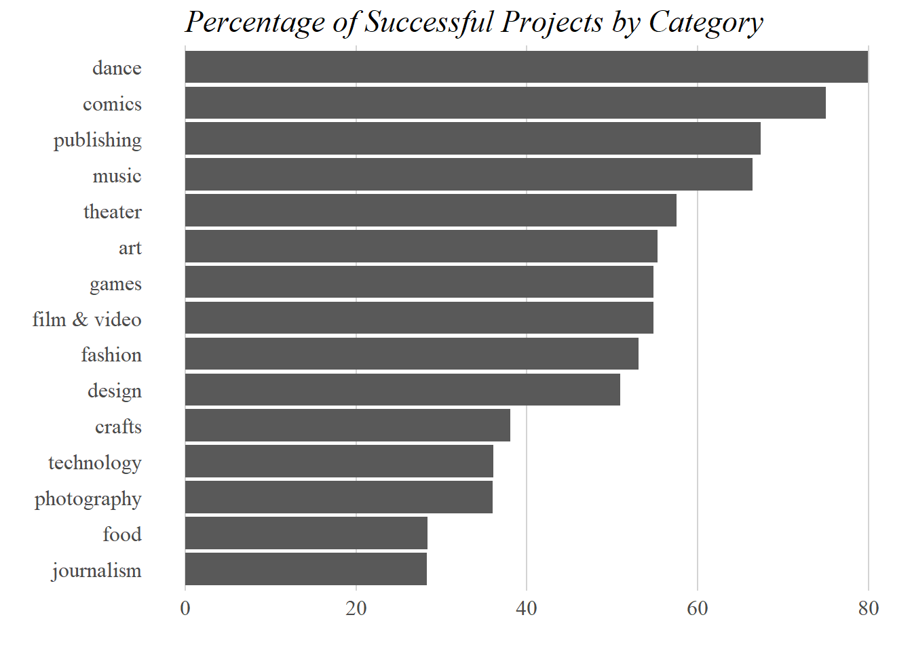<!-- -->

The bar chart shows that the "dance" category has the highest percentage of successfully funded projects.

Next, I decided to look at the average number of backers per category for projects that failed vs projects that were successful.


```r
## calculating 

fail <- best %>%
  filter(sucessflag==1) %>%
  group_by(top_category, state, avebacker) %>%
  summarize() %>%
  ungroup()

## ranking by average number of backers for successful projects

rank <- fail %>%
  filter(state=="successful") %>%
  arrange(avebacker) %>%
  mutate(rank=row_number()) %>%
  group_by(top_category, rank) %>%
  summarize()

## joining averages with ranks

failrank <- left_join(fail, rank, by = "top_category")
```


```r
## slopegraph of average number of backers by category and whether the project was sucessful

bar_2 <- ggplot(failrank, aes(fill=state, y=avebacker, x=reorder(top_category, rank))) +
  geom_bar(position="dodge", stat="identity") +
  theme_tufte() +
  coord_flip() +
  labs(x="", y="", title = "Average Number of Backers by Category") +
  theme(legend.position = "above", 
        axis.text.y = element_text(color="gray29", size=12), 
        axis.text.x = element_text(color="gray29", size=12), 
        plot.title = element_text(size=17, face="italic", hjust=.2, vjust = 1), 
        panel.grid.major.x = element_line(color = "lightgrey"), 
        axis.ticks = element_blank())

bar_2
```

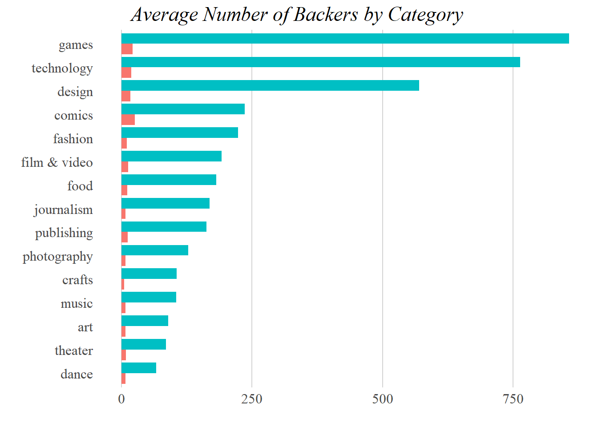<!-- -->

Looking at the average number of backers, it seems that projects related to "games" and "technology" had the highest average number of backers.


#### 2. Writing your success story


##### a) Cleaning the Text and Word Cloud


For this analysis, I chose to take of sample the 1,000 most successful and the 1,000 least projects by the number of backers each project was able to attract.


```r
## taking sample of most and least successful projects

s <- best %>%
  filter(state=="successful") %>%
  arrange(desc(backers_count)) %>%
  mutate(rank=row_number()) %>%
  filter(rank<=1000)

f <- best %>%
  filter(state=="failed") %>%
  arrange(desc(backers_count)) %>%
  mutate(rank=row_number()) %>%
  filter(rank<=1000)

sample <- rbind(s, f)

colnames(sample)[colnames(sample)=="blurb"] <- "text"
colnames(sample)[colnames(sample)=="id"] <- "doc_id"

sample <- sample[,c("doc_id","text", "state", "backers_count", "top_category")]

## getting ride of non-ASCII characters

sample$text <- iconv(sample$text, "latin1", "ASCII", sub="")

sample$doc_id <- as.character(sample$doc_id)
sample$text <- as.character(sample$text)
sample <- as.data.frame(sample, stringsAsFactors = FALSE)
```


```r
## creating the corpus

sample_source <- DataframeSource(sample)
sample_corpus <- VCorpus(sample_source)
meta(sample_corpus, type="local", tag="id") <- sample[,1]

sample_corpus
```

While cleaning the corpus, I focused on removing non-ASCII characters (as there were many encoded symbols in the text) and removing additional words I thought might be common in kickstarter campaigns that were not interesting to the overall analysis.


```r
## Use the cleaning functions introduced in lecture (or write your own in addition) to remove unnecessary words (stop words), syntax, punctuation, numbers, white space etc.

clean_corpus <- function(corpus){
  corpus <- tm_map(corpus, content_transformer(tolower))
  corpus <- tm_map(corpus, content_transformer(replace_abbreviation))
  corpus <- tm_map(corpus, content_transformer(replace_symbol))
  corpus <- tm_map(corpus, removePunctuation)
  corpus <- tm_map(corpus, removeNumbers)
  corpus <- tm_map(corpus, removeWords, c("and", "s", "kickstarter", "kickstarters", "donate", "please", "also", "too", "can", stopwords("en")))
  corpus <- tm_map(corpus, stripWhitespace)
  return(corpus)
}

sample_clean <- clean_corpus(sample_corpus)
```


```r
sample_corpus[[73]]$content

sample_clean[[73]]$content
```


```r
## Stem the words left over and complete the stems. Create a document-term-matrix.

sample_stemmed <- tm_map(sample_clean, stemDocument)

stemCompletion2 <- function(x, dictionary) {
 x <- unlist(strsplit(as.character(x), " "))
 x <- x[x != ""]
 x <- stemCompletion(x, dictionary=dictionary)
 x <- paste(x, sep="", collapse=" ")
 PlainTextDocument(stripWhitespace(x))
}

sample_comp <- lapply(sample_clean, stemCompletion2, 
                     dictionary=sample_clean)

sample_comp <- as.VCorpus(sample_comp)
```


```r
sample_stemmed[[73]]$content

sample_comp[[73]]$content
```


```r
## tidying the data

meta(sample_comp, type="local", tag="id") <- sample[,1]

sample_dtm <- DocumentTermMatrix(sample_comp)  
sample_m <- as.matrix(sample_dtm)

sample_td <- tidy(sample_dtm)
```

Before making a word cloud, I decided to first print out the top ten most frequently used terms overall for projects that were successfully funded:


```r
## Provide a word cloud of the most frequent or important words (your choice which frequency measure you choose) among the most successful projects.

## joining the meta data with the word counts

words <- left_join(sample_td, sample, by = c("document" = "doc_id"))

sucessmost <- words %>%
  filter(state=="successful") %>%
  group_by(term) %>%
  summarize(total = sum(count)) %>%
  mutate(allwords = sum(total)) %>%
  mutate(percent = (total/allwords)*100) %>%
  arrange(desc(percent)) %>%
  mutate(rank=row_number())

head(sucessmost)
```

```
## # A tibble: 6 x 5
##   term   total allwords percent  rank
##   <chr>  <dbl>    <dbl>   <dbl> <int>
## 1 game     156    11577   1.35      1
## 2 new      103    11577   0.890     2
## 3 world     70    11577   0.605     3
## 4 first     63    11577   0.544     4
## 5 help      58    11577   0.501     5
## 6 worlds    44    11577   0.380     6
```

Just by measuring the frequency of the terms that appear in the entire corpus, it seems that the term "game" is the most used. This follows with my original anlysis above, as campaigns falling under the category "games" tend to be the most popularly-backed successful projects.


```r
## making word cloud

set.seed(1)
green <- brewer.pal(9, "BuGn")
green<- green[-(1:3)]

wordcloud(sucessmost$term, sucessmost$percent, 
         max.words = 100, colors = green)
```

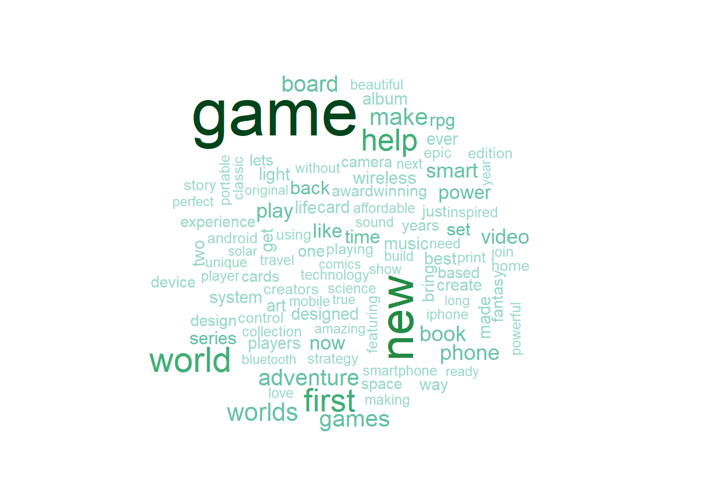<!-- -->

Visualizing the 100 most frequently used terms gives an idea of how often the word "game" is used in successfully funded projects. Additionally, it seems that other terms that may be related to gaming such as "adventure", "rpg", "board", and "video", are also fairly common among successful campaigns.


##### b) Success in words


```r
sample_tdm <- TermDocumentMatrix(sample_comp)
sample_m2 <- as.matrix(sample_tdm)
```


```r
## seperating out sucessful and failed projects (there's gotta be a better way to do this but I just ran out of time)

success_docs <- words %>%
  filter(state=="successful") %>%
  group_by(document) %>%
  summarize()

fail_docs <- words %>%
  filter(state=="failed") %>%
  group_by(document) %>%
  summarize()

success_docs <- success_docs[["document"]]
fail_docs <- fail_docs[["document"]]

success_matrix <- sample_m2[,success_docs]
fail_matrix <- sample_m2[,fail_docs]

suc_words <- rowSums(success_matrix)
fail_words <- rowSums(fail_matrix)
both_words <- cbind(suc_words, fail_words)
```


```r
## finding most common words
common_words <- subset(both_words, both_words[,1] > 0 & both_words[,2] > 0)
difference <- abs(common_words[, 1] - common_words[, 2])
common_words <- cbind(common_words, difference)
common_words <- common_words[order(common_words[, 3], decreasing = TRUE), ]

top25_df <- data.frame(Successful = common_words[1:20, 1], 
                       Failed = common_words[1:20, 2],
                       terms = rownames(common_words[1:20, ]))
top25 <- top25_df
top25 <- top25 %>% gather(Outcome, Frequency, -terms)
top25$Frequency <- ifelse(top25$Outcome=="Successful",
                          top25$Frequency,top25$Frequency*-1)
top25 <- top25[which(top25$terms!="will"),] 
```


```r
## Provide a pyramid plot to show how the words between successful and unsuccessful projects differ in frequency. A selection of 10 - 20 top words is sufficient here.

p_plot <- ggplot(top25_df, aes(x = reorder(terms, Frequency), 
                  y = Frequency, fill = Outcome)) +
  geom_bar(data = filter(top25, Outcome=="Successful"), stat = "identity") +  
  geom_bar(data = filter(top25, Outcome=="Failed"), stat = "identity") + 
  coord_flip() + 
  scale_y_continuous(breaks = seq(-200, 200, 50)) + ylab("") +
  theme_tufte()

p_plot
```

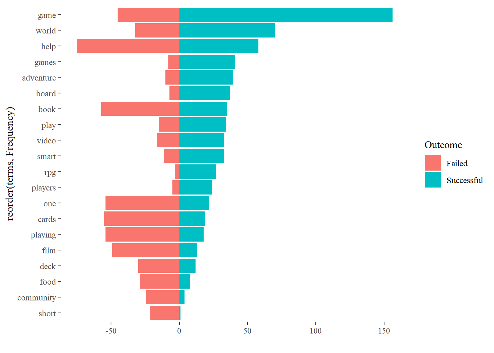<!-- -->

Plotting a pyramid plot again shows that the word "game" very frequently appears in successfully funded campaigns over failed campaigns, as does the word "games". The terms "world" and "adventure" also appear more frequently in successful campaigns, both of which may bear some relation to gaming.


##### c) Simplicity as a virtue


```r
## Calculate a readability measure (Flesh Reading Ease, Flesh Kincaid or any other comparable measure) for the texts. Visualize the relationship between the readability measure and one of the measures of success. Briefly comment on your finding

require(quanteda)
require(dplyr)
sample_corpus2 <- corpus(sample)
FRE_sample <- textstat_readability(sample_corpus2,
              measure=c('Flesch.Kincaid'))
FRE <- data_frame(doc_id = FRE_sample$document, FK = FRE_sample$Flesch.Kincaid)
dataFRE <- left_join(FRE, sample, by = "doc_id")
```


```r
data_read <- dataFRE %>%
  mutate(count = 1) %>%
  group_by(top_category, state) %>%
  mutate(all = sum(count)) %>%
  mutate(allFK = sum(FK)) %>%
  mutate(allback = sum(backers_count)) %>%
  ungroup() %>%
  mutate(aveFK = allFK/all)
```


```r
dot_1 <- ggplot(data=data_read, aes(x=backers_count,y=FK, col=state)) +
  geom_point(alpha=0.5,aes()) + 
  geom_smooth(method="lm", se=FALSE) + 
  guides(size=FALSE) + 
  theme_tufte(10) + xlab("Number of Backers") + ylab("Flesch-Kincaid Grade Level")

dot_1
```

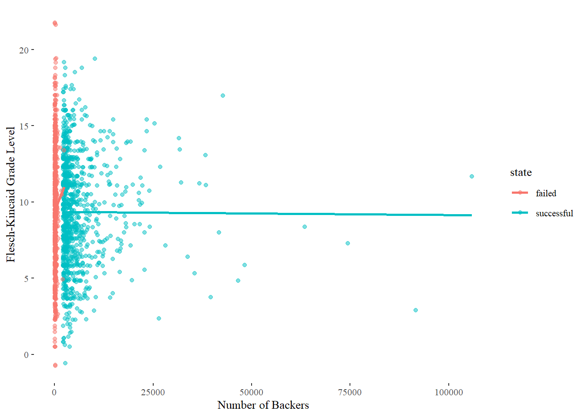<!-- -->

Plotting the Flesch-Kincaid Grade Level for project blurbs against the number of backers does not seem to provide much illumination, as there doesn't appear to be any trends between blurb readability and support.


```r
data_slope <- dataFRE %>%
  mutate(count = 1) %>%
  group_by(top_category, state) %>%
  mutate(all = sum(count)) %>%
  mutate(allFK = sum(FK)) %>%
  mutate(allback = sum(backers_count)) %>%
  ungroup() %>%
  mutate(aveFK = allFK/all) %>%
  group_by(top_category, state, aveFK) %>%
  summarize()
```


```r
slopegraph_1 <- ggplot(data_slope, aes(state, aveFK, group=top_category)) +
  geom_line(aes(color=ifelse(data_slope$top_category=="theater" | data_slope$top_category=="crafts" | top_category=="games" | data_slope$top_category=="fashion" , "up", ""), alpha=1), size = 1.5) +
  geom_point(aes(color = ifelse(data_slope$top_category=="theater" | data_slope$top_category=="crafts" | top_category=="games"| data_slope$top_category=="fashion", "up", ""), alpha=1), size = 3) +
  geom_text(data = data_slope %>% filter(state=="failed"), 
            aes(label = paste0(top_category)), 
            hjust = 1.2,
            color = "gray29",
            size = 3,
            check_overlap = TRUE) +
  scale_color_manual(values=c("cadetblue2", "turquoise4")) +
  scale_x_discrete(limits=c("failed", "successful")) +
  scale_y_continuous(breaks=seq(0, 15, 5)) +
  theme_tufte() +
  labs(x="", y="", title = "Average FK Score by Category and Outcome") +
  theme(legend.position = "none", 
        axis.text.y = element_text(color="gray29", size=12), 
        axis.text.x = element_text(color="gray29", size=12), 
        plot.title = element_text(size=17, face="italic", hjust=.2, vjust = 1), 
        panel.grid.major.x = element_line(color = "lightgrey"), 
        axis.ticks = element_blank())

slopegraph_1
```

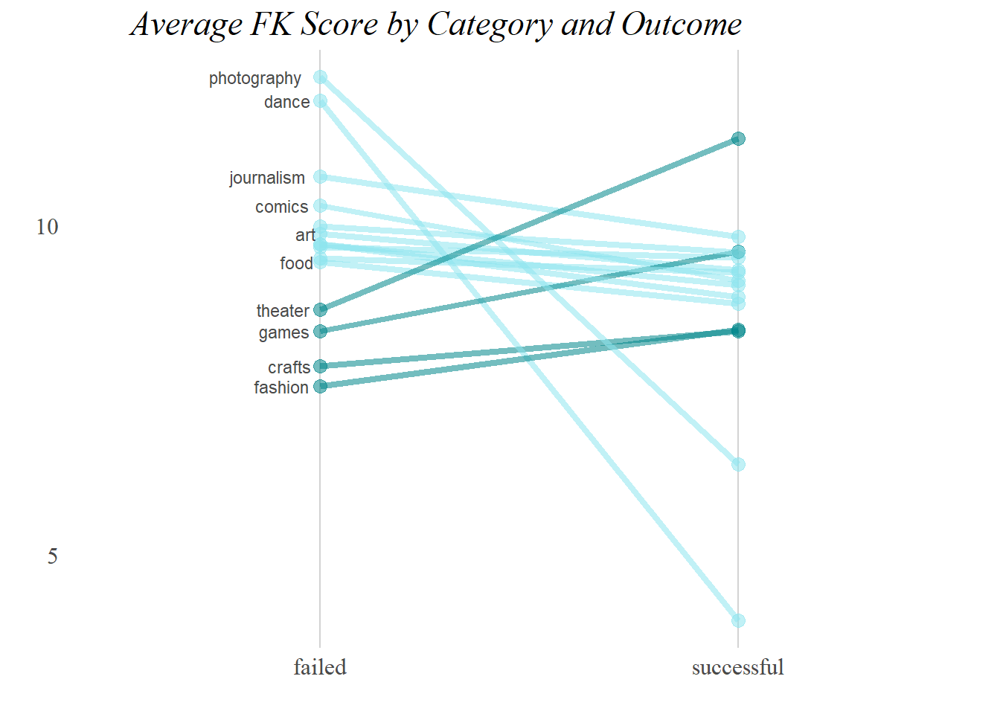<!-- -->

A slopegraph showing the difference between FK scores for failed and successful projects shows that successful projects related to theater, games, crafts, and fashion tend to have higher FK scores than their failed counterparts. Additionally, successfuly funded projects related to photography and dance seem to have a much lower FK score on average than their failed counterparts.


#### 3. Sentiment


##### a) Stay positive


```r
pos <- read.table("C:/Users/pantalaimon/Desktop/DATA VIZ/Assignment 3/positive-words.txt", as.is=T)
neg <- read.table("C:/Users/pantalaimon/Desktop/DATA VIZ/Assignment 3/negative-words.txt", as.is=T)
pos <- as.vector(pos)
neg <- as.vector(neg)
```


```r
## Calculate the tone of each text based on the positive and negative words that are being used. You can rely on the Hu & Liu dictionary provided in lecture or use the Bing dictionary contained in the tidytext package (tidytext::sentiments). Visualize the relationship between tone of the document and success. Briefly comment.
myDict <- dictionary(list(
  positive = pos$V1,
  negative = neg$V1))

sentsample <- dfm(sample_corpus2)
posneg_dfm <- dfm(sentsample, dictionary = myDict)
```


```r
posneg_data <- convert(posneg_dfm, to = "data.frame", docvars = docvars(posneg_dfm))
posneg_data <- posneg_data %>%
  mutate(sum = positive + negative) %>%
  mutate(tone = (positive - negative)/sum)

posneg_data[is.na(posneg_data)] <- 0
posneg_data <- left_join(posneg_data, sample, by = c("document" = "doc_id"))
```


```r
## visualizing the data in a dot plot

dot_2 <- ggplot(data=posneg_data, aes(x=backers_count,y=tone, col=state)) + 
  geom_point(alpha=0.5,aes()) + 
  geom_smooth(method="lm", se=FALSE) + 
  guides(size=FALSE) + 
  theme_tufte(10) + xlab("Number of Backers") + ylab("Tone Rating") +
  labs(title = "Tone of Failed and Successful Projects")

dot_2
```

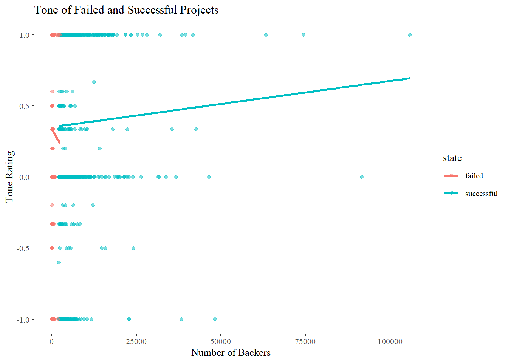<!-- -->

Plotting the tone rating for succesfully funded projects against the total number of backers reveals a slightly positive trend. Here, a tone rating of 1 indicates an entirely positive blurb, while a rating of -1 indicates an entirely negative one ((0) being totally nuetral).


##### b) Positive vs negative


In seperating out negative and positive documents, I decided to interpret nuetral documents (ie blurbs with a tone rating of 0) as negative.


```r
## segregating blurbs and collapsing texts
posdocs <- posneg_data %>%
  filter(tone > 0) %>%
  group_by(document) %>%
  summarize()
negdocs <- posneg_data %>%
  filter(tone <= 0) %>%
  group_by(document) %>%
  summarize()

posdocs_v <- posdocs[["document"]]
negdocs_v <- negdocs[["document"]]

postone_matrix <- sample_m2[,posdocs_v]
negtone_matrix <- sample_m2[,negdocs_v]
```


```r
# Create a document-term-matrix based on this collapsed set of two documents. Generate a comparison cloud showing the most-frequent positive and negative words.

Positive <- rowSums(postone_matrix)
Negative <- rowSums(negtone_matrix)
both_tone <- cbind(Positive, Negative)
```


```r
comparison.cloud(both_tone, colors = c("turquoise4", "brown2"), 
                 scale=c(0.1,2), title.size= 1, 
                 max.words = 60)
```

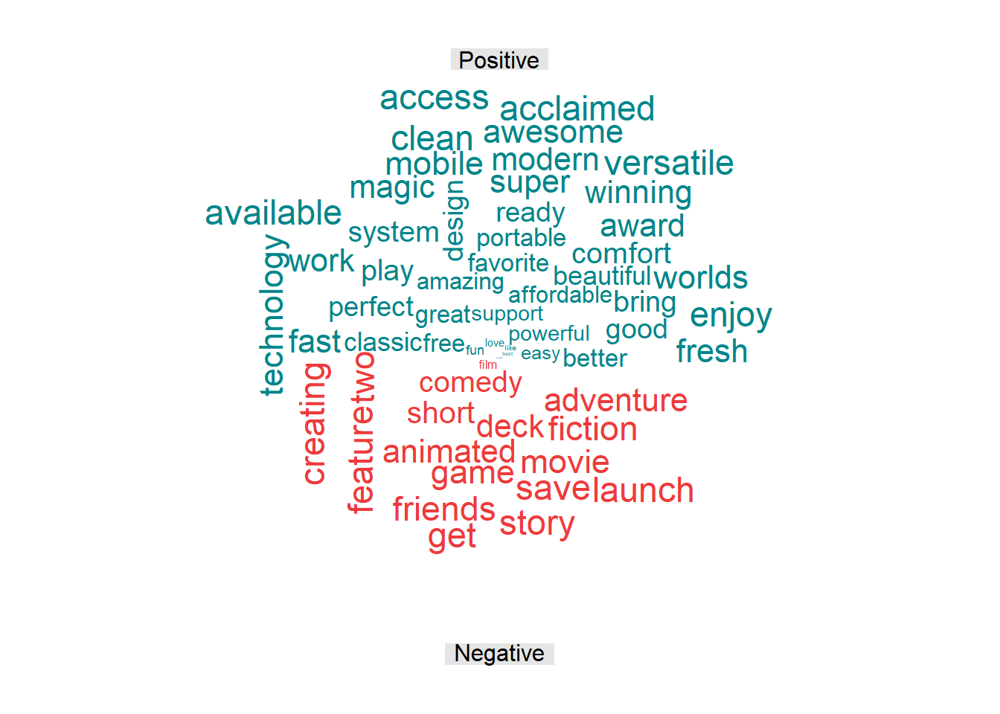<!-- -->

From the comparative cloud, it appears that blurbs with "positive" tones used words like "acclaimed", "awesome", "clean", and "fast" more frequently than blurbs with "negative" tones. Alternatively, blurbs with "negative" tones used words like "launch", "friends", "and "feature" more frequently.


##### c) Get in their mind


Turning now to sentiments, I decided to pick 3 sentiments that I thought would be interesting or relevent to potential backers reading project blurbs online: anticipation, sadness, and joy.


```r
## Now, use the NRC Word-Emotion Association Lexicon in the tidytext package to identify a larger set of emotions (anger, anticipation, disgust, fear, joy, sadness, surprise, trust). Again, visualize the relationship between the use of words from these categories and success. What is your finding?

emotions <- tidytext::sentiments

an <- emotions%>%filter(sentiment=="anger")%>%group_by(word)%>%summarize()
a <- emotions%>%filter(sentiment=="anticipation")%>%group_by(word)%>%summarize()
c <- emotions%>%filter(sentiment=="constraining")%>%group_by(word)%>%summarize()
d <- emotions%>%filter(sentiment=="disgust")%>%group_by(word)%>%summarize()
f <- emotions%>%filter(sentiment=="fear")%>%group_by(word)%>%summarize()
j <- emotions%>%filter(sentiment=="joy")%>%group_by(word)%>%summarize()
l <- emotions%>%filter(sentiment=="litigious")%>%group_by(word)%>%summarize()
n <- emotions%>%filter(sentiment=="negative")%>%group_by(word)%>%summarize()
p <- emotions%>%filter(sentiment=="positive")%>%group_by(word)%>%summarize()
sa <- emotions%>%filter(sentiment=="sadness")%>%group_by(word)%>%summarize()
sup <- emotions%>%filter(sentiment=="superfluous")%>%group_by(word)%>%summarize()
sur <- emotions%>%filter(sentiment=="surprise")%>%group_by(word)%>%summarize()
t <- emotions%>%filter(sentiment=="trust")%>%group_by(word)%>%summarize()
u <- emotions%>%filter(sentiment=="uncertainty")%>%group_by(word)%>%summarize()


emoDict <- dictionary(list(
  anger = an$word,
  anticipation = a$word,
  constraining = c$word,
  disgust = d$word,
  fear = f$word,
  joy = j$word,
  litigious = l$word,
  negative = n$word,
  positive = p$word,
  sadness = sa$word,
  superfluous = sup$word,
  surprise = sur$word,
  trust = t$word,
  uncertainty = u$word))

emosample <- dfm(sample_corpus2)
emo_dfm <- dfm(emosample, dictionary = emoDict)
emo_data <- convert(emo_dfm, to = "data.frame", docvars = docvars(emo_dfm))
sample_emo <- select(sample, doc_id, backers_count, state)
ed <- left_join(emo_data, sample_emo, by = c("document" = "doc_id"))
```


```r
dot_3 <- ggplot(data=ed, aes(x=backers_count,y=anticipation, col=state)) +
  geom_point(alpha=0.5,aes()) + 
  geom_smooth(method="lm", se=FALSE) + 
  guides(size=FALSE) + 
  theme_tufte(10) + xlab("Number of Backers") + ylab("Word Frequency") +
  labs(title = "Frequency of 'Anticipation' Terms, by Document")

dot_3
```

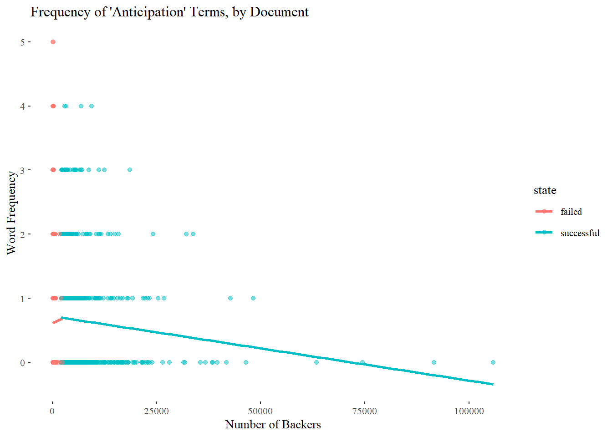<!-- -->

Plotting the frequency of "anticipation" terms across all documents against the number of backers, it seems there is a slightly negative trend. This is somewhat surprising, as I would assume that projects with more terms related to anticipation would seem more exciting to potential backers.


```r
dot_4 <- ggplot(data=ed, aes(x=backers_count,y=sadness, col=state)) +
  geom_point(alpha=0.5,aes()) + 
  geom_smooth(method="lm", se=FALSE) + 
  guides(size=FALSE) + 
  theme_tufte(10) + xlab("Number of Backers") + ylab("Word Frequency") +
  labs(title = "Frequency of Sad Terms, by Document")

dot_4
```

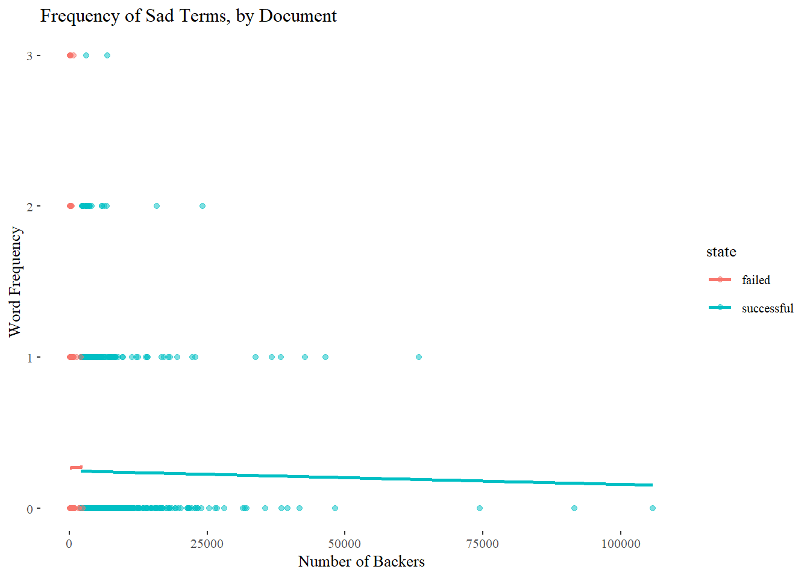<!-- -->

Plotting the frequency of sad terms also shows a slighly negative trend as well, which would be expected. However, the frequency of "sad" terms was relatively low across all projects, with a maximum of about 3 terms appearing in any document.


```r
dot_5 <- ggplot(data=ed, aes(x=backers_count,y=joy, col=state)) +
  geom_point(alpha=0.5,aes()) + 
  geom_smooth(method="lm", se=FALSE) + 
  guides(size=FALSE) + 
  theme_tufte(10) + xlab("Number of Backers") + ylab("Word Frequency") +
  labs(title = "Frequency of Joyful Terms, by Document")

dot_5
```

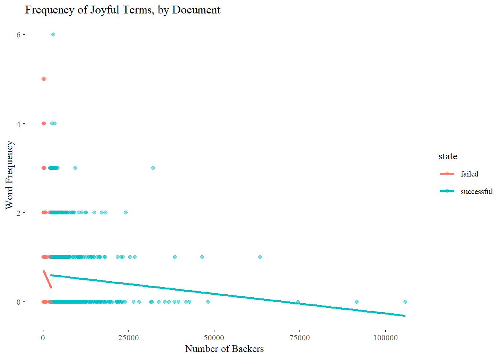<!-- -->

Finally, plotting the frequency of joyful terms also shows a negative trend, which again is surprising. There is also a single successfully funded outlier with a high number of joyfu terms, but apparently did not need to attract many backers to be successful.
