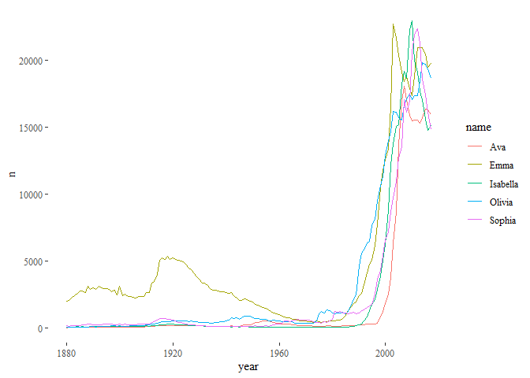
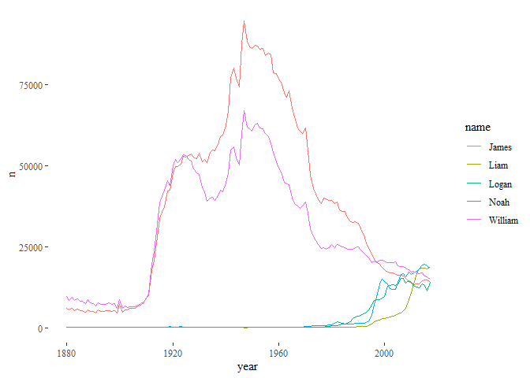
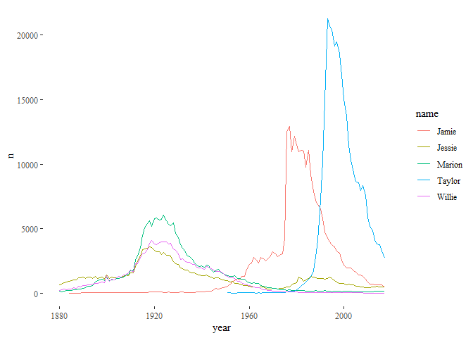
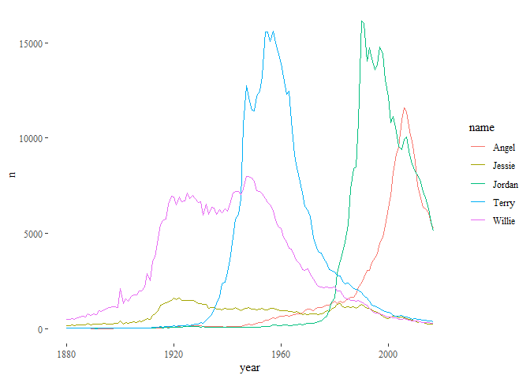
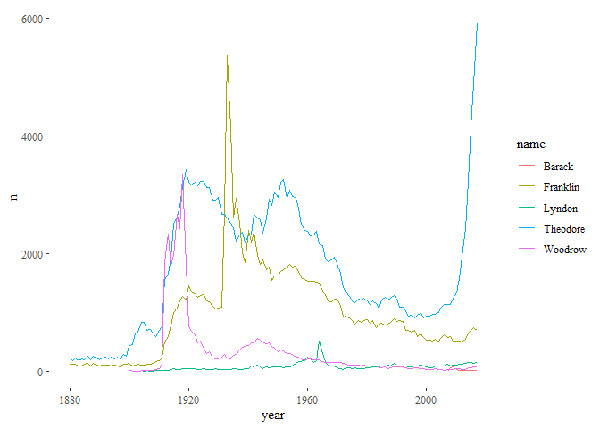
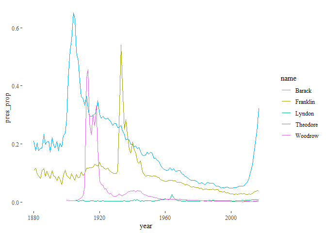

1. Plot the most common names in 2017 over the entire period.
=============================================================

``` r
top10_2017 <- babynames %>%
  filter(year==2017) %>%
  group_by(sex, name) %>%
  summarize(total = sum(n)) %>%
  arrange(desc(total)) %>%
  group_by(sex) %>%
  mutate(rank=row_number()) %>%
  filter(rank<=5)  %>%
  arrange(sex, rank)

top5f <- top10_2017 %>% filter(sex=="F")
top5m <- top10_2017 %>% filter(sex=="M")
```

The top 5 most common female names in 2017 were:

``` r
top5f
```

    ## # A tibble: 5 x 4
    ## # Groups:   sex [1]
    ##   sex   name     total  rank
    ##   <chr> <chr>    <int> <int>
    ## 1 F     Emma     19738     1
    ## 2 F     Olivia   18632     2
    ## 3 F     Ava      15902     3
    ## 4 F     Isabella 15100     4
    ## 5 F     Sophia   14831     5

The top 5 most common male names in 2017 were:

``` r
top5m
```

    ## # A tibble: 5 x 4
    ## # Groups:   sex [1]
    ##   sex   name    total  rank
    ##   <chr> <chr>   <int> <int>
    ## 1 M     Liam    18728     1
    ## 2 M     Noah    18326     2
    ## 3 M     William 14904     3
    ## 4 M     James   14232     4
    ## 5 M     Logan   13974     5

Graph of the most common female and male names in 2017 across the entire period:

``` r
babynames %>%
  filter(sex=='F') %>%
  filter(name %in% top5f$name) %>%
  ggplot(., aes(year, n)) +
  geom_line(aes(color=name, group=name)) +
  theme_tufte()
```



``` r
babynames %>%
  filter(sex=='M') %>%
  filter(name %in% top5m$name) %>%
  ggplot(., aes(year, n)) +
  geom_line(aes(color=name, group=name)) +
  theme_tufte()
```



2. Explore which names are most often used as unisex names. For which names has the popularity over time changed a lot?
=======================================================================================================================

``` r
unisex <- babynames %>%
  group_by(year, name) %>%
  mutate(all_n = sum(n)) %>%
  ungroup() %>%
  mutate(unisex_prop = n / all_n)
```

``` r
unisex$unisex <- ifelse(unisex$unisex_prop>0.2 & unisex$unisex_prop<0.8, 1, 0)
```

``` r
top10_unisex <- unisex %>%
  filter(unisex == 1) %>%
  group_by(sex, name) %>%
  summarize(total = sum(n),
            unisex_prop = mean(unisex_prop)) %>%
  arrange(desc(total)) %>%
  group_by(sex) %>%
  mutate(rank=row_number()) %>%
  filter(rank<=5)  %>%
  arrange(sex, rank)
```

``` r
top5f_unisex <- top10_unisex %>% filter(sex=="F")
top5m_unisex <- top10_unisex %>% filter(sex=="M")
```

The top five most common unisex names (among female babies) were:

``` r
top5f_unisex
```

    ## # A tibble: 5 x 5
    ## # Groups:   sex [1]
    ##   sex   name    total unisex_prop  rank
    ##   <chr> <chr>   <int>       <dbl> <int>
    ## 1 F     Marion 168200       0.608     1
    ## 2 F     Jessie 143636       0.540     2
    ## 3 F     Taylor 128108       0.459     3
    ## 4 F     Willie 124251       0.353     4
    ## 5 F     Jamie  120882       0.661     5

The top five most common unisex names (among male babies) were:

``` r
top5m_unisex
```

    ## # A tibble: 5 x 5
    ## # Groups:   sex [1]
    ##   sex   name    total unisex_prop  rank
    ##   <chr> <chr>   <int>       <dbl> <int>
    ## 1 M     Jordan 263840       0.708     1
    ## 2 M     Willie 252835       0.647     2
    ## 3 M     Terry  171365       0.684     3
    ## 4 M     Angel  114041       0.600     4
    ## 5 M     Jessie 105249       0.460     5

Graphs of the most common unisex names among female and male babies across the entire period

``` r
babynames %>%
  filter(sex=="F") %>%
  filter(name %in% top5f_unisex$name) %>%
  ggplot(., aes(year, n)) +
  geom_line(aes(color=name, group=name)) +
  theme_tufte()
```



``` r
babynames %>%
  filter(sex=="M") %>%
  filter(name %in% top5m_unisex$name) %>%
  ggplot(., aes(year, n)) +
  geom_line(aes(color=name, group=name)) +
  theme_tufte()
```



3. Identify one particular pattern in the data. Then try to capture this one pattern in a graphical display that highlights this one point.
===========================================================================================================================================

I chose to explore whether notable presidents' first names saw a bump in popularity while they were in office. For the purposes of my analysis, I chose to look at the 5 most recent "notable" presidents: Theodore Roosevelt, Woodrow Wilson, Franklin D Roosevelt, Lyndon B. Johnson, and Barack Obama. I chose these presidents because I felt they had

``` r
babynames$presidential_names  <- ifelse((babynames$name=="Theodore") | (babynames$name=="Woodrow") | (babynames$name=="Franklin") | (babynames$name=="Lyndon") | (babynames$name=="Barack"), 1, 0)
```

``` r
presidents <- babynames %>%
  filter(presidential_names=="1") %>%
  filter(sex=="M") %>%
  group_by(year, name)
```

The graph below shows the total number of male babies with the chosen presidential first names across the entire period.

``` r
presidents %>%
  ggplot(., aes(year, n)) +
  geom_line(aes(color=name, group=name)) +
  theme_tufte()
```



Next, I decided to look at the percentage of male babies with presidential first names out of all male babies for each year.

``` r
president_percent <- babynames %>%
  filter(sex=="M") %>%
  group_by(year) %>%
  mutate(total = sum(n)) %>%
  ungroup() %>%
  mutate(pres_prop = (n / total)*100)
```

The graph below shows the percentage of male babies with presidential names across the entire period.

``` r
president_percent %>%
  filter(presidential_names=="1") %>%
  ggplot(., aes(year, pres_prop)) +
  geom_line(aes(color=name, group=name)) +
  theme_tufte()
```


